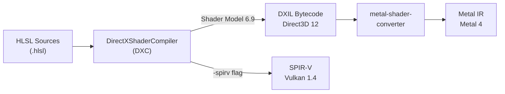
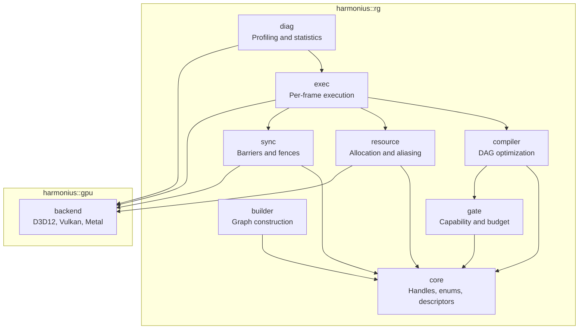
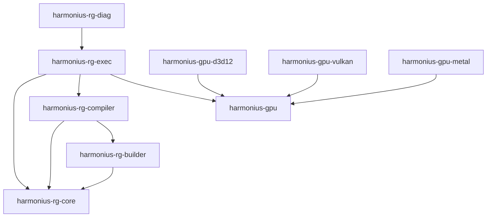
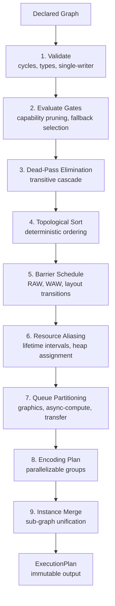
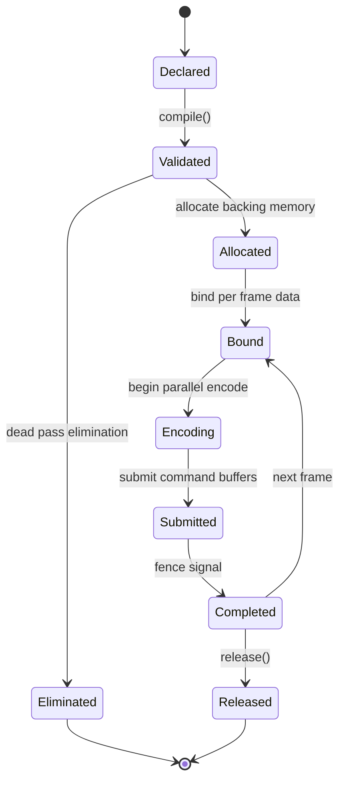
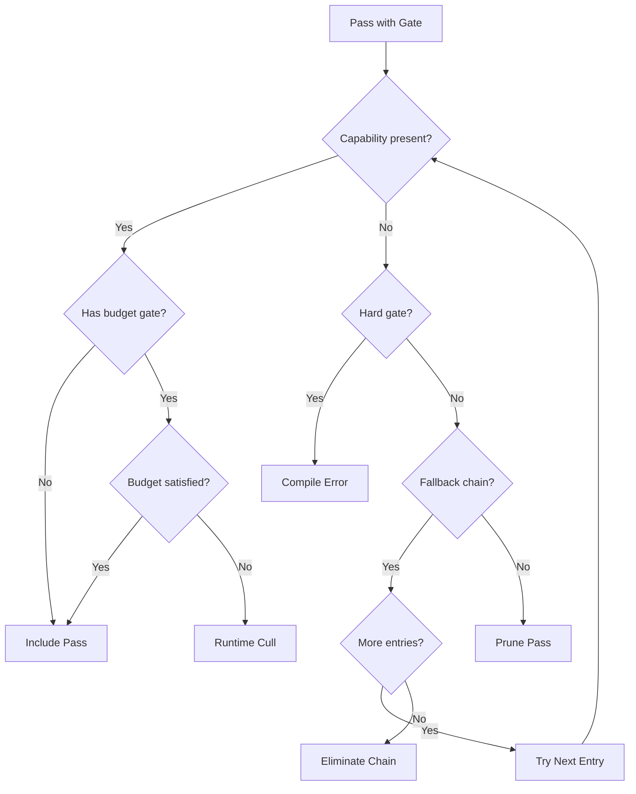
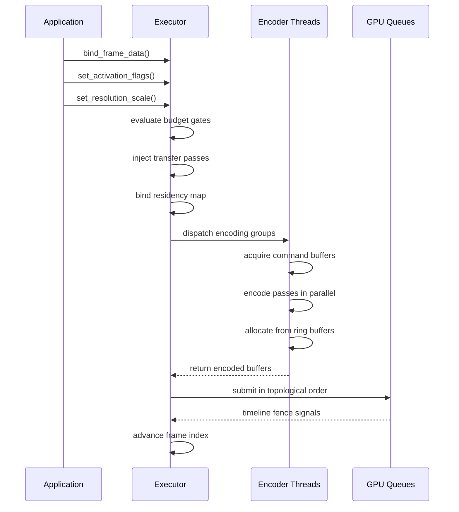

# Render Graph Module Design

Detailed module design for the Harmonius render graph library. Covers module decomposition,
responsibilities, C++26 API surfaces, build system, and shader toolchain. Derived from the 119
requirements in [RG-1 through RG-14](../requirements/6-render-graph/README.md) and the system
architecture in [render-graph-architecture.md](render-graph-architecture.md).

## Contents

- [Render Graph Module Design](#render-graph-module-design)
  - [Contents](#contents)
  - [Build System and Shader Toolchain](#build-system-and-shader-toolchain)
    - [CMake Structure](#cmake-structure)
    - [vcpkg Dependencies](#vcpkg-dependencies)
    - [Shader Compilation Pipeline](#shader-compilation-pipeline)
  - [Module Map](#module-map)
    - [Namespace Layout](#namespace-layout)
    - [Library Targets](#library-targets)
  - [1. Core Types — `harmonius::rg`](#1-core-types--harmoniusrg)
    - [Handles](#handles)
    - [Pass Types](#pass-types)
    - [Access Modes and Usage Types](#access-modes-and-usage-types)
    - [Queue Types](#queue-types)
    - [Resource Categories](#resource-categories)
    - [Resource Binding Descriptor](#resource-binding-descriptor)
    - [Format Enumeration](#format-enumeration)
    - [Error Types](#error-types)
  - [2. Graph Builder — `harmonius::rg::builder`](#2-graph-builder--harmoniusrgbuilder)
    - [GraphBuilder](#graphbuilder)
    - [Pass Descriptor](#pass-descriptor)
    - [Resource Descriptors](#resource-descriptors)
    - [Sub-Graph Descriptors](#sub-graph-descriptors)
    - [Declared Graph](#declared-graph)
  - [3. Graph Compiler — `harmonius::rg::compiler`](#3-graph-compiler--harmoniusrgcompiler)
    - [Compilation Pipeline](#compilation-pipeline)
    - [GraphCompiler API](#graphcompiler-api)
    - [Execution Plan](#execution-plan)
    - [Validation (RG-13.4)](#validation-rg-134)
    - [Recompilation Triggers (RG-13.5)](#recompilation-triggers-rg-135)
  - [4. Resource System — `harmonius::rg::resource`](#4-resource-system--harmoniusrgresource)
    - [Resource Lifecycle](#resource-lifecycle)
    - [Aliasing Solver](#aliasing-solver)
    - [Pool Allocator](#pool-allocator)
    - [Ring Allocator](#ring-allocator)
    - [Residency Tracking](#residency-tracking)
  - [5. Synchronization Engine — `harmonius::rg::sync`](#5-synchronization-engine--harmoniusrgsync)
    - [Barrier Descriptors](#barrier-descriptors)
    - [Barrier Scheduler](#barrier-scheduler)
    - [Timeline Fence Manager](#timeline-fence-manager)
  - [6. Gating System — `harmonius::rg::gate`](#6-gating-system--harmoniusrggate)
    - [Gate Evaluation Flow](#gate-evaluation-flow)
    - [Capability Descriptor](#capability-descriptor)
    - [Gate Descriptors](#gate-descriptors)
    - [Gate Evaluator](#gate-evaluator)
  - [7. Execution Engine — `harmonius::rg::exec`](#7-execution-engine--harmoniusrgexec)
    - [Per-Frame Execution Sequence](#per-frame-execution-sequence)
    - [Executor API](#executor-api)
    - [Pass Context](#pass-context)
    - [Command Buffer Pool](#command-buffer-pool)
    - [Transfer Pass Injection](#transfer-pass-injection)
  - [8. Diagnostics — `harmonius::rg::diag`](#8-diagnostics--harmoniusrgdiag)
    - [Diagnostics API](#diagnostics-api)
  - [9. GPU Backend Abstraction — `harmonius::gpu`](#9-gpu-backend-abstraction--harmoniusgpu)

---

## Build System and Shader Toolchain

### CMake Structure

The project uses CMake 3.30+ with C++26 (`CMAKE_CXX_STANDARD 26`) and vcpkg for dependency
management. Each module is a separate static library target with explicit dependency edges.

```cmake
# Top-level CMakeLists.txt (sketch)
cmake_minimum_required(VERSION 3.30)
project(harmonius LANGUAGES CXX)

set(CMAKE_CXX_STANDARD 26)
set(CMAKE_CXX_STANDARD_REQUIRED ON)
set(CMAKE_CXX_EXTENSIONS OFF)

find_package(VulkanHeaders CONFIG REQUIRED)
find_package(VulkanMemoryAllocator CONFIG REQUIRED)
find_package(directx-headers CONFIG REQUIRED)
find_package(D3D12MemoryAllocator CONFIG REQUIRED)

add_subdirectory(src/rg/core)
add_subdirectory(src/rg/builder)
add_subdirectory(src/rg/compiler)
add_subdirectory(src/rg/exec)
add_subdirectory(src/rg/diag)
add_subdirectory(src/gpu)
add_subdirectory(src/gpu/d3d12)
add_subdirectory(src/gpu/vulkan)
add_subdirectory(src/gpu/metal)
```

### vcpkg Dependencies

```json
{
  "name": "harmonius",
  "version-semver": "0.1.0",
  "dependencies": [
    "vulkan-headers",
    "vulkan-memory-allocator",
    "directx-headers",
    "d3d12-memory-allocator",
    "directx-shader-compiler"
  ]
}
```

Platform-specific dependencies:
- **Windows:** `directx-headers`, `d3d12-memory-allocator`, Agility SDK (vendored)
- **Linux/SteamOS:** `vulkan-headers`, `vulkan-memory-allocator`
- **macOS:** Metal framework (system), `metal-shaderconverter` (vendored SDK)

### Shader Compilation Pipeline

All shaders are authored in HLSL and compiled via DirectXShaderCompiler (DXC) to all backend
targets. Metal support uses `metal-shaderconverter` to convert DXIL bytecode to Metal IR.



CMake integrates shader compilation as a custom build step:

```cmake
# Shader compilation targets (sketch)
function(harmonius_compile_shaders TARGET)
    foreach(SHADER ${ARGN})
        get_filename_component(NAME ${SHADER} NAME_WE)

        # DXIL output (D3D12)
        add_custom_command(OUTPUT ${NAME}.dxil
            COMMAND dxc -T cs_6_9 -Fo ${NAME}.dxil ${SHADER}
            DEPENDS ${SHADER})

        # SPIR-V output (Vulkan)
        add_custom_command(OUTPUT ${NAME}.spv
            COMMAND dxc -T cs_6_9 -spirv
                -fspv-target-env=vulkan1.3 -Fo ${NAME}.spv ${SHADER}
            DEPENDS ${SHADER})

        # Metal IR output (Metal)
        add_custom_command(OUTPUT ${NAME}.metallib
            COMMAND dxc -T cs_6_9 -Fo ${NAME}.dxil ${SHADER}
            COMMAND metal-shaderconverter ${NAME}.dxil -o ${NAME}.metallib
            DEPENDS ${SHADER})
    endforeach()
endfunction()
```

---

## Module Map

### Namespace Layout

All render graph types live under `harmonius::rg`. The GPU backend abstraction lives under
`harmonius::gpu`. Modules correspond 1:1 with the architecture's seven subsystems.

| Namespace                 | Architecture subsystem | Purpose                                      |
| ------------------------- | ---------------------- | -------------------------------------------- |
| `harmonius::rg`           | Core types             | Handles, enums, descriptors shared by all    |
| `harmonius::rg::builder`  | Graph Builder          | Declarative graph construction API           |
| `harmonius::rg::compiler` | Graph Compiler         | DAG validation, optimization, plan output    |
| `harmonius::rg::resource` | Resource System        | Allocation, aliasing, pools, ring buffers    |
| `harmonius::rg::sync`     | Synchronization Engine | Barriers, layout transitions, fences         |
| `harmonius::rg::gate`     | Gating System          | Capability gates, budget gates, fallbacks    |
| `harmonius::rg::exec`     | Execution Engine       | Per-frame binding, parallel encoding, submit |
| `harmonius::rg::diag`     | Diagnostics            | Timestamps, statistics, memory metrics       |
| `harmonius::gpu`          | Backend Abstraction    | D3D12, Vulkan 1.4, Metal 4 device layer      |



### Library Targets

Each module compiles to a static library. The GPU backend is selected at build time via CMake
and statically linked — only one backend exists per binary (see
[gpu-backend-interface.md](gpu-backend-interface.md) for rationale).



---

## 1. Core Types — `harmonius::rg`

Shared vocabulary types used by every module. No business logic — only type definitions, enums,
and strongly-typed handles.

**Requirements:** Provides the type foundation for all 119 render graph requirements.

### Handles

Strongly-typed opaque handles prevent accidental misuse. All handles are 32-bit indices into
dense registries.

```cpp
namespace harmonius::rg {

// Strongly-typed handles — distinct types prevent misuse at compile time
enum class PassHandle       : uint32_t { invalid = UINT32_MAX };
enum class ResourceHandle   : uint32_t { invalid = UINT32_MAX };
enum class SubGraphHandle   : uint32_t { invalid = UINT32_MAX };
enum class GateHandle       : uint32_t { invalid = UINT32_MAX };
enum class ChainHandle      : uint32_t { invalid = UINT32_MAX };
enum class VariantSlotHandle: uint32_t { invalid = UINT32_MAX };

} // namespace harmonius::rg
```

### Pass Types

Drawn from RG-1.1, RG-1.7, RG-1.13, RG-1.14. Exhaustive — no extensibility needed.

```cpp
namespace harmonius::rg {

enum class PassType : uint8_t {
    rasterization,
    compute,
    ray_tracing_dispatch,
    acceleration_structure_build,
    transfer,
    msaa_resolve,
    present,
    host_callback,           // RG-1.7: CPU-only, no GPU commands
    work_graph,              // RG-1.13: GPU self-scheduled
    checkerboard_resolve,    // RG-1.14: half-res reconstruction
};

} // namespace harmonius::rg
```

### Access Modes and Usage Types

```cpp
namespace harmonius::rg {

enum class AccessMode : uint8_t {
    read,
    write,
    read_write,
};

enum class UsageType : uint8_t {
    color_attachment,
    depth_attachment,
    shader_read,
    storage_read,
    storage_write,
    shading_rate_attachment,   // RG-2.12
    indirect_argument,         // RG-2.13
    acceleration_structure_read,
    acceleration_structure_build_write,
    transfer_src,
    transfer_dst,
    present,
};

} // namespace harmonius::rg
```

### Queue Types

```cpp
namespace harmonius::rg {

enum class QueueAffinity : uint8_t {
    graphics,
    async_compute,    // RG-4.2
    transfer,         // RG-4.3
    any,              // defaults to graphics (RG-4.1)
};

} // namespace harmonius::rg
```

### Resource Categories

```cpp
namespace harmonius::rg {

enum class ResourceCategory : uint8_t {
    transient,           // RG-2.1: single-frame, aliasable
    persistent,          // RG-2.2: cross-frame, stable allocation
    imported,            // RG-2.3: external allocation
    history,             // RG-2.4: ping-pong double-buffer
    multi_frame_history, // RG-2.24: N-way rotation
    sparse,              // RG-2.9: tile-granularity residency
    pool_backed,         // RG-2.8: fixed-capacity pool
    staging,             // RG-2.10: ring-managed host-visible
    atlas,               // RG-2.17: power-of-two tile slots
    acceleration_structure, // RG-2.18: AS with build/read states
};

} // namespace harmonius::rg
```

### Resource Binding Descriptor

The fundamental unit of pass I/O declaration (RG-1.1).

```cpp
namespace harmonius::rg {

struct ResourceBinding {
    ResourceHandle resource;
    AccessMode     access;
    UsageType      usage;
    uint32_t       array_layer  = 0; // RG-1.5: specific layer target
    uint32_t       mip_level    = 0; // RG-2.22: specific mip target
    bool           is_history   = false; // reading previous frame
};

} // namespace harmonius::rg
```

### Format and Sample Count

`Format` and `SampleCount` are defined canonically in `harmonius::gpu` (see
[gpu-backend-interface.md](gpu-backend-interface.md#format-mapping)) and re-exported into
`harmonius::rg`:

```cpp
namespace harmonius::rg {

// Re-exported from harmonius::gpu — single canonical definition
using gpu::Format;
using gpu::SampleCount;

} // namespace harmonius::rg
```

### Error Types

```cpp
namespace harmonius::rg {

enum class ValidationErrorKind : uint8_t {
    cycle_detected,            // RG-5.7
    type_mismatch,             // RG-13.4
    undeclared_resource,       // RG-13.4
    queue_incompatibility,     // RG-13.4
    single_writer_violation,   // RG-3.5
    variant_ambiguity,         // RG-13.7
    instance_count_mismatch,   // RG-13.8
    hard_gate_unsatisfied,     // RG-6.2
};

struct ValidationError {
    ValidationErrorKind kind;
    PassHandle          pass;             // pass involved
    ResourceHandle      resource;         // resource involved (if applicable)
    std::string         message;
};

struct CompileError {
    std::vector<ValidationError> errors;
};

} // namespace harmonius::rg
```

---

## 2. Graph Builder — `harmonius::rg::builder`

**Responsibility:** Constructs the declarative graph topology. All rendering features are
expressed through this interface without the graph knowing what they represent
(architecture: rendering-agnostic principle).

**Requirements covered:** RG-1.1 through RG-1.14, RG-2.1 through RG-2.25.

### GraphBuilder

The primary entry point for declaring the graph topology. Returns a `DeclaredGraph` on success.

```cpp
namespace harmonius::rg::builder {

class GraphBuilder {
public:
    explicit GraphBuilder(const gate::CapabilityDescriptor& caps);

    // --- Pass declaration (RG-1.1, RG-1.2) ---
    PassHandle add_pass(PassDescriptor desc);

    // --- Pass chains (RG-1.3) ---
    ChainHandle begin_chain(std::string_view name);
    PassHandle  add_chain_step(ChainHandle chain, PassDescriptor desc);
    void        end_chain(ChainHandle chain);

    // --- Variant dispatch (RG-1.4) ---
    VariantSlotHandle declare_variant_slot(std::string_view name);
    PassHandle add_variant(VariantSlotHandle slot,
                           std::string_view variant_name,
                           PassDescriptor desc);

    // --- Sub-graph templates (RG-1.5, RG-9.1) ---
    SubGraphHandle declare_subgraph_template(std::string_view name,
                                             SubGraphDescriptor desc);
    void instantiate_subgraph(SubGraphHandle tpl,
                              uint32_t instance_count,
                              std::span<const SubGraphBindings> bindings);

    // --- Resource declaration (RG-2.1–2.25) ---
    ResourceHandle declare_transient(TransientResourceDesc desc);
    ResourceHandle declare_persistent(PersistentResourceDesc desc);
    ResourceHandle declare_imported(ImportedResourceDesc desc);
    ResourceHandle declare_history(HistoryResourceDesc desc);
    ResourceHandle declare_multi_frame_history(MultiFrameHistoryDesc desc);
    ResourceHandle declare_sparse(SparseResourceDesc desc);
    ResourceHandle declare_pool(PoolResourceDesc desc);
    ResourceHandle declare_staging(StagingBufferDesc desc);
    ResourceHandle declare_atlas(AtlasResourceDesc desc);
    ResourceHandle declare_acceleration_structure(AccelStructDesc desc);

    // --- Gates (RG-6.1–6.7) ---
    GateHandle attach_capability_gate(PassHandle pass, gate::CapabilityGateDesc desc);
    GateHandle attach_budget_gate(PassHandle pass, gate::BudgetGateDesc desc);
    GateHandle declare_fallback_chain(std::string_view name,
                                      std::span<const gate::FallbackEntry> entries);

    // --- Ordering constraints (RG-5.3) ---
    void add_ordering_edge(PassHandle before, PassHandle after);

    // --- Diagnostics attachment (RG-12.1–12.7) ---
    void attach_timestamp_query(PassHandle pass, std::string_view name);
    void attach_statistics_query(PassHandle pass, std::string_view name);
    void mark_debug_overlay(PassHandle pass); // RG-12.6

    // --- Build ---
    [[nodiscard]]
    std::expected<DeclaredGraph, CompileError> build();
};

} // namespace harmonius::rg::builder
```

### Pass Descriptor

```cpp
namespace harmonius::rg::builder {

struct PassDescriptor {
    std::string_view              name;              // RG-1.8: stable debug name
    PassType                      type;              // RG-1.1
    QueueAffinity                 queue = QueueAffinity::any; // RG-4.1
    std::vector<ResourceBinding>  inputs;            // read bindings
    std::vector<ResourceBinding>  outputs;           // write bindings
    bool                          conditional = false; // RG-1.6
    std::optional<RenderArea>     render_area;       // RG-1.9
    std::vector<std::string_view> tags;              // RG-1.8: optional tags

    // Cost/priority for budget culling (RG-7.2)
    float    estimated_cost_ms = 0.0f;
    uint32_t priority          = 0;

    // Execute callback — type-erased, invoked during encoding
    // For host_callback passes (RG-1.7), this runs on CPU after predecessor fence
    std::move_only_function<void(exec::PassContext&) const> execute;
};

struct RenderArea {
    uint32_t x      = 0;
    uint32_t y      = 0;
    uint32_t width  = 0;
    uint32_t height = 0;
    bool     is_per_frame_binding = false; // resolved at bind time
};

} // namespace harmonius::rg::builder
```

### Resource Descriptors

```cpp
namespace harmonius::rg::builder {

struct TransientResourceDesc {
    std::string_view name;
    Format           format;
    uint32_t         width;
    uint32_t         height;
    uint32_t         depth       = 1;
    uint32_t         mip_levels  = 1; // RG-2.22
    uint32_t         array_layers = 1; // RG-2.6
    SampleCount      samples     = SampleCount::x1; // RG-2.21

    // RG-2.5: resolution-scaled dimensions
    std::optional<std::string_view> resolution_param;
};

struct PersistentResourceDesc {
    std::string_view name;
    Format           format;
    uint32_t         width;
    uint32_t         height;
    uint32_t         depth       = 1;
    uint32_t         array_layers = 1;

    // RG-2.23: fixed capacity with runtime active extent
    std::optional<ActiveExtentDesc> active_extent;
};

struct HistoryResourceDesc {
    std::string_view name;
    Format           format;
    uint32_t         width;
    uint32_t         height;

    // RG-2.5: resolution-scaled
    std::optional<std::string_view> resolution_param;
};

struct MultiFrameHistoryDesc {
    std::string_view name;
    Format           format;
    uint32_t         width;
    uint32_t         height;
    uint32_t         history_depth; // RG-2.24: N >= 2

    std::optional<std::string_view> resolution_param;
};

struct ImportedResourceDesc {
    std::string_view    name;
    gpu::ResourceHandle external_handle; // opaque backend handle
    AccessMode          initial_access;  // RG-2.3: explicit initial state
    UsageType           initial_usage;
};

struct SparseResourceDesc {
    std::string_view name;
    Format           format;
    uint32_t         width;
    uint32_t         height;
    uint32_t         tile_width;  // RG-2.9: tile granularity
    uint32_t         tile_height;
};

struct PoolResourceDesc {
    std::string_view name;
    Format           format;
    uint32_t         element_width;
    uint32_t         element_height;
    uint32_t         max_elements; // RG-2.8: fixed capacity

    // RG-11.5: eviction callback
    std::move_only_function<
        std::vector<uint32_t>(uint32_t pool_id, uint32_t needed) const> eviction_callback;
};

struct StagingBufferDesc {
    std::string_view name;
    uint64_t         size_bytes;  // RG-2.10
};

struct AtlasResourceDesc {
    std::string_view name;
    Format           format;
    uint32_t         width;
    uint32_t         height;
    uint32_t         tile_size;   // RG-2.17: power-of-two
};

struct AccelStructDesc {
    std::string_view name;
    ResourceCategory category; // persistent or transient (scratch)
    bool             has_opacity_micromap = false; // RG-2.25
};

struct ActiveExtentDesc {
    uint32_t max_layers;
    uint32_t max_width;
    uint32_t max_height;
};

} // namespace harmonius::rg::builder
```

### Sub-Graph Descriptors

```cpp
namespace harmonius::rg::builder {

// RG-9.1: parameterized sub-graph template
struct SubGraphDescriptor {
    std::string_view                name;
    uint32_t                        max_instances; // RG-1.11: compile-time max
    std::vector<PassDescriptor>     passes;
    std::vector<SubGraphParamSlot>  param_slots;   // typed parameter declarations
};

struct SubGraphParamSlot {
    std::string_view name;
    bool             is_shared; // RG-9.3 (true) vs RG-9.2 (false)
};

// Per-instance bindings provided at instantiation
struct SubGraphBindings {
    std::vector<ResourceHandle> exclusive_resources; // RG-9.2
    std::vector<ResourceHandle> shared_resources;    // RG-9.3
    uint32_t                    target_array_layer;  // RG-9.4
};

} // namespace harmonius::rg::builder
```

### Declared Graph

The immutable output of the builder, consumed by the compiler.

```cpp
namespace harmonius::rg::builder {

class DeclaredGraph {
public:
    [[nodiscard]] std::span<const PassDescriptor> passes() const;
    [[nodiscard]] uint32_t pass_count() const;
    [[nodiscard]] uint32_t resource_count() const;

    // Internal — used by compiler
    friend class compiler::GraphCompiler;
private:
    struct Impl;
    std::unique_ptr<Impl> impl_;
};

} // namespace harmonius::rg::builder
```

---

## 3. Graph Compiler — `harmonius::rg::compiler`

**Responsibility:** Transforms the declared DAG into an optimized, immutable `ExecutionPlan`.
This is the most complex subsystem, performing validation, gate evaluation, dead-pass
elimination, topological sort, barrier scheduling, aliasing assignment, queue partitioning,
encoding dependency analysis, and multi-instance merging.

**Requirements covered:** RG-13.1 through RG-13.8, RG-5.1, RG-5.6, RG-5.7.

### Compilation Pipeline

The compiler runs nine sequential stages:



### GraphCompiler API

```cpp
namespace harmonius::rg::compiler {

struct CompileOptions {
    // RG-13.5: variant selection triggers recompile
    std::unordered_map<VariantSlotHandle, std::string_view> variant_selections;

    // RG-12.7: opt-out diagnostics at compile time
    bool enable_timestamp_queries   = true;
    bool enable_statistics_queries  = true;
    bool enable_debug_overlays      = true;
};

class GraphCompiler {
public:
    // Full compilation (RG-13.1)
    [[nodiscard]]
    std::expected<ExecutionPlan, CompileError> compile(
        const builder::DeclaredGraph& graph,
        const gate::CapabilityDescriptor& caps,
        const CompileOptions& options = {}
    );

    // Incremental recompilation for residency changes (RG-13.6)
    [[nodiscard]]
    std::expected<ExecutionPlan, CompileError> recompile_residency(
        const ExecutionPlan& existing_plan,
        std::span<const resource::ResidencyChange> changes
    );
};

} // namespace harmonius::rg::compiler
```

### Execution Plan

The immutable output of compilation, consumed by the execution engine every frame.

```cpp
namespace harmonius::rg::compiler {

class ExecutionPlan {
public:
    // Sorted pass list with barrier insertion points
    [[nodiscard]] std::span<const ScheduledPass> passes() const;

    // Per-queue command lists
    [[nodiscard]] std::span<const QueueSubmission> queue_submissions() const;

    // Encoding dependency graph — which groups can encode in parallel
    [[nodiscard]] std::span<const EncodingGroup> encoding_groups() const;

    // Resource aliasing map — transient resources sharing heap ranges
    [[nodiscard]] const resource::AliasingMap& aliasing_map() const;

    // Fence coordination points between queues
    [[nodiscard]] std::span<const FenceCoordination> fence_points() const;

    // Transfer pass injection point index (RG-14.7)
    [[nodiscard]] uint32_t transfer_injection_index() const;

    // Active pass count (after gate evaluation and dead-pass elimination)
    [[nodiscard]] uint32_t active_pass_count() const;

    // Per-pass conditional activation slots (RG-14.5)
    [[nodiscard]] std::span<const PassHandle> conditional_passes() const;

    // Resolution parameter slots (RG-2.20)
    [[nodiscard]] std::span<const ResolutionParam> resolution_params() const;

    friend class exec::Executor;
private:
    struct Impl;
    std::unique_ptr<Impl> impl_;
};

struct ScheduledPass {
    PassHandle            handle;
    uint32_t              execution_order;
    QueueAffinity         queue;
    std::span<const sync::BarrierDesc> pre_barriers;  // barriers before this pass
    std::span<const sync::BarrierDesc> post_barriers; // barriers after this pass
    uint32_t              encoding_group;
    bool                  is_conditional;
};

struct EncodingGroup {
    uint32_t                        group_id;
    std::vector<PassHandle>         passes;   // passes in this group
    bool                            parallel; // can encode concurrently
};

struct QueueSubmission {
    QueueAffinity               queue;
    std::vector<PassHandle>     passes;
    std::vector<FenceCoordination> fence_ops;
};

struct FenceCoordination {
    QueueAffinity source_queue;
    QueueAffinity dest_queue;
    uint64_t      signal_value;
    uint64_t      wait_value;
};

struct ResolutionParam {
    std::string_view name;
    float            default_scale = 1.0f;
    float            min_scale     = 0.25f;
    float            max_scale     = 1.0f;
};

} // namespace harmonius::rg::compiler
```

### Validation (RG-13.4)

```cpp
namespace harmonius::rg::compiler {

// Internal validation checks performed in stage 1
// Returns a list of errors; empty list means valid
std::vector<ValidationError> validate(const builder::DeclaredGraph& graph);

} // namespace harmonius::rg::compiler
```

The validator checks:

| Check                   | Error kind                | Source  |
| ----------------------- | ------------------------- | ------- |
| Cycle detection         | `cycle_detected`          | RG-5.7  |
| Type mismatch           | `type_mismatch`           | RG-13.4 |
| Undeclared resource     | `undeclared_resource`     | RG-13.4 |
| Queue incompatibility   | `queue_incompatibility`   | RG-13.4 |
| Single-writer violation | `single_writer_violation` | RG-3.5  |
| Variant ambiguity       | `variant_ambiguity`       | RG-13.7 |
| Instance count mismatch | `instance_count_mismatch` | RG-13.8 |
| Hard gate unsatisfied   | `hard_gate_unsatisfied`   | RG-6.2  |

### Recompilation Triggers (RG-13.5)

| Change type                                    | Triggers recompile? |
| ---------------------------------------------- | ------------------- |
| Pass topology (add/remove passes)              | Yes                 |
| Variant selection (AA, lighting, quality tier) | Yes                 |
| Capability set change                          | Yes                 |
| Residency state change                         | Partial (RG-13.6)   |
| Per-frame constants, enable flags, resolution  | No                  |
| Buffer/texture handles                         | No                  |

---

## 4. Resource System — `harmonius::rg::resource`

**Responsibility:** Manages GPU resource declarations, lifetime computation, aliasing
assignment, pool allocation, and ring buffer management.

**Requirements covered:** RG-2.1–2.25, RG-8.1–8.6.

### Resource Lifecycle



### Aliasing Solver

Computes lifetime intervals and assigns aliased heap slots for transient resources (RG-8.1–8.5).

```cpp
namespace harmonius::rg::resource {

struct LifetimeInterval {
    ResourceHandle resource;
    uint32_t       first_write; // execution step index
    uint32_t       last_read;   // execution step index
};

struct AliasingAssignment {
    ResourceHandle resource;
    uint32_t       heap_offset;
    uint32_t       heap_size;
    uint32_t       heap_index; // which heap (same-type constraint, RG-8.5)
};

class AliasingMap {
public:
    [[nodiscard]] std::span<const AliasingAssignment> assignments() const;
    [[nodiscard]] uint64_t peak_memory_bytes() const;
    [[nodiscard]] uint64_t total_logical_bytes() const;
    [[nodiscard]] float    aliasing_efficiency() const; // RG-8.6: ratio
};

class AliasingSolver {
public:
    // Compute optimal aliasing from lifetime intervals
    [[nodiscard]]
    AliasingMap solve(
        std::span<const LifetimeInterval> intervals,
        std::span<const ResourceSizeInfo> sizes
    );
};

struct ResourceSizeInfo {
    ResourceHandle resource;
    uint64_t       size_bytes;
    gpu::HeapType  heap_type; // RG-8.5: same-type constraint
};

} // namespace harmonius::rg::resource
```

### Pool Allocator

Fixed-capacity resource pools with eviction (RG-2.8, RG-8.3).

```cpp
namespace harmonius::rg::resource {

class PoolAllocator {
public:
    explicit PoolAllocator(const builder::PoolResourceDesc& desc,
                           gpu::Device& device);

    // Allocate element from pool, invoking eviction if full (RG-11.5)
    [[nodiscard]]
    std::expected<gpu::ResourceHandle, PoolError> allocate();

    // Release element back to pool
    void release(gpu::ResourceHandle handle);

    // RG-7.5: utilization ratio for budget gating
    [[nodiscard]] float utilization() const;

    [[nodiscard]] uint32_t capacity() const;
    [[nodiscard]] uint32_t active_count() const;
};

} // namespace harmonius::rg::resource
```

### Ring Allocator

Lock-free ring buffer for per-frame transient allocations (RG-10.5, RG-8.4).

```cpp
namespace harmonius::rg::resource {

class RingAllocator {
public:
    // Pre-allocate ring with frame_count slots (typically 3 for triple buffering)
    explicit RingAllocator(uint64_t slot_size_bytes,
                           uint32_t frame_count,
                           gpu::Device& device);

    // Lock-free allocation from current frame's slot
    // Returns {offset, mapped_ptr} — no heap allocation (R-3.1.8)
    struct Allocation {
        uint64_t offset;
        void*    mapped_ptr;
    };

    [[nodiscard]] std::optional<Allocation> allocate(uint64_t size, uint64_t alignment);

    // Advance to next frame's slot (called after fence signal)
    void advance_frame(uint32_t frame_index);

    // Underlying GPU buffer for binding
    [[nodiscard]] gpu::ResourceHandle buffer() const;
};

} // namespace harmonius::rg::resource
```

### Residency Tracking

```cpp
namespace harmonius::rg::resource {

// RG-11.3: structured buffer of per-tile residency state
struct ResidencyEntry {
    uint32_t tile_x;
    uint32_t tile_y;
    uint8_t  resident; // 0 = not resident, 1 = resident
};

// RG-13.6: incremental recompilation input
struct ResidencyChange {
    ResourceHandle resource;
    uint32_t       tile_x;
    uint32_t       tile_y;
    bool           now_resident;
};

} // namespace harmonius::rg::resource
```

---

## 5. Synchronization Engine — `harmonius::rg::sync`

**Responsibility:** Derives all synchronization from declared pass I/O. No manual barriers.
Computes RAW barriers, WAW barriers, layout transitions, cross-queue ownership transfers,
barrier merging, and split barriers.

**Requirements covered:** RG-3.1–3.6, RG-10.6.

### Barrier Descriptors

```cpp
namespace harmonius::rg::sync {

enum class BarrierType : uint8_t {
    memory,            // RAW or WAW (RG-3.1, RG-3.2)
    layout_transition, // image layout change (RG-3.3)
    ownership_release, // cross-queue release (RG-3.4)
    ownership_acquire, // cross-queue acquire (RG-3.4)
    aliasing,          // aliasing barrier for shared heap
};

struct BarrierDesc {
    BarrierType    type;
    ResourceHandle resource;
    UsageType      src_usage;
    UsageType      dst_usage;
    QueueAffinity  src_queue;
    QueueAffinity  dst_queue;

    // Sub-resource targeting
    uint32_t       mip_level    = 0;
    uint32_t       array_layer  = 0;
    uint32_t       mip_count    = 1;
    uint32_t       layer_count  = 1;

    // Split barrier support (RG-3.6)
    bool           is_split_begin = false;
    bool           is_split_end   = false;
};

} // namespace harmonius::rg::sync
```

### Barrier Scheduler

```cpp
namespace harmonius::rg::sync {

class BarrierScheduler {
public:
    // Compute barriers for the entire sorted pass list
    // Called by the compiler during stage 5
    struct BarrierSchedule {
        // barriers[i] = barriers to insert before pass i
        std::vector<std::vector<BarrierDesc>> pre_pass_barriers;
        std::vector<std::vector<BarrierDesc>> post_pass_barriers;
    };

    [[nodiscard]]
    BarrierSchedule compute(
        std::span<const compiler::ScheduledPass> sorted_passes,
        const builder::DeclaredGraph& graph
    );

private:
    // RG-3.6: merge compatible barriers at same sync point
    void merge_barriers(std::vector<BarrierDesc>& barriers);

    // RG-3.6: split barriers where hardware supports
    void apply_split_barriers(BarrierSchedule& schedule,
                              const gpu::DeviceCapabilities& caps);
};

} // namespace harmonius::rg::sync
```

### Timeline Fence Manager

```cpp
namespace harmonius::rg::sync {

// RG-10.6: per-queue monotonically increasing fence counters
class TimelineFenceManager {
public:
    explicit TimelineFenceManager(gpu::Device& device);

    // Signal fence on queue after pass submission
    void signal(QueueAffinity queue, uint64_t value);

    // Wait on fence value before starting pass on queue
    void wait(QueueAffinity queue, uint64_t value);

    // Poll fence completion (non-blocking)
    [[nodiscard]] bool is_complete(QueueAffinity queue, uint64_t value) const;

    // Block until fence completes
    void wait_cpu(QueueAffinity queue, uint64_t value);

    // Get current fence value for queue
    [[nodiscard]] uint64_t current_value(QueueAffinity queue) const;

    // Advance all counters for new frame
    void advance_frame();

private:
    struct PerQueueFence {
        gpu::FenceHandle fence;
        uint64_t         counter = 0;
    };
    std::array<PerQueueFence, 3> fences_; // graphics, async-compute, transfer
};

} // namespace harmonius::rg::sync
```

---

## 6. Gating System — `harmonius::rg::gate`

**Responsibility:** Controls which passes are included in the execution plan based on hardware
capabilities, runtime budgets, and configuration. Evaluates gates at compile time (capability)
and runtime (budget), with fallback chain support.

**Requirements covered:** RG-6.1–6.7, RG-7.1–7.6.

### Gate Evaluation Flow



### Capability Descriptor

```cpp
namespace harmonius::rg::gate {

// RG-6.4: typed capability enumeration, immutable for graph lifetime
struct CapabilityDescriptor {
    bool mesh_shaders          = false;
    bool ray_tracing           = false;
    bool sparse_textures       = false;
    bool async_compute_queue   = false;
    bool transfer_queue        = false;
    bool shading_rate_images   = false;
    bool sixty_four_bit_atomics = false;
    bool gpu_work_graphs       = false;
    bool opacity_micromaps     = false;
    bool split_barriers        = false;

    // Query by capability name for gate evaluation
    [[nodiscard]] bool has(std::string_view capability) const;
};

} // namespace harmonius::rg::gate
```

### Gate Descriptors

```cpp
namespace harmonius::rg::gate {

// RG-6.1, RG-6.2: capability gate
struct CapabilityGateDesc {
    std::string_view required_capability;
    bool             hard = false; // hard gate = compile error if missing
};

// RG-7.1: GPU timing feedback gate
struct BudgetGateDesc {
    std::string_view timestamp_query_name; // which query to sample
    float            threshold_ms;         // cull if exceeded
    uint32_t         priority;             // culling order (RG-7.2)
};

// RG-7.5: pool utilization gate
struct PoolUtilizationGateDesc {
    ResourceHandle pool;
    float          utilization_threshold; // cull if exceeded
    uint32_t       priority;
};

// RG-6.3: fallback chain entry
struct FallbackEntry {
    PassHandle                        pass;
    std::optional<CapabilityGateDesc> capability_gate;
    std::optional<BudgetGateDesc>     budget_gate; // RG-6.6: composite gate
};

// RG-6.7: path-conditioned variant gate
struct PathConditionedGateDesc {
    VariantSlotHandle variant_slot;
    std::string_view  required_variant;
};

} // namespace harmonius::rg::gate
```

### Gate Evaluator

```cpp
namespace harmonius::rg::gate {

class GateEvaluator {
public:
    // Compile-time evaluation: prune passes with unsatisfied capability gates
    // Returns set of passes to remove from the graph
    [[nodiscard]]
    std::expected<std::vector<PassHandle>, CompileError> evaluate_compile_time(
        const builder::DeclaredGraph& graph,
        const CapabilityDescriptor& caps
    );

    // Runtime evaluation: budget gates checked per-frame
    // Returns set of passes to skip this frame
    [[nodiscard]]
    std::vector<PassHandle> evaluate_runtime(
        const compiler::ExecutionPlan& plan,
        const diag::TimestampResults& timing,
        std::span<const resource::PoolAllocator*> pools
    );
};

} // namespace harmonius::rg::gate
```

---

## 7. Execution Engine — `harmonius::rg::exec`

**Responsibility:** Runs the compiled execution plan every frame. Handles per-frame data
binding, budget gate evaluation, transfer pass injection, parallel command encoding, ring
buffer allocation, submission ordering, and frame index management.

**Requirements covered:** RG-14.1–14.8, RG-10.1–10.7.

### Per-Frame Execution Sequence



### Executor API

```cpp
namespace harmonius::rg::exec {

class Executor {
public:
    explicit Executor(gpu::Device& device, uint32_t frame_count = 3);

    // --- Per-frame data binding (RG-14.1–14.4) ---

    // RG-14.2: bind buffer/texture handles for this frame
    void bind_resource(ResourceHandle slot, gpu::ResourceHandle handle);

    // RG-14.3: bind sub-graph instance parameters
    void bind_subgraph_params(SubGraphHandle tpl,
                              uint32_t instance_index,
                              std::span<const gpu::ResourceHandle> params);

    // RG-14.4, RG-7.4: set resolution scale for named parameter
    void set_resolution_scale(std::string_view param_name, float scale);

    // --- Activation control (RG-14.5) ---

    // Toggle conditional passes without recompilation
    void set_pass_active(PassHandle pass, bool active);

    // RG-1.10: per-instance enable on sub-graph instances
    void set_instance_active(SubGraphHandle tpl,
                             uint32_t instance_index,
                             bool active);

    // --- History control (RG-2.19) ---
    void invalidate_history(ResourceHandle history_resource);

    // --- Transfer injection (RG-14.7) ---
    void inject_transfer(TransferPassDesc desc);

    // --- Residency map (RG-14.8) ---
    void bind_residency_map(ResourceHandle resource,
                            gpu::ResourceHandle map_buffer);

    // --- Budget gate parameters (RG-7.6) ---
    void set_budget_threshold(GateHandle gate, float threshold_ms);

    // --- Execute frame ---
    void execute(const compiler::ExecutionPlan& plan);

    // --- Frame management ---
    [[nodiscard]] uint64_t frame_index() const; // RG-14.6

private:
    void evaluate_budget_gates();
    void dispatch_encoding_groups(const compiler::ExecutionPlan& plan);
    void submit_command_buffers(const compiler::ExecutionPlan& plan);
    void advance_frame();

    gpu::Device&                   device_;
    sync::TimelineFenceManager     fence_manager_;
    std::vector<CommandBufferPool> cmd_pools_; // per-queue (RG-4.6)
    resource::RingAllocator        ring_allocator_;
    uint64_t                       frame_index_ = 0;
    uint32_t                       frame_count_;
};

} // namespace harmonius::rg::exec
```

### Pass Context

Provided to pass execute callbacks during encoding.

```cpp
namespace harmonius::rg::exec {

class PassContext {
public:
    // Access the command buffer for this pass
    [[nodiscard]] gpu::CommandBuffer& cmd() const;

    // Resolve a resource handle to its GPU-side handle for this frame
    [[nodiscard]] gpu::ResourceHandle resolve(ResourceHandle handle) const;

    // Ring buffer allocation (RG-10.5) — lock-free, zero-allocation
    [[nodiscard]]
    resource::RingAllocator::Allocation allocate_constants(
        uint64_t size, uint64_t alignment = 256);

    // Current frame index (RG-14.6)
    [[nodiscard]] uint64_t frame_index() const;

    // Per-pass render area (RG-1.9)
    [[nodiscard]] const builder::RenderArea& render_area() const;
};

} // namespace harmonius::rg::exec
```

### Command Buffer Pool

```cpp
namespace harmonius::rg::exec {

// RG-10.2: thread-safe per-queue command buffer pool
class CommandBufferPool {
public:
    explicit CommandBufferPool(gpu::Device& device, QueueAffinity queue);

    // Lock-free acquire — no cross-queue or cross-thread contention
    [[nodiscard]] gpu::CommandBuffer acquire();

    // Return command buffer after submission
    void release(gpu::CommandBuffer cmd);

    // Reset all buffers for new frame (called after fence signal)
    void reset_frame(uint32_t frame_index);
};

} // namespace harmonius::rg::exec
```

### Transfer Pass Injection

```cpp
namespace harmonius::rg::exec {

// RG-14.7: fault-driven transfer pass injection
struct TransferPassDesc {
    gpu::ResourceHandle src_staging; // source staging buffer
    gpu::ResourceHandle dst_resource; // destination device resource
    uint64_t            src_offset;
    uint64_t            dst_offset;
    uint64_t            size_bytes;
    int32_t             priority = 0; // RG-5.5: higher = first
};

} // namespace harmonius::rg::exec
```

---

## 8. Diagnostics — `harmonius::rg::diag`

**Responsibility:** Provides GPU timestamp queries, pipeline statistics, transfer throughput
metrics, queue depth counters, GPU readback, debug overlays, and memory diagnostics. All
instrumentation is zero-overhead when disabled (RG-12.7).

**Requirements covered:** RG-12.1–12.7, RG-8.6.

### Diagnostics API

```cpp
namespace harmonius::rg::diag {

// RG-12.1: per-pass GPU timestamp results
struct TimestampResults {
    struct Entry {
        std::string_view pass_name;
        uint64_t         begin_ns;
        uint64_t         end_ns;
        [[nodiscard]] double duration_ms() const {
            return static_cast<double>(end_ns - begin_ns) / 1'000'000.0;
        }
    };
    std::vector<Entry> entries;

    // Lookup by pass name
    [[nodiscard]] std::optional<Entry> find(std::string_view name) const;
};

// RG-12.2: pipeline statistics
struct PipelineStatistics {
    struct Entry {
        std::string_view pass_name;
        uint64_t         primitives_count;
        uint64_t         invocations_count;
    };
    std::vector<Entry> entries;
};

// RG-12.3: transfer throughput
struct TransferStatistics {
    struct Entry {
        std::string_view pass_name;
        uint64_t         bytes_transferred;
        double           latency_ms;
    };
    std::vector<Entry> entries;
    uint64_t           total_bytes_per_frame;
};

// RG-8.6: memory diagnostics
struct MemoryDiagnostics {
    uint64_t peak_aliased_bytes;
    uint64_t total_allocated_bytes;
    float    aliasing_efficiency; // logical / physical ratio
    uint32_t active_pool_count;
    uint32_t total_pool_capacity;
};

class DiagnosticsCollector {
public:
    explicit DiagnosticsCollector(gpu::Device& device);

    // Read results after frame fence signals
    [[nodiscard]] TimestampResults    read_timestamps() const;
    [[nodiscard]] PipelineStatistics  read_statistics() const;
    [[nodiscard]] TransferStatistics  read_transfer_stats() const;
    [[nodiscard]] MemoryDiagnostics   read_memory_stats() const;

    // RG-12.4: per-queue depth counters (no GPU sync needed)
    [[nodiscard]] uint32_t queue_depth(QueueAffinity queue) const;

    // GPU readback (RG-12.5)
    struct ReadbackRequest {
        gpu::ResourceHandle src_buffer;
        uint64_t            offset;
        uint64_t            size;
    };
    void request_readback(ReadbackRequest req);
    [[nodiscard]] std::span<const uint8_t> read_readback() const;
};

} // namespace harmonius::rg::diag
```

---

## 9. GPU Backend Abstraction — `harmonius::gpu`

**Responsibility:** Provides a thin abstraction over Direct3D 12, Vulkan 1.4, and Metal 4. The
render graph modules use this interface exclusively — no direct API calls. The backend is selected
at build time via CMake and statically linked into the binary. All dispatch is static — no vtables,
no virtual methods, no shared libraries.

**Requirements covered:** R-1.1.5 (native backends), R-1.2.1–1.2.3 (platform support).

The GPU backend interface, types, cross-backend compatibility shims, and the three backend
implementations are defined in their own dedicated documents:

- [gpu-backend-interface.md](gpu-backend-interface.md) — abstract interface, types, and
  cross-backend compatibility
- [gpu-backend-d3d12.md](gpu-backend-d3d12.md) — Direct3D 12 (Agility SDK 1.619+, SM 6.9)
- [gpu-backend-vulkan.md](gpu-backend-vulkan.md) — Vulkan 1.4
- [gpu-backend-metal.md](gpu-backend-metal.md) — Metal 4
