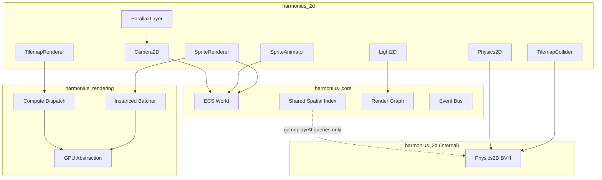
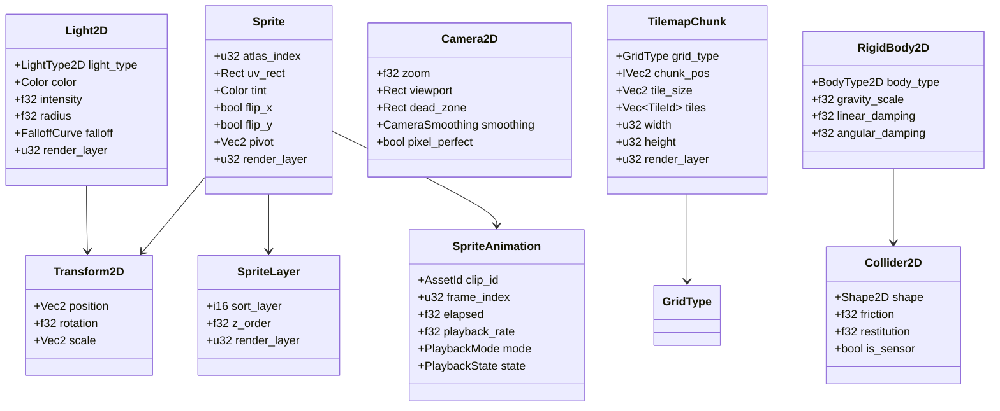
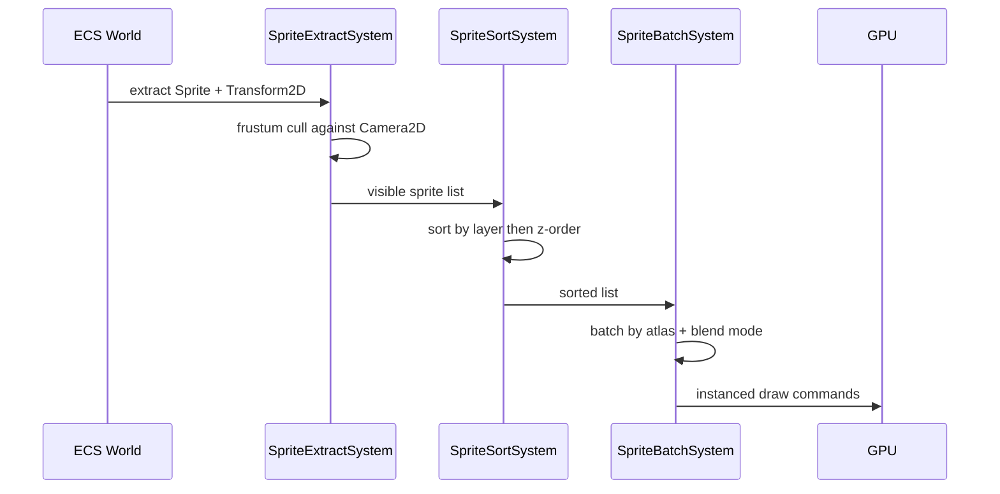

# 2D Rendering and Physics Design

## Requirements Trace

> **Canonical sources:** Features, requirements, and user stories are defined in
> [features/](../../features/), [requirements/](../../requirements/), and
> [user-stories/](../../user-stories/). The table below traces design elements to those definitions.

### 2D game support (F-10.5 / R-10.5)

| Feature   | Requirement | User Story             |
|-----------|-------------|------------------------|
| F-10.5.1  | R-10.5.1    | US-10.5.1              |
| F-10.5.2  | R-10.5.2    | US-10.5.2, US-10.5.3   |
| F-10.5.6  | R-10.5.6    | US-10.5.8, US-10.5.9   |
| F-10.5.7  | R-10.5.7    | US-10.5.10, US-10.5.11 |
| F-10.5.9  | R-10.5.9    | US-10.5.13, US-10.5.14 |
| F-10.5.10 | R-10.5.10   | US-10.5.15, US-10.5.16 |
| F-10.5.11 | R-10.5.11   | US-10.5.17             |
| F-10.5.12 | R-10.5.12   | US-10.5.18             |
| F-10.5.13 | R-10.5.13   | US-10.5.19             |
| F-10.5.14 | R-10.5.14   | US-10.5.20, US-10.5.21 |
| F-10.5.15 | R-10.5.15   | US-10.5.22             |

1. **F-10.5.1** — Sprite rendering and sprite sheets
2. **F-10.5.2** — Frame-based sprite animation
3. **F-10.5.6** — Tilemap rendering (orthogonal)
4. **F-10.5.7** — Isometric and hex tilemaps
5. **F-10.5.9** — 2D camera and parallax
6. **F-10.5.10** — 2D rigid body physics
7. **F-10.5.11** — 2D collision shapes and tilemap colliders
8. **F-10.5.12** — 2D joints and constraints
9. **F-10.5.13** — 2D spatial queries
10. **F-10.5.14** — 2D dynamic lighting
11. **F-10.5.15** — 2D particle effects

## Overview

A complete 2D rendering, physics, and gameplay framework built entirely on ECS. All 2D data lives as
components; all logic runs as systems.

Core subsystems:

1. **Sprite rendering** -- instanced textured quads, atlas batching, z-order sorting, layer
   composition
2. **Tilemap rendering** -- chunked grids, compute dispatch, orthogonal/isometric/hex layouts
3. **2D physics** -- rigid bodies, collision shapes, joints, spatial queries, deterministic
   simulation
4. **2D camera** -- orthographic projection, parallax, pixel-perfect snapping, split-screen
5. **Sprite animation** -- frame sequences, playback modes, animation events
6. **2D lighting** -- point/spot lights, shadow casting, normal maps, emissive sprites

## Architecture

### Module boundaries



### Core data structures



### Sprite rendering pipeline



## API Design

### 2D core types

```rust
#[derive(Clone, Copy, Debug)]
pub struct Transform2D {
    pub position: Vec2,
    pub rotation: f32,
    pub scale: Vec2,
}

#[derive(Clone, Debug)]
pub struct Sprite {
    pub atlas_index: u32,
    pub uv_rect: Rect,
    pub tint: Color,
    pub flip_x: bool,
    pub flip_y: bool,
    pub pivot: Vec2,
    /// Bitmask: Camera2D renders entities whose render_layer overlaps camera's layer_mask.
    /// Used for split-screen, minimap, editor overlays, and selective visibility.
    pub render_layer: u32,
}

#[derive(Clone, Copy, Debug)]
pub struct SpriteLayer {
    /// Draw-order sorting key within a render pass. Distinct from the render_layer bitmask.
    pub sort_layer: i16,
    pub z_order: f32,
}

#[derive(Clone, Copy, Debug, PartialEq, Eq)]
pub enum GridType {
    Orthogonal,
    IsometricDiamond,
    IsometricStaggered,
    HexFlatTop,
    HexPointyTop,
}

#[derive(Clone, Debug)]
pub struct TilemapChunk {
    pub grid_type: GridType,
    pub chunk_pos: IVec2,
    pub tile_size: Vec2,
    pub width: u32,
    pub height: u32,
    pub tiles: Vec<TileId>,
    pub flags: Vec<TileFlags>,
    /// Bitmask matching Camera2D::layer_mask for selective rendering (split-screen, minimap).
    pub render_layer: u32,
}
```

### Asset handles and serialization

Sprite atlases, animation clips, tilemap data, and skeleton assets are zero-copy loaded via rkyv
mmap. All asset references use the engine's `Handle<T>` pattern.

```rust
/// rkyv-serialized sprite atlas with UV regions and metadata.
pub struct SpriteAtlas { /* baked at import time */ }

/// rkyv-serialized animation clip with frame sequences and events.
pub struct AnimationClip { /* baked at import time */ }

/// rkyv-serialized tilemap chunk data (tile IDs, flags, metadata).
pub struct TilemapData { /* baked at import time */ }

// ECS components hold handles; the asset system loads and caches the backing data.
pub struct SpriteRenderer {
    pub atlas: Handle<SpriteAtlas>,
    // ...
}

pub struct SpriteAnimation {
    pub clip_id: Handle<AnimationClip>,
    pub frame_index: u32,
    pub elapsed: f32,
    pub playback_rate: f32,
    pub mode: PlaybackMode,
    pub state: PlaybackState,
}

pub struct TilemapChunkRenderer {
    pub data: Handle<TilemapData>,
    // ...
}
```

### 2D physics

```rust
#[derive(Clone, Copy, Debug, PartialEq, Eq)]
pub enum BodyType2D { Dynamic, Kinematic, Static }

#[derive(Clone, Debug)]
pub struct RigidBody2D {
    pub body_type: BodyType2D,
    pub gravity_scale: f32,
    pub linear_damping: f32,
    pub angular_damping: f32,
    pub fixed_rotation: bool,
    pub ccd_enabled: bool,
}

#[derive(Clone, Debug)]
pub enum Shape2D {
    Circle { radius: f32 },
    Box { half_extents: Vec2 },
    Capsule { half_height: f32, radius: f32 },
    /// SmallVec<[Vec2; 8]>: avoids heap allocation for polygons with ≤ 8 vertices (common case).
    ConvexPolygon { vertices: SmallVec<[Vec2; 8]> },
    /// SmallVec<[Vec2; 8]>: avoids heap allocation for short edge chains (common case).
    EdgeChain { vertices: SmallVec<[Vec2; 8]> },
    /// SmallVec<[Shape2D; 4]>: avoids heap allocation for compound shapes (common case ≤ 4).
    Composite { shapes: SmallVec<[Shape2D; 4]> },
}

#[derive(Clone, Debug)]
pub struct Collider2D {
    pub shape: Shape2D,
    pub friction: f32,
    pub restitution: f32,
    pub is_sensor: bool,
    pub layer: u32,
    pub mask: u32,
    pub one_way: bool,
}

#[derive(Clone, Debug)]
pub enum Joint2D {
    Revolute {
        anchor_a: Vec2, anchor_b: Vec2,
        motor: Option<JointMotor>,
        limits: Option<AngleLimits>,
    },
    Prismatic {
        anchor_a: Vec2, anchor_b: Vec2,
        axis: Vec2,
    },
    Distance {
        anchor_a: Vec2, anchor_b: Vec2,
        length: f32, stiffness: f32,
    },
    Spring {
        anchor_a: Vec2, anchor_b: Vec2,
        rest_length: f32, stiffness: f32,
    },
    Rope {
        anchor_a: Vec2, anchor_b: Vec2,
        max_length: f32,
    },
    Weld { anchor_a: Vec2, anchor_b: Vec2 },
    Mouse { target: Vec2, max_force: f32 },
}
```

### TilemapCollider

`TilemapCollider` generates `Collider2D` components from tile property data. It is not a standalone
physics shape but a builder that emits standard physics components.

```rust
/// Attached to a TilemapChunk entity to auto-generate Collider2D children.
/// The collider generation system reads tile collision properties and merges
/// adjacent solid tiles into minimal convex hulls or edge chains.
#[derive(Clone, Debug)]
pub struct TilemapCollider {
    /// Collision layer bitmask applied to all generated Collider2D components.
    pub layer: u32,
    /// Collision mask bitmask applied to all generated Collider2D components.
    pub mask: u32,
    /// Merge adjacent same-type tiles into a single shape for fewer colliders.
    pub merge_adjacent: bool,
    /// Friction applied to generated colliders.
    pub friction: f32,
    /// Restitution applied to generated colliders.
    pub restitution: f32,
}
```

The system `TilemapColliderSystem` runs after `TilemapStreamSystem`. For each loaded chunk with a
`TilemapCollider`, it reads tile flags to identify solid tiles, traces contours, and spawns or
updates child entities with `Collider2D` components. Single-tile edits trigger incremental contour
patching on the affected chunk only.

### 2D lighting

```rust
#[derive(Clone, Copy, Debug, PartialEq, Eq)]
pub enum LightType2D { Point, Spot, Ambient }

#[derive(Clone, Debug)]
pub struct Light2D {
    pub light_type: LightType2D,
    pub color: Color,
    pub intensity: f32,
    pub radius: f32,
    pub falloff: FalloffCurve,
    pub cast_shadows: bool,
    pub shadow_softness: f32,
    /// Bitmask: only affects entities whose render_layer overlaps this mask.
    pub render_layer: u32,
}

#[derive(Clone, Debug)]
pub struct ShadowCaster2D {
    pub occluder: Option<Vec<Vec2>>,
    pub self_shadow: bool,
}
```

### Codegen and user-extensible enums

| Enum | User-extensible | Codegen target |
|------|----------------|----------------|
| `GridType` | Yes | middleman .dylib |
| `LightType2D` | Yes | middleman .dylib |
| `Shape2D` | Yes | middleman .dylib |
| `BodyType2D` | No | engine-internal |
| `PlaybackMode` | No | engine-internal |
| `PlaybackState` | No | engine-internal |

User-extensible enums are codegen'd into the middleman .dylib. When a user adds a new grid type or
light type via the editor, codegen regenerates the enum, recompiles the middleman, and hot- reloads.
Engine-internal enums are fixed at compile time and not exposed to user authoring.

### 2D spatial query API

```rust
pub struct Physics2D;

impl Physics2D {
    /// Cast a ray and return the first hit within layer_mask.
    pub fn raycast(
        origin: Vec2,
        direction: Vec2,
        max_distance: f32,
        layer_mask: u32,
    ) -> Option<RaycastHit2D>;

    /// Return all shapes overlapping the given shape at position within layer_mask.
    pub fn overlap_shape(
        shape: &Shape2D,
        position: Vec2,
        layer_mask: u32,
    ) -> Vec<EntityId>;

    /// Return all entities within an AABB within layer_mask.
    pub fn overlap_aabb(aabb: Aabb2D, layer_mask: u32) -> Vec<EntityId>;
}

pub struct RaycastHit2D {
    pub entity: EntityId,
    pub point: Vec2,
    pub normal: Vec2,
    pub distance: f32,
}
```

## Data Flow

### 2D frame lifecycle

Systems are mapped to game loop phases. ECS systems run on worker threads; render graph nodes run on
the render thread. The extract phase is the frame-boundary handoff.

| System | Phase | Type | Output |
|--------|-------|------|--------|
| `SpriteAnimationSystem` | Update | ECS system | Updated `Sprite` UV rects, animation events |
| `CameraFollowSystem` | Update | ECS system | Updated `Camera2D` position |
| `TilemapColliderSystem` | Update | ECS system | `Collider2D` children on chunks |
| `Physics2DStep` | FixedUpdate | ECS system | Updated `Transform2D`, `CollisionEvent`s |
| `TilemapStreamSystem` | Update | ECS system | Loaded/unloaded `TilemapChunk` entities |
| `SpriteExtractSystem` | Extract | ECS system | `Vec<ExtractedSprite>` in staging buffer |
| `SpriteSortSystem` | Extract | ECS system | Sorted `Vec<ExtractedSprite>` (in-place) |
| `SpriteBatchSystem` | Extract | ECS system | `Vec<DrawCommand>` in render-thread buffer |
| `TilemapComputePass` | Render | Render graph node | Tile vertex SSBO |
| `ShadowCaster2DPass` | Render | Render graph node | Per-light shadow textures |
| `LightAccumulationPass` | Render | Render graph node | Light map texture |
| `SpriteDrawPass` | Render | Render graph node | Color target |
| `ParticleComputePass` | Render | Render graph node | Particle attribute buffers |
| `ParticleDrawPass` | Render | Render graph node | Color target |
| `ParallaxBackgroundPass` | Render | Render graph node | Color target |
| `FinalCompositePass` | Render | Render graph node | Swapchain image |

### Physics2DStep — FixedUpdate details

`Physics2DStep` runs at a fixed delta (default 1/60 s, configurable). Multiple steps may execute per
frame if the accumulated delta exceeds the fixed step. Between fixed steps, `Transform2D` is
interpolated for rendering using the previous and current physics positions.

1. Broadphase: physics-private BVH query (not the shared spatial index)
2. Narrowphase: SAT/GJK contact generation — ref:
   <https://box2d.org/files/ErinCatto_GDC2006_Slides.pdf>
3. Constraint solver: sequential impulse — ref:
   <https://box2d.org/files/ErinCatto_SequentialImpulses_GDC2006.pdf>
4. Velocity integration + `Transform2D` update
5. CCD sweep for fast-moving bodies — ref:
   <https://box2d.org/documentation/md__d_1__git_hub_box2d_docs_dynamics.html>
6. Collision event dispatch via ECS event bus

Determinism: entities are sorted by ID before iteration. Contact pairs are sorted. No `HashMap` in
the physics hot path (uses sorted `Vec` and `BTreeMap`). Fixed-point precision (32.32 vs 16.16) is
an open question; currently uses `f32` with documented non-determinism across platforms.

### GPU buffer strategy

- **Sprite instance buffer**: `SpriteExtractSystem` writes `ExtractedSprite` records (transform, UV,
  tint, render_layer) to a GPU instance buffer. Ring-buffered with N copies for N frames in flight
  to avoid GPU/CPU sync stalls.
- **Tilemap SSBO**: `TilemapChunk::tiles` and `flags` are CPU-side staging data. On chunk load or
  update, `TilemapStreamSystem` uploads to a GPU storage buffer. `TilemapComputePass` reads the SSBO
  to generate tile vertex data via compute dispatch.
- **Particle buffers**: per-element position, velocity, age, and color live in GPU storage buffers.
  Only the `ParticleEmitter2D` entity lives in ECS. Ring-buffered per emitter.
- **Light map**: render target allocated by the render graph. Half-res on mobile, full-res on
  desktop. Ring-buffered for frames in flight.

### Hot-path arena allocations

The following hot paths allocate from per-thread arenas reset at frame boundaries:

- Visible sprite list (`Vec<ExtractedSprite>`) during `SpriteExtractSystem`
- Contact manifold scratch buffers during `Physics2DStep` narrowphase
- Batch `DrawCommand` lists during `SpriteBatchSystem`
- Sort scratch buffers during `SpriteSortSystem`

### Extract phase — frame-boundary handoff

The Extract phase copies ECS data to render-thread-owned staging buffers. After extract, the game
loop advances to the next frame while the render thread works on the extracted snapshot. Sprite
transforms, UV data, tint values, and layer masks are copied into ring-buffered instance buffers
during extract. Tilemap chunk data is referenced by handle — no copy if the GPU buffer is current.

### 2D render graph passes

```text
Pass name               | Type    | Reads                  | Writes
------------------------+---------+------------------------+-----------------
TilemapComputePass      | Compute | tile SSBO, atlas       | tile vertex SSBO
SpriteExtractPass       | CPU     | ECS Sprite queries     | instance buf
SpriteSortPass          | CPU     | instance buf           | sorted buf
ShadowCaster2DPass      | Raster  | occluder geometry      | shadow map tex
LightAccumulationPass   | Compute | shadow map, lights     | light map tex
SpriteDrawPass          | Raster  | sorted buf, atlas      | color target
ParticleComputePass     | Compute | particle attr bufs     | particle attr bufs
ParticleDrawPass        | Raster  | particle attr bufs     | color target
ParallaxBackgroundPass  | Raster  | layer textures         | color target
VectorDrawPass          | Raster  | tessellated vert bufs  | color target
FinalCompositePass      | Raster  | all layers             | swapchain image
```

Each pass is a render graph node registered via `render_graph.add_pass()`. Passes declare read/write
dependencies; the graph compiler determines execution order and inserts barriers. The 2D pass
subgraph is a child of the per-view render graph and composes with 3D passes via the viewport stack.

### 2D shadow casting — algorithm reference

2D shadow casting uses the standard 1D shadow map technique (distance from light center along each
angle). — ref: <https://www.redblobgames.com/articles/visibility/>

### Sprite batching — algorithm reference

Sprites are sorted by `sort_layer`, then `z_order`, then batched by atlas page and blend mode to
minimize draw calls. — ref:
<https://on-demand.gputechconf.com/gtc/2014/presentations/S4379-sprite-rendering-techniques.pdf>

### Viewport composition

Each `Camera2D` creates a `RenderView` with `ViewType::Orthographic2D`. A `ViewportStack` defines
back-to-front composition order:

1. 3D scene (if present)
2. 2D world layer
3. 2D HUD overlay
4. 2D debug overlay (editor only)

For 2.5D (3D background + 2D foreground), 2D sprites can optionally write depth to interleave with
3D objects. Split-screen: multiple `Camera2D` entities with different `viewport` rects render to
sub-regions of the same swapchain, each with its own 2D render graph subgraph.

## Platform Considerations

### GPU backends

All 2D rendering shaders (sprite batch, tilemap compute, light map composite, shadow casting, vector
tessellation) are authored in HLSL and compiled via the standard DXC + Metal Shader Converter CLI
pipeline (see [constraints.md](../constraints.md) — Shader Pipeline).

| Platform | GPU Backend | Shader path |
|----------|-------------|-------------|
| Windows | Direct3D 12 | HLSL → DXIL via `dxc` |
| macOS / iOS | Metal | HLSL → DXIL → MSL via `dxc` + `metal-shaderconverter` |
| Linux | Vulkan | HLSL → SPIR-V via `dxc` |

No platform has hand-written MSL or GLSL. All shader variants are compiled at asset-processing time.

### 2D scaling tiers

Mobile = iOS, Android. Desktop = Windows, macOS, Linux. Switch and VR are noted separately.

| Resource | Mobile | Desktop | Switch | VR (per eye) |
|----------|--------|---------|--------|--------------|
| Max tile layers | 3 | 8 | 4 | 4 |
| Tile atlas page | 1024×1024 | 4096×4096 | 2048×2048 | 2048×2048 |
| Max 2D lights | 8 | 32 | 12 | 16 |
| Light map | Half res | Full res | Half res | Half res |
| Max rigid bodies | 200 | 500+ | 300 | 300 |
| Max particles/emitter | 256 | 1024 | 512 | 512 |

Details:

1. **Mobile** — iOS uses Metal via `objc2-metal`; Android uses Vulkan via `ash`. Tile atlas capped
   at 1024×1024 to fit within Metal mobile tier-1 texture limits.
2. **Desktop** — Windows uses D3D12 via `windows-rs`; macOS uses Metal 4; Linux uses Vulkan.
   Full-res light map. No hard cap on rigid body count beyond perf budget.
3. **Switch** — Vulkan via `ash` on NVN-compatible driver. Conservative budgets due to 4 GB RAM.
4. **VR** — per-eye rendering; two render passes with separate `Camera2D` viewports. Half-res light
   map to halve fill rate cost. Particle budget matches Switch.

### Platform-specific 2D adaptations

- **iOS main thread**: UIKit owns thread 0; the 2D game loop runs on a worker thread. Input events
  (touch, accelerometer) are forwarded to the game loop via crossbeam-channel.
- **Pixel-perfect mode**: on high-DPI displays (Retina, Windows 125%/150%),
  `Camera2D::pixel_perfect` snaps the camera to integer pixel boundaries and scales via integer
  upscale pass before final composite.
- **DirectStorage (Windows)**: tilemap chunk GPU buffers are uploaded via DirectStorage for reduced
  CPU overhead on chunk streaming.
- **Metal I/O (Apple)**: tilemap chunk data streams via Metal I/O for equivalent zero-copy GPU
  upload on Apple platforms.

## Test Plan

Tests are defined in the companion file [2d-test-cases.md](./2d-test-cases.md).

Full test case definitions with explicit inputs, expected outputs, and TC-X.Y.Z.N IDs are in
[2d-test-cases.md](./2d-test-cases.md).

### Unit tests

| Test | Req |
|------|-----|
| `test_sprite_batch_by_atlas` | R-10.5.1 |
| `test_sprite_z_order_sort` | R-10.5.1 |
| `test_sprite_render_layer_filter` | R-10.5.1 |
| `test_anim_loop_mode` | R-10.5.2 |
| `test_anim_event_fire` | R-10.5.2 |
| `test_tilemap_ortho_coord` | R-10.5.6 |
| `test_tilemap_iso_diamond` | R-10.5.7 |
| `test_tilemap_hex_coord` | R-10.5.7 |
| `test_tilemap_collider_merge` | R-10.5.11 |
| `test_tilemap_render_layer_filter` | R-10.5.6 |
| `test_camera_deadzone` | R-10.5.9 |
| `test_camera_pixel_snap` | R-10.5.9 |
| `test_parallax_scroll_rate` | R-10.5.9 |
| `test_rigidbody_gravity` | R-10.5.10 |
| `test_ccd_tunnel_prevention` | R-10.5.10 |
| `test_one_way_platform` | R-10.5.10 |
| `test_deterministic_sim` | R-10.5.10 |
| `test_physics_fixed_timestep_accumulator` | R-10.5.10 |
| `test_transform_interpolation_between_steps` | R-10.5.10 |
| `test_joint_revolute_limits` | R-10.5.12 |
| `test_ray_cast_2d` | R-10.5.13 |
| `test_overlap_shape_2d` | R-10.5.13 |
| `test_light_shadow_cast` | R-10.5.14 |
| `test_normal_map_response` | R-10.5.14 |
| `test_light_render_layer_filter` | R-10.5.14 |
| `test_particle_spawn_shape_circle` | R-10.5.15 |
| `test_particle_spawn_shape_rect` | R-10.5.15 |
| `test_particle_gpu_simulate_advance` | R-10.5.15 |
| `test_skeleton2d_bone_hierarchy` | R-10.5.2 |
| `test_skeletal_anim_clip_sample` | R-10.5.2 |
| `test_vector_sprite_tessellate` | R-10.5.1 |
| `test_tilemap_collider_api` | R-10.5.11 |
| `test_physics_step_deterministic_order` | R-10.5.10 |

### Integration tests

| Test | Req |
|------|-----|
| `test_tilemap_stream_culling` | R-10.5.6 |
| `test_10k_sprites_60fps` | R-10.5.1 |
| `test_physics_collision_events` | R-10.5.10 |
| `test_collision_vfx_spawn` | R-10.5.10 |
| `test_spatial_audio_2d_attenuation` | R-10.5.10 |
| `test_particle_physics_interaction` | R-10.5.15 |
| `test_viewport_split_screen_isolation` | R-10.5.9 |
| `test_render_graph_2d_pass_order` | R-10.5.1 |
| `test_ring_buffer_no_gpu_stall` | R-10.5.1 |

### Benchmarks

| Benchmark | Target | Source |
|-----------|--------|--------|
| Sprite batch 10K | < 2 ms | US-10.5.1 |
| Tilemap chunk 1M tiles | < 4 ms | US-10.5.9 |
| Physics 200 bodies | < 2 ms mobile | US-10.5.15 |
| Particles 1024/emitter GPU sim | < 1 ms | R-10.5.15 |
| Skeletal anim 100 bones | < 0.5 ms | R-10.5.2 |

## Design Q & A

**Q1. What is the biggest constraint?**

The ECS-primary (~90%) constraint prevents a tuned standalone physics solver. We accept it because
ECS ensures all 2D data is queryable by all subsystems without sync barriers.

**Q2. How can this design be improved?**

Tilemap collider generation lacks incremental update for single-tile edits. Adding incremental
contour patching would improve destructible terrain performance.

**Q3. Is there a better approach?**

A unified 2D/3D physics backend (3D constrained to a plane) would eliminate code duplication. We
chose separate 2D types for cache efficiency.

**Q4. Does this design solve all customer problems?**

Missing pathfinding API for top-down and RTS games, and rope/cloth simulation for puzzle
platformers.

**Q5. Is this design cohesive?**

The 2D subsystem reuses the render graph and shared spatial index.

## Open Questions

1. **Sprite batch size limit** -- Maximum instances per draw call (GPU-dependent, likely
   4096-16384).
2. **Tilemap chunk dimensions** -- 16x16 vs 32x32 tiles per chunk.
3. **Physics solver iterations** -- Default 4-8, configurable.
4. **Fixed-point precision** -- 32.32 vs 16.16 for deterministic physics.

## Review feedback

### RF-1: Create companion test cases file

Create `docs/design/rendering/2d-test-cases.md` with full TC-X.Y.Z entries, explicit inputs/outputs,
and links to R-X.Y.Z for every test listed in the test plan tables.

### RF-2: Physics-private BVH for 2D physics

The architecture diagram connects `PH --> SI` and `TC --> SI` (shared spatial index). 2D physics
broadphase must use a physics-private BVH, not the shared index. Add a `Physics2D BVH` node inside
`harmonius_2d`. Only gameplay/AI spatial queries (F-10.5.13) should use the shared spatial index.

### RF-3: Render layer bitmask on all renderable types

Add `render_layer: u32` to `Sprite` (or `SpriteLayer`), `Light2D`, and `TilemapChunk`. Document how
`Camera2D` filters by render layer mask for split-screen, minimap rendering, and selective
visibility.

### RF-4: Identify render graph nodes explicitly

Clarify which systems in the frame lifecycle are render graph nodes versus ECS systems. At minimum:
shadow map generation, light map composite, sprite batch draw, tilemap compute dispatch, and final
composite should be named render graph nodes with inputs/outputs specified.

### RF-5: GPU buffer strategy for bulk data

`TilemapChunk` stores tile data in CPU-side `Vec<TileId>` and `Vec<TileFlags>`. Document that
tilemap chunk tile data is uploaded to GPU storage buffers for compute dispatch. Sprite instance
data (transforms, UVs, tints) is written to a GPU instance buffer. Particle per-element data lives
in GPU buffers with only the emitter entity in ECS.

### RF-6: Add algorithm reference URLs

Add citations for: SAT/GJK (Erin Catto GDC slides), sequential impulse solver (Erin Catto Box2D
papers), CCD sweep (Bullet/Box2D), 2D shadow casting (Red Blob Games "2D Visibility"), sprite
batching, and tilemap rendering.

### RF-7: Codegen for user-extensible enums

Identify which enums are extensible by users (`GridType`, `Shape2D`, `LightType2D`) and state they
are codegen'd into the middleman .dylib. Fixed engine-internal enums should be marked as not
user-extensible.

### RF-8: TilemapCollider API definition

`TilemapCollider` appears in the architecture diagram but has no API. Add a `TilemapCollider` struct
or document that tilemap collision generates standard `Collider2D` components with layer/mask
fields.

### RF-9: Tie Physics2DStep to FixedUpdate phase

Explicitly state that `Physics2DStep` runs in the `FixedUpdate` phase with a configurable fixed
delta (e.g., 1/60s). Document how multiple fixed steps per frame are handled and how interpolation
is applied for rendering between fixed steps.

### RF-10: Ring-buffer per-frame GPU resources

Sprite instance buffers, tilemap GPU buffers, and light maps must be ring-buffered (N copies for N
frames in flight) to avoid GPU/CPU sync stalls.

### RF-11: Expand platform considerations

Map Mobile/Desktop tiers to specific platforms (iOS, Android for Mobile; Windows, macOS, Linux for
Desktop). Add Switch and VR rows. Note platform-specific GPU backends (D3D12, Metal, Vulkan) and any
2D-specific adaptations.

### RF-12: HLSL shader pipeline

State that all 2D rendering shaders (sprite batch, tilemap compute, light map composite, shadow
casting) are authored in HLSL and compiled via the standard DXC + MSC CLI pipeline.

### RF-13: SmallVec for small collections

Replace `Vec<Vec2>` with `SmallVec<[Vec2; 8]>` for `ConvexPolygon::vertices` and
`EdgeChain::vertices`. Replace `Vec<Shape2D>` with `SmallVec<[Shape2D; 4]>` for `Composite::shapes`.

### RF-14: Per-thread arenas for hot paths

Document which hot paths use per-thread arenas: visible sprite list during extraction, contact
manifold scratch buffers, batch command lists, sort buffers.

### RF-15: rkyv serialization and Handle pattern

Sprite atlases, animation clips, and tilemap chunk data are serialized via rkyv for zero-copy
loading. Use `Handle<SpriteAtlas>`, `Handle<AnimationClip>`, `Handle<TilemapData>` consistent with
the engine's asset handle pattern.

### RF-16: Determinism implementation details

Explicitly state that physics iteration order is deterministic (entities sorted by ID), contact
pairs are sorted, and no HashMap is used in the physics hot path. Reference the fixed-point
precision open question as part of the determinism strategy.

### RF-17: Map systems to game loop phases

Add a mapping from each system to its game loop phase: SpriteAnimationSystem in Update,
Physics2DStep in FixedUpdate, Extract/Sort/Batch in Extract, LightMap/Composite in Render.

### RF-18: Specify intermediate data types between systems

Document what each system outputs: SpriteExtractSystem produces `Vec<ExtractedSprite>`,
SpriteSortSystem sorts in-place, SpriteBatchSystem produces `Vec<DrawCommand>`.

### RF-19: Frame-boundary handoff to render thread

Document the extract phase as the frame boundary handoff. Sprite and tilemap data is copied from the
ECS world to render-thread-owned staging buffers during extract.

### RF-20: Disambiguate sort layer from render layer

Rename `SpriteLayer.layer: i16` to `sort_layer` to distinguish it from the render layer bitmask. Add
a separate `render_layer: u32` field per RF-3.

### RF-21: Viewport composition for 2D/3D layering

The design has no concept of viewport stacking, render target routing, or 2D/3D compositing. Add a
viewport composition section:

1. **Camera2D renders to a RenderView** — each Camera2D creates a RenderView with a new
   `ViewType::Orthographic2D` variant. The render graph builds a 2D pass subgraph for each active 2D
   view.
2. **Composition order** — a ViewportStack defines back-to-front order: 3D scene, 2D HUD overlay, 2D
   debug overlay. Each layer is a RenderView rendering to a shared or independent render target.
3. **Render-to-texture for previews** — editor preview panels (mesh, material, particle) get
   off-screen render targets managed by ViewportManager. The UI framework's RenderToTexture widget
   (F-10.4.5) displays them.
4. **2.5D compositing** — for 3D backgrounds with 2D foreground (or vice versa), define how the
   depth buffer interacts between 2D and 3D passes. 2D sprites can optionally write depth for
   interleaving with 3D objects.
5. **Split-screen** — multiple Camera2D entities with different viewport rects render to sub-regions
   of the same swapchain. Each gets its own 2D render graph subgraph.

### RF-22: Complete 2D render graph pass diagram

The design says "reuses the render graph" but never shows which passes exist, what they read/write,
or how they order relative to 3D passes. Add a render graph integration diagram for a complete 2D
frame:

```text
Pass name               | Type    | Reads              | Writes
-------------------------+---------+--------------------+-----------
TilemapComputePass       | Compute | tile SSBO, atlas   | tile verts
SpriteExtractPass        | CPU     | ECS Sprite queries | instance buf
SpriteSortPass           | CPU     | instance buf       | sorted buf
ShadowCaster2DPass       | Raster  | occluder geometry  | shadow map
LightAccumulationPass    | Compute | shadow map, lights | light map
SpriteDrawPass           | Raster  | sorted buf, atlas  | color target
ParticleDrawPass         | Raster  | particle buf       | color target
ParallaxBackgroundPass   | Raster  | layer textures     | color target
FinalCompositePass       | Raster  | all layers         | swapchain
```

Each pass is a render graph node registered via `render_graph.add_pass()`. Passes declare read/write
dependencies so the graph compiler determines execution order and inserts barriers. The 2D pass
subgraph is a child of the per-view render graph and can be composited with 3D passes via the
viewport stack (RF-21).

### RF-23: 2D particle effects design (F-10.5.15)

F-10.5.15 (2D particle effects) is listed as a feature with a platform budget (256-1024
particles/emitter) but has zero design. This needs:

1. **Integration with the VFX effect graph** — 2D particles should use the same effect graph
   compiler as 3D particles. The effect graph already has a `Sprite` output node variant. The 2D
   particle system provides a `ParticleEmitter2D` component that configures the effect graph
   instance with 2D-specific defaults (spawn in Vec2, no depth, sprite output only).
2. **GPU compute simulation** — particle attribute buffers (position, velocity, age, color) live in
   GPU storage buffers. A compute pass advances the simulation. Draw-indirect renders surviving
   particles as instanced quads.
3. **2D-specific spawn shapes** — circle, rectangle, edge, point. No 3D volumes (sphere, box, cone).
4. **Physics interaction** — particles can collide with 2D colliders via the physics-private BVH or
   a simplified heightmap test. Wind field (VFX RF-17) applies to 2D particles via the same GPU
   texture.
5. **Render graph integration** — `ParticleComputePass` (simulation) runs before `ParticleDrawPass`
   (rendering). Both are render graph nodes in the 2D pass subgraph. Particle draw is z-sorted with
   sprites.

### RF-24: 2D physics integration with VFX and gameplay

The 2D physics system is isolated — it detects collisions and updates transforms but doesn't drive
any downstream systems. A 2D game needs:

1. **Collision → VFX** — when two bodies collide, spawn impact particles (dust, sparks, debris) at
   the contact point. The `PhysicsVfxBridge` system (VFX RF-19) should handle 2D collisions the same
   as 3D: listen for `CollisionEvent`, query contact normal/material, spawn effect graph instance.
2. **Destruction** — 2D destructible objects (breakable platforms, crumbling walls) need a 2D
   destruction system analogous to 3D destruction VFX. Fracture a sprite into debris fragments with
   2D rigid body physics.
3. **One-way platforms + moving platforms** — the design has `Collider2D::one_way` but no moving
   platform (kinematic body that carries dynamic bodies). Add `KinematicCarrier` behavior.
4. **Trigger volumes** — sensors (`Collider2D::is_sensor`) that fire gameplay events (enter zone,
   exit zone, overlap). These need to integrate with the ECS event system for logic graph wiring.
5. **Buoyancy / fluid zones** — 2D water volumes that apply drag and buoyancy forces to overlapping
   rigid bodies. Visual: water surface line rendering, splash particles on entry.

### RF-25: 2D lighting render graph passes

The design lists `Light2D`, `ShadowCaster2D`, and `LightMapSystem` but provides no detail on how 2D
lighting integrates with the render graph. This needs:

1. **Shadow map generation pass** — for each shadow-casting light, render occluder geometry into a
   1D shadow map (distance from light center along each angle). This is a standard 2D visibility
   algorithm. Render graph node: `ShadowCaster2DPass`, reads occluder geometry, writes per-light
   shadow textures.
2. **Light accumulation pass** — compute pass or raster pass that accumulates all lights into a
   light map texture. Each light samples its shadow map for visibility. Supports point, spot, and
   ambient lights with falloff curves. Render graph node: `LightAccumulationPass`, reads shadow
   textures + light params, writes light map.
3. **Normal map lighting** — sprites with normal maps are lit per-pixel using the light direction.
   The sprite draw pass reads the light map and per-pixel normals. This requires a deferred or
   forward lighting model for 2D.
4. **Emissive sprites** — sprites with an emissive channel contribute to the light map additively.
   They are their own light source without a separate `Light2D` entity.
5. **Light map resolution** — half-res on mobile, full-res on desktop (per the platform table). The
   light map is a render target managed by the render graph with automatic resolution scaling.
6. **Global illumination bounce** — optional single-bounce GI for 2D: light that hits a surface and
   bounces to nearby surfaces. This is a compute pass reading the light map and writing a GI map.
   Low priority but should be noted as a future extension.

### RF-26: 2D audio integration

The design has no mention of audio. 2D games need:

1. **Spatial audio in 2D** — sound sources positioned in 2D world space with distance attenuation
   and stereo panning based on Camera2D position. The audio system needs to accept `Transform2D`
   positions (not just `Transform3D`).
2. **Collision sounds** — physics collision events trigger material-based impact sounds. Reuse the
   same surface material → sound mapping as 3D.
3. **Music and ambience** — background music layers that respond to gameplay state. This is already
   designed in the audio system but the 2D design should cross-reference it.

### RF-27: 2D gameplay framework gaps

The design covers rendering and physics but several features needed for complete 2D game development
are absent:

1. **2D pathfinding** — A* on grid/navmesh for top-down and RTS games. The AI navigation design may
   already cover this but the 2D design should cross-reference it and confirm 2D grid pathfinding
   works.
2. **2D raycasting and shape queries** — `test_ray_cast_2d` exists in the test plan but no API is
   defined. Add `Physics2D::raycast(origin, direction, max_distance, layer_mask)` and
   `Physics2D::overlap_shape(shape, position, layer_mask)`.
3. **2D animation state machine** — frame-based animation with `SpriteAnimation` but no state
   machine for transitions (idle → run → jump → fall). Cross-reference the animation state machine
   design.
4. **Tilemap auto-tiling** — rule-based tile selection (Wang tiles, bitmasking) for automatic
   terrain edges. This is a critical workflow feature for 2D level design.
5. **2D rope/cloth** — verlet integration for simple rope and cloth physics. Noted in Q4 as missing.

### RF-28: 2D skeletal animation

The design only has frame-based `SpriteAnimation` (flip through sprite sheet frames). Modern 2D
games use skeletal animation (Spine-style) for smooth character movement, facial expressions, and
complex creatures. The procedural animation design (animation/procedural.md) mentions "spine-style
bone hierarchies with mesh deformation" and a `SpriteMorph` path but none of this is designed in the
2D document. This needs:

1. **2D bone hierarchy** — `Skeleton2D` component with a tree of `Bone2D` nodes. Each bone has
   position, rotation, scale relative to parent. Bones are entities in the ECS with `ChildOf`
   relationships. The skeleton is an asset loaded via `Handle<Skeleton2DAsset>`.
2. **2D mesh deformation** — sprites are not flat quads but deformable meshes. Each sprite region
   has vertices weighted to one or more bones. At runtime, bone transforms drive vertex positions
   via linear blend skinning (2D). The deformed mesh is uploaded to the GPU instance buffer for
   rendering.
3. **2D IK** — inverse kinematics for 2D: CCD or FABRIK solver operating on `Bone2D` chains. Used
   for aiming, reaching, foot placement on slopes. Constrained to 2D plane (rotation only around Z
   axis).
4. **Slot system** — bones have named slots for attaching sprites. A slot can swap its sprite at
   runtime (different weapon, facial expression, clothing). Slot attachments are entities parented
   to the bone entity.
5. **Animation clips for bones** — `SkeletalAnimClip2D` asset containing keyframed bone transforms
   (position, rotation, scale curves per bone). The animation state machine (cross-reference
   animation/state-machine.md) drives transitions between clips with blending.
6. **Mesh deformation events** — animation clips can trigger events at specific keyframes (footstep
   sound, spawn VFX, swap slot attachment). Events integrate with the ECS event system.
7. **Import pipeline** — Spine JSON/binary, DragonBones JSON, or a custom interchange format
   imported through the asset pipeline. The content pipeline converts to rkyv `Skeleton2DAsset` with
   `Handle<T>` references.
8. **Render integration** — deformed meshes are rendered in the `SpriteDrawPass` with proper
   z-ordering. Each deformed mesh is a draw call (not instanced with flat sprites) unless batched by
   atlas.

### RF-29: 2D vector graphics rendering

The design has no vector graphics support. 2D games and UI use vector graphics for:

- **Resolution-independent art** — SVG-style paths that render crisply at any zoom level or DPI.
  Essential for UI elements, logos, icons, and stylized 2D games (Cuphead-style, vector art games).
- **Procedural shapes** — runtime-generated circles, rounded rectangles, lines, arrows, bezier
  curves for debug visualization, graph editors, and gameplay elements (laser beams, trajectory
  previews, selection indicators).
- **Animated vector art** — vector paths with animated fill, stroke, and transform properties. Used
  for morphing shapes, animated UI elements, and stylized VFX.

The UI framework already has `VectorPathRenderer` (F-10.4.3) for GPU- accelerated vector path
rendering. The 2D rendering system should share this infrastructure. Design needed:

1. **`VectorSprite` component** — an entity with a `Handle<VectorAsset>` (SVG-like path data
   compiled to GPU-friendly format) and `Transform2D`. Rendered in the 2D pass subgraph alongside
   raster sprites with proper z-ordering.
2. **GPU tessellation** — vector paths tessellated to triangles on GPU via compute shader (or
   CPU-side for small path counts). SDF-based anti-aliased edges for crisp rendering at any scale.
3. **Fill and stroke** — solid color, gradient (linear, radial), and pattern fills. Variable-width
   strokes with round/square/butt caps and miter/round/ bevel joins.
4. **Path operations** — boolean operations (union, intersection, difference) for procedural shape
   generation. Clip paths for masking regions.
5. **Animation integration** — vector path properties (control points, fill color, stroke width,
   transform) can be keyframed in animation clips. The animation system interpolates control points
   for morphing effects.
6. **Import pipeline** — SVG import through the asset pipeline. The content pipeline converts SVG
   paths to a compact binary `VectorAsset` format (rkyv serialized). Complex SVGs are flattened to
   path primitives at import time.
7. **Render graph integration** — `VectorDrawPass` render graph node in the 2D pass subgraph. Reads
   tessellated vertex buffers and path SSBO. Writes to the same color target as sprite draw.
   Z-sorted with sprites and particles.
