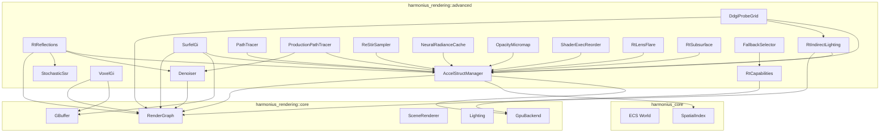
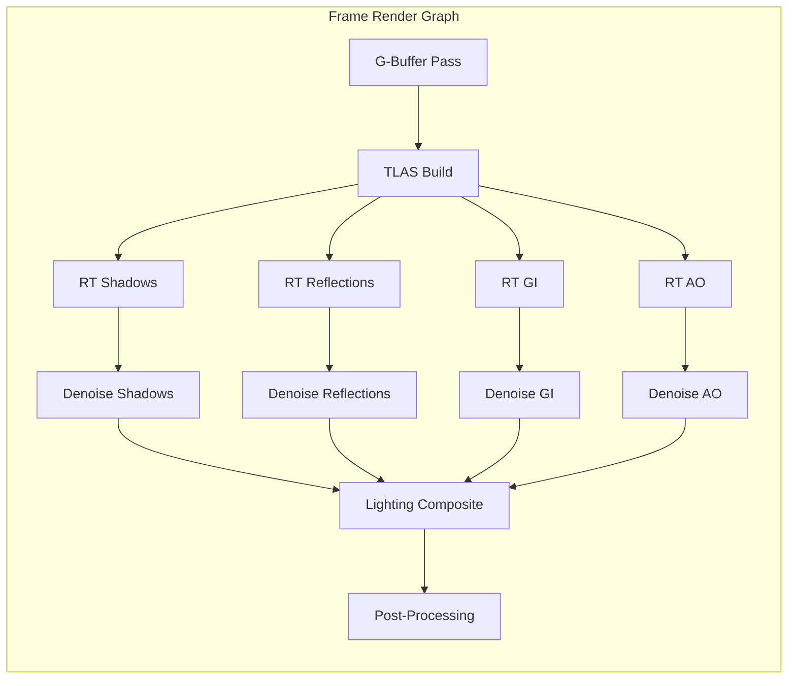
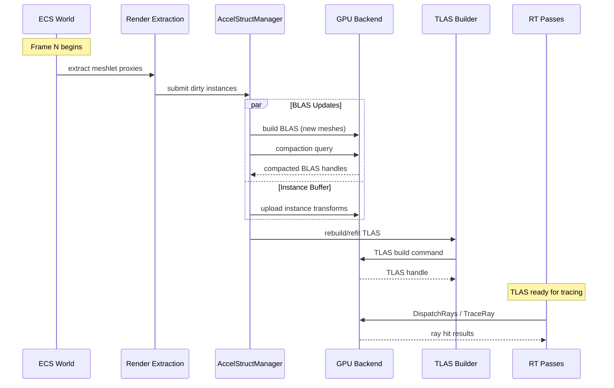
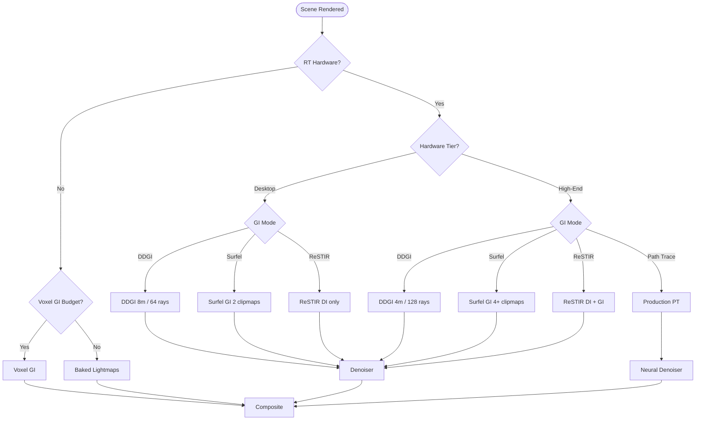
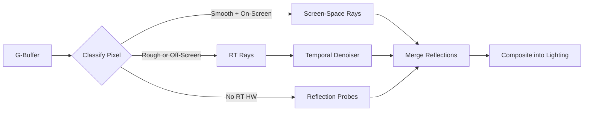
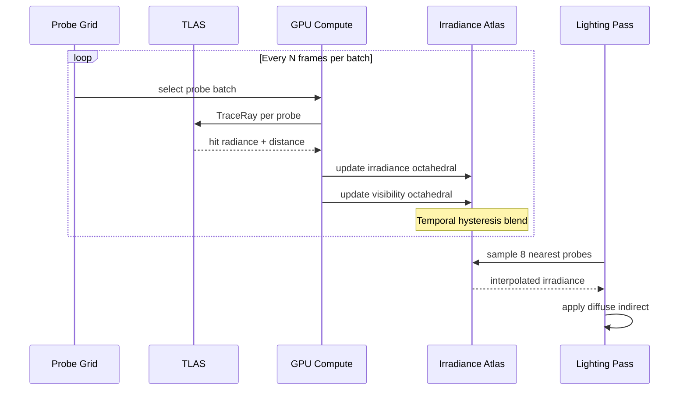
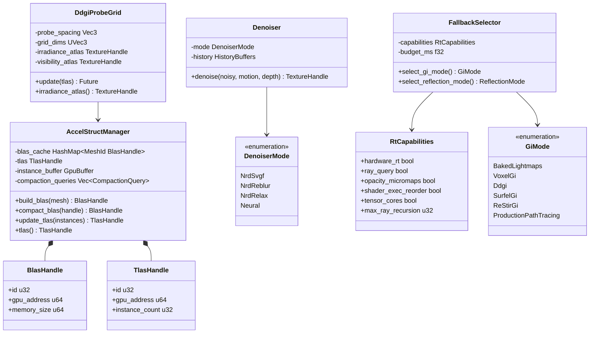

# Advanced Rendering (Ray Tracing and GI) Design

## Requirements Trace

> **Canonical sources:** Features, requirements, and user stories are defined in
> [features/rendering/](../../features/rendering/),
> [requirements/rendering/](../../requirements/rendering/), and
> [user-stories/rendering/](../../user-stories/rendering/). The table below traces design elements
> to those definitions.

### Acceleration Structures (F-2.5.1 / R-2.5.1)

| Feature | Requirement | User Stories | Description |
|---------|-------------|--------------|-------------|
| F-2.5.1 | R-2.5.1 | US-2.5.1.1, US-2.5.1.2 | BLAS build from meshlets with compaction; per-frame TLAS rebuild/refit |
| F-2.5.10 | R-2.5.10 | US-2.5.10.1, US-2.5.10.2 | Opacity micromaps for alpha-tested geometry |
| F-2.5.11 | R-2.5.11 | US-2.5.11.1, US-2.5.11.2 | Shader execution reordering for coherent wavefronts |

### Ray Traced Effects (F-2.5.2–3, F-2.5.6, F-2.5.13, F-2.5.16)

| Feature | Requirement | User Stories | Description |
|---------|-------------|--------------|-------------|
| F-2.5.2 | R-2.5.2 | US-2.5.2.1, US-2.5.2.2, US-2.5.2.3 | Hybrid SSR + RT reflections with temporal denoising |
| F-2.5.3 | R-2.5.3 | US-2.5.3.1, US-2.5.3.2 | RT one-bounce indirect diffuse lighting |
| F-2.5.6 | R-2.5.6 | US-2.5.6.1, US-2.5.6.2 | RT subsurface transmission through translucent media |
| F-2.5.13 | R-2.5.13 | US-2.5.13.1, US-2.5.13.2 | RT lens flare via lens element ray tracing |
| F-2.5.16 | R-2.5.16 | US-2.5.16.1, US-2.5.16.2 | Stochastic SSR with BRDF importance sampling |

### Global Illumination (F-2.5.4, F-2.5.7, F-2.5.8, F-2.5.14)

| Feature | Requirement | User Stories | Description |
|---------|-------------|--------------|-------------|
| F-2.5.4 | R-2.5.4 | US-2.5.4.1, US-2.5.4.2 | DDGI probe grid with octahedral irradiance atlas |
| F-2.5.7 | R-2.5.7 | US-2.5.7.1, US-2.5.7.2 | Surfel-based GI with clipmap probes and ray guiding |
| F-2.5.8 | R-2.5.8 | US-2.5.8.1, US-2.5.8.2 | ReSTIR DI + GI reservoir-based sampling |
| F-2.5.14 | R-2.5.14 | US-2.5.14.1, US-2.5.14.2 | Voxel GI for non-RT hardware |

### Path Tracing and Denoising (F-2.5.5, F-2.5.9, F-2.5.12, F-2.5.15)

| Feature | Requirement | User Stories | Description |
|---------|-------------|--------------|-------------|
| F-2.5.5 | R-2.5.5 | US-2.5.5.1, US-2.5.5.2 | Reference path tracer (offline quality) |
| F-2.5.9 | R-2.5.9 | US-2.5.9.1, US-2.5.9.2 | Production real-time path tracing with tiers |
| F-2.5.12 | R-2.5.12 | US-2.5.12.1, US-2.5.12.2 | Neural denoising with NRD fallback |
| F-2.5.15 | R-2.5.15 | US-2.5.15.1, US-2.5.15.2 | Neural radiance cache for path termination |

### Non-Functional Requirements

| NFR | Target | Verification |
|-----|--------|--------------|
| NFR-2.5.1 | BLAS incremental update < 2 ms; full rebuild < 50 ms | GPU profiler timing |
| NFR-2.5.2 | Combined RT budget <= 8 ms at 1080p default tier | Per-pass GPU timestamps |
| NFR-2.5.3 | Denoiser PSNR > 30 dB at 1 spp vs 4096 spp ref | Automated image comparison |

### Cross-Cutting Dependencies

| Dependency | Source | Consumed API |
|------------|--------|--------------|
| GPU backend trait | F-2.1.1 | `GpuBackend` associated types |
| Command buffer | F-2.1.2 | RT dispatch, AS build commands |
| Memory sub-allocator | F-2.1.7 | AS memory, scratch buffers |
| Barrier optimization | F-2.1.9 | AS build / trace barriers |
| Render graph | F-2.2.1 | Pass registration, resource decl |
| Capability gating | F-2.2.2 | RT feature pruning |
| G-Buffer | F-2.4.2 | Normal, depth, motion vectors |
| Meshlet pipeline | F-2.3.1 | Vertex/index data for BLAS |
| Shared spatial index | F-1.9.1 | Instance visibility for TLAS |
| Scene renderer | F-2.10.1 | Render proxy extraction |
| Thread pool | F-14.3.1 | Parallel BLAS builds |

---

## Overview

The advanced rendering subsystem adds hardware ray tracing and global illumination to the Harmonius
engine. It is designed as a **hybrid renderer**: rasterization handles primary visibility and base
shading, while ray tracing provides reflections, shadows, ambient occlusion, and indirect lighting
at configurable quality tiers.

The design follows four principles:

1. **Acceleration structures are ECS-driven.** BLAS and TLAS are built from meshlet render proxies
   extracted from the ECS world. No separate scene representation.
2. **Tiered fallback.** Every RT effect has a rasterization-only fallback. The `FallbackSelector`
   chooses the best technique per platform and budget.
3. **Unified denoising.** All stochastic RT outputs (reflections, GI, shadows, AO) route through a
   shared `Denoiser` with pluggable algorithms (NRD, neural).
4. **Render-graph integrated.** Every RT pass is a render graph node with declared resource I/O. The
   graph compiler handles barriers, aliasing, and scheduling automatically.

### Performance Targets

| Metric | Target |
|--------|--------|
| BLAS incremental update (10% changed) | < 2 ms |
| BLAS full rebuild | < 50 ms |
| TLAS refit (10K instances) | < 1 ms |
| Combined RT budget (1080p default) | <= 8 ms |
| Denoiser PSNR (1 spp vs 4096 ref) | > 30 dB |
| BLAS compaction VRAM savings | >= 20% |

---

## Architecture

### Module Boundaries



### Directory Layout

```text
harmonius_rendering/
├── advanced/
│   ├── accel_struct.rs     # AccelStructManager,
│   │                       # BLAS/TLAS build
│   ├── capabilities.rs     # RtCapabilities query
│   ├── fallback.rs         # FallbackSelector
│   ├── denoiser.rs         # Denoiser, NRD, neural
│   ├── reflections.rs      # RtReflections, hybrid
│   │                       # SSR+RT merge
│   ├── stochastic_ssr.rs   # StochasticSsr,
│   │                       # BRDF importance
│   ├── indirect.rs         # RtIndirectLighting
│   ├── ddgi.rs             # DdgiProbeGrid
│   ├── surfel_gi.rs        # SurfelGi, clipmaps
│   ├── voxel_gi.rs         # VoxelGi (non-RT)
│   ├── restir.rs           # ReStirSampler
│   ├── path_tracer.rs      # PathTracer (reference)
│   ├── production_pt.rs    # ProductionPathTracer
│   ├── neural_cache.rs     # NeuralRadianceCache
│   ├── opacity_micromap.rs # OpacityMicromap
│   ├── shader_reorder.rs   # ShaderExecReorder
│   ├── rt_lens_flare.rs    # RtLensFlare
│   ├── rt_subsurface.rs    # RtSubsurface
│   └── mod.rs              # Public module re-exports
└── shaders/
    └── advanced/
        ├── accel_struct.hlsl
        ├── rt_reflections.hlsl
        ├── rt_shadows.hlsl
        ├── rt_ao.hlsl
        ├── rt_indirect.hlsl
        ├── ddgi_probe_trace.hlsl
        ├── ddgi_probe_update.hlsl
        ├── ddgi_sample.hlsl
        ├── surfel_gi.hlsl
        ├── voxel_gi.hlsl
        ├── restir_di.hlsl
        ├── restir_gi.hlsl
        ├── path_trace.hlsl
        ├── denoise_svgf.hlsl
        ├── denoise_reblur.hlsl
        ├── stochastic_ssr.hlsl
        ├── rt_lens_flare.hlsl
        └── rt_subsurface.hlsl
```

### Render Graph RT Pass Integration



### Acceleration Structure Build Pipeline



### GI Tier Selection



### Hybrid Reflection Pipeline



### DDGI Probe Update Cycle



### Core Data Structures



---

## API Design

### RT Capability Detection

```rust
/// Hardware ray tracing capabilities queried at
/// device creation from the GPU backend.
#[derive(Clone, Debug)]
pub struct RtCapabilities {
    /// DXR 1.1 / Vulkan RT / Metal RT available.
    pub hardware_rt: bool,
    /// Inline ray queries in compute/fragment.
    pub ray_query: bool,
    /// Opacity micromap support (Ada+, RDNA3+).
    pub opacity_micromaps: bool,
    /// Shader execution reordering (Ada+).
    pub shader_exec_reorder: bool,
    /// Tensor cores / neural engine available.
    pub tensor_cores: bool,
    /// Maximum ray recursion depth.
    pub max_ray_recursion: u32,
    /// Maximum TLAS instance count.
    pub max_instances: u32,
    /// Maximum BLAS geometry count per AS.
    pub max_blas_geometries: u32,
}

impl RtCapabilities {
    /// Query capabilities from the GPU backend.
    /// Returns a capabilities struct with all
    /// fields populated from device feature queries.
    pub fn query<B: GpuBackend>(
        device: &B::Device,
    ) -> Self;

    /// Whether any form of RT is available.
    pub fn supports_any_rt(&self) -> bool {
        self.hardware_rt || self.ray_query
    }
}
```

### Acceleration Structure Management

```rust
/// Opaque handle to a bottom-level acceleration
/// structure. One BLAS per unique mesh asset.
#[derive(Clone, Copy, Debug, PartialEq, Eq, Hash)]
pub struct BlasHandle {
    pub id: u32,
    pub gpu_address: u64,
    pub memory_size: u64,
    pub vertex_count: u32,
}

/// Opaque handle to the top-level acceleration
/// structure. One TLAS per frame.
#[derive(Clone, Copy, Debug)]
pub struct TlasHandle {
    pub id: u32,
    pub gpu_address: u64,
    pub instance_count: u32,
}

/// Per-instance data for TLAS construction.
pub struct RtInstance {
    pub entity: Entity,
    pub blas: BlasHandle,
    /// Row-major 3x4 affine transform.
    pub transform: Mat3x4,
    /// User-defined index passed to hit shaders.
    pub custom_index: u32,
    /// Visibility mask for ray categories.
    pub mask: u8,
    /// Instance behavior flags.
    pub flags: RtInstanceFlags,
}

bitflags::bitflags! {
    pub struct RtInstanceFlags: u8 {
        /// Instance is opaque (skip any-hit).
        const OPAQUE = 0x01;
        /// Disable face culling for this instance.
        const NO_CULL = 0x02;
        /// Force non-opaque (always run any-hit).
        const FORCE_NON_OPAQUE = 0x04;
    }
}

/// BLAS build mode selection.
#[derive(Clone, Copy, Debug, PartialEq, Eq)]
pub enum BlasBuildMode {
    /// Full build with SAH optimization.
    Build,
    /// Fast refit for deforming geometry.
    Refit,
}

/// TLAS update strategy.
#[derive(Clone, Copy, Debug, PartialEq, Eq)]
pub enum TlasUpdateMode {
    /// Full rebuild. Most accurate but slower.
    Rebuild,
    /// In-place refit. Fast but may degrade
    /// trace quality over time.
    Refit,
}

/// Manages all acceleration structures for RT.
/// One instance per frame, owned as an ECS
/// resource.
pub struct AccelStructManager<B: GpuBackend> {
    // private fields
}

impl<B: GpuBackend> AccelStructManager<B> {
    pub fn new(
        device: &B::Device,
        capabilities: &RtCapabilities,
    ) -> Self;

    /// Build a BLAS from meshlet vertex/index
    /// data. Returns a handle for TLAS instancing.
    /// The build is recorded into the provided
    /// command buffer.
    pub fn build_blas(
        &mut self,
        cmd: &mut B::CommandBuffer,
        mesh_id: MeshId,
        vertices: &B::Buffer,
        indices: &B::Buffer,
        mode: BlasBuildMode,
    ) -> BlasHandle;

    /// Issue a post-build compaction query. Call
    /// `finish_compaction` after the GPU executes
    /// the build commands.
    pub fn request_compaction(
        &mut self,
        cmd: &mut B::CommandBuffer,
        handle: BlasHandle,
    );

    /// Read back compaction sizes and copy BLAS
    /// to compacted allocations. Frees the
    /// original oversized allocation.
    pub fn finish_compaction(
        &mut self,
        cmd: &mut B::CommandBuffer,
    ) -> Vec<BlasHandle>;

    /// Build or refit the TLAS from the current
    /// set of RT instances.
    pub fn update_tlas(
        &mut self,
        cmd: &mut B::CommandBuffer,
        instances: &[RtInstance],
        mode: TlasUpdateMode,
    ) -> TlasHandle;

    /// Return the current frame's TLAS handle
    /// for use by RT passes.
    pub fn tlas(&self) -> TlasHandle;

    /// Total VRAM consumed by all BLAS + TLAS.
    pub fn total_memory(&self) -> u64;

    /// Number of cached BLAS entries.
    pub fn blas_count(&self) -> u32;
}
```

### Fallback Selection

```rust
/// Active GI technique selected by the fallback
/// system based on hardware and budget.
#[derive(Clone, Copy, Debug, PartialEq, Eq)]
pub enum GiMode {
    /// Pre-baked lightmaps and light probes.
    BakedLightmaps,
    /// Voxel cone tracing (no RT required).
    VoxelGi,
    /// Dynamic Diffuse GI probe grid.
    Ddgi,
    /// Surfel-based GI with clipmap probes.
    SurfelGi,
    /// ReSTIR GI reservoir resampling.
    ReStirGi,
    /// Full production path tracing.
    ProductionPathTracing,
}

/// Active reflection technique.
#[derive(Clone, Copy, Debug, PartialEq, Eq)]
pub enum ReflectionMode {
    /// Cubemap reflection probes only.
    Probes,
    /// Stochastic screen-space reflections.
    StochasticSsr,
    /// Hybrid SSR + RT reflections.
    HybridSsrRt,
}

/// Active shadow technique for soft shadows.
#[derive(Clone, Copy, Debug, PartialEq, Eq)]
pub enum ShadowMode {
    /// Percentage-closer filtering.
    Pcf,
    /// Percentage-closer soft shadows.
    Pcss,
    /// Ray-traced soft shadows.
    RtSoftShadows,
}

/// Active ambient occlusion technique.
#[derive(Clone, Copy, Debug, PartialEq, Eq)]
pub enum AoMode {
    /// Screen-space AO at half/quarter res.
    Ssao,
    /// Ground-truth AO with bent normals.
    Gtao,
    /// Ray-traced AO.
    RtAo,
}
// **Note:** RT ambient occlusion is designed here
// and rendered via the render graph. The lighting
// system (see [lighting.md](lighting.md)) provides
// the screen-space AO fallback (`SsaoMode`). Both
// feed into the same AO compositing pass.

/// Active denoiser algorithm.
#[derive(Clone, Copy, Debug, PartialEq, Eq)]
pub enum DenoiserMode {
    /// NVIDIA Real-time Denoisers: SVGF variant.
    NrdSvgf,
    /// NRD: ReBLUR spatiotemporal filter.
    NrdReblur,
    /// NRD: ReLAX for specular-dominant signals.
    NrdRelax,
    /// Neural network denoiser (ray
    /// reconstruction). Requires tensor cores.
    Neural,
}
// **Dependency note:** NRD is a proprietary NVIDIA
// SDK requiring separate approval per project
// dependency policy. The `Neural` denoiser mode
// requires ML inference infrastructure (also
// requiring approval). Both are optional —
// `NrdSvgf` and `NrdReblur` serve as default
// fallbacks.

/// Selects the best rendering technique for each
/// RT effect based on hardware capabilities and
/// frame budget. Evaluated once at startup and
/// when quality settings change.
pub struct FallbackSelector {
    // private fields
}

impl FallbackSelector {
    pub fn new(
        capabilities: &RtCapabilities,
        budget_ms: f32,
    ) -> Self;

    pub fn select_gi_mode(&self) -> GiMode;
    pub fn select_reflection_mode(
        &self,
    ) -> ReflectionMode;
    pub fn select_shadow_mode(&self) -> ShadowMode;
    pub fn select_ao_mode(&self) -> AoMode;
    pub fn select_denoiser_mode(
        &self,
    ) -> DenoiserMode;

    /// Re-evaluate all selections after a budget
    /// or capability change.
    pub fn refresh(
        &mut self,
        capabilities: &RtCapabilities,
        budget_ms: f32,
    );
}
```

### RT Reflections (Hybrid SSR + RT)

```rust
/// Configuration for the hybrid reflection system.
pub struct RtReflectionConfig {
    /// Surface roughness above which RT rays
    /// supplement SSR. Range [0.0, 1.0].
    pub roughness_threshold: f32,
    /// Samples per pixel for RT reflection rays.
    /// Desktop: 0.5, High-end: 1.0.
    pub samples_per_pixel: f32,
    /// Resolution scale for the reflection buffer.
    /// 0.5 = half-res, 1.0 = native.
    pub resolution_scale: f32,
    /// Temporal denoiser enabled.
    pub temporal_denoise: bool,
}

/// Hybrid reflection pass combining SSR and RT.
/// Registered as a render graph pass.
pub struct RtReflections<B: GpuBackend> {
    // private fields
}

impl<B: GpuBackend> RtReflections<B> {
    pub fn new(
        device: &B::Device,
        config: RtReflectionConfig,
    ) -> Self;

    /// Register this pass with the render graph.
    /// Reads: G-buffer normals, depth, roughness,
    ///        TLAS handle, scene color (for SSR).
    /// Writes: reflection color buffer.
    pub fn register_pass(
        &self,
        graph: &mut RenderGraphBuilder,
    );

    pub fn set_config(
        &mut self,
        config: RtReflectionConfig,
    );
}
```

### Stochastic Screen-Space Reflections

```rust
/// Stochastic SSR with BRDF importance sampling.
pub struct StochasticSsrConfig {
    /// Resolution scale. Quarter-res on Switch,
    /// half-res on desktop and high-end.
    pub resolution_scale: f32,
    /// Enable BRDF importance sampling for
    /// specular elongation. Disabled on Switch.
    pub brdf_importance_sampling: bool,
    /// Adjacent pixel ray reuse.
    pub adjacent_reuse: bool,
    /// Temporal filter frame count.
    pub temporal_frames: u32,
    /// Spatial filter enabled.
    pub spatial_filter: bool,
}

pub struct StochasticSsr<B: GpuBackend> {
    // private fields
}

impl<B: GpuBackend> StochasticSsr<B> {
    pub fn new(
        device: &B::Device,
        config: StochasticSsrConfig,
    ) -> Self;

    pub fn register_pass(
        &self,
        graph: &mut RenderGraphBuilder,
    );

    pub fn set_config(
        &mut self,
        config: StochasticSsrConfig,
    );
}
```

### DDGI Probe Grid

```rust
/// DDGI probe grid configuration.
pub struct DdgiConfig {
    /// World-space spacing between probes.
    /// Desktop: 8.0m, High-end: 4.0m.
    pub probe_spacing: Vec3,
    /// Grid dimensions (probe count per axis).
    pub grid_dims: UVec3,
    /// Rays cast per probe per update.
    /// Desktop: 64, High-end: 128+.
    pub rays_per_probe: u32,
    /// Temporal hysteresis factor [0.0, 1.0].
    /// Higher = more history retention.
    pub hysteresis: f32,
    /// Irradiance atlas texel resolution per
    /// probe face (octahedral).
    pub irradiance_texels: u32,
    /// Visibility atlas texel resolution per
    /// probe face (octahedral).
    pub visibility_texels: u32,
}

/// Dynamic Diffuse Global Illumination via
/// probe grid with octahedral atlas textures.
pub struct DdgiProbeGrid<B: GpuBackend> {
    // private fields
}

impl<B: GpuBackend> DdgiProbeGrid<B> {
    pub fn new(
        device: &B::Device,
        config: DdgiConfig,
    ) -> Self;

    /// Register probe trace and update passes.
    /// Reads: TLAS handle, scene materials.
    /// Writes: irradiance atlas, visibility atlas.
    pub fn register_update_pass(
        &self,
        graph: &mut RenderGraphBuilder,
    );

    /// Register the sampling pass that applies
    /// probe irradiance to the lighting buffer.
    /// Reads: irradiance atlas, visibility atlas,
    ///        G-buffer position/normal.
    /// Writes: diffuse indirect buffer.
    pub fn register_sample_pass(
        &self,
        graph: &mut RenderGraphBuilder,
    );

    /// Handle to the irradiance atlas for
    /// external consumers.
    pub fn irradiance_atlas(
        &self,
    ) -> TextureHandle;

    /// Handle to the visibility atlas.
    pub fn visibility_atlas(
        &self,
    ) -> TextureHandle;

    pub fn set_config(&mut self, config: DdgiConfig);
}
```

### Surfel-Based GI

```rust
/// Surfel GI configuration.
pub struct SurfelGiConfig {
    /// Number of clipmap levels.
    /// Desktop: 2, High-end: 4+.
    pub clipmap_levels: u32,
    /// Surfel density (surfels per square meter).
    pub surfel_density: f32,
    /// Enable ray guiding for efficient sampling.
    pub ray_guiding: bool,
    /// Enable ray binning for coherent dispatch.
    pub ray_binning: bool,
    /// Enable separate character lighting probes.
    pub character_probes: bool,
}

pub struct SurfelGi<B: GpuBackend> {
    // private fields
}

impl<B: GpuBackend> SurfelGi<B> {
    pub fn new(
        device: &B::Device,
        config: SurfelGiConfig,
    ) -> Self;

    /// Register surfel generation pass.
    /// Reads: G-buffer depth, normals, albedo.
    /// Writes: surfel buffer.
    pub fn register_surfel_pass(
        &self,
        graph: &mut RenderGraphBuilder,
    );

    /// Register ray trace pass from surfels.
    /// Reads: surfel buffer, TLAS.
    /// Writes: surfel radiance buffer.
    pub fn register_trace_pass(
        &self,
        graph: &mut RenderGraphBuilder,
    );

    /// Register clipmap probe update.
    /// Reads: surfel radiance.
    /// Writes: clipmap irradiance, depth atlases.
    pub fn register_probe_update_pass(
        &self,
        graph: &mut RenderGraphBuilder,
    );

    /// Register final sampling pass.
    /// Reads: clipmap probes, G-buffer.
    /// Writes: diffuse indirect buffer.
    pub fn register_sample_pass(
        &self,
        graph: &mut RenderGraphBuilder,
    );

    pub fn set_config(
        &mut self,
        config: SurfelGiConfig,
    );
}
```

### Voxel-Based GI (Non-RT Fallback)

```rust
/// Voxel GI configuration for non-RT hardware.
pub struct VoxelGiConfig {
    /// Voxel grid resolution per axis.
    /// Switch: 64, Desktop: 128, High-end: 256.
    pub grid_resolution: u32,
    /// Number of cascade levels.
    /// Switch: 1, Desktop: 2, High-end: 3+.
    pub cascade_count: u32,
    /// Enable per-voxel translucency storage.
    pub translucency: bool,
}

pub struct VoxelGi<B: GpuBackend> {
    // private fields
}

impl<B: GpuBackend> VoxelGi<B> {
    pub fn new(
        device: &B::Device,
        config: VoxelGiConfig,
    ) -> Self;

    /// Register voxelization pass.
    /// Reads: scene geometry, materials.
    /// Writes: 3D voxel textures (albedo, normal,
    ///         translucency).
    pub fn register_voxelize_pass(
        &self,
        graph: &mut RenderGraphBuilder,
    );

    /// Register re-lighting pass. Can be called
    /// without re-voxelization for time-of-day.
    /// Reads: voxel cache, light data.
    /// Writes: lit voxel cache.
    pub fn register_relight_pass(
        &self,
        graph: &mut RenderGraphBuilder,
    );

    /// Register cone-trace sampling pass.
    /// Reads: lit voxel cache, G-buffer.
    /// Writes: diffuse indirect buffer.
    pub fn register_sample_pass(
        &self,
        graph: &mut RenderGraphBuilder,
    );

    pub fn set_config(
        &mut self,
        config: VoxelGiConfig,
    );
}
```

### ReSTIR Sampling

```rust
/// ReSTIR framework configuration.
pub struct ReStirConfig {
    /// Enable ReSTIR DI (direct illumination).
    pub enable_di: bool,
    /// Enable ReSTIR GI (indirect illumination).
    /// Desktop: false, High-end: true.
    pub enable_gi: bool,
    /// Reservoir size per pixel.
    pub reservoir_size: u32,
    /// Spatial reuse neighbor count.
    pub spatial_neighbors: u32,
    /// Temporal reuse enabled.
    pub temporal_reuse: bool,
}

pub struct ReStirSampler<B: GpuBackend> {
    // private fields
}

impl<B: GpuBackend> ReStirSampler<B> {
    pub fn new(
        device: &B::Device,
        config: ReStirConfig,
    ) -> Self;

    /// Register initial candidate generation.
    /// Reads: TLAS, light buffer, G-buffer.
    /// Writes: reservoir buffer.
    pub fn register_candidate_pass(
        &self,
        graph: &mut RenderGraphBuilder,
    );

    /// Register temporal reuse pass.
    /// Reads: current + previous reservoir,
    ///        motion vectors.
    /// Writes: updated reservoir buffer.
    pub fn register_temporal_pass(
        &self,
        graph: &mut RenderGraphBuilder,
    );

    /// Register spatial reuse pass.
    /// Reads: reservoir buffer, G-buffer.
    /// Writes: final reservoir buffer.
    pub fn register_spatial_pass(
        &self,
        graph: &mut RenderGraphBuilder,
    );

    /// Register final shading pass.
    /// Reads: final reservoirs, materials.
    /// Writes: direct/indirect lighting buffer.
    pub fn register_shade_pass(
        &self,
        graph: &mut RenderGraphBuilder,
    );

    pub fn set_config(
        &mut self,
        config: ReStirConfig,
    );
}
```

### Path Tracer (Reference)

```rust
/// Reference path tracer configuration.
pub struct PathTracerConfig {
    /// Samples per pixel. Accumulates across
    /// frames for progressive rendering.
    pub samples_per_pixel: u32,
    /// Maximum bounce depth.
    pub max_bounces: u32,
    /// Enable volumetric scattering integration.
    pub volumetrics: bool,
    /// Enable sky atmosphere integration.
    pub sky_atmosphere: bool,
}

/// Progressive unbiased path tracer for
/// ground-truth reference rendering.
pub struct PathTracer<B: GpuBackend> {
    // private fields
}

impl<B: GpuBackend> PathTracer<B> {
    pub fn new(
        device: &B::Device,
        config: PathTracerConfig,
    ) -> Self;

    /// Register the path tracing pass.
    /// Reads: TLAS, materials, sky, volumes.
    /// Writes: accumulated radiance buffer.
    pub fn register_pass(
        &self,
        graph: &mut RenderGraphBuilder,
    );

    /// Reset accumulation (e.g., after camera
    /// move). Next frame starts from sample 0.
    pub fn reset_accumulation(&mut self);

    /// Current accumulated sample count.
    pub fn accumulated_samples(&self) -> u32;

    pub fn set_config(
        &mut self,
        config: PathTracerConfig,
    );
}
```

### Production Path Tracer

```rust
/// Quality tier for production path tracing.
#[derive(Clone, Copy, Debug, PartialEq, Eq)]
pub enum PathTracingTier {
    /// Direct RT only: shadows + reflections.
    /// Rasterized GI for indirect.
    DirectOnly,
    /// Single-bounce: direct + 1 indirect bounce.
    /// Rasterized GI fallback after bounce.
    SingleBounce,
    /// Multi-bounce: 2-4 bounces with rasterized
    /// GI fallback at termination.
    MultiBounce,
}

/// Production real-time path tracing config.
pub struct ProductionPtConfig {
    /// Quality tier controlling bounce count.
    pub tier: PathTracingTier,
    /// Maximum bounce depth.
    pub max_bounces: u32,
    /// Enable neural denoiser (requires tensor
    /// cores; falls back to NRD otherwise).
    pub neural_denoise: bool,
    /// Enable temporal upscaling after denoise.
    pub temporal_upscale: bool,
}

pub struct ProductionPathTracer<B: GpuBackend> {
    // private fields
}

impl<B: GpuBackend> ProductionPathTracer<B> {
    pub fn new(
        device: &B::Device,
        config: ProductionPtConfig,
    ) -> Self;

    /// Register the production PT pass.
    /// Reads: TLAS, materials, rasterized GI
    ///        (for fallback at termination).
    /// Writes: noisy radiance buffer.
    pub fn register_trace_pass(
        &self,
        graph: &mut RenderGraphBuilder,
    );

    /// Register the denoise pass.
    /// Reads: noisy radiance, motion vectors,
    ///        depth.
    /// Writes: denoised color buffer.
    pub fn register_denoise_pass(
        &self,
        graph: &mut RenderGraphBuilder,
    );

    pub fn set_config(
        &mut self,
        config: ProductionPtConfig,
    );
}
```

### Denoiser

```rust
/// History buffer management for temporal
/// denoisers.
pub struct HistoryBuffers<B: GpuBackend> {
    // private fields
}

/// Unified denoiser for all stochastic RT output.
pub struct Denoiser<B: GpuBackend> {
    // private fields
}

/// Per-signal denoiser input descriptor.
pub struct DenoiseInput {
    /// The noisy input texture.
    pub noisy: TextureHandle,
    /// Per-pixel motion vectors.
    pub motion_vectors: TextureHandle,
    /// Linear depth buffer.
    pub depth: TextureHandle,
    /// World-space normals.
    pub normals: TextureHandle,
    /// Signal type hint for algorithm tuning.
    pub signal: DenoiseSignal,
}

/// Signal type for denoiser algorithm selection.
#[derive(Clone, Copy, Debug, PartialEq, Eq)]
pub enum DenoiseSignal {
    /// Diffuse indirect lighting (GI).
    DiffuseIndirect,
    /// Specular reflections.
    SpecularReflections,
    /// Shadow penumbra.
    Shadows,
    /// Ambient occlusion.
    AmbientOcclusion,
}

impl<B: GpuBackend> Denoiser<B> {
    pub fn new(
        device: &B::Device,
        mode: DenoiserMode,
    ) -> Self;

    /// Register a denoise pass for a single
    /// signal. Multiple signals may be registered
    /// independently.
    /// Reads: noisy texture, motion, depth,
    ///        normals.
    /// Writes: denoised output texture.
    pub fn register_pass(
        &self,
        graph: &mut RenderGraphBuilder,
        input: &DenoiseInput,
    );

    /// Invalidate temporal history (scene cut,
    /// teleport, etc.).
    pub fn reset_history(&mut self);

    pub fn set_mode(&mut self, mode: DenoiserMode);
}
```

### Opacity Micromaps

```rust
/// Opacity micromap configuration.
pub struct OpacityMicromapConfig {
    /// Subdivision level for micro-triangles.
    /// Higher = more accurate but more memory.
    pub subdivision_level: u32,
}

/// Manages opacity micromap generation and
/// attachment to BLAS for alpha-tested geometry.
pub struct OpacityMicromap<B: GpuBackend> {
    // private fields
}

impl<B: GpuBackend> OpacityMicromap<B> {
    pub fn new(
        device: &B::Device,
        config: OpacityMicromapConfig,
    ) -> Self;

    /// Generate an opacity micromap from an alpha
    /// mask texture. Each micro-triangle is
    /// classified as opaque, transparent, or
    /// unknown.
    pub fn generate(
        &mut self,
        cmd: &mut B::CommandBuffer,
        alpha_texture: &B::Texture,
        uv_buffer: &B::Buffer,
        index_buffer: &B::Buffer,
    ) -> OmmHandle;

    /// Attach a generated OMM to a BLAS before
    /// building.
    pub fn attach_to_blas(
        &self,
        omm: OmmHandle,
        blas_desc: &mut BlasGeometryDesc,
    );
}

#[derive(Clone, Copy, Debug, PartialEq, Eq, Hash)]
pub struct OmmHandle(pub u32);
```

### Shader Execution Reordering

```rust
/// Shader execution reordering integration.
/// Enabled automatically on supported hardware
/// (Ada Lovelace+ via VK_NV extension or D3D12
/// SER API).
pub struct ShaderExecReorder {
    // private fields
}

impl ShaderExecReorder {
    pub fn new(
        capabilities: &RtCapabilities,
    ) -> Option<Self>;

    /// Whether SER is active for the current
    /// session.
    pub fn is_active(&self) -> bool;

    /// Insert SER hint into RT pipeline state
    /// creation. The hint instructs the driver to
    /// reorder shader invocations after
    /// intersection.
    pub fn configure_pipeline(
        &self,
        desc: &mut RtPipelineDesc,
    );
}
```

### Neural Radiance Cache

```rust
/// Neural radiance cache configuration.
pub struct NeuralRadianceCacheConfig {
    /// Maximum bounce depth before neural
    /// termination (typically 2-3).
    pub termination_depth: u32,
    /// Percentage of full-length training paths.
    /// Default: 0.05 (5%).
    pub training_path_fraction: f32,
    /// Network hidden layer width.
    pub hidden_width: u32,
}

pub struct NeuralRadianceCache<B: GpuBackend> {
    // private fields
}

impl<B: GpuBackend> NeuralRadianceCache<B> {
    pub fn new(
        device: &B::Device,
        config: NeuralRadianceCacheConfig,
    ) -> Option<Self>;

    /// Register the training pass (runs every
    /// frame with a subset of paths).
    /// Reads: full-length path radiance samples.
    /// Writes: network weights buffer.
    pub fn register_train_pass(
        &self,
        graph: &mut RenderGraphBuilder,
    );

    /// Register the inference pass for path
    /// termination.
    /// Reads: path state (position, direction),
    ///        network weights.
    /// Writes: predicted radiance.
    pub fn register_inference_pass(
        &self,
        graph: &mut RenderGraphBuilder,
    );

    pub fn set_config(
        &mut self,
        config: NeuralRadianceCacheConfig,
    );
}
```

### RT Lens Flare

```rust
/// RT lens flare configuration.
pub struct RtLensFlareConfig {
    /// Number of lens elements in the model.
    pub lens_element_count: u32,
    /// Brightness threshold for flare sources.
    pub brightness_threshold: f32,
    /// Maximum number of bright sources to trace.
    pub max_sources: u32,
}

pub struct RtLensFlare<B: GpuBackend> {
    // private fields
}

impl<B: GpuBackend> RtLensFlare<B> {
    pub fn new(
        device: &B::Device,
        config: RtLensFlareConfig,
    ) -> Self;

    /// Register the lens flare pass.
    /// Reads: scene color (bright pixels), TLAS
    ///        (for occlusion).
    /// Writes: lens flare overlay texture.
    pub fn register_pass(
        &self,
        graph: &mut RenderGraphBuilder,
    );

    pub fn set_config(
        &mut self,
        config: RtLensFlareConfig,
    );
}
```

### RT Subsurface Transmission

```rust
/// RT subsurface transmission configuration.
pub struct RtSubsurfaceConfig {
    /// Enable for hero characters only (desktop)
    /// or all SSS materials (high-end).
    pub scope: SubsurfaceScope,
    /// Maximum scattering depth in world units.
    pub max_scatter_distance: f32,
}

#[derive(Clone, Copy, Debug, PartialEq, Eq)]
pub enum SubsurfaceScope {
    /// Only hero characters (limited budget).
    HeroOnly,
    /// All materials with SSS profiles.
    AllSss,
}

pub struct RtSubsurface<B: GpuBackend> {
    // private fields
}

impl<B: GpuBackend> RtSubsurface<B> {
    pub fn new(
        device: &B::Device,
        config: RtSubsurfaceConfig,
    ) -> Self;

    /// Register the RT subsurface pass.
    /// Reads: TLAS, shadow rays, SSS profiles.
    /// Writes: subsurface transmission buffer.
    pub fn register_pass(
        &self,
        graph: &mut RenderGraphBuilder,
    );

    pub fn set_config(
        &mut self,
        config: RtSubsurfaceConfig,
    );
}
```

### ECS Components

```rust
/// Marker component enabling RT for an entity.
/// Entities with this component produce BLAS
/// entries and TLAS instances.
#[derive(Component, Reflect)]
pub struct RtEnabled;

/// Per-entity RT instance mask. Controls which
/// ray types can hit this entity.
#[derive(Component, Reflect)]
pub struct RtMask(pub u8);

/// RT instance flags override.
#[derive(Component, Reflect)]
pub struct RtFlags(pub RtInstanceFlags);

/// ECS resource holding the active RT mode
/// selections. Written by FallbackSelector,
/// read by RT systems.
#[derive(Resource)]
pub struct ActiveRtModes {
    pub gi: GiMode,
    pub reflections: ReflectionMode,
    pub shadows: ShadowMode,
    pub ao: AoMode,
    pub denoiser: DenoiserMode,
}
```

### ECS Systems

```rust
/// System ordering within the render schedule.
///
/// 1. RtCapabilityDetectSystem (startup only)
/// 2. FallbackSelectionSystem (on settings change)
/// 3. BlasUpdateSystem (after mesh extraction)
/// 4. TlasUpdateSystem (after BLAS + transforms)
/// 5. RtPassRegistrationSystem (graph build phase)
/// 6. DenoisePassSystem (after RT passes)

/// Detects RT capabilities and writes the
/// RtCapabilities resource. Runs once at startup.
pub fn rt_capability_detect_system<B: GpuBackend>(
    device: Res<B::Device>,
    mut caps: ResMut<RtCapabilities>,
);

/// Evaluates fallback selections when quality
/// settings or capabilities change.
pub fn fallback_selection_system(
    caps: Res<RtCapabilities>,
    settings: Res<QualitySettings>,
    mut modes: ResMut<ActiveRtModes>,
    mut selector: ResMut<FallbackSelector>,
);

/// Builds BLAS for new/changed meshes.
pub fn blas_update_system<B: GpuBackend>(
    mut asm: ResMut<AccelStructManager<B>>,
    changed: Query<
        (&MeshHandle, &RtEnabled),
        Changed<MeshHandle>,
    >,
    mut cmd: ResMut<B::CommandBuffer>,
);

/// Rebuilds/refits TLAS from all RT-enabled
/// entities.
pub fn tlas_update_system<B: GpuBackend>(
    mut asm: ResMut<AccelStructManager<B>>,
    instances: Query<(
        Entity,
        &GlobalTransform,
        &MeshHandle,
        &RtEnabled,
        Option<&RtMask>,
        Option<&RtFlags>,
    )>,
    mut cmd: ResMut<B::CommandBuffer>,
);
```

---

## Data Flow

### Per-Frame RT Pipeline

The RT pipeline runs within the frame's render graph after G-buffer generation:

```rust
// Pseudocode: RT frame flow
fn build_rt_graph<B: GpuBackend>(
    graph: &mut RenderGraphBuilder,
    modes: &ActiveRtModes,
    asm: &AccelStructManager<B>,
    denoiser: &Denoiser<B>,
) {
    // 1. TLAS is built earlier in the frame
    let tlas = asm.tlas();

    // 2. Register active RT passes
    match modes.shadows {
        ShadowMode::RtSoftShadows => {
            rt_shadows.register_pass(graph);
            denoiser.register_pass(
                graph,
                &shadow_denoise_input,
            );
        }
        _ => { /* raster shadows already in graph */ }
    }

    match modes.reflections {
        ReflectionMode::HybridSsrRt => {
            rt_reflections.register_pass(graph);
            denoiser.register_pass(
                graph,
                &reflection_denoise_input,
            );
        }
        ReflectionMode::StochasticSsr => {
            stochastic_ssr.register_pass(graph);
        }
        _ => { /* probes registered elsewhere */ }
    }

    match modes.gi {
        GiMode::Ddgi => {
            ddgi.register_update_pass(graph);
            ddgi.register_sample_pass(graph);
        }
        GiMode::SurfelGi => {
            surfel.register_surfel_pass(graph);
            surfel.register_trace_pass(graph);
            surfel.register_probe_update_pass(graph);
            surfel.register_sample_pass(graph);
        }
        GiMode::VoxelGi => {
            voxel.register_voxelize_pass(graph);
            voxel.register_relight_pass(graph);
            voxel.register_sample_pass(graph);
        }
        GiMode::ReStirGi => {
            restir.register_candidate_pass(graph);
            restir.register_temporal_pass(graph);
            restir.register_spatial_pass(graph);
            restir.register_shade_pass(graph);
        }
        GiMode::ProductionPathTracing => {
            ppt.register_trace_pass(graph);
            ppt.register_denoise_pass(graph);
        }
        GiMode::BakedLightmaps => {
            /* lightmap sampling in lighting pass */
        }
    }

    match modes.ao {
        AoMode::RtAo => {
            rt_ao.register_pass(graph);
            denoiser.register_pass(
                graph,
                &ao_denoise_input,
            );
        }
        _ => { /* SSAO/GTAO registered elsewhere */ }
    }
}
```

### BLAS Lifecycle

1. **Mesh imported** -- asset pipeline produces meshlet vertex/index buffers.
2. **Entity spawned with `RtEnabled`** -- `blas_update_system` checks if a BLAS exists for this
   `MeshId` in the cache.
3. **Cache miss** -- `build_blas()` records a build command. A compaction query is issued.
4. **Next frame** -- `finish_compaction()` reads back compacted sizes, copies BLAS to tight
   allocations, frees originals.
5. **Entity despawned** -- reference count on BLAS decrements. When zero, BLAS memory is freed.
6. **Deforming mesh** -- `build_blas()` called with `BlasBuildMode::Refit` for fast update.

### TLAS Rebuild vs Refit Decision

| Condition | Strategy |
|-----------|----------|
| < 5% instances changed | Refit |
| 5-30% instances changed | Refit |
| > 30% instances changed | Rebuild |
| Any instance added/removed | Rebuild |
| Every 60 frames (quality refresh) | Rebuild |

### Denoiser History Management

The denoiser maintains per-signal history buffers (previous frame color, moments, hit distance). On
disocclusion (detected via motion vectors and depth comparison), history is invalidated per-pixel
and the spatial filter increases its kernel radius to compensate.

History is fully reset on:

- Scene cuts / teleportation
- Quality tier change
- Resolution change

---

## Platform Considerations

### D3D12 (Windows)

| Component | API | Notes |
|-----------|-----|-------|
| RT pipeline | DXR 1.1 | `ID3D12Device5::CreateStateObject`, `D3D12_RAYTRACING_ACCELERATION_STRUCTURE_TYPE` |
| BLAS build | `BuildRaytracingAccelerationStructure` | Scratch buffer from sub-allocator |
| TLAS build | Same API, `TOP_LEVEL` type | Instance buffer as structured upload |
| Dispatch rays | `DispatchRays` | Shader binding table (SBT) managed per-frame |
| Ray query | DXR 1.1 inline | `RayQuery` HLSL object in compute/pixel shaders |
| Opacity micromaps | D3D12 OMM API | `D3D12_RAYTRACING_GEOMETRY_DESC` with OMM attached |
| SER | D3D12 SER API | `D3D12_STATE_OBJECT_FLAG_ALLOW_INVOCATION_REORDERING` |
| Compaction | `POSTBUILD_INFO_COMPACTED_SIZE` | Read-back via readback buffer |
| Neural denoise | DLSS Ray Reconstruction | Via NVIDIA NGX SDK, C++ wrapper via cxx.rs |

### Metal (macOS)

| Component | API | Notes |
|-----------|-----|-------|
| RT pipeline | Metal RT (M3+/A17+) | `MTLAccelerationStructure`, `MTLIntersectionFunctionTable` |
| BLAS build | `MTLPrimitiveAccelerationStructureDescriptor` | Swift wrapper via `@_cdecl` + bindgen |
| TLAS build | `MTLInstanceAccelerationStructureDescriptor` | Instance buffer as MTLBuffer |
| Dispatch rays | `useResource:usage:stages:` + intersection | Metal RT uses intersection functions, not DispatchRays |
| Ray query | Metal intersection queries | `intersector.intersect()` in compute kernels |
| Opacity micromaps | Not supported | Skip; rely on any-hit shaders |
| SER | Not supported | No-op on Metal |
| Compaction | `MTLAccelerationStructure.size` | Refit-based compaction |
| Neural denoise | MetalFX temporal | Fallback to NRD SVGF on Metal |

### Vulkan (Linux / Windows)

| Component | API | Notes |
|-----------|-----|-------|
| RT pipeline | `VK_KHR_ray_tracing_pipeline` | `vkCreateRayTracingPipelinesKHR` |
| BLAS build | `vkCmdBuildAccelerationStructuresKHR` | `VK_BUILD_ACCELERATION_STRUCTURE_ALLOW_COMPACTION_BIT` |
| TLAS build | Same API, `TOP_LEVEL` type | Instance buffer via `VkAccelerationStructureInstanceKHR` |
| Dispatch rays | `vkCmdTraceRaysKHR` | SBT via `VkStridedDeviceAddressRegionKHR` |
| Ray query | `VK_KHR_ray_query` | `rayQueryEXT` in GLSL/HLSL compiled to SPIR-V |
| Opacity micromaps | `VK_EXT_opacity_micromap` | Ada+, RDNA3+ |
| SER | `VK_NV_ray_tracing_invocation_reorder` | Ada+ NVIDIA only |
| Compaction | `VK_QUERY_TYPE_ACCELERATION_STRUCTURE_COMPACTED_SIZE_KHR` | Query pool readback |
| Neural denoise | DLSS via Vulkan NGX | Fallback to NRD on non-NVIDIA |

### Shader Pipeline

All RT shaders are authored in HLSL:

| Stage | HLSL Entry | Compilation |
|-------|-----------|-------------|
| Ray generation | `[shader("raygeneration")]` | DXC to DXIL (D3D12) / SPIR-V (Vulkan) |
| Closest hit | `[shader("closesthit")]` | DXC to DXIL / SPIR-V |
| Any hit | `[shader("anyhit")]` | DXC to DXIL / SPIR-V |
| Miss | `[shader("miss")]` | DXC to DXIL / SPIR-V |
| Intersection | `[shader("intersection")]` | DXC to DXIL / SPIR-V |
| Ray query (compute) | Inline `RayQuery<>` | DXC to DXIL / SPIR-V |
| Metal RT | N/A | DXIL to MSL via Metal Shader Converter |

### Platform Tier Matrix

| Feature | Mobile | Switch | Switch 2 | Desktop | High-End |
|---------|--------|--------|-----------|---------|----------|
| BLAS/TLAS | Off (A17+: limited) | Off | Limited | Full | Full |
| RT Reflections | Off | Off | Off | Hybrid 0.5 spp | Hybrid 1 spp |
| RT Shadows | Off | Off | Off | Optional | Full |
| RT AO | Off | Off | Off | Optional | Full |
| DDGI | Off | Off | Off | 8m / 64 rays | 4m / 128 rays |
| Surfel GI | Off | Off | Off | 2 clipmaps | 4+ clipmaps |
| Voxel GI | Off | 64^3 / 1 casc | 64^3 / 1 casc | 128^3 / 2 casc | 256^3 / 3+ casc |
| ReSTIR DI | Off | Off | Off | DI only | DI + GI |
| Path Tracing (ref) | Off | Off | Off | Editor only | Editor only |
| Production PT | Off | Off | Off | Direct-only | Multi-bounce |
| Neural Denoise | Off | Off | Off | NRD fallback | Neural (RTX 40+) |
| Neural Radiance Cache | Off | Off | Off | Off | RTX 40+ / RDNA4+ |
| Opacity Micromaps | Off | Off | Off | Ada+ / RDNA3+ | Ada+ / RDNA3+ |
| SER | Off | Off | Off | Ada+ | Ada+ |
| Stochastic SSR | Off | Probes | Quarter-res | Half-res | Half-res + denoise |
| RT Lens Flare | Off | Off | Off | Optional | Full |
| RT Subsurface | Off | Off | Off | Hero only | All SSS |

### VRAM Budget Estimates (1080p)

| Resource | Desktop | High-End |
|----------|---------|----------|
| BLAS total (10K meshes) | 256 MB | 512 MB |
| TLAS (10K instances) | 8 MB | 8 MB |
| TLAS scratch | 16 MB | 16 MB |
| DDGI irradiance atlas | 16 MB | 64 MB |
| DDGI visibility atlas | 8 MB | 32 MB |
| Surfel buffer | 32 MB | 64 MB |
| Surfel clipmap probes | 32 MB | 128 MB |
| Voxel GI 3D textures | 64 MB | 256 MB |
| ReSTIR reservoirs | 64 MB | 128 MB |
| Denoiser history | 48 MB | 48 MB |
| Neural radiance cache | N/A | 128 MB |
| **Total RT VRAM** | **~544 MB** | **~1,384 MB** |

---

### VFX and Ray Tracing

Particle systems do not contribute to RT acceleration structures by default (too dynamic, too
numerous). Mesh-based VFX (debris, large projectiles) can opt in to BLAS registration via a
`RtVisible` component. VFX materials are evaluated in RT hit shaders when `RtVisible` is present.

## Test Plan

### Unit Tests

| Test | Req | Description |
|------|-----|-------------|
| `test_blas_build_from_meshlets` | R-2.5.1 | Build BLAS from 10K meshlets; verify valid handle and non-zero GPU address. |
| `test_blas_compaction_saves_memory` | R-2.5.1 | Build + compact BLAS; verify compacted size is at least 20% smaller. |
| `test_tlas_refit_preserves_intersections` | R-2.5.1 | Move 50% of instances, refit TLAS, verify ray hits match rebuilt TLAS. |
| `test_tlas_rebuild_vs_refit_threshold` | R-2.5.1 | Verify rebuild triggered when > 30% instances change. |
| `test_capability_detection` | R-2.5.1 | Mock each backend's feature queries; verify `RtCapabilities` fields. |
| `test_fallback_no_rt_selects_voxel_gi` | R-2.5.14 | Set `hardware_rt = false`; verify `GiMode::VoxelGi` selected. |
| `test_fallback_desktop_selects_ddgi` | R-2.5.4 | Desktop RT caps; verify `GiMode::Ddgi` selected at default budget. |
| `test_fallback_high_end_selects_surfel` | R-2.5.7 | High-end RT caps; verify surfel GI available. |
| `test_denoiser_nrd_fallback` | R-2.5.12 | Set `tensor_cores = false`; verify `DenoiserMode::NrdReblur` selected. |
| `test_omm_skipped_without_support` | R-2.5.10 | Set `opacity_micromaps = false`; verify OMM generation is no-op. |
| `test_ser_skipped_without_support` | R-2.5.11 | Set `shader_exec_reorder = false`; verify `ShaderExecReorder::new` returns `None`. |
| `test_ddgi_probe_grid_dimensions` | R-2.5.4 | Verify probe count = ceil(world_size / spacing) per axis. |
| `test_restir_reservoir_memory` | R-2.5.8 | At 1080p with 32-byte reservoirs, verify total < 2 GB budget. |
| `test_path_tracer_energy_conservation` | R-2.5.5 | White-furnace test: verify no energy gain/loss over 16 bounces. |
| `test_production_pt_gi_fallback` | R-2.5.9 | Verify terminated paths sample rasterized GI, not black. |
| `test_voxel_gi_relight_no_revoxelize` | R-2.5.14 | Change light direction; verify re-lighting without re-voxelization. |
| `test_stochastic_ssr_half_res` | R-2.5.16 | Verify reflection buffer dimensions are half render resolution. |
| `test_rt_subsurface_thickness` | R-2.5.6 | Vary material thickness; verify transmission attenuates exponentially. |

### Integration Tests

| Test | Req | Description |
|------|-----|-------------|
| `test_cornell_box_color_bleed` | R-2.5.3, R-2.5.4 | Cornell box: red/green wall color bleeding visible on white surfaces. PSNR > 30 dB vs reference. |
| `test_hybrid_reflection_offscreen` | R-2.5.2 | Glossy floor reflecting off-screen object: SSR fails, RT produces correct result. |
| `test_hybrid_reflection_roughness_handoff` | R-2.5.2 | Increase roughness past threshold; verify RT rays activate. |
| `test_ddgi_dynamic_light_response` | R-2.5.4 | Move light source; verify DDGI probes update within 2 seconds. |
| `test_surfel_gi_open_world_scaling` | R-2.5.7 | Double environment size; verify GPU cost within 10% variance. |
| `test_restir_5000_lights` | R-2.5.8 | 5K lights scene: verify all contribute; cost independent of count. |
| `test_path_tracer_convergence` | R-2.5.5 | 4096 spp Cornell box: < 1% relative error vs analytical reference. |
| `test_neural_denoise_temporal_stability` | R-2.5.12 | 120 frames of camera motion: no ghosting or flickering. |
| `test_omm_vegetation_throughput` | R-2.5.10 | Vegetation scene with OMM: >= 30% RT intersection throughput improvement. |
| `test_rt_lens_flare_ghost_positions` | R-2.5.13 | Bright source with 5-element lens: ghost positions within 5% angular error of analytical prediction. |
| `test_full_tier_cascade` | All | Walk through each platform tier; verify correct passes active and fallbacks engage. |
| `test_gcd_rt_command_buffer` | R-2.5.1 | macOS: verify Metal RT build commands submit and complete via GCD dispatch. |

### Benchmarks

| Benchmark | Target | Source |
|-----------|--------|--------|
| BLAS build (10K meshlets) | < 50 ms full rebuild | NFR-2.5.1 |
| BLAS incremental (10% changed) | < 2 ms | NFR-2.5.1 |
| TLAS refit (10K instances) | < 1 ms | R-2.5.1 |
| Combined RT (1080p default) | <= 8 ms | NFR-2.5.2 |
| DDGI probe update (64 rays/probe) | < 2 ms | R-2.5.4 |
| Surfel GI full pipeline | < 4 ms | R-2.5.7 |
| ReSTIR DI (5K lights) | < 3 ms | R-2.5.8 |
| Denoiser per signal | < 1 ms | NFR-2.5.3 |
| Voxel GI relight | < 2 ms | R-2.5.14 |
| Stochastic SSR half-res | < 1.5 ms | R-2.5.16 |
| Path tracer 1 spp | < 16 ms | R-2.5.9 |

---

## Open Questions

1. **TLAS refit quality degradation** -- After many consecutive refits without rebuild, BVH quality
   degrades and trace cost increases. Need to determine the optimal rebuild interval (every N frames
   vs quality-threshold-triggered).

2. **BLAS compaction latency** -- Compaction requires a GPU readback of compacted sizes, introducing
   a 1-frame delay. Should we pipeline compaction across 2 frames (build frame N, compact frame N+1)
   or accept the temporary memory overhead?

3. **Denoiser selection per signal** -- Should each RT signal (shadows, reflections, GI, AO) use the
   same denoiser algorithm, or should each signal select independently (e.g., ReLAX for specular,
   ReBLUR for diffuse)?

4. **ReSTIR reservoir precision** -- 16-bit vs 32-bit reservoir weights. 16-bit halves memory but
   may cause bias in high-dynamic-range scenes. Need numerical analysis.

5. **Neural radiance cache training convergence** -- How many frames does the network need to
   converge on a new scene? If convergence is slow, should we fall back to traditional path tracing
   during the warmup period?

6. **Surfel vs DDGI default** -- For the desktop RT tier, should DDGI or surfel GI be the default
   mode? Surfel handles fully dynamic scenes better but has higher base cost. DDGI is cheaper but
   requires a grid that may not cover all geometry.

7. **Metal RT BLAS budget** -- Apple M3+/A17+ have limited BLAS budgets compared to desktop GPUs.
   Need to determine maximum instance counts and geometry complexity thresholds for Metal RT.

8. **Shader binding table management** -- SBT layout differs between D3D12 (DXR) and Vulkan. Should
   the SBT be managed per-backend with a shared descriptor, or abstracted behind the GPU backend
   trait?

9. **Voxel GI and surfel GI coexistence** -- Can voxel GI serve as a fallback within a surfel GI
   pipeline (e.g., for distant geometry beyond clipmap range), or must they be mutually exclusive?

10. **GPU work graphs for RT** -- D3D12 work graphs could replace CPU-driven RT dispatch with
    GPU-autonomous scheduling. Should the AS build and RT dispatch pipeline use work graphs on
    supported hardware (F-2.1.10)?
