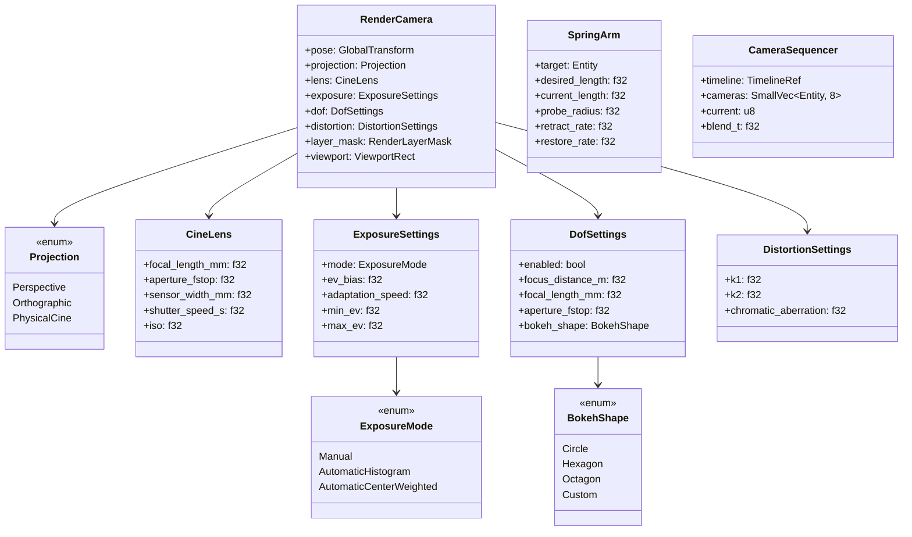
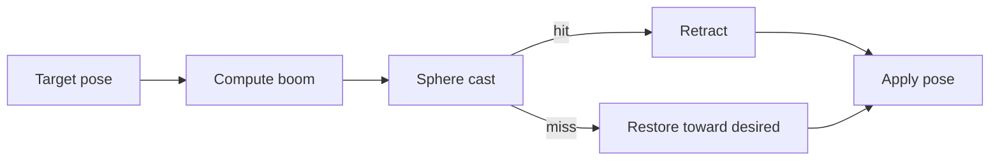
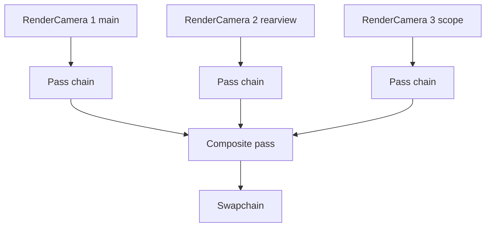
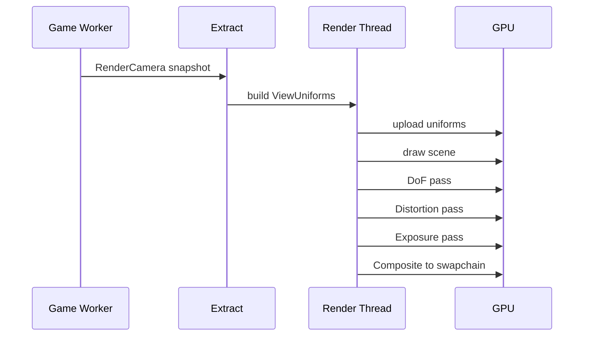

# Camera Rendering Design

## Requirements Trace

> **Canonical sources:** Features, requirements, and user stories live in
> [features/](../../features/), [requirements/](../../requirements/), and
> [user-stories/](../../user-stories/).

### Primary Requirements

| Feature    | Requirement | User Story   | Design Element                       |
|------------|-------------|--------------|--------------------------------------|
| F-2.7.1    | R-2.7.1     | US-2.7.1     | Spring-arm collision retraction      |
| F-2.7.2    | R-2.7.2     | US-2.7.2     | Cine camera (physical lens)          |
| F-2.7.3    | R-2.7.3     | US-2.7.3     | Picture-in-picture composition       |
| F-2.7.4    | R-2.7.4     | US-2.7.4     | Camera sequencer (cinematics)        |
| F-2.7.5    | R-2.7.5     | US-2.7.5     | Lens distortion                      |
| F-2.7.6    | R-2.7.6     | US-2.7.6     | Depth-of-field integration           |
| F-2.7.7    | R-2.7.7     | US-2.7.7     | Exposure (auto + manual)             |
| F-2.7.8    | R-2.7.8     | US-2.7.8     | Render layer masking                 |

1. **R-2.7.1** -- Spring arm shrinks camera boom on physics contact; restore via smooth lerp
2. **R-2.7.2** -- Cine camera parameters (focal length, aperture, sensor size, ISO)
3. **R-2.7.3** -- N viewports composited onto one swapchain with layer ordering
4. **R-2.7.4** -- Timeline-driven camera sequence for cutscenes
5. **R-2.7.5** -- Post-process lens distortion (barrel, pincushion, chromatic aberration)
6. **R-2.7.6** -- Physical DoF computed from focal length, aperture, focus distance
7. **R-2.7.7** -- Automatic exposure based on histogram, EV compensation
8. **R-2.7.8** -- `RenderLayerMask` per camera selects visible entities

### Game-Framework Owner

| Source                                  | Owned Types                           |
|------------------------------------------|---------------------------------------|
| [../game-framework/camera.md]            | `VirtualCamera`, `CameraBrain`, priority |

This document owns **rendering-specific** camera features only. The virtual-camera brain, camera
priority blending, and high-level "what camera is active" decisions live in
`game-framework/camera.md`. Rendering features like spring-arm physics, cine lens, PiP, DoF,
exposure, and lens distortion live here.

### Cross-Cutting Dependencies

| Dependency         | Source   | Consumed API                     |
|--------------------|----------|----------------------------------|
| Render graph       | F-2.3.8  | Pass construction                |
| Physics            | F-4.1    | Sweep tests (spring arm)         |
| Timeline primitive | F-16.7   | Sequencer ticks                  |
| Post processing    | F-2.5    | Distortion, DoF, bloom           |
| Scene transforms   | F-1.2.1  | `Transform`, `GlobalTransform`   |
| Spatial index      | F-1.9.1  | Camera-centric BVH queries       |

---

## Overview

A Harmonius render camera is the **GPU-facing** counterpart to the virtual camera defined in
`game-framework/camera.md`. The virtual-camera brain picks a pose each frame; this document
describes how the rendering pipeline turns that pose into pixels.

### Design Principles

1. **Rendering-only scope** -- brain logic lives elsewhere
2. **Physical units** -- millimeters, f-stops, shutter speeds, ISO
3. **Separation of pose and film** -- pose comes from the brain, film parameters live here
4. **GPU-friendly parameter layout** -- a single `CameraUniform` fits in one cache line
5. **Static dispatch** -- no trait objects, enum-based effects
6. **No HashMap on hot paths** -- viewport list is `SmallVec`

---

## Architecture

### Component Layout



### Spring Arm Flow



### PiP Composition



---

## API Design

### RenderCamera Component

```rust
#[derive(Component)]
pub struct RenderCamera {
    pub pose: GlobalTransform,
    pub projection: Projection,
    pub lens: CineLens,
    pub exposure: ExposureSettings,
    pub dof: DofSettings,
    pub distortion: DistortionSettings,
    pub layer_mask: RenderLayerMask,
    pub viewport: ViewportRect,
    pub priority: i16,
}

pub enum Projection {
    Perspective { vfov_deg: f32, near: f32, far: f32 },
    Orthographic { half_height: f32, near: f32, far: f32 },
    PhysicalCine,
}

pub struct CineLens {
    pub focal_length_mm: f32,
    pub aperture_fstop: f32,
    pub sensor_width_mm: f32,
    pub shutter_speed_s: f32,
    pub iso: f32,
}

impl CineLens {
    pub fn to_vfov_deg(&self) -> f32 {
        let sensor = self.sensor_width_mm;
        2.0 * ((sensor / (2.0 * self.focal_length_mm)).atan()).to_degrees()
    }

    pub fn ev100(&self) -> f32 {
        // EV100 = log2(N^2 / t * (100 / ISO))
        ((self.aperture_fstop.powi(2)) / self.shutter_speed_s * (100.0 / self.iso)).log2()
    }
}
```

### Spring Arm Update

```rust
pub fn update_spring_arms(
    mut arms: Query<(&mut RenderCamera, &mut SpringArm, &TargetRef)>,
    targets: Query<&GlobalTransform>,
    physics: Res<PhysicsWorld>,
    dt: Res<FrameTime>,
) {
    for (mut camera, mut arm, target_ref) in arms.iter_mut() {
        let Ok(target) = targets.get(target_ref.0) else { continue };
        let desired_offset = arm_offset(target, arm.desired_length);
        let sweep = physics.sphere_cast(
            target.translation,
            desired_offset,
            arm.probe_radius,
            arm.layer_mask,
        );
        let target_length = match sweep {
            Some(hit) => hit.distance - 0.05,
            None => arm.desired_length,
        };
        let rate = if target_length < arm.current_length {
            arm.retract_rate
        } else {
            arm.restore_rate
        };
        arm.current_length = lerp(arm.current_length, target_length, rate * dt.value);
        camera.pose = apply_arm(target, arm.current_length);
    }
}
```

### Camera Sequencer

```rust
pub fn tick_camera_sequencer(
    mut sequencers: Query<(&mut CameraSequencer, &TimelineRef)>,
    mut cameras: Query<&mut RenderCamera>,
    timelines: Res<TimelineStore>,
) {
    for (mut seq, timeline_ref) in sequencers.iter_mut() {
        let tl = &timelines[timeline_ref.0];
        let keyframes = tl.keyframes::<CameraKeyframe>();
        let (a, b, t) = keyframes.surrounding(tl.tick());
        seq.current = a.camera_index;
        seq.blend_t = t;
        if let Ok([mut cam_a, cam_b]) = cameras.get_many_mut([
            seq.cameras[a.camera_index as usize],
            seq.cameras[b.camera_index as usize],
        ]) {
            *cam_a = blend_cameras(&cam_a, &cam_b, t);
        }
    }
}
```

---

## Data Flow

### Extract -> Render



### Physical DoF Math

The DoF pass reads `focal_length_mm`, `aperture_fstop`, `focus_distance_m` and computes the circle
of confusion for each pixel from depth. Coefficient:

```text
coc(d) = | A * f * (d - P) / (d * (P - f)) |
  A = focal_length_mm / aperture_fstop   (aperture diameter in mm)
  f = focal_length_mm / 1000             (in meters)
  P = focus_distance_m
  d = depth sample
```

Source: PBRT Third Edition, Section 6.2.3 (thin lens).

---

## Platform Considerations

| Backend | PiP Strategy                   | DoF Pass         |
|---------|--------------------------------|------------------|
| D3D12   | Separate render targets, copy  | Compute DoF      |
| Metal 4 | Tile shading for PiP scope     | Tile-based DoF   |
| Vulkan  | Separate render targets, copy  | Compute DoF      |

Metal's tile-based architecture lets PiP viewports share on-chip memory if they cover the same
screen region. Default path uses independent targets for portability.

---

## Render Layer Masking

`RenderLayerMask` is a `u32` bitmask. A camera only renders entities whose
`layer_mask & camera. layer_mask != 0`. Used for:

- Split-screen co-op (each camera sees a subset)
- Minimap (only world geometry, no UI)
- Portals (camera sees world + portal geometry only)
- Editor overlays (editor camera sees selection gizmos)

---

## Test Plan

See [camera-rendering-test-cases.md](camera-rendering-test-cases.md) for TC-2.7.x.y entries:

- Unit tests for `CineLens` math, spring arm lerp, sequencer blend
- Integration tests for PiP composition, DoF pass, exposure adaptation
- Benchmarks for 4-viewport PiP frame time

---

## Open Questions

1. Should exposure be per-camera or per-frame (global)?
2. Do DoF and motion blur share the same pass, or are they separate?
3. Does the sequencer support blending three cameras simultaneously, or is it always A/B?
4. How does spring-arm sphere radius relate to the player's collision shape?
