# Core Rendering Design

## Requirements Trace

> **Canonical sources:** Features, requirements, and user
> stories are defined in
> [features/rendering/](../../features/rendering/),
> [requirements/rendering/](../../requirements/rendering/),
> and
> [user-stories/rendering/](../../user-stories/rendering/).
> The table below traces design elements to those
> definitions.

### Functional Requirements

| Feature | Requirement | User Stories | Description |
|---------|-------------|--------------|-------------|
| F-2.3.1 | R-2.3.1 | US-2.3.1.1, US-2.3.1.2, US-2.3.1.3 | Direct lighting: point, spot, directional with unified light buffer |
| F-2.3.2 | R-2.3.2 | US-2.3.2.1, US-2.3.2.2 | GPU meshlet-level frustum culling via compute |
| F-2.3.3 | R-2.3.3 | US-2.3.3.1, US-2.3.3.2 | Meshlet-level backface culling via normal cones |
| F-2.3.4 | R-2.3.4 | US-2.3.4.1, US-2.3.4.2, US-2.3.4.3 | Two-phase HZB occlusion culling |
| F-2.3.5 | R-2.3.5 | US-2.3.5.1, US-2.3.5.2 | Orthographic camera projection |
| F-2.3.6 | R-2.3.6 | US-2.3.6.1, US-2.3.6.2 | Perspective projection with reverse-Z |
| F-2.3.7 | R-2.3.7 | US-2.3.7.1, US-2.3.7.2, US-2.3.7.3 | GPU-driven instancing and batch compaction |
| F-2.3.8 | R-2.3.8 | US-2.3.8.1, US-2.3.8.2 | Render-to-texture with automatic barriers |
| F-2.3.9 | R-2.3.9 | US-2.3.9.1, US-2.3.9.2 | Static and dynamic cubemap rendering |
| F-2.3.10 | R-2.3.10 | US-2.3.10.1, US-2.3.10.2 | Scene capture (planar and cubemap) |
| F-2.3.11 | R-2.3.11 | US-2.3.11.1, US-2.3.11.2, US-2.3.11.3 | Dynamic resolution scaling with GPU feedback |
| F-2.3.12 | R-2.3.12 | US-2.3.12.1, US-2.3.12.2 | Subsurface scattering (screen-space and RT) |
| F-2.3.13 | R-2.3.13 | US-2.3.13.1, US-2.3.13.2 | Alpha mask cutout geometry |
| F-2.10.1 | R-2.10.1 | US-2.10.1.1, US-2.10.1.2 | Render proxy extraction on dedicated thread via immutable ECS queries |
| F-2.10.2 | R-2.10.2 | US-2.10.2.1, US-2.10.2.2 | SoA proxy components (mesh, material, transform, bounds) for GPU upload |
| F-2.10.3 | R-2.10.3 | US-2.10.3.1, US-2.10.3.2, US-2.10.3.3 | Dirty-flag incremental proxy updates, O(changed) per frame |
| F-2.10.4 | R-2.10.4 | US-2.10.4.1, US-2.10.4.2 | View and camera registration with projection, viewport, platform tier |
| F-2.10.5 | R-2.10.5 | US-2.10.5.1, US-2.10.5.2 | Multi-view rendering from single snapshot (shadows, probes, VR) |
| F-2.10.6 | R-2.10.6 | US-2.10.6.1, US-2.10.6.2 | Per-view draw lists with sort keys minimizing state changes |
| F-2.10.7 | R-2.10.7 | US-2.10.7.1, US-2.10.7.2 | GPU compute batch compaction into indirect draw buffers |
| F-2.10.8 | R-2.10.8 | US-2.10.8.1, US-2.10.8.2 | Bindless material parameter binding via per-instance descriptor indices |
| F-2.10.9 | R-2.10.9 | US-2.10.9.1, US-2.10.9.2 | Immediate-mode debug draw API, compile-time gated for shipping |
| F-2.10.10 | R-2.10.10 | US-2.10.10.1, US-2.10.10.2 | Buffer visualization modes (depth, normals, overdraw, etc.) |

### Non-Functional Requirements

| NFR | Description | Target |
|-----|-------------|--------|
| NFR-2.3.1 | Culling pipeline latency (1M meshlets, 1080p) | < 1.0 ms GPU |
| NFR-2.3.2 | Dynamic resolution convergence | 5 frames, < 5% oscillation |
| NFR-2.3.3 | Instancing draw call reduction (10k instances, 10 mats) | 10 draw calls |
| NFR-2.10.1 | Extraction latency (100K entities, full / 1% dirty) | < 2.0 ms / < 0.5 ms |
| NFR-2.10.2 | Draw list throughput | 500K proxies/ms/core |
| NFR-2.10.3 | Debug viz shipping overhead | Zero (CPU, GPU, binary) |

### Cross-Cutting Dependencies

| Dependency | Source | Consumed API |
|------------|--------|--------------|
| ECS world and queries | F-1.1.1, F-1.1.17, F-1.1.20 | Archetype storage, composable queries, parallel iteration |
| Change detection | F-1.1.22 | Tick-based `Changed<T>` queries for incremental extraction |
| System scheduling | F-1.1.25, F-1.1.26 | `PreRender` and `Render` phase ordering |
| Shared spatial index | F-1.9.1, F-1.9.4, F-1.9.7 | BVH frustum query for visibility determination |
| Scene transforms | F-1.2.4 | `GlobalTransform` world-space matrices |
| Render graph | F-2.2.1, F-2.2.9, F-2.2.10 | Pass registration, multi-view execution, parallel encoding |
| GPU backend trait | F-2.1.1 | `GpuBackend` associated types |
| Command buffer | F-2.1.2 | `CommandBuffer::dispatch`, `draw_indexed_indirect` |
| Pipeline state | F-2.1.3 | `PipelineState` creation and binding |
| GPU sub-allocator | F-2.1.7 | `GpuAllocator::alloc_buffer`, `alloc_texture` |
| GPU state tracking | F-2.1.8 | Redundant state filtering |
| Barrier optimization | F-2.1.9 | Automatic barrier batching |
| GPU timing queries | F-2.1.12 | `TimestampQuery` for DRS feedback |
| Transient resources | F-2.2.3 | Virtual resource handles |
| Render proxy extraction | F-2.10.1 | Frame snapshot from ECS |
| Render components | F-2.10.2 | SoA proxy layout |
| Change detection (render) | F-2.10.3 | Dirty-flag incremental upload |
| Draw list construction | F-2.10.6 | Sort key generation |
| Meshlet decomposition | F-3.1.1 | Meshlet AABB, normal cone, LOD DAG |
| Two-phase HZB (shared) | F-3.1.2 | HZB build and test shaders |
| Thread pool | F-14.3.1, F-14.3.3 | Scoped parallel tasks, task graph execution |
| PBR materials | F-2.4.3 | Cook-Torrance BRDF evaluation |
| Forward+ tiled | F-2.4.1 | Tiled/clustered light assignment |
| Deferred G-buffer | F-2.4.2 | G-buffer layout and lighting pass |
| Viewport | gpu-abstraction | `Viewport` defined in `harmonius_gpu` (not redefined here) |
| Platform tier | shared-primitives | `PlatformTier` enum (not redefined here) |

## Overview

The core rendering subsystem bridges the ECS
simulation world and the GPU. It follows an
**extract-prepare-render** pattern that decouples
simulation from rendering, enabling pipelined
parallelism.

Four principles drive the design:

1. **ECS is the single source of truth.** All
   render state lives as components. The renderer
   reads via immutable queries and never owns
   persistent scene data outside the extracted
   frame snapshot.
2. **Decoupled snapshot.** Extraction copies only
   changed ECS data into a renderer-owned proxy
   store. The simulation is free to advance once
   extraction completes.
3. **GPU-driven pipeline.** Frustum culling,
   backface culling, occlusion culling, LOD
   selection, and instance compaction all run as
   GPU compute passes. The CPU issues a small,
   fixed number of indirect dispatches per frame.
4. **Dual rendering paths.** Forward+ (tiled
   clustered) and deferred (G-buffer) paths share
   the same culling pipeline, light buffer, and
   material system. Path selection is per-view.

Static dispatch is used throughout. The entire
pipeline is generic over `GpuBackend`. No trait
objects, no vtables, no dynamic dispatch in the
hot path.

## Architecture

### Module Boundaries

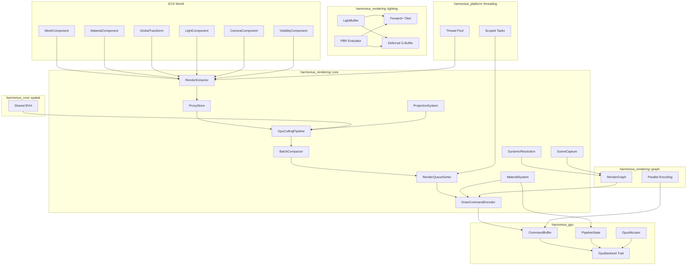

### Directory Layout

```
harmonius_rendering/
├── core/
│   ├── extract.rs        # RenderExtractor system
│   ├── proxy.rs          # ProxyStore, SoA layout
│   ├── culling.rs        # GpuCullingPipeline
│   ├── batch.rs          # BatchCompactor
│   ├── queue.rs          # RenderQueueSorter,
│   │                     # SortKey
│   ├── draw.rs           # DrawCommandEncoder
│   ├── projection.rs     # Projection, ViewUniform
│   ├── dynamic_res.rs    # DynamicResolution
│   ├── capture.rs        # SceneCapture,
│   │                     # CubemapCapture
│   ├── depth_prepass.rs  # DepthPrepass render pass
│   ├── hzb.rs            # HzbBuilder,
│   │                     # HzbMipChain
│   ├── alpha_cutout.rs   # AlphaCutout pass
│   ├── phases.rs         # RenderPhase enum
│   │                     # and phase config
│   ├── debug.rs          # Debug draw API,
│   │                     # gizmos, buffer viz
│   └── plugin.rs         # CoreRenderingPlugin
│                         # system registration
├── lighting/
│   ├── light_buffer.rs   # LightBuffer, LightGpu
│   ├── forward_plus.rs   # TiledLightCull,
│   │                     # ForwardPlusPass
│   ├── deferred.rs       # GBufferPass,
│   │                     # DeferredLightPass
│   ├── pbr.rs            # Cook-Torrance BRDF
│   │                     # evaluation
│   └── sss.rs            # SubsurfaceScatter pass
├── material/
│   ├── material.rs       # Material, MaterialId
│   ├── instance.rs       # MaterialInstance
│   ├── permutation.rs    # ShaderPermutation,
│   │                     # PermutationKey
│   ├── bindless.rs       # BindlessTable,
│   │                     # descriptor management
│   └── shading_model.rs  # ShadingModel enum
└── shaders/
    ├── culling/
    │   ├── frustum_cull.hlsl
    │   ├── backface_cull.hlsl
    │   ├── hzb_test.hlsl
    │   └── batch_compact.hlsl
    ├── depth/
    │   ├── depth_prepass.hlsl
    │   ├── hzb_build.hlsl
    │   └── alpha_cutout.hlsl
    ├── lighting/
    │   ├── tile_cull.hlsl
    │   ├── forward_plus.hlsl
    │   ├── deferred_gbuffer.hlsl
    │   ├── deferred_light.hlsl
    │   └── sss.hlsl
    └── common/
        ├── pbr_brdf.hlsl
        ├── view_uniforms.hlsl
        └── bindless.hlsl
```

## Extract-Prepare-Render Pipeline

### Pipeline Flow

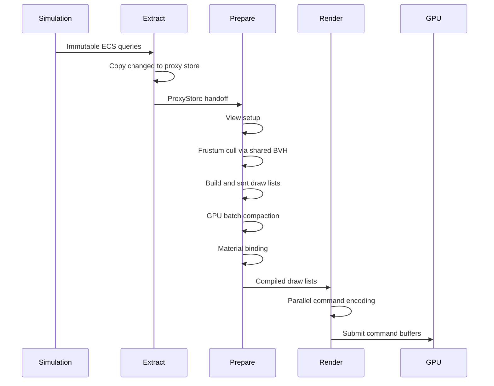

The pipeline stages are:

1. **Extract** (`PreRender` phase) -- Read-only
   ECS access. Copies changed transforms, meshes,
   materials, and bounds into the renderer-owned
   `ProxyStore`. Extracts cameras and lights.
2. **Prepare** (`Render` phase, before encoding)
   -- Operates exclusively on the proxy store.
   Sets up views, runs visibility against the
   shared BVH, builds per-view draw lists, sorts
   by sort key, runs GPU batch compaction, and
   uploads material parameters.
3. **Render** (`Render` phase, encoding and
   submit) -- Encodes GPU command buffers in
   parallel across worker threads, then submits
   to the GPU.

### System Execution Order

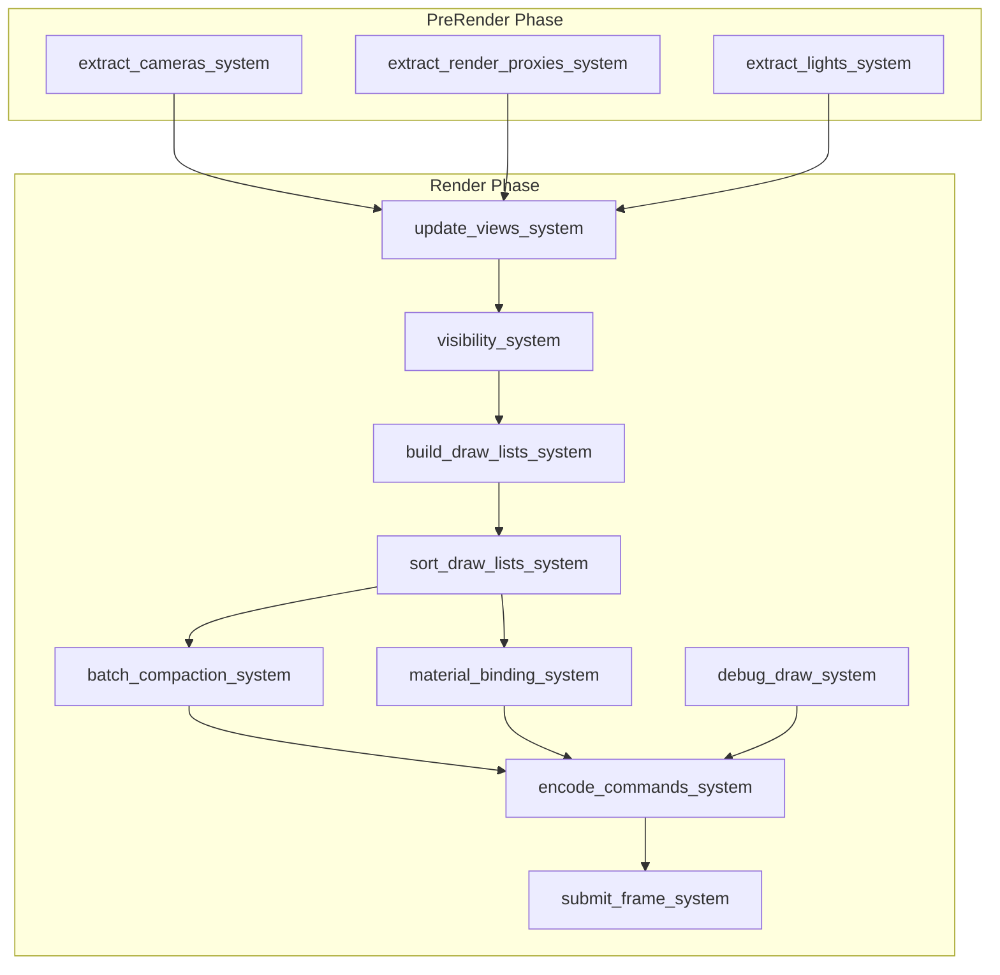

## ECS Extraction

### Render Component Class Diagram

All render state lives as ECS components. The
extractor copies a minimal SoA snapshot each frame.

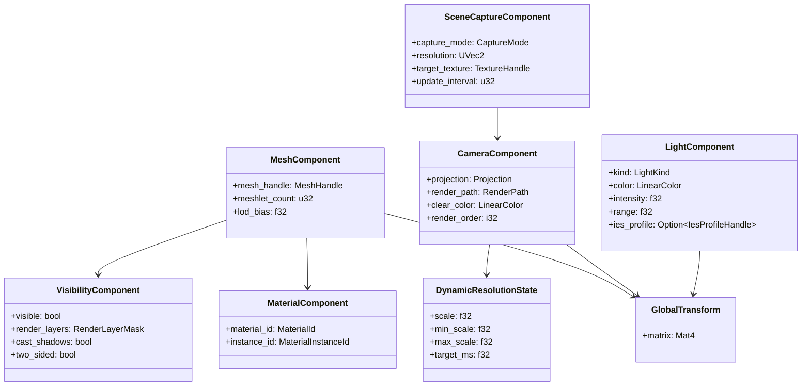

> **Note:** `Viewport` is defined in
> `harmonius_gpu` (see gpu-abstraction.md) and
> consumed here by reference. It is not redefined
> in this module.

### ECS Components

```rust
/// GPU mesh reference. Stored per renderable
/// entity.
#[derive(Clone, Debug, Reflect)]
pub struct MeshComponent {
    /// Handle into the GPU mesh registry.
    pub mesh_handle: MeshHandle,
    /// Number of meshlets in the mesh's LOD 0.
    pub meshlet_count: u32,
    /// Bias applied to LOD selection. Negative
    /// values force higher detail.
    pub lod_bias: f32,
}

/// Material assignment for a renderable entity.
#[derive(Clone, Debug, Reflect)]
pub struct MaterialComponent {
    /// Compiled material (shader + fixed state).
    pub material_id: MaterialId,
    /// Per-instance parameter overrides.
    pub instance_id: MaterialInstanceId,
}

/// Active camera used for view rendering.
#[derive(Clone, Debug, Reflect)]
pub struct CameraComponent {
    pub projection: Projection,
    pub render_path: RenderPath,
    pub clear_color: LinearColor,
    pub render_order: i32,
}

/// Visibility flags for culling and layer
/// filtering.
#[derive(Clone, Debug, Reflect)]
pub struct VisibilityComponent {
    /// Master visibility toggle.
    pub visible: bool,
    /// Bitmask selecting which render layers
    /// this entity appears in.
    pub render_layers: RenderLayerMask,
    /// Whether this entity casts shadows.
    pub cast_shadows: bool,
    /// Whether this entity is two-sided (skips
    /// backface culling).
    pub two_sided: bool,
}

/// Light source attached to an entity.
#[derive(Clone, Debug, Reflect)]
pub struct LightComponent {
    pub kind: LightKind,
    pub color: LinearColor,
    /// Luminous intensity in candela.
    pub intensity: f32,
    /// Maximum range in world units. Zero means
    /// infinite (directional lights).
    pub range: f32,
    /// IES profile handle. None for uniform
    /// falloff.
    pub ies_profile: Option<IesProfileHandle>,
}

/// Dynamic resolution state per camera.
#[derive(Clone, Debug, Reflect)]
pub struct DynamicResolutionState {
    /// Current render scale [0.0, 1.0].
    pub scale: f32,
    /// Minimum allowed scale.
    pub min_scale: f32,
    /// Maximum allowed scale.
    pub max_scale: f32,
    /// Target GPU frame time in milliseconds.
    pub target_ms: f32,
}

/// Scene capture configuration.
#[derive(Clone, Debug, Reflect)]
pub struct SceneCaptureComponent {
    pub capture_mode: CaptureMode,
    pub resolution: UVec2,
    pub target_texture: TextureHandle,
    /// Update frequency: every N frames.
    pub update_interval: u32,
}

/// ECS component marking an entity as renderable.
/// Added alongside mesh and material components.
#[derive(Clone, Copy, Debug)]
pub struct Renderable {
    pub cast_shadow: bool,
    pub receive_shadow: bool,
}

/// ECS component linking an entity to its render
/// proxy index. Added by the extraction system on
/// first extraction.
#[derive(Clone, Copy, Debug)]
pub struct RenderProxy {
    pub index: ProxyIndex,
}
```

### Enums and Value Types

```rust
/// Camera projection mode.
#[derive(Clone, Debug, Reflect)]
pub enum Projection {
    Perspective(PerspectiveProjection),
    Orthographic(OrthographicProjection),
}

#[derive(Clone, Debug, Reflect)]
pub struct PerspectiveProjection {
    /// Vertical field of view in radians.
    pub fov_y: f32,
    /// Near clip plane distance.
    pub near: f32,
    /// Far clip plane. None = infinite far.
    pub far: Option<f32>,
    /// Aspect ratio (width / height).
    pub aspect: f32,
}

#[derive(Clone, Debug, Reflect)]
pub struct OrthographicProjection {
    pub left: f32,
    pub right: f32,
    pub bottom: f32,
    pub top: f32,
    pub near: f32,
    pub far: f32,
}

/// Rendering path selection.
#[derive(
    Clone, Copy, Debug, PartialEq, Eq, Reflect,
)]
pub enum RenderPath {
    /// Tiled/clustered forward lighting.
    ForwardPlus,
    /// G-buffer deferred lighting.
    Deferred,
}

/// Light type discriminant.
#[derive(
    Clone, Copy, Debug, PartialEq, Eq, Reflect,
)]
pub enum LightKind {
    Directional,
    Point,
    Spot {
        /// Inner cone angle in radians.
        inner_angle: f32,
        /// Outer cone angle in radians.
        outer_angle: f32,
    },
}

/// Scene capture mode.
#[derive(
    Clone, Copy, Debug, PartialEq, Eq, Reflect,
)]
pub enum CaptureMode {
    /// Single planar capture from camera view.
    Planar,
    /// Six-face cubemap capture.
    Cubemap,
}

/// 32-bit bitmask for render layer filtering.
#[derive(
    Clone, Copy, Debug, PartialEq, Eq, Reflect,
)]
pub struct RenderLayerMask(pub u32);

impl RenderLayerMask {
    pub const ALL: Self = Self(u32::MAX);
    pub const DEFAULT: Self = Self(1);

    pub fn intersects(self, other: Self) -> bool;
}
```

### Extraction Systems

```rust
/// Extract cameras from the ECS world into
/// RenderViews. Runs in PreRender phase.
///
/// Query: (Entity, &Camera, &GlobalTransform)
pub fn extract_cameras_system(
    cameras: Query<(
        Entity,
        &Camera,
        &GlobalTransform,
    )>,
    render_world: ResMut<RenderWorld>,
);

/// Extract renderable entities into the proxy
/// store. Uses change detection to perform
/// incremental updates.
///
/// Query: (
///     Entity,
///     &GlobalTransform,
///     &MeshHandle,
///     &MaterialHandle,
///     &Aabb,
///     &Renderable,
///     Option<&RenderProxy>,
///     Changed<GlobalTransform>,
///     Changed<MeshHandle>,
///     Changed<MaterialHandle>,
/// )
pub fn extract_render_proxies_system(
    query: Query<(
        Entity,
        &GlobalTransform,
        &MeshHandle,
        &MaterialHandle,
        &Aabb,
        &Renderable,
        Option<&RenderProxy>,
    )>,
    changed_transforms: Query<
        Entity,
        Changed<GlobalTransform>,
    >,
    changed_meshes: Query<
        Entity,
        Changed<MeshHandle>,
    >,
    changed_materials: Query<
        Entity,
        Changed<MaterialHandle>,
    >,
    render_world: ResMut<RenderWorld>,
    commands: Commands,
);

/// Extract light sources for shadow view
/// generation.
///
/// Query: (Entity, &Light, &GlobalTransform)
pub fn extract_lights_system(
    lights: Query<(
        Entity,
        &Light,
        &GlobalTransform,
    )>,
    render_world: ResMut<RenderWorld>,
);
```

### Incremental Extraction Detail

The extraction system uses ECS change detection
(F-1.1.22) to minimize per-frame work:

1. **New entities** -- Entities with `Renderable`
   but no `RenderProxy` component. Insert into
   proxy store, attach `RenderProxy` component
   via command buffer.
2. **Changed entities** -- Entities with
   `Changed<GlobalTransform>`,
   `Changed<MeshHandle>`, or
   `Changed<MaterialHandle>`. Update only the
   changed fields in the proxy store.
3. **Removed entities** -- Entities with
   `RenderProxy` that no longer match the
   `Renderable` query (despawned or component
   removed). Remove from proxy store, recycle
   index.

This bounds extraction cost to
`O(new + changed + removed)` rather than
`O(total)`.

## CPU-Side Preparation

### Proxy Store (SoA Layout)

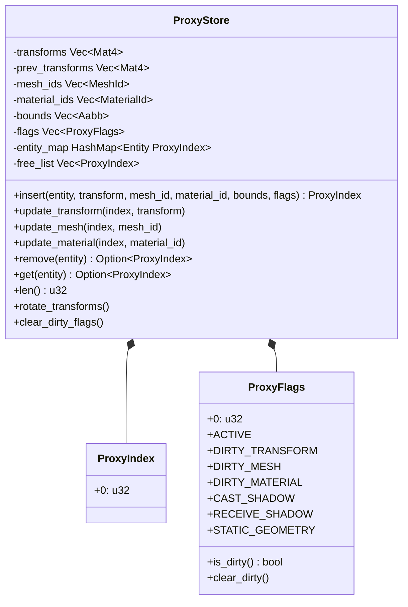

```rust
/// Index into the ProxyStore SoA arrays.
#[derive(
    Clone, Copy, Debug, PartialEq, Eq, Hash,
)]
pub struct ProxyIndex(pub u32);

/// Flags describing proxy state.
#[derive(Clone, Copy, Debug)]
pub struct ProxyFlags(pub u32);

impl ProxyFlags {
    pub const ACTIVE: u32 = 1 << 0;
    pub const DIRTY_TRANSFORM: u32 = 1 << 1;
    pub const DIRTY_MESH: u32 = 1 << 2;
    pub const DIRTY_MATERIAL: u32 = 1 << 3;
    pub const CAST_SHADOW: u32 = 1 << 4;
    pub const RECEIVE_SHADOW: u32 = 1 << 5;
    pub const STATIC_GEOMETRY: u32 = 1 << 6;

    pub fn is_dirty(self) -> bool;
    pub fn clear_dirty(&mut self);
}

/// Structure-of-arrays storage for render proxy
/// components. Each field is a parallel array
/// indexed by ProxyIndex. Only data needed by
/// the GPU pipeline is stored; simulation-only
/// fields are discarded during extraction.
pub struct ProxyStore {
    /// World-space transform matrices.
    transforms: Vec<Mat4>,
    /// Previous frame transforms (motion vectors).
    prev_transforms: Vec<Mat4>,
    /// Mesh asset handle.
    mesh_ids: Vec<MeshId>,
    /// Material asset handle.
    material_ids: Vec<MaterialId>,
    /// World-space axis-aligned bounding box.
    bounds: Vec<Aabb>,
    /// Per-proxy state flags.
    flags: Vec<ProxyFlags>,
    /// Entity-to-proxy index mapping.
    entity_map: HashMap<Entity, ProxyIndex>,
    /// Free list for recycled indices.
    free_list: Vec<ProxyIndex>,
}

impl ProxyStore {
    pub fn new() -> Self;

    /// Insert a new proxy for the given entity.
    /// Reuses a free index if available.
    pub fn insert(
        &mut self,
        entity: Entity,
        transform: Mat4,
        mesh_id: MeshId,
        material_id: MaterialId,
        bounds: Aabb,
        flags: ProxyFlags,
    ) -> ProxyIndex;

    /// Update only the dirty fields of an
    /// existing proxy.
    pub fn update_transform(
        &mut self,
        index: ProxyIndex,
        transform: Mat4,
    );

    pub fn update_mesh(
        &mut self,
        index: ProxyIndex,
        mesh_id: MeshId,
    );

    pub fn update_material(
        &mut self,
        index: ProxyIndex,
        material_id: MaterialId,
    );

    pub fn update_bounds(
        &mut self,
        index: ProxyIndex,
        bounds: Aabb,
    );

    /// Remove a proxy and return its index to
    /// the free list.
    pub fn remove(
        &mut self,
        entity: Entity,
    ) -> Option<ProxyIndex>;

    /// Look up the proxy index for an entity.
    pub fn get(
        &self,
        entity: Entity,
    ) -> Option<ProxyIndex>;

    /// Total number of active proxies.
    pub fn len(&self) -> u32;

    /// Read-only slice access for GPU upload.
    pub fn transforms(&self) -> &[Mat4];
    pub fn mesh_ids(&self) -> &[MeshId];
    pub fn material_ids(&self) -> &[MaterialId];
    pub fn bounds(&self) -> &[Aabb];
    pub fn flags(&self) -> &[ProxyFlags];

    /// Swap current and previous transforms for
    /// motion vector computation. Called once per
    /// frame before extraction.
    pub fn rotate_transforms(&mut self);

    /// Clear all dirty flags after GPU upload.
    pub fn clear_dirty_flags(&mut self);
}
```

### GPU Instance Data

```rust
/// Minimal per-instance data for GPU upload.
#[repr(C)]
#[derive(Clone, Copy, bytemuck::Pod)]
pub struct InstanceGpu {
    pub world_matrix: Mat4,
    pub prev_world_matrix: Mat4,
    pub mesh_handle: u32,
    pub material_id: u32,
    pub instance_id: u32,
    pub meshlet_offset: u32,
    pub meshlet_count: u32,
    pub lod_bias: f32,
    pub flags: u32,
    pub _padding: u32,
}

/// Flags packed into InstanceGpu::flags.
bitflags::bitflags! {
    #[derive(Clone, Copy, Debug)]
    pub struct InstanceFlags: u32 {
        const CAST_SHADOWS = 1 << 0;
        const TWO_SIDED    = 1 << 1;
        const ALPHA_CUTOUT = 1 << 2;
        const TRANSPARENT  = 1 << 3;
    }
}
```

### Instance Buffer Layout

```
Offset  Field                Size
------  -------------------  ----
0       world_matrix         64 B
64      prev_world_matrix    64 B
128     mesh_handle          4 B
132     material_id          4 B
136     instance_id          4 B
140     meshlet_offset       4 B
144     meshlet_count        4 B
148     lod_bias             4 B
152     flags                4 B
156     _padding             4 B
------                       ------
Total per instance:          160 B
```

### Render Extraction

```rust
/// Extracts renderable entities from the ECS
/// into the proxy store. Runs as a system in
/// the Extract phase.
pub struct RenderExtractor;

impl RenderExtractor {
    /// Parallel extraction using scoped thread
    /// pool tasks. Reads MeshComponent,
    /// MaterialComponent, GlobalTransform,
    /// VisibilityComponent via immutable queries.
    /// Only extracts entities whose
    /// VisibilityComponent::visible is true.
    /// Uses change detection to incrementally
    /// update only dirty entities.
    pub fn extract<B: GpuBackend>(
        world: &World,
        pool: &ThreadPool,
        store: &mut ProxyStore,
    );

    /// Upload the proxy store into a GPU instance
    /// buffer. Returns the buffer handle for the
    /// culling pipeline.
    pub fn upload<B: GpuBackend>(
        store: &ProxyStore,
        allocator: &GpuAllocator<B>,
        cmd: &mut B::CommandBuffer,
    ) -> B::BufferHandle;
}
```

### View and Camera

```rust
/// Unique identifier for a render view.
#[derive(
    Clone, Copy, Debug, PartialEq, Eq, Hash,
)]
pub struct ViewId(pub u32);

/// Classification of view purpose.
#[derive(Clone, Copy, Debug, PartialEq, Eq)]
pub enum ViewType {
    /// Main game camera.
    MainCamera,
    /// Shadow cascade (index 0..N).
    ShadowCascade { cascade_index: u8 },
    /// Reflection probe capture face.
    ReflectionProbe { face: CubeFace },
    /// Split-screen player viewport.
    SplitScreen { player_index: u8 },
    /// VR eye (left or right).
    VrEye { eye: VrEye },
}

/// A single render view with all data needed
/// for per-view culling and draw list assembly.
///
/// Quality scaling uses `PlatformTier` from
/// shared-primitives rather than a local enum.
pub struct RenderView {
    pub view_id: ViewId,
    pub view_matrix: Mat4,
    pub projection: Mat4,
    pub viewport: Viewport,
    pub platform_tier: PlatformTier,
    pub view_type: ViewType,
    /// Per-proxy visibility bitset. Bit N is
    /// set if ProxyIndex(N) is visible in this
    /// view.
    pub visibility_bits: BitVec,
    /// Frustum planes extracted from the
    /// view-projection matrix.
    frustum: Frustum,
}

impl RenderView {
    pub fn new(
        view_id: ViewId,
        view_matrix: Mat4,
        projection: Mat4,
        viewport: Viewport,
        platform_tier: PlatformTier,
        view_type: ViewType,
    ) -> Self;

    /// Recompute frustum planes from the current
    /// view-projection matrix.
    pub fn update_frustum(&mut self);

    /// Test whether a world-space AABB intersects
    /// this view's frustum.
    pub fn frustum_test(&self, aabb: &Aabb) -> bool;

    /// Reset visibility bits for a new frame.
    pub fn clear_visibility(&mut self);

    /// Mark a proxy as visible in this view.
    pub fn set_visible(
        &mut self,
        index: ProxyIndex,
    );

    /// Check visibility of a proxy.
    pub fn is_visible(
        &self,
        index: ProxyIndex,
    ) -> bool;

    /// Iterator over all visible proxy indices.
    pub fn visible_proxies(
        &self,
    ) -> impl Iterator<Item = ProxyIndex> + '_;
}

/// Six frustum planes for culling.
pub struct Frustum {
    pub planes: [Vec4; 6],
}

impl Frustum {
    /// Extract frustum planes from a
    /// view-projection matrix using the
    /// Gribb-Hartmann method.
    pub fn from_view_projection(
        vp: &Mat4,
    ) -> Self;

    /// Test intersection with an AABB. Returns
    /// true if any part of the AABB is inside or
    /// intersecting the frustum.
    pub fn intersects_aabb(
        &self,
        aabb: &Aabb,
    ) -> bool;
}
```

### Projection System

```rust
/// Per-view uniform data uploaded to the GPU.
#[repr(C)]
#[derive(Clone, Copy, Debug, bytemuck::Pod)]
pub struct ViewUniform {
    pub view: Mat4,
    pub projection: Mat4,
    pub view_projection: Mat4,
    pub inv_view: Mat4,
    pub inv_projection: Mat4,
    pub inv_view_projection: Mat4,
    pub camera_position: Vec4,
    pub viewport_size: Vec2,
    pub near_plane: f32,
    pub far_plane: f32,
    /// Frustum planes (6 x Vec4, normal + dist).
    pub frustum_planes: [Vec4; 6],
}

/// Builds projection matrices from camera
/// components.
pub struct ProjectionSystem;

impl ProjectionSystem {
    /// Compute a reverse-Z perspective matrix.
    /// Near maps to depth=1, far maps to depth=0.
    pub fn perspective_reverse_z(
        fov_y: f32,
        aspect: f32,
        near: f32,
        far: Option<f32>,
    ) -> Mat4;

    /// Compute an orthographic projection matrix
    /// with reverse-Z depth mapping.
    pub fn orthographic_reverse_z(
        left: f32,
        right: f32,
        bottom: f32,
        top: f32,
        near: f32,
        far: f32,
    ) -> Mat4;

    /// Extract six frustum planes from a
    /// view-projection matrix.
    pub fn extract_frustum_planes(
        view_projection: &Mat4,
    ) -> [Vec4; 6];

    /// Build a ViewUniform from camera and
    /// transform components.
    pub fn build_view_uniform(
        camera: &CameraComponent,
        transform: &GlobalTransform,
        drs: Option<&DynamicResolutionState>,
    ) -> ViewUniform;
}
```

### Visibility Determination

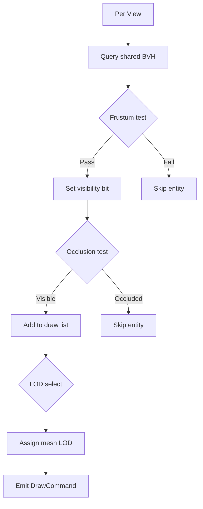

```rust
/// Per-view frustum culling against the shared
/// BVH. Writes visibility bits into each
/// RenderView. Runs in parallel across views
/// using scoped tasks.
pub fn visibility_system(
    render_world: ResMut<RenderWorld>,
    spatial_index: Res<SharedSpatialIndex>,
    pool: Res<ThreadPool>,
);

/// Implementation: for each view, queries the
/// shared BVH with the view frustum and writes
/// the resulting entity set into the view's
/// visibility bitset.
fn cull_view(
    view: &mut RenderView,
    proxies: &ProxyStore,
    spatial_index: &SharedSpatialIndex,
);

/// Select LOD level based on screen-space size
/// of the proxy bounding sphere.
pub fn select_lod(
    bounds: &Aabb,
    view: &RenderView,
    lod_distances: &[f32],
) -> u8;
```

### Multi-View Parallelism

Visibility and draw list construction are
parallelized across views using scoped tasks:

```rust
fn visibility_system(
    render_world: ResMut<RenderWorld>,
    spatial_index: Res<SharedSpatialIndex>,
    pool: Res<ThreadPool>,
) {
    let rw = &mut *render_world;
    let proxies = &rw.proxies;
    let views = &mut rw.views;

    pool.scope(|scope| {
        for view in views.iter_mut() {
            scope.spawn(|| {
                cull_view(
                    view,
                    proxies,
                    &spatial_index,
                );
            });
        }
    });
    // All views culled when scope exits.
}
```

Each view's frustum query reads the shared BVH
(immutable) and writes only to its own
`visibility_bits` (no contention). Views are fully
independent and scale linearly with worker count.

### Multi-View Rendering Flow

Shadow cascades, VR eyes, scene captures, and
split-screen views all share the extracted proxy
store. Each view gets its own ViewUniform, culling
pass, and draw submission but reads from the same
instance buffer.

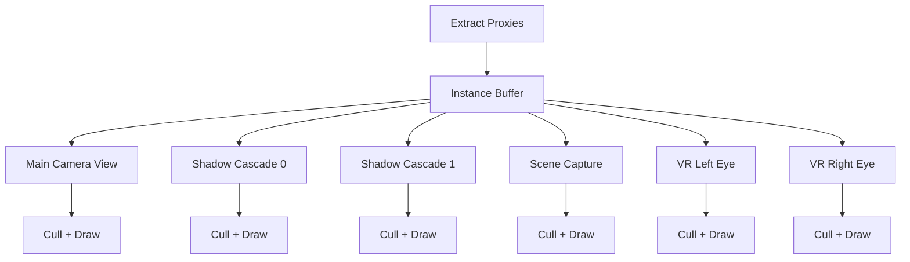

## GPU Culling Pipeline

The culling pipeline is a chain of GPU compute
passes that progressively eliminates invisible
meshlets before any rasterization occurs. Each
stage reads from a global instance buffer and
writes a visibility bitmask or compacted index
list.

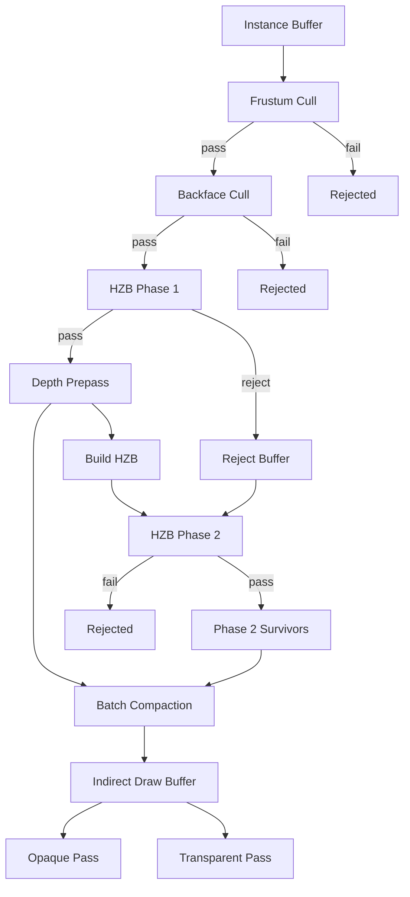

### Culling Pipeline Types

```rust
/// Configuration for the GPU culling pipeline.
pub struct CullingConfig {
    /// Maximum meshlet count the buffers can
    /// hold. Determines allocation sizes.
    pub max_meshlets: u32,
    /// HZB mip chain resolution. Typically
    /// matches the depth buffer resolution.
    pub hzb_resolution: UVec2,
    /// Whether to run HZB phase 2 (can be
    /// skipped under budget pressure on mobile).
    pub enable_phase_2: bool,
}

/// Visibility bitmask buffer. One bit per
/// meshlet indicating pass/fail.
pub struct VisibilityBuffer<B: GpuBackend> {
    pub buffer: B::BufferHandle,
    pub meshlet_count: u32,
}

/// The GPU-driven culling pipeline. Each stage
/// is a compute dispatch reading/writing GPU
/// buffers.
pub struct GpuCullingPipeline<B: GpuBackend> {
    frustum_cull_pso: B::PipelineState,
    backface_cull_pso: B::PipelineState,
    hzb_test_pso: B::PipelineState,
    hzb_build_pso: B::PipelineState,
    batch_compact_pso: B::PipelineState,
    config: CullingConfig,
    /// Previous frame's HZB for phase 1.
    prev_hzb: B::TextureHandle,
    /// Current frame's HZB built from depth
    /// prepass.
    current_hzb: B::TextureHandle,
    /// Buffer holding phase-1 rejected meshlet
    /// indices for phase-2 retest.
    reject_buffer: B::BufferHandle,
}

impl<B: GpuBackend> GpuCullingPipeline<B> {
    pub fn new(
        device: &B::Device,
        config: CullingConfig,
    ) -> Self;

    /// Run frustum culling. Tests each meshlet
    /// AABB against the six frustum planes from
    /// ViewUniform. Writes a visibility bitmask.
    pub fn frustum_cull(
        &self,
        cmd: &mut B::CommandBuffer,
        instances: &B::BufferHandle,
        view: &ViewUniform,
    ) -> VisibilityBuffer<B>;

    /// Run backface culling via normal cone test.
    /// Reads the meshlet normal cone data and
    /// camera position. Clears bits in the
    /// visibility buffer for fully back-facing
    /// meshlets. Skips meshlets flagged as
    /// two-sided.
    pub fn backface_cull(
        &self,
        cmd: &mut B::CommandBuffer,
        instances: &B::BufferHandle,
        visibility: &mut VisibilityBuffer<B>,
        camera_pos: Vec3,
    );

    /// HZB phase 1: test visible meshlets against
    /// the previous frame's HZB (conservative).
    /// Meshlets that pass are rendered in the
    /// depth prepass. Meshlets that fail are
    /// written to the reject buffer for phase 2.
    pub fn hzb_phase_1(
        &self,
        cmd: &mut B::CommandBuffer,
        instances: &B::BufferHandle,
        visibility: &mut VisibilityBuffer<B>,
    );

    /// Build the current frame's HZB from the
    /// depth prepass output. Generates a mip
    /// chain via iterative max-downsample.
    pub fn build_hzb(
        &self,
        cmd: &mut B::CommandBuffer,
        depth_buffer: &B::TextureHandle,
    );

    /// HZB phase 2: retest phase-1 rejects
    /// against the newly built HZB. Recovers
    /// newly visible geometry in the same frame.
    pub fn hzb_phase_2(
        &self,
        cmd: &mut B::CommandBuffer,
        visibility: &mut VisibilityBuffer<B>,
    );

    /// Swap HZB buffers at end of frame. The
    /// current HZB becomes the previous for the
    /// next frame.
    pub fn end_frame(&mut self);
}
```

### Depth Prepass

```rust
/// Depth-only prepass render pass. Populates the
/// depth buffer for HZB construction and early-Z
/// optimization in subsequent passes.
pub struct DepthPrepass;

impl DepthPrepass {
    /// Register the depth prepass with the render
    /// graph. Declares a depth-only render target
    /// write.
    pub fn register<B: GpuBackend>(
        graph: &mut RenderGraphBuilder<B>,
        view: &ViewUniform,
        opaque_batch: &DrawBatch<B>,
        alpha_cutout_batch: &DrawBatch<B>,
    ) -> RenderPassId;
}
```

### HZB Builder

```rust
/// Hierarchical Z-buffer builder. Generates a
/// mip chain from the depth buffer via iterative
/// max-downsample compute passes.
pub struct HzbBuilder<B: GpuBackend> {
    downsample_pso: B::PipelineState,
    /// Full mip chain texture.
    pub hzb_texture: B::TextureHandle,
    pub mip_count: u32,
}

impl<B: GpuBackend> HzbBuilder<B> {
    pub fn new(
        device: &B::Device,
        resolution: UVec2,
    ) -> Self;

    /// Build the HZB mip chain from the given
    /// depth buffer. Each mip level takes the
    /// max of a 2x2 region from the previous
    /// level (conservative for reverse-Z where
    /// closer = larger depth values).
    pub fn build(
        &self,
        cmd: &mut B::CommandBuffer,
        depth_buffer: &B::TextureHandle,
    );
}
```

## Batching

### Sort Key Bit Layout

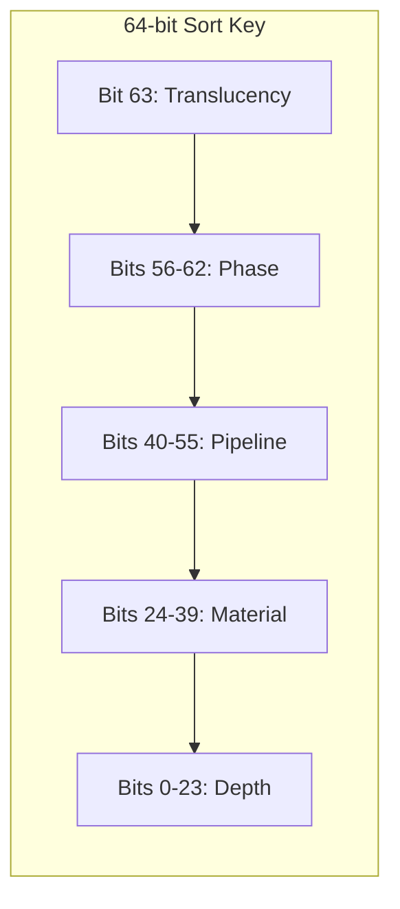

| Field | Bits | Width | Purpose |
|-------|------|-------|---------|
| Translucency | 63 | 1 | 0 = opaque (front-to-back), 1 = transparent (back-to-front) |
| Phase | 56-62 | 7 | Render phase ordinal (Opaque, AlphaTest, Transparent, UI, Debug) |
| Pipeline | 40-55 | 16 | Pipeline state object hash (groups identical GPU state) |
| Material | 24-39 | 16 | Material ID (groups identical descriptor bindings) |
| Depth | 0-23 | 24 | Quantized depth (front-to-back for opaque, inverted for transparent) |

Opaque draws sort ascending (front-to-back for
early-Z rejection). Transparent draws sort
descending (back-to-front for correct blending).
The translucency bit in the MSB ensures all opaque
draws precede all transparent draws in a single
radix sort pass.

### Draw List and Sort Key

```rust
/// A 64-bit sort key encoding draw order.
///
/// Bit layout (MSB to LSB):
/// - [63]    Translucency (0=opaque, 1=transp)
/// - [62:56] Phase ordinal (7 bits)
/// - [55:40] Pipeline state hash (16 bits)
/// - [39:24] Material ID (16 bits)
/// - [23:0]  Quantized depth (24 bits)
#[derive(
    Clone, Copy, Debug, PartialEq, Eq,
    PartialOrd, Ord,
)]
pub struct SortKey {
    pub bits: u64,
}

impl SortKey {
    /// Construct a sort key for an opaque draw.
    /// Depth is front-to-back (lower = closer).
    pub fn opaque(
        phase: RenderPhase,
        pipeline: u16,
        material: u16,
        depth: f32,
        near: f32,
        far: f32,
    ) -> Self;

    /// Construct a sort key for a transparent
    /// draw. Depth is back-to-front (inverted).
    pub fn transparent(
        phase: RenderPhase,
        pipeline: u16,
        material: u16,
        depth: f32,
        near: f32,
        far: f32,
    ) -> Self;

    /// Quantize a linear depth value to 24 bits.
    fn quantize_depth(
        depth: f32,
        near: f32,
        far: f32,
    ) -> u32;
}

/// A single draw command in a draw list.
#[derive(Clone, Copy, Debug)]
pub struct DrawCommand {
    /// Index into the ProxyStore.
    pub proxy_index: ProxyIndex,
    /// Mesh to draw.
    pub mesh_id: MeshId,
    /// Material for parameter binding.
    pub material_id: MaterialId,
    /// Byte offset into the per-instance GPU
    /// buffer for this draw's constants.
    pub instance_data_offset: u32,
    /// LOD level selected by distance.
    pub lod_level: u8,
}

/// Render phase classification.
///
/// > **UI rendering order:** The UI phase renders
/// > after tonemapping but before film grain and
/// > vignette post-processing effects.
#[derive(
    Clone, Copy, Debug, PartialEq, Eq,
    PartialOrd, Ord, Hash,
)]
pub enum RenderPhase {
    /// Fully opaque geometry. Front-to-back.
    Opaque = 0,
    /// Alpha-tested geometry (foliage, fences).
    AlphaTest = 1,
    /// Alpha-blended geometry. Back-to-front.
    Transparent = 2,
    /// Screen-space UI overlay. Renders after
    /// tonemapping but before film grain and
    /// vignette.
    UI = 3,
    /// Debug visualization (gizmos, lines).
    /// Stripped in shipping builds.
    #[cfg(debug_assertions)]
    Debug = 4,
}

/// Per-view draw list holding sorted draw
/// commands for a single render phase.
pub struct DrawList {
    phase: RenderPhase,
    commands: Vec<DrawCommand>,
    sort_keys: Vec<SortKey>,
}

impl DrawList {
    pub fn new(phase: RenderPhase) -> Self;

    /// Append a draw command with its sort key.
    pub fn push(
        &mut self,
        cmd: DrawCommand,
        key: SortKey,
    );

    /// Sort commands by sort key. Uses radix sort
    /// for O(n) performance on the 64-bit key.
    pub fn sort(&mut self);

    /// Number of draw commands.
    pub fn len(&self) -> usize;

    /// Read-only access to sorted commands.
    pub fn commands(&self) -> &[DrawCommand];

    /// Clear for reuse next frame.
    pub fn clear(&mut self);
}

/// Collection of draw lists organized by
/// (ViewId, RenderPhase).
pub struct DrawListSet {
    lists: HashMap<(ViewId, RenderPhase), DrawList>,
}

impl DrawListSet {
    pub fn new() -> Self;

    /// Get or create the draw list for a view
    /// and phase.
    pub fn get_or_create(
        &mut self,
        view_id: ViewId,
        phase: RenderPhase,
    ) -> &mut DrawList;

    /// Iterate all draw lists.
    pub fn iter(
        &self,
    ) -> impl Iterator<
        Item = (
            &(ViewId, RenderPhase),
            &DrawList,
        ),
    >;

    /// Clear all draw lists for the next frame.
    pub fn clear_all(&mut self);
}
```

### Draw List Construction

```rust
/// Build per-view, per-phase draw lists from
/// visible proxies. Runs after visibility.
/// Parallelized across views via scoped tasks.
pub fn build_draw_lists_system(
    render_world: ResMut<RenderWorld>,
    pool: Res<ThreadPool>,
);

/// Sort all draw lists by sort key. Uses radix
/// sort for O(n) performance on 64-bit keys.
pub fn sort_draw_lists_system(
    render_world: ResMut<RenderWorld>,
);

/// Classify which render phase a material
/// belongs to based on its blend mode.
fn classify_phase(
    material_id: MaterialId,
) -> RenderPhase;

/// Compute linear depth of a bounding box center
/// in view space.
fn compute_depth(
    bounds: &Aabb,
    view_matrix: &Mat4,
) -> f32;

/// Hash the pipeline state associated with a
/// material to produce a 16-bit key for grouping.
fn pipeline_hash(
    material_id: MaterialId,
) -> u16;

/// Radix sort a draw list in-place. Sorts
/// (sort_keys, commands) in parallel using an
/// 8-bit radix (8 passes over 64 bits).
fn radix_sort_draw_list(list: &mut DrawList);
```

### Batch Compaction and Instancing

```rust
/// Indirect draw command matching
/// D3D12/Vulkan/Metal indirect draw layout.
#[repr(C)]
#[derive(Clone, Copy, bytemuck::Pod)]
pub struct IndirectDrawCommand {
    pub index_count: u32,
    pub instance_count: u32,
    pub first_index: u32,
    pub vertex_offset: i32,
    pub first_instance: u32,
}

/// GPU-side batch compaction. Groups surviving
/// meshlets by material into contiguous indirect
/// draw commands.
pub struct BatchCompactor<B: GpuBackend> {
    compact_pso: B::PipelineState,
    /// Output buffer: one IndirectDrawCommand per
    /// material batch.
    draw_buffer: B::BufferHandle,
    /// Output buffer: draw count (for
    /// multi-draw-indirect-count).
    draw_count_buffer: B::BufferHandle,
    /// Maximum number of material batches.
    max_batches: u32,
}

impl<B: GpuBackend> BatchCompactor<B> {
    pub fn new(
        device: &B::Device,
        max_batches: u32,
    ) -> Self;

    /// Run the compaction compute pass. Reads
    /// the visibility buffer and instance data,
    /// groups by material_id, and writes
    /// contiguous indirect draw commands.
    pub fn compact(
        &self,
        cmd: &mut B::CommandBuffer,
        instances: &B::BufferHandle,
        visibility: &VisibilityBuffer<B>,
    ) -> DrawBatch<B>;
}

/// Result of batch compaction: everything needed
/// to issue indirect draws.
pub struct DrawBatch<B: GpuBackend> {
    /// Indirect draw buffer (one entry per
    /// material batch).
    pub draw_buffer: B::BufferHandle,
    /// Draw count buffer for
    /// execute_indirect_count.
    pub draw_count_buffer: B::BufferHandle,
    /// Maximum batch count (upper bound for
    /// the indirect count).
    pub max_draw_count: u32,
}

/// Indirect draw buffer holding compacted draw
/// commands for a single material group.
pub struct IndirectDrawBuffer<B: GpuBackend> {
    /// GPU buffer containing indirect draw
    /// arguments.
    pub buffer: B::Buffer,
    /// Number of draws written by the compaction
    /// shader.
    pub draw_count_offset: u64,
    /// Material ID for this group.
    pub material_id: MaterialId,
}

/// GPU batch compaction system. A compute shader
/// reads the sorted draw list, applies GPU-driven
/// occlusion culling, and writes surviving draws
/// into contiguous indirect draw buffers grouped
/// by material.
pub fn batch_compaction_system<B: GpuBackend>(
    render_world: Res<RenderWorld>,
    device: Res<B::Device>,
    allocator: Res<GpuAllocator<B>>,
);
```

### GPU Batch Compaction Pipeline

1. CPU sorts draw commands by sort key
   (radix sort).
2. CPU uploads sorted draw commands to a GPU
   staging buffer.
3. GPU compute shader reads the staging buffer,
   performs GPU-driven occlusion culling (HiZ
   test), and writes surviving draws into
   contiguous indirect draw buffers grouped by
   material.
4. A draw count buffer is atomically incremented
   per material group.
5. The render pass issues one
   `draw_indirect_count` call per material group.

This reduces CPU draw submission from O(draws) to
O(material_groups), enabling hundreds of thousands
of meshlet instances with minimal CPU overhead.

## Draw Submission

### Render Queue Sorter

```rust
/// Classified render queues for a single view.
pub struct RenderQueues<B: GpuBackend> {
    /// GPU-driven indirect batch for opaque
    /// geometry (front-to-back by sort key).
    pub opaque: DrawBatch<B>,
    /// CPU-sorted transparent draws
    /// (back-to-front, individual draw calls).
    pub transparent: Vec<TransparentDraw>,
    /// Alpha cutout draws (participate in
    /// depth prepass and shadow maps).
    pub alpha_cutout: DrawBatch<B>,
}

/// A single transparent draw command.
/// Transparent objects are not batched.
pub struct TransparentDraw {
    pub sort_key: SortKey,
    pub instance_id: ProxyIndex,
    pub material_id: MaterialId,
    pub instance_params: MaterialInstanceId,
    pub mesh_handle: MeshHandle,
}

/// Partitions draw commands into sorted render
/// queues by pass type.
pub struct RenderQueueSorter;

impl RenderQueueSorter {
    /// Classify extracted proxies into render
    /// queues. Opaque and alpha-cutout go through
    /// GPU batch compaction. Transparent draws
    /// are sorted CPU-side (back-to-front).
    pub fn sort<B: GpuBackend>(
        store: &ProxyStore,
        batch: DrawBatch<B>,
        camera_pos: Vec3,
    ) -> RenderQueues<B>;
}
```

### Draw Command Encoder

```rust
/// Encodes final draw commands from the sorted
/// render queues into GPU command buffers.
pub struct DrawCommandEncoder;

impl DrawCommandEncoder {
    /// Encode opaque draws via
    /// multi-draw-indirect from the batch
    /// compactor output.
    pub fn encode_opaque<B: GpuBackend>(
        cmd: &mut B::CommandBuffer,
        batch: &DrawBatch<B>,
        material_system: &MaterialSystem<B>,
        view_uniform_buffer: &B::BufferHandle,
        light_buffer: &LightBuffer<B>,
    );

    /// Encode transparent draws as individual
    /// draw calls in back-to-front order.
    pub fn encode_transparent<B: GpuBackend>(
        cmd: &mut B::CommandBuffer,
        draws: &[TransparentDraw],
        material_system: &MaterialSystem<B>,
        view_uniform_buffer: &B::BufferHandle,
        light_buffer: &LightBuffer<B>,
    );

    /// Encode alpha-cutout draws via indirect
    /// batch. Alpha-cutout geometry participates
    /// in the depth prepass and shadow maps.
    pub fn encode_alpha_cutout<B: GpuBackend>(
        cmd: &mut B::CommandBuffer,
        batch: &DrawBatch<B>,
        material_system: &MaterialSystem<B>,
        view_uniform_buffer: &B::BufferHandle,
    );
}
```

### Command Buffer Encoding

```rust
/// Encode GPU command buffers in parallel across
/// worker threads. Each view's draw lists are
/// encoded into a secondary command buffer.
/// Secondary buffers are collected and submitted
/// as a single primary buffer.
pub fn encode_commands_system<B: GpuBackend>(
    render_world: Res<RenderWorld>,
    device: Res<B::Device>,
    graph: Res<RenderGraph<B>>,
    pool: Res<ThreadPool>,
);

/// Encode draw commands for a single view and
/// phase into a secondary command buffer.
fn encode_view_phase<B: GpuBackend>(
    device: &B::Device,
    view: &RenderView,
    draw_list: &DrawList,
    indirect_buffers: &[IndirectDrawBuffer<B>],
    instance_buffer: &B::Buffer,
) -> B::CommandBuffer;

/// Submit the final primary command buffer to
/// the GPU queue.
pub fn submit_frame_system<B: GpuBackend>(
    device: Res<B::Device>,
    render_world: Res<RenderWorld>,
);
```

### Material Parameter Binding

```rust
/// Bindless material parameter upload. Writes
/// per-instance descriptor indices into a GPU
/// buffer so shaders can read material params by
/// index rather than switching descriptor sets.
pub fn material_binding_system<B: GpuBackend>(
    render_world: ResMut<RenderWorld>,
    material_cache: Res<MaterialCache<B>>,
    allocator: Res<GpuAllocator<B>>,
);

/// Per-instance data written to the GPU buffer.
/// Shaders read this to look up material params.
#[repr(C)]
#[derive(Clone, Copy, Debug)]
pub struct InstanceData {
    /// World transform (4x4 column-major).
    pub transform: [f32; 16],
    /// Previous frame transform (motion vectors).
    pub prev_transform: [f32; 16],
    /// Bindless index into the texture descriptor
    /// heap.
    pub albedo_index: u32,
    /// Bindless index for normal map.
    pub normal_index: u32,
    /// Bindless index for PBR parameter map.
    pub pbr_index: u32,
    /// Material constant buffer offset.
    pub material_cb_offset: u32,
}

/// GPU buffer holding per-instance data for all
/// draws in a frame.
pub struct InstanceBuffer {
    /// CPU-side staging data.
    data: Vec<InstanceData>,
    /// Current write offset.
    offset: u32,
}

impl InstanceBuffer {
    pub fn new(capacity: u32) -> Self;

    /// Allocate space for one instance and return
    /// the byte offset.
    pub fn push(
        &mut self,
        instance: InstanceData,
    ) -> u32;

    /// Upload to the GPU buffer.
    pub fn upload<B: GpuBackend>(
        &self,
        allocator: &GpuAllocator<B>,
    ) -> B::Buffer;

    /// Reset for the next frame.
    pub fn clear(&mut self);
}
```

### Render World (Top-Level Resource)

```rust
/// The renderer-owned world containing all data
/// needed to produce a frame. Stored as an ECS
/// resource (Res<RenderWorld>). This is not a
/// separate ECS world -- it is a resource within
/// the main world that holds the GPU-side
/// snapshot.
pub struct RenderWorld {
    /// SoA proxy store for all renderable
    /// entities.
    pub proxies: ProxyStore,
    /// Active render views this frame.
    pub views: Vec<RenderView>,
    /// Per-view, per-phase draw lists.
    pub draw_lists: DrawListSet,
    /// Per-instance GPU data buffer for material
    /// parameters and transforms.
    pub instance_buffer: InstanceBuffer,
    /// Debug draw batch (empty in shipping).
    #[cfg(debug_assertions)]
    pub debug_batch: DebugBatch,
    /// Frame index for double-buffering.
    pub frame_index: u64,
}
```

## Material System

### Material System Architecture

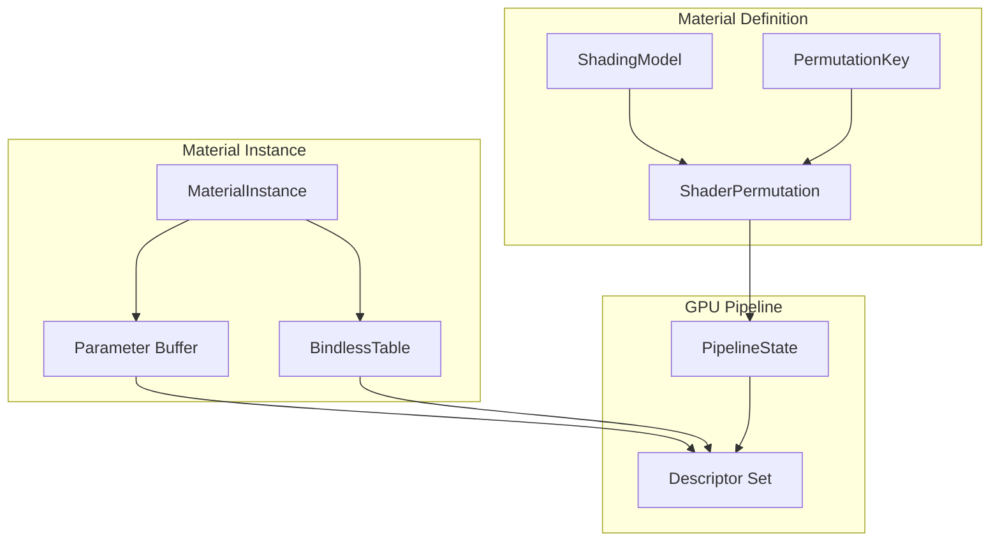

### Material Types

```rust
/// Opaque handle to a compiled material.
#[derive(
    Clone, Copy, Debug, PartialEq, Eq, Hash,
)]
pub struct MaterialId(pub u32);

/// Opaque handle to a material instance.
#[derive(
    Clone, Copy, Debug, PartialEq, Eq, Hash,
)]
pub struct MaterialInstanceId(pub u32);

/// Shading model selection. Determines which
/// BRDF the shader evaluates.
#[derive(
    Clone, Copy, Debug, PartialEq, Eq, Hash,
    Reflect,
)]
pub enum ShadingModel {
    /// Standard metallic-roughness PBR.
    DefaultLit,
    /// Subsurface scattering (skin, wax).
    Subsurface,
    /// Clearcoat (car paint, lacquered wood).
    ClearCoat,
    /// Cloth (velvet, cotton, silk).
    Cloth,
    /// Hair (Marschner anisotropic).
    Hair,
    /// Eye (cornea refraction + iris parallax).
    Eye,
    /// Thin translucent (single-pass glass).
    ThinTranslucent,
    /// Two-sided foliage (subsurface transmit).
    Foliage,
    /// Unlit (emissive only, no lighting).
    Unlit,
}

/// Shader feature flags that drive permutation
/// selection.
bitflags::bitflags! {
    #[derive(Clone, Copy, Debug)]
    pub struct ShaderFeatures: u32 {
        const NORMAL_MAP      = 1 << 0;
        const EMISSIVE        = 1 << 1;
        const ALPHA_CUTOUT    = 1 << 2;
        const VERTEX_COLORS   = 1 << 3;
        const SKINNING        = 1 << 4;
        const MORPH_TARGETS   = 1 << 5;
        const PARALLAX        = 1 << 6;
        const CLEARCOAT       = 1 << 7;
        const ANISOTROPY      = 1 << 8;
        const SUBSURFACE      = 1 << 9;
    }
}

/// Unique key identifying a shader permutation.
/// Used for pipeline state caching.
#[derive(
    Clone, Copy, Debug, PartialEq, Eq, Hash,
)]
pub struct PermutationKey {
    pub shading_model: ShadingModel,
    pub features: ShaderFeatures,
    pub render_path: RenderPath,
    pub vertex_format: VertexFormatId,
}

/// A compiled material: shader permutation +
/// fixed render state.
pub struct Material {
    pub id: MaterialId,
    pub shading_model: ShadingModel,
    pub features: ShaderFeatures,
    /// Compiled pipeline states per render path.
    pub pipelines: PipelineSet,
    /// Default parameter values.
    pub default_params: MaterialParams,
}

/// Per-path pipeline states for a material.
pub struct PipelineSet {
    /// Forward+ opaque pipeline.
    pub forward_opaque: Option<PipelineStateId>,
    /// Forward+ transparent pipeline.
    pub forward_transparent: Option<PipelineStateId>,
    /// Deferred G-buffer write pipeline.
    pub deferred_gbuffer: Option<PipelineStateId>,
    /// Depth-only prepass pipeline.
    pub depth_prepass: Option<PipelineStateId>,
    /// Shadow map pipeline.
    pub shadow: Option<PipelineStateId>,
}

/// A material instance: per-instance parameter
/// overrides sharing the parent material's
/// compiled shaders.
pub struct MaterialInstance {
    pub id: MaterialInstanceId,
    pub parent: MaterialId,
    /// Overridden parameters. None values fall
    /// back to the parent's defaults.
    pub params: MaterialParams,
    /// Bindless descriptor index for GPU access.
    pub bindless_index: u32,
}

/// Material parameter storage. Textures are
/// referenced via bindless indices.
pub struct MaterialParams {
    pub albedo_texture: Option<BindlessIndex>,
    pub normal_texture: Option<BindlessIndex>,
    pub metallic_roughness_texture:
        Option<BindlessIndex>,
    pub occlusion_texture: Option<BindlessIndex>,
    pub emissive_texture: Option<BindlessIndex>,
    pub albedo_factor: Vec4,
    pub metallic_factor: f32,
    pub roughness_factor: f32,
    pub emissive_factor: Vec3,
    pub alpha_cutoff: f32,
    /// Extended BSDF parameters.
    pub clearcoat_factor: f32,
    pub clearcoat_roughness: f32,
    pub anisotropy: f32,
    pub subsurface_radius: Vec3,
    pub sheen_color: Vec3,
    pub sheen_roughness: f32,
}
```

### Material System API

```rust
/// Manages material definitions, instances, and
/// shader permutation compilation.
pub struct MaterialSystem<B: GpuBackend> {
    materials: Vec<Material>,
    instances: Vec<MaterialInstance>,
    /// Cache: PermutationKey -> PipelineStateId.
    pipeline_cache:
        HashMap<PermutationKey, B::PipelineState>,
    /// Bindless descriptor table for all material
    /// textures.
    bindless_table: BindlessTable<B>,
}

impl<B: GpuBackend> MaterialSystem<B> {
    pub fn new(device: &B::Device) -> Self;

    /// Register a new material. Compiles all
    /// required shader permutations and caches
    /// pipeline states.
    pub fn create_material(
        &mut self,
        device: &B::Device,
        shading_model: ShadingModel,
        features: ShaderFeatures,
        params: MaterialParams,
    ) -> MaterialId;

    /// Create a material instance with parameter
    /// overrides. Shares the parent's compiled
    /// shaders.
    pub fn create_instance(
        &mut self,
        parent: MaterialId,
        params: MaterialParams,
    ) -> MaterialInstanceId;

    /// Update an existing instance's parameters.
    /// Marks the instance dirty for GPU re-upload.
    pub fn update_instance(
        &mut self,
        id: MaterialInstanceId,
        params: MaterialParams,
    );

    /// Upload all dirty material instance
    /// parameter buffers to the GPU.
    pub fn upload_dirty(
        &self,
        cmd: &mut B::CommandBuffer,
        allocator: &GpuAllocator<B>,
    );

    /// Look up the pipeline state for a given
    /// permutation. Returns a cached PSO or
    /// compiles on demand.
    pub fn get_pipeline(
        &mut self,
        device: &B::Device,
        key: &PermutationKey,
    ) -> &B::PipelineState;
}
```

### Bindless Descriptor Table

```rust
/// Index into the bindless descriptor heap.
#[derive(
    Clone, Copy, Debug, PartialEq, Eq, Hash,
)]
pub struct BindlessIndex(pub u32);

/// Manages a global bindless descriptor table
/// for textures and buffers. All materials
/// reference resources by BindlessIndex.
pub struct BindlessTable<B: GpuBackend> {
    /// Platform descriptor heap/argument buffer.
    descriptor_heap: B::DescriptorHeap,
    /// Free list for recycling indices.
    free_list: Vec<BindlessIndex>,
    /// Next index to allocate when free list is
    /// empty.
    next_index: u32,
    /// Maximum descriptor count.
    capacity: u32,
}

impl<B: GpuBackend> BindlessTable<B> {
    pub fn new(
        device: &B::Device,
        capacity: u32,
    ) -> Self;

    /// Allocate a bindless index and write a
    /// texture descriptor.
    pub fn insert_texture(
        &mut self,
        device: &B::Device,
        texture: &B::TextureHandle,
        sampler: &B::SamplerHandle,
    ) -> BindlessIndex;

    /// Release a bindless index for reuse.
    pub fn remove(
        &mut self,
        index: BindlessIndex,
    );
}
```

## Lighting

### Light Buffer

```rust
/// GPU-side light data for a single light.
#[repr(C)]
#[derive(Clone, Copy, bytemuck::Pod)]
pub struct LightGpu {
    /// World-space position (point/spot) or
    /// direction (directional).
    pub position_or_direction: Vec4,
    pub color_intensity: Vec4,
    /// x: range, y: inner cone cos,
    /// z: outer cone cos, w: light type.
    pub params: Vec4,
    /// Shadow matrix index (-1 = no shadow).
    pub shadow_matrix_index: i32,
    pub ies_profile_index: i32,
    pub _padding: [u32; 2],
}

/// Unified light buffer consumed by both forward
/// and deferred paths.
pub struct LightBuffer<B: GpuBackend> {
    /// GPU buffer holding LightGpu array.
    pub buffer: B::BufferHandle,
    /// Number of active lights this frame.
    pub light_count: u32,
    /// Maximum light capacity.
    pub capacity: u32,
}

impl<B: GpuBackend> LightBuffer<B> {
    pub fn new(
        device: &B::Device,
        capacity: u32,
    ) -> Self;

    /// Extract lights from ECS and upload to the
    /// GPU buffer. Returns the light count.
    pub fn update(
        &mut self,
        world: &World,
        cmd: &mut B::CommandBuffer,
        allocator: &GpuAllocator<B>,
    ) -> u32;
}
```

### Forward+ vs Deferred Data Flow

Both rendering paths share the culling pipeline,
light buffer, material system, and PBR evaluator.
The path divergence happens at the shading stage.

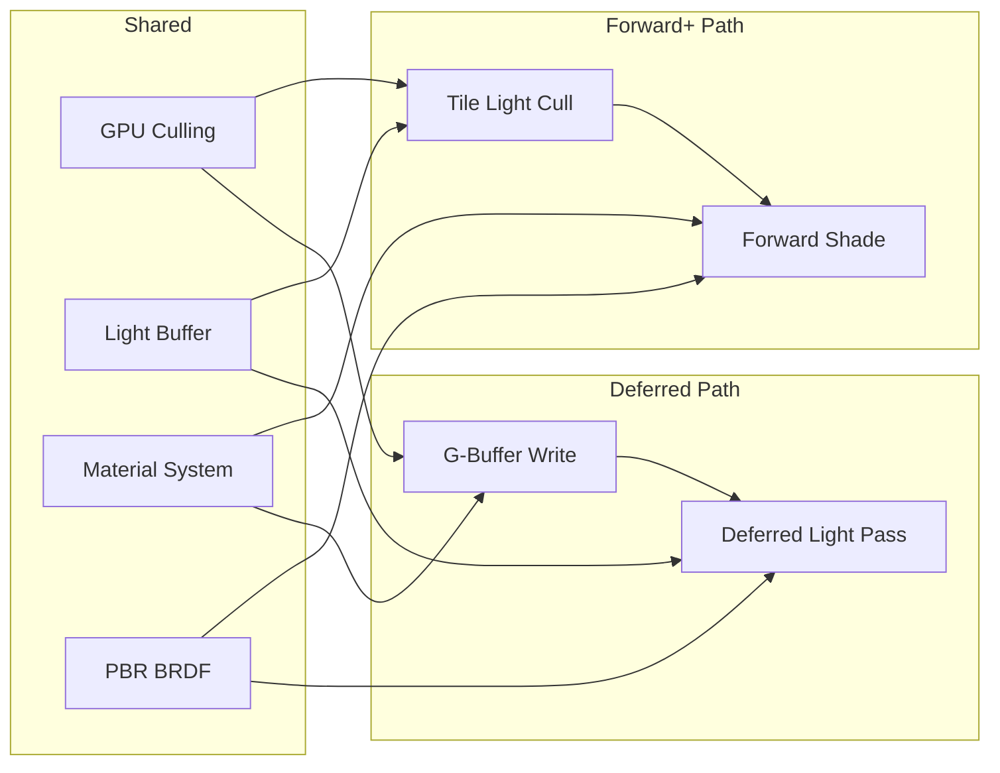

### G-Buffer Layout (Deferred Path)

| Target | Format | Contents |
|--------|--------|----------|
| GBuffer0 | RGBA8_UNORM | Albedo (RGB) + Metallic (A) |
| GBuffer1 | RGB10A2_UNORM | World Normal (RGB) + Roughness remapped (A) |
| GBuffer2 | RG16_FLOAT | Motion Vectors (RG) |
| Depth | D32_FLOAT | Reverse-Z depth |

The deferred lighting pass reads all G-buffer
targets plus the light buffer and outputs the lit
result to an HDR render target.

### PBR BRDF (HLSL Reference)

The Cook-Torrance microfacet BRDF is implemented
in HLSL and shared across all lighting paths.

```hlsl
// pbr_brdf.hlsl -- Cook-Torrance BRDF
// GGX/Trowbridge-Reitz NDF + Smith-GGX
// geometry + Schlick Fresnel

float DistributionGGX(
    float NdotH, float roughness
) {
    float a  = roughness * roughness;
    float a2 = a * a;
    float d  = NdotH * NdotH * (a2 - 1.0)
             + 1.0;
    return a2 / (PI * d * d);
}

float GeometrySmithGGX(
    float NdotV, float NdotL, float roughness
) {
    float r = roughness + 1.0;
    float k = (r * r) / 8.0;
    float gv = NdotV / (NdotV * (1.0 - k) + k);
    float gl = NdotL / (NdotL * (1.0 - k) + k);
    return gv * gl;
}

float3 FresnelSchlick(
    float cosTheta, float3 F0
) {
    float t = 1.0 - cosTheta;
    float t5 = t * t * t * t * t;
    return F0 + (1.0 - F0) * t5;
}

float3 EvaluateCookTorrance(
    float3 N, float3 V, float3 L,
    float3 albedo, float metallic,
    float roughness
) {
    float3 H = normalize(V + L);

    float NdotL = max(dot(N, L), 0.0);
    float NdotV = max(dot(N, V), 0.001);
    float NdotH = max(dot(N, H), 0.0);
    float VdotH = max(dot(V, H), 0.0);

    // Dielectric F0 = 0.04, blend with albedo
    // for metals.
    float3 F0 = lerp(
        float3(0.04, 0.04, 0.04),
        albedo,
        metallic
    );

    float  D = DistributionGGX(
        NdotH, roughness
    );
    float  G = GeometrySmithGGX(
        NdotV, NdotL, roughness
    );
    float3 F = FresnelSchlick(VdotH, F0);

    // Specular BRDF.
    float3 numerator = D * G * F;
    float  denominator =
        4.0 * NdotV * NdotL + 0.0001;
    float3 specular = numerator / denominator;

    // Energy conservation: diffuse is reduced
    // by the specular Fresnel reflection.
    float3 kD = (1.0 - F) * (1.0 - metallic);
    float3 diffuse = kD * albedo / PI;

    return (diffuse + specular) * NdotL;
}
```

### Tiled Light Culling (HLSL Reference)

```hlsl
// tile_cull.hlsl -- Forward+ tiled light culling
// Assigns lights to screen-space tiles.

#define TILE_SIZE 16
#define MAX_LIGHTS_PER_TILE 256

groupshared uint tile_light_count;
groupshared uint tile_light_indices[
    MAX_LIGHTS_PER_TILE
];
groupshared uint tile_depth_min;
groupshared uint tile_depth_max;

[numthreads(TILE_SIZE, TILE_SIZE, 1)]
void CSTileLightCull(
    uint3 group_id : SV_GroupID,
    uint3 thread_id : SV_GroupThreadID,
    uint flat_id : SV_GroupIndex
) {
    // Step 1: Compute tile depth bounds from
    // the depth buffer.
    if (flat_id == 0) {
        tile_light_count = 0;
        tile_depth_min = 0xFFFFFFFF;
        tile_depth_max = 0;
    }
    GroupMemoryBarrierWithGroupSync();

    uint2 pixel = group_id.xy * TILE_SIZE
        + thread_id.xy;
    float depth = DepthBuffer.Load(
        int3(pixel, 0)
    ).r;
    uint depth_uint = asuint(depth);

    InterlockedMin(
        tile_depth_min, depth_uint
    );
    InterlockedMax(
        tile_depth_max, depth_uint
    );
    GroupMemoryBarrierWithGroupSync();

    float min_depth = asfloat(tile_depth_min);
    float max_depth = asfloat(tile_depth_max);

    // Step 2: Each thread tests a subset of
    // lights against the tile frustum.
    uint light_count =
        LightCountBuffer.Load(0);
    for (
        uint i = flat_id;
        i < light_count;
        i += TILE_SIZE * TILE_SIZE
    ) {
        LightGpu light = LightBuffer[i];
        if (LightIntersectsTile(
            light, group_id.xy,
            min_depth, max_depth
        )) {
            uint idx;
            InterlockedAdd(
                tile_light_count, 1, idx
            );
            if (idx < MAX_LIGHTS_PER_TILE) {
                tile_light_indices[idx] = i;
            }
        }
    }
    GroupMemoryBarrierWithGroupSync();

    // Step 3: Write tile light list to output.
    uint tile_index =
        group_id.y * TileCountX + group_id.x;
    uint count = min(
        tile_light_count, MAX_LIGHTS_PER_TILE
    );

    if (flat_id == 0) {
        TileLightCounts[tile_index] = count;
    }

    for (
        uint j = flat_id;
        j < count;
        j += TILE_SIZE * TILE_SIZE
    ) {
        TileLightIndices[
            tile_index * MAX_LIGHTS_PER_TILE + j
        ] = tile_light_indices[j];
    }
}
```

## Dynamic Resolution and Scene Capture

### Dynamic Resolution

```rust
/// GPU timing feedback loop that adjusts render
/// resolution to maintain a target frame budget.
pub struct DynamicResolution {
    /// Ring buffer of GPU frame times (ms).
    history: [f32; 8],
    history_index: usize,
    /// Current scale factor [min, max].
    current_scale: f32,
    /// Exponential moving average of GPU time.
    smoothed_gpu_ms: f32,
}

impl DynamicResolution {
    pub fn new() -> Self;

    /// Feed a new GPU frame time measurement.
    /// Returns the updated render scale for the
    /// next frame. Converges within 5 frames
    /// (NFR-2.3.2). Scale adjusts proportionally
    /// to the ratio of measured vs target time.
    pub fn update(
        &mut self,
        gpu_ms: f32,
        state: &DynamicResolutionState,
    ) -> f32;

    pub fn current_scale(&self) -> f32;
}
```

### Scene Capture

```rust
/// Renders the scene from a secondary camera
/// into a texture for use as a material input.
pub struct SceneCapture;

impl SceneCapture {
    /// Register a planar scene capture as a
    /// sub-graph in the render graph. The capture
    /// re-uses the same culling and draw
    /// infrastructure as the main view but with
    /// an independent ViewUniform and render
    /// target.
    pub fn register_planar<B: GpuBackend>(
        graph: &mut RenderGraphBuilder<B>,
        capture: &SceneCaptureComponent,
        camera: &CameraComponent,
        transform: &GlobalTransform,
    ) -> RenderPassId;

    /// Register a cubemap capture. Generates six
    /// views (one per face) sharing the same
    /// capture position. Each face is a 90-degree
    /// FOV perspective view.
    pub fn register_cubemap<B: GpuBackend>(
        graph: &mut RenderGraphBuilder<B>,
        capture: &SceneCaptureComponent,
        transform: &GlobalTransform,
    ) -> [RenderPassId; 6];
}

/// Dynamic cubemap that re-renders a subset of
/// faces each frame to amortize cost.
pub struct DynamicCubemap<B: GpuBackend> {
    pub cubemap_texture: B::TextureHandle,
    pub face_resolution: u32,
    /// Which face to update this frame (0-5).
    pub current_face: u32,
    /// Number of faces to update per frame.
    pub faces_per_frame: u32,
}

impl<B: GpuBackend> DynamicCubemap<B> {
    pub fn new(
        device: &B::Device,
        resolution: u32,
        faces_per_frame: u32,
    ) -> Self;

    /// Advance the face rotation and return the
    /// face indices to render this frame.
    pub fn next_faces(&mut self) -> &[u32];
}
```

## Debug Visualization

```rust
/// Immediate-mode debug draw API. All methods
/// are no-ops in shipping builds via compile-time
/// gating.
#[cfg(debug_assertions)]
pub struct DebugDraw {
    vertices: Vec<DebugVertex>,
    indices: Vec<u32>,
}

#[cfg(not(debug_assertions))]
pub struct DebugDraw;

#[cfg(debug_assertions)]
#[repr(C)]
#[derive(Clone, Copy, Debug)]
pub struct DebugVertex {
    pub position: [f32; 3],
    pub color: [f32; 4],
}

#[cfg(debug_assertions)]
impl DebugDraw {
    pub fn new() -> Self;
    pub fn line(
        &mut self, start: Vec3,
        end: Vec3, color: Color,
    );
    pub fn wire_box(
        &mut self, center: Vec3,
        half_extents: Vec3, color: Color,
    );
    pub fn wire_sphere(
        &mut self, center: Vec3,
        radius: f32, color: Color,
    );
    pub fn wire_frustum(
        &mut self, frustum: &Frustum,
        color: Color,
    );
    pub fn text(
        &mut self, position: Vec3,
        text: &str, color: Color,
    );
    /// Flush all debug primitives into a single
    /// vertex/index buffer for the debug render
    /// pass.
    pub fn flush(&mut self) -> DebugBatch;
}

#[cfg(not(debug_assertions))]
impl DebugDraw {
    pub fn new() -> Self { Self }
    pub fn line(&mut self, _: Vec3, _: Vec3, _: Color) {}
    pub fn wire_box(&mut self, _: Vec3, _: Vec3, _: Color) {}
    pub fn wire_sphere(&mut self, _: Vec3, _: f32, _: Color) {}
    pub fn wire_frustum(&mut self, _: &Frustum, _: Color) {}
    pub fn text(&mut self, _: Vec3, _: &str, _: Color) {}
    pub fn flush(&mut self) -> DebugBatch { DebugBatch }
}

/// Batched debug geometry ready for GPU upload.
#[cfg(debug_assertions)]
pub struct DebugBatch {
    pub vertices: Vec<DebugVertex>,
    pub indices: Vec<u32>,
}

#[cfg(not(debug_assertions))]
pub struct DebugBatch;

/// Buffer visualization diagnostic modes.
#[cfg(debug_assertions)]
#[derive(Clone, Copy, Debug, PartialEq, Eq)]
pub enum BufferVizMode {
    None,
    Depth,
    Normals,
    MotionVectors,
    Roughness,
    Metallic,
    BaseColor,
    AmbientOcclusion,
    LightComplexity,
    OverdrawHeatMap,
}

/// System that renders the debug overlay pass.
/// Compile-time gated: absent from shipping.
#[cfg(debug_assertions)]
pub fn debug_draw_system(
    render_world: Res<RenderWorld>,
    debug_draw: ResMut<DebugDraw>,
);
```

## Plugin Registration

```rust
/// Plugin that registers all core rendering
/// systems with the ECS scheduler.
pub struct CoreRenderingPlugin;

impl Plugin for CoreRenderingPlugin {
    fn build(&self, app: &mut App) {
        app.init_resource::<RenderWorld>();

        #[cfg(debug_assertions)]
        app.init_resource::<DebugDraw>();

        // PreRender phase: extraction
        app.add_system_to_phase(
            PreRender,
            extract_cameras_system,
        );
        app.add_system_to_phase(
            PreRender,
            extract_render_proxies_system,
        );
        app.add_system_to_phase(
            PreRender,
            extract_lights_system,
        );

        // Render phase: prepare and submit
        app.add_system_to_phase(
            Render,
            update_views_system
                .after(extract_cameras_system),
        );
        app.add_system_to_phase(
            Render,
            visibility_system
                .after(update_views_system),
        );
        app.add_system_to_phase(
            Render,
            build_draw_lists_system
                .after(visibility_system),
        );
        app.add_system_to_phase(
            Render,
            sort_draw_lists_system
                .after(build_draw_lists_system),
        );
        app.add_system_to_phase(
            Render,
            batch_compaction_system
                .after(sort_draw_lists_system),
        );
        app.add_system_to_phase(
            Render,
            material_binding_system
                .after(sort_draw_lists_system),
        );
        #[cfg(debug_assertions)]
        app.add_system_to_phase(
            Render,
            debug_draw_system
                .after(sort_draw_lists_system),
        );
        app.add_system_to_phase(
            Render,
            encode_commands_system
                .after(batch_compaction_system)
                .after(material_binding_system),
        );
        app.add_system_to_phase(
            Render,
            submit_frame_system
                .after(encode_commands_system),
        );
    }
}
```

## Error Types

```rust
/// Errors that can occur in the core rendering
/// pipeline.
pub enum CoreRenderingError {
    /// Entity does not have a render proxy.
    ProxyNotFound { entity: Entity },
    /// Proxy store is at capacity.
    ProxyStoreExhausted { capacity: u32 },
    /// Instance buffer exceeded GPU allocation.
    InstanceBufferOverflow {
        requested: u32,
        available: u32,
    },
    /// Indirect draw buffer allocation failed.
    IndirectBufferAllocationFailed,
    /// View limit exceeded.
    MaxViewsExceeded { count: u32, max: u32 },
}
```

## Data Flow

### Per-Frame Lifecycle

```rust
// Simplified frame flow (pseudocode)
loop {
    // --- I/O poll point ---
    reactor.poll();

    // --- Simulation (Update phase) ---
    ecs.run_phase(Update);

    // --- Transform propagation (PostUpdate) ---
    // GlobalTransform computed, BVH updated.
    ecs.run_phase(PostUpdate);

    // --- Extraction (PreRender) ---
    // extract_cameras_system
    // extract_render_proxies_system
    //   - Query Changed<GlobalTransform>,
    //     Changed<MeshHandle>,
    //     Changed<MaterialHandle>
    //   - Insert new, update changed, remove
    //     despawned
    // extract_lights_system
    ecs.run_phase(PreRender);

    // --- Prepare + Render (Render phase) ---
    // update_views_system
    // visibility_system
    // build_draw_lists_system
    // sort_draw_lists_system
    // batch_compaction_system
    // material_binding_system
    // debug_draw_system (debug only)
    // encode_commands_system
    // submit_frame_system
    ecs.run_phase(Render);

    // --- GPU sync (async, no CPU spin) ---
    renderer.present().await;
}
```

### Frame Rendering Sequence

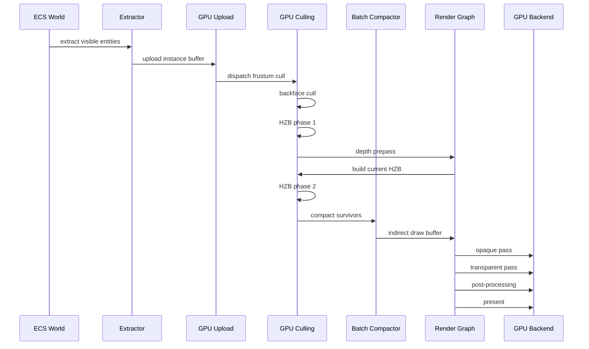

## Platform Considerations

### Rendering Path Defaults

| Platform | Default Path | Rationale |
|----------|-------------|-----------|
| Mobile | Forward+ | G-buffer bandwidth prohibitive on tile-based GPUs |
| Switch (handheld) | Forward+ | Bandwidth constrained; 720p native |
| Switch (docked) | Forward+ | Thin G-buffer possible but forward preferred |
| Desktop | Deferred | High light counts; G-buffer bandwidth acceptable |
| High-end | Deferred | Full G-buffer with 4+ targets |
| VR | Forward+ | Latency-sensitive; single-pass instanced stereo |

### Culling Pipeline Scaling

| Platform | HZB Resolution | Phase 2 | Max Meshlets |
|----------|---------------|---------|-------------|
| Mobile | Quarter | Skippable | 100k |
| Switch (handheld) | Half | Active | 250k |
| Switch (docked) | Half | Active | 500k |
| Desktop | Full | Active | 1M |
| High-end | Full | Active | 4M+ |

### Light Limits Per Tile

| Platform | Max Lights/Tile | Total Active |
|----------|----------------|-------------|
| Mobile | 16 | 64 |
| Switch | 32 | 128 |
| Desktop | 256 | 2048 |
| High-end | Unlimited | Unlimited (stochastic) |

### Platform Scaling

| Tier | Max Proxies | Max Views | Indirect Draw | Draw Lists |
|------|-------------|-----------|---------------|------------|
| Mobile | 50K | 4 (main + 2-3 shadows) | Vulkan 1.1+ / Metal GPU family 3+ | Smaller compaction buffers |
| Switch | 200K | 8 | Full indirect compaction | Medium buffers |
| Desktop | 1M+ | Configurable, dozens | Full indirect compaction | Large buffers |

### Backend-Specific Bindless Binding

| Backend | Mechanism | Notes |
|---------|-----------|-------|
| Metal | Argument buffers | `MTLArgumentEncoder` writes bindless indices into an argument buffer bound once per frame. |
| D3D12 | Bindless SRV heap | Root descriptor table points to a shader-visible CBV/SRV/UAV heap. Indices stored in per-instance data. |
| Vulkan | `VK_EXT_descriptor_indexing` | `UPDATE_AFTER_BIND` descriptors in a single large descriptor set. Non-uniform indexing in shader. |

### Indirect Draw API Mapping

| Backend | Indirect Draw API | Count Buffer |
|---------|-------------------|--------------|
| Metal | `drawIndexedPrimitives(indirectBuffer:)` | `MTLIndirectCommandBuffer` with `executeCommandsInBuffer` |
| D3D12 | `ExecuteIndirect` | `ID3D12CommandSignature` with draw count in a separate buffer |
| Vulkan | `vkCmdDrawIndexedIndirectCount` | Requires `VK_KHR_draw_indirect_count` (core in Vulkan 1.2) |

### Dynamic Resolution Bounds

| Platform | Min Scale | Max Scale | Target |
|----------|----------|----------|--------|
| Mobile | 50% | 75% | 33 ms (30 fps) |
| Switch (handheld) | 50% | 100% | 33 ms (30 fps) |
| Switch (docked) | 60% | 100% | 16 ms (60 fps) |
| Desktop | 67% | 100% | 16 ms (60 fps) |
| High-end | 50% | 100% | 8-16 ms |

### Depth Buffer Configuration

| Backend | Depth Format | Clear Value (Reverse-Z) |
|---------|-------------|------------------------|
| Metal | `depth32Float` | 0.0 |
| D3D12 | `DXGI_FORMAT_D32_FLOAT` | 0.0 |
| Vulkan | `VK_FORMAT_D32_SFLOAT` | 0.0 |

All backends use reverse-Z with depth cleared to
0.0 (far plane). The near plane maps to depth 1.0.
Depth comparison uses `GREATER` instead of `LESS`.

### Shader Compilation Pipeline

| Stage | Tool | Input | Output |
|-------|------|-------|--------|
| Author | HLSL source | `.hlsl` files | N/A |
| Compile (D3D12) | DXC via cxx.rs | HLSL | DXIL bytecode |
| Compile (Vulkan) | DXC via cxx.rs | HLSL | SPIR-V bytecode |
| Compile (Metal) | Metal Shader Converter via cxx.rs | DXIL | MSL / metallib |

### Proposed Dependencies

| Crate | Purpose | Justification |
|-------|---------|---------------|
| `bitflags` | `InstanceFlags`, `ShaderFeatures`, `RenderLayerMask` | Standard Rust bitflag pattern |
| `bytemuck` | Safe transmute for GPU buffer types (`Pod`, `Zeroable`) | Zero-cost GPU buffer mapping |
| `smallvec` | Inline-allocated light lists, face lists | Avoids heap allocation in hot paths |

## Test Plan

### Unit Tests

| Test | Req | Description |
|------|-----|-------------|
| `test_sort_key_opaque_ordering` | R-2.3.7 | Verify opaque sort keys order by pipeline, then material, then front-to-back depth. |
| `test_sort_key_transparent_ordering` | R-2.3.7, R-2.4.5 | Verify transparent sort keys order back-to-front. |
| `test_perspective_reverse_z_near_far` | R-2.3.6 | Near plane maps to depth 1.0, far maps to 0.0. Infinite far produces valid matrix. |
| `test_orthographic_reverse_z` | R-2.3.5 | Orthographic projection produces linear depth in [0, 1] with reverse mapping. |
| `test_frustum_plane_extraction` | R-2.3.2 | Extracted planes correctly classify known inside/outside points. |
| `test_render_layer_mask_filtering` | R-2.3.7 | Entities with non-intersecting layer masks are excluded from extraction. |
| `test_instance_flags_packing` | R-2.3.13 | `InstanceFlags` round-trips through u32. Two-sided flag skips backface cull. |
| `test_drs_convergence` | NFR-2.3.2 | DRS converges within 5 frames of a step-change in GPU load. No oscillation > 5%. |
| `test_drs_clamp_bounds` | R-2.3.11 | DRS scale never exceeds max or falls below min. |
| `test_material_permutation_cache` | R-2.4.3 | Same PermutationKey returns the same cached PipelineState. |
| `test_bindless_alloc_free_reuse` | R-2.10.8 | Freed BindlessIndex is recycled on next allocation. |
| `test_batch_compaction_count` | NFR-2.3.3 | 10,000 instances across 10 materials produce exactly 10 indirect draws. |
| `test_view_uniform_struct_size` | R-2.3.6 | `ViewUniform` size matches expected GPU layout (std140/std430). |
| `test_light_gpu_struct_alignment` | R-2.3.1 | `LightGpu` is 16-byte aligned and matches HLSL `cbuffer` layout. |
| `test_two_sided_skips_backface_cull` | R-2.3.3 | Meshlets flagged two-sided bypass normal cone test. |
| `test_alpha_cutout_in_shadow_pass` | R-2.3.13 | Alpha-cutout geometry generates shadow draw commands. |
| `test_proxy_insert_remove_reuse` | R-2.10.2 | ProxyStore recycles freed indices correctly. |
| `test_proxy_dirty_flags_cleared` | R-2.10.3 | Dirty flags clear after `clear_dirty_flags` call. |
| `test_proxy_incremental_update` | R-2.10.3 | Only dirty-flagged fields are touched during update. |

### Integration Tests

| Test | Req | Description |
|------|-----|-------------|
| `test_forward_deferred_parity` | R-2.3.1 | Same scene rendered via forward+ and deferred produces pixel-identical lighting (within FP tolerance). |
| `test_frustum_cull_gpu_vs_cpu` | R-2.3.2 | GPU frustum cull results match CPU reference for 10,000 meshlets at 1-degree camera sweeps. |
| `test_hzb_two_phase_no_popin` | R-2.3.4 | Fast camera pan revealing occluded geometry shows no single-frame pop-in. Phase 2 recovers geometry same frame. |
| `test_hzb_occlusion_reduction` | R-2.3.4 | Dense urban scene achieves >= 30% draw call reduction from occlusion culling. |
| `test_cubemap_face_seams` | R-2.3.9 | Dynamic cubemap faces produce seamless edges (no visible seam artifacts). |
| `test_scene_capture_same_frame` | R-2.3.10 | Scene capture texture is usable as material input in the same frame it was rendered. |
| `test_drs_under_load` | R-2.3.11 | Resolution decreases within 5 frames when scene exceeds budget, increases when load drops. |
| `test_reverse_z_cross_backend` | R-2.3.6 | Depth buffer clears to 0.0 and comparison uses GREATER on Metal, D3D12, and Vulkan. |
| `test_sss_profile_scatter` | R-2.3.12 | Skin SSS profile produces visible light transmission at shadow terminator. |
| `test_alpha_cutout_shadow_shape` | R-2.3.13 | Shadow cast by alpha-cutout quad matches the alpha mask shape. |
| `test_extraction_100k_entities` | NFR-2.10.1 | Full extraction of 100K entities completes in < 2.0 ms. |
| `test_extraction_1pct_dirty` | NFR-2.10.1 | Incremental extraction with 1% dirty completes in < 0.5 ms. |
| `test_draw_list_throughput` | NFR-2.10.2 | Draw list construction processes >= 500K proxies/ms/core. |

### GPU Benchmarks

| Benchmark | Target | Source |
|-----------|--------|--------|
| Culling pipeline (1M meshlets, 1080p) | < 1.0 ms GPU | NFR-2.3.1 |
| Batch compaction (10k instances) | < 0.1 ms GPU | NFR-2.3.3 |
| HZB build (1080p, full mip chain) | < 0.3 ms GPU | R-2.3.4 |
| Forward+ tile cull (256 lights) | < 0.5 ms GPU | R-2.4.1 |
| Deferred light pass (256 lights) | < 0.5 ms GPU | R-2.4.2 |
| DRS feedback loop overhead | < 0.01 ms CPU | NFR-2.3.2 |
| Instance buffer upload (50k) | < 0.5 ms CPU | R-2.10.3 |
| Material instance upload (1k dirty) | < 0.1 ms CPU | R-2.4.6 |

## Open Questions

1. **Clustered vs tiled forward+.** Tiled forward
   uses 2D screen tiles; clustered forward adds
   depth slices (froxels). Clustered reduces
   per-tile light count for scenes with depth
   variance but increases memory and dispatch
   complexity. Recommended: clustered for desktop,
   tiled for mobile. Needs profiling on target
   hardware.

2. **Meshlet LOD selection integration.** The
   meshlet DAG (F-3.1.1) supports continuous LOD
   selection on the GPU. The culling pipeline
   needs to integrate LOD cut selection before
   frustum culling. Should LOD selection be a
   separate compute pass or merged into the
   frustum cull dispatch?

3. **Transparent object limit.** Transparent
   objects are sorted CPU-side and drawn
   individually. At high transparent object
   counts (>1000) this becomes a CPU bottleneck.
   Order-independent transparency (F-2.4.18) can
   eliminate sorting but has high bandwidth cost.
   Need to determine the transition threshold.

4. **Shader permutation explosion.** With 10
   shading models x 10 feature flags x 2 render
   paths x N vertex formats, the permutation
   space is large. Strategies: uber-shader with
   runtime branching (simple but slower),
   compile-time specialization constants (smaller
   binaries, driver-specific perf), or lazy
   compilation (first-use hitching). Recommended:
   specialization constants on Vulkan/Metal,
   static permutations on D3D12.

5. **HZB temporal stability.** Using the previous
   frame's HZB for phase 1 introduces a one-frame
   lag. Fast camera motion can cause transient
   over-culling. Phase 2 mitigates this but adds
   GPU cost. Should phase 1 use camera-motion
   extrapolation to expand meshlet bounds
   conservatively?

6. **Multi-draw-indirect-count availability.**
   `DrawIndexedIndirectCount` (Vulkan) /
   `ExecuteIndirect` with count buffer (D3D12) /
   `drawIndexedPrimitives(indirectBuffer:
   indirectBufferOffset:)` (Metal) vary in
   availability. Need to determine fallback
   strategy for backends that lack GPU-driven
   draw count.

7. **VR single-pass instanced stereo.** VR views
   can share a single culling pass and use
   viewport instancing to render both eyes in one
   draw call. Requires `VK_KHR_multiview` /
   Metal viewport array / D3D12 view instancing.
   Need to confirm minimum hardware tier.
