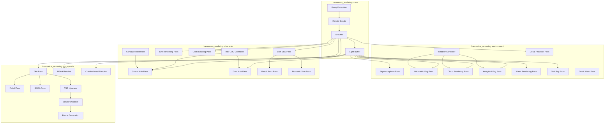
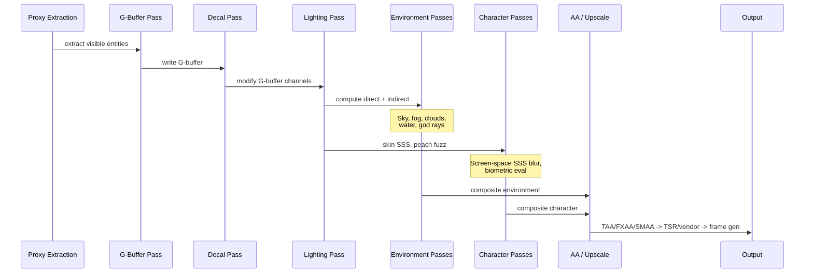
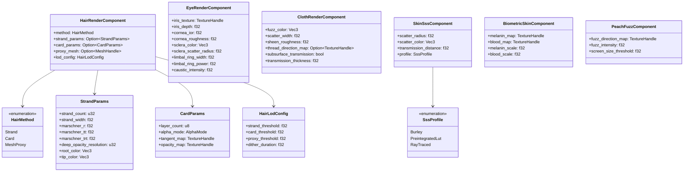
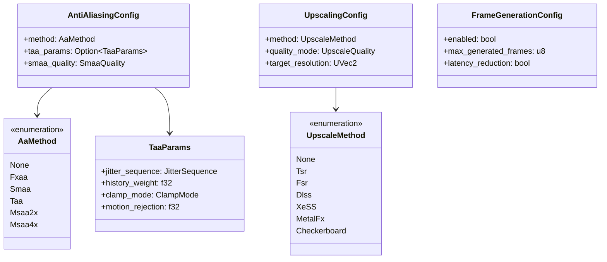
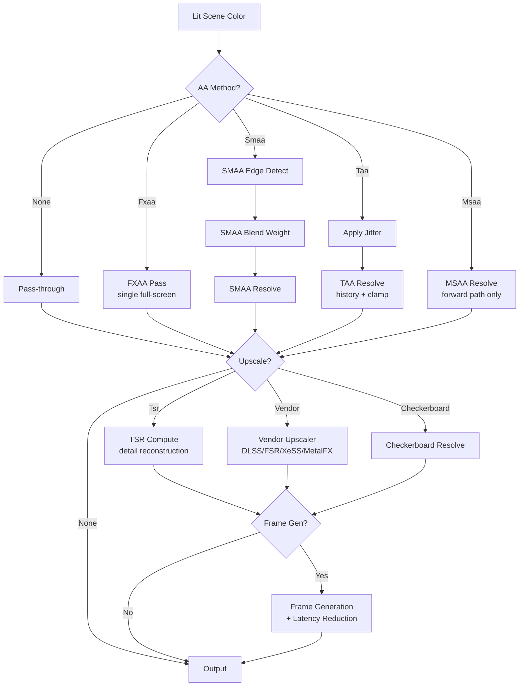
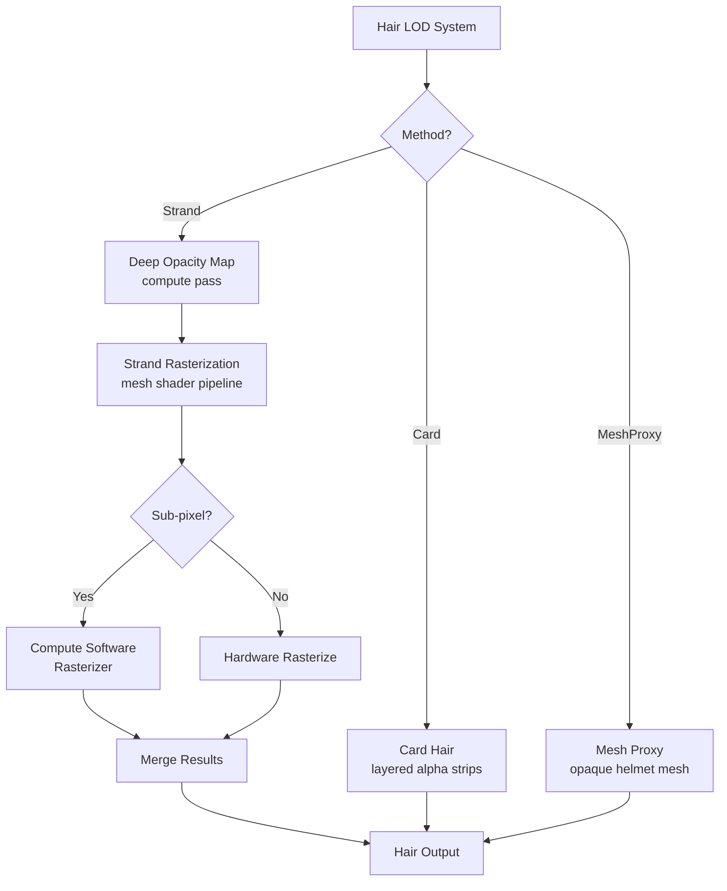
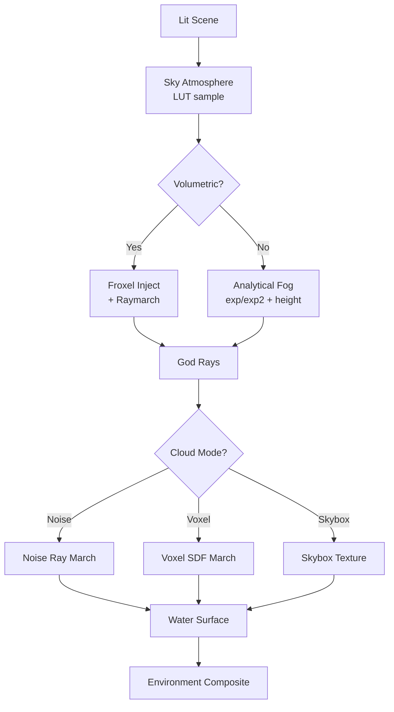

# Environment and Character Rendering Design

## Requirements Trace

### Anti-Aliasing and Upscaling (2.6)

| Feature | Requirement | Description |
|---------|-------------|-------------|
| F-2.6.1 | R-2.6.1 | TAA with jittered sub-pixel accumulation and history rejection |
| F-2.6.2 | R-2.6.2 | Platform-agnostic temporal super resolution (TSR) compute shaders |
| F-2.6.3 | R-2.6.3 | FXAA single-pass spatial AA with no temporal history |
| F-2.6.4 | R-2.6.4 | MSAA 2x/4x in forward rendering path only |
| F-2.6.5 | R-2.6.5 | Checkerboard rendering with temporal reconstruction |
| F-2.6.6 | R-2.6.6 | Vendor upscaler abstraction (DLSS, FSR, XeSS) with TSR fallback |
| F-2.6.7 | R-2.6.7 | AI-driven frame generation from motion vectors and history |
| F-2.6.8 | R-2.6.8 | Latency reduction via CPU/GPU submission synchronization |

### Environment and Atmosphere (2.7)

| Feature | Requirement | Description |
|---------|-------------|-------------|
| F-2.7.1 | R-2.7.1 | Procedural sky with Bruneton/Hillaire atmosphere LUTs |
| F-2.7.2 | R-2.7.2 | Ray-marched volumetric fog via froxel grid |
| F-2.7.3 | R-2.7.3 | Procedural volumetric clouds with temporal reprojection |
| F-2.7.4 | R-2.7.4 | God rays (screen-space and volumetric modes) |
| F-2.7.5 | R-2.7.5 | Analytical distance/height fog with height falloff |
| F-2.7.6 | R-2.7.6 | FFT ocean rendering with reflections, foam, underwater |
| F-2.7.7 | R-2.7.7 | Heterogeneous volumes (OpenVDB) with volumetric BSDF |
| F-2.7.8 | R-2.7.8 | Voxel-based volumetric clouds with SDF acceleration |
| F-2.7.9 | R-2.7.9 | Art-directable breaking waves with Coons surface eval |
| F-2.7.10 | R-2.7.10 | Weather state machine driving all environment systems |

### Character Rendering (2.8)

| Feature | Requirement | Description |
|---------|-------------|-------------|
| F-2.8.1 | R-2.8.1 | Strand-based hair with Marschner BSDF and deep opacity |
| F-2.8.2 | R-2.8.2 | Card-based hair with layered alpha-blended strips |
| F-2.8.3 | R-2.8.3 | Multi-tier hair LOD with cross-fade dithering |
| F-2.8.4 | R-2.8.4 | Layered eye rendering (cornea, iris parallax, sclera SSS) |
| F-2.8.5 | R-2.8.5 | Cloth shading with fuzz layer and fabric specular lobe |
| F-2.8.6 | R-2.8.6 | Skin SSS with Burley normalized diffusion profiles |
| F-2.8.7 | R-2.8.7 | Compute software rasterizer for sub-pixel hair strands |
| F-2.8.8 | R-2.8.8 | Peach fuzz (vellus hair) as screen-space fuzz layer |
| F-2.8.9 | R-2.8.9 | Biometric skin model (melanin + blood distribution) |

### Decals (11.2)

| Feature | Requirement | Description |
|---------|-------------|-------------|
| F-11.2.1 | R-11.2.1 | Deferred decals with G-buffer channel modification |
| F-11.2.2 | R-11.2.2 | Mesh decals with tangent-space normals |
| F-11.2.3 | R-11.2.3 | Decal atlas batching with LRU eviction |
| F-11.2.4 | R-11.2.4 | Priority-based layering and lifecycle management |

### Non-Functional Requirements

| NFR | Budget | Scope |
|-----|--------|-------|
| NFR-2.6.2 | FXAA < 0.3 ms, TAA < 0.5 ms @ 1080p | AA pass cost |
| NFR-2.6.1 | TSR within 1 dB PSNR of native | Upscaler quality |
| NFR-2.6.3 | Frame gen latency <= no-gen baseline | Latency |
| NFR-2.7.1 | Volumetric fog < 2.0 ms @ 1080p | Fog pass cost |
| NFR-2.7.2 | Cloud pass < 3.0 ms @ 1080p | Cloud cost |
| NFR-2.7.3 | Ocean sim + render < 3.0 ms @ 1080p | Ocean cost |
| NFR-2.8.1 | Strand hair < 2.0 ms / character, cards < 0.5 ms | Hair cost |
| NFR-2.8.2 | Skin SSS < 1.0 ms @ 1080p (screen-space) | SSS cost |
| NFR-2.8.3 | Hair LOD cross-fade < 0.5 s, no pop | LOD quality |

## Overview

This document covers the rendering design for three tightly
coupled subsystems:

1. **Anti-aliasing and upscaling** -- temporal and spatial AA
   methods, temporal super resolution, vendor upscaler
   integration, frame generation, and latency reduction.
2. **Environment rendering** -- sky atmosphere, volumetric fog,
   clouds, god rays, water, heterogeneous volumes, weather,
   decal projectors, and detail meshes with LOD transitions.
3. **Character rendering** -- strand and card hair, eye shading,
   cloth shading, skin subsurface scattering, peach fuzz,
   biometric skin, and compute software rasterization.

All state lives as ECS components. All logic runs as ECS
systems registered in the render graph. No separate rendering
world exists -- proxy extraction (F-2.10.1) copies the
minimal data needed for GPU submission each frame. Platform
selection uses `cfg` attributes with static dispatch. Shaders
are authored in HLSL, compiled via DXC to DXIL/SPIR-V, and
converted to MSL via Metal Shader Converter.

## Architecture

### Module Boundaries



### File Layout

```
harmonius_rendering/
├── aa_upscale/
│   ├── taa.rs          # TaaPass, TaaParams,
│   │                   # history management
│   ├── fxaa.rs         # FxaaPass, quality presets
│   ├── smaa.rs         # SmaaPass, edge/blend
│   │                   # weight passes
│   ├── msaa.rs         # MsaaResolve, sample
│   │                   # count config
│   ├── tsr.rs          # TsrPass, reconstruction
│   │                   # filter
│   ├── checkerboard.rs # CheckerboardPass,
│   │                   # resolve filter
│   ├── vendor.rs       # VendorUpscaler trait,
│   │                   # fallback logic
│   ├── frame_gen.rs    # FrameGenPass, latency
│   │                   # compensation
│   └── config.rs       # AntiAliasingConfig,
│                       # UpscalingConfig
├── environment/
│   ├── sky.rs          # SkyAtmospherePass,
│   │                   # LUT management
│   ├── volumetric.rs   # VolumetricFogPass,
│   │                   # froxel injection
│   ├── clouds.rs       # CloudPass, noise-based
│   │                   # and voxel-based
│   ├── fog.rs          # AnalyticalFogPass,
│   │                   # exp/exp2 + height
│   ├── water.rs        # WaterRenderPass, FFT
│   │                   # integration
│   ├── god_rays.rs     # GodRayPass, screen-space
│   │                   # and volumetric
│   ├── weather.rs      # WeatherSystem, state
│   │                   # machine
│   ├── decals.rs       # DecalPass, atlas,
│   │                   # projector
│   ├── detail_mesh.rs  # DetailMeshPass,
│   │                   # density/LOD
│   └── volumes.rs      # HeterogeneousVolume,
│                       # OpenVDB render
├── character/
│   ├── hair_strand.rs  # StrandHairPass,
│   │                   # Marschner BSDF
│   ├── hair_card.rs    # CardHairPass, layered
│   │                   # alpha strips
│   ├── hair_lod.rs     # HairLodSystem,
│   │                   # tier selection
│   ├── hair_compute.rs # ComputeHairRasterizer,
│   │                   # froxel lines
│   ├── eye.rs          # EyeRenderPass, cornea
│   │                   # + iris + sclera
│   ├── cloth.rs        # ClothRenderPass, fuzz
│   │                   # layer
│   ├── skin_sss.rs     # SkinSssPass, Burley
│   │                   # diffusion
│   ├── peach_fuzz.rs   # PeachFuzzPass,
│   │                   # screen-space fuzz
│   └── biometric.rs    # BiometricSkinPass,
│                       # melanin/blood
└── shaders/
    ├── aa/
    │   ├── taa.hlsl
    │   ├── fxaa.hlsl
    │   ├── smaa_edge.hlsl
    │   ├── smaa_blend.hlsl
    │   └── smaa_resolve.hlsl
    ├── upscale/
    │   ├── tsr.hlsl
    │   └── checkerboard_resolve.hlsl
    ├── environment/
    │   ├── sky_lut.hlsl
    │   ├── sky_render.hlsl
    │   ├── froxel_inject.hlsl
    │   ├── froxel_raymarch.hlsl
    │   ├── cloud_noise.hlsl
    │   ├── cloud_raymarch.hlsl
    │   ├── cloud_voxel.hlsl
    │   ├── fog_analytical.hlsl
    │   ├── god_rays_radial.hlsl
    │   ├── god_rays_volumetric.hlsl
    │   ├── water_fft.hlsl
    │   ├── water_surface.hlsl
    │   ├── decal_deferred.hlsl
    │   ├── volume_raymarch.hlsl
    │   └── breaking_wave.hlsl
    └── character/
        ├── hair_strand.hlsl
        ├── hair_card.hlsl
        ├── hair_compute_raster.hlsl
        ├── deep_opacity.hlsl
        ├── eye_layered.hlsl
        ├── cloth_fuzz.hlsl
        ├── skin_sss_blur.hlsl
        ├── skin_burley.hlsl
        ├── peach_fuzz.hlsl
        └── biometric_skin.hlsl
```

### Render Pass Pipeline



## API Design

### Anti-Aliasing Components

```rust
/// Anti-aliasing method selection. Attached to
/// the camera entity.
#[derive(Clone, Copy, Debug, PartialEq, Eq)]
pub enum AaMethod {
    None,
    Fxaa,
    Smaa,
    Taa,
    Msaa2x,
    Msaa4x,
}

/// SMAA quality preset.
#[derive(Clone, Copy, Debug, PartialEq, Eq)]
pub enum SmaaQuality {
    Low,
    Medium,
    High,
    Ultra,
}

/// Jitter sequence for TAA sub-pixel offsets.
#[derive(Clone, Copy, Debug, PartialEq, Eq)]
pub enum JitterSequence {
    Halton23,
    R2,
}

/// History clamp mode for TAA ghosting rejection.
#[derive(Clone, Copy, Debug, PartialEq, Eq)]
pub enum ClampMode {
    /// RGB min/max neighborhood clamp.
    MinMax,
    /// Variance-based clamp (tighter rejection).
    Variance,
}

/// TAA-specific parameters. Only used when
/// AaMethod::Taa is selected.
pub struct TaaParams {
    /// Sub-pixel jitter sequence.
    pub jitter_sequence: JitterSequence,
    /// Blend weight toward history (0.0..1.0).
    /// Typical: 0.9 (90% history, 10% current).
    pub history_weight: f32,
    /// History rejection clamp mode.
    pub clamp_mode: ClampMode,
    /// Motion-vector-based rejection threshold.
    /// Higher = more aggressive ghosting removal.
    pub motion_rejection: f32,
}

/// Camera-level anti-aliasing configuration.
/// ECS component attached to camera entities.
pub struct AntiAliasingConfig {
    pub method: AaMethod,
    pub taa_params: Option<TaaParams>,
    pub smaa_quality: SmaaQuality,
}
```

### Upscaling Components

```rust
/// Upscaling method. Vendor methods require SDK
/// availability; the system falls back to Tsr
/// automatically.
#[derive(Clone, Copy, Debug, PartialEq, Eq)]
pub enum UpscaleMethod {
    None,
    Tsr,
    Fsr,
    Dlss,
    XeSS,
    MetalFx,
    Checkerboard,
}

/// Upscaling quality preset. Maps to vendor-
/// specific quality levels internally.
#[derive(Clone, Copy, Debug, PartialEq, Eq)]
pub enum UpscaleQuality {
    /// Maximum quality, minimal upscaling ratio.
    Quality,
    /// Balanced quality/performance.
    Balanced,
    /// Maximum performance, aggressive ratio.
    Performance,
    /// Ultra performance (vendor-specific).
    UltraPerformance,
}

/// Camera-level upscaling configuration.
/// ECS component attached to camera entities.
pub struct UpscalingConfig {
    /// Active upscaling method.
    pub method: UpscaleMethod,
    /// Quality/performance tradeoff.
    pub quality_mode: UpscaleQuality,
    /// Target output resolution.
    pub target_resolution: UVec2,
}

/// Frame generation configuration.
/// ECS component attached to camera entities.
pub struct FrameGenerationConfig {
    /// Enable AI-driven frame interpolation.
    pub enabled: bool,
    /// Max synthesized frames per rendered frame.
    /// 1 = 2x effective FPS, 3 = 4x effective FPS.
    pub max_generated_frames: u8,
    /// Enable Reflex/Anti-Lag latency reduction.
    pub latency_reduction: bool,
}
```

### SMAA Pass

```rust
/// SMAA (Enhanced Subpixel Morphological AA).
/// Three-pass pipeline: edge detection, blend
/// weight calculation, neighborhood blending.
pub struct SmaaPass {
    edge_pipeline: RenderPipeline,
    blend_pipeline: RenderPipeline,
    resolve_pipeline: RenderPipeline,
    area_lut: TextureHandle,
    search_lut: TextureHandle,
}

impl SmaaPass {
    pub fn new(
        device: &GpuDevice,
        quality: SmaaQuality,
    ) -> Self;

    /// Register the three SMAA sub-passes in
    /// the render graph.
    pub fn register(
        &self,
        graph: &mut RenderGraphBuilder,
        input: ResourceHandle,
        output: ResourceHandle,
    );
}
```

### TAA Pass

```rust
/// Temporal anti-aliasing pass. Accumulates
/// jittered samples across frames using motion
/// vectors for reprojection. Clamp-based history
/// rejection limits ghosting.
pub struct TaaPass {
    resolve_pipeline: ComputePipeline,
    history: [TextureHandle; 2],
    frame_index: u32,
}

impl TaaPass {
    pub fn new(
        device: &GpuDevice,
        resolution: UVec2,
    ) -> Self;

    /// Register in the render graph. Reads color,
    /// depth, and motion vectors. Writes resolved
    /// anti-aliased output.
    pub fn register(
        &self,
        graph: &mut RenderGraphBuilder,
        color: ResourceHandle,
        depth: ResourceHandle,
        motion_vectors: ResourceHandle,
        output: ResourceHandle,
        params: &TaaParams,
    );

    /// Compute the sub-pixel jitter offset for the
    /// current frame. Applied to the projection
    /// matrix before G-buffer rendering.
    pub fn jitter_offset(
        &self,
        sequence: JitterSequence,
    ) -> Vec2;
}
```

### Temporal Super Resolution

```rust
/// Platform-agnostic temporal upscaler. Renders
/// at a lower internal resolution and
/// reconstructs the target resolution via compute
/// shaders with sub-pixel accumulation and a
/// learned/heuristic detail reconstruction filter.
pub struct TsrPass {
    upscale_pipeline: ComputePipeline,
    sharpen_pipeline: ComputePipeline,
    history: [TextureHandle; 2],
    frame_index: u32,
}

impl TsrPass {
    pub fn new(
        device: &GpuDevice,
        internal_resolution: UVec2,
        target_resolution: UVec2,
    ) -> Self;

    /// Register in the render graph. Reads low-res
    /// color, depth, and motion vectors. Writes
    /// upscaled output at target resolution.
    pub fn register(
        &self,
        graph: &mut RenderGraphBuilder,
        color: ResourceHandle,
        depth: ResourceHandle,
        motion_vectors: ResourceHandle,
        output: ResourceHandle,
        quality: UpscaleQuality,
    );

    /// Compute the internal render resolution for
    /// a given quality mode and target resolution.
    pub fn internal_resolution(
        target: UVec2,
        quality: UpscaleQuality,
    ) -> UVec2;
}
```

### Vendor Upscaler Abstraction

```rust
/// Vendor upscaler backend. Each vendor SDK
/// implements this interface. The system selects
/// the best available backend at startup and falls
/// back to TSR when no vendor SDK is present.
///
/// Note: this uses static dispatch via enum. No
/// trait objects or dynamic dispatch.
pub enum VendorUpscaler {
    /// NVIDIA DLSS (requires DLSS SDK + RTX GPU).
    Dlss(DlssBackend),
    /// AMD FSR 2+ (open source, any GPU).
    Fsr(FsrBackend),
    /// Intel XeSS (requires XeSS SDK + Arc GPU).
    XeSS(XeSSBackend),
    /// Apple MetalFX temporal upscaling.
    #[cfg(target_os = "macos")]
    MetalFx(MetalFxBackend),
    /// Fallback to built-in TSR.
    Tsr(TsrPass),
}

impl VendorUpscaler {
    /// Detect the best available upscaler for the
    /// current GPU. Returns Tsr if no vendor SDK
    /// is available.
    pub fn detect(device: &GpuDevice) -> Self;

    /// Register the upscaler pass in the render
    /// graph. All backends accept the same inputs.
    pub fn register(
        &self,
        graph: &mut RenderGraphBuilder,
        color: ResourceHandle,
        depth: ResourceHandle,
        motion_vectors: ResourceHandle,
        output: ResourceHandle,
        quality: UpscaleQuality,
    );
}
```

### Environment Components

```rust
/// Sky atmosphere parameters. Attached to a
/// singleton sky entity. Drives Bruneton/Hillaire
/// LUT generation and sky rendering.
pub struct SkyAtmosphereComponent {
    /// Normalized sun direction.
    pub sun_direction: Vec3,
    /// Rayleigh scattering density scale.
    pub rayleigh_density: f32,
    /// Mie scattering density scale.
    pub mie_density: f32,
    /// Mie scattering anisotropy (g parameter).
    pub mie_anisotropy: f32,
    /// Ozone absorption density.
    pub ozone_density: f32,
    /// Ground albedo for multi-scattering.
    pub ground_albedo: Vec3,
}

/// Volumetric fog parameters. Attached to a
/// fog volume entity or global singleton.
pub struct VolumetricFogComponent {
    /// Base fog density.
    pub density: f32,
    /// Single-scattering albedo color.
    pub albedo: Vec3,
    /// Extinction coefficient.
    pub extinction: f32,
    /// Henyey-Greenstein anisotropy (-1..1).
    pub anisotropy: f32,
    /// Exponential height falloff rate.
    pub height_falloff: f32,
    /// Froxel grid resolution (X, Y, depth).
    pub froxel_resolution: UVec3,
}

/// Analytical distance/height fog. Lightweight
/// fallback for platforms without volumetric fog.
pub struct AnalyticalFogComponent {
    /// Fog model (exponential or exp-squared).
    pub model: FogModel,
    /// Base density at ground level.
    pub density: f32,
    /// Height at which density starts to fall off.
    pub height_base: f32,
    /// Height falloff rate.
    pub height_falloff: f32,
    /// Fog color (or use sky color blend).
    pub color: Vec3,
    /// Maximum fog opacity (0.0..1.0).
    pub max_opacity: f32,
}

#[derive(Clone, Copy, Debug, PartialEq, Eq)]
pub enum FogModel {
    Exponential,
    ExponentialSquared,
}

/// G-buffer channel mask for decal projection.
#[derive(Clone, Copy, Debug)]
pub struct DecalChannelMask {
    pub albedo: bool,
    pub normal: bool,
    pub roughness: bool,
    pub metallic: bool,
}

/// Decal blend mode.
#[derive(Clone, Copy, Debug, PartialEq, Eq)]
pub enum DecalBlendMode {
    Alpha,
    Multiply,
    Additive,
}

/// Decal fade-in/sustain/dissolve lifecycle.
pub struct DecalFadeParams {
    /// Fade-in duration in seconds.
    pub fade_in: f32,
    /// Sustain duration in seconds.
    pub sustain: f32,
    /// Dissolve-out duration in seconds.
    pub dissolve_out: f32,
    /// Noise threshold for dissolve breakup.
    pub dissolve_noise_scale: f32,
}

/// Deferred decal projector. Attached to an
/// entity with a Transform. Rasterizes an OBB
/// against the G-buffer depth.
pub struct DecalProjectorComponent {
    /// Half-extents of the projection volume.
    pub half_extents: Vec3,
    /// Atlas index for albedo texture.
    pub albedo_atlas_index: u32,
    /// Atlas index for normal texture.
    pub normal_atlas_index: u32,
    /// Which G-buffer channels this decal writes.
    pub channel_mask: DecalChannelMask,
    /// Priority for overlap resolution.
    pub priority: u8,
    /// Blend mode for compositing.
    pub blend_mode: DecalBlendMode,
    /// Lifecycle fade parameters.
    pub fade_params: DecalFadeParams,
    /// Angle-based attenuation threshold (radians).
    /// Decal fades when surface angle exceeds this.
    pub angle_fade_threshold: f32,
    /// Enable triplanar projection for complex
    /// geometry intersections.
    pub triplanar: bool,
}

/// Detail distribution pattern.
#[derive(Clone, Copy, Debug, PartialEq, Eq)]
pub enum DetailDistribution {
    /// Uniform random placement.
    Uniform,
    /// Poisson disk (minimum spacing guarantee).
    PoissonDisk,
    /// Density-map-driven placement.
    DensityMap,
}

/// Detail mesh instance (grass, pebbles, debris).
/// Instanced rendering with density and LOD
/// driven by camera distance and budget.
pub struct DetailMeshComponent {
    /// Mesh asset handle for the detail instance.
    pub mesh_handle: MeshHandle,
    /// Instances per square meter.
    pub density: f32,
    /// Placement distribution strategy.
    pub distribution: DetailDistribution,
    /// LOD bias (positive = keep detail longer).
    pub lod_bias: f32,
    /// Wind animation response strength (0..1).
    pub wind_response: f32,
    /// Maximum render distance in world units.
    pub max_distance: f32,
    /// Cross-fade range for distance fadeout.
    pub fade_range: f32,
}

/// LOD transition parameters. Attached to any
/// entity that supports discrete LOD tiers.
pub struct LodTransitionComponent {
    /// Screen-size thresholds per LOD tier.
    /// Sorted descending: [close, mid, far, ...].
    pub thresholds: SmallVec<[f32; 4]>,
    /// Cross-fade dithering duration in seconds.
    pub dither_duration: f32,
    /// Currently active LOD index.
    pub current_lod: u8,
    /// Blend factor for cross-fade (0.0..1.0).
    /// 0 = fully current LOD, 1 = fully next LOD.
    pub blend_factor: f32,
}

/// Weather state enumeration.
#[derive(Clone, Copy, Debug, PartialEq, Eq)]
pub enum WeatherState {
    Clear,
    Overcast,
    Rain,
    Thunderstorm,
    Snow,
    DustStorm,
}

/// Weather system controller. Singleton component
/// driving volumetric clouds, fog, precipitation,
/// wind, lighting, and material wetness.
pub struct WeatherComponent {
    /// Current weather state.
    pub current_state: WeatherState,
    /// Target weather state (during transition).
    pub target_state: WeatherState,
    /// Transition progress (0.0..1.0).
    pub transition_progress: f32,
    /// Transition duration in seconds.
    pub transition_duration: f32,
    /// Material wetness factor driven by rain.
    pub wetness: f32,
    /// Wind field direction and strength.
    pub wind_direction: Vec3,
    /// Precipitation particle intensity (0..1).
    pub precipitation_intensity: f32,
}
```

### Character Rendering Components

```rust
/// Hair rendering method.
#[derive(Clone, Copy, Debug, PartialEq, Eq)]
pub enum HairMethod {
    /// Individual strand curves via mesh shaders.
    Strand,
    /// Textured polygon card strips.
    Card,
    /// Simplified mesh proxy (hair helmet).
    MeshProxy,
}

/// Alpha compositing mode for card hair.
#[derive(Clone, Copy, Debug, PartialEq, Eq)]
pub enum AlphaMode {
    /// Binary alpha test (no blending).
    AlphaTest,
    /// Full alpha blending (sorted).
    AlphaBlend,
}

/// Strand-based hair parameters. Marschner
/// anisotropic BSDF with R/TT/TRT lobes.
pub struct StrandParams {
    /// Number of strands to render.
    pub strand_count: u32,
    /// Strand width in world units.
    pub strand_width: f32,
    /// Marschner R (surface reflection) intensity.
    pub marschner_r: f32,
    /// Marschner TT (transmission) intensity.
    pub marschner_tt: f32,
    /// Marschner TRT (internal reflection)
    /// intensity.
    pub marschner_trt: f32,
    /// Deep opacity map resolution (per-axis).
    pub deep_opacity_resolution: u32,
    /// Root-to-tip color gradient start.
    pub root_color: Vec3,
    /// Root-to-tip color gradient end.
    pub tip_color: Vec3,
}

/// Card-based hair parameters.
pub struct CardParams {
    /// Number of card layers.
    pub layer_count: u8,
    /// Alpha compositing mode.
    pub alpha_mode: AlphaMode,
    /// Tangent direction map for anisotropic
    /// highlight.
    pub tangent_map: TextureHandle,
    /// Opacity/alpha map.
    pub opacity_map: TextureHandle,
}

/// Hair LOD configuration. Screen-size-driven
/// tier selection with cross-fade dithering.
pub struct HairLodConfig {
    /// Screen-size threshold for strand tier.
    pub strand_threshold: f32,
    /// Screen-size threshold for card tier.
    pub card_threshold: f32,
    /// Screen-size threshold for mesh proxy tier.
    pub proxy_threshold: f32,
    /// Cross-fade dither duration in seconds.
    pub dither_duration: f32,
}

/// Hair rendering component. Attached to
/// character entities that have hair geometry.
pub struct HairRenderComponent {
    /// Active hair rendering method.
    pub method: HairMethod,
    /// Strand parameters (when method == Strand).
    pub strand_params: Option<StrandParams>,
    /// Card parameters (when method == Card).
    pub card_params: Option<CardParams>,
    /// Mesh proxy asset handle.
    pub proxy_mesh: Option<MeshHandle>,
    /// LOD tier configuration.
    pub lod_config: HairLodConfig,
}

/// Layered eye rendering component.
pub struct EyeRenderComponent {
    /// Iris detail texture (color + depth).
    pub iris_texture: TextureHandle,
    /// Iris parallax depth (virtual offset).
    pub iris_depth: f32,
    /// Cornea index of refraction.
    pub cornea_ior: f32,
    /// Cornea surface roughness.
    pub cornea_roughness: f32,
    /// Sclera base color.
    pub sclera_color: Vec3,
    /// Sclera subsurface scatter radius.
    pub sclera_scatter_radius: f32,
    /// Limbal ring width (iris-sclera boundary).
    pub limbal_ring_width: f32,
    /// Limbal ring darkening power exponent.
    pub limbal_ring_power: f32,
    /// Caustic highlight intensity.
    pub caustic_intensity: f32,
}

/// Cloth/fabric shading component. Replaces
/// standard specular with a fabric-specific lobe.
pub struct ClothRenderComponent {
    /// Fuzz layer color.
    pub fuzz_color: Vec3,
    /// Scatter width for fabric wrap lighting.
    pub scatter_width: f32,
    /// Sheen roughness (Charlie/Ashikhmin).
    pub sheen_roughness: f32,
    /// Thread direction map for weave patterns.
    pub thread_direction_map: Option<TextureHandle>,
    /// Enable subsurface transmission for thin
    /// fabrics (curtains, flags).
    pub subsurface_transmission: bool,
    /// Fabric thickness for transmission calc.
    pub transmission_thickness: f32,
}

/// Subsurface scattering profile selection.
#[derive(Clone, Copy, Debug, PartialEq, Eq)]
pub enum SssProfile {
    /// Full Burley normalized diffusion model.
    /// Desktop and above.
    Burley,
    /// Pre-integrated LUT fallback. Mobile.
    PreintegratedLut,
    /// Ray-traced SSS with multi-sample profiles.
    /// High-end only.
    RayTraced,
}

/// Skin subsurface scattering component.
pub struct SkinSssComponent {
    /// Scatter radius in world units.
    pub scatter_radius: f32,
    /// Scatter color (RGB diffusion profile).
    pub scatter_color: Vec3,
    /// Transmission distance for backlit geometry.
    pub transmission_distance: f32,
    /// SSS evaluation profile (platform-dependent).
    pub profile: SssProfile,
}

/// Biometric skin model component. Parameterizes
/// skin appearance via biological pigment layers
/// instead of explicit diffuse color.
pub struct BiometricSkinComponent {
    /// Melanin concentration map.
    pub melanin_map: TextureHandle,
    /// Blood distribution map (hemoglobin).
    pub blood_map: TextureHandle,
    /// Global melanin intensity scale.
    pub melanin_scale: f32,
    /// Global blood intensity scale.
    pub blood_scale: f32,
}

/// Peach fuzz (vellus hair) screen-space effect.
pub struct PeachFuzzComponent {
    /// Fuzz direction map (tangent-space normals
    /// encoding vellus hair orientation).
    pub fuzz_direction_map: TextureHandle,
    /// Fuzz light-catching intensity.
    pub fuzz_intensity: f32,
    /// Minimum screen-size of the character face
    /// before fuzz activates.
    pub screen_size_threshold: f32,
}
```

### Character Rendering Component Hierarchy



### Anti-Aliasing and Upscaling Component Hierarchy



### Render Pass Systems

```rust
/// System: select anti-aliasing method per camera
/// based on platform capabilities and user config.
pub fn aa_method_selection_system(
    cameras: Query<
        &mut AntiAliasingConfig,
        &GpuCapabilities,
    >,
);

/// System: apply jitter offset to camera
/// projection matrix when TAA is active.
pub fn taa_jitter_system(
    cameras: Query<
        &AntiAliasingConfig,
        &mut ProjectionMatrix,
    >,
    taa: Res<TaaPass>,
);

/// System: select upscaler backend. Falls back
/// to TSR if vendor SDK is unavailable.
pub fn upscaler_selection_system(
    cameras: Query<&UpscalingConfig>,
    device: Res<GpuDevice>,
    upscaler: ResMut<VendorUpscaler>,
);

/// System: compute hair LOD tier per character.
/// Reads screen-size from the shared spatial
/// index. Updates HairRenderComponent::method.
pub fn hair_lod_system(
    characters: Query<
        &mut HairRenderComponent,
        &ScreenSize,
    >,
    platform: Res<PlatformTier>,
);

/// System: evaluate weather state transitions.
/// Interpolates fog, cloud, precipitation, wind,
/// and wetness parameters each frame.
pub fn weather_transition_system(
    weather: Query<&mut WeatherComponent>,
    fog: Query<&mut VolumetricFogComponent>,
    clouds: Query<&mut CloudComponent>,
    time: Res<FrameTime>,
);

/// System: manage decal atlas. Packs textures
/// into shared pages, evicts LRU entries under
/// memory pressure.
pub fn decal_atlas_system(
    decals: Query<&DecalProjectorComponent>,
    atlas: ResMut<DecalAtlas>,
);

/// System: evaluate skin SSS profile per platform.
/// Selects Burley, PreintegratedLut, or RayTraced
/// based on GPU capabilities.
pub fn skin_sss_profile_system(
    skins: Query<&mut SkinSssComponent>,
    capabilities: Res<GpuCapabilities>,
);

/// System: evaluate peach fuzz activation based on
/// character screen-size threshold.
pub fn peach_fuzz_activation_system(
    characters: Query<
        &PeachFuzzComponent,
        &ScreenSize,
        &mut Visibility,
    >,
);

/// System: drive LOD cross-fade dithering. Updates
/// blend_factor over dither_duration.
pub fn lod_crossfade_system(
    entities: Query<&mut LodTransitionComponent>,
    time: Res<FrameTime>,
);
```

## Data Flow

### Anti-Aliasing Pipeline

The AA pipeline runs after the lighting composite and before
final output. The method selection depends on the camera's
`AntiAliasingConfig` component and the rendering path.



### TAA Resolve Data Flow

1. Camera projection receives jitter offset from
   `TaaPass::jitter_offset()`.
2. G-buffer and lighting run at internal resolution
   with the jittered projection.
3. TAA resolve reads current color, depth, motion
   vectors, and the history buffer.
4. Per-pixel: reproject history using motion vectors,
   clamp reprojected color to the current frame's
   local neighborhood (MinMax or Variance).
5. Blend clamped history with current sample using
   `history_weight`.
6. Write result to the history ping-pong buffer and
   output.

### Skin SSS Data Flow

1. During G-buffer, skin-shaded pixels write a
   stencil bit identifying SSS surfaces.
2. After lighting, the `SkinSssPass` runs a
   separable Gaussian blur weighted by the Burley
   normalized diffusion kernel.
3. The blur samples only pixels with the SSS stencil
   bit, preventing bleed from non-skin surfaces.
4. Scatter radius and color are read from the
   `SkinSssComponent` uniform buffer.
5. If `BiometricSkinComponent` is present, melanin
   and blood maps replace explicit scatter color
   with computed pigment-layer scattering.
6. `PeachFuzzComponent` applies a screen-space fuzz
   layer on top of the SSS result when the character
   exceeds the screen-size threshold.

### Hair Rendering Data Flow



1. `hair_lod_system` evaluates screen-size and
   platform tier, writing `HairMethod` to each
   character's `HairRenderComponent`.
2. **Strand path:** A compute pass generates the
   deep opacity map for self-shadowing. The mesh
   shader pipeline rasterizes curve geometry with
   the Marschner BSDF. Sub-pixel strands are routed
   to the compute software rasterizer (froxel-based
   line drawing with early termination).
3. **Card path:** Layered polygon strips are drawn
   with alpha test (mobile) or alpha blend (desktop).
   Sort order is back-to-front within each character.
4. **Mesh proxy path:** A simplified opaque mesh is
   drawn as standard geometry.
5. Cross-fade dithering blends between tiers during
   LOD transitions (driven by
   `lod_crossfade_system`).

### Decal Projection Data Flow

1. `decal_atlas_system` packs decal textures into
   shared atlas pages and manages LRU eviction.
2. Decals are culled against the camera frustum via
   the shared spatial index (OBB test).
3. Visible decals are sorted by priority.
4. Each decal's OBB is rasterized. The pixel shader
   reads G-buffer depth, reconstructs world position,
   tests containment within the OBB, and writes to
   the selected G-buffer channels (albedo, normal,
   roughness, metallic) using the configured blend
   mode.
5. Angle-based attenuation fades the decal when the
   surface normal diverges from the projection axis.
6. Triplanar projection (if enabled) blends three
   axis-aligned projections for complex geometry.

### Environment Composite Flow



## Platform Considerations

### Anti-Aliasing Method Defaults

| Platform | Default AA | Available AA | Default Upscale |
|----------|-----------|-------------|-----------------|
| Mobile | FXAA (preset 10) | FXAA, MSAA 2x | FSR 1.0 spatial |
| Switch | FXAA (preset 20) | FXAA, TAA, MSAA 2x | TSR (720p->1080p) |
| Desktop | TAA | All methods | TSR or vendor |
| High-end | TAA | All methods | DLSS 4 / FSR 3 |

### SMAA Platform Tiers

| Platform | SMAA Available | Quality | Notes |
|----------|---------------|---------|-------|
| Mobile | No | -- | FXAA preferred (lower cost) |
| Switch | Yes | Low/Medium | Edge detect at half-res |
| Desktop | Yes | All presets | Full 3-pass pipeline |
| High-end | Yes | All presets | Ultra preset available |

### Environment Feature Matrix

| Feature | Mobile | Switch | Desktop | High-end |
|---------|--------|--------|---------|----------|
| Sky LUTs | Precomputed | Recompute on change | Continuous | High-res |
| Vol. fog | Analytical fallback | 64x36x32 froxels | 160x90x64 | 160x90x128 |
| Clouds | Skybox texture | Quarter-res, 32 steps | Half-res, 64 steps | Full-res, 128 steps |
| God rays | Screen-space half-res | Screen-space | Volumetric (froxel) | Volumetric multi-light |
| Water | Gerstner waves | 128-pt FFT | 256-pt FFT + SSR | 512-pt FFT + RT |
| Decals | Deferred (64 pool) | Deferred (128 pool) | Deferred (256 pool) | Deferred (512 pool) |
| Detail mesh | Reduced density | Medium density | Full density | Full + extended range |
| Volumes | Disabled | Billboard fallback | 64-128^3 sparse | 256^3+ sparse |
| Breaking waves | Disabled | 2 instances | Full configurable | Unlimited |
| Weather | Fog/lighting only | Reduced particles | Full system | Full + extended range |

### Character Feature Matrix

| Feature | Mobile | Switch | Desktop | High-end |
|---------|--------|--------|---------|----------|
| Hair method | Cards (2-3 layers) | Cards (4-6 layers) | Strands (100K) | Strands (500K+) |
| Hair LOD | Card + proxy | Card + proxy | All 3 tiers | All 3 + extended |
| Compute raster | Disabled | Disabled | Enabled | Full resolution |
| Eye model | Flat iris + limbal | Parallax iris | Full layered | Full + caustics |
| Cloth | Wrap lighting | Fuzz (hero only) | Full cloth model | Full + transmission |
| Skin SSS | Pre-integrated LUT | Half-res, 3 samples | Full Burley | RT transmission |
| Peach fuzz | Disabled | Disabled | Hero close-up | All characters |
| Biometric skin | Baked to diffuse | 2-layer pigment | Full multi-layer | Full + body regions |

### GPU Backend Notes

| Backend | AA Notes | Upscale Notes | Character Notes |
|---------|----------|--------------|-----------------|
| D3D12 | MSAA via DXGI sample desc; TAA/FXAA/SMAA as compute/pixel shaders | DLSS via NVIDIA SDK; FSR via AMD SDK; XeSS via Intel SDK | Mesh shaders for strand hair; compute dispatch for software rasterizer |
| Vulkan | MSAA via `VkSampleCountFlagBits`; TAA/FXAA/SMAA as compute | FSR and XeSS available; no DLSS on Linux | Mesh shaders via `VK_EXT_mesh_shader`; task/mesh pipeline for strands |
| Metal | MSAA via `MTLTextureDescriptor.sampleCount`; TAA/FXAA/SMAA as compute | MetalFX temporal upscaling via `MTLFXTemporalScaler` | Object/mesh shaders (Metal 3); compute rasterizer via threadgroup memory |

### Shader Compilation

All shaders are authored in HLSL per the project constraints.

| Shader | Type | Stage |
|--------|------|-------|
| `taa.hlsl` | Compute | TAA resolve with history reprojection |
| `fxaa.hlsl` | Fragment | Single-pass edge detect + blend |
| `smaa_edge.hlsl` | Fragment | Luma/color edge detection |
| `smaa_blend.hlsl` | Fragment | Blend weight calculation from area LUT |
| `smaa_resolve.hlsl` | Fragment | Neighborhood blending resolve |
| `tsr.hlsl` | Compute | Temporal upscale with detail reconstruction |
| `checkerboard_resolve.hlsl` | Compute | Checkerboard pattern reconstruction |
| `sky_lut.hlsl` | Compute | Atmosphere LUT generation |
| `sky_render.hlsl` | Fragment | Sky dome sampling from LUTs |
| `froxel_inject.hlsl` | Compute | Light/density injection into froxel grid |
| `froxel_raymarch.hlsl` | Compute | Ray-march through froxel grid |
| `cloud_noise.hlsl` | Compute | 3D noise texture generation |
| `cloud_raymarch.hlsl` | Compute | Cloud ray-march with temporal reproject |
| `cloud_voxel.hlsl` | Compute | Voxel SDF cloud ray-march |
| `fog_analytical.hlsl` | Fragment | Exponential/exp2 fog with height |
| `god_rays_radial.hlsl` | Fragment | Screen-space radial blur |
| `god_rays_volumetric.hlsl` | Compute | Volumetric integration via froxels |
| `water_fft.hlsl` | Compute | FFT spectrum, IFFT, normal gen |
| `water_surface.hlsl` | Mesh + Fragment | Ocean mesh LOD + Fresnel + foam |
| `decal_deferred.hlsl` | Fragment | G-buffer channel modification |
| `volume_raymarch.hlsl` | Compute | OpenVDB sparse volume ray-march |
| `breaking_wave.hlsl` | Compute + Mesh | Coons surface eval + vertex gen |
| `hair_strand.hlsl` | Mesh + Fragment | Curve rasterization + Marschner BSDF |
| `hair_card.hlsl` | Vertex + Fragment | Card strip rendering + alpha |
| `hair_compute_raster.hlsl` | Compute | Sub-pixel strand software rasterizer |
| `deep_opacity.hlsl` | Compute | Deep opacity map generation |
| `eye_layered.hlsl` | Fragment | Cornea refraction + iris parallax |
| `cloth_fuzz.hlsl` | Fragment | Fuzz layer + fabric specular |
| `skin_sss_blur.hlsl` | Compute | Separable Burley diffusion blur |
| `skin_burley.hlsl` | Compute | Burley normalized diffusion kernel |
| `peach_fuzz.hlsl` | Fragment | Screen-space vellus hair |
| `biometric_skin.hlsl` | Fragment | Melanin + blood pigment eval |

## Test Plan

### Unit Tests

| Test | Req | Description |
|------|-----|-------------|
| `test_taa_jitter_halton` | R-2.6.1 | Verify Halton(2,3) sequence produces distinct sub-pixel offsets for 16 frames with no repeats. |
| `test_taa_clamp_minmax` | R-2.6.1 | Feed a synthetic 3x3 neighborhood and verify MinMax clamp rejects an out-of-range history sample. |
| `test_taa_clamp_variance` | R-2.6.1 | Verify Variance clamp tightens the acceptance box relative to MinMax on a high-variance neighborhood. |
| `test_fxaa_edge_detect` | R-2.6.3 | Render a high-contrast edge (black/white boundary). Verify FXAA detects and blends the edge. |
| `test_smaa_three_pass` | R-2.6.3 | Verify SMAA edge, blend weight, and resolve passes execute in sequence and produce anti-aliased output. |
| `test_msaa_forward_only` | R-2.6.4 | Verify MSAA 2x/4x activates in forward path. Confirm it is rejected when deferred mode is active. |
| `test_tsr_internal_res` | R-2.6.2 | Verify `TsrPass::internal_resolution` computes correct internal dimensions for each quality mode. |
| `test_upscaler_fallback` | R-2.6.6 | Remove vendor SDK availability. Verify `VendorUpscaler::detect` returns `Tsr` variant. |
| `test_checkerboard_pattern` | R-2.6.5 | Verify alternating pixel pattern across two frames covers all pixels. |
| `test_frame_gen_doubling` | R-2.6.7 | Verify frame generation with `max_generated_frames=1` produces 2x output frames per rendered frame. |
| `test_sky_lut_dimensions` | R-2.7.1 | Verify transmittance, multi-scatter, sky-view, and aerial perspective LUTs have correct dimensions per platform. |
| `test_froxel_grid_setup` | R-2.7.2 | Verify froxel grid dimensions match `VolumetricFogComponent::froxel_resolution`. |
| `test_fog_model_exp` | R-2.7.5 | Verify exponential fog attenuation matches `exp(-density * distance)` for known inputs. |
| `test_fog_model_exp2` | R-2.7.5 | Verify exp-squared fog matches `exp(-(density * distance)^2)` for known inputs. |
| `test_decal_channel_mask` | R-11.2.1 | Verify each G-buffer channel can be independently toggled. Write albedo only; confirm normal/roughness/metallic unchanged. |
| `test_decal_priority_order` | R-11.2.4 | Place two decals at same position with different priorities. Verify higher-priority decal overwrites lower. |
| `test_decal_angle_fade` | R-11.2.1 | Project decal at 80-degree angle (exceeding threshold). Verify attenuation reduces opacity to near-zero. |
| `test_decal_lifecycle` | R-11.2.4 | Spawn a decal and advance time. Verify fade-in, sustain, and dissolve-out phases match configured durations. |
| `test_detail_poisson` | R-2.7.2 | Verify Poisson disk distribution guarantees minimum spacing between instances. |
| `test_lod_crossfade` | R-2.8.3 | Advance `LodTransitionComponent::blend_factor` over `dither_duration`. Verify it transitions from 0.0 to 1.0 linearly. |
| `test_weather_transition` | R-2.7.10 | Transition from Clear to Rain. Verify fog density, precipitation intensity, and wetness interpolate over the configured duration. |
| `test_weather_states` | R-2.7.10 | Verify all six weather states are reachable and produce distinct parameter sets. |
| `test_strand_count_limit` | R-2.8.1 | Configure 100K strands on desktop. Verify `StrandParams::strand_count` is clamped to the platform maximum. |
| `test_marschner_energy` | R-2.8.1 | Verify R + TT + TRT lobe intensities sum to <= 1.0 (energy conservation). |
| `test_deep_opacity_res` | R-2.8.1 | Verify deep opacity map is allocated at the resolution specified in `StrandParams`. |
| `test_card_layer_clamp` | R-2.8.2 | Set `CardParams::layer_count` to 10 on mobile. Verify it is clamped to 3. |
| `test_hair_lod_tiers` | R-2.8.3 | Move camera from near to far. Verify method transitions from Strand to Card to MeshProxy at configured thresholds. |
| `test_eye_cornea_ior` | R-2.8.4 | Set `cornea_ior` to 1.376. Verify Snell's law refraction angle for a 45-degree incident ray. |
| `test_cloth_fuzz_energy` | R-2.8.5 | Verify fabric specular lobe is energy-conserving (outgoing energy <= incoming). |
| `test_skin_burley_profile` | R-2.8.6 | Evaluate the Burley normalized diffusion kernel at known radii. Compare against reference values from the Burley 2015 paper. |
| `test_biometric_melanin` | R-2.8.9 | Set melanin to 0.0 (lightest) and 1.0 (darkest). Verify scatter color output covers the expected range. |
| `test_peach_fuzz_threshold` | R-2.8.8 | Set `screen_size_threshold` to 200 pixels. Verify fuzz is disabled when face screen-size is 150, enabled at 250. |
| `test_compute_raster_classify` | R-2.8.7 | Feed strands with known projected pixel areas. Verify sub-pixel strands route to compute path and large strands to hardware path. |

### Integration Tests

| Test | Req | Description |
|------|-----|-------------|
| `test_taa_ghosting_rejection` | R-2.6.1 | Rapid camera pan disoccluding surfaces. Verify ghosting resolves within 1 frame. |
| `test_tsr_psnr_quality` | R-2.6.2 | Render reference scene at native 4K and at 1080p with TSR to 4K. Verify PSNR within 1 dB. |
| `test_vendor_upscaler_init` | R-2.6.6 | Initialize each vendor upscaler (DLSS, FSR, XeSS). Verify correct output and no crash. |
| `test_vendor_fallback_chain` | R-2.6.6 | Remove vendor SDKs one by one. Verify fallback chain: vendor -> TSR -> none. |
| `test_latency_with_frame_gen` | R-2.6.8 | Measure input-to-display latency with frame gen on + latency reduction. Verify it does not exceed no-gen baseline. |
| `test_sky_tod_sweep` | R-2.7.1 | Sweep sun from sunrise to sunset. Verify smooth transitions with no banding. |
| `test_volumetric_fog_light` | R-2.7.2 | Place directional light in fog. Verify visible scattering with correct depth attenuation. |
| `test_cloud_flythrough` | R-2.7.3 | Fly camera through cloud layer. Verify no visual artifacts at close range. |
| `test_god_rays_both_modes` | R-2.7.4 | Render occluded sun with screen-space and volumetric modes. Verify visible shafts in both. |
| `test_fog_composite` | R-2.7.5 | Enable analytical fog alongside froxel volumetrics. Verify no double-fogging. |
| `test_ocean_lod` | R-2.7.6 | Move camera from shore to horizon. Verify LOD transitions produce no popping. |
| `test_decal_cross_mesh` | R-11.2.1 | Place decal across mesh/terrain boundary. Verify seamless blending. |
| `test_decal_atlas_eviction` | R-11.2.3 | Spawn 500+ decals exceeding atlas budget. Verify LRU eviction without corruption. |
| `test_weather_all_states` | R-2.7.10 | Cycle through all 6 weather states. Verify fog, clouds, particles, lighting, wetness, and vegetation respond. |
| `test_hair_lod_no_pop` | R-2.8.3 | Continuous camera zoom. Verify no abrupt quality change between LOD tiers at 60 FPS. |
| `test_skin_sss_stencil` | R-2.8.6 | Render skin and non-skin side by side. Verify SSS blur does not bleed from skin onto adjacent non-skin pixels. |
| `test_eye_refraction_angle` | R-2.8.4 | View eye at oblique angle. Verify corneal refraction distorts iris. |
| `test_cloth_vs_pbr` | R-2.8.5 | Render cloth and standard PBR under identical lighting. Verify distinct highlight response. |
| `test_biometric_tones` | R-2.8.9 | Vary melanin from 0 to 1 in 10 steps. Verify each tone produces plausible SSS. |
| `test_compute_raster_aa` | R-2.8.7 | Render thin strands. Compare compute rasterizer vs hardware-only. Verify improved anti-aliasing. |
| `test_peach_fuzz_closeup` | R-2.8.8 | Dolly toward face. Verify fuzz activates at threshold and is visible as directional light-catching. |
| `test_smaa_diagonal_edge` | R-2.6.3 | Render a diagonal high-contrast edge. Verify SMAA produces smoother edge than no-AA. |

### Benchmarks

| Benchmark | Target | Source |
|-----------|--------|--------|
| FXAA pass (1080p) | < 0.3 ms | NFR-2.6.2 |
| TAA pass (1080p) | < 0.5 ms | NFR-2.6.2 |
| SMAA 3-pass (1080p) | < 0.8 ms | R-2.6.3 |
| TSR upscale (1080p->4K) | < 1.5 ms | R-2.6.2 |
| TSR PSNR vs native | within 1 dB | NFR-2.6.1 |
| Frame gen latency | <= no-gen baseline | NFR-2.6.3 |
| Volumetric fog (1080p) | < 2.0 ms | NFR-2.7.1 |
| Cloud pass (1080p, temporal) | < 3.0 ms | NFR-2.7.2 |
| Ocean sim + render (1080p) | < 3.0 ms | NFR-2.7.3 |
| Decal pass (256 decals) | < 0.5 ms | R-11.2.3 |
| Strand hair (100K, 1080p) | < 2.0 ms / char | NFR-2.8.1 |
| Card hair (1080p) | < 0.5 ms / char | NFR-2.8.1 |
| Skin SSS blur (1080p) | < 1.0 ms | NFR-2.8.2 |
| Hair LOD cross-fade | < 0.5 s, no pop | NFR-2.8.3 |
| Eye layered shading | < 0.3 ms / char | R-2.8.4 |
| Cloth fuzz layer | < 0.2 ms / char | R-2.8.5 |
| Deep opacity map (100K) | < 0.5 ms / char | R-2.8.1 |
| Compute hair raster | < 1.0 ms / char | R-2.8.7 |

## Open Questions

1. **SMAA area/search LUT generation** -- Should the
   SMAA lookup textures be precomputed at build time
   or generated at GPU init? Precomputed avoids
   startup cost; runtime generation avoids shipping
   platform-specific binary blobs.
2. **TAA history buffer format** -- R11G11B10F saves
   bandwidth but loses sign. R16G16B16A16F preserves
   HDR range but doubles history buffer size. The
   choice affects NFR-2.6.2 (TAA < 0.5 ms) and mobile
   bandwidth.
3. **TSR detail reconstruction filter** -- Heuristic
   (edge-directed) vs learned (neural network
   weights). Learned filters require weight storage
   and compute; heuristic filters are deterministic
   but lower quality. Both must meet NFR-2.6.1
   (within 1 dB PSNR).
4. **Vendor upscaler SDK versioning** -- How to handle
   SDK updates (DLSS 3 -> 4, FSR 2 -> 3) without
   engine code changes. R-2.6.6 requires SDK
   replacement only; need to define the ABI boundary.
5. **MetalFX integration depth** -- MetalFX temporal
   scaler is Metal-only. Should it be a first-class
   `UpscaleMethod` variant or always deferred to TSR
   on macOS? MetalFX may outperform TSR on Apple
   Silicon.
6. **Froxel depth distribution** -- Exponential vs
   logarithmic vs hybrid depth slicing for the froxel
   grid. Exponential gives more slices near the camera
   (better for close fog) but wastes slices at
   distance.
7. **Deep opacity map vs per-pixel linked lists** --
   Deep opacity maps have fixed memory but limited
   depth layers. Per-pixel linked lists handle
   arbitrary depth complexity but require atomic
   buffer allocation. Performance trade-off depends
   on strand density.
8. **Compute hair rasterizer tile size** -- 8x8 vs
   16x16 tiles. Larger tiles reduce dispatch overhead
   but increase occupancy pressure. Optimal size
   depends on strand density per tile.
9. **Biometric skin bake pipeline** -- On mobile,
   melanin/blood maps are baked to diffuse at import.
   The bake pipeline needs to evaluate the full
   multi-layer pigment model offline. Define whether
   this runs in the asset processor or as a DCC plugin
   export step.
10. **Weather state interpolation curve** -- Linear
    interpolation between weather states may produce
    unrealistic intermediate values (e.g., 50%
    rain/50% snow). Consider per-parameter easing
    curves or explicit intermediate states.
