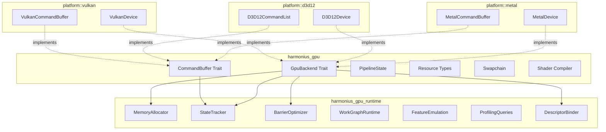
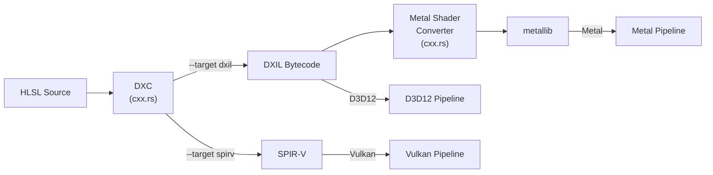
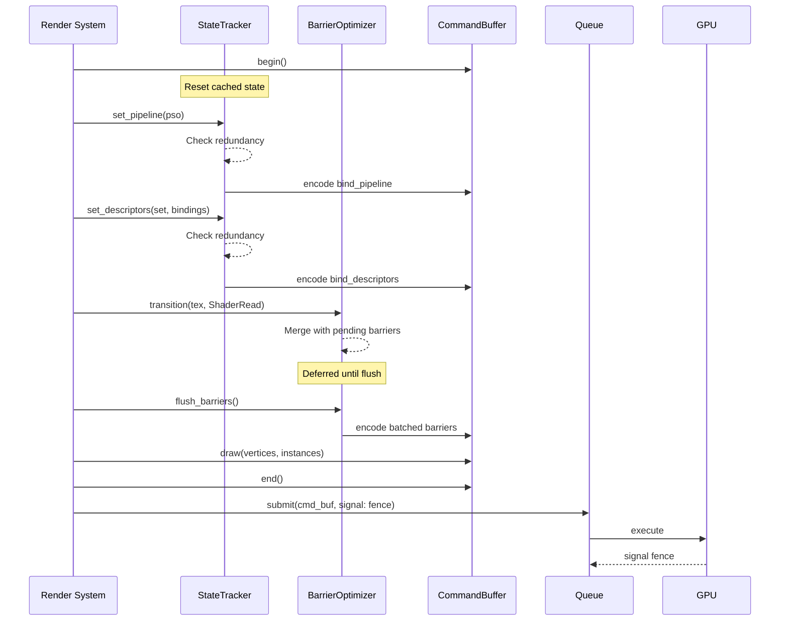
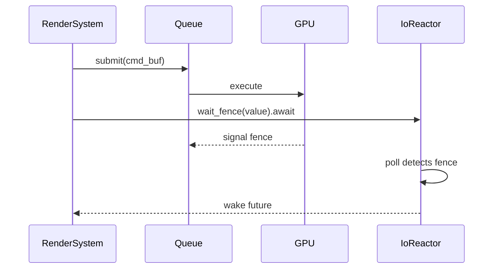
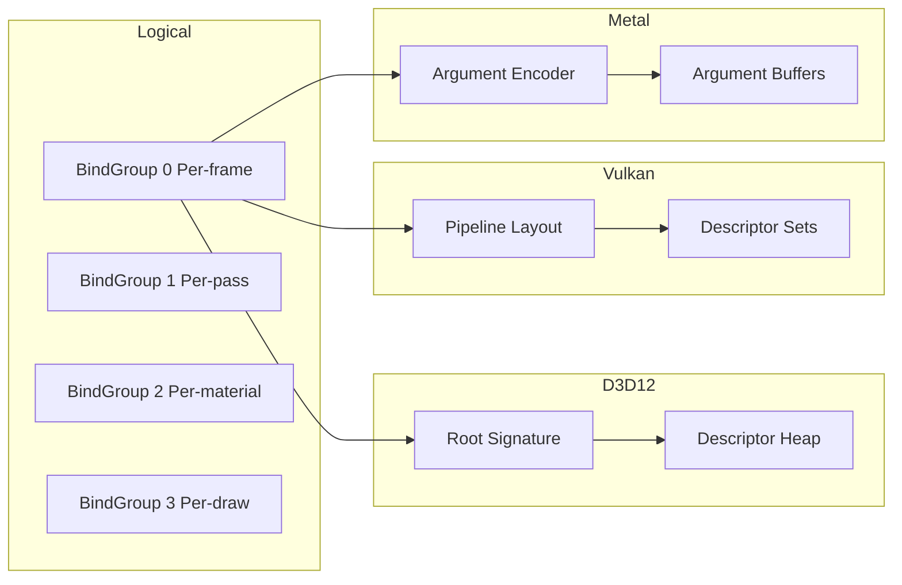
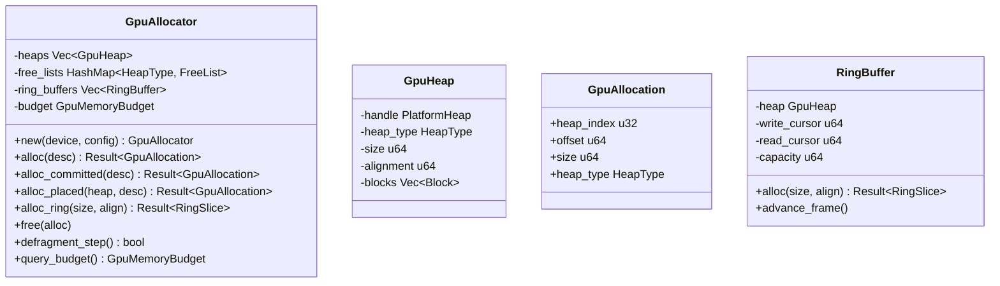
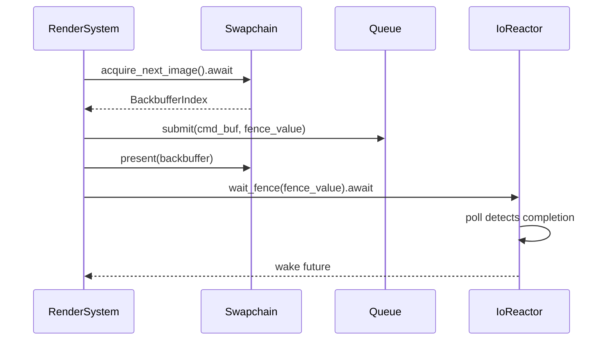
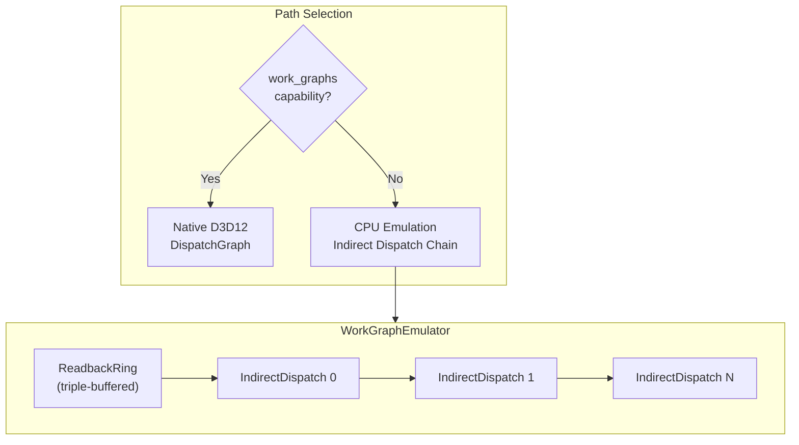
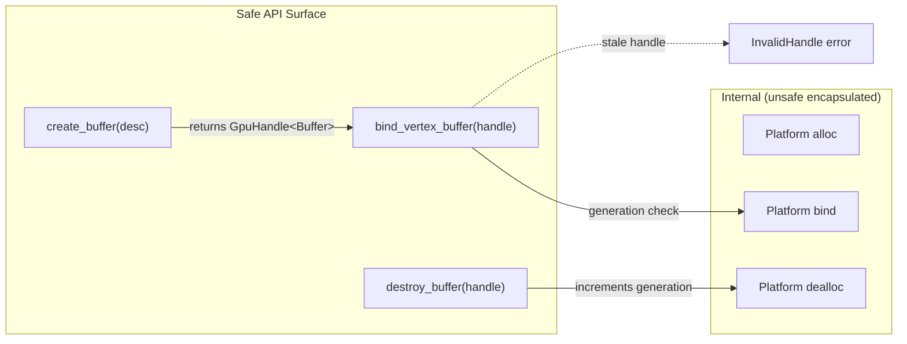

# GPU Abstraction Layer Design

## Requirements Trace

> **Canonical sources:** Features, requirements, and user stories are defined in
> [features/rendering/](../../features/rendering/),
> [requirements/rendering/](../../requirements/rendering/), and
> [user-stories/rendering/](../../user-stories/rendering/). The table below traces design elements
> to those definitions.

### Backend Trait and Interface

| Feature | Requirement |
|---------|-------------|
| F-2.1.1 | R-2.1.1     |
| F-2.1.2 | R-2.1.2     |
| F-2.1.3 | R-2.1.3     |
| F-2.1.4 | R-2.1.4     |
| F-2.1.5 | R-2.1.5     |
| F-2.1.6 | R-2.1.6     |

1. **F-2.1.1** — GPU backend trait with associated types, static dispatch via generics
2. **F-2.1.2** — Command buffer abstraction for graphics, compute, copy
3. **F-2.1.3** — Unified pipeline state objects pre-validated at creation
4. **F-2.1.4** — Metal backend via Swift-to-C-to-bindgen
5. **F-2.1.5** — D3D12 backend via COM-to-bindgen
6. **F-2.1.6** — Vulkan backend via C-to-bindgen

### GPU Runtime

| Feature  | Requirement |
|----------|-------------|
| F-2.1.7  | R-2.1.7     |
| F-2.1.8  | R-2.1.8     |
| F-2.1.9  | R-2.1.9     |
| F-2.1.10 | R-2.1.10    |
| F-2.1.11 | R-2.1.11    |
| F-2.1.12 | R-2.1.12    |

1. **F-2.1.7** — GPU heap sub-allocation from pre-allocated blocks
2. **F-2.1.8** — CPU-side state tracking to filter redundant transitions
3. **F-2.1.9** — Barrier batching, merging, and split barriers
4. **F-2.1.10** — GPU work graph support (native + emulated)
5. **F-2.1.11** — Cross-backend feature emulation
6. **F-2.1.12** — GPU performance queries and profiling

### GPU Runtime Requirements (GR)

| Requirement            |
|------------------------|
| GR-1.1 through GR-1.11 |
| GR-2.1 through GR-2.7  |
| GR-3.1 through GR-3.9  |
| GR-4.1 through GR-4.9  |

1. **GR-1.1 through GR-1.11** — Memory management: unified allocator, sub-allocation, ring buffers,
   defrag, budgets, sparse
2. **GR-2.1 through GR-2.7** — State tracking: tracked command buffer,
   pipeline/descriptor/dynamic/push caches, reset
3. **GR-3.1 through GR-3.9** — Work graph runtime: transparent execution, native/emulated paths,
   sync fidelity
4. **GR-4.1 through GR-4.9** — Feature emulation: barriers, ray tracing, mesh shaders,
   capability-aware recording

### Non-Functional Requirements

| Requirement | Target |
|-------------|--------|
| NFR-2.1.1 | Abstraction overhead < 5% vs raw API at 10k draws |
| NFR-2.1.2 | OS-level GPU allocations < 64 per frame, O(1) sub-alloc |
| NFR-2.1.3 | State tracker reduces API calls >= 20% at 1k draws, <= 64 KB per command buffer |

## Overview

The GPU abstraction layer provides a unified, type-safe interface across Metal (macOS/iOS), Direct3D
12 (Windows), and Vulkan (Linux/Android). It consists of two crates:

1. **`harmonius_gpu`** -- The backend trait interface. Defines `GpuBackend`, `CommandBuffer`,
   `PipelineState`, resource types, swapchain, and shader compilation. Each platform provides a
   concrete struct implementing these traits. Static dispatch via `cfg`-gated type aliases
   eliminates all vtable overhead.

2. **`harmonius_gpu_runtime`** -- Shared services built on top of the backend trait. Memory
   sub-allocation, state tracking, barrier optimization, descriptor binding, work graph execution,
   feature emulation, and profiling queries.

All GPU synchronization uses `async`/`await` integrated with the engine's `IoReactor`. Timeline
semaphores (Vulkan, D3D12) and `MTLEvent` (Metal) are polled at the reactor's frame poll point --
the GPU never fires callbacks asynchronously. GPU resources used by the ECS are represented as
components (e.g., `GpuMesh`, `GpuTexture`, `GpuMaterial`) managed by systems.

HLSL is the sole shader language. DXC (via cxx.rs) compiles HLSL to DXIL and SPIR-V. Metal Shader
Converter (via cxx.rs) translates DXIL to metallib. No runtime shader compilation occurs in shipping
builds.

## Architecture

### Module Boundaries



### Source Layout

```text
harmonius_gpu/
├── lib.rs             # GpuBackend trait, type aliases
├── types.rs           # Format, TextureUsage, enums
├── device.rs          # Device creation, capabilities
├── command.rs         # CommandBuffer trait
├── pipeline.rs        # Pipeline state creation
├── resources.rs       # Buffer, Texture, Sampler
├── swapchain.rs       # Swapchain trait
├── shader.rs          # ShaderCompiler (DXC + MSC)
├── sync.rs            # Fence, async GPU sync
├── platform/
│   ├── metal/
│   │   ├── device.rs  # MetalDevice (@_cdecl FFI)
│   │   ├── command.rs # MetalCommandBuffer
│   │   ├── heap.rs    # MetalHeap
│   │   └── swap.rs    # MetalSwapchain (CAMetalLayer)
│   ├── d3d12/
│   │   ├── device.rs  # D3D12Device (COM bindgen)
│   │   ├── command.rs # D3D12CommandList
│   │   ├── heap.rs    # D3D12Heap
│   │   └── swap.rs    # D3D12Swapchain (IDXGISwapChain4)
│   └── vulkan/
│       ├── device.rs  # VulkanDevice (vulkan.h bindgen)
│       ├── command.rs # VulkanCommandBuffer
│       ├── memory.rs  # VulkanMemory
│       └── swap.rs    # VulkanSwapchain
└── ffi/
    ├── dxc.rs         # DXC C++ bridge (cxx.rs)
    └── msc.rs         # Metal Shader Converter (cxx.rs)

harmonius_gpu_runtime/
├── lib.rs
├── allocator.rs       # GpuAllocator, FreeList, RingBuffer
├── state_tracker.rs   # TrackedCommandBuffer, caches
├── barriers.rs        # BarrierOptimizer, split barriers
├── descriptors.rs     # DescriptorBinder, BindGroup
├── work_graph.rs      # WorkGraphRuntime
├── emulation.rs       # FeatureEmulation layer
├── profiling.rs       # TimestampQueries, PipelineStats
└── budget.rs          # GpuMemoryBudget tracking
```

### Shader Compilation Pipeline



### Static Dispatch via cfg-Gated Type Aliases

The engine never uses `dyn GpuBackend`. Instead, a platform-gated type alias selects the concrete
backend at compile time:

```rust
#[cfg(target_os = "macos")]
pub type ActiveBackend = MetalBackend;

#[cfg(target_os = "windows")]
pub type ActiveBackend = D3D12Backend;

#[cfg(target_os = "linux")]
pub type ActiveBackend = VulkanBackend;

// All rendering code is generic over B: GpuBackend,
// but monomorphized to ActiveBackend at call sites.
pub type Device = <ActiveBackend as GpuBackend>::Device;
pub type CmdBuf =
    <ActiveBackend as GpuBackend>::CommandBuffer;
```

### Command Buffer Recording and Submission



### GPU Fence Async Integration with IoReactor



GPU fence waits are integrated with the engine's `IoReactor`. Each backend registers its
fence/semaphore polling in the reactor's platform completion queue:

- **D3D12:** `ID3D12Fence::SetEventOnCompletion` signals an event that IOCP can monitor, or the
  reactor polls `GetCompletedValue` at each poll point.
- **Vulkan:** `vkGetSemaphoreCounterValue` polled at the reactor poll point. Timeline semaphores
  provide monotonically increasing values.
- **Metal:** `MTLEvent` completion is signaled via a GCD dispatch block routed to the controlled
  drain queue. The reactor drains it at poll time.

No CPU spin-waits. The worker thread yields at `.await` and the reactor wakes it when the GPU
signals.

### Descriptor Binding Model



The engine uses a four-tier bind group model sorted by update frequency:

| Bind Group | Frequency | Contents |
|------------|-----------|----------|
| 0 | Per-frame | Global constants, shadow maps, IBL |
| 1 | Per-pass | Render targets, pass constants, light lists |
| 2 | Per-material | Textures, material parameters, samplers |
| 3 | Per-draw | Transform, instance data, per-draw constants |

Higher-numbered bind groups change more frequently. Lower-numbered groups persist across draws,
minimizing re-binding cost. Each backend maps bind groups to its native binding model:

| Backend | BindGroup mapping |
|---------|-------------------|
| D3D12 | Root signature table entries into a single shader-visible descriptor heap |
| Vulkan | VkDescriptorSet per bind group, bound via vkCmdBindDescriptorSets |
| Metal | Argument buffer per bind group, bound via setVertexBuffer/setFragmentBuffer |

### GPU Memory Allocator



### RingBuffer GPU Fence Safety (High)

The GPU `RingBuffer` must track per-frame fence values. Before writing, verify the GPU has completed
past the region being overwritten by checking `fence_completed_value`. Block or grow the buffer if
the GPU is still using the target region. Without fence guards, the CPU can overwrite in-flight GPU
data when the GPU is 2-3 frames behind.

```mermaid
    class FreeList {
        -free_blocks Vec~FreeBlock~
        +alloc(size, align) Option~u64~
        +free(offset, size)
    }

    class GpuMemoryBudget {
        +local_budget u64
        +local_usage u64
        +shared_budget u64
        +shared_usage u64
    }

    GpuAllocator *-- GpuHeap
    GpuAllocator *-- RingBuffer
    GpuAllocator *-- FreeList
    GpuAllocator --> GpuMemoryBudget
    GpuHeap --> GpuAllocation
    RingBuffer --> GpuHeap
```

### Swapchain Present Flow



## API Design

### Core Enums and Types

**Note:** `Format` is the canonical GPU format enum for the engine. Other rendering files
(render-graph, core-rendering) should reference this enum rather than defining their own
`TextureFormat` subsets.

```rust
/// Pixel/vertex format.
#[derive(Clone, Copy, Debug, PartialEq, Eq, Hash)]
pub enum Format {
    R8Unorm,
    R8Snorm,
    R8Uint,
    R16Float,
    R16Uint,
    R32Float,
    R32Uint,
    Rg8Unorm,
    Rg16Float,
    Rg32Float,
    Rgba8Unorm,
    Rgba8Srgb,
    Rgba16Float,
    Rgba32Float,
    Bgra8Unorm,
    Bgra8Srgb,
    Depth16Unorm,
    Depth32Float,
    Depth24Stencil8,
    Depth32FloatStencil8,
    Bc1Unorm,
    Bc1Srgb,
    Bc3Unorm,
    Bc3Srgb,
    Bc5Unorm,
    Bc7Unorm,
    Bc7Srgb,
}

/// How a buffer will be used.
#[derive(Clone, Copy, Debug, PartialEq, Eq, Hash)]
pub struct BufferUsage(u32);

impl BufferUsage {
    pub const VERTEX: Self = Self(1 << 0);
    pub const INDEX: Self = Self(1 << 1);
    pub const UNIFORM: Self = Self(1 << 2);
    pub const STORAGE: Self = Self(1 << 3);
    pub const INDIRECT: Self = Self(1 << 4);
    pub const COPY_SRC: Self = Self(1 << 5);
    pub const COPY_DST: Self = Self(1 << 6);
}

/// How a texture will be used.
#[derive(Clone, Copy, Debug, PartialEq, Eq, Hash)]
pub struct TextureUsage(u32);

impl TextureUsage {
    pub const SAMPLED: Self = Self(1 << 0);
    pub const STORAGE: Self = Self(1 << 1);
    pub const RENDER_TARGET: Self = Self(1 << 2);
    pub const DEPTH_STENCIL: Self = Self(1 << 3);
    pub const COPY_SRC: Self = Self(1 << 4);
    pub const COPY_DST: Self = Self(1 << 5);
}

/// Resource state for barrier transitions.
#[derive(Clone, Copy, Debug, PartialEq, Eq, Hash)]
pub enum ResourceState {
    Undefined,
    Common,
    VertexBuffer,
    IndexBuffer,
    UniformBuffer,
    ShaderRead,
    ShaderWrite,
    RenderTarget,
    DepthStencilWrite,
    DepthStencilRead,
    CopySrc,
    CopyDst,
    Present,
    IndirectArgument,
    AccelerationStructure,
}

/// GPU queue type.
#[derive(Clone, Copy, Debug, PartialEq, Eq, Hash)]
pub enum QueueType {
    Graphics,
    Compute,
    Copy,
}

/// Texture dimension.
#[derive(Clone, Copy, Debug, PartialEq, Eq, Hash)]
pub enum TextureDimension {
    D1,
    D2,
    D3,
    Cube,
    Array2D { layers: u32 },
    ArrayCube { layers: u32 },
}

/// Comparison function for depth and stencil.
#[derive(Clone, Copy, Debug, PartialEq, Eq, Hash)]
pub enum CompareFunc {
    Never,
    Less,
    Equal,
    LessEqual,
    Greater,
    NotEqual,
    GreaterEqual,
    Always,
}

/// Blend factor.
#[derive(Clone, Copy, Debug, PartialEq, Eq, Hash)]
pub enum BlendFactor {
    Zero,
    One,
    SrcColor,
    OneMinusSrcColor,
    SrcAlpha,
    OneMinusSrcAlpha,
    DstColor,
    OneMinusDstColor,
    DstAlpha,
    OneMinusDstAlpha,
}

/// Blend operation.
#[derive(Clone, Copy, Debug, PartialEq, Eq, Hash)]
pub enum BlendOp {
    Add,
    Subtract,
    ReverseSubtract,
    Min,
    Max,
}

/// Primitive topology.
#[derive(Clone, Copy, Debug, PartialEq, Eq, Hash)]
pub enum PrimitiveTopology {
    PointList,
    LineList,
    LineStrip,
    TriangleList,
    TriangleStrip,
}

/// Fill mode.
#[derive(Clone, Copy, Debug, PartialEq, Eq, Hash)]
pub enum FillMode {
    Solid,
    Wireframe,
}

/// Cull mode.
#[derive(Clone, Copy, Debug, PartialEq, Eq, Hash)]
pub enum CullMode {
    None,
    Front,
    Back,
}

/// Front face winding order.
#[derive(Clone, Copy, Debug, PartialEq, Eq, Hash)]
pub enum FrontFace {
    CounterClockwise,
    Clockwise,
}

/// Index buffer format.
#[derive(Clone, Copy, Debug, PartialEq, Eq, Hash)]
pub enum IndexFormat {
    Uint16,
    Uint32,
}

/// Filter mode for samplers.
#[derive(Clone, Copy, Debug, PartialEq, Eq, Hash)]
pub enum FilterMode {
    Nearest,
    Linear,
}

/// Address mode for samplers.
#[derive(Clone, Copy, Debug, PartialEq, Eq, Hash)]
pub enum AddressMode {
    Repeat,
    MirrorRepeat,
    ClampToEdge,
    ClampToBorder,
}
```

### Handle Types

```rust
/// Typed, generation-counted GPU resource handle.
/// Prevents use-after-free via generation checks.
#[derive(Clone, Copy, Debug, PartialEq, Eq, Hash)]
pub struct GpuHandle<T> {
    pub(crate) index: u32,
    pub(crate) generation: u32,
    pub(crate) _marker: PhantomData<T>,
}

// Concrete handle aliases
pub type BufferHandle = GpuHandle<Buffer>;
pub type TextureHandle = GpuHandle<Texture>;
pub type SamplerHandle = GpuHandle<Sampler>;
pub type PipelineHandle = GpuHandle<GraphicsPipeline>;
pub type ComputePipelineHandle =
    GpuHandle<ComputePipeline>;
pub type RenderPassHandle = GpuHandle<RenderPass>;
pub type FenceHandle = GpuHandle<Fence>;
```

### GpuBackend Trait

```rust
/// Top-level backend trait. Each platform provides
/// a single concrete type. Static dispatch via
/// generics -- no vtables.
pub trait GpuBackend: Sized + Send + Sync + 'static {
    type Device: GpuDevice<Backend = Self>;
    type CommandBuffer: CommandBuffer<Backend = Self>;
    type Swapchain: Swapchain<Backend = Self>;
    type Fence: GpuFence;

    /// Human-readable backend name for diagnostics.
    fn name() -> &'static str;

    /// Create a device with the given configuration.
    fn create_device(
        config: &DeviceConfig,
    ) -> Result<Self::Device, GpuError>;
}

pub struct DeviceConfig {
    /// Prefer discrete GPU over integrated.
    pub prefer_discrete: bool,
    /// Enable debug/validation layers.
    pub debug_validation: bool,
    /// Maximum frames in flight for pipelining.
    pub max_frames_in_flight: u32,
}
```

### GpuDevice Trait

```rust
pub trait GpuDevice: Sized + Send + Sync {
    type Backend: GpuBackend;

    // --- Resource creation ---

    fn create_buffer(
        &self,
        desc: &BufferDesc,
    ) -> Result<BufferHandle, GpuError>;

    fn create_texture(
        &self,
        desc: &TextureDesc,
    ) -> Result<TextureHandle, GpuError>;

    fn create_sampler(
        &self,
        desc: &SamplerDesc,
    ) -> Result<SamplerHandle, GpuError>;

    fn create_graphics_pipeline(
        &self,
        desc: &GraphicsPipelineDesc,
    ) -> Result<PipelineHandle, GpuError>;

    fn create_compute_pipeline(
        &self,
        desc: &ComputePipelineDesc,
    ) -> Result<ComputePipelineHandle, GpuError>;

    fn create_render_pass(
        &self,
        desc: &RenderPassDesc,
    ) -> Result<RenderPassHandle, GpuError>;

    // --- Resource destruction ---

    fn destroy_buffer(&self, handle: BufferHandle);
    fn destroy_texture(&self, handle: TextureHandle);
    fn destroy_sampler(&self, handle: SamplerHandle);
    fn destroy_pipeline(&self, handle: PipelineHandle);
    fn destroy_compute_pipeline(
        &self,
        handle: ComputePipelineHandle,
    );

    // --- Swapchain ---

    fn create_swapchain(
        &self,
        desc: &SwapchainDesc,
    ) -> Result<
        <Self::Backend as GpuBackend>::Swapchain,
        GpuError,
    >;

    // --- Command buffers ---

    fn create_command_buffer(
        &self,
        queue: QueueType,
    ) -> Result<
        <Self::Backend as GpuBackend>::CommandBuffer,
        GpuError,
    >;

    fn submit(
        &self,
        queue: QueueType,
        cmd_bufs: &[
            &<Self::Backend as GpuBackend>::CommandBuffer
        ],
        signal_fence: Option<(FenceHandle, u64)>,
        wait_fences: &[(FenceHandle, u64)],
    ) -> Result<(), GpuError>;

    // --- Fences ---

    fn create_fence(
        &self,
        initial_value: u64,
    ) -> Result<FenceHandle, GpuError>;

    fn destroy_fence(&self, handle: FenceHandle);

    /// Non-blocking query of fence value.
    fn fence_completed_value(
        &self,
        handle: FenceHandle,
    ) -> u64;

    /// Async wait for fence to reach value.
    /// Integrates with IoReactor.
    fn wait_fence(
        &self,
        handle: FenceHandle,
        value: u64,
    ) -> impl Future<Output = Result<(), GpuError>>
           + Send;

    // --- Buffer operations ---

    /// Map a buffer for CPU write. Returns a
    /// mutable slice. Only valid for upload heaps.
    fn map_buffer(
        &self,
        handle: BufferHandle,
    ) -> Result<&mut [u8], GpuError>;

    fn unmap_buffer(&self, handle: BufferHandle);

    // --- Queries ---

    fn capabilities(&self) -> &DeviceCapabilities;
    fn memory_budget(&self) -> GpuMemoryBudget;
}
```

### Resource Descriptors

```rust
pub struct BufferDesc {
    pub size: u64,
    pub usage: BufferUsage,
    pub memory: MemoryLocation,
    /// Debug label for graphics debuggers.
    pub label: Option<&'static str>,
}

pub struct TextureDesc {
    pub width: u32,
    pub height: u32,
    pub depth_or_layers: u32,
    pub mip_levels: u32,
    pub format: Format,
    pub dimension: TextureDimension,
    pub usage: TextureUsage,
    pub sample_count: u32,
    pub memory: MemoryLocation,
    pub label: Option<&'static str>,
}

pub struct SamplerDesc {
    pub min_filter: FilterMode,
    pub mag_filter: FilterMode,
    pub mip_filter: FilterMode,
    pub address_u: AddressMode,
    pub address_v: AddressMode,
    pub address_w: AddressMode,
    pub max_anisotropy: u8,
    pub compare: Option<CompareFunc>,
    pub lod_min_clamp: f32,
    pub lod_max_clamp: f32,
    pub label: Option<&'static str>,
}

/// Where GPU memory is allocated.
#[derive(Clone, Copy, Debug, PartialEq, Eq, Hash)]
pub enum MemoryLocation {
    /// Device-local (VRAM). Fastest GPU access.
    GpuOnly,
    /// CPU-visible, write-combined. For uploads.
    CpuToGpu,
    /// CPU-readable. For readbacks.
    GpuToCpu,
}
```

### Pipeline State Descriptors

```rust
pub struct GraphicsPipelineDesc {
    pub vertex_shader: ShaderModule,
    pub fragment_shader: Option<ShaderModule>,
    pub mesh_shader: Option<ShaderModule>,
    pub amplification_shader: Option<ShaderModule>,
    pub vertex_layout: VertexLayout,
    pub primitive_topology: PrimitiveTopology,
    pub rasterizer: RasterizerState,
    pub depth_stencil: DepthStencilState,
    pub blend: BlendState,
    pub render_targets: RenderTargetLayout,
    pub sample_count: u32,
    pub label: Option<&'static str>,
}

pub struct ComputePipelineDesc {
    pub compute_shader: ShaderModule,
    pub label: Option<&'static str>,
}

pub struct ShaderModule {
    /// Pre-compiled bytecode (DXIL, SPIR-V,
    /// or metallib depending on platform).
    pub bytecode: Vec<u8>,
    pub entry_point: &'static str,
}

pub struct VertexLayout {
    pub attributes: Vec<VertexAttribute>,
    pub stride: u32,
}

pub struct VertexAttribute {
    pub location: u32,
    pub format: Format,
    pub offset: u32,
}

pub struct RasterizerState {
    pub fill_mode: FillMode,
    pub cull_mode: CullMode,
    pub front_face: FrontFace,
    pub depth_bias: i32,
    pub depth_bias_slope: f32,
    pub depth_bias_clamp: f32,
    pub conservative: bool,
}

pub struct DepthStencilState {
    pub depth_test: bool,
    pub depth_write: bool,
    pub depth_compare: CompareFunc,
    pub stencil_enable: bool,
    pub stencil_read_mask: u8,
    pub stencil_write_mask: u8,
    pub stencil_front: StencilOps,
    pub stencil_back: StencilOps,
}

pub struct StencilOps {
    pub fail: StencilOp,
    pub depth_fail: StencilOp,
    pub pass: StencilOp,
    pub compare: CompareFunc,
}

#[derive(Clone, Copy, Debug, PartialEq, Eq, Hash)]
pub enum StencilOp {
    Keep,
    Zero,
    Replace,
    IncrementClamp,
    DecrementClamp,
    Invert,
    IncrementWrap,
    DecrementWrap,
}

pub struct BlendState {
    pub attachments: Vec<BlendAttachment>,
    pub blend_constants: [f32; 4],
}

pub struct BlendAttachment {
    pub blend_enable: bool,
    pub src_color: BlendFactor,
    pub dst_color: BlendFactor,
    pub color_op: BlendOp,
    pub src_alpha: BlendFactor,
    pub dst_alpha: BlendFactor,
    pub alpha_op: BlendOp,
    pub write_mask: ColorWriteMask,
}

#[derive(Clone, Copy, Debug, PartialEq, Eq, Hash)]
pub struct ColorWriteMask(u8);

impl ColorWriteMask {
    pub const R: Self = Self(1 << 0);
    pub const G: Self = Self(1 << 1);
    pub const B: Self = Self(1 << 2);
    pub const A: Self = Self(1 << 3);
    pub const ALL: Self = Self(0xF);
}

pub struct RenderTargetLayout {
    pub color_formats: Vec<Format>,
    pub depth_stencil_format: Option<Format>,
}
```

### Render Pass

```rust
pub struct RenderPassDesc {
    pub color_attachments: Vec<ColorAttachment>,
    pub depth_stencil_attachment: Option<
        DepthStencilAttachment
    >,
    pub label: Option<&'static str>,
}

pub struct ColorAttachment {
    pub texture: TextureHandle,
    pub mip_level: u32,
    pub array_layer: u32,
    pub load_op: LoadOp,
    pub store_op: StoreOp,
    pub resolve_target: Option<TextureHandle>,
}

pub struct DepthStencilAttachment {
    pub texture: TextureHandle,
    pub depth_load_op: LoadOp,
    pub depth_store_op: StoreOp,
    pub stencil_load_op: LoadOp,
    pub stencil_store_op: StoreOp,
}

#[derive(Clone, Copy, Debug, PartialEq, Eq)]
pub enum LoadOp {
    Load,
    Clear(ClearValue),
    DontCare,
}

#[derive(Clone, Copy, Debug, PartialEq, Eq)]
pub enum StoreOp {
    Store,
    DontCare,
}

#[derive(Clone, Copy, Debug)]
pub enum ClearValue {
    Color([f32; 4]),
    DepthStencil { depth: f32, stencil: u8 },
}
```

### CommandBuffer Trait

```rust
/// Trait for recording GPU commands. Each backend
/// provides a concrete implementation.
pub trait CommandBuffer: Sized + Send {
    type Backend: GpuBackend;

    fn begin(&mut self) -> Result<(), GpuError>;
    fn end(&mut self) -> Result<(), GpuError>;

    // --- Render pass ---

    fn begin_render_pass(
        &mut self,
        desc: &RenderPassDesc,
    );
    fn end_render_pass(&mut self);

    // --- Pipeline binding ---

    fn bind_graphics_pipeline(
        &mut self,
        handle: PipelineHandle,
    );
    fn bind_compute_pipeline(
        &mut self,
        handle: ComputePipelineHandle,
    );

    // --- Resource binding ---

    fn bind_vertex_buffer(
        &mut self,
        slot: u32,
        buffer: BufferHandle,
        offset: u64,
    );
    fn bind_index_buffer(
        &mut self,
        buffer: BufferHandle,
        offset: u64,
        format: IndexFormat,
    );
    fn bind_group(
        &mut self,
        index: u32,
        group: &BindGroup,
    );
    fn set_push_constants(
        &mut self,
        stage: ShaderStage,
        offset: u32,
        data: &[u8],
    );

    // --- Draw commands ---

    fn draw(
        &mut self,
        vertex_count: u32,
        instance_count: u32,
        first_vertex: u32,
        first_instance: u32,
    );
    fn draw_indexed(
        &mut self,
        index_count: u32,
        instance_count: u32,
        first_index: u32,
        vertex_offset: i32,
        first_instance: u32,
    );
    fn draw_indirect(
        &mut self,
        buffer: BufferHandle,
        offset: u64,
        draw_count: u32,
        stride: u32,
    );
    fn draw_indexed_indirect(
        &mut self,
        buffer: BufferHandle,
        offset: u64,
        draw_count: u32,
        stride: u32,
    );
    fn draw_mesh_tasks(
        &mut self,
        group_count_x: u32,
        group_count_y: u32,
        group_count_z: u32,
    );
    fn draw_mesh_tasks_indirect(
        &mut self,
        buffer: BufferHandle,
        offset: u64,
        draw_count: u32,
        stride: u32,
    );

    // --- Compute ---

    fn dispatch(
        &mut self,
        x: u32,
        y: u32,
        z: u32,
    );
    fn dispatch_indirect(
        &mut self,
        buffer: BufferHandle,
        offset: u64,
    );

    // --- Copy commands ---

    fn copy_buffer_to_buffer(
        &mut self,
        src: BufferHandle,
        src_offset: u64,
        dst: BufferHandle,
        dst_offset: u64,
        size: u64,
    );
    fn copy_buffer_to_texture(
        &mut self,
        src: BufferHandle,
        src_offset: u64,
        dst: TextureHandle,
        dst_region: TextureRegion,
    );
    fn copy_texture_to_buffer(
        &mut self,
        src: TextureHandle,
        src_region: TextureRegion,
        dst: BufferHandle,
        dst_offset: u64,
    );
    fn copy_texture_to_texture(
        &mut self,
        src: TextureHandle,
        src_region: TextureRegion,
        dst: TextureHandle,
        dst_region: TextureRegion,
    );

    // --- Barriers ---

    fn resource_barrier(
        &mut self,
        barriers: &[ResourceBarrier],
    );

    // --- Dynamic state ---

    fn set_viewport(&mut self, viewport: &Viewport);
    fn set_scissor(&mut self, scissor: &ScissorRect);

    // --- Debug ---

    fn begin_debug_label(
        &mut self,
        label: &str,
        color: [f32; 4],
    );
    fn end_debug_label(&mut self);
    fn insert_debug_label(
        &mut self,
        label: &str,
        color: [f32; 4],
    );
}

pub struct TextureRegion {
    pub mip_level: u32,
    pub array_layer: u32,
    pub origin: [u32; 3],
    pub size: [u32; 3],
}

/// **Note:** `Viewport` is canonically defined here.
/// Other rendering files should reference this
/// definition.
pub struct Viewport {
    pub x: f32,
    pub y: f32,
    pub width: f32,
    pub height: f32,
    pub min_depth: f32,
    pub max_depth: f32,
}

pub struct ScissorRect {
    pub x: i32,
    pub y: i32,
    pub width: u32,
    pub height: u32,
}

pub struct ResourceBarrier {
    pub resource: ResourceRef,
    pub before: ResourceState,
    pub after: ResourceState,
}

#[derive(Clone, Copy)]
pub enum ResourceRef {
    Buffer(BufferHandle),
    Texture(TextureHandle),
}

#[derive(Clone, Copy, Debug, PartialEq, Eq, Hash)]
pub struct ShaderStage(u32);

impl ShaderStage {
    pub const VERTEX: Self = Self(1 << 0);
    pub const FRAGMENT: Self = Self(1 << 1);
    pub const COMPUTE: Self = Self(1 << 2);
    pub const MESH: Self = Self(1 << 3);
    pub const AMPLIFICATION: Self = Self(1 << 4);
    pub const ALL_GRAPHICS: Self = Self(0x1B);
}
```

### Swapchain

```rust
/// Swapchain for presenting to a window surface.
pub trait Swapchain: Sized + Send {
    type Backend: GpuBackend;

    /// Acquire the next backbuffer. Async: yields
    /// until a backbuffer is available (respects
    /// max_frames_in_flight pipelining).
    fn acquire_next_image(
        &mut self,
    ) -> impl Future<
        Output = Result<BackbufferImage, GpuError>,
    > + Send;

    /// Present the current backbuffer.
    fn present(&mut self) -> Result<(), GpuError>;

    /// Resize the swapchain (e.g. window resize).
    fn resize(
        &mut self,
        width: u32,
        height: u32,
    ) -> Result<(), GpuError>;

    fn current_format(&self) -> Format;
    fn extent(&self) -> (u32, u32);
}

pub struct SwapchainDesc {
    /// Platform window handle.
    pub window_handle: RawWindowHandle,
    pub width: u32,
    pub height: u32,
    pub format: Format,
    pub present_mode: PresentMode,
    pub buffer_count: u32,
}

pub struct BackbufferImage {
    pub texture: TextureHandle,
    pub index: u32,
}

#[derive(Clone, Copy, Debug, PartialEq, Eq)]
pub enum PresentMode {
    /// No vsync. Immediate present.
    Immediate,
    /// VSync. Wait for vertical blank.
    Fifo,
    /// Triple-buffered. Low latency + no tearing.
    Mailbox,
}
```

### Descriptor Binding

```rust
/// A group of resource bindings at a single
/// bind point (0-3). Matches the four-tier model.
pub struct BindGroup {
    pub bindings: Vec<BindGroupEntry>,
}

pub struct BindGroupEntry {
    pub binding: u32,
    pub resource: BindingResource,
}

pub enum BindingResource {
    Buffer {
        handle: BufferHandle,
        offset: u64,
        size: u64,
    },
    Texture(TextureHandle),
    Sampler(SamplerHandle),
    StorageTexture(TextureHandle),
}

/// Layout declaration for a bind group.
pub struct BindGroupLayout {
    pub entries: Vec<BindGroupLayoutEntry>,
}

pub struct BindGroupLayoutEntry {
    pub binding: u32,
    pub visibility: ShaderStage,
    pub ty: BindingType,
    pub count: u32,
}

#[derive(Clone, Copy, Debug, PartialEq, Eq)]
pub enum BindingType {
    UniformBuffer,
    StorageBuffer,
    ReadOnlyStorageBuffer,
    SampledTexture,
    StorageTexture,
    Sampler,
    ComparisonSampler,
}
```

### Shader Compiler

```rust
/// Shader compilation from HLSL via DXC and
/// Metal Shader Converter. All C++ interop via
/// cxx.rs.
pub struct ShaderCompiler { /* ... */ }

#[derive(Clone, Copy, Debug, PartialEq, Eq)]
pub enum ShaderTarget {
    Dxil,
    SpirV,
    MetalLib,
}

#[derive(Clone, Copy, Debug, PartialEq, Eq)]
pub enum ShaderProfile {
    Vs6_0,
    Ps6_0,
    Cs6_0,
    Ms6_5,
    As6_5,
    Vs6_6,
    Ps6_6,
    Cs6_6,
}

pub struct ShaderCompileDesc {
    pub source: Vec<u8>,
    pub entry_point: String,
    pub profile: ShaderProfile,
    pub target: ShaderTarget,
    pub defines: Vec<(String, String)>,
    pub debug_info: bool,
}

pub struct ShaderCompileResult {
    pub bytecode: Vec<u8>,
    pub reflection: ShaderReflection,
}

pub struct ShaderReflection {
    pub inputs: Vec<ShaderInput>,
    pub outputs: Vec<ShaderOutput>,
    pub bind_groups: Vec<ReflectedBindGroup>,
    pub push_constant_size: u32,
    pub workgroup_size: Option<[u32; 3]>,
}

pub struct ShaderInput {
    pub location: u32,
    pub format: Format,
    pub semantic: String,
}

pub struct ShaderOutput {
    pub location: u32,
    pub format: Format,
    pub semantic: String,
}

pub struct ReflectedBindGroup {
    pub group: u32,
    pub bindings: Vec<ReflectedBinding>,
}

pub struct ReflectedBinding {
    pub binding: u32,
    pub ty: BindingType,
    pub name: String,
}

impl ShaderCompiler {
    /// Create the compiler. Initializes DXC and
    /// (on macOS) Metal Shader Converter via cxx.rs.
    pub fn new() -> Result<Self, GpuError>;

    /// Compile HLSL to the target bytecode format.
    /// HLSL -> DXC -> DXIL or SPIR-V.
    /// For MetalLib: HLSL -> DXC -> DXIL -> MSC.
    pub fn compile(
        &self,
        desc: &ShaderCompileDesc,
    ) -> Result<ShaderCompileResult, ShaderError>;
}

pub enum ShaderError {
    CompileFailed { errors: Vec<String> },
    UnsupportedTarget { target: ShaderTarget },
    ReflectionFailed { message: String },
}
```

### GPU Memory Allocator

```rust
/// Allocation strategy.
#[derive(Clone, Copy, Debug, PartialEq, Eq)]
pub enum AllocStrategy {
    /// Free-list sub-allocation from a large heap.
    /// O(1) amortized. For persistent resources.
    SubAlloc,
    /// Dedicated heap allocation. For large
    /// resources needing dedicated memory.
    Committed,
    /// Placed in a specific heap for aliasing.
    /// For render graph transients.
    Placed,
    /// Ring buffer. For per-frame staging and
    /// constant uploads. Zero heap allocs on hot path.
    Ring,
}

pub struct GpuAllocatorConfig {
    /// Default heap size for sub-allocation blocks.
    /// Default: 64 MiB.
    pub default_heap_size: u64,
    /// Ring buffer capacity per frame.
    /// Default: 16 MiB.
    pub ring_buffer_capacity: u64,
    /// Maximum number of heaps before error.
    pub max_heaps: u32,
}

pub struct GpuAllocator { /* ... */ }

pub struct GpuAllocation {
    pub heap_index: u32,
    pub offset: u64,
    pub size: u64,
    pub heap_type: HeapType,
    pub(crate) generation: u32,
}

pub struct RingSlice {
    pub buffer: BufferHandle,
    pub offset: u64,
    pub size: u64,
}

#[derive(Clone, Copy, Debug, PartialEq, Eq, Hash)]
pub enum HeapType {
    /// Device-local. Fastest GPU access.
    Local,
    /// Upload. CPU-writable, GPU-readable.
    Upload,
    /// Readback. GPU-writable, CPU-readable.
    Readback,
}

pub struct GpuMemoryBudget {
    pub local_budget: u64,
    pub local_usage: u64,
    pub shared_budget: u64,
    pub shared_usage: u64,
}

impl GpuAllocator {
    pub fn new<B: GpuBackend>(
        device: &B::Device,
        config: GpuAllocatorConfig,
    ) -> Self;

    /// Sub-allocate from a heap. O(1) amortized.
    /// Respects per-backend alignment:
    ///   D3D12:  256 B
    ///   Vulkan: variable (queried per resource)
    ///   Metal:  page-aligned (4096 B)
    pub fn alloc(
        &mut self,
        desc: &AllocationDesc,
    ) -> Result<GpuAllocation, GpuError>;

    /// Dedicated allocation for large resources.
    pub fn alloc_committed(
        &mut self,
        desc: &AllocationDesc,
    ) -> Result<GpuAllocation, GpuError>;

    /// Placed allocation for render graph aliasing.
    pub fn alloc_placed(
        &mut self,
        heap_index: u32,
        desc: &AllocationDesc,
    ) -> Result<GpuAllocation, GpuError>;

    /// Ring buffer allocation for per-frame data.
    /// Zero heap allocations on the hot path.
    pub fn alloc_ring(
        &mut self,
        size: u64,
        alignment: u64,
    ) -> Result<RingSlice, GpuError>;

    /// Free a sub-allocated or committed allocation.
    pub fn free(&mut self, alloc: GpuAllocation);

    /// Run one incremental defragmentation step.
    /// Returns true if work was done.
    pub fn defragment_step(&mut self) -> bool;

    /// Advance ring buffer frame boundary.
    /// Called once per frame after GPU signals
    /// completion of the previous frame's work.
    pub fn advance_frame(&mut self);

    pub fn query_budget(&self) -> GpuMemoryBudget;
}

pub struct AllocationDesc {
    pub size: u64,
    pub alignment: u64,
    pub heap_type: HeapType,
    pub label: Option<&'static str>,
}
```

### State Tracker

```rust
/// CPU-side shadow state that suppresses redundant
/// backend API calls. Wraps a command buffer and
/// intercepts all state-setting calls.
pub struct TrackedCommandBuffer<B: GpuBackend> {
    inner: B::CommandBuffer,
    pipeline_cache: PipelineStateCache,
    descriptor_cache: DescriptorCache,
    dynamic_cache: DynamicStateCache,
    push_cache: PushConstantCache,
    resource_states: ResourceStateCache,
}

struct PipelineStateCache {
    current_graphics: Option<PipelineHandle>,
    current_compute: Option<ComputePipelineHandle>,
}

struct DescriptorCache {
    bound_groups: [Option<u64>; 4],
}

struct DynamicStateCache {
    viewport: Option<Viewport>,
    scissor: Option<ScissorRect>,
    blend_constants: Option<[f32; 4]>,
}

struct PushConstantCache {
    data: [u8; 128],
    valid_bytes: u32,
}

struct ResourceStateCache {
    buffer_states:
        HashMap<BufferHandle, ResourceState>,
    texture_states:
        HashMap<TextureHandle, ResourceState>,
}

impl<B: GpuBackend> TrackedCommandBuffer<B>
where
    B::CommandBuffer: CommandBuffer<Backend = B>,
{
    pub fn new(inner: B::CommandBuffer) -> Self;

    /// Begin recording. Resets all cached state
    /// to unknown. (GR-2.7)
    pub fn begin(&mut self) -> Result<(), GpuError>;
    pub fn end(&mut self) -> Result<(), GpuError>;

    /// Bind pipeline only if different from cached.
    /// (GR-2.2)
    pub fn bind_graphics_pipeline(
        &mut self,
        handle: PipelineHandle,
    );

    pub fn bind_compute_pipeline(
        &mut self,
        handle: ComputePipelineHandle,
    );

    /// Bind group only if fingerprint differs.
    /// (GR-2.3)
    pub fn bind_group(
        &mut self,
        index: u32,
        group: &BindGroup,
    );

    /// Set viewport only if changed. (GR-2.4)
    pub fn set_viewport(&mut self, vp: &Viewport);

    /// Set scissor only if changed. (GR-2.4)
    pub fn set_scissor(&mut self, sc: &ScissorRect);

    /// Set push constants only if data differs.
    /// (GR-2.5)
    pub fn set_push_constants(
        &mut self,
        stage: ShaderStage,
        offset: u32,
        data: &[u8],
    );

    /// Query current resource state for barrier
    /// computation. (GR-2.6)
    pub fn resource_state(
        &self,
        resource: ResourceRef,
    ) -> ResourceState;

    /// All draw/dispatch/copy commands delegate
    /// directly to the inner command buffer.
    pub fn draw(
        &mut self,
        vertex_count: u32,
        instance_count: u32,
        first_vertex: u32,
        first_instance: u32,
    );

    // ... (all other draw/dispatch/copy methods
    //  delegate to self.inner)
}
```

### Barrier Optimizer

```rust
/// Batches, merges, and reorders resource barriers.
/// (R-2.1.9, GR-4.2 through GR-4.5)
pub struct BarrierOptimizer { /* ... */ }

struct PendingBarrier {
    resource: ResourceRef,
    before: ResourceState,
    after: ResourceState,
    split: bool,
}

impl BarrierOptimizer {
    pub fn new() -> Self;

    /// Record a barrier. Not emitted until flush.
    pub fn transition(
        &mut self,
        resource: ResourceRef,
        before: ResourceState,
        after: ResourceState,
    );

    /// Record a split barrier begin. The GPU can
    /// overlap the transition with independent work.
    pub fn begin_split_barrier(
        &mut self,
        resource: ResourceRef,
        before: ResourceState,
        after: ResourceState,
    );

    /// End a previously started split barrier.
    pub fn end_split_barrier(
        &mut self,
        resource: ResourceRef,
    );

    /// Flush all pending barriers into a command
    /// buffer as a single batched call.
    /// Performs:
    ///   1. Deduplication (GR-4.4)
    ///   2. Merge consecutive same-resource (R-2.1.9)
    ///   3. Elide on Metal (driver-managed)
    ///   4. Elide queue ownership on UMA (GR-4.5)
    pub fn flush<B: GpuBackend>(
        &mut self,
        cmd: &mut B::CommandBuffer,
    );

    /// Returns true if there are unflushed barriers.
    pub fn has_pending(&self) -> bool;

    /// Reset without flushing.
    pub fn clear(&mut self);
}
```

### GPU Profiling Queries

```rust
/// GPU timestamp and pipeline statistics queries.
/// Results are read back one frame later to avoid
/// stalls. (R-2.1.12)
pub struct GpuProfiler { /* ... */ }

pub struct GpuTimestamp {
    pub begin_ticks: u64,
    pub end_ticks: u64,
    pub frequency: u64,
}

impl GpuTimestamp {
    /// Duration in seconds.
    pub fn duration_secs(&self) -> f64 {
        let ticks = self.end_ticks - self.begin_ticks;
        ticks as f64 / self.frequency as f64
    }

    /// Duration in milliseconds.
    pub fn duration_ms(&self) -> f64 {
        self.duration_secs() * 1000.0
    }
}

pub struct PipelineStatistics {
    pub vertex_invocations: u64,
    pub fragment_invocations: u64,
    pub compute_invocations: u64,
    pub primitives_rendered: u64,
}

pub struct GpuPassTiming {
    pub label: String,
    pub timestamp: GpuTimestamp,
    pub stats: Option<PipelineStatistics>,
}

impl GpuProfiler {
    pub fn new<B: GpuBackend>(
        device: &B::Device,
        max_queries_per_frame: u32,
    ) -> Result<Self, GpuError>;

    /// Begin a timed region in a command buffer.
    pub fn begin_query<B: GpuBackend>(
        &mut self,
        cmd: &mut B::CommandBuffer,
        label: &str,
    );

    /// End the current timed region.
    pub fn end_query<B: GpuBackend>(
        &mut self,
        cmd: &mut B::CommandBuffer,
    );

    /// Resolve query results from the previous
    /// frame. One-frame latency avoids GPU stalls.
    pub fn resolve_previous_frame(
        &mut self,
    ) -> Vec<GpuPassTiming>;

    /// Advance to the next frame. Swaps query
    /// heaps for double-buffered readback.
    pub fn advance_frame(&mut self);
}
```

### Device Capabilities

```rust
/// Queried at device creation. Used by the feature
/// emulation layer to select native vs emulated
/// paths. (R-2.1.11)
pub struct DeviceCapabilities {
    pub backend: BackendType,
    pub device_name: String,
    pub vendor_id: u32,

    // Feature support flags
    pub mesh_shaders: bool,
    pub ray_tracing: bool,
    pub work_graphs: bool,
    pub enhanced_barriers: bool,
    pub bindless_resources: bool,
    pub sparse_resources: bool,
    pub conservative_rasterization: bool,
    pub variable_rate_shading: bool,

    // Limits
    pub max_texture_dimension_2d: u32,
    pub max_texture_dimension_3d: u32,
    pub max_texture_array_layers: u32,
    pub max_buffer_size: u64,
    pub max_push_constant_size: u32,
    pub max_bind_groups: u32,
    pub max_bindings_per_group: u32,
    pub max_compute_workgroup_size: [u32; 3],
    pub max_compute_workgroups: [u32; 3],
    pub timestamp_query_support: bool,
    pub pipeline_statistics_support: bool,

    // Memory
    pub local_memory_size: u64,
    pub shared_memory_size: u64,
    pub uniform_buffer_alignment: u64,
    pub storage_buffer_alignment: u64,
    pub texture_alignment: u64,
}

#[derive(Clone, Copy, Debug, PartialEq, Eq)]
pub enum BackendType {
    Metal,
    D3D12,
    Vulkan,
}
```

### Feature Emulation

```rust
/// Transparent native/emulated path selection
/// based on device capabilities. (GR-4.1)
/// Paths selected at creation time -- no runtime
/// branching in the hot path.
pub struct FeatureEmulation { /* ... */ }

pub struct EmulationConfig {
    pub mesh_shader_emulation: bool,
    pub work_graph_emulation: bool,
    pub enhanced_barrier_emulation: bool,
    pub rt_pipeline_emulation: bool,
}

impl FeatureEmulation {
    /// Inspect capabilities and select emulation
    /// paths. Called once at device creation.
    pub fn new(
        caps: &DeviceCapabilities,
    ) -> Self;

    pub fn config(&self) -> &EmulationConfig;

    /// Returns the appropriate pipeline for mesh
    /// shader dispatch -- native if supported,
    /// compute emulation if not.
    pub fn resolve_mesh_pipeline(
        &self,
        native: ComputePipelineHandle,
        emulated: ComputePipelineHandle,
    ) -> ComputePipelineHandle;

    /// Record a mesh dispatch through the emulation
    /// layer. Uses native draw_mesh_tasks if
    /// available, or compute dispatch + indirect
    /// draw fallback.
    pub fn dispatch_mesh<B: GpuBackend>(
        &self,
        cmd: &mut B::CommandBuffer,
        group_count_x: u32,
        group_count_y: u32,
        group_count_z: u32,
    );

    /// Record ray tracing through the emulation
    /// layer. Uses TraceRays if available, or
    /// compute dispatch with inline ray queries.
    /// (GR-4.6)
    pub fn trace_rays<B: GpuBackend>(
        &self,
        cmd: &mut B::CommandBuffer,
        width: u32,
        height: u32,
        depth: u32,
    );
}
```

### Work Graph Runtime

CPU-side work graph emulation is the **primary execution path**. It works on all platforms (Metal,
Vulkan, D3D12). The task graph handles fan-out: a work graph node expands into multiple indirect
dispatch tasks based on GPU feedback from the previous frame.

Native D3D12 work graphs are an **optional acceleration path**. When available, the task graph emits
a single work graph dispatch node instead of the expanded indirect chain. The emulation and native
paths produce identical outputs (GR-3.4).

All work graph APIs are safe Rust. The emulation uses `ExecuteIndirect`-style dispatch wrapped in
the safe `CommandEncoder` API. No raw GPU pointers are exposed.

| Path                               |
|------------------------------------|
| **CPU emulation (primary)**        |
| **Native acceleration (optional)** |

1. ****CPU emulation (primary)**** — Metal, Vulkan, D3D12
   - **Mechanism:** Indirect dispatch chain via `WorkGraphEmulator`. Each node reads GPU-written
     arguments from a triple-buffered feedback ring.
2. ****Native acceleration (optional)**** — D3D12 (when `DeviceCapabilities::work_graphs` is true)
   - **Mechanism:** Single `DispatchGraph` call via native D3D12 work graph API.



#### WorkGraphEmulator (CPU-Side Emulation)

```rust
/// CPU-side work graph emulation. Expands work
/// graph nodes into indirect dispatch chains
/// within the task graph. Safe -- all GPU commands
/// go through the safe CommandEncoder API.
pub struct WorkGraphEmulator {
    dispatch_chain: Vec<IndirectDispatch>,
}

impl WorkGraphEmulator {
    /// Emit indirect dispatch tasks into the
    /// task graph. Each dispatch reads GPU-written
    /// arguments from the previous frame's
    /// feedback buffer (triple-buffered, safe
    /// readback via fences).
    pub fn emit_tasks(
        &self,
        builder: &mut TaskGraphBuilder,
        feedback: &ReadbackRing,
    );
}

/// Triple-buffered GPU readback ring for safe
/// CPU access to GPU-written dispatch arguments.
/// Fence-guarded -- CPU only reads slots the
/// GPU has finished writing.
pub struct ReadbackRing {
    buffers: [BufferHandle; 3],
    fence_values: [u64; 3],
    current_slot: usize,
}
```

#### WorkGraphRuntime (Unified API)

```rust
/// GPU work graph execution. Transparently selects
/// between native GPU work graphs (D3D12) and
/// CPU-side emulation (Metal, Vulkan). (GR-3.1)
///
/// All methods are safe Rust. The emulation path
/// uses indirect dispatch wrapped in safe command
/// buffer APIs. No raw GPU pointers exposed.
pub struct WorkGraphRuntime { /* ... */ }

pub struct WorkGraphDesc {
    pub nodes: Vec<WorkGraphNode>,
    pub edges: Vec<WorkGraphEdge>,
    pub label: Option<&'static str>,
}

pub struct WorkGraphNode {
    pub shader: ShaderModule,
    pub entry_point: &'static str,
    pub max_dispatch_grid: [u32; 3],
}

pub struct WorkGraphEdge {
    pub producer: u32,
    pub consumer: u32,
}

impl WorkGraphRuntime {
    pub fn new<B: GpuBackend>(
        device: &B::Device,
        caps: &DeviceCapabilities,
    ) -> Self;

    /// Compile a work graph. On D3D12 with native
    /// support, creates a GPU program. Otherwise,
    /// builds an emulated indirect dispatch chain.
    /// (GR-3.2, GR-3.3)
    pub fn compile(
        &mut self,
        desc: &WorkGraphDesc,
    ) -> Result<WorkGraphHandle, GpuError>;

    /// Execute a compiled work graph. Single API
    /// regardless of native/emulated path. On the
    /// emulated path, expands into indirect dispatch
    /// tasks via the task graph. (GR-3.4)
    pub fn dispatch<B: GpuBackend>(
        &self,
        cmd: &mut B::CommandBuffer,
        handle: WorkGraphHandle,
        input: &[u8],
    );

    /// Emit work graph nodes as task graph entries.
    /// On native path, emits a single dispatch node.
    /// On emulated path, emits the full indirect
    /// dispatch chain via WorkGraphEmulator.
    pub fn emit_tasks(
        &self,
        builder: &mut TaskGraphBuilder,
        handle: WorkGraphHandle,
        feedback: &ReadbackRing,
    );

    /// Returns true if using native GPU work graphs.
    pub fn is_native(&self) -> bool;
}

#[derive(Clone, Copy, Debug, PartialEq, Eq, Hash)]
pub struct WorkGraphHandle(pub(crate) u32);
```

### Error Types

```rust
#[derive(Debug)]
pub enum GpuError {
    DeviceCreationFailed {
        message: String,
    },
    OutOfMemory {
        heap_type: HeapType,
        requested: u64,
    },
    ResourceCreationFailed {
        message: String,
    },
    PipelineCreationFailed {
        message: String,
    },
    InvalidHandle,
    FenceFailed {
        message: String,
    },
    SwapchainLost,
    SwapchainOutOfDate,
    UnsupportedFeature {
        feature: &'static str,
    },
    /// Platform-specific error with OS code.
    Platform {
        code: i32,
        message: String,
    },
}
```

### ECS Integration

GPU resources that participate in the ECS are represented as components. Systems manage their
lifecycle.

```rust
/// ECS component for a GPU mesh.
pub struct GpuMesh {
    pub vertex_buffer: BufferHandle,
    pub index_buffer: Option<BufferHandle>,
    pub vertex_count: u32,
    pub index_count: u32,
    pub index_format: IndexFormat,
}

/// ECS component for a GPU texture.
pub struct GpuTextureComponent {
    pub handle: TextureHandle,
    pub format: Format,
    pub extent: (u32, u32),
    pub mip_levels: u32,
}

/// ECS component for a GPU material.
pub struct GpuMaterial {
    pub pipeline: PipelineHandle,
    pub bind_group: BindGroup,
}
```

## Data Flow

### Frame Lifecycle

```rust
// Simplified frame loop showing GPU abstraction
// integration with IoReactor.
loop {
    // ---- Harvest GPU completions ----
    reactor.poll();
    allocator.advance_frame();
    profiler.advance_frame();

    // ---- Read previous frame's GPU timings ----
    let timings = profiler.resolve_previous_frame();

    // ---- Build ECS render graph ----
    let graph = ecs.build_frame_graph();
    pool.execute_graph(graph).await;

    // ---- Record command buffers ----
    let mut cmd = device.create_command_buffer(
        QueueType::Graphics,
    )?;
    let mut tracked = TrackedCommandBuffer::new(cmd);
    tracked.begin()?;

    // Per-frame constants via ring buffer
    let constants = allocator.alloc_ring(
        size_of::<FrameConstants>() as u64,
        256,
    )?;

    // Record passes with barrier optimization
    let mut barriers = BarrierOptimizer::new();
    barriers.transition(
        ResourceRef::Texture(shadow_map),
        ResourceState::Undefined,
        ResourceState::DepthStencilWrite,
    );
    barriers.flush::<ActiveBackend>(&mut tracked);

    // ... draw calls ...

    profiler.begin_query::<ActiveBackend>(
        &mut tracked,
        "shadow_pass",
    );
    tracked.draw(vertex_count, 1, 0, 0);
    profiler.end_query::<ActiveBackend>(
        &mut tracked,
    );

    tracked.end()?;

    // ---- Submit and present ----
    let fence_value = frame_index;
    device.submit(
        QueueType::Graphics,
        &[&tracked.inner],
        Some((fence, fence_value)),
        &[],
    )?;

    swapchain.present()?;

    // ---- Async GPU sync ----
    device.wait_fence(fence, fence_value).await?;
}
```

### Upload Path

Per-frame constant and vertex data flows through the ring buffer allocator to avoid heap allocations
on the hot path:

1. `alloc_ring(size, alignment)` returns a `RingSlice` pointing into the upload ring buffer.
2. The CPU writes data to the mapped pointer.
3. The command buffer binds the ring slice offset.
4. After GPU signals fence, `advance_frame()` reclaims the ring region.

### Resource Lifecycle

1. **Create** -- `device.create_buffer(desc)` returns a `BufferHandle`. The allocator sub-allocates
   from a heap or creates a committed allocation.
2. **Use** -- Command buffers reference handles. The state tracker records current states.
3. **Transition** -- The barrier optimizer batches state transitions. Flushed once before each pass.
4. **Destroy** -- `device.destroy_buffer(handle)`. Deferred until the GPU fence confirms the
   resource is no longer in flight.

## Platform Considerations

### Metal (macOS / iOS)

| Component | API | Notes |
|-----------|-----|-------|
| Device | MTLDevice | Via Swift @_cdecl -> bindgen |
| Command buffer | MTLCommandBuffer | From MTLCommandQueue |
| Pipeline | MTLRenderPipelineState | Pre-validated at creation |
| Heap | MTLHeap | Page-aligned (4096 B) |
| Fence | MTLEvent | Shared timeline events |
| Swapchain | CAMetalLayer | nextDrawable() |
| GPU sync | GCD dispatch block | Completion handler on controlled drain queue |
| Barriers | No-op | Driver-managed hazard tracking |
| Descriptors | Argument buffers | Per-bind-group argument buffer |
| Shader format | metallib | HLSL -> DXC -> DXIL -> MSC -> metallib |

### D3D12 (Windows)

| Component | API | Notes |
|-----------|-----|-------|
| Device | ID3D12Device | Via COM bindgen |
| Command buffer | ID3D12GraphicsCommandList | Command allocator pool |
| Pipeline | ID3D12PipelineState | Root signature + PSO |
| Heap | ID3D12Heap | 256 B alignment for CBVs |
| Fence | ID3D12Fence | Timeline fence (monotonic u64) |
| Swapchain | IDXGISwapChain4 | DXGI present |
| GPU sync | IOCP event | SetEventOnCompletion -> IOCP |
| Barriers | ID3D12GraphicsCommandList::ResourceBarrier | Enhanced barriers on FL 12.2+ |
| Descriptors | Root signature + descriptor heap | Single shader-visible heap |
| Shader format | DXIL | HLSL -> DXC -> DXIL |

### Vulkan (Linux / Android)

| Component | API | Notes |
|-----------|-----|-------|
| Device | VkDevice | Via vulkan.h bindgen |
| Command buffer | VkCommandBuffer | From VkCommandPool |
| Pipeline | VkPipeline | VkPipelineCache for warm start |
| Memory | VkDeviceMemory | Variable alignment, queried via vkGetMemoryRequirements |
| Fence | VkSemaphore (timeline) | VK_KHR_timeline_semaphore |
| Swapchain | VkSwapchainKHR | VK_KHR_swapchain |
| GPU sync | vkGetSemaphoreCounterValue | Polled at reactor poll point |
| Barriers | vkCmdPipelineBarrier2 | VK_KHR_synchronization2 |
| Descriptors | VkDescriptorSet | Per-bind-group descriptor set |
| Shader format | SPIR-V | HLSL -> DXC -> SPIR-V |

### Backend Alignment Requirements

| Resource | D3D12 | Vulkan | Metal |
|----------|-------|--------|-------|
| Constant buffer | 256 B | Queried | 256 B |
| Storage buffer | 16 B | Queried | 16 B |
| Texture | 64 KB (placed) | Queried | 4096 B (page) |
| Heap | 64 KB | 4096 B | 4096 B |

### Feature Support Matrix

| Feature | D3D12 | Vulkan | Metal |
|---------|-------|--------|-------|
| Mesh shaders | FL 12.2+ | VK_EXT_mesh_shader | Apple 7+ (Object/Mesh) |
| Ray tracing | DXR 1.1 | VK_KHR_ray_tracing_pipeline | Apple 9+ (Ray tracing) |
| Work graphs | Native API | Emulated (indirect dispatch) | Emulated (indirect dispatch) |
| Enhanced barriers | FL 12.2+ | VK_KHR_synchronization2 | N/A (driver-managed) |
| Timeline semaphores | ID3D12Fence | VK_KHR_timeline_semaphore | MTLEvent |
| Bindless | SM 6.6 | VK_EXT_descriptor_indexing | Argument buffers (tier 2) |
| Variable rate shading | Tier 1/2 | VK_KHR_fragment_shading_rate | Not supported |

### Proposed Dependencies

| Crate / Library   |
|-------------------|
| `cxx`             |
| `windows-sys`     |
| `ash`             |
| `bindgen` (build) |
| `smallvec`        |

1. **`cxx`** — C++ interop for DXC and Metal Shader Converter
   - **Justification:** Safe bridge to C++ compilation libraries
2. **`windows-sys`** — Win32/COM/DXGI raw bindings
   - **Justification:** Zero-cost D3D12 FFI, no C++
3. **`ash`** — Vulkan function loader (thin)
   - **Justification:** Minimal safe wrapper over vulkan.h; no framework
4. **`bindgen` (build)** — Generate FFI from C/COM headers
   - **Justification:** D3D12 COM headers, Metal C bridge
5. **`smallvec`** — Inline-allocated small vectors
   - **Justification:** Barrier lists, bind group entries

## Test Plan

### Unit Tests

| Test                                 | Req                |
|--------------------------------------|--------------------|
| `test_static_dispatch_no_vtable`     | R-2.1.1, NFR-2.1.1 |
| `test_buffer_create_destroy`         | R-2.1.1            |
| `test_texture_create_all_formats`    | R-2.1.1            |
| `test_cmd_buf_graphics_compute_copy` | R-2.1.2            |
| `test_cmd_buf_type_safe_binding`     | R-2.1.2            |
| `test_pso_invalid_combination`       | R-2.1.3            |
| `test_pso_zero_cost_encoding`        | R-2.1.3            |
| `test_metal_ffi_no_objc`             | R-2.1.4            |
| `test_d3d12_no_cpp_no_windows_rs`    | R-2.1.5            |
| `test_vulkan_validation_zero_errors` | R-2.1.6            |
| `test_vulkan_loader_runtime`         | R-2.1.6            |
| `test_suballoc_alignment_d3d12`      | R-2.1.7, GR-1.2    |
| `test_suballoc_alignment_vulkan`     | R-2.1.7, GR-1.2    |
| `test_suballoc_alignment_metal`      | R-2.1.7, GR-1.2    |
| `test_state_tracker_redundant_bind`  | R-2.1.8, GR-2.2    |
| `test_state_tracker_reset_on_begin`  | GR-2.7             |
| `test_barrier_merge`                 | R-2.1.9            |
| `test_barrier_noop_metal`            | R-2.1.9            |
| `test_split_barrier_overlap`         | R-2.1.9, GR-4.2    |
| `test_work_graph_native_d3d12`       | R-2.1.10, GR-3.2   |
| `test_work_graph_emulated`           | R-2.1.10, GR-3.3   |
| `test_emulation_no_runtime_branch`   | R-2.1.11, GR-4.1   |
| `test_timestamp_query_readback`      | R-2.1.12           |
| `test_profiling_no_stall`            | R-2.1.12           |
| `test_ring_buffer_zero_alloc`        | GR-1.5             |
| `test_committed_alloc`               | GR-1.3             |
| `test_placed_alloc_aliasing`         | GR-1.4             |
| `test_defragment_reduces_waste`      | GR-1.6             |
| `test_budget_query`                  | GR-1.7             |
| `test_push_constant_dedup`           | GR-2.5             |
| `test_fence_async_no_spin`           | constraints        |

1. **`test_static_dispatch_no_vtable`** — Compile each backend, inspect assembly for absence of
   indirect calls at trait sites.
2. **`test_buffer_create_destroy`** — Create buffer, verify handle valid, destroy, verify handle
   invalid.
3. **`test_texture_create_all_formats`** — Create textures in every Format variant. Verify no
   errors.
4. **`test_cmd_buf_graphics_compute_copy`** — Record one graphics, one compute, one copy op per
   command buffer. Submit. Verify fence signals.
5. **`test_cmd_buf_type_safe_binding`** — Attempt binding wrong resource type. Verify compile-time
   error.
6. **`test_pso_invalid_combination`** — Create PSO with invalid blend/depth config. Verify
   structured error at creation, not at encoding.
7. **`test_pso_zero_cost_encoding`** — Measure PSO bind during encoding adds zero conditional
   branches vs raw backend.
8. **`test_metal_ffi_no_objc`** — Verify Metal FFI boundary contains only C-compatible signatures.
   No Objective-C selectors.
9. **`test_d3d12_no_cpp_no_windows_rs`** — Verify D3D12 dep graph contains no C++ TUs or windows-rs.
10. **`test_vulkan_validation_zero_errors`** — Run conformance suite with VK validation layers. Zero
    validation errors.
11. **`test_vulkan_loader_runtime`** — Verify Vulkan loader is runtime-discovered, not statically
    linked.
12. **`test_suballoc_alignment_d3d12`** — Verify all sub-alloc offsets are 256 B aligned on D3D12.
13. **`test_suballoc_alignment_vulkan`** — Verify per-resource alignment queries are respected on
    Vulkan.
14. **`test_suballoc_alignment_metal`** — Verify page alignment (4096 B) on Metal.
15. **`test_state_tracker_redundant_bind`** — Set same pipeline twice. Capture API trace. Verify
    single bind call.
16. **`test_state_tracker_reset_on_begin`** — Call begin(). Verify all caches reset to unknown.
17. **`test_barrier_merge`** — Three consecutive barriers on same resource. Verify single merged
    call.
18. **`test_barrier_noop_metal`** — On Metal, verify barrier calls are elided.
19. **`test_split_barrier_overlap`** — Split barrier across independent work. Verify GPU overlap via
    capture.
20. **`test_work_graph_native_d3d12`** — Execute work graph on D3D12 with native API. Verify output.
21. **`test_work_graph_emulated`** — Execute same work graph on emulated path. Verify output matches
    native within FP tolerance.
22. **`test_emulation_no_runtime_branch`** — Create device without mesh shaders. Verify emulated
    path selected at creation. No runtime branches.
23. **`test_timestamp_query_readback`** — Bracket 5 passes. Read back next frame. Verify non-zero,
    monotonic timestamps.
24. **`test_profiling_no_stall`** — Verify query readback introduces no GPU idle time.
25. **`test_ring_buffer_zero_alloc`** — Allocate 1000 ring slices per frame. Verify zero OS-level
    heap allocations.
26. **`test_committed_alloc`** — Allocate a large texture committed. Verify dedicated heap.
27. **`test_placed_alloc_aliasing`** — Two placed resources in same heap with overlapping offsets.
    Verify valid aliasing.
28. **`test_defragment_reduces_waste`** — Fragment a heap. Run defragment_step(). Verify
    fragmentation reduced.
29. **`test_budget_query`** — Query budget. Verify non-zero values matching expected VRAM size.
30. **`test_push_constant_dedup`** — Write identical push constants twice. Verify single API call.
31. **`test_fence_async_no_spin`** — Await fence. Verify no CPU spin-wait; worker resumes other
    tasks.

### Integration Tests

| Test                                | Req         |
|-------------------------------------|-------------|
| `test_cross_backend_image_diff`     | R-2.1.1     |
| `test_10k_draws_overhead`           | NFR-2.1.1   |
| `test_10k_draws_alloc_count`        | NFR-2.1.2   |
| `test_state_tracker_reduction`      | NFR-2.1.3   |
| `test_state_tracker_memory`         | NFR-2.1.3   |
| `test_shader_compile_all_targets`   | constraints |
| `test_swapchain_resize`             | F-2.1.1     |
| `test_reactor_fence_integration`    | constraints |
| `test_pso_cache_warm_mobile`        | US-2.1.3.2  |
| `test_mesh_shader_emulation_visual` | GR-4.1      |

1. **`test_cross_backend_image_diff`** — Render reference scene on all 3 backends. Diff output
   images. Verify pixel-identical within threshold.
2. **`test_10k_draws_overhead`** — Profile 10k-draw benchmark via abstraction and raw API. Verify <
   5% CPU overhead.
3. **`test_10k_draws_alloc_count`** — Render 10k draws. Count OS GPU allocs per frame. Verify < 64.
4. **`test_state_tracker_reduction`** — Record 1000-draw command buffer with/without tracker. Verify
   >= 20% API call reduction.
5. **`test_state_tracker_memory`** — Measure state tracker memory per command buffer. Verify <= 64
   KB.
6. **`test_shader_compile_all_targets`** — Compile sample HLSL to DXIL, SPIR-V, metallib. Verify
   bytecode non-empty.
7. **`test_swapchain_resize`** — Resize window. Verify swapchain recreates, presents correctly.
8. **`test_reactor_fence_integration`** — Submit GPU work, await fence via reactor. Verify
   completion detected at poll().
9. **`test_pso_cache_warm_mobile`** — On mobile, warm PSO cache at load. Verify no hitching during
   draw.
10. **`test_mesh_shader_emulation_visual`** — Render scene with mesh shaders on capable and
    incapable HW. Verify visual match >= 40 dB PSNR.

### Benchmarks

| Benchmark | Target | Source |
|-----------|--------|--------|
| Abstraction overhead (10k draws) | < 5% vs raw API | NFR-2.1.1 |
| Sub-allocation latency | O(1) amortized | NFR-2.1.2 |
| OS GPU allocs per frame | < 64 | NFR-2.1.2 |
| State tracker API call reduction | >= 20% at 1k draws | NFR-2.1.3 |
| State tracker memory | <= 64 KB per cmd buf | NFR-2.1.3 |
| Ring buffer alloc | 0 heap allocs on hot path | GR-1.5 |
| Shader compile (HLSL -> DXIL) | < 100 ms per shader | -- |
| Shader compile (DXIL -> metallib) | < 50 ms per shader | -- |
| Barrier batch (100 barriers) | Single API call | R-2.1.9 |
| Fence async wakeup latency | < 1 frame (16 ms @ 60fps) | constraints |

## Design Q & A

**Q1. What is the biggest constraint limiting this design?**

The static dispatch constraint (constraints.md) requires the entire rendering pipeline to be generic
over `GpuBackend` with associated types rather than `dyn` trait objects. This means every rendering
system must be monomorphized three times (Metal, D3D12, Vulkan), increasing binary size and compile
times. Lifting this constraint would allow a single vtable-based backend interface with runtime
dispatch, reducing binary size at the cost of per-call virtual dispatch overhead. The static
dispatch approach is correct for the hot path (command buffer encoding runs millions of times per
frame), but cold paths like device creation and pipeline compilation could safely use `dyn` without
measurable impact. The constraint preserves sub-microsecond per-draw encoding overhead.

**Q2. How can this design be improved?**

The barrier optimization system (F-2.1.9) is a no-op on Metal because Apple's driver handles hazard
tracking, but the design still runs barrier analysis logic on macOS. A compile-time specialization
that eliminates barrier code paths entirely on Metal (via `cfg(target_os = "macos")`) would reduce
CPU overhead. The work graph emulation (F-2.1.10) on Vulkan and Metal uses indirect dispatch chains,
but the design does not specify the maximum dispatch depth or how to handle node fan-out exceeding
the indirect dispatch buffer size. The GPU memory allocator (F-2.1.7) uses per-backend alignment
(256B D3D12, variable Vulkan, page-aligned Metal), but the design does not address alignment waste
for small allocations on Metal where page alignment (4KB or 16KB) wastes significant memory.

**Q3. Is there a better approach?**

Using `wgpu` or `gpu-allocator` crate as the abstraction layer would save significant implementation
effort. We chose a custom abstraction because `wgpu` targets WebGPU semantics and does not expose
D3D12 work graphs, Metal argument buffers, or Vulkan descriptor indexing -- all of which are
required features. The `gpu-allocator` crate from Traverse Research is a strong candidate for the
memory sub-allocator (F-2.1.7) and could be adopted as a low-level dependency rather than
reimplementing offset-based allocation. This aligns with the constraint to prefer well-maintained
libraries over custom implementations.

**Q4. Does this design solve all customer problems?**

The design lacks explicit GPU crash recovery. When a TDR (timeout detection and recovery) occurs on
Windows or a GPU hang on macOS, the engine has no defined recovery path. User stories focus on
profiling (US-2.1.12.1) and correctness (US-2.1.1.2) but not resilience. Adding a device-lost
callback with automatic resource recreation would improve robustness for long-running game sessions.
The design also lacks GPU memory pressure notifications -- when VRAM is exhausted, the allocator
fails but does not proactively downgrade quality tiers. Connecting memory budget tracking (GR-1.7)
to the render graph's budget culling (F-2.2.8) would enable proactive quality reduction.

**Q5. Is this design cohesive with the overall engine?**

The GPU abstraction is the foundation layer that all rendering subsystems depend on, and its
trait-based design with associated types aligns well with the engine's static dispatch preference.
The shader pipeline (HLSL -> DXC -> DXIL/SPIR-V -> MSL via Metal Shader Converter) follows the
constraints exactly. One cohesion concern is that the Swift-to-C-to-bindgen FFI path for Metal
(F-2.1.4) is unique in the engine -- no other subsystem uses Swift. The constraints.md mentions
`objc2-metal` as a simpler alternative that would eliminate the Swift layer entirely. Evaluating
this during the prototype phase (as noted in constraints.md) could simplify the FFI boundary and
make the Metal backend more consistent with the C-based Vulkan and D3D12 backends.

## Safety Guarantees

All GPU abstraction APIs are safe Rust. Internal `unsafe` is confined to platform FFI wrappers
(Metal, D3D12, Vulkan) and is audited with documented safety invariants.

| Guarantee                          |
|------------------------------------|
| **No unsafe in public API.**       |
| **Compile-time validation.**       |
| **Scoped borrows.**                |
| **Type-safe resource handles.**    |
| **Internal unsafe encapsulation.** |

1. ****No unsafe in public API.**** — All user-facing types (`GpuBackend`, `CommandBuffer`,
   `GpuDevice`, `GpuAllocator`, `WorkGraphRuntime`, `WorkGraphEmulator`) and functions are safe
   Rust. No `unsafe` in any public signature.
2. ****Compile-time validation.**** — Pipeline state objects are validated at creation time --
   invalid blend/depth/stencil configurations produce structured errors before any GPU encoding.
   Type-safe command buffer methods prevent binding wrong resource types at compile time.
3. ****Scoped borrows.**** — All GPU command encoding uses scoped borrows. Command buffers are
   borrowed for the encoding scope and cannot outlive their recording session. The
   `TrackedCommandBuffer` wrapper enforces begin/end pairing.
4. ****Type-safe resource handles.**** — GPU resources use generational handles (`GpuHandle<T>`)
   with phantom type markers. No raw pointers. Stale handles (use-after-free) are caught by
   generation checks at every access.
5. ****Internal unsafe encapsulation.**** — Platform FFI (Metal via Swift @_cdecl, D3D12 via COM
   bindgen, Vulkan via ash) is encapsulated in `harmonius_gpu::platform::*` modules. Each `unsafe`
   block documents its safety invariants. No unsafe propagates to consumers.

### Handle Safety Model



### Fence-Guarded Readback Safety

```rust
/// ReadbackRing ensures the CPU never reads a
/// buffer slot the GPU is still writing. Fences
/// guard each slot. Safe -- no data races.
impl ReadbackRing {
    /// Returns the oldest completed slot.
    /// Checks fence_completed_value before
    /// granting read access.
    pub fn read_completed(
        &self,
        device: &impl GpuDevice,
    ) -> Option<&[u8]>;
}
```

## Open Questions

1. **ash vs raw bindgen for Vulkan** -- `ash` provides a thin function loader with zero overhead.
   Raw bindgen from vulkan.h gives maximum control but requires manual function pointer loading.
   Recommend ash for faster iteration; switch to raw bindgen only if ash proves limiting.

2. **Descriptor heap management on D3D12** -- Single monolithic shader-visible descriptor heap vs
   ring-allocated regions. Monolithic is simpler but wastes memory. Ring allocation matches the
   engine's ring buffer pattern but requires careful index management.

3. **Metal argument buffer tier** -- Tier 1 argument buffers have a 31-entry limit. Tier 2 (Apple
   6+) removes this limit. Decide whether to require Tier 2 or provide a Tier 1 fallback path with
   descriptor indexing workarounds.

4. **Sparse resource granularity** -- Vulkan sparse binding granularity varies by GPU. Metal
   requires tile-aligned virtual textures. Need to define a common sparse tile size or query
   per-backend.

5. **GPU fence reactor integration strategy** -- Two options for fence polling:
   - **Event-based:** D3D12 `SetEventOnCompletion` signals an IOCP event. Metal uses GCD completion
     handler on the controlled drain queue. Vulkan uses `VK_KHR_external_semaphore` + eventfd.
   - **Poll-based:** `GetCompletedValue` / `vkGetSemaphoreCounterValue` / `MTLEvent` `signaledValue`
     checked at each reactor poll.
Event-based is more efficient but more complex. Poll-based is simpler but adds per-fence overhead at
every poll point.

6. **Command allocator pooling** -- D3D12 command allocators must be reset only after the GPU
   finishes executing. Pool size and recycling strategy need benchmarking to balance memory use vs
   allocation latency.

7. **Pipeline cache persistence** -- Vulkan `VkPipelineCache` and Metal pipeline archives can be
   serialized to disk for faster startup. Define the cache format and invalidation strategy (shader
   hash
   - driver version).
