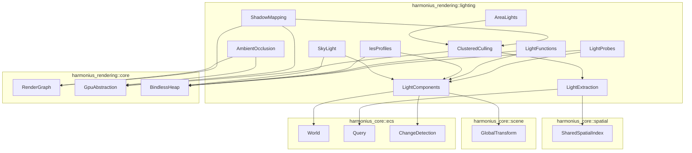
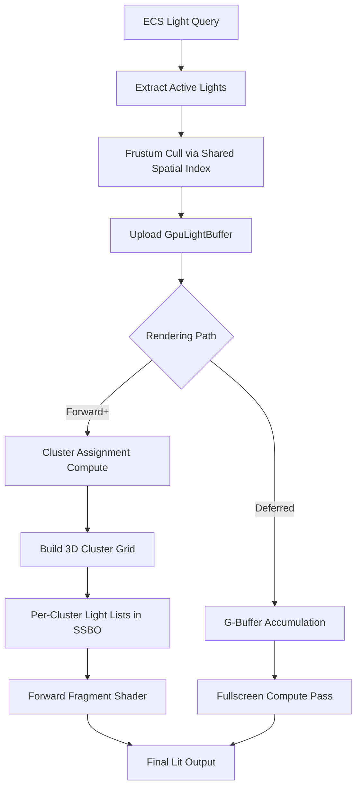
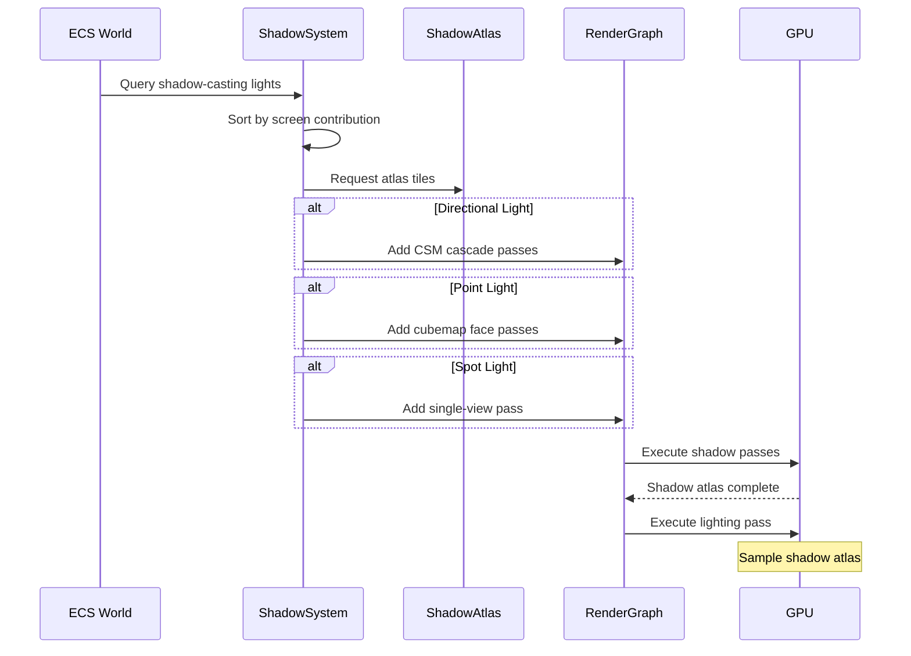
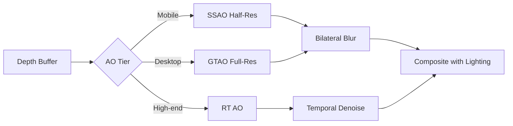
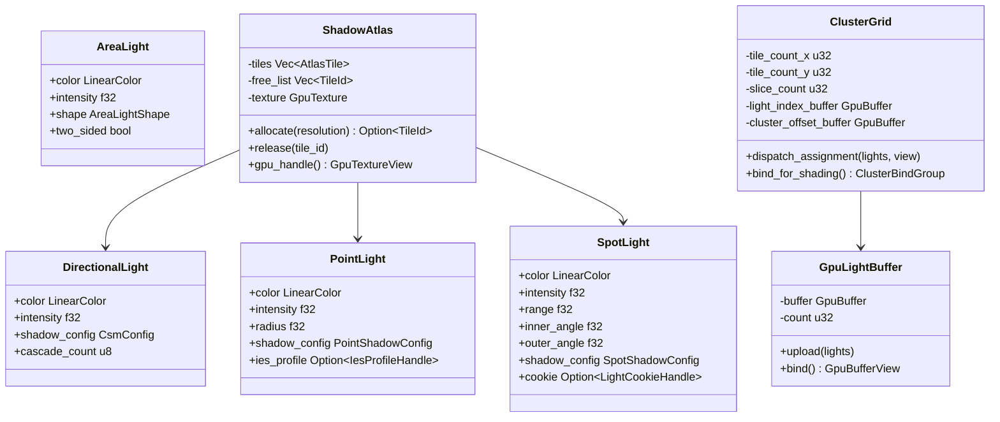
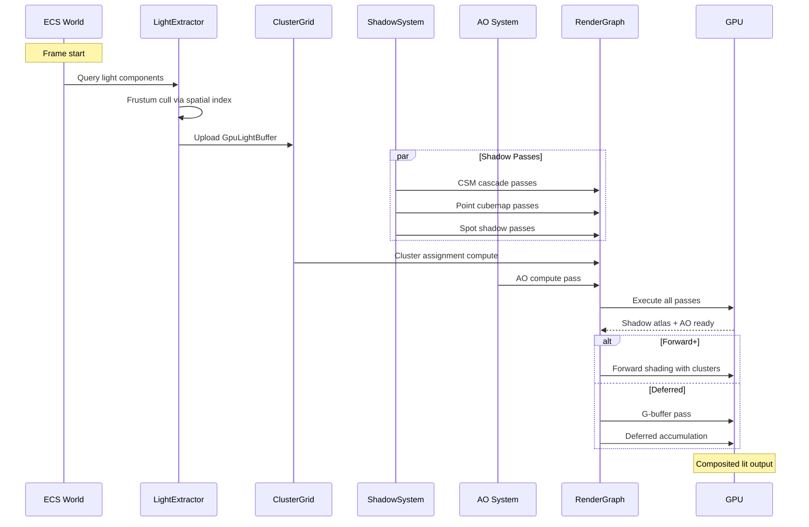

# Lighting System Design

## Requirements Trace

> **Canonical sources:** Features, requirements, and user stories are defined in
> [features/rendering/](../../features/), [requirements/rendering/](../../requirements/), and
> [user-stories/rendering/](../../user-stories/). The table below traces design elements to those
> definitions.

| Feature  | Requirement        | User Stories             |
|----------|--------------------|--------------------------|
| F-2.4.1  | R-2.4.1, NFR-2.4.1 | US-2.4.1.1, US-2.4.1.2   |
| F-2.4.2  | R-2.4.2            | US-2.4.2.1, US-2.4.2.2   |
| F-2.4.10 | R-2.4.10           | US-2.4.10.1, US-2.4.10.2 |
| F-2.4.11 | R-2.4.11           | US-2.4.11.1, US-2.4.11.2 |
| F-2.4.12 | R-2.4.12           | US-2.4.12.1, US-2.4.12.2 |
| F-2.4.13 | R-2.4.13           | US-2.4.13.1, US-2.4.13.2 |
| F-2.4.14 | R-2.4.14           | US-2.4.14.1, US-2.4.14.2 |
| F-2.4.15 | R-2.4.15           | US-2.4.15.1, US-2.4.15.2 |
| F-2.4.16 | R-2.4.16           | US-2.4.16.1, US-2.4.16.2 |
| F-2.4.17 | R-2.4.17           | US-2.4.17.1, US-2.4.17.2 |
| F-2.4.18 | R-2.4.18           | US-2.4.18.1, US-2.4.18.2 |
| F-2.4.19 | R-2.4.19           | US-2.4.19.1, US-2.4.19.2 |
| F-2.4.20 | R-2.4.20           | US-2.4.20.1, US-2.4.20.2 |
| F-2.4.21 | R-2.4.21           | US-2.4.21.1, US-2.4.21.2 |
| F-2.4.22 | R-2.4.22           | US-2.4.22.1, US-2.4.22.2 |
| F-2.4.23 | R-2.4.23           | US-2.4.23.1, US-2.4.23.2 |

1. **F-2.4.1** — Tiled/clustered forward+ light culling via compute pass
2. **F-2.4.2** — Deferred lighting via G-buffer with fullscreen accumulation
3. **F-2.4.10** — Stochastic many-light sampling with temporal denoiser
4. **F-2.4.11** — Cascaded shadow maps for directional lights
5. **F-2.4.12** — Soft shadows: PCF, PCSS, RT
6. **F-2.4.13** — Ambient occlusion: SSAO, GTAO, RT AO
7. **F-2.4.14** — Virtual shadow maps with on-demand page allocation
8. **F-2.4.15** — Contact shadows via screen-space ray march
9. **F-2.4.16** — Distance field shadows via SDF cone trace
10. **F-2.4.17** — Capsule shadows for skeletal meshes
11. **F-2.4.18** — Moment-based order-independent transparency
12. **F-2.4.19** — Volumetric shadow maps with Fourier opacity mapping
13. **F-2.4.20** — Area lights (rect/sphere) via LTC integration
14. **F-2.4.21** — Sky light / IBL with split-sum specular
15. **F-2.4.22** — IES photometric light profiles
16. **F-2.4.23** — Light functions (gobo/cookie material graphs)

### Cross-Cutting Dependencies

| Dependency | Source | Consumed API |
|------------|--------|--------------|
| ECS world and queries | F-1.1.20 | `Query`, `Changed<T>`, parallel iteration |
| Change detection | F-1.1.22 | Tick-based dirty tracking for light updates |
| Shared spatial index | F-1.9.1, F-1.9.4 | BVH frustum/sphere queries for light culling |
| Render graph | F-2.3.1 | Pass declaration, resource management |
| GPU abstraction | F-2.1.1 | Buffer, texture, compute dispatch |
| Bindless heap | F-2.1.3 | Descriptor indexing for textures/buffers |
| Shader compiler | Constraints | HLSL via DXC, Metal Shader Converter |
| Thread pool | F-14.3.1 | Scoped parallel CPU-side light extraction |
| Transform system | F-1.2.4 | `GlobalTransform` for light world positions |
| Meshlet pipeline | F-3.2.1 | Shadow geometry rendering |

### Non-Functional Requirements

| NFR | Target | Source |
|-----|--------|--------|
| NFR-2.4.1 | 500+ dynamic lights, sub-linear scaling | R-2.4.1 |
| NFR-2.4.2 | Shadow atlas budget ≤ 256 MB VRAM | R-2.4.11 |
| NFR-2.4.3 | BRDF eval < 0.1 ms / 1M fragments | R-2.4.3 |

## Overview

The lighting system is 100% ECS-based. Every light is a bundle of components on an entity -- there
is no separate "light manager" or parallel data store. Systems query light components each frame,
cull them against the camera frustum using the shared spatial index, upload a packed GPU buffer, and
feed it into either the forward+ clustered path or the deferred accumulation path.

The design follows four principles:

1. **Lights are ECS components.** A directional, point, spot, or area light is a component on an
   entity that also carries `GlobalTransform`. No singletons, no light lists.
2. **GPU-driven culling.** A compute pass builds a 3D cluster grid (X tiles x Y tiles x Z depth
   slices) and writes per-cluster light index lists into an SSBO. Fragment shaders read only their
   cluster's list.
3. **Unified shadow atlas.** All shadow maps (cascaded, cubemap, spot, virtual) are tiles in a
   single GPU texture atlas. A CPU-side allocator assigns tiles based on screen-space contribution.
4. **Tiered quality.** Every subsystem (shadows, AO, area lights, light functions) scales across
   four platform tiers: Mobile, Switch, Desktop, High-end.

### Performance Targets

| Metric | Target |
|--------|--------|
| Max dynamic lights (forward+) | 500+ (NFR-2.4.1) |
| Cluster assignment compute | < 0.5 ms at 1080p |
| Shadow atlas VRAM | ≤ 256 MB (NFR-2.4.2) |
| BRDF evaluation | < 0.1 ms / 1M frags (NFR-2.4.3) |
| Contact shadow ray march | < 0.3 ms at 1080p |
| AO pass (GTAO) | < 1.0 ms at 1080p |

## Architecture

### Module Boundaries



### File Layout

```text
harmonius_rendering/
├── lighting/
│   ├── components.rs     # Light ECS components
│   ├── extraction.rs     # CPU-side light query
│   │                     # and frustum culling
│   ├── clustering.rs     # GPU cluster grid build
│   │                     # and light assignment
│   ├── gpu_types.rs      # GPU-side struct layouts
│   ├── shadows/
│   │   ├── atlas.rs      # Shadow atlas allocator
│   │   ├── cascade.rs    # CSM split + render
│   │   ├── cubemap.rs    # Omnidirectional shadow
│   │   ├── spot.rs       # Spot shadow projection
│   │   ├── virtual_sm.rs # Virtual shadow maps
│   │   ├── contact.rs    # Screen-space contact
│   │   ├── distance.rs   # SDF cone-trace shadows
│   │   ├── capsule.rs    # Capsule shadow approx
│   │   ├── volumetric.rs # Volumetric shadow maps
│   │   └── filter.rs     # PCF, PCSS, VSM filters
│   ├── ambient/
│   │   ├── ssao.rs       # Screen-space AO
│   │   ├── gtao.rs       # Ground-truth AO
│   │   └── rtao.rs       # Ray-traced AO
│   ├── probes.rs         # Light + reflection probes
│   ├── sky_light.rs      # IBL, irradiance, specular
│   ├── area_lights.rs    # LTC rect/sphere/disc
│   ├── ies_profiles.rs   # IES file parsing + LUT
│   ├── light_functions.rs # Cookie/gobo material
│   └── stochastic.rs     # Many-light sampling
└── shaders/
    └── lighting/
        ├── cluster_assign.hlsl
        ├── cluster_shade.hlsl
        ├── deferred_accumulate.hlsl
        ├── shadow_sample.hlsl
        ├── ssao.hlsl
        ├── gtao.hlsl
        ├── contact_shadow.hlsl
        ├── ltc_area.hlsl
        ├── sky_ibl.hlsl
        └── stochastic_lights.hlsl
```

### Light Culling Pipeline



### Shadow Map Render Flow



### Ambient Occlusion Pipeline



### Core Data Structures



### Full-Frame Lighting Data Flow



## API Design

### Light Components

All lights are ECS components attached to entities that also carry `GlobalTransform`. The
transform's translation is the light position; the forward direction (-Z in local space) is the
light direction.

```rust
/// Linear HDR color. Pre-multiplied alpha is not
/// used for light colors.
#[derive(Clone, Copy, Debug, Reflect)]
pub struct LinearColor {
    pub r: f32,
    pub g: f32,
    pub b: f32,
}

/// Color temperature in Kelvin. Converted to
/// LinearColor via Planckian locus approximation.
#[derive(Clone, Copy, Debug, Reflect)]
pub struct ColorTemperature(pub f32);

impl ColorTemperature {
    /// Convert Kelvin to linear RGB.
    pub fn to_linear_color(self) -> LinearColor;
}

/// Directional light component. Represents an
/// infinitely distant light source (sun/moon).
/// Attach to an entity with GlobalTransform to
/// control direction via rotation.
#[derive(Clone, Debug, Reflect)]
pub struct DirectionalLight {
    /// HDR light color.
    pub color: LinearColor,
    /// Illuminance in lux.
    pub intensity: f32,
    /// Whether this light casts shadows.
    pub cast_shadows: bool,
    /// Cascaded shadow map configuration.
    pub shadow_config: CsmConfig,
    /// Optional light function (gobo/cookie).
    pub light_function: Option<LightFunctionHandle>,
}

/// Configuration for cascaded shadow maps.
#[derive(Clone, Debug, Reflect)]
pub struct CsmConfig {
    /// Number of cascades (1..=4).
    pub cascade_count: u8,
    /// Per-cascade shadow map resolution.
    /// Length must equal cascade_count.
    pub cascade_resolutions: SmallVec<[u16; 4]>,
    /// Maximum shadow distance from camera.
    pub max_distance: f32,
    /// Split scheme blend: 0.0 = linear,
    /// 1.0 = logarithmic.
    pub split_lambda: f32,
    /// Depth bias to reduce shadow acne.
    pub depth_bias: f32,
    /// Normal offset bias in world units.
    pub normal_bias: f32,
    /// Enable temporal stabilization to
    /// prevent cascade boundary shimmer.
    pub temporal_stabilization: bool,
    /// Shadow filter quality tier.
    pub filter: ShadowFilter,
    /// Enable contact shadows for this light.
    pub contact_shadows: ContactShadowConfig,
}

/// Point light component. Emits light uniformly
/// in all directions from a point.
#[derive(Clone, Debug, Reflect)]
pub struct PointLight {
    /// HDR light color.
    pub color: LinearColor,
    /// Luminous intensity in candela.
    pub intensity: f32,
    /// Attenuation radius. Light contribution
    /// is zero beyond this distance.
    pub radius: f32,
    /// Whether this light casts shadows.
    pub cast_shadows: bool,
    /// Shadow configuration for omnidirectional
    /// cubemap shadows.
    pub shadow_config: PointShadowConfig,
    /// Optional IES photometric profile.
    pub ies_profile: Option<IesProfileHandle>,
    /// Optional light function (cookie).
    pub light_function: Option<LightFunctionHandle>,
}

/// Omnidirectional shadow configuration.
#[derive(Clone, Debug, Reflect)]
pub struct PointShadowConfig {
    /// Shadow map resolution per cubemap face.
    pub resolution: u16,
    /// Depth bias.
    pub depth_bias: f32,
    /// Shadow filter quality tier.
    pub filter: ShadowFilter,
}

/// Spot light component. Emits light in a cone.
#[derive(Clone, Debug, Reflect)]
pub struct SpotLight {
    /// HDR light color.
    pub color: LinearColor,
    /// Luminous intensity in candela.
    pub intensity: f32,
    /// Maximum range of the spot light.
    pub range: f32,
    /// Inner cone angle in radians (full bright).
    pub inner_angle: f32,
    /// Outer cone angle in radians (falloff edge).
    pub outer_angle: f32,
    /// Whether this light casts shadows.
    pub cast_shadows: bool,
    /// Shadow configuration.
    pub shadow_config: SpotShadowConfig,
    /// Optional IES photometric profile.
    pub ies_profile: Option<IesProfileHandle>,
    /// Optional light function (gobo/cookie).
    pub light_function: Option<LightFunctionHandle>,
}

/// Spot light shadow configuration.
#[derive(Clone, Debug, Reflect)]
pub struct SpotShadowConfig {
    /// Shadow map resolution.
    pub resolution: u16,
    /// Depth bias.
    pub depth_bias: f32,
    /// Shadow filter quality tier.
    pub filter: ShadowFilter,
}

/// Area light shape.
#[derive(Clone, Copy, Debug, Reflect)]
pub enum AreaLightShape {
    /// Rectangular area light with half-extents.
    Rect { half_width: f32, half_height: f32 },
    /// Disc area light with radius.
    Disc { radius: f32 },
    /// Spherical area light with radius.
    Sphere { radius: f32 },
}

/// Area light component. Emits light from an
/// extended surface. Evaluated via linearly
/// transformed cosines (LTC).
#[derive(Clone, Debug, Reflect)]
pub struct AreaLight {
    /// HDR light color.
    pub color: LinearColor,
    /// Luminous power in lumens.
    pub intensity: f32,
    /// Shape of the emitting surface.
    pub shape: AreaLightShape,
    /// Whether the light emits from both sides.
    pub two_sided: bool,
    /// Attenuation range.
    pub range: f32,
    /// Whether this light casts shadows.
    pub cast_shadows: bool,
}

/// **Note:** Lights are modeled as separate per-type
/// components (`DirectionalLight`, `PointLight`,
/// etc.) rather than a single `LightComponent` with
/// a `LightKind` discriminant. This design is
/// canonical. Per-type components enable more
/// efficient archetype queries (e.g., query only
/// spot lights for shadow atlas allocation) and
/// avoid match-arm overhead in hot culling paths.

/// Shadow filter quality tiers.
#[derive(Clone, Copy, Debug, PartialEq, Eq, Reflect)]
pub enum ShadowFilter {
    /// Hard shadows (single sample).
    Hard,
    /// Percentage closer filtering.
    Pcf { tap_count: u8 },
    /// Percentage closer soft shadows.
    /// Penumbra varies with blocker distance.
    Pcss,
    /// Variance shadow maps.
    Vsm,
    /// Ray-traced soft shadows (requires RT HW).
    RayTraced,
}

/// Contact shadow configuration.
#[derive(Clone, Debug, Reflect)]
pub struct ContactShadowConfig {
    /// Enable contact shadows.
    pub enabled: bool,
    /// Ray march step count.
    pub step_count: u8,
    /// Maximum ray distance in world units.
    pub max_distance: f32,
}
```

### Sky Light and IBL

```rust
/// Sky light component. Provides ambient
/// image-based lighting from a cubemap or the
/// sky atmosphere system.
#[derive(Clone, Debug, Reflect)]
pub struct SkyLight {
    /// Source cubemap for IBL. If None, the sky
    /// atmosphere system provides the cubemap.
    pub cubemap: Option<CubemapHandle>,
    /// Diffuse irradiance intensity multiplier.
    pub diffuse_intensity: f32,
    /// Specular reflection intensity multiplier.
    pub specular_intensity: f32,
    /// Cubemap mip count for roughness levels.
    pub mip_count: u8,
}

/// Pre-filtered IBL data stored as GPU resources.
/// Generated at load time or on sky change.
pub struct SkyLightGpuData {
    /// Diffuse irradiance cubemap.
    pub irradiance_map: GpuTexture,
    /// Pre-filtered specular cubemap with mip
    /// chain for roughness levels.
    pub prefiltered_env_map: GpuTexture,
    /// BRDF integration LUT (split-sum).
    pub brdf_lut: GpuTexture,
}

impl SkyLightGpuData {
    /// Re-filter the irradiance and specular
    /// maps from a new source cubemap. Dispatches
    /// GPU compute passes via the render graph.
    pub fn refilter(
        &mut self,
        source: &GpuTexture,
        render_graph: &mut RenderGraph,
    );
}
```

### IES Light Profiles

```rust
/// Handle to a loaded IES profile texture.
#[derive(
    Clone, Copy, Debug, PartialEq, Eq, Hash,
    Reflect,
)]
pub struct IesProfileHandle(pub(crate) u32);

/// Parsed IES photometric data.
pub struct IesProfile {
    /// Vertical angles in radians.
    pub vertical_angles: Vec<f32>,
    /// Horizontal angles in radians.
    pub horizontal_angles: Vec<f32>,
    /// Candela values indexed by
    /// [horizontal][vertical].
    pub candela_values: Vec<Vec<f32>>,
    /// Maximum candela for normalization.
    pub max_candela: f32,
}

impl IesProfile {
    /// Parse an IES file from raw bytes.
    pub fn parse(data: &[u8]) -> Result<Self, IesError>;

    /// Bake the profile into a GPU texture.
    /// 1D for mobile/Switch, 2D for desktop.
    pub fn bake_texture(
        &self,
        config: &IesBakeConfig,
        gpu: &GpuDevice,
    ) -> GpuTexture;
}

/// IES bake configuration per platform tier.
#[derive(Clone, Debug)]
pub struct IesBakeConfig {
    /// Texture width (1D) or width x height (2D).
    pub resolution: u16,
    /// Use 2D texture (true) or 1D (false).
    pub use_2d: bool,
}

/// Per-tier IES bake defaults.
///
/// | Tier | Resolution | Dimensions |
/// |------|-----------|------------|
/// | Mobile | 64 | 1D |
/// | Switch | 128 | 1D |
/// | Desktop | 256 | 2D |
/// | High-end | 256+ | 2D |
pub const IES_TIER_MOBILE: IesBakeConfig =
    IesBakeConfig {
        resolution: 64,
        use_2d: false,
    };
pub const IES_TIER_SWITCH: IesBakeConfig =
    IesBakeConfig {
        resolution: 128,
        use_2d: false,
    };
pub const IES_TIER_DESKTOP: IesBakeConfig =
    IesBakeConfig {
        resolution: 256,
        use_2d: true,
    };
```

### Light Functions (Cookies / Gobos)

```rust
/// Handle to a compiled light function.
#[derive(
    Clone, Copy, Debug, PartialEq, Eq, Hash,
    Reflect,
)]
pub struct LightFunctionHandle(pub(crate) u32);

/// Light function output mode.
#[derive(Clone, Copy, Debug, Reflect)]
pub enum LightFunctionOutput {
    /// Scalar intensity mask (0.0..=1.0).
    Scalar,
    /// RGB color modulation.
    Color,
}

/// Light function descriptor. Defines a material
/// graph that modulates light intensity/color
/// per-pixel in the light's influence volume.
#[derive(Clone, Debug, Reflect)]
pub struct LightFunction {
    /// Output mode: scalar or color.
    pub output: LightFunctionOutput,
    /// Bindless index into the light function
    /// texture (baked on mobile, runtime on
    /// desktop).
    pub texture_index: u32,
    /// UV tiling factor.
    pub tiling: [f32; 2],
    /// UV offset for animation.
    pub offset: [f32; 2],
    /// Animation speed (UV scroll per second).
    pub scroll_speed: [f32; 2],
}
```

### Clustered Light Culling

```rust
/// Configuration for the 3D cluster grid.
#[derive(Clone, Debug)]
pub struct ClusterConfig {
    /// Tile size in pixels (width and height).
    /// Default: 64.
    pub tile_size: u32,
    /// Number of depth slices. Logarithmic
    /// distribution from near to far plane.
    /// Mobile: 8, Desktop: 24.
    pub depth_slices: u32,
    /// Maximum lights per cluster before
    /// overflow. Default: 256.
    pub max_lights_per_cluster: u32,
}

/// Per-tier cluster configuration defaults.
///
/// | Tier | Tile Size | Depth Slices | Max/Cluster |
/// |------|----------|-------------|-------------|
/// | Mobile | 64 | 8 | 32 |
/// | Switch | 64 | 16 | 64 |
/// | Desktop | 64 | 24 | 256 |
/// | High-end | 64 | 24 | 256 |
pub const CLUSTER_TIER_MOBILE: ClusterConfig =
    ClusterConfig {
        tile_size: 64,
        depth_slices: 8,
        max_lights_per_cluster: 32,
    };
pub const CLUSTER_TIER_DESKTOP: ClusterConfig =
    ClusterConfig {
        tile_size: 64,
        depth_slices: 24,
        max_lights_per_cluster: 256,
    };

/// GPU-side light data packed for SSBO upload.
/// 64 bytes per light (one cache line).
#[repr(C)]
#[derive(Clone, Copy, bytemuck::Pod, bytemuck::Zeroable)]
pub struct GpuLight {
    /// World-space position (xyz) + type (w).
    /// type: 0=directional, 1=point, 2=spot,
    /// 3=area_rect, 4=area_disc, 5=area_sphere.
    pub position_and_type: [f32; 4],
    /// Direction (xyz) + inner angle cos (w).
    pub direction_and_inner_cos: [f32; 4],
    /// Color (rgb) + intensity (a).
    pub color_and_intensity: [f32; 4],
    /// Range (x), outer angle cos (y),
    /// shadow atlas tile index (z),
    /// flags packed u32 as float (w).
    pub range_outer_shadow_flags: [f32; 4],
}

/// The cluster grid. Owns GPU buffers for the
/// cluster offset table, light index list, and
/// dispatches the assignment compute shader.
pub struct ClusterGrid {
    config: ClusterConfig,
    /// Number of tiles in X.
    tile_count_x: u32,
    /// Number of tiles in Y.
    tile_count_y: u32,
    /// GPU buffer: per-cluster (offset, count).
    cluster_offset_buffer: GpuBuffer,
    /// GPU buffer: packed light indices.
    light_index_buffer: GpuBuffer,
}

impl ClusterGrid {
    pub fn new(
        config: ClusterConfig,
        gpu: &GpuDevice,
    ) -> Self;

    /// Resize the grid when the viewport changes.
    pub fn resize(
        &mut self,
        viewport_width: u32,
        viewport_height: u32,
        gpu: &GpuDevice,
    );

    /// Dispatch the cluster assignment compute
    /// shader. Reads the GpuLightBuffer, writes
    /// per-cluster light lists.
    pub fn dispatch_assignment(
        &self,
        light_buffer: &GpuBuffer,
        light_count: u32,
        view_uniforms: &ViewUniforms,
        render_graph: &mut RenderGraph,
    );

    /// Return bind group for forward fragment
    /// shaders to read cluster light lists.
    pub fn bind_for_shading(
        &self,
    ) -> ClusterBindGroup;

    pub fn total_clusters(&self) -> u32;
}

/// Bind group exposing cluster data to shaders.
pub struct ClusterBindGroup {
    pub cluster_offsets: GpuBufferView,
    pub light_indices: GpuBufferView,
    pub light_buffer: GpuBufferView,
}
```

### GPU Light Buffer

```rust
/// Manages the GPU-side packed light array.
pub struct GpuLightBuffer {
    buffer: GpuBuffer,
    capacity: u32,
    count: u32,
}

impl GpuLightBuffer {
    pub fn new(
        initial_capacity: u32,
        gpu: &GpuDevice,
    ) -> Self;

    /// Upload the frame's visible lights. Grows
    /// the buffer if needed.
    pub fn upload(
        &mut self,
        lights: &[GpuLight],
        gpu: &GpuDevice,
    );

    pub fn count(&self) -> u32;
    pub fn buffer_view(&self) -> GpuBufferView;
}
```

### Light Extraction System

```rust
/// CPU-side visible light data extracted from
/// ECS queries and frustum culling.
pub struct ExtractedLight {
    pub entity: Entity,
    pub gpu_light: GpuLight,
    /// Screen-space contribution for shadow
    /// priority sorting.
    pub screen_contribution: f32,
    pub shadow_request: Option<ShadowRequest>,
}

/// Requested shadow rendering for one light.
pub struct ShadowRequest {
    pub light_type: ShadowLightType,
    pub resolution: u16,
    pub filter: ShadowFilter,
    /// For CSM: cascade configs.
    pub cascades: Option<SmallVec<[CascadeDesc; 4]>>,
}

#[derive(Clone, Copy, Debug)]
pub enum ShadowLightType {
    Directional,
    PointCubemap,
    Spot,
}

/// Per-cascade descriptor for CSM.
#[derive(Clone, Debug)]
pub struct CascadeDesc {
    pub near: f32,
    pub far: f32,
    pub resolution: u16,
    pub view_projection: Mat4,
}

/// ECS system: extracts visible lights each
/// frame. Runs in the Extract phase before
/// render graph construction.
///
/// 1. Query all entities with light components
///    and GlobalTransform.
/// 2. Frustum-cull against camera via shared
///    spatial index (directional lights skip
///    this step).
/// 3. Pack into GpuLight structs.
/// 4. Sort by screen-space contribution
///    (for shadow budget allocation).
/// 5. Upload to GpuLightBuffer.
pub fn light_extraction_system(
    query_dir: Query<
        (Entity, &DirectionalLight, &GlobalTransform),
    >,
    query_point: Query<
        (Entity, &PointLight, &GlobalTransform),
    >,
    query_spot: Query<
        (Entity, &SpotLight, &GlobalTransform),
    >,
    query_area: Query<
        (Entity, &AreaLight, &GlobalTransform),
    >,
    spatial_index: &SharedSpatialIndex,
    camera: &CameraView,
    light_buffer: &mut GpuLightBuffer,
    gpu: &GpuDevice,
) -> Vec<ExtractedLight>;
```

### Shadow Atlas

```rust
/// Unique identifier for a shadow atlas tile.
#[derive(
    Clone, Copy, Debug, PartialEq, Eq, Hash,
)]
pub struct ShadowTileId(pub(crate) u32);

/// A tile within the shadow atlas.
#[derive(Clone, Debug)]
pub struct ShadowAtlasTile {
    pub id: ShadowTileId,
    /// Pixel offset within the atlas texture.
    pub offset_x: u32,
    pub offset_y: u32,
    /// Tile resolution in pixels.
    pub resolution: u16,
    /// Which light entity owns this tile.
    pub owner: Option<Entity>,
    /// Frame number of last update.
    pub last_used_frame: u64,
}

/// Shadow atlas configuration.
#[derive(Clone, Debug)]
pub struct ShadowAtlasConfig {
    /// Total atlas texture resolution.
    /// Default: 8192x8192 on desktop.
    pub atlas_size: u32,
    /// Depth format for shadow maps.
    pub depth_format: TextureFormat,
    /// Maximum VRAM budget in bytes. Tiles are
    /// evicted LRU when budget is exceeded.
    pub vram_budget: u64,
}

/// Per-tier shadow atlas defaults.
///
/// | Tier | Atlas Size | Budget |
/// |------|-----------|--------|
/// | Mobile | 2048 | 32 MB |
/// | Switch | 4096 | 64 MB |
/// | Desktop | 8192 | 256 MB |
/// | High-end | 16384 | 256 MB |
pub const SHADOW_ATLAS_DESKTOP: ShadowAtlasConfig =
    ShadowAtlasConfig {
        atlas_size: 8192,
        depth_format: TextureFormat::Depth32Float,
        vram_budget: 256 * 1024 * 1024,
    };

/// Manages shadow map tile allocation within a
/// single GPU depth texture atlas.
pub struct ShadowAtlas {
    config: ShadowAtlasConfig,
    tiles: Vec<ShadowAtlasTile>,
    free_list: Vec<ShadowTileId>,
    texture: GpuTexture,
    current_frame: u64,
}

impl ShadowAtlas {
    pub fn new(
        config: ShadowAtlasConfig,
        gpu: &GpuDevice,
    ) -> Self;

    /// Allocate a tile of the requested
    /// resolution. Returns None if the atlas
    /// is full after LRU eviction attempts.
    pub fn allocate(
        &mut self,
        resolution: u16,
    ) -> Option<ShadowTileId>;

    /// Release a tile back to the free list.
    pub fn release(&mut self, tile: ShadowTileId);

    /// Mark a tile as used this frame (LRU).
    pub fn touch(
        &mut self,
        tile: ShadowTileId,
        frame: u64,
    );

    /// Evict least-recently-used tiles until
    /// the budget is satisfied.
    pub fn evict_lru(&mut self, budget: u64);

    /// Get the atlas GPU texture for binding.
    pub fn texture_view(&self) -> GpuTextureView;

    /// Get the viewport rect for a tile.
    pub fn tile_viewport(
        &self,
        tile: ShadowTileId,
    ) -> Viewport;

    /// Get the UV transform matrix to sample
    /// this tile from the atlas.
    pub fn tile_uv_transform(
        &self,
        tile: ShadowTileId,
    ) -> Mat4;
}
```

### Shadow Rendering Systems

```rust
/// CSM system: renders cascaded shadow maps for
/// each directional light.
pub fn csm_shadow_system(
    lights: &[ExtractedLight],
    atlas: &mut ShadowAtlas,
    render_graph: &mut RenderGraph,
    scene: &SceneRenderData,
) {
    // For each directional light with shadows:
    // 1. Compute cascade splits (log/linear blend)
    // 2. Compute per-cascade view-projection
    // 3. Apply temporal stabilization (snap to
    //    texel grid)
    // 4. Allocate atlas tiles per cascade
    // 5. Add render passes to render graph
}

/// Point shadow system: renders omnidirectional
/// cubemap shadows.
pub fn point_shadow_system(
    lights: &[ExtractedLight],
    atlas: &mut ShadowAtlas,
    render_graph: &mut RenderGraph,
    scene: &SceneRenderData,
) {
    // For each point light with shadows:
    // 1. Build 6 face view-projections
    // 2. Allocate 6 atlas tiles (or 2 for
    //    dual-paraboloid on mobile)
    // 3. Add render passes per face
}

/// Spot shadow system: renders single-view
/// shadow maps.
pub fn spot_shadow_system(
    lights: &[ExtractedLight],
    atlas: &mut ShadowAtlas,
    render_graph: &mut RenderGraph,
    scene: &SceneRenderData,
) {
    // For each spot light with shadows:
    // 1. Build perspective projection from
    //    cone angle and range
    // 2. Allocate one atlas tile
    // 3. Add render pass
}

/// Contact shadow system: dispatches per-pixel
/// screen-space ray march as a compute pass.
pub fn contact_shadow_system(
    lights: &[ExtractedLight],
    depth_buffer: &GpuTexture,
    config: &ContactShadowConfig,
    render_graph: &mut RenderGraph,
);

/// Distance field shadow system: dispatches
/// SDF cone-trace shadows.
pub fn distance_field_shadow_system(
    lights: &[ExtractedLight],
    sdf_volume: &GpuTexture,
    render_graph: &mut RenderGraph,
);

/// Capsule shadow system: renders soft shadow
/// approximation from skeletal mesh capsules.
pub fn capsule_shadow_system(
    capsules: Query<(&CapsuleCollider, &GlobalTransform)>,
    lights: &[ExtractedLight],
    sdf_volume: &GpuTexture,
    render_graph: &mut RenderGraph,
);
```

### Shadow Filtering (HLSL Interface)

```rust
/// Shadow filter parameters uploaded as a
/// per-frame constant buffer.
#[repr(C)]
#[derive(Clone, Copy, bytemuck::Pod, bytemuck::Zeroable)]
pub struct GpuShadowParams {
    /// Shadow atlas size (xy), texel size (zw).
    pub atlas_size_and_texel: [f32; 4],
    /// PCF tap count (x), PCSS search radius (y),
    /// light size for PCSS (z), VSM min variance
    /// (w).
    pub filter_params: [f32; 4],
    /// Contact shadow step count (x), max dist
    /// (y), thickness (z), padding (w).
    pub contact_params: [f32; 4],
}
```

### Ambient Occlusion

```rust
/// AO quality tier.
#[derive(Clone, Copy, Debug, PartialEq, Eq, Reflect)]
pub enum AoTier {
    /// Disabled.
    Off,
    /// SSAO at half resolution.
    Ssao,
    /// GTAO at full resolution with bent normals.
    Gtao,
    /// Ray-traced AO (requires RT hardware).
    RayTraced,
}

/// AO configuration.
#[derive(Clone, Debug, Reflect)]
pub struct AoConfig {
    pub tier: AoTier,
    /// Hemisphere sample count.
    /// SSAO: 4-16, GTAO: 8-32.
    pub sample_count: u8,
    /// AO radius in world units.
    pub radius: f32,
    /// AO intensity multiplier.
    pub intensity: f32,
    /// Power curve exponent.
    pub power: f32,
    /// Bilateral blur pass count.
    pub blur_passes: u8,
}

/// Per-tier AO defaults.
///
/// | Tier | Mode | Samples | Resolution |
/// |------|------|---------|-----------|
/// | Mobile | SSAO | 4 | Quarter |
/// | Switch | SSAO/GTAO | 8 | Half |
/// | Desktop | GTAO | 16 | Full |
/// | High-end | RT AO | N/A | Full |
pub const AO_TIER_MOBILE: AoConfig = AoConfig {
    tier: AoTier::Ssao,
    sample_count: 4,
    radius: 0.5,
    intensity: 1.0,
    power: 2.0,
    blur_passes: 1,
};
pub const AO_TIER_DESKTOP: AoConfig = AoConfig {
    tier: AoTier::Gtao,
    sample_count: 16,
    radius: 1.0,
    intensity: 1.0,
    power: 1.5,
    blur_passes: 2,
};

/// GPU data for AO output.
pub struct AoOutput {
    /// Single-channel AO texture.
    pub ao_texture: GpuTexture,
    /// Bent normal texture (GTAO and RT AO only).
    pub bent_normal_texture: Option<GpuTexture>,
}

/// SSAO system: dispatches half-res hemisphere
/// sampling + bilateral blur.
pub fn ssao_system(
    depth: &GpuTexture,
    normals: &GpuTexture,
    config: &AoConfig,
    render_graph: &mut RenderGraph,
) -> AoOutput;

/// GTAO system: dispatches full-res ground-truth
/// AO with bent normal output.
pub fn gtao_system(
    depth: &GpuTexture,
    normals: &GpuTexture,
    config: &AoConfig,
    render_graph: &mut RenderGraph,
) -> AoOutput;

/// RT AO system: dispatches ray-traced ambient
/// occlusion via acceleration structure queries.
pub fn rtao_system(
    accel_structure: &GpuAccelerationStructure,
    depth: &GpuTexture,
    normals: &GpuTexture,
    config: &AoConfig,
    render_graph: &mut RenderGraph,
) -> AoOutput;
```

### Area Lights (LTC)

```rust
/// LTC lookup tables. Precomputed and stored as
/// GPU textures at initialization.
pub struct LtcTables {
    /// Inverse transform matrix LUT.
    /// Indexed by (roughness, cos_theta).
    pub ltc_matrix: GpuTexture,
    /// Fresnel/norm amplitude LUT.
    pub ltc_amplitude: GpuTexture,
}

impl LtcTables {
    /// Generate LTC lookup tables on the GPU.
    /// Called once at initialization.
    pub fn generate(gpu: &GpuDevice) -> Self;
}

/// GPU-side area light data for shader consumption.
#[repr(C)]
#[derive(Clone, Copy, bytemuck::Pod, bytemuck::Zeroable)]
pub struct GpuAreaLight {
    /// World-space corners (rect) or center +
    /// radius (disc/sphere).
    pub points: [[f32; 4]; 4],
    /// Color (rgb) + intensity (a).
    pub color_and_intensity: [f32; 4],
    /// Shape type (x), two_sided (y), pad (zw).
    pub shape_flags: [f32; 4],
}
```

### Light Probes and Reflection Probes

```rust
/// Light probe component. Captures irradiance
/// at a point for indirect diffuse lighting.
#[derive(Clone, Debug, Reflect)]
pub struct LightProbe {
    /// Spherical harmonic coefficients (L2).
    pub sh_coefficients: [LinearColor; 9],
    /// Influence radius.
    pub radius: f32,
    /// Blend priority (higher overrides lower).
    pub priority: u8,
}

/// Reflection probe component. Captures a
/// cubemap for specular reflections.
#[derive(Clone, Debug, Reflect)]
pub struct ReflectionProbe {
    /// Pre-filtered environment cubemap handle.
    pub cubemap: CubemapHandle,
    /// Axis-aligned bounding box for influence.
    pub influence_aabb: Aabb,
    /// Inner blend AABB for smooth transitions.
    pub blend_aabb: Aabb,
    /// Mip count for roughness levels.
    pub mip_count: u8,
    /// Refresh mode.
    pub refresh: ProbeRefreshMode,
}

/// When to re-capture the probe cubemap.
#[derive(Clone, Copy, Debug, Reflect)]
pub enum ProbeRefreshMode {
    /// Baked at build time. Never updated.
    Baked,
    /// Recaptured once at scene load.
    OnLoad,
    /// Recaptured every N frames.
    Periodic { interval_frames: u32 },
    /// Recaptured when marked dirty via
    /// change detection.
    OnChange,
}
```

### Stochastic Many-Light Sampling

```rust
/// Configuration for stochastic many-light
/// sampling (F-2.4.10).
#[derive(Clone, Debug, Reflect)]
pub struct StochasticLightConfig {
    /// Ray budget per pixel per frame.
    /// Desktop: 1-2 spp, High-end: 4+ spp.
    pub samples_per_pixel: u8,
    /// Enable temporal accumulation denoiser.
    pub temporal_accumulation: bool,
    /// Number of frames for temporal convergence.
    pub accumulation_frames: u8,
    /// Minimum light luminance threshold for
    /// importance sampling.
    pub luminance_threshold: f32,
}

/// Per-tier stochastic light defaults.
///
/// | Tier | SPP | Temporal | Status |
/// |------|-----|----------|--------|
/// | Mobile | N/A | N/A | Disabled |
/// | Switch | N/A | N/A | Disabled |
/// | Desktop | 1-2 | Yes | Enabled |
/// | High-end | 4+ | Yes | Enabled |
pub const STOCHASTIC_TIER_DESKTOP:
    StochasticLightConfig =
    StochasticLightConfig {
        samples_per_pixel: 2,
        temporal_accumulation: true,
        accumulation_frames: 16,
        luminance_threshold: 0.001,
    };
```

### Virtual Shadow Maps

```rust
/// Virtual shadow map configuration.
#[derive(Clone, Debug, Reflect)]
pub struct VirtualShadowMapConfig {
    /// Virtual atlas resolution (logical).
    /// Desktop: 8192, High-end: 16384.
    pub virtual_resolution: u32,
    /// Physical page resolution in texels.
    pub page_size: u16,
    /// Maximum physical pages allocated.
    pub max_physical_pages: u32,
    /// Enable meshlet-based geometry rendering
    /// into shadow pages.
    pub use_meshlets: bool,
}

/// Per-tier VSM defaults.
///
/// | Tier | Virtual Res | Pages | Status |
/// |------|------------|-------|--------|
/// | Mobile | N/A | N/A | Disabled |
/// | Switch | N/A | N/A | Disabled (CSM fallback) |
/// | Desktop | 8192 | 4096 | Enabled |
/// | High-end | 16384 | 8192 | Enabled |
pub const VSM_TIER_DESKTOP: VirtualShadowMapConfig =
    VirtualShadowMapConfig {
        virtual_resolution: 8192,
        page_size: 128,
        max_physical_pages: 4096,
        use_meshlets: true,
    };

/// Physical page table for virtual shadow maps.
pub struct VsmPageTable {
    /// Maps virtual page coords to physical pages.
    page_map: GpuBuffer,
    /// Physical tile pool.
    physical_pool: GpuTexture,
    /// Free page stack.
    free_pages: Vec<u32>,
}

impl VsmPageTable {
    pub fn new(
        config: &VirtualShadowMapConfig,
        gpu: &GpuDevice,
    ) -> Self;

    /// Mark pages as needed based on screen-space
    /// coverage analysis.
    pub fn request_pages(
        &mut self,
        requests: &[VsmPageRequest],
    );

    /// Allocate requested pages, evicting LRU
    /// if pool is full.
    pub fn commit_pages(&mut self);

    /// Render geometry into allocated pages via
    /// the meshlet pipeline.
    pub fn render_pages(
        &self,
        render_graph: &mut RenderGraph,
        scene: &SceneRenderData,
    );
}
```

### Volumetric Shadow Maps

```rust
/// Volumetric shadow map configuration.
#[derive(Clone, Debug, Reflect)]
pub struct VolumetricShadowConfig {
    /// Enable volumetric shadows.
    pub enabled: bool,
    /// Fourier opacity map order (high-end).
    pub fourier_order: u8,
    /// Resolution of the volumetric shadow map.
    pub resolution: u16,
}

/// Per-tier volumetric shadow defaults.
///
/// | Tier | Status | Fourier | Resolution |
/// |------|--------|---------|-----------|
/// | Mobile | Disabled | N/A | N/A |
/// | Switch | Disabled | N/A | N/A |
/// | Desktop | Directional only | N/A | 512 |
/// | High-end | All lights | 4 | 1024 |
pub const VSHADOW_TIER_DESKTOP:
    VolumetricShadowConfig =
    VolumetricShadowConfig {
        enabled: true,
        fourier_order: 0,
        resolution: 512,
    };
pub const VSHADOW_TIER_HIGHEND:
    VolumetricShadowConfig =
    VolumetricShadowConfig {
        enabled: true,
        fourier_order: 4,
        resolution: 1024,
    };
```

### Order-Independent Transparency (MBOIT)

```rust
/// OIT configuration.
#[derive(Clone, Debug, Reflect)]
pub struct OitConfig {
    /// Enable moment-based OIT.
    pub enabled: bool,
    /// Number of transmittance moments.
    /// Desktop: 4 (half-res), High-end: 4 (full).
    pub moment_count: u8,
    /// Render at half resolution.
    pub half_resolution: bool,
}

/// Per-tier OIT defaults.
///
/// | Tier | Status | Moments | Resolution |
/// |------|--------|---------|-----------|
/// | Mobile | Disabled | N/A | Sorted fallback |
/// | Switch | Disabled | N/A | Sorted fallback |
/// | Desktop | Enabled | 4 | Half |
/// | High-end | Enabled | 4 | Full |
pub const OIT_TIER_DESKTOP: OitConfig = OitConfig {
    enabled: true,
    moment_count: 4,
    half_resolution: true,
};
pub const OIT_TIER_HIGHEND: OitConfig = OitConfig {
    enabled: true,
    moment_count: 4,
    half_resolution: false,
};
```

### Emissive Surfaces

```rust
/// Emissive surface component. Attached to mesh
/// entities whose materials have an emissive
/// channel. Used for bloom thresholding and
/// light probe baking.
#[derive(Clone, Debug, Reflect)]
pub struct EmissiveSurface {
    /// Emissive color (HDR, unbounded).
    pub color: LinearColor,
    /// Emissive intensity multiplier.
    pub intensity: f32,
    /// Whether this emissive surface contributes
    /// to light probe baking.
    pub affects_probes: bool,
}
```

### Error Types

```rust
#[derive(Debug)]
pub enum LightingError {
    /// Shadow atlas is full and cannot allocate
    /// after LRU eviction.
    ShadowAtlasFull {
        requested_resolution: u16,
    },
    /// Cluster grid overflow: too many lights in
    /// a single cluster.
    ClusterOverflow {
        cluster_index: u32,
        light_count: u32,
        max: u32,
    },
    /// IES profile parse failure.
    IesParseError {
        message: String,
    },
    /// Virtual shadow map page pool exhausted.
    VsmPagePoolExhausted {
        requested: u32,
        available: u32,
    },
    /// GPU resource creation failed.
    GpuResourceError {
        resource: &'static str,
        reason: String,
    },
}
```

## Data Flow

### Per-Frame Lighting Pipeline

The lighting pipeline executes in this order each frame, integrated into the render graph:

1. **Light extraction** (CPU, parallel) -- ECS queries all light components. Frustum cull via shared
   spatial index. Pack into `GpuLight` array. Sort by screen-space contribution.

2. **GPU light buffer upload** -- Upload packed `GpuLight` array to the GPU SSBO.

3. **Shadow pass scheduling** -- For each shadow-casting light (priority-sorted), allocate shadow
   atlas tiles. Add render passes to the render graph:
   - CSM: 1-4 cascade passes per directional light
   - Point: 6 cubemap face passes (or 2 dual-paraboloid on mobile)
   - Spot: 1 pass per spot light

4. **Shadow rendering** (GPU) -- Execute all shadow passes, writing depth into atlas tiles.

5. **Cluster assignment** (GPU compute) -- Build the 3D cluster grid. Each cluster stores a list of
   light indices that intersect it.

6. **AO pass** (GPU compute) -- SSAO, GTAO, or RT AO depending on tier. Outputs an AO texture and
   optional bent normals.

7. **Lighting evaluation** (GPU) -- Either:
   - **Forward+**: Fragment shader reads cluster light list, evaluates BRDF per light, samples
     shadow atlas, applies AO.
   - **Deferred**: Fullscreen compute reads G-buffer, iterates all lights per pixel, samples
     shadows, applies AO.

8. **Post-lighting** -- Contact shadows, light function animation updates, probe blending.

### Shadow Atlas Allocation Strategy

```rust
// Pseudocode for shadow budget allocation
fn allocate_shadow_budget(
    lights: &mut [ExtractedLight],
    atlas: &mut ShadowAtlas,
    budget: &ShadowBudget,
) {
    // Sort lights by screen-space contribution
    // (solid angle * intensity).
    lights.sort_by(|a, b| {
        b.screen_contribution
            .partial_cmp(&a.screen_contribution)
            .unwrap()
    });

    let mut used_tiles = 0u32;
    let max_tiles = budget.max_shadow_casting_lights;

    for light in lights.iter_mut() {
        if used_tiles >= max_tiles {
            // Budget exhausted: disable shadows
            // for remaining lights.
            light.shadow_request = None;
            continue;
        }

        if let Some(req) = &light.shadow_request {
            let tiles_needed = match req.light_type {
                ShadowLightType::Directional => {
                    req.cascades
                        .as_ref()
                        .map_or(0, |c| c.len() as u32)
                }
                ShadowLightType::PointCubemap => 6,
                ShadowLightType::Spot => 1,
            };

            // Try to allocate all needed tiles.
            let allocated = (0..tiles_needed)
                .filter_map(|_| {
                    atlas.allocate(req.resolution)
                })
                .collect::<SmallVec<[ShadowTileId; 6]>>();

            if allocated.len() as u32 == tiles_needed {
                used_tiles += tiles_needed;
            } else {
                // Partial allocation: release and
                // skip this light.
                for tile in &allocated {
                    atlas.release(*tile);
                }
                light.shadow_request = None;
            }
        }
    }
}
```

### Cluster Assignment Algorithm

The compute shader divides the view frustum into a 3D grid of clusters. Each cluster is a
screen-space tile extruded along logarithmic depth slices.

```text
Cluster index = tile_x + tile_y * tiles_x
              + slice * tiles_x * tiles_y

Slice depth = near * (far/near) ^ (slice / slices)
```

The assignment pass runs one thread group per cluster. Each thread tests a subset of lights against
the cluster's AABB. Passing lights are appended to a per-cluster list via atomic counter.

### Cascade Split Computation

```rust
/// Compute CSM cascade split depths using a
/// logarithmic/linear blend.
pub fn compute_cascade_splits(
    near: f32,
    far: f32,
    cascade_count: u8,
    lambda: f32,
) -> SmallVec<[f32; 5]> {
    let mut splits = SmallVec::new();
    splits.push(near);
    let n = cascade_count as f32;
    for i in 1..=cascade_count {
        let fraction = i as f32 / n;
        let log_split =
            near * (far / near).powf(fraction);
        let linear_split =
            near + (far - near) * fraction;
        let split = lambda * log_split
            + (1.0 - lambda) * linear_split;
        splits.push(split);
    }
    splits
}
```

## Platform Considerations

### Shadow Configuration Per Platform

| Platform | CSM Cascades | CSM Resolution | Atlas Size | VSM | Contact Shadows |
|----------|-------------|---------------|-----------|-----|-----------------|
| Mobile | 1-2 | 512 | 2048 | No | No |
| Switch | 2-3 | 1024 | 4096 | No | Dir only, 8 steps |
| Desktop | 3-4 | 2048 | 8192 | Yes (8k) | All lights, 16 steps |
| High-end | 4 | 4096 | 16384 | Yes (16k) | All lights, 32 steps |

### AO Configuration Per Platform

| Platform | AO Mode | Samples | Resolution | Bent Normals |
|----------|---------|---------|-----------|-------------|
| Mobile | SSAO | 4 | Quarter | No |
| Switch (handheld) | SSAO | 8 | Half | No |
| Switch (docked) | GTAO | 8 | Half | Yes |
| Desktop | GTAO | 16 | Full | Yes |
| High-end | RT AO | N/A | Full | Yes |

### Light Feature Availability Per Platform

| Feature | Mobile | Switch | Desktop | High-end |
|---------|--------|--------|---------|----------|
| Forward+ clustered | Yes (8 slices) | Yes (16 slices) | Yes (24 slices) | Yes (24 slices) |
| Deferred lighting | No | Thin G-buffer | Full G-buffer | Full G-buffer |
| Area lights (LTC) | Fallback to point | Rect only (max 4) | Full LTC | Unlimited |
| IES profiles | 1D, 64 texels | 1D, 128 texels | 2D, 256 texels | 2D, 256+ texels |
| Light functions | Baked to texture | Scalar only | Full color+anim | Full color+anim |
| Stochastic sampling | Disabled | Disabled | 1-2 spp | 4+ spp |
| Virtual shadow maps | Disabled | Disabled | 8k atlas | 16k atlas |
| Distance field shadows | Disabled | Disabled | Directional only | All lights |
| Capsule shadows | Disabled | Disabled | Max 4 heroes | All skeletal |
| MBOIT | Disabled | Disabled | Half-res | Full-res |
| Volumetric shadows | Disabled | Disabled | Directional | All + Fourier |
| Sky light refilter | Precomputed only | On TOD change | Runtime | Runtime |

### GPU Backend Notes

| Backend | Shadow Format | Cluster Buffer | AO Dispatch |
|---------|--------------|---------------|-------------|
| Metal | `depth32Float` | SSBO via `MTLBuffer` | Threadgroup compute |
| D3D12 | `DXGI_FORMAT_D32_FLOAT` | Structured buffer (SRV/UAV) | Dispatch compute |
| Vulkan | `VK_FORMAT_D32_SFLOAT` | Storage buffer (SSBO) | Dispatch compute |

All shaders are authored in HLSL and compiled via DXC to DXIL (D3D12) or SPIR-V (Vulkan). DXIL is
converted to MSL via Metal Shader Converter for the Metal backend. No backend-specific shader
authoring.

### Async Integration

Shadow atlas allocation and light extraction run on the CPU and are parallelized via the thread
pool's scoped execution. GPU passes (cluster assignment, shadow rendering, AO) are submitted as
render graph nodes and execute asynchronously on the GPU. GPU synchronization uses async/await
through the platform's command buffer completion mechanism (Metal dispatch handler, D3D12 fence,
Vulkan timeline semaphore).

### VFX Integration

Particle systems that emit light register `PointLight` components on particle entities. The
clustered light culling system treats these identically to scene lights. Particle light count is
budget-capped by the VFX LOD system to avoid overwhelming the light grid.

## Test Plan

### Unit Tests

| Test                                    | Req       |
|-----------------------------------------|-----------|
| `test_cluster_grid_dimensions`          | R-2.4.1   |
| `test_cluster_assignment_500_lights`    | NFR-2.4.1 |
| `test_cluster_depth_slice_distribution` | R-2.4.1   |
| `test_shadow_atlas_alloc_release`       | R-2.4.11  |
| `test_shadow_atlas_lru_eviction`        | NFR-2.4.2 |
| `test_shadow_atlas_budget`              | NFR-2.4.2 |
| `test_csm_split_computation`            | R-2.4.11  |
| `test_csm_temporal_stabilization`       | R-2.4.11  |
| `test_pcf_filter_4_tap`                 | R-2.4.12  |
| `test_pcss_penumbra_scales`             | R-2.4.12  |
| `test_ssao_half_res_output`             | R-2.4.13  |
| `test_gtao_bent_normals`                | R-2.4.13  |
| `test_ies_parse_valid`                  | R-2.4.22  |
| `test_ies_parse_invalid`                | R-2.4.22  |
| `test_area_light_ltc_energy`            | R-2.4.20  |
| `test_sky_light_irradiance`             | R-2.4.21  |
| `test_light_function_scroll`            | R-2.4.23  |
| `test_gpu_light_pack_alignment`         | R-2.4.1   |
| `test_directional_light_component`      | R-2.4.1   |
| `test_point_light_radius_cull`          | R-2.4.1   |
| `test_vsm_page_alloc_evict`             | R-2.4.14  |
| `test_oit_moment_precision`             | R-2.4.18  |
| `test_contact_shadow_step_count`        | R-2.4.15  |
| `test_capsule_shadow_pose_update`       | R-2.4.17  |
| `test_stochastic_convergence`           | R-2.4.10  |

1. **`test_cluster_grid_dimensions`** — Verify tile/slice counts match viewport size and config.
2. **`test_cluster_assignment_500_lights`** — 500 point lights, verify every fragment reads correct
   cluster list.
3. **`test_cluster_depth_slice_distribution`** — Verify logarithmic depth slice boundaries match
   formula.
4. **`test_shadow_atlas_alloc_release`** — Allocate and release tiles. Verify no leaks after 10K
   cycles.
5. **`test_shadow_atlas_lru_eviction`** — Fill atlas, verify LRU eviction frees oldest tiles.
6. **`test_shadow_atlas_budget`** — Verify total allocation stays under 256 MB budget.
7. **`test_csm_split_computation`** — Verify cascade splits for lambda=0, 0.5, 1.0 against
   reference.
8. **`test_csm_temporal_stabilization`** — Rotate light 360 degrees, verify shadow texel movement <
   1 texel.
9. **`test_pcf_filter_4_tap`** — Render shadow with 4-tap PCF, verify soft edge width.
10. **`test_pcss_penumbra_scales`** — Vary blocker distance, verify penumbra width proportional.
11. **`test_ssao_half_res_output`** — Verify SSAO texture is half viewport dimensions.
12. **`test_gtao_bent_normals`** — Verify GTAO outputs valid bent normal vectors (unit length).
13. **`test_ies_parse_valid`** — Parse reference IES file, verify angles and candela values.
14. **`test_ies_parse_invalid`** — Malformed IES data returns `IesParseError`.
15. **`test_area_light_ltc_energy`** — Verify LTC integration conserves energy (output <= input).
16. **`test_sky_light_irradiance`** — Verify irradiance cubemap dominant color matches sky.
17. **`test_light_function_scroll`** — Animate UV offset over 60 frames, verify pattern moves.
18. **`test_gpu_light_pack_alignment`** — Verify `GpuLight` is 64 bytes (cache line).
19. **`test_directional_light_component`** — Create entity with DirectionalLight, verify ECS query
    finds it.
20. **`test_point_light_radius_cull`** — Point light outside frustum is culled; inside is retained.
21. **`test_vsm_page_alloc_evict`** — Allocate beyond pool, verify LRU eviction.
22. **`test_oit_moment_precision`** — 10 overlapping planes, verify PSNR >= 30 dB vs sorted ref.
23. **`test_contact_shadow_step_count`** — Verify step count matches platform tier config.
24. **`test_capsule_shadow_pose_update`** — Animate skeleton, verify capsule shadows track pose.
25. **`test_stochastic_convergence`** — 2000 lights, verify noise below threshold after 16 frames.

### Integration Tests

| Test                             | Req       |
|----------------------------------|-----------|
| `test_forward_plus_500_lights`   | NFR-2.4.1 |
| `test_deferred_gbuffer_layout`   | R-2.4.2   |
| `test_deferred_matches_forward`  | R-2.4.2   |
| `test_shadow_atlas_20_lights`    | NFR-2.4.2 |
| `test_tier_fallback_mobile`      | All       |
| `test_tier_fallback_switch`      | All       |
| `test_tier_fallback_desktop`     | All       |
| `test_sky_refilter_on_tod`       | R-2.4.21  |
| `test_vsm_consistent_detail`     | R-2.4.14  |
| `test_sdf_csm_blend`             | R-2.4.16  |
| `test_light_extraction_parallel` | R-2.4.1   |
| `test_cross_backend_shadow`      | R-2.4.11  |

1. **`test_forward_plus_500_lights`** — Render scene with 500 lights, verify sub-linear frame time
   scaling.
2. **`test_deferred_gbuffer_layout`** — Verify G-buffer targets match spec (albedo, normal, motion,
   depth).
3. **`test_deferred_matches_forward`** — Same scene, verify deferred output within PSNR 40 dB of
   forward.
4. **`test_shadow_atlas_20_lights`** — 4 CSM cascades + 20 shadow lights, verify VRAM < 256 MB.
5. **`test_tier_fallback_mobile`** — Mobile tier: verify area lights fall back to point, IES is 1D
   64, OIT disabled.
6. **`test_tier_fallback_switch`** — Switch tier: verify PCSS in docked, PCF in handheld.
7. **`test_tier_fallback_desktop`** — Desktop tier: verify GTAO, PCSS, VSM all enabled.
8. **`test_sky_refilter_on_tod`** — Change sun position, verify irradiance map updates.
9. **`test_vsm_consistent_detail`** — Compare shadow texel density near vs far, verify approximately
   constant.
10. **`test_sdf_csm_blend`** — Verify seamless transition between CSM and SDF shadow ranges.
11. **`test_light_extraction_parallel`** — 1000 lights extracted in parallel, verify no data races
    (ThreadSanitizer).
12. **`test_cross_backend_shadow`** — Same scene on Metal, D3D12, Vulkan; verify shadow output
    within PSNR 35 dB.

### Benchmarks

| Benchmark | Target | Source |
|-----------|--------|--------|
| Cluster assignment (1080p, 500 lights) | < 0.5 ms | NFR-2.4.1 |
| BRDF eval (1M fragments) | < 0.1 ms | NFR-2.4.3 |
| CSM 4-cascade render (2048 each) | < 2.0 ms | R-2.4.11 |
| GTAO full-res 1080p | < 1.0 ms | R-2.4.13 |
| SSAO half-res 1080p | < 0.3 ms | R-2.4.13 |
| Contact shadows 16-step 1080p | < 0.3 ms | R-2.4.15 |
| Shadow atlas allocation (100 lights) | < 0.05 ms | NFR-2.4.2 |
| Light extraction (500 lights) | < 0.1 ms | NFR-2.4.1 |
| LTC area light eval (8 lights) | < 0.2 ms | R-2.4.20 |
| Sky IBL refilter (256x256) | < 5.0 ms | R-2.4.21 |

## Design Q & A

**Q1. What is the biggest constraint limiting this design?**

The dual rendering path requirement (Forward+ via F-2.4.1 and Deferred via F-2.4.2) doubles the
lighting shader surface area. Every lighting feature must work with both tiled forward clusters and
G-buffer accumulation. This constraint exists because mobile GPUs favor forward rendering
(tile-based architectures) while desktop GPUs benefit from deferred rendering for high geometric
complexity. Lifting this constraint and choosing a single path would halve shader permutations and
simplify the material system. However, dropping forward would exclude efficient mobile support, and
dropping deferred would limit desktop scene complexity. The dual-path trade-off is justified by the
multiplatform requirement but significantly increases testing surface (US-2.3.1.2).

**Q2. How can this design be improved?**

The shadow system has seven separate techniques (CSM, PCF, PCSS, RT shadows, virtual shadow maps,
contact shadows, distance field shadows, capsule shadows) with complex fallback chains. The
interactions between these systems are underspecified -- for example, when VSM (F-2.4.14) is active,
does CSM (F-2.4.11) still render as a fallback for pages that are not yet allocated? The stochastic
many-light sampling (F-2.4.10) replaces per-light shadow maps with importance sampling, but its
interaction with ReSTIR DI (F-2.5.8) is unclear since both address many-light scenarios.
Consolidating the shadow techniques into a unified shadow evaluation pass with quality tiers would
reduce complexity.

**Q3. Is there a better approach?**

A visibility buffer (V-buffer) rendering approach would replace both Forward+ and Deferred with a
single pipeline that stores triangle IDs and barycentric coordinates per pixel, then evaluates
materials and lighting in a single compute pass. This approach (used by id Tech 7 and Mesh
Streaming) handles both mobile and desktop efficiently and eliminates G-buffer bandwidth. We chose
the dual-path approach because V-buffer requires mesh shader support for efficient triangle ID
storage, and the emulation path (F-2.1.11) for mesh shaders on older hardware adds latency. Once
mesh shaders are ubiquitous, migrating to V-buffer would unify the lighting paths.

**Q4. Does this design solve all customer problems?**

The design lacks photometric light units for all light types. IES profiles (F-2.4.22) use candela
for point/spot lights, but directional lights use an arbitrary intensity scalar rather than lux.
Area lights (F-2.4.20) use luminous intensity but do not support luminous flux (lumens) for
artist-friendly configuration. US-2.4.1.1 describes artists placing hundreds of lights, but without
consistent photometric units, matching real-world reference photography is difficult. Adding
lux/lumens/candela unit selection per light type and automatic unit conversion would improve the
workflow for architectural visualization and cinematic lighting use cases.

**Q5. Is this design cohesive with the overall engine?**

The lighting system integrates tightly with the ECS via LightComponent, the shared spatial index for
light culling, and the render graph for pass scheduling. The material system's bindless parameter
binding (F-2.10.8) aligns with the engine's data-oriented philosophy. However, the extended BSDF
materials (F-2.4.4) with SSS, clearcoat, anisotropy, and sheen create a large number of shader
permutations that conflict with the engine's preference for minimal dynamic dispatch. Each shading
model variant (F-2.4.9) is essentially a different shader, and the permutation space grows
combinatorially with features. Using the render graph's capability gating (F-2.2.2) to prune unused
material permutations at graph compile time would keep the permutation count manageable.

## Open Questions

1. **Cluster grid tile size** -- 64 px tiles are standard but 32 px may reduce light-per-cluster
   overflow at the cost of more clusters and higher assignment overhead. Needs profiling on target
   hardware.

2. **Dual-paraboloid vs cubemap on mobile** -- Dual-paraboloid point shadows use 2 faces instead of
   6 but introduce warping artifacts. Need to evaluate quality/cost tradeoff on mobile GPUs.

3. **VSM page cache eviction policy** -- LRU is simple but may thrash on camera rotation. Consider a
   priority-weighted scheme that factors in page screen-space coverage.

4. **Stochastic sampling denoiser integration** -- The temporal accumulation denoiser must cooperate
   with TAA. Shared history buffers or a unified temporal pass could reduce memory and bandwidth.

5. **Shadow atlas fragmentation** -- Long-running sessions may fragment the atlas. Consider periodic
   defragmentation passes or a buddy allocator for power-of-two tile sizes.

6. **GTAO vs HBAO** -- GTAO is specified but HBAO (horizon-based AO) is another option at the same
   tier. Need to compare quality and performance to confirm GTAO as the mid-tier choice.

7. **Area light shadow mapping** -- LTC handles lighting but area light shadows are not covered by
   traditional shadow maps. The stochastic sampling path handles this for high-end, but desktop
   needs a solution (possibly contact shadows only).

8. **Reflection probe parallax correction** -- Box projection is standard but sphere projection may
   be needed for outdoor scenes. Determine whether both should be supported or if box projection
   suffices.
