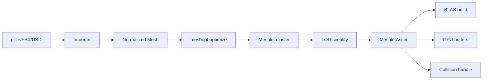
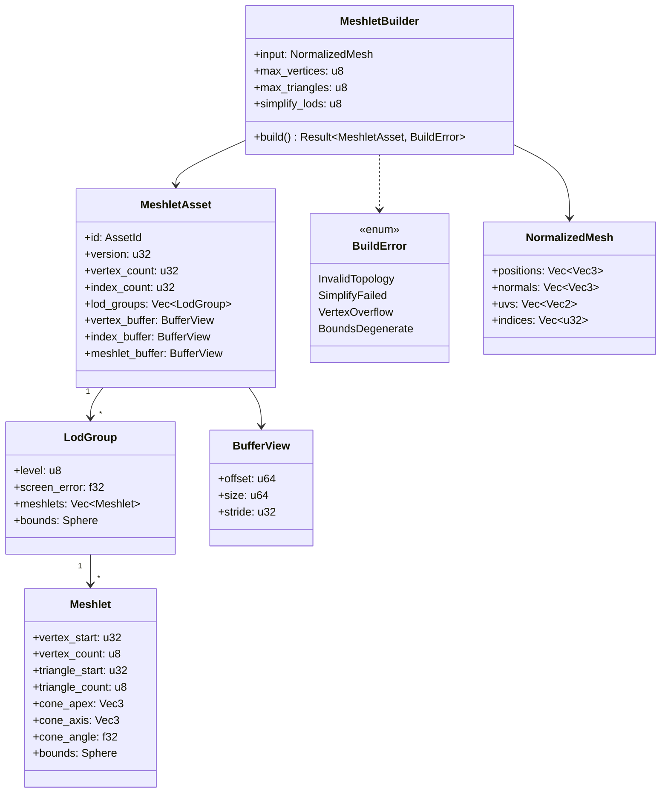
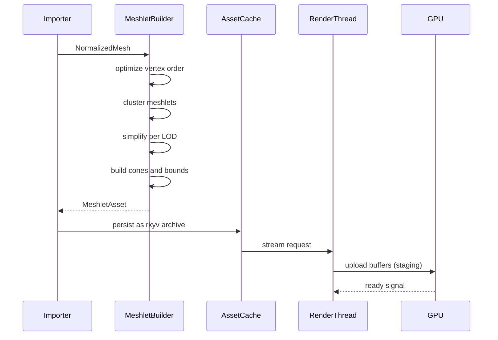
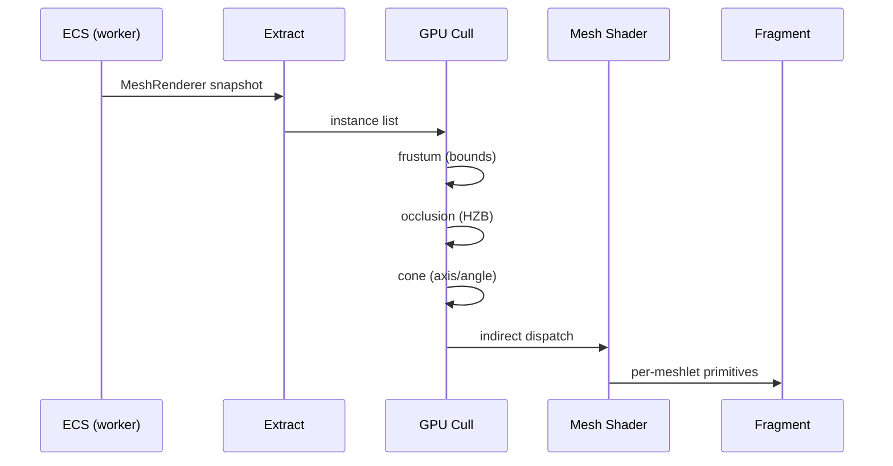

# Meshlet Asset Pipeline Design

## Requirements Trace

> **Canonical sources:** Features, requirements, and user stories live in
> [features/](../../features/), [requirements/](../../requirements/), and
> [user-stories/](../../user-stories/).

### Primary Requirements

| Feature   | Requirement | User Story  | Design Element                  |
|-----------|-------------|-------------|---------------------------------|
| F-2.4.1   | R-2.4.1     | US-2.4.1    | `MeshletAsset` root format      |
| F-2.4.2   | R-2.4.2     | US-2.4.2    | `Meshlet` struct (64/124 cap)   |
| F-2.4.3   | R-2.4.3     | US-2.4.3    | `LodGroup` hierarchy            |
| F-2.4.4   | R-2.4.4     | US-2.4.4    | `MeshletBuilder` (meshopt-style)|
| F-2.4.5   | R-2.4.5     | US-2.4.5    | GPU buffer layout               |
| F-2.4.6   | R-2.4.6     | US-2.4.6    | BLAS build from meshlets (RT)   |
| F-2.4.7   | R-2.4.7     | US-2.4.7    | Collision shape integration     |
| F-2.4.8   | R-2.4.8     | US-2.4.8    | Cone culling (visibility)       |
| F-2.4.9   | R-2.4.9     | US-2.4.9    | Bounds sphere (frustum cull)    |

1. **R-2.4.1** -- `MeshletAsset` is the root format for all imported and procedural meshes
2. **R-2.4.2** -- `Meshlet` holds at most 64 vertices and 124 triangles (mesh shader native)
3. **R-2.4.3** -- `LodGroup` holds a cluster hierarchy with screen-space error per level
4. **R-2.4.4** -- `MeshletBuilder` uses meshopt-style clustering and optimization
5. **R-2.4.5** -- GPU layout: SoA vertex buffer + meshlet header buffer + index stream
6. **R-2.4.6** -- BLAS is built from meshlets using the same vertex/index buffers
7. **R-2.4.7** -- Collision shape integration via `Handle<MeshAsset>` on `Collider`
8. **R-2.4.8** -- Per-meshlet cone apex/axis/angle for back-face cone culling
9. **R-2.4.9** -- Per-meshlet bounds sphere for frustum and occlusion culling

### Cross-Cutting Dependencies

| Dependency         | Source   | Consumed API                   |
|--------------------|----------|--------------------------------|
| Asset pipeline     | F-12.1   | `AssetId`, `Handle<T>`         |
| rkyv serialization | F-1.4.1  | Archive/Deserialize for asset  |
| GPU abstraction    | F-2.3    | `GpuBuffer`, `BufferUsage`     |
| Ray tracing        | F-2.6    | BLAS build inputs              |
| Physics collider   | F-4.1    | Collision mesh reference       |
| Pipeline cache     | F-2.3.9  | Mesh shader PSO                |
| Culling            | F-2.3.7  | HZB visibility                 |

---

## Overview

Every mesh in Harmonius is stored as a `MeshletAsset`: a set of meshlets, a LOD group, and the
vertex/index data they reference. This format is the single input to:

1. **GPU-driven rendering** -- mesh shaders dispatch one workgroup per visible meshlet
2. **Ray tracing** -- BLAS built from the same vertex/index buffers used by rasterization
3. **Physics collision** -- colliders reference `Handle<MeshAsset>` to fetch collision geometry

The pipeline is **import once, use everywhere**. No separate collision mesh, no separate RT mesh.
LOD, culling bounds, and the BLAS all flow from the one canonical `MeshletAsset`.

### Design Principles

1. **Meshlet-first** -- even a single triangle is stored as one meshlet
2. **Zero runtime conversion** -- GPU buffers are mmap'd from the rkyv archive
3. **Deterministic build** -- given identical input, the builder produces identical output
4. **Uniform LOD** -- each LOD level is a complete independent meshlet set
5. **BLAS parity** -- ray-traced geometry equals rasterized geometry
6. **No virtual methods** -- all types are POD

---

## Architecture

### Import Pipeline



### Class Diagram



### GPU Buffer Layout

| Buffer              | Stride    | Element                             |
|---------------------|-----------|-------------------------------------|
| Vertex buffer (SoA) | 32 bytes  | Position (12) + Normal (12) + UV (8) |
| Index buffer        | 1 byte    | Meshlet-local index (u8)            |
| Meshlet buffer      | 64 bytes  | `Meshlet` header (aligned, padded)  |
| Global indirect     | 16 bytes  | Draw call parameters per meshlet    |

The meshlet buffer is a large SSBO that the mesh shader reads. The global indirect buffer drives
`DispatchMeshIndirect`. Both are bindless, indexed by `MeshAssetId`.

---

## API Design

### Core Types

```rust
#[derive(rkyv::Archive, rkyv::Serialize)]
pub struct MeshletAsset {
    pub id: AssetId,
    pub version: u32,
    pub vertex_count: u32,
    pub index_count: u32,
    pub lod_groups: Vec<LodGroup>,
    pub vertex_buffer: BufferView,
    pub index_buffer: BufferView,
    pub meshlet_buffer: BufferView,
    pub source_hash: [u8; 32],
}

#[derive(rkyv::Archive, rkyv::Serialize)]
pub struct LodGroup {
    pub level: u8,
    pub screen_error: f32,
    pub meshlets: Vec<Meshlet>,
    pub bounds: Sphere,
}

#[derive(rkyv::Archive, rkyv::Serialize, Clone, Copy)]
#[repr(C)]
pub struct Meshlet {
    pub vertex_start: u32,
    pub vertex_count: u8,
    pub triangle_start: u32,
    pub triangle_count: u8,
    pub cone_apex: Vec3,
    pub cone_axis: Vec3,
    pub cone_angle: f32,
    pub bounds: Sphere,
}

#[derive(rkyv::Archive, rkyv::Serialize, Clone, Copy)]
pub struct BufferView {
    pub offset: u64,
    pub size: u64,
    pub stride: u32,
}
```

Caps chosen to match D3D12/Vulkan/Metal mesh shader native sizes: 64 vertices and 124 triangles per
meshlet (meshoptimizer default).

### Builder API

```rust
pub struct MeshletBuilder {
    input: NormalizedMesh,
    max_vertices: u8,
    max_triangles: u8,
    simplify_lods: u8,
    cone_weight: f32,
}

impl MeshletBuilder {
    pub fn new(input: NormalizedMesh) -> Self { /* ... */ }
    pub fn max_vertices(mut self, n: u8) -> Self { self.max_vertices = n; self }
    pub fn max_triangles(mut self, n: u8) -> Self { self.max_triangles = n; self }
    pub fn simplify_lods(mut self, n: u8) -> Self { self.simplify_lods = n; self }
    pub fn build(self) -> Result<MeshletAsset, BuildError>;
}

pub enum BuildError {
    InvalidTopology,
    SimplifyFailed { level: u8, reason: &'static str },
    VertexOverflow,
    BoundsDegenerate,
}
```

The builder is a **pure function** `fn(NormalizedMesh) -> Result<MeshletAsset, BuildError>`. It does
not touch the ECS world, GPU, or disk. Tests construct inputs, call `build()`, compare the output to
a golden asset.

### Component Bindings

```rust
#[derive(Component)]
pub struct MeshRenderer {
    pub mesh: Handle<MeshletAsset>,
    pub material: Handle<Material>,
    pub lod_bias: f32,
}

#[derive(Component)]
pub struct Collider {
    pub shape: ColliderShape,
    pub mesh: Option<Handle<MeshletAsset>>,
}
```

A `Collider` with a `MeshletAsset` handle uses LOD 0 (source fidelity) for collision. LOD switching
for rendering does not affect collision.

---

## Data Flow

### Import -> GPU Upload



### Frame Render



---

## Platform Considerations

| Backend       | Mesh Shader | Indirect Dispatch | Bindless |
|---------------|-------------|-------------------|----------|
| D3D12         | yes (SM 6.5)| yes               | yes      |
| Metal 4       | yes         | yes               | yes      |
| Vulkan        | yes (ext)   | yes (EXT_mesh_shader) | yes  |

All three backends share the same meshlet layout. A fallback vertex-shader path exists for legacy
hardware: each meshlet becomes a draw call using indirect indexing. The builder does not change;
only the render path forks.

---

## BLAS / Ray Tracing Integration

BLAS construction reads the exact same `vertex_buffer` and `index_buffer` used by rasterization.
Meshlets as units disappear inside BLAS; the ray tracing API sees contiguous index runs.

```rust
pub fn build_blas(asset: &MeshletAsset, device: &GpuDevice) -> BlasHandle {
    let input = BlasInput {
        vertex_buffer: asset.vertex_buffer,
        vertex_count: asset.vertex_count,
        index_buffer: asset.index_buffer,
        index_count: asset.index_count,
    };
    device.build_blas(input)
}
```

LOD 0 is used for ray tracing (ground truth). Lower LODs would introduce visual mismatches between
reflections and rasterized geometry.

---

## Collision Integration

`Collider::mesh` stores a `Handle<MeshletAsset>`. The physics engine reads LOD 0 vertices and
indices to build its private BVH. It **does not** consume meshlets directly; meshlets are a
rasterization concept. When a mesh hot-reloads, both the GPU buffers and the physics BVH are
invalidated and rebuilt.

---

## Test Plan

See [meshlets-test-cases.md](meshlets-test-cases.md) for TC-2.4.x.y entries covering:

- Unit tests for `MeshletBuilder` (cluster size, LOD counts, cone validity)
- Golden-file comparison of builder output for fixture meshes
- Integration tests for GPU upload, mesh shader draw, BLAS build
- Benchmarks for build time and frame-time cost of cone culling

---

## Open Questions

1. Should meshlet culling use a cluster hierarchy (cone over N meshlets) or per-meshlet cones?
   Per-meshlet is simpler but more GPU overhead; cluster adds a build-time step.
2. Do we allow per-meshlet materials (material ID in the meshlet header), or is material a per-mesh
   uniform?
3. When a mesh changes LOD count after hot-reload, how are existing render instances migrated?
4. Should BLAS use a lower LOD to save memory on mobile?
