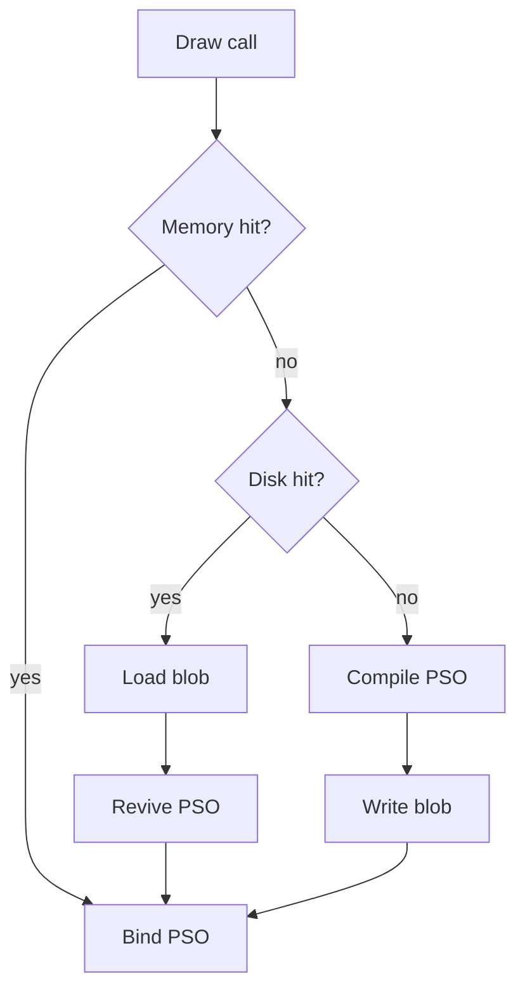
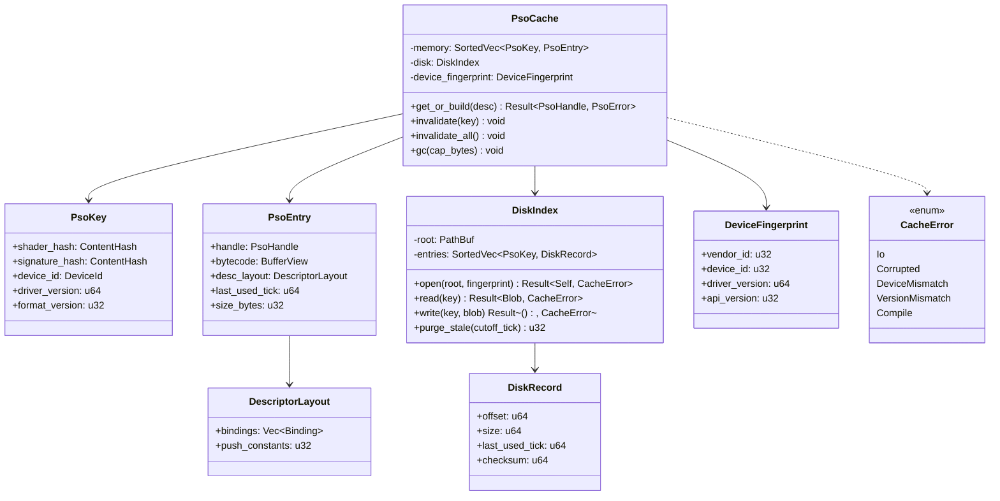
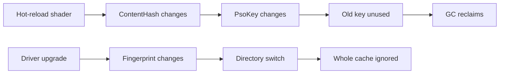
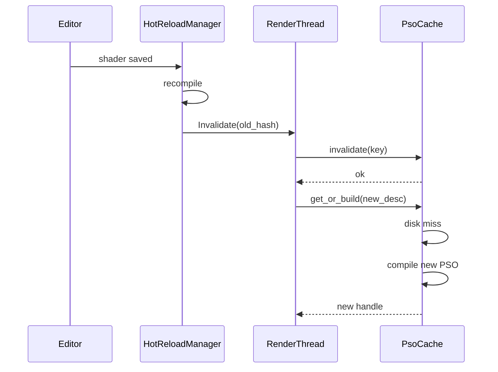

# Pipeline State Object Cache Design

## Requirements Trace

> **Canonical sources:** Features, requirements, and user stories live in
> [features/](../../features/), [requirements/](../../requirements/), and
> [user-stories/](../../user-stories/).

### Primary Requirements

| Feature   | Requirement | User Story  | Design Element                  |
|-----------|-------------|-------------|---------------------------------|
| F-2.3.9.1 | R-2.3.9.1   | US-2.3.9.1  | `PsoCache` resident structure   |
| F-2.3.9.2 | R-2.3.9.2   | US-2.3.9.2  | `PsoKey` (content-addressed)    |
| F-2.3.9.3 | R-2.3.9.3   | US-2.3.9.3  | Disk layout + versioning        |
| F-2.3.9.4 | R-2.3.9.4   | US-2.3.9.4  | Invalidation rules              |
| F-2.3.9.5 | R-2.3.9.5   | US-2.3.9.5  | Garbage collection              |
| F-2.3.9.6 | R-2.3.9.6   | US-2.3.9.6  | Corruption recovery             |
| F-2.3.9.7 | R-2.3.9.7   | US-2.3.9.7  | Hot-reload integration          |
| F-2.3.9.8 | R-2.3.9.8   | US-2.3.9.8  | Descriptor layout inference     |

1. **R-2.3.9.1** -- Memory-resident PSO cache keyed by `PsoKey`; lookup O(log n)
2. **R-2.3.9.2** -- `PsoKey` = hash(device id, driver version, shader variant)
3. **R-2.3.9.3** -- Disk layout versioned by `CacheFormatVersion` + device fingerprint directory
4. **R-2.3.9.4** -- Automatic invalidation on device change, driver upgrade, shader recompile
5. **R-2.3.9.5** -- LRU GC with configurable on-disk cap (default 512 MiB)
6. **R-2.3.9.6** -- Corrupted entries are isolated; cache reopens clean
7. **R-2.3.9.7** -- Hot-reload sends `Invalidate(PsoKey)` to the render thread
8. **R-2.3.9.8** -- Descriptor layout is inferred from DXIL / SPIR-V reflection once, cached

### Cross-Cutting Dependencies

| Dependency            | Source   | Consumed API                     |
|-----------------------|----------|----------------------------------|
| Render thread         | F-2.3.1  | Render thread command queue      |
| Asset system          | F-12.1   | Shader bytecode stream           |
| Hot-reload protocol   | F-1.12   | `ReloadRequest` / `ReloadResult` |
| Platform I/O (main)   | F-14.1.4 | `IoRequest` for disk read/write  |
| Shader variants       | F-2.3.10 | `PermutationKey`                 |
| Content hashes        | F-12.1.2 | `ContentHash`                    |

---

## Overview

Pipeline state objects (PSOs) are expensive to build (50-500 ms each on first compile). A
**PSO cache** stores built PSOs keyed by `PsoKey`: a content hash over the shader bytecode, root
signature, vertex layout, render state, and device identity. The cache exists in two tiers:

1. **Memory cache** -- resident PSOs ready to bind this frame
2. **Disk cache** -- versioned per-device directory of serialized PSO blobs

At startup the memory cache is empty; lookups that miss the memory cache but hit disk read the blob,
revive the PSO on the render thread, and insert into memory. Cold-start cache misses trigger a full
compile.

### Design Principles

1. **Content-addressed** -- the key is a hash, never a name or index
2. **Per-device isolation** -- different GPUs get different disk directories
3. **Zero global state** -- the cache is owned by the render thread
4. **Fail safe** -- corruption triggers a clean wipe, never a crash
5. **No HashMap on hot path** -- sorted `Vec<(PsoKey, PsoHandle)>` for lookup
6. **Hot-reload aware** -- invalidation is cheap and immediate

---

## Architecture

### Cache Hierarchy



### Class Diagram



### Disk Layout

```text
$CACHE/
  v3/                               (CacheFormatVersion)
    vendor_8086_dev_0412_drv_31_0_0/  (DeviceFingerprint)
      index.rkyv                    (SortedVec<PsoKey, DiskRecord>, mmap'd)
      blobs.bin                     (concatenated PSO blobs, append-only)
      tmp-<pid>/                    (scratch for atomic writes)
```

| File         | Purpose                                                     |
|--------------|-------------------------------------------------------------|
| `index.rkyv` | Sorted index; rewritten atomically on commit                |
| `blobs.bin`  | Append-only blob store; compacted on GC                     |
| `tmp-<pid>`  | Scratch for in-progress writes; cleaned on clean shutdown   |

Concurrent editor and game processes use different cache roots (editor writes to `$CACHE/editor/`,
game to `$CACHE/game/`). The fingerprint directory prevents cross-device corruption.

---

## API Design

### Core Types

```rust
#[derive(Clone, Copy, PartialEq, Eq, PartialOrd, Ord, Hash)]
pub struct PsoKey {
    pub shader_hash: ContentHash,
    pub signature_hash: ContentHash,
    pub device_id: DeviceId,
    pub driver_version: u64,
    pub format_version: u32,
}

pub struct PsoEntry {
    pub handle: PsoHandle,
    pub bytecode: BufferView,
    pub desc_layout: DescriptorLayout,
    pub last_used_tick: u64,
    pub size_bytes: u32,
}

pub struct PsoCache {
    memory: SortedVecMap<PsoKey, PsoEntry>,
    disk: DiskIndex,
    device_fingerprint: DeviceFingerprint,
    memory_cap_bytes: u64,
    disk_cap_bytes: u64,
}

impl PsoCache {
    pub fn new(root: &Path, device: &GpuDevice) -> Result<Self, CacheError>;

    pub fn get_or_build(
        &mut self,
        desc: &PipelineDesc,
        compiler: &mut PsoCompiler,
    ) -> Result<PsoHandle, PsoError>;

    pub fn invalidate(&mut self, key: PsoKey);
    pub fn invalidate_all(&mut self);

    pub fn gc(&mut self, memory_cap: u64, disk_cap: u64);
}
```

### Lookup Path

```rust
impl PsoCache {
    pub fn get_or_build(
        &mut self,
        desc: &PipelineDesc,
        compiler: &mut PsoCompiler,
    ) -> Result<PsoHandle, PsoError> {
        let key = self.make_key(desc);

        if let Some(entry) = self.memory.get_mut(&key) {
            entry.last_used_tick = self.current_tick();
            return Ok(entry.handle);
        }

        if let Ok(blob) = self.disk.read(key) {
            let entry = compiler.revive(&blob, desc)?;
            self.memory.insert(key, entry);
            return Ok(entry.handle);
        }

        let entry = compiler.compile(desc)?;
        let blob = compiler.serialize(&entry);
        self.disk.write(key, &blob)?;
        self.memory.insert(key, entry);
        Ok(entry.handle)
    }
}
```

### Descriptor Layout Inference

When a new shader compiles, the cache calls the backend reflection API once to build a
`DescriptorLayout` and stores it alongside the PSO blob.

```rust
pub fn infer_descriptor_layout(
    bytecode: &[u8],
    api: ShaderApi,
) -> Result<DescriptorLayout, CacheError> {
    match api {
        ShaderApi::Dxil => reflect_dxil(bytecode),
        ShaderApi::Spirv => reflect_spirv(bytecode),
        ShaderApi::Metal => reflect_metal_lib(bytecode),
    }
}
```

---

## Data Flow

### Invalidation Scenarios



### Invalidation Rules

| Trigger                      | Scope                  | Action                    |
|------------------------------|------------------------|---------------------------|
| Shader bytecode hash changes | `PsoKey` differs       | Old key dropped, new built|
| Driver version upgrade       | Fingerprint differs    | New directory, old ignored|
| Device change                | Fingerprint differs    | New directory, old ignored|
| Cache format bump            | Version differs        | Old directory ignored     |
| Manual `invalidate_all`      | Everything             | Memory cleared, disk kept |

---

## Corruption Recovery

On open, the cache validates:

1. **Header magic** -- `HMNS_PSO` + `CacheFormatVersion`
2. **Index checksum** -- CRC32 over the rkyv index blob
3. **Per-entry checksum** -- CRC32 over each blob on read

Any failure isolates the offending blob by recording it in a `tombstone` list and skipping it on
future lookups. If the header or index itself is corrupted, the entire directory is deleted and
recreated. This never produces a hard failure; worst case, the runtime pays the recompile cost.

---

## Hot-Reload Integration

The hot-reload protocol ([core-runtime/hot-reload-protocol] conceptual) emits a
`ReloadRequest::Shader { old_hash, new_hash }` to the render thread. The render thread calls
`cache.invalidate(key_for(old_hash))` and proceeds to draw with the new hash, forcing a fresh
compile or disk lookup.



---

## Garbage Collection

GC runs lazily when the cache grows past `disk_cap_bytes`. It:

1. Sorts entries by `last_used_tick` ascending
2. Drops the oldest until the cap is met
3. Compacts `blobs.bin` by copying remaining entries to a new file
4. Atomically renames the new file over the old

Memory GC runs every 120 frames, trimming entries not used in the last 600 frames.

---

## Platform Considerations

| Backend | PSO Blob Format         | Serialization API              |
|---------|-------------------------|--------------------------------|
| D3D12   | `ID3D12PipelineLibrary` | `GetSerializedSize` / `Load`   |
| Metal 4 | `MTLBinaryArchive`      | `serializeToURL` / `fromURL`   |
| Vulkan  | `VK_PIPELINE_CACHE`     | `vkGetPipelineCacheData`       |

Each backend exposes a blob API. The Harmonius cache wraps that blob in our own header + key
metadata and stores it in `blobs.bin`.

---

## Test Plan

See [pipeline-state-cache-test-cases.md](pipeline-state-cache-test-cases.md) for TC-2.3.9.x.y
entries covering:

- Key construction determinism
- Memory and disk lookup correctness
- Invalidation on all trigger types
- Corruption recovery
- GC under memory pressure
- Cross-process cache sharing isolation
- Benchmarks for hit/miss latency

---

## Open Questions

1. Should editor and game share a cache directory? Shared saves disk but increases risk of stale
   blobs.
2. Do we expose per-key stats (last hit, total hits) to the profiler?
3. How does the cache interact with Vulkan `VK_EXT_pipeline_creation_feedback` for GPU-side timing?
4. Should PSO revival on a worker thread be allowed, or is it render-thread only?
