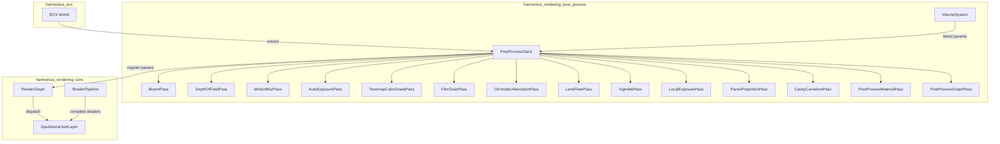
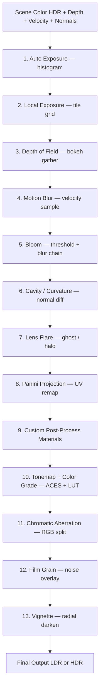
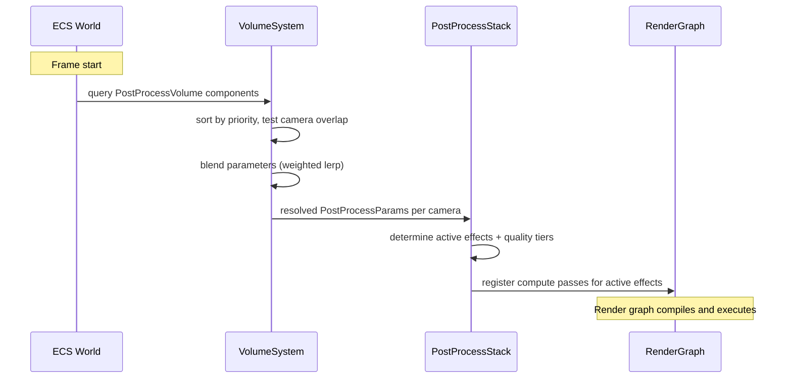
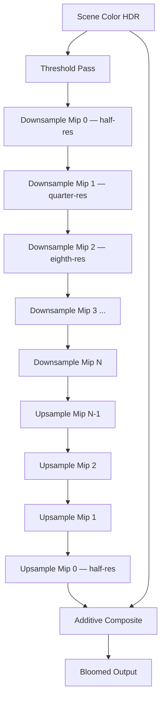
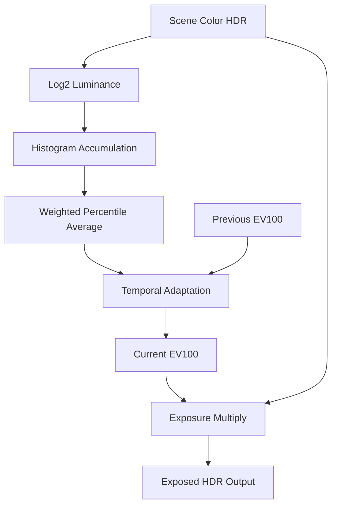
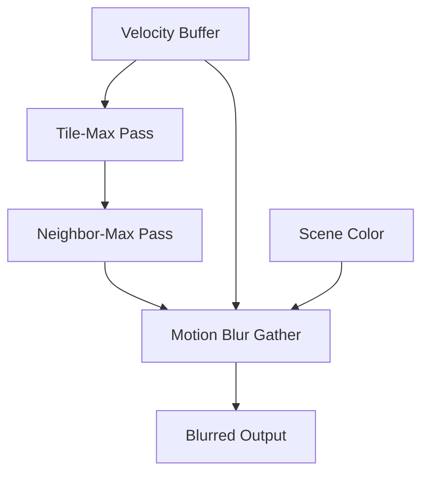
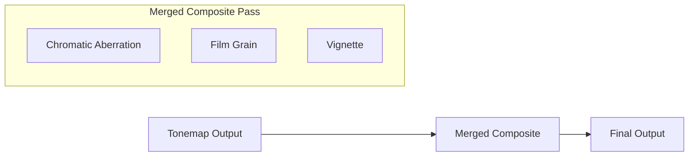

# Post-Processing Design

## Requirements Trace

> **Canonical sources:** Features, requirements, and user stories are defined in
> [features/rendering/](../../features/rendering/),
> [requirements/rendering/](../../requirements/rendering/), and
> [user-stories/rendering/](../../user-stories/rendering/). The table below traces design elements
> to those definitions.

| Feature | Requirement | Description |
|---------|-------------|-------------|
| F-2.9.1 | R-2.9.1 | Bloom with threshold, multi-pass downsample/upsample blur chain |
| F-2.9.2 | R-2.9.2 | Cinematic DOF with gather-based circular bokeh, CoC |
| F-2.9.3 | R-2.9.3 | Per-pixel velocity motion blur (camera + per-object) |
| F-2.9.4 | R-2.9.4 | Histogram-based auto exposure with temporal smoothing |
| F-2.9.5 | R-2.9.5 | Tonemapping (ACES, filmic, custom) and LUT color grading |
| F-2.9.6 | R-2.9.6 | Procedural/texture film grain with luminance response |
| F-2.9.7 | R-2.9.7 | Radial chromatic aberration with per-channel UV offsets |
| F-2.9.8 | R-2.9.8 | Image-based lens flare with ghost/halo generation |
| F-2.9.9 | R-2.9.9 | Radial vignette with power curve falloff |
| F-2.9.10 | R-2.9.10 | User-defined post-process material passes |
| F-2.9.11 | R-2.9.11 | Per-tile local exposure from luminance grid |
| F-2.9.12 | R-2.9.12 | Panini projection for wide-FOV correction |
| F-2.9.13 | R-2.9.13 | Screen-space cavity and curvature from normals |
| F-2.9.14 | R-2.9.14 | Visual node-based post-process graph editor |

### Non-Functional Requirements

| NFR | Target | Description |
|-----|--------|-------------|
| NFR-2.9.1 | < 3.0 ms | Full pipeline budget at 1080p |
| NFR-2.9.2 | < 1.0 ms | Max single effect; lightweight < 0.1 ms |
| NFR-2.9.3 | HDR10 | PQ EOTF, BT.2020, up to 10,000 nits |

## Overview

The post-processing subsystem applies a configurable chain of full-screen image effects after scene
rendering and before final output. Every effect is an ECS component attached to a camera or
post-process volume entity. A `PostProcessStack` system extracts active effect components each
frame, resolves volume blending, and registers compute shader passes into the render graph.

Key design principles:

1. **100% ECS-based.** All effect parameters are components. All logic runs as systems. No separate
   post-process world.
2. **Compute-only pipeline.** Every effect is an HLSL compute shader dispatched through the render
   graph. No rasterized full-screen triangles.
3. **Volume blending.** Overlapping post-process volumes blend parameters by priority and weight,
   producing a single resolved parameter set per camera per frame.
4. **Platform-adaptive quality.** Each effect declares quality tiers. The render graph's budget
   culling prunes effects or reduces quality when the frame budget is exceeded.
5. **Static dispatch.** The `PostProcessPass` trait uses associated types and generics. No vtables.

## Architecture

### Module Boundaries



### File Layout

```text
harmonius_rendering/
├── post_process/
│   ├── mod.rs            # PostProcessStack system,
│   │                     # pass ordering, extraction
│   ├── pass.rs           # PostProcessPass trait,
│   │                     # PassContext, PassResources
│   ├── volume.rs         # VolumeSystem, blending,
│   │                     # priority resolution
│   ├── quality.rs        # QualityTier, platform
│   │                     # tier detection
│   ├── bloom.rs          # BloomPass, threshold,
│   │                     # downsample/upsample chain
│   ├── dof.rs            # DepthOfFieldPass, CoC,
│   │                     # gather bokeh filter
│   ├── motion_blur.rs    # MotionBlurPass, tile-max,
│   │                     # velocity sampling
│   ├── auto_exposure.rs  # AutoExposurePass, histogram,
│   │                     # temporal smoothing
│   ├── tonemap.rs        # TonemapColorGradePass, ACES,
│   │                     # LUT, lift/gamma/gain
│   ├── film_grain.rs     # FilmGrainPass, procedural
│   │                     # noise generation
│   ├── chromatic.rs      # ChromaticAberrationPass,
│   │                     # radial UV offsets
│   ├── lens_flare.rs     # LensFlarePass, ghost/halo
│   │                     # artifact generation
│   ├── vignette.rs       # VignettePass, power curve
│   │                     # radial darkening
│   ├── local_exposure.rs # LocalExposurePass, tile
│   │                     # luminance grid
│   ├── panini.rs         # PaniniProjectionPass, UV
│   │                     # remap for wide FOV
│   ├── cavity.rs         # CavityCurvaturePass,
│   │                     # normal-difference sampling
│   ├── material.rs       # PostProcessMaterialPass,
│   │                     # user-defined shaders
│   └── graph.rs          # PostProcessGraphPass,
│                         # node graph compiler
├── shaders/
│   └── post_process/
│       ├── bloom_threshold.hlsl
│       ├── bloom_downsample.hlsl
│       ├── bloom_upsample.hlsl
│       ├── dof_coc.hlsl
│       ├── dof_bokeh_gather.hlsl
│       ├── dof_composite.hlsl
│       ├── motion_blur_tile_max.hlsl
│       ├── motion_blur_gather.hlsl
│       ├── auto_exposure_histogram.hlsl
│       ├── auto_exposure_average.hlsl
│       ├── tonemap_color_grade.hlsl
│       ├── film_grain.hlsl
│       ├── chromatic_aberration.hlsl
│       ├── lens_flare_threshold.hlsl
│       ├── lens_flare_ghosts.hlsl
│       ├── vignette.hlsl
│       ├── local_exposure_downsample.hlsl
│       ├── local_exposure_apply.hlsl
│       ├── panini_projection.hlsl
│       ├── cavity_curvature.hlsl
│       └── cavity_blur.hlsl
```

### Pipeline Execution Order

The post-processing stack executes effects in a fixed logical order. Each effect reads from the
previous effect's output (or the original scene buffer if it is the first). Effects that are
disabled or budget-culled are skipped; the pipeline chains around them automatically.



Effects 1-9 operate in HDR linear space. Effect 10 (tonemap) converts to display space. Effects
11-13 operate in display space (LDR or HDR output).

### UI Rendering Order

UI renders after tonemapping but before film grain, vignette, and chromatic aberration. This ensures
UI elements appear in display-space colors (not HDR) while film effects overlay the entire frame
including UI. The render graph enforces this ordering via pass dependencies.

### Volume Blending



### Class Diagram

```mermaid
classDiagram
    class PostProcessPass {
        <<trait>>
        +Params: Component + Default + Reflect
        +NAME: &str
        +ORDER: u32
        +HDR: bool
        +register_passes(ctx, params, quality)
        +is_active(params) bool
    }

    class PostProcessStack {
        -passes Vec~PassRegistration~
        -temporal_state HashMap~Entity TemporalState~
        +run(cameras, volumes, graph, quality)
    }

    class TemporalState {
        +exposure_ev f32
        +prev_histogram [u32; 128]
        +prev_tile_exposure Vec~f32~
    }

    class VolumeSystem {
        +resolve(camera_pos, volumes, fallback) P
        -compute_weight(camera_pos, volume, shape, transform) f32
    }

    class PassContext {
        +graph &mut RenderGraphBuilder
        +color TransientHandle
        +depth TransientHandle
        +velocity TransientHandle
        +normals TransientHandle
        +exposure TransientHandle
        +histogram TransientHandle
        +viewport Viewport
        +frame_index u32
        +delta_time f32
    }

    class Viewport {
        +width u32
        +height u32
        +render_scale f32
    }

    class QualityTier {
        <<enum>>
        Mobile
        Switch
        Desktop
        HighEnd
    }

    class PostProcessVolume {
        +priority i32
        +weight f32
        +is_global bool
        +blend_distance f32
    }

    class VolumeShape {
        <<enum>>
        Global
        Box
        Sphere
    }

    class Bloom {
        +enabled bool
        +threshold f32
        +soft_knee f32
        +intensity f32
        +iteration_count u8
        +tint Vec3
        +iteration_weights SmallVec~f32~
        +blur_method BloomBlurMethod
    }

    class BloomBlurMethod {
        <<enum>>
        DualKawase
        Gaussian
    }

    class DepthOfField {
        +enabled bool
        +focus_distance f32
        +aperture f32
        +focal_length f32
        +max_blur_radius f32
        +sample_count u8
        +bokeh_shape BokehShape
        +near_field bool
        +fallback DofFallback
    }

    class BokehShape {
        <<enum>>
        Circle
        Hexagon
        Octagon
    }

    class DofFallback {
        <<enum>>
        Full
        SeparableGaussian
        LightweightGaussian
        Disabled
    }

    class MotionBlur {
        +enabled bool
        +shutter_angle f32
        +sample_count u8
        +max_blur_pixels f32
        +per_object bool
        +tile_max bool
        +tile_size u8
    }

    class AutoExposure {
        +enabled bool
        +min_ev f32
        +max_ev f32
        +compensation f32
        +speed_up f32
        +speed_down f32
        +histogram_bins u8
        +low_percentile f32
        +high_percentile f32
        +metering MeteringMode
    }

    class MeteringMode {
        <<enum>>
        Average
        CenterWeighted
        Spot
    }

    class TonemapColorGrade {
        +enabled bool
        +tonemapper Tonemapper
        +white_balance f32
        +white_balance_tint f32
        +shadows ColorWheelAdjust
        +midtones ColorWheelAdjust
        +highlights ColorWheelAdjust
        +saturation f32
        +contrast f32
        +color_lut Option~AssetHandle~
        +lut_contribution f32
        +hdr_output HdrOutputMode
    }

    class Tonemapper {
        <<enum>>
        AcesFilmic
        NeutralFilmic
        Reinhard
        AgX
        Custom
    }

    class ColorWheelAdjust {
        +color Vec3
        +intensity f32
    }

    class HdrOutputMode {
        <<enum>>
        Sdr
        Hdr10
        DolbyVision
    }

    class FilmGrain {
        +enabled bool
        +intensity f32
        +size f32
        +luminance_response f32
        +method GrainMethod
    }

    class GrainMethod {
        <<enum>>
        Procedural
        Texture
    }

    class ChromaticAberration {
        +enabled bool
        +intensity f32
        +start f32
        +sample_count u8
    }

    class LensFlare {
        +enabled bool
        +threshold f32
        +ghost_count u8
        +ghost_spacing f32
        +ghost_falloff f32
        +halo_radius f32
        +halo_intensity f32
        +intensity f32
        +chromatic_distortion f32
    }

    class Vignette {
        +enabled bool
        +intensity f32
        +power f32
        +center Vec2
        +color Vec3
    }

    class LocalExposure {
        +enabled bool
        +tile_count u8
        +max_compensation f32
        +smooth_blend bool
        +temporal_smoothing f32
    }

    class PaniniProjection {
        +enabled bool
        +distance f32
        +crop f32
    }

    class CavityCurvature {
        +enabled bool
        +curvature_enabled bool
        +curvature_radius f32
        +curvature_samples u8
        +cavity_enabled bool
        +cavity_radius f32
        +cavity_samples u8
        +cavity_blur_passes u8
        +ridge_intensity f32
        +valley_intensity f32
        +fade_start f32
        +fade_end f32
    }

    class PostProcessMaterial {
        +enabled bool
        +shader AssetHandle
        +insertion InsertionPoint
        +priority i32
        +inputs PostProcessInputs
    }

    class InsertionPoint {
        <<enum>>
        BeforeTonemap
        AfterTonemap
        Custom
    }

    class PostProcessInputs {
        +scene_color bool
        +scene_depth bool
        +scene_normals bool
        +velocity bool
        +stencil bool
    }

    PostProcessStack --> TemporalState
    PostProcessStack --> PostProcessPass
    PostProcessStack --> VolumeSystem
    PostProcessStack --> QualityTier
    PostProcessPass --> PassContext
    PassContext --> Viewport
    VolumeSystem --> PostProcessVolume
    PostProcessVolume --> VolumeShape
    Bloom --> BloomBlurMethod
    DepthOfField --> BokehShape
    DepthOfField --> DofFallback
    AutoExposure --> MeteringMode
    TonemapColorGrade --> Tonemapper
    TonemapColorGrade --> ColorWheelAdjust
    TonemapColorGrade --> HdrOutputMode
    FilmGrain --> GrainMethod
    PostProcessMaterial --> InsertionPoint
    PostProcessMaterial --> PostProcessInputs
    Bloom ..|> PostProcessPass : implements
    DepthOfField ..|> PostProcessPass : implements
    MotionBlur ..|> PostProcessPass : implements
    AutoExposure ..|> PostProcessPass : implements
    TonemapColorGrade ..|> PostProcessPass : implements
    FilmGrain ..|> PostProcessPass : implements
    ChromaticAberration ..|> PostProcessPass : implements
    LensFlare ..|> PostProcessPass : implements
    Vignette ..|> PostProcessPass : implements
    LocalExposure ..|> PostProcessPass : implements
    PaniniProjection ..|> PostProcessPass : implements
    CavityCurvature ..|> PostProcessPass : implements
    PostProcessMaterial ..|> PostProcessPass : implements
```



## API Design

### Quality Tiers

```rust
/// Platform quality tier for adaptive scaling.
#[derive(
    Clone, Copy, Debug, PartialEq, Eq, Hash,
)]
pub enum QualityTier {
    /// Mobile (phones, tablets). Minimal effects,
    /// quarter/half-res, combined composite.
    Mobile,
    /// Switch/handheld. Reduced sample counts,
    /// half-res intermediates.
    Switch,
    /// Desktop GPU. Full quality effects at
    /// native resolution.
    Desktop,
    /// High-end GPU. Maximum sample counts,
    /// full-res intermediates, all optional
    /// effects enabled.
    HighEnd,
}
```

**Note:** `QualityTier` will be replaced by the engine-wide `PlatformTier` enum (Mobile, Switch,
Desktop, HighEnd) defined in [shared-primitives.md](../core-runtime/shared-primitives.md) during
implementation.

### Post-Process Pass Trait

```rust
/// Trait implemented by every post-processing
/// effect. Static dispatch via generics — no
/// vtable overhead.
pub trait PostProcessPass {
    /// The ECS component type holding this
    /// effect's parameters.
    type Params: Component + Default + Reflect;

    /// Human-readable name for diagnostics.
    const NAME: &'static str;

    /// Default execution order in the pipeline.
    /// Lower values execute first.
    const ORDER: u32;

    /// Whether this effect operates in HDR
    /// linear space (true) or display space
    /// (false, i.e., after tonemapping).
    const HDR: bool;

    /// Register compute passes into the render
    /// graph. Called once per camera per frame
    /// for active effects.
    fn register_passes(
        &self,
        ctx: &mut PassContext,
        params: &Self::Params,
        quality: QualityTier,
    );

    /// Returns true if the effect should be
    /// active given the current parameters.
    fn is_active(params: &Self::Params) -> bool;
}
```

### Pass Context

```rust
/// Context provided to each post-process pass
/// during render graph registration.
pub struct PassContext<'a> {
    /// Render graph builder for registering
    /// compute dispatches.
    pub graph: &'a mut RenderGraphBuilder,
    /// Handle to the current color buffer
    /// (ping-pong between two transient
    /// textures).
    pub color: TransientHandle,
    /// Scene depth buffer (read-only).
    pub depth: TransientHandle,
    /// Velocity buffer (read-only).
    pub velocity: TransientHandle,
    /// G-buffer normals (read-only).
    pub normals: TransientHandle,
    /// Previous frame exposure value.
    pub exposure: TransientHandle,
    /// Luminance histogram buffer.
    pub histogram: TransientHandle,
    /// Viewport dimensions.
    pub viewport: Viewport,
    /// Frame index for temporal effects.
    pub frame_index: u32,
    /// Delta time for temporal smoothing.
    pub delta_time: f32,
}

/// Viewport dimensions and scaling factors.
pub struct Viewport {
    pub width: u32,
    pub height: u32,
    pub render_scale: f32,
}
```

### Post-Process Volume (ECS Components)

```rust
/// Marker component for a post-process volume
/// entity. Attached alongside a Transform and
/// a shape component (box, sphere, or global).
#[derive(Component, Reflect, Default)]
pub struct PostProcessVolume {
    /// Blend priority. Higher overrides lower.
    pub priority: i32,
    /// Blend weight [0.0, 1.0].
    pub weight: f32,
    /// If true, affects all cameras regardless
    /// of position. Ignores shape bounds.
    pub is_global: bool,
    /// Fade distance from volume boundary in
    /// world units. Linearly interpolates weight
    /// from boundary inward.
    pub blend_distance: f32,
}

/// Shape of the volume's influence region.
#[derive(Component, Reflect)]
pub enum VolumeShape {
    /// Infinite — affects the entire scene.
    Global,
    /// Axis-aligned box defined by half-extents.
    Box { half_extents: Vec3 },
    /// Sphere defined by radius.
    Sphere { radius: f32 },
}
```

### Bloom Parameters

```rust
/// Bloom effect parameters. Attach to a camera
/// entity or post-process volume entity.
#[derive(Component, Reflect)]
pub struct Bloom {
    /// Enable/disable the bloom effect.
    pub enabled: bool,
    /// Luminance threshold for bright-pixel
    /// extraction. Pixels below this value
    /// do not contribute to bloom.
    pub threshold: f32,
    /// Soft knee width around the threshold.
    /// Smooths the transition between bloomed
    /// and non-bloomed pixels.
    pub soft_knee: f32,
    /// Overall bloom intensity multiplier.
    pub intensity: f32,
    /// Number of blur iterations in the
    /// downsample/upsample chain. More
    /// iterations produce wider bloom.
    pub iteration_count: u8,
    /// Tint color applied to the bloom.
    pub tint: Vec3,
    /// Per-iteration weight multiplier. Length
    /// must match iteration_count. Allows
    /// artistic control over bloom falloff.
    pub iteration_weights: SmallVec<[f32; 8]>,
    /// Blur method selection.
    pub blur_method: BloomBlurMethod,
}

/// Bloom blur algorithm.
#[derive(Clone, Copy, Debug, PartialEq, Eq, Reflect)]
pub enum BloomBlurMethod {
    /// Dual-kawase blur. Fast, fewer samples.
    /// Preferred on mobile/Switch.
    DualKawase,
    /// Gaussian blur. Higher quality, more
    /// samples. Preferred on desktop/high-end.
    Gaussian,
}

impl Default for Bloom {
    fn default() -> Self {
        Self {
            enabled: true,
            threshold: 1.0,
            soft_knee: 0.5,
            intensity: 0.5,
            iteration_count: 6,
            tint: Vec3::ONE,
            iteration_weights: SmallVec::from_slice(
                &[1.0; 6],
            ),
            blur_method: BloomBlurMethod::DualKawase,
        }
    }
}
```

### Depth of Field Parameters

```rust
/// Cinematic depth of field parameters driven
/// by real-world camera optics.
#[derive(Component, Reflect)]
pub struct DepthOfField {
    pub enabled: bool,
    /// Focus distance in world units (meters).
    pub focus_distance: f32,
    /// Aperture (f-stop). Lower values produce
    /// shallower depth of field.
    pub aperture: f32,
    /// Focal length in millimeters.
    pub focal_length: f32,
    /// Maximum blur radius in pixels. Clamps
    /// bokeh size for performance.
    pub max_blur_radius: f32,
    /// Number of bokeh sample points on the
    /// gather kernel ring.
    pub sample_count: u8,
    /// Bokeh shape configuration.
    pub bokeh_shape: BokehShape,
    /// Near field blur enable. When false, only
    /// background blur is applied.
    pub near_field: bool,
    /// Quality fallback for lower tiers.
    pub fallback: DofFallback,
}

/// Bokeh shape for the gather kernel.
#[derive(Clone, Copy, Debug, PartialEq, Eq, Reflect)]
pub enum BokehShape {
    /// Circular bokeh (uniform disc).
    Circle,
    /// Hexagonal bokeh (6-blade aperture).
    Hexagon,
    /// Octagonal bokeh (8-blade aperture).
    Octagon,
}

/// DOF fallback strategy on lower platforms.
#[derive(Clone, Copy, Debug, PartialEq, Eq, Reflect)]
pub enum DofFallback {
    /// Full gather-based circular bokeh.
    Full,
    /// Separable Gaussian (Switch tier).
    SeparableGaussian,
    /// Lightweight quarter-res Gaussian (mobile).
    LightweightGaussian,
    /// Disabled entirely.
    Disabled,
}

impl Default for DepthOfField {
    fn default() -> Self {
        Self {
            enabled: false,
            focus_distance: 10.0,
            aperture: 2.8,
            focal_length: 50.0,
            max_blur_radius: 16.0,
            sample_count: 48,
            bokeh_shape: BokehShape::Circle,
            near_field: true,
            fallback: DofFallback::Full,
        }
    }
}
```

### Motion Blur Parameters

```rust
/// Per-pixel velocity-based motion blur.
#[derive(Component, Reflect)]
pub struct MotionBlur {
    pub enabled: bool,
    /// Shutter angle in degrees [0, 360].
    /// 180 = half-frame exposure (cinematic).
    pub shutter_angle: f32,
    /// Number of samples along the velocity
    /// vector per pixel.
    pub sample_count: u8,
    /// Maximum blur length in pixels. Clamps
    /// blur for very fast motion.
    pub max_blur_pixels: f32,
    /// Enable per-object motion contribution.
    /// When false, only camera motion is used.
    pub per_object: bool,
    /// Enable tile-max optimization. Reduces
    /// cost by computing per-tile max velocity
    /// and skipping tiles with negligible motion.
    pub tile_max: bool,
    /// Tile size for tile-max pass (pixels).
    pub tile_size: u8,
}

impl Default for MotionBlur {
    fn default() -> Self {
        Self {
            enabled: false,
            shutter_angle: 180.0,
            sample_count: 8,
            max_blur_pixels: 32.0,
            per_object: true,
            tile_max: true,
            tile_size: 16,
        }
    }
}
```

### Auto Exposure Parameters

```rust
/// Histogram-based auto exposure with temporal
/// smoothing.
#[derive(Component, Reflect)]
pub struct AutoExposure {
    pub enabled: bool,
    /// Minimum exposure value (EV100).
    pub min_ev: f32,
    /// Maximum exposure value (EV100).
    pub max_ev: f32,
    /// Exposure compensation bias (EV).
    pub compensation: f32,
    /// Speed of adaptation when brightening
    /// (dark-to-light), in EV per second.
    pub speed_up: f32,
    /// Speed of adaptation when darkening
    /// (light-to-dark), in EV per second.
    pub speed_down: f32,
    /// Histogram bin count. Higher = more
    /// precise luminance distribution.
    pub histogram_bins: u8,
    /// Low percentile cutoff for histogram
    /// averaging. Ignores darkest N%.
    pub low_percentile: f32,
    /// High percentile cutoff for histogram
    /// averaging. Ignores brightest N%.
    pub high_percentile: f32,
    /// Metering mode.
    pub metering: MeteringMode,
}

/// Exposure metering mode.
#[derive(Clone, Copy, Debug, PartialEq, Eq, Reflect)]
pub enum MeteringMode {
    /// Average luminance across entire frame.
    Average,
    /// Center-weighted average. Emphasizes the
    /// center 50% of the frame.
    CenterWeighted,
    /// Spot metering. Samples a small region
    /// at screen center.
    Spot,
}

impl Default for AutoExposure {
    fn default() -> Self {
        Self {
            enabled: true,
            min_ev: -4.0,
            max_ev: 16.0,
            compensation: 0.0,
            speed_up: 3.0,
            speed_down: 1.0,
            histogram_bins: 64,
            low_percentile: 10.0,
            high_percentile: 90.0,
            metering: MeteringMode::CenterWeighted,
        }
    }
}
```

### Tonemapping and Color Grading Parameters

```rust
/// Combined tonemapping and color grading.
#[derive(Component, Reflect)]
pub struct TonemapColorGrade {
    pub enabled: bool,
    /// Tone mapping operator.
    pub tonemapper: Tonemapper,
    /// White balance color temperature (Kelvin).
    pub white_balance: f32,
    /// White balance tint [-1.0, 1.0].
    /// Negative = green shift, positive = magenta.
    pub white_balance_tint: f32,
    /// Shadows color adjustment (lift).
    pub shadows: ColorWheelAdjust,
    /// Midtones color adjustment (gamma).
    pub midtones: ColorWheelAdjust,
    /// Highlights color adjustment (gain).
    pub highlights: ColorWheelAdjust,
    /// Global saturation multiplier.
    pub saturation: f32,
    /// Global contrast multiplier.
    pub contrast: f32,
    /// Optional 3D color LUT asset handle.
    pub color_lut: Option<AssetHandle>,
    /// LUT contribution [0.0, 1.0]. Lerps
    /// between identity and the LUT.
    pub lut_contribution: f32,
    /// HDR display output mode.
    pub hdr_output: HdrOutputMode,
}

/// Tone mapping operator selection.
#[derive(Clone, Copy, Debug, PartialEq, Eq, Reflect)]
pub enum Tonemapper {
    /// ACES filmic reference rendering transform.
    AcesFilmic,
    /// Neutral filmic curve (less saturated).
    NeutralFilmic,
    /// Reinhard luminance-based operator.
    Reinhard,
    /// Tony McMapface (AgX-inspired).
    AgX,
    /// Custom user curve via LUT.
    Custom,
}

/// Per-tonal-range color adjustment using the
/// lift/gamma/gain (offset/power/slope) model.
#[derive(Clone, Copy, Debug, Reflect)]
pub struct ColorWheelAdjust {
    /// Color offset (lift for shadows, gain for
    /// highlights). RGB in [-1.0, 1.0].
    pub color: Vec3,
    /// Intensity multiplier for this range.
    pub intensity: f32,
}

impl Default for ColorWheelAdjust {
    fn default() -> Self {
        Self {
            color: Vec3::ZERO,
            intensity: 1.0,
        }
    }
}

/// HDR display output encoding.
#[derive(Clone, Copy, Debug, PartialEq, Eq, Reflect)]
pub enum HdrOutputMode {
    /// Standard dynamic range (sRGB).
    Sdr,
    /// HDR10 (PQ EOTF, BT.2020 primaries).
    Hdr10,
    /// Dolby Vision (dynamic metadata).
    DolbyVision,
}

impl Default for TonemapColorGrade {
    fn default() -> Self {
        Self {
            enabled: true,
            tonemapper: Tonemapper::AcesFilmic,
            white_balance: 6500.0,
            white_balance_tint: 0.0,
            shadows: ColorWheelAdjust::default(),
            midtones: ColorWheelAdjust::default(),
            highlights: ColorWheelAdjust::default(),
            saturation: 1.0,
            contrast: 1.0,
            color_lut: None,
            lut_contribution: 1.0,
            hdr_output: HdrOutputMode::Sdr,
        }
    }
}
```

### Film Grain Parameters

```rust
/// Procedural film grain overlay.
#[derive(Component, Reflect)]
pub struct FilmGrain {
    pub enabled: bool,
    /// Grain intensity [0.0, 1.0].
    pub intensity: f32,
    /// Grain size in pixels. Larger values
    /// produce coarser, more visible grain.
    pub size: f32,
    /// Luminance response [0.0, 1.0]. At 1.0,
    /// grain is strongest in midtones and
    /// weakest in shadows/highlights (film-like).
    /// At 0.0, grain is uniform.
    pub luminance_response: f32,
    /// Grain generation method.
    pub method: GrainMethod,
}

/// Grain generation algorithm.
#[derive(Clone, Copy, Debug, PartialEq, Eq, Reflect)]
pub enum GrainMethod {
    /// Procedural noise (hash-based). No texture
    /// fetch, combined into composite pass.
    Procedural,
    /// Texture-based grain from a tiling noise
    /// texture. Higher quality at slight cost.
    Texture,
}

impl Default for FilmGrain {
    fn default() -> Self {
        Self {
            enabled: false,
            intensity: 0.15,
            size: 1.0,
            luminance_response: 0.8,
            method: GrainMethod::Procedural,
        }
    }
}
```

### Chromatic Aberration Parameters

```rust
/// Radial chromatic aberration simulating lens
/// color fringing.
#[derive(Component, Reflect)]
pub struct ChromaticAberration {
    pub enabled: bool,
    /// Aberration intensity [0.0, 1.0]. Controls
    /// the magnitude of per-channel UV offsets.
    pub intensity: f32,
    /// Radial start offset [0.0, 1.0]. Distance
    /// from screen center where the effect begins.
    /// 0.0 = center, 1.0 = edge only.
    pub start: f32,
    /// Number of spectral samples for smooth
    /// color separation. 3 = RGB only,
    /// 5+ = smoother spectral spread.
    pub sample_count: u8,
}

impl Default for ChromaticAberration {
    fn default() -> Self {
        Self {
            enabled: false,
            intensity: 0.1,
            start: 0.5,
            sample_count: 3,
        }
    }
}
```

### Lens Flare Parameters

```rust
/// Image-based lens flare from bright sources.
#[derive(Component, Reflect)]
pub struct LensFlare {
    pub enabled: bool,
    /// Brightness threshold for flare source
    /// detection.
    pub threshold: f32,
    /// Number of ghost elements generated per
    /// bright source.
    pub ghost_count: u8,
    /// Ghost element spacing along the flare
    /// axis. Multiplied per ghost index.
    pub ghost_spacing: f32,
    /// Ghost element intensity falloff exponent.
    pub ghost_falloff: f32,
    /// Halo radius as fraction of screen width.
    pub halo_radius: f32,
    /// Halo intensity multiplier.
    pub halo_intensity: f32,
    /// Overall flare intensity multiplier.
    pub intensity: f32,
    /// Chromatic distortion applied to ghosts.
    pub chromatic_distortion: f32,
}

impl Default for LensFlare {
    fn default() -> Self {
        Self {
            enabled: false,
            threshold: 2.0,
            ghost_count: 4,
            ghost_spacing: 0.3,
            ghost_falloff: 2.0,
            halo_radius: 0.5,
            halo_intensity: 0.3,
            intensity: 0.5,
            chromatic_distortion: 0.02,
        }
    }
}
```

### Vignette Parameters

```rust
/// Radial darkening vignette simulating optical
/// lens falloff.
#[derive(Component, Reflect)]
pub struct Vignette {
    pub enabled: bool,
    /// Vignette intensity [0.0, 1.0]. Strength
    /// of darkening at frame edges.
    pub intensity: f32,
    /// Power curve exponent controlling the
    /// falloff profile. Higher values produce a
    /// sharper transition from center to edge.
    pub power: f32,
    /// Vignette center offset. (0,0) = screen
    /// center. Allows off-center vignettes.
    pub center: Vec2,
    /// Vignette color. Default black.
    pub color: Vec3,
}

impl Default for Vignette {
    fn default() -> Self {
        Self {
            enabled: false,
            intensity: 0.3,
            power: 2.0,
            center: Vec2::ZERO,
            color: Vec3::ZERO,
        }
    }
}
```

### Local Exposure Parameters

```rust
/// Per-tile local exposure compensation.
#[derive(Component, Reflect)]
pub struct LocalExposure {
    pub enabled: bool,
    /// Tile grid resolution. Number of tiles
    /// per axis (e.g., 16 = 16x16 grid).
    pub tile_count: u8,
    /// Maximum local compensation in EV.
    /// Limits per-tile adjustment to avoid
    /// extreme local contrast.
    pub max_compensation: f32,
    /// Smooth blending between adjacent tiles.
    /// Uses bilinear interpolation when true.
    pub smooth_blend: bool,
    /// Temporal smoothing factor [0.0, 1.0].
    /// Higher values produce slower adaptation.
    pub temporal_smoothing: f32,
}

impl Default for LocalExposure {
    fn default() -> Self {
        Self {
            enabled: false,
            tile_count: 16,
            max_compensation: 2.0,
            smooth_blend: true,
            temporal_smoothing: 0.9,
        }
    }
}
```

### Panini Projection Parameters

```rust
/// Panini projection for wide-FOV distortion
/// correction.
#[derive(Component, Reflect)]
pub struct PaniniProjection {
    pub enabled: bool,
    /// Projection distance parameter [0.0, 1.0].
    /// 0.0 = rectilinear (no correction).
    /// 1.0 = full cylindrical stereographic.
    pub distance: f32,
    /// Vertical crop factor [0.0, 1.0]. Adjusts
    /// vertical compression introduced by the
    /// projection.
    pub crop: f32,
}

impl Default for PaniniProjection {
    fn default() -> Self {
        Self {
            enabled: false,
            distance: 0.5,
            crop: 0.0,
        }
    }
}
```

### Cavity and Curvature Parameters

```rust
/// Screen-space cavity and curvature effect
/// for micro-surface detail enhancement.
#[derive(Component, Reflect)]
pub struct CavityCurvature {
    pub enabled: bool,
    /// Enable small-scale curvature mode
    /// (pixel-radius sampling).
    pub curvature_enabled: bool,
    /// Curvature sample radius in pixels.
    pub curvature_radius: f32,
    /// Number of curvature sample offsets.
    pub curvature_samples: u8,
    /// Enable large-scale cavity mode
    /// (world-radius sampling).
    pub cavity_enabled: bool,
    /// Cavity sample radius in world units
    /// (meters).
    pub cavity_radius: f32,
    /// Number of cavity sample offsets.
    pub cavity_samples: u8,
    /// Number of cavity blur passes.
    pub cavity_blur_passes: u8,
    /// Ridge (convex) brightness intensity.
    pub ridge_intensity: f32,
    /// Valley (concave) darkness intensity.
    pub valley_intensity: f32,
    /// Distance fade start (world units).
    pub fade_start: f32,
    /// Distance fade end (world units).
    pub fade_end: f32,
}

impl Default for CavityCurvature {
    fn default() -> Self {
        Self {
            enabled: false,
            curvature_enabled: true,
            curvature_radius: 2.0,
            curvature_samples: 16,
            cavity_enabled: true,
            cavity_radius: 0.5,
            cavity_samples: 16,
            cavity_blur_passes: 2,
            ridge_intensity: 0.5,
            valley_intensity: 0.5,
            fade_start: 50.0,
            fade_end: 100.0,
        }
    }
}
```

### Post-Process Material Parameters

```rust
/// A user-defined custom post-process material
/// pass. Multiple can be attached to a camera
/// or volume.
#[derive(Component, Reflect)]
pub struct PostProcessMaterial {
    pub enabled: bool,
    /// Asset handle to the compiled shader.
    pub shader: AssetHandle,
    /// Insertion point in the pipeline.
    pub insertion: InsertionPoint,
    /// Priority within the insertion point.
    /// Lower values execute first.
    pub priority: i32,
    /// Scene texture inputs this material reads.
    pub inputs: PostProcessInputs,
}

/// Where in the pipeline a custom material
/// executes.
#[derive(Clone, Copy, Debug, PartialEq, Eq, Reflect)]
pub enum InsertionPoint {
    /// Before tonemapping (HDR linear space).
    BeforeTonemap,
    /// After tonemapping (display space).
    AfterTonemap,
    /// At a named custom slot registered by the
    /// post-process stack.
    Custom { slot: u32 },
}

/// Bitflags for scene texture inputs.
#[derive(Clone, Copy, Debug, Reflect)]
pub struct PostProcessInputs {
    pub scene_color: bool,
    pub scene_depth: bool,
    pub scene_normals: bool,
    pub velocity: bool,
    pub stencil: bool,
}

impl Default for PostProcessInputs {
    fn default() -> Self {
        Self {
            scene_color: true,
            scene_depth: true,
            scene_normals: false,
            velocity: false,
            stencil: false,
        }
    }
}
```

### Post-Process Stack System

```rust
/// The main post-processing system. Runs each
/// frame to extract effect parameters, resolve
/// volume blending, and register render graph
/// passes.
pub struct PostProcessStack {
    /// Ordered list of pass registrations.
    passes: Vec<PassRegistration>,
    /// Per-camera resolved parameters from the
    /// previous frame (for temporal continuity).
    temporal_state: HashMap<Entity, TemporalState>,
}

/// Per-camera temporal state persisted across
/// frames.
pub struct TemporalState {
    /// Current adapted exposure (EV100).
    pub exposure_ev: f32,
    /// Previous frame's luminance histogram.
    pub prev_histogram: [u32; 128],
    /// Per-tile local exposure values from the
    /// previous frame.
    pub prev_tile_exposure: Vec<f32>,
}

impl PostProcessStack {
    /// System entry point. Called by the ECS
    /// scheduler each frame.
    pub fn run(
        &mut self,
        cameras: Query<(
            Entity,
            &Camera,
            &Transform,
        )>,
        volumes: Query<(
            &PostProcessVolume,
            &VolumeShape,
            &Transform,
            // Effect param components are
            // optional on volumes:
            Option<&Bloom>,
            Option<&DepthOfField>,
            Option<&MotionBlur>,
            Option<&AutoExposure>,
            Option<&TonemapColorGrade>,
            Option<&FilmGrain>,
            Option<&ChromaticAberration>,
            Option<&LensFlare>,
            Option<&Vignette>,
            Option<&LocalExposure>,
            Option<&PaniniProjection>,
            Option<&CavityCurvature>,
        )>,
        graph: &mut RenderGraphBuilder,
        quality: QualityTier,
    );
}
```

### Volume Blending System

```rust
/// Resolves overlapping post-process volumes
/// into a single blended parameter set per
/// camera.
pub struct VolumeSystem;

impl VolumeSystem {
    /// Blend parameters from all volumes that
    /// overlap the camera position. Global
    /// volumes always contribute. Local volumes
    /// contribute proportional to their weight
    /// and blend distance falloff.
    pub fn resolve<P: Component + Reflect>(
        camera_pos: Vec3,
        volumes: &[(
            &PostProcessVolume,
            &VolumeShape,
            &Transform,
            Option<&P>,
        )],
        fallback: &P,
    ) -> P;

    /// Compute the blend weight for a camera
    /// position relative to a volume's shape.
    /// Returns 0.0 if outside, 1.0 if fully
    /// inside, and a linear ramp within the
    /// blend distance.
    fn compute_weight(
        camera_pos: Vec3,
        volume: &PostProcessVolume,
        shape: &VolumeShape,
        transform: &Transform,
    ) -> f32;
}
```

## Data Flow

### Bloom Pass Detail

The bloom pass uses a progressive downsample/upsample chain with ping-pong textures at each mip
level.



**Threshold pass (compute):** Extracts pixels above the luminance threshold with soft knee. Writes
to a half-res transient texture.

```text
luminance = dot(color.rgb, vec3(0.2126, 0.7152, 0.0722))
knee = threshold * soft_knee
soft = clamp(luminance - threshold + knee, 0, 2*knee)
soft = soft * soft / (4 * knee + 1e-5)
contribution = max(soft, luminance - threshold)
result = color * (contribution / max(luminance, 1e-5))
```

**Downsample (compute):** Each mip is half the resolution of the previous. Uses a 13-tap tent filter
(4 bilinear taps per texel) to minimize aliasing.

**Upsample (compute):** Each mip is upscaled by 2x and additively blended with the next higher mip.
Uses a 9-tap tent filter for smooth interpolation. Each level is weighted by `iteration_weights[i]`.

### Auto Exposure and Histogram Flow



**Histogram accumulation (compute):** A single dispatch computes `log2(luminance)` per pixel, bins
it into the histogram using `InterlockedAdd` on a shared buffer, then the bin counts are read back
as a 1D buffer.

**Percentile average (compute):** Scans the histogram from `low_percentile` to `high_percentile`,
computing the weighted average log-luminance. Converts to EV100.

**Temporal adaptation (compute):** Interpolates between the previous frame's EV and the target EV:

```text
speed = target_ev > prev_ev ? speed_up : speed_down
current_ev = prev_ev + (target_ev - prev_ev)
           * (1.0 - exp(-delta_time * speed))
```

### Depth of Field — Circle of Confusion

The circle of confusion (CoC) radius determines per-pixel blur strength based on camera optics.

```text
coc = abs(aperture * focal_length
    * (focus_dist - depth)
    / (depth * (focus_dist - focal_length)))
```

The CoC pass writes a signed half-float per pixel:

- Positive = far field (behind focus plane)
- Negative = near field (in front of focus plane)

**Gather pass (compute):** For each pixel, samples a disc kernel (circle, hexagon, or octagon)
weighted by the CoC of each sample. Near-field samples use a dilated CoC to prevent sharp foreground
silhouettes from leaking into the blur.

### Motion Blur — Tile-Max Optimization



**Tile-max (compute):** Divides the velocity buffer into NxN tiles (default 16x16). For each tile,
computes the maximum velocity magnitude. Tiles with negligible velocity are marked as skip.

**Neighbor-max (compute):** For each tile, takes the maximum velocity from its 3x3 neighborhood.
This prevents blur discontinuities at tile boundaries.

**Gather (compute):** For each pixel, samples along the velocity direction. The number of samples is
proportional to the velocity magnitude (up to `sample_count`). Tiles marked as skip receive zero
blur.

### Composite Pass Merging (Mobile)

On `QualityTier::Mobile`, lightweight effects (film grain, chromatic aberration, vignette) are
merged into a single composite compute dispatch to minimize bandwidth:



This avoids three separate texture read/write round-trips on bandwidth-constrained tile-based GPUs.

## Platform Considerations

### Effect Quality Matrix

| Effect | Mobile | Switch | Desktop | High-End |
|--------|--------|--------|---------|----------|
| Bloom | 3-pass dual-kawase, quarter-res | 4-pass Gaussian, half-res | 6+ pass Gaussian, native | 8+ pass wide kernel |
| DOF | Disabled (optional lightweight Gaussian quarter-res) | Separable half-res | Full gather bokeh | Full + shaped bokeh |
| Motion blur | Disabled | Camera-only, 4 samples, half-res | Full per-pixel, 8 samples | 16 samples + tile-max |
| Auto exposure | Average luminance, eighth-res | 32-bin histogram, quarter-res | 64-bin histogram | 128-bin histogram |
| Tonemap/grade | Combined pass, 16^3 LUT | Same as mobile, no HDR out | 32^3 LUT, HDR10 | 64^3 LUT, HDR10+DV |
| Film grain | Combined composite | Full | Full | Full |
| Chromatic aberr. | Combined composite | Full | Full | Full |
| Lens flare | Sprite-based, 2 sources | 2 ghost layers, 4 sources | Full ghost/halo | Full + RT flare |
| Vignette | Combined composite | Full | Full | Full |
| Local exposure | Disabled | 4x4 tile grid | 16x16 tile grid | 32x32 + smooth blend |
| Panini | Full | Full | Full | Full |
| Cavity | Curvature-only, half-res, 4 samples | Curvature native + cavity half-res, 8 | Both native, 16 samples | Full + multi-pass blur |
| Custom materials | Max 2 passes, depth-only | Max 4 passes, depth+normals | Unlimited, all inputs | Unlimited |
| Graph editor | Max 4 nodes, half-res | Max 8 nodes, half-res | Unlimited | Unlimited |

### GPU Backend Notes

| Backend | Notes |
|---------|-------|
| Metal | Tile shaders for on-chip composite merging. Memoryless transient textures for intermediate mips. `MTLCommandBuffer` completion via GCD dispatch. |
| D3D12 | `ID3D12GraphicsCommandList::Dispatch` for compute. UAV barriers between passes. Placed resources in heaps for mip chain aliasing. |
| Vulkan | `vkCmdDispatch` for compute. Pipeline barriers with `VK_ACCESS_SHADER_WRITE_BIT` / `VK_ACCESS_SHADER_READ_BIT`. Transient attachments with `VK_MEMORY_PROPERTY_LAZILY_ALLOCATED_BIT`. |

### Shader Compilation

All post-processing shaders are authored in HLSL and compiled through the standard pipeline:

1. **HLSL source** authored per effect
2. **DXC** compiles HLSL to DXIL (D3D12) and SPIR-V (Vulkan) via cxx.rs
3. **Metal Shader Converter** translates DXIL to MSL (Metal) via cxx.rs
4. Platform-specific shader objects cached on disk

Shader variants are generated for quality tiers via `#define` preprocessor guards (e.g.,
`BLOOM_METHOD_DUAL_KAWASE`, `BLOOM_METHOD_GAUSSIAN`).

### HDR Display Output

When `HdrOutputMode::Hdr10` is selected:

1. Tonemapping outputs to a `R16G16B16A16_FLOAT` target in Rec.709 linear space
2. A final pass converts Rec.709 to BT.2020 primaries
3. PQ (Perceptual Quantizer) EOTF is applied per the ST.2084 standard
4. Peak luminance is mapped to the display's reported max nits (up to 10,000)

For `DolbyVision`, dynamic metadata is generated per frame based on the luminance histogram.

## Test Plan

### Unit Tests

| Test | Req | Description |
|------|-----|-------------|
| `test_bloom_threshold_extraction` | R-2.9.1 | Verify pixels above threshold contribute, below do not |
| `test_bloom_soft_knee` | R-2.9.1 | Verify soft transition at threshold boundary |
| `test_bloom_mip_chain_dimensions` | R-2.9.1 | Verify each mip is exactly half the previous |
| `test_dof_coc_calculation` | R-2.9.2 | Verify CoC formula against known aperture/focal values |
| `test_dof_near_far_sign` | R-2.9.2 | Verify CoC sign convention (positive=far, negative=near) |
| `test_dof_bokeh_shape_samples` | R-2.9.2 | Verify circle/hexagon/octagon kernel sample positions |
| `test_motion_blur_tile_max` | R-2.9.3 | Verify per-tile max velocity computation |
| `test_motion_blur_skip_static` | R-2.9.3 | Verify zero-velocity tiles receive no blur |
| `test_histogram_bin_count` | R-2.9.4 | Verify histogram has correct number of bins per tier |
| `test_histogram_percentile_avg` | R-2.9.4 | Verify percentile average matches manual calculation |
| `test_exposure_temporal_adapt` | R-2.9.4 | Verify exposure converges to target over time |
| `test_exposure_min_max_clamp` | R-2.9.4 | Verify EV stays within configured bounds |
| `test_aces_tonemap_known_values` | R-2.9.5 | Verify ACES curve output against reference values |
| `test_lut_identity` | R-2.9.5 | Verify identity LUT produces no color change |
| `test_lut_size_per_tier` | R-2.9.5 | Verify LUT dimensions match quality tier |
| `test_lift_gamma_gain_neutral` | R-2.9.5 | Verify default L/G/G produces identity transform |
| `test_film_grain_luminance_resp` | R-2.9.6 | Verify grain density varies with luminance response |
| `test_chromatic_aberr_center_zero` | R-2.9.7 | Verify zero offset at screen center |
| `test_chromatic_aberr_radial` | R-2.9.7 | Verify offset increases with distance from center |
| `test_lens_flare_threshold` | R-2.9.8 | Verify only pixels above threshold generate flare |
| `test_lens_flare_ghost_count` | R-2.9.8 | Verify correct number of ghost elements |
| `test_vignette_center_unaffected` | R-2.9.9 | Verify no darkening at screen center |
| `test_vignette_power_curve` | R-2.9.9 | Verify falloff matches configured power exponent |
| `test_local_exposure_tile_count` | R-2.9.11 | Verify tile grid matches configured resolution |
| `test_local_exposure_max_comp` | R-2.9.11 | Verify per-tile compensation clamped to max |
| `test_panini_center_identity` | R-2.9.12 | Verify center pixel is unmoved by projection |
| `test_panini_edge_correction` | R-2.9.12 | Verify edge pixels are displaced inward |
| `test_cavity_ridge_positive` | R-2.9.13 | Verify convex normals produce ridge (>0.5) output |
| `test_cavity_valley_negative` | R-2.9.13 | Verify concave normals produce valley (<0.5) output |
| `test_cavity_distance_fade` | R-2.9.13 | Verify effect attenuates beyond fade_start |
| `test_cavity_depth_fallback` | R-2.9.13 | Verify depth-reconstructed normals produce comparable output |

### Integration Tests

| Test | Req | Description |
|------|-----|-------------|
| `test_full_pipeline_1080p` | NFR-2.9.1 | Enable all effects, verify combined GPU time < 3.0 ms at 1080p |
| `test_per_effect_budget` | NFR-2.9.2 | Profile each effect individually, verify < 1.0 ms (lightweight < 0.1 ms) |
| `test_volume_blend_two_overlapping` | R-2.9.1-9 | Two overlapping volumes with different bloom params produce correct blend |
| `test_volume_priority_override` | R-2.9.1-9 | Higher priority volume fully overrides lower at weight=1.0 |
| `test_volume_blend_distance` | R-2.9.1-9 | Camera at blend boundary produces 50% interpolated params |
| `test_mobile_composite_merge` | NFR-2.9.2 | On mobile tier, grain+CA+vignette execute as single dispatch |
| `test_hdr10_output_pq_curve` | NFR-2.9.3 | HDR10 output encodes correct PQ EOTF curve |
| `test_hdr10_output_bt2020` | NFR-2.9.3 | HDR10 output uses BT.2020 primaries |
| `test_custom_material_depth_read` | R-2.9.10 | Custom material reads depth buffer correctly |
| `test_custom_material_limit_mobile` | R-2.9.10 | Mobile caps at 2 custom passes, logs warning on 3rd |
| `test_pass_order_stability` | R-2.9.1-14 | Effects execute in consistent order across frames |
| `test_disabled_effect_skip` | R-2.9.1-14 | Disabled effects are not dispatched; pipeline chains around them |
| `test_quality_tier_adaptation` | R-2.9.1-14 | Each effect selects correct quality settings per tier |
| `test_temporal_state_persistence` | R-2.9.4 | Exposure and histogram state persists across frames |
| `test_graph_editor_compile` | R-2.9.14 | Node graph compiles to valid compute dispatch sequence |
| `test_graph_editor_hot_reload` | R-2.9.14 | Modified graph asset updates within one frame |
| `test_graph_editor_mobile_limit` | R-2.9.14 | Mobile caps at 4 graph nodes, logs warning on 5th |

### Benchmarks

| Benchmark | Target | Source |
|-----------|--------|--------|
| Bloom (6 iterations, 1080p) | < 0.8 ms | NFR-2.9.2 |
| DOF (gather bokeh, 1080p) | < 1.0 ms | NFR-2.9.2 |
| Motion blur (8 samples, 1080p) | < 0.5 ms | NFR-2.9.2 |
| Auto exposure (64-bin histogram) | < 0.2 ms | NFR-2.9.2 |
| Tonemap + color grade + LUT | < 0.3 ms | NFR-2.9.2 |
| Film grain | < 0.05 ms | NFR-2.9.2 |
| Chromatic aberration | < 0.05 ms | NFR-2.9.2 |
| Lens flare (full chain) | < 0.4 ms | NFR-2.9.2 |
| Vignette | < 0.03 ms | NFR-2.9.2 |
| Local exposure (16x16) | < 0.3 ms | NFR-2.9.2 |
| Panini projection | < 0.05 ms | NFR-2.9.2 |
| Cavity (16 samples, 1080p) | < 0.5 ms | NFR-2.9.2, US-2.9.13.6 |
| Full pipeline combined | < 3.0 ms | NFR-2.9.1 |
| Mobile composite merge | < 0.1 ms | US-2.9.6.2 |

## Design Q & A

**Q1. What is the biggest constraint limiting this design?**

The no-code constraint (constraints.md) requires the post-process graph editor (F-2.9.14) to provide
Unreal Material Editor-level flexibility without any user-written shader code. This forces a
comprehensive node library (10 categories, 60+ node types) and a full graph-to-HLSL compiler. If
users could write HLSL snippets directly (beyond the escape-hatch custom node), the node library
could be smaller. Lifting the constraint would simplify the editor but break the engine's
fundamental promise. The impact is a large upfront implementation cost for the graph compiler and
node library, but the payoff is that all post-process authoring is visual, consistent with material
graphs (F-15.8.5) and logic graphs (F-15.8.1).

**Q2. How can this design be improved?**

The effect execution order is fixed by the pipeline chain (bloom, DOF, motion blur, exposure,
tonemapping, grain, CA, vignette), but the design does not support per-camera effect reordering.
Some games want tonemapping before DOF (for physically correct bokeh in HDR) while others want DOF
before tonemapping (for artistic control). The NFR-2.9.1 budget of 3.0 ms for the full pipeline at
1080p is tight when cavity (F-2.9.13), local exposure (F-2.9.11), and custom post-process graphs
(F-2.9.14) are all active simultaneously. The design should specify how the budget is distributed
when all optional effects are enabled. The mobile composite merging strategy (combining grain, CA,
vignette into one pass) is well-designed but should be extended to Switch.

**Q3. Is there a better approach?**

A single compute-shader uber-pass that evaluates all lightweight effects (tonemapping, grain, CA,
vignette, color grading) in one dispatch would reduce memory bandwidth by reading the source texture
once instead of per-effect. The current design uses the render graph's resource aliasing (F-2.2.4)
to ping-pong between two transient textures, which still requires intermediate writes. The mobile
composite merge already does this partial fusion. We chose separate passes for desktop because each
pass is independently budget-cullable via F-2.2.8, and the uber-pass approach makes it harder to
skip individual effects. A hybrid approach (separate heavy passes + fused lightweight pass) is the
ideal middle ground.

**Q4. Does this design solve all customer problems?**

The design lacks temporal post-process effects that accumulate over multiple frames. Features like
progressive image sharpening, temporal super-resolution-aware bloom, and frame-averaging motion
trails require persistent history buffers that the current per-frame transient model does not
support. US-2.9.14.5 allows custom HLSL snippets but there is no user story for artists creating
multi-frame temporal effects through the graph editor. Adding temporal accumulation nodes to the
post-process graph (F-2.9.14) with automatic history buffer management via the render graph (RG-2.4
history resources) would enable dream- sequence effects, temporal ghosting, and long-exposure
simulation.

**Q5. Is this design cohesive with the overall engine?**

The post-processing pipeline integrates cleanly with the render graph (F-2.2.1) for pass scheduling,
transient resource management (F-2.2.3), and automatic barriers (F-2.2.5). The graph editor
(F-2.9.14) shares the universal logic graph runtime (F-15.8.1) and shader compilation pipeline
(F-15.8.5) with material and effect graphs, maintaining consistency across authoring tools. One
divergence is that the auto exposure system (F-2.9.4) uses a GPU histogram with CPU readback, which
conflicts with the engine's controlled reactor poll point model (constraints.md) where I/O
completions are processed only at explicit poll points. The GPU readback should be integrated with
the IoReactor's fence-based completion model rather than using a separate readback path.

## Open Questions

1. **Ping-pong vs. in-place UAV.** The current design ping-pongs between two transient color
   textures. An alternative is in-place UAV read-write where the backend supports it (D3D12 with
   relaxed format rules). In-place halves transient memory but requires careful barrier management.

2. **Histogram readback strategy.** The auto exposure histogram is computed on GPU but the EV result
   is needed for the next pass in the same frame. Options: (a) GPU-only -- compute EV in a follow-up
   dispatch and pass via buffer, (b) async readback -- read EV from the previous frame with
   one-frame latency. Option (a) avoids latency; option (b) avoids the extra dispatch.

3. **Bloom energy conservation.** The current upsample chain uses per-iteration weights. An
   alternative is to normalize the total energy of the upsample chain so that bloom intensity is
   independent of iteration count. This simplifies artist tuning but removes per-level control.

4. **DOF near-field separation.** The gather pass handles near and far field in a single pass. An
   alternative is to separate near-field into a dedicated prepass that dilates the CoC and
   composites over the far-field result. Separation improves occlusion quality at the cost of an
   extra dispatch.

5. **Custom tone curve authoring.** The `Tonemapper::Custom` variant is currently backed by a LUT.
   An alternative is a spline-based curve editor that generates the LUT at asset import time, giving
   artists explicit control points.

6. **Volume shape interpolation.** The current design blends volume parameters with a weighted lerp.
   For non-linear parameters (e.g., LUT blending), a simple lerp may produce incorrect intermediate
   results. A LUT interpolation scheme (e.g., tetrahedral) may be needed.

7. **Post-process graph sandboxing.** User-authored graph nodes compile to HLSL compute shaders.
   Malicious or buggy graphs could produce GPU hangs. A timeout or resource budget per graph
   dispatch may be needed to protect the pipeline.

8. **Tile-max tile size tuning.** The default 16x16 tile size for motion blur's tile-max pass
   balances cost and quality. Larger tiles reduce cost but increase blur discontinuities. The
   optimal size may vary by resolution and velocity distribution.
