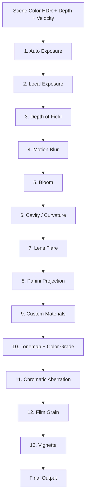
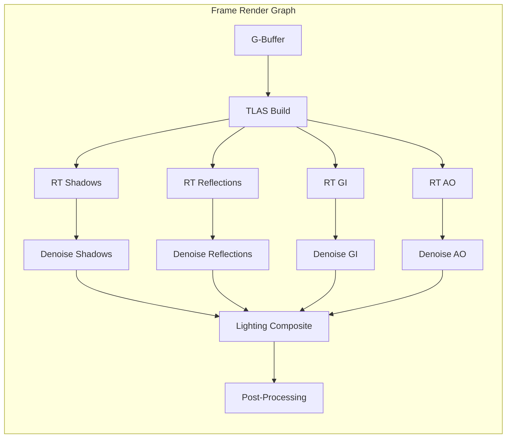
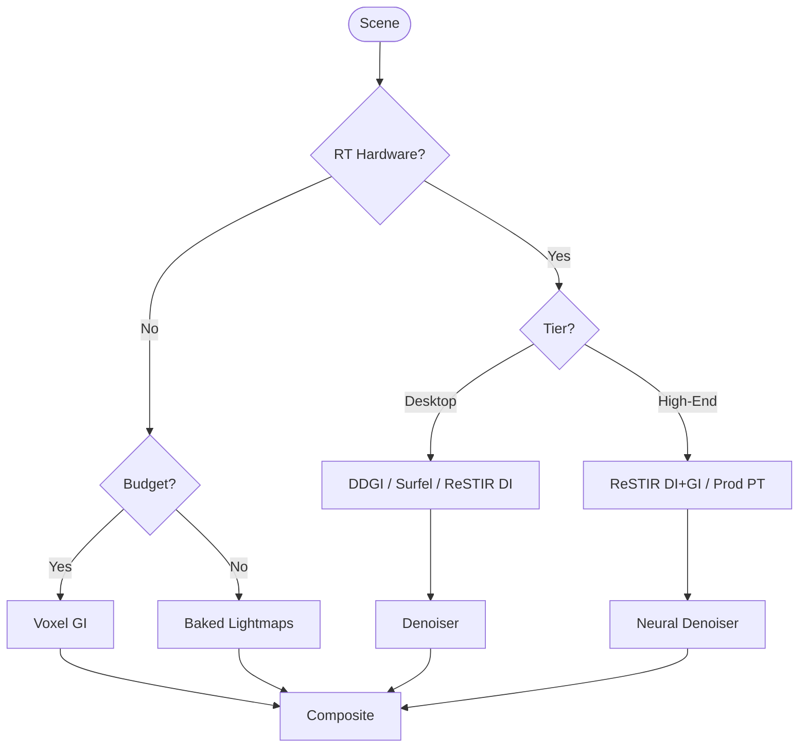
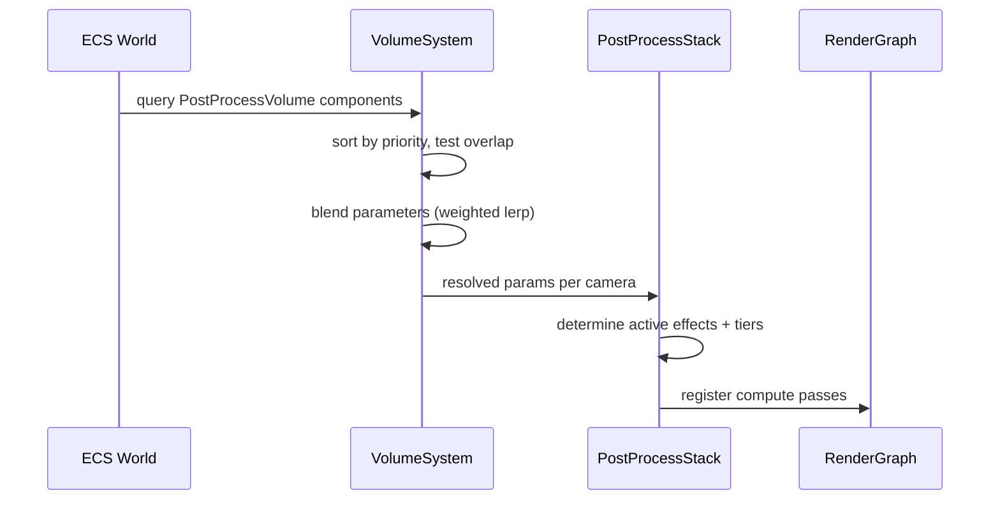
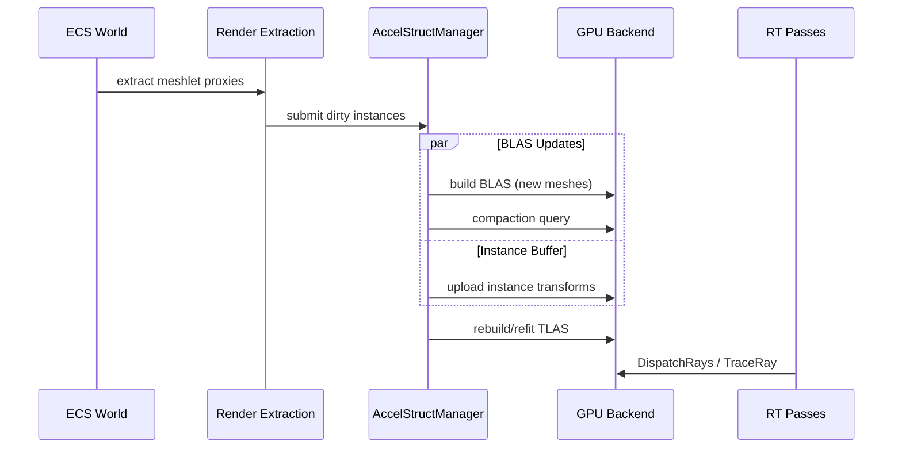

# Render Effects Design

Post-processing and ray tracing -- all image-space effects including GI, denoising, and cinematic
post-processing.

## Requirements Trace

> **Canonical sources:** Features, requirements, and user stories are defined in
> [features/](../../features/), [requirements/](../../requirements/), and
> [user-stories/](../../user-stories/).

### Post-Processing (2.9)

| Feature  | Requirement |
|----------|-------------|
| F-2.9.1  | R-2.9.1     |
| F-2.9.2  | R-2.9.2     |
| F-2.9.3  | R-2.9.3     |
| F-2.9.4  | R-2.9.4     |
| F-2.9.5  | R-2.9.5     |
| F-2.9.6  | R-2.9.6     |
| F-2.9.7  | R-2.9.7     |
| F-2.9.8  | R-2.9.8     |
| F-2.9.9  | R-2.9.9     |
| F-2.9.10 | R-2.9.10    |
| F-2.9.11 | R-2.9.11    |
| F-2.9.12 | R-2.9.12    |
| F-2.9.13 | R-2.9.13    |
| F-2.9.14 | R-2.9.14    |

1. **F-2.9.1** -- Bloom: threshold, downsample/upsample chain
2. **F-2.9.2** -- Cinematic DOF: gather bokeh, CoC
3. **F-2.9.3** -- Per-pixel velocity motion blur
4. **F-2.9.4** -- Histogram auto exposure, temporal smoothing
5. **F-2.9.5** -- Tonemapping (ACES, filmic) + LUT color grade
6. **F-2.9.6** -- Procedural/texture film grain
7. **F-2.9.7** -- Radial chromatic aberration
8. **F-2.9.8** -- Image-based lens flare
9. **F-2.9.9** -- Radial vignette with power curve
10. **F-2.9.10** -- User-defined post-process material passes
11. **F-2.9.11** -- Per-tile local exposure
12. **F-2.9.12** -- Panini projection for wide-FOV
13. **F-2.9.13** -- Screen-space cavity and curvature
14. **F-2.9.14** -- Node-based post-process graph editor

### Acceleration Structures (2.5)

| Feature  | Requirement | User Stories |
|----------|-------------|--------------|
| F-2.5.1  | R-2.5.1     | US-2.5.1.1, US-2.5.1.2 |
| F-2.5.10 | R-2.5.10    | US-2.5.10.1, US-2.5.10.2 |
| F-2.5.11 | R-2.5.11    | US-2.5.11.1, US-2.5.11.2 |

1. **F-2.5.1** -- BLAS build from meshlets with compaction
2. **F-2.5.10** -- Opacity micromaps for alpha-tested geometry
3. **F-2.5.11** -- Shader execution reordering

### Ray Traced Effects (2.5)

| Feature  | Requirement | User Stories |
|----------|-------------|--------------|
| F-2.5.2  | R-2.5.2     | US-2.5.2.1, US-2.5.2.2, US-2.5.2.3 |
| F-2.5.3  | R-2.5.3     | US-2.5.3.1, US-2.5.3.2 |
| F-2.5.6  | R-2.5.6     | US-2.5.6.1, US-2.5.6.2 |
| F-2.5.13 | R-2.5.13    | US-2.5.13.1, US-2.5.13.2 |
| F-2.5.16 | R-2.5.16    | US-2.5.16.1, US-2.5.16.2 |

1. **F-2.5.2** -- Hybrid SSR + RT reflections with denoise
2. **F-2.5.3** -- RT one-bounce indirect diffuse
3. **F-2.5.6** -- RT subsurface transmission
4. **F-2.5.13** -- RT lens flare via lens element tracing
5. **F-2.5.16** -- Stochastic SSR with BRDF importance

### Global Illumination (2.5)

| Feature  | Requirement | User Stories |
|----------|-------------|--------------|
| F-2.5.4  | R-2.5.4     | US-2.5.4.1, US-2.5.4.2 |
| F-2.5.7  | R-2.5.7     | US-2.5.7.1, US-2.5.7.2 |
| F-2.5.8  | R-2.5.8     | US-2.5.8.1, US-2.5.8.2 |
| F-2.5.14 | R-2.5.14    | US-2.5.14.1, US-2.5.14.2 |

1. **F-2.5.4** -- DDGI probe grid with octahedral atlas
2. **F-2.5.7** -- Surfel GI with clipmap probes
3. **F-2.5.8** -- ReSTIR DI + GI reservoir sampling
4. **F-2.5.14** -- Voxel GI for non-RT hardware

### Path Tracing and Denoising (2.5)

| Feature  | Requirement | User Stories |
|----------|-------------|--------------|
| F-2.5.5  | R-2.5.5     | US-2.5.5.1, US-2.5.5.2 |
| F-2.5.9  | R-2.5.9     | US-2.5.9.1, US-2.5.9.2 |
| F-2.5.12 | R-2.5.12    | US-2.5.12.1, US-2.5.12.2 |
| F-2.5.15 | R-2.5.15    | US-2.5.15.1, US-2.5.15.2 |

1. **F-2.5.5** -- Reference path tracer (offline quality)
2. **F-2.5.9** -- Production real-time path tracing with tiers
3. **F-2.5.12** -- Neural denoising with NRD fallback
4. **F-2.5.15** -- Neural radiance cache for path termination

### Non-Functional Requirements

| NFR | Target |
|-----|--------|
| NFR-2.9.1 | Full post pipeline < 3.0 ms (1080p) |
| NFR-2.9.2 | Max single effect < 1.0 ms |
| NFR-2.9.3 | HDR10 PQ EOTF, BT.2020, 10k nits |
| NFR-2.5.1 | BLAS update < 2 ms; rebuild < 50 ms |
| NFR-2.5.2 | Combined RT <= 8 ms (1080p default) |
| NFR-2.5.3 | Denoiser PSNR > 30 dB at 1 spp |

## Overview

### Post-Processing

Every effect is an ECS component on a camera or post-process volume entity. A `PostProcessStack`
system extracts active effects, resolves volume blending, and registers compute shader passes into
the render graph.

Principles:

1. **ECS-primary (~90%)-based** -- All parameters are components
2. **Compute-only** -- Every effect is an HLSL compute shader
3. **Volume blending** -- Overlapping volumes blend by priority
4. **Platform-adaptive** -- Effects declare quality tiers
5. **Static dispatch** -- No vtables in the hot path

### Advanced Rendering (RT and GI)

A **hybrid renderer**: rasterization handles primary visibility; ray tracing provides reflections,
shadows, AO, and indirect lighting at configurable quality tiers.

Principles:

1. **ECS-driven AS** -- BLAS/TLAS built from meshlet proxies
2. **Tiered fallback** -- Every RT effect has a raster fallback
3. **Unified denoising** -- Shared denoiser for all RT outputs
4. **Render-graph integrated** -- Every RT pass is a graph node

## Architecture

### Post-Processing Pipeline Order

Effects 1-9 operate in HDR linear space. Effect 10 converts to display space. Effects 11-13 operate
in display space. UI renders after tonemapping but before film grain/vignette.

### RT Pass Integration

### GI Tier Selection

### Post-Processing Class Diagram

```mermaid
classDiagram
    class PostProcessPass {
        +Params: Component + Default + Reflect
        +NAME &str
        +ORDER u32
        +HDR bool
        +register_passes(ctx, params, quality)
        +is_active(params) bool
    }

    class PostProcessStack {
        -passes Vec~PassRegistration~
        -temporal_state HashMap~Entity TemporalState~
        +run(cameras, volumes, graph, quality)
    }

    class VolumeSystem {
        +resolve(camera_pos, volumes, fallback) P
    }

    class PostProcessVolume {
        +priority i32
        +weight f32
        +is_global bool
        +blend_distance f32
    }

    class VolumeShape {
        Global
        Box
        Sphere
    }

    class Bloom {
        +enabled bool
        +threshold f32
        +soft_knee f32
        +intensity f32
        +iteration_count u8
        +blur_method BloomBlurMethod
    }

    class DepthOfField {
        +enabled bool
        +focus_distance f32
        +aperture f32
        +focal_length f32
        +bokeh_shape BokehShape
        +fallback DofFallback
    }

    class MotionBlur {
        +enabled bool
        +shutter_angle f32
        +sample_count u8
        +max_blur_pixels f32
        +per_object bool
    }

    class AutoExposure {
        +enabled bool
        +min_ev f32
        +max_ev f32
        +metering MeteringMode
    }

    class TonemapColorGrade {
        +enabled bool
        +tonemapper Tonemapper
        +white_balance f32
        +shadows ColorWheelAdjust
        +midtones ColorWheelAdjust
        +highlights ColorWheelAdjust
        +color_lut Option~AssetHandle~
        +hdr_output HdrOutputMode
    }

    class FilmGrain {
        +enabled bool
        +intensity f32
        +method GrainMethod
    }

    class ChromaticAberration {
        +enabled bool
        +intensity f32
        +start f32
    }

    class LensFlare {
        +enabled bool
        +threshold f32
        +ghost_count u8
        +halo_radius f32
    }

    class Vignette {
        +enabled bool
        +intensity f32
        +power f32
    }

    class LocalExposure {
        +enabled bool
        +tile_count u8
        +max_compensation f32
    }

    class CavityCurvature {
        +enabled bool
        +curvature_radius f32
        +cavity_radius f32
    }

    class Tonemapper {
        AcesFilmic
        NeutralFilmic
        Reinhard
        AgX
        Custom
    }

    class HdrOutputMode {
        Sdr
        Hdr10
        DolbyVision
    }

    class BokehShape {
        Circle
        Hexagon
        Octagon
    }

    class MeteringMode {
        Average
        CenterWeighted
        Spot
    }

    class BloomBlurMethod {
        DualKawase
        Gaussian
    }

    class QualityTier {
        Mobile
        Switch
        Desktop
        HighEnd
    }

    PostProcessStack --> PostProcessPass
    PostProcessStack --> VolumeSystem
    VolumeSystem --> PostProcessVolume
    PostProcessVolume --> VolumeShape
    Bloom ..|> PostProcessPass
    DepthOfField ..|> PostProcessPass
    MotionBlur ..|> PostProcessPass
    AutoExposure ..|> PostProcessPass
    TonemapColorGrade ..|> PostProcessPass
    FilmGrain ..|> PostProcessPass
    ChromaticAberration ..|> PostProcessPass
    LensFlare ..|> PostProcessPass
    Vignette ..|> PostProcessPass
    LocalExposure ..|> PostProcessPass
    CavityCurvature ..|> PostProcessPass
    TonemapColorGrade --> Tonemapper
    TonemapColorGrade --> HdrOutputMode
    DepthOfField --> BokehShape
    AutoExposure --> MeteringMode
    Bloom --> BloomBlurMethod
```

### RT and GI Class Diagram

```mermaid
classDiagram
    class AccelStructManager {
        +build_blas(cmd, mesh, verts, inds) BlasHandle
        +request_compaction(cmd, handle)
        +update_tlas(cmd, instances, mode) TlasHandle
        +tlas() TlasHandle
        +total_memory() u64
    }

    class BlasHandle {
        +id u32
        +gpu_address u64
        +memory_size u64
    }

    class TlasHandle {
        +id u32
        +gpu_address u64
        +instance_count u32
    }

    class RtCapabilities {
        +hardware_rt bool
        +ray_query bool
        +opacity_micromaps bool
        +shader_exec_reorder bool
        +tensor_cores bool
        +max_ray_recursion u32
    }

    class FallbackSelector {
        +select_gi_mode() GiMode
        +select_reflection_mode() ReflectionMode
        +select_shadow_mode() ShadowMode
        +select_ao_mode() AoMode
        +select_denoiser_mode() DenoiserMode
    }

    class GiMode {
        BakedLightmaps
        VoxelGi
        Ddgi
        SurfelGi
        ReStirGi
        ProductionPathTracing
    }

    class ReflectionMode {
        Probes
        StochasticSsr
        HybridSsrRt
    }

    class DenoiserMode {
        NrdSvgf
        NrdReblur
        NrdRelax
        Neural
    }

    class DenoiseSignal {
        DiffuseIndirect
        SpecularReflections
        Shadows
        AmbientOcclusion
    }

    class DdgiProbeGrid {
        +register_update_pass(graph)
        +register_sample_pass(graph)
        +irradiance_atlas() TextureHandle
    }

    class SurfelGi {
        +register_surfel_pass(graph)
        +register_trace_pass(graph)
        +register_sample_pass(graph)
    }

    class VoxelGi {
        +register_voxelize_pass(graph)
        +register_relight_pass(graph)
        +register_sample_pass(graph)
    }

    class ReStirSampler {
        +register_candidate_pass(graph)
        +register_temporal_pass(graph)
        +register_spatial_pass(graph)
        +register_shade_pass(graph)
    }

    class PathTracer {
        +register_pass(graph)
        +reset_accumulation()
        +accumulated_samples() u32
    }

    class ProductionPathTracer {
        +register_trace_pass(graph)
        +register_denoise_pass(graph)
    }

    class PathTracingTier {
        DirectOnly
        SingleBounce
        MultiBounce
    }

    class Denoiser {
        +register_pass(graph, input)
        +reset_history()
        +set_mode(mode)
    }

    class BlasBuildMode {
        Build
        Refit
    }

    class TlasUpdateMode {
        Rebuild
        Refit
    }

    AccelStructManager *-- BlasHandle
    AccelStructManager *-- TlasHandle
    FallbackSelector --> RtCapabilities
    FallbackSelector --> GiMode
    FallbackSelector --> ReflectionMode
    FallbackSelector --> DenoiserMode
    DdgiProbeGrid --> AccelStructManager
    SurfelGi --> AccelStructManager
    ReStirSampler --> AccelStructManager
    PathTracer --> AccelStructManager
    ProductionPathTracer --> AccelStructManager
    ProductionPathTracer --> PathTracingTier
    Denoiser --> DenoiserMode
    Denoiser --> DenoiseSignal
```

## Data Flow

### Volume Blending Sequence

### Acceleration Structure Build

### Performance Targets

| Metric | Target |
|--------|--------|
| BLAS incremental (10% changed) | < 2 ms |
| BLAS full rebuild | < 50 ms |
| TLAS refit (10K instances) | < 1 ms |
| Combined RT budget (1080p) | <= 8 ms |
| Full post pipeline (1080p) | < 3.0 ms |
| Max single post effect | < 1.0 ms |
| Denoiser PSNR (1 spp) | > 30 dB |
| BLAS compaction savings | >= 20% |

## Platform Considerations

### Post-Processing Per Platform

| Effect | Mobile | Switch | Desktop | High-end |
|--------|--------|--------|---------|----------|
| Bloom | 3-iter DualKawase | 5-iter DualKawase | 6-iter Gaussian | 8-iter Gaussian |
| DOF | Lightweight | Separable | Full gather | Full gather |
| Motion blur | Disabled | 4-sample | 8-sample | 16-sample |
| Auto exposure | 32-bin | 64-bin | 64-bin | 128-bin |
| Film grain | Procedural | Procedural | Texture | Texture |
| Local exposure | Disabled | Disabled | 8x8 tiles | 16x16 tiles |
| Lens flare | Disabled | 2 ghosts | 4 ghosts | 6 ghosts |

### RT Feature Availability

| Feature | Mobile | Switch | Desktop | High-end |
|---------|--------|--------|---------|----------|
| Hardware RT | No | No | DXR/VK RT | Full |
| GI method | Baked | Baked/Voxel | DDGI/Surfel | ReSTIR/PT |
| Reflections | Probes | SSR | Hybrid SSR+RT | Full RT |
| Denoiser | N/A | N/A | NRD SVGF | Neural |
| Path tracing | No | No | No | Production |

## Test Plan

See companion file [render-effects-test-cases.md](render-effects-test-cases.md).

### Unit Tests (Post-Processing)

| Test | Req |
|------|-----|
| `test_bloom_threshold_extraction` | R-2.9.1 |
| `test_bloom_downsample_upsample` | R-2.9.1 |
| `test_dof_coc_computation` | R-2.9.2 |
| `test_dof_bokeh_shape` | R-2.9.2 |
| `test_motion_blur_velocity` | R-2.9.3 |
| `test_auto_exposure_histogram` | R-2.9.4 |
| `test_auto_exposure_temporal` | R-2.9.4 |
| `test_tonemap_aces_range` | R-2.9.5 |
| `test_tonemap_lut_identity` | R-2.9.5 |
| `test_film_grain_luminance` | R-2.9.6 |
| `test_chromatic_aberration_radial` | R-2.9.7 |
| `test_lens_flare_ghost_count` | R-2.9.8 |
| `test_vignette_power_curve` | R-2.9.9 |
| `test_volume_blend_priority` | R-2.9.10 |
| `test_hdr10_pq_output` | NFR-2.9.3 |

### Unit Tests (RT and GI)

| Test | Req |
|------|-----|
| `test_blas_build_from_meshlets` | R-2.5.1 |
| `test_blas_compaction_savings` | R-2.5.1 |
| `test_tlas_refit_vs_rebuild` | R-2.5.1 |
| `test_rt_reflection_hybrid` | R-2.5.2 |
| `test_ddgi_probe_irradiance` | R-2.5.4 |
| `test_ddgi_temporal_hysteresis` | R-2.5.4 |
| `test_surfel_gi_clipmap_update` | R-2.5.7 |
| `test_restir_reservoir_convergence` | R-2.5.8 |
| `test_path_tracer_accumulation` | R-2.5.5 |
| `test_voxel_gi_cone_trace` | R-2.5.14 |
| `test_denoiser_psnr_threshold` | R-2.5.12 |
| `test_fallback_selector_no_rt` | R-2.5.14 |
| `test_opacity_micromap_build` | R-2.5.10 |
| `test_stochastic_ssr_brdf` | R-2.5.16 |

### Integration Tests

| Test | Req |
|------|-----|
| `test_full_post_pipeline_1080p` | NFR-2.9.1 |
| `test_post_budget_adaptive` | NFR-2.9.2 |
| `test_combined_rt_budget` | NFR-2.5.2 |
| `test_gi_fallback_chain` | R-2.5.14 |
| `test_rt_cross_backend_visual` | R-2.5.1 |

### Benchmarks

| Benchmark | Target |
|-----------|--------|
| Full post pipeline (1080p) | < 3.0 ms |
| Bloom (6-iter, 1080p) | < 0.5 ms |
| DOF gather (1080p) | < 1.0 ms |
| BLAS incremental (10%) | < 2.0 ms |
| Combined RT (1080p default) | <= 8.0 ms |
| DDGI probe update (64 rays) | < 2.0 ms |
| Denoiser (1080p, 4 signals) | < 2.0 ms |

## Open Questions

1. **NRD dependency** -- Proprietary NVIDIA SDK requiring approval. NrdSvgf/NrdReblur serve as
   defaults.
2. **Neural denoiser inference** -- Requires ML infrastructure and tensor cores. Optional path with
   NRD fallback.
3. **Volume blending edge cases** -- Nested volumes with equal priority need tie-breaking strategy.
4. **Post-process graph compilation** -- Node-based editor (F-2.9.14) needs compilation to HLSL
   compute. Define the intermediate representation.
5. **RT lens flare** -- Physical lens element tracing (F-2.5.13) is expensive. Evaluate hybrid
   approach with image-based fallback.
