# Render Graph Design

## Requirements Trace

> **Canonical sources:** Features, requirements, and user stories are defined in
> [features/rendering/](../../features/), [requirements/rendering/](../../requirements/), and
> [user-stories/rendering/](../../user-stories/). The table below traces design elements to those
> definitions.

| Feature  | Requirement            |
|----------|------------------------|
| F-2.2.1  | RG-1.1, RG-1.2, RG-1.3 |
| F-2.2.2  | RG-6.1 .. RG-6.7       |
| F-2.2.3  | RG-2.1, RG-2.5, RG-2.6 |
| F-2.2.4  | RG-8.1 .. RG-8.6       |
| F-2.2.5  | RG-3.1 .. RG-3.6       |
| F-2.2.6  | RG-4.1 .. RG-4.6       |
| F-2.2.7  | RG-5.1, RG-5.6, RG-5.7 |
| F-2.2.8  | RG-7.1 .. RG-7.6       |
| F-2.2.9  | RG-9.1 .. RG-9.5       |
| F-2.2.10 | RG-10.1 .. RG-10.7     |
| F-2.2.11 | RG-11.1 .. RG-11.7     |
| F-2.2.12 | RG-13.1 .. RG-13.8     |
| F-2.2.13 | RG-12.1 .. RG-12.7     |

1. **F-2.2.1** — Declarative pass registration with typed resource I/O
2. **F-2.2.2** — Capability gating and fallback chains
3. **F-2.2.3** — Transient resource declaration
4. **F-2.2.4** — Resource aliasing for memory reuse
5. **F-2.2.5** — Automatic barrier insertion
6. **F-2.2.6** — Multi-queue scheduling
7. **F-2.2.7** — Topological sort and deterministic ordering
8. **F-2.2.8** — Budget culling
9. **F-2.2.9** — Multi-view execution
10. **F-2.2.10** — Parallel command encoding
11. **F-2.2.11** — Streaming integration
12. **F-2.2.12** — Graph compilation and caching
13. **F-2.2.13** — Render graph diagnostics

## Overview

The render graph is a DAG-based frame graph that models an entire frame's GPU work as a set of typed
passes connected by resource dependencies. Passes declare what they read and write; the compiler
derives barriers, queue assignments, resource lifetimes, memory aliasing, and execution order
automatically.

The graph is compiled once when the pass topology or device capabilities change. Per-frame parameter
updates (viewport size, quality settings, enable flags) do not trigger recompilation. At execution
time the compiled plan distributes command encoding across the thread pool, submits to multi-queue
GPU backends, and collects timestamp diagnostics.

Key design goals:

1. **Zero manual barriers.** All synchronization derived from resource declarations.
2. **Minimal VRAM.** Transient resources share physical memory via interference-graph-based
   aliasing.
3. **Multi-queue overlap.** Async compute and transfer passes overlap with graphics.
4. **Parallel encoding.** Independent passes encode on separate threads.
5. **Compile once, execute many.** Topology-data separation avoids per-frame recompilation.
6. **Budget-aware.** GPU timing feedback drives automatic pass culling.

## Architecture

### Module Boundaries

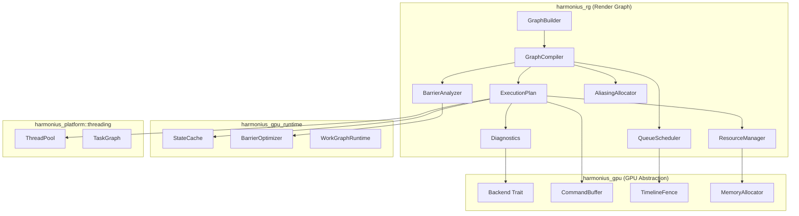

```text
harmonius_rg/
├── builder.rs        # GraphBuilder, PassBuilder,
│                     # ResourceBuilder
├── graph.rs          # RenderGraph, PassNode,
│                     # ResourceNode
├── compiler.rs       # GraphCompiler orchestration
├── barrier.rs        # BarrierAnalyzer, split barriers,
│                     # layout tracking
├── scheduler.rs      # QueueScheduler, topological sort,
│                     # multi-queue assignment
├── aliasing.rs       # AliasingAllocator, interference
│                     # graph, heap packing
├── plan.rs           # ExecutionPlan, EncodingGroup,
│                     # BarrierBatch
├── resource.rs       # ResourceManager, transient/
│                     # persistent/imported allocation
├── budget.rs         # BudgetCuller, GPU timing feedback
├── subgraph.rs       # SubGraphTemplate, multi-view
│                     # instantiation
├── capability.rs     # CapabilityGate, fallback chains
├── diagnostics.rs    # Timestamp collection, DAG overlay,
│                     # export
├── execute.rs        # Parallel encoding, submission,
│                     # per-frame data binding
└── error.rs          # RenderGraphError variants
```

### Graph Lifecycle

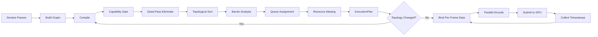

### Compilation Pipeline Detail


### Core Data Structures

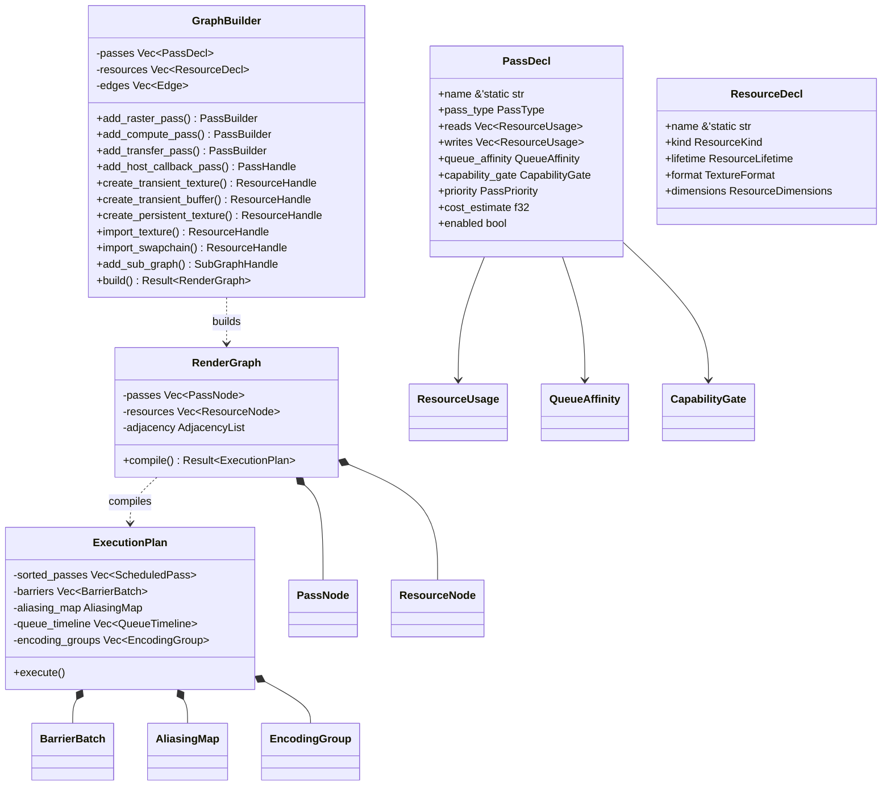

### Parallel Encoding and Submission

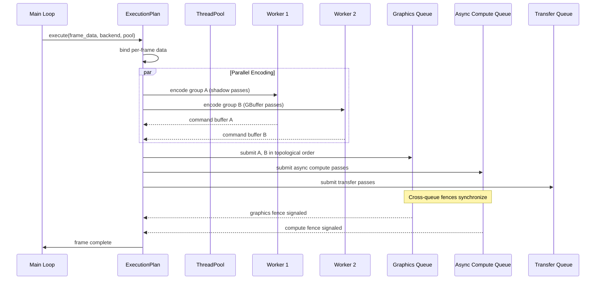

### Resource Aliasing

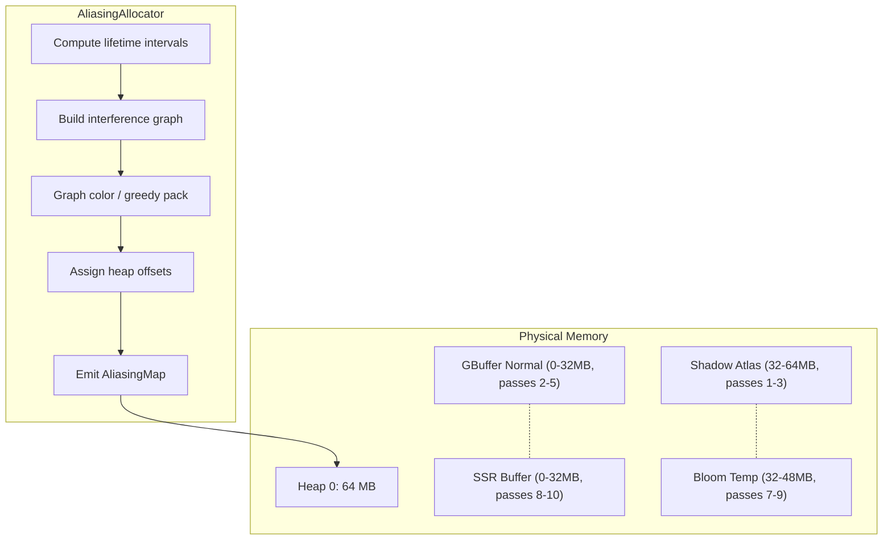

## Task Graph Integration

The render graph is not a standalone execution system. It is a phase within the unified
`GameLoopGraph`. Render passes compile into task graph nodes. The threading subsystem's
work-stealing pool drives parallel encoding.

### Design Principles

1. **Render passes as task nodes.** Each render pass compiles into one or more `TaskNode` entries in
   the parent `TaskGraph`. Dependencies between passes become task graph edges.
2. **Parallel encoding.** Independent render passes that do not share resources are scheduled as
   parallel tasks by the work-stealing pool -- the same mechanism that runs parallel ECS systems.
3. **GPU submission ordering.** The task graph's topological sort determines GPU submission order.
   Cross-queue synchronization (graphics, compute, transfer) uses task graph barriers.
4. **Per-frame parameter binding.** The compiled render graph is a reusable template. Per-frame data
   (camera, visibility, light lists) is bound without recompilation.

### Render Pass to Task Node Mapping

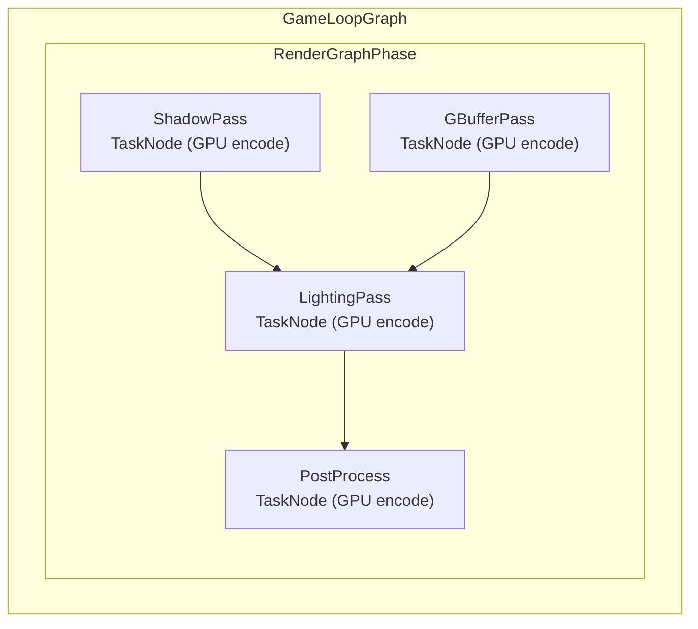

Each render pass maps to a `TaskNode` that encodes GPU commands within a scoped borrow. The task
graph handles scheduling, dependency tracking, and parallelism.

### RenderGraphPhase API

```rust
/// A render graph phase that integrates into
/// the game loop graph.
pub struct RenderGraphPhase {
    passes: Vec<RenderPass>,
    resources: ResourceTable,
    compiled: Option<CompiledRenderGraph>,
}

impl RenderGraphPhase {
    /// Compile render passes into task graph nodes.
    /// Safe -- validates resource lifetimes and
    /// inserts barriers automatically.
    pub fn compile(
        &mut self,
        device: &GpuDevice,
    ) -> Result<(), RenderGraphError>;

    /// Emit task nodes into the parent task graph.
    /// Each pass becomes a scoped task that encodes
    /// GPU commands. Safe -- command buffers are
    /// borrowed for the encoding scope only.
    pub fn emit_tasks(
        &self,
        builder: &mut TaskGraphBuilder,
        frame_data: &FrameData,
    );
}
```

### Integration Sequence

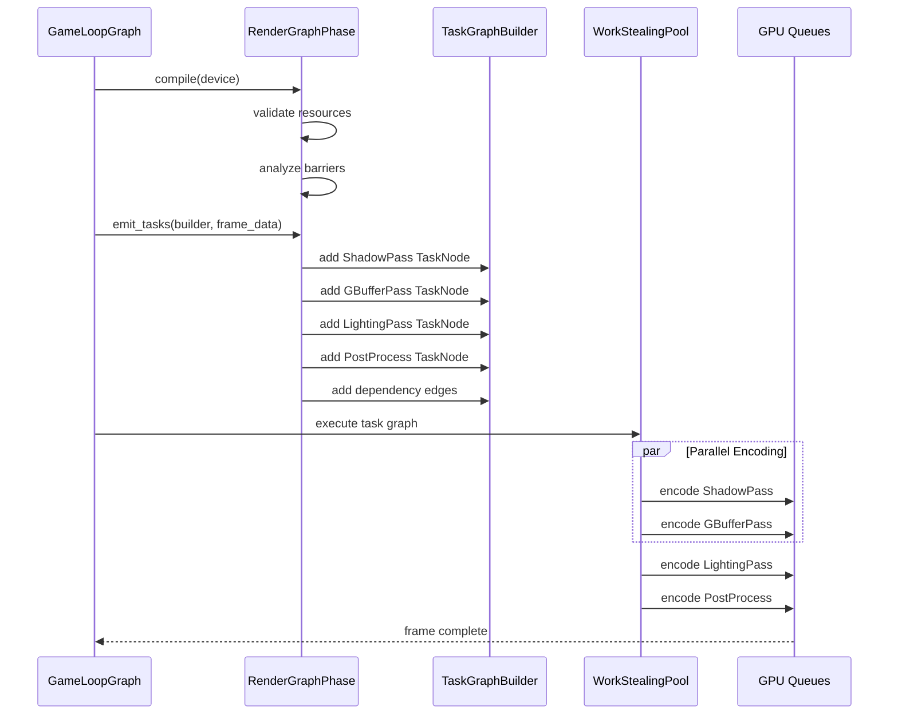

## API Design

### Handles and Identifiers

```rust
/// Typed handle to a declared pass within the
/// graph. Indices are stable within a single
/// GraphBuilder session.
#[derive(
    Clone, Copy, Debug, PartialEq, Eq, Hash,
)]
pub struct PassHandle(pub(crate) u32);

/// Typed handle to a declared resource. The
/// version field enables generational reuse in
/// persistent resource pools.
#[derive(
    Clone, Copy, Debug, PartialEq, Eq, Hash,
)]
pub struct ResourceHandle {
    pub(crate) index: u32,
    pub(crate) version: u32,
}

/// Handle to a sub-graph template instance set.
#[derive(
    Clone, Copy, Debug, PartialEq, Eq, Hash,
)]
pub struct SubGraphHandle(pub(crate) u32);
```

### Enumerations

```rust
/// GPU pass type. Determines command buffer type
/// and valid operations.
#[derive(Clone, Copy, Debug, PartialEq, Eq)]
pub enum PassType {
    Rasterization,
    Compute,
    RayTracingDispatch,
    AccelerationStructureBuild,
    Transfer,
    MsaaResolve,
    Present,
    HostCallback,
}

/// How a pass accesses a resource.
#[derive(Clone, Copy, Debug, PartialEq, Eq)]
pub enum AccessMode {
    Read,
    Write,
    ReadWrite,
}

/// Specific usage type for barrier derivation.
#[derive(Clone, Copy, Debug, PartialEq, Eq)]
pub enum UsageType {
    ColorAttachment,
    DepthAttachment,
    ShaderRead,
    StorageRead,
    StorageWrite,
    ShadingRateAttachment,
    IndirectArgument,
    AccelerationStructureRead,
    AccelerationStructureBuildWrite,
    TransferSrc,
    TransferDst,
    Present,
}

/// Queue affinity declared per pass.
#[derive(Clone, Copy, Debug, PartialEq, Eq)]
pub enum QueueAffinity {
    Graphics,
    AsyncCompute,
    Transfer,
    /// Compiler chooses optimal queue.
    Any,
}

/// Resource lifetime within the graph.
#[derive(Clone, Copy, Debug, PartialEq, Eq)]
pub enum ResourceLifetime {
    /// Exists only within the current frame.
    /// Eligible for aliasing.
    Transient,
    /// Survives across frame boundaries.
    /// Not eligible for intra-frame aliasing.
    Persistent,
    /// Externally managed, imported with an
    /// initial access state.
    Imported,
    /// Previous frame's contents available as
    /// read-only input in the current frame.
    History,
}

/// Resource kind.
#[derive(Clone, Copy, Debug, PartialEq, Eq)]
pub enum ResourceKind {
    Texture2D,
    TextureArray2D { layer_count: u32 },
    TextureCube,
    Buffer,
    AccelerationStructure,
}

/// Pass priority for budget culling. Lower
/// priority passes are culled first under
/// frame-time pressure.
#[derive(
    Clone, Copy, Debug, PartialEq, Eq,
    PartialOrd, Ord,
)]
pub enum PassPriority {
    /// Never culled (depth pre-pass, present).
    Required,
    /// Culled only under extreme pressure.
    High,
    /// Default rendering passes.
    Normal,
    /// Quality extras (ambient occlusion, SSR).
    Low,
    /// Debug overlays, diagnostics.
    Optional,
}

/// Hardware capabilities queryable for gating.
#[derive(Clone, Copy, Debug, PartialEq, Eq)]
pub enum Capability {
    MeshShaders,
    RayTracing,
    RayQuery,
    WorkGraphs,
    VariableRateShading,
    Int64Atomics,
    SparseResidency,
    /// Minimum required compute shader model.
    ComputeShaderModel(u8, u8),
}

/// Gate that controls whether a pass is included
/// during compilation.
#[derive(Clone, Debug)]
pub enum CapabilityGate {
    /// Always included.
    None,
    /// Requires all listed capabilities.
    RequireAll(Vec<Capability>),
    /// Requires at least one capability.
    RequireAny(Vec<Capability>),
    /// Hard gate: compilation fails if unmet.
    Hard(Vec<Capability>),
    /// Soft gate: pass silently pruned if unmet.
    Soft(Vec<Capability>),
}
```

### Resource Descriptors

**Note:** This enum will be replaced by the canonical `Format` enum from
[gpu-abstraction.md](gpu-abstraction.md) during implementation. Defined here as a design-time subset
for clarity.

```rust
/// Texture format. Subset shown; full enum in
/// harmonius_gpu.
#[derive(Clone, Copy, Debug, PartialEq, Eq)]
pub enum TextureFormat {
    Rgba8Unorm,
    Rgba16Float,
    Rgba32Float,
    Rg16Float,
    R32Float,
    Depth32Float,
    Depth24Stencil8,
    Bc7Unorm,
    // ... additional formats
}

/// How resource dimensions are specified.
#[derive(Clone, Copy, Debug)]
pub enum ResourceDimensions {
    /// Absolute pixel dimensions.
    Absolute { width: u32, height: u32 },
    /// Relative to a named resolution parameter.
    /// The scalar is applied at per-frame bind
    /// time so dynamic resolution scaling does
    /// not require recompilation.
    Scaled {
        scale_x: f32,
        scale_y: f32,
    },
}

/// Transient texture descriptor.
pub struct TransientTextureDesc {
    pub name: &'static str,
    pub format: TextureFormat,
    pub dimensions: ResourceDimensions,
    pub mip_levels: u32,
    pub sample_count: u32,
    pub usage_flags: UsageFlags,
}

/// Transient buffer descriptor.
pub struct TransientBufferDesc {
    pub name: &'static str,
    pub size: u64,
    pub usage_flags: UsageFlags,
}

/// Persistent texture descriptor. Persistent
/// resources are not aliased.
pub struct PersistentTextureDesc {
    pub name: &'static str,
    pub format: TextureFormat,
    pub dimensions: ResourceDimensions,
    pub mip_levels: u32,
    pub sample_count: u32,
    pub usage_flags: UsageFlags,
}

/// Import descriptor for externally managed
/// resources.
pub struct ImportedTextureDesc {
    pub name: &'static str,
    pub initial_state: ResourceState,
}

/// Bitflags for resource usage.
///
/// **Note:** Usage flags align with and reference
/// the canonical definitions in
/// [gpu-abstraction.md](gpu-abstraction.md).
#[derive(Clone, Copy, Debug)]
pub struct UsageFlags(u32);

impl UsageFlags {
    pub const COLOR_ATTACHMENT: Self =
        Self(1 << 0);
    pub const DEPTH_ATTACHMENT: Self =
        Self(1 << 1);
    pub const SHADER_READ: Self =
        Self(1 << 2);
    pub const STORAGE_READ: Self =
        Self(1 << 3);
    pub const STORAGE_WRITE: Self =
        Self(1 << 4);
    pub const TRANSFER_SRC: Self =
        Self(1 << 5);
    pub const TRANSFER_DST: Self =
        Self(1 << 6);
    pub const INDIRECT_ARGUMENT: Self =
        Self(1 << 7);
    pub const PRESENT: Self =
        Self(1 << 8);
    pub const SHADING_RATE: Self =
        Self(1 << 9);
}

impl std::ops::BitOr for UsageFlags {
    type Output = Self;
    fn bitor(self, rhs: Self) -> Self {
        Self(self.0 | rhs.0)
    }
}

/// Access state of an imported resource at
/// graph entry.
#[derive(Clone, Copy, Debug, PartialEq, Eq)]
pub struct ResourceState {
    pub access: AccessMode,
    pub usage: UsageType,
    pub queue: QueueAffinity,
}
```

### Resource Usage Declaration

```rust
/// A single resource usage by a pass.
pub struct ResourceUsage {
    pub resource: ResourceHandle,
    pub access: AccessMode,
    pub usage: UsageType,
    /// For texture array writes, which layer.
    pub array_layer: Option<u32>,
    /// For mip-targeted passes, which mip level.
    pub mip_level: Option<u32>,
}
```

### Graph Builder

```rust
/// Builder for constructing a render graph.
/// Collects pass and resource declarations,
/// then produces an immutable RenderGraph.
pub struct GraphBuilder { /* ... */ }

impl GraphBuilder {
    pub fn new() -> Self;

    // ---- Pass declaration -------------------

    /// Begin declaring a rasterization pass.
    /// Returns a PassBuilder for specifying
    /// resource bindings and configuration.
    pub fn add_raster_pass(
        &mut self,
        name: &'static str,
    ) -> PassBuilder<'_>;

    /// Begin declaring a compute pass.
    pub fn add_compute_pass(
        &mut self,
        name: &'static str,
    ) -> PassBuilder<'_>;

    /// Begin declaring a ray tracing dispatch.
    pub fn add_ray_tracing_pass(
        &mut self,
        name: &'static str,
    ) -> PassBuilder<'_>;

    /// Begin declaring a transfer pass.
    pub fn add_transfer_pass(
        &mut self,
        name: &'static str,
    ) -> PassBuilder<'_>;

    /// Begin declaring an MSAA resolve pass.
    pub fn add_resolve_pass(
        &mut self,
        name: &'static str,
    ) -> PassBuilder<'_>;

    /// Declare a host-side callback pass that
    /// executes on the CPU after a predecessor
    /// fence signals. Does not submit GPU work.
    pub fn add_host_callback_pass<F>(
        &mut self,
        name: &'static str,
        callback: F,
    ) -> PassHandle
    where
        F: FnOnce(&FrameContext) + Send + 'static;

    /// Declare the swapchain present pass.
    pub fn add_present_pass(
        &mut self,
        name: &'static str,
        swapchain: ResourceHandle,
    ) -> PassHandle;

    // ---- Resource declaration ---------------

    /// Declare a transient texture. Eligible for
    /// aliasing with non-overlapping resources.
    pub fn create_transient_texture(
        &mut self,
        desc: TransientTextureDesc,
    ) -> ResourceHandle;

    /// Declare a transient buffer.
    pub fn create_transient_buffer(
        &mut self,
        desc: TransientBufferDesc,
    ) -> ResourceHandle;

    /// Declare a persistent texture that
    /// survives across frames.
    pub fn create_persistent_texture(
        &mut self,
        desc: PersistentTextureDesc,
    ) -> ResourceHandle;

    /// Declare a history resource whose previous
    /// frame contents are available as read-only.
    pub fn create_history_texture(
        &mut self,
        desc: PersistentTextureDesc,
    ) -> HistoryResource;

    /// Import an externally managed texture with
    /// known initial state.
    pub fn import_texture<B: GpuBackend>(
        &mut self,
        texture: &B::Texture,
        desc: ImportedTextureDesc,
    ) -> ResourceHandle;

    /// Import the swapchain as a resource.
    pub fn import_swapchain<B: GpuBackend>(
        &mut self,
        swapchain: &B::Swapchain,
    ) -> ResourceHandle;

    // ---- Sub-graphs -------------------------

    /// Register a reusable sub-graph template
    /// for multi-view instantiation.
    pub fn add_sub_graph_template(
        &mut self,
        name: &'static str,
        template: SubGraphTemplate,
    ) -> SubGraphHandle;

    /// Instantiate a sub-graph template with
    /// per-instance parameters.
    pub fn instantiate_sub_graph(
        &mut self,
        handle: SubGraphHandle,
        count: u32,
        params: &[SubGraphParams],
    );

    // ---- Pass chains ------------------------

    /// Declare an ordered chain of passes. Passes
    /// execute in declaration order. Intermediate
    /// resources are automatically transient.
    pub fn add_pass_chain(
        &mut self,
        name: &'static str,
    ) -> PassChainBuilder<'_>;

    // ---- Variant slots ----------------------

    /// Declare a variant slot with two or more
    /// pass variants. Exactly one variant is
    /// selected at compile time.
    pub fn add_variant_slot(
        &mut self,
        name: &'static str,
    ) -> VariantSlotBuilder<'_>;

    // ---- Ordering constraints ---------------

    /// Add an explicit ordering edge between two
    /// passes that have no resource dependency.
    pub fn add_ordering_constraint(
        &mut self,
        before: PassHandle,
        after: PassHandle,
    );

    // ---- Build ------------------------------

    /// Validate declarations and produce an
    /// immutable RenderGraph.
    pub fn build(
        self,
    ) -> Result<RenderGraph, RenderGraphError>;
}
```

### Pass Builder

```rust
/// Builder for configuring a single pass's
/// resource bindings and metadata. Returned by
/// GraphBuilder::add_*_pass methods. The pass
/// is finalized when the builder is dropped or
/// .finish() is called.
pub struct PassBuilder<'a> { /* ... */ }

impl<'a> PassBuilder<'a> {
    /// Declare a color attachment write.
    pub fn write_color(
        &mut self,
        slot: u32,
        resource: ResourceHandle,
    ) -> &mut Self;

    /// Declare a depth attachment write.
    pub fn write_depth(
        &mut self,
        resource: ResourceHandle,
    ) -> &mut Self;

    /// Declare a storage buffer/texture write.
    pub fn write_storage(
        &mut self,
        resource: ResourceHandle,
    ) -> &mut Self;

    /// Declare a shader read (sampled texture
    /// or uniform buffer).
    pub fn read_texture(
        &mut self,
        resource: ResourceHandle,
    ) -> &mut Self;

    /// Declare a storage read.
    pub fn read_storage(
        &mut self,
        resource: ResourceHandle,
    ) -> &mut Self;

    /// Declare an indirect argument buffer read.
    pub fn read_indirect(
        &mut self,
        resource: ResourceHandle,
    ) -> &mut Self;

    /// Declare a read from a history resource
    /// (previous frame's data).
    pub fn read_history(
        &mut self,
        resource: HistoryResource,
    ) -> &mut Self;

    /// Write to a specific array layer of a
    /// texture array resource.
    pub fn write_array_layer(
        &mut self,
        resource: ResourceHandle,
        layer: u32,
    ) -> &mut Self;

    /// Write to a specific mip level.
    pub fn write_mip_level(
        &mut self,
        resource: ResourceHandle,
        mip: u32,
    ) -> &mut Self;

    /// Set queue affinity for this pass.
    pub fn queue_affinity(
        &mut self,
        affinity: QueueAffinity,
    ) -> &mut Self;

    /// Set capability gate. Pass is pruned or
    /// errors during compilation if unmet.
    pub fn capability_gate(
        &mut self,
        gate: CapabilityGate,
    ) -> &mut Self;

    /// Set priority for budget culling.
    pub fn priority(
        &mut self,
        priority: PassPriority,
    ) -> &mut Self;

    /// Set GPU cost estimate in milliseconds
    /// (used for budget culling).
    pub fn cost_estimate(
        &mut self,
        ms: f32,
    ) -> &mut Self;

    /// Set conditional enable flag. Toggled per
    /// frame without recompilation.
    pub fn conditional(
        &mut self,
        enabled: bool,
    ) -> &mut Self;

    /// Set render area constraint for
    /// rasterization passes.
    pub fn render_area(
        &mut self,
        x: u32,
        y: u32,
        width: u32,
        height: u32,
    ) -> &mut Self;

    /// Set the execute callback. The callback
    /// receives an encoder for recording GPU
    /// commands.
    pub fn execute<F>(
        &mut self,
        f: F,
    ) -> &mut Self
    where
        F: FnOnce(
            &mut PassEncoder<'_>,
        ) + Send + 'static;

    /// Finalize the pass and return its handle.
    pub fn finish(&mut self) -> PassHandle;
}
```

### History Resource

```rust
/// A history resource pair: current-frame write
/// target and previous-frame read-only handle.
pub struct HistoryResource {
    /// Current frame's write target.
    pub current: ResourceHandle,
    /// Previous frame's read-only contents.
    pub previous: ResourceHandle,
}
```

### Sub-Graph Templates

```rust
/// Template for multi-view sub-graph
/// instantiation (shadow cascades, VR eyes,
/// split-screen viewports).
pub struct SubGraphTemplate { /* ... */ }

impl SubGraphTemplate {
    pub fn new(name: &'static str) -> Self;

    /// Declare a resource that is exclusive to
    /// each instance (independently allocated).
    pub fn declare_exclusive_resource(
        &mut self,
        desc: TransientTextureDesc,
    ) -> ResourceHandle;

    /// Declare a resource shared read-only
    /// across all instances (single allocation).
    pub fn declare_shared_resource(
        &mut self,
        resource: ResourceHandle,
    );

    /// Declare a shared texture array output
    /// where each instance writes one layer.
    pub fn declare_array_output(
        &mut self,
        desc: TransientTextureDesc,
        layer_count: u32,
    ) -> ResourceHandle;

    /// Add a pass to the template.
    pub fn add_pass(
        &mut self,
        name: &'static str,
    ) -> PassBuilder<'_>;
}

/// Per-instance parameters for sub-graph
/// instantiation.
pub struct SubGraphParams {
    /// Per-frame boolean active flag.
    pub enabled: bool,
    /// Variant selection per variant slot.
    pub variant_overrides: Vec<(
        &'static str,
        u32,
    )>,
    /// View-specific constants (view matrix,
    /// viewport rect, etc.) bound at execute
    /// time.
    pub view_constants: ViewConstants,
}

/// Per-view constants passed at execution time.
pub struct ViewConstants {
    pub view_matrix: [f32; 16],
    pub projection_matrix: [f32; 16],
    pub viewport: Viewport,
}

pub struct Viewport {
    pub x: f32,
    pub y: f32,
    pub width: f32,
    pub height: f32,
    pub min_depth: f32,
    pub max_depth: f32,
}
```

### Variant Slots

```rust
/// Builder for declaring compile-time variant
/// slots. Exactly one variant is selected per
/// slot at compilation time.
pub struct VariantSlotBuilder<'a> { /* ... */ }

impl<'a> VariantSlotBuilder<'a> {
    /// Add a variant with its pass set.
    pub fn add_variant(
        &mut self,
        name: &'static str,
    ) -> PassBuilder<'_>;

    /// Finalize. Returns the slot handle.
    pub fn finish(
        &mut self,
    ) -> VariantSlotHandle;
}

#[derive(
    Clone, Copy, Debug, PartialEq, Eq, Hash,
)]
pub struct VariantSlotHandle(pub(crate) u32);
```

### Pass Chains

```rust
/// Builder for ordered pass chains. Passes
/// execute sequentially; the chain as a whole
/// participates in the wider DAG.
pub struct PassChainBuilder<'a> { /* ... */ }

impl<'a> PassChainBuilder<'a> {
    /// Add the next pass in the chain. Returns a
    /// PassBuilder for its resource bindings.
    pub fn add_step(
        &mut self,
        name: &'static str,
    ) -> PassBuilder<'_>;

    /// Finalize the chain.
    pub fn finish(&mut self) -> PassHandle;
}
```

### Render Graph (Immutable)

```rust
/// Immutable render graph built from
/// GraphBuilder. Contains the full DAG of
/// passes and resources. Compiled into an
/// ExecutionPlan.
pub struct RenderGraph { /* ... */ }

impl RenderGraph {
    /// Compile the graph into an execution plan.
    /// Compilation runs capability gating,
    /// dead-pass elimination, topological sort,
    /// barrier analysis, queue assignment, and
    /// resource aliasing.
    pub fn compile(
        &self,
        capabilities: &DeviceCapabilities,
        config: &CompilationConfig,
    ) -> Result<ExecutionPlan, RenderGraphError>;

    /// Number of declared passes.
    pub fn pass_count(&self) -> u32;

    /// Number of declared resources.
    pub fn resource_count(&self) -> u32;

    /// Iterate pass descriptors (for debugging).
    pub fn passes(
        &self,
    ) -> impl Iterator<Item = &PassNode>;

    /// Iterate resource descriptors.
    pub fn resources(
        &self,
    ) -> impl Iterator<Item = &ResourceNode>;
}
```

### Compilation Configuration

```rust
/// Configuration controlling graph compilation
/// behavior. Updated when quality settings,
/// device capabilities, or active variant
/// selections change.
pub struct CompilationConfig {
    /// Active variant selections per slot.
    pub variant_selections: Vec<(
        VariantSlotHandle,
        u32,
    )>,
    /// Target frame budget in milliseconds.
    pub target_budget_ms: f32,
    /// Enable budget culling.
    pub budget_culling_enabled: bool,
    /// Resolution scale parameter (1.0 = native).
    pub resolution_scale: f32,
    /// Maximum sub-graph instances per template.
    pub max_sub_graph_instances: u32,
    /// Enable diagnostic instrumentation.
    pub diagnostics_enabled: bool,
}
```

### Device Capabilities

```rust
/// Hardware capabilities queried at startup.
/// Used for capability gating and queue
/// assignment. Immutable for the session
/// lifetime.
pub struct DeviceCapabilities {
    pub mesh_shaders: bool,
    pub ray_tracing: bool,
    pub ray_query: bool,
    pub work_graphs: bool,
    pub variable_rate_shading: bool,
    pub int64_atomics: bool,
    pub sparse_residency: bool,
    pub compute_shader_model: (u8, u8),
    pub graphics_queue_count: u32,
    pub compute_queue_count: u32,
    pub transfer_queue_count: u32,
    pub split_barriers: bool,
    pub enhanced_barriers: bool,
    pub max_color_attachments: u32,
}

impl DeviceCapabilities {
    /// Check whether a capability gate is
    /// satisfied.
    pub fn satisfies(
        &self,
        gate: &CapabilityGate,
    ) -> bool;
}
```

### Execution Plan

```rust
/// Compiled execution plan. Contains the
/// barrier schedule, aliasing map, queue
/// timeline, and encoding groups. Reused
/// across frames until topology changes.
pub struct ExecutionPlan { /* ... */ }

impl ExecutionPlan {
    /// Execute the plan for one frame. Binds
    /// per-frame data, encodes passes in
    /// parallel, and submits to GPU queues.
    pub fn execute<B: GpuBackend>(
        &self,
        frame_data: &mut FrameData<B>,
        backend: &B,
        pool: &ThreadPool,
    );

    /// Update per-frame pass activation flags
    /// without recompilation.
    pub fn set_pass_enabled(
        &mut self,
        pass: PassHandle,
        enabled: bool,
    );

    /// Update resolution scale without
    /// recompilation.
    pub fn set_resolution_scale(
        &mut self,
        scale: f32,
    );

    /// Update GPU timing feedback for budget
    /// culling decisions.
    pub fn update_gpu_timings(
        &mut self,
        timings: &GpuTimingResults,
    );

    /// Number of passes in the compiled plan
    /// (after dead-pass elimination).
    pub fn active_pass_count(&self) -> u32;

    /// Total aliased heap size in bytes.
    pub fn aliased_heap_size(&self) -> u64;

    /// Peak transient memory usage in bytes.
    pub fn peak_transient_memory(&self) -> u64;

    /// Query the execution order as pass
    /// handles.
    pub fn execution_order(
        &self,
    ) -> &[PassHandle];

    /// Query queue assignment for a pass.
    pub fn queue_assignment(
        &self,
        pass: PassHandle,
    ) -> QueueAffinity;

    /// Export the compiled plan as a diagnostic
    /// DAG description.
    pub fn export_diagnostics(
        &self,
    ) -> DiagnosticGraph;
}
```

### Per-Frame Data

```rust
/// Per-frame mutable data bound before
/// execution. Separates topology (compiled
/// once) from frame-varying state.
pub struct FrameData<B: GpuBackend> {
    /// Monotonically incrementing frame index.
    pub frame_index: u64,
    /// Resolution scale for this frame.
    pub resolution_scale: f32,
    /// Per-pass activation overrides.
    pub pass_overrides: Vec<(PassHandle, bool)>,
    /// Per-sub-graph-instance parameters.
    pub sub_graph_params: Vec<(
        SubGraphHandle,
        Vec<SubGraphParams>,
    )>,
    /// Imported resource bindings for this frame.
    pub imported_bindings: Vec<(
        ResourceHandle,
        B::Texture,
    )>,
    /// Swapchain texture for this frame.
    pub swapchain_texture: B::Texture,
}
```

### Pass Encoder

```rust
/// Encoder provided to pass execute callbacks.
/// Wraps the backend command buffer with state
/// tracking. The encoder lifetime is scoped to
/// a single pass.
pub struct PassEncoder<'a> { /* ... */ }

impl<'a> PassEncoder<'a> {
    /// Bind a graphics pipeline state object.
    pub fn bind_graphics_pipeline(
        &mut self,
        pipeline: PipelineHandle,
    );

    /// Bind a compute pipeline state object.
    pub fn bind_compute_pipeline(
        &mut self,
        pipeline: PipelineHandle,
    );

    /// Set viewport.
    pub fn set_viewport(
        &mut self,
        viewport: &Viewport,
    );

    /// Set scissor rect.
    pub fn set_scissor(
        &mut self,
        x: u32,
        y: u32,
        width: u32,
        height: u32,
    );

    /// Bind vertex buffer.
    pub fn bind_vertex_buffer(
        &mut self,
        slot: u32,
        buffer: BufferHandle,
        offset: u64,
    );

    /// Bind index buffer.
    pub fn bind_index_buffer(
        &mut self,
        buffer: BufferHandle,
        offset: u64,
        format: IndexFormat,
    );

    /// Set push constants.
    pub fn set_push_constants(
        &mut self,
        data: &[u8],
    );

    /// Draw call.
    pub fn draw(
        &mut self,
        vertex_count: u32,
        instance_count: u32,
        first_vertex: u32,
        first_instance: u32,
    );

    /// Indexed draw call.
    pub fn draw_indexed(
        &mut self,
        index_count: u32,
        instance_count: u32,
        first_index: u32,
        vertex_offset: i32,
        first_instance: u32,
    );

    /// Indirect draw.
    pub fn draw_indirect(
        &mut self,
        buffer: BufferHandle,
        offset: u64,
        draw_count: u32,
        stride: u32,
    );

    /// Compute dispatch.
    pub fn dispatch(
        &mut self,
        x: u32,
        y: u32,
        z: u32,
    );

    /// Indirect compute dispatch.
    pub fn dispatch_indirect(
        &mut self,
        buffer: BufferHandle,
        offset: u64,
    );

    /// Copy buffer to buffer.
    pub fn copy_buffer(
        &mut self,
        src: BufferHandle,
        src_offset: u64,
        dst: BufferHandle,
        dst_offset: u64,
        size: u64,
    );

    /// Copy buffer to texture.
    pub fn copy_buffer_to_texture(
        &mut self,
        src: BufferHandle,
        dst: ResourceHandle,
        region: &TextureCopyRegion,
    );

    /// Resolve the declared resources for this
    /// pass. Returns typed GPU handles.
    pub fn resolve_texture(
        &self,
        resource: ResourceHandle,
    ) -> TextureView;

    /// Resolve a buffer resource.
    pub fn resolve_buffer(
        &self,
        resource: ResourceHandle,
    ) -> BufferView;
}
```

### Barrier Types (Internal)

```rust
/// A barrier between two passes. Emitted by
/// BarrierAnalyzer during compilation. Internal
/// type not exposed in public API.
pub(crate) struct Barrier {
    pub resource: ResourceHandle,
    pub src_access: AccessMode,
    pub src_usage: UsageType,
    pub src_queue: QueueAffinity,
    pub dst_access: AccessMode,
    pub dst_usage: UsageType,
    pub dst_queue: QueueAffinity,
}

/// A batch of barriers inserted at a single
/// synchronization point.
pub(crate) struct BarrierBatch {
    pub before_pass: PassHandle,
    pub barriers: Vec<Barrier>,
    /// Split barrier begin (if supported).
    pub split_begin: Option<PassHandle>,
}
```

### Queue Timeline (Internal)

```rust
/// Per-queue submission timeline. Tracks the
/// ordered sequence of passes and fence
/// signal/wait points.
pub(crate) struct QueueTimeline {
    pub queue: QueueAffinity,
    pub passes: Vec<PassHandle>,
    pub fence_signals: Vec<FencePoint>,
    pub fence_waits: Vec<FencePoint>,
}

/// A point in the timeline where a fence is
/// signaled or waited on.
pub(crate) struct FencePoint {
    pub pass: PassHandle,
    pub fence_value: u64,
    pub target_queue: QueueAffinity,
}
```

### Aliasing Map (Internal)

```rust
/// Maps virtual transient resources to physical
/// heap offsets. Produced by the aliasing
/// allocator.
pub(crate) struct AliasingMap {
    pub heap_size: u64,
    pub assignments: Vec<AliasingAssignment>,
}

pub(crate) struct AliasingAssignment {
    pub resource: ResourceHandle,
    pub heap_offset: u64,
    pub size: u64,
    pub alignment: u64,
    /// First pass that writes this resource.
    pub first_write: PassHandle,
    /// Last pass that reads this resource.
    pub last_read: PassHandle,
}
```

### Encoding Groups (Internal)

```rust
/// A group of passes that can be encoded in
/// parallel on the same queue. Passes within a
/// group have no mutual dependencies.
pub(crate) struct EncodingGroup {
    pub queue: QueueAffinity,
    pub passes: Vec<PassHandle>,
    /// Barriers to insert before the group.
    pub pre_barriers: BarrierBatch,
}
```

### Diagnostics

```rust
/// GPU timing results read back from the
/// previous frame.
pub struct GpuTimingResults {
    pub per_pass: Vec<(PassHandle, f64)>,
    pub total_frame_ms: f64,
}

/// Diagnostic snapshot of the compiled graph.
/// Used for the DAG overlay and offline
/// analysis export.
pub struct DiagnosticGraph {
    pub passes: Vec<DiagnosticPass>,
    pub resources: Vec<DiagnosticResource>,
    pub edges: Vec<DiagnosticEdge>,
    pub queue_timelines: Vec<DiagnosticTimeline>,
    pub aliasing_info: DiagnosticAliasing,
}

pub struct DiagnosticPass {
    pub handle: PassHandle,
    pub name: &'static str,
    pub pass_type: PassType,
    pub queue: QueueAffinity,
    pub gpu_time_ms: f64,
    pub enabled: bool,
    pub culled: bool,
}

pub struct DiagnosticResource {
    pub handle: ResourceHandle,
    pub name: &'static str,
    pub lifetime: ResourceLifetime,
    pub heap_offset: Option<u64>,
    pub size: u64,
    pub first_write: PassHandle,
    pub last_read: PassHandle,
}

pub struct DiagnosticEdge {
    pub from: PassHandle,
    pub to: PassHandle,
    pub resource: ResourceHandle,
}

pub struct DiagnosticTimeline {
    pub queue: QueueAffinity,
    pub passes: Vec<PassHandle>,
    pub fence_points: Vec<FencePoint>,
}

pub struct DiagnosticAliasing {
    pub total_virtual_size: u64,
    pub aliased_heap_size: u64,
    pub aliasing_efficiency: f32,
    pub peak_transient_memory: u64,
}
```

### Error Types

```rust
/// Errors produced during graph construction,
/// compilation, or execution.
#[derive(Debug)]
pub enum RenderGraphError {
    /// Cycle detected in the pass DAG.
    CycleDetected {
        cycle: Vec<PassHandle>,
    },
    /// Resource type mismatch (e.g. reading a
    /// buffer as a texture).
    TypeMismatch {
        resource: ResourceHandle,
        expected: ResourceKind,
        actual: ResourceKind,
    },
    /// Resource used but never declared.
    UndeclaredResource {
        resource: ResourceHandle,
        pass: PassHandle,
    },
    /// Required queue type not available on
    /// device.
    UnsatisfiableQueue {
        pass: PassHandle,
        required: QueueAffinity,
    },
    /// Multiple passes write the same resource
    /// in overlapping execution windows.
    SingleWriterViolation {
        resource: ResourceHandle,
        writers: Vec<PassHandle>,
    },
    /// Hard capability gate not satisfied.
    CapabilityNotMet {
        pass: PassHandle,
        missing: Vec<Capability>,
    },
    /// Variant slot has zero or multiple active
    /// variants.
    InvalidVariantSelection {
        slot: VariantSlotHandle,
        active_count: u32,
    },
    /// Sub-graph instance count exceeds the
    /// array layer count of its output.
    InstanceCountMismatch {
        sub_graph: SubGraphHandle,
        instances: u32,
        layers: u32,
    },
    /// Empty graph (no passes declared).
    EmptyGraph,
}
```

## Data Flow

### Frame Execution Sequence

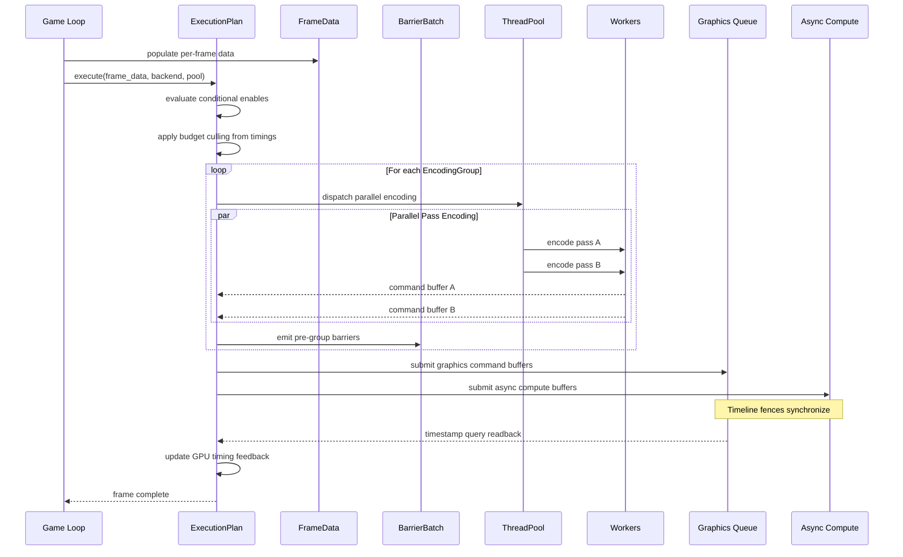

### Resource Lifetime and Aliasing

The aliasing allocator computes lifetime intervals from the sorted execution order:

1. **Lifetime interval:** For each transient resource, find the first pass that writes it and the
   last pass that reads it. The interval `[first_write, last_read]` is the resource's active
   lifetime.
2. **Interference graph:** Two resources interfere if their lifetime intervals overlap. Build an
   undirected graph where edges connect interfering resources.
3. **Graph coloring:** Assign resources to heap slots using greedy graph coloring. Non-interfering
   resources sharing a color alias to the same physical memory.
4. **Heap packing:** For each color, allocate a contiguous heap region sized to the largest resource
   in that color class. Record heap offset per resource.

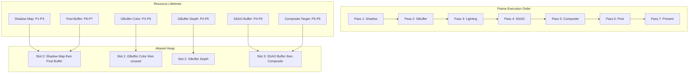

### Barrier Analysis Algorithm

The barrier analyzer processes the topologically sorted pass list and emits the minimal barrier set:

1. **Track resource state.** Maintain a map from `ResourceHandle` to current
   `(AccessMode, UsageType, QueueAffinity)`.
2. **For each pass in execution order:**
   - For each resource read/write declaration, compare against the resource's current state.
   - If a transition is needed (different usage type, access mode, or queue), emit a barrier.
   - If the backend supports split barriers, emit the begin half as early as possible (immediately
     after the producing pass) and the end half immediately before the consuming pass.
3. **Merge compatible barriers.** Barriers at the same synchronization point targeting the same
   resource are merged into a single API call.
4. **Cross-queue transfers.** When source and destination queues differ, emit a release barrier on
   the source queue and an acquire barrier on the destination queue, with a timeline fence between
   them.

### Budget Culling Flow

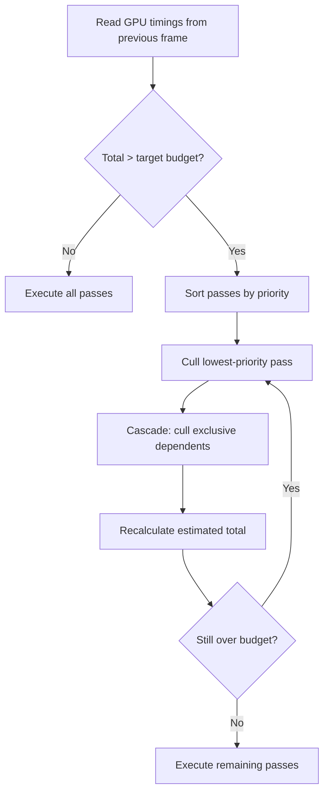

## Frame Budget Integration

The render graph uses [`FrameBudget`](../core-runtime/shared-primitives.md#7-framebudget) from
shared primitives to enforce per-frame GPU time caps. Budget feedback from GPU timestamp queries
drives culling decisions during graph execution. The budget check runs after the culling pass and
before command encoding begins.

**Check location.** The budget is checked at two points in the frame: (1) pre-execution culling --
after `ExecutionPlan` evaluates conditional enables, the budget culler reads GPU timings from the
previous frame and drops passes that would push the frame over target; (2) mid-culling re-check --
after each pass is culled, the estimated total is recalculated and if still over budget, the next
lowest-priority pass is culled.

| Priority | Action                             | Trigger         |
|----------|------------------------------------|-----------------|
| 1        | Drop lowest-priority render passes | Budget exceeded |
| 2        | Increase culling aggressiveness    | Budget exceeded |
| 3        | Skip optional compute passes       | Budget exceeded |
| 4        | Cascade-cull dependents            | Pass culled     |

1. **1** — Optional passes (SSAO, motion blur, bloom) are culled first based on `PassPriority`
   assigned at registration
2. **2** — Tighten frustum culling threshold to reduce draw call count by shrinking effective draw
   distance
3. **3** — Async compute work (GPU particle updates, screen-space reflections) is deferred to next
   frame
4. **4** — All passes that exclusively depend on culled pass outputs are also removed from the
   execution plan

The following flowchart shows the render graph budget check loop.

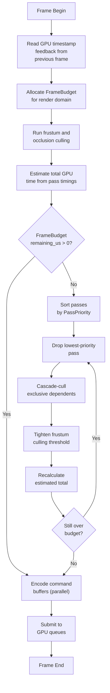

**Pseudocode.**

```rust
pub fn execute(
    plan: &ExecutionPlan,
    frame_data: &FrameData,
    backend: &mut GpuBackend,
    pool: &ThreadPool,
    budget: &mut FrameBudget,
) {
    plan.evaluate_conditionals(frame_data);

    // Read previous frame's GPU timings.
    let timings = backend.read_timestamp_queries();
    let estimated_total = timings.sum_active_passes(plan);

    // Cull passes until within budget.
    while estimated_total > budget.remaining_us()
        && plan.has_cullable_passes()
    {
        let pass = plan.lowest_priority_pass();
        plan.cull_pass(pass);
        plan.cascade_cull_dependents(pass);
        estimated_total =
            timings.sum_active_passes(plan);
    }

    // Tighten frustum culling if still tight.
    if budget.remaining_us()
        < plan.tight_budget_threshold_us
    {
        frame_data.culling_params.shrink_draw_distance(
            plan.distance_reduction_factor,
        );
    }

    // Encode and submit.
    plan.encode_parallel(
        frame_data, backend, pool,
    );
    backend.submit_all_queues();
}
```

## Platform Considerations

### Backend-Specific Barrier Strategy

| Backend | Barrier Mechanism       |
|---------|-------------------------|
| D3D12   | `ResourceBarrier`       |
| Vulkan  | `vkCmdPipelineBarrier2` |
| Metal   | Driver hazard tracking  |

1. **D3D12** — Yes (`D3D12_RESOURCE_BARRIER_FLAG_BEGIN_ONLY` / `END_ONLY`)
   - **Notes:** Enhanced barriers on FL 12.2+ reduce barrier count
2. **Vulkan** — Yes (`VK_DEPENDENCY_BY_REGION_BIT`)
   - **Notes:** Memory barriers preferred over image layout transitions where possible
3. **Metal**
   - **Notes:** Fences only at queue boundaries; no explicit barriers within a queue

### Backend-Specific Resource Aliasing

| Backend |
|---------|
| D3D12   |
| Vulkan  |
| Metal   |

1. **D3D12** — Placed resources in `ID3D12Heap`
   - **Transient Optimization:** Committed + placed mixing
2. **Vulkan** — `VkDeviceMemory` aliasing with `VK_MEMORY_PROPERTY_LAZILY_ALLOCATED_BIT`
   - **Transient Optimization:** Memoryless on mobile (tile-local)
3. **Metal** — `MTLHeap` with `makeAliasable()`
   - **Transient Optimization:** `MTLStorageModeMemoryless` for tile-local attachments

### Backend-Specific Queue Model

| Backend |
|---------|
| D3D12   |
| Vulkan  |
| Metal   |

1. **D3D12** — Direct queue
   - **Async Compute:** Compute queue
   - **Transfer:** Copy queue
   - **Fences:** `ID3D12Fence` timeline values
2. **Vulkan** — Graphics queue family
   - **Async Compute:** Compute queue family
   - **Transfer:** Transfer queue family
   - **Fences:** `VkSemaphore` timeline mode
3. **Metal** — `MTLCommandQueue` (shared)
   - **Async Compute:** `MTLCommandQueue` (private)
   - **Transfer:** Shared queue
   - **Fences:** `MTLEvent` / `MTLSharedEvent`

### Backend-Specific Parallel Encoding

| Backend |
|---------|
| D3D12   |
| Vulkan  |
| Metal   |

1. **D3D12** — `ID3D12GraphicsCommandList` per thread, `ExecuteCommandLists` batch submit
   - **Notes:** Command allocator per thread per frame
2. **Vulkan** — Secondary `VkCommandBuffer` per thread, `vkCmdExecuteCommands`
   - **Notes:** `VkCommandPool` per thread
3. **Metal** — `MTLParallelRenderCommandEncoder`
   - **Notes:** Encodes render passes in parallel within a single command buffer

### Platform Budget Targets

| Platform | Target Budget | Max Views | Streaming Pool |
|----------|--------------|-----------|----------------|
| Mobile | 16-33 ms | 4 | 256-512 MB |
| Switch | 16 ms (docked) / 33 ms (handheld) | 8 | 1 GB |
| Desktop | 16 ms | Configurable (dozens) | 2-4 GB |
| High-end | 8-16 ms | Unlimited + VR stereo | 8+ GB |

### Proposed Dependencies

| Crate      |
|------------|
| `smallvec` |
| `bitflags` |

1. **`smallvec`** — Inline-allocated small vectors for pass dependency lists
   - **Justification:** Avoids heap allocation for common case (< 8 deps)
2. **`bitflags`** — Usage flag bitfields
   - **Justification:** Ergonomic bitflag operations

All GPU backend interaction goes through `harmonius_gpu` and `harmonius_gpu_runtime`. No direct
backend API calls from the render graph crate.

## Test Plan

### Unit Tests

| Test                                | Req     |
|-------------------------------------|---------|
| `test_empty_graph_error`            | RG-13.4 |
| `test_cycle_detection`              | RG-5.7  |
| `test_single_writer_violation`      | RG-3.5  |
| `test_undeclared_resource`          | RG-13.4 |
| `test_topological_sort_stability`   | RG-5.6  |
| `test_topological_sort_correctness` | RG-5.1  |
| `test_dead_pass_elimination`        | RG-13.2 |
| `test_transitive_dead_pass`         | RG-13.3 |
| `test_capability_gate_soft`         | RG-6.2  |
| `test_capability_gate_hard`         | RG-6.2  |
| `test_fallback_chain`               | RG-6.3  |
| `test_variant_selection`            | RG-13.7 |
| `test_conditional_enable`           | RG-1.6  |
| `test_conditional_cascade`          | RG-1.6  |
| `test_barrier_raw`                  | RG-3.1  |
| `test_barrier_waw`                  | RG-3.2  |
| `test_barrier_merge`                | RG-3.6  |
| `test_split_barrier`                | RG-3.6  |
| `test_cross_queue_barrier`          | RG-3.4  |
| `test_aliasing_non_overlapping`     | RG-8.2  |
| `test_aliasing_overlapping`         | RG-8.2  |
| `test_aliasing_efficiency`          | RG-8.6  |
| `test_queue_affinity_graphics`      | RG-4.1  |
| `test_queue_affinity_compute`       | RG-4.2  |
| `test_queue_fallback`               | RG-4.5  |
| `test_encoding_groups`              | RG-10.4 |
| `test_sub_graph_instances`          | RG-9.5  |
| `test_sub_graph_shared`             | RG-9.3  |
| `test_sub_graph_array_layer`        | RG-9.4  |
| `test_instance_count_mismatch`      | RG-13.8 |
| `test_history_resource`             | RG-2.4  |
| `test_resolution_scaled`            | RG-2.5  |
| `test_budget_cull_lowest`           | RG-7.2  |
| `test_budget_cascade`               | RG-7.3  |
| `test_budget_never_cull_required`   | RG-7.2  |
| `test_render_area_constraint`       | RG-1.9  |
| `test_pass_chain_order`             | RG-1.3  |
| `test_host_callback_no_gpu`         | RG-1.7  |
| `test_diagnostics_pass_timing`      | RG-12.1 |
| `test_diagnostics_stripped`         | RG-12.7 |

1. **`test_empty_graph_error`** — Empty graph produces `EmptyGraph` error.
2. **`test_cycle_detection`** — A -> B -> C -> A cycle produces `CycleDetected` error with all three
   handles.
3. **`test_single_writer_violation`** — Two passes writing the same resource in overlapping window
   produces `SingleWriterViolation`.
4. **`test_undeclared_resource`** — Reading a resource not declared in any pass produces
   `UndeclaredResource`.
5. **`test_topological_sort_stability`** — Same graph compiled twice produces identical pass
   ordering.
6. **`test_topological_sort_correctness`** — Every pass executes after all its dependencies.
7. **`test_dead_pass_elimination`** — Pass whose outputs are unused is eliminated from the plan.
8. **`test_transitive_dead_pass`** — Cascading elimination of orphaned producer chains.
9. **`test_capability_gate_soft`** — Soft-gated pass pruned when capability absent; no error.
10. **`test_capability_gate_hard`** — Hard-gated pass with missing capability produces
    `CapabilityNotMet`.
11. **`test_fallback_chain`** — Fallback chain selects first capable variant.
12. **`test_variant_selection`** — Exactly one variant active per slot; zero or two produces error.
13. **`test_conditional_enable`** — Disabled pass excluded from execution without recompilation.
14. **`test_conditional_cascade`** — Disabling a pass cascades to its exclusive dependents.
15. **`test_barrier_raw`** — Read-after-write produces exactly one barrier.
16. **`test_barrier_waw`** — Write-after-write produces execution barrier.
17. **`test_barrier_merge`** — Compatible barriers at the same point merge into one.
18. **`test_split_barrier`** — Split barrier begin/end placed at optimal points.
19. **`test_cross_queue_barrier`** — Cross-queue resource transfer emits release+acquire barrier
    pair.
20. **`test_aliasing_non_overlapping`** — Two non-overlapping transient resources share the same
    heap offset.
21. **`test_aliasing_overlapping`** — Overlapping resources get distinct heap offsets.
22. **`test_aliasing_efficiency`** — Aliased heap < sum of all transient resource sizes.
23. **`test_queue_affinity_graphics`** — Graphics-affinity pass assigned to graphics queue.
24. **`test_queue_affinity_compute`** — Async-compute pass on dedicated compute queue.
25. **`test_queue_fallback`** — Compute pass falls back to graphics when no compute queue.
26. **`test_encoding_groups`** — Independent passes in same group; dependent passes in separate
    groups.
27. **`test_sub_graph_instances`** — 4-instance sub-graph produces 4 exclusive resource sets.
28. **`test_sub_graph_shared`** — Shared resource across instances has single allocation.
29. **`test_sub_graph_array_layer`** — Each instance writes correct array layer.
30. **`test_instance_count_mismatch`** — Instance count > array layers produces error.
31. **`test_history_resource`** — History resource current/previous handles resolve correctly.
32. **`test_resolution_scaled`** — Scaled resource dimensions update with resolution_scale.
33. **`test_budget_cull_lowest`** — Over-budget culls lowest-priority pass first.
34. **`test_budget_cascade`** — Culled pass cascades to its exclusive consumers.
35. **`test_budget_never_cull_required`** — Required-priority passes never culled.
36. **`test_render_area_constraint`** — Render area propagates to aliasing write coverage.
37. **`test_pass_chain_order`** — Chain steps execute in declaration order.
38. **`test_host_callback_no_gpu`** — Host callback pass submits zero GPU commands.
39. **`test_diagnostics_pass_timing`** — Timestamp query pairs emitted per pass when diagnostics
    enabled.
40. **`test_diagnostics_stripped`** — No timestamp queries when diagnostics disabled.

### Integration Tests

| Test                                 | Req     |
|--------------------------------------|---------|
| `test_full_frame_graph`              | RG-13.1 |
| `test_multi_view_shadow_cascades`    | RG-9.1  |
| `test_vr_stereo_graph`               | RG-9.1  |
| `test_parallel_encoding_correctness` | RG-10.1 |
| `test_streaming_fallback`            | RG-11.1 |
| `test_recompilation_trigger`         | RG-13.5 |
| `test_incremental_recompile`         | RG-13.6 |
| `test_d3d12_barrier_mapping`         | RG-3.1  |
| `test_vulkan_barrier_mapping`        | RG-3.1  |
| `test_metal_no_intra_queue_barriers` | RG-3.1  |

1. **`test_full_frame_graph`** — Build a realistic frame graph (shadow, GBuffer, lighting, post,
   present), compile, and verify correct barrier placement, queue assignment, and aliasing.
2. **`test_multi_view_shadow_cascades`** — 4 shadow cascade views with shared scene data,
   per-instance matrices, and array layer output. Verify 4 instances, 1 shared allocation, 4 layer
   writes.
3. **`test_vr_stereo_graph`** — VR stereo graph with 2 eye views sharing culling pass. Verify shared
   passes execute once.
4. **`test_parallel_encoding_correctness`** — Encode a 20-pass graph on 4 threads. Verify command
   buffer contents match sequential encoding.
5. **`test_streaming_fallback`** — Pass depends on streamed resource. Before arrival, placeholder
   bound. After arrival, real resource bound.
6. **`test_recompilation_trigger`** — Parameter changes do not trigger recompilation. Adding a pass
   does trigger recompilation.
7. **`test_incremental_recompile`** — Residency change recompiles only affected barriers.
8. **`test_d3d12_barrier_mapping`** — On D3D12 backend, verify barriers emit `ResourceBarrier` calls
   with correct state transitions.
9. **`test_vulkan_barrier_mapping`** — On Vulkan backend, verify barriers emit
   `vkCmdPipelineBarrier2` with correct access masks.
10. **`test_metal_no_intra_queue_barriers`** — On Metal backend, verify no barriers emitted within a
    single queue (driver hazard tracking).

### Benchmarks

| Benchmark | Target | Source |
|-----------|--------|--------|
| Graph compilation (50 passes) | < 1 ms | US-2.2.12.1 |
| Per-frame execution overhead | < 0.5 ms | US-2.2.1.2 |
| Parallel encoding speedup (8 threads) | >= 4x vs single-threaded | US-2.2.10.1 |
| Aliasing efficiency (typical frame) | >= 40% memory saved | US-2.2.4.1 |
| Budget culling decision | < 50 us | US-2.2.8.1 |
| Barrier analysis (50 passes) | < 200 us | US-2.2.5.1 |
| Diagnostic export | < 1 ms | US-2.2.13.1 |

## Design Q & A

**Q1. What is the biggest constraint limiting this design?**

The compile-once-execute-many-frames model (F-2.2.12) constrains the graph to a fixed topology
between recompilation events. This means dynamic pass insertion (e.g., adding a new shadow cascade
mid-frame or spawning a new reflection probe) requires a full graph recompilation. The streaming
integration (F-2.2.11) works around this with placeholder resources, but truly dynamic graph
topologies are not supported. Lifting this constraint would enable per-frame graph construction (as
in Frostbite's frame graph), but the recompilation cost (barrier analysis, aliasing, queue
assignment) would run every frame. The compile-once model saves 200+ microseconds per frame (per the
barrier analysis benchmark) at the cost of topology flexibility.

**Q2. How can this design be improved?**

The capability gating system (F-2.2.2) uses hard and soft gates (RG-6.2) but the interaction between
capability gates and budget culling (F-2.2.8) is underspecified. A pass may be capability- gated to
a fallback implementation that is itself budget-culled, leaving no implementation active. The design
should specify a minimum-quality floor that cannot be budget-culled. The 119 requirements across 14
categories (RG-1 through RG-14) make this the most complex subsystem in the engine, and the
requirement density increases the risk of implementation gaps. The multi-view execution system
(F-2.2.9) supports dozens of concurrent views but does not specify memory scaling -- each view may
allocate its own transient resources, potentially exceeding VRAM on mobile.

**Q3. Is there a better approach?**

A task-graph approach (like Halcyon's or bgfx's) that treats each pass as a task with explicit
resource dependencies would be simpler than the full DAG compilation model. Task graphs skip barrier
analysis by requiring passes to declare explicit transitions. We chose the DAG compilation model
because automatic barrier insertion (F-2.2.5) eliminates an entire class of GPU synchronization bugs
that are notoriously hard to debug. The compilation cost is amortized over hundreds of frames, and
the correctness guarantee (RG-3.1 through RG-3.6 covering all hazard types) justifies the upfront
complexity. Manual barrier declaration would be error-prone given the engine's 50+ render passes
across all subsystems.

**Q4. Does this design solve all customer problems?**

The design lacks explicit support for render graph visualization in the editor viewport. RG-12.6
provides conditional debug overlays, and F-2.2.13 provides diagnostic export, but there is no user
story for artists interactively inspecting the live render graph topology to understand why a pass
was culled or how resources are aliased. Adding a visual graph editor that displays the compiled DAG
in real time (similar to RenderDoc's frame browser but integrated into the engine editor) would help
technical artists diagnose performance issues without external tools. The streaming integration
(F-2.2.11) also lacks a user story for prioritizing which streamed resources load first based on
screen-space importance.

**Q5. Is this design cohesive with the overall engine?**

The render graph is the orchestration backbone that all rendering subsystems depend on, and its
typed pass descriptor model (RG-1.1) enforces a consistent interface across all passes. The resource
aliasing system (F-2.2.4) integrates with the GPU sub-allocator (F-2.1.7) through placed allocations
(GR-1.4), maintaining a clean layering. The parallel encoding system (F-2.2.10) uses scoped tasks
from the thread pool (F-14.3.1), aligning with the engine's concurrency model. One divergence is
that the graph compiler's topological sort produces a deterministic order (RG-5.6) that may differ
from the execution order that a GPU work graph (F-2.1.10, RG-1.13) would produce, since work graphs
allow GPU-side scheduling. The design handles this by treating work graph passes as opaque nodes in
the DAG, but this means work graph internal scheduling is invisible to the render graph diagnostics
(F-2.2.13).

## Safety Guarantees

All render graph APIs are safe Rust. Internal `unsafe` is confined to platform FFI wrappers and is
audited with documented invariants.

| Guarantee                          |
|------------------------------------|
| **No unsafe in public API.**       |
| **Compile-time validation.**       |
| **Scoped borrows.**                |
| **Type-safe resource handles.**    |
| **Internal unsafe encapsulation.** |

1. ****No unsafe in public API.**** — All user-facing types (`GraphBuilder`, `PassBuilder`,
   `ExecutionPlan`, `RenderGraphPhase`) and functions are safe Rust. No `unsafe` in any public
   signature.
2. ****Compile-time validation.**** — Graph compilation catches resource conflicts, missing
   dependencies, cycle detection, single-writer violations, and invalid access patterns before any
   GPU work is submitted.
3. ****Scoped borrows.**** — All GPU command encoding uses scoped borrows. `PassEncoder<'a>` borrows
   the command buffer for the encoding scope only -- command buffers cannot outlive their encoding
   scope.
4. ****Type-safe resource handles.**** — GPU resources use generational handles (`Handle<T>` /
   `ResourceHandle` with version field). No raw pointers. Dangling references are impossible --
   stale handles fail validation at lookup time.
5. ****Internal unsafe encapsulation.**** — Platform FFI (Metal, D3D12, Vulkan) is encapsulated
   behind safe wrapper types in `harmonius_gpu`. Unsafe blocks document safety invariants inline. No
   unsafe propagates to render graph consumers.

### Scoped Borrow Model

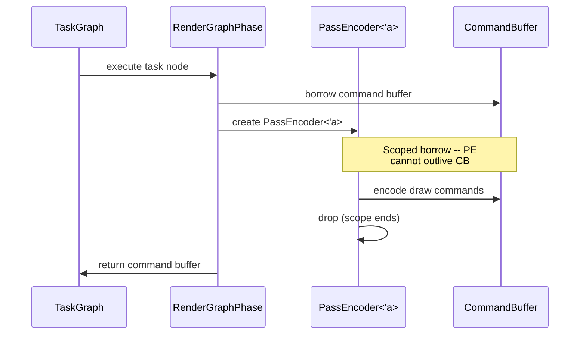

### Generational Handle Safety

```rust
/// Stale handles are caught at lookup time.
/// The version field prevents use-after-free.
pub struct ResourceHandle {
    pub(crate) index: u32,
    pub(crate) version: u32,
}

/// ResourceTable validates generation on every
/// access. Returns Err if the handle is stale.
impl ResourceTable {
    pub fn get(
        &self,
        handle: ResourceHandle,
    ) -> Result<&Resource, RenderGraphError>;
}
```

## Open Questions

1. **Aliasing heuristic** -- Greedy graph coloring is simple but may not minimize heap size
   optimally. Should we use interval scheduling (optimal for interval graphs) or a more
   sophisticated register-allocation-style algorithm? Interval scheduling is O(n log n) and optimal
   when lifetimes are contiguous intervals, which they are for topologically sorted passes.

2. **Split barrier placement** -- The current design places split barrier begins immediately after
   the producing pass. An alternative is to defer the begin until the last pass that does not need
   the resource, maximizing overlap. This requires a second backward pass over the schedule. Is the
   additional compile-time complexity justified?

3. **Dynamic transfer pass injection** -- RG-11.4 and RG-14.7 require runtime injection of transfer
   passes without full recompilation. The current design supports this via designated injection
   points in the compiled plan. The open question is whether injected passes should participate in
   aliasing (requiring partial recompilation) or use dedicated staging memory outside the aliased
   heap.

4. **Work graph integration** -- RG-1.13 requires a GPU work graph pass type. When the
   `WorkGraphRuntime` (GR-3.x) is used, the render graph's barrier and scheduling analysis may
   conflict with GPU-side self-scheduling. The boundary between render-graph-managed and GPU-managed
   scheduling needs to be defined.

5. **Incremental recompilation scope** -- RG-13.6 asks for partial recompilation on residency
   changes. The minimum recompilation unit needs to be defined: per-pass barrier recomputation,
   per-encoding-group, or per-queue-timeline.

6. **Diagnostic overhead opt-in granularity** -- RG-12.7 requires per-query opt-out. Should
   diagnostic instrumentation be controlled via a compile-time feature flag
   (`cfg(feature = "rg-diagnostics")`), a runtime flag in `CompilationConfig`, or both? The current
   design uses `CompilationConfig::diagnostics_enabled` for runtime control and `cfg` for zero-cost
   stripping in shipping builds.
