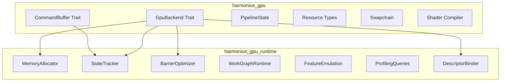
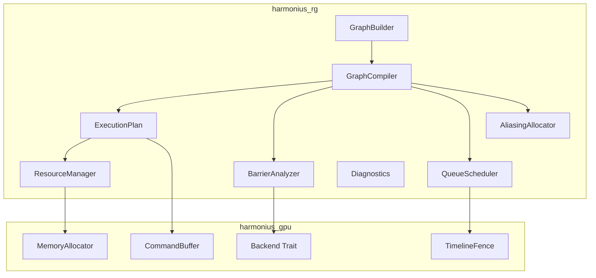
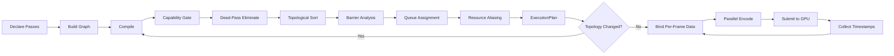
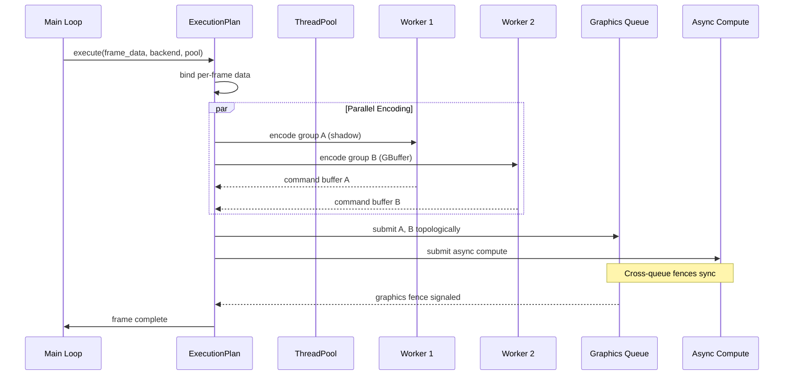
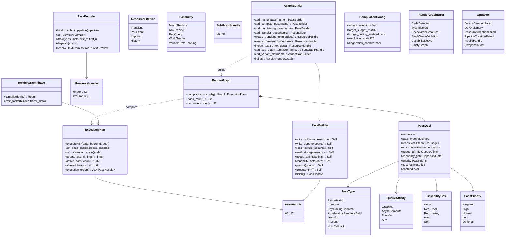
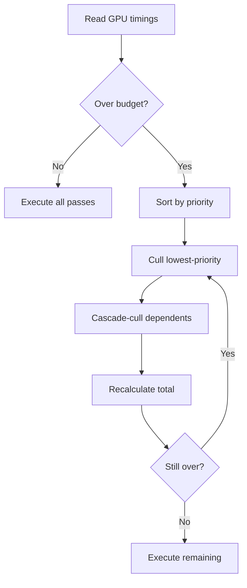
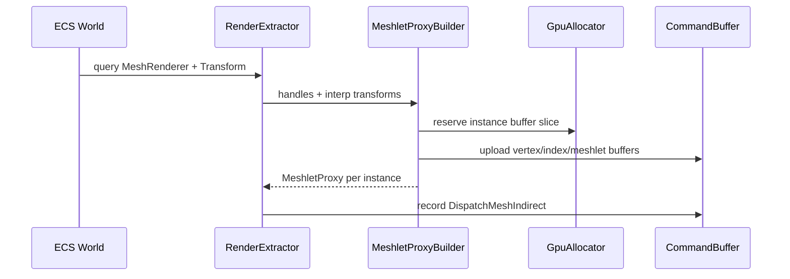

# Render Pipeline Design

GPU hardware abstraction layer and render graph -- the foundational pipeline infrastructure for all
rendering subsystems.

## Requirements Trace

> **Canonical sources:** Features, requirements, and user stories are defined in
> [features/](../../features/), [requirements/](../../requirements/), and
> [user-stories/](../../user-stories/).

### GPU Backend Trait and Interface (2.1)

| Feature  | Requirement |
|----------|-------------|
| F-2.1.1  | R-2.1.1     |
| F-2.1.2  | R-2.1.2     |
| F-2.1.3  | R-2.1.3     |
| F-2.1.4  | R-2.1.4     |

1. **F-2.1.1** -- GPU backend trait, static dispatch via generics
2. **F-2.1.2** -- Command buffer for graphics, compute, copy
3. **F-2.1.3** -- Unified pipeline state objects pre-validated
4. **F-2.1.4** -- Vulkan backend via `ash` on all platforms

### GPU Runtime (2.1 continued)

| Feature  | Requirement |
|----------|-------------|
| F-2.1.7  | R-2.1.7     |
| F-2.1.8  | R-2.1.8     |
| F-2.1.9  | R-2.1.9     |
| F-2.1.10 | R-2.1.10    |
| F-2.1.11 | R-2.1.11    |
| F-2.1.12 | R-2.1.12    |

1. **F-2.1.7** -- GPU heap sub-allocation from pre-allocated blocks
2. **F-2.1.8** -- CPU-side state tracking, redundant filter
3. **F-2.1.9** -- Barrier batching, merging, split barriers
4. **F-2.1.10** -- GPU work graph support (native + emulated)
5. **F-2.1.11** -- Cross-backend feature emulation
6. **F-2.1.12** -- GPU performance queries and profiling

### GPU Runtime Requirements

GPU Runtime requirements moved to canonical `R-2.14.*` IDs in
[requirements/rendering/gpu-runtime.md](../../requirements/rendering/gpu-runtime.md). The legacy
`GR-*` prefix is retired; the requirements file's Legacy ID Mapping table preserves trace
continuity.

| Requirement                  |
|------------------------------|
| R-2.14.1.1 through R-2.14.1.11 |
| R-2.14.2.1 through R-2.14.2.7  |
| R-2.14.3.1 through R-2.14.3.9  |
| R-2.14.4.1 through R-2.14.4.9  |

1. **R-2.14.1.x** -- Memory: unified allocator, sub-alloc, ring, defrag, budgets, sparse
2. **R-2.14.2.x** -- State tracking: pipeline/descriptor/dynamic/push caches, reset
3. **R-2.14.3.x** -- Work graph: native/emulated, sync fidelity
4. **R-2.14.4.x** -- Feature emulation: barriers, RT, mesh shaders

### Render Graph (2.2)

| Feature  | Requirement             |
|----------|-------------------------|
| F-2.2.1  | RG-1.1, RG-1.2, RG-1.3 |
| F-2.2.2  | RG-6.1 .. RG-6.7       |
| F-2.2.3  | RG-2.1, RG-2.5, RG-2.6 |
| F-2.2.4  | RG-8.1 .. RG-8.6       |
| F-2.2.5  | RG-3.1 .. RG-3.6       |
| F-2.2.6  | RG-4.1 .. RG-4.6       |
| F-2.2.7  | RG-5.1, RG-5.6, RG-5.7 |
| F-2.2.8  | RG-7.1 .. RG-7.6       |
| F-2.2.9  | RG-9.1 .. RG-9.5       |
| F-2.2.10 | RG-10.1 .. RG-10.7     |
| F-2.2.11 | RG-11.1 .. RG-11.7     |
| F-2.2.12 | RG-13.1 .. RG-13.8     |
| F-2.2.13 | RG-12.1 .. RG-12.7     |

1. **F-2.2.1** -- Declarative pass registration with typed I/O
2. **F-2.2.2** -- Capability gating and fallback chains
3. **F-2.2.3** -- Transient resource declaration
4. **F-2.2.4** -- Resource aliasing for memory reuse
5. **F-2.2.5** -- Automatic barrier insertion
6. **F-2.2.6** -- Multi-queue scheduling
7. **F-2.2.7** -- Topological sort, deterministic ordering
8. **F-2.2.8** -- Budget culling
9. **F-2.2.9** -- Multi-view execution
10. **F-2.2.10** -- Parallel command encoding
11. **F-2.2.11** -- Streaming integration
12. **F-2.2.12** -- Graph compilation and caching
13. **F-2.2.13** -- Render graph diagnostics

### Non-Functional Requirements

| NFR | Target |
|-----|--------|
| NFR-2.1.1 | Abstraction < 5% overhead vs raw API (10k draws) |
| NFR-2.1.2 | OS GPU allocs < 64/frame, O(1) sub-alloc |
| NFR-2.1.3 | State tracker >= 20% reduction, <= 64 KB/cmd buf |

## Overview

### GPU Abstraction Layer

The GPU abstraction provides a unified, type-safe Vulkan interface on all platforms. Two crates:

1. **`harmonius_gpu`** -- Backend trait interface. Defines `GpuBackend`, `CommandBuffer`,
   `PipelineState`, resources, swapchain, shader compilation. Static dispatch via `cfg`-gated type
   aliases eliminates vtable overhead.
2. **`harmonius_gpu_runtime`** -- Shared services: memory sub-allocation, state tracking, barrier
   optimization, descriptor binding, work graphs, feature emulation, profiling.

GLSL is the sole shader language. The bundled `naga` crate compiles GLSL to SPIR-V in-process during
asset processing. No runtime shader compilation in shipping builds.

### Render Graph

The render graph is a DAG-based frame graph modeling an entire frame's GPU work as typed passes
connected by resource dependencies. The compiler derives barriers, queue assignments, resource
lifetimes, memory aliasing, and execution order.

Key goals:

1. **Zero manual barriers** -- derived from resource declarations
2. **Minimal VRAM** -- transient resources share memory via interference-graph aliasing
3. **Multi-queue overlap** -- async compute/transfer overlap
4. **Parallel encoding** -- independent passes encode on threads
5. **Compile once, execute many** -- topology-data separation
6. **Budget-aware** -- GPU timing feedback drives pass culling

## Architecture

### GPU Module Boundaries



### Render Graph Module Boundaries



### Shader Compilation Pipeline


### Graph Lifecycle



### Parallel Encoding and Submission



### Core Class Diagram

```mermaid
classDiagram
    class GpuBackend {
        +Device: GpuDevice
        +CommandBuffer: CommandBuffer
        +Swapchain: Swapchain
        +Fence: GpuFence
        +name() &str
        +create_device(config) Result~Device~
    }

    class GpuDevice {
        +create_buffer(desc) Result~BufferHandle~
        +create_texture(desc) Result~TextureHandle~
        +create_sampler(desc) Result~SamplerHandle~
        +create_graphics_pipeline(desc) Result
        +create_compute_pipeline(desc) Result
        +submit(queue, bufs, signal, wait) Result
        +create_fence(initial) Result~FenceHandle~
        +poll_fence(handle, value) bool
        +capabilities() DeviceCapabilities
        +memory_budget() GpuMemoryBudget
    }

    class CommandBuffer {
        +begin() Result
        +end() Result
        +begin_render_pass(desc)
        +end_render_pass()
        +bind_graphics_pipeline(handle)
        +bind_compute_pipeline(handle)
        +bind_group(index, group)
        +draw(verts, insts, first_v, first_i)
        +draw_indexed_indirect(buf, off, cnt, stride)
        +dispatch(x, y, z)
        +resource_barrier(barriers)
        +set_viewport(viewport)
    }

    class GpuHandle~T~ {
        +index u32
        +generation u32
    }

    class Format {
        R8Unorm
        Rgba8Unorm
        Rgba16Float
        Depth32Float
        Bc7Unorm
    }

    class ResourceState {
        Undefined
        ShaderRead
        ShaderWrite
        RenderTarget
        DepthStencilWrite
        Present
    }

    class QueueType {
        Graphics
        Compute
        Copy
    }

    class GpuAllocator {
        +alloc(desc) Result~GpuAllocation~
        +alloc_committed(desc) Result~GpuAllocation~
        +alloc_placed(heap, desc) Result~GpuAllocation~
        +alloc_ring(size, align) Result~RingSlice~
        +free(alloc)
        +defragment_step() bool
        +advance_frame()
        +query_budget() GpuMemoryBudget
    }

    class GpuAllocation {
        +heap_index u32
        +offset u64
        +size u64
        +heap_type HeapType
    }

    class RingBuffer {
        +alloc(size, align) Result~RingSlice~
        +advance_frame()
    }

    class HeapType {
        Local
        Upload
        Readback
    }

    class TrackedCommandBuffer~B~ {
        +begin() Result
        +end() Result
        +bind_graphics_pipeline(handle)
        +bind_group(index, group)
        +set_viewport(vp)
        +resource_state(resource) ResourceState
    }

    class BarrierOptimizer {
        +transition(resource, before, after)
        +begin_split_barrier(resource, before, after)
        +flush~B~(cmd)
        +has_pending() bool
    }

    class GpuProfiler {
        +begin_query~B~(cmd, label)
        +end_query~B~(cmd)
        +resolve_previous_frame() Vec~GpuPassTiming~
        +advance_frame()
    }

    class DeviceCapabilities {
        +backend BackendType
        +mesh_shaders bool
        +ray_tracing bool
        +work_graphs bool
        +bindless_resources bool
        +max_texture_dimension_2d u32
        +local_memory_size u64
    }

    class FeatureEmulation {
        +new(caps) Self
        +dispatch_mesh~B~(cmd, x, y, z)
        +trace_rays~B~(cmd, w, h, d)
    }

    class WorkGraphRuntime {
        +compile(desc) Result~WorkGraphHandle~
        +dispatch~B~(cmd, handle, input)
        +emit_tasks(builder, handle, feedback)
        +is_native() bool
    }

    class ShaderCompiler {
        +new() Result~Self~
        +compile(desc) Result~ShaderCompileResult~
    }

    class ShaderTarget {
        SpirV
    }

    class BackendType {
        Vulkan
    }

    GpuBackend --> GpuDevice
    GpuBackend --> CommandBuffer
    GpuDevice --> GpuHandle
    GpuAllocator *-- RingBuffer
    GpuAllocator --> GpuAllocation
    GpuAllocator --> HeapType
    TrackedCommandBuffer --> CommandBuffer
    BarrierOptimizer --> ResourceState
    GpuProfiler --> DeviceCapabilities
    FeatureEmulation --> DeviceCapabilities
    WorkGraphRuntime --> DeviceCapabilities
    ShaderCompiler --> ShaderTarget
```



### Render Graph Class Diagram



## API Design

### Descriptor Binding Model

| Bind Group | Frequency | Contents |
|------------|-----------|----------|
| 0 | Per-frame | Global constants, shadow maps, IBL |
| 1 | Per-pass | Render targets, pass constants |
| 2 | Per-material | Textures, material params, samplers |
| 3 | Per-draw | Transform, instance data |

### Backend Mapping

| Backend | BindGroup mapping |
|---------|-------------------|
| Vulkan | Root signature table entries |
| Vulkan | VkDescriptorSet per bind group |
| Vulkan | Argument buffer per bind group |

### Resource Aliasing Algorithm

1. **Lifetime interval** -- find first write, last read
2. **Interference graph** -- edges for overlapping lifetimes
3. **Graph coloring** -- greedy color assignment
4. **Heap packing** -- largest resource per color class

### Budget Culling Flow



### PSO Cache

The full design lives in [pipeline-state-cache.md](pipeline-state-cache.md). The following
integration points connect it to this document:

| Touchpoint                  | Location in this doc              | Consumer API             |
|-----------------------------|-----------------------------------|--------------------------|
| Lookup on pass execute      | `ExecutionPlan::execute`          | `PsoCache::get_or_build` |
| Content hash from bytecode  | `ShaderCompiler::compile` result  | `PsoKey`                 |
| Invalidate on hot-reload    | Hot-reload flow in RF-9           | `PsoCache::invalidate`   |
| Descriptor layout           | "Descriptor Layout Inference"     | `DescriptorLayout`       |
| Per-device isolation        | Backend init                      | `DeviceFingerprint`      |
| LRU + GC                    | End-of-frame cleanup              | `PsoCache::gc`           |

The cache is owned by the render thread, uses `SortedVecMap<PsoKey, PsoEntry>` on the hot path (no
`HashMap`), and serializes PSOs to a per-device-fingerprint directory via rkyv. See the companion
design for key format, disk layout, invalidation rules, corruption recovery, and hot-reload
integration.

### Meshlet Asset Pipeline

The full design lives in [meshlets.md](meshlets.md). This subsection shows how `MeshletAsset` flows
through the extract phase into GPU buffers owned by this document.



Key points:

1. `MeshletAsset` rkyv archives are mmap'd once at asset load. Their `BufferView`s become GPU buffer
   handles via `GpuDevice::create_buffer` with the rkyv range as initial data.
2. Extract records a `MeshletProxy` per visible entity (see [rendering-core.md](rendering-core.md)
   Material System section and Core Class Diagram).
3. The GPU culling compute pass reads the meshlet buffer directly — no CPU round-trip.
4. BLAS construction reads the same `vertex_buffer`/`index_buffer` via `GpuDevice::create_blas`
   (RF-2); see [meshlets.md](meshlets.md) BLAS section.

### Barrier Optimizer Algorithm

`BarrierOptimizer::analyze` groups resources by required state at each pass boundary, detects
transitions between passes, collapses redundant transitions, and emits split barriers where
profitable. Pseudocode:

```text
fn analyze(plan: &ExecutionPlan) -> Vec<BarrierBatch> {
    // 1. Group resources by required state per pass.
    let mut state_by_pass: SortedVecMap<PassHandle, SortedVecMap<ResourceId, ResourceState>>;
    for pass in plan.passes() {
        for usage in pass.reads().chain(pass.writes()) {
            state_by_pass[pass.handle()].insert(usage.resource, usage.required_state);
        }
    }

    // 2. Walk topological order, detect transitions per resource.
    let mut transitions: Vec<Transition> = Vec::new();
    let mut prev_state: SortedVecMap<ResourceId, ResourceState> = initial_states(plan);
    for pass in plan.topo_order() {
        for (res, new_state) in state_by_pass[pass.handle()].iter() {
            let old = prev_state.get(res).copied().unwrap_or(ResourceState::Undefined);
            if old != *new_state {
                transitions.push(Transition {
                    resource: *res, from: old, to: *new_state,
                    begin_pass: pass.handle(), end_pass: pass.handle(),
                });
                prev_state.insert(*res, *new_state);
            }
        }
    }

    // 3. Collapse redundant — if two consecutive passes transition the same resource to
    //    the same state, keep only the first.
    let collapsed = collapse_runs(&transitions);

    // 4. Emit split barriers: for transitions that are known ahead of time, begin the
    //    barrier on the last pass that uses the "from" state and end it on the first
    //    pass that needs the "to" state. This lets the GPU hide barrier cost behind
    //    intermediate work. Only emit split barriers when begin_pass != end_pass and
    //    the queue path allows it.
    let mut batches: Vec<BarrierBatch> = Vec::new();
    for t in collapsed {
        if plan.distance(t.begin_pass, t.end_pass) > 1 {
            batches.push(BarrierBatch::Split { begin: t.begin_pass, end: t.end_pass, ..t });
        } else {
            batches.push(BarrierBatch::Immediate { at: t.end_pass, ..t });
        }
    }
    batches
}
```

References: Wihlidal, "Optimizing Graphics Pipeline" (GDC 2016), and the Vulkan
`VK_KHR_synchronization2` spec (section on split / event-based barriers). Vulkan reference:
`VkMemoryBarrier2_FLAG_BEGIN_ONLY` / `VkMemoryBarrier2_FLAG_END_ONLY` in the
[Vulkan resource barriers documentation][d3d12-barriers].

### Swapchain Trait

```rust
pub trait Swapchain {
    /// Block until v-sync releases a backbuffer image. The only acceptable block on the
    /// render thread (see RF-1). Returns the resource handle for the image and its index
    /// in the triple buffer chain.
    fn acquire_backbuffer(&mut self) -> AcquiredBackbuffer;

    /// Submit a present of `color_resource` using the given command buffer. The command
    /// buffer must transition the resource to `ResourceState::Present` before calling.
    fn present(&mut self, cmd: &mut CommandBuffer, color_resource: ResourceHandle);

    /// Recreate the swapchain for a new window size. Idempotent; no-op if `w`/`h` match
    /// the current configuration.
    fn on_resize(&mut self, w: u32, h: u32);

    /// Return the currently negotiated color format (e.g. BGRA8Unorm or RGB10A2).
    fn current_format(&self) -> Format;
}

pub struct AcquiredBackbuffer {
    pub resource: ResourceHandle,
    pub buffer_index: u32,
    pub semaphore: FenceHandle,
}
```

The Vulkan backend implements `Swapchain`:

| Operation | Vulkan API |
|-----------|------------|
| `acquire_backbuffer` | `vkAcquireNextImageKHR` |
| `present` | `vkQueueSubmit` + `vkQueuePresentKHR` |

### Frame Synchronization

Harmonius uses a **triple-buffered** producer/consumer between the simulation (game worker threads)
and the render thread. The chain has three slots: **back** (producer writing), **middle** (ready for
consumer), and **front** (render thread reading).

Lifecycle per frame:

1. Game worker threads extract into the back slot of the `TripleBuffer<RenderFrame>`.
2. On completion, the producer atomically swaps back and middle. The middle slot now holds the
   freshest committed snapshot; any previous middle slot (if unconsumed) is discarded.
3. The render thread calls `Swapchain::acquire_backbuffer`. This is the only block on the render
   thread; v-sync gates the frame rate here.
4. After acquire, the render thread swaps middle and front, taking ownership of the latest
   `RenderFrame`. If the producer has not yet committed (back != middle), the render thread reuses
   the previous front (repeated frame), ensuring the render thread never stalls.
5. The render thread encodes command buffers from `front`, submits them, and calls
   `Swapchain::present(cmd, backbuffer.resource)`.
6. `PerFrameBuffer`s (see RF-10) are indexed by `frame_index % 3`. `poll_fence` confirms when
   in-flight GPU work on a given slot has retired, so its resources can be reused.

This guarantees: (a) simulation is never blocked by GPU, (b) render thread is only blocked by
v-sync, (c) up to 3 frames in flight, (d) no torn reads — each `RenderFrame` is an immutable
snapshot.

### Descriptor Layout Inference

`ShaderCompiler::compile` reads naga SPIR-V bytecode metadata via SPIR-V reflection and produces a
`DescriptorLayout`. The `DescriptorBinder` then allocates descriptor sets per layout and caches them
next to the PSO in the `PsoCache`.

```rust
pub struct ShaderCompileResult {
    pub bytecode: Vec<u8>,
    pub target: ShaderTarget,
    pub descriptor_layout: DescriptorLayout,
    pub permutation_key: PermutationKey,
}

impl ShaderCompiler {
    pub fn compile(&mut self, desc: &ShaderCompileDesc) -> Result<ShaderCompileResult, GpuError>;
    pub fn reflect(&self, bytecode: &[u8], target: ShaderTarget)
        -> Result<DescriptorLayout, GpuError>;
}

pub struct DescriptorLayout {
    pub bindings: SmallVec<[Binding; 8]>,
    pub push_constants: u32,
}

pub struct Binding {
    pub group: u32,
    pub slot: u32,
    pub kind: BindingKind,
    pub stages: ShaderStageFlags,
}

pub enum BindingKind {
    UniformBuffer,
    StorageBuffer { read_only: bool },
    SampledTexture,
    StorageTexture,
    Sampler,
    AccelerationStructure,
}
```

`PermutationKey` is defined in [shader-variants.md](shader-variants.md) and carries
`(ShadingModel, ShaderFeatures, RenderPath, LodLevel)`. The shader compiler is invoked once per
(source, permutation) during asset processing; on hot-reload the new bytecode re-runs reflection so
that `DescriptorLayout` stays in sync with the shader.

`DescriptorBinder::bind_material` reads a `Material::descriptor_layout` (defined in
[rendering-core.md](rendering-core.md) Material System) and produces the platform-specific binding
call:

| Allocation | Binding call |
|------------|--------------|
| `VkDescriptorSet` per layout | `vkCmdBindDescriptorSets` |

## Platform Considerations

### Vulkan Backend Mapping

| Component | Vulkan (`ash`) |
|-----------|----------------|
| Device | `VkDevice` |
| Cmd buf | `VkCommandBuffer` |
| Fence | `VkSemaphore` (timeline) |
| Barriers | `vkCmdPipelineBarrier2` |
| Descriptors | `VkDescriptorSet` + bindless (`VK_EXT_descriptor_indexing`) |
| Shader fmt | SPIR-V |

### Alignment Requirements

| Resource | Alignment |
|----------|-----------|
| Uniform buffer | `minUniformBufferOffsetAlignment` |
| Storage buffer | `minStorageBufferOffsetAlignment` |
| Texture | `minMemoryMapAlignment` |

### Feature Support Matrix

| Feature | Vulkan requirement |
|---------|-------------------|
| Mesh shaders | `VK_EXT_mesh_shader` |
| Ray tracing | `VK_KHR_ray_tracing_pipeline` |
| Work graphs | `VK_KHR_work_graphs` or compute emulation |
| Bindless | `VK_EXT_descriptor_indexing` |

### Queue Model

| Queue | Use |
|-------|-----|
| Graphics | Draw and present |
| Compute | Async simulation / culling |
| Transfer | Staging uploads |

### Dependencies

| Crate | Purpose |
|-------|---------|
| `ash` | Vulkan bindings |
| `smallvec` | Inline descriptor binding lists |
| `bitflags` | Stage and access flags |

1. **`ash`** — Vulkan instance, device, and queue management
2. **`ash`** -- Zero-overhead Vulkan function loader
3. **`smallvec`** -- Inline-allocated small vectors
4. **`bitflags`** -- Ergonomic bitflag operations

## Test Plan

Test cases are defined inline below.

### Unit Tests (GPU Abstraction)

| Test | Req |
|------|-----|
| `test_static_dispatch_no_vtable` | R-2.1.1, NFR-2.1.1 |
| `test_buffer_create_destroy` | R-2.1.1 |
| `test_texture_create_all_formats` | R-2.1.1 |
| `test_cmd_buf_graphics_compute_copy` | R-2.1.2 |
| `test_pso_invalid_combination` | R-2.1.3 |
| `test_vulkan_ffi_ash` | R-2.1.4 |
| `test_vulkan_no_cpp` | R-2.1.4 |
| `test_vulkan_validation_zero_errors` | R-2.1.4 |
| `test_suballoc_alignment_vulkan` | R-2.1.7, R-2.14.1.2 |
| `test_state_tracker_redundant_bind` | R-2.1.8, R-2.14.2.2 |
| `test_barrier_merge` | R-2.1.9 |
| `test_split_barrier_overlap` | R-2.1.9, R-2.14.4.2 |
| `test_work_graph_native_vulkan` | R-2.1.10, R-2.14.3.2 |
| `test_work_graph_emulated` | R-2.1.10, R-2.14.3.3 |
| `test_emulation_no_runtime_branch` | R-2.1.11, R-2.14.4.1 |
| `test_timestamp_query_readback` | R-2.1.12 |
| `test_ring_buffer_zero_alloc` | R-2.14.1.5 |
| `test_fence_async_no_spin` | constraints |

### Unit Tests (Render Graph)

| Test | Req |
|------|-----|
| `test_empty_graph_error` | RG-13.4 |
| `test_cycle_detection` | RG-5.7 |
| `test_single_writer_violation` | RG-3.5 |
| `test_topological_sort_stability` | RG-5.6 |
| `test_dead_pass_elimination` | RG-13.2 |
| `test_capability_gate_soft` | RG-6.2 |
| `test_capability_gate_hard` | RG-6.2 |
| `test_fallback_chain` | RG-6.3 |
| `test_variant_selection` | RG-13.7 |
| `test_barrier_raw` | RG-3.1 |
| `test_barrier_waw` | RG-3.2 |
| `test_cross_queue_barrier` | RG-3.4 |
| `test_aliasing_non_overlapping` | RG-8.2 |
| `test_aliasing_efficiency` | RG-8.6 |
| `test_encoding_groups` | RG-10.4 |
| `test_sub_graph_instances` | RG-9.5 |
| `test_history_resource` | RG-2.4 |
| `test_budget_cull_lowest` | RG-7.2 |
| `test_budget_never_cull_required` | RG-7.2 |
| `test_diagnostics_pass_timing` | RG-12.1 |

### Integration Tests

| Test | Req |
|------|-----|
| `test_cross_backend_image_diff` | R-2.1.1 |
| `test_10k_draws_overhead` | NFR-2.1.1 |
| `test_state_tracker_reduction` | NFR-2.1.3 |
| `test_shader_compile_all_targets` | constraints |
| `test_full_frame_graph` | RG-13.1 |
| `test_multi_view_shadow_cascades` | RG-9.1 |
| `test_parallel_encoding_correctness` | RG-10.1 |
| `test_vulkan_barrier_mapping` | RG-3.1 |
| `test_vulkan_queue_family_barriers` | RG-3.1 |

### Benchmarks

| Benchmark | Target |
|-----------|--------|
| Abstraction overhead (10k draws) | < 5% vs raw |
| Sub-alloc latency | O(1) amortized |
| OS GPU allocs per frame | < 64 |
| State tracker reduction | >= 20% |
| Graph compilation (50 passes) | < 1 ms |
| Per-frame execution overhead | < 0.5 ms |
| Parallel encoding (8 threads) | >= 4x speedup |
| Aliasing efficiency | >= 40% saved |
| Barrier analysis (50 passes) | < 200 us |

## Open Questions

1. **Descriptor heap on Vulkan** -- Monolithic shader-visible heap vs ring-allocated regions. Ring
   matches engine pattern but needs careful index management.
2. **Vulkan descriptor set tier** -- Require Tier 2 (Apple 6+) or provide Tier 1 fallback with
   descriptor workarounds.
3. **GPU fence reactor integration** -- Event-based (efficient) vs poll-based (simpler). Need to
   decide per-backend.
4. **Aliasing heuristic** -- Greedy graph coloring vs interval scheduling (optimal for interval
   graphs).
5. **Split barrier placement** -- Immediate after producer vs deferred to maximize overlap. Second
   backward pass needed.
6. **Work graph integration** -- Boundary between render-graph and GPU-managed scheduling needs
   definition.

## Review Feedback

### RF-1: No Future, no blocking — poll fences

Replace `wait_fence(handle, value) -> Future` with non-blocking poll:

```rust
fn poll_fence(
    &self, handle: FenceHandle, value: u64,
) -> bool;
```

No `Future`, no async, no spin loops for fence synchronization. Use `poll_fence` to check GPU
completion without blocking.

The **only acceptable block** on the render thread is `swapchain.acquire_next_image()`. This blocks
until v-sync releases a swapchain image. This is intentional — the render thread is on its own
E-core, so blocking it does not steal compute time from game loop workers on P-cores. Blocking here
= sleeping = low power while waiting for the display.

Render thread frame loop:

```rust
fn render_loop(/* ... */) {
    loop {
        // Only blocking call — waits for v-sync
        let image = swapchain.acquire_next_image();

        let rf = triple_buffer.read();

        job_system::scope(|s| {
            // Parallel command buffer encoding
        });
        queue.submit(command_buffers);

        swapchain.present(image);
    }
}
```

Open question #3 is resolved: poll-based for fences, blocking only for swapchain acquire.

### RF-2: Add ray tracing management API

`AccelerationStructureBuild` and `RayTracingDispatch` pass types exist but have no backing API. Add
to `GpuDevice`:

```rust
fn create_blas(
    &self, desc: &BlasDesc,
) -> Result<BlasHandle, GpuError>;
fn create_tlas(
    &self, desc: &TlasDesc,
) -> Result<TlasHandle, GpuError>;
```

Add to `CommandBuffer`:

```rust
fn build_acceleration_structure(
    &mut self, tlas: TlasHandle,
    instances: &[BlasInstance],
);
fn trace_rays(
    &mut self, pipeline: RtPipelineHandle,
    width: u32, height: u32, depth: u32,
);
```

### RF-3: Clarify render thread in diagrams

Replace "Main Loop" participant in the parallel encoding sequence diagram with "Render Thread."
`ExecutionPlan.execute()` runs on the render thread (E-core), which coordinates worker threads for
parallel encoding via `job_system::scope()`. Add a note that the render thread receives
`RenderFrame` via triple buffer and drives the render graph.

### RF-4: Add native mesh shader dispatch

Add `dispatch_mesh_tasks` to `CommandBuffer`:

```rust
fn dispatch_mesh_tasks(
    &mut self, group_count_x: u32,
    group_count_y: u32, group_count_z: u32,
);
```

Route through `FeatureEmulation` only when `DeviceCapabilities::mesh_shaders` is false.

### RF-5: Rename swift_bridge test

Rename `test_vulkan_ffi_ash` to `test_vulkan_ffi_ash`. Swift is forbidden. Vulkan uses ash.

### RF-6: Add ash to proposed dependencies

Add `ash` and `objc2` to the dependency table. Request approval for `bitflags` (not in core deps
list).

### RF-7: Add Vulkan specifics

Document which Vulkan APIs are targeted:

- Placement heaps for explicit memory management
- Sparse resources (virtual textures)
- Improved shader compilation pipeline
- Minimum requirement: Apple Silicon with Vulkan support

### RF-8: Add sparse resource API

Add to `GpuDevice`:

```rust
fn create_sparse_texture(
    &self, desc: &SparseTextureDesc,
) -> Result<SparseTextureHandle, GpuError>;
fn update_sparse_bindings(
    &mut self, texture: SparseTextureHandle,
    bindings: &[SparseBinding],
);
```

Required for virtual textures and GPU-driven terrain streaming.

### RF-9: Add shader hot-reload and PSO caching

Document the shader hot-reload flow:

1. FileWatcher detects GLSL change on main thread
2. Main thread posts recompile job via channel
3. Worker runs naga/msc subprocess
4. New shader bytecode sent to render thread via channel
5. Render thread invalidates affected PSOs
6. PSO recompiled on next use (lazy) or eagerly in background

PSO cache:

- Serialize compiled PSOs to disk (rkyv format)
- Warm-up at startup: load cached PSOs, validate against current shader bytecode hashes
- Cache invalidation: hash(shader bytecode + pipeline state desc)

### RF-10: Frames in flight resource management

With triple buffering, up to 3 frames are in flight simultaneously. The GPU may read frame N-2
resources while the render thread writes frame N. Two categories of resources:

**Static resources** (textures, meshes, materials) — shared across all frames. Only freed when
`poll_fence` confirms no in-flight frame references them. The residency manager (asset pipeline)
tracks this.

**Per-frame resources** (uniform buffers, instance data, indirect command buffers, dynamic vertex
buffers) — need one copy per frame in flight to avoid write-after-read hazards:

```rust
pub struct PerFrameBuffer<T> {
    buffers: [GpuBuffer; MAX_FRAMES_IN_FLIGHT],
    frame_index: usize,
}

impl<T> PerFrameBuffer<T> {
    /// Get the buffer for the current frame.
    /// Safe: previous frames' buffers are untouched.
    pub fn current_mut(&mut self) -> &mut GpuBuffer {
        &mut self.buffers[self.frame_index
            % MAX_FRAMES_IN_FLIGHT]
    }

    /// Advance to next frame.
    pub fn advance(&mut self) {
        self.frame_index += 1;
    }
}
```

`MAX_FRAMES_IN_FLIGHT` = 3 (triple buffering). Each frame gets its own copy of dynamic data. The
render thread advances the frame index after present. `poll_fence` confirms when old frame resources
are safe to reuse.

Resources that must be per-frame:

| Resource | Why |
|----------|-----|
| Uniform/constant buffers | Camera, lighting change per frame |
| Instance data buffer | Transforms differ per frame |
| Indirect argument buffer | Culling results differ per frame |
| Query results (occlusion) | Per-frame visibility |

Resources shared across frames:

| Resource | Why |
|----------|-----|
| Textures | Immutable after upload |
| Mesh vertex/index buffers | Immutable after upload |
| Acceleration structures | Rebuilt infrequently |
| PSO cache | Shared, invalidated on shader change |

### RF-11: Create companion test cases file

Create `render-pipeline-test-cases.md` with TC-X.Y.Z.N IDs. Add defragmentation test for
`GpuAllocator::defragment_step()`.

### RF-12: Algorithm implementation references

Each major algorithm in the render pipeline should reference an existing implementation for guidance
during development.

**Render graph:**

| Algorithm | Reference |
|-----------|-----------|
| DAG + barriers | [Wihlidal, "Optimizing Graphics Pipeline" (GDC 2016)](https://www.wihlidal.com/projects/fb-gdc16/) |
| Resource aliasing | [Themaister/Granite](https://github.com/Themaister/Granite) |
| Transient alloc | [O'Donnell, "FrameGraph" (GDC 2017)](https://www.gdcvault.com/play/1024612/FrameGraph-Extensible-Rendering-Architecture-in) |
| Dead pass elim | Frostbite frame graph: prune zero-reader passes |

**GPU-driven rendering:**

| Algorithm | Reference |
|-----------|-----------|
| GPU culling + indirect | [Haar & Aaltonen (SIGGRAPH 2015)](https://advances.realtimerendering.com/s2015/aaltonenhaar_siggraph2015_combined_final_footer_220dpi.pdf) |
| Meshlet culling | [Karis, "Nanite" (SIGGRAPH 2021)](https://advances.realtimerendering.com/s2021/Karis_Nanite_SIGGRAPH_Advances_2021_final.pdf) |
| Hi-Z occlusion | [GPU Gems Ch. 29](https://developer.nvidia.com/gpugems/gpugems/part-v-performance-and-practicalities/chapter-29-efficient-occlusion-culling) |

**Mesh shaders:**

| Algorithm | Reference |
|-----------|-----------|
| Meshlet gen | [meshopt-rs](https://crates.io/crates/meshopt-rs) |
| Mesh shader intro | [Kubisch (NVIDIA)](https://developer.nvidia.com/blog/introduction-turing-mesh-shaders/) |
| Advanced mesh | [Kubisch (NVIDIA)](https://developer.nvidia.com/blog/advanced-api-performance-mesh-shaders/) |

**Ray tracing:**

| Algorithm | Reference |
|-----------|-----------|
| BLAS/TLAS | [Ray Tracing Gems (Apress)](https://www.realtimerendering.com/raytracinggems/rtg/index.html) |
| Parallel BVH | [Karras (HPG 2012)](https://research.nvidia.com/publication/2013-07_megakernels-considered-harmful-wavefront-path-tracing-gpus) |
| Visibility buffer | [Burns (diary of a graphics programmer)](http://diaryofagraphicsprogrammer.blogspot.com/2018/03/triangle-visibility-buffer.html) |

**Memory management:**

| Algorithm | Reference |
|-----------|-----------|
| GPU sub-allocator | [VMA](https://github.com/GPUOpen-LibrariesAndSDKs/VulkanMemoryAllocator) |
| Ring buffer | [Vulkan Guide ch. 5](https://vkguide.dev/docs/extra-chapter/multithreading/) |

**Shader compilation + PSO caching:**

| Algorithm | Reference |
|-----------|-----------|
| PSO cache | Vulkan vkGetPipelineCacheData / vkCreateGraphicsPipelines |
| Shader pipeline | [Wihlidal shader blog](https://www.wihlidal.com/blog/pipeline/2018-12-28-containerized-shader-compilers/) |
| Hot reload | [Tatarchuk, Destiny (GDC 2017)](https://advances.realtimerendering.com/destiny/gdc_2017/) |

**V-sync + frame pacing:**

| Algorithm | Reference |
|-----------|-----------|
| Triple buffering | van Waveren, "Latency Mitigation" (GDC 2016) |
| Frame pacing | [Android AGDK](https://developer.android.com/games/sdk/frame-pacing) |
| iOS display sync | [Vulkan WSI present timing](https://developer.apple.com/documentation/quartzcore/cametaldisplaylink) |

### RF-13: Multi-frame async compute

The render graph supports compute passes that span multiple frames for expensive GPGPU work
(procedural generation, physics simulation, GI baking).

**AsyncComputeTask:**

```rust
pub struct AsyncComputeTask {
    pub id: AsyncTaskId,
    pub passes: Vec<ComputePassDesc>,
    pub current_pass: usize,
    pub fence: FenceHandle,
    pub status: AsyncTaskStatus,
}

pub enum AsyncTaskStatus {
    Queued,
    InProgress { frame_started: u64 },
    Complete,
    Failed,
}
```

**Execution model:**

Each frame, the render graph submits the NEXT pass of each active async task to the async compute
queue. The previous pass's fence is polled — if not done, the task waits. If done, the next pass is
submitted.

```text
Frame N:   Submit pass 0 (noise generation)
Frame N+1: Poll fence. Done → submit pass 1 (erosion)
Frame N+2: Poll fence. Done → submit pass 2 (splatmap)
Frame N+3: Poll fence. Done → task complete.
```

Async compute passes overlap with graphics work on the graphics queue. The render graph inserts
cross-queue semaphores when an async compute result is consumed by a graphics pass.

**Budget control:**

The render graph limits async compute passes per frame to prevent GPU starvation of rendering:

| Tier | Async passes/frame | Max tasks in flight |
|------|-------------------|-------------------|
| Ultra | 4 | 8 |
| High | 2 | 4 |
| Medium | 1 | 2 |
| Low | 1 | 1 |

**Use cases:**

| Consumer | Passes | Duration |
|----------|--------|----------|
| Terrain generation | 3-5 (noise → erode → splat) | 3-5 frames |
| Vegetation scatter | 1-2 (Poisson → instance) | 1-2 frames |
| GI probe bake | 10+ (trace → accumulate) | Many frames |
| Physics cloth init | 1 (constraint build) | 1 frame |
| Navmesh voxelize | 2-3 (raster → filter → mesh) | 2-3 frames |

Async compute tasks are registered like any render graph pass but with
`queue: QueueType::AsyncCompute` and a multi-pass lifecycle managed by the render graph scheduler.

**Consuming async compute results in graphics passes:**

When an async compute task completes, its output buffers/ textures become available to graphics
passes. The render graph handles the handoff:

```rust
// Register async compute output as a render graph resource:
let terrain_heightmap = render_graph.register_async_output(
    "terrain_chunk_42_heightmap",
    async_task.output_buffer,
);

// Graphics pass declares a read dependency on it:
render_graph.add_pass(RenderPass {
    name: "terrain_render",
    queue: QueueType::Graphics,
    reads: &[terrain_heightmap],  // async compute output
    writes: &[gbuffer_color, gbuffer_depth],
    execute: |cmd| {
        // Heightmap is guaranteed ready — render graph
        // inserted a cross-queue semaphore
        cmd.bind_buffer(terrain_heightmap);
        cmd.draw_terrain();
    },
});
```

**Cross-queue synchronization:**

The render graph automatically inserts:

1. A GPU semaphore between the async compute queue and the graphics queue
2. A pipeline barrier transitioning the resource from compute-write to graphics-read layout
3. Scheduling dependency: the graphics pass waits for the semaphore before executing

This is transparent to the pass author — they declare reads/writes, the render graph handles
synchronization.

**Result availability patterns:**

| Pattern | Use Case | Mechanism |
|---------|----------|-----------|
| Same-frame | Simple compute (< 1 pass) | Barrier within frame |
| Next-frame | Multi-frame task completes | Fence poll → register output |
| On-demand | Terrain chunk ready | ChunkManager signals render graph |
| Streaming | Progressive LOD | Each pass produces usable intermediate |

**Progressive results:**

Some async tasks produce usable intermediate results. Terrain generation can render a low-quality
heightmap after pass 1 (noise) while erosion (pass 2) and splatmap (pass 3) are still in flight:

```text
Frame N:   Noise pass completes → register as LOD 0
           Render terrain with noise-only heightmap
Frame N+1: Erosion completes → register as LOD 1
           Render terrain with eroded heightmap
Frame N+2: Splatmap completes → register as LOD 2
           Render terrain with final quality
```

Each intermediate is a valid render graph resource. The terrain render pass reads whichever LOD is
currently available. Quality improves over frames without any pop — smooth transition from rough to
detailed.

**Resource lifetime:**

Async compute output resources persist across frames (unlike transient render graph resources that
are aliased per frame). They are explicitly freed when no longer needed (chunk evicted, asset
unloaded). The render graph tracks which passes read them and prevents aliasing of persistent async
outputs.

### RF-14: GPU readback for procedural asset persistence

Support reading GPU buffer/texture data back to CPU for:

- Persisting procedurally generated assets to disk (rkyv)
- Exporting editor-generated content as baked assets
- Saving runtime-generated terrain, vegetation, textures

**Readback pipeline:**

```rust
pub struct GpuReadbackRequest {
    pub source: GpuResourceHandle,
    pub offset: u64,
    pub size: u64,
    pub callback: ReadbackCallback,
}

pub enum ReadbackCallback {
    /// Write to file via platform I/O
    SaveToFile { path: AssetPath },
    /// Post as job with CPU-side buffer
    PostJob { job_fn: fn(&[u8]) },
}
```

**Render graph integration:**

GPU readback is a render graph pass on the copy queue:

```rust
render_graph.add_pass(CopyPass {
    name: "readback_terrain_heightmap",
    queue: QueueType::Copy,
    reads: &[terrain_heightmap],
    writes: &[],  // writes to staging buffer
    execute: |cmd| {
        cmd.copy_buffer_to_staging(
            terrain_heightmap,
            staging_buffer,
        );
    },
});
```

**Multi-frame readback (no stall):**

1. Frame N: submit copy from GPU buffer → staging buffer
2. Frame N+1: poll fence — copy done
3. Frame N+2: map staging buffer, read data to CPU
4. Post data as job: serialize via rkyv → write to disk via platform I/O

The game loop never stalls. Readback is async across frames, same as async compute.

**Staging buffer pool:**

Readback uses a pool of staging buffers (CPU-visible GPU memory). Ring-buffered per frame in flight:

```rust
pub struct StagingPool {
    buffers: Vec<StagingBuffer>,
    frame_index: usize,
}
```

**Use cases:**

| Use Case | Source | Output |
|----------|--------|--------|
| Bake terrain | GPU heightmap | .terrain asset (rkyv) |
| Bake vegetation | GPU scatter buffer | .vegetation asset |
| Export texture | GPU render target | .ktx2 / .png |
| Save voxel edits | GPU SDF volume | .voxel asset |
| Capture lightmap | GPU surfel irradiance | .lightmap asset |
| Editor screenshot | Swapchain | .png |

**Editor workflow:**

1. Designer generates terrain procedurally in editor
2. Tweaks parameters until satisfied
3. Clicks "Bake" → GPU readback → rkyv asset on disk
4. Baked asset loads instantly (zero-copy mmap)
5. Procedural generation no longer runs for this chunk
6. Designer can re-generate any time (non-destructive)

[d3d12-barriers]: https://learn.microsoft.com/en-us/windows/win32/direct3d12/using-resource-barriers-to-synchronize-resource-states-in-direct3d-12
