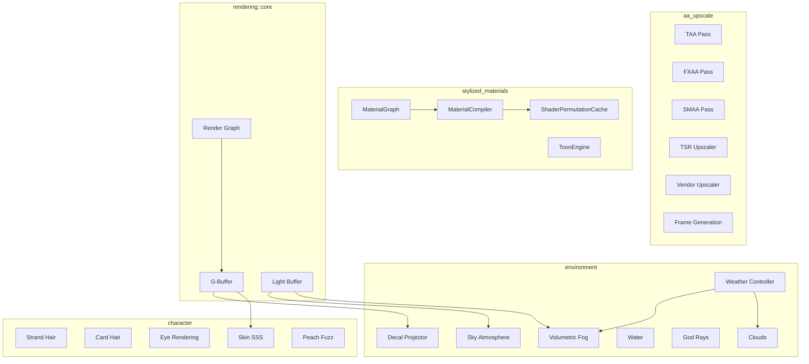
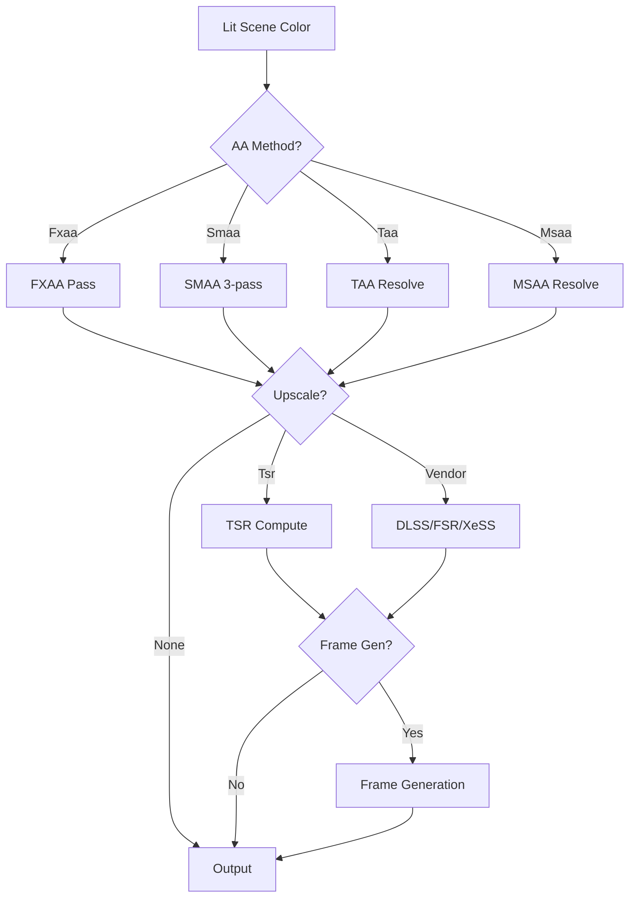
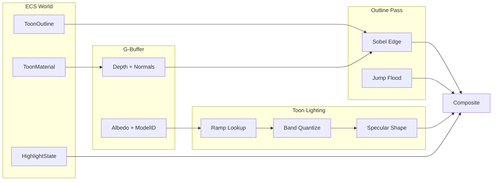
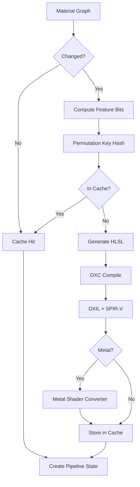
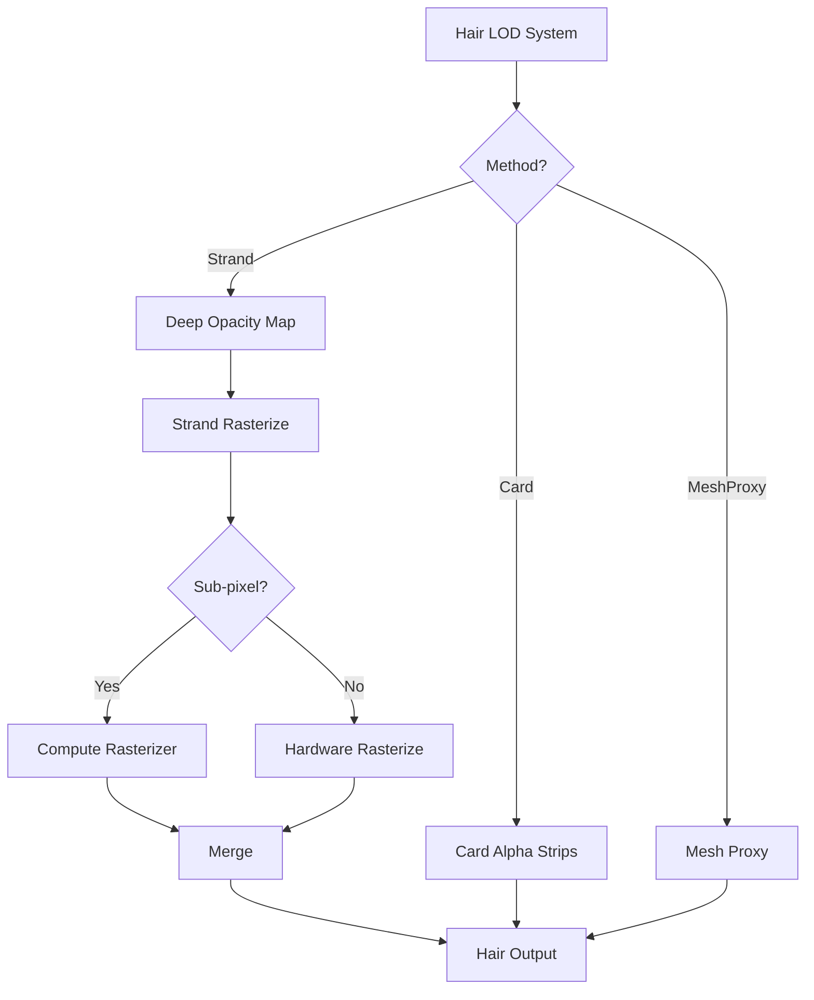

# Render Styles Design

Environment rendering, character rendering, anti-aliasing, stylized effects, and advanced material
presentation.

## Requirements Trace

> **Canonical sources:** Features, requirements, and user stories are defined in
> [features/](../../features/), [requirements/](../../requirements/), and
> [user-stories/](../../user-stories/).

### Anti-Aliasing and Upscaling (2.6)

| Feature | Requirement |
|---------|-------------|
| F-2.6.1 | R-2.6.1     |
| F-2.6.2 | R-2.6.2     |
| F-2.6.3 | R-2.6.3     |
| F-2.6.4 | R-2.6.4     |
| F-2.6.5 | R-2.6.5     |
| F-2.6.6 | R-2.6.6     |
| F-2.6.7 | R-2.6.7     |
| F-2.6.8 | R-2.6.8     |

1. **F-2.6.1** -- TAA with jittered sub-pixel accumulation
2. **F-2.6.2** -- Platform-agnostic temporal super resolution
3. **F-2.6.3** -- FXAA single-pass spatial AA
4. **F-2.6.4** -- MSAA 2x/4x in forward path
5. **F-2.6.5** -- Checkerboard rendering with reconstruction
6. **F-2.6.6** -- Vendor upscaler abstraction (DLSS, FSR, XeSS)
7. **F-2.6.7** -- AI frame generation from motion vectors
8. **F-2.6.8** -- Latency reduction via submission sync

### Environment and Atmosphere (2.7)

| Feature  | Requirement |
|----------|-------------|
| F-2.7.1  | R-2.7.1     |
| F-2.7.2  | R-2.7.2     |
| F-2.7.3  | R-2.7.3     |
| F-2.7.4  | R-2.7.4     |
| F-2.7.5  | R-2.7.5     |
| F-2.7.6  | R-2.7.6     |
| F-2.7.7  | R-2.7.7     |
| F-2.7.8  | R-2.7.8     |
| F-2.7.9  | R-2.7.9     |
| F-2.7.10 | R-2.7.10    |

1. **F-2.7.1** -- Procedural sky with atmosphere LUTs
2. **F-2.7.2** -- Volumetric fog via froxel grid
3. **F-2.7.3** -- Procedural clouds with temporal reprojection
4. **F-2.7.4** -- God rays (screen-space and volumetric)
5. **F-2.7.5** -- Analytical distance/height fog
6. **F-2.7.6** -- FFT ocean with reflections, foam, underwater
7. **F-2.7.7** -- Heterogeneous volumes (OpenVDB)
8. **F-2.7.8** -- Voxel clouds with SDF acceleration
9. **F-2.7.9** -- Breaking waves with Coons surface
10. **F-2.7.10** -- Weather state machine

### Character Rendering (2.8)

| Feature | Requirement |
|---------|-------------|
| F-2.8.1 | R-2.8.1     |
| F-2.8.2 | R-2.8.2     |
| F-2.8.3 | R-2.8.3     |
| F-2.8.4 | R-2.8.4     |
| F-2.8.5 | R-2.8.5     |
| F-2.8.6 | R-2.8.6     |
| F-2.8.7 | R-2.8.7     |
| F-2.8.8 | R-2.8.8     |
| F-2.8.9 | R-2.8.9     |

1. **F-2.8.1** -- Strand hair with Marschner BSDF
2. **F-2.8.2** -- Card-based hair with layered alpha
3. **F-2.8.3** -- Multi-tier hair LOD with cross-fade
4. **F-2.8.4** -- Layered eye rendering (cornea, iris, sclera)
5. **F-2.8.5** -- Cloth shading with fuzz layer
6. **F-2.8.6** -- Skin SSS with Burley diffusion
7. **F-2.8.7** -- Compute software rasterizer for hair
8. **F-2.8.8** -- Peach fuzz as screen-space fuzz layer
9. **F-2.8.9** -- Biometric skin model

### Decals (11.2)

| Feature  | Requirement |
|----------|-------------|
| F-11.2.1 | R-11.2.1    |
| F-11.2.2 | R-11.2.2    |
| F-11.2.3 | R-11.2.3    |
| F-11.2.4 | R-11.2.4    |

1. **F-11.2.1** -- Deferred decals with G-buffer modification
2. **F-11.2.2** -- Mesh decals with tangent-space normals
3. **F-11.2.3** -- Decal atlas batching with LRU eviction
4. **F-11.2.4** -- Priority layering and lifecycle management

### Stylized Effects (2.11)

| Feature  | Requirement | User Stories |
|----------|-------------|--------------|
| F-2.11.1 | R-2.11.1    | US-2.11.1.1, US-2.11.1.2, US-2.11.1.3 |
| F-2.11.2 | R-2.11.2    | US-2.11.2.1, US-2.11.2.2, US-2.11.2.3 |
| F-2.11.3 | R-2.11.3    | US-2.11.3.1, US-2.11.3.2, US-2.11.3.3 |
| F-2.11.4 | R-2.11.4    | US-2.11.4.1, US-2.11.4.2, US-2.11.4.3 |
| F-2.11.5 | R-2.11.5    | US-2.11.5.1, US-2.11.5.2, US-2.11.5.3 |

1. **F-2.11.1** -- Outline rendering (Sobel, JFA, shell)
2. **F-2.11.2** -- Highlight/glow (stencil, Gaussian, fresnel)
3. **F-2.11.3** -- Toon shading (bands, specular, hatching)
4. **F-2.11.4** -- Cut-through visibility and roof fading
5. **F-2.11.5** -- X-ray silhouette rendering

### Advanced Materials (2.12)

| Feature  | Requirement | User Stories |
|----------|-------------|--------------|
| F-2.12.1 | R-2.12.1    | US-2.12.1.1, US-2.12.1.2, US-2.12.1.3 |
| F-2.12.3 | R-2.12.3    | US-2.12.3.1, US-2.12.3.2, US-2.12.3.3 |
| F-2.12.4 | R-2.12.4    | US-2.12.4.1, US-2.12.4.2, US-2.12.4.3 |
| F-2.12.5 | R-2.12.5    | US-2.12.5.1, US-2.12.5.2, US-2.12.5.3 |
| F-2.12.6 | R-2.12.6    | US-2.12.6.1, US-2.12.6.2, US-2.12.6.3 |
| F-2.12.7 | R-2.12.7    | US-2.12.7.1, US-2.12.7.2 |
| F-2.12.8 | R-2.12.8    | US-2.12.8.1, US-2.12.8.2, US-2.12.8.3 |
| F-2.12.9 | R-2.12.9    | US-2.12.9.1, US-2.12.9.2, US-2.12.9.3 |

1. **F-2.12.1** -- Glass/crystal refraction (IOR, dispersion)
2. **F-2.12.3** -- Emissive materials (HDR bloom, animation)
3. **F-2.12.4** -- Heightmap tessellation and POM
4. **F-2.12.5** -- Fabric/cloth materials (sheen BRDF)
5. **F-2.12.6** -- Metal, wood, stone (anisotropy, weathering)
6. **F-2.12.7** -- Rubber, wax, soft surfaces
7. **F-2.12.8** -- Clearcoat and multi-layer materials
8. **F-2.12.9** -- Custom material graphs (visual node editor)

### Non-Functional Requirements

| NFR | Target |
|-----|--------|
| NFR-2.6.1 | TSR within 1 dB PSNR of native |
| NFR-2.6.2 | FXAA < 0.3 ms, TAA < 0.5 ms (1080p) |
| NFR-2.6.3 | Frame gen latency <= no-gen baseline |
| NFR-2.7.1 | Volumetric fog < 2.0 ms (1080p) |
| NFR-2.7.2 | Cloud pass < 3.0 ms (1080p) |
| NFR-2.7.3 | Ocean sim + render < 3.0 ms (1080p) |
| NFR-2.8.1 | Strand hair < 2.0 ms, cards < 0.5 ms |
| NFR-2.8.2 | Skin SSS < 1.0 ms (1080p) |
| NFR-2.8.3 | Hair LOD cross-fade < 0.5 s, no pop |
| NFR-2.11.1 | Outlines < 1.0 ms (1080p, 100 entities) |
| NFR-2.11.2 | Cut-through < 1 frame, 0.3 s fade |
| NFR-2.12.1 | Material compile < 5 s full, < 1 s incr |
| NFR-2.12.2 | Refraction 5 dB PSNR (SS), 1 dB (RT) |
| NFR-2.12.3 | < 50% cost for 4-layer material |

## Overview

This document covers four tightly coupled subsystems:

1. **Anti-aliasing and upscaling** -- TAA, FXAA, SMAA, TSR, vendor upscaler integration, frame
   generation
2. **Environment rendering** -- Sky, fog, clouds, god rays, water, volumes, weather, decals, detail
   meshes
3. **Character rendering** -- Hair (strand/card), eye, cloth, skin SSS, peach fuzz, biometric skin
4. **Stylized and advanced materials** -- Toon/cel, painterly, pixel art, outlines, highlights,
   glass, fabric, metal, clearcoat, wax, parallax, material graph system

All state as ECS components. All logic as systems in the render graph. Static dispatch. HLSL via DXC
to DXIL/SPIR-V/MSL.

## Architecture

### Module Boundaries



### Anti-Aliasing Pipeline



### Toon Shading Data Flow



### Material Graph Compilation



### Hair Rendering Data Flow



### Core Class Diagram

```mermaid
classDiagram
    class AntiAliasingConfig {
        +method AaMethod
        +taa_params Option~TaaParams~
        +smaa_quality SmaaQuality
    }

    class AaMethod {
        None
        Fxaa
        Smaa
        Taa
        Msaa2x
        Msaa4x
    }

    class UpscalingConfig {
        +method UpscaleMethod
        +quality_mode UpscaleQuality
        +target_resolution UVec2
    }

    class UpscaleMethod {
        None
        Tsr
        Fsr
        Dlss
        XeSS
        MetalFx
        Checkerboard
    }

    class FrameGenerationConfig {
        +enabled bool
        +max_generated_frames u8
        +latency_reduction bool
    }

    class SkyAtmosphereComponent {
        +sun_direction Vec3
        +rayleigh_density f32
        +mie_density f32
        +mie_anisotropy f32
    }

    class VolumetricFogComponent {
        +density f32
        +albedo Vec3
        +extinction f32
        +height_falloff f32
        +froxel_resolution UVec3
    }

    class WeatherState {
        Clear
        Overcast
        Rain
        Thunderstorm
        Snow
        DustStorm
    }

    class WeatherComponent {
        +current_state WeatherState
        +target_state WeatherState
        +transition_progress f32
        +wetness f32
        +wind_direction Vec3
    }

    class DecalProjectorComponent {
        +half_extents Vec3
        +channel_mask DecalChannelMask
        +priority u8
        +blend_mode DecalBlendMode
        +fade_params DecalFadeParams
    }

    class DecalBlendMode {
        Alpha
        Multiply
        Additive
    }

    class HairRenderComponent {
        +method HairMethod
        +strand_params Option~StrandParams~
        +card_params Option~CardParams~
        +lod_config HairLodConfig
    }

    class HairMethod {
        Strand
        Card
        MeshProxy
    }

    class StrandParams {
        +strand_count u32
        +strand_width f32
        +marschner_r f32
        +marschner_tt f32
        +marschner_trt f32
        +root_color Vec3
        +tip_color Vec3
    }

    class EyeRenderComponent {
        +iris_texture TextureHandle
        +iris_depth f32
        +cornea_ior f32
        +sclera_color Vec3
    }

    class SkinSssComponent {
        +scatter_radius f32
        +scatter_color Vec3
        +profile SssProfile
    }

    class SssProfile {
        Burley
        PreintegratedLut
        RayTraced
    }

    class BiometricSkinComponent {
        +melanin_map TextureHandle
        +blood_map TextureHandle
        +melanin_scale f32
    }

    class PeachFuzzComponent {
        +fuzz_direction_map TextureHandle
        +fuzz_intensity f32
        +screen_size_threshold f32
    }

    class ClothRenderComponent {
        +fuzz_color Vec3
        +scatter_width f32
        +sheen_roughness f32
        +subsurface_transmission bool
    }

    AntiAliasingConfig --> AaMethod
    UpscalingConfig --> UpscaleMethod
    WeatherComponent --> WeatherState
    DecalProjectorComponent --> DecalBlendMode
    HairRenderComponent --> HairMethod
    HairRenderComponent --> StrandParams
    SkinSssComponent --> SssProfile
```



### Stylized and Material Class Diagram

```mermaid
classDiagram
    class ShadingModelId {
        StandardPbr
        Toon
        Painterly
        PixelArt
        Glass
        Fabric
        MetalAniso
        SkinSss
        Clearcoat
        WaxTranslucent
        Unlit
        Custom
    }

    class MaterialGraph {
        -nodes Vec~MaterialNode~
        -edges Vec~NodeEdge~
        -outputs MaterialOutputs
        +add_node(kind) NodeId
        +connect(src, dst) Result
        +compile(tier) CompiledMaterial
        +validate() Result
    }

    class MaterialLayerStack {
        -layers Vec~MaterialLayer~
        +push_layer(mat, mask)
        +evaluate(uv) SurfaceOutput
        +layer_count() u32
    }

    class ShaderPermutationKey {
        +shading_model ShadingModelId
        +features FeatureFlags
        +tier PlatformTier
        +blend_mode BlendMode
    }

    class ShaderPermutationCache {
        +get_or_compile(key, graph) CompiledShader
        +invalidate(key)
        +warm(keys, graphs)
    }

    class ToonMaterial {
        +band_count u32
        +ramp_texture TextureHandle
        +specular_shape SpecularShape
        +rim_width f32
        +rim_color Color
        +hatching_texture Option~TextureHandle~
    }

    class SpecularShape {
        Circular
        Star
        Cross
    }

    class ToonOutline {
        +technique OutlineTechnique
        +color Color
        +width f32
        +style OutlineStyle
        +priority u32
    }

    class OutlineTechnique {
        ScreenSpaceEdge
        JumpFlood
        ShellExtrusion
    }

    class HighlightState {
        +glow_color Color
        +intensity f32
        +mode HighlightMode
    }

    class HighlightMode {
        InnerGlow
        GaussianGlow
        FresnelRim
    }

    class XRayVisible {
        +silhouette_color Color
        +opacity f32
        +style XRayStyle
    }

    class CutThroughFade {
        +mode FadeMode
        +effect FadeEffect
        +fade_distance f32
        +fade_speed f32
    }

    class FadeMode {
        VolumeBased
        RayBased
        LayerBased
    }

    class GlassMaterial {
        +ior f32
        +dispersion f32
        +absorption_color Color
        +surface_mode GlassSurfaceMode
    }

    class FabricMaterial {
        +sheen_color Color
        +sheen_roughness f32
        +transmission f32
        +fuzz_intensity f32
    }

    class MetalAnisotropicMaterial {
        +anisotropy f32
        +direction_map Option~TextureHandle~
        +coatings SmallVec~MetalCoating~
    }

    class ClearcoatMaterial {
        +clearcoat f32
        +clearcoat_roughness f32
        +clearcoat_ior f32
    }

    class WaxMaterial {
        +scatter_radius f32
        +scatter_color Color
        +thickness_map Option~TextureHandle~
        +deformation_feedback bool
    }

    class ParallaxMaterial {
        +height_map TextureHandle
        +height_scale f32
        +technique ParallaxTechnique
        +pom_steps u32
    }

    class ParallaxTechnique {
        Tessellation
        POM
    }

    class MultiLayerMaterial {
        +layers SmallVec~MaterialLayerDesc~
    }

    class LayerBlendMode {
        Alpha
        HeightBased
        Additive
        Multiply
    }

    class PainterlyStyle {
        +brush_radius u32
        +edge_darkening f32
        +wet_edge_intensity f32
    }

    class PixelArtStyle {
        +pixel_resolution u32[2]
        +max_colors u32
        +nearest_neighbor bool
    }

    MaterialGraph *-- MaterialLayerStack
    ShaderPermutationCache --> ShaderPermutationKey
    ShaderPermutationKey --> ShadingModelId
    ToonMaterial --> SpecularShape
    ToonOutline --> OutlineTechnique
    HighlightState --> HighlightMode
    CutThroughFade --> FadeMode
    ParallaxMaterial --> ParallaxTechnique
    MultiLayerMaterial --> LayerBlendMode
```



## Platform Considerations

### AA Method Defaults

| Platform | Default AA | Default Upscale |
|----------|-----------|-----------------|
| Mobile | FXAA | FSR 1.0 spatial |
| Switch | FXAA | TSR (720p->1080p) |
| Desktop | TAA | TSR or vendor |
| High-end | TAA | DLSS 4 / FSR 3 |

### Environment Feature Matrix

| Feature | Mobile | Switch | Desktop | High-end |
|---------|--------|--------|---------|----------|
| Sky LUTs | Precomputed | On change | Continuous | High-res |
| Vol. fog | Analytical | 64x36x32 | 160x90x64 | 160x90x128 |
| Clouds | Skybox | Quarter-res | Half-res | Full-res |
| God rays | SS half-res | SS | Volumetric | Vol multi |
| Water | Gerstner | 128-pt FFT | 256+SSR | 512+RT |
| Decals | 64 pool | 128 pool | 256 pool | 512 pool |

### Character Feature Matrix

| Feature | Mobile | Switch | Desktop | High-end |
|---------|--------|--------|---------|----------|
| Hair | Mesh proxy | Cards | Strand 16k | Strand 64k |
| Eye | Flat texture | Parallax | Layered | Full SSS |
| Skin SSS | LUT | LUT | Burley | RT SSS |
| Peach fuzz | Disabled | Disabled | Screen-space | Full |
| Biometric | Disabled | Disabled | Melanin only | Full |

### Stylized Feature Matrix

| Feature | Mobile | Switch | Desktop | High-end |
|---------|--------|--------|---------|----------|
| Outlines | Sobel only | Sobel+JFA | All methods | All |
| Toon bands | 2-4 | 2-6 | 2-8 | Unlimited |
| Hatching | Disabled | Fixed scale | Full | Full |
| Painterly | Disabled | Quarter-res | Half-res | Full |
| Pixel art | Always-on | Always-on | Always-on | Always-on |
| Material layers | 2 | 3 | 4 | Unlimited |
| Glass dispersion | Disabled | Disabled | 3-sample | 5-sample |

## Test Plan

See companion file [render-styles-test-cases.md](./render-styles-test-cases.md).

### Unit Tests (AA and Upscaling)

| Test | Req |
|------|-----|
| `test_taa_jitter_halton` | R-2.6.1 |
| `test_taa_history_rejection` | R-2.6.1 |
| `test_fxaa_single_pass` | R-2.6.3 |
| `test_smaa_edge_detection` | R-2.6.3 |
| `test_tsr_internal_resolution` | R-2.6.2 |
| `test_vendor_upscaler_fallback` | R-2.6.6 |
| `test_checkerboard_pattern` | R-2.6.5 |
| `test_frame_gen_latency` | R-2.6.8 |

### Unit Tests (Environment and Character)

| Test | Req |
|------|-----|
| `test_sky_lut_generation` | R-2.7.1 |
| `test_froxel_injection` | R-2.7.2 |
| `test_cloud_temporal_reproject` | R-2.7.3 |
| `test_fft_ocean_spectrum` | R-2.7.6 |
| `test_weather_transition` | R-2.7.10 |
| `test_decal_atlas_lru` | R-11.2.3 |
| `test_decal_angle_fade` | R-11.2.1 |
| `test_strand_hair_marschner` | R-2.8.1 |
| `test_card_hair_alpha_sort` | R-2.8.2 |
| `test_hair_lod_crossfade` | R-2.8.3 |
| `test_eye_iris_parallax` | R-2.8.4 |
| `test_skin_sss_burley` | R-2.8.6 |
| `test_biometric_melanin_blood` | R-2.8.9 |
| `test_peach_fuzz_threshold` | R-2.8.8 |

### Unit Tests (Stylized and Materials)

| Test | Req |
|------|-----|
| `test_toon_band_quantize` | R-2.11.3 |
| `test_toon_ramp_lookup` | R-2.11.3 |
| `test_outline_sobel` | R-2.11.1 |
| `test_outline_jfa` | R-2.11.1 |
| `test_highlight_glow_blur` | R-2.11.2 |
| `test_xray_stencil` | R-2.11.5 |
| `test_cut_through_volume` | R-2.11.4 |
| `test_glass_refraction_ior` | R-2.12.1 |
| `test_fabric_sheen_brdf` | R-2.12.5 |
| `test_metal_anisotropy` | R-2.12.6 |
| `test_clearcoat_layer` | R-2.12.8 |
| `test_parallax_pom_steps` | R-2.12.4 |
| `test_material_graph_compile` | R-2.12.9 |
| `test_material_graph_cycle` | R-2.12.9 |
| `test_permutation_cache_hit` | R-2.12.9 |
| `test_layer_blend_height` | R-2.12.8 |
| `test_emissive_animation` | R-2.12.3 |

### Integration Tests

| Test | Req |
|------|-----|
| `test_aa_tsr_psnr_quality` | NFR-2.6.1 |
| `test_full_environment_budget` | NFR-2.7.1 |
| `test_strand_hair_budget` | NFR-2.8.1 |
| `test_skin_sss_budget` | NFR-2.8.2 |
| `test_outline_100_entities` | NFR-2.11.1 |
| `test_material_full_compile` | NFR-2.12.1 |
| `test_material_incremental` | NFR-2.12.1 |
| `test_4_layer_overhead` | NFR-2.12.3 |
| `test_tier_fallback_chain` | All |

### Benchmarks

| Benchmark | Target |
|-----------|--------|
| FXAA (1080p) | < 0.3 ms |
| TAA resolve (1080p) | < 0.5 ms |
| Volumetric fog (1080p) | < 2.0 ms |
| Cloud pass (1080p) | < 3.0 ms |
| Ocean sim+render (1080p) | < 3.0 ms |
| Strand hair per character | < 2.0 ms |
| Skin SSS (1080p) | < 1.0 ms |
| Outline rendering (100 ents) | < 1.0 ms |
| Material compile (full) | < 5 s |
| Material compile (incremental) | < 1 s |

## Open Questions

1. **OpenVDB dependency** -- Large C++ library. Evaluate sparse voxel octree as lighter alternative
   for cloud density.
2. **Vendor upscaler SDK licensing** -- DLSS requires NVIDIA SDK agreement. FSR is open. XeSS
   requires Intel agreement.
3. **Toon/PBR hybrid** -- Some games want PBR lighting with toon outlines. Need to define the
   composition rules.
4. **Material graph IR** -- Define intermediate representation for node-based shader compilation
   (F-2.12.9).
5. **Hair strand count scaling** -- 64k strands on high-end is target; validate compute rasterizer
   throughput.
6. **Weather-driven material wetness** -- How wetness parameter propagates to material graphs
   (puddles, surface darkening).

## Review Feedback

### RF-1: Add API Design and Data Flow sections

Required by the design template. Add Rust pseudocode for key APIs: MaterialGraph,
ShaderPermutationCache, ToonMaterial system, DecalProjector system. Add data flow diagrams showing
ECS components → render graph passes → GPU.

### RF-2: Add render layer integration

Document how each subsystem interacts with `RenderLayers(u32)`:

- Decals: visible only if decal layer intersects camera layer
- Outlines: filter by layer (UI objects don't get world outlines)
- Volumetric fog: can scope to specific layers
- Toon shading: per-layer shading model override possible
- Camera layer masking controls which styles apply

### RF-3: Fix architecture diagram

Show explicit edges from `RG[Render Graph]` to all pass nodes (VOL, CLD, GOD, TAA, FXAA, SMAA, TSR,
DEC, STR, SKN, TE, etc.). Current diagram only connects RG → G-Buffer.

### RF-4: Trace untraced features

- PainterlyStyle and PixelArtStyle need F-IDs and R-IDs
- SMAA needs its own F-ID (distinct from FXAA)
- Add F-2.12.2 (ocean reflection/refraction) to trace table

### RF-5: Fix SMAA test trace

`test_smaa_edge_detection` maps to R-2.6.3 which is FXAA. Give SMAA its own requirement ID.

### RF-6: Define Custom shading model

All shading models live in a single enum inside the **middleman .dylib** (see constraints.md
"Codegen and Hot-Reload Architecture"). The middleman is the single source of truth for all
codegen'd types.

```rust
// Generated into the middleman .dylib by codegen.
// Contains ALL shading models — built-in + plugin.
// One enum, one source of truth, exhaustive match.
pub enum ShadingModelId {
    // Engine built-in (always present)
    DefaultLit,
    Subsurface,
    ClearCoat,
    Cloth,
    Hair,
    Eye,
    Toon,
    Terrain,
    Unlit,
    // Plugin-defined (added by codegen, sorted
    // alphabetically by plugin + model name)
    WaterSurface,  // ocean_plugin
    Hologram,      // scifi_plugin
}
```

The entire enum is codegen'd into the middleman .dylib and regenerated whenever plugins change. Both
the engine binary and plugin .dylibs load the middleman, so all code sees the same enum. Exhaustive
match everywhere. No numeric IDs. No collisions.

When a user adds a new shading model:

1. Codegen adds the variant to `ShadingModelId`
2. Middleman .dylib recompiled (sub-3 seconds)
3. Engine hot-reloads middleman via libloading
4. Plugin .dylibs recompiled against updated middleman
5. All code has the new variant with full static dispatch

The G-buffer stores the enum discriminant. The lighting pass matches on `ShadingModelId` with
exhaustive match — static dispatch for all models, built-in and plugin alike.

This pattern applies to ALL codegen'd enums and static dispatch types, not just shading models.
Components, events, systems, and type descriptors follow the same middleman architecture.

G-buffer constraints for all models (built-in and plugin):

- Must write standard channels (albedo, normal, roughness, metallic, AO)
- Can write up to 2 custom channels per model
- Must be compatible with tiled/clustered lighting pipeline

### RF-7: Add Terrain shading model

`Terrain` is a built-in enum variant. Terrain uses multi-layer splatmap blending with:

- Height-based layer transitions (not just alpha blend)
- Triplanar projection for cliff faces
- Virtual texturing for large terrain areas
- Per-layer PBR parameters (albedo, normal, roughness, AO)
- Painted layer weights from world-geometry design (Design #22)

The terrain shading model is defined here. The terrain geometry, splatmap painting, and layer
management are in world-geometry.md.

### RF-8: Define MetalCoating and MaterialLayerDesc

These are referenced by SmallVec fields in the class diagram but never defined. Add struct
definitions.

### RF-9: Expand hatching parameters

Add hatching density, scale, direction, and line weight to `ToonMaterial`. Currently only a texture
field exists.

### RF-10: Create companion test cases file

Create `render-styles-test-cases.md` with TC-X.Y.Z.N IDs. Move inline test tables there. Add tests
for PainterlyStyle, PixelArtStyle, SMAA, terrain shading, render layer filtering.

### RF-11: Scope clarification

This design owns materials, shading models, volumetric environment rendering, decals, and
NPR/stylized styles. It does NOT own:

| Owned elsewhere | Design |
|----------------|--------|
| God rays, bloom, DOF, eye adaptation | render-effects (#17) |
| Terrain geometry, splatmaps, LOD | world-geometry (#22) |
| Post-process pipeline ordering | render-effects (#17) |
| GPU abstraction, render graph | render-pipeline (#15) |
| Primary visibility, lighting eval | rendering-core (#16) |

### RF-12: Add Water shading model

Add `Water` as a built-in `ShadingModelId` variant. Water needs specialized render graph passes no
other model requires:

- Planar reflection capture (below-surface camera render pass)
- Refraction via distorted scene color behind the surface
- Gerstner wave vertex displacement in mesh/vertex shader
- Depth-based subsurface scattering (light absorption by depth)
- Foam generation at shoreline (depth-tested against terrain)
- Caustics projection onto underwater surfaces
- Flow map animation for directional currents

The water shading model registers its own render graph passes (reflection plane, refraction grab,
underwater fog). The material graph exposes water-specific parameters: wave amplitude/frequency,
foam threshold, absorption color, flow speed.

### RF-13: Transparency strategy

Support three transparency modes with clear render graph ordering:

**1. Alpha cutoff with opacity micromasks (cheapest):**

For foliage, fences, hair cards, and GPU-driven meshlet rendering (which cannot depth-sort). Use
blue noise dithered threshold:

```hlsl
// Pixel shader:
float threshold = blue_noise(screen_pos, frame_index);
if (alpha < threshold) discard;
// TAA accumulates over frames → smooth result
```

This is how Nanite handles foliage — meshlet rendering can't do alpha blend, so dithered cutoff +
TAA is the only option for GPU-driven transparency. Micromask patterns:

- Blue noise (best quality, per-frame jitter)
- Bayer matrix 4x4 (cheapest, fixed pattern)
- Interleaved gradient noise (good TAA integration)

**2. Alpha blend (sorted, medium cost):**

For glass, water surface, simple particle billboards. Requires back-to-front depth sorting. Rendered
after opaque pass. Does not work with meshlet pipeline — uses traditional draw path.

**Render graph pass ordering:**

1. Opaque (meshlet indirect draw)
2. Alpha cutoff / opacity micromask (meshlet indirect draw)
3. Sorted alpha blend (traditional draw, back-to-front)
4. Post-process (TAA resolves micromask dithering)

**References:**

### RF-14: Algorithm references

**Transparency:**

| Algorithm | Reference |
|-----------|-----------|
| Opacity micromasks | [Nanite (SIGGRAPH 2021)](https://advances.realtimerendering.com/s2021/Karis_Nanite_SIGGRAPH_Advances_2021_final.pdf) |
| IGN dithering | [Jimenez (2014)](http://www.iryoku.com/next-generation-post-processing-in-call-of-duty-advanced-warfare) |

**NPR / Stylized:**

| Algorithm | Reference |
|-----------|-----------|
| Toon ramp shading | [Lake et al. (GDC 2000)](https://developer.valvesoftware.com/wiki/Cel_Shading) |
| JFA outlines | [Rong & Tan, "Jump Flooding" (2006)](https://ieeexplore.ieee.org/document/4276119) |
| Sobel edge detect | Standard image processing |
| Hatching | [Praun et al. (SIGGRAPH 2001)](https://hhoppe.com/hatching.pdf) |

**Skin / Character:**

| Algorithm | Reference |
|-----------|-----------|
| SSS diffusion | [Jimenez et al. (2015)](http://www.iryoku.com/separable-sss/) |
| Pre-integrated skin | [Penner (GPU Pro 2, 2011)](https://advances.realtimerendering.com/s2011/) |
| Marschner hair | [Marschner et al. (SIGGRAPH 2003)](https://www.cs.cornell.edu/~srm/publications/SG03-hair.html) |
| Dual scattering hair | [Zinke et al. (2008)](https://dl.acm.org/doi/10.1111/j.1467-8659.2008.01182.x) |

**Materials:**

| Algorithm | Reference |
|-----------|-----------|
| Clear coat | [Karis, PBR (SIGGRAPH 2013)](https://blog.selfshadow.com/publications/s2013-shading-course/) |
| Cloth (Ashikhmin) | [Ashikhmin & Premoze (2007)](https://dl.acm.org/doi/10.5555/2383847.2383874) |
| Eye rendering | [Jimenez et al. (2012)](http://www.iryoku.com/downloads/Next-Generation-Character-Rendering-v6.pptx) |
| LTC area lights | [Heitz et al. (SIGGRAPH 2016)](https://eheitzresearch.wordpress.com/415-2/) |

**Water:**

| Algorithm | Reference |
|-----------|-----------|
| Gerstner waves | [Tessendorf (SIGGRAPH 2001)](https://people.computing.clemson.edu/~jtessen/reports/papers_files/coursenotes2004.pdf) |
| Planar reflections | [Lengyel, "Rendering Water" (2007)](https://developer.nvidia.com/gpugems/gpugems2/part-ii-shading-lighting-and-shadows/chapter-19-generic-refraction-simulation) |
| Flow maps | [Vlachos (SIGGRAPH 2010)](https://advances.realtimerendering.com/s2010/) |

**Volumetrics:**

| Algorithm | Reference |
|-----------|-----------|
| Froxel fog | [Hillaire (2016)](https://www.ea.com/frostbite/news/physically-based-unified-volumetric-rendering-in-frostbite) |
| Cloud rendering | [Schneider (SIGGRAPH 2015)](https://advances.realtimerendering.com/s2015/The%20Real-time%20Volumetric%20Cloudscapes%20of%20Horizon%20-%20Zero%20Dawn%20-%20ARTR.pdf) |

**Decals:**

| Algorithm | Reference |
|-----------|-----------|
| Deferred decals | [Persson (2011)](http://www.humus.name/index.php?page=3D&&start=56) |
