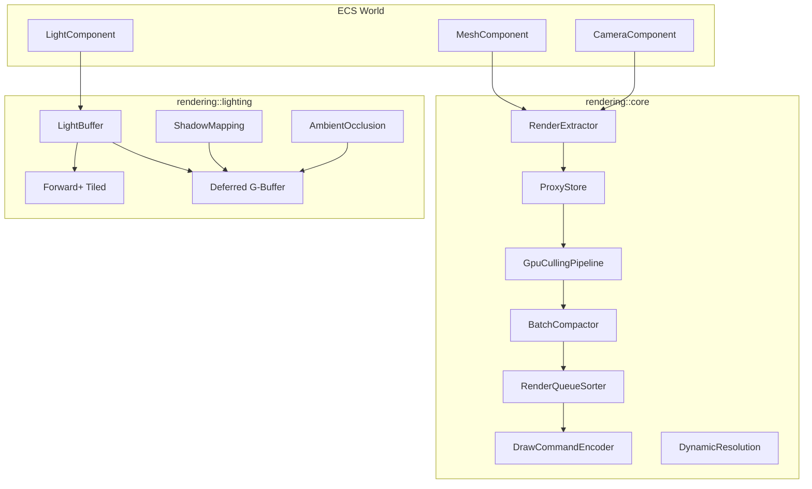
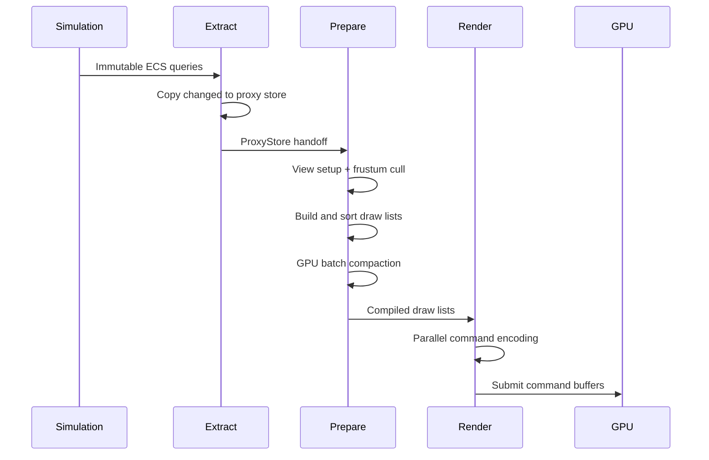
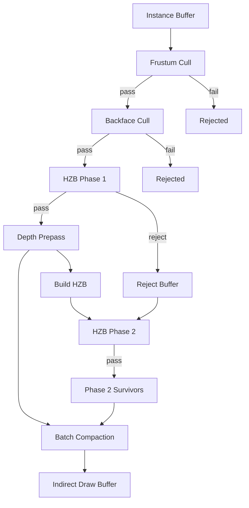
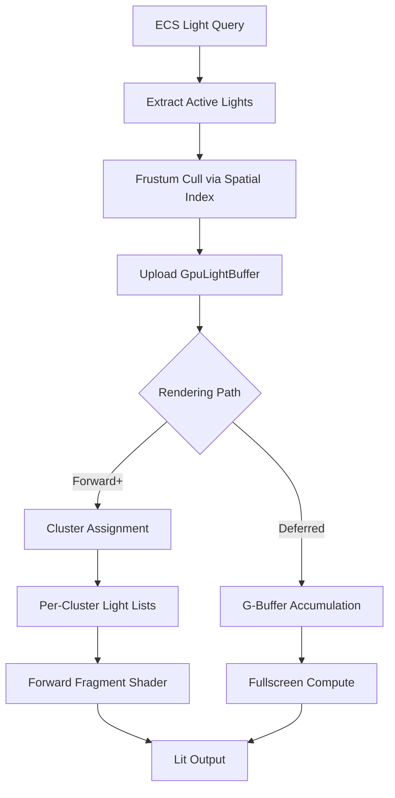
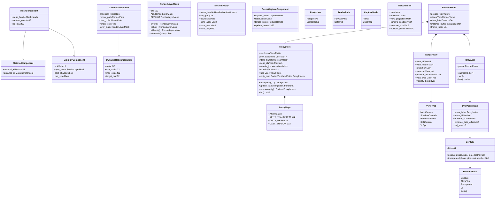

# Rendering Core Design

Scene rendering, draw calls, culling, shadows, and lighting -- the core rendering pipeline that
bridges ECS and GPU.

## Requirements Trace

> **Canonical sources:** Features, requirements, and user stories are defined in
> [features/](../../features/), [requirements/](../../requirements/), and
> [user-stories/](../../user-stories/).

### Scene Rendering (2.3)

| Feature  | Requirement | User Stories |
|----------|-------------|--------------|
| F-2.3.1  | R-2.3.1     | US-2.3.1.1, US-2.3.1.2, US-2.3.1.3 |
| F-2.3.2  | R-2.3.2     | US-2.3.2.1, US-2.3.2.2 |
| F-2.3.3  | R-2.3.3     | US-2.3.3.1, US-2.3.3.2 |
| F-2.3.4  | R-2.3.4     | US-2.3.4.1, US-2.3.4.2, US-2.3.4.3 |
| F-2.3.5  | R-2.3.5     | US-2.3.5.1, US-2.3.5.2 |
| F-2.3.6  | R-2.3.6     | US-2.3.6.1, US-2.3.6.2 |
| F-2.3.7  | R-2.3.7     | US-2.3.7.1, US-2.3.7.2, US-2.3.7.3 |
| F-2.3.8  | R-2.3.8     | US-2.3.8.1, US-2.3.8.2 |
| F-2.3.9  | R-2.3.9     | US-2.3.9.1, US-2.3.9.2 |
| F-2.3.10 | R-2.3.10    | US-2.3.10.1, US-2.3.10.2 |
| F-2.3.11 | R-2.3.11    | US-2.3.11.1, US-2.3.11.2, US-2.3.11.3 |
| F-2.3.12 | R-2.3.12    | US-2.3.12.1, US-2.3.12.2 |
| F-2.3.13 | R-2.3.13    | US-2.3.13.1, US-2.3.13.2 |

1. **F-2.3.1** -- Direct lighting: point, spot, directional
2. **F-2.3.2** -- GPU meshlet frustum culling via compute
3. **F-2.3.3** -- Meshlet backface culling via normal cones
4. **F-2.3.4** -- Two-phase HZB occlusion culling
5. **F-2.3.5** -- Orthographic camera projection
6. **F-2.3.6** -- Perspective projection with reverse-Z
7. **F-2.3.7** -- GPU-driven instancing and batch compaction
8. **F-2.3.8** -- Render-to-texture with automatic barriers
9. **F-2.3.9** -- Static and dynamic cubemap rendering
10. **F-2.3.10** -- Scene capture (planar and cubemap)
11. **F-2.3.11** -- Dynamic resolution scaling with GPU feedback
12. **F-2.3.12** -- Subsurface scattering (screen-space and RT)
13. **F-2.3.13** -- Alpha mask cutout geometry

### Render Pipeline (2.10)

| Feature  | Requirement | User Stories |
|----------|-------------|--------------|
| F-2.10.1 | R-2.10.1    | US-2.10.1.1, US-2.10.1.2 |
| F-2.10.2 | R-2.10.2    | US-2.10.2.1, US-2.10.2.2 |
| F-2.10.3 | R-2.10.3    | US-2.10.3.1, US-2.10.3.2, US-2.10.3.3 |
| F-2.10.4 | R-2.10.4    | US-2.10.4.1, US-2.10.4.2 |
| F-2.10.5 | R-2.10.5    | US-2.10.5.1, US-2.10.5.2 |
| F-2.10.6 | R-2.10.6    | US-2.10.6.1, US-2.10.6.2 |
| F-2.10.7 | R-2.10.7    | US-2.10.7.1, US-2.10.7.2 |
| F-2.10.8 | R-2.10.8    | US-2.10.8.1, US-2.10.8.2 |
| F-2.10.9 | R-2.10.9    | US-2.10.9.1, US-2.10.9.2 |
| F-2.10.10 | R-2.10.10  | US-2.10.10.1, US-2.10.10.2 |

1. **F-2.10.1** -- Render proxy extraction via immutable queries
2. **F-2.10.2** -- SoA proxy components for GPU upload
3. **F-2.10.3** -- Dirty-flag incremental updates, O(changed)
4. **F-2.10.4** -- View/camera registration with projection
5. **F-2.10.5** -- Multi-view rendering from single snapshot
6. **F-2.10.6** -- Per-view draw lists with sort keys
7. **F-2.10.7** -- GPU compute batch compaction
8. **F-2.10.8** -- Bindless material parameter binding
9. **F-2.10.9** -- Debug draw API, compile-time gated
10. **F-2.10.10** -- Buffer visualization modes

### Lighting System (2.4)

| Feature  | Requirement | User Stories |
|----------|-------------|--------------|
| F-2.4.1  | R-2.4.1, NFR-2.4.1 | US-2.4.1.1, US-2.4.1.2 |
| F-2.4.2  | R-2.4.2     | US-2.4.2.1, US-2.4.2.2 |
| F-2.4.10 | R-2.4.10    | US-2.4.10.1, US-2.4.10.2 |
| F-2.4.11 | R-2.4.11    | US-2.4.11.1, US-2.4.11.2 |
| F-2.4.12 | R-2.4.12    | US-2.4.12.1, US-2.4.12.2 |
| F-2.4.13 | R-2.4.13    | US-2.4.13.1, US-2.4.13.2 |
| F-2.4.14 | R-2.4.14    | US-2.4.14.1, US-2.4.14.2 |
| F-2.4.15 | R-2.4.15    | US-2.4.15.1, US-2.4.15.2 |
| F-2.4.16 | R-2.4.16    | US-2.4.16.1, US-2.4.16.2 |
| F-2.4.17 | R-2.4.17    | US-2.4.17.1, US-2.4.17.2 |
| F-2.4.18 | R-2.4.18    | US-2.4.18.1, US-2.4.18.2 |
| F-2.4.19 | R-2.4.19    | US-2.4.19.1, US-2.4.19.2 |
| F-2.4.20 | R-2.4.20    | US-2.4.20.1, US-2.4.20.2 |
| F-2.4.21 | R-2.4.21    | US-2.4.21.1, US-2.4.21.2 |
| F-2.4.22 | R-2.4.22    | US-2.4.22.1, US-2.4.22.2 |
| F-2.4.23 | R-2.4.23    | US-2.4.23.1, US-2.4.23.2 |

1. **F-2.4.1** -- Tiled/clustered forward+ light culling
2. **F-2.4.2** -- Deferred lighting via G-buffer
3. **F-2.4.10** -- Stochastic many-light sampling
4. **F-2.4.11** -- Cascaded shadow maps
5. **F-2.4.12** -- Soft shadows: PCF, PCSS, RT
6. **F-2.4.13** -- Ambient occlusion: SSAO, GTAO, RT AO
7. **F-2.4.14** -- Virtual shadow maps
8. **F-2.4.15** -- Contact shadows via ray march
9. **F-2.4.16** -- Distance field shadows
10. **F-2.4.17** -- Capsule shadows for skeletal meshes
11. **F-2.4.18** -- Moment-based OIT
12. **F-2.4.19** -- Volumetric shadow maps
13. **F-2.4.20** -- Area lights (rect/sphere) via LTC
14. **F-2.4.21** -- Sky light / IBL split-sum
15. **F-2.4.22** -- IES photometric light profiles
16. **F-2.4.23** -- Light functions (gobo/cookie)

### Non-Functional Requirements

| NFR | Target |
|-----|--------|
| NFR-2.3.1 | Culling < 1.0 ms GPU (1M meshlets, 1080p) |
| NFR-2.3.2 | DRS converges in 5 frames, < 5% oscillation |
| NFR-2.3.3 | 10 draw calls (10k instances, 10 materials) |
| NFR-2.10.1 | Extract < 2.0 ms full / < 0.5 ms dirty |
| NFR-2.10.2 | 500K proxies/ms/core draw list throughput |
| NFR-2.10.3 | Zero debug viz overhead in shipping |
| NFR-2.4.1 | 500+ dynamic lights, sub-linear scaling |
| NFR-2.4.2 | Shadow atlas <= 256 MB VRAM |
| NFR-2.4.3 | BRDF eval < 0.1 ms / 1M fragments |

## Overview

The core rendering subsystem bridges ECS and GPU via an **extract-prepare-render** pipeline that
decouples simulation from rendering.

Four principles:

1. **ECS is truth.** All render state as components. Renderer reads via immutable queries, owns no
   persistent scene data.
2. **Decoupled snapshot.** Extraction copies only changed data. Simulation advances once extraction
   completes.
3. **GPU-driven pipeline.** Frustum, backface, occlusion culling, LOD, and instancing all run as GPU
   compute passes.
4. **Dual rendering paths.** Forward+ and deferred share culling, light buffer, and material system.
   Selection is per-view.

## Architecture

### Module Boundaries



### Material System

`Material` is the canonical runtime handle bundling a material graph, its compiled shader
permutations, descriptor layout, and parameter block. `MaterialComponent` references a
`Handle<Material>`; `MaterialGraph` (authoring, owned by [render-styles.md](render-styles.md)) is
the source; `CompiledMaterial` (implementation, owned by [render-pipeline.md](render-pipeline.md))
is the codegen output. This section is the **single canonical definition** that unifies the three.

```rust
pub struct MaterialId(pub u32);

pub struct Material {
    pub id: MaterialId,
    pub graph: Handle<MaterialGraph>,
    pub compiled_shaders: Handle<ShaderPermutationCache>,
    pub descriptor_layout: DescriptorLayout,
    pub parameters: MaterialParameterBlock,
}

pub struct MaterialParameterBlock {
    pub uniform_buffer: GpuBufferView,
    pub texture_bindings: SmallVec<[TextureBinding; 8]>,
    pub sampler_bindings: SmallVec<[SamplerBinding; 4]>,
}
```

Ownership contract:

1. `MaterialManager` (lives on the render thread) owns all `Material` instances via a
   `SlotMap<Material>` and exposes `Handle<Material>` to ECS.
2. `MaterialManager` subscribes to the hot-reload protocol (see
   [../core-runtime/hot-reload-protocol.md](../core-runtime/hot-reload-protocol.md)) for
   `MaterialGraph` and shader source changes. On reload:
   - The manager drains any in-flight frame references via `poll_fence`.
   - It rebuilds `compiled_shaders` through the `ShaderPermutationCache` keyed by `PermutationKey`
     (see [shader-variants.md](shader-variants.md)).
   - It rebuilds `descriptor_layout` from the new shader bytecode via `ShaderCompiler::reflect` (see
     [render-pipeline.md](render-pipeline.md) descriptor layout inference).
   - The new `Material` is swapped atomically in the slot map; the old entry is retired after the
     in-flight fence completes.
3. On successful rebuild, `MaterialManager` broadcasts `MaterialChangeEvent { id }` via the shared
   event bus so dependents (PSO cache, draw list, editor preview) can respond. Failure keeps the
   previous `Material` live and surfaces a `CompileError` to the editor.
4. The `Material::descriptor_layout` is the authoritative binding shape for draw submission; the PSO
   cache key incorporates its hash so layout changes invalidate stale PSOs (see
   [pipeline-state-cache.md](pipeline-state-cache.md)).
5. `MaterialParameterBlock` is the only mutable piece across frames and is written to a
   ring-buffered GPU upload slice; the rest of `Material` is immutable between reloads.

Cross-reference: `ShadingModel` (the unified name for the per-shading-model enum) is defined in this
document (see the Core Class Diagram and `PermutationKey`). `ShadingModelId` in
[render-styles.md](render-styles.md) is an alias that will be deleted; consumers should read
`ShadingModel` here.

### Transform Interpolation

Phase 7 (Extract) receives an `InterpolatedTransform` per renderable from the scene-transforms
subsystem. The per-frame interpolation factor `alpha` = `(elapsed - last_fixed_tick) / fixed_dt` is
computed once in `game-loop.md::FrameContext` and broadcast to extract workers;
`ProxyStore::interp_transforms` holds `lerp(prev_transform, current_transform, alpha)` per proxy and
is the value uploaded to GPU instance buffers.

```rust
pub struct InterpolatedTransform {
    pub matrix: Mat4,
}

pub fn extract_transforms(
    prev: &GlobalTransform,
    curr: &GlobalTransform,
    alpha: f32,
) -> InterpolatedTransform {
    InterpolatedTransform { matrix: lerp_transforms(prev, curr, alpha) }
}
```

`InterpolatedTransform` is defined canonically in
[../core-runtime/scene-transforms.md](../core-runtime/scene-transforms.md); rendering consumes it
read-only during extract. 2D rendering uses the parallel `PreviousGlobalTransform2D` path from the
same doc (see [2d.md](2d.md)).

### MeshletProxy Reference

Meshlet geometry is not redefined here. Per-instance meshlet data is carried as `MeshletProxy` (see
the Core Class Diagram); the asset format, builder, GPU layout, and BLAS integration live in
[meshlets.md](meshlets.md). `MeshComponent::mesh_handle` is always a `Handle<MeshletAsset>`, and
`ProxyStore` records a `MeshletProxy` per visible instance so the GPU culling pipeline can read
bounds and cones without touching ECS.

### RenderFrame Cross-Reference

The per-frame immutable snapshot type is `RenderFrame`, owned and defined by
[../core-runtime/game-loop.md](../core-runtime/game-loop.md). This document consumes `RenderFrame`
as the input to extract/prepare/render; see RF-3 in Review Feedback below for the reconciliation
between `RenderWorld` (render-thread persistent state) and the immutable per-frame `RenderFrame`.

### Extract-Prepare-Render Pipeline



### GPU Culling Pipeline



### Light Culling Pipeline



### Core Class Diagram



### Lighting Class Diagram

```mermaid
classDiagram
    class DirectionalLight {
        +color LinearColor
        +intensity f32
        +cast_shadows bool
        +shadow_config CsmConfig
        +light_function Option~LightFunctionHandle~
    }

    class PointLight {
        +color LinearColor
        +intensity f32
        +radius f32
        +cast_shadows bool
        +shadow_config PointShadowConfig
        +ies_profile Option~IesProfileHandle~
    }

    class SpotLight {
        +color LinearColor
        +intensity f32
        +range f32
        +inner_angle f32
        +outer_angle f32
        +cast_shadows bool
        +shadow_config SpotShadowConfig
    }

    class AreaLight {
        +color LinearColor
        +intensity f32
        +shape AreaLightShape
        +two_sided bool
        +range f32
    }

    class AreaLightShape {
        Rect
        Disc
        Sphere
    }

    class ShadowFilter {
        Hard
        Pcf
        Pcss
        Vsm
        RayTraced
    }

    class ShadowAtlas {
        -tiles Vec~ShadowAtlasTile~
        -texture GpuTexture
        +allocate(resolution) Option~TileId~
        +release(tile_id)
        +evict_lru(budget)
        +texture_view() GpuTextureView
    }

    class ClusterGrid {
        -tile_count_x u32
        -tile_count_y u32
        -slice_count u32
        +dispatch_assignment(lights, view)
        +bind_for_shading() ClusterBindGroup
    }

    class GpuLightBuffer {
        -buffer GpuBuffer
        -count u32
        +upload(lights)
        +bind() GpuBufferView
    }

    class AoTier {
        Off
        Ssao
        Gtao
        RayTraced
    }

    class AoConfig {
        +tier AoTier
        +sample_count u8
        +radius f32
        +intensity f32
    }

    class SkyLight {
        +cubemap Option~CubemapHandle~
        +diffuse_intensity f32
        +specular_intensity f32
    }

    class IesProfileHandle {
        +0 u32
    }

    class LightFunctionHandle {
        +0 u32
    }

    class LightProbe {
        +sh_coefficients LinearColor[9]
        +radius f32
        +priority u8
    }

    class ReflectionProbe {
        +cubemap CubemapHandle
        +influence_aabb Aabb
        +blend_aabb Aabb
        +refresh ProbeRefreshMode
    }

    class ProbeRefreshMode {
        Baked
        OnLoad
        Periodic
        OnChange
    }

    class MaterialId {
        +0 u32
    }

    class ShadingModel {
        DefaultLit
        Subsurface
        ClearCoat
        Cloth
        Hair
        Eye
        ThinTranslucent
        Foliage
        Unlit
    }

    class PermutationKey {
        +shading_model ShadingModel
        +features ShaderFeatures
        +render_path RenderPath
    }

    DirectionalLight --> ShadowFilter
    PointLight --> ShadowFilter
    SpotLight --> ShadowFilter
    AreaLight --> AreaLightShape
    ClusterGrid --> GpuLightBuffer
    ShadowAtlas --> DirectionalLight
    ReflectionProbe --> ProbeRefreshMode
```



### Sort Key Bit Layout

| Field | Bits | Width | Purpose |
|-------|------|-------|---------|
| Translucency | 63 | 1 | 0=opaque, 1=transparent |
| Phase | 56-62 | 7 | Render phase ordinal |
| Pipeline | 40-55 | 16 | PSO hash |
| Material | 24-39 | 16 | Material ID |
| Depth | 0-23 | 24 | Quantized depth |

## Data Flow

### Per-Frame Lighting Pipeline

1. **Light extraction** (CPU) -- Query components, frustum cull, pack `GpuLight`, sort by screen
   contribution
2. **GPU light buffer upload** -- SSBO write
3. **Shadow scheduling** -- Allocate atlas tiles per light
4. **Shadow rendering** (GPU) -- CSM, cubemap, spot passes
5. **Cluster assignment** (GPU compute) -- Build 3D cluster grid
6. **AO pass** (GPU compute) -- SSAO/GTAO/RT AO by tier
7. **Lighting evaluation** (GPU) -- Forward+ or deferred path

### Shadow Configuration Per Platform

| Platform | CSM | Resolution | Atlas | VSM |
|----------|-----|-----------|-------|-----|
| Mobile | 1-2 | 512 | 2048 | No |
| Switch | 2-3 | 1024 | 4096 | No |
| Desktop | 3-4 | 2048 | 8192 | Yes |
| High-end | 4 | 4096 | 16384 | Yes |

### AO Configuration Per Platform

| Platform | Mode | Samples | Resolution |
|----------|------|---------|-----------|
| Mobile | SSAO | 4 | Quarter |
| Switch | SSAO/GTAO | 8 | Half |
| Desktop | GTAO | 16 | Full |
| High-end | RT AO | N/A | Full |

## Platform Considerations

### Light Feature Availability

| Feature | Mobile | Switch | Desktop | High-end |
|---------|--------|--------|---------|----------|
| Forward+ | Yes (8) | Yes (16) | Yes (24) | Yes (24) |
| Deferred | No | Thin G-buf | Full | Full |
| Area lights | Point fallback | Rect only | Full LTC | Unlimited |
| IES profiles | 1D 64 | 1D 128 | 2D 256 | 2D 256+ |
| Light functions | Baked | Scalar | Full color | Full color |
| Stochastic | Disabled | Disabled | 1-2 spp | 4+ spp |
| VSM | Disabled | Disabled | 8k | 16k |
| Contact shadows | No | Dir only | All | All |
| MBOIT | Disabled | Disabled | Half-res | Full-res |

## Test Plan

See companion file [rendering-core-test-cases.md](./rendering-core-test-cases.md).

### Unit Tests (Scene Rendering)

| Test | Req |
|------|-----|
| `test_proxy_insert_remove` | R-2.10.1 |
| `test_proxy_dirty_incremental` | R-2.10.3 |
| `test_frustum_cull_aabb` | R-2.3.2 |
| `test_backface_cull_normal_cone` | R-2.3.3 |
| `test_hzb_phase1_phase2` | R-2.3.4 |
| `test_reverse_z_perspective` | R-2.3.6 |
| `test_orthographic_projection` | R-2.3.5 |
| `test_sort_key_opaque_ordering` | R-2.10.6 |
| `test_sort_key_transparent_bft` | R-2.10.6 |
| `test_batch_compaction_groups` | R-2.3.7 |
| `test_drs_convergence` | R-2.3.11, NFR-2.3.2 |
| `test_cubemap_capture` | R-2.3.9 |
| `test_alpha_cutout_depth` | R-2.3.13 |
| `test_debug_draw_stripped` | NFR-2.10.3 |

### Unit Tests (Lighting)

| Test | Req |
|------|-----|
| `test_cluster_grid_dimensions` | R-2.4.1 |
| `test_cluster_assignment_500` | NFR-2.4.1 |
| `test_shadow_atlas_alloc_release` | R-2.4.11 |
| `test_shadow_atlas_lru` | NFR-2.4.2 |
| `test_csm_split_computation` | R-2.4.11 |
| `test_csm_temporal_stabilization` | R-2.4.11 |
| `test_pcf_filter_4_tap` | R-2.4.12 |
| `test_pcss_penumbra_scales` | R-2.4.12 |
| `test_ssao_half_res_output` | R-2.4.13 |
| `test_gtao_bent_normals` | R-2.4.13 |
| `test_ies_parse_valid` | R-2.4.22 |
| `test_area_light_ltc_energy` | R-2.4.20 |
| `test_sky_light_irradiance` | R-2.4.21 |
| `test_gpu_light_pack_alignment` | R-2.4.1 |
| `test_vsm_page_alloc_evict` | R-2.4.14 |
| `test_contact_shadow_step_count` | R-2.4.15 |
| `test_stochastic_convergence` | R-2.4.10 |

### Integration Tests

| Test | Req |
|------|-----|
| `test_extract_100k_entities` | NFR-2.10.1 |
| `test_draw_list_500k_proxies` | NFR-2.10.2 |
| `test_forward_plus_500_lights` | NFR-2.4.1 |
| `test_deferred_matches_forward` | R-2.4.2 |
| `test_shadow_atlas_20_lights` | NFR-2.4.2 |
| `test_tier_fallback_mobile` | All |
| `test_cross_backend_shadow` | R-2.4.11 |

### Benchmarks

| Benchmark | Target |
|-----------|--------|
| Culling (1M meshlets, 1080p) | < 1.0 ms GPU |
| Extraction (100K full) | < 2.0 ms |
| Extraction (1% dirty) | < 0.5 ms |
| Draw list throughput | 500K proxies/ms/core |
| Cluster assignment (500 lights) | < 0.5 ms |
| BRDF eval (1M fragments) | < 0.1 ms |
| CSM 4-cascade (2048 each) | < 2.0 ms |
| GTAO full-res 1080p | < 1.0 ms |

## Open Questions

1. **Cluster tile size** -- 64 px standard vs 32 px for fewer overflows. Needs target hardware
   profiling.
2. **Dual-paraboloid vs cubemap on mobile** -- 2 faces vs 6 with warping artifacts. Quality/cost
   tradeoff evaluation.
3. **VSM cache eviction** -- LRU may thrash on rotation. Priority-weighted by screen coverage under
   consideration.
4. **Shadow atlas fragmentation** -- Consider buddy allocator for power-of-two tile sizes in long
   sessions.
5. **V-buffer alternative** -- Once mesh shaders are ubiquitous, migrating to visibility buffer
   would unify lighting paths.

## Review Feedback

### RF-1: Add mesh shader dispatch path

The GPU culling pipeline terminates at "Indirect Draw Buffer." Mesh shaders are required (Design

## 15). Extend the pipeline

1. Meshlet culling (compute) outputs surviving meshlet indices
2. Dispatch mesh shader groups: one group per surviving meshlet
3. Mesh shader decodes vertices from meshlet data, outputs triangles
4. No traditional vertex buffer / index buffer path

Show alongside indirect draw as fallback for emulation.

### RF-2: Register all passes as render graph nodes

Cross-reference the render graph (Design #15, F-2.2.x). Each pass in this design (culling, shadow,
AO, forward+, deferred, composite) becomes a render graph node with declared reads/writes. The
render graph handles barrier insertion, resource aliasing, and pass ordering.

#### RF-3: Reconcile RenderWorld with RenderFrame

Adopt `RenderFrame` (immutable snapshot via triple buffer) from Design #15. `RenderWorld` can exist
as the render thread's persistent state (GPU resources, caches, atlases), but per-frame data
(transforms, draw lists, lights) arrives via the immutable `RenderFrame`.

#### RF-4: Add transform interpolation

Add `interpolation_alpha: f32` to the extraction/proxy system. Before GPU upload, compute
`lerp(prev_transform, current_transform, alpha)` for smooth fixed-timestep rendering.

#### RF-5: Add ring-buffered per-frame resources

Replace single `instance_buffer` with `PerFrameBuffer` ring indexed by
`frame_index % MAX_FRAMES_IN_FLIGHT` (3). Same for uniform buffers and indirect argument buffers.

#### RF-6: Surfel-based global illumination

Replace baked-only SH light probes with a scalable surfel-based GI system inspired by Unity URP
adaptive probe volumes and NVIDIA surfel GI research.

**Architecture:**

1. **Surfel placement** — surfels distributed on scene surfaces via camera-relative importance
   sampling. Denser near camera, sparser far away. Persistent across frames — only re-placed when
   camera moves significantly or geometry changes.

2. **Surfel irradiance update** — each frame, trace a small number of rays from a subset of surfels
   (amortized over many frames). Accumulate irradiance per surfel using exponential moving average.
   Target: < 0.25 rays per pixel per frame on average.

3. **Surfel cache** — store surfel irradiance in a GPU buffer. Surfels persist across frames. New
   surfels inherit from neighbors. Evict surfels outside the active radius.

4. **Screen-space gather** — for each pixel, find nearby surfels and interpolate irradiance. Use a
   screen-space surfel grid or spatial hash for fast lookup.

5. **Denoising** — temporal accumulation + spatial filter (A-trous wavelet or SVGF). Reuse history
   buffer with reprojection. Discard history on disocclusion.

**Scalability tiers:**

| Tier | Platform | Rays/frame | Surfels | Denoise |
|------|----------|-----------|---------|---------|
| Ultra | High-end PC | 1 ray/px | 2M | SVGF |
| High | Console/mid PC | 0.25 ray/px | 1M | A-trous |
| Medium | Low PC/Switch | 0.1 ray/px | 256K | Bilateral |
| Low | Mobile | 0 (probes only) | 0 | None |

On mobile (Low tier), fall back to baked SH probes with no runtime ray tracing — the surfel system
is disabled entirely.

**References:**

| Algorithm | Reference |
|-----------|-----------|
| Surfel GI | [Barre-Brisebois (SIGGRAPH 2024)][surfel-gi] |
| DDGI | [Majercik et al. (JCGT 2019)][ddgi] |
| Lumen surfels | [Hillaire (UE5 blog)][lumen] |
| SVGF denoiser | [Schied et al. (HPG 2017)][svgf] |
| A-trous wavelet | [Dammertz et al. (2010)][atrous] |
| Temporal reprojection | [Karis (SIGGRAPH 2014)][temporal] |

[surfel-gi]: https://advances.realtimerendering.com/s2021/SIGGRAPH%20Advances%202021%20-%20Surfel%20GI.pdf
[ddgi]: https://jcgt.org/published/0008/02/01/
[lumen]: https://www.unrealengine.com/en-US/blog/lumen-in-ue5-let-there-be-light
[svgf]: https://www.highperformancegraphics.org/wp-content/uploads/2017/Papers-Session1/HPG2017_SpatiotemporalVarianceGuidedFiltering.pdf
[atrous]: https://www.highperformancegraphics.org/previous/www_2010/media/RayTracing_I/HPG2010_RayTracing_I_Dammertz.pdf
[temporal]: https://de45xmedrsdbp.cloudfront.net/Resources/files/TemporalAA_small-59732822.pdf

#### RF-7: RT features, GI, and path tracing moved to render-effects

Surfel GI (RF-6), RT feature set, hybrid/path tracing pipelines, and denoising are moved to
render-effects.md. Rendering-core owns primary visibility (meshlets, G-buffer, materials, lighting
eval). Render-effects owns all secondary effects (GI, shadows, reflections, AO, post-process).

The surfel GI section (RF-6 above) remains here as the original decision record but the canonical
design lives in render-effects.

#### RF-8: Add threading details

Reference `job_system::scope()` for parallel command encoding, crossbeam-channel for extraction
handoff from game loop to render thread, and `poll_fence` for GPU completion checking.

#### RF-10: Clarify light culling spatial structure

CPU-side light culling can use the shared BVH (acceptable — lights are few, not millions like
meshlets). State explicitly that the shared BVH serves light culling in addition to AI/gameplay, or
use a separate small structure for lights.

#### RF-11: No-code material authoring

Cross-reference the visual material editor design (tools layer). Add a note explaining how
`MaterialId` maps to a user-authored visual material graph → codegen → compiled shader permutation.

#### RF-12: Create companion test cases file

Create `rendering-core-test-cases.md`. Add tests for mesh shader dispatch, RT
shadow/reflection/AO/GI paths, render graph pass registration, triple buffer handoff, transform
interpolation, per-frame resource ring buffer, and material permutations.

### RF-13: Competitive analysis — exceed Unreal Engine 5

The rendering core must match or exceed UE5 in every measurable area. UE5 has specific weaknesses we
can exploit.

**UE5 performance baseline (approximate GPU ms at 1080p):**

| System | UE5 Cost | Our Target | How to beat |
|--------|---------|------------|-------------|
| GI (Lumen) | 2-8 ms | < 2 ms | Surfel GI with < 0.25 ray/px; amortized tracing |
| Shadows (VSM) | 2-5 ms | < 2 ms | CSM + RT soft shadows; no VSM camera-rotation spikes |
| Culling | ~5 ms | < 1 ms | Single-pass compute; no CPU-side culling |
| Translucency | 3-10 ms | < 2 ms | OIT or stochastic; avoid UE5's multi-layer overdraw |
| Post-process | 1-3 ms | < 1.5 ms | Fused passes in render graph; fewer barriers |

**UE5 weaknesses to exploit:**

1. **Lumen GI cost** — 2-8 ms is too expensive for 60 fps games with budget headroom. Our surfel GI
   targets < 2 ms via amortized tracing (< 0.25 rays/px/frame) and aggressive temporal caching.

2. **VSM camera-rotation spikes** — UE5's Virtual Shadow Maps spike during fast rotation in
   semi-complex scenes. "Not suitable for fast-paced games" (developer consensus). Our CSM + RT soft
   shadows avoid this entirely — CSM is stable, RT is optional.

3. **Translucency expense** — UE5's translucent shading is "extremely costly." Use order-independent
   transparency (OIT) or stochastic transparency to avoid multi-layer overdraw.

4. **Foliage shadow noise** — UE5's distance field and VSM shadows produce visible noise on small
   moving geometry (foliage). Our CSM with PCF/PCSS handles foliage cleanly at lower cost.

5. **Version regressions** — UE 5.3→5.4 saw 120→15 fps regressions. 5.4.4 serialized render work to
   CPU. Our test suite catches regressions via benchmark targets with automated CI.

6. **Shader iteration speed** — UE5 has painful shader compilation cycles. Our hot-reload (file
   watch → dxc subprocess → PSO swap) targets < 2 s shader iteration.

7. **Nanite overhead on simple meshes** — Nanite adds overhead on low-poly assets. Our meshlet
   system only activates on meshes with sufficient triangle density; simple meshes use standard
   indirect draw.

**What UE5 does well (must match):**

- Nanite geometry throughput: billions of triangles. Our meshlet pipeline must handle 100M+
  triangles at 60 fps.
- Lumen quality: multi-bounce GI is visually excellent. Our surfel GI must match quality at lower
  cost.
- VSM resolution: 16K virtual resolution. Our shadow atlas must support equivalent detail at
  distance.
- Scalability: 4-tier quality presets. Our tier system (Ultra/High/ Medium/Low) must match breadth.
- Path tracing reference: UE5 has a production path tracer. Ours must match feature parity for
  cinematics.

**Items NOT in this design (belong in other designs):**

- Post-processing effects (bloom, DOF, motion blur) → render-effects
- NPR/stylized rendering → render-styles
- Material graph visual editor → tools layer
- Particle rendering → VFX

### RF-14: Render layers

Add a bitmask-based render layer system. `RenderLayerMask` is the **canonical newtype** used by
`CameraComponent`, `VisibilityComponent`, `LightComponent`, and their 2D analogues. An entity is
visible to a camera only if their layer masks overlap (bitwise AND != 0). A light affects an entity
only if their masks overlap.

```rust
/// u32 bitmask representing up to 32 render layers. Canonical newtype shared by 2D and 3D
/// rendering; both paths reference `RenderLayerMask` (no separate `RenderLayers` /
/// `Layer2DMask` types).
#[derive(Clone, Copy, Debug, PartialEq, Eq, Hash)]
pub struct RenderLayerMask(pub u32);

impl RenderLayerMask {
    pub const DEFAULT: Self = Self(1);
    pub const ALL: Self = Self(u32::MAX);

    pub fn layer(n: u32) -> Self { Self(1 << n) }
    pub fn with(self, n: u32) -> Self { Self(self.0 | (1 << n)) }
    pub fn without(self, n: u32) -> Self { Self(self.0 & !(1 << n)) }
    pub fn intersects(self, other: Self) -> bool { (self.0 & other.0) != 0 }
}
```

`CameraComponent::layer_mask` and `VisibilityComponent::layer_mask` both hold a `RenderLayerMask`
(see the Core Class Diagram). `Light2D::render_layer` in [2d.md](2d.md) and `Sprite::render_layer`
also resolve to `RenderLayerMask` (the `u32` field is a raw-access convenience; the typed wrapper is
the public API).

Use cases:

- UI camera renders only layer 31 (UI widgets)
- Main camera renders layers 0-30 (world objects)
- Minimap camera renders layer 0 (terrain) + layer 5 (icons)
- A spotlight affects only layer 0 (main scene), not layer 1 (cutscene characters in separate
  lighting)
- Post-process effects can target specific layers (bloom on layer 0 only, no bloom on UI)
- An object on layers 0 AND 5 appears in both the main camera and minimap

The same object can be in multiple layers simultaneously. Layer membership is a bitmask, not an
exclusive assignment.

The GPU culling pipeline checks `camera.layer_mask.intersects(entity.layer_mask)` during instance
culling. Lights check `light.layer_mask.intersects(entity.layer_mask)` during light assignment.

### RF-15: 2D rendering path

Add a 2D rendering path for 2D/2.5D games, running through the same render graph.

**Sprite rendering:**

- Sprite batching by texture atlas + blend mode + render layer
- Instanced draw: one draw call per batch
- Z-sorting for depth ordering (painter's algorithm or depth buffer with Z from sprite order)
- Sprite animation via atlas UV offset

**Tilemap rendering:**

- Chunked tilemap renderer (one draw call per visible chunk)
- Auto-tiling (bitmask-based neighbor lookup for tile variant selection)
- Animated tiles via atlas frame cycling
- Collision shape generation from tile properties (solid/slope/platform)

**2D lighting:**

- 2D point lights with radius and falloff
- 2D shadow casting via ray marching against tile geometry
- Global ambient light
- Normal-mapped sprites for 2D lighting response

**Parallax layers:**

- Multiple background layers scrolling at different rates relative to camera
- Infinite repeat for seamless scrolling

**Pixel-perfect mode:**

- Integer-snapped camera position
- Nearest-neighbor texture filtering
- Render at native pixel resolution, upscale to display

**Spritesheet animation:**

- `SpriteAnimation` component: atlas handle, frame list, frame rate, loop mode (loop, once,
  ping-pong)
- Animation system updates UV offset per frame based on elapsed time and frame rate
- Multiple animations per entity via animation state machine (walk, run, idle, attack) — same state
  machine as skeletal animation (Design #25) but driving UV offsets instead of bones
- Sprite flip (horizontal/vertical) via UV mirror, no mesh change

All 2D render passes are render graph nodes alongside 3D passes. A 2.5D game can mix sprite
rendering and 3D mesh rendering in the same frame.
