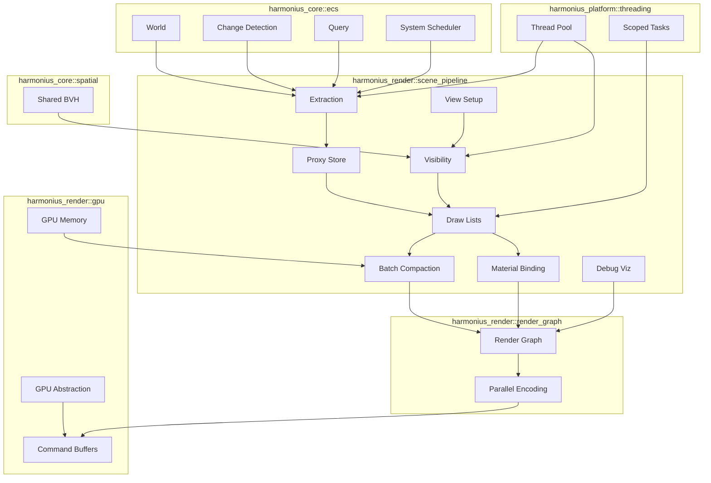
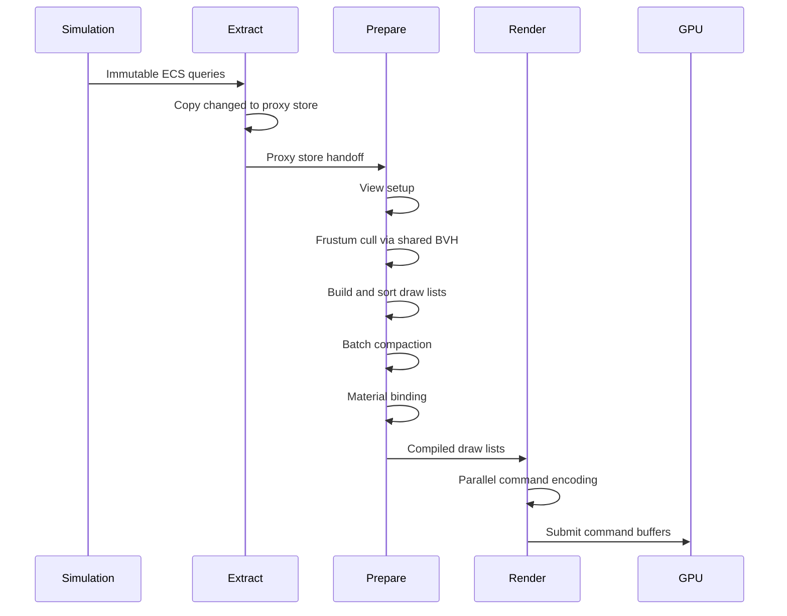
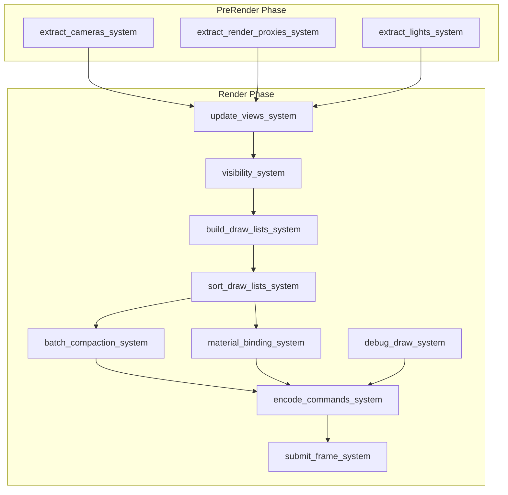
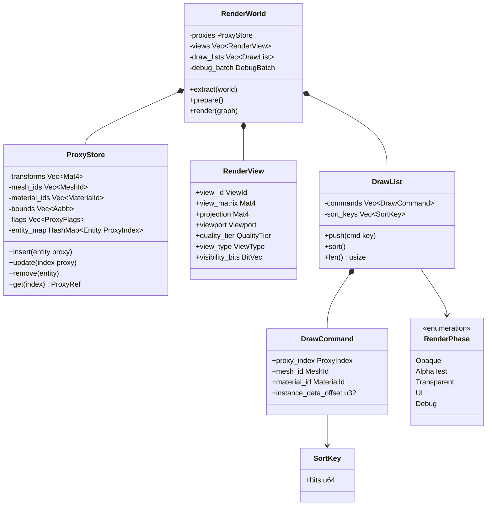
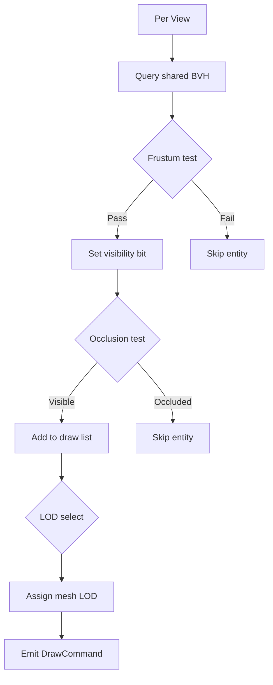
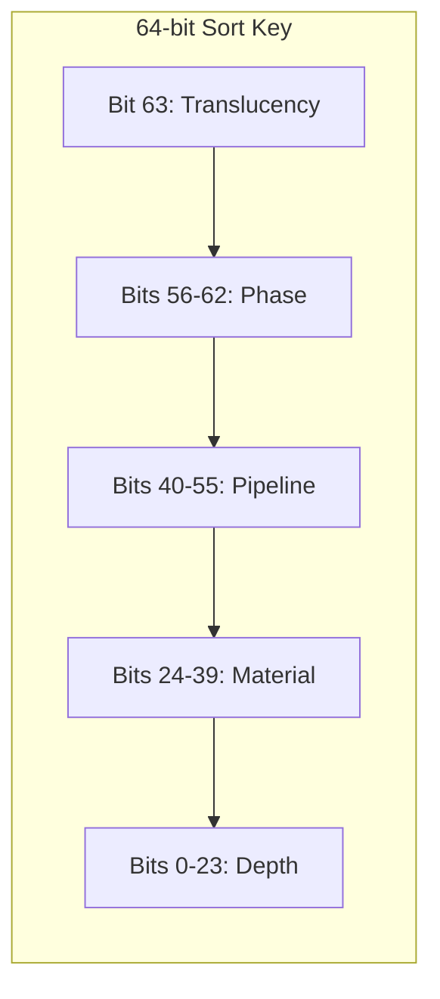

# Scene Rendering Pipeline Design

## Requirements Trace

> **Canonical sources:** Features, requirements, and user
> stories are defined in [features/rendering/](../../features/rendering/),
> [requirements/rendering/](../../requirements/rendering/), and
> [user-stories/rendering/](../../user-stories/rendering/). The table
> below traces design elements to those definitions.

| Feature | Requirement | User Stories | Description |
|---------|-------------|--------------|-------------|
| F-2.10.1 | R-2.10.1 | US-2.10.1.1, US-2.10.1.2 | Render proxy extraction on dedicated thread via immutable ECS queries |
| F-2.10.2 | R-2.10.2 | US-2.10.2.1, US-2.10.2.2 | SoA proxy components (mesh, material, transform, bounds) for GPU upload |
| F-2.10.3 | R-2.10.3 | US-2.10.3.1, US-2.10.3.2, US-2.10.3.3 | Dirty-flag incremental proxy updates, O(changed) per frame |
| F-2.10.4 | R-2.10.4 | US-2.10.4.1, US-2.10.4.2 | View and camera registration with projection, viewport, quality tier |
| F-2.10.5 | R-2.10.5 | US-2.10.5.1, US-2.10.5.2 | Multi-view rendering from single snapshot (shadows, probes, VR) |
| F-2.10.6 | R-2.10.6 | US-2.10.6.1, US-2.10.6.2 | Per-view draw lists with sort keys minimizing state changes |
| F-2.10.7 | R-2.10.7 | US-2.10.7.1, US-2.10.7.2 | GPU compute batch compaction into indirect draw buffers |
| F-2.10.8 | R-2.10.8 | US-2.10.8.1, US-2.10.8.2 | Bindless material parameter binding via per-instance descriptor indices |
| F-2.10.9 | R-2.10.9 | US-2.10.9.1, US-2.10.9.2 | Immediate-mode debug draw API, compile-time gated for shipping |
| F-2.10.10 | R-2.10.10 | US-2.10.10.1, US-2.10.10.2 | Buffer visualization modes (depth, normals, overdraw, etc.) |

### Cross-Cutting Dependencies

| Dependency | Source | Consumed API |
|------------|--------|--------------|
| ECS world and queries | F-1.1.1, F-1.1.17, F-1.1.20 | Archetype storage, composable queries, parallel iteration |
| Change detection | F-1.1.22 | Tick-based `Changed<T>` queries for incremental extraction |
| System scheduling | F-1.1.25, F-1.1.26 | `PreRender` and `Render` phase ordering |
| Shared spatial index | F-1.9.1, F-1.9.4, F-1.9.7 | BVH frustum query for visibility determination |
| Transforms | F-1.2.4 | `GlobalTransform` world-space matrices |
| Render graph | F-2.2.1, F-2.2.9, F-2.2.10 | Pass registration, multi-view execution, parallel encoding |
| GPU abstraction | F-2.1.1, F-2.1.2, F-2.1.7 | Backend trait, command buffers, memory sub-allocation |
| Thread pool | F-14.3.1, F-14.3.3 | Scoped parallel tasks, task graph execution |

### Performance Targets

| Metric | Target | Source |
|--------|--------|--------|
| Extraction (100K entities, full) | < 2.0 ms | NFR-2.10.1 |
| Extraction (100K entities, 1% dirty) | < 0.5 ms | NFR-2.10.1 |
| Draw list throughput | 500K proxies/ms/core | NFR-2.10.2 |
| Debug viz shipping overhead | Zero (CPU, GPU, binary) | NFR-2.10.3 |

## Overview

The scene rendering pipeline bridges the ECS
simulation world and the GPU. It follows an
**extract-prepare-render** pattern that decouples
simulation from rendering, enabling pipelined
parallelism.

Three principles drive the design:

1. **Decoupled snapshot.** Extraction copies only
   changed ECS data into a renderer-owned proxy
   store. The simulation is free to advance once
   extraction completes.
2. **Shared spatial index.** Visibility
   determination reads the engine-wide BVH
   (F-1.9.1) rather than maintaining a separate
   culling hierarchy.
3. **GPU-driven submission.** Draw calls are
   compacted on the GPU into indirect draw buffers,
   eliminating per-draw CPU dispatch overhead at
   scale.

All pipeline state lives as ECS components or
resources. All logic runs as ECS systems scheduled
in `PreRender` and `Render` phases. There are no
singletons, no dynamic dispatch in the hot path,
and no separate renderer data store outside the
ECS.

## Architecture

### Module Boundaries



### File Layout

```
harmonius_render/
├── scene_pipeline/
│   ├── mod.rs              # Re-exports
│   ├── extraction.rs       # Extract systems,
│   │                       # proxy creation
│   ├── proxy.rs            # ProxyStore, SoA
│   │                       # proxy components
│   ├── view.rs             # RenderView,
│   │                       # ViewType, camera
│   │                       # extraction
│   ├── visibility.rs       # Frustum cull,
│   │                       # occlusion,
│   │                       # LOD selection
│   ├── draw_list.rs        # DrawList,
│   │                       # DrawCommand,
│   │                       # SortKey
│   ├── batching.rs         # GPU batch
│   │                       # compaction
│   ├── material_binding.rs # Bindless param
│   │                       # upload
│   ├── debug.rs            # Debug draw API,
│   │                       # gizmos, buffer
│   │                       # viz
│   ├── phases.rs           # RenderPhase enum
│   │                       # and phase config
│   └── plugin.rs           # ScenePipelinePlugin
│                           # system registration
```

### Extract-Prepare-Render Flow



The pipeline stages are:

1. **Extract** (`PreRender` phase) -- Read-only
   ECS access. Copies changed transforms,
   meshes, materials, and bounds into the
   renderer-owned `ProxyStore`. Extracts cameras
   and lights.
2. **Prepare** (`Render` phase, before encoding)
   -- Operates exclusively on the proxy store.
   Sets up views, runs visibility against the
   shared BVH, builds per-view draw lists, sorts
   by sort key, runs GPU batch compaction, and
   uploads material parameters.
3. **Render** (`Render` phase, encoding and
   submit) -- Encodes GPU command buffers in
   parallel across worker threads, then submits
   to the GPU.

### System Execution Order



### Core Data Structures



### Visibility Determination



### Sort Key Bit Layout



| Field | Bits | Width | Purpose |
|-------|------|-------|---------|
| Translucency | 63 | 1 | 0 = opaque (front-to-back), 1 = transparent (back-to-front) |
| Phase | 56-62 | 7 | Render phase ordinal (Opaque, AlphaTest, Transparent, UI, Debug) |
| Pipeline | 40-55 | 16 | Pipeline state object hash (groups identical GPU state) |
| Material | 24-39 | 16 | Material ID (groups identical descriptor bindings) |
| Depth | 0-23 | 24 | Quantized depth (front-to-back for opaque, inverted for transparent) |

Opaque draws sort ascending (front-to-back for
early-Z rejection). Transparent draws sort
descending (back-to-front for correct blending).
The translucency bit in the MSB ensures all opaque
draws precede all transparent draws in a single
radix sort pass.

## API Design

### Proxy Types

```rust
/// Index into the ProxyStore SoA arrays.
#[derive(
    Clone, Copy, Debug, PartialEq, Eq, Hash,
)]
pub struct ProxyIndex(pub u32);

/// Flags describing proxy state.
#[derive(Clone, Copy, Debug)]
pub struct ProxyFlags(pub u32);

impl ProxyFlags {
    pub const ACTIVE: u32 = 1 << 0;
    pub const DIRTY_TRANSFORM: u32 = 1 << 1;
    pub const DIRTY_MESH: u32 = 1 << 2;
    pub const DIRTY_MATERIAL: u32 = 1 << 3;
    pub const CAST_SHADOW: u32 = 1 << 4;
    pub const RECEIVE_SHADOW: u32 = 1 << 5;
    pub const STATIC_GEOMETRY: u32 = 1 << 6;

    pub fn is_dirty(self) -> bool {
        (self.0
            & (Self::DIRTY_TRANSFORM
                | Self::DIRTY_MESH
                | Self::DIRTY_MATERIAL))
            != 0
    }

    pub fn clear_dirty(&mut self) {
        self.0 &= !(Self::DIRTY_TRANSFORM
            | Self::DIRTY_MESH
            | Self::DIRTY_MATERIAL);
    }
}
```

### Proxy Store (SoA Layout)

```rust
/// Structure-of-arrays storage for render
/// proxy components. Each field is a parallel
/// array indexed by ProxyIndex. Only data
/// needed by the GPU pipeline is stored;
/// simulation-only fields are discarded during
/// extraction.
pub struct ProxyStore {
    /// World-space transform matrices.
    transforms: Vec<Mat4>,
    /// Previous frame transforms (for motion
    /// vectors).
    prev_transforms: Vec<Mat4>,
    /// Mesh asset handle.
    mesh_ids: Vec<MeshId>,
    /// Material asset handle.
    material_ids: Vec<MaterialId>,
    /// World-space axis-aligned bounding box.
    bounds: Vec<Aabb>,
    /// Per-proxy state flags.
    flags: Vec<ProxyFlags>,
    /// Entity-to-proxy index mapping.
    entity_map: HashMap<Entity, ProxyIndex>,
    /// Free list for recycled indices.
    free_list: Vec<ProxyIndex>,
}

impl ProxyStore {
    pub fn new() -> Self;

    /// Insert a new proxy for the given entity.
    /// Reuses a free index if available.
    pub fn insert(
        &mut self,
        entity: Entity,
        transform: Mat4,
        mesh_id: MeshId,
        material_id: MaterialId,
        bounds: Aabb,
        flags: ProxyFlags,
    ) -> ProxyIndex;

    /// Update only the dirty fields of an
    /// existing proxy.
    pub fn update_transform(
        &mut self,
        index: ProxyIndex,
        transform: Mat4,
    );

    pub fn update_mesh(
        &mut self,
        index: ProxyIndex,
        mesh_id: MeshId,
    );

    pub fn update_material(
        &mut self,
        index: ProxyIndex,
        material_id: MaterialId,
    );

    pub fn update_bounds(
        &mut self,
        index: ProxyIndex,
        bounds: Aabb,
    );

    /// Remove a proxy and return its index to
    /// the free list.
    pub fn remove(
        &mut self,
        entity: Entity,
    ) -> Option<ProxyIndex>;

    /// Look up the proxy index for an entity.
    pub fn get(
        &self,
        entity: Entity,
    ) -> Option<ProxyIndex>;

    /// Total number of active proxies.
    pub fn len(&self) -> u32;

    /// Read-only slice access for GPU upload.
    pub fn transforms(&self) -> &[Mat4];
    pub fn mesh_ids(&self) -> &[MeshId];
    pub fn material_ids(&self) -> &[MaterialId];
    pub fn bounds(&self) -> &[Aabb];
    pub fn flags(&self) -> &[ProxyFlags];

    /// Swap current and previous transforms
    /// for motion vector computation. Called
    /// once per frame before extraction.
    pub fn rotate_transforms(&mut self);

    /// Clear all dirty flags after GPU upload.
    pub fn clear_dirty_flags(&mut self);
}
```

### View and Camera

```rust
/// Unique identifier for a render view.
#[derive(
    Clone, Copy, Debug, PartialEq, Eq, Hash,
)]
pub struct ViewId(pub u32);

/// Classification of view purpose.
#[derive(Clone, Copy, Debug, PartialEq, Eq)]
pub enum ViewType {
    /// Main game camera.
    MainCamera,
    /// Shadow cascade (index 0..N).
    ShadowCascade { cascade_index: u8 },
    /// Reflection probe capture face.
    ReflectionProbe { face: CubeFace },
    /// Split-screen player viewport.
    SplitScreen { player_index: u8 },
    /// VR eye (left or right).
    VrEye { eye: VrEye },
}

/// Quality scaling tier for a view.
#[derive(Clone, Copy, Debug, PartialEq, Eq)]
pub enum QualityTier {
    /// Full resolution, all effects.
    Full,
    /// Half resolution, reduced effects.
    Reduced,
    /// Quarter resolution, minimal effects.
    Minimal,
}

/// A single render view with all data needed
/// for per-view culling and draw list assembly.
pub struct RenderView {
    pub view_id: ViewId,
    pub view_matrix: Mat4,
    pub projection: Mat4,
    pub viewport: Viewport,
    pub quality_tier: QualityTier,
    pub view_type: ViewType,
    /// Per-proxy visibility bitset. Bit N is
    /// set if ProxyIndex(N) is visible in this
    /// view.
    pub visibility_bits: BitVec,
    /// Frustum planes extracted from the
    /// view-projection matrix.
    frustum: Frustum,
}

impl RenderView {
    pub fn new(
        view_id: ViewId,
        view_matrix: Mat4,
        projection: Mat4,
        viewport: Viewport,
        quality_tier: QualityTier,
        view_type: ViewType,
    ) -> Self;

    /// Recompute frustum planes from the
    /// current view-projection matrix.
    pub fn update_frustum(&mut self);

    /// Test whether a world-space AABB
    /// intersects this view's frustum.
    pub fn frustum_test(
        &self,
        aabb: &Aabb,
    ) -> bool;

    /// Reset visibility bits for a new frame.
    pub fn clear_visibility(&mut self);

    /// Mark a proxy as visible in this view.
    pub fn set_visible(
        &mut self,
        index: ProxyIndex,
    );

    /// Check visibility of a proxy.
    pub fn is_visible(
        &self,
        index: ProxyIndex,
    ) -> bool;

    /// Iterator over all visible proxy indices.
    pub fn visible_proxies(
        &self,
    ) -> impl Iterator<Item = ProxyIndex> + '_;
}

/// Viewport rectangle in pixels.
#[derive(Clone, Copy, Debug)]
pub struct Viewport {
    pub x: u32,
    pub y: u32,
    pub width: u32,
    pub height: u32,
}

/// Six frustum planes for culling.
pub struct Frustum {
    pub planes: [Vec4; 6],
}

impl Frustum {
    /// Extract frustum planes from a
    /// view-projection matrix using the
    /// Gribb-Hartmann method.
    pub fn from_view_projection(
        vp: &Mat4,
    ) -> Self;

    /// Test intersection with an AABB.
    /// Returns true if any part of the AABB
    /// is inside or intersecting the frustum.
    pub fn intersects_aabb(
        &self,
        aabb: &Aabb,
    ) -> bool;
}
```

### Draw List and Sort Key

```rust
/// A 64-bit sort key encoding draw order.
///
/// Bit layout (MSB to LSB):
/// - [63]    Translucency (0=opaque, 1=transp)
/// - [62:56] Phase ordinal (7 bits)
/// - [55:40] Pipeline state hash (16 bits)
/// - [39:24] Material ID (16 bits)
/// - [23:0]  Quantized depth (24 bits)
#[derive(
    Clone, Copy, Debug, PartialEq, Eq,
    PartialOrd, Ord,
)]
pub struct SortKey {
    pub bits: u64,
}

impl SortKey {
    /// Construct a sort key for an opaque draw.
    /// Depth is front-to-back (lower = closer).
    pub fn opaque(
        phase: RenderPhase,
        pipeline: u16,
        material: u16,
        depth: f32,
        near: f32,
        far: f32,
    ) -> Self;

    /// Construct a sort key for a transparent
    /// draw. Depth is back-to-front (inverted).
    pub fn transparent(
        phase: RenderPhase,
        pipeline: u16,
        material: u16,
        depth: f32,
        near: f32,
        far: f32,
    ) -> Self;

    /// Quantize a linear depth value to 24 bits.
    fn quantize_depth(
        depth: f32,
        near: f32,
        far: f32,
    ) -> u32;
}

/// A single draw command in a draw list.
#[derive(Clone, Copy, Debug)]
pub struct DrawCommand {
    /// Index into the ProxyStore.
    pub proxy_index: ProxyIndex,
    /// Mesh to draw.
    pub mesh_id: MeshId,
    /// Material for parameter binding.
    pub material_id: MaterialId,
    /// Byte offset into the per-instance
    /// GPU buffer for this draw's constants.
    pub instance_data_offset: u32,
    /// LOD level selected by distance.
    pub lod_level: u8,
}

/// Render phase classification.
#[derive(
    Clone, Copy, Debug, PartialEq, Eq,
    PartialOrd, Ord, Hash,
)]
pub enum RenderPhase {
    /// Fully opaque geometry. Front-to-back.
    Opaque = 0,
    /// Alpha-tested geometry (foliage, fences).
    AlphaTest = 1,
    /// Alpha-blended geometry. Back-to-front.
    Transparent = 2,
    /// Screen-space UI overlay.
    UI = 3,
    /// Debug visualization (gizmos, lines).
    /// Stripped in shipping builds.
    #[cfg(debug_assertions)]
    Debug = 4,
}

/// Per-view draw list holding sorted draw
/// commands for a single render phase.
pub struct DrawList {
    phase: RenderPhase,
    commands: Vec<DrawCommand>,
    sort_keys: Vec<SortKey>,
}

impl DrawList {
    pub fn new(phase: RenderPhase) -> Self;

    /// Append a draw command with its sort key.
    pub fn push(
        &mut self,
        cmd: DrawCommand,
        key: SortKey,
    );

    /// Sort commands by sort key. Uses radix
    /// sort for O(n) performance on the 64-bit
    /// key.
    pub fn sort(&mut self);

    /// Number of draw commands.
    pub fn len(&self) -> usize;

    /// Read-only access to sorted commands.
    pub fn commands(&self) -> &[DrawCommand];

    /// Clear for reuse next frame.
    pub fn clear(&mut self);
}
```

### Render World (Top-Level Resource)

```rust
/// The renderer-owned world containing all
/// data needed to produce a frame. Stored as
/// an ECS resource (Res<RenderWorld>). This is
/// not a separate ECS world -- it is a resource
/// within the main world that holds the
/// GPU-side snapshot.
pub struct RenderWorld {
    /// SoA proxy store for all renderable
    /// entities.
    pub proxies: ProxyStore,
    /// Active render views this frame.
    pub views: Vec<RenderView>,
    /// Per-view, per-phase draw lists.
    pub draw_lists: DrawListSet,
    /// Per-instance GPU data buffer for
    /// material parameters and transforms.
    pub instance_buffer: InstanceBuffer,
    /// Debug draw batch (empty in shipping).
    #[cfg(debug_assertions)]
    pub debug_batch: DebugBatch,
    /// Frame index for double-buffering.
    pub frame_index: u64,
}

/// Collection of draw lists organized by
/// (ViewId, RenderPhase).
pub struct DrawListSet {
    lists: HashMap<(ViewId, RenderPhase), DrawList>,
}

impl DrawListSet {
    pub fn new() -> Self;

    /// Get or create the draw list for a
    /// view and phase.
    pub fn get_or_create(
        &mut self,
        view_id: ViewId,
        phase: RenderPhase,
    ) -> &mut DrawList;

    /// Iterate all draw lists.
    pub fn iter(
        &self,
    ) -> impl Iterator<
        Item = (
            &(ViewId, RenderPhase),
            &DrawList,
        ),
    >;

    /// Clear all draw lists for the next frame.
    pub fn clear_all(&mut self);
}
```

### Extraction Systems

```rust
/// ECS component marking an entity as
/// renderable. Added alongside mesh and
/// material components.
#[derive(Clone, Copy, Debug)]
pub struct Renderable {
    pub cast_shadow: bool,
    pub receive_shadow: bool,
}

/// ECS component linking an entity to its
/// render proxy index. Added by the extraction
/// system on first extraction.
#[derive(Clone, Copy, Debug)]
pub struct RenderProxy {
    pub index: ProxyIndex,
}

/// Extract cameras from the ECS world into
/// RenderViews. Runs in PreRender phase.
///
/// Query: (Entity, &Camera, &GlobalTransform)
pub fn extract_cameras_system(
    cameras: Query<(
        Entity,
        &Camera,
        &GlobalTransform,
    )>,
    render_world: ResMut<RenderWorld>,
);

/// Extract renderable entities into the proxy
/// store. Uses change detection to perform
/// incremental updates.
///
/// Query: (
///     Entity,
///     &GlobalTransform,
///     &MeshHandle,
///     &MaterialHandle,
///     &Aabb,
///     &Renderable,
///     Option<&RenderProxy>,
///     Changed<GlobalTransform>,
///     Changed<MeshHandle>,
///     Changed<MaterialHandle>,
/// )
pub fn extract_render_proxies_system(
    query: Query<(
        Entity,
        &GlobalTransform,
        &MeshHandle,
        &MaterialHandle,
        &Aabb,
        &Renderable,
        Option<&RenderProxy>,
    )>,
    changed_transforms: Query<
        Entity,
        Changed<GlobalTransform>,
    >,
    changed_meshes: Query<
        Entity,
        Changed<MeshHandle>,
    >,
    changed_materials: Query<
        Entity,
        Changed<MaterialHandle>,
    >,
    render_world: ResMut<RenderWorld>,
    commands: Commands,
);

/// Extract light sources for shadow view
/// generation.
///
/// Query: (Entity, &Light, &GlobalTransform)
pub fn extract_lights_system(
    lights: Query<(
        Entity,
        &Light,
        &GlobalTransform,
    )>,
    render_world: ResMut<RenderWorld>,
);
```

### Visibility System

```rust
/// Per-view frustum culling against the shared
/// BVH. Writes visibility bits into each
/// RenderView. Runs in parallel across views
/// using scoped tasks.
pub fn visibility_system(
    render_world: ResMut<RenderWorld>,
    spatial_index: Res<SharedSpatialIndex>,
    pool: Res<ThreadPool>,
);

/// Implementation: for each view, queries the
/// shared BVH with the view frustum and writes
/// the resulting entity set into the view's
/// visibility bitset.
fn cull_view(
    view: &mut RenderView,
    proxies: &ProxyStore,
    spatial_index: &SharedSpatialIndex,
) {
    view.clear_visibility();
    // Frustum query returns Entity handles
    // with AABB metadata.
    let hits = spatial_index.frustum_query(
        &view.frustum,
    );
    for hit in hits {
        if let Some(index) =
            proxies.get(hit.entity)
        {
            view.set_visible(index);
        }
    }
}

/// Select LOD level based on screen-space
/// size of the proxy bounding sphere.
pub fn select_lod(
    bounds: &Aabb,
    view: &RenderView,
    lod_distances: &[f32],
) -> u8;
```

### Draw List Construction

```rust
/// Build per-view, per-phase draw lists from
/// visible proxies. Runs after visibility.
/// Parallelized across views via scoped tasks.
pub fn build_draw_lists_system(
    render_world: ResMut<RenderWorld>,
    pool: Res<ThreadPool>,
);

/// Implementation: iterate visible proxies for
/// a view and emit DrawCommands into the
/// appropriate phase draw list.
fn build_draw_list_for_view(
    view: &RenderView,
    proxies: &ProxyStore,
    draw_lists: &mut DrawListSet,
    lod_distances: &[f32],
) {
    for index in view.visible_proxies() {
        let mesh_id = proxies.mesh_ids()
            [index.0 as usize];
        let material_id = proxies.material_ids()
            [index.0 as usize];
        let bounds = &proxies.bounds()
            [index.0 as usize];

        let phase = classify_phase(material_id);
        let lod = select_lod(
            bounds,
            view,
            lod_distances,
        );
        let depth = compute_depth(
            bounds,
            &view.view_matrix,
        );

        let key = match phase {
            RenderPhase::Transparent => {
                SortKey::transparent(
                    phase,
                    pipeline_hash(material_id),
                    material_id.0 as u16,
                    depth,
                    view.near(),
                    view.far(),
                )
            }
            _ => SortKey::opaque(
                phase,
                pipeline_hash(material_id),
                material_id.0 as u16,
                depth,
                view.near(),
                view.far(),
            ),
        };

        let cmd = DrawCommand {
            proxy_index: index,
            mesh_id,
            material_id,
            instance_data_offset: 0,
            lod_level: lod,
        };

        draw_lists
            .get_or_create(view.view_id, phase)
            .push(cmd, key);
    }
}

/// Classify which render phase a material
/// belongs to based on its blend mode.
fn classify_phase(
    material_id: MaterialId,
) -> RenderPhase;

/// Compute linear depth of a bounding box
/// center in view space.
fn compute_depth(
    bounds: &Aabb,
    view_matrix: &Mat4,
) -> f32;

/// Hash the pipeline state associated with a
/// material to produce a 16-bit key for
/// grouping.
fn pipeline_hash(
    material_id: MaterialId,
) -> u16;
```

### Sort and Radix Sort

```rust
/// Sort all draw lists by sort key. Uses
/// radix sort for O(n) performance on 64-bit
/// keys.
pub fn sort_draw_lists_system(
    render_world: ResMut<RenderWorld>,
);

/// Radix sort a draw list in-place.
/// Sorts (sort_keys, commands) in parallel
/// using an 8-bit radix (8 passes over 64
/// bits).
fn radix_sort_draw_list(
    list: &mut DrawList,
);
```

### GPU Batch Compaction

```rust
/// GPU-side batch compaction. A compute shader
/// reads the sorted draw list, applies
/// GPU-driven occlusion culling, and writes
/// surviving draws into contiguous indirect
/// draw buffers grouped by material.
pub fn batch_compaction_system<B: GpuBackend>(
    render_world: Res<RenderWorld>,
    device: Res<B::Device>,
    allocator: Res<GpuAllocator<B>>,
);

/// Indirect draw buffer holding compacted draw
/// commands for a single material group.
pub struct IndirectDrawBuffer<B: GpuBackend> {
    /// GPU buffer containing indirect draw
    /// arguments.
    pub buffer: B::Buffer,
    /// Number of draws written by the
    /// compaction shader.
    pub draw_count_offset: u64,
    /// Material ID for this group.
    pub material_id: MaterialId,
}

/// Upload sorted draw commands to a GPU
/// staging buffer for the compaction compute
/// shader.
fn upload_draw_commands<B: GpuBackend>(
    list: &DrawList,
    allocator: &GpuAllocator<B>,
) -> B::Buffer;

/// Record the compaction compute dispatch
/// into a command buffer.
fn record_compaction_dispatch<B: GpuBackend>(
    cmd: &mut B::CommandBuffer,
    input: &B::Buffer,
    output: &IndirectDrawBuffer<B>,
    draw_count: u32,
);
```

### Material Parameter Binding

```rust
/// Bindless material parameter upload. Writes
/// per-instance descriptor indices into a GPU
/// buffer so shaders can read material params
/// by index rather than switching descriptor
/// sets.
pub fn material_binding_system<B: GpuBackend>(
    render_world: ResMut<RenderWorld>,
    material_cache: Res<MaterialCache<B>>,
    allocator: Res<GpuAllocator<B>>,
);

/// Per-instance data written to the GPU buffer.
/// Shaders read this to look up material
/// parameters.
#[repr(C)]
#[derive(Clone, Copy, Debug)]
pub struct InstanceData {
    /// World transform (4x4 column-major).
    pub transform: [f32; 16],
    /// Previous frame transform (motion
    /// vectors).
    pub prev_transform: [f32; 16],
    /// Bindless index into the texture
    /// descriptor heap.
    pub albedo_index: u32,
    /// Bindless index for normal map.
    pub normal_index: u32,
    /// Bindless index for PBR parameter map.
    pub pbr_index: u32,
    /// Material constant buffer offset.
    pub material_cb_offset: u32,
}

/// GPU buffer holding per-instance data for
/// all draws in a frame.
pub struct InstanceBuffer {
    /// CPU-side staging data.
    data: Vec<InstanceData>,
    /// Current write offset.
    offset: u32,
}

impl InstanceBuffer {
    pub fn new(capacity: u32) -> Self;

    /// Allocate space for one instance and
    /// return the byte offset.
    pub fn push(
        &mut self,
        instance: InstanceData,
    ) -> u32;

    /// Upload to the GPU buffer.
    pub fn upload<B: GpuBackend>(
        &self,
        allocator: &GpuAllocator<B>,
    ) -> B::Buffer;

    /// Reset for the next frame.
    pub fn clear(&mut self);
}
```

### Debug Visualization

```rust
/// Immediate-mode debug draw API. All methods
/// are no-ops in shipping builds via
/// compile-time gating.
#[cfg(debug_assertions)]
pub struct DebugDraw {
    vertices: Vec<DebugVertex>,
    indices: Vec<u32>,
}

#[cfg(not(debug_assertions))]
pub struct DebugDraw;

#[cfg(debug_assertions)]
#[repr(C)]
#[derive(Clone, Copy, Debug)]
pub struct DebugVertex {
    pub position: [f32; 3],
    pub color: [f32; 4],
}

#[cfg(debug_assertions)]
impl DebugDraw {
    pub fn new() -> Self;

    /// Draw a line segment.
    pub fn line(
        &mut self,
        start: Vec3,
        end: Vec3,
        color: Color,
    );

    /// Draw a wireframe box.
    pub fn wire_box(
        &mut self,
        center: Vec3,
        half_extents: Vec3,
        color: Color,
    );

    /// Draw a wireframe sphere.
    pub fn wire_sphere(
        &mut self,
        center: Vec3,
        radius: f32,
        color: Color,
    );

    /// Draw a wireframe frustum.
    pub fn wire_frustum(
        &mut self,
        frustum: &Frustum,
        color: Color,
    );

    /// Draw a text label at a world position.
    pub fn text(
        &mut self,
        position: Vec3,
        text: &str,
        color: Color,
    );

    /// Flush all debug primitives into a
    /// single vertex/index buffer for the
    /// debug render pass.
    pub fn flush(&mut self) -> DebugBatch;
}

#[cfg(not(debug_assertions))]
impl DebugDraw {
    pub fn new() -> Self { Self }
    pub fn line(&mut self, _: Vec3, _: Vec3, _: Color) {}
    pub fn wire_box(&mut self, _: Vec3, _: Vec3, _: Color) {}
    pub fn wire_sphere(&mut self, _: Vec3, _: f32, _: Color) {}
    pub fn wire_frustum(&mut self, _: &Frustum, _: Color) {}
    pub fn text(&mut self, _: Vec3, _: &str, _: Color) {}
    pub fn flush(&mut self) -> DebugBatch { DebugBatch }
}

/// Batched debug geometry ready for GPU upload.
#[cfg(debug_assertions)]
pub struct DebugBatch {
    pub vertices: Vec<DebugVertex>,
    pub indices: Vec<u32>,
}

#[cfg(not(debug_assertions))]
pub struct DebugBatch;

/// Buffer visualization diagnostic modes.
#[cfg(debug_assertions)]
#[derive(Clone, Copy, Debug, PartialEq, Eq)]
pub enum BufferVizMode {
    None,
    Depth,
    Normals,
    MotionVectors,
    Roughness,
    Metallic,
    BaseColor,
    AmbientOcclusion,
    LightComplexity,
    OverdrawHeatMap,
}

/// System that renders the debug overlay pass.
/// Compile-time gated: absent from shipping.
#[cfg(debug_assertions)]
pub fn debug_draw_system(
    render_world: Res<RenderWorld>,
    debug_draw: ResMut<DebugDraw>,
);
```

### Command Buffer Encoding

```rust
/// Encode GPU command buffers in parallel
/// across worker threads. Each view's draw
/// lists are encoded into a secondary command
/// buffer. Secondary buffers are collected and
/// submitted as a single primary buffer.
pub fn encode_commands_system<B: GpuBackend>(
    render_world: Res<RenderWorld>,
    device: Res<B::Device>,
    graph: Res<RenderGraph<B>>,
    pool: Res<ThreadPool>,
);

/// Encode draw commands for a single view and
/// phase into a secondary command buffer.
fn encode_view_phase<B: GpuBackend>(
    device: &B::Device,
    view: &RenderView,
    draw_list: &DrawList,
    indirect_buffers: &[IndirectDrawBuffer<B>],
    instance_buffer: &B::Buffer,
) -> B::CommandBuffer;

/// Submit the final primary command buffer
/// to the GPU queue.
pub fn submit_frame_system<B: GpuBackend>(
    device: Res<B::Device>,
    render_world: Res<RenderWorld>,
);
```

### Plugin Registration

```rust
/// Plugin that registers all scene pipeline
/// systems with the ECS scheduler.
pub struct ScenePipelinePlugin;

impl Plugin for ScenePipelinePlugin {
    fn build(&self, app: &mut App) {
        app.init_resource::<RenderWorld>();

        #[cfg(debug_assertions)]
        app.init_resource::<DebugDraw>();

        // PreRender phase: extraction
        app.add_system_to_phase(
            PreRender,
            extract_cameras_system,
        );
        app.add_system_to_phase(
            PreRender,
            extract_render_proxies_system,
        );
        app.add_system_to_phase(
            PreRender,
            extract_lights_system,
        );

        // Render phase: prepare and submit
        app.add_system_to_phase(
            Render,
            update_views_system
                .after(extract_cameras_system),
        );
        app.add_system_to_phase(
            Render,
            visibility_system
                .after(update_views_system),
        );
        app.add_system_to_phase(
            Render,
            build_draw_lists_system
                .after(visibility_system),
        );
        app.add_system_to_phase(
            Render,
            sort_draw_lists_system
                .after(build_draw_lists_system),
        );
        app.add_system_to_phase(
            Render,
            batch_compaction_system
                .after(sort_draw_lists_system),
        );
        app.add_system_to_phase(
            Render,
            material_binding_system
                .after(sort_draw_lists_system),
        );
        #[cfg(debug_assertions)]
        app.add_system_to_phase(
            Render,
            debug_draw_system
                .after(sort_draw_lists_system),
        );
        app.add_system_to_phase(
            Render,
            encode_commands_system
                .after(batch_compaction_system)
                .after(material_binding_system),
        );
        app.add_system_to_phase(
            Render,
            submit_frame_system
                .after(encode_commands_system),
        );
    }
}
```

### Error Types

```rust
/// Errors that can occur in the scene
/// rendering pipeline.
pub enum ScenePipelineError {
    /// Entity does not have a render proxy.
    ProxyNotFound { entity: Entity },
    /// Proxy store is at capacity.
    ProxyStoreExhausted {
        capacity: u32,
    },
    /// Instance buffer exceeded GPU allocation.
    InstanceBufferOverflow {
        requested: u32,
        available: u32,
    },
    /// Indirect draw buffer allocation failed.
    IndirectBufferAllocationFailed,
    /// View limit exceeded.
    MaxViewsExceeded {
        count: u32,
        max: u32,
    },
}
```

## Data Flow

### Per-Frame Lifecycle

```rust
// Simplified frame flow (pseudocode)
loop {
    // --- I/O poll point ---
    reactor.poll();

    // --- Simulation (Update phase) ---
    // ECS systems mutate transforms, spawn
    // entities, change materials, etc.
    ecs.run_phase(Update);

    // --- Transform propagation (PostUpdate) ---
    // GlobalTransform computed, BVH updated.
    ecs.run_phase(PostUpdate);

    // --- Extraction (PreRender) ---
    // extract_cameras_system
    // extract_render_proxies_system
    //   - Query Changed<GlobalTransform>,
    //     Changed<MeshHandle>,
    //     Changed<MaterialHandle>
    //   - Insert new proxies, update changed,
    //     remove despawned
    // extract_lights_system
    ecs.run_phase(PreRender);

    // --- Prepare + Render (Render phase) ---
    // update_views_system
    //   - Build RenderView list from cameras
    //     and shadow-casting lights
    // visibility_system
    //   - Per-view frustum cull via shared BVH
    //   - Write visibility_bits per view
    // build_draw_lists_system
    //   - Per-view iterate visible proxies
    //   - Emit DrawCommands with SortKeys
    // sort_draw_lists_system
    //   - Radix sort per draw list
    // batch_compaction_system
    //   - Upload to GPU, dispatch compaction
    //     compute shader
    // material_binding_system
    //   - Write InstanceData to GPU buffer
    // debug_draw_system (debug only)
    //   - Flush debug primitives
    // encode_commands_system
    //   - Parallel secondary command buffers
    // submit_frame_system
    //   - Submit primary command buffer
    ecs.run_phase(Render);

    // --- GPU sync (async, no CPU spin) ---
    renderer.present().await;
}
```

### Incremental Extraction Detail

The extraction system uses ECS change detection
(F-1.1.22) to minimize per-frame work:

1. **New entities** -- Entities with `Renderable`
   but no `RenderProxy` component. Insert into
   proxy store, attach `RenderProxy` component
   via command buffer.
2. **Changed entities** -- Entities with
   `Changed<GlobalTransform>`,
   `Changed<MeshHandle>`, or
   `Changed<MaterialHandle>`. Update only the
   changed fields in the proxy store.
3. **Removed entities** -- Entities with
   `RenderProxy` that no longer match the
   `Renderable` query (despawned or component
   removed). Remove from proxy store, recycle
   index.

This bounds extraction cost to `O(new + changed +
removed)` rather than `O(total)`.

### Multi-View Parallelism

Visibility and draw list construction are
parallelized across views using scoped tasks:

```rust
fn visibility_system(
    render_world: ResMut<RenderWorld>,
    spatial_index: Res<SharedSpatialIndex>,
    pool: Res<ThreadPool>,
) {
    let rw = &mut *render_world;
    let proxies = &rw.proxies;
    let views = &mut rw.views;

    pool.scope(|scope| {
        for view in views.iter_mut() {
            scope.spawn(|| {
                cull_view(
                    view,
                    proxies,
                    &spatial_index,
                );
            });
        }
    });
    // All views culled when scope exits.
}
```

Each view's frustum query reads the shared BVH
(immutable) and writes only to its own
`visibility_bits` (no contention). Views are
fully independent and scale linearly with
worker count.

### GPU Batch Compaction Pipeline

1. CPU sorts draw commands by sort key
   (radix sort).
2. CPU uploads sorted draw commands to a GPU
   staging buffer.
3. GPU compute shader reads the staging buffer,
   performs GPU-driven occlusion culling (HiZ
   test), and writes surviving draws into
   contiguous indirect draw buffers grouped by
   material.
4. A draw count buffer is atomically incremented
   per material group.
5. The render pass issues one
   `draw_indirect_count` call per material group.

This reduces CPU draw submission from O(draws) to
O(material_groups), enabling hundreds of thousands
of meshlet instances with minimal CPU overhead.

## Platform Considerations

### Backend-Specific Bindless Binding

| Backend | Mechanism | Notes |
|---------|-----------|-------|
| Metal | Argument buffers | `MTLArgumentEncoder` writes bindless indices into an argument buffer bound once per frame. |
| D3D12 | Bindless SRV heap | Root descriptor table points to a shader-visible CBV/SRV/UAV heap. Indices stored in per-instance data. |
| Vulkan | `VK_EXT_descriptor_indexing` | `UPDATE_AFTER_BIND` descriptors in a single large descriptor set. Non-uniform indexing in shader. |

### Indirect Draw API Mapping

| Backend | Indirect Draw API | Count Buffer |
|---------|-------------------|--------------|
| Metal | `drawIndexedPrimitives(indirectBuffer:)` | `MTLIndirectCommandBuffer` with `executeCommandsInBuffer` |
| D3D12 | `ExecuteIndirect` | `ID3D12CommandSignature` with draw count in a separate buffer |
| Vulkan | `vkCmdDrawIndexedIndirectCount` | Requires `VK_KHR_draw_indirect_count` (core in Vulkan 1.2) |

### Platform Scaling

| Tier | Max Proxies | Max Views | Indirect Draw | Draw Lists |
|------|-------------|-----------|---------------|------------|
| Mobile | 50K | 4 (main + 2-3 shadows) | Vulkan 1.1+ / Metal GPU family 3+ | Smaller compaction buffers |
| Switch | 200K | 8 | Full indirect compaction | Medium buffers |
| Desktop | 1M+ | Configurable, dozens | Full indirect compaction | Large buffers |
| High-end | 5M+ | Unlimited | Full indirect + GPU culling | Maximum buffers |

### VR Considerations

VR stereo views use single-pass instanced
rendering on backends that support viewport
instancing (Vulkan `VK_KHR_multiview`, D3D12
view instancing). Both eyes share a single draw
list with viewport index selecting left/right
projection. This avoids doubling the geometry
workload.

On backends without viewport instancing, VR
falls back to two-pass rendering (one draw list
per eye).

## Test Plan

### Unit Tests

| Test | Req | Description |
|------|-----|-------------|
| `test_proxy_insert_and_lookup` | R-2.10.2 | Insert a proxy, verify entity-to-index mapping and SoA field values. |
| `test_proxy_update_single_field` | R-2.10.3 | Update only the transform of a proxy. Verify other fields are unchanged. |
| `test_proxy_remove_and_reuse` | R-2.10.2 | Remove a proxy. Insert a new one. Verify the recycled index is reused. |
| `test_proxy_flags_dirty_clear` | R-2.10.3 | Set dirty flags on a proxy. Call `clear_dirty_flags()`. Verify all dirty bits cleared. |
| `test_sort_key_opaque_ordering` | R-2.10.6 | Generate sort keys for 3 opaque draws with different depths. Verify ascending order (front-to-back). |
| `test_sort_key_transparent_ordering` | R-2.10.6 | Generate sort keys for 3 transparent draws. Verify descending depth order (back-to-front). |
| `test_sort_key_phase_separation` | R-2.10.6 | Generate opaque and transparent sort keys. Verify all opaque keys sort before all transparent keys. |
| `test_sort_key_material_grouping` | R-2.10.6 | Generate keys with same pipeline but different materials. Verify material grouping within phase. |
| `test_draw_list_radix_sort` | R-2.10.6 | Insert 10K random draw commands. Sort. Verify commands are in sort key order. |
| `test_frustum_cull_inside` | R-2.10.5 | AABB fully inside frustum. Verify frustum test returns true. |
| `test_frustum_cull_outside` | R-2.10.5 | AABB fully outside frustum. Verify frustum test returns false. |
| `test_frustum_cull_intersecting` | R-2.10.5 | AABB intersecting frustum boundary. Verify test returns true (conservative). |
| `test_view_visibility_bits` | R-2.10.5 | Set visibility for proxies 0, 5, 99. Verify only those bits are set in the bitset. |
| `test_lod_selection` | R-2.10.6 | Bounding sphere at varying distances. Verify correct LOD level selected per distance threshold. |
| `test_instance_data_layout` | R-2.10.8 | Verify `InstanceData` is `#[repr(C)]` and field offsets match shader expectations. |
| `test_debug_draw_stripped` | R-2.10.9 | Compile with `--release`. Verify `DebugDraw` methods are no-ops and `DebugBatch` is zero-size. |
| `test_render_phase_ordering` | R-2.10.6 | Verify `RenderPhase` ordinal values sort Opaque < AlphaTest < Transparent < UI < Debug. |

### Integration Tests

| Test | Req | Description |
|------|-----|-------------|
| `test_extract_incremental_100k` | R-2.10.3, NFR-2.10.1 | Spawn 100K entities. Modify 100. Verify extraction uploads exactly 100 proxies. Measure time < 0.5 ms. |
| `test_extract_full_100k` | R-2.10.1, NFR-2.10.1 | Spawn 100K entities (first frame). Verify all extracted. Measure time < 2.0 ms. |
| `test_extract_thread_safety` | R-2.10.1 | Run extraction concurrently with simulation mutations under ThreadSanitizer. Verify no data races. |
| `test_multi_view_20_views` | R-2.10.5 | Register 20 views (4 shadows, 6 probes, 10 cameras). Verify each produces independent draw output. |
| `test_multi_view_shared_snapshot` | R-2.10.5 | Verify all 20 views reference the same proxy store snapshot (no per-view extraction). |
| `test_indirect_draw_compaction` | R-2.10.7 | 500K meshlet instances. Run GPU compaction. Verify contiguous indirect buffers with correct draw counts. |
| `test_bindless_metal` | R-2.10.8 | Render 100 materials on Metal. Verify argument buffer binding, no descriptor set switches. |
| `test_bindless_d3d12` | R-2.10.8 | Render 100 materials on D3D12. Verify bindless SRV heap access. |
| `test_bindless_vulkan` | R-2.10.8 | Render 100 materials on Vulkan. Verify descriptor indexing. |
| `test_debug_overlay_present` | R-2.10.9 | Issue debug lines, boxes, text. Verify overlay appears after scene composite (debug build). |
| `test_debug_overlay_absent` | R-2.10.9 | Shipping build. Verify no debug draw symbols or GPU passes. |
| `test_buffer_viz_modes` | R-2.10.10 | Select each buffer viz mode. Verify output displays the correct buffer contents. |
| `test_buffer_viz_mobile_deferred` | R-2.10.10 | Disable deferred on mobile. Verify G-buffer viz modes are unavailable. |
| `test_soa_vs_aos_perf` | R-2.10.2 | Benchmark proxy iteration at 100K entities in SoA vs AoS. Verify SoA has lower cache miss rate. |
| `test_vr_single_pass_instanced` | R-2.10.5 | VR stereo views on a backend with viewport instancing. Verify single draw list serves both eyes. |

### Benchmarks

| Benchmark | Target | Source |
|-----------|--------|--------|
| Extraction (100K, full) | < 2.0 ms | NFR-2.10.1 |
| Extraction (100K, 1% dirty) | < 0.5 ms | NFR-2.10.1 |
| Draw list build (500K proxies) | < 1.0 ms / core | NFR-2.10.2 |
| Radix sort (500K keys) | < 0.5 ms | US-2.10.6.1 |
| Visibility (100K proxies, 1 view) | < 0.3 ms | F-1.9.7 |
| Visibility (100K proxies, 20 views) | < 1.0 ms (parallel) | US-2.10.5.1 |
| GPU compaction (500K instances) | < 0.2 ms GPU | US-2.10.7.1 |
| Debug draw (0 primitives, shipping) | 0.0 ms | NFR-2.10.3 |

## Open Questions

1. **Proxy store capacity policy.** Fixed
   pre-allocation vs dynamic growth. Fixed avoids
   allocation during gameplay but wastes memory.
   Dynamic adapts but may cause frame spikes on
   reallocation. A hybrid (pre-allocate to
   expected max, grow in rare cases) may be best.

2. **GPU occlusion culling integration.** The
   batch compaction shader can incorporate HiZ
   occlusion culling. This requires a HiZ buffer
   from the previous frame. The exact reprojection
   and HiZ generation strategy needs to be defined
   in coordination with the render graph design.

3. **Motion vector generation.** The proxy store
   maintains previous-frame transforms for motion
   vectors. The exact shader-side motion vector
   computation (full per-pixel vs per-vertex
   approximation) depends on the TAA/upscaling
   design.

4. **Instance buffer sizing.** The per-instance
   GPU buffer must accommodate all draws across
   all views. At scale (20 views, 100K visible
   proxies per view), this buffer could be large.
   Whether to use one global buffer or per-view
   sub-ranges affects GPU memory and upload
   strategy.

5. **Render feature extensibility.** The current
   design extracts meshes, lights, and cameras.
   Particles, decals, and UI elements will need
   their own extraction and draw list paths. The
   `RenderPhase` enum and draw list structure
   should accommodate additional phases without
   modification to core pipeline code.

6. **Sort key depth precision.** 24 bits of
   depth may not be sufficient for very large
   worlds (open-world games with 10+ km draw
   distances). Logarithmic depth quantization
   or per-phase depth ranges may be needed.
