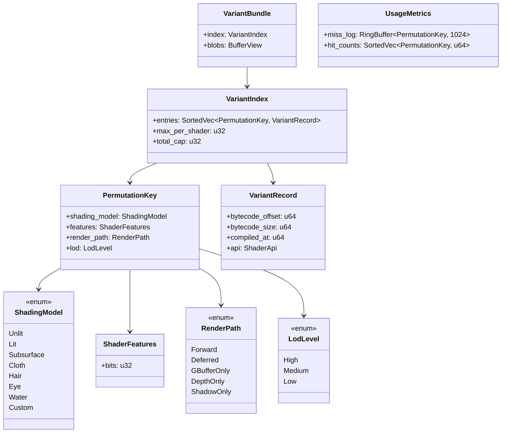
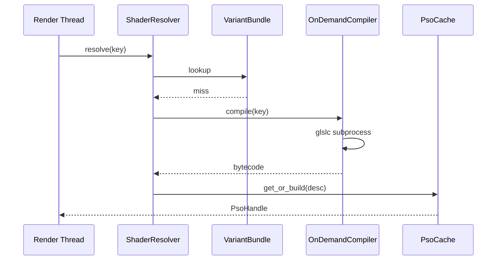

# Shader Variants Design

## Requirements Trace

> **Canonical sources:** Features, requirements, and user stories live in
> [features/](../../features/), [requirements/](../../requirements/), and
> [user-stories/](../../user-stories/).

### Primary Requirements

| Feature    | Requirement | User Story  | Design Element                    |
|------------|-------------|-------------|-----------------------------------|
| F-2.3.10.1 | R-2.3.10.1  | US-2.3.10.1 | `PermutationKey` structure        |
| F-2.3.10.2 | R-2.3.10.2  | US-2.3.10.2 | Dimension enumeration             |
| F-2.3.10.3 | R-2.3.10.3  | US-2.3.10.3 | Variant budget and cap            |
| F-2.3.10.4 | R-2.3.10.4  | US-2.3.10.4 | Precompilation pass               |
| F-2.3.10.5 | R-2.3.10.5  | US-2.3.10.5 | On-demand compilation             |
| F-2.3.10.6 | R-2.3.10.6  | US-2.3.10.6 | Distribution format (pak bundle)  |
| F-2.3.10.7 | R-2.3.10.7  | US-2.3.10.7 | Variant coverage reporting        |
| F-2.3.10.8 | R-2.3.10.8  | US-2.3.10.8 | Usage metrics to drive bundling   |

1. **R-2.3.10.1** -- `PermutationKey` = tuple of dimension values, content-hashable
2. **R-2.3.10.2** -- Four dimensions: `ShadingModel`, `ShaderFeatures`, `RenderPath`, `Lod`
3. **R-2.3.10.3** -- Per-mesh max variant count = 64; total per-project = 4096
4. **R-2.3.10.4** -- Asset processing precompiles the tracked variant set
5. **R-2.3.10.5** -- Untracked variants compile on demand, recorded in usage metrics
6. **R-2.3.10.6** -- Shaders are bundled into a single `shaders.pak` file per target
7. **R-2.3.10.7** -- CLI report of variant counts, uncompiled misses, and bundle sizes
8. **R-2.3.10.8** -- Usage metrics feed the next build's precompile list

### Cross-Cutting Dependencies

| Dependency        | Source      | Consumed API                     |
|-------------------|-------------|----------------------------------|
| PSO cache         | F-2.3.9     | `PsoCache::get_or_build`         |
| Shader compiler   | F-12.2      | glslc CLI  |
| Asset pipeline    | F-12.1      | Bundle packaging, pak format     |
| Hot-reload proto  | F-1.12      | Shader reload invalidates cache  |
| Material graph    | F-2.3.5     | Graph compile output             |
| Content hash      | F-12.1.2    | `ContentHash`                    |

---

## Overview

A shader exists in many compiled forms ("variants") depending on material features, render path,
LOD, and shading model. The naive cross product explodes into millions of permutations. This
document defines how Harmonius keeps the compiled-variant set **finite, indexed, and bundled**.

### Design Principles

1. **Finite dimensions** -- only the four dimensions listed. New features reuse existing bits
2. **Content-hashed keys** -- `PermutationKey` is hashable, serializable, and stable
3. **Budget enforced at build time** -- over-budget projects fail the build
4. **Precompile-first, compile-on-demand fallback** -- cold compilation never crashes
5. **Bundle format is rkyv** -- zero-copy load from `shaders.pak`
6. **Metrics drive bundling** -- next build adds previous-build miss variants
7. **Static dispatch** -- feature bits are compile-time constants inside each variant

---

## Architecture

### Class Diagram



### ShaderFeatures Bitset

```text
  0   skinning
  1   morph_targets
  2   vertex_color
  3   normal_map
  4   alpha_cutout
  5   alpha_blend
  6   two_sided
  7   parallax
  8   decal
  9   emissive
 10   clear_coat
 11   anisotropic
 12   refraction
 13   motion_vectors
 14   velocity
 15   stereo
 16-31 reserved
```

Each bit gates a `#ifdef` in GLSL source. The compiler produces one variant per unique bit set.

### Variant Budget

| Scope              | Cap   |
|--------------------|-------|
| Per material graph | 64    |
| Per shading model  | 256   |
| Per render path    | 1024  |
| Per project        | 4096  |

A build that exceeds any cap fails with the offending permutation list. Artists must reduce features
or merge shading models.

---

## API Design

### Core Types

```rust
#[derive(Clone, Copy, PartialEq, Eq, PartialOrd, Ord, Hash)]
pub struct PermutationKey {
    pub shading_model: ShadingModel,
    pub features: ShaderFeatures,
    pub render_path: RenderPath,
    pub lod: LodLevel,
}

impl PermutationKey {
    pub fn content_hash(&self) -> ContentHash {
        let mut hasher = Blake3::new();
        hasher.update(&[self.shading_model as u8]);
        hasher.update(&self.features.bits.to_le_bytes());
        hasher.update(&[self.render_path as u8]);
        hasher.update(&[self.lod as u8]);
        hasher.finalize().into()
    }
}

#[derive(Clone, Copy, Default)]
pub struct ShaderFeatures {
    pub bits: u32,
}

impl ShaderFeatures {
    pub const SKINNING: Self = Self { bits: 1 << 0 };
    pub const NORMAL_MAP: Self = Self { bits: 1 << 3 };
    // ...
    pub fn contains(&self, other: Self) -> bool { self.bits & other.bits == other.bits }
    pub fn union(self, other: Self) -> Self { Self { bits: self.bits | other.bits } }
}
```

### Variant Resolution Path

```rust
pub struct ShaderResolver {
    bundle: VariantBundle,
    on_demand_compiler: OnDemandCompiler,
    metrics: UsageMetrics,
}

impl ShaderResolver {
    pub fn resolve(&mut self, key: PermutationKey) -> Result<&[u8], VariantError> {
        if let Some(record) = self.bundle.index.get(&key) {
            self.metrics.hit_counts.add(&key, 1);
            return Ok(self.bundle.slice(record));
        }
        self.metrics.miss_log.push(key);
        self.on_demand_compiler.compile(key)
    }
}
```

### On-Demand Compiler

```rust
pub struct OnDemandCompiler {
    dxc_path: PathBuf,
    tool_cache: PathBuf,
}

impl OnDemandCompiler {
    pub fn compile(&self, key: PermutationKey) -> Result<&[u8], VariantError> {
        let defines = key.features.to_defines();
        let target_profile = key.shading_model.dxc_profile();
        let source = self.load_source(key.shading_model)?;
        dxc_compile(&self.dxc_path, &source, &defines, target_profile)
    }
}
```

---

## Data Flow

### Build-Time Precompilation


### Runtime Resolution



### Pak Bundle Layout

```text
shaders.pak
  header: HMNS_SHADER + format_version + bundle_hash
  index: rkyv SortedVec<PermutationKey, VariantRecord>
  blobs: concatenated bytecode (SPIR-V)
  footer: size + crc32
```

The file is mmap'd at startup. Index lookups are O(log n) via binary search.

---

## Platform Considerations

| Platform | Bundle                                 |
|----------|----------------------------------------|
| Windows  | `shaders_d3d12.pak` containing SPIR-V    |
| Linux    | `shaders_vulkan.pak` containing SPIR-V |
| macOS    | `shaders_vulkan.pak` containing SPIR-V|
| iOS      | same as macOS                          |
| Console  | console-specific bytecode per SDK      |

Each target ships exactly one pak. Cross-target builds run the compile step for every target.

---

## Integration with PSO Cache

A compiled variant byte stream is input to the [PSO cache](pipeline-state-cache.md). The PSO key
depends on the variant's `ContentHash`, so a hot-reloaded variant produces a new PSO key
automatically. Variant bundle reload is out of scope; the runtime never hot-reloads the pak itself.

---

## Test Plan

See [shader-variants-test-cases.md](shader-variants-test-cases.md) for TC-2.3.10.x.y entries:

- Unit tests for key hashing, feature bitset ops, budget enforcement
- Integration tests for full build-and-resolve round trip
- Benchmarks for resolve latency and pak load time

---

## Open Questions

1. Should `ShaderFeatures` be extensible (user-declared bits), or locked to the 16 engine bits?
2. Can we share variants across shading models that differ only in fragment code?
3. How are missed variants reported on shipped games (crash telemetry? silent stall?)
4. Do we ship one pak per-feature-set (forward-only mobile) for size?
