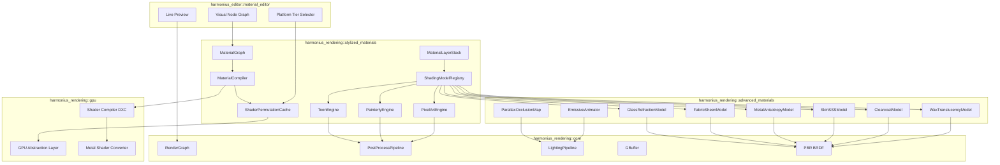
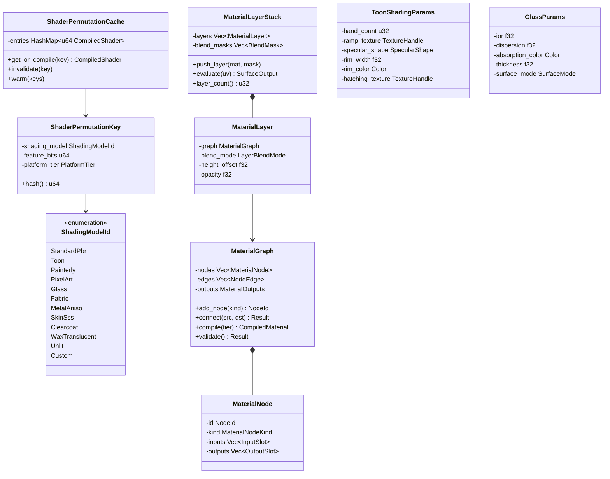
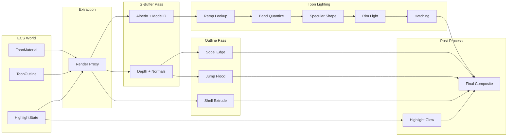
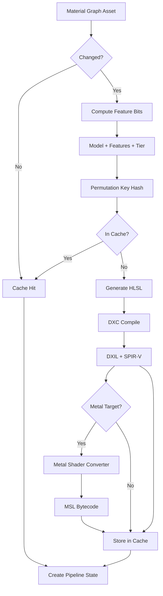
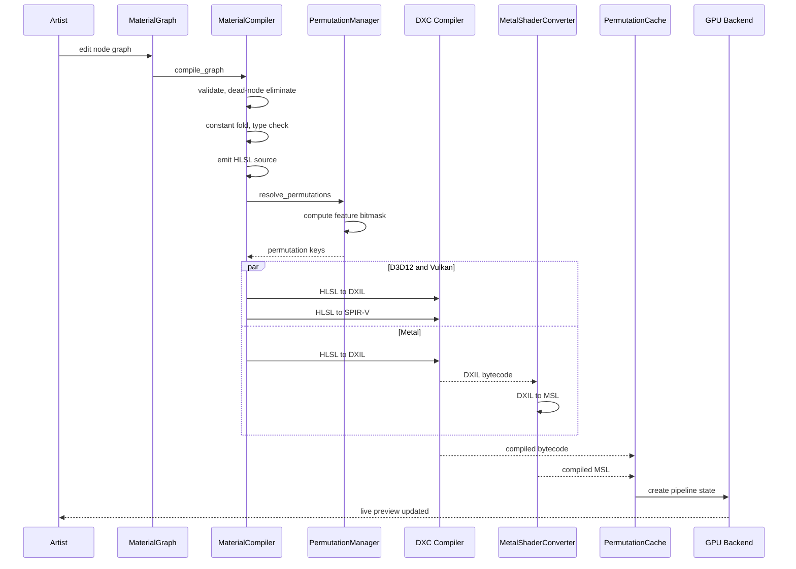

# Stylized Rendering and Advanced Materials Design

## Requirements Trace

> **Canonical sources:** Features, requirements, and user stories are defined in
> [features/rendering/](../../features/rendering/),
> [requirements/rendering/](../../requirements/rendering/), and
> [user-stories/rendering/](../../user-stories/rendering/). The table below traces design elements
> to those definitions.

### Stylized Effects (F-2.11 / R-2.11)

| Feature  | Requirement | User Stories                          |
|----------|-------------|---------------------------------------|
| F-2.11.1 | R-2.11.1    | US-2.11.1.1, US-2.11.1.2, US-2.11.1.3 |
| F-2.11.2 | R-2.11.2    | US-2.11.2.1, US-2.11.2.2, US-2.11.2.3 |
| F-2.11.3 | R-2.11.3    | US-2.11.3.1, US-2.11.3.2, US-2.11.3.3 |
| F-2.11.4 | R-2.11.4    | US-2.11.4.1, US-2.11.4.2, US-2.11.4.3 |
| F-2.11.5 | R-2.11.5    | US-2.11.5.1, US-2.11.5.2, US-2.11.5.3 |

1. **F-2.11.1** — 2D/3D outline rendering (Sobel, jump-flood, shell extrusion)
2. **F-2.11.2** — Highlight and glow (stencil, Gaussian blur, fresnel rim)
3. **F-2.11.3** — Advanced toon shading (band ramps, specular shapes, hatching)
4. **F-2.11.4** — Cut-through visibility and roof fading
5. **F-2.11.5** — X-ray silhouette rendering

### Advanced Materials (F-2.12 / R-2.12)

| Feature  | Requirement | User Stories                          |
|----------|-------------|---------------------------------------|
| F-2.12.1 | R-2.12.1    | US-2.12.1.1, US-2.12.1.2, US-2.12.1.3 |
| F-2.12.3 | R-2.12.3    | US-2.12.3.1, US-2.12.3.2, US-2.12.3.3 |
| F-2.12.4 | R-2.12.4    | US-2.12.4.1, US-2.12.4.2, US-2.12.4.3 |
| F-2.12.5 | R-2.12.5    | US-2.12.5.1, US-2.12.5.2, US-2.12.5.3 |
| F-2.12.6 | R-2.12.6    | US-2.12.6.1, US-2.12.6.2, US-2.12.6.3 |
| F-2.12.7 | R-2.12.7    | US-2.12.7.1, US-2.12.7.2              |
| F-2.12.8 | R-2.12.8    | US-2.12.8.1, US-2.12.8.2, US-2.12.8.3 |
| F-2.12.9 | R-2.12.9    | US-2.12.9.1, US-2.12.9.2, US-2.12.9.3 |

1. **F-2.12.1** — Glass/crystal refraction (IOR, dispersion, absorption)
2. **F-2.12.3** — Emissive materials (HDR bloom, animated emission)
3. **F-2.12.4** — Heightmap tessellation and parallax occlusion mapping
4. **F-2.12.5** — Fabric/cloth materials (sheen BRDF, transmission)
5. **F-2.12.6** — Metal, wood, stone (anisotropy, SSS, weathering)
6. **F-2.12.7** — Rubber, wax, soft surfaces (deformation-driven SSS)
7. **F-2.12.8** — Clearcoat and multi-layer materials
8. **F-2.12.9** — Custom material graphs (visual node editor)

### Non-Functional Requirements

| NFR | Target | Description |
|-----|--------|-------------|
| NFR-2.11.1 | < 1.0 ms at 1080p, 100 entities | Outline rendering GPU budget |
| NFR-2.11.2 | < 1 frame response, 0.3 s fade | Cut-through visibility latency |
| NFR-2.12.1 | < 5 s full, < 1 s incremental | Material graph compilation time |
| NFR-2.12.2 | 5 dB PSNR (SS), 1 dB (RT) | Refraction quality vs reference |
| NFR-2.12.3 | < 50% cost increase for 4 layers | Material layer blending overhead |

### Cross-Cutting Constraints

| Constraint         | Source             |
|--------------------|--------------------|
| HLSL shader IL     | Design Constraints |
| Metal/D3D12/Vulkan | Design Constraints |
| 100% ECS-based     | Design Constraints |
| No-code engine     | Design Constraints |
| Static dispatch    | Design Constraints |
| Rust stable only   | Design Constraints |

1. **HLSL shader IL** — All shading code authored in HLSL; compiled via DXC
2. **Metal/D3D12/Vulkan** — Three GPU backends via static dispatch
3. **100% ECS-based** — All material/style data as components, all logic as systems
4. **No-code engine** — Visual node graph is the only authoring surface
5. **Static dispatch** — No vtables; generic trait implementations
6. **Rust stable only** — No nightly features

## Overview

This subsystem provides two complementary rendering capabilities:

1. **Stylized Rendering** -- non-photorealistic rendering techniques (toon/cel shading, painterly
   effects, pixel art rendering, outlines, highlights) that replace or augment the PBR lighting
   pipeline with artist-driven stylization.
2. **Advanced Materials** -- specialized physically-based shading models (glass refraction, fabric
   sheen, anisotropic metal, skin SSS, clearcoat, parallax occlusion, material layering) extending
   the base Cook-Torrance BRDF (F-2.4.3).

Both are unified under a single material graph system where artists author all materials visually
through a no-code node graph editor (F-2.12.9, F-15.8.5). The graph compiles to HLSL, which DXC
compiles to DXIL/SPIR-V, and Metal Shader Converter translates to MSL. A shader permutation cache
manages the combinatorial explosion of shading model variants, feature flags, and platform tiers.

All runtime data lives as ECS components. Render proxy extraction (F-2.10.1) snapshots material
state each frame for GPU upload. The render graph (F-2.2.1) schedules stylized passes (outline, toon
lighting, painterly post-process) alongside the standard pipeline, with capability gating (F-2.2.2)
pruning unsupported passes per platform.

## Architecture

### Module Boundaries



### File Layout

```text
harmonius_rendering/
├── stylized_materials/
│   ├── graph.rs          # MaterialGraph,
│   │                     # MaterialNode, edges
│   ├── compiler.rs       # HLSL code generation,
│   │                     # optimization passes
│   ├── permutation.rs    # ShaderPermutationKey,
│   │                     # ShaderPermutationCache
│   ├── layer.rs          # MaterialLayerStack,
│   │                     # blend modes
│   ├── registry.rs       # ShadingModelRegistry,
│   │                     # ShadingModelId
│   ├── toon.rs           # ToonEngine, band
│   │                     # quantization, ramps
│   ├── painterly.rs      # PainterlyEngine,
│   │                     # Kuwahara, watercolor
│   └── pixel_art.rs      # PixelArtEngine,
│                          # palette, nearest
├── advanced_materials/
│   ├── glass.rs          # Refraction, IOR,
│   │                     # dispersion, absorption
│   ├── fabric.rs         # Sheen BRDF,
│   │                     # thread direction
│   ├── metal.rs          # Anisotropy, tangent
│   │                     # direction maps
│   ├── skin.rs           # SSS profiles,
│   │                     # Burley diffusion
│   ├── clearcoat.rs      # Multi-layer coating,
│   │                     # height-based blend
│   ├── wax.rs            # Thickness SSS,
│   │                     # deformation feedback
│   ├── parallax.rs       # POM ray march,
│   │                     # tessellation driver
│   ├── emissive.rs       # Animated emission,
│   │                     # HDR bloom trigger
│   └── weathering.rs     # Procedural weathering,
│                          # age/exposure/damage
└── components/
    ├── material.rs       # MaterialComponent,
    │                     # MaterialInstanceData
    ├── toon.rs           # ToonMaterial,
    │                     # ToonOutline
    ├── highlight.rs      # HighlightState,
    │                     # XRayVisible
    ├── visibility.rs     # CutThroughFade,
    │                     # FadeMode
    └── stylized.rs       # PainterlyStyle,
                           # PixelArtStyle
```

### Core Data Structures



### Toon Shading Data Flow



### Shader Permutation Management



### Material Graph Compilation Pipeline



## API Design

### Shading Model Identification

```rust
/// Identifies which shading model a material uses.
/// The G-buffer encodes this in 4 bits of the
/// albedo-metallic target, enabling the lighting
/// pass to branch per-pixel.
#[derive(
    Clone, Copy, Debug, PartialEq, Eq, Hash,
    Reflect,
)]
#[repr(u8)]
pub enum ShadingModelId {
    StandardPbr    = 0,
    Toon           = 1,
    Painterly      = 2,
    PixelArt       = 3,
    Glass          = 4,
    Fabric         = 5,
    MetalAniso     = 6,
    SkinSss        = 7,
    Clearcoat      = 8,
    WaxTranslucent = 9,
    Unlit          = 10,
    Custom         = 11,
}
```

### Material Graph

```rust
/// Unique identifier for a node within a graph.
#[derive(
    Clone, Copy, Debug, PartialEq, Eq, Hash,
)]
pub struct NodeId(pub(crate) u32);

/// A typed slot on a material node.
#[derive(Clone, Debug)]
pub struct SlotDescriptor {
    pub name: &'static str,
    pub slot_type: SlotType,
    pub default_value: SlotValue,
}

/// Types that flow between material graph nodes.
#[derive(Clone, Copy, Debug, PartialEq, Eq)]
pub enum SlotType {
    Float,
    Vec2,
    Vec3,
    Vec4,
    Texture2D,
    TextureCube,
    Sampler,
    Bool,
}

/// Concrete value for a slot, used as default or
/// constant.
#[derive(Clone, Debug)]
pub enum SlotValue {
    Float(f32),
    Vec2([f32; 2]),
    Vec3([f32; 3]),
    Vec4([f32; 4]),
    Texture2D(TextureHandle),
    TextureCube(TextureHandle),
    Sampler(SamplerHandle),
    Bool(bool),
}

/// Categories of nodes available in the material
/// graph editor.
#[derive(Clone, Copy, Debug, PartialEq, Eq)]
pub enum MaterialNodeKind {
    // Inputs
    SceneColor,
    SceneDepth,
    SceneNormals,
    CameraPosition,
    WorldPosition,
    UV,
    Time,
    CustomTexture,
    NoiseGenerator,
    // Math
    Add,
    Subtract,
    Multiply,
    Divide,
    Lerp,
    Clamp,
    Remap,
    Smoothstep,
    DotProduct,
    CrossProduct,
    Normalize,
    Power,
    Abs,
    // Texture
    SampleTexture2D,
    SampleTextureCube,
    TriplanarMapping,
    ParallaxUvOffset,
    // Color
    Desaturate,
    HueSaturation,
    Posterize,
    ColorRamp,
    // Surface
    FresnelEffect,
    NormalBlend,
    DetailTexture,
    HeightBlend,
    // Stylized
    ToonRampLookup,
    BandQuantize,
    HatchingPattern,
    OutlineMask,
    PainterlyFilter,
    PixelSnap,
    PaletteRestrict,
    // Material function (reusable sub-graph)
    SubGraph { asset_id: AssetId },
}

/// A single node in the material graph.
pub struct MaterialNode {
    id: NodeId,
    kind: MaterialNodeKind,
    inputs: Vec<SlotDescriptor>,
    outputs: Vec<SlotDescriptor>,
    position: [f32; 2],
}

/// Directed edge connecting an output slot of one
/// node to an input slot of another.
pub struct NodeEdge {
    pub src_node: NodeId,
    pub src_slot: u32,
    pub dst_node: NodeId,
    pub dst_slot: u32,
}

/// Output targets that a material graph can write.
pub struct MaterialOutputs {
    pub albedo: Option<NodeId>,
    pub normal: Option<NodeId>,
    pub roughness: Option<NodeId>,
    pub metallic: Option<NodeId>,
    pub emissive: Option<NodeId>,
    pub opacity: Option<NodeId>,
    pub world_position_offset: Option<NodeId>,
    pub custom_data: [Option<NodeId>; 4],
}

/// The editable material graph asset. Serialized
/// as a RON file with binary texture companions.
pub struct MaterialGraph {
    nodes: Vec<MaterialNode>,
    edges: Vec<NodeEdge>,
    outputs: MaterialOutputs,
    shading_model: ShadingModelId,
    blend_mode: BlendMode,
}

impl MaterialGraph {
    pub fn new(
        shading_model: ShadingModelId,
    ) -> Self;

    /// Add a node and return its ID.
    pub fn add_node(
        &mut self,
        kind: MaterialNodeKind,
    ) -> NodeId;

    /// Remove a node and all connected edges.
    pub fn remove_node(&mut self, id: NodeId);

    /// Connect an output slot to an input slot.
    /// Fails if types are incompatible or if the
    /// connection would create a cycle.
    pub fn connect(
        &mut self,
        src: NodeId,
        src_slot: u32,
        dst: NodeId,
        dst_slot: u32,
    ) -> Result<(), GraphError>;

    /// Disconnect a specific edge.
    pub fn disconnect(
        &mut self,
        dst: NodeId,
        dst_slot: u32,
    );

    /// Validate the graph: cycle detection, type
    /// checking, and output connectivity.
    pub fn validate(
        &self,
    ) -> Result<(), GraphError>;

    /// Compile to a platform-specific shader.
    pub fn compile(
        &self,
        tier: PlatformTier,
    ) -> Result<CompiledMaterial, CompileError>;
}
```

### Material Compiler

```rust
/// Platform quality tiers that control shader
/// complexity, texture limits, and feature pruning.
#[derive(
    Clone, Copy, Debug, PartialEq, Eq, Hash,
)]
pub enum PlatformTier {
    Mobile,
    Switch,
    Desktop,
    HighEnd,
}
// **Note:** `PlatformTier` will be unified with the
// engine-wide `PlatformTier` enum defined in
// [shared-primitives.md](../core-runtime/shared-primitives.md).

/// Node and texture limits per platform tier.
pub struct TierLimits {
    pub max_nodes: u32,
    pub max_texture_reads: u32,
    pub half_precision: bool,
    pub max_material_layers: u32,
}

impl PlatformTier {
    pub fn limits(&self) -> TierLimits {
        match self {
            Self::Mobile => TierLimits {
                max_nodes: 64,
                max_texture_reads: 4,
                half_precision: true,
                max_material_layers: 2,
            },
            Self::Switch => TierLimits {
                max_nodes: 128,
                max_texture_reads: 8,
                half_precision: false,
                max_material_layers: 3,
            },
            Self::Desktop => TierLimits {
                max_nodes: u32::MAX,
                max_texture_reads: u32::MAX,
                half_precision: false,
                max_material_layers: 4,
            },
            Self::HighEnd => TierLimits {
                max_nodes: u32::MAX,
                max_texture_reads: u32::MAX,
                half_precision: false,
                max_material_layers: u32::MAX,
            },
        }
    }
}

/// Compiled shader output ready for pipeline state
/// creation.
pub struct CompiledMaterial {
    pub hlsl_source: String,
    pub permutation_key: ShaderPermutationKey,
    pub parameter_layout: ParameterLayout,
    pub texture_bindings: Vec<TextureBinding>,
    pub constant_buffer_size: u32,
}

/// Describes the constant buffer layout for
/// material instance parameters.
pub struct ParameterLayout {
    pub entries: Vec<ParameterEntry>,
    pub total_size: u32,
}

pub struct ParameterEntry {
    pub name: &'static str,
    pub offset: u32,
    pub param_type: SlotType,
}

/// The material compiler transforms a
/// MaterialGraph into HLSL source.
pub struct MaterialCompiler;

impl MaterialCompiler {
    /// Compile a material graph for a target
    /// platform tier. Performs:
    /// 1. DAG validation and cycle detection
    /// 2. Dead-node elimination
    /// 3. Constant folding
    /// 4. Type inference and checking
    /// 5. Node complexity budget enforcement
    /// 6. HLSL code emission
    pub fn compile(
        graph: &MaterialGraph,
        tier: PlatformTier,
    ) -> Result<CompiledMaterial, CompileError>;

    /// Incremental recompile after a single node
    /// change. Reuses cached intermediate results
    /// for unchanged subgraphs. Target: < 1 s
    /// (NFR-2.12.1).
    pub fn compile_incremental(
        graph: &MaterialGraph,
        changed_node: NodeId,
        tier: PlatformTier,
        cache: &CompilerCache,
    ) -> Result<CompiledMaterial, CompileError>;
}
```

### Shader Permutation System

```rust
/// Feature flags that contribute to permutation
/// selection. Encoded as a bitmask for O(1)
/// hashing.
#[derive(
    Clone, Copy, Debug, PartialEq, Eq, Hash,
)]
pub struct FeatureFlags(pub u64);

impl FeatureFlags {
    pub const NONE: Self = Self(0);
    pub const OUTLINE_SOBEL: Self = Self(1 << 0);
    pub const OUTLINE_JFA: Self = Self(1 << 1);
    pub const OUTLINE_SHELL: Self = Self(1 << 2);
    pub const TOON_HATCHING: Self = Self(1 << 3);
    pub const TOON_RIM: Self = Self(1 << 4);
    pub const TOON_SPECULAR: Self = Self(1 << 5);
    pub const GLASS_DISPERSION: Self =
        Self(1 << 6);
    pub const GLASS_ABSORPTION: Self =
        Self(1 << 7);
    pub const GLASS_CAUSTICS: Self = Self(1 << 8);
    pub const FABRIC_SHEEN: Self = Self(1 << 9);
    pub const FABRIC_TRANSMISSION: Self =
        Self(1 << 10);
    pub const FABRIC_FUZZ: Self = Self(1 << 11);
    pub const METAL_ANISOTROPY: Self =
        Self(1 << 12);
    pub const METAL_MULTILAYER: Self =
        Self(1 << 13);
    pub const SKIN_SSS: Self = Self(1 << 14);
    pub const SKIN_TRANSMISSION: Self =
        Self(1 << 15);
    pub const CLEARCOAT: Self = Self(1 << 16);
    pub const CLEARCOAT_NORMAL: Self =
        Self(1 << 17);
    pub const PARALLAX_POM: Self = Self(1 << 18);
    pub const PARALLAX_TESS: Self = Self(1 << 19);
    pub const EMISSIVE_ANIMATED: Self =
        Self(1 << 20);
    pub const EMISSIVE_GI: Self = Self(1 << 21);
    pub const WEATHERING: Self = Self(1 << 22);
    pub const WAX_DEFORMATION: Self =
        Self(1 << 23);
    pub const PAINTERLY: Self = Self(1 << 24);
    pub const PIXEL_ART: Self = Self(1 << 25);
    pub const HIGHLIGHT_GLOW: Self =
        Self(1 << 26);
    pub const HIGHLIGHT_FRESNEL: Self =
        Self(1 << 27);
    pub const XRAY_SILHOUETTE: Self =
        Self(1 << 28);
    pub const CUT_THROUGH: Self = Self(1 << 29);
    pub const DETAIL_TEXTURE: Self =
        Self(1 << 30);
    pub const LAYER_BLEND: Self = Self(1 << 31);

    pub fn contains(self, flag: Self) -> bool {
        (self.0 & flag.0) == flag.0
    }

    pub fn union(self, other: Self) -> Self {
        Self(self.0 | other.0)
    }
}

/// Composite key uniquely identifying a compiled
/// shader permutation.
#[derive(
    Clone, Copy, Debug, PartialEq, Eq, Hash,
)]
pub struct ShaderPermutationKey {
    pub shading_model: ShadingModelId,
    pub features: FeatureFlags,
    pub tier: PlatformTier,
    pub blend_mode: BlendMode,
}

/// Compiled shader bytecode for a single GPU
/// backend.
pub struct CompiledShader {
    pub dxil: Option<Vec<u8>>,
    pub spirv: Option<Vec<u8>>,
    pub msl: Option<Vec<u8>>,
    pub reflection: ShaderReflection,
}

/// Thread-safe cache of compiled shader
/// permutations. Keyed by ShaderPermutationKey
/// hash for O(1) lookup.
pub struct ShaderPermutationCache {
    entries: AsyncRwLock<
        HashMap<u64, CompiledShader>,
    >,
}

impl ShaderPermutationCache {
    pub fn new() -> Self;

    /// Retrieve a cached permutation or compile on
    /// cache miss. Async because compilation may
    /// invoke DXC/MSC via cxx.rs FFI.
    pub async fn get_or_compile(
        &self,
        key: ShaderPermutationKey,
        graph: &MaterialGraph,
    ) -> Result<&CompiledShader, CompileError>;

    /// Invalidate a specific permutation (e.g.,
    /// after graph edit).
    pub fn invalidate(
        &self,
        key: ShaderPermutationKey,
    );

    /// Pre-warm the cache with a batch of
    /// permutation keys at load time. Runs
    /// compilations in parallel on the thread pool.
    pub async fn warm(
        &self,
        keys: &[ShaderPermutationKey],
        graphs: &[&MaterialGraph],
    );

    pub fn entry_count(&self) -> usize;
    pub fn memory_usage_bytes(&self) -> usize;
}
```

### ECS Components -- Stylized Rendering

```rust
/// Toon material parameters attached to entities
/// that use cel-shading instead of PBR.
#[derive(Clone, Debug, Reflect)]
pub struct ToonMaterial {
    /// Number of discrete light bands (2-8).
    pub band_count: u32,
    /// 1D ramp texture defining band thresholds
    /// and colors.
    pub ramp_texture: TextureHandle,
    /// Per-band threshold overrides (if no ramp).
    pub thresholds: SmallVec<[f32; 8]>,
    /// Per-band color overrides (if no ramp).
    pub band_colors: SmallVec<[Color; 8]>,
    /// Shape of specular highlight.
    pub specular_shape: SpecularShape,
    /// Specular size (0.0 - 1.0).
    pub specular_size: f32,
    /// Specular threshold (NdotH cutoff).
    pub specular_threshold: f32,
    /// Rim lighting width (0.0 - 1.0).
    pub rim_width: f32,
    /// Rim lighting color.
    pub rim_color: Color,
    /// Rim blend mode.
    pub rim_blend: BlendMode,
    /// Hatching/stipple pattern for shadows.
    pub hatching_texture: Option<TextureHandle>,
    /// Hatching density.
    pub hatching_scale: f32,
}

/// Hard-edged specular highlight shapes for toon
/// rendering.
#[derive(
    Clone, Copy, Debug, PartialEq, Eq, Reflect,
)]
pub enum SpecularShape {
    Circular,
    Star,
    Cross,
}

/// Per-entity outline configuration.
#[derive(Clone, Debug, Reflect)]
pub struct ToonOutline {
    /// Outline technique to use.
    pub technique: OutlineTechnique,
    /// Outline color.
    pub color: Color,
    /// Width in pixels (screen-space techniques)
    /// or world units (shell extrusion).
    pub width: f32,
    /// Line style.
    pub style: OutlineStyle,
    /// Priority for layered outlines. Higher
    /// values override lower.
    pub priority: u32,
}

#[derive(
    Clone, Copy, Debug, PartialEq, Eq, Reflect,
)]
pub enum OutlineTechnique {
    /// Sobel/Roberts on depth+normals.
    ScreenSpaceEdge,
    /// Jump-flood distance field outlines.
    JumpFlood,
    /// Inverted hull / shell extrusion.
    ShellExtrusion,
}

#[derive(
    Clone, Copy, Debug, PartialEq, Eq, Reflect,
)]
pub enum OutlineStyle {
    Solid,
    Dashed { dash_length: u32, gap_length: u32 },
    Animated { speed: f32 },
}

/// Emissive highlight overlay for interactive
/// objects.
#[derive(Clone, Debug, Reflect)]
pub struct HighlightState {
    pub glow_color: Color,
    pub intensity: f32,
    pub mode: HighlightMode,
    pub pulse_speed: f32,
    pub pulse_amplitude: f32,
}

#[derive(
    Clone, Copy, Debug, PartialEq, Eq, Reflect,
)]
pub enum HighlightMode {
    /// Inner solid fill at given opacity.
    InnerGlow,
    /// Gaussian-blurred emissive overlay.
    GaussianGlow,
    /// Fresnel rim glow.
    FresnelRim,
}

/// Marks an entity for x-ray silhouette rendering
/// through occluding geometry.
#[derive(Clone, Debug, Reflect)]
pub struct XRayVisible {
    pub silhouette_color: Color,
    pub opacity: f32,
    pub style: XRayStyle,
    pub priority: u32,
}

#[derive(
    Clone, Copy, Debug, PartialEq, Eq, Reflect,
)]
pub enum XRayStyle {
    FlatColor,
    TeamTint,
    FresnelOutline,
}

/// Controls automatic fading of occluding geometry
/// (roofs, ceilings) for interior visibility.
#[derive(Clone, Debug, Reflect)]
pub struct CutThroughFade {
    pub mode: FadeMode,
    pub effect: FadeEffect,
    pub fade_distance: f32,
    pub fade_speed: f32,
    pub child_behavior: ChildFadeBehavior,
}

#[derive(
    Clone, Copy, Debug, PartialEq, Eq, Reflect,
)]
pub enum FadeMode {
    /// Geometry inside a vertical prism above
    /// the player fades.
    VolumeBased,
    /// Geometry between camera and player target
    /// is dissolved.
    RayBased,
    /// Entire tagged layers fade when camera
    /// enters a trigger zone.
    LayerBased,
}

#[derive(
    Clone, Copy, Debug, PartialEq, Eq, Reflect,
)]
pub enum FadeEffect {
    DitheredTransparency,
    CrossHatchDissolve,
    SmoothAlpha,
}

#[derive(
    Clone, Copy, Debug, PartialEq, Eq, Reflect,
)]
pub enum ChildFadeBehavior {
    /// Props fade with parent.
    FadeWithParent,
    /// Props remain visible as silhouettes.
    ShowAsSilhouette,
    /// Props remain fully visible.
    StayVisible,
}

/// Painterly/watercolor style parameters.
#[derive(Clone, Debug, Reflect)]
pub struct PainterlyStyle {
    /// Kuwahara filter radius (brush size).
    pub brush_radius: u32,
    /// Edge darkening intensity.
    pub edge_darkening: f32,
    /// Color bleed/wet-edge simulation.
    pub wet_edge_intensity: f32,
    /// Canvas texture overlay.
    pub canvas_texture: Option<TextureHandle>,
    /// Canvas texture intensity.
    pub canvas_intensity: f32,
    /// Paper grain direction.
    pub grain_direction: [f32; 2],
}

/// Pixel art rendering parameters.
#[derive(Clone, Debug, Reflect)]
pub struct PixelArtStyle {
    /// Target pixel resolution for snapping.
    pub pixel_resolution: [u32; 2],
    /// Color palette restriction.
    pub palette: Option<TextureHandle>,
    /// Maximum palette colors (2-256).
    pub max_colors: u32,
    /// Use nearest-neighbor sampling.
    pub nearest_neighbor: bool,
    /// Sub-pixel camera stabilization.
    pub sub_pixel_stable: bool,
    /// Outline thickness in low-res pixels.
    pub outline_pixels: u32,
}
```

### ECS Components -- Advanced Materials

```rust
/// Glass and crystal refraction parameters.
#[derive(Clone, Debug, Reflect)]
pub struct GlassMaterial {
    /// Index of refraction (1.0 = air, 1.5 =
    /// glass, 2.4 = diamond).
    pub ior: f32,
    /// Chromatic dispersion strength. 0.0 =
    /// disabled.
    pub dispersion: f32,
    /// Absorption color for colored glass.
    pub absorption_color: Color,
    /// Absorption density (higher = more tint
    /// through thicker sections).
    pub absorption_density: f32,
    /// Thin-surface (window) vs thick-surface
    /// (gemstone).
    pub surface_mode: GlassSurfaceMode,
    /// Caustic approximation intensity.
    pub caustic_intensity: f32,
}

#[derive(
    Clone, Copy, Debug, PartialEq, Eq, Reflect,
)]
pub enum GlassSurfaceMode {
    /// Flat glass without solid interior.
    Thin,
    /// Solid refractive volume with internal
    /// refraction paths.
    Thick,
}

/// Fabric and cloth material parameters.
#[derive(Clone, Debug, Reflect)]
pub struct FabricMaterial {
    /// Sheen color (Charlie/Ashikhmin BRDF).
    pub sheen_color: Color,
    /// Sheen roughness (0.0 - 1.0).
    pub sheen_roughness: f32,
    /// Thread direction map for weave patterns.
    pub thread_direction_map:
        Option<TextureHandle>,
    /// Thin-surface transmission for backlit
    /// fabrics.
    pub transmission: f32,
    /// Transmission tint color.
    pub transmission_tint: Color,
    /// Fuzz/microfiber scattering for felt/fleece.
    pub fuzz_intensity: f32,
    /// Fuzz color.
    pub fuzz_color: Color,
}

/// Anisotropic metal material parameters.
#[derive(Clone, Debug, Reflect)]
pub struct MetalAnisotropicMaterial {
    /// Anisotropy strength (-1.0 to 1.0).
    pub anisotropy: f32,
    /// Tangent-space direction map (brushed
    /// steel grain direction).
    pub direction_map: Option<TextureHandle>,
    /// Per-pixel roughness variation.
    pub roughness_variation: f32,
    /// Multi-layer coating parameters.
    pub coatings: SmallVec<[MetalCoating; 2]>,
}

/// A coating layer on a metal surface (patina,
/// oxidation).
#[derive(Clone, Debug, Reflect)]
pub struct MetalCoating {
    pub color: Color,
    pub roughness: f32,
    pub coverage: f32,
    pub mask_texture: Option<TextureHandle>,
}

/// Clearcoat and multi-layer parameters.
#[derive(Clone, Debug, Reflect)]
pub struct ClearcoatMaterial {
    /// Clearcoat intensity (0.0 - 1.0).
    pub clearcoat: f32,
    /// Clearcoat roughness.
    pub clearcoat_roughness: f32,
    /// Clearcoat IOR (default 1.5).
    pub clearcoat_ior: f32,
    /// Clearcoat tint color.
    pub clearcoat_tint: Color,
    /// Separate normal map for clearcoat layer
    /// (e.g., orange peel on car paint).
    pub clearcoat_normal_map:
        Option<TextureHandle>,
}

/// Multi-layer material stack for height-based
/// blending (rust over metal, snow over rock).
#[derive(Clone, Debug, Reflect)]
pub struct MultiLayerMaterial {
    pub layers: SmallVec<[MaterialLayerDesc; 4]>,
}

#[derive(Clone, Debug, Reflect)]
pub struct MaterialLayerDesc {
    pub material_graph_id: AssetId,
    pub blend_mode: LayerBlendMode,
    pub height_offset: f32,
    pub height_contrast: f32,
    pub opacity: f32,
    pub mask_texture: Option<TextureHandle>,
}

#[derive(
    Clone, Copy, Debug, PartialEq, Eq, Reflect,
)]
pub enum LayerBlendMode {
    /// Standard alpha blend.
    Alpha,
    /// Height-based blend with smooth transition.
    HeightBased,
    /// Additive blend (useful for emissive
    /// overlays).
    Additive,
    /// Multiply (darkens base).
    Multiply,
}

/// Wax and soft surface material parameters.
#[derive(Clone, Debug, Reflect)]
pub struct WaxMaterial {
    /// SSS scatter radius in world units.
    pub scatter_radius: f32,
    /// SSS scatter color.
    pub scatter_color: Color,
    /// Thickness map for transmission.
    pub thickness_map: Option<TextureHandle>,
    /// Transmission intensity for thin regions.
    pub transmission_intensity: f32,
    /// Enable deformation-driven roughness
    /// modulation from physics.
    pub deformation_feedback: bool,
    /// Roughness increase per unit stretch.
    pub stretch_roughness_scale: f32,
}

/// Parallax occlusion mapping parameters.
#[derive(Clone, Debug, Reflect)]
pub struct ParallaxMaterial {
    /// Heightmap texture.
    pub height_map: TextureHandle,
    /// Displacement scale (world units).
    pub height_scale: f32,
    /// Rendering technique.
    pub technique: ParallaxTechnique,
    /// Number of POM ray march steps.
    pub pom_steps: u32,
    /// Enable self-shadowing.
    pub self_shadow: bool,
    /// Silhouette correction for POM.
    pub silhouette_correction: bool,
}

#[derive(
    Clone, Copy, Debug, PartialEq, Eq, Reflect,
)]
pub enum ParallaxTechnique {
    /// GPU tessellation with adaptive factors.
    Tessellation,
    /// Ray-marched parallax occlusion mapping.
    POM,
}

/// Animated emissive material parameters.
#[derive(Clone, Debug, Reflect)]
pub struct EmissiveMaterial {
    /// Emission map texture.
    pub emission_map: TextureHandle,
    /// Base emission intensity (HDR).
    pub intensity: f32,
    /// Emission color tint.
    pub color: Color,
    /// Animation mode.
    pub animation: EmissiveAnimation,
}

#[derive(Clone, Debug, Reflect)]
pub enum EmissiveAnimation {
    /// No animation.
    Static,
    /// UV scrolling at given speed.
    ScrollUv { speed: [f32; 2] },
    /// Sinusoidal intensity pulsing.
    Pulse { frequency: f32, amplitude: f32 },
    /// Color cycling through a gradient.
    ColorCycle {
        gradient: TextureHandle,
        speed: f32,
    },
}

/// Procedural weathering parameters shared across
/// natural material types.
#[derive(Clone, Debug, Reflect)]
pub struct WeatheringParams {
    /// Age factor (0.0 = new, 1.0 = ancient).
    pub age: f32,
    /// Exposure factor (0.0 = sheltered,
    /// 1.0 = fully exposed).
    pub exposure: f32,
    /// Damage factor (0.0 = pristine,
    /// 1.0 = heavily damaged).
    pub damage: f32,
    /// Weathering overlay type.
    pub overlay: WeatheringOverlay,
}

#[derive(
    Clone, Copy, Debug, PartialEq, Eq, Reflect,
)]
pub enum WeatheringOverlay {
    Rust,
    Moss,
    Cracks,
    Stains,
    Custom,
}
```

### Material Layer Stack

```rust
/// Evaluates a stack of material layers at the
/// pixel level. Each layer is a self-contained
/// material graph blended via height-based
/// masking or alpha.
pub struct MaterialLayerStack {
    layers: SmallVec<[MaterialLayer; 4]>,
}

pub struct MaterialLayer {
    pub graph: AssetId,
    pub blend_mode: LayerBlendMode,
    pub height_offset: f32,
    pub height_contrast: f32,
    pub opacity: f32,
    pub mask: Option<TextureHandle>,
}

impl MaterialLayerStack {
    pub fn new() -> Self;

    /// Push a layer onto the stack. Layers are
    /// evaluated bottom-to-top.
    pub fn push_layer(
        &mut self,
        layer: MaterialLayer,
    );

    /// Remove the topmost layer.
    pub fn pop_layer(&mut self)
        -> Option<MaterialLayer>;

    /// Number of active layers.
    pub fn layer_count(&self) -> u32;

    /// Compile the full layer stack into a single
    /// composite material graph for the target
    /// tier. Respects per-tier layer limits.
    pub fn compile(
        &self,
        tier: PlatformTier,
    ) -> Result<CompiledMaterial, CompileError>;
}
```

### Stylized Rendering Engines

```rust
/// Drives toon/cel-shading passes registered with
/// the render graph.
pub struct ToonEngine;

impl ToonEngine {
    /// Register toon-specific render passes with
    /// the render graph:
    /// - Toon lighting (replaces PBR for toon
    ///   entities)
    /// - Outline passes (Sobel, JFA, shell)
    /// - Highlight/glow composite
    pub fn register_passes(
        graph_builder: &mut RenderGraphBuilder,
        capabilities: &GpuCapabilities,
    );
}

/// Painterly/watercolor post-process engine.
pub struct PainterlyEngine;

impl PainterlyEngine {
    /// Register the Kuwahara filter and
    /// watercolor effect passes. These run as
    /// post-process passes after lighting and
    /// before tonemapping.
    ///
    /// Pipeline:
    /// 1. Anisotropic Kuwahara filter (oriented
    ///    along local structure tensor)
    /// 2. Edge-aware darkening
    /// 3. Wet-edge color bleed simulation
    /// 4. Canvas texture overlay
    pub fn register_passes(
        graph_builder: &mut RenderGraphBuilder,
        capabilities: &GpuCapabilities,
    );
}

/// Pixel art rendering engine.
pub struct PixelArtEngine;

impl PixelArtEngine {
    /// Register pixel art render passes:
    /// 1. Low-resolution scene render at target
    ///    pixel resolution
    /// 2. Palette restriction / color quantization
    /// 3. Nearest-neighbor upscale to output
    /// 4. Optional sub-pixel camera stabilization
    /// 5. Pixel-scale outline pass
    pub fn register_passes(
        graph_builder: &mut RenderGraphBuilder,
        capabilities: &GpuCapabilities,
    );
}
```

### Error Types

```rust
pub enum GraphError {
    CycleDetected {
        cycle: Vec<NodeId>,
    },
    TypeMismatch {
        src_type: SlotType,
        dst_type: SlotType,
        src_node: NodeId,
        dst_node: NodeId,
    },
    SlotNotFound {
        node: NodeId,
        slot: u32,
    },
    DisconnectedOutput {
        output: &'static str,
    },
    NodeNotFound {
        id: NodeId,
    },
}

pub enum CompileError {
    GraphInvalid(GraphError),
    /// Graph exceeds the target tier's node or
    /// texture budget.
    TierBudgetExceeded {
        tier: PlatformTier,
        nodes_used: u32,
        nodes_max: u32,
        textures_used: u32,
        textures_max: u32,
    },
    /// HLSL compilation failed via DXC.
    HlslCompileFailed {
        errors: Vec<String>,
    },
    /// Metal Shader Converter failed.
    MslConvertFailed {
        error: String,
    },
    /// Unsupported feature on target tier.
    UnsupportedFeature {
        feature: &'static str,
        tier: PlatformTier,
    },
}
```

## Data Flow

### Frame Lifecycle for Stylized Materials

The stylized rendering pipeline integrates with the standard frame loop through the render graph.

```rust
// Simplified frame flow for stylized rendering
loop {
    reactor.poll();

    // -- ECS systems update material params --
    // Game logic sets ToonMaterial, HighlightState,
    // CutThroughFade, etc. on entities.

    // -- Render proxy extraction --
    // Snapshot material components into render-
    // side proxies (F-2.10.1).
    extract_material_proxies(&ecs_world);

    // -- Build render graph --
    // Stylized passes are registered based on
    // which shading models are active this frame.
    let graph = build_render_graph();

    // Graph includes (in order):
    // 1. G-Buffer pass (writes ShadingModelId)
    // 2. Standard PBR lighting (ModelId == 0)
    // 3. Toon lighting pass (ModelId == 1)
    // 4. Outline passes (Sobel, JFA, shell)
    // 5. Painterly post-process (ModelId == 2)
    // 6. Pixel art downsample+upscale (ModelId==3)
    // 7. Highlight/glow composite
    // 8. X-ray silhouette pass
    // 9. Cut-through fade
    // 10. Post-processing chain
    // 11. Tonemapping and output

    pool.execute_graph(graph).await;
    renderer.submit_commands();
    renderer.present().await;
}
```

### Outline Rendering Pipeline

Three outline techniques run as separate render graph passes. The results are composited additively
into a shared outline buffer.

1. **Sobel edge detection** -- fullscreen compute pass sampling the depth and normal G-buffer
   targets. Edges are detected where depth or normal gradients exceed a threshold. Output is a
   per-pixel edge mask with entity-colored overlay.

2. **Jump-flood algorithm (JFA)** -- requires compute shaders. Renders outlined entity silhouettes
   to a seed buffer, then iterates log2(max_width) jump-flood passes to compute per-pixel distance
   to the nearest silhouette. Variable-width outlines use the distance field with configurable
   falloff.

3. **Shell extrusion** -- object-space pass that renders each outlined mesh a second time with
   vertices extruded along normals and front-face culling inverted. Produces clean view-consistent
   outlines on individual meshes.

Fallback: JFA falls back to Sobel on devices without compute shader support (F-2.2.2 capability
gating).

### Advanced Material Lighting Integration

Advanced material shading models are evaluated during the lighting pass, branching on the
`ShadingModelId` encoded in the G-buffer:

| ShadingModelId | Lighting Evaluation |
|----------------|---------------------|
| StandardPbr | Cook-Torrance GGX (F-2.4.3) |
| Toon | Ramp-quantized NdotL + shaped specular |
| Painterly | Standard PBR (Kuwahara applied in post) |
| PixelArt | Simplified PBR at low resolution |
| Glass | Fresnel + refraction (screen-space or RT) |
| Fabric | Cook-Torrance + Charlie/Ashikhmin sheen lobe |
| MetalAniso | GGX with tangent-space anisotropy rotation |
| SkinSss | Burley diffusion profile SSS (F-2.8.6) |
| Clearcoat | Base BRDF + separate clearcoat specular lobe |
| WaxTranslucent | SSS with thickness-dependent transmission |
| Unlit | Emissive only, no lighting |
| Custom | Graph-defined evaluation |

### Material Layer Evaluation Order

Multi-layer materials are evaluated bottom-to-top. Each layer produces a full surface output
(albedo, normal, roughness, metallic, emissive). Layers are blended per-pixel:

1. **Base layer** -- always evaluated.
2. **Overlay layers** -- blended onto the base via the selected blend mode:
   - **Alpha**: `lerp(base, layer, opacity * mask)`
   - **HeightBased**: blend factor computed from
     `smoothstep(h - contrast, h + contrast, layer_height - base_height + offset)`
   - **Additive**: `base + layer * opacity * mask`
   - **Multiply**: `base * lerp(1, layer, mask)`
3. **Clearcoat** -- if present, adds a separate specular lobe on top of the composited result.

## Platform Considerations

### Toon and Outline Rendering

| Component | Mobile | Switch | Desktop | High-end |
|-----------|--------|--------|---------|----------|
| Toon bands | 2-3 | Full | Full | Full |
| Hatching/stipple | Disabled | Hero only | Full | Full |
| Rim lighting | Simplified | Full | Full | Full |
| Outline Sobel | Full | Full | Full | Full |
| Outline JFA | Disabled (no compute) | Full | Full | Full |
| Outline shell | Full | Full | Full | Full |
| Highlight | Flat inner glow only | Gaussian half-res | Full | Full |
| Max highlights | 4 | 8 | Unlimited | Unlimited |
| X-ray style | Flat color | Team tint | Fresnel | Fresnel |
| Max x-ray | 8 | 16 | Unlimited | Unlimited |
| Cut-through modes | Volume + Layer | All | All | All |
| Cut-through effect | Dither only | Dither | All | All |

### Advanced Materials

| Component | Mobile | Switch | Desktop | High-end |
|-----------|--------|--------|---------|----------|
| Glass refraction | Screen-space | Screen-space | SS + RT fallback | Full RT |
| Chromatic dispersion | Disabled | Disabled | Enabled | Enabled |
| Caustics | Disabled | Disabled | Approximation | Full |
| Fabric sheen | Disabled | Hero only | Full | Full |
| Fabric transmission | Disabled | Disabled | Disabled | Full |
| Fabric fuzz | Disabled | Disabled | Full | Full |
| Metal anisotropy | Disabled | Hero only | Full | Full |
| Metal multi-layer | Disabled | Disabled | Enabled | Full |
| Skin SSS | Preintegrated LUT | Half-res SS | Full Burley | RT transmission |
| Clearcoat | Combined roughness | Separate rough | Full + normals | Full + normals |
| Max material layers | 2 (baked) | 2 (runtime) | 4 (runtime) | Unlimited |
| Parallax | POM only | POM | POM + Tess | POM + Tess |
| POM steps | 8 | 16 | 32 | 64 |
| Emissive animation | Static only | Animated | Animated + GI | Animated + GI |
| Weathering | Baked at import | 2 params | Full system | Full runtime |
| Material graph nodes | 64 max | 128 max | Unlimited | Unlimited |
| Texture reads | 4 max | 8 max | Unlimited | Unlimited |
| Precision | Half | Full | Full | Full |

### Painterly and Pixel Art

| Component | Mobile | Switch | Desktop | High-end |
|-----------|--------|--------|---------|----------|
| Kuwahara filter | Disabled | Half-res | Full | Full |
| Wet-edge bleed | Disabled | Disabled | Enabled | Enabled |
| Canvas overlay | Simplified | Full | Full | Full |
| Pixel art render | Full | Full | Full | Full |
| Palette restriction | 16 colors | 64 colors | 256 colors | 256 colors |
| Sub-pixel stable | Enabled | Enabled | Enabled | Enabled |

### Shader Pipeline per Backend

| Backend | Compile Path | Notes |
|---------|-------------|-------|
| D3D12 | HLSL -> DXC -> DXIL | Direct; no conversion step |
| Vulkan | HLSL -> DXC -> SPIR-V | DXC `-spirv` flag |
| Metal | HLSL -> DXC -> DXIL -> MSC -> MSL | Two-step via Metal Shader Converter |

All compilation uses DXC accessed through cxx.rs. Metal Shader Converter is also accessed through
cxx.rs. No runtime shader compilation in shipping builds -- all permutations are pre-compiled during
asset processing (F-12.3.1).

### Proposed Dependencies

| Crate       |
|-------------|
| `smallvec`  |
| `cxx`       |
| `hashbrown` |

1. **`smallvec`** — Inline small vectors for layers, bands
   - **Justification:** Avoids heap allocation for small layer stacks
2. **`cxx`** — C++ interop for DXC and Metal Shader Converter
   - **Justification:** Required by design constraints for shader compilation
3. **`hashbrown`** — Fast hash map for permutation cache
   - **Justification:** Industry-standard; used widely in Rust ecosystem

### VFX Material Integration

Particle and effect shaders can reference material graph outputs via the shared `MaterialId` system.
The VFX effect graph (see [effect-graph.md](../vfx/effect-graph.md)) compiles particle shaders using
the same `GraphCompiler` framework (see
[shared-primitives.md](../core-runtime/shared-primitives.md)) as the material graph, ensuring
consistent HLSL emission and compilation.

## Test Plan

### Unit Tests

| Test                                 | Req      |
|--------------------------------------|----------|
| `test_graph_add_remove_nodes`        | R-2.12.9 |
| `test_graph_cycle_detection`         | R-2.12.9 |
| `test_graph_type_mismatch`           | R-2.12.9 |
| `test_graph_dead_node_elimination`   | R-2.12.9 |
| `test_graph_constant_folding`        | R-2.12.9 |
| `test_tier_budget_mobile`            | R-2.12.9 |
| `test_tier_budget_switch`            | R-2.12.9 |
| `test_tier_budget_desktop_unlimited` | R-2.12.9 |
| `test_permutation_key_hash_unique`   | R-2.12.9 |
| `test_permutation_cache_hit`         | R-2.12.9 |
| `test_permutation_cache_invalidate`  | R-2.12.9 |
| `test_toon_band_quantization`        | R-2.11.3 |
| `test_toon_specular_shapes`          | R-2.11.3 |
| `test_outline_sobel_edge`            | R-2.11.1 |
| `test_outline_jfa_distance`          | R-2.11.1 |
| `test_outline_priority_ordering`     | R-2.11.1 |
| `test_outline_multi_layer_compose`   | R-2.11.1 |
| `test_highlight_pulse_sinusoidal`    | R-2.11.2 |
| `test_highlight_mode_inner_glow`     | R-2.11.2 |
| `test_glass_ior_refraction`          | R-2.12.1 |
| `test_glass_thin_vs_thick`           | R-2.12.1 |
| `test_glass_fresnel_grazing`         | R-2.12.1 |
| `test_fabric_sheen_brdf`             | R-2.12.5 |
| `test_metal_anisotropy_direction`    | R-2.12.6 |
| `test_clearcoat_dual_specular`       | R-2.12.8 |
| `test_layer_blend_height_based`      | R-2.12.8 |
| `test_layer_count_limit_per_tier`    | R-2.12.8 |
| `test_pom_self_shadow`               | R-2.12.4 |
| `test_emissive_bloom_trigger`        | R-2.12.3 |
| `test_emissive_scroll_uv`            | R-2.12.3 |
| `test_weathering_age_progression`    | R-2.12.6 |
| `test_wax_thickness_transmission`    | R-2.12.7 |
| `test_cut_through_volume_mode`       | R-2.11.4 |
| `test_cut_through_ray_mode`          | R-2.11.4 |
| `test_xray_depth_comparison`         | R-2.11.5 |
| `test_xray_priority_filter`          | R-2.11.5 |
| `test_pixel_art_palette_restrict`    | -        |
| `test_pixel_art_nearest_neighbor`    | -        |
| `test_subgraph_composition`          | R-2.12.9 |

1. **`test_graph_add_remove_nodes`** — Add 100 nodes, remove 50, verify graph integrity.
2. **`test_graph_cycle_detection`** — Create a cycle in the material graph; verify `CycleDetected`
   error.
3. **`test_graph_type_mismatch`** — Connect a Float output to a Texture2D input; verify
   `TypeMismatch` error.
4. **`test_graph_dead_node_elimination`** — Add nodes not connected to any output; verify they are
   excluded from compiled HLSL.
5. **`test_graph_constant_folding`** — Connect two constant nodes through Add; verify the result is
   folded to a single constant in HLSL.
6. **`test_tier_budget_mobile`** — Create a 65-node graph; verify `TierBudgetExceeded` for Mobile
   tier.
7. **`test_tier_budget_switch`** — Create a 129-node graph; verify `TierBudgetExceeded` for Switch
   tier.
8. **`test_tier_budget_desktop_unlimited`** — Create a 1000-node graph; verify it compiles for
   Desktop tier.
9. **`test_permutation_key_hash_unique`** — Generate 10,000 random permutation keys; verify no hash
   collisions.
10. **`test_permutation_cache_hit`** — Compile a material, query again; verify cache hit without
    recompilation.
11. **`test_permutation_cache_invalidate`** — Compile, invalidate, query; verify recompilation
    occurs.
12. **`test_toon_band_quantization`** — Pass NdotL values through band quantization; verify output
    matches expected band thresholds.
13. **`test_toon_specular_shapes`** — Render circular, star, and cross specular shapes; verify mask
    geometry.
14. **`test_outline_sobel_edge`** — Provide depth+normal buffers with a known edge; verify Sobel
    detects it.
15. **`test_outline_jfa_distance`** — Seed a silhouette; run JFA passes; verify per-pixel distance
    within tolerance.
16. **`test_outline_priority_ordering`** — Assign two outlines with different priorities; verify
    higher priority wins.
17. **`test_outline_multi_layer_compose`** — Apply selection + team + quest outlines; verify
    additive composition.
18. **`test_highlight_pulse_sinusoidal`** — Set pulse speed and amplitude; verify intensity follows
    sin(t *speed)* amplitude.
19. **`test_highlight_mode_inner_glow`** — Set InnerGlow mode; verify flat color fill at specified
    opacity.
20. **`test_glass_ior_refraction`** — Render through a glass surface with IOR=1.5; verify UV
    distortion matches Snell's law.
21. **`test_glass_thin_vs_thick`** — Compare thin-surface and thick-surface modes; verify different
    refraction paths.
22. **`test_glass_fresnel_grazing`** — Verify reflection intensity increases at grazing angles
    following Schlick approximation.
23. **`test_fabric_sheen_brdf`** — Evaluate Charlie/Ashikhmin sheen BRDF; verify energy
    conservation.
24. **`test_metal_anisotropy_direction`** — Apply a direction map to brushed metal; verify specular
    stretches along the tangent.
25. **`test_clearcoat_dual_specular`** — Render a clearcoated material; verify two distinct specular
    highlights.
26. **`test_layer_blend_height_based`** — Blend rust over metal via height; verify smooth transition
    at height boundary.
27. **`test_layer_count_limit_per_tier`** — Push 5 layers on Mobile tier; verify compile error for
    excess layers.
28. **`test_pom_self_shadow`** — Enable POM self-shadow; verify shadow appears in occluded regions.
29. **`test_emissive_bloom_trigger`** — Set HDR emission intensity above bloom threshold; verify
    bloom pass activates.
30. **`test_emissive_scroll_uv`** — Set ScrollUv animation; verify UV offset increases with time.
31. **`test_weathering_age_progression`** — Increase age from 0 to 1; verify procedural overlay
    intensity increases monotonically.
32. **`test_wax_thickness_transmission`** — Render thin wax backlit; verify transmission visible.
    Render thick wax; verify opaque.
33. **`test_cut_through_volume_mode`** — Place entity below occluder in volume mode; verify fade
    begins within 1 frame.
34. **`test_cut_through_ray_mode`** — Place occluder between camera and target; verify dissolve in
    ray mode.
35. **`test_xray_depth_comparison`** — Place XRayVisible entity behind wall; verify silhouette
    rendered.
36. **`test_xray_priority_filter`** — Set priorities; verify high-priority shows, low-priority
    hidden when toggled off.
37. **`test_pixel_art_palette_restrict`** — Apply 8-color palette to scene; verify output contains
    exactly 8 unique colors.
38. **`test_pixel_art_nearest_neighbor`** — Upscale at 4x; verify no bilinear interpolation
    artifacts.
39. **`test_subgraph_composition`** — Compose two sub-graphs into a parent graph; verify correct
    HLSL emission.

### Integration Tests

| Test                                | Req      |
|-------------------------------------|----------|
| `test_full_toon_pipeline`           | R-2.11.3 |
| `test_toon_and_pbr_mixed`           | R-2.11.3 |
| `test_painterly_kuwahara`           | -        |
| `test_pixel_art_full_pipeline`      | -        |
| `test_glass_screen_space_fallback`  | R-2.12.1 |
| `test_glass_rt_refraction`          | R-2.12.1 |
| `test_fabric_cloth_integration`     | R-2.12.5 |
| `test_multi_layer_weathered_pipe`   | R-2.12.8 |
| `test_clearcoat_rain_wetting`       | R-2.12.8 |
| `test_parallax_tessellation_vs_pom` | R-2.12.4 |
| `test_emissive_gi_contribution`     | R-2.12.3 |
| `test_xray_through_wall`            | R-2.11.5 |
| `test_cut_through_isometric`        | R-2.11.4 |
| `test_outline_jfa_fallback_sobel`   | R-2.11.1 |
| `test_material_hot_reload`          | R-2.12.9 |
| `test_compile_all_backends`         | R-2.12.9 |
| `test_permutation_warm_parallel`    | R-2.12.9 |
| `test_deformation_roughness_rubber` | R-2.12.7 |

1. **`test_full_toon_pipeline`** — Render a lit scene with toon material, outlines, and highlights;
   verify visual output against reference.
2. **`test_toon_and_pbr_mixed`** — Scene with both PBR and toon entities; verify each shaded
   correctly by ShadingModelId.
3. **`test_painterly_kuwahara`** — Apply painterly post-process to a test scene; verify Kuwahara
   softening and edge darkening.
4. **`test_pixel_art_full_pipeline`** — Render at 320x180, restrict palette, upscale to 1920x1080;
   verify pixel-perfect output.
5. **`test_glass_screen_space_fallback`** — Disable RT; verify glass falls back to screen-space
   refraction without artifacts.
6. **`test_glass_rt_refraction`** — Enable RT; render crystal gemstone; verify internal refraction
   paths.
7. **`test_fabric_cloth_integration`** — Fabric material on cloth-simulated mesh; verify shading
   updates with deformation.
8. **`test_multi_layer_weathered_pipe`** — 3-layer material (metal + rust + wet clearcoat); verify
   blending and runtime parameter drive.
9. **`test_clearcoat_rain_wetting`** — Drive wetness parameter over time; verify clearcoat roughness
   and reflectivity change.
10. **`test_parallax_tessellation_vs_pom`** — Compare tessellation and POM on same heightmap; verify
    both produce visible depth.
11. **`test_emissive_gi_contribution`** — Enable RT GI; place emissive surface near wall; verify
    indirect colored light on wall.
12. **`test_xray_through_wall`** — Scene with wall and XRayVisible ally; verify colored silhouette
    visible through wall.
13. **`test_cut_through_isometric`** — Isometric camera above roofed building; move player inside;
    verify roof fades.
14. **`test_outline_jfa_fallback_sobel`** — Disable compute capability; verify JFA outlines fall
    back to Sobel.
15. **`test_material_hot_reload`** — Modify a material graph at runtime; verify live preview updates
    within 1 second.
16. **`test_compile_all_backends`** — Compile a 100-node graph to D3D12, Vulkan, and Metal; verify
    all succeed under 5 seconds.
17. **`test_permutation_warm_parallel`** — Warm 50 permutations in parallel; verify all compile
    without errors.
18. **`test_deformation_roughness_rubber`** — Stretch a rubber entity via physics; verify roughness
    increases in real time.

### Benchmarks

| Benchmark | Target | Source |
|-----------|--------|--------|
| Outline GPU time (100 entities, 1080p) | < 1.0 ms | NFR-2.11.1 |
| JFA outline (50 entities, 1080p) | < 0.5 ms | NFR-2.11.1 |
| Cut-through fade response | < 1 frame | NFR-2.11.2 |
| Material graph compile (100 nodes, all backends) | < 5 s | NFR-2.12.1 |
| Incremental recompile (1 node change) | < 1 s | NFR-2.12.1 |
| Refraction PSNR (screen-space vs RT reference) | >= 5 dB | NFR-2.12.2 |
| Refraction PSNR (RT vs reference) | >= 1 dB | NFR-2.12.2 |
| 4-layer material cost vs single PBR | < 50% increase | NFR-2.12.3 |
| Permutation cache lookup | < 1 us | - |
| Toon lighting pass (1080p) | < 0.3 ms | - |
| Painterly Kuwahara pass (1080p) | < 0.5 ms | - |

## Design Q & A

**Q1. What is the biggest constraint limiting this design?**

The HLSL-only shader IL constraint (constraints.md) means all stylized shading models (toon ramps,
outline shaders, hatching patterns) must be expressed as HLSL permutations compiled through DXC.
This prevents using GPU-specific features like Metal's tile shading for efficient outline rendering
on iOS. The constraint ensures a single shader authoring language across all backends, but it limits
platform-specific optimizations for stylized effects that benefit from tile-local storage (e.g.,
jump-flood outline on tile-based GPUs). Lifting this constraint would allow per-platform shader
specialization, but maintaining three shader languages would be unsustainable. The impact is that
some mobile-optimized outline techniques (stencil-based tile-local outlines) cannot be used.

**Q2. How can this design be improved?**

The shader permutation system for stylized materials risks combinatorial explosion. With 12 shading
models (F-2.4.9), 5 outline techniques (F-2.11.1), 5 stylized effects (F-2.11.1 through F-2.11.5),
and 9 advanced material types (F-2.12.1 through F-2.12.9), the permutation space is enormous. The
design does not specify a permutation budget or eviction policy for the compiled shader cache. A
toon character with clearcoat armor, fabric cloth, and glass visor could require dozens of unique
shader variants. The advanced materials (glass refraction, fabric sheen, tessellation) each add
independent feature flags that multiply the permutation count. Restricting permutations to a curated
whitelist per project or using uber-shaders with dynamic branching would reduce the explosion.

**Q3. Is there a better approach?**

An uber-shader approach (single large shader with feature toggles as specialization constants) would
eliminate the permutation explosion entirely. Vulkan and D3D12 support specialization constants that
compile to efficient code paths without runtime branching. We chose discrete permutations because
each permutation can be individually profiled and the render graph's capability gating (F-2.2.2) can
prune unused variants at compile time. The discrete approach also avoids register pressure from
unused code paths in the uber-shader. The trade-off is compilation time and cache size versus
runtime efficiency, and discrete permutations win for shipping builds where the variant set is
known.

**Q4. Does this design solve all customer problems?**

The stylized effects cover common gameplay visualization needs (outlines, highlights, x-ray,
cut-through) but lack a procedural ink/watercolor rendering mode that would enable artistic games
like Okami, Sable, or Return of the Obra Dinn. Adding a screen-space painterly filter (Kuwahara or
similar) as a post-process material (F-2.9.10) combined with edge-aware stylization would enable
this art direction. The advanced materials (F-2.12.1 through F-2.12.9) cover natural surfaces well
but lack a dedicated hologram/energy shield material type that is common in sci-fi games.
US-2.12.9.1 mentions energy shields as achievable through custom material graphs, but a built-in
hologram shading model with scanline animation and interference patterns would better serve sci-fi
game developers.

**Q5. Is this design cohesive with the overall engine?**

The stylized rendering integrates with the ECS through per-entity components (HighlightState,
XRayVisible, OutlineConfig) and uses the standard material parameter binding system (F-2.10.8) for
toon ramp textures and stylized parameters. The outline and highlight systems correctly depend on
the post-processing pipeline (F-2.9.1) and the ECS-to-renderer bridge (F-2.10.1). However, the
advanced materials subsystem operates somewhat independently from the base PBR pipeline (F-2.4.3).
Glass refraction (F-2.12.1) bypasses the standard lighting accumulation to handle transparency
differently, and tessellation (F-2.12.4) introduces a pipeline stage not used by any other material
type. Ensuring these specialized materials share the same bindless parameter binding path (F-2.10.8)
and sort key structure (F-2.10.6) as standard PBR materials would improve cohesion and batching
efficiency.

## Open Questions

1. **Permutation explosion bound** -- With 12 shading models, 32 feature flags, 4 tiers, and 4 blend
   modes, the theoretical permutation space is enormous. What is the practical upper bound for the
   cache, and should we implement a permutation eviction policy (LRU) or restrict to a curated
   whitelist per project?

2. **Toon + PBR blending** -- Should a single entity be allowed to blend between toon and PBR
   shading (e.g., a toon character in a photorealistic environment), and if so, what interpolation
   scheme avoids lighting discontinuities?

3. **Painterly filter performance** -- The anisotropic Kuwahara filter is bandwidth-heavy due to
   multi-tap sampling. Should it be implemented as a separable approximation on Switch, and is
   half-resolution acceptable for the desktop tier?

4. **Pixel art sub-pixel camera** -- The sub-pixel stabilization technique (snapping the camera to
   pixel grid boundaries) interacts with physics-driven camera shake. What priority order should be
   used when both are active?

5. **Glass refraction sorting** -- Screen-space refraction reads the color buffer written by opaque
   geometry, but cannot correctly handle overlapping refractive objects. Should we implement
   per-pixel linked lists for multi- layer refraction, or is single-layer sufficient for the initial
   release?

6. **Material layer compile time** -- Compiling a 4-layer material effectively compiles 4 sub-graphs
   plus blending. Does the incremental compile target of < 1 s still hold, or should layer
   composition be cached separately from individual layer graphs?

7. **Tessellation on Metal** -- Metal supports tessellation but with a different pipeline stage
   model than D3D12/Vulkan. Should the heightmap tessellation path use Metal's post-tessellation
   vertex function, or should all platforms use POM as the primary path with tessellation as an
   optional enhancement?

8. **Weathering system scope** -- The procedural weathering system (rust, moss, cracks, stains)
   needs noise functions and mask generators. Should these be implemented as dedicated HLSL library
   functions, or should weathering be expressed entirely as material graph nodes the artist connects
   manually?
