# Shader Pipeline Class and Sequence Diagrams

Class diagrams for each module and sequence diagrams showing inter-module interactions.
Companion to [shader-pipeline.md](shader-pipeline.md).

---

## Contents

- [Module Class Diagrams](#module-class-diagrams)
  - [1. Core Types](#1-core-types)
  - [2. Shader Graph System](#2-shader-graph-system)
  - [3. Compilation Pipeline](#3-compilation-pipeline)
  - [4. Shader Reflection](#4-shader-reflection)
  - [5. Permutation Management](#5-permutation-management)
  - [6. Fragment Library](#6-fragment-library)
  - [7. Stitching Graph](#7-stitching-graph)
  - [8. Pipeline State Objects](#8-pipeline-state-objects)
  - [9. Pipeline State Caching](#9-pipeline-state-caching)
  - [10. Runtime Delivery](#10-runtime-delivery)
- [Cross-Module Relationships](#cross-module-relationships)
- [Sequence Diagrams](#sequence-diagrams)
  - [Full Shader Compilation Lifecycle](#full-shader-compilation-lifecycle)
  - [Fragment Linking Pipeline](#fragment-linking-pipeline)
  - [PSO Cache Lookup and Warmup](#pso-cache-lookup-and-warmup)
  - [Hot Reload Flow](#hot-reload-flow)
  - [Pass-to-PSO Binding](#pass-to-pso-binding)

---

## Module Class Diagrams

### 1. Core Types

`harmonius::shader` — Shared vocabulary types: enumerations, slot types, and diagnostics.

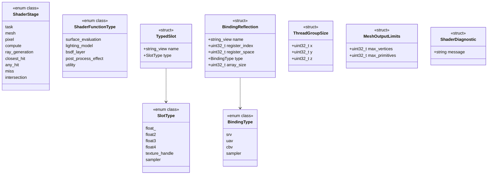
```mermaid
classDiagram
    class ShaderStage {
        <<enum class>>
        task
        mesh
        pixel
        compute
        ray_generation
        closest_hit
        any_hit
        miss
        intersection
    }
    class ShaderFunctionType {
        <<enum class>>
        surface_evaluation
        lighting_model
        bsdf_layer
        post_process_effect
        utility
    }
    class BindingType {
        <<enum class>>
        srv
        uav
        cbv
        sampler
    }
    class SlotType {
        <<enum class>>
        float_
        float2
        float3
        float4
        texture_handle
        sampler
    }
    class TypedSlot {
        <<struct>>
        +string_view name
        +SlotType type
    }
    class BindingReflection {
        <<struct>>
        +string_view name
        +uint32_t register_index
        +uint32_t register_space
        +BindingType type
        +uint32_t array_size
    }
    class ThreadGroupSize {
        <<struct>>
        +uint32_t x
        +uint32_t y
        +uint32_t z
    }
    class MeshOutputLimits {
        <<struct>>
        +uint32_t max_vertices
        +uint32_t max_primitives
    }
    class ShaderDiagnostic {
        <<struct>>
        +string message
    }

    TypedSlot --> SlotType
    BindingReflection --> BindingType
```

### 2. Shader Graph System

`harmonius::shader` — Material shader authoring as visual DAGs of typed nodes (R-2.11.1,
F-6.1.1).

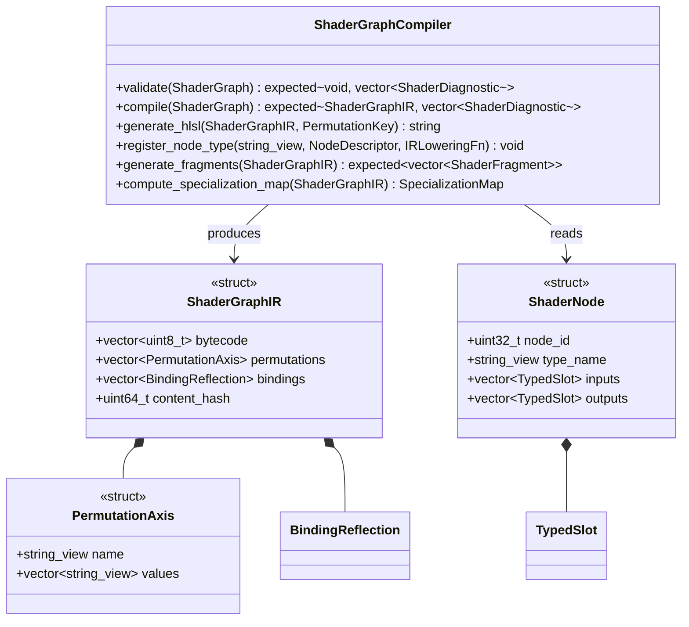
```mermaid
classDiagram
    class ShaderNode {
        <<struct>>
        +uint32_t node_id
        +string_view type_name
        +vector~TypedSlot~ inputs
        +vector~TypedSlot~ outputs
    }
    class PermutationAxis {
        <<struct>>
        +string_view name
        +vector~string_view~ values
    }
    class ShaderGraphIR {
        <<struct>>
        +vector~uint8_t~ bytecode
        +vector~PermutationAxis~ permutations
        +vector~BindingReflection~ bindings
        +uint64_t content_hash
    }
    class ShaderGraphCompiler {
        +validate(ShaderGraph) expected~void, vector~ShaderDiagnostic~~
        +compile(ShaderGraph) expected~ShaderGraphIR, vector~ShaderDiagnostic~~
        +generate_hlsl(ShaderGraphIR, PermutationKey) string
        +register_node_type(string_view, NodeDescriptor, IRLoweringFn) void
        +generate_fragments(ShaderGraphIR) expected~vector~ShaderFragment~~
        +compute_specialization_map(ShaderGraphIR) SpecializationMap
    }

    ShaderNode *-- TypedSlot
    ShaderGraphIR *-- PermutationAxis
    ShaderGraphIR *-- BindingReflection
    ShaderGraphCompiler --> ShaderGraphIR : produces
    ShaderGraphCompiler --> ShaderNode : reads
```

### 3. Compilation Pipeline

`harmonius::shader` — HLSL compilation to platform-native bytecode via DXC, including
monolithic entry point compilation and library function compilation for fragment linking.

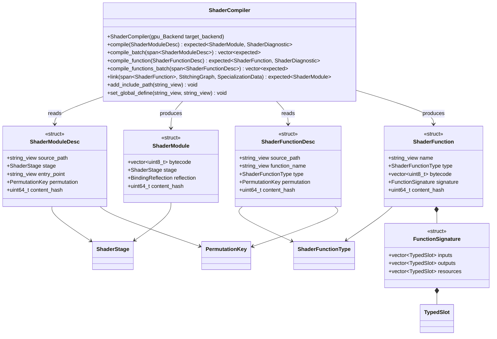
```mermaid
classDiagram
    class ShaderModuleDesc {
        <<struct>>
        +string_view source_path
        +ShaderStage stage
        +string_view entry_point
        +PermutationKey permutation
        +uint64_t content_hash
    }
    class ShaderModule {
        <<struct>>
        +vector~uint8_t~ bytecode
        +ShaderStage stage
        +BindingReflection reflection
        +uint64_t content_hash
    }
    class ShaderFunctionDesc {
        <<struct>>
        +string_view source_path
        +string_view function_name
        +ShaderFunctionType type
        +PermutationKey permutation
        +uint64_t content_hash
    }
    class ShaderFunction {
        <<struct>>
        +string_view name
        +ShaderFunctionType type
        +vector~uint8_t~ bytecode
        +FunctionSignature signature
        +uint64_t content_hash
    }
    class FunctionSignature {
        <<struct>>
        +vector~TypedSlot~ inputs
        +vector~TypedSlot~ outputs
        +vector~TypedSlot~ resources
    }
    class ShaderCompiler {
        +ShaderCompiler(gpu_Backend target_backend)
        +compile(ShaderModuleDesc) expected~ShaderModule, ShaderDiagnostic~
        +compile_batch(span~ShaderModuleDesc~) vector~expected~
        +compile_function(ShaderFunctionDesc) expected~ShaderFunction, ShaderDiagnostic~
        +compile_functions_batch(span~ShaderFunctionDesc~) vector~expected~
        +link(span~ShaderFunction~, StitchingGraph, SpecializationData) expected~ShaderModule~
        +add_include_path(string_view) void
        +set_global_define(string_view, string_view) void
    }

    ShaderModuleDesc --> ShaderStage
    ShaderModuleDesc --> PermutationKey
    ShaderModule --> ShaderStage
    ShaderFunctionDesc --> ShaderFunctionType
    ShaderFunctionDesc --> PermutationKey
    ShaderFunction --> ShaderFunctionType
    ShaderFunction *-- FunctionSignature
    FunctionSignature *-- TypedSlot
    ShaderCompiler --> ShaderModuleDesc : reads
    ShaderCompiler --> ShaderModule : produces
    ShaderCompiler --> ShaderFunctionDesc : reads
    ShaderCompiler --> ShaderFunction : produces
```

### 4. Shader Reflection

`harmonius::shader` — Binding metadata, resource usage, and interface signature extraction
from compiled shader modules and fragment library exports.

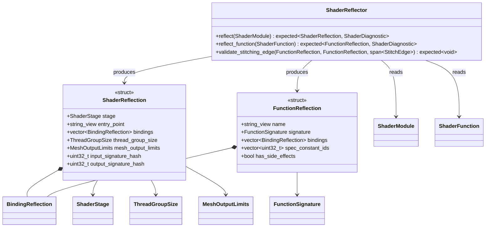
```mermaid
classDiagram
    class ShaderReflection {
        <<struct>>
        +ShaderStage stage
        +string_view entry_point
        +vector~BindingReflection~ bindings
        +ThreadGroupSize thread_group_size
        +MeshOutputLimits mesh_output_limits
        +uint32_t input_signature_hash
        +uint32_t output_signature_hash
    }
    class FunctionReflection {
        <<struct>>
        +string_view name
        +FunctionSignature signature
        +vector~BindingReflection~ bindings
        +vector~uint32_t~ spec_constant_ids
        +bool has_side_effects
    }
    class ShaderReflector {
        +reflect(ShaderModule) expected~ShaderReflection, ShaderDiagnostic~
        +reflect_function(ShaderFunction) expected~FunctionReflection, ShaderDiagnostic~
        +validate_stitching_edge(FunctionReflection, FunctionReflection, span~StitchEdge~) expected~void~
    }

    ShaderReflection *-- BindingReflection
    ShaderReflection --> ShaderStage
    ShaderReflection --> ThreadGroupSize
    ShaderReflection --> MeshOutputLimits
    FunctionReflection *-- BindingReflection
    FunctionReflection --> FunctionSignature
    ShaderReflector --> ShaderReflection : produces
    ShaderReflector --> FunctionReflection : produces
    ShaderReflector --> ShaderModule : reads
    ShaderReflector --> ShaderFunction : reads
```

### 5. Permutation Management

`harmonius::shader` — Compile-time defines (Strategy 1), specialization constants
(Strategy 2), and the data structures that map permutation axes to resolution strategies.

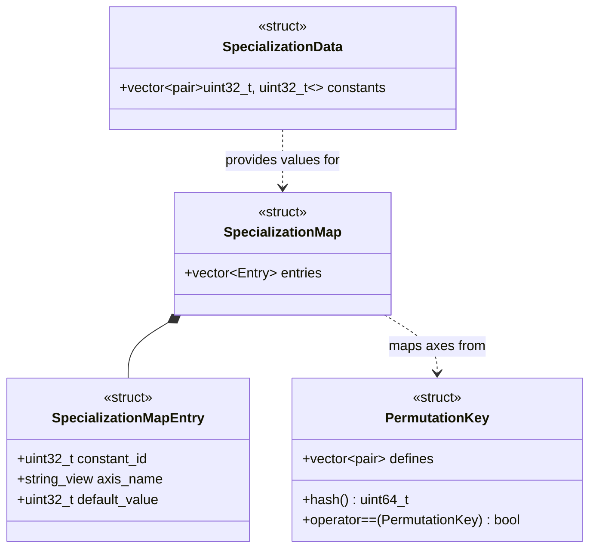
```mermaid
classDiagram
    class PermutationKey {
        <<struct>>
        +vector~pair~ defines
        +hash() uint64_t
        +operator==(PermutationKey) bool
    }
    class SpecializationMap {
        <<struct>>
        +vector~Entry~ entries
    }
    class SpecializationMapEntry {
        <<struct>>
        +uint32_t constant_id
        +string_view axis_name
        +uint32_t default_value
    }
    class SpecializationData {
        <<struct>>
        +vector~pair~uint32_t, uint32_t~~ constants
    }

    SpecializationMap *-- SpecializationMapEntry
    SpecializationMap ..> PermutationKey : maps axes from
    SpecializationData ..> SpecializationMap : provides values for
```

### 6. Fragment Library

`harmonius::shader` — Registry of reusable, independently compiled shader functions
(Strategy 3). Each fragment conforms to a typed interface contract defined by its
`ShaderFunctionType`.

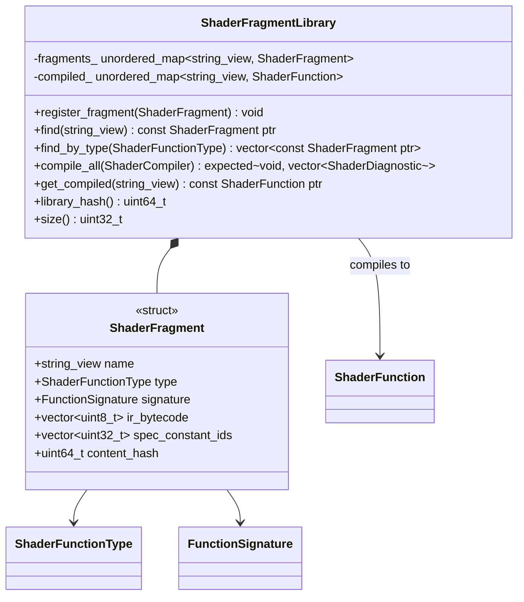
```mermaid
classDiagram
    class ShaderFragment {
        <<struct>>
        +string_view name
        +ShaderFunctionType type
        +FunctionSignature signature
        +vector~uint8_t~ ir_bytecode
        +vector~uint32_t~ spec_constant_ids
        +uint64_t content_hash
    }
    class ShaderFragmentLibrary {
        +register_fragment(ShaderFragment) void
        +find(string_view) const ShaderFragment ptr
        +find_by_type(ShaderFunctionType) vector~const ShaderFragment ptr~
        +compile_all(ShaderCompiler) expected~void, vector~ShaderDiagnostic~~
        +get_compiled(string_view) const ShaderFunction ptr
        +library_hash() uint64_t
        +size() uint32_t
        -fragments_ unordered_map~string_view, ShaderFragment~
        -compiled_ unordered_map~string_view, ShaderFunction~
    }

    ShaderFragmentLibrary *-- ShaderFragment
    ShaderFragmentLibrary --> ShaderFunction : compiles to
    ShaderFragment --> ShaderFunctionType
    ShaderFragment --> FunctionSignature
```

### 7. Stitching Graph

`harmonius::shader` — DAG that defines how fragments compose into a complete pixel shader.
Nodes reference fragments from the library; edges connect typed output slots to input slots.

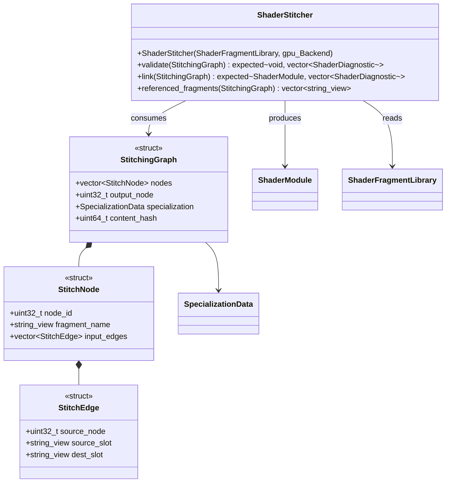
```mermaid
classDiagram
    class StitchNode {
        <<struct>>
        +uint32_t node_id
        +string_view fragment_name
        +vector~StitchEdge~ input_edges
    }
    class StitchEdge {
        <<struct>>
        +uint32_t source_node
        +string_view source_slot
        +string_view dest_slot
    }
    class StitchingGraph {
        <<struct>>
        +vector~StitchNode~ nodes
        +uint32_t output_node
        +SpecializationData specialization
        +uint64_t content_hash
    }
    class ShaderStitcher {
        +ShaderStitcher(ShaderFragmentLibrary, gpu_Backend)
        +validate(StitchingGraph) expected~void, vector~ShaderDiagnostic~~
        +link(StitchingGraph) expected~ShaderModule, vector~ShaderDiagnostic~~
        +referenced_fragments(StitchingGraph) vector~string_view~
    }

    StitchingGraph *-- StitchNode
    StitchNode *-- StitchEdge
    StitchingGraph --> SpecializationData
    ShaderStitcher --> StitchingGraph : consumes
    ShaderStitcher --> ShaderModule : produces
    ShaderStitcher --> ShaderFragmentLibrary : reads
```

### 8. Pipeline State Objects

`harmonius::shader` — PSO descriptors for mesh render (monolithic and linked), compute, and
ray tracing pipelines. A single global root signature serves the entire renderer thanks to
bindless resource addressing.

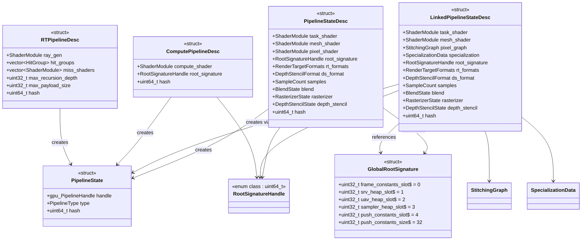
```mermaid
classDiagram
    class PipelineStateDesc {
        <<struct>>
        +ShaderModule task_shader
        +ShaderModule mesh_shader
        +ShaderModule pixel_shader
        +RootSignatureHandle root_signature
        +RenderTargetFormats rt_formats
        +DepthStencilFormat ds_format
        +SampleCount samples
        +BlendState blend
        +RasterizerState rasterizer
        +DepthStencilState depth_stencil
        +uint64_t hash
    }
    class LinkedPipelineStateDesc {
        <<struct>>
        +ShaderModule task_shader
        +ShaderModule mesh_shader
        +StitchingGraph pixel_graph
        +SpecializationData specialization
        +RootSignatureHandle root_signature
        +RenderTargetFormats rt_formats
        +DepthStencilFormat ds_format
        +SampleCount samples
        +BlendState blend
        +RasterizerState rasterizer
        +DepthStencilState depth_stencil
        +uint64_t hash
    }
    class ComputePipelineDesc {
        <<struct>>
        +ShaderModule compute_shader
        +RootSignatureHandle root_signature
        +uint64_t hash
    }
    class RTPipelineDesc {
        <<struct>>
        +ShaderModule ray_gen
        +vector~HitGroup~ hit_groups
        +vector~ShaderModule~ miss_shaders
        +uint32_t max_recursion_depth
        +uint32_t max_payload_size
        +uint64_t hash
    }
    class PipelineState {
        <<struct>>
        +gpu_PipelineHandle handle
        +PipelineType type
        +uint64_t hash
    }
    class RootSignatureHandle {
        <<enum class : uint64_t>>
    }
    class GlobalRootSignature {
        <<struct>>
        +uint32_t frame_constants_slot$ = 0
        +uint32_t srv_heap_slot$ = 1
        +uint32_t uav_heap_slot$ = 2
        +uint32_t sampler_heap_slot$ = 3
        +uint32_t push_constants_slot$ = 4
        +uint32_t push_constants_size$ = 32
    }

    PipelineStateDesc --> PipelineState : creates
    LinkedPipelineStateDesc --> PipelineState : creates via link
    ComputePipelineDesc --> PipelineState : creates
    RTPipelineDesc --> PipelineState : creates
    PipelineStateDesc --> RootSignatureHandle
    LinkedPipelineStateDesc --> RootSignatureHandle
    LinkedPipelineStateDesc --> StitchingGraph
    LinkedPipelineStateDesc --> SpecializationData
    PipelineStateDesc --> GlobalRootSignature : references
    LinkedPipelineStateDesc --> GlobalRootSignature : references
    ComputePipelineDesc --> RootSignatureHandle
```

### 9. Pipeline State Caching

`harmonius::shader` — Three-tier PSO caching: L1 in-memory hash map, L2 disk cache with
serialized PSO blobs, and L3 async background compilation with placeholder fallback.

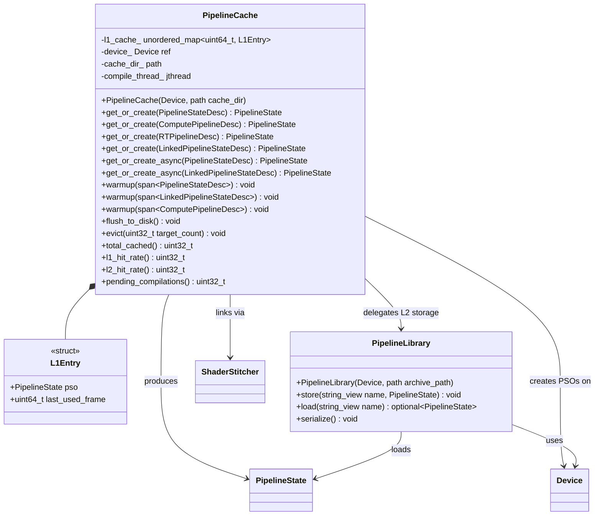
```mermaid
classDiagram
    class PipelineCache {
        +PipelineCache(Device, path cache_dir)
        +get_or_create(PipelineStateDesc) PipelineState
        +get_or_create(ComputePipelineDesc) PipelineState
        +get_or_create(RTPipelineDesc) PipelineState
        +get_or_create(LinkedPipelineStateDesc) PipelineState
        +get_or_create_async(PipelineStateDesc) PipelineState
        +get_or_create_async(LinkedPipelineStateDesc) PipelineState
        +warmup(span~PipelineStateDesc~) void
        +warmup(span~LinkedPipelineStateDesc~) void
        +warmup(span~ComputePipelineDesc~) void
        +flush_to_disk() void
        +evict(uint32_t target_count) void
        +total_cached() uint32_t
        +l1_hit_rate() uint32_t
        +l2_hit_rate() uint32_t
        +pending_compilations() uint32_t
        -l1_cache_ unordered_map~uint64_t, L1Entry~
        -device_ Device ref
        -cache_dir_ path
        -compile_thread_ jthread
    }
    class L1Entry {
        <<struct>>
        +PipelineState pso
        +uint64_t last_used_frame
    }
    class PipelineLibrary {
        +PipelineLibrary(Device, path archive_path)
        +store(string_view name, PipelineState) void
        +load(string_view name) optional~PipelineState~
        +serialize() void
    }

    PipelineCache *-- L1Entry
    PipelineCache --> PipelineLibrary : delegates L2 storage
    PipelineCache --> PipelineState : produces
    PipelineCache --> ShaderStitcher : links via
    PipelineCache --> Device : creates PSOs on
    PipelineLibrary --> PipelineState : loads
    PipelineLibrary --> Device : uses
```

### 10. Runtime Delivery

`harmonius::shader` — Compressed shader blobs for reduced disk IO and development-only hot
reloading for rapid iteration.

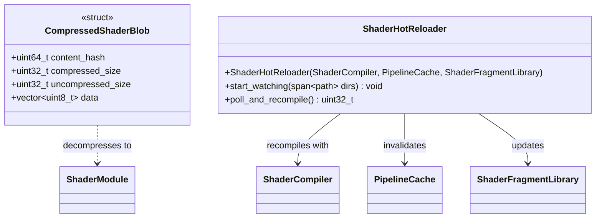
```mermaid
classDiagram
    class CompressedShaderBlob {
        <<struct>>
        +uint64_t content_hash
        +uint32_t compressed_size
        +uint32_t uncompressed_size
        +vector~uint8_t~ data
    }
    class ShaderHotReloader {
        +ShaderHotReloader(ShaderCompiler, PipelineCache, ShaderFragmentLibrary)
        +start_watching(span~path~ dirs) void
        +poll_and_recompile() uint32_t
    }

    ShaderHotReloader --> ShaderCompiler : recompiles with
    ShaderHotReloader --> PipelineCache : invalidates
    ShaderHotReloader --> ShaderFragmentLibrary : updates
    CompressedShaderBlob ..> ShaderModule : decompresses to
```

---

## Cross-Module Relationships

How the ten modules depend on each other at the class level.

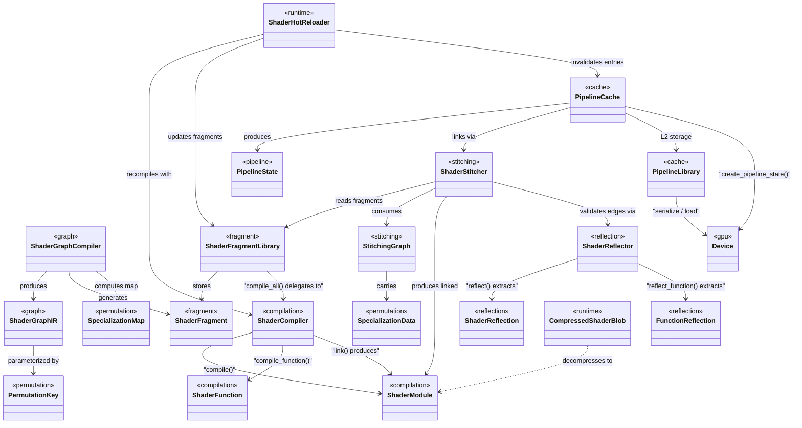
```mermaid
classDiagram
    class ShaderGraphCompiler {
        <<graph>>
    }
    class ShaderGraphIR {
        <<graph>>
    }
    class ShaderCompiler {
        <<compilation>>
    }
    class ShaderModule {
        <<compilation>>
    }
    class ShaderFunction {
        <<compilation>>
    }
    class ShaderReflector {
        <<reflection>>
    }
    class ShaderReflection {
        <<reflection>>
    }
    class FunctionReflection {
        <<reflection>>
    }
    class PermutationKey {
        <<permutation>>
    }
    class SpecializationMap {
        <<permutation>>
    }
    class SpecializationData {
        <<permutation>>
    }
    class ShaderFragment {
        <<fragment>>
    }
    class ShaderFragmentLibrary {
        <<fragment>>
    }
    class StitchingGraph {
        <<stitching>>
    }
    class ShaderStitcher {
        <<stitching>>
    }
    class PipelineCache {
        <<cache>>
    }
    class PipelineState {
        <<pipeline>>
    }
    class PipelineLibrary {
        <<cache>>
    }
    class ShaderHotReloader {
        <<runtime>>
    }
    class CompressedShaderBlob {
        <<runtime>>
    }
    class Device {
        <<gpu>>
    }

    ShaderGraphCompiler --> ShaderGraphIR : produces
    ShaderGraphCompiler --> ShaderFragment : generates
    ShaderGraphCompiler --> SpecializationMap : computes map
    ShaderGraphIR --> PermutationKey : parameterized by
    ShaderCompiler --> ShaderModule : "compile()"
    ShaderCompiler --> ShaderFunction : "compile_function()"
    ShaderCompiler --> ShaderModule : "link() produces"
    ShaderReflector --> ShaderReflection : "reflect() extracts"
    ShaderReflector --> FunctionReflection : "reflect_function() extracts"
    ShaderFragmentLibrary --> ShaderFragment : stores
    ShaderFragmentLibrary --> ShaderCompiler : "compile_all() delegates to"
    ShaderStitcher --> ShaderFragmentLibrary : reads fragments
    ShaderStitcher --> StitchingGraph : consumes
    ShaderStitcher --> ShaderModule : produces linked
    ShaderStitcher --> ShaderReflector : validates edges via
    StitchingGraph --> SpecializationData : carries
    PipelineCache --> PipelineState : produces
    PipelineCache --> ShaderStitcher : links via
    PipelineCache --> PipelineLibrary : L2 storage
    PipelineCache --> Device : "create_pipeline_state()"
    PipelineLibrary --> Device : "serialize / load"
    ShaderHotReloader --> ShaderCompiler : recompiles with
    ShaderHotReloader --> ShaderFragmentLibrary : updates fragments
    ShaderHotReloader --> PipelineCache : invalidates entries
    CompressedShaderBlob ..> ShaderModule : decompresses to
```

### Shader Pipeline to GPU Backend Type Mapping

How shader pipeline types translate into GPU backend types at the boundary between the two
layers.

| Shader Pipeline Type | GPU Backend Type | Translation Point |
|---|---|---|
| `shader::ShaderModule` | `gpu::PipelineShaderStageCreateInfo` | PSO creation in `PipelineCache` |
| `shader::PipelineStateDesc` | `gpu::MeshRenderPipelineDesc` | `PipelineCache::get_or_create()` |
| `shader::LinkedPipelineStateDesc` | `gpu::MeshRenderPipelineDesc` | `PipelineCache::get_or_create()` after linking |
| `shader::ComputePipelineDesc` | `gpu::ComputePipelineDesc` | `PipelineCache::get_or_create()` |
| `shader::RTPipelineDesc` | `gpu::RayTracingPipelineDesc` | `PipelineCache::get_or_create()` |
| `shader::PipelineState` | `gpu::PipelineHandle` | Handle wrapping after PSO creation |
| `shader::GlobalRootSignature` | `gpu::RootSignature` / `VkPipelineLayout` | Created once at device initialization |
| `shader::BindingReflection` | `gpu::DescriptorSetLayoutBinding` | Pipeline layout validation |
| `shader::SpecializationData` | `VkSpecializationInfo` / `MTLFunctionConstantValues` | PSO creation |
| `shader::CompressedShaderBlob` | `gpu::Buffer` (staging) | GPU decompression compute pass |

### Shader Pipeline to Render Graph Type Mapping

How shader pipeline concepts integrate with the render graph's variant and pass systems.

| Render Graph Type | Shader Pipeline Type | Integration Point |
|---|---|---|
| `rg::builder::PassDescriptor` (execute) | `shader::PipelineState` via `PassContext` | PSO resolved at encoding time |
| `rg::VariantSlotHandle` (alpha_mode) | `shader::PermutationKey` | Compile-time define selection |
| `rg::VariantSlotHandle` (shading_model) | `shader::StitchNode` in `StitchingGraph` | Fragment selection at link time |
| `rg::VariantSlotHandle` (shadow_quality) | `shader::SpecializationData` entry | Spec constant at PSO creation |
| `rg::compiler::CompileOptions` variants | `shader::StitchingGraph` resolution | Variant drives fragment selection |

---

## Sequence Diagrams

### Full Shader Compilation Lifecycle

From shader graph authoring through fragment compilation to PSO creation.

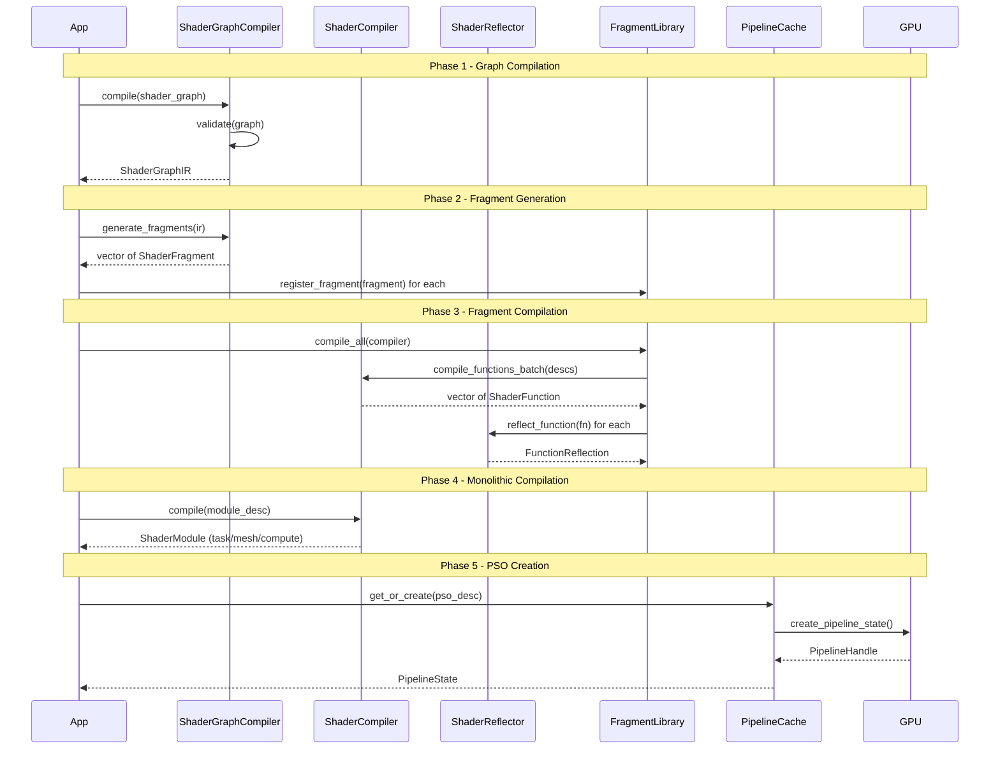
```mermaid
sequenceDiagram
    participant App
    participant SGC as ShaderGraphCompiler
    participant SC as ShaderCompiler
    participant SR as ShaderReflector
    participant FL as FragmentLibrary
    participant Cache as PipelineCache
    participant GPU

    Note over App,GPU: Phase 1 - Graph Compilation
    App->>SGC: compile(shader_graph)
    SGC->>SGC: validate(graph)
    SGC-->>App: ShaderGraphIR

    Note over App,GPU: Phase 2 - Fragment Generation
    App->>SGC: generate_fragments(ir)
    SGC-->>App: vector of ShaderFragment
    App->>FL: register_fragment(fragment) for each

    Note over App,GPU: Phase 3 - Fragment Compilation
    App->>FL: compile_all(compiler)
    FL->>SC: compile_functions_batch(descs)
    SC-->>FL: vector of ShaderFunction
    FL->>SR: reflect_function(fn) for each
    SR-->>FL: FunctionReflection

    Note over App,GPU: Phase 4 - Monolithic Compilation
    App->>SC: compile(module_desc)
    SC-->>App: ShaderModule (task/mesh/compute)

    Note over App,GPU: Phase 5 - PSO Creation
    App->>Cache: get_or_create(pso_desc)
    Cache->>GPU: create_pipeline_state()
    GPU-->>Cache: PipelineHandle
    Cache-->>App: PipelineState
```

### Fragment Linking Pipeline

Detailed flow when a linked PSO is requested, showing the three-tier cache and link-time
optimization stages.

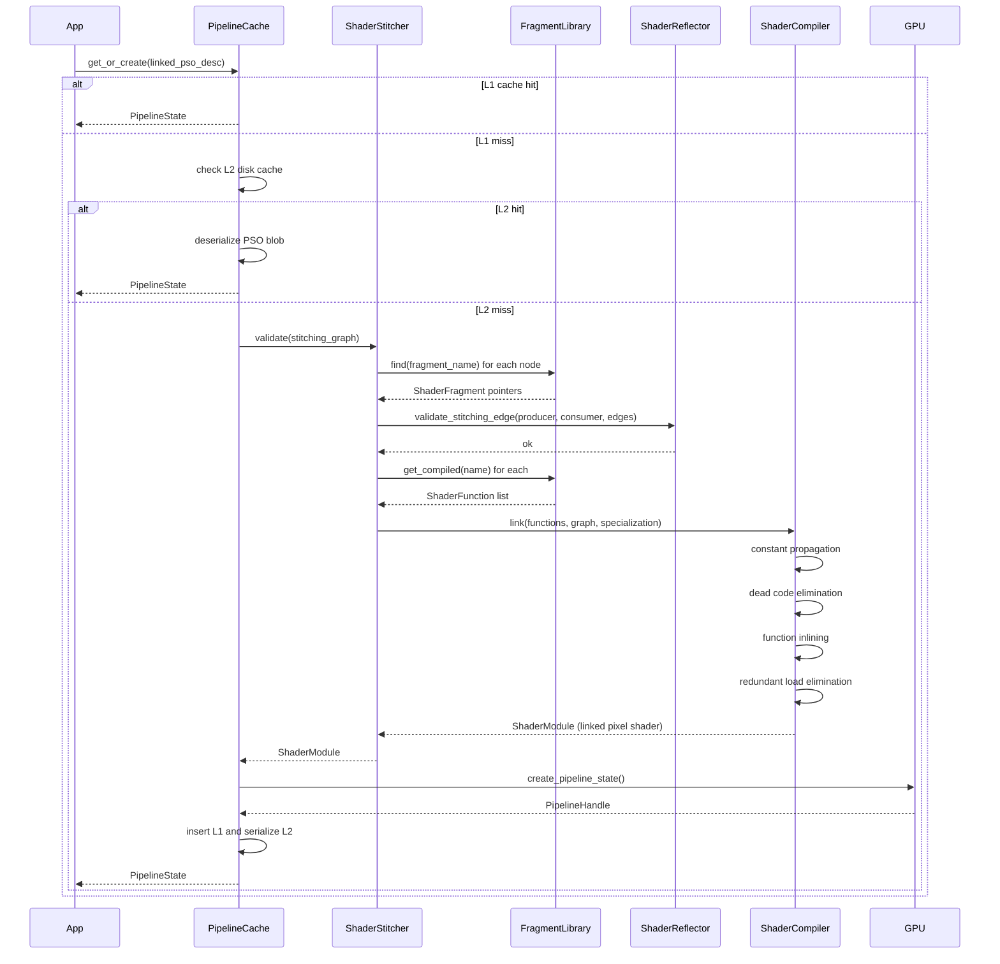
```mermaid
sequenceDiagram
    participant App
    participant Cache as PipelineCache
    participant Stitch as ShaderStitcher
    participant FL as FragmentLibrary
    participant SR as ShaderReflector
    participant SC as ShaderCompiler
    participant GPU

    App->>Cache: get_or_create(linked_pso_desc)

    alt L1 cache hit
        Cache-->>App: PipelineState
    else L1 miss
        Cache->>Cache: check L2 disk cache
        alt L2 hit
            Cache->>Cache: deserialize PSO blob
            Cache-->>App: PipelineState
        else L2 miss
            Cache->>Stitch: validate(stitching_graph)
            Stitch->>FL: find(fragment_name) for each node
            FL-->>Stitch: ShaderFragment pointers
            Stitch->>SR: validate_stitching_edge(producer, consumer, edges)
            SR-->>Stitch: ok

            Stitch->>FL: get_compiled(name) for each
            FL-->>Stitch: ShaderFunction list
            Stitch->>SC: link(functions, graph, specialization)
            SC->>SC: constant propagation
            SC->>SC: dead code elimination
            SC->>SC: function inlining
            SC->>SC: redundant load elimination
            SC-->>Stitch: ShaderModule (linked pixel shader)
            Stitch-->>Cache: ShaderModule

            Cache->>GPU: create_pipeline_state()
            GPU-->>Cache: PipelineHandle
            Cache->>Cache: insert L1 and serialize L2
            Cache-->>App: PipelineState
        end
    end
```

### PSO Cache Lookup and Warmup

Startup warmup pre-compiles PSOs during loading screens, with async fallback for runtime
misses.

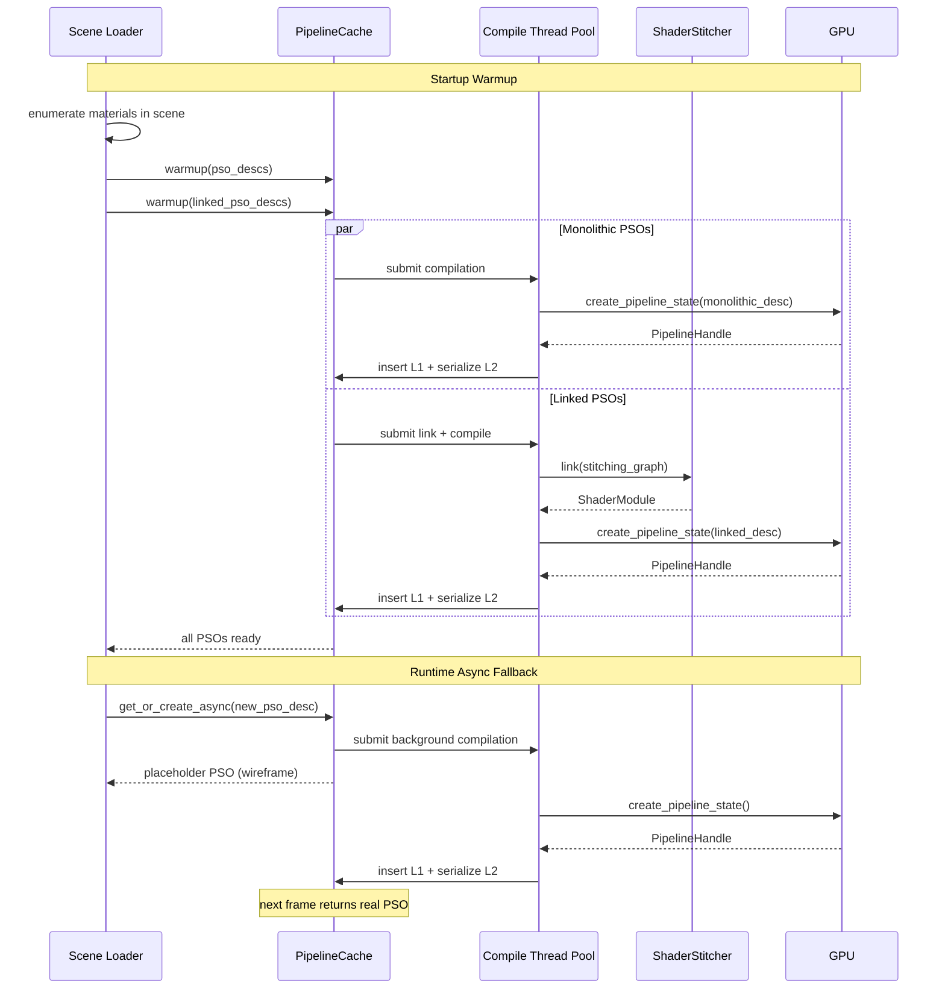
```mermaid
sequenceDiagram
    participant Loader as Scene Loader
    participant Cache as PipelineCache
    participant Pool as Compile Thread Pool
    participant Stitch as ShaderStitcher
    participant GPU

    Note over Loader,GPU: Startup Warmup
    Loader->>Loader: enumerate materials in scene
    Loader->>Cache: warmup(pso_descs)
    Loader->>Cache: warmup(linked_pso_descs)

    par Monolithic PSOs
        Cache->>Pool: submit compilation
        Pool->>GPU: create_pipeline_state(monolithic_desc)
        GPU-->>Pool: PipelineHandle
        Pool->>Cache: insert L1 + serialize L2
    and Linked PSOs
        Cache->>Pool: submit link + compile
        Pool->>Stitch: link(stitching_graph)
        Stitch-->>Pool: ShaderModule
        Pool->>GPU: create_pipeline_state(linked_desc)
        GPU-->>Pool: PipelineHandle
        Pool->>Cache: insert L1 + serialize L2
    end

    Cache-->>Loader: all PSOs ready

    Note over Loader,GPU: Runtime Async Fallback
    Loader->>Cache: get_or_create_async(new_pso_desc)
    Cache->>Pool: submit background compilation
    Cache-->>Loader: placeholder PSO (wireframe)
    Pool->>GPU: create_pipeline_state()
    GPU-->>Pool: PipelineHandle
    Pool->>Cache: insert L1 + serialize L2
    Note over Cache: next frame returns real PSO
```

### Hot Reload Flow

Development-only flow showing how file changes propagate through fragment recompilation and
PSO re-linking.

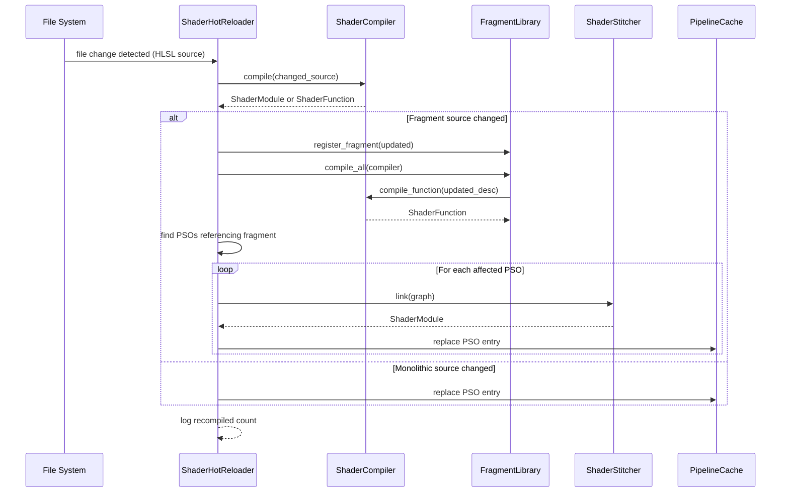
```mermaid
sequenceDiagram
    participant FS as File System
    participant HR as ShaderHotReloader
    participant SC as ShaderCompiler
    participant FL as FragmentLibrary
    participant Stitch as ShaderStitcher
    participant Cache as PipelineCache

    FS->>HR: file change detected (HLSL source)
    HR->>SC: compile(changed_source)
    SC-->>HR: ShaderModule or ShaderFunction

    alt Fragment source changed
        HR->>FL: register_fragment(updated)
        HR->>FL: compile_all(compiler)
        FL->>SC: compile_function(updated_desc)
        SC-->>FL: ShaderFunction
        HR->>HR: find PSOs referencing fragment
        loop For each affected PSO
            HR->>Stitch: link(graph)
            Stitch-->>HR: ShaderModule
            HR->>Cache: replace PSO entry
        end
    else Monolithic source changed
        HR->>Cache: replace PSO entry
    end
    HR-->>HR: log recompiled count
```

### Pass-to-PSO Binding

How render graph pass callbacks resolve PSOs at encoding time, showing both the monolithic
and linked paths.

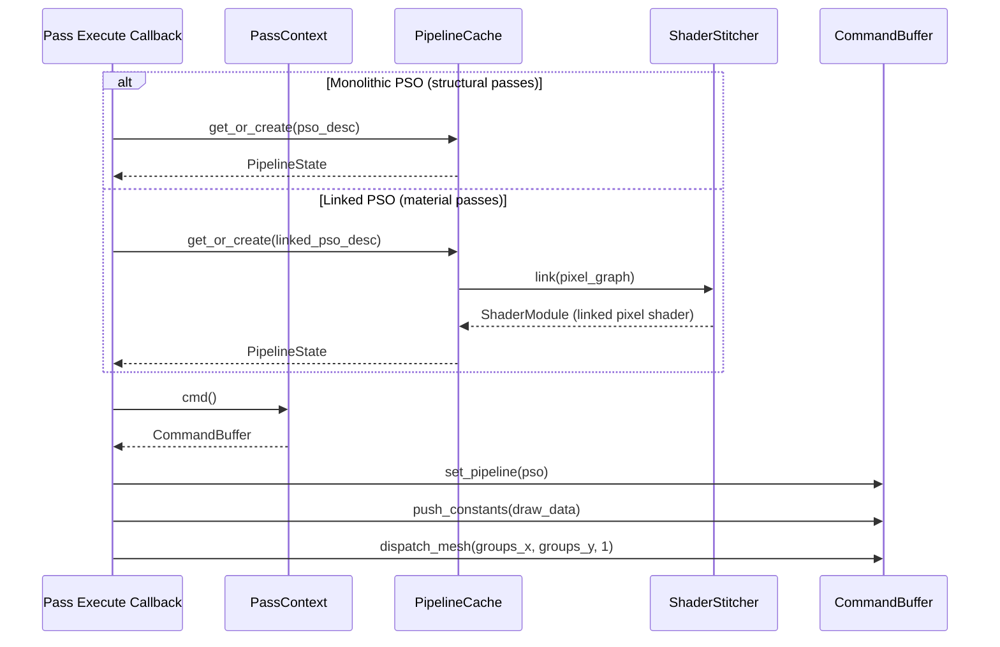
```mermaid
sequenceDiagram
    participant Pass as Pass Execute Callback
    participant Ctx as PassContext
    participant Cache as PipelineCache
    participant Stitch as ShaderStitcher
    participant Cmd as CommandBuffer

    alt Monolithic PSO (structural passes)
        Pass->>Cache: get_or_create(pso_desc)
        Cache-->>Pass: PipelineState
    else Linked PSO (material passes)
        Pass->>Cache: get_or_create(linked_pso_desc)
        Cache->>Stitch: link(pixel_graph)
        Stitch-->>Cache: ShaderModule (linked pixel shader)
        Cache-->>Pass: PipelineState
    end
    Pass->>Ctx: cmd()
    Ctx-->>Pass: CommandBuffer
    Pass->>Cmd: set_pipeline(pso)
    Pass->>Cmd: push_constants(draw_data)
    Pass->>Cmd: dispatch_mesh(groups_x, groups_y, 1)
```
