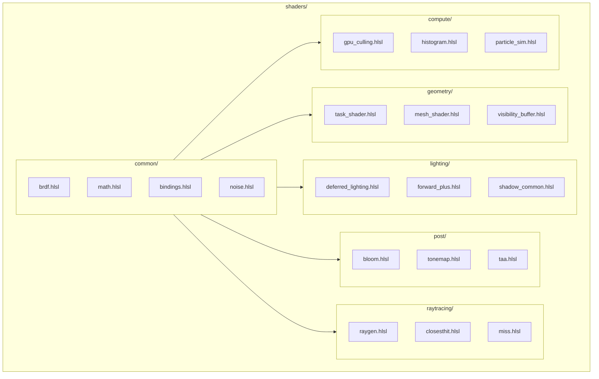
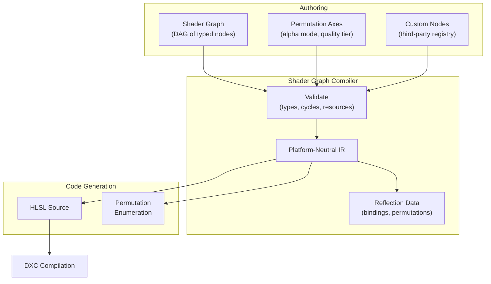
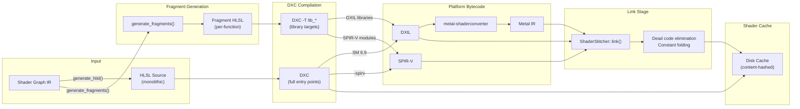
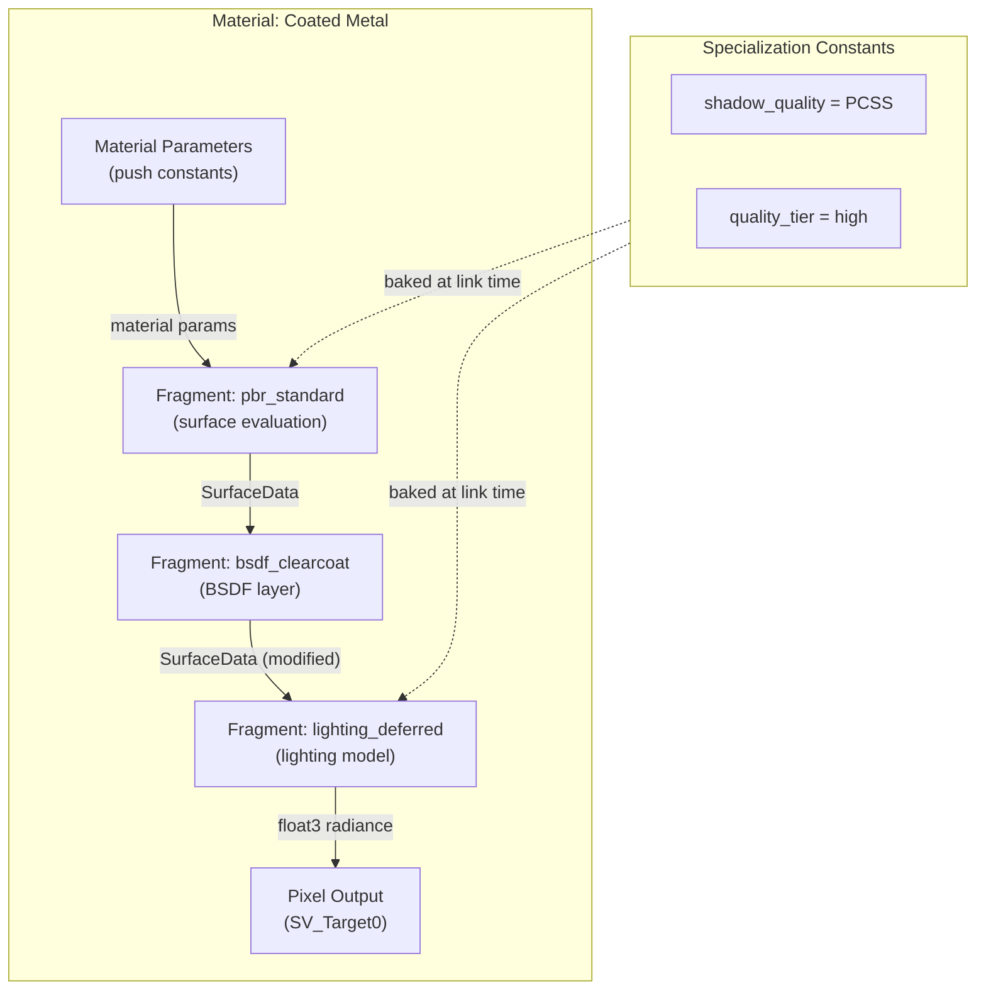
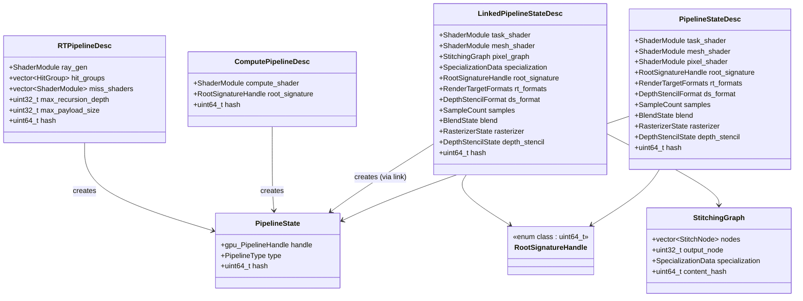
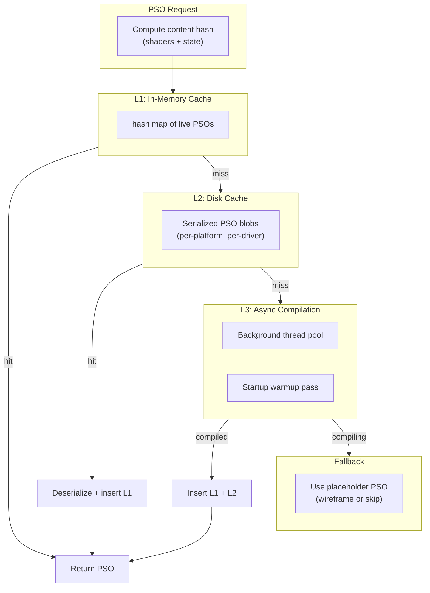
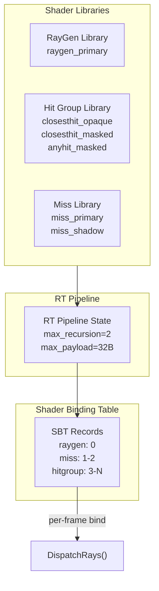
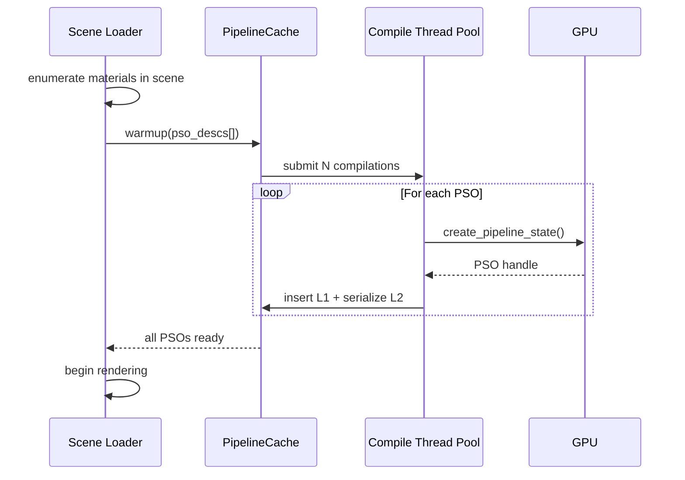
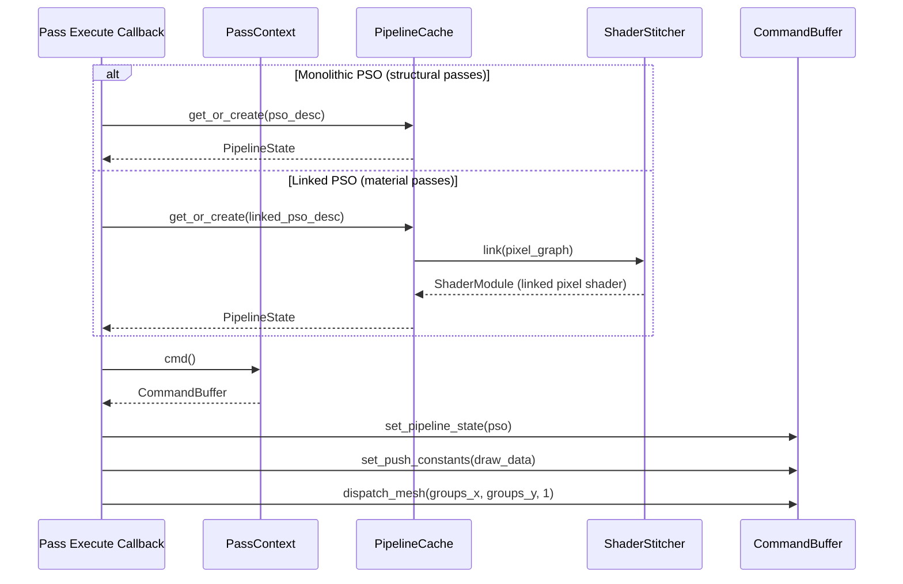

# Shader Pipeline Design

Shader authoring, compilation, linking, caching, and delivery for the Harmonius render graph.
All shaders are authored in HLSL and compiled via DirectXShaderCompiler (DXC) to platform-native
bytecode. Companion to [render-graph-design.md](render-graph-design.md).

**Requirements:** R-2.11.1–R-2.11.11, R-3.3.8 (single shader IR), R-1.1.3 (mesh shaders only),
F-6.1.1–F-6.1.8.

---

## Contents

- [Shader Source Organization](#shader-source-organization)
- [Shader Graph System](#shader-graph-system)
- [Compilation Pipeline](#compilation-pipeline)
- [Shader Reflection](#shader-reflection)
- [Permutation Management](#permutation-management)
- [Shader Fragment Library](#shader-fragment-library)
- [Shader Stitching Graph](#shader-stitching-graph)
- [Pipeline State Objects](#pipeline-state-objects)
- [Pipeline State Caching](#pipeline-state-caching)
- [Shader Libraries and Dynamic Linking](#shader-libraries-and-dynamic-linking)
- [Runtime Shader Delivery](#runtime-shader-delivery)
- [Integration with Render Graph](#integration-with-render-graph)

---

## Shader Source Organization

Shaders are organized by domain into HLSL module files. The mesh shader pipeline is the sole
geometry path (R-1.1.3) — no vertex/geometry/tessellation shaders exist.



### Bindless Resource Convention

All shaders use a single global bindless descriptor table (R-2.12.10, F-6.2.9). Resources are
addressed by `uint32_t` index into the heap:

```hlsl
// bindings.hlsl — global bindless root
struct FrameConstants {
    uint scene_buffer_idx;
    uint transform_buffer_idx;
    uint material_buffer_idx;
    uint light_buffer_idx;
    uint residency_map_idx;
    float2 resolution;
    float resolution_scale;
    uint frame_index;
};

ConstantBuffer<FrameConstants> g_frame : register(b0);

// Bindless access pattern
ByteAddressBuffer  LoadBuffer(uint idx)  { return ResourceDescriptorHeap[idx]; }
Texture2D<float4>  LoadTex2D(uint idx)   { return ResourceDescriptorHeap[idx]; }
RWTexture2D<float4> LoadRWTex2D(uint idx) { return ResourceDescriptorHeap[idx]; }
```

---

## Shader Graph System

Material shaders are authored as visual DAGs of typed nodes (R-2.11.1, F-6.1.1) that compile
to HLSL through a platform-neutral intermediate representation.



### Shader Graph Compilation (R-2.11.2)

```cpp
namespace harmonius::shader {

// Shader graph node — the fundamental unit of the graph
struct ShaderNode {
    uint32_t                     node_id;
    std::string_view             type_name;   // e.g., "pbr_base", "noise_3d", "custom_sss"
    std::vector<TypedSlot>       inputs;
    std::vector<TypedSlot>       outputs;
};

struct TypedSlot {
    std::string_view name;
    SlotType         type;  // float, float2, float3, float4, texture_handle, sampler
};

// Permutation axis — compile-time branching
struct PermutationAxis {
    std::string_view             name;     // e.g., "alpha_mode", "quality_tier"
    std::vector<std::string_view> values;  // e.g., {"opaque", "masked", "blended"}
};

// Compiled shader graph — platform-neutral IR
struct ShaderGraphIR {
    std::vector<uint8_t>           bytecode;      // compact binary (R-3.3.9)
    std::vector<PermutationAxis>   permutations;
    std::vector<BindingReflection> bindings;       // reflected resource slots
    uint64_t                       content_hash;   // for cache keying
};

class ShaderGraphCompiler {
public:
    // Validate graph structure (R-2.11.8)
    [[nodiscard]]
    std::expected<void, std::vector<ShaderDiagnostic>> validate(
        const ShaderGraph& graph
    );

    // Compile graph to platform-neutral IR
    [[nodiscard]]
    std::expected<ShaderGraphIR, std::vector<ShaderDiagnostic>> compile(
        const ShaderGraph& graph
    );

    // Lower IR to HLSL source for a specific permutation
    [[nodiscard]]
    std::string generate_hlsl(
        const ShaderGraphIR& ir,
        const PermutationKey& permutation
    );

    // Register custom node types (R-2.11.3)
    void register_node_type(std::string_view name,
                            NodeDescriptor desc,
                            IRLoweringFn lowering_fn);

    // Generate shader fragments from graph IR for link-time composition
    [[nodiscard]]
    std::expected<std::vector<ShaderFragment>, std::vector<ShaderDiagnostic>>
    generate_fragments(const ShaderGraphIR& ir);

    // Determine which permutation axes can be converted to specialization constants
    // or fragment selections instead of compile-time defines
    [[nodiscard]]
    SpecializationMap compute_specialization_map(const ShaderGraphIR& ir);
};

} // namespace harmonius::shader
```

---

## Compilation Pipeline

The full pipeline from HLSL source to GPU-ready bytecode for all three backends. Shaders follow
two paths: monolithic compilation for structural shaders (task, mesh, compute, ray tracing) and
fragment compilation followed by link-time stitching for material pixel shaders.



### ShaderCompiler API

```cpp
namespace harmonius::shader {

enum class ShaderStage : uint8_t {
    task,               // task/amplification shader
    mesh,               // mesh shader
    pixel,              // pixel/fragment shader
    compute,            // compute shader
    ray_generation,     // DXR ray generation
    closest_hit,        // DXR closest hit
    any_hit,            // DXR any hit
    miss,               // DXR miss
    intersection,       // DXR intersection
};

struct ShaderModuleDesc {
    std::string_view   source_path;
    ShaderStage        stage;
    std::string_view   entry_point = "main";
    PermutationKey     permutation;         // compile-time defines
    uint64_t           content_hash;        // for cache lookup
};

// Compiled shader blob — backend-specific bytecode
struct ShaderModule {
    std::vector<uint8_t> bytecode;
    ShaderStage          stage;
    BindingReflection    reflection;
    uint64_t             content_hash;
};

// A compiled shader function within a library — not a full entry point
struct ShaderFunction {
    std::string_view     name;         // e.g., "evaluate_sss", "lighting_deferred"
    ShaderFunctionType   type;         // surface, lighting, postprocess, utility
    std::vector<uint8_t> bytecode;     // compiled but unlinked function bytecode
    FunctionSignature    signature;    // typed input/output slots
    uint64_t             content_hash;
};

enum class ShaderFunctionType : uint8_t {
    surface_evaluation,    // evaluates material surface properties
    lighting_model,        // computes lighting contribution
    bsdf_layer,            // modifies surface or radiance (clearcoat, SSS, sheen)
    post_process_effect,   // screen-space post-processing
    utility,               // shared helper (BRDF, noise, sampling)
};

struct FunctionSignature {
    std::vector<TypedSlot> inputs;
    std::vector<TypedSlot> outputs;
    std::vector<TypedSlot> resources;  // bindless resource references
};

// Describes a shader function to compile as a library export
struct ShaderFunctionDesc {
    std::string_view   source_path;
    std::string_view   function_name;  // exported function name
    ShaderFunctionType type;
    PermutationKey     permutation;
    uint64_t           content_hash;
};

class ShaderCompiler {
public:
    explicit ShaderCompiler(gpu::Backend target_backend);

    // Compile a single shader module (full entry point)
    [[nodiscard]]
    std::expected<ShaderModule, ShaderDiagnostic> compile(
        const ShaderModuleDesc& desc
    );

    // Batch compile multiple modules (parallel)
    [[nodiscard]]
    std::vector<std::expected<ShaderModule, ShaderDiagnostic>> compile_batch(
        std::span<const ShaderModuleDesc> descs
    );

    // Compile a shader function for a library target (not a full entry point).
    // D3D12: DXC -T lib_6_9, Vulkan: SPIR-V module, Metal: Metal IR library
    [[nodiscard]]
    std::expected<ShaderFunction, ShaderDiagnostic> compile_function(
        const ShaderFunctionDesc& desc
    );

    // Batch compile multiple functions (parallel)
    [[nodiscard]]
    std::vector<std::expected<ShaderFunction, ShaderDiagnostic>> compile_functions_batch(
        std::span<const ShaderFunctionDesc> descs
    );

    // Link multiple compiled functions into a single shader module.
    // Performs dead code elimination and constant folding at link time.
    [[nodiscard]]
    std::expected<ShaderModule, ShaderDiagnostic> link(
        std::span<const ShaderFunction> functions,
        const StitchingGraph& graph,
        const SpecializationData& specialization
    );

    // Set include search paths
    void add_include_path(std::string_view path);

    // Set global defines applied to all compilations
    void set_global_define(std::string_view name, std::string_view value);
};

} // namespace harmonius::shader
```

---

## Shader Reflection

Shader reflection extracts binding metadata, resource usage, and interface signatures from
compiled shader modules and fragment libraries. This data drives pipeline layout validation,
stitching graph type-checking, and diagnostics tooling.

### Reflection Data Model

```cpp
namespace harmonius::shader {

// Binding slot discovered via reflection
struct BindingReflection {
    std::string_view name;
    uint32_t         register_index;    // register number (t0, u0, b0, s0)
    uint32_t         register_space;
    BindingType      type;              // srv, uav, cbv, sampler
    uint32_t         array_size;        // 0 = unbounded (bindless)
};

enum class BindingType : uint8_t {
    srv,        // Texture, StructuredBuffer, ByteAddressBuffer
    uav,        // RWTexture, RWStructuredBuffer, RWByteAddressBuffer
    cbv,        // ConstantBuffer
    sampler,    // SamplerState
};

// Thread group dimensions for compute / task / mesh shaders
struct ThreadGroupSize {
    uint32_t x = 1;
    uint32_t y = 1;
    uint32_t z = 1;
};

// Mesh shader output limits
struct MeshOutputLimits {
    uint32_t max_vertices   = 0;
    uint32_t max_primitives = 0;
};

// Complete reflection data for a compiled shader module
struct ShaderReflection {
    ShaderStage                    stage;
    std::string_view               entry_point;
    std::vector<BindingReflection> bindings;
    ThreadGroupSize                thread_group_size;   // compute, task, mesh
    MeshOutputLimits               mesh_output_limits;  // mesh shaders only
    uint32_t                       input_signature_hash;
    uint32_t                       output_signature_hash;
};

// Reflection data for a shader function (fragment library export)
struct FunctionReflection {
    std::string_view               name;
    FunctionSignature              signature;
    std::vector<BindingReflection> bindings;
    std::vector<uint32_t>          spec_constant_ids;   // specialization constants referenced
    bool                           has_side_effects;    // writes to UAVs
};

} // namespace harmonius::shader
```

### ShaderReflector API

```cpp
namespace harmonius::shader {

class ShaderReflector {
public:
    // Reflect a compiled shader module (full entry point)
    [[nodiscard]]
    std::expected<ShaderReflection, ShaderDiagnostic> reflect(
        const ShaderModule& module
    );

    // Reflect a compiled shader function (fragment library export)
    [[nodiscard]]
    std::expected<FunctionReflection, ShaderDiagnostic> reflect_function(
        const ShaderFunction& function
    );

    // Validate that two function signatures are compatible for stitching.
    // Checks that the output slots of `producer` are type-compatible with the
    // input slots of `consumer` for all connected edges.
    [[nodiscard]]
    std::expected<void, std::vector<ShaderDiagnostic>> validate_stitching_edge(
        const FunctionReflection& producer,
        const FunctionReflection& consumer,
        std::span<const StitchEdge> edges
    );
};

} // namespace harmonius::shader
```

### Backend Reflection Mechanisms

| Backend | Reflection API                                  | Library reflection                     |
| ------- | ----------------------------------------------- | -------------------------------------- |
| D3D12   | `ID3D12ShaderReflection` (from DXC)             | `ID3D12LibraryReflection`              |
| Vulkan  | `spirv-reflect` or `SPIRV-Cross`                | Module-level reflection on exports     |
| Metal   | `MTLRenderPipelineReflection`                   | `MTLLibrary` function enumeration      |

Reflection data is extracted at compile time and cached alongside the compiled bytecode in the
[Shader Cache](#compilation-pipeline). The `ShaderStitcher` uses reflection to type-check
stitching edges before linking, catching interface mismatches early.

---

## Permutation Management

Shader permutations arise from material variants, quality tiers, feature toggles, and platform
differences. Unmanaged, these create a combinatorial explosion. Harmonius controls this through
five complementary strategies that together eliminate the need for uber shaders. Each permutation
axis is classified into the strategy that best matches its characteristics, keeping the
compile-time permutation space small while preserving runtime flexibility.

### Strategy 1: Shader Graph Permutation Axes (Compile-Time Defines)

Material-level branching declared explicitly in the shader graph (F-6.1.1). Used only for axes
that fundamentally change the shader structure or require different pipeline state (e.g., alpha
mode changes blend state):

```cpp
namespace harmonius::shader {

// A specific point in the permutation space
struct PermutationKey {
    std::vector<std::pair<std::string_view, std::string_view>> defines;

    [[nodiscard]] uint64_t hash() const;
    [[nodiscard]] bool operator==(const PermutationKey&) const = default;
};

} // namespace harmonius::shader
```

### Strategy 2: Specialization Constants

Runtime-configurable constants baked into the pipeline at PSO creation time without full
recompilation. Used for axes that affect scalar parameters, thresholds, or enable/disable code
blocks without changing the shader's structural connectivity:

- **Vulkan:** `VkSpecializationInfo` on pipeline creation
- **D3D12:** SM 6.8 specialization constants (with root constant fallback on older hardware)
- **Metal:** `MTLFunctionConstantValues`

```cpp
namespace harmonius::shader {

struct SpecializationMap {
    struct Entry {
        uint32_t         constant_id;
        std::string_view axis_name;     // e.g., "shadow_quality"
        uint32_t         default_value;
    };
    std::vector<Entry> entries;
};

struct SpecializationData {
    std::vector<std::pair<uint32_t, uint32_t>> constants;  // id -> value
};

} // namespace harmonius::shader
```

Specialization constants absorb permutation axes that were previously compile-time defines. The
`ShaderGraphCompiler::compute_specialization_map()` method analyzes the shader graph IR to
determine which axes can be safely converted — axes that only gate scalar operations or toggle
additive code blocks are eligible.

### Strategy 3: Shader Function Linking

For axes that select between interchangeable algorithmic implementations (e.g., shading model,
lighting model), the shader is composed from independently compiled **shader fragments** that are
linked at PSO creation time. Each fragment conforms to a typed interface signature and is compiled
once as a library export. At link time, the appropriate fragments are selected and linked into a
single shader module.

This replaces uber shader dynamic branching: instead of compiling all code paths into one shader
and branching at runtime, only the code paths actually needed are linked into the final shader.
The linker eliminates all unused code, producing a shader that is structurally identical to a
hand-written monolithic shader.

See [Shader Fragment Library](#shader-fragment-library) and
[Shader Stitching Graph](#shader-stitching-graph) for the full design.

### Strategy 4: Link-Time Optimization

When shader functions are linked (Strategy 3), the linker propagates known specialization
constants (Strategy 2) into the linked result and performs dead code elimination and constant
folding. This recovers the performance characteristics of a monolithic shader because the final
bytecode contains only the code paths actually needed — no dynamic branches remain for
link-time-resolved decisions.

The optimization passes are:

1. **Constant propagation** — specialization constants are inlined as literals
2. **Dead code elimination** — unreachable branches removed after constant propagation
3. **Function inlining** — small utility fragments inlined at call sites
4. **Redundant load elimination** — duplicate bindless resource loads coalesced

### Strategy 5: Fragment Selection

The render graph's variant system (RG-1.4) drives fragment selection at runtime. When a variant
slot selects a value (e.g., `lighting_model = "deferred"`), the corresponding fragment is
selected from the [Shader Fragment Library](#shader-fragment-library) and the stitching graph is
resolved. The linked PSO is then requested from the pipeline cache.

Fragment selection decouples the permutation axes from the compilation pipeline: adding a new
shading model (e.g., `water_caustics`) requires only authoring and compiling a single new
fragment, not recompiling every material that might use it.

### Permutation Axis Classification

Each permutation axis is assigned to the strategy that minimizes combinatorial cost while
preserving correctness:

| Axis               | Strategy              | Typical values | Rationale                                  |
| ------------------ | --------------------- | -------------- | ------------------------------------------ |
| Alpha mode         | 1 (compile-time)      | 3              | Changes blend state and pipeline structure  |
| Lighting model     | 3 (fragment linking)  | 2              | Interchangeable algorithm implementations   |
| Shadow quality     | 2 (specialization)    | 3              | Scalar threshold / sample count difference  |
| Shading model      | 3 (fragment linking)  | 8              | Interchangeable surface evaluation          |
| Quality tier       | 2 (specialization)    | 3              | Scalar quality knobs                        |
| AA mode            | 3 (fragment linking)  | 3              | Interchangeable post-process implementation |
| BSDF layers        | 3 (fragment linking)  | N              | Additive composable layers                  |

### Permutation Budget

With the axis classification above, the compile-time permutation space is reduced from ~430 to
**3 unique compile-time permutations per material** (alpha mode only). The remaining axes are
resolved at link time (shading model, lighting model, BSDF layers) or PSO creation time
(shadow quality, quality tier) through specialization constants.

| Budget category          | Count  | Resolution stage |
| ------------------------ | ------ | ---------------- |
| Compile-time permutations | 3      | Offline cook     |
| Fragment selections       | ~20    | Link time        |
| Specialization variants   | ~9     | PSO creation     |

With content-hashed caching, only actually-used combinations are linked. The three-tier pipeline
cache (see [Pipeline State Caching](#pipeline-state-caching)) ensures that link-time costs are
amortized across sessions.

---

## Shader Fragment Library

The fragment library is a registry of reusable, independently compiled shader functions that can
be composed at link time through the [Shader Stitching Graph](#shader-stitching-graph). Each
fragment conforms to a typed interface contract defined by its `ShaderFunctionType`, enabling
type-safe composition without requiring all fragments to be compiled together.

### Fragment Types

Fragments are classified by their role in the shading pipeline. Each type defines a contract
for its inputs, outputs, and resource access patterns:

| Category             | Examples                                                                      | Input contract                               | Output contract                        |
| -------------------- | ----------------------------------------------------------------------------- | -------------------------------------------- | -------------------------------------- |
| Surface evaluation   | `pbr_standard`, `cloth_fuzz`, `hair_marschner`, `eye_cornea`, `skin_preint`   | UV, tangent frame, material params           | `SurfaceData`                          |
| Lighting model       | `lighting_deferred`, `lighting_forward_plus`, `lighting_stochastic`           | `SurfaceData`, light list                    | `float3` radiance                      |
| BSDF layer           | `bsdf_clearcoat`, `bsdf_subsurface`, `bsdf_sheen`, `bsdf_anisotropy`        | `SurfaceData`, base radiance                 | Modified `SurfaceData` or radiance     |
| Post-process effect  | `bloom_downsample`, `tonemap_aces`, `taa_resolve`, `motion_blur`             | Source texture index, params                 | `float4` color                         |
| Utility              | `brdf_ggx`, `noise_3d`, `poisson_disk`, `atmosphere_lut`                     | Varies per function                          | Varies per function                    |

### Fragment Interface Types

The interface types serve as contracts between independently compiled fragments. Changing these
types invalidates all cached fragments that reference them — the content hash system ensures
stale caches are detected automatically.

```hlsl
// Surface data contract — output of surface evaluation, input to lighting
struct SurfaceData {
    float3 albedo;
    float3 normal;              // world-space normal
    float3 tangent;             // world-space tangent
    float  roughness;
    float  metallic;
    float  occlusion;
    float3 emissive;

    // Extended fields populated by BSDF layer fragments.
    // Unused fields are zero-initialized; link-time dead code elimination
    // removes any reads of fields that no fragment writes.
    float  clearcoat;
    float  clearcoat_roughness;
    float  subsurface;
    float3 subsurface_color;
    float  sheen;
    float  sheen_roughness;
    float  anisotropy;
    float2 anisotropy_direction;
    float  thin_film_thickness;
    float  thin_film_ior;
};
```

### ShaderFragmentLibrary API

```cpp
namespace harmonius::shader {

// Fragment — a reusable unit of shader logic compiled as a library export
struct ShaderFragment {
    std::string_view      name;            // globally unique identifier
    ShaderFunctionType    type;
    FunctionSignature     signature;
    std::vector<uint8_t>  ir_bytecode;     // platform-neutral IR
    std::vector<uint32_t> spec_constant_ids; // specialization constants used by this fragment
    uint64_t              content_hash;
};

class ShaderFragmentLibrary {
public:
    // Register a fragment (from shader graph compilation or hand-authored HLSL)
    void register_fragment(ShaderFragment fragment);

    // Look up by name
    [[nodiscard]]
    const ShaderFragment* find(std::string_view name) const;

    // Look up all fragments matching a function type
    [[nodiscard]]
    std::vector<const ShaderFragment*> find_by_type(ShaderFunctionType type) const;

    // Compile all registered fragments to backend-native bytecode
    [[nodiscard]]
    std::expected<void, std::vector<ShaderDiagnostic>> compile_all(
        const ShaderCompiler& compiler
    );

    // Get the compiled function for a specific fragment
    [[nodiscard]]
    const ShaderFunction* get_compiled(std::string_view name) const;

    // Content hash of the entire library (for cache invalidation)
    [[nodiscard]] uint64_t library_hash() const;

    // Number of registered fragments
    [[nodiscard]] uint32_t size() const;

private:
    std::unordered_map<std::string_view, ShaderFragment>  fragments_;
    std::unordered_map<std::string_view, ShaderFunction>  compiled_;
};

} // namespace harmonius::shader
```

### Backend Mapping

Fragment compilation uses DXC library targets to produce independently linkable bytecode:

| Backend    | Fragment compilation target   | Library format                  | Linking mechanism                        |
| ---------- | ---------------------------- | ------------------------------- | ---------------------------------------- |
| D3D12      | `dxc -T lib_6_9`             | DXIL library                    | `ID3D12FunctionLinkingGraph`             |
| Vulkan     | `dxc -T lib_6_9 -spirv`      | SPIR-V module with exports      | `VK_EXT_graphics_pipeline_library` + LTO |
| Metal      | `metal-shaderconverter`       | Metal IR library                | `MTLStitchedLibrary`                     |

---

## Shader Stitching Graph

The stitching graph defines how shader fragments are composed into a complete pixel shader. It is
a directed acyclic graph where nodes reference fragments from the
[Shader Fragment Library](#shader-fragment-library) and edges connect typed output slots to input
slots. The graph is resolved at link time to produce a single shader module.

### Stitching Graph Structure



### StitchingGraph API

```cpp
namespace harmonius::shader {

// A node in the stitching graph — references a fragment by name
struct StitchNode {
    uint32_t                  node_id;
    std::string_view          fragment_name;  // key into ShaderFragmentLibrary
    std::vector<StitchEdge>   input_edges;    // connections from other nodes
};

// An edge connecting an output slot of one node to an input slot of another
struct StitchEdge {
    uint32_t         source_node;
    std::string_view source_slot;
    std::string_view dest_slot;
};

// The complete stitching graph for a single pixel shader
struct StitchingGraph {
    std::vector<StitchNode>   nodes;
    uint32_t                  output_node;      // node that produces the final color
    SpecializationData        specialization;   // values for specialization constants
    uint64_t                  content_hash;
};

// Produces a linked shader from a stitching graph
class ShaderStitcher {
public:
    explicit ShaderStitcher(
        const ShaderFragmentLibrary& library,
        gpu::Backend target_backend
    );

    // Validate a stitching graph (type-check edges, detect cycles, verify fragments exist)
    [[nodiscard]]
    std::expected<void, std::vector<ShaderDiagnostic>> validate(
        const StitchingGraph& graph
    );

    // Link fragments into a single shader module with link-time optimization
    [[nodiscard]]
    std::expected<ShaderModule, std::vector<ShaderDiagnostic>> link(
        const StitchingGraph& graph
    );

    // Enumerate all fragments referenced by a stitching graph
    [[nodiscard]]
    std::vector<std::string_view> referenced_fragments(
        const StitchingGraph& graph
    ) const;
};

} // namespace harmonius::shader
```

### Backend Linking Mechanisms

Each backend implements linking through its native shader composition API:

**D3D12 — Function Linking Graph:**

```cpp
// Create a function linking graph for the pixel shader
ComPtr<ID3D12FunctionLinkingGraph> flg;
D3DCreateFunctionLinkingGraph(0, &flg);

// Define the input node (receives interpolated data from the mesh shader)
D3D12_PARAMETER_DESC input_params[] = { /* SV_Position, UV, TangentFrame, ... */ };
ID3D12LinkingNode* input_node;
flg->SetInputSignature(input_params, _countof(input_params), &input_node);

// Add fragment nodes from DXIL libraries
ID3D12LinkingNode* surface_node;
flg->CallFunction("", surface_library, "pbr_standard", &surface_node);

ID3D12LinkingNode* coat_node;
flg->CallFunction("", bsdf_library, "bsdf_clearcoat", &coat_node);

ID3D12LinkingNode* lighting_node;
flg->CallFunction("", lighting_library, "lighting_deferred", &lighting_node);

// Wire edges: input -> surface -> coat -> lighting -> output
flg->PassValue(input_node, 0, surface_node, 0);   // material params
flg->PassValue(surface_node, 0, coat_node, 0);     // SurfaceData
flg->PassValue(coat_node, 0, lighting_node, 0);    // modified SurfaceData

// Define output node
ID3D12LinkingNode* output_node;
flg->SetOutputSignature(output_params, _countof(output_params), &output_node);
flg->PassValue(lighting_node, 0, output_node, 0);  // float3 radiance

// Link into a shader module
ComPtr<ID3D12ModuleInstance> linked;
flg->CreateModuleInstance(nullptr, &linked);
```

**Vulkan — Graphics Pipeline Library with Link-Time Optimization:**

```cpp
// Compile fragment shader libraries as pipeline library objects
VkGraphicsPipelineLibraryCreateInfoEXT lib_info = {
    .sType = VK_STRUCTURE_TYPE_GRAPHICS_PIPELINE_LIBRARY_CREATE_INFO_EXT,
    .flags = VK_GRAPHICS_PIPELINE_LIBRARY_FRAGMENT_SHADER_BIT_EXT,
};

VkGraphicsPipelineCreateInfo fragment_lib_ci = {
    .sType  = VK_STRUCTURE_TYPE_GRAPHICS_PIPELINE_CREATE_INFO,
    .pNext  = &lib_info,
    .flags  = VK_PIPELINE_CREATE_LIBRARY_BIT_KHR
            | VK_PIPELINE_CREATE_RETAIN_LINK_TIME_OPTIMIZATION_INFO_BIT_EXT,
    .stageCount = 1,
    .pStages    = &fragment_stage,  // linked fragment shader
    .layout     = global_layout_,
};
vkCreateGraphicsPipelines(device_, cache, 1, &fragment_lib_ci, nullptr, &frag_lib);

// Link pipeline libraries with LTO into a final pipeline
VkPipeline libraries[] = { pre_raster_lib, frag_lib, frag_output_lib };
VkPipelineLibraryCreateInfoKHR link_info = {
    .sType        = VK_STRUCTURE_TYPE_PIPELINE_LIBRARY_CREATE_INFO_KHR,
    .libraryCount = 3,
    .pLibraries   = libraries,
};

VkGraphicsPipelineCreateInfo linked_ci = {
    .sType = VK_STRUCTURE_TYPE_GRAPHICS_PIPELINE_CREATE_INFO,
    .pNext = &link_info,
    .flags = VK_PIPELINE_CREATE_LINK_TIME_OPTIMIZATION_BIT_EXT,
};
vkCreateGraphicsPipelines(device_, cache, 1, &linked_ci, nullptr, &pipeline);
```

**Metal — Stitched Library:**

```objc
// Build the stitching graph
MTLFunctionStitchingInputNode* input =
    [[MTLFunctionStitchingInputNode alloc] initWithArgumentIndex:0];

MTLFunctionStitchingFunctionNode* surface_node =
    [[MTLFunctionStitchingFunctionNode alloc] initWithName:@"pbr_standard"
                                                 arguments:@[input]];

MTLFunctionStitchingFunctionNode* coat_node =
    [[MTLFunctionStitchingFunctionNode alloc] initWithName:@"bsdf_clearcoat"
                                                 arguments:@[surface_node]];

MTLFunctionStitchingFunctionNode* lighting_node =
    [[MTLFunctionStitchingFunctionNode alloc] initWithName:@"lighting_deferred"
                                                 arguments:@[coat_node]];

// Create the stitching graph
MTLFunctionStitchingGraph* graph =
    [[MTLFunctionStitchingGraph alloc] initWithFunctionName:@"material_main"
                                                     nodes:@[surface_node, coat_node, lighting_node]
                                                outputNode:lighting_node
                                                attributes:@[]];

// Create the stitched library
MTLStitchedLibraryDescriptor* desc = [MTLStitchedLibraryDescriptor new];
desc.functionGraphs = @[graph];
desc.functions = @[surface_fn, coat_fn, lighting_fn];  // from MTLLibrary

id<MTLLibrary> stitched = [device_ newLibraryWithStitchedDescriptor:desc error:&error];
id<MTLFunction> material_fn = [stitched newFunctionWithName:@"material_main"];
```

---

## Pipeline State Objects

A Pipeline State Object (PSO) bundles shader modules with fixed-function state. PSO creation
is expensive — on the order of milliseconds — so it is done offline or asynchronously.

There are two paths to PSO creation for mesh render pipelines:
- **Monolithic** — all shader stages provided as pre-compiled `ShaderModule` bytecode (used for
  hand-authored shaders or compile-time permutations).
- **Linked** — the pixel shader is assembled from fragments via a `StitchingGraph` and linked at
  PSO creation time (used for material shaders composed from the fragment library).

Compute, ray tracing, and work graph pipelines always use monolithic compilation.



### LinkedPipelineStateDesc

The linked pipeline desc replaces the pixel shader `ShaderModule` with a `StitchingGraph` that
is resolved and linked at PSO creation time:

```cpp
namespace harmonius::shader {

struct LinkedPipelineStateDesc {
    ShaderModule       task_shader;      // compiled monolithically
    ShaderModule       mesh_shader;      // compiled monolithically
    StitchingGraph     pixel_graph;      // resolved from fragments at link time
    SpecializationData specialization;   // baked into the linked pixel shader

    // Fixed-function state (identical to PipelineStateDesc)
    RenderTargetFormats rt_formats;
    DepthStencilFormat  ds_format;
    SampleCount         samples;
    BlendState          blend;
    RasterizerState     rasterizer;
    DepthStencilState   depth_stencil;
    uint64_t            hash;
};

} // namespace harmonius::shader
```

### Root Signature / Pipeline Layout

A single global root signature serves the entire renderer thanks to bindless (R-2.12.10):

```cpp
namespace harmonius::shader {

// Global root signature — shared by all pipelines
// Slot 0: FrameConstants (CBV, b0)
// Slot 1: Bindless SRV heap (unbounded, t0, space0)
// Slot 2: Bindless UAV heap (unbounded, u0, space0)
// Slot 3: Bindless sampler heap (unbounded, s0, space0)
// Slot 4: Push constants (32 bytes, per-draw data)
struct GlobalRootSignature {
    static constexpr uint32_t frame_constants_slot = 0;
    static constexpr uint32_t srv_heap_slot        = 1;
    static constexpr uint32_t uav_heap_slot        = 2;
    static constexpr uint32_t sampler_heap_slot    = 3;
    static constexpr uint32_t push_constants_slot  = 4;
    static constexpr uint32_t push_constants_size  = 32;
};

} // namespace harmonius::shader
```

---

## Pipeline State Caching

PSO compilation is expensive. Harmonius uses a three-tier caching strategy to eliminate
runtime hitches.



### PipelineCache API

```cpp
namespace harmonius::shader {

class PipelineCache {
public:
    explicit PipelineCache(gpu::Device& device,
                           std::filesystem::path cache_dir);

    // Look up or compile a monolithic PSO — returns immediately if cached
    [[nodiscard]]
    PipelineState get_or_create(const PipelineStateDesc& desc);

    [[nodiscard]]
    PipelineState get_or_create(const ComputePipelineDesc& desc);

    [[nodiscard]]
    PipelineState get_or_create(const RTPipelineDesc& desc);

    // Look up or link a stitched PSO — resolves the stitching graph, links fragments,
    // applies specialization constants, and performs link-time optimization
    [[nodiscard]]
    PipelineState get_or_create(const LinkedPipelineStateDesc& desc);

    // Async variants — returns placeholder if not yet compiled/linked
    [[nodiscard]]
    PipelineState get_or_create_async(const PipelineStateDesc& desc);

    [[nodiscard]]
    PipelineState get_or_create_async(const LinkedPipelineStateDesc& desc);

    // Pre-warm cache during loading screen
    void warmup(std::span<const PipelineStateDesc> descs);
    void warmup(std::span<const LinkedPipelineStateDesc> descs);
    void warmup(std::span<const ComputePipelineDesc> descs);

    // Serialize cache to disk for next session
    void flush_to_disk();

    // Evict least-recently-used entries
    void evict(uint32_t target_count);

    // Statistics
    [[nodiscard]] uint32_t total_cached() const;
    [[nodiscard]] uint32_t l1_hit_rate() const;
    [[nodiscard]] uint32_t l2_hit_rate() const;
    [[nodiscard]] uint32_t pending_compilations() const;

private:
    struct L1Entry {
        PipelineState  pso;
        uint64_t       last_used_frame;
    };
    std::unordered_map<uint64_t, L1Entry> l1_cache_;
    gpu::Device&                          device_;
    std::filesystem::path                 cache_dir_;
    std::jthread                          compile_thread_;
};

} // namespace harmonius::shader
```

### Disk Cache Format

The disk cache stores pre-compiled PSO blobs keyed by a deterministic content hash. Linked
PSOs include additional metadata for cache invalidation when any constituent fragment changes.

| Field               | Size      | Description                                                       |
| ------------------- | --------- | ----------------------------------------------------------------- |
| Magic               | 4 bytes   | `"HPSO"`                                                          |
| Version             | 4 bytes   | Cache format version                                              |
| Backend             | 1 byte    | D3D12, Vulkan, or Metal                                           |
| Flags               | 1 byte    | Bit 0: is linked PSO                                              |
| Driver hash         | 8 bytes   | Hash of driver version (invalidates on update)                    |
| Content hash        | 8 bytes   | Hash of shader bytecodes + pipeline state                         |
| Blob size           | 4 bytes   | Size of platform-native PSO blob                                  |
| Blob                | variable  | `ID3D12PipelineState`, `VkPipelineCache`, Metal archive           |
| Link graph hash     | 8 bytes   | Hash of the `StitchingGraph` (linked PSOs only)                   |
| Specialization hash | 8 bytes   | Hash of `SpecializationData` (linked PSOs only)                   |
| Fragment count      | 2 bytes   | Number of fragments linked (linked PSOs only)                     |
| Fragment hashes     | 8×N bytes | Content hash of each fragment (for fine-grained invalidation)     |

---

## Shader Libraries and Dynamic Linking

### DXR Shader Libraries (Ray Tracing)

Ray tracing pipelines use shader libraries containing multiple entry points that are linked
at pipeline creation time (R-2.5.2):



### Pipeline Libraries (D3D12 / Metal)

Pre-compiled pipeline sub-objects that can be linked without full recompilation:

```cpp
namespace harmonius::shader {

// D3D12: ID3D12PipelineLibrary for caching pipeline sub-objects
// Vulkan: VK_KHR_pipeline_library for partial pipeline objects
// Metal: MTLBinaryArchive for pre-compiled pipeline functions
class PipelineLibrary {
public:
    explicit PipelineLibrary(gpu::Device& device,
                             std::filesystem::path archive_path);

    // Store a compiled PSO into the library
    void store(std::string_view name, const PipelineState& pso);

    // Load a previously stored PSO
    [[nodiscard]]
    std::optional<PipelineState> load(std::string_view name);

    // Serialize library to disk
    void serialize();
};

} // namespace harmonius::shader
```

---

## Runtime Shader Delivery

Optimizations for shader delivery in 2026, targeting zero-hitch rendering.

### Async Pipeline Compilation

All PSO creation runs on background threads. The render graph never blocks on PSO compilation.
If a pass requires a PSO that is not yet ready, the pass is skipped for that frame (treated as
conditionally disabled via RG-1.6).

### Startup Warmup

During loading screens, the pipeline cache pre-compiles all PSOs needed for the first scene:



### GPU Decompression of Shader Bytecode (R-2.12.9)

Shader blobs stored in asset bundles are compressed. A compute pass decompresses them on the
GPU before pipeline creation, reducing disk IO and load times:

```cpp
namespace harmonius::shader {

struct CompressedShaderBlob {
    uint64_t             content_hash;
    uint32_t             compressed_size;
    uint32_t             uncompressed_size;
    std::vector<uint8_t> data;  // zstd-compressed DXIL/SPIR-V/Metal IR
};

} // namespace harmonius::shader
```

### Hot Reloading (Development Only)

In development builds, file watchers detect HLSL changes and trigger async recompilation.
The affected PSOs are replaced at the next frame boundary without pipeline reconstruction:

```cpp
namespace harmonius::shader {

class ShaderHotReloader {
public:
    explicit ShaderHotReloader(ShaderCompiler& compiler,
                               PipelineCache& cache,
                               ShaderFragmentLibrary& fragment_library);

    // Start watching shader directories
    void start_watching(std::span<const std::filesystem::path> dirs);

    // Poll for changed shaders and recompile.
    // For fragment sources, recompiles the affected fragment and re-links all
    // PSOs that reference it. Returns number of PSOs recompiled this frame.
    uint32_t poll_and_recompile();
};

} // namespace harmonius::shader
```

---

## Integration with Render Graph

### Pass-to-PSO Binding

Each render graph pass callback receives a `PassContext` that resolves the appropriate PSO
at encoding time. For material passes, the PSO is resolved through the linked pipeline path;
for structural passes (depth pre-pass, shadow, etc.), the monolithic path is used:



### Resource Binding Flow

The render graph's `ResourceHandle` is resolved to a bindless descriptor index at encoding
time. Shaders never see `ResourceHandle` — only `uint32_t` indices:


### Shader Permutation and Fragment Selection

The render graph's variant system (RG-1.4) drives both permutation selection and fragment
selection. Each variant slot maps to one of three resolution mechanisms:

| Render Graph Variant Slot | Resolution strategy          | Resolved to                                     | Example values                            |
| ------------------------- | ---------------------------- | ----------------------------------------------- | ----------------------------------------- |
| `alpha_mode`              | Compile-time define          | `PermutationKey` define                          | `OPAQUE`, `MASKED`, `BLENDED`             |
| `lighting_model`          | Fragment selection           | `StitchNode` for lighting fragment               | `lighting_deferred`, `lighting_forward_plus` |
| `shading_model`           | Fragment selection           | `StitchNode` for surface evaluation fragment     | `pbr_standard`, `hair_marschner`, etc.    |
| `aa_mode`                 | Fragment selection           | `StitchNode` for post-process fragment           | `taa_resolve`, `fxaa_pass`                |
| `shadow_quality`          | Specialization constant      | `SpecializationData` entry (constant_id 0)       | `0`=PCF, `1`=PCSS, `2`=RT                |
| `quality_tier`            | Specialization constant      | `SpecializationData` entry (constant_id 1)       | `0`=low, `1`=medium, `2`=high            |
| `hair_quality`            | Fragment selection           | `StitchNode` for surface evaluation fragment     | `hair_marschner`, `hair_cards`, `hair_mesh` |

When a variant slot changes, the render graph resolves it through the appropriate strategy:
- **Compile-time defines** select among pre-compiled permutations (already in the cache)
- **Fragment selections** update the `StitchingGraph` and request a linked PSO from the cache
- **Specialization constants** update `SpecializationData` and request a specialized PSO
