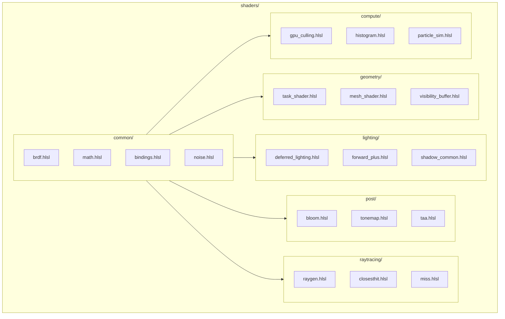
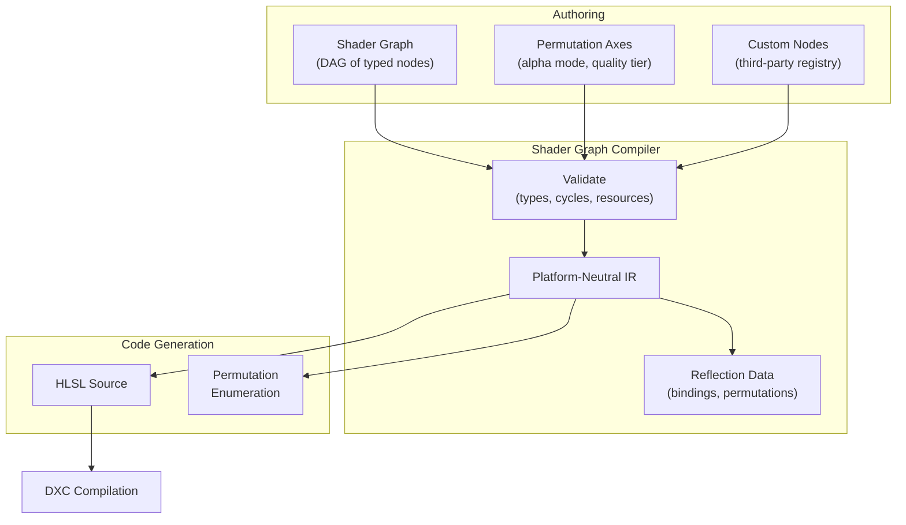
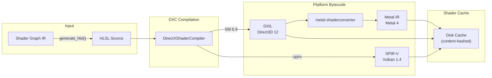
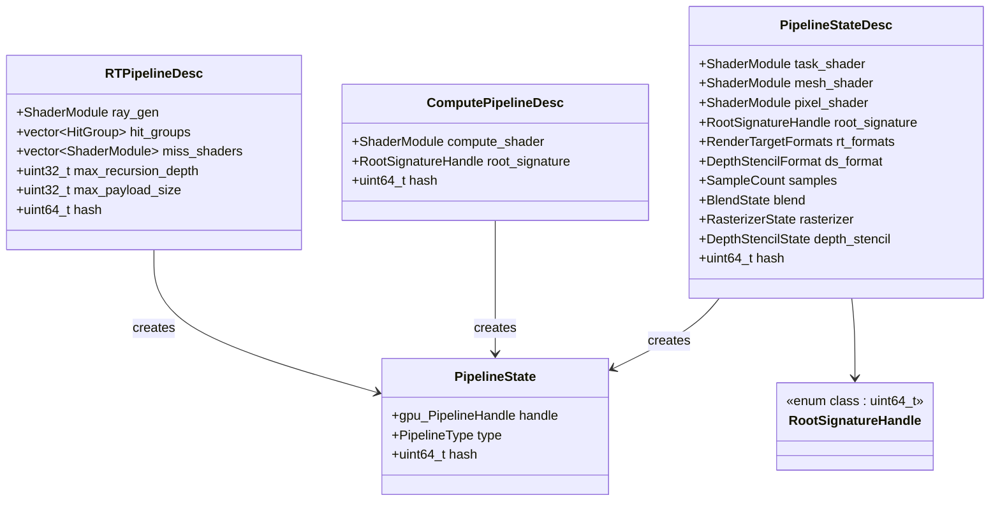
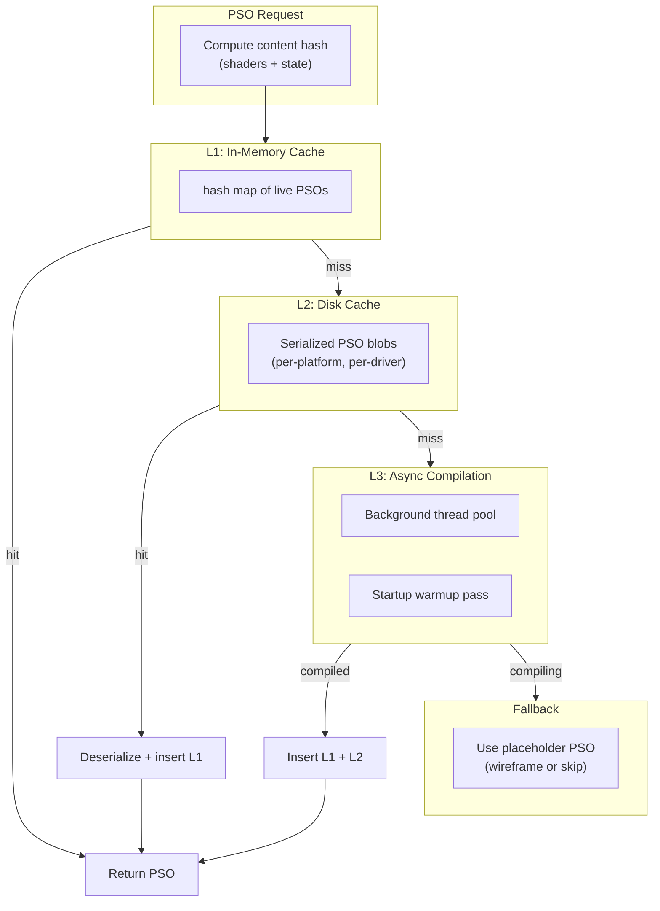
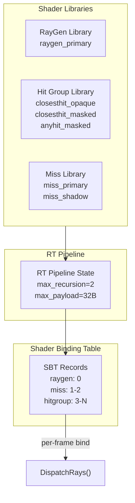
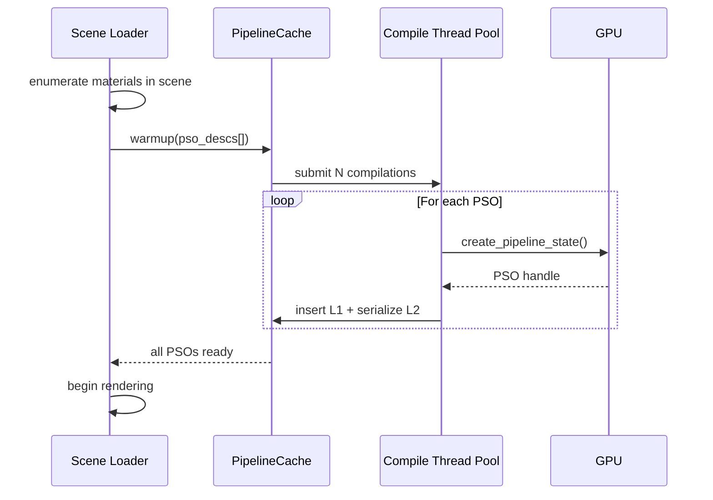
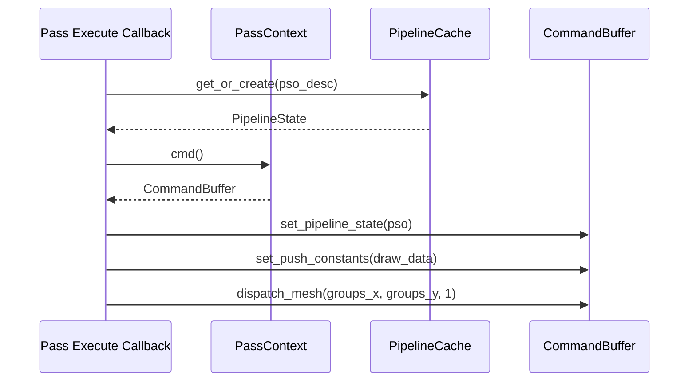

# Shader Pipeline Design

Shader authoring, compilation, linking, caching, and delivery for the Harmonius render graph.
All shaders are authored in HLSL and compiled via DirectXShaderCompiler (DXC) to platform-native
bytecode. Companion to [render-graph-design.md](render-graph-design.md).

**Requirements:** R-2.11.1–R-2.11.11, R-3.3.8 (single shader IR), R-1.1.3 (mesh shaders only),
F-6.1.1–F-6.1.8.

---

## Contents

- [Shader Source Organization](#shader-source-organization)
- [Shader Graph System](#shader-graph-system)
- [Compilation Pipeline](#compilation-pipeline)
- [Permutation Management](#permutation-management)
- [Pipeline State Objects](#pipeline-state-objects)
- [Pipeline State Caching](#pipeline-state-caching)
- [Shader Libraries and Dynamic Linking](#shader-libraries-and-dynamic-linking)
- [Runtime Shader Delivery](#runtime-shader-delivery)
- [Integration with Render Graph](#integration-with-render-graph)

---

## Shader Source Organization

Shaders are organized by domain into HLSL module files. The mesh shader pipeline is the sole
geometry path (R-1.1.3) — no vertex/geometry/tessellation shaders exist.



### Bindless Resource Convention

All shaders use a single global bindless descriptor table (R-2.12.10, F-6.2.9). Resources are
addressed by `uint32_t` index into the heap:

```hlsl
// bindings.hlsl — global bindless root
struct FrameConstants {
    uint scene_buffer_idx;
    uint transform_buffer_idx;
    uint material_buffer_idx;
    uint light_buffer_idx;
    uint residency_map_idx;
    float2 resolution;
    float resolution_scale;
    uint frame_index;
};

ConstantBuffer<FrameConstants> g_frame : register(b0);

// Bindless access pattern
ByteAddressBuffer  LoadBuffer(uint idx)  { return ResourceDescriptorHeap[idx]; }
Texture2D<float4>  LoadTex2D(uint idx)   { return ResourceDescriptorHeap[idx]; }
RWTexture2D<float4> LoadRWTex2D(uint idx) { return ResourceDescriptorHeap[idx]; }
```

---

## Shader Graph System

Material shaders are authored as visual DAGs of typed nodes (R-2.11.1, F-6.1.1) that compile
to HLSL through a platform-neutral intermediate representation.



### Shader Graph Compilation (R-2.11.2)

```cpp
namespace harmonius::shader {

// Shader graph node — the fundamental unit of the graph
struct ShaderNode {
    uint32_t                     node_id;
    std::string_view             type_name;   // e.g., "pbr_base", "noise_3d", "custom_sss"
    std::vector<TypedSlot>       inputs;
    std::vector<TypedSlot>       outputs;
};

struct TypedSlot {
    std::string_view name;
    SlotType         type;  // float, float2, float3, float4, texture_handle, sampler
};

// Permutation axis — compile-time branching
struct PermutationAxis {
    std::string_view             name;     // e.g., "alpha_mode", "quality_tier"
    std::vector<std::string_view> values;  // e.g., {"opaque", "masked", "blended"}
};

// Compiled shader graph — platform-neutral IR
struct ShaderGraphIR {
    std::vector<uint8_t>           bytecode;      // compact binary (R-3.3.9)
    std::vector<PermutationAxis>   permutations;
    std::vector<BindingReflection> bindings;       // reflected resource slots
    uint64_t                       content_hash;   // for cache keying
};

class ShaderGraphCompiler {
public:
    // Validate graph structure (R-2.11.8)
    [[nodiscard]]
    std::expected<void, std::vector<ShaderDiagnostic>> validate(
        const ShaderGraph& graph
    );

    // Compile graph to platform-neutral IR
    [[nodiscard]]
    std::expected<ShaderGraphIR, std::vector<ShaderDiagnostic>> compile(
        const ShaderGraph& graph
    );

    // Lower IR to HLSL source for a specific permutation
    [[nodiscard]]
    std::string generate_hlsl(
        const ShaderGraphIR& ir,
        const PermutationKey& permutation
    );

    // Register custom node types (R-2.11.3)
    void register_node_type(std::string_view name,
                            NodeDescriptor desc,
                            IRLoweringFn lowering_fn);
};

} // namespace harmonius::shader
```

---

## Compilation Pipeline

The full pipeline from HLSL source to GPU-ready bytecode for all three backends.



### ShaderCompiler API

```cpp
namespace harmonius::shader {

enum class ShaderStage : uint8_t {
    task,               // task/amplification shader
    mesh,               // mesh shader
    pixel,              // pixel/fragment shader
    compute,            // compute shader
    ray_generation,     // DXR ray generation
    closest_hit,        // DXR closest hit
    any_hit,            // DXR any hit
    miss,               // DXR miss
    intersection,       // DXR intersection
};

struct ShaderModuleDesc {
    std::string_view   source_path;
    ShaderStage        stage;
    std::string_view   entry_point = "main";
    PermutationKey     permutation;         // compile-time defines
    uint64_t           content_hash;        // for cache lookup
};

// Compiled shader blob — backend-specific bytecode
struct ShaderModule {
    std::vector<uint8_t> bytecode;
    ShaderStage          stage;
    BindingReflection    reflection;
    uint64_t             content_hash;
};

class ShaderCompiler {
public:
    explicit ShaderCompiler(gpu::Backend target_backend);

    // Compile a single shader module
    [[nodiscard]]
    std::expected<ShaderModule, ShaderDiagnostic> compile(
        const ShaderModuleDesc& desc
    );

    // Batch compile multiple modules (parallel)
    [[nodiscard]]
    std::vector<std::expected<ShaderModule, ShaderDiagnostic>> compile_batch(
        std::span<const ShaderModuleDesc> descs
    );

    // Set include search paths
    void add_include_path(std::string_view path);

    // Set global defines applied to all compilations
    void set_global_define(std::string_view name, std::string_view value);
};

} // namespace harmonius::shader
```

---

## Permutation Management

Shader permutations arise from material variants, quality tiers, feature toggles, and platform
differences. Unmanaged, these create a combinatorial explosion. Harmonius controls this through
three strategies.

### Strategy 1: Shader Graph Permutation Axes

Material-level branching declared explicitly in the shader graph (F-6.1.1):

```cpp
namespace harmonius::shader {

// A specific point in the permutation space
struct PermutationKey {
    std::vector<std::pair<std::string_view, std::string_view>> defines;

    [[nodiscard]] uint64_t hash() const;
    [[nodiscard]] bool operator==(const PermutationKey&) const = default;
};

} // namespace harmonius::shader
```

### Strategy 2: Specialization Constants

Runtime-configurable constants that avoid full recompilation:
- **Vulkan:** `VkSpecializationInfo` on pipeline creation
- **D3D12:** Root constants or shader model 6.8 specialization
- **Metal:** Function constants

### Strategy 3: Uber Shaders with Dynamic Branching

For features with low divergence cost, a single shader handles multiple paths via
`FrameConstants` flags:

```hlsl
if (g_frame.flags & FLAG_ENABLE_SSS) {
    color += EvaluateSSS(surface, g_frame.sss_profile_idx);
}
```

### Permutation Budget

| Axis               | Typical values | Source                     |
| ------------------ | -------------- | -------------------------- |
| Alpha mode         | 3              | opaque, masked, blended    |
| Lighting model     | 2              | forward+, deferred         |
| Shadow quality     | 3              | PCF, PCSS, RT              |
| Shading model      | 8              | default, hair, cloth, etc. |
| Quality tier       | 3              | low, medium, high          |

Maximum unique permutations per material: ~430 (3 x 2 x 3 x 8 x 3). With content-hashed
caching, only actually-used permutations are compiled.

---

## Pipeline State Objects

A Pipeline State Object (PSO) bundles shader modules with fixed-function state. PSO creation
is expensive — on the order of milliseconds — so it is done offline or asynchronously.



### Root Signature / Pipeline Layout

A single global root signature serves the entire renderer thanks to bindless (R-2.12.10):

```cpp
namespace harmonius::shader {

// Global root signature — shared by all pipelines
// Slot 0: FrameConstants (CBV, b0)
// Slot 1: Bindless SRV heap (unbounded, t0, space0)
// Slot 2: Bindless UAV heap (unbounded, u0, space0)
// Slot 3: Bindless sampler heap (unbounded, s0, space0)
// Slot 4: Push constants (32 bytes, per-draw data)
struct GlobalRootSignature {
    static constexpr uint32_t frame_constants_slot = 0;
    static constexpr uint32_t srv_heap_slot        = 1;
    static constexpr uint32_t uav_heap_slot        = 2;
    static constexpr uint32_t sampler_heap_slot    = 3;
    static constexpr uint32_t push_constants_slot  = 4;
    static constexpr uint32_t push_constants_size  = 32;
};

} // namespace harmonius::shader
```

---

## Pipeline State Caching

PSO compilation is expensive. Harmonius uses a three-tier caching strategy to eliminate
runtime hitches.



### PipelineCache API

```cpp
namespace harmonius::shader {

class PipelineCache {
public:
    explicit PipelineCache(gpu::Device& device,
                           std::filesystem::path cache_dir);

    // Look up or compile a PSO — returns immediately if cached
    [[nodiscard]]
    PipelineState get_or_create(const PipelineStateDesc& desc);

    [[nodiscard]]
    PipelineState get_or_create(const ComputePipelineDesc& desc);

    [[nodiscard]]
    PipelineState get_or_create(const RTPipelineDesc& desc);

    // Async variant — returns placeholder if not yet compiled
    [[nodiscard]]
    PipelineState get_or_create_async(const PipelineStateDesc& desc);

    // Pre-warm cache during loading screen
    void warmup(std::span<const PipelineStateDesc> descs);
    void warmup(std::span<const ComputePipelineDesc> descs);

    // Serialize cache to disk for next session
    void flush_to_disk();

    // Evict least-recently-used entries
    void evict(uint32_t target_count);

    // Statistics
    [[nodiscard]] uint32_t total_cached() const;
    [[nodiscard]] uint32_t l1_hit_rate() const;
    [[nodiscard]] uint32_t l2_hit_rate() const;
    [[nodiscard]] uint32_t pending_compilations() const;

private:
    struct L1Entry {
        PipelineState  pso;
        uint64_t       last_used_frame;
    };
    std::unordered_map<uint64_t, L1Entry> l1_cache_;
    gpu::Device&                          device_;
    std::filesystem::path                 cache_dir_;
    std::jthread                          compile_thread_;
};

} // namespace harmonius::shader
```

### Disk Cache Format

The disk cache stores pre-compiled PSO blobs keyed by a deterministic content hash:

| Field            | Size     | Description                                       |
| ---------------- | -------- | ------------------------------------------------- |
| Magic            | 4 bytes  | `"HPSO"`                                          |
| Version          | 4 bytes  | Cache format version                              |
| Backend          | 1 byte   | D3D12, Vulkan, or Metal                           |
| Driver hash      | 8 bytes  | Hash of driver version (invalidates on update)    |
| Content hash     | 8 bytes  | Hash of shader bytecodes + pipeline state         |
| Blob size        | 4 bytes  | Size of platform-native PSO blob                  |
| Blob             | variable | `ID3D12PipelineState`, `VkPipelineCache`, Metal archive |

---

## Shader Libraries and Dynamic Linking

### DXR Shader Libraries (Ray Tracing)

Ray tracing pipelines use shader libraries containing multiple entry points that are linked
at pipeline creation time (R-2.5.2):



### Pipeline Libraries (D3D12 / Metal)

Pre-compiled pipeline sub-objects that can be linked without full recompilation:

```cpp
namespace harmonius::shader {

// D3D12: ID3D12PipelineLibrary for caching pipeline sub-objects
// Vulkan: VK_KHR_pipeline_library for partial pipeline objects
// Metal: MTLBinaryArchive for pre-compiled pipeline functions
class PipelineLibrary {
public:
    explicit PipelineLibrary(gpu::Device& device,
                             std::filesystem::path archive_path);

    // Store a compiled PSO into the library
    void store(std::string_view name, const PipelineState& pso);

    // Load a previously stored PSO
    [[nodiscard]]
    std::optional<PipelineState> load(std::string_view name);

    // Serialize library to disk
    void serialize();
};

} // namespace harmonius::shader
```

---

## Runtime Shader Delivery

Optimizations for shader delivery in 2026, targeting zero-hitch rendering.

### Async Pipeline Compilation

All PSO creation runs on background threads. The render graph never blocks on PSO compilation.
If a pass requires a PSO that is not yet ready, the pass is skipped for that frame (treated as
conditionally disabled via RG-1.6).

### Startup Warmup

During loading screens, the pipeline cache pre-compiles all PSOs needed for the first scene:



### GPU Decompression of Shader Bytecode (R-2.12.9)

Shader blobs stored in asset bundles are compressed. A compute pass decompresses them on the
GPU before pipeline creation, reducing disk IO and load times:

```cpp
namespace harmonius::shader {

struct CompressedShaderBlob {
    uint64_t             content_hash;
    uint32_t             compressed_size;
    uint32_t             uncompressed_size;
    std::vector<uint8_t> data;  // zstd-compressed DXIL/SPIR-V/Metal IR
};

} // namespace harmonius::shader
```

### Hot Reloading (Development Only)

In development builds, file watchers detect HLSL changes and trigger async recompilation.
The affected PSOs are replaced at the next frame boundary without pipeline reconstruction:

```cpp
namespace harmonius::shader {

class ShaderHotReloader {
public:
    explicit ShaderHotReloader(ShaderCompiler& compiler,
                               PipelineCache& cache);

    // Start watching shader directories
    void start_watching(std::span<const std::filesystem::path> dirs);

    // Poll for changed shaders and recompile
    // Returns number of PSOs recompiled this frame
    uint32_t poll_and_recompile();
};

} // namespace harmonius::shader
```

---

## Integration with Render Graph

### Pass-to-PSO Binding

Each render graph pass callback receives a `PassContext` that resolves the appropriate PSO
at encoding time. The PSO is looked up by content hash from the pipeline cache:



### Resource Binding Flow

The render graph's `ResourceHandle` is resolved to a bindless descriptor index at encoding
time. Shaders never see `ResourceHandle` — only `uint32_t` indices:


### Shader Permutation Selection

The render graph's variant system (RG-1.4) drives shader permutation selection at compile
time. When a variant slot is selected (e.g., `lighting_model = "deferred"`), the corresponding
shader permutation key is determined and the matching PSO is selected:

| Render Graph Variant Slot | Shader Permutation Axis | Example Values           |
| ------------------------- | ----------------------- | ------------------------ |
| `lighting_model`          | `LIGHTING_MODEL`        | `FORWARD_PLUS`, `DEFERRED` |
| `aa_mode`                 | `AA_MODE`               | `TAA`, `TSR`, `FXAA`    |
| `shadow_quality`          | `SHADOW_QUALITY`        | `PCF`, `PCSS`, `RT`     |
| `hair_quality`            | `HAIR_QUALITY`          | `STRANDS`, `CARDS`, `MESH` |
