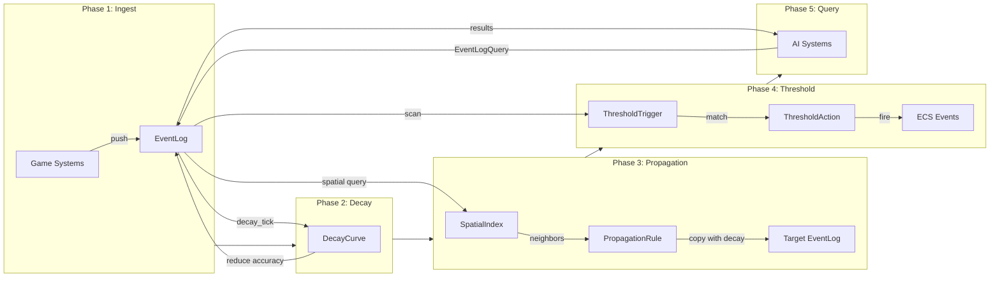

# Event Log Design

## Requirements Trace

> **Canonical sources:** Features, requirements, and user stories are defined in
> [features/](../../features/), [requirements/](../../requirements/), and
> [user-stories/](../../user-stories/). The table below traces design elements to those definitions.

### Bounded Event Log

| Feature    | Requirement |
|------------|-------------|
| F-13.19.3a | R-13.19.3a  |
| F-13.19.3b | R-13.19.3b  |
| F-13.19.6  | R-13.19.6   |

1. **F-13.19.3a** -- Deed memory with emotional weight and time-based decay
2. **F-13.19.3b** -- Gossip propagation with accuracy degradation per hop
3. **F-13.19.6** -- Threat tables with per-ability modifiers and decay

### Non-Functional Requirements

| Requirement  | Target   | Description                      |
|--------------|----------|----------------------------------|
| NFR-13.19.2  | 256 B    | Per-entry memory budget          |
| NFR-SIM.NF3  | < 2 ms   | Decay pass for 1000 logs         |
| NFR-EL.1     | < 0.1 ms | 1000 entries decay               |
| NFR-EL.2     | < 0.5 ms | Propagation to 50 neighbors      |

### Cross-Cutting Dependencies

| Dependency         | Source   | Consumed API               |
|--------------------|----------|-----------------------------|
| ECS world, queries | F-1.1.1  | `Query`, `Entity`           |
| Event channels     | F-1.5.1  | `EventWriter`, `Reader`     |
| Change detection   | F-1.1.22 | `Changed<T>`                |
| Type registry      | F-1.3.1  | `Reflect` derive            |
| Serialization      | F-1.4.1  | Binary/text codecs          |
| Shared spatial idx | F-1.9.1  | Proximity queries           |
| Game clock         | F-13.1.2 | `GameTime` resource         |
| Gameplay databases | F-13.7   | `DataTable`, `RowRef`       |

---

## Overview

A bounded, decaying event memory system. Entities remember events that happened to or near them,
with entries that lose accuracy and eventually expire over time.

### Key Concepts

1. **EventLog\<T\>** -- bounded ring buffer of typed entries with timestamps. Oldest entries are
   evicted when capacity is reached.
2. **DecayingEntry\<T\>** -- an entry whose accuracy degrades over time (starts at 1.0, decays
   toward 0.0 via configurable curve).
3. **PropagationRule** -- defines how entries spread between entities (e.g., NPC tells another NPC
   what happened, with reduced accuracy).
4. **ThresholdTrigger** -- fires an event when the log matches a condition (e.g., "3+ hostile events
   in 60 seconds" triggers an alert).

This replaces NPC memory, gossip systems, threat tables, and combat logs with one generic primitive.

### Design Principles

1. **ECS-primary (~90%)-based.** All state lives in components and resources. No parallel data stores.
2. **Data-driven and no-code.** Definitions are assets authored in visual editors. Users never write
   Rust code.
3. **Genre-agnostic.** No assumptions about game genre. Specific behaviors emerge from composition.
4. **Static dispatch.** Monomorphized generics on hot paths. No trait objects except at editor
   boundaries.
5. **Deterministic.** Identical inputs produce identical outputs.
6. **Immutable definitions.** `DecayCurve` and `PropagationRule` are immutable assets. Runtime state
   is mutable but held in separate components.

### Performance Targets

| Metric                         | Target                |
|--------------------------------|-----------------------|
| 1000 entries decay pass        | < 0.1 ms (NFR-EL.1)  |
| Propagation to 50 neighbors    | < 0.5 ms (NFR-EL.2)  |
| Per-entry memory               | <= 256 B (NFR-13.19.2)|
| Decay pass for 1000 logs       | < 2 ms (NFR-SIM.NF3) |

---

## Architecture

### Class Diagram -- All Event Log Types


---

## API Design

All types derive `Reflect` for serialization and editor integration. Runtime state lives in ECS
components.

### Identity Types

```rust
/// Unique identifier for a single log entry.
#[derive(
    Clone, Copy, Debug, PartialEq, Eq, Hash,
    Reflect,
)]
pub struct EntryId(pub u32);

/// Unique identifier for an event log instance.
#[derive(
    Clone, Copy, Debug, PartialEq, Eq, Hash,
    Reflect,
)]
pub struct EventLogId(pub u32);
```

### Decay Configuration

```rust
/// Shape of the accuracy decay curve.
#[derive(
    Clone, Copy, Debug, PartialEq, Eq, Hash,
    Reflect,
)]
pub enum DecayCurveType {
    /// accuracy -= rate * elapsed_ticks
    Linear,
    /// accuracy *= (1.0 - rate).powf(elapsed)
    Exponential,
    /// accuracy drops to min at threshold tick
    Step,
}

/// Immutable decay configuration. Determines how
/// entry accuracy degrades over time.
#[derive(Clone, Debug, Reflect)]
pub struct DecayCurve {
    /// Decay speed. Interpretation depends on
    /// curve_type. Range: 0.0 ..= 1.0.
    pub rate: f32,
    /// Floor accuracy. Entries at or below this
    /// value are eligible for eviction.
    pub min_accuracy: f32,
    /// Shape of the decay function.
    pub curve_type: DecayCurveType,
}
```

### Entry and Log

```rust
/// A single entry in the event log ring buffer.
/// Target size: <= 256 bytes (NFR-13.19.2).
#[derive(Clone, Debug, Reflect)]
pub struct DecayingEntry<T: Clone + Reflect> {
    /// Unique entry identifier within this log.
    pub id: EntryId,
    /// Typed payload.
    pub data: T,
    /// Game tick when this entry was recorded.
    pub timestamp: u64,
    /// Confidence in this entry's accuracy.
    /// Range: 0.0 ..= 1.0. Starts at 1.0,
    /// decays over time.
    pub accuracy: f32,
    /// Entity that caused this event. None for
    /// environmental events.
    pub source: Option<Entity>,
    /// World position where this event occurred.
    pub position: Option<Vec3>,
    /// Number of propagation hops. 0 = first-hand.
    pub hop_count: u8,
}

/// Bounded ring buffer of typed entries with
/// timestamps. Oldest entries are evicted when
/// capacity is reached.
///
/// ECS component attached to any entity that
/// maintains event memory.
#[derive(Clone, Debug, Reflect)]
pub struct EventLog<T: Clone + Reflect> {
    /// Unique log identifier.
    pub id: EventLogId,
    /// Maximum number of entries.
    pub capacity: u32,
    /// How entries decay over time.
    pub decay_curve: DecayCurve,
    /// How often (in ticks) decay is applied.
    pub tick_rate: u32,
    /// Ring buffer storage.
    entries: Vec<DecayingEntry<T>>,
    /// Write cursor.
    head: usize,
    /// Number of valid entries.
    count: u16,
}

impl<T: Clone + Reflect> EventLog<T> {
    /// Create a new empty log.
    pub fn new(
        id: EventLogId,
        capacity: u32,
        decay: DecayCurve,
        tick_rate: u32,
    ) -> Self;

    /// Push a new entry. If full, the oldest entry
    /// is evicted (ring buffer wrap).
    pub fn push(
        &mut self,
        data: T,
        tick: u64,
        source: Option<Entity>,
        position: Option<Vec3>,
    );

    /// All valid entries in insertion order.
    pub fn entries(
        &self,
    ) -> &[DecayingEntry<T>];

    /// Entries with accuracy above threshold.
    pub fn entries_above_accuracy(
        &self,
        threshold: f32,
    ) -> Vec<&DecayingEntry<T>>;

    /// Entries within a tick window (inclusive).
    pub fn entries_in_window(
        &self,
        from_tick: u64,
        to_tick: u64,
    ) -> Vec<&DecayingEntry<T>>;

    /// Most recently added entry.
    pub fn most_recent(
        &self,
    ) -> Option<&DecayingEntry<T>>;

    /// Apply decay to all entries based on the
    /// configured DecayCurve and current tick.
    pub fn decay_tick(
        &mut self,
        current_tick: u64,
    );

    /// Remove entries below a minimum accuracy.
    pub fn prune_below(
        &mut self,
        min_accuracy: f32,
    );

    /// Number of valid entries.
    pub fn count(&self) -> usize;

    /// True if log is at capacity.
    pub fn is_full(&self) -> bool;

    /// Remove all entries.
    pub fn clear(&mut self);
}
```

### Query

```rust
/// Inclusive tick range for log queries.
#[derive(Clone, Copy, Debug, Reflect)]
pub struct TimeRange {
    pub start: u64,
    pub end: u64,
}

/// Filter criteria for querying entries.
/// All fields are optional; omitted fields
/// match everything.
#[derive(Clone, Debug, Default, Reflect)]
pub struct EventLogQuery {
    /// Filter by event type identifier.
    pub event_type: Option<EventTypeId>,
    /// Filter by tick range (inclusive).
    pub time_range: Option<TimeRange>,
    /// Minimum accuracy threshold.
    pub min_accuracy: Option<f32>,
    /// Filter by source entity.
    pub source: Option<Entity>,
    /// Maximum results. 0 = unlimited.
    pub max_results: u16,
}
```

### Propagation

```rust
/// Defines how entries spread between entities.
/// Immutable configuration attached as a
/// component to propagation-capable entities.
#[derive(Clone, Debug, Reflect)]
pub struct PropagationRule {
    /// Radius in world units for finding
    /// propagation targets via spatial query.
    pub range: f32,
    /// Multiplier applied to accuracy per hop.
    /// Range: 0.0 ..= 1.0. Typically 0.7.
    pub accuracy_multiplier: f32,
    /// Ticks to delay before propagation occurs.
    pub delay_ticks: u32,
    /// Maximum hops before entry stops spreading.
    pub max_hops: u8,
    /// Only propagate entries matching these tags.
    pub filter_tags: TagSet,
}

/// Pure function: propagate eligible entries from
/// source log to target log, applying accuracy
/// decay and hop increment.
///
/// Deduplicates by (data hash, timestamp, source).
pub fn propagate_entries<T: Clone + Reflect>(
    source_log: &EventLog<T>,
    target_log: &mut EventLog<T>,
    rule: &PropagationRule,
    current_tick: u64,
);
```

### Threshold Triggers

```rust
/// Action to take when a threshold is met.
#[derive(Clone, Debug, Reflect)]
pub enum ThresholdAction {
    /// Fire a named ECS event.
    FireEvent(SmolStr),
    /// Apply an effect asset.
    ApplyEffect(AssetId),
    /// Set a gameplay tag on the entity.
    SetTag(GameplayTag),
}

/// Fires an action when the log matches a
/// pattern (count of matching entries within
/// a tick window).
#[derive(Clone, Debug, Reflect)]
pub struct ThresholdTrigger<T: Clone + Reflect> {
    /// Predicate that entries must satisfy.
    pub predicate: fn(&T) -> bool,
    /// Minimum matching entries to trigger.
    pub count: u32,
    /// Tick window to scan (most recent N ticks).
    pub window_ticks: u64,
    /// Action to fire when threshold is met.
    pub action: ThresholdAction,
}

/// Pure function: scan a log against a set of
/// triggers and return all actions that fire.
pub fn check_thresholds<T: Clone + Reflect>(
    log: &EventLog<T>,
    triggers: &[ThresholdTrigger<T>],
    current_tick: u64,
) -> Vec<ThresholdAction>;
```

### ECS Events

```rust
/// Fired when a new entry is added to a log.
#[derive(Clone, Debug, Reflect)]
pub struct LogEntryAdded {
    pub entity: Entity,
    pub entry_id: EntryId,
    pub timestamp: u64,
}

/// Fired when an entry decays below min_accuracy.
#[derive(Clone, Debug, Reflect)]
pub struct LogEntryDecayed {
    pub entity: Entity,
    pub entry_id: EntryId,
    pub final_accuracy: f32,
}

/// Fired when an entry propagates to a new entity.
#[derive(Clone, Debug, Reflect)]
pub struct LogPropagated {
    pub source_entity: Entity,
    pub target_entity: Entity,
    pub entry_id: EntryId,
    pub propagated_accuracy: f32,
}

/// Fired when a threshold trigger matches.
#[derive(Clone, Debug, Reflect)]
pub struct ThresholdFired {
    pub entity: Entity,
    pub fired_action: ThresholdAction,
    pub matched_count: u32,
}
```

---

## Data Flow



### Phase Details

1. **Ingest** -- Game systems (combat, perception, dialogue) push typed events into entity
   `EventLog` components via `EventLog::push`. Each entry records data, tick, source, and position.
2. **Decay** -- `decay_tick` applies the configured `DecayCurve` to all entries. Linear decay
   subtracts a fixed amount per tick. Exponential decay multiplies by `(1.0 - rate)`. Step decay
   drops to `min_accuracy` after a threshold tick count.
3. **Propagation** -- `propagate_entries` uses the shared spatial index (F-1.9.1) to find nearby
   entities with `EventLog` components. Eligible entries are copied with reduced accuracy
   (`accuracy * accuracy_multiplier`) and incremented `hop_count`. Deduplication prevents the same
   entry from being propagated twice.
4. **Threshold** -- `check_thresholds` scans the log for patterns matching `ThresholdTrigger`
   predicates. When `count` or more entries match within `window_ticks`, the corresponding
   `ThresholdAction` fires.
5. **Query** -- AI systems read logs via `EventLogQuery` for decision-making (behavior trees,
   utility AI). Queries filter by type, time range, accuracy, and source.

---

## Platform Considerations

| Platform | Consideration                          |
|----------|----------------------------------------|
| All      | Ring buffer avoids allocation churn    |
| All      | `DecayCurve` is branch-free on Linear  |
| All      | Spatial queries use shared BVH/octree  |
| Windows  | No platform-specific behavior          |
| macOS    | No platform-specific behavior          |
| Linux    | No platform-specific behavior          |

The event log is a pure CPU-side data structure with no platform-specific I/O or GPU dependencies.
All persistence goes through the engine's serialization system (F-1.4.1).

---

## Test Plan

See companion file [event-logs-test-cases.md](event-logs-test-cases.md) for the full test matrix.

### Unit Tests

| Area             | Coverage                           |
|------------------|------------------------------------|
| Push / evict     | Ring buffer wrap, capacity limits  |
| Decay curves     | Linear, Exponential, Step          |
| Accuracy filter  | entries_above_accuracy threshold   |
| Time windows     | entries_in_window boundary cases   |
| Query            | All filter combinations            |
| Prune            | prune_below removes correct set    |

### Integration Tests

| Area             | Coverage                           |
|------------------|------------------------------------|
| Propagation      | Multi-hop accuracy degradation     |
| Deduplication    | Same entry not propagated twice    |
| Threshold        | Pattern detection fires actions    |
| ECS events       | LogEntryAdded, LogEntryDecayed     |

### Benchmarks

| Benchmark                   | Target       | Req        |
|-----------------------------|--------------|------------|
| 1000 entries decay pass     | < 0.1 ms     | NFR-EL.1   |
| Propagation to 50 neighbors | < 0.5 ms     | NFR-EL.2   |
| Per-entry size              | <= 256 B     | NFR-13.19.2|

---

## Open Questions

1. **Entry deduplication strategy** -- Should deduplication use (data hash, timestamp, source) or a
   dedicated `EntryId` propagated across hops?
2. **Parallel decay** -- Should `decay_tick` use scoped parallel iteration (rayon-style) for logs
   with > 100 entries, or is the sequential path sufficient given the < 0.1 ms target?
3. **Predicate serialization** -- `ThresholdTrigger` uses `fn(&T) -> bool` which is not
   serializable. Should predicates be replaced with a data-driven filter DSL for no-code authoring?
4. **Cross-log queries** -- Should `EventLogQuery` support querying across multiple entity logs
   (e.g., "all hostile events witnessed by any NPC in faction X")?
