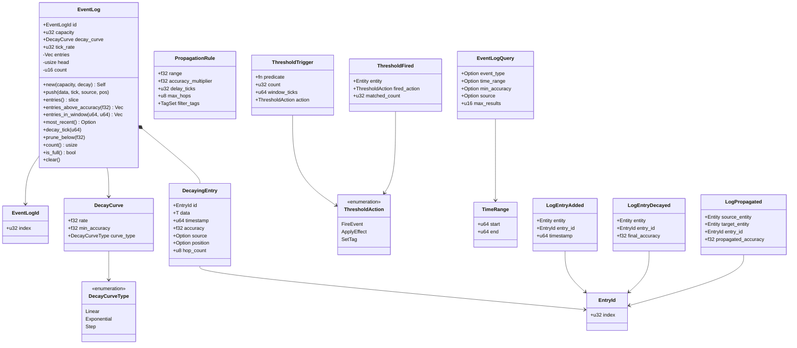
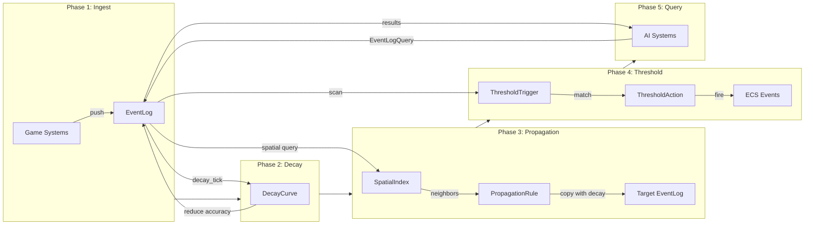

# Event Log Design

## Requirements Trace

> **Canonical sources:** Features, requirements, and user stories are defined in
> [features/](../../features/), [requirements/](../../requirements/), and
> [user-stories/](../../user-stories/). The table below traces design elements to those definitions.

### Engine Primitives (primary trace)

| Feature  | Requirement | User Story | Design Element                   |
|----------|-------------|------------|----------------------------------|
| F-17.1.1 | R-17.1.1    | US-17.1.1  | EventLog<T> bounded primitive    |
| F-17.1.2 | R-17.1.2    | US-17.1.2  | 256 B per-entry memory budget    |
| F-17.1.3 | R-17.1.3    | US-17.1.3  | Decay curves (linear/exp/step)   |
| F-17.1.4 | R-17.1.4    | US-17.1.4  | 1,000 logs decay < 2 ms          |
| F-17.1.5 | R-17.1.5    | US-17.1.5  | Propagation with accuracy loss   |
| F-17.1.6 | R-17.1.6    | US-17.1.6  | 50-neighbor propagate < 0.5 ms   |
| F-17.1.7 | R-17.1.7    | US-17.1.7  | Threshold-triggered events       |
| F-17.1.8 | R-17.1.8    | US-17.1.8  | rkyv save/load round-trip        |

1. **R-17.1.1** -- Generic `EventLog<T>` with capacity, timestamp order, FIFO eviction
2. **R-17.1.2** -- Per-entry memory bounded to 256 B on all platforms
3. **R-17.1.3** -- Decay curves (linear, exponential, step) over accuracy
4. **R-17.1.4** -- Decay pass for 1,000 logs within 2 ms per tick
5. **R-17.1.5** -- Propagation rules with per-hop accuracy loss
6. **R-17.1.6** -- Propagation to 50 nearby neighbors within 0.5 ms
7. **R-17.1.7** -- Threshold triggers (count, time window, event type) fire events
8. **R-17.1.8** -- rkyv serialization with bit-identical round-trip

### Game-Framework Consumers (cross-reference)

| Feature    | Requirement | Consumer Role                                    |
|------------|-------------|--------------------------------------------------|
| F-13.19.3a | R-13.19.3a  | NPC deed memory with emotional weight            |
| F-13.19.3b | R-13.19.3b  | Gossip propagation between NPCs                  |
| F-13.19.6  | R-13.19.6   | Threat tables with per-ability modifiers         |

### Non-Functional Requirements

| Requirement  | Target   | Description                      |
|--------------|----------|----------------------------------|
| NFR-13.19.2  | 256 B    | Per-entry memory budget          |
| NFR-SIM.NF3  | < 2 ms   | Decay pass for 1000 logs         |
| NFR-EL.1     | < 0.1 ms | 1000 entries decay               |
| NFR-EL.2     | < 0.5 ms | Propagation to 50 neighbors      |

### Cross-Cutting Dependencies

| Dependency         | Source   | Consumed API               |
|--------------------|----------|-----------------------------|
| ECS world, queries | F-1.1.1  | `Query`, `Entity`           |
| Event channels     | F-1.5.1  | `EventWriter`, `Reader`     |
| Change detection   | F-1.1.22 | `Changed<T>`                |
| Serialization      | F-1.4.1  | Binary/text codecs          |
| Shared spatial idx | F-1.9.1  | Proximity queries           |
| Game clock         | F-13.1.2 | `GameTime` resource         |
| Gameplay databases | F-13.7   | `DataTable`, `RowRef`       |

---

## Overview

A bounded, decaying event memory system. Entities remember events that happened to or near them,
with entries that lose accuracy and eventually expire over time.

### Key Concepts

1. **EventLog\<T\>** -- bounded ring buffer of typed entries with timestamps. Oldest entries are
   evicted when capacity is reached.
2. **DecayingEntry\<T\>** -- an entry whose accuracy degrades over time (starts at 1.0, decays
   toward 0.0 via configurable curve).
3. **PropagationRule** -- defines how entries spread between entities (e.g., NPC tells another NPC
   what happened, with reduced accuracy).
4. **ThresholdTrigger** -- fires an event when the log matches a condition (e.g., "3+ hostile events
   in 60 seconds" triggers an alert).

This replaces NPC memory, gossip systems, threat tables, and combat logs with one generic primitive.

### Design Principles

1. **ECS-primary (~90%)-based.** All state lives in components and resources. No parallel data
   stores.
2. **Data-driven and no-code.** Definitions are assets authored in visual editors. Users never write
   Rust code.
3. **Genre-agnostic.** No assumptions about game genre. Specific behaviors emerge from composition.
4. **Static dispatch.** Monomorphized generics on hot paths. No trait objects except at editor
   boundaries.
5. **Deterministic.** Identical inputs produce identical outputs.
6. **Immutable definitions.** `DecayCurve` and `PropagationRule` are immutable assets. Runtime state
   is mutable but held in separate components.

### Performance Targets

| Metric                         | Target                |
|--------------------------------|-----------------------|
| 1000 entries decay pass        | < 0.1 ms (NFR-EL.1)  |
| Propagation to 50 neighbors    | < 0.5 ms (NFR-EL.2)  |
| Per-entry memory               | <= 256 B (NFR-13.19.2)|
| Decay pass for 1000 logs       | < 2 ms (NFR-SIM.NF3) |

---

## Architecture

### Class Diagram -- All Event Log Types



---

## API Design

All types derive `rkyv::Archive`/`Serialize`/`Deserialize` for serialization. Editor metadata is
generated by the codegen pipeline in the middleman .dylib. Runtime state lives in ECS components.

### Codegen and hot-reload

User-defined event types (`T` in `EventLog<T>`) are defined visually in the editor and codegen'd
into the middleman .dylib. The codegen pipeline emits:

1. The concrete `T` struct with `rkyv` derives.
2. A `PredicateId` enum variant for every visual filter graph.
3. A function pointer table entry resolving `PredicateId → fn(&ArchivedT) -> bool`.
4. `ThresholdAction` variants for any user-defined actions.
5. `DecayCurveType` variants for user-defined curve shapes.

When a user adds or modifies an event type, the middleman .dylib is recompiled and hot-reloaded. All
`EventLog<T>` instances using the old type are migrated via the rkyv schema migration path. No
runtime reflection, no `TypeRegistry`.

### Identity types

```rust
/// Unique identifier for a single log entry.
#[derive(
    Clone, Copy, Debug, PartialEq, Eq, Hash,
    rkyv::Archive, rkyv::Serialize, rkyv::Deserialize,
)]
pub struct EntryId(pub u32);

/// Unique identifier for an event log instance.
#[derive(
    Clone, Copy, Debug, PartialEq, Eq, Hash,
    rkyv::Archive, rkyv::Serialize, rkyv::Deserialize,
)]
pub struct EventLogId(pub u32);
```

### Decay Configuration

```rust
/// Shape of the accuracy decay curve.
#[derive(
    Clone, Copy, Debug, PartialEq, Eq, Hash,
    rkyv::Archive, rkyv::Serialize, rkyv::Deserialize,
)]
pub enum DecayCurveType {
    /// accuracy -= rate * elapsed_ticks
    Linear,
    /// accuracy *= (1.0 - rate).powf(elapsed)
    Exponential,
    /// accuracy drops to min at threshold tick
    Step,
}

/// Immutable decay configuration. Determines how
/// entry accuracy degrades over time. Baked asset
/// serialized with rkyv.
#[derive(Clone, Debug, rkyv::Archive, rkyv::Serialize, rkyv::Deserialize)]
pub struct DecayCurve {
    /// Decay speed. Interpretation depends on
    /// curve_type. Range: 0.0 ..= 1.0.
    pub rate: f32,
    /// Floor accuracy. Entries at or below this
    /// value are eligible for eviction.
    pub min_accuracy: f32,
    /// Shape of the decay function.
    pub curve_type: DecayCurveType,
}
```

### Entry and Log

```rust
/// A single entry in the event log ring buffer.
/// Target size: <= 256 bytes (NFR-13.19.2).
#[derive(Clone, Debug, rkyv::Archive, rkyv::Serialize, rkyv::Deserialize)]
pub struct DecayingEntry<T: Clone + rkyv::Archive> {
    /// Unique entry identifier within this log.
    pub id: EntryId,
    /// Typed payload.
    pub data: T,
    /// Game tick when this entry was recorded.
    pub timestamp: u64,
    /// Confidence in this entry's accuracy.
    /// Range: 0.0 ..= 1.0. Starts at 1.0,
    /// decays over time.
    pub accuracy: f32,
    /// Entity that caused this event. None for
    /// environmental events.
    pub source: Option<Entity>,
    /// World position where this event occurred.
    /// 2D games set z=0; spatial propagation uses
    /// the 2D or 3D shared BVH as appropriate.
    pub position: Option<Vec3>,
    /// Number of propagation hops. 0 = first-hand.
    pub hop_count: u8,
}

/// Bounded ring buffer of typed entries with
/// timestamps. Oldest entries are evicted when
/// capacity is reached.
///
/// ECS component attached to any entity that
/// maintains event memory.
#[derive(Clone, Debug, rkyv::Archive, rkyv::Serialize, rkyv::Deserialize)]
pub struct EventLog<T: Clone + rkyv::Archive> {
    /// Unique log identifier.
    pub id: EventLogId,
    /// Maximum number of entries.
    pub capacity: u32,
    /// How entries decay over time.
    pub decay_curve: DecayCurve,
    /// How often (in ticks) decay is applied.
    pub tick_rate: u32,
    /// Ring buffer storage.
    entries: Vec<DecayingEntry<T>>,
    /// Write cursor.
    head: usize,
    /// Number of valid entries. Same type as
    /// capacity to avoid widening on comparison.
    count: u32,
}

impl<T: Clone + rkyv::Archive> EventLog<T> {
    /// Create a new empty log.
    pub fn new(
        id: EventLogId,
        capacity: u32,
        decay: DecayCurve,
        tick_rate: u32,
    ) -> Self;

    /// Push a new entry. If full, the oldest entry
    /// is evicted (ring buffer wrap).
    pub fn push(
        &mut self,
        data: T,
        tick: u64,
        source: Option<Entity>,
        position: Option<Vec3>,
    );

    /// All valid entries in insertion order.
    pub fn entries(
        &self,
    ) -> &[DecayingEntry<T>];

    /// Entries with accuracy above threshold.
    /// Returns inline-allocated results; avoids
    /// heap allocation for the common case (< 8).
    pub fn entries_above_accuracy(
        &self,
        threshold: f32,
    ) -> SmallVec<[&DecayingEntry<T>; 8]>;

    /// Entries within a tick window (inclusive).
    pub fn entries_in_window(
        &self,
        from_tick: u64,
        to_tick: u64,
    ) -> SmallVec<[&DecayingEntry<T>; 8]>;

    /// Most recently added entry.
    pub fn most_recent(
        &self,
    ) -> Option<&DecayingEntry<T>>;

    /// Apply decay to all entries based on the
    /// configured DecayCurve and current tick.
    pub fn decay_tick(
        &mut self,
        current_tick: u64,
    );

    /// Remove entries below a minimum accuracy.
    pub fn prune_below(
        &mut self,
        min_accuracy: f32,
    );

    /// Number of valid entries.
    pub fn count(&self) -> usize;

    /// True if log is at capacity.
    pub fn is_full(&self) -> bool;

    /// Remove all entries.
    pub fn clear(&mut self);
}
```

### Query

```rust
/// Inclusive tick range for log queries.
#[derive(Clone, Copy, Debug, rkyv::Archive, rkyv::Serialize, rkyv::Deserialize)]
pub struct TimeRange {
    pub start: u64,
    pub end: u64,
}

/// Opaque index into the codegen'd predicate
/// function pointer table in the middleman .dylib.
/// Authored visually in the editor as a filter
/// graph; compiled to a Rust function by the
/// codegen pipeline. Resolves at hot-reload time.
///
/// Generated filter signature:
/// `fn filter_<name>(entry: &ArchivedDecayingEntry<T>) -> bool`
#[derive(Clone, Copy, Debug, PartialEq, Eq, Hash,
    rkyv::Archive, rkyv::Serialize, rkyv::Deserialize)]
pub struct PredicateId(pub u32);

/// Filter criteria for querying entries.
/// All fields are optional; omitted fields
/// match everything. Filters are authored in
/// the visual editor and compiled to Rust by
/// the codegen pipeline; no runtime interpretation.
#[derive(Clone, Debug, Default, rkyv::Archive, rkyv::Serialize, rkyv::Deserialize)]
pub struct EventLogQuery {
    /// Filter by event type identifier.
    pub event_type: Option<EventTypeId>,
    /// Filter by tick range (inclusive).
    pub time_range: Option<TimeRange>,
    /// Minimum accuracy threshold.
    pub min_accuracy: Option<f32>,
    /// Filter by source entity.
    pub source: Option<Entity>,
    /// Optional codegen'd predicate for complex
    /// filter conditions. None = match all.
    pub predicate: Option<PredicateId>,
    /// Maximum results. 0 = unlimited.
    pub max_results: u16,
}
```

### Propagation

```rust
/// Defines how entries spread between entities.
/// Immutable configuration attached as a
/// component to propagation-capable entities.
/// Baked asset serialized with rkyv.
#[derive(Clone, Debug, rkyv::Archive, rkyv::Serialize, rkyv::Deserialize)]
pub struct PropagationRule {
    /// Radius in world units for finding
    /// propagation targets via spatial query.
    pub range: f32,
    /// Multiplier applied to accuracy per hop.
    /// Range: 0.0 ..= 1.0. Typically 0.7.
    pub accuracy_multiplier: f32,
    /// Ticks to delay before propagation occurs.
    pub delay_ticks: u32,
    /// Maximum hops before entry stops spreading.
    pub max_hops: u8,
    /// Only propagate entries matching these tags.
    pub filter_tags: TagSet,
}

/// Pure function: propagate eligible entries from
/// source log to target log, applying accuracy
/// decay and hop increment.
///
/// Deduplicates by (data hash, timestamp, source).
pub fn propagate_entries<T: Clone + rkyv::Archive>(
    source_log: &EventLog<T>,
    target_log: &mut EventLog<T>,
    rule: &PropagationRule,
    current_tick: u64,
);
```

### Threshold Triggers

```rust
/// Action to take when a threshold is met.
/// Variants are extendable via codegen; see RF-3.
#[derive(Clone, Debug, rkyv::Archive, rkyv::Serialize, rkyv::Deserialize)]
pub enum ThresholdAction {
    /// Fire a named ECS event.
    FireEvent(SmolStr),
    /// Apply an effect asset.
    ApplyEffect(AssetId),
    /// Set a gameplay tag on the entity.
    SetTag(GameplayTag),
}

/// Fires an action when the log matches a
/// pattern (count of matching entries within
/// a tick window). Predicates are codegen'd
/// into the middleman .dylib; see RF-4.
#[derive(Clone, Debug, rkyv::Archive, rkyv::Serialize, rkyv::Deserialize)]
pub struct ThresholdTrigger<T: Clone + rkyv::Archive> {
    /// Codegen'd predicate identifier. Indexes
    /// into the function pointer table in the
    /// middleman .dylib.
    pub predicate: PredicateId,
    /// Minimum matching entries to trigger.
    pub count: u32,
    /// Tick window to scan (most recent N ticks).
    pub window_ticks: u64,
    /// Action to fire when threshold is met.
    pub action: ThresholdAction,
}

/// Pure function: scan a log against a set of
/// triggers and return all actions that fire.
/// Inline-allocated for <= 4 results; avoids
/// heap allocation in the common case.
pub fn check_thresholds<T: Clone + rkyv::Archive>(
    log: &EventLog<T>,
    triggers: &[ThresholdTrigger<T>],
    current_tick: u64,
) -> SmallVec<[ThresholdAction; 4]>;
```

### ECS Events

```rust
/// Fired when a new entry is added to a log.
#[derive(Clone, Debug, rkyv::Archive, rkyv::Serialize, rkyv::Deserialize)]
pub struct LogEntryAdded {
    pub entity: Entity,
    pub entry_id: EntryId,
    pub timestamp: u64,
}

/// Fired when an entry decays below min_accuracy.
#[derive(Clone, Debug, rkyv::Archive, rkyv::Serialize, rkyv::Deserialize)]
pub struct LogEntryDecayed {
    pub entity: Entity,
    pub entry_id: EntryId,
    pub final_accuracy: f32,
}

/// Fired when an entry propagates to a new entity.
#[derive(Clone, Debug, rkyv::Archive, rkyv::Serialize, rkyv::Deserialize)]
pub struct LogPropagated {
    pub source_entity: Entity,
    pub target_entity: Entity,
    pub entry_id: EntryId,
    pub propagated_accuracy: f32,
}

/// Fired when a threshold trigger matches.
#[derive(Clone, Debug, rkyv::Archive, rkyv::Serialize, rkyv::Deserialize)]
pub struct ThresholdFired {
    pub entity: Entity,
    pub fired_action: ThresholdAction,
    pub matched_count: u32,
}
```

---

## Data Flow



### Phase details

| Phase | Game loop stage | Arena scope |
|-------|----------------|-------------|
| Ingest | `PostUpdate` | — |
| Decay | `SimulationDecay` (or `FixedUpdate` if tick-rate-aligned) | Allocated |
| Propagation | `SimulationDecay` | Allocated |
| Threshold | `SimulationDecay` | Allocated |
| Query | On-demand from consuming systems | Allocated |
| Arena reset | Frame boundary, after Query phase | Reset |

1. **Ingest** -- `PostUpdate`. Game systems (combat, perception, dialogue) push typed events into
   entity `EventLog` components via `EventLog::push`. Each entry records data, tick, source, and
   position. No arena use; pushes go directly into the ring buffer.
2. **Decay** -- `SimulationDecay` stage. `decay_tick` applies the configured `DecayCurve` to all
   entries. Linear decay subtracts a fixed amount per tick. Exponential decay multiplies by
   `(1.0 - rate)`. Step decay drops to `min_accuracy` after a threshold tick count.
   `LogEntryDecayed` events are buffered and flushed at stage end.
3. **Propagation** -- `SimulationDecay` stage, after Decay. `propagate_entries` uses the shared
   spatial index (F-1.9.1) to find nearby entities with `EventLog` components. Eligible entries are
   copied with reduced accuracy (`accuracy * accuracy_multiplier`) and incremented `hop_count`.
   Propagation scratch buffers allocate from the per-thread arena. `LogPropagated` events are
   buffered and flushed at stage end. Deduplication prevents the same entry propagating twice.
4. **Threshold** -- `SimulationDecay` stage, after Propagation. `check_thresholds` scans the log for
   patterns matching `ThresholdTrigger` predicates. When `count` or more entries match within
   `window_ticks`, the corresponding `ThresholdAction` fires. `ThresholdFired` events are buffered
   and flushed at stage end.
5. **Query** -- On-demand from consuming systems (AI behavior trees, utility AI, UI, analytics).
   Query result slices allocate from the per-thread arena. Results are valid until the arena resets
   at the frame boundary after the Query phase completes.

---

## Algorithm references

| Algorithm | URL |
|-----------|-----|
| Ring buffer (circular buffer) | <https://en.wikipedia.org/wiki/Circular_buffer> |
| Exponential decay / half-life | <https://en.wikipedia.org/wiki/Exponential_decay> |
| Gossip / epidemic propagation | <https://www.cs.cornell.edu/home/rvr/papers/flowgossip.pdf> |
| Sliding-window threshold detection | <https://dl.acm.org/doi/10.1145/3461837> |

---

## Platform considerations

The event log is a pure CPU-side data structure with no platform-specific I/O or GPU dependencies.
All persistence goes through the engine's serialization system (F-1.4.1).

| Platform | Consideration |
|----------|---------------|
| All | Ring buffer avoids allocation churn |
| All | `DecayCurve` is branch-free on Linear |
| All | Spatial queries use 2D or 3D shared BVH |
| All | Per-thread arenas reset at frame boundary |
| Windows | No platform-specific behavior |
| macOS | No platform-specific behavior |
| Linux | No platform-specific behavior |
| iOS | Reduce default ring buffer capacity on memory-constrained devices |
| Android | Reduce default ring buffer capacity on memory-constrained devices |
| Consoles | No platform-specific behavior; standard CPU-only data structure |

1. **iOS / Android.** Memory budgets may require smaller default `capacity` values (e.g., 64 vs 256
   entries per log). Capacity is a data-driven parameter, not a compile-time constant, so no code
   path changes are needed.
2. **Consoles.** No special handling; all subsystems use the same pure-Rust CPU path.
3. **Serialization.** rkyv zero-copy mmap is used on all platforms via the platform I/O layer
   (io_uring on Linux, IOCP on Windows, GCD dispatch_io on Apple).

---

## Test Plan

See companion file [event-logs-test-cases.md](./event-logs-test-cases.md) for the full test matrix.

### Unit Tests

| Area             | Coverage                           |
|------------------|------------------------------------|
| Push / evict     | Ring buffer wrap, capacity limits  |
| Decay curves     | Linear, Exponential, Step          |
| Accuracy filter  | entries_above_accuracy threshold   |
| Time windows     | entries_in_window boundary cases   |
| Query            | All filter combinations            |
| Prune            | prune_below removes correct set    |

### Integration Tests

| Area             | Coverage                           |
|------------------|------------------------------------|
| Propagation      | Multi-hop accuracy degradation     |
| Deduplication    | Same entry not propagated twice    |
| Threshold        | Pattern detection fires actions    |
| ECS events       | LogEntryAdded, LogEntryDecayed     |

### Benchmarks

| Benchmark                   | Target       | Req        |
|-----------------------------|--------------|------------|
| 1000 entries decay pass     | < 0.1 ms     | NFR-EL.1   |
| Propagation to 50 neighbors | < 0.5 ms     | NFR-EL.2   |
| Per-entry size              | <= 256 B     | NFR-13.19.2|

---

## Open Questions

1. **Entry deduplication strategy** -- Should deduplication use (data hash, timestamp, source) or a
   dedicated `EntryId` propagated across hops?
2. **Parallel decay** -- Should `decay_tick` use scoped parallel iteration (rayon-style) for logs
   with > 100 entries, or is the sequential path sufficient given the < 0.1 ms target?
3. **Predicate serialization** -- `ThresholdTrigger` uses `fn(&T) -> bool` which is not
   serializable. Should predicates be replaced with a data-driven filter DSL for no-code authoring?
4. **Cross-log queries** -- Should `EventLogQuery` support querying across multiple entity logs
   (e.g., "all hostile events witnessed by any NPC in faction X")?

## Review feedback

### RF-1: Remove all Reflect derives and TypeRegistry

Remove `Reflect` from all types. Remove `Type registry | F-1.3.1` from dependencies. Replace generic
`T: Reflect` bounds with `T: Archive + Serialize` (rkyv). Editor metadata via codegen in the
middleman .dylib.

### RF-2: rkyv serialization

Derive `rkyv::Archive`/`Serialize`/`Deserialize` on all types. Document that `DecayCurve` and
`PropagationRule` are baked assets serialized with rkyv. Remove Reflect-based serialization.

### RF-3: Codegen for user-defined event types

User-defined event types (`T` in `EventLog<T>`) are codegen'd into the middleman .dylib.
`ThresholdAction` variants and `DecayCurveType` are extendable via codegen. Document hot-reload of
new event types.

### RF-4: Codegen'd query predicates (resolve open question #3)

Resolve open question #3: predicates are authored visually in the editor as filter graphs, compiled
to Rust functions by the codegen pipeline, and shipped in the middleman .dylib. Replace
`fn(&T) -> bool` with a codegen'd predicate identifier indexing into a function pointer table in the
middleman. Same "everything is Rust" architecture.

### RF-5: Codegen'd EventLogQuery filters

`EventLogQuery` filters are authored in the visual editor and compiled to Rust via the codegen
pipeline. No runtime interpretation. The generated filter function signature:
`fn filter_<query_name>(entry: &ArchivedDecayingEntry<T>) -> bool`

### RF-6: Create companion test cases file

Create `event-logs-test-cases.md` with TC-IDs in `TC-X.Y.Z.N` format. Map every R-X.Y.Z requirement
to explicit test cases.

### RF-7: Cross-subsystem integration table

#### Producers (systems that write to event logs)

| Subsystem | Event types | Mechanism |
|-----------|------------|-----------|
| Combat | Damage, heal, kill, death, crit, block, dodge | System writes to attacker + defender logs |
| Spatial awareness | Entity detected/lost, awareness transitions | AwarenessTransitionEvent → entity log |
| Containers/inventory | Item pickup, drop, equip, trade, destroy | TransferEvent → entity log |
| Quest system | Objective complete, quest accept/abandon/complete | Quest state transition → entity log |
| Dialogue | Conversation choices, NPC lines spoken | Dialogue node exit → NPC + player logs |
| Economy | Gold gain/loss, buy/sell, auction, crafting cost | Transaction event → entity log |
| Chat | Player messages, system messages, whispers | Chat event → channel log + player log |
| Physics | Significant collisions, destruction, env kills | CollisionEvent (above threshold) → log |
| AI decisions | Behavior state transitions, utility scores | AI tick → NPC log (debug + memory) |
| Social | Friend add, guild join, party form, report | Social event → player log |
| Authentication | Login/logout, session duration, daily reward | Session event → player log |
| Movement | Zone transitions, death locations, teleports | Zone change → entity log |
| Achievement | Milestone reached, unlock triggers | Achievement event → player log |
| Animation | Notable montage events (for combat timing) | AnimationEvent → entity log |
| Audio/dialogue | VO lines played (subtitle history) | VO cue → entity log |
| Editor | Undo/redo, property edits (audit trail) | EditorCommand → session log |
| VFX | Notable visual events (for replay) | VFX spawn → entity log |
| Crafting | Items crafted, materials consumed, recipe found | Craft event → entity log |

#### Consumers (systems that read from event logs)

| Subsystem | Query | Mechanism |
|-----------|-------|-----------|
| UI — combat log | Recent damage/healing feed | EventLogQuery with combat type filter |
| UI — chat window | Message history per channel | EventLogQuery with channel filter |
| UI — quest journal | Progress timeline per quest | EventLogQuery with quest ID filter |
| UI — death recap | Damage sources in last N seconds | Time-windowed EventLogQuery on player log |
| UI — damage meter | DPS/HPS sliding window | Aggregation query (sum damage / time window) |
| UI — activity feed | Recent achievements, loot | EventLogQuery sorted by time, limit N |
| AI — NPC memory | "I saw you kill the guard" | EventLogQuery by NPC entity + event type |
| AI — faction reputation | Aggregated event scores | ThresholdTrigger on faction-tagged events |
| AI — threat assessment | Historical threat data | EventLogQuery with decay-weighted scoring |
| NPC dialogue | NPCs reference past events | Dialogue condition queries NPC's event log |
| NPC schedules | Adjust behavior from world events | EventLogQuery on shop/world entity logs |
| Achievement system | Check history for conditions | ThresholdTrigger ("kill 100 with fire") |
| Tutorial system | Track player actions for hints | EventLogQuery for first-time actions |
| Replay system | Reconstruct game state | Sequential drain of deterministic event log |
| Anti-cheat | Detect anomalous patterns | ThresholdTrigger for impossible values |
| Moderation | Chat history for reports | EventLogQuery on reported player's log |
| Networking | Replicate logs to clients | Server delta sync of relevant entries |
| Save system | Persist across sessions | rkyv serialization of ring buffer state |
| Leaderboard | Aggregate performance metrics | Cross-entity aggregation query |
| Economy balancing | Inflation, sink/faucet ratios | Aggregation query across economy logs |
| Bug reporting | Attach recent history to reports | Time-windowed drain of player log |
| Data tables | Event type schema definitions | Event types defined as table rows |
| Analytics/telemetry | Player behavior export | Batch drain to analytics pipeline |
| Heatmaps | Death locations, time-spent maps | Spatial aggregation of position-tagged events |

### RF-8: Game loop phase and frame-boundary handoff

Map phases: Ingest in PostUpdate, Decay/Propagation/Threshold in a dedicated SimulationDecay stage
(or FixedUpdate if tick-rate-aligned). Query runs on-demand from consuming systems. Document that
arena resets happen after Query phase completes. Specify when events cross phase boundaries.

### RF-9: 2D support

`position: Option<Vec3>` — either make generic or document that 2D games use `Vec3` with z=0.
Spatial propagation queries use the appropriate 2D or 3D shared BVH.

### RF-10: SmallVec for query and threshold results

Replace `Vec<&DecayingEntry<T>>` with `SmallVec<[&DecayingEntry<T>; 8]>`. Replace
`Vec<ThresholdAction>` with `SmallVec<[ThresholdAction; 4]>`.

### RF-11: Per-thread arenas

Query result slices and propagation scratch buffers allocate from per-thread arenas. Arenas reset at
frame boundary after Query phase.

### RF-12: Expand platform considerations

Add iOS, Android, consoles. Note memory constraints may require smaller ring buffer capacities on
mobile. Confirm pure CPU, no platform-specific code.

### RF-13: Algorithm reference URLs

Add URLs for: ring buffer design, exponential decay / half-life curves, gossip/epidemic propagation
protocols, sliding-window threshold detection.

### RF-14: Replace "rayon-style" with custom job system

Rephrase open question #2: "scoped parallel iteration via the custom job system (`par_iter` /
`scope`)" — not Rayon.

### RF-15: Fix count/capacity type mismatch

Make `count: u32` to match `capacity: u32`, or cap capacity at `u16::MAX` and use `u16` for both.

### RF-16: Fix heading case

Convert all title-case headings to sentence case.

### RF-17: Event logs are a data layer, not a display layer

Event logs are a persistent queryable data store. They are NOT displayed directly. Display is owned
by consuming systems:

- Floating combat text → UI framework (`FloatingCombatText`, F-10.3.5)
- Chat window → UI framework (`ChatSystem`, F-10.3.8)
- Combat log feed → UI framework (HUD widget)
- Quest journal → UI framework (quest tracker widget)
- Death recap → UI framework (HUD widget)
- NPC dialogue references → dialogue system queries NPC's event log
- Editor event inspector → editor tools (debug panel)
- Analytics dashboards → backend services
- Moderation tools → backend services

The event log design defines three interfaces only:

1. **Write API** — how systems log events (`EventLog::push`)
2. **Query API** — how systems read/filter events (`EventLogQuery`, `ThresholdTrigger`,
   time-windowed queries, aggregation)
3. **Export API** — how external systems drain events (batch drain to analytics pipeline, delta sync
   for networking)

Display formatting, widget layout, and visual presentation belong in the UI framework design, not
here. The UI framework should cross-reference the event log query API as its data source.

### RF-18: Event logs do NOT drive 3D gameplay indicators

Quest markers, loot sparkles, status effect VFX, and other 3D gameplay indicators are NOT event log
display. They are gameplay entities driven by authoritative game state:

- Quest markers → driven by `GraphTraversalState` (directed-graphs.md)
- Loot sparkles → driven by item state (containers-slots.md)
- Status VFX → driven by active effects (attributes-effects.md)
- Detection icons → driven by `AwarenessState` (spatial-awareness.md)

Event logs record that these state changes happened (for history, analytics, NPC memory) but do not
own the visual indicators. See vfx/effects.md RF-26 for the visual indicator VFX design.
