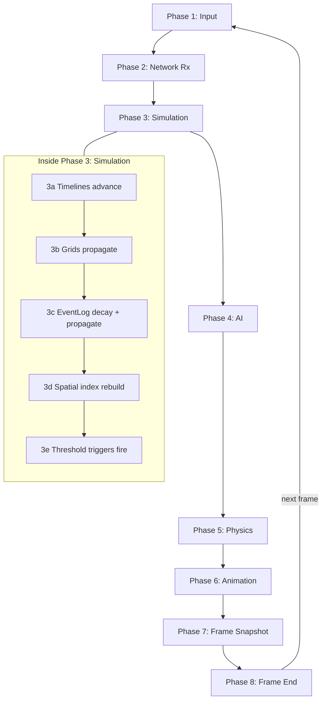
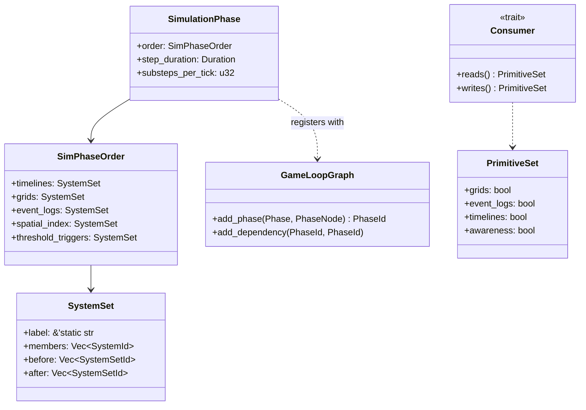
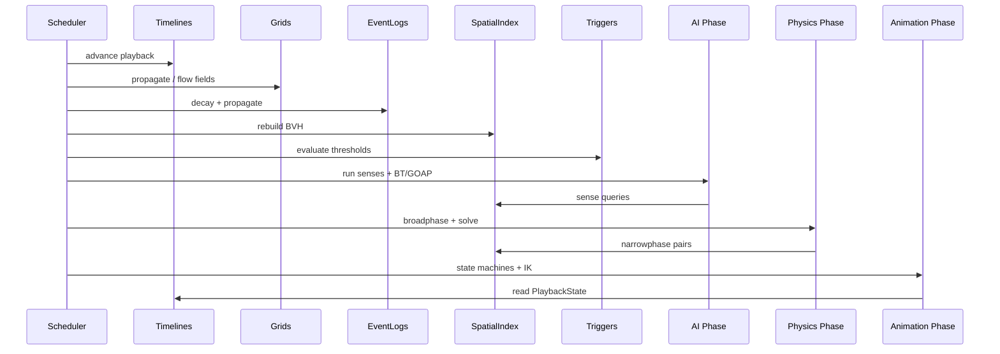

# Simulation Game Loop Phases Design

## Requirements Trace

> **Canonical sources:** Features, requirements, and user stories live in
> [features/](../../features/), [requirements/](../../requirements/), and
> [user-stories/](../../user-stories/). This document is a cross-reference overlay on the
> authoritative game loop design in [core-runtime/game-loop.md](../core-runtime/game-loop.md); it
> does not introduce new primitives.

### Primary Requirements

| Feature     | Requirement  | User Story   | Design Element                       |
|-------------|--------------|--------------|--------------------------------------|
| F-1.1.2     | R-1.1.2      | US-1.1.2     | Simulation phase dependency overlay  |
| F-17.1.1    | R-17.1.1     | US-17.1.1    | EventLog phase placement             |
| F-17.2.1    | R-17.2.1     | US-17.2.1    | Grid / volume phase placement        |
| F-17.3.1    | R-17.3.1     | US-17.3.1    | SpatialAwareness phase placement     |
| F-17.4.1    | R-17.4.1     | US-17.4.1    | Timeline phase placement             |
| F-1.1.22    | R-1.1.22     | US-1.1.22    | Change detection at phase boundaries |

1. **R-1.1.2** -- Fixed-timestep simulation stage that deterministically advances primitives
2. **R-17.1.1** -- Event logs decay and propagate as part of the simulation stage
3. **R-17.2.1** -- Grids and volumes propagate and sample during simulation
4. **R-17.3.1** -- Spatial awareness queries run after simulation state is settled
5. **R-17.4.1** -- Timeline playback advances before animation blending runs
6. **R-1.1.22** -- Change detection fires at phase boundaries so dependents see stable data

### Cross-Cutting Dependencies

| Dependency      | Consumed API                    |
|-----------------|---------------------------------|
| Game loop       | `Phase`, `CompiledFrame`        |
| Event logs      | `EventLog<T>` update systems    |
| Grids / volumes | Propagation and sampling systems|
| Spatial aware   | `SenseQuery`, `PerceptionState` |
| Timelines       | `PlaybackState` advance         |
| Physics         | Broadphase / narrowphase        |
| AI              | BT/GOAP evaluators              |
| Animation       | State machines, IK              |

1. **Game loop** -- [game-loop.md](../core-runtime/game-loop.md)
2. **Event logs** -- [event-logs.md](event-logs.md)
3. **Grids / volumes** -- [grids-volumes.md](grids-volumes.md)
4. **Spatial aware** -- [spatial-awareness.md](spatial-awareness.md)
5. **Timelines** -- [timelines.md](timelines.md)
6. **Physics** -- [physics/](../physics/)
7. **AI** -- [ai/](../ai/)
8. **Animation** -- [animation/](../animation/)

---

## Overview

Harmonius has four simulation primitives that most subsystems build on: **grids/volumes**,
**spatial awareness**, **timelines**, and **event logs**. Individually they are documented in their
own design files. This document clarifies **where each one runs in the frame pipeline** and
**which primitives depend on which**, so subsystem designers can reason about ordering without
re-reading every file.

The authoritative source of truth for phase definitions is
[core-runtime/game-loop.md](../core-runtime/game-loop.md). This document overlays a simulation
primitive ordering on top of that base pipeline.

### Design Principles

1. **One canonical phase list** -- this doc does not invent new phases; it refines existing ones
2. **Explicit ordering** -- every primitive has a fixed slot; ad-hoc reordering is forbidden
3. **Deterministic** -- fixed-timestep simulation produces bit-identical state per tick
4. **Producer-before-consumer** -- a primitive that feeds another runs first in the same phase
5. **Change detection as the bridge** -- downstream subsystems read `Changed<T>` after the phase
6. **Variable-step phases read the latest fixed-step snapshot** -- no peeking mid-tick
7. **Shared spatial index** -- BVH / octree built once per tick, reused by every consumer

---

## Architecture

### Master Phase Order with Primitives



### Dependency Matrix

| Primitive          | Produces                          | Consumed by                     |
|--------------------|-----------------------------------|---------------------------------|
| Timelines          | `Changed<PlaybackState>`          | Animation, Camera, VFX          |
| Grids / volumes    | `Changed<GridCell>`, flow fields  | AI, Spatial awareness, Physics  |
| Event logs         | Decayed entries, threshold events | AI, Gameplay logic              |
| Spatial awareness  | `PerceptionState`, sense hits     | AI, Gameplay logic              |
| Shared spatial idx | BVH / octree per tick             | Physics, Spatial awareness, VFX |

1. **Timelines** -- reads playback deltas and scheduled events each tick
2. **Grids / volumes** -- reads blocker data and source entities each tick
3. **Event logs** -- reads timestamped entries and per-entry decay curves
4. **Spatial awareness** -- reads scene transforms, grid state, and blocker colliders
5. **Shared spatial idx** -- reads `Changed<Transform>` across dynamic entities

### Why This Order

1. **Timelines first** -- downstream systems need to see the new `PlaybackState` before they react
2. **Grids next** -- propagation steps consume `Changed<GridCell>` from block placement
3. **Event logs after grids** -- propagation reads grid proximity for gossip-like rules
4. **Spatial index rebuild** -- happens after grids settle so BVH reflects new blockers
5. **Threshold triggers last** -- they read all prior simulation state to decide what fires

### Phase-to-Primitive Matrix

| Phase             | Primitive activity                                                |
|-------------------|-------------------------------------------------------------------|
| 1 Input           | None (drain OS events)                                            |
| 2 Network Rx      | None (apply remote state)                                         |
| 3 Simulation      | Timelines, grids/volumes, event logs, spatial index rebuild       |
| 4 AI              | Spatial awareness queries, BT/GOAP, nav                           |
| 5 Physics         | Broadphase uses shared index; solve, destruction                  |
| 6 Animation       | State machines, IK; reads timeline playback state                 |
| 7 Frame Snapshot  | Build RenderFrame; VFX snapshot reads latest grids and timelines  |
| 8 Frame End       | Flush metrics, rotate logs, save hooks                            |

### Class Diagram



---

## API Design

### System Set Registration

```rust
#[derive(SystemSetLabel)]
pub enum SimSet {
    TimelinesAdvance,
    GridsPropagate,
    EventLogsUpdate,
    SpatialIndexRebuild,
    ThresholdTriggers,
}

pub fn configure_simulation_order(app: &mut AppBuilder) {
    app.configure_sets(
        Phase::Simulation,
        (
            SimSet::TimelinesAdvance,
            SimSet::GridsPropagate,
            SimSet::EventLogsUpdate,
            SimSet::SpatialIndexRebuild,
            SimSet::ThresholdTriggers,
        )
            .chain(),
    );
}
```

### Primitive System Registration

Each primitive registers systems into a single set:

```rust
pub fn timelines_plugin(app: &mut AppBuilder) {
    app.add_systems(
        Phase::Simulation,
        (advance_playback, apply_tracks, emit_keyframe_events)
            .in_set(SimSet::TimelinesAdvance),
    );
}

pub fn grids_plugin(app: &mut AppBuilder) {
    app.add_systems(
        Phase::Simulation,
        (propagate_influence, compute_flow_fields, sample_gpu_upload)
            .in_set(SimSet::GridsPropagate),
    );
}

pub fn event_logs_plugin(app: &mut AppBuilder) {
    app.add_systems(
        Phase::Simulation,
        (decay_entries, propagate_neighbors, check_thresholds)
            .in_set(SimSet::EventLogsUpdate),
    );
}

pub fn spatial_awareness_plugin(app: &mut AppBuilder) {
    app.add_systems(
        Phase::AiUpdate,
        (run_sense_queries, update_perception_state),
    );
}
```

Spatial awareness sits in Phase 4 (AiUpdate), not Phase 3, because it reads from the freshly rebuilt
spatial index at the end of Phase 3.

### Change Detection Contract

```rust
/// Marker inserted when a primitive's tick completes a state change.
#[derive(Component, Copy, Clone)]
pub struct PrimitiveTickCompleted(pub PrimitiveId);

pub enum PrimitiveId {
    Timeline,
    Grid,
    EventLog,
    SpatialIndex,
}
```

Downstream consumers query `Query<(&PlaybackState, Changed<PlaybackState>), ...>` and similar change
filters. The engine guarantees that within a single tick, no system in a later set sees a
half-updated state.

---

## Data Flow



---

## Fixed vs Variable Timestep

| Phase            | Timestep | Reason                                         |
|------------------|----------|------------------------------------------------|
| 1 Input          | Variable | User-driven event rate                         |
| 2 Network Rx     | Variable | Packet-driven                                  |
| 3 Simulation     | Fixed    | Determinism across peers and replays           |
| 4 AI             | Fixed    | Reads simulation state; must be deterministic  |
| 5 Physics        | Fixed    | Integration stability and networking           |
| 6 Animation      | Variable | Interpolates between fixed-tick states         |
| 7 Frame Snapshot | Variable | Produces per-frame RenderFrame snapshot        |
| 8 Frame End      | Variable | Bookkeeping                                    |

Variable-step phases read the most recent fixed-step state directly, plus an interpolation alpha
from `FixedTimestep::alpha()`.

---

## Platform Considerations

| Platform | Notes                                                          |
|----------|----------------------------------------------------------------|
| Desktop  | Worker count tuned to perf cores; full simulation budget       |
| Mobile   | Substeps reduced; grid resolution clamped; telemetry throttled |
| Console  | Fixed frame budget enforced by the cert rate lock              |
| Editor   | Phases pausable individually for frame stepping and debugging  |

The editor adds a `PhaseInspector` tool that pauses or single-steps any phase without breaking
determinism — it uses `CompiledFrame::step_phase(Phase)` which advances one set at a time.

---

## Test Plan

See [game-loop-phases-test-cases.md](game-loop-phases-test-cases.md) for TC entries:

- Unit tests for system set registration and order
- Integration tests verifying primitive interactions across a full frame
- Benchmarks for the combined simulation phase budget

---

## Open Questions

1. Should grids propagation and event log propagation run on parallel job scopes?
2. How do we expose per-set frame budgets in the profiler without perturbing ordering?
3. Is the order of `SimSet::GridsPropagate` vs `EventLogsUpdate` safe to swap for games that only
   use event logs and not grids?
4. Do we need a dedicated `PreSimulation` substage for games that spawn entities each tick?
