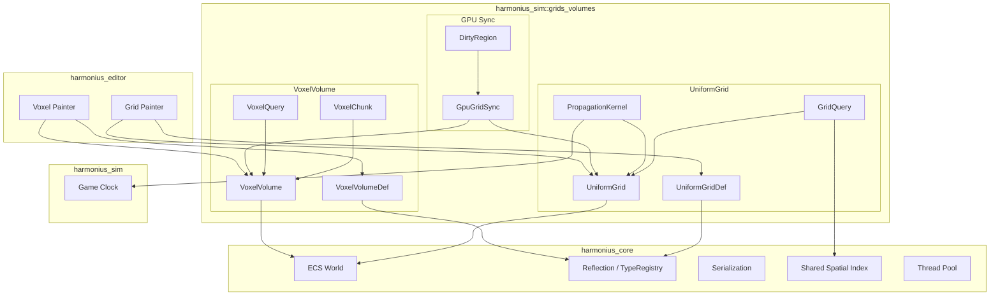
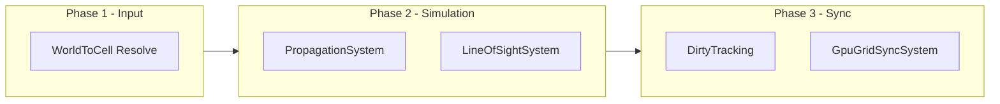
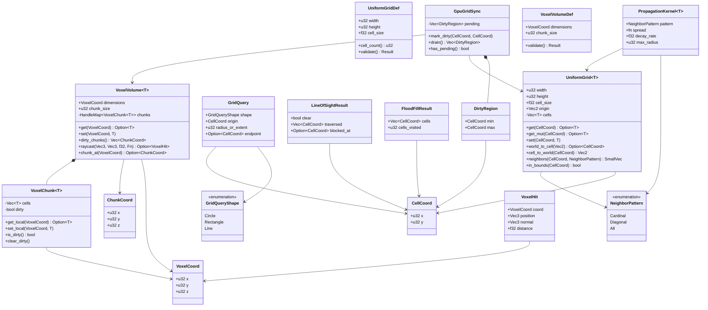
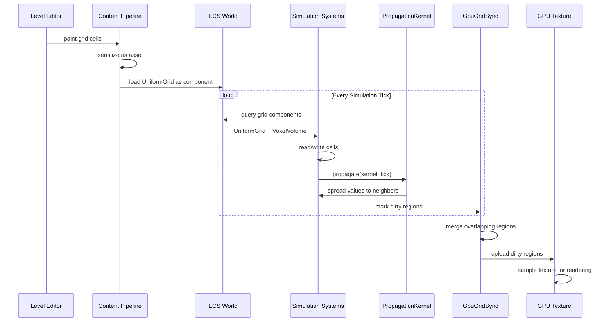
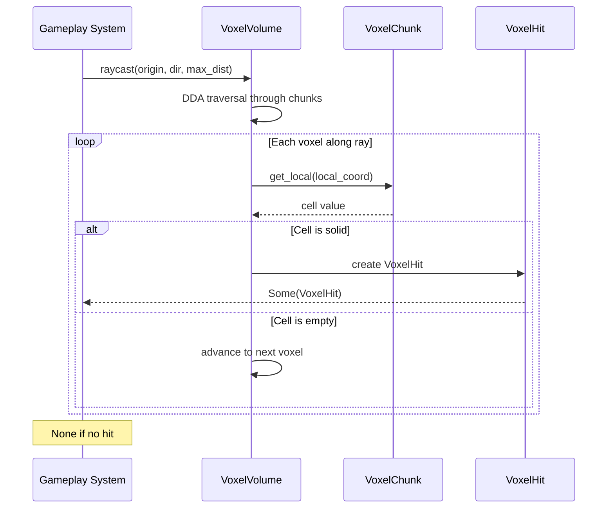

# Grids and Volumes Design

## Requirements Trace

> **Canonical sources:** Features, requirements, and user stories are defined in
> [features/](../../features/), [requirements/](../../requirements/), and
> [user-stories/](../../user-stories/). The table below traces design elements to those definitions.

### Fog of War Grids (F-13.20.1--4)

| Feature   | Requirement |
|-----------|-------------|
| F-13.20.1 | R-13.20.1   |
| F-13.20.2 | R-13.20.2   |
| F-13.20.3 | R-13.20.3   |
| F-13.20.4 | R-13.20.4   |

1. **F-13.20.1** -- Grid-based visibility with 3-state cells and GPU fog texture
2. **F-13.20.2** -- Vision sources with sight radius, shape, and LOS blocking
3. **F-13.20.3** -- Vision modifier volumes (stealth zones, smoke, high ground)
4. **F-13.20.4** -- Fog memory with last-seen snapshots

### Tactical Grids (F-13.21.1, F-13.21.4)

| Feature   | Requirement |
|-----------|-------------|
| F-13.21.1 | R-13.21.1   |
| F-13.21.4 | R-13.21.4   |

1. **F-13.21.1** -- Tactical grid (square/hex) with cover, elevation, occupancy
2. **F-13.21.4** -- Grid cover, flanking, and overwatch stance

### Voxel Blocks (F-13.27.1--3)

| Feature   | Requirement |
|-----------|-------------|
| F-13.27.1 | R-13.27.1   |
| F-13.27.2 | R-13.27.2   |
| F-13.27.3 | R-13.27.3   |

1. **F-13.27.1** -- Block type registry with O(1) lookup
2. **F-13.27.2** -- Block placement and destruction via raycast
3. **F-13.27.3** -- Chunk-based block storage with palette compression

### AI Perception Grids (F-7.6.8)

| Feature | Requirement |
|---------|-------------|
| F-7.6.8 | R-7.6.8     |

1. **F-7.6.8** -- Scent trails stored in spatial grid with decay and wind propagation

### Non-Functional Requirements

| Requirement   | Target   | Description                    |
|---------------|----------|--------------------------------|
| NFR-SIM.GV1   | < 1 ms   | 256x256 propagation per tick   |
| NFR-SIM.GV2   | < 0.01ms | Single LOS ray (128 cells)     |
| NFR-SIM.GV3   | < 0.5 ms | Flood fill (256x256, r=64)     |
| NFR-SIM.GV4   | < 2 ms   | Voxel raycast (512 steps)      |
| NFR-SIM.GV5   | < 1 ms   | GPU dirty region upload        |

### Cross-Cutting Dependencies

| Dependency       | Source   | Consumed API               |
|------------------|----------|----------------------------|
| ECS world        | F-1.1.1  | Archetype storage, `Query` |
| Change detection | F-1.1.22 | `Changed<T>` dirty track   |
| Reflection       | F-1.3.1  | `Reflect` derive           |
| Serialization    | F-1.4.1  | Binary/text codecs         |
| Spatial index    | F-1.9.1  | World-space proximity      |
| Thread pool      | F-14.3.1 | Scoped parallel iteration  |
| Data tables      | F-13.7.2 | Cell type definitions      |
| Game clock       | F-13.1.2 | `GameTime` for tick rate   |

---

## Overview

This document defines generic typed grid and volume primitives for spatial simulation. These
primitives are building blocks that higher-level systems compose into game-specific behaviors. The
design is intentionally free of genre assumptions.

Three primitives:

1. **UniformGrid\<T\>** -- 2D grid with typed cells. Fixed cell size, axis-aligned. Supports fog of
   war, tactical maps, height fields, scent grids, and influence maps. Provides GPU texture sync for
   rendering overlays.
2. **VoxelVolume\<T\>** -- 3D voxel grid with typed cells. Chunk-based storage for block worlds,
   density fields, and wind volumes. Supports LOD and dirty tracking.
3. **PropagationKernel\<T\>** -- Defines how values spread across grid cells per tick. Handles fire
   spread, scent trails, influence maps, and fluid simulation.

### Design Principles

1. **ECS-primary (~90%)-based.** All grids are components. No parallel data stores or manager singletons.
2. **Data-driven and no-code.** Cell types defined via data tables. Users author grids in visual
   editors.
3. **Genre-agnostic.** `T` is user-defined. The grid knows nothing about fog, blocks, or scent.
4. **Immutable definitions, mutable state.** Grid dimensions and cell size are immutable. Cell
   values are mutable.
5. **No `Arc`, `Rc`, `Cell`, `RefCell`.** Owned values and generational indices only.
6. **Static dispatch.** Monomorphized generics on all hot paths. No trait objects.
7. **Deterministic.** Identical inputs produce identical outputs. Propagation order is explicit.

### Performance Targets

| Metric                         | Target             |
|--------------------------------|--------------------|
| Propagation (256x256)          | < 1 ms (GV1)      |
| Line of sight (128 cells)      | < 0.01 ms (GV2)   |
| Flood fill (256x256, r=64)     | < 0.5 ms (GV3)    |
| Voxel raycast (512 steps)      | < 2 ms (GV4)      |
| GPU dirty region upload        | < 1 ms (GV5)      |

---

## Architecture

### Module Boundaries



### File Layout

```text
harmonius_sim/
├── grids_volumes/
│   ├── mod.rs              # Re-exports
│   ├── coord.rs            # CellCoord, VoxelCoord,
│   │                       # ChunkCoord
│   ├── uniform_grid/
│   │   ├── definition.rs   # UniformGridDef
│   │   ├── grid.rs         # UniformGrid<T>
│   │   ├── query.rs        # GridQuery, GridQueryShape,
│   │   │                   # FloodFillResult
│   │   ├── los.rs          # line_of_sight,
│   │   │                   # LineOfSightResult
│   │   └── propagation.rs  # PropagationKernel<T>
│   ├── voxel/
│   │   ├── definition.rs   # VoxelVolumeDef
│   │   ├── volume.rs       # VoxelVolume<T>
│   │   ├── chunk.rs        # VoxelChunk<T>
│   │   └── raycast.rs      # VoxelHit, DDA traversal
│   ├── gpu_sync.rs         # GpuGridSync, DirtyRegion
│   └── plugin.rs           # GridsVolumesPlugin
```

### System Execution Order



### Class Diagram -- All Types



---

## API Design

All types derive `Reflect` for serialization and editor integration. Definitions are immutable
assets. Runtime state lives in ECS components.

### 1. Coordinates

```rust
/// 2D cell coordinate in a uniform grid.
#[derive(
    Clone, Copy, Debug, PartialEq, Eq, Hash,
    Reflect,
)]
pub struct CellCoord {
    pub x: u32,
    pub y: u32,
}

/// 3D voxel coordinate in a volume.
#[derive(
    Clone, Copy, Debug, PartialEq, Eq, Hash,
    Reflect,
)]
pub struct VoxelCoord {
    pub x: u32,
    pub y: u32,
    pub z: u32,
}

/// Chunk-level coordinate within a VoxelVolume.
#[derive(
    Clone, Copy, Debug, PartialEq, Eq, Hash,
    Reflect,
)]
pub struct ChunkCoord {
    pub x: u32,
    pub y: u32,
    pub z: u32,
}
```

### 2. UniformGrid Definition

```rust
/// Immutable definition for a 2D uniform grid.
/// Authored in the visual editor, stored as an
/// asset in gameplay databases (F-13.7.2).
#[derive(Clone, Debug, Reflect)]
pub struct UniformGridDef {
    /// Width in cells.
    pub width: u32,
    /// Height in cells.
    pub height: u32,
    /// World-space size of each cell in units.
    pub cell_size: f32,
}

impl UniformGridDef {
    /// Total number of cells.
    pub fn cell_count(&self) -> u32 {
        self.width * self.height
    }

    /// Validate dimensions are non-zero and
    /// cell_size is positive.
    pub fn validate(
        &self,
    ) -> Result<(), GridValidationError>;
}
```

### 3. UniformGrid\<T\>

```rust
/// Runtime 2D grid with typed cells. Attached as
/// an ECS component to world entities.
///
/// T must be Clone + Default + Reflect.
/// Storage is a flat Vec<T> in row-major order.
#[derive(Clone, Debug, Reflect)]
pub struct UniformGrid<T> {
    /// Width in cells.
    pub width: u32,
    /// Height in cells.
    pub height: u32,
    /// World-space size of each cell.
    pub cell_size: f32,
    /// World-space origin (bottom-left corner).
    pub origin: Vec2,
    /// Flat cell storage. Length = width * height.
    cells: Vec<T>,
}

impl<T: Default + Clone + Reflect> UniformGrid<T> {
    /// Create a grid initialized to T::default().
    pub fn new(
        width: u32,
        height: u32,
        cell_size: f32,
        origin: Vec2,
    ) -> Self;

    /// Get an immutable reference to a cell.
    /// Returns None if out of bounds.
    pub fn get(
        &self,
        coord: CellCoord,
    ) -> Option<&T>;

    /// Get a mutable reference to a cell.
    /// Returns None if out of bounds.
    pub fn get_mut(
        &mut self,
        coord: CellCoord,
    ) -> Option<&mut T>;

    /// Set a cell value. Panics if out of bounds.
    pub fn set(
        &mut self,
        coord: CellCoord,
        value: T,
    );

    /// Convert world-space position to cell coord.
    /// Returns None if position is outside grid.
    pub fn world_to_cell(
        &self,
        world_pos: Vec2,
    ) -> Option<CellCoord>;

    /// Convert cell coord to world-space center.
    pub fn cell_to_world(
        &self,
        coord: CellCoord,
    ) -> Vec2;

    /// Return neighbor coords for a given pattern.
    /// Excludes out-of-bounds neighbors.
    pub fn neighbors(
        &self,
        coord: CellCoord,
        pattern: NeighborPattern,
    ) -> SmallVec<[CellCoord; 8]>;

    /// Check if a coordinate is within bounds.
    pub fn in_bounds(
        &self,
        coord: CellCoord,
    ) -> bool;

    /// Grid dimensions as (width, height).
    pub fn dimensions(&self) -> (u32, u32);

    /// Bresenham line-of-sight from source to
    /// target. Returns detailed result with
    /// traversed cells and blocking point.
    pub fn line_of_sight(
        &self,
        from: CellCoord,
        to: CellCoord,
        blocked: impl Fn(&T) -> bool,
    ) -> LineOfSightResult;

    /// BFS flood fill from start. Returns all
    /// reachable cells where passable returns true.
    pub fn flood_fill(
        &self,
        start: CellCoord,
        passable: impl Fn(&T) -> bool,
    ) -> FloodFillResult;

    /// Return all cell coords within radius of a
    /// world-space center. Uses squared distance.
    pub fn area_query(
        &self,
        center: Vec2,
        radius: f32,
    ) -> Vec<CellCoord>;

    /// Apply one tick of propagation using the
    /// given kernel. Mutates cells in place.
    pub fn propagate(
        &mut self,
        kernel: &PropagationKernel<T>,
        tick: u64,
    );

    /// Linearize a coordinate to flat index.
    fn coord_to_index(
        &self,
        coord: CellCoord,
    ) -> usize {
        (coord.y * self.width + coord.x) as usize
    }
}
```

### 4. Neighbor Pattern and Query Types

```rust
/// Which neighbors to consider for propagation
/// and adjacency queries.
#[derive(
    Clone, Copy, Debug, PartialEq, Eq, Hash,
    Reflect,
)]
pub enum NeighborPattern {
    /// 4 neighbors: N, E, S, W.
    Cardinal,
    /// 4 neighbors: NE, SE, SW, NW.
    Diagonal,
    /// All 8 neighbors.
    All,
}

/// Shape of a grid query region.
#[derive(
    Clone, Copy, Debug, PartialEq, Eq, Hash,
    Reflect,
)]
pub enum GridQueryShape {
    /// Circle with radius in cells.
    Circle,
    /// Axis-aligned rectangle with half-extents.
    Rectangle,
    /// Line from origin to endpoint (Bresenham).
    Line,
}

/// A spatial query against grid cells.
#[derive(Clone, Debug, Reflect)]
pub struct GridQuery {
    /// Shape of the query region.
    pub shape: GridQueryShape,
    /// Center of the query.
    pub origin: CellCoord,
    /// Radius (Circle) or half-extent (Rectangle).
    pub radius_or_extent: u32,
    /// Endpoint for Line queries.
    pub endpoint: Option<CellCoord>,
}

/// Result of a line-of-sight check.
#[derive(Clone, Debug, Reflect)]
pub struct LineOfSightResult {
    /// True if the line is unobstructed.
    pub clear: bool,
    /// All cells traversed along the line.
    pub traversed: Vec<CellCoord>,
    /// First cell that blocked the line, if any.
    pub blocked_at: Option<CellCoord>,
}

/// Result of a flood fill operation.
#[derive(Clone, Debug, Reflect)]
pub struct FloodFillResult {
    /// All reachable cells.
    pub cells: Vec<CellCoord>,
    /// Total cells visited (including rejected).
    pub cells_visited: u32,
}
```

### 5. PropagationKernel\<T\>

```rust
/// Defines how values spread across grid cells
/// per simulation tick. Immutable configuration.
///
/// The spread function takes (source, neighbor)
/// and returns the new neighbor value. Pure
/// function with no side effects.
#[derive(Clone, Debug, Reflect)]
pub struct PropagationKernel<T> {
    /// Which neighbors receive propagated values.
    pub pattern: NeighborPattern,
    /// Pure spread function: (source, neighbor)
    /// -> new neighbor value.
    pub spread: fn(&T, &T) -> T,
    /// Per-step decay multiplier (0.0..=1.0).
    /// Applied after spread.
    pub decay_rate: f32,
    /// Maximum propagation radius in cells.
    /// Limits BFS depth from each source.
    pub max_radius: u32,
}
```

### 6. VoxelVolume Definition

```rust
/// Immutable definition for a 3D voxel volume.
/// Authored in the visual editor.
#[derive(Clone, Debug, Reflect)]
pub struct VoxelVolumeDef {
    /// Total dimensions in voxels.
    pub dimensions: VoxelCoord,
    /// Size of each chunk in voxels per axis.
    /// Chunks are always cubic.
    pub chunk_size: u32,
}

impl VoxelVolumeDef {
    /// Number of chunks along each axis.
    pub fn chunk_counts(&self) -> ChunkCoord;

    /// Total number of chunks.
    pub fn total_chunks(&self) -> u32;

    /// Validate dimensions are multiples of
    /// chunk_size and chunk_size is non-zero.
    pub fn validate(
        &self,
    ) -> Result<(), VolumeValidationError>;
}
```

### 7. VoxelVolume\<T\> and VoxelChunk\<T\>

```rust
/// Runtime 3D voxel volume with chunk-based
/// storage. Attached as an ECS component.
///
/// Uses HandleMap for chunk storage with
/// generational indices. No Arc or Rc.
#[derive(Clone, Debug, Reflect)]
pub struct VoxelVolume<T> {
    /// Total dimensions in voxels.
    pub dimensions: VoxelCoord,
    /// Chunk size in voxels per axis.
    pub chunk_size: u32,
    /// Chunk storage indexed by ChunkCoord.
    chunks: HandleMap<VoxelChunk<T>>,
}

impl<T: Default + Clone + Reflect> VoxelVolume<T> {
    /// Get an immutable reference to a voxel.
    /// Returns None if out of bounds.
    pub fn get(
        &self,
        coord: VoxelCoord,
    ) -> Option<&T>;

    /// Set a voxel value. Marks the containing
    /// chunk as dirty for GPU sync.
    pub fn set(
        &mut self,
        coord: VoxelCoord,
        value: T,
    );

    /// Return coords of all dirty chunks.
    pub fn dirty_chunks(&self) -> Vec<ChunkCoord>;

    /// Clear dirty flags on all chunks.
    pub fn clear_dirty(&mut self);

    /// DDA raycast through the volume. Returns
    /// the first voxel where solid returns true.
    pub fn raycast(
        &self,
        origin: Vec3,
        dir: Vec3,
        max_dist: f32,
        solid: impl Fn(&T) -> bool,
    ) -> Option<VoxelHit>;

    /// Convert a voxel coord to its chunk coord.
    pub fn chunk_at(
        &self,
        coord: VoxelCoord,
    ) -> Option<ChunkCoord>;

    /// Check if a voxel coord is within bounds.
    pub fn in_bounds(
        &self,
        coord: VoxelCoord,
    ) -> bool;
}

/// A single chunk within a VoxelVolume. Stores
/// cells in a flat Vec<T> of size chunk_size^3.
#[derive(Clone, Debug, Reflect)]
pub struct VoxelChunk<T> {
    /// Flat cell storage in x-y-z order.
    cells: Vec<T>,
    /// True if any cell was modified since last
    /// GPU sync.
    dirty: bool,
}

impl<T: Default + Clone + Reflect> VoxelChunk<T> {
    /// Get a cell by local coordinate within
    /// this chunk.
    pub fn get_local(
        &self,
        local: VoxelCoord,
    ) -> Option<&T>;

    /// Set a cell by local coordinate. Marks
    /// the chunk as dirty.
    pub fn set_local(
        &mut self,
        local: VoxelCoord,
        value: T,
    );

    /// Whether this chunk has pending changes.
    pub fn is_dirty(&self) -> bool;

    /// Clear the dirty flag after GPU upload.
    pub fn clear_dirty(&mut self);
}
```

### 8. VoxelHit

```rust
/// Result of a voxel raycast.
#[derive(Clone, Debug, Reflect)]
pub struct VoxelHit {
    /// Voxel coordinate that was hit.
    pub coord: VoxelCoord,
    /// World-space hit position on voxel face.
    pub position: Vec3,
    /// Face normal of the hit surface.
    pub normal: Vec3,
    /// Distance from ray origin to hit point.
    pub distance: f32,
}
```

### 9. GpuGridSync

```rust
/// Tracks dirty regions for GPU texture upload.
/// Attached as a component alongside grids that
/// need rendering (fog overlays, terrain maps).
#[derive(Clone, Debug, Reflect)]
pub struct GpuGridSync {
    /// Pending dirty regions to upload.
    pending: Vec<DirtyRegion>,
}

impl GpuGridSync {
    /// Mark a rectangular region as dirty.
    /// Merges overlapping regions.
    pub fn mark_dirty(
        &mut self,
        min: CellCoord,
        max: CellCoord,
    );

    /// Drain all pending regions for upload.
    /// Returns the regions and clears the list.
    pub fn drain(&mut self) -> Vec<DirtyRegion>;

    /// Whether there are pending uploads.
    pub fn has_pending(&self) -> bool;
}

/// A rectangular dirty region in cell space.
#[derive(Clone, Copy, Debug, Reflect)]
pub struct DirtyRegion {
    /// Minimum corner (inclusive).
    pub min: CellCoord,
    /// Maximum corner (inclusive).
    pub max: CellCoord,
}
```

### 10. Systems

```rust
/// System that runs propagation kernels on all
/// grids that have an attached PropagationKernel.
/// Runs in Phase 2 (Simulation).
pub fn propagation_system<T>(
    time: Res<GameTime>,
    mut query: Query<(
        &mut UniformGrid<T>,
        &PropagationKernel<T>,
    )>,
);

/// System that uploads dirty grid regions to
/// GPU textures. Runs in Phase 3 (Sync).
pub fn gpu_grid_sync_system(
    mut query: Query<(
        &mut GpuGridSync,
        Changed<GpuGridSync>,
    )>,
    mut gpu: ResMut<GpuTextureManager>,
);
```

---

## Data Flow

### Grid Simulation Lifecycle



### Voxel Raycast



### Data Flow Summary

1. Grid authored in level editor (painted cells)
2. Serialized as asset via `Reflect` + binary codec
3. Loaded as ECS component on world entity
4. Systems read/write cells each simulation tick
5. `PropagationKernel` runs during Phase 2 (Simulation)
6. `GpuGridSync` uploads dirty regions to GPU texture during Phase 3 (Sync)
7. Rendering samples grid texture for fog, overlays, and debug visualization

---

## Platform Considerations

| Concern        | Approach                             |
|----------------|--------------------------------------|
| Serialization  | `Reflect` + binary (F-1.3)           |
| Networking     | Dirty-cell bitset delta sync         |
| GPU upload     | Structured buffer for texture gen    |
| Memory layout  | Flat `Vec<T>` for cache locality     |
| Threading      | Read-only queries safe for parallel  |
| Save/load      | All grid state serialized via ECS    |
| Hot reload     | Definitions reloaded; state kept     |
| Mobile         | Reduce grid capacity via config      |

### Memory Budget

| Primitive               | Calculation         | Budget |
|-------------------------|---------------------|--------|
| Fog grid (256x256, u8)  | 256 x 256 x 1 B    | 64 KB  |
| Fog grid (1024x1024)    | 1024 x 1024 x 1 B  | 1 MB   |
| Tactical grid (64x64)   | 64 x 64 x 4 B      | 16 KB  |
| Scent grid (128x128)    | 128 x 128 x 4 B    | 64 KB  |
| Voxel chunk (16^3, u16) | 4096 x 2 B         | 8 KB   |
| Voxel world (256^3)     | 16^3 chunks x 8 KB | 32 MB  |

### Networking

- **UniformGrid** uses dirty-cell tracking. Modified cells are collected into a delta bitset per
  frame and sent to clients. Full sync on join.
- **VoxelVolume** tracks dirty chunks. Only modified chunks are replicated. Palette compression
  reduces bandwidth for homogeneous chunks.
- **Propagation** is deterministic. Given the same kernel and initial state, all clients produce
  identical results. Only initial state and kernel parameters need replication.

---

## Test Plan

Full test cases are in [grids-volumes-test-cases.md](grids-volumes-test-cases.md).

### Unit Tests

| Area                       | Coverage            |
|----------------------------|---------------------|
| `UniformGrid::get/set`     | Valid, OOB, edges   |
| `world_to_cell`            | Inside, outside     |
| `cell_to_world`            | All corners         |
| `neighbors` Cardinal       | Interior, edge      |
| `neighbors` All            | Corner, center      |
| `line_of_sight`            | Clear, blocked      |
| `flood_fill`               | Open, walled, full  |
| `area_query`               | Within, partial     |
| `propagate`                | Decay, max_radius   |
| `VoxelVolume::get/set`     | Valid, OOB          |
| `VoxelVolume::raycast`     | Hit, miss, edge     |
| `VoxelChunk` dirty flag    | Set on write, clear |
| `GpuGridSync` merge        | Overlap, adjacent   |
| `CellCoord` equality       | Same, different     |

### Integration Tests

| Area                       | Coverage            |
|----------------------------|---------------------|
| Grid + ECS component       | Spawn, query, mutate|
| Grid + spatial index       | World-space lookup  |
| Grid + propagation + clock | Multi-tick spread   |
| Volume + chunk lifecycle   | Create, dirty, sync |
| Grid + serialization       | Round-trip save     |
| GPU sync end-to-end        | Dirty to texture    |

### Benchmarks

| Benchmark                  | Target              |
|----------------------------|---------------------|
| propagate_256x256          | < 1 ms (GV1)       |
| line_of_sight_128          | < 0.01 ms (GV2)    |
| flood_fill_256x256_r64     | < 0.5 ms (GV3)     |
| voxel_raycast_512          | < 2 ms (GV4)       |
| gpu_sync_dirty_upload      | < 1 ms (GV5)       |
| area_query_1024x1024_r32   | < 1 ms             |

---

## Open Questions

1. **Palette compression.** Should `VoxelChunk<T>` support palette compression at the primitive
   level, or should that be a higher-level optimization?
2. **Async large queries.** For grids larger than 1024x1024, should flood fill and A* pathfinding be
   async to avoid stalling the game loop?
3. **Hex grid support.** Should `UniformGrid<T>` support hexagonal cell layouts natively, or should
   hex be a separate primitive?
4. **Propagation scheduling.** Should propagation kernels support sub-tick rates (e.g., every 4th
   frame) to amortize cost across frames?
5. **LOD for VoxelVolume.** Should chunks store multiple LOD levels, or should LOD be handled by a
   separate system that reads chunk data?
