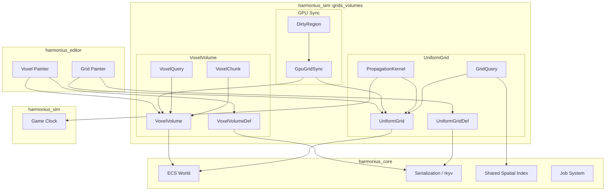
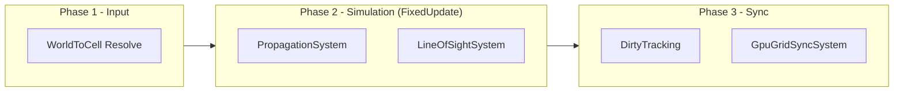
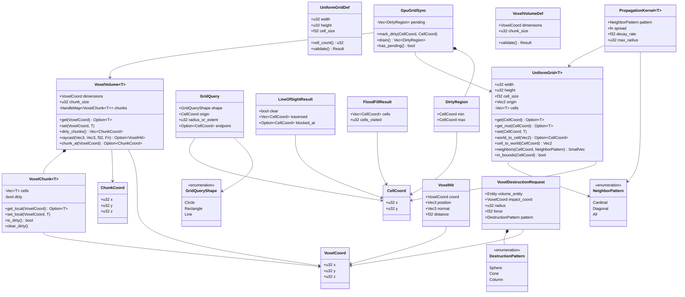
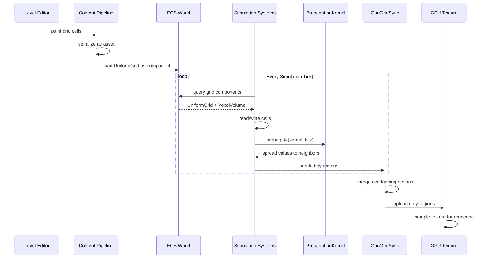
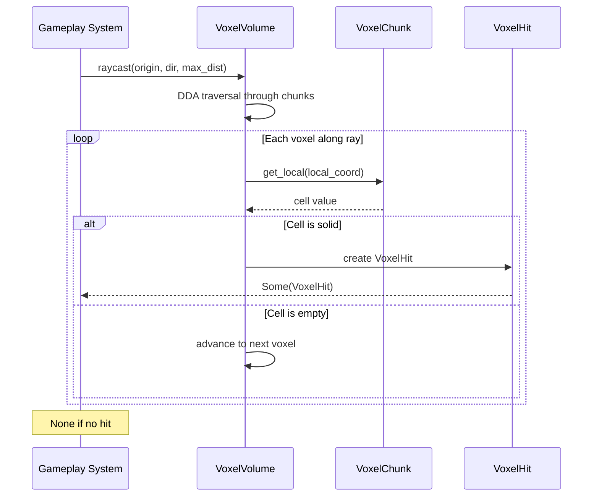

# Grids and Volumes Design

## Requirements Trace

> **Canonical sources:** Features, requirements, and user stories are defined in
> [features/](../../features/), [requirements/](../../requirements/), and
> [user-stories/](../../user-stories/). The table below traces design elements to those definitions.

### Engine Primitives (primary trace)

| Feature   | Requirement | User Story  | Design Element                    |
|-----------|-------------|-------------|-----------------------------------|
| F-17.2.1  | R-17.2.1    | US-17.2.1   | UniformGrid<T> 2D primitive       |
| F-17.2.2  | R-17.2.2    | US-17.2.2   | 256x256 propagation < 1 ms        |
| F-17.2.3  | R-17.2.3    | US-17.2.3   | LOS over 128 cells < 0.01 ms      |
| F-17.2.4  | R-17.2.4    | US-17.2.4   | 2D flow fields (Dijkstra)         |
| F-17.2.5  | R-17.2.5    | US-17.2.5   | Influence propagation with decay  |
| F-17.2.6  | R-17.2.6    | US-17.2.6   | VoxelVolume<T> chunked + palette  |
| F-17.2.7  | R-17.2.7    | US-17.2.7   | Voxel raycast 512 voxels < 2 ms   |
| F-17.2.8  | R-17.2.8    | US-17.2.8   | SDF from voxels, dirty-region     |
| F-17.2.9  | R-17.2.9    | US-17.2.9   | GPU dirty region upload < 1 ms    |
| F-17.2.10 | R-17.2.10   | US-17.2.10  | GPU compute grid propagation      |
| F-17.2.11 | R-17.2.11   | US-17.2.11  | Hierarchical multi-res grid       |
| F-17.2.12 | R-17.2.12   | US-17.2.12  | AOI grid for replication filter   |

1. **R-17.2.1** -- Generic 2D `UniformGrid<T>` with fixed cell size and bounds
2. **R-17.2.2** -- 256x256 propagation step within 1 ms per tick
3. **R-17.2.3** -- Line-of-sight over 128-cell distance within 0.01 ms
4. **R-17.2.4** -- 2D flow fields via Dijkstra propagation from goals
5. **R-17.2.5** -- Influence propagation with per-step decay and obstacle blocking
6. **R-17.2.6** -- Generic 3D `VoxelVolume<T>` with chunks and palette compression
7. **R-17.2.7** -- Voxel raycast up to 512 voxels in length within 2 ms
8. **R-17.2.8** -- Signed distance fields from voxel surfaces, dirty region scope
9. **R-17.2.9** -- GPU dirty region upload within 1 ms per tick
10. **R-17.2.10** -- GPU compute propagation when CPU budget exceeded
11. **R-17.2.11** -- Hierarchical grid variant with multi-resolution cells
12. **R-17.2.12** -- Uniform grid of entity sets for networking AOI filter

### Game-Framework Consumers (cross-reference)

| Feature   | Requirement | Consumer Role                                         |
|-----------|-------------|-------------------------------------------------------|
| F-13.20.1 | R-13.20.1   | Fog of war 3-state cells and GPU fog texture          |
| F-13.20.2 | R-13.20.2   | Vision sources with radius, shape, LOS blocking       |
| F-13.20.3 | R-13.20.3   | Vision modifier volumes (stealth, smoke, high ground) |
| F-13.20.4 | R-13.20.4   | Fog memory with last-seen snapshots                   |
| F-13.21.1 | R-13.21.1   | Tactical grid with cover, elevation, occupancy        |
| F-13.21.4 | R-13.21.4   | Grid cover, flanking, and overwatch stance            |
| F-13.27.1 | R-13.27.1   | Block type registry with O(1) lookup                  |
| F-13.27.2 | R-13.27.2   | Block placement and destruction via raycast           |
| F-13.27.3 | R-13.27.3   | Chunk-based block storage with palette compression    |
| F-7.6.8   | R-7.6.8     | Scent trails as spatial grid with decay and wind      |

### Non-Functional Requirements

| Requirement   | Target   | Description                    |
|---------------|----------|--------------------------------|
| NFR-SIM.GV1   | < 1 ms   | 256x256 propagation per tick   |
| NFR-SIM.GV2   | < 0.01ms | Single LOS ray (128 cells)     |
| NFR-SIM.GV3   | < 0.5 ms | Flood fill (256x256, r=64)     |
| NFR-SIM.GV4   | < 2 ms   | Voxel raycast (512 steps)      |
| NFR-SIM.GV5   | < 1 ms   | GPU dirty region upload        |

### Cross-Cutting Dependencies

| Dependency       | Source   | Consumed API                       |
|------------------|---------|------------------------------------|
| ECS world        | F-1.1.1  | Archetype storage, `Query`        |
| Change detection | F-1.1.22 | `Changed<T>` dirty track          |
| Serialization    | F-1.4.1  | rkyv zero-copy binary              |
| Spatial index    | F-1.9.1  | World-space proximity              |
| Job system       | F-14.3.1 | `scope()`, `par_iter` (crossbeam) |
| Data tables      | F-13.7.2 | Cell type definitions              |
| Game clock       | F-13.1.2 | `GameTime` for tick rate          |

---

## Overview

This document defines generic typed grid and volume primitives for spatial simulation. These
primitives are building blocks that higher-level systems compose into game-specific behaviors. The
design is intentionally free of genre assumptions.

### CellGrid vs UniformGrid — Name Split

**The gameplay propagation grid in this document is named `CellGrid<T>`.** It is distinct from the
`UniformGrid<T>` type in [core-runtime/spatial-index.md](../core-runtime/spatial-index.md), which
handles network area-of-interest bucketing. The rename resolves the collision flagged in design
review section 2.2 — same name, two different APIs, three different call sites. Going forward:

| Name                      | Owner                                   | Purpose                      |
|---------------------------|------------------------------------------|------------------------------|
| `CellGrid<T>`             | simulation/grids-volumes.md (this doc)  | Gameplay propagation (this)  |
| `UniformGrid<T>`          | core-runtime/spatial-index.md            | Network AOI / relevancy      |

References to `UniformGrid` in this file from before the split remain for cross-reference — they are
the **relevancy grid** from networking, not this doc's propagation primitive. New gameplay code uses
`CellGrid<T>`.

Three primitives:

1. **CellGrid\<T\>** -- 2D grid with typed cells. Fixed cell size, axis-aligned. Supports fog of
   war, tactical maps, height fields, scent grids, and influence maps. Provides GPU texture sync for
   rendering overlays. Used with `Transform2D` in 2D games and `Transform` in 3D games. Pure 2D
   games use `CellGrid` and `HierarchicalGrid` — not `VoxelVolume`.
2. **VoxelVolume\<T\>** -- 3D voxel grid with typed cells. Chunk-based storage for block worlds,
   density fields, and wind volumes. Supports LOD and dirty tracking. 3D-only.
3. **PropagationKernel\<T\>** -- Defines how values spread across grid cells per tick. Handles fire
   spread, scent trails, influence maps, and fluid simulation.

### Design Principles

1. **ECS-primary (~90%)-based.** All grids are components. No parallel data stores or manager
   singletons.
2. **Data-driven and no-code.** Cell types defined via data tables. Users author grids in visual
   editors.
3. **Genre-agnostic.** `T` is user-defined. The grid knows nothing about fog, blocks, or scent.
4. **Immutable definitions, mutable state.** Grid dimensions and cell size are immutable. Cell
   values are mutable.
5. **No `Arc`, `Rc`, `Cell`, `RefCell`.** Owned values and generational indices only.
6. **Static dispatch.** Monomorphized generics on all hot paths. No trait objects.
7. **Deterministic.** Identical inputs produce identical outputs. Propagation order is explicit.

### Performance Targets

| Metric                         | Target             |
|--------------------------------|--------------------|
| Propagation (256x256)          | < 1 ms (GV1)      |
| Line of sight (128 cells)      | < 0.01 ms (GV2)   |
| Flood fill (256x256, r=64)     | < 0.5 ms (GV3)    |
| Voxel raycast (512 steps)      | < 2 ms (GV4)      |
| GPU dirty region upload        | < 1 ms (GV5)      |

---

## Architecture

### Module Boundaries



### File layout

```text
harmonius_sim/
├── grids_volumes/
│   ├── mod.rs              # Re-exports
│   ├── coord.rs            # CellCoord, VoxelCoord,
│   │                       # ChunkCoord
│   ├── uniform_grid/
│   │   ├── definition.rs   # UniformGridDef
│   │   ├── grid.rs         # UniformGrid<T>
│   │   ├── query.rs        # GridQuery, GridQueryShape,
│   │   │                   # FloodFillResult
│   │   ├── los.rs          # line_of_sight,
│   │   │                   # LineOfSightResult
│   │   └── propagation.rs  # PropagationKernel<T>
│   ├── voxel/
│   │   ├── definition.rs   # VoxelVolumeDef
│   │   ├── volume.rs       # VoxelVolume<T>
│   │   ├── chunk.rs        # VoxelChunk<T>
│   │   └── raycast.rs      # VoxelHit, DDA traversal
│   ├── gpu_sync.rs         # GpuGridSync, DirtyRegion
│   └── plugin.rs           # GridsVolumesPlugin
```

### System Execution Order



### Class diagram -- all types



---

## API Design

All types derive `rkyv::Archive`, `rkyv::Serialize`, and `rkyv::Deserialize` for zero-copy binary
serialization. Editor integration metadata is codegen'd into the middleman .dylib. Definitions are
immutable assets. Runtime state lives in ECS components.

### 1. Coordinates

```rust
/// 2D cell coordinate in a uniform grid.
#[derive(
    Clone, Copy, Debug, PartialEq, Eq, Hash,
    rkyv::Archive, rkyv::Serialize, rkyv::Deserialize,
)]
pub struct CellCoord {
    pub x: u32,
    pub y: u32,
}

/// 3D voxel coordinate in a volume.
#[derive(
    Clone, Copy, Debug, PartialEq, Eq, Hash,
    rkyv::Archive, rkyv::Serialize, rkyv::Deserialize,
)]
pub struct VoxelCoord {
    pub x: u32,
    pub y: u32,
    pub z: u32,
}

/// Chunk-level coordinate within a VoxelVolume.
#[derive(
    Clone, Copy, Debug, PartialEq, Eq, Hash,
    rkyv::Archive, rkyv::Serialize, rkyv::Deserialize,
)]
pub struct ChunkCoord {
    pub x: u32,
    pub y: u32,
    pub z: u32,
}
```

### 2. CellGrid Definition

```rust
/// Immutable definition for a 2D cell grid.
/// Authored in the visual editor, stored as an
/// asset in gameplay databases (F-13.7.2).
#[derive(
    Clone, Debug,
    rkyv::Archive, rkyv::Serialize, rkyv::Deserialize,
)]
pub struct CellGridDef {
    /// Width in cells.
    pub width: u32,
    /// Height in cells.
    pub height: u32,
    /// World-space size of each cell in units.
    pub cell_size: f32,
}

impl CellGridDef {
    /// Total number of cells.
    pub fn cell_count(&self) -> u32 {
        self.width * self.height
    }

    /// Validate dimensions are non-zero and
    /// cell_size is positive.
    pub fn validate(
        &self,
    ) -> Result<(), GridValidationError>;
}
```

### 3. CellGrid\<T\>

```rust
/// Runtime 2D grid with typed cells. Attached as
/// an ECS component to world entities. Distinct
/// from `UniformGrid<T>` in spatial-index.md —
/// this is the gameplay propagation grid.
///
/// T must be Clone + Default + rkyv::Archive.
/// Storage is a flat Vec<T> in row-major order.
#[derive(
    Clone, Debug,
    rkyv::Archive, rkyv::Serialize, rkyv::Deserialize,
)]
pub struct CellGrid<T> {
    /// Width in cells.
    pub width: u32,
    /// Height in cells.
    pub height: u32,
    /// World-space size of each cell.
    pub cell_size: f32,
    /// World-space origin (bottom-left corner).
    pub origin: Vec2,
    /// Flat cell storage. Length = width * height.
    cells: Vec<T>,
}

impl<T: Default + Clone + rkyv::Archive> CellGrid<T> {
    /// Create a grid initialized to T::default().
    pub fn new(
        width: u32,
        height: u32,
        cell_size: f32,
        origin: Vec2,
    ) -> Self;

    /// Get an immutable reference to a cell.
    /// Returns None if out of bounds.
    pub fn get(
        &self,
        coord: CellCoord,
    ) -> Option<&T>;

    /// Get a mutable reference to a cell.
    /// Returns None if out of bounds.
    pub fn get_mut(
        &mut self,
        coord: CellCoord,
    ) -> Option<&mut T>;

    /// Set a cell value. Panics if out of bounds.
    pub fn set(
        &mut self,
        coord: CellCoord,
        value: T,
    );

    /// Convert world-space position to cell coord.
    /// Returns None if position is outside grid.
    pub fn world_to_cell(
        &self,
        world_pos: Vec2,
    ) -> Option<CellCoord>;

    /// Convert cell coord to world-space center.
    pub fn cell_to_world(
        &self,
        coord: CellCoord,
    ) -> Vec2;

    /// Return neighbor coords for a given pattern.
    /// Excludes out-of-bounds neighbors.
    pub fn neighbors(
        &self,
        coord: CellCoord,
        pattern: NeighborPattern,
    ) -> SmallVec<[CellCoord; 8]>;

    /// Check if a coordinate is within bounds.
    pub fn in_bounds(
        &self,
        coord: CellCoord,
    ) -> bool;

    /// Grid dimensions as (width, height).
    pub fn dimensions(&self) -> (u32, u32);

    /// Bresenham line-of-sight from source to
    /// target. Returns detailed result with
    /// traversed cells and blocking point.
    ///
    /// Algorithm: Bresenham's line algorithm —
    /// <https://en.wikipedia.org/wiki/Bresenham%27s_line_algorithm>
    ///
    /// Allocates result from per-thread arena.
    /// Arena resets at frame boundary.
    pub fn line_of_sight(
        &self,
        from: CellCoord,
        to: CellCoord,
        blocked: impl Fn(&T) -> bool,
        arena: &mut Arena,
    ) -> LineOfSightResult;

    /// BFS flood fill from start. Returns all
    /// reachable cells where passable returns true.
    ///
    /// Algorithm: BFS flood fill —
    /// <https://en.wikipedia.org/wiki/Flood_fill>
    ///
    /// Allocates result from per-thread arena.
    /// Arena resets at frame boundary.
    pub fn flood_fill(
        &self,
        start: CellCoord,
        passable: impl Fn(&T) -> bool,
        arena: &mut Arena,
    ) -> FloodFillResult;

    /// Return all cell coords within radius of a
    /// world-space center. Uses squared distance.
    ///
    /// Allocates result from per-thread arena.
    /// Arena resets at frame boundary.
    pub fn area_query(
        &self,
        center: Vec2,
        radius: f32,
        arena: &mut Arena,
    ) -> Vec<CellCoord>;

    /// Apply one tick of propagation using the
    /// given kernel. Mutates cells in place.
    pub fn propagate(
        &mut self,
        kernel: &PropagationKernel<T>,
        tick: u64,
    );

    /// Linearize a coordinate to flat index.
    fn coord_to_index(
        &self,
        coord: CellCoord,
    ) -> usize {
        (coord.y * self.width + coord.x) as usize
    }
}
```

### 4. Neighbor Pattern and Query Types

```rust
/// Which neighbors to consider for propagation
/// and adjacency queries.
///
/// Engine-fixed variants. User-extensible patterns
/// are codegen'd in the middleman .dylib (RF-13).
#[derive(
    Clone, Copy, Debug, PartialEq, Eq, Hash,
    rkyv::Archive, rkyv::Serialize, rkyv::Deserialize,
)]
pub enum NeighborPattern {
    /// 4 neighbors: N, E, S, W.
    Cardinal,
    /// 4 neighbors: NE, SE, SW, NW.
    Diagonal,
    /// All 8 neighbors.
    All,
}

/// Shape of a grid query region.
///
/// Engine-fixed variants. User-extensible shapes
/// are codegen'd in the middleman .dylib (RF-13).
#[derive(
    Clone, Copy, Debug, PartialEq, Eq, Hash,
    rkyv::Archive, rkyv::Serialize, rkyv::Deserialize,
)]
pub enum GridQueryShape {
    /// Circle with radius in cells.
    Circle,
    /// Axis-aligned rectangle with half-extents.
    Rectangle,
    /// Line from origin to endpoint (Bresenham).
    Line,
}

/// A spatial query against grid cells.
#[derive(
    Clone, Debug,
    rkyv::Archive, rkyv::Serialize, rkyv::Deserialize,
)]
pub struct GridQuery {
    /// Shape of the query region.
    pub shape: GridQueryShape,
    /// Center of the query.
    pub origin: CellCoord,
    /// Radius (Circle) or half-extent (Rectangle).
    pub radius_or_extent: u32,
    /// Endpoint for Line queries.
    pub endpoint: Option<CellCoord>,
}

/// Result of a line-of-sight check.
#[derive(
    Clone, Debug,
    rkyv::Archive, rkyv::Serialize, rkyv::Deserialize,
)]
pub struct LineOfSightResult {
    /// True if the line is unobstructed.
    pub clear: bool,
    /// All cells traversed along the line.
    pub traversed: Vec<CellCoord>,
    /// First cell that blocked the line, if any.
    pub blocked_at: Option<CellCoord>,
}

/// Result of a flood fill operation.
#[derive(
    Clone, Debug,
    rkyv::Archive, rkyv::Serialize, rkyv::Deserialize,
)]
pub struct FloodFillResult {
    /// All reachable cells.
    pub cells: Vec<CellCoord>,
    /// Total cells visited (including rejected).
    pub cells_visited: u32,
}
```

### 5. PropagationKernel\<T\>

```rust
/// Defines how values spread across grid cells
/// per simulation tick. Immutable configuration.
///
/// The spread function takes (source, neighbor)
/// and returns the new neighbor value. Pure
/// function with no side effects.
#[derive(
    Clone, Debug,
    rkyv::Archive, rkyv::Serialize, rkyv::Deserialize,
)]
pub struct PropagationKernel<T> {
    /// Which neighbors receive propagated values.
    pub pattern: NeighborPattern,
    /// Pure spread function: (source, neighbor)
    /// -> new neighbor value.
    pub spread: fn(&T, &T) -> T,
    /// Per-step decay multiplier (0.0..=1.0).
    /// Applied after spread.
    pub decay_rate: f32,
    /// Maximum propagation radius in cells.
    /// Limits BFS depth from each source.
    pub max_radius: u32,
}
```

### 6. VoxelVolume Definition

```rust
/// Immutable definition for a 3D voxel volume.
/// Authored in the visual editor.
#[derive(
    Clone, Debug,
    rkyv::Archive, rkyv::Serialize, rkyv::Deserialize,
)]
pub struct VoxelVolumeDef {
    /// Total dimensions in voxels.
    pub dimensions: VoxelCoord,
    /// Size of each chunk in voxels per axis.
    /// Chunks are always cubic.
    pub chunk_size: u32,
}

impl VoxelVolumeDef {
    /// Number of chunks along each axis.
    pub fn chunk_counts(&self) -> ChunkCoord;

    /// Total number of chunks.
    pub fn total_chunks(&self) -> u32;

    /// Validate dimensions are multiples of
    /// chunk_size and chunk_size is non-zero.
    pub fn validate(
        &self,
    ) -> Result<(), VolumeValidationError>;
}
```

### 7. VoxelVolume\<T\> and VoxelChunk\<T\>

```rust
/// Runtime 3D voxel volume with chunk-based
/// storage. Attached as an ECS component.
///
/// Uses HandleMap for chunk storage with
/// generational indices. No Arc or Rc.
#[derive(
    Clone, Debug,
    rkyv::Archive, rkyv::Serialize, rkyv::Deserialize,
)]
pub struct VoxelVolume<T> {
    /// Total dimensions in voxels.
    pub dimensions: VoxelCoord,
    /// Chunk size in voxels per axis.
    pub chunk_size: u32,
    /// Chunk storage indexed by ChunkCoord.
    chunks: HandleMap<VoxelChunk<T>>,
}

impl<T: Default + Clone + rkyv::Archive> VoxelVolume<T> {
    /// Get an immutable reference to a voxel.
    /// Returns None if out of bounds.
    pub fn get(
        &self,
        coord: VoxelCoord,
    ) -> Option<&T>;

    /// Set a voxel value. Marks the containing
    /// chunk as dirty for GPU sync.
    pub fn set(
        &mut self,
        coord: VoxelCoord,
        value: T,
    );

    /// Return coords of all dirty chunks.
    pub fn dirty_chunks(&self) -> Vec<ChunkCoord>;

    /// Clear dirty flags on all chunks.
    pub fn clear_dirty(&mut self);

    /// DDA raycast through the volume. Returns
    /// the first voxel where solid returns true.
    ///
    /// Algorithm: Amanatides & Woo DDA voxel
    /// traversal —
    /// <https://citeseerx.ist.psu.edu/viewdoc/summary?doi=10.1.1.42.3443>
    pub fn raycast(
        &self,
        origin: Vec3,
        dir: Vec3,
        max_dist: f32,
        solid: impl Fn(&T) -> bool,
    ) -> Option<VoxelHit>;

    /// Convert a voxel coord to its chunk coord.
    pub fn chunk_at(
        &self,
        coord: VoxelCoord,
    ) -> Option<ChunkCoord>;

    /// Check if a voxel coord is within bounds.
    pub fn in_bounds(
        &self,
        coord: VoxelCoord,
    ) -> bool;
}

/// A single chunk within a VoxelVolume. Stores
/// cells in a flat Vec<T> of size chunk_size^3.
#[derive(
    Clone, Debug,
    rkyv::Archive, rkyv::Serialize, rkyv::Deserialize,
)]
pub struct VoxelChunk<T> {
    /// Flat cell storage in x-y-z order.
    cells: Vec<T>,
    /// True if any cell was modified since last
    /// GPU sync.
    dirty: bool,
}

impl<T: Default + Clone + rkyv::Archive> VoxelChunk<T> {
    /// Get a cell by local coordinate within
    /// this chunk.
    pub fn get_local(
        &self,
        local: VoxelCoord,
    ) -> Option<&T>;

    /// Set a cell by local coordinate. Marks
    /// the chunk as dirty.
    pub fn set_local(
        &mut self,
        local: VoxelCoord,
        value: T,
    );

    /// Whether this chunk has pending changes.
    pub fn is_dirty(&self) -> bool;

    /// Clear the dirty flag after GPU upload.
    pub fn clear_dirty(&mut self);
}
```

### 8. VoxelHit

```rust
/// Result of a voxel raycast.
#[derive(
    Clone, Debug,
    rkyv::Archive, rkyv::Serialize, rkyv::Deserialize,
)]
pub struct VoxelHit {
    /// Voxel coordinate that was hit.
    pub coord: VoxelCoord,
    /// World-space hit position on voxel face.
    pub position: Vec3,
    /// Face normal of the hit surface.
    pub normal: Vec3,
    /// Distance from ray origin to hit point.
    pub distance: f32,
}
```

### 9. GpuGridSync

```rust
/// Tracks dirty regions for GPU texture upload.
/// Attached as a component alongside grids that
/// need rendering (fog overlays, terrain maps).
///
/// Upload uses a ring-buffered staging buffer
/// (N copies for N frames in flight) to avoid
/// GPU/CPU sync stalls.
#[derive(
    Clone, Debug,
    rkyv::Archive, rkyv::Serialize, rkyv::Deserialize,
)]
pub struct GpuGridSync {
    /// Pending dirty regions to upload.
    pending: Vec<DirtyRegion>,
    /// Ring-buffer index (0..N frames in flight).
    staging_index: u32,
}

impl GpuGridSync {
    /// Mark a rectangular region as dirty.
    /// Merges overlapping regions.
    pub fn mark_dirty(
        &mut self,
        min: CellCoord,
        max: CellCoord,
    );

    /// Drain all pending regions for upload.
    /// Returns the regions and clears the list.
    pub fn drain(&mut self) -> Vec<DirtyRegion>;

    /// Whether there are pending uploads.
    pub fn has_pending(&self) -> bool;
}

/// A rectangular dirty region in cell space.
#[derive(
    Clone, Copy, Debug,
    rkyv::Archive, rkyv::Serialize, rkyv::Deserialize,
)]
pub struct DirtyRegion {
    /// Minimum corner (inclusive).
    pub min: CellCoord,
    /// Maximum corner (inclusive).
    pub max: CellCoord,
}
```

### 10. GpuGrid\<T\> — GPU-Resident Variant

For bulk simulation data (influence maps, flow fields, fog-of-war propagation, SDF volumes, voxel
GI), the canonical data lives in a GPU structured buffer. CPU readback is on-demand only.

**Residency policy:**

| Use case                     | Residency    | Rationale                                  |
|------------------------------|--------------|--------------------------------------------|
| Influence maps               | GPU-resident | Consumed by compute/render; GPU authoritative |
| Flow fields                  | GPU-resident | Particle advection and AI run on GPU       |
| Fog of war propagation       | GPU-resident | Propagation compute + render read          |
| SDF volumes                  | GPU-resident | Shadow/AO passes sample direct from buffer |
| Voxel GI                     | GPU-resident | GI compute reads voxel structured buffer   |
| Pathfinding (A\*)            | CPU-resident | BFS/Eikonal runs on CPU job threads        |
| Line of sight                | CPU-resident | Gameplay logic queries CPU grid cells      |
| Editor tools / save-load     | CPU-resident | Editor and serialization require CPU access|

```rust
/// GPU-resident grid variant. The GPU structured
/// buffer is the authoritative copy. CPU readback
/// is on-demand via a staging buffer and a GPU
/// fence polled at the frame boundary. No `.await`,
/// no `Future<>`.
///
/// Attached as a component on entities that need
/// GPU-driven propagation or render graph reads.
pub struct GpuGrid<T> {
    /// Dimensions (width × height).
    pub width: u32,
    pub height: u32,
    /// GPU structured buffer handle.
    pub gpu_buffer: GpuBufferHandle,
    /// Staging ring-buffer for CPU readback.
    /// N copies for N frames in flight (RF-18).
    staging: RingBuffer<StagingBuffer>,
    _marker: PhantomData<T>,
}

impl<T: bytemuck::Pod> GpuGrid<T> {
    /// Schedule a CPU readback of the full grid.
    /// Returns the data when the render thread
    /// signals completion via crossbeam-channel.
    pub fn request_readback(
        &self,
    ) -> ReadbackHandle<Vec<T>>;

    /// Bind the GPU buffer as a UAV for compute
    /// dispatch (propagation kernel).
    pub fn bind_uav(
        &self,
    ) -> GpuUavBinding;

    /// Bind the GPU buffer as an SRV for render
    /// passes that read grid data.
    pub fn bind_srv(
        &self,
    ) -> GpuSrvBinding;
}
```

### 11. Systems

```rust
/// System that runs propagation kernels on all
/// grids that have an attached PropagationKernel.
/// Runs in FixedUpdate schedule (Phase 2). (RF-7)
pub fn propagation_system<T>(
    time: Res<GameTime>,
    rng: Res<DeterministicRng>,
    mut query: Query<(
        &mut CellGrid<T>,
        &PropagationKernel<T>,
    )>,
);

/// System that uploads dirty grid regions to
/// GPU textures. Runs in Phase 3 (Sync).
pub fn gpu_grid_sync_system(
    mut query: Query<(
        &mut GpuGridSync,
        Changed<GpuGridSync>,
    )>,
    mut gpu: ResMut<GpuTextureManager>,
);
```

### Time Scale Handling

`CellGrid<T>` propagation respects the engine-wide `GameTime::tick_scale` value (see
[core-runtime/change-detection.md](../core-runtime/change-detection.md) or the future
`core-runtime/time.md`). `tick_scale` is a `f32` multiplier applied to the fixed-timestep dt before
kernels integrate. The contract is:

| Tick scale | Behavior                                                             |
|------------|----------------------------------------------------------------------|
| `1.0`      | Propagation runs at the normal rate (default)                       |
| `0.5`      | Propagation runs at half speed — slow-mo gameplay                    |
| `2.0`      | Propagation runs at double speed — fast-forward                      |
| `0.0`      | Propagation is paused — cells do not change this tick                |

Pause semantics are unified: a `tick_scale` of zero freezes propagation. The propagation system
checks `time.tick_scale > 0.0` before running the kernel; when zero, the system exits early and does
not touch any cells. This matches the unified pause semantics for timelines, awareness transitions,
and event-log decay across all four simulation primitives.

### Determinism Seed

`CellGrid<T>` propagation is **deterministic** given a `Res<DeterministicRng>` seed from
[core-runtime/primitives.md](../core-runtime/primitives.md). Any stochastic propagation kernel
(randomized fire spread, jittered scent diffusion, cellular-automaton coin flips) must draw from the
shared RNG — never from thread-local state, never from `rand::thread_rng()`. The seed is injected
via a system parameter (see the `rng: Res<DeterministicRng>` argument on `propagation_system`).

**Determinism guarantees:**

1. Given identical `CellGrid<T>`, identical `PropagationKernel<T>`, identical `tick_scale`, and
   identical RNG seed, the grid state after N ticks is byte-identical across runs.
2. The RNG state is serialized into save files (via `rkyv::Archive` on `DeterministicRng`) so
   save/load preserves propagation parity.
3. Multiplayer clients receive the server's RNG seed on spawn and stay in lockstep by reseeding at
   every checkpoint tick.
4. Floating-point propagation kernels use the same deterministic float arithmetic as physics — no
   platform-specific fast-math, no FMA re-association.

### 12. Codegen for User-Defined Cell Types

User-defined cell types (`T` in `UniformGrid<T>` and `VoxelVolume<T>`) — fog states, block types,
scent values, influence categories — are defined in the visual editor and codegen'd into the
middleman .dylib. The engine binary never contains user-defined types.

Codegen pipeline:

1. User defines a cell type in the visual editor (name, fields, default values).
2. Codegen emits a Rust struct with rkyv derives and implements `Default + Clone + rkyv::Archive`.
3. The monomorphized `UniformGrid<UserFogCell>` (etc.) is compiled into the middleman .dylib.
4. Hot-reload recompiles the middleman when cell type definitions change.

Engine-fixed cell types (`CellCoord`, `VoxelCoord`, etc.) live in the engine binary.

### 13. GPU Compute Propagation

For grids larger than 256×256, propagation runs as GPU compute dispatches. The CPU propagation path
remains for small grids and all gameplay queries (LOS, flood fill). Both paths produce identical
deterministic results.

Algorithm reference: Parallel prefix sum / stencil sweep for grid propagation —
<https://developer.nvidia.com/gpugems/gpugems3/part-vi-gpu-computing/chapter-39-parallel-prefix-sum-scan-cuda>

```rust
/// GPU compute propagation kernel. Compiled from
/// an HLSL compute shader via dxc. The grid lives
/// in a GpuGrid<T> structured buffer (UAV).
///
/// Use for grids > 256x256. Below that threshold,
/// PropagationKernel<T> (CPU) is preferred.
pub struct GpuPropagationKernel {
    /// Compiled HLSL shader handle.
    pub shader: ShaderHandle,
    /// Neighbor pattern (Cardinal, Diagonal, All).
    pub pattern: NeighborPattern,
    /// Per-step decay multiplier (0.0..=1.0).
    pub decay_rate: f32,
    /// Maximum propagation radius in cells.
    pub max_radius: u32,
}

impl GpuPropagationKernel {
    /// Dispatch the propagation compute shader.
    /// Grid must be a GpuGrid<T> (UAV binding).
    pub fn dispatch(
        &self,
        cmd: &mut ComputeCommandList,
        grid: &GpuGrid<impl bytemuck::Pod>,
        tick: u64,
    );
}
```

### 14. Flow Fields, Distance Fields, Influence Maps

#### Flow Fields

`UniformGrid<Vec2>` stores a velocity vector per cell. Used for RTS unit movement, crowd flow, water
current, and VFX particle advection.

Algorithm: Dijkstra's algorithm / Eikonal equation for flow field computation —
<https://howtorts.github.io/2014/01/04/basic-flow-fields.html>

```rust
/// Compute a flow field pointing toward target.
/// `cost_grid` weights movement cost per cell.
/// Returns a grid of normalized Vec2 directions.
///
/// Allocates result from per-thread arena (RF-10).
pub fn compute_flow_field(
    target: CellCoord,
    cost_grid: &UniformGrid<f32>,
    arena: &mut Arena,
) -> UniformGrid<Vec2>;
```

#### Distance Fields (SDF)

Signed distance from the nearest voxel surface. Used for soft shadows, ambient occlusion, and
collision queries. GPU-resident (see RF-3).

Algorithm: Fast sweeping method for SDF generation —
<https://www.cs.utah.edu/~sujin/courses/reports/cs6640/project2/zhao.pdf>

```rust
/// Compute a 2D signed distance field from an
/// obstacle grid. Negative inside obstacles,
/// positive outside. GPU compute variant for
/// volumes > 256x256.
pub fn compute_sdf(
    obstacles: &UniformGrid<bool>,
    arena: &mut Arena,
) -> UniformGrid<f32>;
```

#### Influence Maps

A `PropagationKernel<f32>` that spreads influence from source entities with falloff and obstacle
blocking. Used for AI tactical decisions (cover value, threat level, resource proximity).

```rust
/// Influence source attached to an entity.
/// The influence map system reads all sources
/// and seeds the grid before propagation.
pub struct InfluenceSource {
    /// Influence value emitted per tick.
    pub strength: f32,
    /// Decay rate for this source (0.0..=1.0).
    pub decay: f32,
}
```

### 15. Editor Write API — Voxel and Terrain Editing

The level editor (level-world.md RF-26, RF-29, RF-33) calls these methods for block placement, SDF
sculpting, and terrain painting. Non-destructive override layers store deltas on top of procedural
terrain.

```rust
/// Set a single voxel cell (block placement or
/// destruction). Marks the containing chunk dirty.
/// Called by editor voxel brush and gameplay
/// destructible systems.
pub fn set_cell(
    &mut self,
    coord: VoxelCoord,
    value: T,
);

/// Apply an SDF brush to a voxel volume. The
/// brush_fn maps (existing_value, sdf_distance,
/// pen_pressure) -> new_value. Non-destructive:
/// writes to an override layer, not the base volume.
pub fn apply_sdf_brush(
    volume: &mut VoxelVolume<T>,
    center: Vec3,
    radius: f32,
    pen_pressure: f32,
    brush_fn: impl Fn(&T, f32, f32) -> T,
    override_layer: &mut VoxelVolume<Option<T>>,
);

/// Set a rectangular region of a heightmap grid.
/// Used by terrain painting tools. Pen pressure
/// maps to blend strength (0.0..=1.0).
/// Non-destructive: writes to an override layer.
pub fn set_heightmap_region(
    grid: &mut UniformGrid<f32>,
    min: CellCoord,
    max: CellCoord,
    heights: &[f32],
    pen_pressure: f32,
    override_layer: &mut UniformGrid<Option<f32>>,
);
```

**Override layer composition:**

1. Base layer: procedural terrain or imported voxel data.
2. Override layer: `VoxelVolume<Option<T>>` / `UniformGrid<Option<f32>>` with `None` = transparent.
3. At query time, override is checked first; fallback to base if `None`.
4. Baking collapses layers into a single volume for export.

### 16. Destruction Request Types

Physics fracture events (`DestructionEvent` from `vfx/effects.md`) are converted into grid-space
destruction requests by the grids-physics integration layer. These types are defined here so both
the simulation (writer) and physics (reader) domains reference a single source of truth. Consumed by
the integration design at `integration/grids-volumes-physics.md` (IR-3.10.3).

```rust
/// Destruction applied to a `VoxelVolume<T>`.
/// Produced by the grids-physics integration layer
/// from a physics `DestructionEvent` after coord
/// conversion via `VoxelVolume::world_to_cell`.
#[derive(
    Clone, Debug,
    rkyv::Archive, rkyv::Serialize,
    rkyv::Deserialize,
)]
pub struct VoxelDestructionRequest {
    pub volume_entity: Entity,
    pub impact_coord: VoxelCoord,
    pub radius: u32,
    pub force: f32,
    pub pattern: DestructionPattern,
}

/// Shape of a destruction region in voxel space.
/// All variants enumerated; no open-ended values.
#[derive(
    Clone, Debug,
    rkyv::Archive, rkyv::Serialize,
    rkyv::Deserialize,
)]
pub enum DestructionPattern {
    /// Spherical blast clears voxels in radius.
    Sphere,
    /// Directional cone along impact normal.
    /// `half_angle` is in radians (0..=PI/2).
    Cone { half_angle: f32 },
    /// Column collapse downward from impact.
    Column,
}
```

These types are added to the class diagram above as `VoxelDestructionRequest` referencing
`VoxelCoord` and composing `DestructionPattern`.

---

## Data Flow

### Grid Simulation Lifecycle



### Voxel Raycast



### Data Flow Summary

1. Grid authored in level editor (painted cells)
2. Serialized as asset via rkyv zero-copy binary codec
3. Loaded as ECS component on world entity
4. Systems read/write cells each simulation tick
5. `PropagationKernel` runs during FixedUpdate (Phase 2 — Simulation)
6. `GpuGridSync` uploads dirty regions to GPU texture during Phase 3 (Sync)
7. Rendering samples grid texture for fog, overlays, and debug visualization

---

## Render Graph Integration

Grids and volumes are consumed across the entire render pipeline. Each consumer pass declares `read`
dependencies on grid resources. The render graph compiler orders passes and inserts barriers.
GPU-resident `GpuGrid<T>` resources are tracked as render graph nodes with read/write state.

| Pass | Grid/volume resource | Dependency type |
|------|---------------------|-----------------|
| GpuGridSyncPass | All CPU-dirty grids → GPU buffers | write (UAV) |
| GPU culling pass | Fog grid texture | read (SRV) |
| GI pass (voxel cone tracing) | Voxel structured buffer | read (SRV) |
| Shadow / AO pass | SDF volume buffer | read (SRV) |
| Debug overlay pass | Influence map texture | read (SRV) |
| VFX compute pass | Flow field texture | read (SRV) |
| Terrain vertex pass | Heightmap grid | read (SRV) |

**Pass descriptions:**

1. **GpuGridSyncPass** — uploads dirty CPU regions to GPU textures/buffers. Runs before all consumer
   passes. Ring-buffered staging (N copies for N frames in flight, RF-18).
2. **Fog of war → visibility culling** — fog grid texture read by GPU culling pass to skip rendering
   of fogged entities.
3. **Voxel volumes → GI** — voxel data feeds voxel cone tracing or irradiance probes.
4. **SDF volumes → soft shadows / AO** — distance field sampled by shadow and AO passes.
5. **Influence maps → debug visualization** — overlay pass reads influence map texture and renders a
   heat map. Filtered by render layer `u32` bitmask (RF-17); only visible on debug cameras.
6. **Flow fields → particle VFX** — VFX compute passes sample flow field texture to advect
   particles.
7. **Heightmap grids → terrain** — terrain rendering reads heightmap grid as vertex displacement.

---

## Platform Considerations

| Concern        | Platform         | Approach                                        |
|----------------|------------------|-------------------------------------------------|
| Serialization  | All              | rkyv zero-copy binary                           |
| Networking     | All              | Dirty-cell bitset delta sync over QUIC          |
| GPU upload     | All              | Ring-buffered staging, N copies per frames-in-flight |
| Memory layout  | All              | Flat `Vec<T>` for cache locality                |
| Threading      | All              | Read-only queries safe for `par_iter`           |
| Save/load      | All              | Grid state serialized via rkyv delta            |
| Hot reload     | All              | Definitions reloaded; runtime state kept        |
| Mobile (iOS/Android) | Mobile     | Reduce grid capacity via config; no GPU compute on old GPUs |
| Switch         | Console          | Max 256×256 grid; 4 MB voxel world budget       |
| VR (Quest/PSVR2) | VR             | Propagation in FixedUpdate; fog latency < 1 frame |
| Windows        | PC               | DirectStorage for GPU asset streaming           |
| macOS / iOS    | Apple            | Metal 4; `MTLSharedEvent` for GPU sync          |
| Linux          | PC               | Vulkan (`ash`); io_uring for asset I/O          |

### Memory Budget

| Primitive               | Calculation         | Budget |
|-------------------------|---------------------|--------|
| Fog grid (256x256, u8)  | 256 x 256 x 1 B    | 64 KB  |
| Fog grid (1024x1024)    | 1024 x 1024 x 1 B  | 1 MB   |
| Tactical grid (64x64)   | 64 x 64 x 4 B      | 16 KB  |
| Scent grid (128x128)    | 128 x 128 x 4 B    | 64 KB  |
| Voxel chunk (16^3, u16) | 4096 x 2 B         | 8 KB   |
| Voxel world (256^3)     | 16^3 chunks x 8 KB | 32 MB  |

### Networking

- **UniformGrid** uses dirty-cell tracking. Modified cells are collected into a delta bitset per
  frame and sent to clients. Full sync on join.
- **VoxelVolume** tracks dirty chunks. Only modified chunks are replicated. Palette compression
  reduces bandwidth for homogeneous chunks.
- **Propagation** is deterministic. Given the same kernel and initial state, all clients produce
  identical results. Only initial state and kernel parameters need replication.
- **Relevancy grid.** `UniformGrid<EntitySet>` serves as the networking area-of-interest grid.
  Entities are assigned to cells based on world position. The networking system queries nearby cells
  to determine which entities to replicate to each client. The write API is:

  ```rust
  /// Add an entity to the relevancy cell at
  /// its world position. Called when an entity
  /// moves or spawns.
  pub fn insert_entity(
      &mut self,
      world_pos: Vec2,
      entity: Entity,
  );

  /// Query all entities within a world-space
  /// radius. Used by the replication system.
  pub fn entities_in_radius(
      &self,
      center: Vec2,
      radius: f32,
      arena: &mut Arena,
  ) -> &[Entity];
  ```

---

## Cross-Subsystem Integration

Every subsystem that consumes or produces grid/volume data, with the specific integration mechanism.

| Subsystem          | Grid/volume use                     | API surface                           |
|--------------------|-------------------------------------|---------------------------------------|
| Rendering          | Fog texture, voxel GI, SDF, terrain | Render graph read deps on GPU resources |
| Networking         | Relevancy / area-of-interest        | `entities_in_radius` on `UniformGrid<EntitySet>` |
| AI — Navigation    | Flow fields for pathfinding         | `compute_flow_field(target, cost_grid)` |
| AI — Behavior      | Influence maps for tactics          | `PropagationKernel<f32>` + `InfluenceSource` |
| AI — Perception    | Scent trails (F-7.6.8)              | `UniformGrid<f32>` + scent kernel     |
| Physics            | Voxel/heightmap collision geometry  | `VoxelVolume::raycast`, `get` for static geo |
| VFX                | Flow field advection, fog density   | `GpuGrid<Vec2>` SRV sampled in compute |
| Audio              | Obstruction/occlusion grids         | `line_of_sight` for wall/door blocking |
| Game framework     | Fog of war, tactical grids          | `UniformGrid::get/set`, `propagate`   |
| Content pipeline   | Voxel import, heightmap baking      | `VoxelVolume::set`, rkyv serialization |
| Editor             | Grid painting, voxel sculpting      | `set_cell`, `apply_sdf_brush`, `set_heightmap_region` |
| Save system        | Grid state persistence              | rkyv dirty-delta serialization        |
| Spatial index      | Grid-accelerated broad-phase        | `area_query` + shared BVH fallback    |
| UI                 | Minimap, fog overlay, heat maps     | `GpuGrid<T>` SRV for 2D overlay pass |

---

## Test Plan

Full test cases are in [grids-volumes-test-cases.md](grids-volumes-test-cases.md).

### Unit Tests

| TC-ID         | Area                       | Requirement  | Coverage            |
|---------------|----------------------------|--------------|---------------------|
| TC-13.20.1.1  | `UniformGrid::get/set`     | R-13.20.1   | Valid, OOB, edges   |
| TC-13.20.1.2  | `world_to_cell`            | R-13.20.1   | Inside, outside     |
| TC-13.20.1.3  | `cell_to_world`            | R-13.20.1   | All corners         |
| TC-13.20.2.1  | `neighbors` Cardinal       | R-13.20.2   | Interior, edge      |
| TC-13.20.2.2  | `neighbors` All            | R-13.20.2   | Corner, center      |
| TC-13.20.2.3  | `line_of_sight`            | R-13.20.2   | Clear, blocked      |
| TC-13.20.3.1  | `flood_fill`               | R-13.20.3   | Open, walled, full  |
| TC-13.20.4.1  | `area_query`               | R-13.20.4   | Within, partial     |
| TC-13.21.1.1  | `propagate`                | R-13.21.1   | Decay, max_radius   |
| TC-13.27.1.1  | `VoxelVolume::get/set`     | R-13.27.1   | Valid, OOB          |
| TC-13.27.2.1  | `VoxelVolume::raycast`     | R-13.27.2   | Hit, miss, edge     |
| TC-13.27.3.1  | `VoxelChunk` dirty flag    | R-13.27.3   | Set on write, clear |
| TC-13.27.3.2  | `GpuGridSync` merge        | R-13.27.3   | Overlap, adjacent   |
| TC-7.6.8.1    | `CellCoord` equality       | R-7.6.8     | Same, different     |

### Integration Tests

| TC-ID         | Area                       | Requirement  | Coverage            |
|---------------|----------------------------|--------------|---------------------|
| TC-13.20.1.4  | Grid + ECS component       | R-13.20.1   | Spawn, query, mutate|
| TC-13.20.1.5  | Grid + spatial index       | R-13.20.1   | World-space lookup  |
| TC-13.21.1.2  | Grid + propagation + clock | R-13.21.1   | Multi-tick spread   |
| TC-13.27.3.3  | Volume + chunk lifecycle   | R-13.27.3   | Create, dirty, sync |
| TC-13.27.1.2  | Grid + serialization       | R-13.27.1   | Round-trip save     |
| TC-13.20.1.6  | GPU sync end-to-end        | R-13.20.1   | Dirty to texture    |
| TC-7.6.8.2    | Scent propagation + decay  | R-7.6.8     | Multi-tick decay    |
| TC-13.21.4.1  | Cover + flanking grid      | R-13.21.4   | Stance update       |

### Benchmarks

| TC-ID         | Benchmark                  | Requirement  | Target              |
|---------------|----------------------------|--------------|---------------------|
| TC-GV1.1      | propagate_256x256          | NFR-SIM.GV1 | < 1 ms             |
| TC-GV2.1      | line_of_sight_128          | NFR-SIM.GV2 | < 0.01 ms          |
| TC-GV3.1      | flood_fill_256x256_r64     | NFR-SIM.GV3 | < 0.5 ms           |
| TC-GV4.1      | voxel_raycast_512          | NFR-SIM.GV4 | < 2 ms             |
| TC-GV5.1      | gpu_sync_dirty_upload      | NFR-SIM.GV5 | < 1 ms             |
| TC-GV6.1      | area_query_1024x1024_r32   | NFR-SIM.GV1 | < 1 ms             |

---

## Open Questions

1. **Palette compression.** Should `VoxelChunk<T>` support palette compression at the primitive
   level, or should that be a higher-level optimization?
2. **Large query decomposition.** For grids larger than 1024×1024, should flood fill and A\*
   pathfinding be split across frames using `scope()` from the custom job system, or offloaded to
   GPU compute? No async/await — job system decomposition or GPU compute only.
3. **Hex grid support.** Should `UniformGrid<T>` support hexagonal cell layouts natively, or should
   hex be a separate primitive?
4. **Propagation scheduling.** Should propagation kernels support sub-tick rates (e.g., every 4th
   frame) to amortize cost across frames?
5. **LOD for VoxelVolume.** Should chunks store multiple LOD levels, or should LOD be handled by a
   separate system that reads chunk data?

## Review feedback

### RF-1: Remove all Reflect derives

Remove all `Reflect` derives (26 occurrences). Remove `REF[Reflection /
TypeRegistry]` from the architecture diagram. Remove `Reflection | F-1.3.1`
from cross-cutting dependencies. Replace with rkyv derives and codegen'd metadata in the middleman
.dylib.

### RF-2: rkyv serialization throughout

rkyv never appears in the document. Replace all Reflect-based serialization with
`rkyv::Archive, rkyv::Serialize, rkyv::Deserialize`. Update the Platform Considerations table from
`Reflect + binary (F-1.3)` to `rkyv zero-copy binary`. Update the Data Flow Summary accordingly. No
serde, no RON.

### RF-3: GPU-resident buffers for bulk simulation data

All grid data is stored in CPU `Vec<T>` with dirty-region upload. For grids used by GPU compute
(influence maps, flow fields, fog of war propagation), the canonical data should live in GPU
structured buffers. Add a `GpuGrid<T>` variant where the GPU buffer is authoritative and CPU
readback is on-demand. Document which use cases are GPU-resident vs CPU-resident:

- **GPU-resident:** influence maps, flow fields, fog of war propagation, SDF volumes, voxel GI
- **CPU-resident:** gameplay queries (pathfinding, line of sight), editor tools, save/load

### RF-4: Create companion test cases file

Create `grids-volumes-test-cases.md` with TC-IDs in `TC-X.Y.Z.N` format, tracing every R-X.Y.Z
requirement to explicit test cases with inputs and expected outputs.

### RF-5: Codegen for user-defined cell types

User-defined cell types (`T` in `UniformGrid<T>`) — fog states, block types, scent values, influence
categories — are codegen'd into the middleman .dylib. The monomorphized grid types are compiled as
part of the middleman. Hot-reload recompiles when cell type definitions change.

### RF-6: Render graph integration (broad, not just nodes)

Grids and volumes are consumed across the entire render pipeline, not just uploaded via a single
sync node. Document the full render graph integration:

1. **GpuGridSyncPass** — uploads dirty CPU regions to GPU textures/buffers. Runs before any consumer
   pass. This is a render graph node.
2. **Fog of war → visibility culling** — the fog grid texture is read by the GPU culling pass to
   skip rendering of fogged entities. The culling pass declares a read dependency on the fog grid
   resource.
3. **Voxel volumes → GI** — voxel data feeds voxel cone tracing or irradiance probes. The GI pass
   reads the voxel structured buffer.
4. **SDF volumes → soft shadows / AO** — distance field data is sampled by shadow and AO passes for
   soft contact shadows and SSAO.
5. **Influence maps → debug visualization** — an overlay pass reads the influence map texture and
   renders a heat map. Filtered by render layer bitmask (only visible on debug cameras).
6. **Flow fields → particle VFX** — VFX compute passes sample the flow field texture to advect
   particles. The VFX pass declares a read dependency on the flow field resource.
7. **Heightmap grids → terrain** — terrain rendering reads the heightmap grid as a vertex
   displacement source.

Each consumer pass declares `read` dependencies on grid resources. The render graph compiler orders
passes and inserts barriers automatically. GPU-resident grids (RF-3) are render graph resources with
read/write tracking.

### RF-7: FixedUpdate for propagation

Explicitly state that PropagationSystem runs in the `FixedUpdate` schedule at a fixed timestep.
Label Phase 2 (Simulation) in the System Execution Order diagram as FixedUpdate.

### RF-8: 2D grid and Transform2D

`UniformGrid<T>` uses `Vec2` which is correct for 2D. Add a note clarifying that grids work with
`Transform2D` for 2D games and `Transform` for 3D. `VoxelVolume` is 3D-only. Pure 2D games use
`UniformGrid` and `HierarchicalGrid`, not `VoxelVolume`.

### RF-9: GPU compute propagation

For grids larger than 256x256, propagation should run as GPU compute dispatches. Add a
`GpuPropagationKernel` that runs as an HLSL compute shader, with the grid living in a structured
buffer. The CPU propagation path remains for small grids and gameplay queries. Both paths produce
identical results.

### RF-10: Per-thread arenas for query results

`flood_fill`, `area_query`, `line_of_sight`, and pathfinding results allocate from per-thread
arenas. Arenas reset at frame boundaries.

### RF-11: Algorithm reference URLs

Add direct URLs for: Bresenham's line algorithm, BFS flood fill, Amanatides & Woo DDA voxel
traversal, Dijkstra/Eikonal for flow field computation, SDF generation algorithms.

### RF-12: Expand platform considerations

Name all target platforms (Windows, macOS, Linux, iOS, Android, Switch, VR). Add console memory
budgets (Switch grid size limits), VR latency requirements for spatial audio grids, mobile GPU
compute availability.

### RF-13: Codegen for extensible enums

Clarify whether `NeighborPattern`, `GridQueryShape`, and cell type enums are engine-fixed or
user-extensible. User-extensible variants are codegen'd in the middleman .dylib.

### RF-14: Flow fields, distance fields, influence maps

These are listed in the task context but have no API in the design:

1. **Flow field** — `UniformGrid<Vec2>` with Dijkstra/Eikonal propagation. Used for RTS unit
   movement, crowd flow, water current. Add
   `compute_flow_field(target, cost_grid) -> UniformGrid<Vec2>`.
2. **Distance field (SDF)** — signed distance from voxel surface. Used for soft shadows, AO,
   collision queries. Add `compute_sdf(volume) -> UniformGrid<f32>` (or GPU compute variant).
3. **Influence map** — propagation kernel that spreads influence values from sources with falloff.
   Add as a first-class `PropagationKernel::Influence` example with source entities, decay rate, and
   obstacle blocking.

### RF-15: Rephrase async open question

Open question #2 suggests async for large queries. Rephrase to ask about job system decomposition
(splitting across frames via `scope()`) or GPU compute offload. No async/await in engine.

### RF-16: Custom job system terminology

Rename "Thread pool | F-14.3.1" to "Job system" and reference
`scope()` / `par_iter` from the custom crossbeam-deque job system.

### RF-17: Render layer filtering for grid overlays

Grid debug overlays (fog of war viz, influence heat maps) should respect the render layer u32
bitmask so they only appear on the correct cameras (debug camera, minimap, main camera).

### RF-18: Ring-buffered GPU upload staging

The GPU upload staging buffer should be ring-buffered (N copies for N frames in flight) to avoid
GPU/CPU sync stalls.

### RF-19: Networking relevancy grid

Explain how `UniformGrid<EntitySet>` serves as the networking relevancy grid for area-of-interest
filtering. Entities are assigned to cells based on world position. The networking system queries
nearby cells to determine which entities to replicate to each client.

### RF-20: Fix heading case

Convert "Class Diagram -- All Types" and "File Layout" to sentence case.

### RF-21: Test coverage tracing

Map every R-X.Y.Z requirement (R-13.20.1-4, R-13.21.1/4, R-13.27.1-3, R-7.6.8) to explicit TC-IDs in
the companion test cases file.

### RF-22: Explicit cross-subsystem integration list

The design must list every subsystem that consumes or produces grid/volume data, with the specific
integration mechanism for each:

| Subsystem | Grid/volume use | Integration |
|-----------|----------------|-------------|
| **Rendering** | Fog of war texture, voxel GI, SDF shadows/AO, terrain heightmap, debug overlays | Render graph read deps on grid GPU resources |
| **Networking** | Relevancy grid for area-of-interest | `UniformGrid<EntitySet>` queried by replication system |
| **AI — Navigation** | Flow fields for pathfinding | `UniformGrid<Vec2>` computed by Dijkstra/Eikonal |
| **AI — Behavior** | Influence maps for tactical decisions | Propagation kernel with source entities + decay |
| **AI — Perception** | Scent trails (F-7.6.8) | `UniformGrid<f32>` with scent propagation kernel |
| **Physics** | Voxel collision, heightmap collision | Voxel/grid data read by physics for static geometry |
| **VFX** | Flow field particle advection, fog density injection | VFX compute passes sample grid textures |
| **Audio** | Obstruction/occlusion grids | Audio queries grid for wall/door blocking |
| **Game framework** | Fog of war (F-13.20), tactical grids (F-13.21) | Gameplay systems read/write grid cells |
| **Content pipeline** | Voxel import, heightmap import, grid baking | Asset pipeline bakes grids to rkyv |
| **Editor** | Grid painting, volume sculpting, propagation preview | Editor tools write grid cells, preview overlays |
| **Save system** | Grid state serialization | Dirty cells saved via rkyv delta |
| **Spatial index** | Grid-accelerated broad-phase queries | Shared BVH augmented with grid for uniform queries |
| **UI** | Minimap, fog overlay, debug heat maps | UI reads grid texture for 2D overlay rendering |

Each row must have a corresponding API surface in this design (query method, event, or resource)
that the consuming subsystem calls. If any integration point is missing from the API, add it.

### RF-23: Voxel and terrain editing integration

The level editor provides voxel block placement, SDF sculpting, and terrain painting tools
(level-world.md RF-26, RF-29). The grids/ volumes design must define the write API that these tools
call: `set_cell()`, `apply_sdf_brush()`, `set_heightmap_region()`. Pen pressure maps to brush
strength. Non-destructive override layers (level-world.md RF-33) store deltas on top of procedural
terrain.
