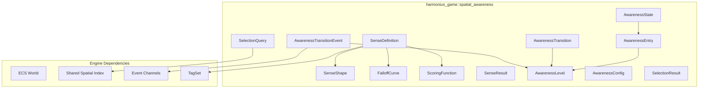
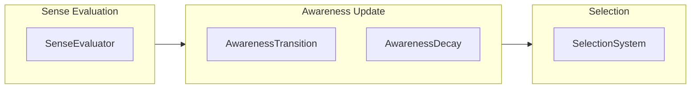
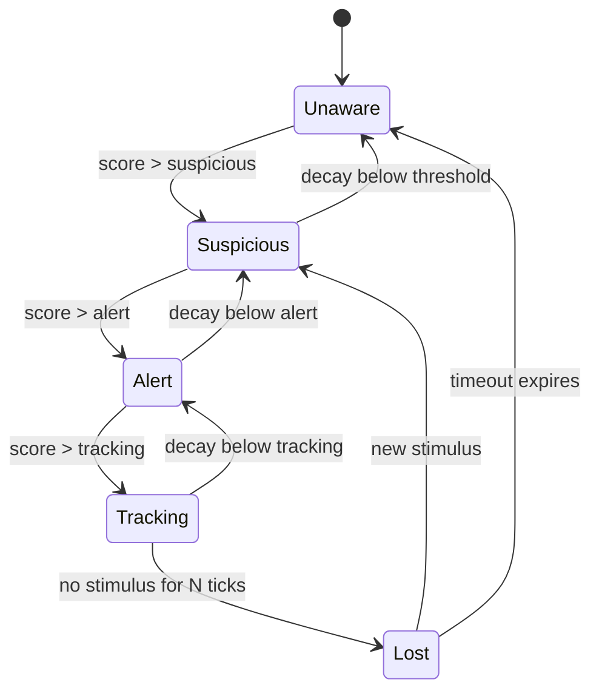
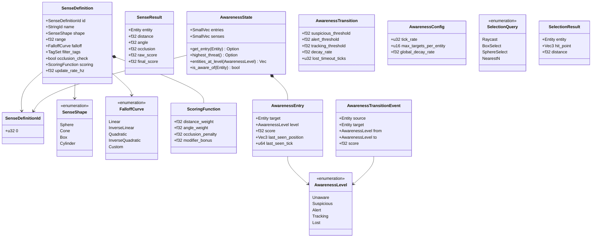
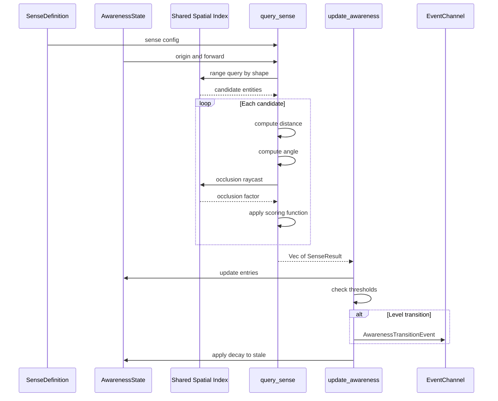

# Spatial Awareness System Design

## Requirements Trace

> **Canonical sources:** Features, requirements, and user stories are defined in
> [features/](../../features/), [requirements/](../../requirements/), and
> [user-stories/](../../user-stories/). The table below traces design elements to those definitions.

### AI Perception Senses (F-7.6.1--7)

| Feature | Requirement |
|---------|-------------|
| F-7.6.1 | R-7.6.1     |
| F-7.6.2 | R-7.6.2     |
| F-7.6.5 | R-7.6.5     |
| F-7.6.6 | R-7.6.6     |
| F-7.6.7 | R-7.6.7     |

1. **F-7.6.1** -- Sight sense (cone + line of sight)
2. **F-7.6.2** -- Hearing sense (radius + attenuation)
3. **F-7.6.5** -- Stimuli registration and expiration
4. **F-7.6.6** -- Sense aging and memory decay
5. **F-7.6.7** -- Custom senses and perception priority

### Stealth and Alert States (F-13.18.1--3)

| Feature   | Requirement |
|-----------|-------------|
| F-13.18.1 | R-13.18.1   |
| F-13.18.2 | R-13.18.2   |
| F-13.18.3 | R-13.18.3   |

1. **F-13.18.1** -- Player visibility and stealth scoring
2. **F-13.18.2** -- AI alert state machine (5 states)
3. **F-13.18.3** -- Noise generation and distraction

### Selection and Picking (F-13.11.1--2)

| Feature   | Requirement |
|-----------|-------------|
| F-13.11.1 | R-13.11.1   |
| F-13.11.2 | R-13.11.2   |

1. **F-13.11.1** -- 3D world picking via raycast through shared spatial index
2. **F-13.11.2** -- 2D screen-space picking with touch slop

### Shared Spatial Index (F-1.9.1, F-1.9.4, F-1.9.9)

| Feature | Requirement |
|---------|-------------|
| F-1.9.1 | R-1.9.1     |
| F-1.9.4 | R-1.9.4     |
| F-1.9.9 | R-1.9.9     |

1. **F-1.9.1** -- Unified BVH/octree spatial index
2. **F-1.9.4** -- Unified spatial query API
3. **F-1.9.9** -- AI perception and gameplay integration

### Cross-Cutting Dependencies

| Dependency           | Source  | Consumed API              |
|----------------------|---------|---------------------------|
| ECS world, queries   | F-1.1.1 | `Query`, `Entity`         |
| Shared spatial index | F-1.9.1 | Range queries, raycasts   |
| Event channels       | F-1.5.1 | `EventWriter`, `EventReader` |
| Change detection     | F-1.1.22| `Changed<T>` tracking     |
| Team / Faction       | F-13.1  | `FactionId`, `Allegiance` |

### Non-Functional Requirements

| NFR        | Target         | Description               |
|------------|----------------|---------------------------|
| NFR-SA.1   | < 2 ms/frame   | 100 entities querying     |
|            |                | 1000 targets              |
| NFR-SA.2   | < 0.5 ms/frame | Selection queries for     |
|            |                | 50 concurrent picks       |
| NFR-SA.3   | 1 frame        | Stimulus-to-awareness     |
|            |                | latency                   |

## Overview

Multi-factor spatial query system that unifies AI perception, stealth detection, target selection,
and world interaction picking. One generic system replaces four separate game-specific ones.

### Key Concepts

1. **SenseDefinition** -- a named spatial query with shape, range, falloff, and filter tags.
   "Sight", "hearing", and "smell" are data-driven sense configurations, not hardcoded systems.
2. **AwarenessState** -- per-entity state machine tracking detection level toward other entities
   (Unaware -> Suspicious -> Alert -> Tracking -> Lost).
3. **AwarenessQuery** -- run a sense against the shared spatial index, score results by
   distance/angle/occlusion/ modifiers, return ranked targets.
4. **SelectionQuery** -- simplified awareness query for player-facing picking (raycast, box select,
   nearest-N).

All queries go through the shared BVH spatial index (F-1.9.1). No separate spatial structures.

### Design Principles

1. **ECS-primary (~90%)-based.** All state lives in components. All logic runs as systems. No parallel data
   stores.
2. **Data-driven and no-code.** Sense definitions, scoring functions, thresholds, and decay rules
   are authored in the visual editor.
3. **No genre assumptions.** The same system drives stealth AI, target selection, fog of war vision,
   and interaction proximity. Configuration alone determines behavior.
4. **Shared spatial index.** All range queries and line-of-sight checks use the shared BVH
   (F-1.9.1). No per-system spatial acceleration.
5. **Static dispatch.** All systems are monomorphic. No trait objects on the hot path.
6. **Immutable definitions.** `SenseDefinition`, `ScoringFunction`, and `AwarenessTransition` are
   immutable data. Mutable runtime state is isolated to `AwarenessState`.

### Performance Targets

| Metric                         | Target               |
|--------------------------------|----------------------|
| 100 sources, 1000 targets      | < 2 ms (NFR-SA.1)   |
| 50 selection queries           | < 0.5 ms (NFR-SA.2) |
| Stimulus to awareness          | 1 frame (NFR-SA.3)  |
| Awareness state decay (idle)   | < 50 us/frame        |
| Single sense eval (4 factors)  | < 10 us              |

## Architecture

### Module Boundaries



### File Layout

```text
harmonius_game/
├── spatial_awareness/
│   ├── mod.rs              # Re-exports
│   ├── sense.rs            # SenseDefinitionId,
│   │                       # SenseDefinition,
│   │                       # SenseShape,
│   │                       # FalloffCurve,
│   │                       # ScoringFunction
│   ├── result.rs           # SenseResult
│   ├── awareness.rs        # AwarenessLevel,
│   │                       # AwarenessEntry,
│   │                       # AwarenessState,
│   │                       # AwarenessTransition,
│   │                       # AwarenessConfig,
│   │                       # AwarenessTransitionEvent
│   ├── selection.rs        # SelectionQuery,
│   │                       # SelectionResult
│   ├── query.rs            # query_sense(),
│   │                       # execute_selection()
│   ├── update.rs           # update_awareness()
│   ├── systems/
│   │   ├── sense_eval.rs   # SenseEvaluatorSystem
│   │   ├── transition.rs   # AwarenessTransitionSys
│   │   ├── decay.rs        # AwarenessDecaySystem
│   │   └── selection.rs    # SelectionSystem
│   └── plugin.rs           # SpatialAwarenessPlugin
```

### System Execution Order



### Awareness State Machine



### Core Data Structures



## API Design

### Sense Definition and Shape

```rust
/// Unique identifier for a sense type.
#[derive(
    Clone, Copy, Debug, PartialEq, Eq, Hash,
    Reflect,
)]
pub struct SenseDefinitionId(pub u32);

/// Geometric shape of a sense's detection volume.
#[derive(Clone, Debug, PartialEq, Reflect)]
pub enum SenseShape {
    /// Omnidirectional detection (hearing, smell).
    Sphere { radius: f32 },
    /// Directional detection (sight).
    Cone { radius: f32, half_angle: f32 },
    /// Axis-aligned volume (trigger zones).
    Box { half_extents: Vec3 },
    /// Vertical cylinder (proximity detection).
    Cylinder { radius: f32, height: f32 },
}

/// Falloff curve controlling how score attenuates
/// with distance from the sense origin.
#[derive(Clone, Debug, PartialEq, Reflect)]
pub enum FalloffCurve {
    /// Score decreases linearly with distance.
    Linear,
    /// Score is high near origin, drops to zero
    /// at max range.
    InverseLinear,
    /// Score decreases with distance squared.
    Quadratic,
    /// Score is high near origin, quadratic drop.
    InverseQuadratic,
    /// Designer-authored curve asset.
    Custom(AssetId),
}
```

### Scoring Function

```rust
/// Weights and penalties for computing a sense's
/// final score from raw spatial data.
#[derive(Clone, Debug, Reflect)]
pub struct ScoringFunction {
    /// Weight applied to distance factor (0..1).
    /// Higher values make distance more important.
    pub distance_weight: f32,
    /// Weight applied to angle factor (0..1).
    /// Only relevant for directional senses.
    pub angle_weight: f32,
    /// Penalty subtracted when target is occluded.
    /// Range: 0.0 ..= 1.0.
    pub occlusion_penalty: f32,
    /// Bonus added from external modifiers
    /// (equipment, abilities, terrain). Range:
    /// -1.0 ..= 1.0.
    pub modifier_bonus: f32,
}
```

### Sense Definition

```rust
/// Definition of a single sense. Immutable data
/// asset authored in the visual editor. Loaded
/// from data tables at startup.
#[derive(Clone, Debug, Reflect)]
pub struct SenseDefinition {
    /// Unique identifier for this sense type.
    pub id: SenseDefinitionId,
    /// Human-readable name for editor display.
    pub name: StringId,
    /// Geometric shape of the detection volume.
    pub shape: SenseShape,
    /// Maximum detection range in world units.
    pub range: f32,
    /// How score attenuates with distance.
    pub falloff: FalloffCurve,
    /// Tag filter: only entities matching these
    /// tags are considered as candidates.
    pub filter_tags: TagSet,
    /// Whether to perform occlusion raycasts
    /// against the spatial index.
    pub occlusion_check: bool,
    /// Scoring weights for this sense.
    pub scoring: ScoringFunction,
    /// How many times per second this sense
    /// re-evaluates. Lower rates save budget.
    pub update_rate_hz: f32,
}
```

### Sense Result

```rust
/// Result of evaluating a single sense against a
/// single candidate entity. Produced by
/// `query_sense`, consumed by `update_awareness`.
#[derive(Clone, Debug, Reflect)]
pub struct SenseResult {
    /// The detected entity.
    pub entity: Entity,
    /// Distance from sense origin to target in
    /// world units.
    pub distance: f32,
    /// Angle between sense forward vector and
    /// direction to target in radians.
    pub angle: f32,
    /// Occlusion factor (0.0 = fully visible,
    /// 1.0 = fully occluded).
    pub occlusion: f32,
    /// Score before scoring function weights.
    pub raw_score: f32,
    /// Final weighted score after all factors.
    /// Range: 0.0 ..= 1.0.
    pub final_score: f32,
}
```

### Awareness State

```rust
/// Awareness level of a source toward a target.
/// Ordered from lowest to highest alertness.
#[derive(
    Clone, Copy, Debug, PartialEq, Eq, Hash,
    PartialOrd, Ord, Reflect,
)]
pub enum AwarenessLevel {
    /// No knowledge of the target.
    Unaware,
    /// Faint signal detected, not confirmed.
    Suspicious,
    /// Target confirmed, actively responding.
    Alert,
    /// Maintaining contact with a known target.
    Tracking,
    /// Contact lost, searching or timing out.
    Lost,
}

/// A single entry tracking awareness of one
/// target entity. Stored inside AwarenessState.
#[derive(Clone, Debug, Reflect)]
pub struct AwarenessEntry {
    /// The entity being tracked.
    pub target: Entity,
    /// Current awareness level toward this target.
    pub level: AwarenessLevel,
    /// Current accumulated perception score.
    /// Range: 0.0 ..= 1.0.
    pub score: f32,
    /// Last known world position of the target.
    pub last_seen_position: Vec3,
    /// Tick when the target was last detected.
    pub last_seen_tick: u64,
}

/// ECS component: per-entity awareness state
/// tracking detection levels toward multiple
/// targets. Attached to entities that need
/// spatial awareness (NPCs, cameras, turrets).
#[derive(Component, Debug, Reflect)]
pub struct AwarenessState {
    /// Active awareness entries, one per tracked
    /// target. Inline storage for 8 entries.
    pub entries: SmallVec<[AwarenessEntry; 8]>,
    /// Set of sense definitions this entity uses.
    /// Inline storage for 4 senses.
    pub senses: SmallVec<[SenseDefinitionId; 4]>,
}

impl AwarenessState {
    /// Find the entry for a specific target.
    pub fn get_entry(
        &self,
        target: Entity,
    ) -> Option<&AwarenessEntry>;

    /// Return the entry with the highest score.
    pub fn highest_threat(
        &self,
    ) -> Option<&AwarenessEntry>;

    /// Return all entities at a given awareness
    /// level.
    pub fn entities_at_level(
        &self,
        level: AwarenessLevel,
    ) -> Vec<Entity>;

    /// Returns true if target has any entry above
    /// Unaware.
    pub fn is_aware_of(
        &self,
        target: Entity,
    ) -> bool;
}
```

### Awareness Transition and Config

```rust
/// Thresholds and rates governing awareness level
/// transitions. Immutable data authored in the
/// visual editor.
#[derive(Clone, Debug, Reflect)]
pub struct AwarenessTransition {
    /// Score threshold to enter Suspicious.
    pub suspicious_threshold: f32,
    /// Score threshold to enter Alert.
    pub alert_threshold: f32,
    /// Score threshold to enter Tracking.
    pub tracking_threshold: f32,
    /// Rate at which score decays per tick when
    /// no new stimulus is received.
    pub decay_rate: f32,
    /// Number of ticks with no stimulus before
    /// a Lost entry reverts to Unaware.
    pub lost_timeout_ticks: u32,
}

/// Resource: global configuration for the spatial
/// awareness system.
#[derive(Clone, Debug, Reflect)]
pub struct AwarenessConfig {
    /// How often awareness updates run (ticks per
    /// second). Decoupled from frame rate.
    pub tick_rate: u32,
    /// Maximum tracked targets per entity. Oldest
    /// entries are evicted when exceeded.
    pub max_targets_per_entity: u16,
    /// Global decay rate multiplier applied on
    /// top of per-transition decay rates.
    pub global_decay_rate: f32,
}
```

### Awareness Transition Event

```rust
/// Event fired when an awareness level changes.
/// Consumed by behavior trees, alert animations,
/// UI indicators, and fog of war updates.
#[derive(Clone, Debug, Reflect)]
pub struct AwarenessTransitionEvent {
    /// The perceiving entity.
    pub source: Entity,
    /// The perceived entity.
    pub target: Entity,
    /// Previous awareness level.
    pub from: AwarenessLevel,
    /// New awareness level.
    pub to: AwarenessLevel,
    /// Current score at time of transition.
    pub score: f32,
}
```

### Query Functions

```rust
/// Evaluate a sense definition from a given origin
/// and forward direction against all candidates in
/// the shared spatial index. Returns scored
/// results sorted by final_score descending.
///
/// Pure function: no side effects, no mutation.
pub fn query_sense(
    sense: &SenseDefinition,
    origin: Vec3,
    forward: Vec3,
    spatial_index: &SpatialIndex,
    world: &World,
) -> Vec<SenseResult>;

/// Update an entity's awareness state with new
/// sense results. Applies scoring, transitions
/// levels based on thresholds, and decays stale
/// entries.
pub fn update_awareness(
    state: &mut AwarenessState,
    results: &[SenseResult],
    transition: &AwarenessTransition,
    current_tick: u64,
);
```

### Selection Queries

```rust
/// Player-facing spatial query for entity picking
/// and selection. Simplified interface on top of
/// the shared spatial index.
#[derive(Clone, Debug, Reflect)]
pub enum SelectionQuery {
    /// Single ray from camera through screen
    /// coordinates. Returns nearest hit.
    Raycast {
        origin: Vec3,
        direction: Vec3,
        max_distance: f32,
    },
    /// Axis-aligned box select (marquee drag).
    BoxSelect {
        min: Vec3,
        max: Vec3,
    },
    /// Spherical area select (radial menu,
    /// area abilities).
    SphereSelect {
        center: Vec3,
        radius: f32,
    },
    /// Find the N nearest entities within radius.
    NearestN {
        center: Vec3,
        radius: f32,
        count: u32,
    },
}

/// Result of a selection query. One entry per
/// selected entity, sorted by distance.
#[derive(Clone, Debug, Reflect)]
pub struct SelectionResult {
    /// The selected entity.
    pub entity: Entity,
    /// World-space hit point (for raycasts) or
    /// entity center (for area selects).
    pub hit_point: Vec3,
    /// Distance from query origin to hit point.
    pub distance: f32,
}

/// Execute a selection query against the shared
/// spatial index with an entity filter predicate.
/// Returns results sorted by distance ascending.
///
/// Pure function: no side effects, no mutation.
pub fn execute_selection(
    query: &SelectionQuery,
    spatial_index: &SpatialIndex,
    filter: impl Fn(Entity) -> bool,
) -> Vec<SelectionResult>;
```

### Scoring Formula

For a single sense evaluating a single target:

```text
distance_factor = falloff(distance / range)
angle_factor = 1.0 - (angle / max_angle)
occlusion_factor = if occluded { 0.0 } else { 1.0 }

raw_score =
    distance_factor * scoring.distance_weight
  + angle_factor * scoring.angle_weight
  - occlusion_factor * scoring.occlusion_penalty
  + scoring.modifier_bonus

final_score = clamp(raw_score, 0.0, 1.0)
```

| Factor   | Computation                        |
|----------|------------------------------------|
| Distance | `falloff(dist / sense.range)`      |
| Angle    | `1.0 - (angle / max_angle)`       |
| Occlusion| Raycast from origin to target     |
| Modifier | External bonus from components     |

## Data Flow

### Sense Evaluation and Awareness Update



### End-to-End Pipeline

1. **Asset load:** `SenseDefinition` loaded from data tables. `AwarenessTransition` loaded per
   entity archetype.
2. **Component attach:** `AwarenessState` attached to entities that need spatial awareness.
3. **Phase 1 -- Sense evaluation:** `SenseEvaluatorSystem` calls `query_sense` for each entity with
   an `AwarenessState` component, using the shared spatial index for range queries and occlusion
   raycasts.
4. **Phase 2 -- Awareness update:** `AwarenessTransitionSystem` calls `update_awareness` to
   transition levels based on scores and thresholds. `AwarenessDecaySystem` decays scores for
   entries with no recent stimulus.
5. **Phase 3 -- Consumption:** AI behavior trees read `AwarenessState` for decisions. Stealth HUD
   reads scores for visibility indicators. Fog of war reads awareness levels for faction vision.
6. **Selection:** `SelectionSystem` processes `SelectionQuery` events from the input system for
   player-facing entity picking. Results written as `SelectionResult` events.

## Platform Considerations

### Scaling Tiers

| Platform | Max Sources | Max Targets | Budget |
|----------|-------------|-------------|--------|
| Desktop  | 100         | 1000        | 2 ms   |
| Console  | 100         | 1000        | 2 ms   |
| Mobile   | 30          | 200         | 1 ms   |

### Platform-Specific Notes

| Platform | Consideration                          |
|----------|----------------------------------------|
| Mobile   | Reduce max update_rate_hz to 5.       |
|          | Cap max_targets_per_entity to 4.       |
| Mobile   | Disable occlusion raycasts for senses  |
|          | with > 50 candidates.                  |
| All      | Spatial queries routed through shared  |
|          | BVH (F-1.9.1).                         |
| All      | Falloff curve sampling uses linear     |
|          | interpolation for cache efficiency.    |

### Performance Budget

| System               | Budget       | Strategy              |
|----------------------|--------------|-----------------------|
| Sense evaluation     | 1.5 ms/frame | LOD by distance       |
| Awareness transition | 0.2 ms/frame | Only active pairs     |
| Awareness decay      | 0.1 ms/frame | Skip zero-score       |
| Selection queries    | 0.2 ms/frame | Event-driven, on      |
|                      |              | input only            |

## Test Plan

Full test cases are in the companion file
[spatial-awareness-test-cases.md](spatial-awareness-test-cases.md).

### Unit Tests

| Test                                    | Req       |
|-----------------------------------------|-----------|
| `test_sphere_sense_candidates`          | R-7.6.2   |
| `test_cone_sense_fov_inside`           | R-7.6.1   |
| `test_cone_sense_fov_outside`          | R-7.6.1   |
| `test_box_sense_candidates`            | R-7.6.7   |
| `test_cylinder_sense_candidates`       | R-7.6.7   |
| `test_falloff_linear`                  | R-7.6.1   |
| `test_falloff_inverse_linear`          | R-7.6.1   |
| `test_falloff_quadratic`              | R-7.6.1   |
| `test_falloff_custom_curve`           | R-7.6.7   |
| `test_scoring_distance_only`          | R-7.6.1   |
| `test_scoring_angle_weight`           | R-7.6.1   |
| `test_scoring_occlusion_penalty`      | R-7.6.1   |
| `test_scoring_modifier_bonus`         | R-7.6.7   |
| `test_score_clamp_zero_one`           | R-7.6.1   |
| `test_awareness_unaware_to_suspicious` | R-13.18.2 |
| `test_awareness_suspicious_to_alert`  | R-13.18.2 |
| `test_awareness_alert_to_tracking`    | R-13.18.2 |
| `test_awareness_tracking_to_lost`     | R-13.18.2 |
| `test_awareness_lost_to_unaware`      | R-13.18.2 |
| `test_awareness_lost_to_suspicious`   | R-13.18.2 |
| `test_awareness_decay_reduces_score`  | R-7.6.6   |
| `test_awareness_decay_below_threshold`| R-7.6.6   |
| `test_awareness_max_targets_eviction` | R-7.6.5   |
| `test_highest_threat_returns_max`     | R-13.18.1 |
| `test_entities_at_level_filter`       | R-13.18.2 |
| `test_is_aware_of_above_unaware`      | R-13.18.2 |
| `test_selection_raycast_nearest`      | R-13.11.1 |
| `test_selection_box_all_inside`       | R-13.11.1 |
| `test_selection_sphere_radius`        | R-13.11.1 |
| `test_selection_nearest_n_count`      | R-13.11.1 |
| `test_selection_filter_excludes`      | R-13.11.1 |
| `test_selection_sorted_by_distance`   | R-13.11.1 |

1. **`test_sphere_sense_candidates`** -- Sphere sense with radius 10; 3 targets inside, 2 outside;
   verify 3 results returned.
2. **`test_cone_sense_fov_inside`** -- Cone sense with 90-degree half-angle; target at 45 degrees;
   verify non-zero score.
3. **`test_cone_sense_fov_outside`** -- Target at 100 degrees from cone forward; verify zero score.
4. **`test_box_sense_candidates`** -- Box sense with half-extents (5, 5, 5); targets inside and
   outside; verify correct inclusion.
5. **`test_cylinder_sense_candidates`** -- Cylinder sense with radius 5 and height 10; verify
   targets above height are excluded.
6. **`test_falloff_linear`** -- Linear falloff; target at half range; verify score is 0.5.
7. **`test_falloff_inverse_linear`** -- Inverse linear; target at half range; verify score is 0.5.
8. **`test_falloff_quadratic`** -- Quadratic falloff; target at half range; verify score is 0.25.
9. **`test_falloff_custom_curve`** -- Custom curve asset; verify score matches curve sample.
10. **`test_scoring_distance_only`** -- distance_weight 1.0, others 0.0; verify final_score equals
    distance factor.
11. **`test_scoring_angle_weight`** -- angle_weight 1.0; target at 45 degrees of 90-degree cone;
    verify score is 0.5.
12. **`test_scoring_occlusion_penalty`** -- Occluded target with occlusion_penalty 0.8; verify score
    reduced.
13. **`test_scoring_modifier_bonus`** -- modifier_bonus 0.2; verify score increased by 0.2.
14. **`test_score_clamp_zero_one`** -- Weights sum to 1.5; verify clamped to 1.0. Negative sum;
    verify 0.0.
15. **`test_awareness_unaware_to_suspicious`** -- Score exceeds suspicious_threshold; verify level
    changes.
16. **`test_awareness_suspicious_to_alert`** -- Score exceeds alert_threshold; verify transition.
17. **`test_awareness_alert_to_tracking`** -- Score exceeds tracking_threshold; verify transition.
18. **`test_awareness_tracking_to_lost`** -- No stimulus for lost_timeout_ticks; verify transition
    to Lost.
19. **`test_awareness_lost_to_unaware`** -- Lost entry times out; verify removal or Unaware.
20. **`test_awareness_lost_to_suspicious`** -- New stimulus while Lost; verify transition to
    Suspicious.
21. **`test_awareness_decay_reduces_score`** -- No stimulus; tick once; verify score reduced by
    decay_rate.
22. **`test_awareness_decay_below_threshold`** -- Decay drops score below suspicious_threshold;
    verify level demotes to Unaware.
23. **`test_awareness_max_targets_eviction`** -- Exceed max_targets_per_entity; verify oldest entry
    evicted.
24. **`test_highest_threat_returns_max`** -- Three entries with scores 0.3, 0.8, 0.5; verify
    highest_threat returns 0.8.
25. **`test_entities_at_level_filter`** -- Mixed levels; verify entities_at_level returns correct
    subset.
26. **`test_is_aware_of_above_unaware`** -- Entry at Suspicious; verify is_aware_of returns true. No
    entry; verify returns false.
27. **`test_selection_raycast_nearest`** -- Ray hits 3 entities; verify nearest returned first.
28. **`test_selection_box_all_inside`** -- 5 entities inside box, 3 outside; verify 5 results.
29. **`test_selection_sphere_radius`** -- Sphere with radius 10; verify only entities within 10
    returned.
30. **`test_selection_nearest_n_count`** -- NearestN with count 3; 10 entities in range; verify 3
    closest.
31. **`test_selection_filter_excludes`** -- Filter predicate rejects 2 of 5 candidates; verify 3
    results.
32. **`test_selection_sorted_by_distance`** -- Verify results sorted ascending by distance.

### Integration Tests

| Test                                   | Req        |
|----------------------------------------|------------|
| `test_100_sources_1000_targets_budget` | NFR-SA.1   |
| `test_50_selections_budget`           | NFR-SA.2   |
| `test_stimulus_to_awareness_latency`  | NFR-SA.3   |
| `test_full_awareness_lifecycle`       | R-13.18.2  |
| `test_selection_with_awareness`       | R-13.11.1  |

1. **`test_100_sources_1000_targets_budget`** -- Spawn 100 sources and 1000 targets; measure frame
   time; verify < 2 ms.
2. **`test_50_selections_budget`** -- Execute 50 concurrent selection queries; verify < 0.5 ms.
3. **`test_stimulus_to_awareness_latency`** -- Inject sense result; verify awareness transition
   completes within 1 frame.
4. **`test_full_awareness_lifecycle`** -- Entity progresses through all 5 awareness levels and back
   to Unaware via decay and timeout.
5. **`test_selection_with_awareness`** -- Selection query picks entity; verify result includes
   entities that also appear in awareness state.

### Benchmarks

| Benchmark                     | Target       | Source     |
|-------------------------------|--------------|------------|
| 100 sources, 1000 targets     | < 2 ms/frame | NFR-SA.1   |
| 50 selection queries          | < 0.5 ms     | NFR-SA.2   |
| Single sense eval             | < 10 us      | NFR-SA.1   |
| Awareness transition check    | < 1 us       | NFR-SA.1   |
| Selection raycast             | < 50 us      | NFR-SA.2   |
| Awareness decay (100 entries) | < 20 us      | NFR-SA.1   |

## Open Questions

1. **Multi-sense score combination.** When an entity has both vision and hearing senses, should
   scores combine via max or weighted sum? Max is simpler and avoids double-counting. Weighted sum
   captures cases where weak signals from multiple senses should stack.
2. **AwarenessEntry memory management.** Per source-target entries could grow large (100 sources x
   1000 targets = 100,000 potential pairs). The design only creates entries above the minimum
   threshold. A pool allocator for awareness entries may be needed if archetype storage fragments
   under high churn.
3. **Selection query batching.** Multiple selection queries per frame (e.g., multi-touch on mobile)
   could be batched into a single spatial index traversal. The current design processes queries
   individually. Batching depends on profiling real workloads.
4. **Occlusion query LOD.** Full raycasts for occlusion are expensive with many candidates. A tiered
   approach (skip occlusion for distant targets, full raycast for nearby ones) would reduce cost but
   may cause visible popping. The tier distances need profiling data.
5. **Network replication of awareness.** Awareness states may need replication for
   server-authoritative AI. The replication strategy (snapshot vs. delta) depends on the networking
   design (F-8) being finalized.
