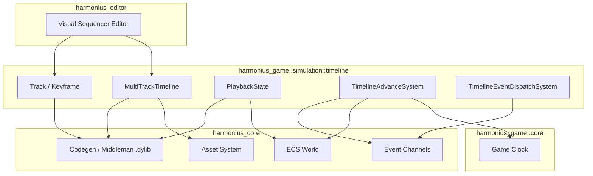
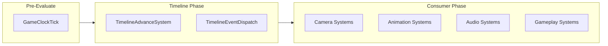
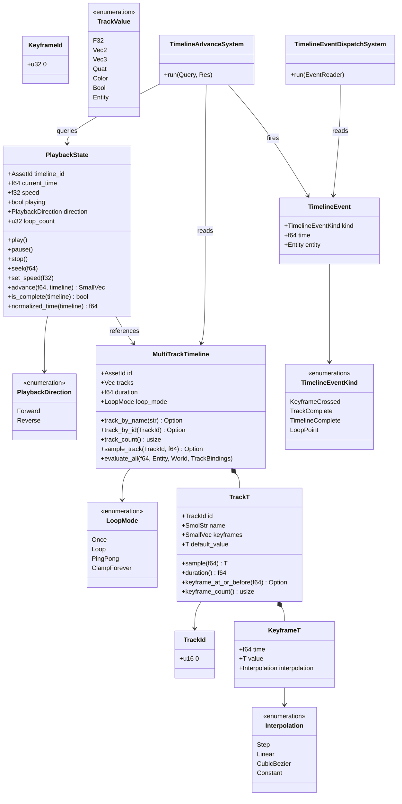
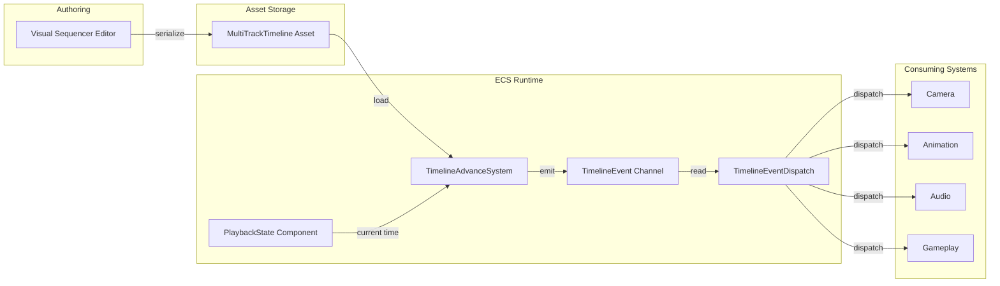

# Timeline Sequencer Design

## Requirements Trace

> **Canonical sources:** Features, requirements, and user stories are defined in
> [features/](../../features/), [requirements/](../../requirements/), and
> [user-stories/](../../user-stories/). The table below traces design elements to those definitions.

### Engine Primitives (primary trace)

| Feature   | Requirement | User Story  | Design Element                   |
|-----------|-------------|-------------|----------------------------------|
| F-17.4.1  | R-17.4.1    | US-17.4.1   | Track<T> + Keyframe<T> primitive |
| F-17.4.2  | R-17.4.2    | US-17.4.2   | Sample cost < 100 ns             |
| F-17.4.3  | R-17.4.3    | US-17.4.3   | MultiTrackTimeline asset         |
| F-17.4.4  | R-17.4.4    | US-17.4.4   | 32 tracks evaluated < 0.5 ms     |
| F-17.4.5  | R-17.4.5    | US-17.4.5   | 1,000 playbacks advance <0.5 ms  |
| F-17.4.6  | R-17.4.6    | US-17.4.6   | PlaybackState ECS component      |
| F-17.4.7  | R-17.4.7    | US-17.4.7   | Cutscene composite primitive     |
| F-17.4.8  | R-17.4.8    | US-17.4.8   | Animation blending integration   |
| F-17.4.9  | R-17.4.9    | US-17.4.9   | Property animation via codegen   |
| F-17.4.10 | R-17.4.10   | US-17.4.10  | Scrubbing and keyframe-on-edit   |
| F-17.4.11 | R-17.4.11   | US-17.4.11  | Timeline keyframe events         |
| F-17.4.12 | R-17.4.12   | US-17.4.12  | rkyv playback state persistence  |

1. **R-17.4.1** -- Generic `Track<T>` with `Keyframe<T>` and interpolation modes
2. **R-17.4.2** -- Single track sample under 100 ns per sample
3. **R-17.4.3** -- `MultiTrackTimeline` immutable asset with synced tracks
4. **R-17.4.4** -- 32 active tracks on one timeline within 0.5 ms per frame
5. **R-17.4.5** -- 1,000 active playback states advanced within 0.5 ms
6. **R-17.4.6** -- `PlaybackState` mutable ECS component separate from asset
7. **R-17.4.7** -- Cutscene entity with camera, actors, audio, VFX, subtitles
8. **R-17.4.8** -- Animation track integration with priority blending
9. **R-17.4.9** -- Property animation for any ECS component field via codegen
10. **R-17.4.10** -- Scrubbing with keyframe creation on entity property edits
11. **R-17.4.11** -- Timeline events at keyframe crossings through ECS channel
12. **R-17.4.12** -- rkyv save/restore of playback state bit-identically

### Game-Framework Consumers (cross-reference)

| Feature    | Requirement | Consumer Role                                     |
|------------|-------------|---------------------------------------------------|
| F-13.5.1   | R-13.5.1    | Multi-track sequencer consumed by cutscenes       |
| F-13.5.3   | R-13.5.3    | Camera rails and splines driven by timelines     |
| F-13.5.4   | R-13.5.4    | Actor animation blending via timelines           |
| F-13.19.4a | R-13.19.4a  | NPC schedules modeled on timelines               |
| F-13.23.4  | R-13.23.4   | Daily login reward calendar on timelines         |

### Non-Functional Requirements

| Requirement  | Target |
|--------------|--------|
| R-13.5.NF1   | Evaluation under 0.5 ms for 32 tracks |
| NFR-TL.NF1   | 1000 active timelines advance < 0.5 ms |
| NFR-TL.NF2   | Sample interpolation under 100 ns |

### Cross-Cutting Dependencies

| Dependency | Source | Consumed API |
|------------|--------|--------------|
| ECS world, queries | F-1.1.1 | Archetype storage, `Query` |
| Event channels | F-1.5.1 | `EventWriter<T>`, `EventReader<T>` |
| Singleton resources | F-1.5.6 | `Res<T>`, `ResMut<T>` |
| Change detection | F-1.1.22 | `Changed<T>` for dirty tracking |
| Asset system | F-1.6 | `Assets<MultiTrackTimeline>` |
| Game clock | F-13.1.2 | `GameTime` resource |
| Animation SM | F-9.4.1 | Animation layers, blend trees |
| Camera system | F-13.4 | Gameplay camera override |

## Overview

This document defines a generic multi-track timeline sequencer primitive for all time-sequenced
events in the Harmonius engine. Timelines are immutable assets authored in the visual sequencer
editor. Playback state is a mutable ECS component.

### Key Concepts

1. **Keyframe\<T\>** -- A timestamped value with an interpolation mode. The fundamental unit of
   timeline data.
2. **Track\<T\>** -- A named channel of keyframes sharing a type (e.g., "camera_fov",
   "audio_volume", "animation_weight"). Each track has its own keyframe sequence and default value.
3. **MultiTrackTimeline** -- An immutable asset containing multiple tracks that play in sync. The
   primary asset type authored in the visual editor.
4. **PlaybackState** -- A per-entity mutable ECS component tracking current time, play/pause, speed,
   direction, and loop count.
5. **TimelineEvent** -- Fired when playback crosses a keyframe, completes a track, loops, or
   finishes. Consuming systems react to these events.

### Design Principles

1. **ECS-primary (~90%)-based.** All state lives in components. No parallel data stores.
2. **Immutable assets, mutable playback.** Timeline definitions are frozen after authoring. Only
   `PlaybackState` mutates at runtime.
3. **Genre-agnostic.** Cinematics, NPC schedules, login calendars, music cue sheets, and scripted
   sequences all use the same primitive.
4. **Static dispatch.** Monomorphized generics on hot paths. No trait objects except at editor
   boundaries.
5. **Deterministic.** Identical inputs produce identical outputs. Playback is framerate-independent.
6. **No Arc, Rc, Cell, RefCell.** Owned values, generational indices, or scoped borrows only.

### Performance Targets

| Metric | Target |
|--------|--------|
| 32-track evaluation | < 0.5 ms (R-13.5.NF1) |
| 1000 active timelines advance | < 0.5 ms (NFR-TL.NF1) |
| Single sample interpolation | < 100 ns (NFR-TL.NF2) |

## Architecture

### Module Boundaries



### File Layout

```text
harmonius_game/
├── simulation/
│   ├── timeline/
│   │   ├── mod.rs           # Re-exports
│   │   ├── keyframe.rs      # KeyframeId, Keyframe<T>,
│   │   │                    # Interpolation
│   │   ├── track.rs         # TrackId, Track<T>,
│   │   │                    # sampling logic
│   │   ├── asset.rs         # MultiTrackTimeline,
│   │   │                    # LoopMode
│   │   ├── playback.rs      # PlaybackState,
│   │   │                    # PlaybackDirection
│   │   ├── event.rs         # TimelineEvent,
│   │   │                    # TimelineEventKind
│   │   ├── systems.rs       # TimelineAdvanceSystem,
│   │   │                    # TimelineEventDispatch
│   │   └── plugin.rs        # TimelinePlugin
│   └── mod.rs               # Re-exports
```

### System Execution Order



### Class Diagram -- Timeline Types



## API Design

### Core Types

```rust
/// Implemented for f32, f64, Vec2, Vec3, Vec4,
/// Quat, Color, and TrackValue. Used by Track<T>
/// sampling on hot paths — static dispatch only.
pub trait Lerp {
    fn lerp(&self, other: &Self, t: f64) -> Self;
}
```

```rust
#[derive(Clone, Copy, Debug, PartialEq, Eq,
    Hash, rkyv::Archive, rkyv::Serialize,
    rkyv::Deserialize)]
pub struct KeyframeId(pub u32);

#[derive(Clone, Copy, Debug, PartialEq, Eq,
    Hash, rkyv::Archive, rkyv::Serialize,
    rkyv::Deserialize)]
pub struct TrackId(pub u16);

#[derive(Clone, Debug, PartialEq, rkyv::Archive,
    rkyv::Serialize, rkyv::Deserialize)]
pub enum Interpolation {
    /// Jump to value at keyframe time; hold until
    /// next keyframe.
    Step,
    /// Linearly interpolate between keyframe values.
    Linear,
    /// Smooth curve defined by two control points.
    /// Evaluated via de Casteljau; control points
    /// match CSS cubic-bezier() convention.
    /// Ref: https://www.w3.org/TR/css-easing-1/
    ///      #cubic-bezier-easing-functions
    CubicBezier { c1: Vec2, c2: Vec2 },
    /// Hold the previous value forever; never
    /// interpolate. Equivalent to Step but the
    /// hold extends to the end of the track.
    Constant,
}

/// T must implement Lerp + Clone.
#[derive(Clone, Debug, rkyv::Archive,
    rkyv::Serialize, rkyv::Deserialize)]
pub struct Keyframe<T> {
    pub time: f64,
    pub value: T,
    pub interpolation: Interpolation,
}
```

### Track

```rust
/// Named channel of keyframes sorted by time.
#[derive(Clone, Debug, rkyv::Archive,
    rkyv::Serialize, rkyv::Deserialize)]
pub struct Track<T> {
    pub id: TrackId,
    pub name: SmolStr,
    /// Sorted ascending by `Keyframe::time`.
    pub keyframes: SmallVec<[Keyframe<T>; 8]>,
    pub default_value: T,
}

impl<T: Lerp + Clone> Track<T> {
    /// Binary search for the keyframe pair
    /// bracketing `time`, then interpolate.
    /// Hot path. O(log n).
    /// Ref: https://en.cppreference.com/w/
    ///      cpp/algorithm/lower_bound
    pub fn sample(&self, time: f64) -> T;
    pub fn duration(&self) -> f64;
    /// Returns the keyframe at or before `time`.
    /// Cold path; used by editor and scrubber.
    pub fn keyframe_at_or_before(
        &self, time: f64,
    ) -> Option<&Keyframe<T>>;
    pub fn keyframe_count(&self) -> usize;
}
```

### MultiTrackTimeline (Asset)

```rust
/// Concrete value type for timeline tracks.
/// Codegen'd variants for user-defined property
/// types are added in the middleman .dylib.
/// Exhaustive-match interpolation; no dyn dispatch.
#[derive(Clone, Debug, rkyv::Archive,
    rkyv::Serialize, rkyv::Deserialize)]
pub enum TrackValue {
    F32(f32),
    Vec2(Vec2),
    Vec3(Vec3),
    Quat(Quat),
    Color(Color),
    Bool(bool),
    Entity(Entity),
}

#[derive(Clone, Copy, Debug, PartialEq, Eq,
    rkyv::Archive, rkyv::Serialize,
    rkyv::Deserialize)]
pub enum LoopMode {
    Once,
    Loop,
    PingPong,
    ClampForever,
}

/// Immutable multi-track timeline asset.
/// Loaded via zero-copy mmap (rkyv).
#[derive(Clone, Debug, rkyv::Archive,
    rkyv::Serialize, rkyv::Deserialize)]
pub struct MultiTrackTimeline {
    pub id: AssetId,
    pub tracks: Vec<Track<TrackValue>>,
    pub duration: f64,
    pub loop_mode: LoopMode,
}

impl MultiTrackTimeline {
    /// Linear scan — cold path (editor / setup).
    /// O(n) on track count; acceptable for <= 64
    /// tracks.
    pub fn track_by_name(
        &self, name: &str,
    ) -> Option<&Track<TrackValue>>;
    /// Direct index lookup — hot path O(1).
    /// Prefer over track_by_name in runtime code.
    pub fn track_by_id(
        &self, id: TrackId,
    ) -> Option<&Track<TrackValue>>;
    pub fn track_count(&self) -> usize;
    pub fn sample_track(
        &self, track: TrackId, time: f64,
    ) -> Option<TrackValue>;
    /// Evaluate all tracks at `time` and write
    /// values to ECS components via codegen'd
    /// binding fns. Called by scrubber and
    /// advance system.
    pub fn evaluate_all(
        &self,
        time: f64,
        entity: Entity,
        world: &mut World,
        bindings: &TrackBindings,
    );
}
```

### PlaybackState (Component)

```rust
#[derive(Clone, Copy, Debug, PartialEq, Eq,
    rkyv::Archive, rkyv::Serialize,
    rkyv::Deserialize)]
pub enum PlaybackDirection {
    Forward,
    Reverse,
}

/// Per-entity mutable playback state.
/// Codegen'd as an ECS component into the
/// middleman .dylib. Serialized to save files
/// via rkyv for mid-cutscene resume.
#[derive(Clone, Debug)]
pub struct PlaybackState {
    pub timeline_id: AssetId,
    pub current_time: f64,
    pub speed: f32,
    pub playing: bool,
    pub direction: PlaybackDirection,
    pub loop_count: u32,
}

impl PlaybackState {
    pub fn play(&mut self);
    pub fn pause(&mut self);
    pub fn stop(&mut self);
    pub fn seek(&mut self, time: f64);
    pub fn set_speed(&mut self, speed: f32);
    /// Advance by dt. Handles looping, reversal,
    /// and completion. Returns crossed events.
    /// SmallVec avoids heap allocation for the
    /// common case of <= 4 events per frame.
    pub fn advance(
        &mut self, dt: f64,
        timeline: &MultiTrackTimeline,
    ) -> SmallVec<[TimelineEvent; 4]>;
    pub fn is_complete(
        &self, timeline: &MultiTrackTimeline,
    ) -> bool;
    /// Current time as 0.0..1.0 fraction.
    pub fn normalized_time(
        &self, timeline: &MultiTrackTimeline,
    ) -> f64;
}
```

### Events

```rust
#[derive(Clone, Debug)]
pub enum TimelineEventKind {
    KeyframeCrossed {
        track: TrackId,
        keyframe: KeyframeId,
    },
    TrackComplete { track: TrackId },
    TimelineComplete,
    LoopPoint { count: u32 },
}

/// Emitted by TimelineAdvanceSystem. Consumed by
/// camera, animation, audio, gameplay systems.
/// Codegen'd event type in the middleman .dylib.
#[derive(Clone, Debug)]
pub struct TimelineEvent {
    pub kind: TimelineEventKind,
    pub time: f64,
    pub entity: Entity,
}
```

## Codegen Integration

Timeline types participate in the middleman `.dylib` codegen pipeline. No runtime reflection, no
`TypeRegistry`, no `dyn Reflect`.

1. **`PlaybackState` as a codegen'd component.** The ECS codegen pipeline emits `PlaybackState` as a
   component into the middleman `.dylib`. Property panels, serialization, and change-detection hooks
   are all generated statically.
2. **`TimelineEvent` and `TimelineEventKind` are codegen'd event types.** The event bus codegen
   emits typed channels for each event kind. No type-erased dispatch.
3. **Custom `Interpolation` modes.** Users define custom easing curves via the editor. The codegen
   pipeline emits new `Interpolation` enum variants into the middleman `.dylib`. Hot-reload
   recompiles the middleman.
4. **Custom `TrackValue` variants.** User-defined component property types are codegen'd as
   `TrackValue` enum variants. Exhaustive match ensures interpolation is always total — no fallback
   `dyn` path.
5. **Codegen'd property binding functions.** For each `(component, field)` pair targeted by a
   property animation track, the codegen pipeline emits:

   ```rust
   fn apply_<component>_<field>(
       entity: Entity, value: T, world: &mut World,
   )
   ```

   Called by `MultiTrackTimeline::evaluate_all`. Compiled into the middleman `.dylib`. Same
   "everything is Rust" architecture.

## Data Flow



### Step-by-Step

1. **Authoring.** Timeline authored in the visual sequencer editor. Tracks and keyframes are placed
   on a time axis.
2. **Serialization.** The editor serializes the `MultiTrackTimeline` as an immutable rkyv archive.
   Baked assets are loaded at runtime via zero-copy mmap — no deserialization step.
3. **Entity binding.** A `PlaybackState` component is attached to an entity that references the
   timeline asset by `AssetId`.
4. **Advance (Simulation Tick).** The `TimelineAdvanceSystem` runs in the **Simulation** phase of
   the game loop (see `docs/architecture.md` §Game Loop Phases, Phase 4 — Simulation Tick). For each
   entity with `PlaybackState`, it reads the `GameTime` delta, calls `advance(dt)`, and collects
   `TimelineEvent`s into a per-thread arena.
5. **Event emission.** All `TimelineEvent`s produced during the advance step are written to the
   event channel.
6. **Dispatch.** The `TimelineEventDispatchSystem` reads events and routes them to consuming systems
   (camera, animation, audio, gameplay) based on track metadata and event kind.
7. **Consumption.** Consuming systems apply sampled values to their respective components (camera
   FOV, animation weight, audio volume, etc.).

### Advance Algorithm

```rust
pub fn advance(
    &mut self,
    dt: f64,
    timeline: &MultiTrackTimeline,
) -> SmallVec<[TimelineEvent; 4]> {
    if !self.playing {
        return SmallVec::new();
    }
    let direction_sign: f64 = match self.direction {
        PlaybackDirection::Forward =>  1.0,
        PlaybackDirection::Reverse => -1.0,
    };
    let effective_dt = dt * f64::from(self.speed)
        * direction_sign;
    let mut new_time = self.current_time + effective_dt;
    let mut events: SmallVec<[TimelineEvent; 4]> =
        SmallVec::new();

    // Collect keyframe crossings (sorted time order)
    for track in &timeline.tracks {
        for kf in &track.keyframes {
            if crossed(
                self.current_time, new_time, kf.time,
            ) {
                events.push(TimelineEvent {
                    kind: TimelineEventKind::KeyframeCrossed {
                        track: track.id,
                        keyframe: kf.id,
                    },
                    time: kf.time,
                    entity: self.entity,
                });
            }
        }
    }

    // Handle loop boundaries
    let duration = timeline.duration;
    match timeline.loop_mode {
        LoopMode::Once => {
            if new_time >= duration {
                new_time = duration;
                self.playing = false;
                events.push(TimelineEvent {
                    kind: TimelineEventKind::TimelineComplete,
                    time: duration,
                    entity: self.entity,
                });
            }
        }
        LoopMode::Loop => {
            while new_time >= duration {
                new_time -= duration;
                self.loop_count += 1;
                events.push(TimelineEvent {
                    kind: TimelineEventKind::LoopPoint {
                        count: self.loop_count,
                    },
                    time: new_time,
                    entity: self.entity,
                });
            }
        }
        LoopMode::PingPong => {
            if new_time >= duration || new_time <= 0.0 {
                self.direction = match self.direction {
                    PlaybackDirection::Forward =>
                        PlaybackDirection::Reverse,
                    PlaybackDirection::Reverse =>
                        PlaybackDirection::Forward,
                };
                new_time = new_time.clamp(0.0, duration);
                self.loop_count += 1;
                events.push(TimelineEvent {
                    kind: TimelineEventKind::LoopPoint {
                        count: self.loop_count,
                    },
                    time: new_time,
                    entity: self.entity,
                });
            }
        }
        LoopMode::ClampForever => {
            new_time = new_time.min(duration);
        }
    }

    self.current_time = new_time;
    events
}
```

## Platform Considerations

| Platform | Consideration |
|----------|---------------|
| All | Timeline evaluation is pure CPU computation |
| All | No platform-specific I/O during playback |
| All | Binary search sampling is branchless-friendly |
| All | Per-thread arenas for event collection; reset at |
|     | frame boundary (constraints.md §Performance) |
| All | Multi-entity advance parallelized via custom job |
|     | system (crossbeam-deque work-stealing) |
| macOS / iOS | Asset loading via GCD dispatch_io |
| Windows | Asset loading via IOCP (windows-rs) |
| Linux | Asset loading via io_uring (rustix) |
| iOS | Game loop on dedicated thread; UIKit owns OS |
|     | main thread (`UIApplicationMain`) |
| Android | Custom windowing; game loop on worker thread |
| Consoles | Platform-native job system mapped to |
|          | crossbeam-deque abstraction layer |
| VR | Timeline advance runs at headset display rate; |
|    | `GameTime` delta accounts for reprojection |

Timeline evaluation is platform-independent. All platform variation is confined to asset loading
(platform-native non-blocking I/O: io_uring / IOCP / GCD `dispatch_io`) and parallelization (custom
job system with crossbeam-deque work-stealing). Advance and sample are pure functions on owned data
with no platform dependencies.

## Test Plan

Comprehensive test cases are defined in the companion file
[timelines-test-cases.md](timelines-test-cases.md).

### Summary

| Category | Count | Coverage |
|----------|-------|----------|
| Unit -- Interpolation | 8 | All Interpolation variants |
| Unit -- Track sampling | 6 | Binary search, edge cases |
| Unit -- Advance logic | 10 | All LoopMode + direction |
| Unit -- Seek / Speed | 4 | Seek bounds, negative speed |
| Integration -- Events | 6 | Keyframe, complete, loop |
| Integration -- Multi-track | 4 | Sync, mixed types |
| Benchmarks | 3 | NFR-TL.NF1, NF2, R-13.5.NF1 |

### Key Test Scenarios

1. **Step interpolation** -- sample between two Step keyframes returns the first keyframe value.
2. **Linear interpolation** -- sample at midpoint between two keyframes returns the arithmetic mean.
3. **CubicBezier** -- sample matches reference cubic curve within epsilon.
4. **Advance Once** -- advancing past duration sets `playing = false` and emits `TimelineComplete`.
5. **Advance Loop** -- advancing past duration wraps time and emits `LoopPoint` with correct count.
6. **Advance PingPong** -- advancing past duration reverses direction and clamps time.
7. **ClampForever** -- time never exceeds duration; no complete event.
8. **Seek** -- seeking to negative time clamps to 0; seeking past duration clamps to duration.
9. **Speed** -- speed = 2.0 advances at double rate; speed = 0.0 produces no advancement.
10. **KeyframeCrossed events** -- crossing N keyframes in a single dt produces N events in time
    order.
11. **Multi-track sync** -- all tracks in a timeline are sampled at the same logical time.
12. **Benchmark: 1000 timelines** -- advance 1000 active `PlaybackState` entities with 8-track
    timelines in under 0.5 ms.

## Open Questions

1. **Sub-timeline composition.** Should `MultiTrackTimeline` support nested sub-timelines
   (timeline-of-timelines)? This would enable reuse of common sequences. Deferred until editor
   workflow demands it.
2. **Track groups.** Should tracks be groupable (e.g., "camera" group containing fov, position,
   rotation)? May simplify editor UX but adds complexity to the data model.
3. **Blending between timelines.** When transitioning from one timeline to another on the same
   entity, how should values blend? Cross-fade with configurable duration, or snap? This interacts
   with the animation state machine.
4. **Event payload.** Should `KeyframeCrossed` carry the keyframe value, or should consumers sample
   the track themselves? Carrying the value avoids a redundant sample but increases event size.
5. **Reverse playback.** `PingPong` reverses automatically. Should manual `Reverse` direction be
   supported for all `LoopMode` variants, or only for `PingPong`?

## Review feedback

### RF-1: Remove all Reflect derives and TypeRegistry

Remove `Reflect` from all 12+ types. Remove `TypeRegistry` from the cross-cutting dependencies.
Remove `REF[Reflection / TypeRegistry]` from the architecture diagram. Replace with rkyv derives and
codegen'd metadata in the middleman .dylib.

### RF-2: Codegen pipeline for timeline types

Add a "Codegen integration" section:

1. `PlaybackState` component codegen'd into middleman .dylib
2. `TimelineEvent` and `TimelineEventKind` are codegen'd event types
3. Custom `Interpolation` modes added by users are codegen'd enum variants in the middleman
4. Custom track value types (user-defined property types) are codegen'd
5. Timeline evaluation expressions compile to Rust via the codegen pipeline — same "everything is
   Rust" architecture

### RF-3: Replace Value with codegen'd TrackValue enum

`Value` is undefined and implied reflection-backed. Replace with a concrete `TrackValue` enum:

```text
enum TrackValue {
    F32(f32), Vec2(Vec2), Vec3(Vec3), Quat(Quat),
    Color(Color), Bool(bool), Entity(Entity),
}
```

Exhaustive match-based interpolation. User-defined value types are codegen'd variants in the
middleman .dylib. No dynamic dispatch.

### RF-4: Create companion test cases file

Create `timelines-test-cases.md` with TC-IDs in `TC-X.Y.Z.N` format.

### RF-5: SmallVec for advance() return and small collections

Change `advance()` return to `SmallVec<[TimelineEvent; 4]>`. Audit all `Vec` usages — replace with
SmallVec where typical count < 8.

### RF-6: Per-thread arenas for event collection

`TimelineAdvanceSystem` processes 1000+ entities per frame. Per-thread arenas for intermediate event
collection. Arena reset at end of timeline phase.

### RF-7: rkyv serialization

Replace "binary + reflection metadata" with explicit rkyv. Derive
`rkyv::Archive`/`Serialize`/`Deserialize` on `MultiTrackTimeline`, `Track<T>`, `Keyframe<T>`, and
all enums. Baked timelines loaded via zero-copy mmap.

### RF-8: Expand platform considerations

Add iOS, Android, consoles, VR to the platform table. Replace "GCD dispatch" and "Thread pool" with
"Custom job system (crossbeam-deque work-stealing)". Replace "async I/O" with "platform-native
non-blocking I/O (io_uring / IOCP / GCD dispatch_io)".

### RF-9: Note 2D/2.5D agnosticism

`Track<T>` works with both 2D types (`Vec2`, `f32` rotation) and 3D types (`Vec3`, `Quat`). Document
2D use cases: cutscene sequences, timed puzzle events, sprite animation timelines.

### RF-10: Clarify TimelinePlugin

Either remove `plugin.rs` (if registration is via middleman codegen) or document that
`TimelinePlugin` is cold-path-only initialization.

### RF-11: Algorithm reference URLs

Add URLs for: cubic Bezier evaluation (de Casteljau / CSS Easing spec), binary search keyframe
sampling.

### RF-12: Fix advance pseudocode to Rust

Rewrite the Python-like advance algorithm as Rust pseudocode.

### RF-13: Document track_by_name lookup implementation

Confirm linear scan for small track counts or sorted Vec with binary search. State that
`track_by_name` is cold-path/editor; `track_by_id` is hot-path.

### RF-14: Clarify Step vs Constant interpolation

Document the semantic difference or merge them.

### RF-15: Move Lerp trait to Core Types section

`Lerp` is used by `Track<T>::sample()` and belongs in Core Types, not Events.

### RF-16: Cross-reference phase to canonical game loop

Map the timeline phase to the exact phase name/number from the architecture document.

### RF-17: Cross-subsystem integration table

Timelines are consumed and produced by many subsystems. Each integration must have a defined
mechanism:

| Subsystem | Direction | Data | Mechanism |
|-----------|-----------|------|-----------|
| **Animation — skeletal** | consumes | bone transform tracks | PlaybackState drives AnimationClip sampling; timeline controls blend weights and playback rate via track values |
| **Animation — property** | consumes | component property tracks | Timeline writes ECS component fields directly (e.g., light intensity, material parameter) via codegen'd binding fns |
| **Animation — state machine** | bidirectional | state transitions | Timeline events trigger animation state transitions; state machine can start/stop timelines |
| **Camera** | consumes | position, rotation, FOV tracks | Cinematic camera rail; PlaybackState controls camera entity transforms, look-at targets, DOF settings |
| **Audio — music** | consumes | music cue tracks | Timeline events trigger music transitions (crossfade, stinger, stem volume) via audio bus commands |
| **Audio — voice-over** | consumes | VO cue tracks | Timeline events start/stop voice clip playback on audio source entities, synchronized with subtitle timing |
| **Audio — SFX** | consumes | sound event tracks | Timeline events fire one-shot spatial audio at timed cue points (footsteps, door slam, explosion) |
| **Dialogue** | bidirectional | dialogue cue tracks | Timeline fires dialogue node entry events; dialogue system can pause/resume timeline for player choices |
| **Subtitles/captions** | consumes | text cue tracks | Timeline events push `LocalizedStringId` + speaker + duration to subtitle system |
| **UI/HUD** | consumes | HUD event tracks | Timeline events show/hide HUD elements, trigger screen effects (fade to black, letterbox), display objective text |
| **VFX** | consumes | VFX event tracks | Timeline events spawn/despawn effect graph instances at timed cue points |
| **Physics** | consumes | constraint/force tracks | Timeline drives kinematic body transforms, enables/disables constraints, applies forces at cue points |
| **Gameplay — quests** | bidirectional | quest event tracks | Timeline events fire quest state transitions; quest completion can trigger celebratory timelines |
| **Gameplay — day/night** | produces | time-of-day parameter | A looping timeline drives sun angle, sky color, ambient light over a configurable day duration |
| **Gameplay — NPC schedules** | produces | activity transitions | Looping daily timeline triggers NPC activity changes (sleep, patrol, eat, work) at scheduled times |
| **Gameplay — login rewards** | produces | calendar progression | Timeline maps real-world time to reward milestones; streak tracking via PlaybackState metadata |
| **Networking** | bidirectional | replicated playback state | Server-authoritative PlaybackState replicated to clients for synchronized cutscenes; client prediction for interpolation |
| **Save system** | consumes | PlaybackState persistence | PlaybackState serialized into save files via rkyv; restored on load to resume mid-cutscene |
| **Editor — sequencer** | produces | authored MultiTrackTimeline | Visual multi-track editor with keyframe curves, drag-drop tracks, scrub preview, snap-to-beat |
| **Editor — preview** | consumes | live playback in viewport | Editor plays timeline in viewport with real-time scrubbing, looping, and step-forward/back |
| **Localization** | consumes | subtitle/VO timing | All text cues use `LocalizedStringId`; VO tracks reference locale-specific audio assets |

### RF-18: In-game cutscene architecture

The design describes timelines as a primitive but doesn't explain how they compose into full in-game
cutscenes. A cutscene is a coordinated multi- timeline sequence. Document:

1. **Cutscene entity** — an entity with a `CutsceneState` component that owns multiple
   `PlaybackState` children (camera timeline, actor timelines, audio timeline, VFX timeline,
   subtitle timeline).
2. **Synchronization** — all child timelines share a master clock. Pause propagates to all children.
   Seek scrubs all children to the same timestamp.
3. **Actor binding** — cutscene tracks reference actors by role name (e.g., "hero", "villain"). At
   cutscene start, the gameplay system binds role names to specific entities. This allows the same
   cutscene asset to work with different character instances.
4. **Player control handoff** — entering a cutscene disables player input and takes camera control.
   Exiting returns control. The handoff must be smooth (blend from gameplay camera to cinematic
   camera over N frames).
5. **Skippable cutscenes** — skip jumps to the end state of all tracks, fires all remaining events
   (quest state changes, item grants), and returns control. This requires a "fast-forward" mode that
   evaluates all events without visual playback.
6. **Branching cutscenes** — dialogue choice during a cutscene pauses the master clock, presents
   choices via the dialogue system, and resumes on a branch-specific timeline based on the player's
   selection.
7. **2D cutscenes** — same architecture works for 2D: camera tracks drive Camera2D pan/zoom, actor
   tracks drive sprite position/animation, text tracks drive dialogue boxes.

### RF-19: Timeline-driven animation integration

The connection between timelines and the animation system must be explicit:

1. **Animation playback tracks** — a timeline track of type `Track<AnimationCommand>` where
   keyframes contain: play clip, stop clip, set blend weight, set playback rate, trigger montage.
   The animation system consumes these as commands.
2. **Bone override tracks** — for cinematic bone animation that overrides gameplay animation, the
   timeline writes directly to bone transform components with a priority layer above the animation
   state machine.
3. **Facial animation tracks** — separate tracks for morph target weights (lip sync, expressions)
   synchronized with voice-over audio cues.
4. **IK target tracks** — timeline drives IK target positions (e.g., character reaches for a door
   handle at the exact moment the camera shows their hand).
5. **Blend in/out** — timeline animation blends with gameplay animation at cutscene start (blend in
   over N frames) and end (blend out). The blend weight is itself a timeline track.

### RF-20: Property animation as first-class timeline capability

The timeline system is the engine's universal property animation mechanism. Any ECS component field
on any entity can be driven by a timeline track. This is how all non-skeletal animation works:

1. **What property animation is** — a `Track<T>` that writes its sampled value directly to an ECS
   component field each tick. The target is identified by (entity, component type, field path). The
   binding from track to component field is a codegen'd function in the middleman .dylib — no
   reflection, no string-based field lookup.
2. **Common property animation targets:**
   - Transform: position, rotation, scale (3D and 2D)
   - Material: color, emissive intensity, UV offset, opacity
   - Light: intensity, color, range, cone angle
   - Camera: FOV, exposure, focus distance
   - Audio: volume, pitch, spatial blend
   - UI widget: position, size, opacity, color
   - Custom components: any codegen'd field
3. **Indicator animations** — spinning quest markers, bobbing icons, pulsing loot sparkles are
   looping single-track timelines driving transform properties (see vfx/effects.md RF-26 item 11):
   - Spin: `Track<f32>` on rotation Y, `LoopMode::Loop`, linear 0→2pi
   - Bob: `Track<f32>` on position Y, `LoopMode::PingPong`, sine ease
   - Pulse: `Track<f32>` on scale uniform, `LoopMode::PingPong`
   - Glow: `Track<f32>` on material emissive, `LoopMode::PingPong`
   These are authored as reusable timeline assets in the editor.
4. **Codegen binding** — for each property animation target, the codegen pipeline generates:
   `fn apply_<component>_<field>(entity: Entity, value: T, world: &mut World)` This is called by the
   timeline advance system after sampling. No reflection. The generated function is compiled into
   the middleman .dylib. Same "everything is Rust" architecture.
5. **Composition** — multiple property animation timelines can run simultaneously on the same
   entity. Conflicts (two timelines driving the same field) resolve by priority: higher-priority
   timeline wins. This is the same conflict model as the animation state machine's layer priorities.
6. **Editor workflow** — the timeline editor shows property tracks as keyframe curves. The designer
   selects an entity, picks a component field from a dropdown (populated by codegen'd field list),
   and adds keyframes. The curve editor supports Bezier tangents for smooth easing. Preview plays in
   the viewport in real time.

### RF-21: Viewport scrubber integration

The viewport must show entities at their timeline-driven positions when the timeline scrubber moves
(level-world.md RF-38). Moving the scrubber updates all timeline-driven transforms, materials, and
lights in real time. Editing an entity's position while the scrubber is at time T creates a keyframe
at T. The timeline design must define the API for "evaluate all tracks at time T and write results
to ECS components" that the viewport calls on scrub.
