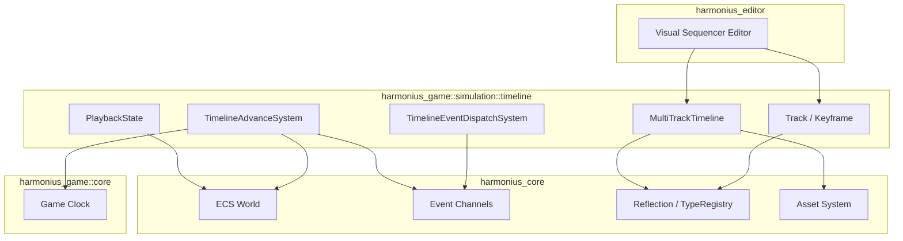
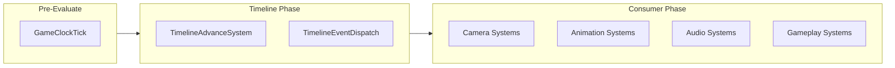
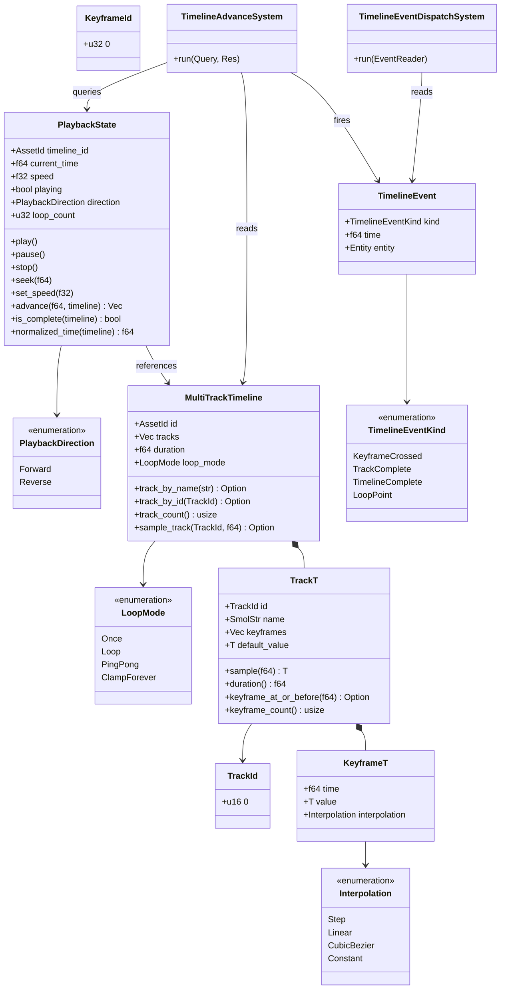
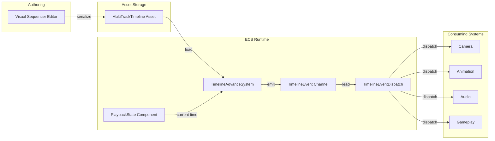

# Timeline Sequencer Design

## Requirements Trace

> **Canonical sources:** Features, requirements, and user stories are defined in
> [features/](../../features/), [requirements/](../../requirements/), and
> [user-stories/](../../user-stories/). The table below traces design elements to those definitions.

### Timeline (F-13.5.1, F-13.5.3, F-13.5.4, F-13.19.4a, F-13.23.4)

| Feature    | Requirement |
|------------|-------------|
| F-13.5.1   | R-13.5.1    |
| F-13.5.3   | R-13.5.3    |
| F-13.5.4   | R-13.5.4    |
| F-13.19.4a | R-13.19.4a  |
| F-13.23.4  | R-13.23.4   |

1. **F-13.5.1** -- Multi-track timeline sequencer with deterministic playback
2. **F-13.5.3** -- Camera rails and splines with branching paths (timeline-driven)
3. **F-13.5.4** -- Actor animation blending between gameplay and cinematic (timeline-driven)
4. **F-13.19.4a** -- Schedule data model: time ranges, locations, activities (timeline-based)
5. **F-13.23.4** -- Daily login reward calendar with streak tracking (timeline-based)

### Non-Functional Requirements

| Requirement  | Target |
|--------------|--------|
| R-13.5.NF1   | Evaluation under 0.5 ms for 32 tracks |
| NFR-TL.NF1   | 1000 active timelines advance < 0.5 ms |
| NFR-TL.NF2   | Sample interpolation under 100 ns |

### Cross-Cutting Dependencies

| Dependency | Source | Consumed API |
|------------|--------|--------------|
| ECS world, queries | F-1.1.1 | Archetype storage, `Query` |
| Event channels | F-1.5.1 | `EventWriter<T>`, `EventReader<T>` |
| Singleton resources | F-1.5.6 | `Res<T>`, `ResMut<T>` |
| Change detection | F-1.1.22 | `Changed<T>` for dirty tracking |
| Type registry | F-1.3.1 | `Reflect` derive, `TypeRegistry` |
| Asset system | F-1.6 | `Assets<MultiTrackTimeline>` |
| Game clock | F-13.1.2 | `GameTime` resource |
| Animation SM | F-9.4.1 | Animation layers, blend trees |
| Camera system | F-13.4 | Gameplay camera override |

## Overview

This document defines a generic multi-track timeline sequencer primitive for all time-sequenced
events in the Harmonius engine. Timelines are immutable assets authored in the visual sequencer
editor. Playback state is a mutable ECS component.

### Key Concepts

1. **Keyframe\<T\>** -- A timestamped value with an interpolation mode. The fundamental unit of
   timeline data.
2. **Track\<T\>** -- A named channel of keyframes sharing a type (e.g., "camera_fov",
   "audio_volume", "animation_weight"). Each track has its own keyframe sequence and default value.
3. **MultiTrackTimeline** -- An immutable asset containing multiple tracks that play in sync. The
   primary asset type authored in the visual editor.
4. **PlaybackState** -- A per-entity mutable ECS component tracking current time, play/pause, speed,
   direction, and loop count.
5. **TimelineEvent** -- Fired when playback crosses a keyframe, completes a track, loops, or
   finishes. Consuming systems react to these events.

### Design Principles

1. **ECS-primary (~90%)-based.** All state lives in components. No parallel data stores.
2. **Immutable assets, mutable playback.** Timeline definitions are frozen after authoring. Only
   `PlaybackState` mutates at runtime.
3. **Genre-agnostic.** Cinematics, NPC schedules, login calendars, music cue sheets, and scripted
   sequences all use the same primitive.
4. **Static dispatch.** Monomorphized generics on hot paths. No trait objects except at editor
   boundaries.
5. **Deterministic.** Identical inputs produce identical outputs. Playback is framerate-independent.
6. **No Arc, Rc, Cell, RefCell.** Owned values, generational indices, or scoped borrows only.

### Performance Targets

| Metric | Target |
|--------|--------|
| 32-track evaluation | < 0.5 ms (R-13.5.NF1) |
| 1000 active timelines advance | < 0.5 ms (NFR-TL.NF1) |
| Single sample interpolation | < 100 ns (NFR-TL.NF2) |

## Architecture

### Module Boundaries



### File Layout

```text
harmonius_game/
├── simulation/
│   ├── timeline/
│   │   ├── mod.rs           # Re-exports
│   │   ├── keyframe.rs      # KeyframeId, Keyframe<T>,
│   │   │                    # Interpolation
│   │   ├── track.rs         # TrackId, Track<T>,
│   │   │                    # sampling logic
│   │   ├── asset.rs         # MultiTrackTimeline,
│   │   │                    # LoopMode
│   │   ├── playback.rs      # PlaybackState,
│   │   │                    # PlaybackDirection
│   │   ├── event.rs         # TimelineEvent,
│   │   │                    # TimelineEventKind
│   │   ├── systems.rs       # TimelineAdvanceSystem,
│   │   │                    # TimelineEventDispatch
│   │   └── plugin.rs        # TimelinePlugin
│   └── mod.rs               # Re-exports
```

### System Execution Order



### Class Diagram -- Timeline Types



## API Design

### Core Types

```rust
#[derive(Clone, Copy, Debug, PartialEq, Eq,
    Hash, Reflect)]
pub struct KeyframeId(pub u32);

#[derive(Clone, Copy, Debug, PartialEq, Eq,
    Hash, Reflect)]
pub struct TrackId(pub u16);

#[derive(Clone, Debug, PartialEq, Reflect)]
pub enum Interpolation {
    Step,
    Linear,
    CubicBezier { c1: Vec2, c2: Vec2 },
    Constant,
}

/// T must implement Lerp + Clone + Reflect.
#[derive(Clone, Debug, Reflect)]
pub struct Keyframe<T> {
    pub time: f64,
    pub value: T,
    pub interpolation: Interpolation,
}
```

### Track

```rust
/// Named channel of keyframes sorted by time.
#[derive(Clone, Debug, Reflect)]
pub struct Track<T> {
    pub id: TrackId,
    pub name: SmolStr,
    pub keyframes: Vec<Keyframe<T>>,
    pub default_value: T,
}

impl<T: Lerp + Clone> Track<T> {
    /// Binary search + interpolation.
    pub fn sample(&self, time: f64) -> T;
    pub fn duration(&self) -> f64;
    pub fn keyframe_at_or_before(
        &self, time: f64,
    ) -> Option<&Keyframe<T>>;
    pub fn keyframe_count(&self) -> usize;
}
```

### MultiTrackTimeline (Asset)

```rust
#[derive(Clone, Copy, Debug, PartialEq, Eq,
    Reflect)]
pub enum LoopMode {
    Once,
    Loop,
    PingPong,
    ClampForever,
}

/// Immutable multi-track timeline asset.
#[derive(Clone, Debug, Reflect)]
pub struct MultiTrackTimeline {
    pub id: AssetId,
    pub tracks: Vec<Track<Value>>,
    pub duration: f64,
    pub loop_mode: LoopMode,
}

impl MultiTrackTimeline {
    pub fn track_by_name(
        &self, name: &str,
    ) -> Option<&Track<Value>>;
    pub fn track_by_id(
        &self, id: TrackId,
    ) -> Option<&Track<Value>>;
    pub fn track_count(&self) -> usize;
    pub fn sample_track(
        &self, track: TrackId, time: f64,
    ) -> Option<Value>;
}
```

### PlaybackState (Component)

```rust
#[derive(Clone, Copy, Debug, PartialEq, Eq,
    Reflect)]
pub enum PlaybackDirection {
    Forward,
    Reverse,
}

/// Per-entity mutable playback state.
#[derive(Clone, Debug, Component, Reflect)]
pub struct PlaybackState {
    pub timeline_id: AssetId,
    pub current_time: f64,
    pub speed: f32,
    pub playing: bool,
    pub direction: PlaybackDirection,
    pub loop_count: u32,
}

impl PlaybackState {
    pub fn play(&mut self);
    pub fn pause(&mut self);
    pub fn stop(&mut self);
    pub fn seek(&mut self, time: f64);
    pub fn set_speed(&mut self, speed: f32);
    /// Advance by dt. Handles looping, reversal,
    /// and completion. Returns crossed events.
    pub fn advance(
        &mut self, dt: f64,
        timeline: &MultiTrackTimeline,
    ) -> Vec<TimelineEvent>;
    pub fn is_complete(
        &self, timeline: &MultiTrackTimeline,
    ) -> bool;
    /// Current time as 0.0..1.0 fraction.
    pub fn normalized_time(
        &self, timeline: &MultiTrackTimeline,
    ) -> f64;
}
```

### Events

```rust
#[derive(Clone, Debug, Reflect)]
pub enum TimelineEventKind {
    KeyframeCrossed {
        track: TrackId,
        keyframe: KeyframeId,
    },
    TrackComplete { track: TrackId },
    TimelineComplete,
    LoopPoint { count: u32 },
}

/// Emitted by TimelineAdvanceSystem. Consumed by
/// camera, animation, audio, gameplay systems.
#[derive(Clone, Debug, Reflect)]
pub struct TimelineEvent {
    pub kind: TimelineEventKind,
    pub time: f64,
    pub entity: Entity,
}

/// Implemented for numeric types, Vec2, Vec3,
/// Vec4, Quat, Color, and Value (via reflection).
pub trait Lerp {
    fn lerp(&self, other: &Self, t: f64) -> Self;
}
```

## Data Flow



### Step-by-Step

1. **Authoring.** Timeline authored in the visual sequencer editor. Tracks and keyframes are placed
   on a time axis.
2. **Serialization.** The editor serializes the `MultiTrackTimeline` as an immutable asset (binary +
   reflection metadata).
3. **Entity binding.** A `PlaybackState` component is attached to an entity that references the
   timeline asset by `AssetId`.
4. **Advance (Simulation Tick).** The `TimelineAdvanceSystem` runs in Phase 3 (Simulation Tick). For
   each entity with `PlaybackState`, it reads the `GameTime` delta, calls `advance(dt)`, and
   collects `TimelineEvent`s.
5. **Event emission.** All `TimelineEvent`s produced during the advance step are written to the
   event channel.
6. **Dispatch.** The `TimelineEventDispatchSystem` reads events and routes them to consuming systems
   (camera, animation, audio, gameplay) based on track metadata and event kind.
7. **Consumption.** Consuming systems apply sampled values to their respective components (camera
   FOV, animation weight, audio volume, etc.).

### Advance Algorithm

```text
fn advance(dt, timeline):
    if not playing: return []
    effective_dt = dt * speed * direction_sign
    new_time = current_time + effective_dt
    events = []

    // Collect keyframe crossings
    for track in timeline.tracks:
        for kf in track.keyframes:
            if crossed(current_time, new_time, kf.time):
                events.push(KeyframeCrossed)

    // Handle loop boundaries
    match timeline.loop_mode:
        Once:
            if new_time >= duration:
                new_time = duration
                playing = false
                events.push(TimelineComplete)
        Loop:
            while new_time >= duration:
                new_time -= duration
                loop_count += 1
                events.push(LoopPoint)
        PingPong:
            if new_time >= duration or new_time <= 0:
                direction = reverse(direction)
                new_time = clamp(new_time, 0, duration)
                loop_count += 1
                events.push(LoopPoint)
        ClampForever:
            new_time = min(new_time, duration)

    current_time = new_time
    return events
```

## Platform Considerations

| Platform | Consideration |
|----------|---------------|
| All | Timeline evaluation is pure CPU computation |
| All | No platform-specific I/O during playback |
| All | Asset loading uses platform async I/O |
| All | Binary search sampling is branchless-friendly |
| macOS | GCD dispatch for parallel multi-entity advance |
| Windows | Thread pool for parallel multi-entity advance |
| Linux | Thread pool for parallel multi-entity advance |

Timeline evaluation has no platform-specific dependencies. All platform variation is confined to
asset loading (async I/O) and parallelization strategy (GCD on macOS, thread pool elsewhere). The
advance and sample operations are pure functions operating on owned data.

## Test Plan

Comprehensive test cases are defined in the companion file
[timelines-test-cases.md](timelines-test-cases.md).

### Summary

| Category | Count | Coverage |
|----------|-------|----------|
| Unit -- Interpolation | 8 | All Interpolation variants |
| Unit -- Track sampling | 6 | Binary search, edge cases |
| Unit -- Advance logic | 10 | All LoopMode + direction |
| Unit -- Seek / Speed | 4 | Seek bounds, negative speed |
| Integration -- Events | 6 | Keyframe, complete, loop |
| Integration -- Multi-track | 4 | Sync, mixed types |
| Benchmarks | 3 | NFR-TL.NF1, NF2, R-13.5.NF1 |

### Key Test Scenarios

1. **Step interpolation** -- sample between two Step keyframes returns the first keyframe value.
2. **Linear interpolation** -- sample at midpoint between two keyframes returns the arithmetic mean.
3. **CubicBezier** -- sample matches reference cubic curve within epsilon.
4. **Advance Once** -- advancing past duration sets `playing = false` and emits `TimelineComplete`.
5. **Advance Loop** -- advancing past duration wraps time and emits `LoopPoint` with correct count.
6. **Advance PingPong** -- advancing past duration reverses direction and clamps time.
7. **ClampForever** -- time never exceeds duration; no complete event.
8. **Seek** -- seeking to negative time clamps to 0; seeking past duration clamps to duration.
9. **Speed** -- speed = 2.0 advances at double rate; speed = 0.0 produces no advancement.
10. **KeyframeCrossed events** -- crossing N keyframes in a single dt produces N events in time
    order.
11. **Multi-track sync** -- all tracks in a timeline are sampled at the same logical time.
12. **Benchmark: 1000 timelines** -- advance 1000 active `PlaybackState` entities with 8-track
    timelines in under 0.5 ms.

## Open Questions

1. **Sub-timeline composition.** Should `MultiTrackTimeline` support nested sub-timelines
   (timeline-of-timelines)? This would enable reuse of common sequences. Deferred until editor
   workflow demands it.
2. **Track groups.** Should tracks be groupable (e.g., "camera" group containing fov, position,
   rotation)? May simplify editor UX but adds complexity to the data model.
3. **Blending between timelines.** When transitioning from one timeline to another on the same
   entity, how should values blend? Cross-fade with configurable duration, or snap? This interacts
   with the animation state machine.
4. **Event payload.** Should `KeyframeCrossed` carry the keyframe value, or should consumers sample
   the track themselves? Carrying the value avoids a redundant sample but increases event size.
5. **Reverse playback.** `PingPong` reverses automatically. Should manual `Reverse` direction be
   supported for all `LoopMode` variants, or only for `PingPong`?
