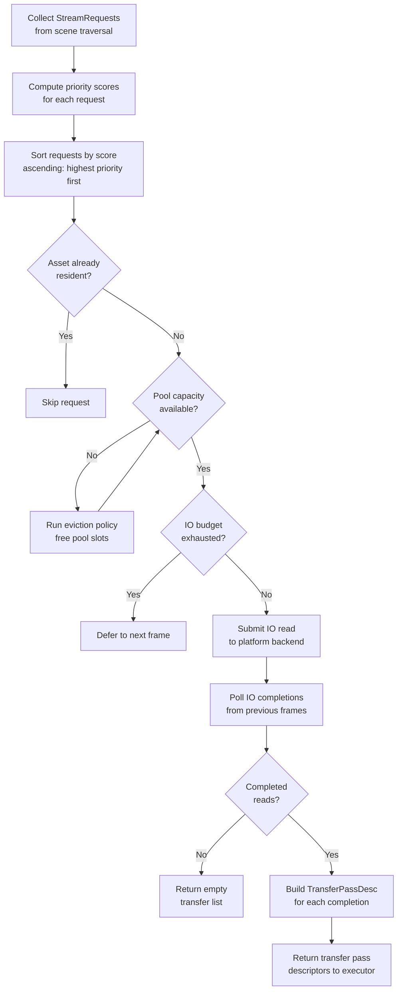
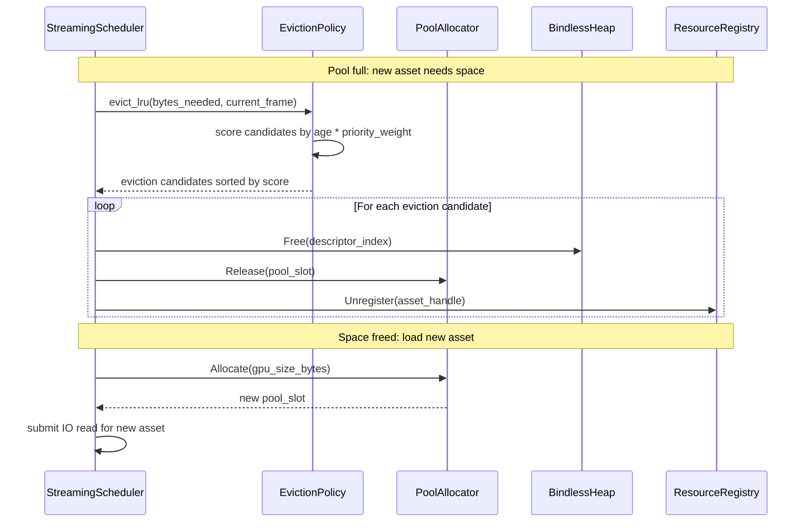
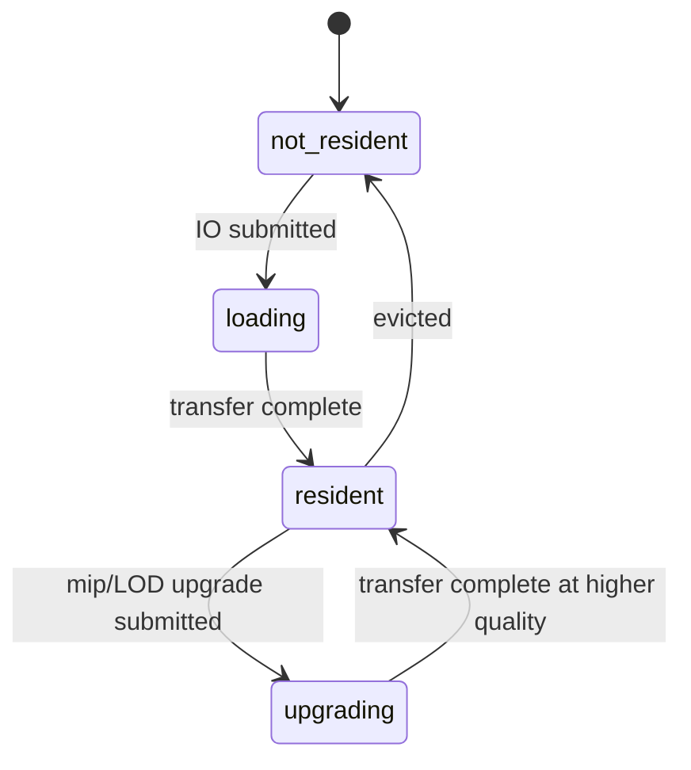
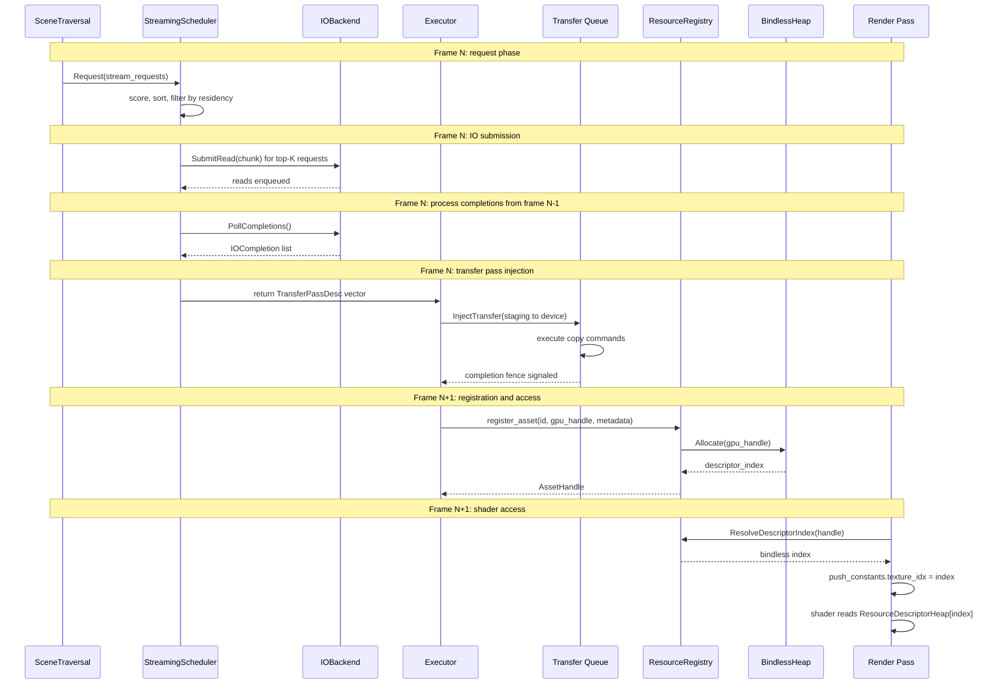

# Streaming Scheduler Algorithm Specification

Detailed algorithms, data structures, and tuning parameters for the streaming scheduler
introduced in [asset-pipeline.md](asset-pipeline.md). The streaming scheduler manages the
lifecycle of GPU-resident assets: deciding what to load, when to load it, and what to evict
when memory is constrained. It bridges the asset system and the render graph via transfer pass
injection (RG-14.7).

**Requirements:** R-2.12.1 (streaming priorities), R-2.12.2 (pool budgets), R-2.12.3 (tile
streaming), R-2.12.4 (voxel streaming), RG-11.1 through RG-11.7 (streaming integration).

---

## Contents

- [Priority System](#priority-system)
- [Request Processing Pipeline](#request-processing-pipeline)
- [IO Budget Management](#io-budget-management)
- [Eviction Policy](#eviction-policy)
- [Residency Tracking](#residency-tracking)
- [Prefetch Prediction](#prefetch-prediction)
- [Tuning Parameters](#tuning-parameters)
- [Metrics and Diagnostics](#metrics-and-diagnostics)
- [Integration with Render Graph](#integration-with-render-graph)

---

## Priority System

### Priority Levels

The scheduler classifies every stream request into one of four priority bands. Each band
carries a maximum latency guarantee that the scheduler enforces through IO budget allocation
and eviction ordering.

| Priority | Value | Meaning | Typical Assets | Max Latency |
| -------- | ----- | ------- | -------------- | ----------- |
| `kCritical` | 0 | Visible this frame, blocks rendering | LOD 0 meshlets, mip 0 textures for visible objects | 1 frame |
| `kHigh` | 1 | Will be visible within a few frames | LOD 1, mip 1-2 for nearby objects | 3-5 frames |
| `kNormal` | 2 | Predictive prefetch | Assets in predicted camera path | 10-30 frames |
| `kLow` | 3 | Speculative background load | Distant LODs, lowest mips | No deadline |

Priority levels map directly to the `StreamPriority` enumeration defined in
[asset-pipeline.md](asset-pipeline.md).

### Priority Score Calculation

Each stream request is assigned a numeric score for fine-grained ordering within priority
levels. The score combines the priority band, camera distance, screen-space coverage, and a
static bias from the asset manifest. Lower scores are loaded first.

```cpp
namespace harmonius::asset {

/// Computes a scalar priority score for a single stream request.
/// Lower scores indicate higher priority (loaded first).
float ComputePriorityScore(const StreamRequest& req, const CameraState& camera, float max_stream_distance,
                             uint64_t large_threshold) {
  // Priority band provides coarse ordering (0-3) scaled to 1000-unit bands
  float base = static_cast<float>(req.priority) * 1000.0f;

  // Distance attenuation: closer objects score lower (higher priority).
  // Clamped to [0, 1] and scaled into a 0-100 sub-band.
  float distance_factor = std::clamp(req.camera_distance / max_stream_distance, 0.0f, 1.0f);

  // Screen-space coverage estimate: assets exceeding the large threshold
  // receive a coverage bonus (lower score).
  float coverage_factor = 1.0f - (req.metadata.gpu_size_bytes > large_threshold ? 0.0f : 0.5f);

  // Static bias from manifest: content authors can boost or demote assets.
  // priority_bias is a uint16_t in [0, 65535].
  float static_bias = static_cast<float>(req.priority_bias) / 65535.0f;

  return base + distance_factor * 100.0f - static_bias * 50.0f + coverage_factor * 25.0f;
}

}  // namespace harmonius::asset
```

**Score component breakdown:**

| Component | Range | Weight | Effect |
| --------- | ----- | ------ | ------ |
| Priority band | 0-3000 | 1000 per band | Coarse separation between priority levels |
| Distance factor | 0-100 | 100 | Closer objects score lower within a band |
| Static bias | 0-50 | -50 (subtractive) | Content author override to boost priority |
| Coverage factor | 0-25 | 25 | Larger screen-space assets score lower |

---

## Request Processing Pipeline

Each frame, the scheduler executes a fixed pipeline that collects requests, prioritizes them,
submits IO operations, and returns transfer pass descriptors for the render graph executor.



### Pipeline Implementation

```cpp
namespace harmonius::asset {

std::vector<exec::TransferPassDesc> StreamingScheduler::ProcessPending() {
  // Step 1-3: score and sort pending requests
  std::sort(pending_requests_.Begin(), pending_requests_.End(), [&](const StreamRequest& a, const StreamRequest& b) {
    return ComputePriorityScore(a, camera_, max_stream_distance_, large_threshold_) <
           ComputePriorityScore(b, camera_, max_stream_distance_, large_threshold_);
  });

  // Step 4-6: check residency, capacity, and submit IO reads
  uint64_t bytes_submitted = 0;
  uint32_t reads_submitted = 0;

  for (const auto& req : pending_requests_) {
    if (IsResident(req.asset_id)) continue;  // step 4
    if (bytes_submitted >= budget_.max_bytes_per_frame) break;
    if (reads_submitted >= budget_.max_requests_per_frame) break;

    const auto* entry = manifest_.Find(req.asset_id);
    if (!entry) continue;

    // Step 5: ensure pool capacity, evict if needed
    if (!pool_.HasCapacity(entry->gpu_size)) {
      auto victims = EvictLru(entry->gpu_size, current_frame_);
      for (auto id : victims) {
        FreeResident(id);
      }
    }

    // Step 6: submit IO read
    auto staging_slot = staging_.Allocate(entry->chunk_size);
    if (!staging_slot) continue;

    io_backend_.SubmitRead(manifest_.bundles[entry->bundle_index].bundle_path, entry->chunk_offset, entry->chunk_size,
                           staging_slot->handle, staging_slot->offset);

    BeginLoading(req.asset_id, *staging_slot, *entry);
    bytes_submitted += entry->chunk_size;
    ++reads_submitted;
  }

  // Step 7: poll completions from previous frames
  auto completions = io_backend_.PollCompletions();

  // Step 8-9: build and return transfer pass descriptors
  std::vector<exec::TransferPassDesc> transfers;
  transfers.reserve(std::min(static_cast<uint32_t>(completions.Size()), budget_.max_transfers_per_frame));

  for (const auto& c : completions) {
    if (!c.success) {
      MarkLoadFailed(c.asset_id);
      continue;
    }
    if (transfers.Size() >= budget_.max_transfers_per_frame) break;

    auto dst = pool_.Allocate(ResidencyGpuSize(c.asset_id));
    if (!dst) continue;

    transfers.push_back(exec::TransferPassDesc{
        .src_staging = c.staging_buffer,
        .dst_resource = dst->handle,
        .src_offset = c.buffer_offset,
        .dst_offset = 0,
        .size_bytes = c.size,
        .priority = static_cast<int32_t>(ResidencyPriority(c.asset_id)),
        .completion_fence_value = next_fence_value_++,
    });

    MarkResident(c.asset_id, dst->handle, dst->slot);
  }

  pending_requests_.clear();
  return transfers;
}

}  // namespace harmonius::asset
```

---

## IO Budget Management

The scheduler limits per-frame IO to avoid saturating the storage bus or the transfer queue.
Budget parameters are tunable at runtime.

### Budget Structure

```cpp
namespace harmonius::asset {

struct IOBudget {
  uint64_t max_bytes_per_frame = 64 * 1024 * 1024;  // 64 MiB
  uint32_t max_requests_per_frame = 32;             // concurrent IO ops
  uint32_t max_transfers_per_frame = 16;            // GPU transfer passes
};

}  // namespace harmonius::asset
```

### Bandwidth Allocation by Priority

The IO budget is partitioned across priority bands to guarantee that critical assets always
have bandwidth available, even under heavy prefetch load.

| Priority | Bandwidth Share | Rationale |
| -------- | --------------- | --------- |
| `kCritical` | 50% | Must load immediately to avoid visual artifacts |
| `kHigh` | 30% | Near-future visibility; prevents pop-in |
| `kNormal` | 15% | Predictive prefetch; can tolerate delays |
| `kLow` | 5% | Best-effort background; evicted first |

### Bandwidth Enforcement

```cpp
namespace harmonius::asset {

struct BandwidthPartition {
  float critical_share = 0.50f;
  float high_share = 0.30f;
  float normal_share = 0.15f;
  float low_share = 0.05f;
};

/// Returns the byte budget for a given priority level this frame.
uint64_t BytesForPriority(StreamPriority priority, const IOBudget& budget, const BandwidthPartition& partition) {
  float share = 0.0f;
  switch (priority) {
    case StreamPriority::kCritical:
      share = partition.critical_share;
      break;
    case StreamPriority::kHigh:
      share = partition.high_share;
      break;
    case StreamPriority::kNormal:
      share = partition.normal_share;
      break;
    case StreamPriority::kLow:
      share = partition.low_share;
      break;
  }
  return static_cast<uint64_t>(static_cast<float>(budget.max_bytes_per_frame) * share);
}

}  // namespace harmonius::asset
```

Unused bandwidth from higher-priority bands is donated downward: if `kCritical` uses only
20 MiB of its 32 MiB allocation, the remaining 12 MiB is available to `kHigh`, then `kNormal`,
then `kLow`.

---

## Eviction Policy

### LRU with Priority Weighting

When a pool is at capacity and a new asset must be loaded, the scheduler selects eviction
candidates using a weighted LRU policy. Higher-priority assets are harder to evict.

**Algorithm:**

1. Build eviction candidate list: all resident assets NOT referenced this frame.
2. Score each candidate: `eviction_score = time_since_last_use * priority_weight`.
   Higher-priority assets have lower weights, making them harder to evict.
3. Sort by eviction score descending (highest score = evict first).
4. Evict candidates until enough space is freed.
5. Free pool slots and descriptor heap entries.
6. Notify resource registry to invalidate handles.

**Priority eviction weights:**

| Priority | Weight | Effect |
| -------- | ------ | ------ |
| `kCritical` | 0.1 | Very hard to evict; must be unused for many frames |
| `kHigh` | 0.5 | Moderately protected |
| `kNormal` | 1.0 | Baseline eviction rate |
| `kLow` | 2.0 | Evicted aggressively |

### Data Structures

```cpp
namespace harmonius::asset {

struct EvictionCandidate {
  AssetId id;
  uint64_t last_use_frame;
  uint64_t gpu_size_bytes;
  float eviction_score;
};

float PriorityEvictionWeight(StreamPriority priority) {
  switch (priority) {
    case StreamPriority::kCritical:
      return 0.1f;
    case StreamPriority::kHigh:
      return 0.5f;
    case StreamPriority::kNormal:
      return 1.0f;
    case StreamPriority::kLow:
      return 2.0f;
  }
  return 1.0f;
}

std::vector<AssetId> StreamingScheduler::EvictLru(uint64_t bytes_needed, uint64_t current_frame) {
  std::vector<EvictionCandidate> candidates;
  candidates.reserve(resident_assets_.Size());

  for (const auto& entry : resident_assets_) {
    if (entry.last_use_frame == current_frame) continue;
    float age = static_cast<float>(current_frame - entry.last_use_frame);
    float weight = PriorityEvictionWeight(entry.priority);
    candidates.push_back({
        entry.id,
        entry.last_use_frame,
        entry.gpu_size_bytes,
        age * weight,
    });
  }

  std::sort(candidates.Begin(), candidates.End(),
            [](const auto& a, const auto& b) { return a.eviction_score > b.eviction_score; });

  std::vector<AssetId> to_evict;
  uint64_t freed = 0;
  for (const auto& c : candidates) {
    if (freed >= bytes_needed) break;
    to_evict.push_back(c.id);
    freed += c.gpu_size_bytes;
  }
  return to_evict;
}

}  // namespace harmonius::asset
```

### Eviction Integration with Render Graph

The eviction flow involves coordination between the streaming scheduler, pool allocator,
bindless descriptor heap, and resource registry.



### Eviction Safeguards

- **Minimum residency time:** an asset must be resident for at least 30 frames before it
  becomes eligible for eviction, preventing thrashing on assets that are repeatedly loaded
  and evicted.
- **Eviction cap per frame:** at most 8 assets are evicted per frame to avoid stalls from
  bulk descriptor heap updates.
- **Critical protection:** assets at `kCritical` priority are never evicted while they remain
  at that priority level, regardless of their age.

```cpp
namespace harmonius::asset {

struct EvictionConfig {
  uint32_t min_residency_frames = 30;    // frames before eviction eligible
  uint32_t max_evictions_per_frame = 8;  // cap per frame
  bool protect_critical = true;          // never evict critical assets
};

}  // namespace harmonius::asset
```

---

## Residency Tracking

### Data Structures

The residency map uses a flat array indexed by pool slot for cache-friendly iteration, with a
hash map from `AssetId` to slot index for O(1) lookups.

```cpp
namespace harmonius::asset {

struct ResidencyEntry {
  AssetId id;
  gpu::ResourceHandle gpu_handle;
  uint32_t descriptor_index;
  uint32_t pool_slot;
  StreamPriority priority;
  uint64_t load_frame;  // frame when asset became resident
  uint64_t last_use_frame;
  uint64_t gpu_size_bytes;
  bool fully_resident;  // all mips/chunks loaded
};

class ResidencyMap {
 public:
  /// Insert a new resident asset. Returns the pool slot assigned.
  uint32_t Insert(const ResidencyEntry& entry);

  /// Remove a resident asset by ID. Frees the pool slot.
  void Remove(AssetId id);

  /// Look up by asset ID. Returns nullptr if not resident.
  [[nodiscard]]
  const ResidencyEntry* Find(AssetId id) const;

  /// Update last-use frame for an asset referenced this frame.
  void Touch(AssetId id, uint64_t frame);

  /// Iterate all resident entries (cache-friendly flat array).
  [[nodiscard]]
  std::span<const ResidencyEntry> Entries() const;

  /// Current count of resident assets.
  [[nodiscard]] uint32_t count() const;

  /// Total GPU bytes occupied by resident assets.
  [[nodiscard]] uint64_t TotalGpuBytes() const;

 private:
  std::vector<ResidencyEntry> slots_;
  std::unordered_map<AssetId, uint32_t> id_to_slot_;
  std::queue<uint32_t> free_list_;
};

}  // namespace harmonius::asset
```

### Residency States

Each asset transitions through a well-defined set of residency states. The state machine
ensures that no asset is accessed by the GPU while its data is still in transit.



**State definitions:**

| State | Description | GPU Access |
| ----- | ----------- | ---------- |
| `kNotResident` | Asset is not in GPU memory | Not accessible |
| `loading` | IO submitted, awaiting completion and GPU transfer | Not accessible |
| `resident` | Fully uploaded and registered in descriptor heap | Accessible via bindless index |
| `upgrading` | Higher-quality mip or LOD being uploaded | Current quality remains accessible |

The `upgrading` state is notable: the existing lower-quality version of the asset remains
bound in the descriptor heap and accessible to shaders. When the upgrade transfer completes,
the descriptor heap entry is updated in-place to point to the new, higher-quality resource.
This ensures zero visual discontinuity during mip upgrades.

```cpp
namespace harmonius::asset {

enum class ResidencyState : uint8_t {
  kNotResident,
  kLoading,
  kResident,
  kUpgrading,
};

}  // namespace harmonius::asset
```

---

## Prefetch Prediction

### Camera-Based Prediction

The scheduler predicts which assets will be needed based on camera movement, submitting
prefetch requests at `kNormal` or `kLow` priority before the assets become visible.

```cpp
namespace harmonius::asset {

struct PrefetchConfig {
  float prediction_time_seconds = 2.0f;  // how far ahead to predict
  float prediction_cone_angle = 45.0f;   // degrees from camera forward
  uint32_t max_prefetch_per_frame = 8;   // limit prefetch requests
};

}  // namespace harmonius::asset
```

**Algorithm:**

1. Extrapolate camera position forward by `prediction_time_seconds` using the current
   velocity vector.
2. Query the spatial index (octree or BVH) for assets whose bounding volumes intersect the
   prediction cone emanating from the extrapolated position.
3. Filter out assets that are already resident or currently loading.
4. Assign `kNormal` priority to assets within 1x prediction time, `kLow` priority to assets
   within 2x prediction time.
5. Submit at most `max_prefetch_per_frame` requests to avoid starving demand-driven loads.

```cpp
namespace harmonius::asset {

std::vector<StreamRequest> GeneratePrefetchRequests(const CameraState& camera, const SpatialIndex& spatial_index,
                                                      const ResidencyMap& residency, const PrefetchConfig& config) {
  // Extrapolate camera position
  auto predicted_pos = camera.position + camera.velocity * config.prediction_time_seconds;

  // Query spatial index for assets in the prediction cone
  auto candidates = spatial_index.QueryCone(predicted_pos, camera.forward, config.prediction_cone_angle);

  std::vector<StreamRequest> requests;
  requests.reserve(config.max_prefetch_per_frame);

  for (const auto& candidate : candidates) {
    if (requests.Size() >= config.max_prefetch_per_frame) break;
    if (residency.Find(candidate.asset_id)) continue;

    float time_to_visible = candidate.estimated_time_to_visible;
    StreamPriority priority =
        time_to_visible <= config.prediction_time_seconds ? StreamPriority::kNormal : StreamPriority::kLow;

    requests.push_back({
        .asset_id = candidate.asset_id,
        .chunk_index = candidate.chunk_index,
        .priority = priority,
        .camera_distance = candidate.distance,
    });
  }

  return requests;
}

}  // namespace harmonius::asset
```

### LOD-Based Streaming

Assets are streamed at the LOD level matching their screen-space contribution, ensuring that
GPU memory is spent on data that provides the most visual benefit.

**Algorithm:**

1. Compute screen-space bounding box for each visible object using the object's world-space
   bounds and the current projection matrix.
2. Select LOD level based on screen-space pixel coverage: larger screen-space objects receive
   higher-detail LODs.
3. Stream meshlet data for the selected LOD. Each LOD is stored as an independent chunk in
   the asset bundle, so only the required LOD needs to be resident.
4. Stream texture mips matching the LOD's texel density. The target mip level is computed
   from the ratio of texture resolution to screen-space coverage.

```cpp
namespace harmonius::asset {

struct LODSelection {
  AssetId asset_id;
  uint32_t lod_level;     // 0 = highest detail
  uint32_t target_mip;    // 0 = highest resolution mip
  float screen_coverage;  // fraction of screen area
};

/// Selects the appropriate LOD and mip level for a visible object.
LODSelection SelectLod(const ObjectBounds& bounds, const CameraState& camera, const LODConfig& config) {
  float screen_pixels = ComputeScreenCoverage(bounds, camera.view_projection, camera.viewport_size);
  float coverage = screen_pixels / (camera.viewport_size.x * camera.viewport_size.y);

  // LOD selection: higher coverage = lower LOD index (more detail)
  uint32_t lod = 0;
  for (uint32_t i = 0; i < config.lod_count; ++i) {
    if (coverage < config.lod_thresholds[i]) {
      lod = i;
    }
  }

  // Mip selection: compute target mip from texel density
  uint32_t target_mip = ComputeTargetMip(coverage, config.texture_resolution, config.mip_bias);

  return {bounds.asset_id, lod, target_mip, coverage};
}

}  // namespace harmonius::asset
```

---

## Tuning Parameters

All tuning parameters are exposed through a single configuration structure that can be
modified at runtime via the diagnostics console. Changes take effect on the next frame.

| Parameter | Default | Range | Effect |
| --------- | ------- | ----- | ------ |
| `max_bytes_per_frame` | 64 MiB | 8-256 MiB | IO throughput cap per frame |
| `max_requests_per_frame` | 32 | 4-128 | Max concurrent IO operations |
| `max_transfers_per_frame` | 16 | 4-64 | Max GPU transfer Passes per frame |
| `prediction_time_seconds` | 2.0 | 0.5-5.0 | Camera prediction lookahead |
| `prediction_cone_angle` | 45.0 | 15-90 | Camera prediction cone width (degrees) |
| `pool_utilization_eviction_threshold` | 0.9 | 0.7-0.95 | Start evicting when pool exceeds this Utilization |
| `critical_bandwidth_share` | 0.5 | 0.3-0.8 | IO bandwidth reserved for critical requests |
| `defrag_interval_frames` | 300 | 60-600 | Frames between pool defragmentation Passes |
| `min_residency_frames` | 30 | 10-120 | Minimum frames before eviction eligibility |
| `max_evictions_per_frame` | 8 | 1-32 | Cap on evictions per frame to avoid stalls |
| `max_prefetch_per_frame` | 8 | 1-32 | Cap on prefetch requests per frame |
| `mip_bias` | 0.0 | -2.0 to 2.0 | Global mip level bias for streaming textures |

```cpp
namespace harmonius::asset {

struct StreamingConfig {
  IOBudget io_budget;
  BandwidthPartition bandwidth_partition;
  PrefetchConfig prefetch;
  EvictionConfig eviction;

  float pool_utilization_eviction_threshold = 0.9f;
  uint32_t defrag_interval_frames = 300;
  float mip_bias = 0.0f;
};

}  // namespace harmonius::asset
```

---

## Metrics and Diagnostics

The scheduler exposes metrics for the diagnostics subsystem (RG-12). Metrics are updated
every frame and can be queried through the diagnostics API or visualized in the debug
overlay.

```cpp
namespace harmonius::asset {

struct StreamingMetrics {
  // Per-frame counters
  uint64_t bytes_loaded_this_frame;
  uint64_t bytes_evicted_this_frame;
  uint32_t requests_submitted;
  uint32_t requests_completed;
  uint32_t requests_failed;
  uint32_t transfers_injected;
  uint32_t evictions_performed;

  // Aggregate state
  float residency_ratio;   // fraction of requested assets loaded
  float pool_utilization;  // fraction of pool capacity used
  uint32_t resident_asset_count;
  uint64_t resident_total_bytes;

  // Performance
  float average_load_latency_ms;     // rolling average over last 60 frames
  float p99_load_latency_ms;         // 99th percentile load latency
  uint64_t io_throughput_bytes_sec;  // current IO throughput
  uint32_t io_queue_depth;           // pending IO operations

  // Prefetch effectiveness
  float prefetch_hit_ratio;        // fraction of prefetched assets used
  uint32_t prefetch_wasted_loads;  // prefetched but evicted before use
};

}  // namespace harmonius::asset
```

**Key diagnostic signals:**

| Metric | Healthy Range | Action if Unhealthy |
| ------ | ------------- | ------------------- |
| `ResidencyRatio` | > 0.95 | Increase `max_bytes_per_frame` or pool Capacity |
| `pool_utilization` | 0.6-0.85 | If > 0.9, increase pool Size or lower quality settings |
| `average_load_latency_ms` | < 5.0 | If high, reduce `max_requests_per_frame` to avoid IO contention |
| `prefetch_hit_ratio` | > 0.7 | If low, tune `prediction_time_seconds` and `prediction_cone_angle` |
| `evictions_performed` | < 4/frame avg | If high, pool is undersized or prediction is poor |

---

## Integration with Render Graph

The streaming scheduler integrates with the render graph execution engine through transfer
pass injection. The complete flow spans scene traversal, IO, GPU transfer, and descriptor
heap registration.



### Transfer Pass Descriptor

Transfer pass descriptors use the `TransferPassDesc` structure defined in
[render-graph-design.md](render-graph-design.md). The streaming scheduler populates the
`priority` field to ensure critical uploads are submitted before speculative prefetches
(RG-11.6).

```cpp
namespace harmonius::rg::exec {

// Defined in render-graph-design.md, reproduced here for reference
struct TransferPassDesc {
  gpu::ResourceHandle src_staging;
  gpu::ResourceHandle dst_resource;
  uint64_t src_offset;
  uint64_t dst_offset;
  uint64_t size_bytes;
  int32_t priority = 0;                 // RG-11.6: higher = first
  uint64_t completion_fence_value = 0;  // RG-11.2
};

}  // namespace harmonius::rg::exec
```

### Frame Boundary Resource Hand-Off

Per RG-11.7, a resource written by a transfer pass in frame N is available for reading by
graphics passes in frame N+1. The render graph compiler emits a timeline fence wait to
prevent read-before-write hazards. The streaming scheduler tracks which assets are "in
flight" (transferred but not yet safe to read) and only marks them as `resident` once the
completion fence for their transfer pass has been signaled.

### Interaction with Pool Allocator

The streaming scheduler coordinates with the pool allocator from the render graph resource
system. Pool capacity is partitioned by resource type (R-2.12.2):

| Pool | Typical Capacity | Resource Type |
| ---- | ---------------- | ------------- |
| Meshlet pool | 256 MiB | Meshlet vertex/index/descriptor buffers |
| Texture pool | 512 MiB | Block-compressed textures (BC7/BC5/BC1) |
| Terrain tile pool | 128 MiB | Terrain heightmap and splat tiles |
| Voxel page pool | 128 MiB | Sparse 3D texture pages |

Each pool maintains its own residency map and eviction state. The streaming scheduler queries
all pools during the eviction phase and selects victims across pools to satisfy the requested
byte count.
