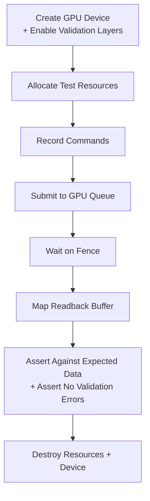
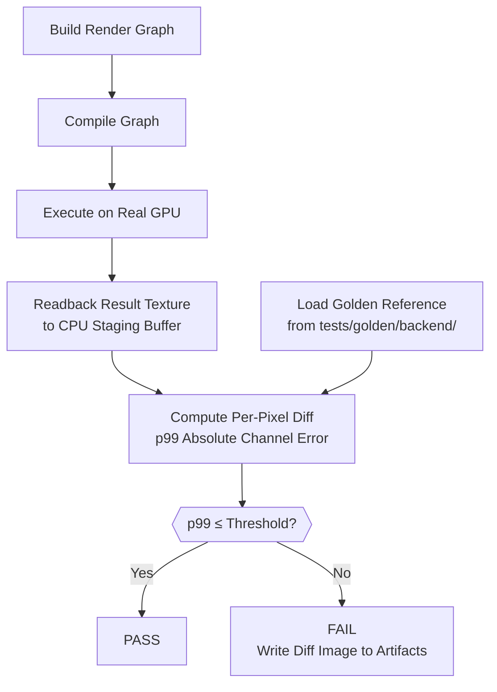
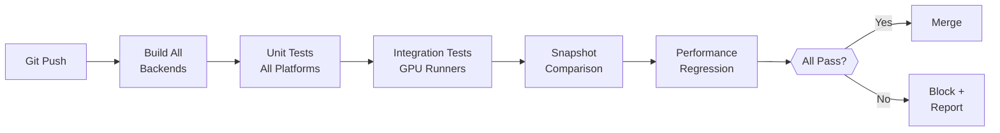

# Testing Strategy

Unit and integration testing strategy for the Harmonius framework. Defines how all framework
requirements are verified through automated tests across all supported platforms. Companion to
[render-graph-design.md](render-graph-design.md), [gpu-backend-interface.md](gpu-backend-interface.md),
[gpu-runtime.md](gpu-runtime.md), [shader-pipeline.md](shader-pipeline.md), and
[asset-pipeline.md](asset-pipeline.md).

**Requirements:** [R-4.1.1 through R-4.1.9](../requirements/4-quality/4.1-testing-and-ci.md)

---

## Contents

- [Testing Strategy](#testing-strategy)
  - [Contents](#contents)
  - [Design Principles](#design-principles)
  - [Unit Testing Strategy](#unit-testing-strategy)
    - [Safety Validation](#safety-validation)
    - [Direct Output Validation](#direct-output-validation)
    - [GPU Backend Interface](#gpu-backend-interface)
    - [GPU Runtime — Memory](#gpu-runtime--memory)
    - [GPU Runtime — State Tracking](#gpu-runtime--state-tracking)
    - [GPU Runtime — Work Graph](#gpu-runtime--work-graph)
    - [GPU Runtime — Feature Emulation](#gpu-runtime--feature-emulation)
    - [Render Graph — Builder](#render-graph--builder)
    - [Render Graph — Resource System](#render-graph--resource-system)
    - [Render Graph — Compiler](#render-graph--compiler)
    - [Render Graph — Barriers and Sync](#render-graph--barriers-and-sync)
    - [Render Graph — Scheduling and Queues](#render-graph--scheduling-and-queues)
    - [Render Graph — Gating and Culling](#render-graph--gating-and-culling)
    - [Render Graph — Resource Aliasing](#render-graph--resource-aliasing)
    - [Render Graph — Multi-View](#render-graph--multi-view)
    - [Render Graph — Parallel Encoding](#render-graph--parallel-encoding)
    - [Render Graph — Streaming Integration](#render-graph--streaming-integration)
    - [Render Graph — Diagnostics](#render-graph--diagnostics)
    - [Render Graph — Per-Frame Execution](#render-graph--per-frame-execution)
    - [Shader Pipeline](#shader-pipeline)
    - [Asset Pipeline](#asset-pipeline)
  - [Integration Testing Strategy](#integration-testing-strategy)
    - [Real GPU Execution](#real-gpu-execution)
    - [Snapshot Testing](#snapshot-testing)
    - [End-to-End Render Graph Execution](#end-to-end-render-graph-execution)
    - [GPU Backend Validation](#gpu-backend-validation)
    - [GPU Runtime on Real GPU](#gpu-runtime-on-real-gpu)
    - [Shader Pipeline Integration](#shader-pipeline-integration)
    - [Rendering Pipeline](#rendering-pipeline)
  - [Fuzz Testing](#fuzz-testing)
  - [Stress Testing](#stress-testing)
  - [Performance Regression Testing](#performance-regression-testing)
  - [Test Infrastructure](#test-infrastructure)
    - [Testing Framework](#testing-framework)
    - [GPU Test Fixture](#gpu-test-fixture)
    - [Image Comparison](#image-comparison)
    - [Test Data Generators](#test-data-generators)
    - [CMake Integration](#cmake-integration)
  - [CI Integration](#ci-integration)
  - [Requirement Traceability Matrix](#requirement-traceability-matrix)
    - [Architecture](#architecture)
    - [Performance](#performance)
    - [Hardware](#hardware)
    - [Data Constraints](#data-constraints)
    - [Resource Budgets](#resource-budgets)
    - [Visual Quality](#visual-quality)
    - [Testing and CI](#testing-and-ci)
    - [User API](#user-api)
    - [Extensibility](#extensibility)
    - [Render Graph — Pass Declaration](#render-graph--pass-declaration)
    - [Render Graph — Resource Management](#render-graph--resource-management)
    - [Render Graph — Barriers and Sync Matrix](#render-graph--barriers-and-sync-matrix)
    - [Render Graph — Queue Assignment Matrix](#render-graph--queue-assignment-matrix)
    - [Render Graph — Scheduling Matrix](#render-graph--scheduling-matrix)
    - [Render Graph — Capability Gating Matrix](#render-graph--capability-gating-matrix)
    - [Render Graph — Budget Culling Matrix](#render-graph--budget-culling-matrix)
    - [Render Graph — Resource Aliasing Matrix](#render-graph--resource-aliasing-matrix)
    - [Render Graph — Multi-View Matrix](#render-graph--multi-view-matrix)
    - [Render Graph — Parallel Encoding Matrix](#render-graph--parallel-encoding-matrix)
    - [Render Graph — Streaming Integration Matrix](#render-graph--streaming-integration-matrix)
    - [Render Graph — Diagnostics Matrix](#render-graph--diagnostics-matrix)
    - [Render Graph — Graph Compilation Matrix](#render-graph--graph-compilation-matrix)
    - [Render Graph — Per-Frame Execution Matrix](#render-graph--per-frame-execution-matrix)
    - [GPU Runtime — Memory Management Matrix](#gpu-runtime--memory-management-matrix)
    - [GPU Runtime — State Tracking Matrix](#gpu-runtime--state-tracking-matrix)
    - [GPU Runtime — Work Graph Matrix](#gpu-runtime--work-graph-matrix)
    - [GPU Runtime — Feature Emulation Matrix](#gpu-runtime--feature-emulation-matrix)

---

## Design Principles

All testing adheres to these principles, derived from
[R-4.1.1 through R-4.1.9](../requirements/4-quality/4.1-testing-and-ci.md):

| Principle | Requirement | Description |
|-----------|-------------|-------------|
| Real GPU required | R-4.1.1 | No software rasterizer fallback. Tests skip explicitly when no suitable GPU is found. |
| Test-driven development | R-4.1.2 | All modules follow test-first: write a failing test, implement minimal code to pass, refactor. |
| GPU CI on all platforms | R-4.1.5 | CI runs on GPU hardware for macOS/Metal, Linux/Vulkan, and Windows/D3D12. |
| Validation layer enforcement | R-4.1.8 | GPU validation layer errors are treated as test failures. No warnings suppressed in CI. |
| Zero-overhead instrumentation | R-4.1.7 | Disabled instrumentation Has zero runtime overhead; tested by benchmarking with/without. |
| Deterministic execution | RG-5.6 | Graph compiler produces deterministic ordering; tests verify reproducibility across runs. |
| Test isolation | — | Each test creates its own device, resources, and fence; teardown destroys all state. |

---

## Unit Testing Strategy

Unit tests verify that individual API calls and module operations complete without safety
violations. Every unit test runs with GPU validation layers enabled (R-4.1.8). Any validation
error from the GPU driver is treated as an immediate test failure.

### Safety Validation

All unit tests assert the following safety properties:

- **No undefined behavior:** No crashes, no memory corruption, no use-after-free. GPU validation
  layers catch API misuse on all platforms.
- **Typed error returns:** All fallible operations return `std::expected` with typed errors
  (R-5.1.3). No operation causes an unrecoverable abort in the user-facing API.
- **Generational handle safety:** Accessing a freed resource through a stale handle returns a
  typed error (R-5.1.4), never undefined behavior.
- **No validation warnings:** The test fixture hooks the GPU validation callback and fails the
  test on any warning or error emitted during execution.



### Direct Output Validation

For unit tests that can produce measurable outputs, validation goes beyond safety checks.
The test generates textures or buffers with known data (solid colors, gradients, bit patterns),
executes a GPU operation, reads back the result, and asserts against the expected values.

Assertions are programmatic — byte-exact for integer formats, within an epsilon tolerance for
floating-point formats. **Snapshot testing is not used for unit tests.** All unit test
assertions compare against computed expected values, not reference images.

```cpp
// Example: compute shader writes a known pattern, readback asserts exact match.
auto cmd = pool.AllocateCommandBuffer();
cmd.Begin();
cmd.SetPipeline(fill_pipeline);
cmd.PushConstants(&fill_value, sizeof(fill_value));
cmd.Dispatch(width / 8, height / 8, 1);
cmd.Barrier(storage_to_transfer);
cmd.CopyBuffer(output_buffer, readback_buffer, size);
cmd.End();

device.Submit(QueueType::kGraphics, {cmd}, {fence, 1}, {});
device.WaitFence(fence, 1);

auto* data = static_cast<const uint32_t*>(device.MapBuffer(readback_buffer));
for (uint64_t i = 0; i < element_count; ++i) {
  REQUIRE(data[i] == fill_value);
}
device.UnmapBuffer(readback_buffer);
```

---

### GPU Backend Interface

Tests for `harmonius::gpu` verify that backend API calls complete without validation errors and
that resource lifecycle operations are correct across all three backends.

- **Device creation** succeeds on valid hardware, fails with a typed error when required
  features are missing (R-1.1.6, R-3.2.1–R-3.2.7).
- **Capability queries** return valid results for mesh shaders, ray tracing, bindless, sparse
  textures, async compute, 64-bit atomics, and timeline fences (R-3.2.1–R-3.2.7, R-3.3.20).
- **Resource lifecycle:** create and destroy textures, buffers, heaps, acceleration structures,
  and fences without validation errors. Verify that placed resources within heaps respect
  alignment requirements (R-3.3.17, R-3.3.18).
- **Command recording:** allocate command pool, allocate command buffer, begin/end recording,
  insert barriers, and submit without validation errors.
- **Pipeline creation:** create mesh render and compute pipelines (R-1.1.3). Verify that no
  vertex/geometry/tessellation pipeline creation paths exist.
- **Push constants:** write push constant data via command buffer (R-3.3.13, R-3.3.14).
- **Fence operations:** create fence, signal from GPU, query completed value from CPU, wait
  from CPU (R-3.2.5).
- **Direct output:** dispatch a compute shader that writes a known 32-bit pattern to a storage
  buffer. Readback and assert byte-exact match. Verify alignment of allocation metadata against
  R-3.3.13–R-3.3.18.
- **Stale handle safety:** destroy a resource, then attempt to access it through the old handle.
  Assert that the operation returns a typed error, not undefined behavior (R-5.1.4).

---

### GPU Runtime — Memory

Tests for `harmonius::gpu_runtime::memory` verify allocator correctness without requiring full
render graph execution.

- **Allocator initialization** with per-heap-type configs (GR-1.1).
- **Block sub-allocation** produces non-overlapping offsets with correct alignment. Allocate
  many small blocks, verify no overlaps, and verify alignment requirements from the backend
  (GR-1.2).
- **Committed allocation** creates a dedicated heap per resource (GR-1.3).
- **Placed allocation** assigns resources to heap offsets for aliasing. Verify that non-aliased
  placed resources do not overlap (GR-1.4).
- **Ring buffer allocation** recycles slots after frame completion. Allocate across 3+ frames,
  verify slot reuse after fence signal (GR-1.5).
- **Defragmentation** moves allocations to eliminate gaps. Allocate, free alternating blocks,
  run defrag, verify fragmentation ratio decreases (GR-1.6).
- **Budget tracking** reports accurate usage. Allocate known sizes, verify reported usage
  matches. Attempt over-budget allocation, verify error return (GR-1.7).
- **Heap type selection** matches resource usage flags (GR-1.8).
- **Allocation metadata** returns correct size, alignment, offset, and heap handle (GR-1.9).
- **Pool-scoped allocation** respects capacity limits. Fill pool to max, verify next allocation
  returns an error (GR-1.10).
- **Sparse tile binding** tracks bind/unbind state correctly (GR-1.11).
- **Direct output:** allocate a buffer, map it, write a known pattern, unmap, readback via
  a separate mapping, and verify byte-exact match.

---

### GPU Runtime — State Tracking

Tests for `harmonius::gpu_runtime::state` verify redundant-state elimination by counting calls
forwarded to the underlying command buffer.

- **Pipeline cache:** bind the same pipeline twice; assert only one `SetPipeline` call is
  forwarded. Bind a different pipeline; assert it is forwarded (GR-2.1, GR-2.2).
- **Descriptor heap cache:** bind the same descriptor heap twice; assert one forward (GR-2.3).
- **Dynamic state cache:** set identical viewport, scissor, and blend constants twice; assert
  one forward each. Change values; assert forward (GR-2.4).
- **Push constant cache:** write identical push constant data twice; assert one forward.
  Change data; assert forward (GR-2.5).
- **Resource state cache:** transition a resource to state A, then request A again; assert
  barrier is elided. Request state B; assert barrier is emitted (GR-2.6).
- **State reset:** call `Begin()` on a tracked command buffer, then set pipeline. Assert the
  set is forwarded even if the same pipeline was bound in the previous recording (GR-2.7).
- **Direct output:** use a mock or instrumented backend command buffer to count forwarded calls
  and assert suppression ratios.

---

### GPU Runtime — Work Graph

Tests for `harmonius::gpu_runtime::work_graph` verify execution path selection and correctness
of the emulated path.

- **Path selection:** with `DeviceCapabilities::work_graphs = true`, executor selects native
  path. With `false`, selects emulated path (GR-3.1, GR-3.4).
- **Emulated path ordering:** given an execution plan with known dependency edges, verify
  that the emulated path records command buffers in topological order (GR-3.3).
- **Plan caching:** execute the same plan twice; verify translation is not repeated on second
  execution. Change the plan; verify re-translation occurs (GR-3.5).
- **Per-frame data injection:** update resource bindings between frames; verify the executor
  uses the updated bindings (GR-3.6).
- **Synchronization fidelity:** for a multi-queue plan, verify that the emulated path inserts
  timeline fence signal/wait pairs matching the plan's dependency edges (GR-3.8).
- **Backing memory management:** verify that backing memory is allocated from the unified
  allocator and reused across frames. Change plan; verify reallocation only when needed
  (GR-3.9).
- **Diagnostic timestamps:** verify timestamp insertion on both paths (GR-3.7).

---

### GPU Runtime — Feature Emulation

Tests for `harmonius::gpu_runtime::compat` verify capability-aware path selection and barrier
optimization.

- **Capability-aware recording:** verify that the recorder calls native methods when a feature
  is available and emulated methods when it is not (GR-4.1).
- **Split barrier emulation:** on a backend without split barriers, verify that begin/end
  barrier calls are collapsed into a single immediate barrier (GR-4.2).
- **Barrier batching:** emit 3 barriers with the same stage pair; verify one batched backend
  call (GR-4.3).
- **Barrier deduplication:** transition a resource to state A, then request A→A; verify the
  second barrier is elided (GR-4.4).
- **Queue ownership elision:** on unified memory (Metal), verify that cross-queue barriers
  omit ownership transfer (GR-4.5).
- **RT dispatch emulation:** with `ray_tracing = false` and `ray_tracing_inline = true`,
  verify that `TraceRays()` dispatches a compute shader with correct thread group dimensions
  (GR-4.6).
- **SBT emulation:** verify that shader binding table records are packed into a flat buffer
  indexed by instance/geometry ID (GR-4.7).
- **RT pipeline pair registration:** register native and fallback pipelines; verify correct
  selection based on capabilities (GR-4.8).
- **Acceleration structure binding:** verify correct binding method (RT descriptor layout vs.
  compute SRV) based on dispatch path (GR-4.9).

---

### Render Graph — Builder

Tests for `harmonius::rg::builder` verify that all pass and resource declarations are accepted
and produce a valid declared graph.

- **All pass types** can be declared: rasterization, compute, ray tracing dispatch, acceleration
  structure build, transfer, MSAA resolve, present, host callback, work graph, checkerboard
  resolve, opacity micromap build (RG-1.1).
- **Custom pass registration** produces a pass indistinguishable from built-in passes (RG-1.2).
- **Ordered chain** declaration with independently removable steps (RG-1.3).
- **Variant declaration** with exactly one selected at compile time (RG-1.4).
- **Array-slice targeting** writes to a specified layer of a texture array (RG-1.5).
- **Conditional passes** toggle per frame without recompilation (RG-1.6).
- **Host callback pass** executes host-side code after predecessor fence (RG-1.7).
- **Debug metadata** attaches names and tags at zero per-frame cost (RG-1.8).
- **Render area constraint** attaches (x, y, w, h) to rasterization passes (RG-1.9).
- **Per-instance conditional enable** on sub-graph instances (RG-1.10).
- **Variable-count sub-graph** bounded by compile-time max (RG-1.11).
- **Per-instance variant parameter** for per-view variant selection (RG-1.12).
- **Work graph pass** declares root input and output resources (RG-1.13).
- **Checkerboard resolve** consumes half-res input and previous frame output (RG-1.14).

---

### Render Graph — Resource System

Tests for `harmonius::rg::resource` verify all 25 resource declaration types produce valid
metadata.

- **Transient resources** (RG-2.1): declare, verify lifetime is intra-frame, verify aliasing
  eligibility.
- **Persistent resources** (RG-2.2): declare, verify cross-frame retention, verify not
  aliasable.
- **Imported resources** (RG-2.3): import external handle, verify barrier tracking.
- **History resources** (RG-2.4): declare, verify ping-pong allocation.
- **Resolution-scaled dimensions** (RG-2.5): declare with scale expression, change scale,
  verify new dimensions without recompilation.
- **Texture arrays** (RG-2.6): declare with layer count, verify per-layer binding.
- **Variant-conditional resources** (RG-2.7): verify inactive variant resources are not
  allocated.
- **Pool-backed resources** (RG-2.8): declare pool, fill to capacity, verify eviction callback.
- **Sparse textures** (RG-2.9): declare with sparse flag, verify residency map exposure.
- **Staging buffers** (RG-2.10): declare, verify ring allocation from host-visible memory.
- **Shared vs. exclusive annotation** (RG-2.11): verify shared resources obey single-writer.
- **Shading rate image** (RG-2.12): declare with SRI usage flag, verify distinct from sampled.
- **Indirect argument buffer** (RG-2.13): declare with indirect usage, verify barrier tracking.
- **Ring buffer** (RG-2.14): declare with slot count, verify per-slot tracking.
- **Bindless heap registration** (RG-2.15): import heap region, verify dependency tracking.
- **64-bit render target** (RG-2.16): declare with 64bpp format, verify usage flags.
- **Atlas sub-region** (RG-2.17): declare atlas, allocate tiles, verify non-overlapping rects.
- **Acceleration structure** (RG-2.18): declare with build/read states, verify barrier.
- **Conditional history invalidation** (RG-2.19): set invalidation flag, verify suppressed
  ping-pong read.
- **Multiple resolution parameters** (RG-2.20): declare two independent scales, verify
  independent resizing.
- **MSAA render targets** (RG-2.21): declare with sample count, verify compatibility check.
- **Mip-level sub-resource targeting** (RG-2.22): declare mipped texture, bind per-mip level.
- **Fixed-capacity persistent texture** (RG-2.23): declare max capacity, update active extent.
- **Multi-frame history chain** (RG-2.24): declare N-frame history, verify N-way rotation.
- **Opacity micromap annotation** (RG-2.25): annotate AS resource, verify build ordering.
- **Direct output:** declare transient textures with known formats, verify allocation metadata
  matches declared format and dimensions.

---

### Render Graph — Compiler

Tests for `harmonius::rg::compiler` verify compilation correctness using constructed test
graphs.

- **DAG compilation** produces a valid execution plan with sorted passes, barrier schedule,
  aliasing assignment, and per-queue partitioning (RG-13.1).
- **Dead-pass elimination** removes passes with no consumers (RG-13.2).
- **Transitive dead-pass elimination** cascades removal to orphaned producers (RG-13.3).
- **Compile-time validation** catches: (a) cycles, (b) resource type mismatches,
  (c) undeclared resources, (d) unsatisfiable queue masks, (e) single-writer violations
  (RG-13.4).
- **Recompilation triggers** only fire on topology changes; per-frame data changes do not
  trigger recompilation (RG-13.5).
- **Incremental recompilation** on residency change recomputes only affected barriers
  (RG-13.6).
- **Variant selection validation** ensures exactly one active variant per slot (RG-13.7).
- **Sub-graph instance/layer count validation** catches mismatches (RG-13.8).
- **Topological sort** produces a valid execution order respecting all dependency edges
  (RG-5.1).
- **Cycle detection** produces a structured error identifying involved passes and resources
  (RG-5.7).
- **Deterministic ordering** produces identical results across multiple compilations of the
  same graph (RG-5.6).

---

### Render Graph — Barriers and Sync

Tests for `harmonius::rg::sync` verify barrier insertion correctness using test graphs with
known dependency patterns.

- **Automatic RAW barriers:** write resource in pass A, read in pass B; verify barrier
  inserted between A and B (RG-3.1).
- **Automatic WAW barriers:** write resource in pass A, write again in pass B; verify barrier
  (RG-3.2).
- **Layout transition tracking:** use a resource as color attachment then shader read; verify
  layout transition emitted; verify no redundant transition when already in target state
  (RG-3.3).
- **Cross-queue ownership transfer:** write on graphics queue, read on compute queue; verify
  release/acquire pair emitted (RG-3.4).
- **Single-writer enforcement:** declare two writers for the same resource in the same
  execution window; verify compile error (RG-3.5).
- **Barrier merging:** multiple barriers at the same sync point; verify merged into one call.
  On hardware with split barriers, verify split barrier preference (RG-3.6).

---

### Render Graph — Scheduling and Queues

Tests covering pass scheduling (RG-5.x) and queue assignment (RG-4.x).

- **Sub-graph instantiation:** instantiate a template N times with different parameters;
  verify N independent execution paths with shared read-only resources (RG-5.2).
- **Explicit ordering constraints:** declare ordering edge between unrelated passes; verify
  execution order without implicit barrier (RG-5.3).
- **Multi-frame dependencies:** declare frame N pass depends on frame N-1 fence; verify
  cross-frame synchronization (RG-5.4).
- **Priority-ordered transfers:** declare transfers with different priorities; verify
  submission order respects priority within topological constraints (RG-5.5).
- **Per-pass queue affinity:** declare graphics, async-compute, and transfer passes; verify
  correct queue assignment (RG-4.1).
- **Async compute queue:** verify passes submit to independent compute queue (RG-4.2).
- **Transfer queue:** verify transfer passes run concurrently with graphics (RG-4.3).
- **Cross-queue dependency:** verify timeline fence signal/wait between queues (RG-4.4).
- **Queue fallback:** declare async-compute pass on hardware without dedicated queue; verify
  fallback to graphics queue (RG-4.5).
- **Per-queue command buffer pools:** verify each queue type has independent pool (RG-4.6).

---

### Render Graph — Gating and Culling

Tests covering capability gating (RG-6.x) and budget culling (RG-7.x).

- **Static capability gate:** annotate pass with RT requirement; compile without RT; verify
  pass excluded (RG-6.1).
- **Hard vs. soft gates:** hard gate missing → compile error. Soft gate missing → pass
  silently removed (RG-6.2).
- **Fallback chain:** declare 3-tier chain (RT → compute → disabled); select based on
  capabilities (RG-6.3).
- **Capability descriptor:** supply descriptor at graph creation; verify immutability
  (RG-6.4).
- **Queue fallback gate:** verify transparent queue fallback (RG-6.5).
- **Composite gate:** combine capability + budget gate; verify both conditions must hold
  (RG-6.6).
- **Path-conditioned variant gate:** MSAA variant excluded in deferred path (RG-6.7).
- **GPU timing gate:** inject timing feedback exceeding threshold; verify pass culled
  (RG-7.1).
- **Cost/priority annotations:** verify culling order respects priority (RG-7.2).
- **Cascading elimination:** cull a pass; verify its exclusive dependents are also culled
  (RG-7.3).
- **Resolution scale:** update scale parameter; verify resources resize without
  recompilation (RG-7.4).
- **Pool utilization gate:** fill pool past threshold; verify pass culled (RG-7.5).
- **Runtime parameter mutation:** change gate parameters, enable flags, and resolution
  scale per frame; verify no recompilation (RG-7.6).

---

### Render Graph — Resource Aliasing

Tests for resource aliasing (RG-8.x) verify memory sharing correctness.

- **Lifetime intervals:** for a graph with known topology, verify computed first-write and
  last-read steps match expectations (RG-8.1).
- **Aliased heap allocation:** two transient resources with non-overlapping lifetimes; verify
  they share the same heap range. Two with overlapping lifetimes; verify separate ranges
  (RG-8.2).
- **Pool-based aliasing:** pool elements with disjoint lifetimes share heap slots (RG-8.3).
- **Staging ring aliasing:** verify per-frame slot recycling after fence completion (RG-8.4).
- **Heap type selection:** verify aliasing only between same heap type (RG-8.5).
- **Memory diagnostics:** verify reported peak usage, total allocation, and aliasing
  efficiency ratio (RG-8.6).

---

### Render Graph — Multi-View

Tests for multi-view execution (RG-9.x).

- **Parameterized templates:** instantiate template 4 times; verify 4 independent execution
  paths (RG-9.1).
- **Per-instance exclusive resources:** each instance gets its own render target (RG-9.2).
- **Shared read-only resources:** scene buffer shared across all instances with one barrier
  (RG-9.3).
- **Array-layer targeting:** 6-instance template targeting 6 cubemap layers; verify layer
  indices match instances (RG-9.4).
- **Multi-instance compilation:** combined instance set compiles as one DAG with merged
  barriers (RG-9.5).

---

### Render Graph — Parallel Encoding

Tests for parallel encoding (RG-10.x).

- **Independent command buffers:** each pass in a group gets its own command buffer (RG-10.1).
- **Thread-safe pool:** allocate command buffers from multiple threads concurrently; verify
  no corruption or deadlock (RG-10.2).
- **Sub-graph parallel encoding:** independent instances encode on separate threads (RG-10.3).
- **Encoding dependency graph:** verify that the computed parallelism matches expected
  independent sets (RG-10.4).
- **Ring buffer allocation:** per-frame constants allocated from ring buffer with zero heap
  allocation (RG-10.5).
- **Timeline fence coordination:** verify per-queue fence counters advance at submission
  (RG-10.6).
- **Submission ordering:** command buffers encoded out of order are submitted in topological
  order (RG-10.7).

---

### Render Graph — Streaming Integration

Tests for streaming integration (RG-11.x).

- **Transfer upload pass:** declare and execute a copy from staging to device-local (RG-11.1).
- **Completion fence:** query transfer completion fence; verify signal after copy (RG-11.2).
- **Residency tracking:** bind residency map buffer; verify it is readable by consumer
  passes (RG-11.3).
- **Fault-driven transfer injection:** inject transfer pass at runtime without
  recompilation; verify barrier correctness (RG-11.4).
- **LRU eviction callback:** fill pool; trigger allocation; verify callback invoked with
  pool ID and required count (RG-11.5).
- **Transfer priority:** declare transfers at different priorities; verify submission order
  (RG-11.6).
- **Frame-boundary hand-off:** resource written by transfer in frame N is readable by
  graphics in frame N+1 with correct fence wait (RG-11.7).

---

### Render Graph — Diagnostics

Tests for diagnostics (RG-12.x).

- **GPU timestamp queries:** attach timestamps to a pass; readback after fence; verify
  non-zero elapsed time (RG-12.1).
- **Pipeline statistics:** attach statistics query; verify counter values are plausible
  (RG-12.2).
- **Transfer throughput:** verify per-pass byte counts and latency after transfer (RG-12.3).
- **Queue depth counter:** verify counter reflects submitted-but-not-signaled passes
  (RG-12.4).
- **GPU readback pass:** copy GPU buffer to staging; map after fence; verify data (RG-12.5).
- **Debug overlay passes:** toggle off; verify pass and resources eliminated (RG-12.6).
- **Zero-overhead opt-out:** disable all diagnostics at compile time; verify no query
  commands emitted and no query pool allocated (RG-12.7).

---

### Render Graph — Per-Frame Execution

Tests for per-frame execution (RG-14.x).

- **Topology-data separation:** verify compiled topology is reused across frames; per-frame
  data changes do not trigger recompilation (RG-14.1).
- **Per-frame binding:** supply new buffer/texture handles each frame; verify correct binding
  (RG-14.2).
- **Sub-graph parameter update:** update per-instance parameters before execution (RG-14.3).
- **Dynamic resolution:** change resolution scale; verify resource dimensions update without
  recompilation (RG-14.4).
- **Pass activation flags:** toggle conditional pass per frame; verify skip without
  recompilation (RG-14.5).
- **Frame index propagation:** verify monotonically incrementing frame index available to
  passes (RG-14.6).
- **Dynamic transfer injection:** append fault-driven transfer after compilation; verify
  execution and fence correctness (RG-14.7).
- **Residency map binding:** rebind residency map buffer each frame; verify consumer passes
  see updated data (RG-14.8).

---

### Shader Pipeline

Tests for `harmonius::shader`.

- **HLSL compilation** to platform-native bytecode succeeds on all backends (R-3.3.8).
- **Shader reflection** extracts correct binding metadata, entry point names, and resource
  types.
- **Permutation management** selects the correct variant for a given feature set.
- **Shader stitching graph** combines fragment functions and produces a valid pipeline.
- **Fragment library resolution** finds and links declared fragments.
- **Pipeline state caching** stores and retrieves pipeline binaries from disk cache.
- **Binary archive serialization** writes cache to disk; reload produces identical pipelines.
- **Shader graph format** serialization is deterministic and human-readable (R-3.3.9).
- **Direct output:** compile a trivial compute shader, create pipeline, dispatch, readback
  result buffer, assert expected output.

---

### Asset Pipeline

Tests for `harmonius::asset`.

- **glTF import** parses valid `.glb` files and produces correct mesh/material data
  (R-3.3.10).
- **Texture compression** transforms produce valid compressed textures with expected
  dimensions and format.
- **Meshlet splitting** enforces 128 vertices / 128 triangles per meshlet (R-3.4.1).
- **Bundle packing** produces valid bundles with correct chunk offsets and sizes.
- **Streaming chunk alignment** to 64 KB boundaries (R-3.3.19).
- **Asset registry** assigns unique addresses and resolves them correctly.
- **Direct output:** import a known glTF asset, verify mesh data (vertex positions, indices)
  matches expected values.

---

## Integration Testing Strategy

Integration tests exercise the full framework stack on real GPU hardware. They build render
graphs, execute them via the system-specific backend driver, readback rendered textures, and
compare against golden reference images using snapshot testing with an image diff threshold.

### Real GPU Execution

All integration tests run on real GPU hardware per R-4.1.1. Each platform uses its native
backend driver:

| Platform | Backend | GPU Requirement |
|----------|---------|-----------------|
| macOS | Metal 4 (Apple Silicon M1+) | R-1.2.1 |
| Windows | Direct3D 12 (Agility SDK) | R-1.2.2 |
| Linux / SteamOS | Vulkan 1.4 | R-1.2.3 |

Tests that require specific hardware capabilities (ray tracing, sparse textures, 64-bit
atomics) are conditionally enabled based on `DeviceCapabilities`. Tests skip explicitly when
the required capability is absent — they never silently pass (R-4.1.1).

### Snapshot Testing



Snapshot testing compares a rendered texture against a golden reference image using a per-pixel
diff with a statistical error metric (R-4.1.3). The primary metric is **p99 absolute
per-channel error**: 99% of pixels must have a per-channel absolute difference at or below the
configured threshold. RMSE is reported as a secondary diagnostic metric.

**Reference image management:** golden images are stored per-backend in the repository under
`tests/golden/<backend>/` (e.g., `tests/golden/metal/`, `tests/golden/vulkan/`,
`tests/golden/d3d12/`). Each backend maintains its own baselines because GPU vendors may
produce subtly different rasterization results.

**Threshold tiers:**

| Tier | p99 Threshold | Use Case |
|------|---------------|----------|
| Exact | 0 | Compute output, Buffer readback, integer-format textures |
| Tight | 1 / 255 | Deterministic rasterization (clear + single-triangle fill) |
| Perceptual | 4 / 255 | Complex rendered frames (lighting, post-processing, TAA) |

**Diff artifact output:** on failure, the comparison utility writes a diff image to a
CI-accessible artifact directory. The diff image highlights pixels exceeding the threshold in
red, with intensity proportional to the error magnitude.

---

### End-to-End Render Graph Execution

These tests build complete render graphs and execute them on real GPU hardware.

- **Minimal graph execution:** single compute pass writes solid color to texture; readback
  and compare (R-1.1.4, RG-13.1). Exact threshold.
- **Multi-pass graph:** chain of compute passes with read-after-write barriers; verify
  correct data propagation (RG-3.1–RG-3.6). Exact threshold.
- **Multi-queue graph:** graphics + async compute + transfer passes with timeline fences;
  verify correct synchronization (RG-4.1–RG-4.6, RG-10.6). Exact threshold.
- **Parallel encoding:** encode 8+ passes on separate threads; verify no data corruption
  (R-3.1.1, RG-10.1–RG-10.7). Exact threshold.
- **Dynamic resolution:** change resolution scale mid-session; verify resources resize
  correctly (RG-7.4, RG-14.4). Exact threshold.
- **Pass toggling:** enable/disable passes across frames; verify correct output each frame
  (RG-1.6, RG-14.5). Exact threshold.
- **History ping-pong:** run TAA-like accumulation over 4 frames; verify convergence
  (RG-2.4, RG-2.19). Perceptual threshold.
- **Sub-graph multi-instance:** render to 6 cubemap layers via 6 sub-graph instances
  (RG-9.1–RG-9.5). Perceptual threshold.
- **Streaming transfer:** upload texture data via transfer queue; use in subsequent
  graphics pass (RG-11.1–RG-11.7). Exact threshold.
- **Diagnostics readback:** enable timestamps and statistics; readback; verify plausible
  values (RG-12.1–RG-12.7).

---

### GPU Backend Validation

Backend-specific tests for each platform.

- **Device initialization** and capability reporting (R-1.2.1–R-1.2.5).
- **Full resource lifecycle:** create, use in rendering, destroy. Verify no validation
  errors (R-4.1.8).
- **Compute dispatch:** write known data to buffer via compute shader; readback and verify.
  Exact threshold.
- **Mesh shader dispatch:** render a single meshlet to a texture; snapshot compare. Tight
  threshold (R-1.1.3).
- **Ray tracing dispatch:** build BLAS/TLAS, trace rays, readback result (where supported).
  Perceptual threshold (R-3.2.3).
- **Cross-queue synchronization:** submit work on graphics and compute queues with fence
  dependency; verify correct execution order (R-3.2.4, R-3.2.5).

---

### GPU Runtime on Real GPU

Integration tests for the GPU runtime layer using real GPU operations.

- **Allocator under real workload:** allocate and free resources over 100+ frames; verify
  budget stays within limits and fragmentation remains bounded (GR-1.1–GR-1.11).
- **State tracker effectiveness:** run a realistic pass sequence; verify that the tracked
  command buffer reduces total barrier and state-set calls compared to untracked baseline
  (GR-2.1–GR-2.7).
- **Work graph execution:** execute a compiled graph via the work graph executor on real
  GPU; verify output matches expected results on both native and emulated paths
  (GR-3.1–GR-3.9).
- **Feature emulation correctness:** render a scene using RT emulation via compute; compare
  output against native RT render (where both paths are available) using perceptual
  threshold (GR-4.1–GR-4.9).

---

### Shader Pipeline Integration

End-to-end tests for the shader compilation and caching pipeline.

- **Full pipeline:** compile HLSL → platform-native bytecode → create pipeline → dispatch
  → readback; verify correct output (R-3.3.8). Exact threshold.
- **Pipeline caching:** compile and render; serialize cache; reload and render again; verify
  output matches. Exact threshold.

---

### Rendering Pipeline

Integration tests for the rendering pipeline configuration.

- **G-buffer layout:** render a test scene; readback each G-buffer target; verify format
  and contents match R-1.3.1 (albedo RGBA8, normal RGBA16F, motion RG16F, depth D32F).
  Tight threshold.
- **Motion vectors:** render two frames with known camera movement; readback motion vector
  buffer; verify per-pixel displacement matches expected values (R-1.3.3). Tight threshold.
- **Post-processing chain:** enable bloom + tonemap; render and snapshot compare (R-1.3.4).
  Perceptual threshold.
- **TAA convergence:** render a static scene for 16 frames with TAA; compare final frame
  against reference (R-1.3.5, R-3.5.1). Perceptual threshold.

---

## Fuzz Testing

Fuzz testing (R-4.1.4) targets all paths that accept external or user-controlled input.
Fuzz tests verify that no input causes panics, crashes, or undefined behavior — all malformed
input produces typed errors.

- **Graph construction fuzzing:** generate random pass declarations, resource bindings, and
  dependency edges. Feed to the graph builder and compiler. Assert that every invocation
  either succeeds or returns a typed compile error.
- **Serialization fuzzing:** generate random byte sequences and feed to the shader graph
  deserializer. Assert typed parse errors on all malformed input.
- **Asset import fuzzing:** generate malformed `.glb` files with corrupted headers, invalid
  indices, and truncated data. Feed to the glTF importer. Assert typed import errors on all
  malformed input.

---

## Stress Testing

Stress tests (R-4.1.9) exercise the system at maximum capacity to verify stability under
extreme load.

- **Maximum resource allocation:** allocate and deallocate textures and buffers in a tight
  loop until the memory budget is exhausted. Verify clean error returns, no crashes, and
  correct budget reporting after deallocation.
- **Maximum concurrent streaming:** submit the maximum number of transfer passes
  simultaneously. Verify all complete with correct data and no resource contention.
- **Maximum draw count:** dispatch the maximum indirect draw count supported by the hardware.
  Verify correct rendering with no validation errors.
- **Near-full descriptor heap:** fill the bindless descriptor heap to 99% of its 1M capacity
  (R-3.3.6). Verify correct descriptor access and clean behavior near capacity limits.

---

## Performance Regression Testing

Performance regression testing (R-4.1.6) tracks GPU frame time per commit against a rolling
baseline.

- **Frame time measurement:** run a standard benchmark scene for a fixed number of frames.
  Record per-frame GPU time via timestamp queries (RG-12.1).
- **Baseline comparison:** compare the median frame time against the rolling baseline
  (computed from the last N passing commits).
- **Regression threshold:** a statistically significant increase exceeding 5% over the
  rolling baseline is flagged as a regression.
- **Reporting:** regression detection results are posted as CI check annotations with the
  measured delta and baseline values.

---

## Test Infrastructure

### Testing Framework

Catch2 v3 is the testing framework for all unit and integration tests. It provides:

- Header-only C++ library with native CMake integration via `CatchDiscoverTests()`
- `SECTION` blocks for test case organization
- `GENERATE` for parameterized tests across backends
- `SKIP` for conditional test skipping when hardware capabilities are absent

### GPU Test Fixture

All GPU tests use a shared fixture that creates a device with validation layers enabled,
allocates a command pool and fence, and tears down all state on destruction.

```cpp
namespace harmonius::test {

/// GPU test fixture. Creates a device with validation enabled, provides
/// command pool and fence, and tears down all state on destruction.
/// Any GPU validation error during the fixture's lifetime fails the test.
struct GpuFixture {
  gpu::Device device;
  gpu::CommandPool pool;
  gpu::FenceHandle fence;

  GpuFixture() {
    DeviceDesc desc{};
    desc.enable_validation = true;
    auto result = gpu::CreateDevice(desc);
    REQUIRE(result.has_value());
    device = std::move(*result);
    pool = device.CreateCommandPool(QueueType::kGraphics);
    fence = device.CreateFence(0);
  }

  ~GpuFixture() {
    device.WaitIdle();
    device.DestroyFence(fence);
  }
};

}  // namespace harmonius::test
```

### Image Comparison

A custom image comparison utility is used for snapshot tests. It loads a golden reference
image, computes per-pixel differences, and reports pass/fail against the configured threshold.

```cpp
namespace harmonius::test {

struct SnapshotResult {
  float rmse;       // root mean square error across all channels
  float p99_error;  // 99th percentile per-channel absolute error
  bool passed;      // p99_error <= threshold
};

/// Compares a rendered image against a golden reference.
/// On failure, writes a diff image highlighting pixels above threshold.
auto CompareSnapshot(std::span<const std::byte> rendered, uint32_t width, uint32_t height,
                      std::string_view golden_path, float threshold, std::string_view diff_output_path)
    -> SnapshotResult;

}  // namespace harmonius::test
```

### Test Data Generators

Helpers that produce textures and buffers filled with known data for direct output validation.

```cpp
namespace harmonius::test {

/// Fills a buffer with a repeating 32-bit pattern via compute dispatch.
auto GeneratePatternBuffer(gpu::Device& device, uint64_t size_bytes, uint32_t pattern)
    -> std::pair<gpu::BufferHandle, gpu_runtime::memory::Allocation>;

/// Fills a 2D texture with a solid RGBA color via compute dispatch.
auto GenerateSolidTexture(gpu::Device& device, uint32_t width, uint32_t height, gpu::Format format,
                            std::array<float, 4> color)
    -> std::pair<gpu::TextureHandle, gpu_runtime::memory::Allocation>;

/// Fills a 2D texture with a horizontal gradient for precision tests.
auto GenerateGradientTexture(gpu::Device& device, uint32_t width, uint32_t height, gpu::Format format)
    -> std::pair<gpu::TextureHandle, gpu_runtime::memory::Allocation>;

}  // namespace harmonius::test
```

### CMake Integration

Tests are organized per module with CTest discovery.

```cmake
# Root CMakeLists.txt addition
option(HARMONIUS_BUILD_TESTS "Build unit and integration tests" ON)
if(HARMONIUS_BUILD_TESTS)
    enable_testing()
    find_package(Catch2 3 REQUIRED)
    add_subdirectory(tests)
endif()
```

Test targets follow the pattern `harmonius_<module>_test`:

| Target | Module | Type |
|--------|--------|------|
| `harmonius_gpu_test` | `harmonius::gpu` | Unit |
| `harmonius_gpu_runtime_test` | `harmonius::gpu_runtime` | Unit |
| `harmonius_rg_test` | `harmonius::rg` | Unit |
| `harmonius_shader_test` | `harmonius::shader` | Unit |
| `harmonius_asset_test` | `harmonius::asset` | Unit |
| `harmonius_integration_test` | Cross-module | Integration |

Each test target links against `Catch2::Catch2WithMain` and its corresponding library target.
`CatchDiscoverTests()` registers all test cases with CTest automatically.

---

## CI Integration



**CI runners per platform (R-4.1.5):**

| Platform | Runner | GPU | Backend |
|----------|--------|-----|---------|
| macOS | Self-hosted | Apple Silicon M1+ | Metal 4 |
| Linux | Self-hosted | NVIDIA or AMD discrete | Vulkan 1.4 |
| Windows | Self-hosted | NVIDIA or AMD discrete | D3D12 (Agility SDK) |

**Per-commit gates (R-4.1.5):**

1. **Build** — compile all backends with C++23 modules.
2. **Unit tests** — run `ctest` on all platforms. GPU validation enabled (R-4.1.8).
3. **Integration tests** — run on GPU runners. Snapshot comparison against per-backend
   golden images (R-4.1.3).
4. **Snapshot regression** — any snapshot failure produces a diff image artifact.
5. **Performance regression** — frame time checked against 5% threshold (R-4.1.6).
6. **Memory leak detection** — verify no leaked GPU resources after test teardown.

All GPU validation layer warnings and errors are treated as test failures (R-4.1.8). No
validation warnings are suppressed in CI.

---

## Requirement Traceability Matrix

Every in-scope framework requirement is mapped to its test type(s). Section 2 (Renderer)
requirements are excluded — they apply to renderers built on the framework, not the framework
itself.

**Test type key:**

| Abbrev | Meaning |
|--------|---------|
| U | Unit test |
| I | Integration test |
| F | Fuzz test |
| S | Stress test |
| P | Performance regression test |
| D | Design / Compile-time constraint |

---

### Architecture

| ID | Title | Test |
|----|-------|------|
| R-1.1.1 | Safe user-facing API | U |
| R-1.1.2 | GPU-driven rendering | I |
| R-1.1.3 | Mesh shader pipeline | U, I |
| R-1.1.4 | Declarative render graph | I |
| R-1.1.5 | Native backends, static Dispatch | D |
| R-1.1.6 | Modern hardware only | U |
| R-1.1.7 | Strict layer separation | D |
| R-1.1.8 | Excluded scope | D |
| R-1.2.1 | macOS via Metal | I |
| R-1.2.2 | Windows via D3D12 | I |
| R-1.2.3 | Windows/SteamOS via Vulkan | I |
| R-1.2.4 | Platform-native IO | I |
| R-1.2.5 | Desktop only | D |
| R-1.3.1 | G-Buffer layout | I |
| R-1.3.3 | Motion vector generation | I |
| R-1.3.4 | Post-processing chain | I |
| R-1.3.5 | Temporal anti-aliasing | I |

---

### Performance

| ID | Title | Test |
|----|-------|------|
| R-3.1.1 | Parallel command encoding | I |
| R-3.1.2 | Minimal barriers | U |
| R-3.1.3 | Resource lifetime aliasing | U |
| R-3.1.4 | Feature and Budget gates | U |
| R-3.1.5 | Fixed-Capacity resource pools | U, S |
| R-3.1.6 | Streaming with priority scheduling | U, I |
| R-3.1.7 | Triple-buffered frame pipeline | I |
| R-3.1.8 | Zero-allocation execution path | U, P |
| R-3.1.9 | Quality tier fallback chains | U |

---

### Hardware

| ID | Title | Test |
|----|-------|------|
| R-3.2.1 | Bindless resources required | U |
| R-3.2.2 | Mesh shaders required | U |
| R-3.2.3 | Ray tracing soft-gated | U, I |
| R-3.2.4 | Async Compute and transfer queues | U, I |
| R-3.2.5 | Timeline fences | U, I |
| R-3.2.6 | Sparse textures | U |
| R-3.2.7 | 64-bit shader atomics | U |

---

### Data Constraints

| ID | Title | Test |
|----|-------|------|
| R-3.3.1 | Reverse-Z depth | U, I |
| R-3.3.2 | 256 bone limit | U |
| R-3.3.3 | 4 animation blend limit | U |
| R-3.3.4 | 8-bone IK chain | U |
| R-3.3.5 | f16 morph target precision | U |
| R-3.3.6 | 1M bindless heap Capacity | U, S |
| R-3.3.7 | Single-writer invariant | U |
| R-3.3.8 | Single shader IR (HLSL) | U, I |
| R-3.3.9 | Shader graph format | U |
| R-3.3.10 | glTF asset import | U, F |
| R-3.3.11 | Forward+/deferred selection | U |
| R-3.3.12 | Morph before skinning order | U |
| R-3.3.13 | Constant Buffer 256B alignment | U |
| R-3.3.14 | Storage Buffer 256B alignment | U |
| R-3.3.15 | Texture data 512B alignment | U |
| R-3.3.16 | Texture row pitch 256B alignment | U |
| R-3.3.17 | Heap resource 64KB alignment | U |
| R-3.3.18 | MSAA resource 4MB alignment | U |
| R-3.3.19 | Asset chunk 64KB alignment | U |
| R-3.3.20 | Runtime alignment query | U |
| R-3.3.21 | RT acceleration structure alignment | U |

---

### Resource Budgets

| ID | Title | Test |
|----|-------|------|
| R-3.4.1 | Meshlet 128 vert/tri limit | U |
| R-3.4.2 | 1024 active lights | S |
| R-3.4.3 | 8192×8192 shadow atlas | U |
| R-3.4.4 | 2GB streaming pool | S |
| R-3.4.5 | 64×32×64 DDGI probe grid | S |
| R-3.4.6 | Froxel 128 depth slices | U |
| R-3.4.7 | 100K sprites, 65K tiles | S |
| R-3.4.8 | 4096×4096 UI atlas | U |
| R-3.4.9 | Virtual texture 16K×16K | U |

---

### Visual Quality

| ID | Title | Test |
|----|-------|------|
| R-3.5.1 | Temporal stability | I |
| R-3.5.2 | RT denoising quality | I |
| R-3.5.3 | ≥10-bit color precision | U, I |
| R-3.5.4 | Shadow bias control | I |
| R-3.5.5 | LOD Transition smoothing | I |
| R-3.5.6 | Atmosphere LUT resolution | U, I |

---

### Testing and CI

| ID | Title | Test |
|----|-------|------|
| R-4.1.1 | Real GPU required | D |
| R-4.1.2 | Test-driven development | D |
| R-4.1.3 | Snapshot validation | I |
| R-4.1.4 | Fuzz testing | F |
| R-4.1.5 | GPU CI on all platforms | D |
| R-4.1.6 | Performance regression detection | P |
| R-4.1.7 | Instrumentation zero-overhead | U, P |
| R-4.1.8 | Validation layer enforcement | U, I |
| R-4.1.9 | Stress testing | S |

---

### User API

| ID | Title | Test |
|----|-------|------|
| R-5.1.1 | Declarative scene description | I |
| R-5.1.2 | Runtime quality configuration | U, I |
| R-5.1.3 | Typed error reporting | U |
| R-5.1.4 | Generational resource handles | U |

---

### Extensibility

| ID | Title | Test |
|----|-------|------|
| R-5.2.1 | Shader node registry | U |
| R-5.2.2 | Custom render graph Passes | U, I |
| R-5.2.3 | Material model extensions | U |
| R-5.2.4 | Custom animation evaluators | U |

---

### Render Graph — Pass Declaration

| ID | Title | Test |
|----|-------|------|
| RG-1.1 | Typed pass descriptors | U |
| RG-1.2 | Custom pass registration | U, I |
| RG-1.3 | Ordered pass chain | U |
| RG-1.4 | Compile-time variant selection | U |
| RG-1.5 | Array-slice targeting | U, I |
| RG-1.6 | Conditional pass declaration | U, I |
| RG-1.7 | Host callback pass | U, I |
| RG-1.8 | Per-pass debug metadata | U |
| RG-1.9 | Render area constraint | U, I |
| RG-1.10 | Per-instance conditional enable | U |
| RG-1.11 | Variable-count sub-graph | U |
| RG-1.12 | Per-instance variant parameter | U |
| RG-1.13 | GPU work graph pass | U, I |
| RG-1.14 | Checkerboard Resolve pass | U, I |

---

### Render Graph — Resource Management

| ID | Title | Test |
|----|-------|------|
| RG-2.1 | Transient resource declaration | U |
| RG-2.2 | Persistent resource declaration | U |
| RG-2.3 | Imported resource declaration | U |
| RG-2.4 | History resource declaration | U, I |
| RG-2.5 | Resolution-scaled dimensions | U |
| RG-2.6 | Texture array resource | U, I |
| RG-2.7 | Variant-conditional resources | U |
| RG-2.8 | Pool-backed resources | U |
| RG-2.9 | Sparse texture resource | U |
| RG-2.10 | Staging Buffer resource | U |
| RG-2.11 | Shared vs. exclusive annotation | U |
| RG-2.12 | Shading rate image resource | U |
| RG-2.13 | Indirect argument Buffer | U |
| RG-2.14 | Ring Buffer resource | U |
| RG-2.15 | Bindless heap registration | U |
| RG-2.16 | 64-bit render target format | U |
| RG-2.17 | Atlas sub-region resource | U |
| RG-2.18 | Acceleration structure resource | U |
| RG-2.19 | Conditional history invalidation | U |
| RG-2.20 | Multiple resolution parameters | U |
| RG-2.21 | Multi-sample render target | U |
| RG-2.22 | Mip-level sub-resource targeting | U |
| RG-2.23 | Fixed-Capacity persistent texture | U |
| RG-2.24 | Multi-frame history chain | U |
| RG-2.25 | Opacity micromap annotation | U |

---

### Render Graph — Barriers and Sync Matrix

| ID | Title | Test |
|----|-------|------|
| RG-3.1 | Automatic RAW barriers | U, I |
| RG-3.2 | Automatic WAW barriers | U |
| RG-3.3 | Automatic layout transitions | U, I |
| RG-3.4 | Cross-queue ownership transfer | U, I |
| RG-3.5 | Single-writer enforcement | U |
| RG-3.6 | Barrier merging / split barriers | U |

---

### Render Graph — Queue Assignment Matrix

| ID | Title | Test |
|----|-------|------|
| RG-4.1 | Per-pass queue affinity | U, I |
| RG-4.2 | Async Compute queue | U, I |
| RG-4.3 | Transfer queue | U, I |
| RG-4.4 | Cross-queue dependency | U, I |
| RG-4.5 | Queue capability fallback | U |
| RG-4.6 | Per-queue command Buffer pools | U |

---

### Render Graph — Scheduling Matrix

| ID | Title | Test |
|----|-------|------|
| RG-5.1 | Topological execution order | U |
| RG-5.2 | Sub-graph instantiation | U, I |
| RG-5.3 | Explicit ordering constraints | U |
| RG-5.4 | Multi-frame dependencies | U, I |
| RG-5.5 | Priority-ordered transfers | U |
| RG-5.6 | Deterministic ordering | U |
| RG-5.7 | Cycle detection | U |

---

### Render Graph — Capability Gating Matrix

| ID | Title | Test |
|----|-------|------|
| RG-6.1 | Static capability gate | U |
| RG-6.2 | Hard vs. soft gates | U |
| RG-6.3 | Fallback chain declaration | U |
| RG-6.4 | Capability descriptor | U |
| RG-6.5 | Queue capability fallback gate | U |
| RG-6.6 | Composite capability-and-Budget gate | U |
| RG-6.7 | Path-conditioned variant gate | U |

---

### Render Graph — Budget Culling Matrix

| ID | Title | Test |
|----|-------|------|
| RG-7.1 | GPU timing feedback gate | U |
| RG-7.2 | Cost and priority annotations | U |
| RG-7.3 | Cascading dead-pass elimination | U |
| RG-7.4 | Resolution scale parameter | U, I |
| RG-7.5 | Pool Utilization Budget gate | U |
| RG-7.6 | Runtime parameter mutation | U |

---

### Render Graph — Resource Aliasing Matrix

| ID | Title | Test |
|----|-------|------|
| RG-8.1 | Lifetime interval computation | U |
| RG-8.2 | Aliased heap allocation | U |
| RG-8.3 | Pool-based aliasing | U |
| RG-8.4 | Staging Buffer ring aliasing | U |
| RG-8.5 | Heap type selection | U |
| RG-8.6 | Memory usage diagnostics | U |

---

### Render Graph — Multi-View Matrix

| ID | Title | Test |
|----|-------|------|
| RG-9.1 | Parameterized sub-graph templates | U, I |
| RG-9.2 | Per-instance exclusive resources | U |
| RG-9.3 | Shared read-only resources | U |
| RG-9.4 | Array-layer instance targeting | U, I |
| RG-9.5 | Multi-instance compilation | U |

---

### Render Graph — Parallel Encoding Matrix

| ID | Title | Test |
|----|-------|------|
| RG-10.1 | Independent command buffers | U, I |
| RG-10.2 | Thread-safe command Buffer pool | U, I |
| RG-10.3 | Sub-graph parallel encoding | I |
| RG-10.4 | Encoding dependency graph | U |
| RG-10.5 | Ring Buffer allocation | U |
| RG-10.6 | Timeline fence coordination | U, I |
| RG-10.7 | Submission ordering | U |

---

### Render Graph — Streaming Integration Matrix

| ID | Title | Test |
|----|-------|------|
| RG-11.1 | Transfer queue upload pass | U, I |
| RG-11.2 | Completion fence per transfer | U, I |
| RG-11.3 | Residency tracking resource | U |
| RG-11.4 | Fault-driven transfer insertion | U, I |
| RG-11.5 | LRU eviction callback | U |
| RG-11.6 | Transfer pass priority | U |
| RG-11.7 | Frame-boundary resource hand-off | U, I |

---

### Render Graph — Diagnostics Matrix

| ID | Title | Test |
|----|-------|------|
| RG-12.1 | Per-pass GPU timestamps | U, I |
| RG-12.2 | Pipeline statistics queries | U, I |
| RG-12.3 | Transfer throughput Stats | U |
| RG-12.4 | Queue depth counter | U |
| RG-12.5 | GPU readback pass | U, I |
| RG-12.6 | Debug overlay Passes | U |
| RG-12.7 | Zero-overhead diagnostic opt-out | U |

---

### Render Graph — Graph Compilation Matrix

| ID | Title | Test |
|----|-------|------|
| RG-13.1 | DAG compilation to plan | U, I |
| RG-13.2 | Dead-pass elimination | U |
| RG-13.3 | Transitive dead-pass elimination | U |
| RG-13.4 | Compile-time validation | U |
| RG-13.5 | Recompilation triggers | U |
| RG-13.6 | Incremental recompilation | U |
| RG-13.7 | Variant selection validation | U |
| RG-13.8 | Instance/layer count validation | U |

---

### Render Graph — Per-Frame Execution Matrix

| ID | Title | Test |
|----|-------|------|
| RG-14.1 | Topology-data separation | U, I |
| RG-14.2 | Per-frame Buffer/texture binding | U, I |
| RG-14.3 | Sub-graph parameter update | U |
| RG-14.4 | Dynamic resolution parameter | U, I |
| RG-14.5 | Pass activation flags | U, I |
| RG-14.6 | Frame index propagation | U |
| RG-14.7 | Dynamic transfer injection | U, I |
| RG-14.8 | Residency Map binding | U |

---

### GPU Runtime — Memory Management Matrix

| ID | Title | Test |
|----|-------|------|
| GR-1.1 | Unified memory allocator | U, I |
| GR-1.2 | Block sub-allocation | U |
| GR-1.3 | Committed allocation | U |
| GR-1.4 | Placed allocation for aliasing | U |
| GR-1.5 | Ring Buffer allocation | U |
| GR-1.6 | Online defragmentation | U, I |
| GR-1.7 | Memory Budget tracking | U |
| GR-1.8 | Heap type selection | U |
| GR-1.9 | Allocation metadata query | U |
| GR-1.10 | Pool-scoped allocation | U |
| GR-1.11 | Sparse resource binding | U |

---

### GPU Runtime — State Tracking Matrix

| ID | Title | Test |
|----|-------|------|
| GR-2.1 | Tracked command Buffer | U |
| GR-2.2 | Pipeline state cache | U |
| GR-2.3 | Descriptor heap cache | U |
| GR-2.4 | Dynamic state cache | U |
| GR-2.5 | Push constant cache | U |
| GR-2.6 | Resource state cache | U, I |
| GR-2.7 | Command Buffer state Reset | U |

---

### GPU Runtime — Work Graph Matrix

| ID | Title | Test |
|----|-------|------|
| GR-3.1 | Transparent work graph execution | U, I |
| GR-3.2 | Native work graph path | I |
| GR-3.3 | CPU-side emulation path | U, I |
| GR-3.4 | Unified executor API | U |
| GR-3.5 | Incremental plan translation | U |
| GR-3.6 | Per-frame data injection | U |
| GR-3.7 | Diagnostic instrumentation | U |
| GR-3.8 | Synchronization fidelity | U |
| GR-3.9 | Backing memory management | U |

---

### GPU Runtime — Feature Emulation Matrix

| ID | Title | Test |
|----|-------|------|
| GR-4.1 | Capability-aware recording | U |
| GR-4.2 | Split Barrier emulation | U |
| GR-4.3 | Barrier batching | U |
| GR-4.4 | Barrier deduplication | U |
| GR-4.5 | Queue ownership elision | U |
| GR-4.6 | RT Dispatch emulation | U, I |
| GR-4.7 | SBT emulation | U |
| GR-4.8 | RT pipeline pair registration | U |
| GR-4.9 | AS binding adaptation | U |
