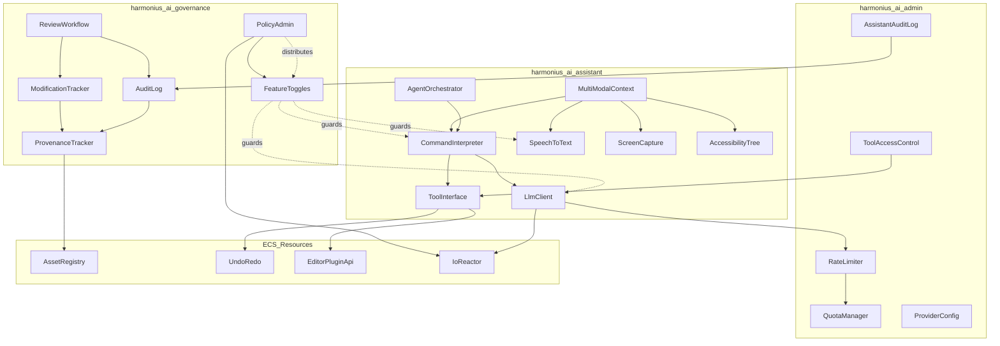
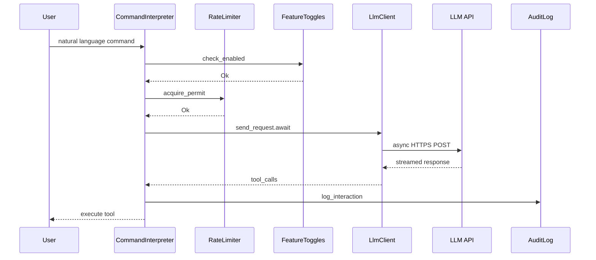
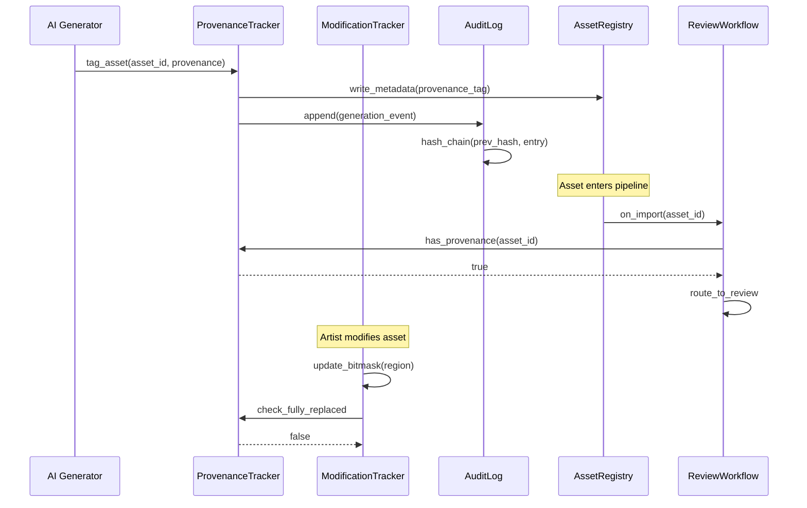
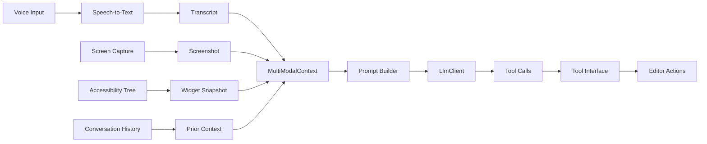
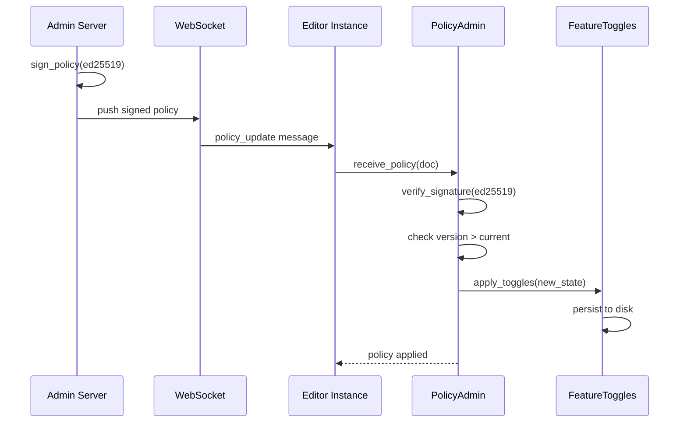

# AI Governance and Assistant Design

## Requirements Trace

> **Canonical sources:** Features, requirements, and user
> stories are defined in [features/tools-editor/](../../features/tools-editor/),
> [requirements/tools-editor/](../../requirements/tools-editor/), and
> [user-stories/tools-editor/](../../user-stories/tools-editor/). The table
> below traces design elements to those definitions.

### AI Governance (R-15.7)

| Feature | Requirement | User Stories | Description |
|---------|-------------|--------------|-------------|
| F-15.7.1 | R-15.7.1 | US-15.7.1.1 -- US-15.7.1.5 | AI content provenance tagging |
| F-15.7.2 | R-15.7.2 | US-15.7.2.1 -- US-15.7.2.4 | Human modification tracking |
| F-15.7.3 | R-15.7.3 | US-15.7.3.1 -- US-15.7.3.4 | Generative AI feature toggle |
| F-15.7.4 | R-15.7.4 | US-15.7.4.1 -- US-15.7.4.4 | AI assistance toggle |
| F-15.7.5 | R-15.7.5 | US-15.7.5.1 -- US-15.7.5.5 | Enterprise remote administration |
| F-15.7.6 | R-15.7.6 | US-15.7.6.1 -- US-15.7.6.4 | AI content audit trail |
| F-15.7.7 | R-15.7.7 | US-15.7.7.1 -- US-15.7.7.6 | AI content review workflow |
| F-15.7.8 | R-15.7.8 | US-15.7.8.1 -- US-15.7.8.4 | Provenance metadata in packaged builds |

### AI Assistant (R-15.9)

| Feature | Requirement | User Stories | Description |
|---------|-------------|--------------|-------------|
| F-15.9.1a | R-15.9.1a | US-15.9.1a.1 -- US-15.9.1a.4 | Speech-to-text pipeline |
| F-15.9.1b | R-15.9.1b | US-15.9.1b.1 -- US-15.9.1b.4 | Voice command interpretation |
| F-15.9.1c | R-15.9.1c | US-15.9.1c.1 -- US-15.9.1c.4 | Voice activation modes |
| F-15.9.2 | R-15.9.2 | US-15.9.2.1 -- US-15.9.2.6 | AI assistant tool interface |
| F-15.9.3 | R-15.9.3 | US-15.9.3.1 -- US-15.9.3.6 | Visual and graphical tool access |
| F-15.9.4 | R-15.9.4 | US-15.9.4.1 -- US-15.9.4.4 | Keyboard shortcut recommendations |
| F-15.9.5 | R-15.9.5 | US-15.9.5.1 -- US-15.9.5.4 | Contextual action reminders |
| F-15.9.6a | R-15.9.6a | US-15.9.6a.1 -- US-15.9.6a.4 | Headless editor API layer |
| F-15.9.6b | R-15.9.6b | US-15.9.6b.1 -- US-15.9.6b.4 | Agent orchestration |
| F-15.9.6c | R-15.9.6c | US-15.9.6c.1 -- US-15.9.6c.4 | CI/CD agent integration |
| F-15.9.7 | R-15.9.7 | US-15.9.7.1 -- US-15.9.7.5 | Screenshot and screen recording |
| F-15.9.8 | R-15.9.8 | US-15.9.8.1 -- US-15.9.8.5 | UI accessibility tree analysis |
| F-15.9.9 | R-15.9.9 | US-15.9.9.1 -- US-15.9.9.4 | Multi-modal understanding |
| F-15.9.10 | R-15.9.10 | US-15.9.10.1 -- US-15.9.10.6 | AI assistance administration |

## Overview

This design covers two closely related subsystems that
share infrastructure but serve distinct purposes:

1. **AI Governance** -- provenance tagging, modification
   tracking, feature toggles, audit trails, review
   workflows, and enterprise policy administration.
   Ensures studios control how generative AI is used and
   can prove compliance with internal and external
   policies.

2. **AI Assistant** -- natural language editor commands
   (voice and text), multi-modal context assembly, LLM
   tool calling, agent orchestration, and administration
   (rate limiting, quotas, provider configuration).
   Gives editors an AI-powered productivity layer.

Both subsystems are **API-based, not embedded**. All LLM
inference runs on self-hosted AWS infrastructure and is
accessed via async HTTPS. No model weights ship with the
engine. All state is stored as ECS resources. All I/O
uses the engine's `IoReactor` for async operations.

The governance layer is always available (even with AI
features disabled -- it tracks what already exists). The
assistant layer is gated behind the AI assistance toggle
(F-15.7.4) and the enterprise policy system (F-15.7.5).

## Architecture

### Module Boundaries



### File Layout

```
harmonius_ai/
├── governance/
│   ├── provenance.rs       # ProvenanceTag,
│   │                       # ProvenanceTracker
│   ├── modification.rs     # ModificationBitmask,
│   │                       # ModificationTracker
│   ├── toggle.rs           # FeatureToggleState,
│   │                       # FeatureToggles
│   ├── audit.rs            # AuditEntry, AuditLog,
│   │                       # hash chain
│   ├── review.rs           # ReviewRecord,
│   │                       # ReviewWorkflow
│   └── policy.rs           # PolicyDocument,
│                           # PolicyAdmin
├── assistant/
│   ├── client.rs           # LlmClient, streaming,
│   │                       # retry logic
│   ├── tool.rs             # ToolDefinition,
│   │                       # ToolInvocation,
│   │                       # ToolInterface
│   ├── interpreter.rs      # CommandInterpreter,
│   │                       # intent resolution
│   ├── context.rs          # MultiModalContext,
│   │                       # prompt builder
│   ├── voice.rs            # SpeechToText,
│   │                       # activation modes
│   ├── capture.rs          # ScreenCapture,
│   │                       # screenshot analysis
│   ├── accessibility.rs    # AccessibilityTree,
│   │                       # widget snapshot
│   └── agent.rs            # AgentContext,
│                           # AgentOrchestrator
├── admin/
│   ├── rate_limit.rs       # RateLimiter,
│   │                       # token bucket
│   ├── quota.rs            # UsageQuota,
│   │                       # QuotaManager
│   ├── provider.rs         # ProviderConfig,
│   │                       # model selection
│   ├── access.rs           # ToolAccessControl,
│   │                       # allowlist/blocklist
│   └── audit.rs            # AssistantAuditLog
└── lib.rs                  # Re-exports, plugin
                            # registration
```

### LLM API Request Flow



### Provenance and Audit Data Flow



### Multi-Modal Context Assembly



### Policy Distribution Flow



### Audit Log Hash Chain


Each entry is hashed with the previous entry's hash,
forming a tamper-evident chain. Log rotation preserves the
chain across segment boundaries by carrying the final hash
of the previous segment into the first entry of the new
segment.

## API Design

### Governance: Provenance Tracking

```rust
/// Unique identifier for an AI system or model
/// provider registered with the engine.
#[derive(
    Clone, Debug, PartialEq, Eq, Hash, Reflect,
)]
pub struct AiSystemId(pub u64);

/// Persistent provenance tag embedded in asset
/// metadata. Survives import, cook, and packaging.
#[derive(Clone, Debug, Reflect)]
pub struct ProvenanceTag {
    /// Asset this tag belongs to.
    pub asset_id: AssetId,
    /// AI system that generated the content.
    pub ai_system: AiSystemId,
    /// Model version string (e.g. "gpt-4o-2025").
    pub model_version: String,
    /// UTC timestamp of generation.
    pub timestamp_utc: u64,
    /// BLAKE3 hash of the prompt or generation
    /// parameters.
    pub prompt_hash: Blake3Hash,
    /// User who triggered the generation.
    pub triggered_by: UserId,
    /// True when all AI regions have been replaced
    /// by human content.
    pub fully_replaced: bool,
}

/// Manages provenance tags for all assets.
/// Stored as an ECS resource.
pub struct ProvenanceTracker {
    tags: HashMap<AssetId, ProvenanceTag>,
    registry: AssetRegistryHandle,
}

impl ProvenanceTracker {
    pub fn new(
        registry: AssetRegistryHandle,
    ) -> Self;

    /// Attach a provenance tag to an asset after
    /// AI generation. Writes metadata to the asset
    /// registry and appends to the audit log.
    pub async fn tag_asset(
        &mut self,
        asset_id: AssetId,
        ai_system: AiSystemId,
        model_version: &str,
        prompt_hash: Blake3Hash,
        user: UserId,
        audit_log: &mut AuditLog,
    ) -> Result<(), GovernanceError>;

    /// Query provenance for an asset. Returns None
    /// for assets without AI provenance.
    pub fn get_provenance(
        &self,
        asset_id: AssetId,
    ) -> Option<&ProvenanceTag>;

    /// Check whether an asset has AI provenance.
    pub fn has_provenance(
        &self,
        asset_id: AssetId,
    ) -> bool;

    /// Remove provenance tag. Called automatically
    /// when ModificationTracker reports all AI
    /// regions replaced.
    pub async fn remove_provenance(
        &mut self,
        asset_id: AssetId,
        audit_log: &mut AuditLog,
    ) -> Result<(), GovernanceError>;

    /// Query all assets with AI provenance.
    /// Supports filtering by AI system, date range,
    /// and user.
    pub fn query_assets(
        &self,
        filter: &ProvenanceFilter,
    ) -> Vec<AssetId>;

    /// Produce a minimal provenance record for
    /// packaged builds. Strips prompt hash and
    /// retains only flags and AI system ID.
    pub fn package_provenance(
        &self,
        asset_id: AssetId,
    ) -> Option<PackagedProvenance>;
}

/// Minimal provenance retained in shipped builds.
#[derive(Clone, Debug, Reflect)]
pub struct PackagedProvenance {
    pub asset_id: AssetId,
    pub ai_system: AiSystemId,
    pub has_ai_content: bool,
}
```

### Governance: Human Modification Tracking

```rust
/// Granularity at which modification is tracked
/// per asset type.
#[derive(Clone, Copy, Debug, PartialEq, Eq)]
pub enum TrackingGranularity {
    /// Mesh assets: per vertex group.
    VertexGroup,
    /// Texture assets: per tile or per layer.
    Tile,
    /// Data tables: per row or per column.
    Row,
    /// Logic graphs: per node.
    Node,
}

/// Compact bitmask tracking which regions of an
/// AI-generated asset have been replaced by human
/// content. Storage is under 1 KB per asset for
/// typical production content.
#[derive(Clone, Debug, Reflect)]
pub struct ModificationBitmask {
    pub asset_id: AssetId,
    pub granularity: TrackingGranularity,
    /// Each bit represents one region. 1 = human
    /// modified, 0 = AI-generated.
    pub bitmask: Vec<u64>,
    /// Total number of regions tracked.
    pub region_count: u32,
}

impl ModificationBitmask {
    pub fn new(
        asset_id: AssetId,
        granularity: TrackingGranularity,
        region_count: u32,
    ) -> Self;

    /// Mark a region as human-modified.
    pub fn mark_modified(&mut self, region: u32);

    /// Check whether a specific region has been
    /// human-modified.
    pub fn is_modified(&self, region: u32) -> bool;

    /// Percentage of regions modified by humans.
    pub fn modification_pct(&self) -> f32;

    /// True when every region has been replaced.
    pub fn is_fully_replaced(&self) -> bool;
}

/// Manages modification bitmasks for all tracked
/// assets. Stored as an ECS resource.
pub struct ModificationTracker {
    bitmasks: HashMap<AssetId, ModificationBitmask>,
    provenance: ProvenanceTrackerHandle,
}

impl ModificationTracker {
    pub fn new(
        provenance: ProvenanceTrackerHandle,
    ) -> Self;

    /// Begin tracking an AI-generated asset.
    pub fn start_tracking(
        &mut self,
        asset_id: AssetId,
        granularity: TrackingGranularity,
        region_count: u32,
    );

    /// Record a human modification to a region.
    /// If all regions are now replaced, triggers
    /// provenance removal.
    pub async fn record_modification(
        &mut self,
        asset_id: AssetId,
        region: u32,
        audit_log: &mut AuditLog,
    ) -> Result<(), GovernanceError>;

    /// Query modification percentage for an asset.
    pub fn modification_pct(
        &self,
        asset_id: AssetId,
    ) -> Option<f32>;
}
```

### Governance: Feature Toggles

```rust
/// The two independent AI feature toggles.
/// Evaluated at subsystem initialization. Changing
/// requires editor restart.
#[derive(Clone, Debug, Reflect)]
pub struct FeatureToggleState {
    /// Controls generative AI content features
    /// (F-15.7.3). When false, all LLM-based
    /// content generation is disabled. Deterministic
    /// AI (pathfinding, BTs, GOAP) is unaffected.
    pub generative_ai_enabled: bool,
    /// Controls AI editor assistance (F-15.7.4).
    /// When false, voice control, recommendations,
    /// and agent editing are disabled. Operates
    /// independently from generative_ai_enabled.
    pub assistance_enabled: bool,
    /// Monotonically increasing version. Used to
    /// reject stale policy updates.
    pub policy_version: u64,
    /// Ed25519 signature over the serialized toggle
    /// state. Verified before applying remote policy
    /// updates.
    pub policy_signature: Option<Ed25519Signature>,
}

/// ECS resource managing AI feature toggles.
pub struct FeatureToggles {
    state: FeatureToggleState,
    /// Path to persisted toggle state on disk.
    persistence_path: PathBuf,
}

impl FeatureToggles {
    pub fn new(
        persistence_path: PathBuf,
    ) -> Self;

    /// Load toggle state from disk. Falls back to
    /// defaults (both enabled) if no persisted state
    /// exists.
    pub async fn load(
        &mut self,
        reactor: &IoReactor,
    ) -> Result<(), GovernanceError>;

    /// Persist current toggle state to disk.
    pub async fn save(
        &self,
        reactor: &IoReactor,
    ) -> Result<(), GovernanceError>;

    /// Check whether generative AI content features
    /// are enabled.
    pub fn is_generative_enabled(&self) -> bool;

    /// Check whether AI assistance features are
    /// enabled.
    pub fn is_assistance_enabled(&self) -> bool;

    /// Apply a new toggle state from a verified
    /// policy. Persists to disk. The editor must be
    /// restarted for subsystem changes to take
    /// effect.
    pub async fn apply_policy(
        &mut self,
        state: FeatureToggleState,
        reactor: &IoReactor,
    ) -> Result<(), GovernanceError>;

    /// Current toggle state (read-only snapshot).
    pub fn state(&self) -> &FeatureToggleState;
}
```

### Governance: Audit Log

```rust
/// Classification of audit events.
#[derive(Clone, Debug, PartialEq, Eq, Reflect)]
pub enum AuditEventKind {
    /// AI content was generated.
    ContentGenerated,
    /// Provenance tag was removed (fully replaced).
    ProvenanceRemoved,
    /// AI assistant interaction.
    AssistantInteraction,
    /// Policy was applied.
    PolicyApplied,
    /// Review decision was made.
    ReviewDecision,
    /// Toggle state changed.
    ToggleChanged,
}

/// Payload varies by event kind.
#[derive(Clone, Debug, Reflect)]
pub enum AuditPayload {
    ContentGeneration {
        asset_id: AssetId,
        ai_system: AiSystemId,
        model_version: String,
        prompt_hash: Blake3Hash,
    },
    AssistantInteraction {
        agent_id: Option<AgentId>,
        tool_invocations: Vec<ToolId>,
        token_count: u32,
    },
    PolicyChange {
        old_version: u64,
        new_version: u64,
    },
    ReviewAction {
        asset_id: AssetId,
        status: ReviewStatus,
    },
}

/// Single entry in the hash-chained audit log.
#[derive(Clone, Debug, Reflect)]
pub struct AuditEntry {
    /// Monotonically increasing sequence ID.
    pub sequence_id: u64,
    /// BLAKE3 hash of the previous entry. Forms
    /// a tamper-evident chain.
    pub prev_hash: Blake3Hash,
    /// BLAKE3 hash of this entry (prev_hash +
    /// serialized payload).
    pub entry_hash: Blake3Hash,
    /// Event classification.
    pub kind: AuditEventKind,
    /// User who triggered the event.
    pub user_id: UserId,
    /// UTC timestamp.
    pub timestamp_utc: u64,
    /// Event-specific data.
    pub payload: AuditPayload,
}

/// Append-only, hash-chained audit log. Stored as
/// an ECS resource.
pub struct AuditLog {
    entries: Vec<AuditEntry>,
    /// Hash of the most recent entry.
    head_hash: Blake3Hash,
    /// Current sequence ID counter.
    next_sequence: u64,
    /// Segment files on disk.
    segments: Vec<PathBuf>,
    /// Maximum entries per segment before rotation.
    max_entries_per_segment: u64,
}

impl AuditLog {
    pub fn new(
        storage_dir: PathBuf,
        max_entries_per_segment: u64,
    ) -> Self;

    /// Append an event. Computes hash chain and
    /// persists to the current segment.
    pub async fn append(
        &mut self,
        kind: AuditEventKind,
        user_id: UserId,
        payload: AuditPayload,
        reactor: &IoReactor,
    ) -> Result<AuditEntry, GovernanceError>;

    /// Validate the hash chain from the first
    /// segment to the current head. Returns the
    /// first broken entry if tampering is detected.
    pub async fn validate_chain(
        &self,
        reactor: &IoReactor,
    ) -> Result<(), AuditChainError>;

    /// Query audit entries by filter (date range,
    /// event kind, user, asset).
    pub fn query(
        &self,
        filter: &AuditFilter,
    ) -> Vec<&AuditEntry>;

    /// Rotate the current segment. Starts a new
    /// segment file, carrying the head hash across
    /// the boundary.
    pub async fn rotate(
        &mut self,
        reactor: &IoReactor,
    ) -> Result<(), GovernanceError>;

    /// Replicate log entries to a remote server.
    /// Used in enterprise configurations.
    pub async fn replicate_to(
        &self,
        endpoint: &str,
        reactor: &IoReactor,
    ) -> Result<u64, GovernanceError>;
}

/// Error returned when hash chain validation fails.
#[derive(Debug)]
pub struct AuditChainError {
    pub broken_at: u64,
    pub expected_hash: Blake3Hash,
    pub actual_hash: Blake3Hash,
}
```

### Governance: Enterprise Policy

```rust
/// Per-team AI policy within an enterprise policy
/// document.
#[derive(Clone, Debug, Reflect)]
pub struct TeamPolicy {
    pub team_id: TeamId,
    pub generative_ai_enabled: bool,
    pub assistance_enabled: bool,
    pub allowed_ai_systems: Vec<AiSystemId>,
    pub review_required: bool,
}

/// Signed policy document distributed by the admin
/// server to editor instances.
#[derive(Clone, Debug, Reflect)]
pub struct PolicyDocument {
    pub version: u64,
    pub toggles: FeatureToggleState,
    pub team_policies: Vec<TeamPolicy>,
    pub signature: Ed25519Signature,
    pub public_key: Ed25519PublicKey,
}

/// Manages policy reception and verification.
/// Stored as an ECS resource.
pub struct PolicyAdmin {
    current_policy: Option<PolicyDocument>,
    trusted_keys: Vec<Ed25519PublicKey>,
    toggles: FeatureTogglesHandle,
}

impl PolicyAdmin {
    pub fn new(
        trusted_keys: Vec<Ed25519PublicKey>,
        toggles: FeatureTogglesHandle,
    ) -> Self;

    /// Receive and verify a policy document. Checks
    /// Ed25519 signature against trusted keys and
    /// ensures version > current. On success, applies
    /// toggles and persists to disk.
    pub async fn receive_policy(
        &mut self,
        doc: PolicyDocument,
        reactor: &IoReactor,
        audit_log: &mut AuditLog,
    ) -> Result<(), PolicyError>;

    /// Start a WebSocket listener for push-based
    /// policy updates.
    pub async fn start_push_listener(
        &mut self,
        url: &str,
        reactor: &IoReactor,
    ) -> Result<(), PolicyError>;

    /// Poll an HTTPS endpoint for pull-based
    /// policy updates. Called periodically.
    pub async fn poll_for_updates(
        &mut self,
        url: &str,
        reactor: &IoReactor,
        audit_log: &mut AuditLog,
    ) -> Result<bool, PolicyError>;

    /// Resolve the effective policy for a user
    /// given their team membership.
    pub fn effective_policy(
        &self,
        user_id: UserId,
        team_id: TeamId,
    ) -> EffectivePolicy;
}

/// Resolved policy for a specific user/team.
#[derive(Clone, Debug)]
pub struct EffectivePolicy {
    pub generative_ai_enabled: bool,
    pub assistance_enabled: bool,
    pub allowed_ai_systems: Vec<AiSystemId>,
    pub review_required: bool,
}
```

### Governance: Review Workflow

```rust
/// Review status for an AI-tagged asset.
#[derive(
    Clone, Copy, Debug, PartialEq, Eq, Reflect,
)]
pub enum ReviewStatus {
    Pending,
    Approved,
    Rejected,
    ChangesRequested,
    /// Auto-approved because human modification
    /// exceeds the configured threshold.
    AutoApproved,
}

/// Configuration for the review workflow.
#[derive(Clone, Debug, Reflect)]
pub struct ReviewConfig {
    /// Require review for all AI content, specific
    /// asset types, or none.
    pub scope: ReviewScope,
    /// Human modification percentage above which
    /// assets are auto-approved. Range 0.0 -- 1.0.
    pub auto_approve_threshold: f32,
}

#[derive(Clone, Debug, PartialEq, Eq, Reflect)]
pub enum ReviewScope {
    /// All assets with AI provenance.
    All,
    /// Only specific asset types.
    AssetTypes(Vec<AssetTypeId>),
    /// Review disabled.
    None,
}

/// A single review record.
#[derive(Clone, Debug, Reflect)]
pub struct ReviewRecord {
    pub asset_id: AssetId,
    pub status: ReviewStatus,
    pub reviewer: Option<UserId>,
    pub reviewed_at: Option<u64>,
    pub notes: Option<String>,
}

/// Manages the AI content review workflow.
/// Stored as an ECS resource.
pub struct ReviewWorkflow {
    config: ReviewConfig,
    records: HashMap<AssetId, ReviewRecord>,
    provenance: ProvenanceTrackerHandle,
    modification: ModificationTrackerHandle,
}

impl ReviewWorkflow {
    pub fn new(
        config: ReviewConfig,
        provenance: ProvenanceTrackerHandle,
        modification: ModificationTrackerHandle,
    ) -> Self;

    /// Called when an asset with provenance enters
    /// the pipeline. Routes to review or auto-
    /// approves based on config and modification
    /// percentage.
    pub async fn on_asset_import(
        &mut self,
        asset_id: AssetId,
        audit_log: &mut AuditLog,
    ) -> Result<ReviewStatus, GovernanceError>;

    /// Submit a review decision.
    pub async fn submit_review(
        &mut self,
        asset_id: AssetId,
        status: ReviewStatus,
        reviewer: UserId,
        notes: Option<String>,
        audit_log: &mut AuditLog,
    ) -> Result<(), GovernanceError>;

    /// Query review status for an asset.
    pub fn get_review(
        &self,
        asset_id: AssetId,
    ) -> Option<&ReviewRecord>;

    /// Query all assets pending review.
    pub fn pending_reviews(
        &self,
    ) -> Vec<&ReviewRecord>;

    /// Check whether an asset is approved for
    /// production use.
    pub fn is_approved(
        &self,
        asset_id: AssetId,
    ) -> bool;
}
```

### Assistant: LLM Client

```rust
/// Configuration for an LLM provider.
#[derive(Clone, Debug, Reflect)]
pub struct ProviderConfig {
    /// Provider identifier (e.g. "openai",
    /// "anthropic", "self-hosted").
    pub provider_id: String,
    /// API endpoint URL.
    pub endpoint: String,
    /// API key or token. Stored encrypted at rest.
    pub api_key: SecretString,
    /// Model identifier (e.g. "gpt-4o",
    /// "claude-sonnet-4-20250514").
    pub model_id: String,
    /// Maximum tokens per request.
    pub max_tokens: u32,
    /// Temperature parameter for generation.
    pub temperature: f32,
    /// Connection timeout in milliseconds.
    pub connect_timeout_ms: u32,
    /// Read timeout in milliseconds.
    pub read_timeout_ms: u32,
}

/// An LLM request containing the prompt and tool
/// definitions.
#[derive(Clone, Debug)]
pub struct LlmRequest {
    pub messages: Vec<LlmMessage>,
    pub tools: Vec<ToolDefinition>,
    pub max_tokens: Option<u32>,
    pub temperature: Option<f32>,
}

/// A message in the conversation.
#[derive(Clone, Debug)]
pub struct LlmMessage {
    pub role: MessageRole,
    pub content: MessageContent,
}

#[derive(Clone, Copy, Debug, PartialEq, Eq)]
pub enum MessageRole {
    System,
    User,
    Assistant,
    Tool,
}

/// Content can be text, image, or tool result.
#[derive(Clone, Debug)]
pub enum MessageContent {
    Text(String),
    Image { data: Vec<u8>, mime_type: String },
    ToolResult { tool_id: ToolId, result: String },
}

/// Response from the LLM. May contain text and/or
/// tool calls.
#[derive(Clone, Debug)]
pub struct LlmResponse {
    pub text: Option<String>,
    pub tool_calls: Vec<ToolCall>,
    pub usage: TokenUsage,
}

#[derive(Clone, Debug)]
pub struct ToolCall {
    pub tool_id: ToolId,
    pub arguments: serde_json::Value,
}

#[derive(Clone, Debug)]
pub struct TokenUsage {
    pub input_tokens: u32,
    pub output_tokens: u32,
}

/// Async LLM client. All communication uses the
/// engine's IoReactor for async HTTPS over TLS 1.3.
/// Stored as an ECS resource.
pub struct LlmClient {
    config: ProviderConfig,
    reactor: IoReactorHandle,
}

impl LlmClient {
    pub fn new(
        config: ProviderConfig,
        reactor: IoReactorHandle,
    ) -> Self;

    /// Send a request and await the full response.
    pub async fn send_request(
        &self,
        request: &LlmRequest,
    ) -> Result<LlmResponse, LlmError>;

    /// Send a request and return a stream of
    /// response chunks for incremental display.
    pub async fn send_streaming(
        &self,
        request: &LlmRequest,
    ) -> Result<LlmResponseStream, LlmError>;

    /// Update the provider configuration. Takes
    /// effect on the next request.
    pub fn update_config(
        &mut self,
        config: ProviderConfig,
    );
}
```

### Assistant: Tool Interface

```rust
/// Unique identifier for a tool.
#[derive(
    Clone, Debug, PartialEq, Eq, Hash, Reflect,
)]
pub struct ToolId(pub String);

/// Definition of a tool the AI assistant can
/// invoke. Auto-generated from editor plugin API
/// metadata.
#[derive(Clone, Debug, Reflect)]
pub struct ToolDefinition {
    pub id: ToolId,
    pub name: String,
    pub description: String,
    /// JSON Schema for parameters.
    pub parameters: serde_json::Value,
    /// Validation rules beyond schema (e.g. range
    /// constraints, cross-field dependencies).
    pub validation_rules: Vec<ValidationRule>,
    /// Whether this tool supports undo/redo.
    pub supports_undo: bool,
}

/// Validation rule applied to tool parameters.
#[derive(Clone, Debug, Reflect)]
pub enum ValidationRule {
    Range {
        field: String,
        min: f64,
        max: f64,
    },
    OneOf {
        field: String,
        values: Vec<serde_json::Value>,
    },
    Required {
        field: String,
    },
    Custom {
        name: String,
        expression: String,
    },
}

/// Result of executing a tool invocation.
#[derive(Clone, Debug)]
pub enum ToolResult {
    Success {
        message: String,
        undo_command: Option<UndoCommandId>,
    },
    Error {
        message: String,
        code: ToolErrorCode,
    },
}

#[derive(Clone, Copy, Debug, PartialEq, Eq)]
pub enum ToolErrorCode {
    ValidationFailed,
    ToolNotFound,
    ToolBlocked,
    ExecutionFailed,
    FeatureDisabled,
}

/// Registry of all tools available to the
/// assistant. Stored as an ECS resource.
pub struct ToolInterface {
    definitions: HashMap<ToolId, ToolDefinition>,
    undo_stack: UndoRedoHandle,
    plugin_api: EditorPluginApiHandle,
}

impl ToolInterface {
    pub fn new(
        undo_stack: UndoRedoHandle,
        plugin_api: EditorPluginApiHandle,
    ) -> Self;

    /// Register a tool definition. Typically called
    /// during plugin initialization.
    pub fn register_tool(
        &mut self,
        definition: ToolDefinition,
    );

    /// Auto-generate tool definitions from all
    /// registered editor plugin API metadata.
    pub fn sync_from_plugin_api(&mut self);

    /// Get all registered tool definitions (for
    /// inclusion in LLM requests).
    pub fn all_definitions(
        &self,
    ) -> Vec<&ToolDefinition>;

    /// Validate and execute a tool call. Records
    /// the action in the undo stack if the tool
    /// supports undo.
    pub async fn execute(
        &self,
        call: &ToolCall,
        access_control: &ToolAccessControl,
    ) -> ToolResult;

    /// Validate tool call parameters against the
    /// tool's schema and validation rules.
    pub fn validate(
        &self,
        call: &ToolCall,
    ) -> Result<(), Vec<String>>;
}
```

### Assistant: Command Interpreter

```rust
/// Interprets natural language input into tool
/// invocations using the LLM client.
pub struct CommandInterpreter {
    llm: LlmClientHandle,
    tools: ToolInterfaceHandle,
    toggles: FeatureTogglesHandle,
    rate_limiter: RateLimiterHandle,
    audit_log: AuditLogHandle,
}

impl CommandInterpreter {
    pub fn new(
        llm: LlmClientHandle,
        tools: ToolInterfaceHandle,
        toggles: FeatureTogglesHandle,
        rate_limiter: RateLimiterHandle,
        audit_log: AuditLogHandle,
    ) -> Self;

    /// Process a natural language command. Checks
    /// toggles, rate limits, sends to LLM, executes
    /// tool calls, and logs the interaction.
    pub async fn process_command(
        &self,
        context: &MultiModalContext,
        user_id: UserId,
        access_control: &ToolAccessControl,
    ) -> Result<
        Vec<ToolResult>,
        AssistantError,
    >;
}
```

### Assistant: Multi-Modal Context

```rust
/// Voice transcript with word-level timestamps.
#[derive(Clone, Debug)]
pub struct Transcript {
    pub text: String,
    pub words: Vec<WordTimestamp>,
}

#[derive(Clone, Debug)]
pub struct WordTimestamp {
    pub word: String,
    pub start_ms: u64,
    pub end_ms: u64,
}

/// Snapshot of the UI accessibility tree for the
/// assistant's understanding of editor state.
#[derive(Clone, Debug)]
pub struct AccessibilitySnapshot {
    pub root: AccessibilityNode,
    pub active_panel: Option<String>,
    pub selected_entity: Option<EntityId>,
    pub active_tool: Option<String>,
}

#[derive(Clone, Debug)]
pub struct AccessibilityNode {
    pub widget_type: String,
    pub label: Option<String>,
    pub value: Option<String>,
    pub enabled: bool,
    pub focused: bool,
    pub children: Vec<AccessibilityNode>,
}

/// Assembled multi-modal context for a single
/// assistant interaction.
#[derive(Clone, Debug)]
pub struct MultiModalContext {
    /// Voice transcript (if voice input active).
    pub voice: Option<Transcript>,
    /// Text command (if typed).
    pub text: Option<String>,
    /// Screenshot of viewport or panel.
    pub screenshot: Option<Vec<u8>>,
    /// Structured UI state.
    pub accessibility: AccessibilitySnapshot,
    /// Conversation history for context continuity.
    pub history: Vec<LlmMessage>,
}

impl MultiModalContext {
    /// Build the LLM prompt from all available
    /// modalities. Structured data (accessibility,
    /// selection) takes precedence over pixel
    /// analysis when both are available.
    pub fn build_prompt(
        &self,
        tools: &[ToolDefinition],
    ) -> LlmRequest;
}
```

### Assistant: Agent Orchestration

```rust
/// Unique identifier for an AI agent.
#[derive(
    Clone, Copy, Debug, PartialEq, Eq, Hash,
)]
pub struct AgentId(pub u64);

/// Isolated execution context for a single AI
/// agent. Each agent has its own undo stack,
/// selection state, and conversation history.
pub struct AgentContext {
    pub id: AgentId,
    pub undo_stack: UndoStack,
    pub selection: SelectionState,
    pub history: Vec<LlmMessage>,
    pub invocations: Vec<ToolInvocation>,
}

/// Manages multiple concurrent AI agents with
/// isolated contexts. Stored as an ECS resource.
pub struct AgentOrchestrator {
    agents: HashMap<AgentId, AgentContext>,
    interpreter: CommandInterpreterHandle,
    next_id: u64,
}

impl AgentOrchestrator {
    pub fn new(
        interpreter: CommandInterpreterHandle,
    ) -> Self;

    /// Create a new agent with an isolated context.
    pub fn create_agent(&mut self) -> AgentId;

    /// Run a command within an agent's context.
    pub async fn run_command(
        &mut self,
        agent_id: AgentId,
        context: MultiModalContext,
        user_id: UserId,
        access_control: &ToolAccessControl,
    ) -> Result<
        Vec<ToolResult>,
        AssistantError,
    >;

    /// Terminate an agent and release its context.
    pub fn terminate_agent(
        &mut self,
        agent_id: AgentId,
    ) -> Result<(), AssistantError>;

    /// List all active agents.
    pub fn active_agents(&self) -> Vec<AgentId>;

    /// Get a read-only reference to an agent's
    /// context.
    pub fn get_context(
        &self,
        agent_id: AgentId,
    ) -> Option<&AgentContext>;
}
```

### Administration: Rate Limiting and Quotas

```rust
/// Token-bucket rate limiter for LLM API requests.
pub struct RateLimiter {
    buckets: HashMap<UserId, TokenBucket>,
    quota_manager: QuotaManagerHandle,
}

/// Token bucket for a single user.
struct TokenBucket {
    tokens: f64,
    max_tokens: f64,
    refill_rate: f64,
    last_refill: u64,
}

impl RateLimiter {
    pub fn new(
        quota_manager: QuotaManagerHandle,
    ) -> Self;

    /// Attempt to acquire a permit for one request.
    /// Returns Err(RateLimited) if the user's
    /// bucket is exhausted.
    pub fn acquire_permit(
        &mut self,
        user_id: UserId,
    ) -> Result<(), AssistantError>;

    /// Record token usage after a response. Deducts
    /// from the user's daily token quota.
    pub fn record_usage(
        &mut self,
        user_id: UserId,
        usage: &TokenUsage,
    ) -> Result<(), AssistantError>;
}

/// Per-user or per-team usage quotas.
#[derive(Clone, Debug, Reflect)]
pub struct UsageQuota {
    pub user_id: UserId,
    /// Maximum requests per hour.
    pub requests_per_hour: u32,
    /// Maximum tokens per day.
    pub tokens_per_day: u32,
    /// Requests used in the current hour window.
    pub requests_used: u32,
    /// Tokens used in the current day window.
    pub tokens_used: u64,
    /// Hour window start (UTC).
    pub hour_window_start: u64,
    /// Day window start (UTC).
    pub day_window_start: u64,
}

impl UsageQuota {
    /// Check whether the user has exceeded any
    /// quota limit.
    pub fn is_exceeded(&self) -> bool;
}

/// Manages quotas for all users. Stored as an
/// ECS resource.
pub struct QuotaManager {
    quotas: HashMap<UserId, UsageQuota>,
    /// Default quota applied when no per-user or
    /// per-team quota is configured.
    default_quota: QuotaConfig,
}

#[derive(Clone, Debug, Reflect)]
pub struct QuotaConfig {
    pub requests_per_hour: u32,
    pub tokens_per_day: u32,
}

impl QuotaManager {
    pub fn new(
        default_quota: QuotaConfig,
    ) -> Self;

    /// Get or create a quota for a user.
    pub fn get_quota(
        &mut self,
        user_id: UserId,
    ) -> &mut UsageQuota;

    /// Set a custom quota for a user. Overrides
    /// team and default quotas.
    pub fn set_user_quota(
        &mut self,
        user_id: UserId,
        config: QuotaConfig,
    );

    /// Reset all quotas (called at window
    /// boundaries).
    pub fn reset_expired_windows(
        &mut self,
        now_utc: u64,
    );
}
```

### Administration: Tool Access Control

```rust
/// Controls which tools the AI assistant is
/// permitted to invoke.
#[derive(Clone, Debug, Reflect)]
pub struct ToolAccessControl {
    /// If set, only these tools are allowed.
    /// Takes precedence over blocklist.
    pub allowlist: Option<HashSet<ToolId>>,
    /// These tools are blocked. Ignored if
    /// allowlist is set.
    pub blocklist: HashSet<ToolId>,
}

impl ToolAccessControl {
    pub fn new() -> Self;

    /// Check whether a tool is allowed.
    pub fn is_allowed(
        &self,
        tool_id: &ToolId,
    ) -> bool;

    /// Set an allowlist. Replaces any existing
    /// allowlist or blocklist.
    pub fn set_allowlist(
        &mut self,
        tools: HashSet<ToolId>,
    );

    /// Set a blocklist. Only effective when no
    /// allowlist is set.
    pub fn set_blocklist(
        &mut self,
        tools: HashSet<ToolId>,
    );
}
```

### Error Types

```rust
#[derive(Debug)]
pub enum GovernanceError {
    AssetNotFound { asset_id: AssetId },
    ProvenanceNotFound { asset_id: AssetId },
    IoError(IoError),
    SerializationError(String),
}

#[derive(Debug)]
pub enum PolicyError {
    InvalidSignature,
    StaleVersion {
        current: u64,
        received: u64,
    },
    UntrustedKey,
    NetworkError(IoError),
    MalformedDocument(String),
}

#[derive(Debug)]
pub enum AssistantError {
    FeatureDisabled,
    RateLimited {
        retry_after_ms: u64,
    },
    QuotaExceeded {
        limit: &'static str,
    },
    LlmError(LlmError),
    ToolError {
        tool_id: ToolId,
        code: ToolErrorCode,
        message: String,
    },
    AgentNotFound {
        agent_id: AgentId,
    },
}

#[derive(Debug)]
pub enum LlmError {
    ConnectionFailed(IoError),
    Timeout,
    InvalidResponse(String),
    AuthenticationFailed,
    ServerError { status: u16, body: String },
}
```

## Data Flow

### AI Content Generation Lifecycle

1. A generative AI system produces an asset.
2. `ProvenanceTracker::tag_asset` attaches a
   provenance tag (AI system, model, timestamp,
   prompt hash) to the asset metadata in the
   `AssetRegistry`.
3. `AuditLog::append` records the generation event
   with hash chaining.
4. `ModificationTracker::start_tracking` initializes
   a bitmask for the asset's regions.
5. The asset enters the pipeline. If review is
   required (per `ReviewConfig`), `ReviewWorkflow`
   routes it to reviewers before it can enter the
   production database.
6. As artists modify regions, `ModificationTracker`
   updates the bitmask. When modification percentage
   exceeds the auto-approve threshold, the asset is
   auto-approved.
7. When all regions are replaced, `ProvenanceTracker`
   removes the tag and the audit log records the
   removal.

### AI Assistant Interaction Lifecycle

1. User speaks or types a command.
2. Voice input goes through `SpeechToText` to
   produce a `Transcript`.
3. `MultiModalContext` assembles all available
   modalities: transcript/text, screenshot,
   accessibility tree snapshot, conversation history.
4. `CommandInterpreter` checks `FeatureToggles` to
   verify AI assistance is enabled.
5. `RateLimiter` checks the user's token bucket.
6. `MultiModalContext::build_prompt` constructs the
   `LlmRequest` with tool definitions from
   `ToolInterface`.
7. `LlmClient::send_request` sends the request to
   the self-hosted AWS LLM API via async HTTPS over
   TLS 1.3 through the `IoReactor`.
8. The LLM response contains tool calls.
9. `ToolAccessControl` verifies each tool is allowed.
10. `ToolInterface::execute` validates parameters and
    runs each tool, recording in the undo stack.
11. `AuditLog::append` records the interaction.
12. Results are returned to the user.

### Enterprise Policy Distribution

1. Admin server signs a `PolicyDocument` with
   Ed25519.
2. Policy is pushed via WebSocket or pulled via
   HTTPS polling.
3. `PolicyAdmin::receive_policy` verifies the
   signature against trusted public keys and checks
   the version is newer than the current policy.
4. On success, `FeatureToggles::apply_policy` updates
   toggle state and persists to disk.
5. `AuditLog` records the policy change event.
6. The editor must be restarted for subsystem-level
   changes (generative AI toggle, assistance toggle)
   to take full effect.

### Offline Behavior

When the editor lacks connectivity to the admin policy
server:

- The last-synced policy is loaded from disk.
- All assistant interactions are logged locally.
- When connectivity is restored, local logs are
  replicated to the central server via
  `AuditLog::replicate_to`.
- Rate limits and quotas operate against local
  counters. Reconciliation with the server happens
  on reconnect.

## Platform Considerations

### LLM API Communication

| Platform | Transport | Notes |
|----------|-----------|-------|
| Windows | IOCP | HTTPS via async I/O through `IoReactor`. TLS 1.3 via `rustls`. |
| macOS | GCD | Dispatch IO for async HTTPS. TLS 1.3 via `rustls`. C++ wrappers via `cxx.rs`. |
| Linux | io_uring | Async HTTPS through `IoReactor`. TLS 1.3 via `rustls`. Kernel 5.1+. |

### Voice Input (Speech-to-Text)

| Platform | Audio Capture | Permission |
|----------|--------------|------------|
| Windows | WASAPI | No special permission required |
| macOS | CoreAudio | TCC microphone permission required |
| Linux | PipeWire / PulseAudio | PipeWire preferred; PulseAudio fallback |

### Screen Capture

| Platform | API | Permission |
|----------|-----|------------|
| Windows | DXGI Desktop Duplication / Windows Graphics Capture | No special permission |
| macOS | ScreenCaptureKit | TCC screen recording permission |
| Linux | PipeWire / framebuffer readback | Portal permission (PipeWire) |

### Accessibility Tree

| Platform | API | Notes |
|----------|-----|-------|
| Windows | UI Automation (UIA) | Native COM API |
| macOS | NSAccessibility | AppKit integration |
| Linux | AT-SPI2 | D-Bus based |

### Headless Mode (CI/CD)

| Platform | GPU Context | Notes |
|----------|------------|-------|
| Windows | Software rasterizer | For viewport operations |
| macOS | Headless Metal | Metal device without display |
| Linux | EGL / Software | EGL for GPU, software fallback |

### Cryptography

| Algorithm | Purpose | Crate |
|-----------|---------|-------|
| Ed25519 | Policy document signatures | `ed25519-dalek` |
| BLAKE3 | Prompt hashing, audit chain | `blake3` |
| TLS 1.3 | LLM API transport | `rustls` |
| AES-256-GCM | API key encryption at rest | `aes-gcm` |

### Infrastructure (Self-Hosted AWS)

| Component | Service | Notes |
|-----------|---------|-------|
| LLM inference | EC2 (GPU instances) or Bedrock | Model-agnostic API layer |
| Policy server | ECS Fargate | Admin API, WebSocket push |
| Audit log replication | S3 + DynamoDB | Centralized log storage |
| CDN for model configs | CloudFront | Low-latency config delivery |

### Proposed Dependencies

| Crate | Purpose | Justification |
|-------|---------|---------------|
| `rustls` | TLS 1.3 for HTTPS | Pure Rust, no OpenSSL dependency |
| `ed25519-dalek` | Ed25519 signing/verification | Well-maintained, audited |
| `blake3` | Fast hashing (provenance, audit chain) | Fastest general-purpose hash |
| `aes-gcm` | API key encryption at rest | AEAD for secrets storage |
| `serde_json` | JSON serialization for LLM API | Standard ecosystem crate |
| `cxx` | C++ interop for macOS APIs | Safe bridge for GCD wrappers |
| `smallvec` | Inline-allocated small vectors | Tool call argument lists |

## Test Plan

### Unit Tests

| Test | Req | Description |
|------|-----|-------------|
| `test_provenance_tag_attach_and_query` | R-15.7.1 | Tag an asset, verify tag fields match, query returns correct tag. |
| `test_provenance_survives_serialization` | R-15.7.1 | Serialize and deserialize a tagged asset; verify tag is preserved. |
| `test_provenance_removal_on_full_replace` | R-15.7.1, R-15.7.2 | Mark all regions modified; verify provenance tag is automatically removed. |
| `test_modification_bitmask_granularity` | R-15.7.2 | Create bitmasks for each granularity (vertex group, tile, row, node); verify per-region tracking. |
| `test_bitmask_under_1kb` | R-15.7.2 | Verify bitmask size < 1 KB for typical asset region counts (up to 8000 regions). |
| `test_modification_pct_calculation` | R-15.7.2 | Mark partial regions; verify percentage matches expected. |
| `test_generative_toggle_disables_llm` | R-15.7.3 | Disable generative AI; verify LLM content generation returns `FeatureDisabled`. |
| `test_deterministic_ai_unaffected` | R-15.7.3 | Disable generative AI; verify pathfinding, BT, GOAP still function. |
| `test_toggle_independence` | R-15.7.4 | Test all four toggle combinations; verify each feature set is correct. |
| `test_toggle_persistence` | R-15.7.4 | Save and load toggle state; verify round-trip correctness. |
| `test_ed25519_signature_verification` | R-15.7.5 | Sign a policy, verify with correct key. Tamper with policy, verify rejection. |
| `test_stale_policy_rejected` | R-15.7.5 | Send a policy with version <= current; verify rejection. |
| `test_audit_hash_chain` | R-15.7.6 | Append 100 entries; validate chain. Tamper with entry 50; verify chain breaks at 50. |
| `test_audit_rotation_preserves_chain` | R-15.7.6 | Rotate segments; validate chain across segments. |
| `test_review_auto_approve_threshold` | R-15.7.7 | Set threshold to 80%; mark 80% modified; verify auto-approval. |
| `test_review_blocks_unapproved` | R-15.7.7 | Verify unapproved assets are not marked as approved. |
| `test_packaged_provenance_minimal` | R-15.7.8 | Package provenance; verify only flags and AI system ID are retained. |
| `test_rate_limiter_token_bucket` | R-15.9.10 | Exhaust bucket; verify rate limit error. Wait for refill; verify permit granted. |
| `test_quota_requests_per_hour` | R-15.9.10 | Exceed hourly request quota; verify error. |
| `test_quota_tokens_per_day` | R-15.9.10 | Exceed daily token quota; verify error. |
| `test_tool_allowlist` | R-15.9.10 | Set allowlist; verify allowed tool passes, unlisted tool blocked. |
| `test_tool_blocklist` | R-15.9.10 | Set blocklist; verify blocked tool rejected, others pass. |
| `test_tool_validation` | R-15.9.2 | Invoke tool with invalid parameters; verify validation error. |
| `test_tool_undo_integration` | R-15.9.2 | Execute tool; verify undo command recorded in undo stack. |
| `test_agent_isolation` | R-15.9.6b | Create two agents; modify selection in one; verify other agent's selection unchanged. |
| `test_agent_independent_undo` | R-15.9.6b | Execute tool in each agent; undo in one; verify other agent unaffected. |
| `test_context_build_precedence` | R-15.9.9 | Build prompt with both accessibility and screenshot; verify structured data appears before pixel data. |

### Integration Tests

| Test | Req | Description |
|------|-----|-------------|
| `test_provenance_pipeline_survival` | R-15.7.1 | Tag asset, run through import/cook/package pipeline; verify tag present in packaged output. |
| `test_policy_push_via_websocket` | R-15.7.5 | Start mock admin server; push signed policy via WebSocket; verify editor applies it. |
| `test_policy_pull_via_https` | R-15.7.5 | Start mock admin server; poll for policy via HTTPS; verify editor applies it. |
| `test_audit_replication` | R-15.7.6 | Append entries locally; replicate to mock server; verify all entries received. |
| `test_review_workflow_end_to_end` | R-15.7.7 | Generate AI asset, route to review, approve, verify asset enters production database. |
| `test_llm_request_async` | R-15.9.2 | Send request to mock LLM API via IoReactor; verify response parsing and tool call extraction. |
| `test_voice_command_roundtrip` | R-15.9.1b | Feed transcript to CommandInterpreter with mock LLM; verify correct tool invocation. |
| `test_headless_tool_execution` | R-15.9.6a | Execute tool via headless API; verify result matches interactive execution. |
| `test_ci_agent_artifact_production` | R-15.9.6c | Run agent in headless mode; verify build artifact produced. |
| `test_offline_then_reconnect` | R-15.9.10 | Operate without policy server; reconnect; verify local logs replicate. |

### Benchmarks

| Benchmark | Target | Source |
|-----------|--------|--------|
| Audit log append (per entry) | < 10 us | US-15.7.6.2 |
| Hash chain validation (10,000 entries) | < 50 ms | US-15.7.6.4 |
| Provenance tag lookup | < 1 us | US-15.7.1.3 |
| Modification bitmask update | < 500 ns | US-15.7.2.2 |
| Toggle state check | < 100 ns | US-15.7.3.3 |
| Policy signature verification | < 5 ms | US-15.7.5.2 |
| Tool definition lookup | < 1 us | US-15.9.2.4 |
| Tool parameter validation | < 50 us | US-15.9.2.4 |
| Accessibility tree query | < 5 ms | US-15.9.8.3 |
| Rate limiter acquire_permit | < 500 ns | US-15.9.10.3 |
| Context prompt build | < 2 ms | US-15.9.9.3 |

## Open Questions

1. **LLM provider abstraction depth.** The current
   design uses a single `ProviderConfig` struct.
   Different providers (OpenAI, Anthropic, self-hosted
   vLLM) have different API shapes. Should we define
   a provider trait with per-provider implementations,
   or normalize at the HTTP request layer?

2. **Streaming response handling.** Streamed LLM
   responses arrive as incremental chunks. Should the
   assistant display partial text to the user during
   streaming, or wait for the complete response before
   executing tool calls?

3. **Audit log storage format.** The design uses an
   append-only file with hash chaining. Should we use
   a compact binary format (e.g. FlatBuffers) for
   performance, or a textual format (RON) for human
   readability?

4. **Voice activation privacy.** Always-listening
   mode captures audio continuously. What is the
   retention policy for audio data that does not
   contain a command? Should audio be discarded
   immediately after wake-word analysis?

5. **Tool definition versioning.** When the editor
   plugin API changes, tool definitions change. How
   should the assistant handle mid-conversation tool
   definition changes? Should it restart the
   conversation context?

6. **Agent resource limits.** Multiple concurrent
   agents each hold an isolated context (undo stack,
   selection, history). What is the maximum number
   of concurrent agents? Should there be memory
   limits per agent context?

7. **Offline LLM fallback.** The assistant requires
   API connectivity. Should there be a reduced-
   capability offline mode (e.g. cached shortcut
   recommendations, pre-computed help overlays)
   when the LLM API is unreachable?

8. **Review workflow notification.** When an asset
   is routed to review, how are reviewers notified?
   Should this integrate with the editor's
   notification system, or with external tools
   (Slack, email)?

9. **Prompt injection mitigation.** User voice and
   text input is included in LLM prompts. What
   safeguards prevent prompt injection that could
   cause the assistant to invoke unintended tools?

10. **Token cost attribution.** Token usage is tracked
    per user. Should cost attribution also track
    per-project, per-team, or per-agent granularity
    for enterprise billing?
