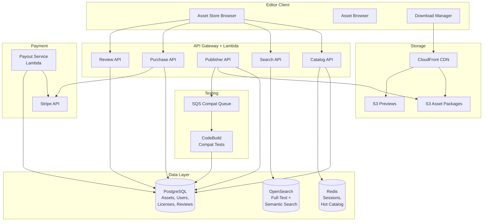
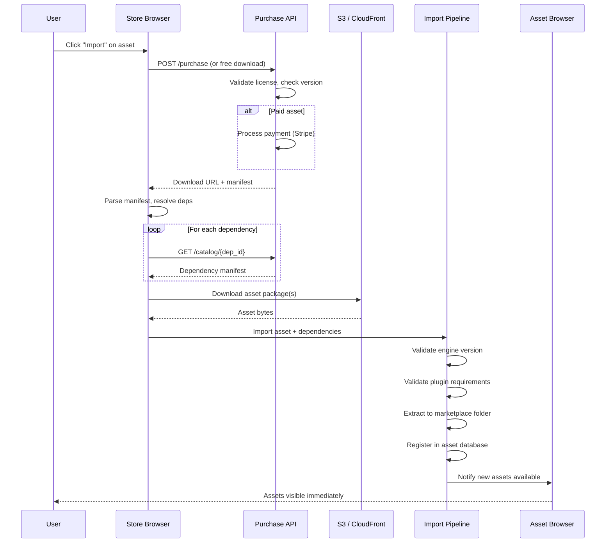
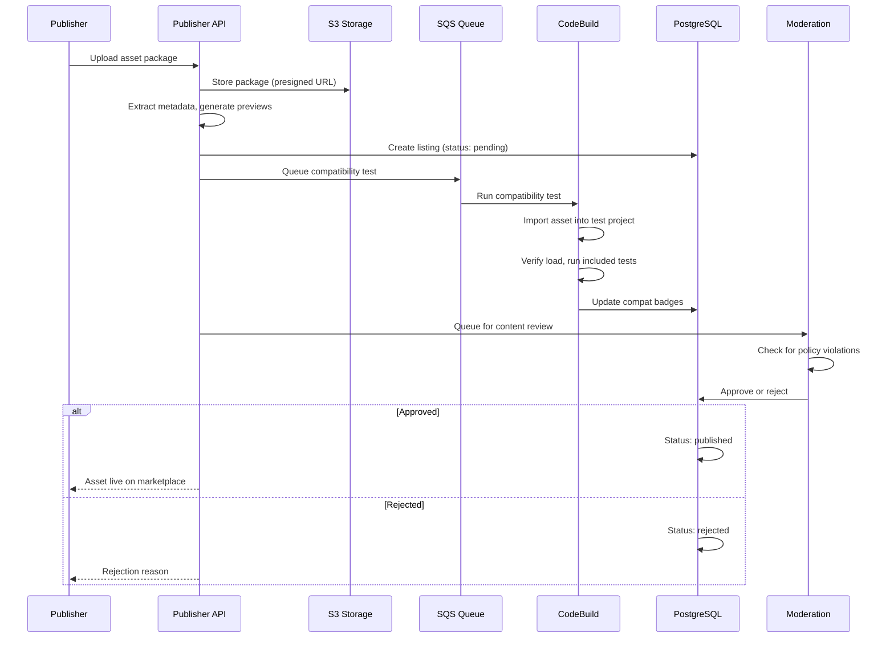
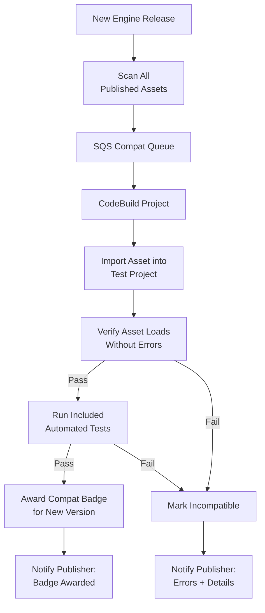
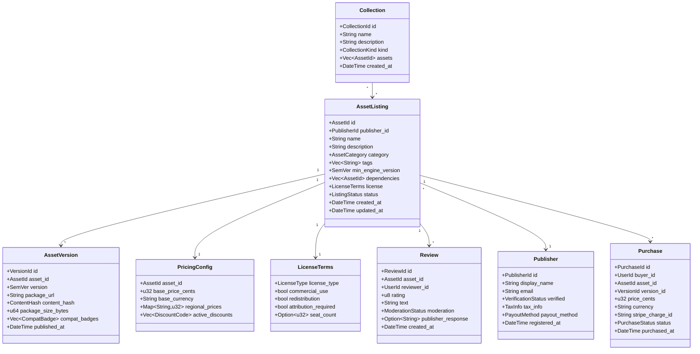

# Asset Store / Marketplace Design

## Requirements Trace

> **Canonical sources:** Features, requirements, and user stories are defined in
> [features/tools-editor/](../../features/tools-editor/),
> [requirements/tools-editor/](../../requirements/tools-editor/), and
> [user-stories/tools-editor/](../../user-stories/tools-editor/). The table below traces design
> elements to those definitions.

| Feature | Requirement | Description |
|---------|-------------|-------------|
| F-15.17.1 | R-15.17.1 | Integrated asset store browser (search, filter, preview) |
| F-15.17.2 | R-15.17.2 | One-click asset import with dependency resolution |
| F-15.17.3 | R-15.17.3 | Asset ratings, reviews, and curation |
| F-15.17.4 | R-15.17.4 | Publisher account and dashboard |
| F-15.17.5 | R-15.17.5 | Automated compatibility testing |
| F-15.17.6 | R-15.17.6 | Revenue sharing and payout |
| F-15.17.7 | R-15.17.7 | Asset type support (all engine types) |
| F-15.17.8 | R-15.17.8 | License management and DRM-free import |

## Overview

The asset marketplace is a self-hosted platform for discovering, purchasing, publishing, and
distributing engine assets. It consists of three layers:

1. **Editor client** -- In-editor browser with search, preview, purchase, and one-click import
2. **Backend API** -- REST services on AWS (API Gateway
   - Lambda) for catalog, purchases, reviews, and
   publisher management
3. **Storage and CDN** -- S3 for asset packages and previews, CloudFront for global distribution

Key principles:

- **No runtime DRM.** Once imported, assets work fully offline. License enforcement is contractual,
  not technical.
- **Dependency resolution.** Import automatically pulls transitive dependencies (plugins, material
  libraries).
- **Compatibility badges.** Automated CI tests every asset against each engine release.
- **Self-hosted.** All infrastructure runs in the studio's own AWS account via CDK stacks from the
  server infrastructure (F-15.18.1).

## Architecture

### System Architecture



### One-Click Import Flow



### Publisher Upload and Review Flow



### Compatibility Testing Pipeline



### Data Model



### Module Layout

```text
harmonius_asset_store/
├── client/                   # Editor-side code
│   ├── browser.rs            # Store browser UI panel
│   ├── search.rs             # Search + filter logic
│   ├── preview.rs            # 3D model viewer,
│   │                         # material preview,
│   │                         # audio playback
│   ├── download.rs           # Download manager,
│   │                         # progress tracking
│   ├── import.rs             # One-click import,
│   │                         # dependency resolution
│   └── license.rs            # License validation,
│                             # display
├── api/                      # Lambda handlers
│   ├── catalog.rs            # GET /catalog, filters
│   ├── search.rs             # GET /search (OpenSearch)
│   ├── purchase.rs           # POST /purchase, refund
│   ├── publisher.rs          # Publisher CRUD, upload
│   ├── review.rs             # Review CRUD, moderate
│   ├── collection.rs         # Collection CRUD
│   ├── compat.rs             # Compat test trigger
│   └── payout.rs             # Revenue, payout calc
├── models/                   # Shared data types
│   ├── asset.rs              # AssetListing,
│   │                         # AssetVersion
│   ├── publisher.rs          # Publisher, TaxInfo
│   ├── pricing.rs            # PricingConfig,
│   │                         # DiscountCode
│   ├── review.rs             # Review, moderation
│   ├── purchase.rs           # Purchase, refund
│   ├── license.rs            # LicenseTerms,
│   │                         # LicenseType
│   └── collection.rs         # Collection,
│                             # CollectionKind
└── infra/                    # CDK stack (TypeScript)
    ├── asset-store-stack.ts  # API Gateway, Lambda,
    │                         # OpenSearch, S3
    └── compat-test-stack.ts  # SQS, CodeBuild
```

## API Design

### Asset Catalog

```rust
/// Asset category for filtering.
#[derive(Clone, Copy, Debug, PartialEq, Eq)]
pub enum AssetCategory {
    Mesh3d,
    Sprite2d,
    Material,
    VfxGraph,
    AudioClip,
    MusicTrack,
    LogicGraphTemplate,
    UiWidgetTemplate,
    AnimationClip,
    AnimationStateMachine,
    TerrainBrush,
    BiomePreset,
    ProceduralGraph,
    ProjectTemplate,
    RustPlugin,
}

/// Listing status lifecycle.
#[derive(Clone, Copy, Debug, PartialEq, Eq)]
pub enum ListingStatus {
    /// Uploaded, awaiting compatibility test.
    Pending,
    /// Passed tests, awaiting content review.
    InReview,
    /// Approved and visible on marketplace.
    Published,
    /// Rejected by content review.
    Rejected,
    /// Removed by publisher.
    Unlisted,
    /// Removed by moderation.
    Suspended,
}

/// Unique asset identifier.
#[derive(
    Clone, Copy, Debug, PartialEq, Eq, Hash,
)]
pub struct AssetId(pub u64);

/// Unique version identifier.
#[derive(
    Clone, Copy, Debug, PartialEq, Eq, Hash,
)]
pub struct VersionId(pub u64);

/// Unique publisher identifier.
#[derive(
    Clone, Copy, Debug, PartialEq, Eq, Hash,
)]
pub struct PublisherId(pub u64);

/// Unique review identifier.
#[derive(
    Clone, Copy, Debug, PartialEq, Eq, Hash,
)]
pub struct ReviewId(pub u64);

/// Unique purchase identifier.
#[derive(
    Clone, Copy, Debug, PartialEq, Eq, Hash,
)]
pub struct PurchaseId(pub u64);

/// Unique collection identifier.
#[derive(
    Clone, Copy, Debug, PartialEq, Eq, Hash,
)]
pub struct CollectionId(pub u64);

/// Semantic version for engine compatibility.
#[derive(
    Clone, Debug, PartialEq, Eq, PartialOrd, Ord,
)]
pub struct SemVer {
    pub major: u32,
    pub minor: u32,
    pub patch: u32,
}

/// A published asset listing.
pub struct AssetListing {
    pub id: AssetId,
    pub publisher_id: PublisherId,
    pub name: String,
    pub description: String,
    pub category: AssetCategory,
    pub tags: Vec<String>,
    pub min_engine_version: SemVer,
    pub dependencies: Vec<AssetId>,
    pub license: LicenseTerms,
    pub status: ListingStatus,
    pub average_rating: f32,
    pub review_count: u32,
    pub download_count: u64,
    pub created_at: u64,
    pub updated_at: u64,
}

/// A specific version of an asset.
pub struct AssetVersion {
    pub id: VersionId,
    pub asset_id: AssetId,
    pub version: SemVer,
    pub package_url: String,
    pub content_hash: ContentHash,
    pub package_size_bytes: u64,
    pub compat_badges: Vec<CompatBadge>,
    pub changelog: String,
    pub published_at: u64,
}

/// Compatibility badge awarded by automated tests.
pub struct CompatBadge {
    pub engine_version: SemVer,
    pub test_passed: bool,
    pub tested_at: u64,
}
```

### Search and Filtering

```rust
/// Search query for the asset catalog.
pub struct SearchQuery {
    /// Free-text search (keywords or semantic).
    pub text: Option<String>,
    /// Filter by category.
    pub category: Option<AssetCategory>,
    /// Filter by tags (AND).
    pub tags: Vec<String>,
    /// Minimum average rating (1-5).
    pub min_rating: Option<f32>,
    /// Only show assets compatible with this
    /// engine version.
    pub engine_version: Option<SemVer>,
    /// Only show free assets.
    pub free_only: bool,
    /// Sort order.
    pub sort: SearchSort,
    /// Pagination cursor.
    pub cursor: Option<String>,
    /// Results per page (max 50).
    pub page_size: u32,
}

#[derive(Clone, Copy, Debug, PartialEq, Eq)]
pub enum SearchSort {
    Relevance,
    Rating,
    Downloads,
    Newest,
    PriceLowToHigh,
    PriceHighToLow,
}

/// Paginated search results.
pub struct SearchResults {
    pub items: Vec<AssetListing>,
    pub total_count: u64,
    pub next_cursor: Option<String>,
}

/// Catalog client. All I/O is async.
pub struct CatalogClient {
    api_endpoint: String,
    auth_token: Option<String>,
}

impl CatalogClient {
    pub fn new(
        api_endpoint: String,
        auth_token: Option<String>,
    ) -> Self;

    /// Search the catalog.
    pub async fn search(
        &self,
        query: SearchQuery,
    ) -> Result<SearchResults, StoreError>;

    /// Get a single asset listing by ID.
    pub async fn get_asset(
        &self,
        id: AssetId,
    ) -> Result<AssetListing, StoreError>;

    /// Get all versions of an asset.
    pub async fn get_versions(
        &self,
        id: AssetId,
    ) -> Result<Vec<AssetVersion>, StoreError>;

    /// Get a curated collection.
    pub async fn get_collection(
        &self,
        id: CollectionId,
    ) -> Result<Collection, StoreError>;

    /// List featured collections.
    pub async fn list_collections(
        &self,
    ) -> Result<Vec<Collection>, StoreError>;
}
```

### Purchase and Download

```rust
/// Purchase request.
pub struct PurchaseRequest {
    pub asset_id: AssetId,
    pub version_id: VersionId,
    /// Stripe payment method token (for paid).
    pub payment_token: Option<String>,
}

/// Purchase response with download information.
pub struct PurchaseResponse {
    pub purchase_id: PurchaseId,
    /// Presigned S3 URL for asset package download.
    pub download_url: String,
    /// Asset manifest with dependencies.
    pub manifest: AssetManifest,
    pub license: LicenseTerms,
}

/// Manifest describing an asset package and its
/// transitive dependencies.
pub struct AssetManifest {
    pub asset_id: AssetId,
    pub version: SemVer,
    pub min_engine_version: SemVer,
    pub required_plugins: Vec<PluginDependency>,
    pub asset_dependencies: Vec<AssetDependency>,
    pub files: Vec<ManifestFile>,
}

pub struct PluginDependency {
    pub plugin_id: String,
    pub min_version: SemVer,
}

pub struct AssetDependency {
    pub asset_id: AssetId,
    pub min_version: SemVer,
}

pub struct ManifestFile {
    pub path: String,
    pub content_hash: ContentHash,
    pub size_bytes: u64,
}

/// Refund request (within 14-day window).
pub struct RefundRequest {
    pub purchase_id: PurchaseId,
    pub reason: String,
}

pub enum RefundResult {
    /// Refund processed successfully.
    Refunded { refund_id: String },
    /// Outside 14-day refund window.
    WindowExpired,
    /// Already refunded.
    AlreadyRefunded,
}

/// Purchase client. All I/O is async.
pub struct PurchaseClient {
    api_endpoint: String,
    auth_token: String,
}

impl PurchaseClient {
    pub fn new(
        api_endpoint: String,
        auth_token: String,
    ) -> Self;

    /// Purchase or free-download an asset.
    pub async fn purchase(
        &self,
        request: PurchaseRequest,
    ) -> Result<PurchaseResponse, StoreError>;

    /// Request a refund within 14-day window.
    pub async fn refund(
        &self,
        request: RefundRequest,
    ) -> Result<RefundResult, StoreError>;

    /// List user's purchased assets.
    pub async fn list_purchases(
        &self,
    ) -> Result<Vec<Purchase>, StoreError>;
}
```

### One-Click Import

```rust
/// Import configuration.
pub struct ImportConfig {
    /// Path to the project's marketplace assets
    /// folder.
    pub marketplace_folder: String,
    /// Current engine version (for compat check).
    pub engine_version: SemVer,
    /// Currently installed plugins.
    pub installed_plugins: Vec<PluginInfo>,
}

pub struct PluginInfo {
    pub plugin_id: String,
    pub version: SemVer,
}

/// Import result.
pub enum ImportResult {
    /// All assets imported successfully.
    Success {
        imported: Vec<AssetId>,
    },
    /// Version conflict detected.
    VersionConflict {
        asset_id: AssetId,
        required: SemVer,
        installed: SemVer,
        upgrade_steps: Vec<String>,
    },
    /// Missing plugin dependency.
    MissingPlugin {
        plugin_id: String,
        required_version: SemVer,
    },
}

/// Import pipeline. Runs in the editor process.
pub struct ImportPipeline {
    config: ImportConfig,
    catalog_client: CatalogClient,
    purchase_client: PurchaseClient,
}

impl ImportPipeline {
    pub fn new(
        config: ImportConfig,
        catalog_client: CatalogClient,
        purchase_client: PurchaseClient,
    ) -> Self;

    /// Import an asset with all dependencies.
    /// Validates compatibility before downloading.
    pub async fn import(
        &self,
        asset_id: AssetId,
        version_id: VersionId,
    ) -> Result<ImportResult, StoreError>;

    /// Resolve all transitive dependencies for
    /// an asset. Returns the full dependency tree
    /// in topological order.
    pub async fn resolve_dependencies(
        &self,
        asset_id: AssetId,
    ) -> Result<Vec<AssetDependency>, StoreError>;

    /// Validate compatibility without importing.
    pub async fn check_compatibility(
        &self,
        asset_id: AssetId,
    ) -> Result<CompatCheckResult, StoreError>;
}

pub struct CompatCheckResult {
    pub compatible: bool,
    pub engine_ok: bool,
    pub plugins_ok: bool,
    pub missing_plugins: Vec<PluginDependency>,
    pub version_conflicts: Vec<VersionConflict>,
}

pub struct VersionConflict {
    pub plugin_id: String,
    pub required: SemVer,
    pub installed: SemVer,
}
```

### Reviews and Ratings

```rust
/// Moderation status for reviews.
#[derive(Clone, Copy, Debug, PartialEq, Eq)]
pub enum ModerationStatus {
    /// Awaiting moderation.
    Pending,
    /// Approved and visible.
    Approved,
    /// Rejected (spam, abuse, etc.).
    Rejected,
}

/// A user review.
pub struct Review {
    pub id: ReviewId,
    pub asset_id: AssetId,
    pub reviewer_id: UserId,
    pub rating: u8,
    pub text: String,
    pub moderation: ModerationStatus,
    pub publisher_response: Option<String>,
    pub created_at: u64,
}

/// Review client. All I/O is async.
pub struct ReviewClient {
    api_endpoint: String,
    auth_token: String,
}

impl ReviewClient {
    pub fn new(
        api_endpoint: String,
        auth_token: String,
    ) -> Self;

    /// Submit a review (1-5 stars + text).
    pub async fn submit_review(
        &self,
        asset_id: AssetId,
        rating: u8,
        text: String,
    ) -> Result<ReviewId, StoreError>;

    /// List reviews for an asset.
    pub async fn list_reviews(
        &self,
        asset_id: AssetId,
        cursor: Option<String>,
    ) -> Result<Vec<Review>, StoreError>;

    /// Publisher responds to a review.
    pub async fn respond_to_review(
        &self,
        review_id: ReviewId,
        response: String,
    ) -> Result<(), StoreError>;
}
```

### Publisher Portal

```rust
/// Publisher identity verification status.
#[derive(Clone, Copy, Debug, PartialEq, Eq)]
pub enum VerificationStatus {
    Unverified,
    Pending,
    Verified,
    Rejected,
}

/// Publisher payout method.
#[derive(Clone, Debug)]
pub enum PayoutMethod {
    BankTransfer {
        account_number: String,
        routing_number: String,
    },
    PayPal { email: String },
    PlatformCredits,
}

/// Tax documentation.
pub struct TaxInfo {
    pub form_type: TaxFormType,
    pub submitted: bool,
    pub verified: bool,
}

#[derive(Clone, Copy, Debug, PartialEq, Eq)]
pub enum TaxFormType {
    W9,
    W8Ben,
    W8BenE,
}

/// Publisher registration request.
pub struct PublisherRegistration {
    pub display_name: String,
    pub email: String,
    pub identity_document_url: String,
    pub payout_method: PayoutMethod,
}

/// Revenue analytics for the publisher dashboard.
pub struct RevenueReport {
    pub period_start: u64,
    pub period_end: u64,
    pub total_sales_cents: u64,
    pub total_refunds_cents: u64,
    pub commission_cents: u64,
    pub net_revenue_cents: u64,
    pub per_asset: Vec<AssetRevenue>,
    pub per_region: Vec<RegionalRevenue>,
}

pub struct AssetRevenue {
    pub asset_id: AssetId,
    pub asset_name: String,
    pub sales_count: u32,
    pub refund_count: u32,
    pub gross_cents: u64,
    pub net_cents: u64,
}

pub struct RegionalRevenue {
    pub region: String,
    pub sales_count: u32,
    pub gross_cents: u64,
}

/// Publisher client. All I/O is async.
pub struct PublisherClient {
    api_endpoint: String,
    auth_token: String,
}

impl PublisherClient {
    pub fn new(
        api_endpoint: String,
        auth_token: String,
    ) -> Self;

    /// Register a new publisher account.
    pub async fn register(
        &self,
        reg: PublisherRegistration,
    ) -> Result<PublisherId, StoreError>;

    /// Upload an asset package.
    pub async fn upload_asset(
        &self,
        listing: AssetListing,
        package_path: &str,
    ) -> Result<AssetId, StoreError>;

    /// Publish a new version of an existing asset.
    pub async fn publish_version(
        &self,
        asset_id: AssetId,
        version: SemVer,
        changelog: String,
        package_path: &str,
    ) -> Result<VersionId, StoreError>;

    /// Get revenue report for a time period.
    pub async fn revenue_report(
        &self,
        period_start: u64,
        period_end: u64,
    ) -> Result<RevenueReport, StoreError>;

    /// Set pricing for an asset.
    pub async fn set_pricing(
        &self,
        asset_id: AssetId,
        config: PricingConfig,
    ) -> Result<(), StoreError>;

    /// Create a discount code.
    pub async fn create_discount(
        &self,
        asset_id: AssetId,
        discount: DiscountCode,
    ) -> Result<(), StoreError>;
}
```

### Pricing and Discounts

```rust
/// Pricing configuration for an asset.
pub struct PricingConfig {
    /// Base price in cents (0 = free).
    pub base_price_cents: u32,
    /// Base currency (ISO 4217, e.g., "USD").
    pub base_currency: String,
    /// Regional price overrides.
    pub regional_prices: Vec<RegionalPrice>,
}

pub struct RegionalPrice {
    pub country_code: String,
    pub price_cents: u32,
    pub currency: String,
}

/// Discount code for promotional pricing.
pub struct DiscountCode {
    pub code: String,
    /// Discount percentage (0-100).
    pub percent_off: u8,
    /// Maximum number of uses (None = unlimited).
    pub max_uses: Option<u32>,
    pub current_uses: u32,
    /// Expiration timestamp.
    pub expires_at: Option<u64>,
}

/// Marketplace commission configuration.
pub struct CommissionConfig {
    /// Commission rate (0.0-1.0). Default: 0.12.
    pub rate: f64,
    /// Refund window in seconds.
    /// Default: 14 days = 1_209_600.
    pub refund_window_seconds: u64,
}
```

### License Management

```rust
/// License type enumeration.
#[derive(Clone, Copy, Debug, PartialEq, Eq)]
pub enum LicenseType {
    /// Free to use, no restrictions.
    Free,
    /// Personal projects only.
    Personal,
    /// Commercial use permitted.
    Commercial,
    /// Custom terms (see description).
    Custom,
}

/// License terms attached to every asset.
pub struct LicenseTerms {
    pub license_type: LicenseType,
    /// Can the asset be used in commercial games?
    pub commercial_use: bool,
    /// Can mods redistribute this asset?
    pub redistribution: bool,
    /// Must the publisher be credited?
    pub attribution_required: bool,
    /// Per-user or per-project seat limit.
    /// None = unlimited.
    pub seat_count: Option<u32>,
    /// Human-readable license description.
    pub description: String,
}

/// A license grant recorded per-project.
pub struct LicenseGrant {
    pub purchase_id: PurchaseId,
    pub asset_id: AssetId,
    pub project_id: String,
    pub terms: LicenseTerms,
    pub granted_at: u64,
}

/// License validation at import time.
pub fn validate_license(
    terms: &LicenseTerms,
    project_commercial: bool,
) -> LicenseValidation;

pub enum LicenseValidation {
    /// License permits this usage.
    Valid,
    /// Commercial project, personal license.
    CommercialRestriction,
    /// Seat limit exceeded.
    SeatLimitExceeded {
        limit: u32,
        current: u32,
    },
}
```

### Collections and Curation

```rust
/// Collection kind.
#[derive(Clone, Copy, Debug, PartialEq, Eq)]
pub enum CollectionKind {
    /// Curated by marketplace staff.
    StaffPick,
    /// Featured on the home page.
    Featured,
    /// Themed bundle (e.g., "Medieval").
    ThemeBundle,
    /// Community-curated list.
    Community,
}

/// A curated collection of assets.
pub struct Collection {
    pub id: CollectionId,
    pub name: String,
    pub description: String,
    pub kind: CollectionKind,
    pub assets: Vec<AssetId>,
    pub cover_image_url: Option<String>,
    pub created_by: UserId,
    pub created_at: u64,
}
```

### Error Types

```rust
pub enum StoreError {
    /// Network error communicating with API.
    Network { message: String },
    /// Authentication failed or token expired.
    Unauthorized,
    /// Asset or resource not found.
    NotFound { resource: String },
    /// Payment processing failed.
    PaymentFailed { message: String },
    /// Engine version incompatible.
    IncompatibleVersion {
        required: SemVer,
        current: SemVer,
    },
    /// Missing plugin dependency.
    MissingPlugin {
        plugin_id: String,
        required: SemVer,
    },
    /// Upload failed.
    UploadFailed { message: String },
    /// Rate limited by API.
    RateLimited { retry_after_ms: u64 },
    /// Server error.
    Internal { message: String },
}
```

## Data Flow

### Asset Discovery to Import

1. User opens the store browser in the editor or launcher.
2. Browser calls `CatalogClient::search()` with query text, category filters, and engine version.
3. API Gateway routes to the Search Lambda, which queries OpenSearch for full-text + semantic
   matching.
4. Results are enriched with ratings, download counts, and compat badges from PostgreSQL (hot data
   served from Redis).
5. User selects an asset. Browser fetches the full listing, versions, and reviews.
6. User clicks "Import." Browser calls `PurchaseClient::purchase()`.
7. For paid assets, Stripe processes the payment. For free assets, the step is skipped.
8. API returns a presigned S3 download URL and the asset manifest.
9. Browser calls `ImportPipeline::resolve_dependencies()` to build the full dependency tree.
10. Browser downloads all packages from CloudFront.
11. Import pipeline validates engine version and plugin requirements.
12. Assets are extracted to the marketplace folder and registered in the asset database.
13. Asset browser refreshes -- new assets appear immediately.

### Revenue Cycle

1. Buyer purchases an asset. Stripe collects payment.
2. Purchase record created in PostgreSQL.
3. Commission (12% default) deducted.
4. Net revenue credited to publisher's balance.
5. Monthly payout Lambda calculates totals.
6. Payout initiated via Stripe Connect (bank transfer or PayPal).
7. Revenue report updated in publisher dashboard.
8. If buyer requests refund within 14 days:
   - Stripe processes refund.
   - Publisher revenue reversed.
   - Asset remains in buyer's project (no technical removal, contractual only).

### Compatibility Test Cycle

1. New engine version is released.
2. Compat Lambda scans all published assets.
3. For each asset, a test job is queued to SQS.
4. CodeBuild picks up the job: a. Creates a test project with the new engine version. b. Imports the
   asset. c. Verifies the asset loads without errors. d. Runs any included automated tests. e.
   Generates a compatibility report.
5. On pass, a compat badge is awarded in PostgreSQL and the listing is updated.
6. On fail, the publisher receives an SNS notification with error details.

## Platform Considerations

### AWS Services

| Component | Service | Justification |
|-----------|---------|---------------|
| API | API Gateway + Lambda | Serverless, scales to zero, pay-per-request |
| Catalog DB | RDS PostgreSQL | Relational data: assets, users, purchases, reviews |
| Search | OpenSearch | Full-text + semantic search with relevance scoring |
| Cache | ElastiCache Redis | Hot catalog, session tokens, rate limiting |
| Asset storage | S3 | Unlimited object storage for packages and previews |
| CDN | CloudFront | Global edge caching for downloads |
| Payments | Stripe | PCI-compliant payment processing, Connect for payouts |
| Compat tests | SQS + CodeBuild | Queue-driven, scales with asset count |
| Notifications | SNS + SES | Publisher alerts (SNS), transactional email (SES) |
| Monitoring | CloudWatch | API latency, error rates, download metrics |

### Editor Client Async I/O

All editor-side HTTP calls use `async`/`await` with the engine's `IoReactor`. The download manager
streams large packages through the reactor's async read pipeline, writing to the local asset folder
via platform-native async file I/O (IOCP, GCD Dispatch IO, io_uring).

```rust
// Example: download asset package
async fn download_package(
    reactor: &IoReactor,
    url: &str,
    dest_path: &str,
) -> Result<(), StoreError> {
    // HTTP GET via reactor (async)
    let response = http_get(reactor, url).await?;

    // Write to disk via platform async I/O
    let handle = open_file_async(
        reactor,
        dest_path,
        FileMode::CreateWrite,
    )
    .await?;

    let mut offset = 0u64;
    for chunk in response.chunks() {
        reactor
            .write(handle, chunk, offset)
            .await
            .map_err(|e| StoreError::Network {
                message: format!("{:?}", e),
            })?;
        offset += chunk.len() as u64;
    }

    Ok(())
}
```

### Preview Rendering

Asset previews are generated server-side during upload and cached in S3. The editor client
additionally supports:

- **3D models:** Rendered in the editor's viewport widget with rotate/zoom controls.
- **Materials:** Rendered on standard sphere/cube meshes using the editor's material preview
  renderer.
- **Audio:** Played through the engine's audio system with waveform display.
- **Logic graphs:** Rendered as a read-only node graph thumbnail.

All preview rendering reuses existing editor subsystems. No custom rendering code is needed.

### Security

- **Payment data** never touches our servers. Stripe.js tokenizes card details client-side. Only
  tokens are sent to the API.
- **Presigned URLs** for S3 downloads expire after 1 hour. No permanent public access to packages.
- **API authentication** uses JWT tokens issued by the account service. Tokens expire after 24
  hours.
- **Rate limiting** via API Gateway throttling and Redis-backed per-user counters.
- **Content moderation** is a manual review step before assets are published. Automated spam
  detection flags suspicious reviews.

## Test Plan

### Unit Tests

| Test | Req | Description |
|------|-----|-------------|
| `test_search_category_filter` | R-15.17.1 | Verify category filter returns only matching assets |
| `test_search_tag_filter` | R-15.17.1 | Verify tag filter returns only matching assets |
| `test_search_engine_version_filter` | R-15.17.1 | Verify version filter excludes incompatible assets |
| `test_search_sort_orders` | R-15.17.1 | Verify all sort orders return correct ordering |
| `test_import_resolves_deps` | R-15.17.2 | Verify transitive dependencies are resolved in topological order |
| `test_import_detects_version_conflict` | R-15.17.2 | Verify version conflict returns upgrade steps |
| `test_import_detects_missing_plugin` | R-15.17.2 | Verify missing plugin dependency is reported |
| `test_review_rating_range` | R-15.17.3 | Verify ratings outside 1-5 are rejected |
| `test_review_moderation_pending` | R-15.17.3 | Verify new reviews start in Pending moderation state |
| `test_publisher_registration` | R-15.17.4 | Verify publisher account creation with identity verification |
| `test_regional_pricing` | R-15.17.4 | Verify regional price overrides are applied correctly |
| `test_discount_code_apply` | R-15.17.4 | Verify discount code reduces price at checkout |
| `test_discount_code_expired` | R-15.17.4 | Verify expired discount code is rejected |
| `test_compat_badge_awarded` | R-15.17.5 | Verify passing asset receives compat badge |
| `test_compat_badge_revoked` | R-15.17.5 | Verify failing asset loses compat badge |
| `test_commission_calculation` | R-15.17.6 | Verify 12% commission deduction from sale price |
| `test_refund_within_window` | R-15.17.6 | Verify refund within 14 days reverses publisher revenue |
| `test_refund_outside_window` | R-15.17.6 | Verify refund after 14 days is rejected |
| `test_all_asset_types_accepted` | R-15.17.7 | Verify every AssetCategory can be uploaded |
| `test_license_validation_commercial` | R-15.17.8 | Verify personal license is flagged for commercial projects |
| `test_license_no_runtime_drm` | R-15.17.8 | Verify imported assets have no network dependencies |

### Integration Tests

| Test | Req | Description |
|------|-----|-------------|
| `test_end_to_end_purchase_import` | R-15.17.2 | Purchase asset, download, import, verify in asset browser |
| `test_dependency_chain_import` | R-15.17.2 | Import asset with 3-level dependency chain, all resolved |
| `test_free_asset_no_payment` | R-15.17.2 | Free asset downloads without payment flow |
| `test_search_semantic_query` | R-15.17.1 | Semantic search returns relevant results for descriptive queries |
| `test_publisher_upload_to_listing` | R-15.17.4 | Upload package, pass compat test, approve, verify visible |
| `test_compat_test_pipeline` | R-15.17.5 | Upload asset, trigger compat test, verify badge assignment |
| `test_payout_calculation` | R-15.17.6 | Multiple purchases + refund, verify payout amount |
| `test_stripe_payment_flow` | R-15.17.6 | End-to-end Stripe payment with test card |
| `test_review_moderation_flow` | R-15.17.3 | Submit review, moderate, approve, verify visible |
| `test_collection_browse` | R-15.17.3 | Create collection, add assets, browse from editor |
| `test_rust_plugin_per_platform` | R-15.17.7 | Upload Rust plugin, verify per-platform binaries served |
| `test_offline_after_import` | R-15.17.8 | Import asset, disconnect network, verify asset works |

### Performance Tests

| Test | Target | Source |
|------|--------|--------|
| Catalog search latency | < 200 ms (p95) | US-15.17.1.1 |
| Asset download (100 MB) | < 30 s on 100 Mbps | US-15.17.2.1 |
| Import pipeline (single) | < 10 s (small asset) | US-15.17.2.1 |
| Dependency resolution | < 2 s (10 deps) | US-15.17.2.2 |
| Compat test per asset | < 5 min | US-15.17.5.1 |
| Publisher upload (1 GB) | < 60 s on 100 Mbps | US-15.17.4.1 |

## Design Q & A

**Q1. What is the biggest constraint limiting this design?**

The self-hosted AWS requirement (F-15.18.1) means every studio must operate its own marketplace
infrastructure. Lifting this would enable a centralized, cross-studio marketplace with a larger
asset catalog and community. The best possible solution would be a shared global marketplace with
federated identity, but removing the self-hosted constraint sacrifices data sovereignty and makes
the engine dependent on a third-party service for asset distribution.

**Q2. How can this design be improved?**

The dependency resolution in `ImportPipeline` (F-15.17.2) is linear -- it fetches each dependency
sequentially. Parallel dependency downloads would significantly reduce import time for deep
dependency trees. The compatibility testing pipeline (F-15.17.5) runs per-asset in CodeBuild but has
no mechanism for testing interactions between multiple marketplace assets installed together. The
review/moderation flow (F-15.17.3) is manual-only, which will not scale as the catalog grows.

**Q3. Is there a better approach?**

Instead of a REST API with Lambda, the store could use a GraphQL API that lets the editor fetch
exactly the fields needed for browse, search, and preview in a single round-trip. We are not taking
this approach because GraphQL adds schema complexity and a runtime dependency, and the REST API
keeps the backend consistent with the other server infrastructure stacks (F-15.18.1) that all use
REST.

**Q4. Does this design solve all customer problems?**

There is no support for asset bundles or starter kits that group multiple assets into a single
purchasable package at a discounted price. The `Collection` type (F-15.17.3) is view-only curation,
not a purchasable bundle. Adding a `BundlePricing` entity would enable publishers to sell themed
packs (e.g., "Medieval Village Kit"), which is a common marketplace pattern that enables more game
genres and accelerates prototyping.

**Q5. Is this design cohesive with the overall engine?**

The asset store client uses `async`/`await` with `IoReactor`, consistent with all engine subsystems.
However, the store's `AssetId` type is a separate `u64` newtype that does not unify with the
engine's core asset system IDs. After import, store assets become engine assets with different IDs,
creating a mapping burden. Unifying the ID space or maintaining a stable bidirectional mapping would
improve cohesion with the asset pipeline (F-12.7.1).

## Open Questions

1. **OpenSearch vs PostgreSQL full-text** -- OpenSearch provides semantic search and relevance
   scoring but adds operational complexity. PostgreSQL `tsvector` + `pg_trgm` may suffice for
   keyword search. Evaluate whether semantic search (US-15.17.1.3) justifies the added service.
2. **Stripe Connect vs custom payouts** -- Stripe Connect handles multi-party payouts, tax
   reporting, and KYC. Custom implementation would avoid Stripe Connect fees (~0.25% + $0.25 per
   payout) but requires building compliance infrastructure.
3. **Asset package format** -- Should marketplace packages use the engine's native binary asset
   format (F-12.7.1) or a portable archive (.tar.gz) that the import pipeline processes? Native
   format is faster to import but ties packages to a specific engine version.
4. **Content moderation at scale** -- Manual review does not scale. Evaluate automated content
   scanning (AWS Rekognition for images, custom rules for metadata) with human review only for
   flagged items.
5. **FAB marketplace integration** -- F-15.17.1 mentions considering Epic's FAB marketplace API.
   Cross-engine asset access requires format conversion and license interoperability. Evaluate
   feasibility and legal constraints.
6. **Rust plugin sandboxing** -- Rust plugins are compiled dynamic libraries with full system
   access. Evaluate WASM sandboxing for marketplace plugins to prevent malicious code execution.
7. **CDN cache invalidation strategy** -- When a publisher updates an asset version, CloudFront
   cache must be invalidated. Evaluate using versioned S3 keys (no invalidation needed) vs cache
   invalidation API calls.
