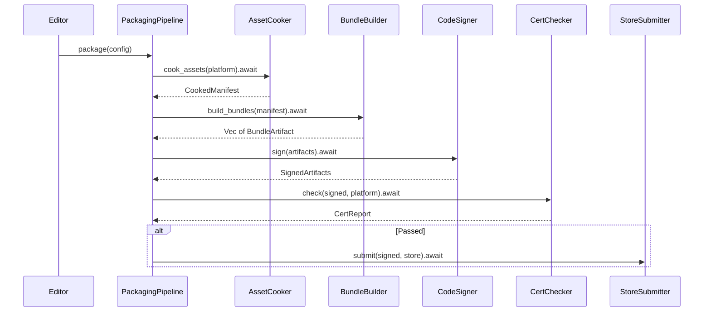
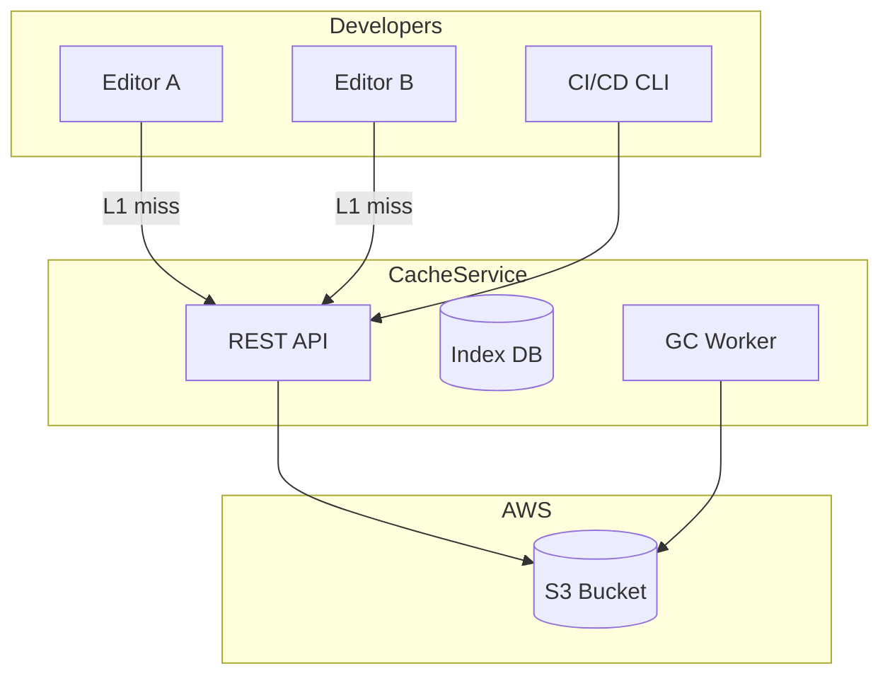
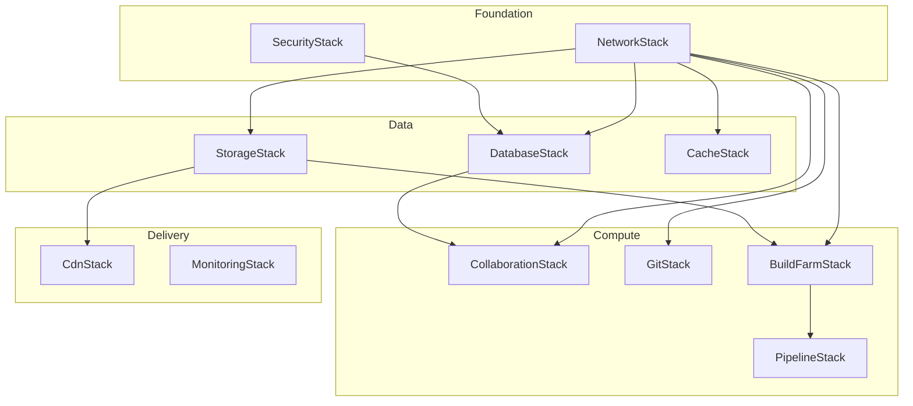

# Build and Deploy Design

## Requirements Trace

### Build and Deployment (F-15.14)

| Feature   | Requirement |
|-----------|-------------|
| F-15.14.1 | R-15.14.1   |
| F-15.14.2 | R-15.14.2   |
| F-15.14.3 | R-15.14.3   |
| F-15.14.4 | R-15.14.4   |
| F-15.14.5 | R-15.14.5   |
| F-15.14.6 | R-15.14.6   |
| F-15.14.7 | R-15.14.7   |
| F-15.14.8 | R-15.14.8   |
| F-15.14.9 | R-15.14.9   |

1. **F-15.14.1** -- Platform build packaging
2. **F-15.14.2** -- Deploy-to-device with incremental transfer
3. **F-15.14.3** -- Certification compliance checker
4. **F-15.14.4** -- Code signing pipeline
5. **F-15.14.5** -- Platform-specific installers
6. **F-15.14.6** -- Asset bundle and DLC packaging
7. **F-15.14.7** -- Delta patching via content-defined chunking
8. **F-15.14.8** -- Store distribution pipeline
9. **F-15.14.9** -- Host-target build matrix

### Server-Side Console Build (F-14.8)

| Feature  | Requirement          |
|----------|----------------------|
| F-14.8.1 | R-14.8.1, R-14.8.2  |
| F-14.8.2 | R-14.8.3, R-14.8.4  |
| F-14.8.3 | R-14.8.5, R-14.8.6  |
| F-14.8.4 | R-14.8.7, R-14.8.8  |
| F-14.8.5 | R-14.8.9, R-14.8.10 |

1. **F-14.8.1** -- Server-side console build service
2. **F-14.8.2** -- Proprietary SDK isolation
3. **F-14.8.3** -- Shared build server
4. **F-14.8.4** -- Remote console deployment
5. **F-14.8.5** -- Console build artifacts

### Mod Support (F-15.16)

| Feature   | Requirement |
|-----------|-------------|
| F-15.16.1 | R-15.16.1  |
| F-15.16.2 | R-15.16.2  |
| F-15.16.3 | R-15.16.3  |
| F-15.16.4 | R-15.16.4  |
| F-15.16.5 | R-15.16.5  |
| F-15.16.6 | R-15.16.6  |

1. **F-15.16.1** -- Mod SDK
2. **F-15.16.2** -- Developer-defined mod constraints
3. **F-15.16.3** -- Mod packaging and distribution
4. **F-15.16.4** -- Mod loading, sandboxing, budget enforcement
5. **F-15.16.5** -- Mod workshop integration
6. **F-15.16.6** -- Mod moderation and review

### Shared Asset Cache (F-15.11)

| Feature   | Requirement |
|-----------|-------------|
| F-15.11.1 | R-15.11.1  |
| F-15.11.2 | R-15.11.2  |
| F-15.11.3 | R-15.11.3  |
| F-15.11.4 | R-15.11.4  |
| F-15.11.5 | R-15.11.5  |
| F-15.11.6 | R-15.11.6  |
| F-15.11.7 | R-15.11.7  |
| F-15.11.8 | R-15.11.8  |

1. **F-15.11.1** -- Centralized compiled asset cache (CAS)
2. **F-15.11.2** -- Shader compilation cache
3. **F-15.11.3** -- Logic graph compilation cache
4. **F-15.11.4** -- New developer onboarding acceleration
5. **F-15.11.5** -- Cache invalidation and GC
6. **F-15.11.6** -- Cache transport and storage backends
7. **F-15.11.7** -- CI/CD cache population
8. **F-15.11.8** -- Cache hit metrics and monitoring

### Engine Launcher (F-15.15)

| Feature   | Requirement |
|-----------|-------------|
| F-15.15.1 | R-15.15.1  |
| F-15.15.2 | R-15.15.2  |
| F-15.15.3 | R-15.15.3  |
| F-15.15.4 | R-15.15.4  |
| F-15.15.5 | R-15.15.5  |
| F-15.15.6 | R-15.15.6  |

1. **F-15.15.1** -- Engine version management
2. **F-15.15.2** -- Auto project upgrades via migration scripts
3. **F-15.15.3** -- Project browser and creation wizard
4. **F-15.15.4** -- `.harmonius` project file format
5. **F-15.15.5** -- Cross-game preferences and accounts
6. **F-15.15.6** -- Collaboration setup wizard

### Asset Marketplace (F-15.17)

| Feature   | Requirement |
|-----------|-------------|
| F-15.17.1 | R-15.17.1  |
| F-15.17.2 | R-15.17.2  |
| F-15.17.3 | R-15.17.3  |
| F-15.17.4 | R-15.17.4  |
| F-15.17.5 | R-15.17.5  |
| F-15.17.6 | R-15.17.6  |
| F-15.17.7 | R-15.17.7  |
| F-15.17.8 | R-15.17.8  |

1. **F-15.17.1** -- Integrated asset store browser
2. **F-15.17.2** -- One-click import with dependency resolution
3. **F-15.17.3** -- Ratings, reviews, curation
4. **F-15.17.4** -- Publisher account and dashboard
5. **F-15.17.5** -- Automated compatibility testing
6. **F-15.17.6** -- Revenue sharing and payout
7. **F-15.17.7** -- Asset type support
8. **F-15.17.8** -- License management, DRM-free import

### Server Infrastructure (F-15.18)

| Feature    | Requirement |
|------------|-------------|
| F-15.18.1  | R-15.18.1  |
| F-15.18.2  | R-15.18.2  |
| F-15.18.3  | R-15.18.3  |
| F-15.18.4  | R-15.18.4  |
| F-15.18.5  | R-15.18.5  |
| F-15.18.6  | R-15.18.6  |
| F-15.18.7  | R-15.18.7  |
| F-15.18.8  | R-15.18.8  |
| F-15.18.9  | R-15.18.9  |
| F-15.18.10 | R-15.18.10 |

1. **F-15.18.1** -- AWS CDK deployment stacks
2. **F-15.18.2** -- Collaboration server
3. **F-15.18.3** -- Git and LFS hosting
4. **F-15.18.4** -- Build farm
5. **F-15.18.5** -- Signing and distribution server
6. **F-15.18.6** -- Continuous deployment pipeline
7. **F-15.18.7** -- Test runner infrastructure
8. **F-15.18.8** -- Shared cache and database services
9. **F-15.18.9** -- Backup and disaster recovery
10. **F-15.18.10** -- Enterprise security configuration

## Overview

This design covers the entire build-to-ship pipeline: packaging, signing, certification, store
submission, delta patching, mod support, shared asset cache, the engine launcher, the asset
marketplace, and the self-hosted AWS server infrastructure that backs it all.

All I/O is async via `Tokio runtime`. BLAKE3 hashes provide content integrity. Zstd compression for all
transfers. All services are self-hosted on AWS via modular CDK stacks.

## Architecture

### Build Packaging Pipeline



### Shared Cache Architecture



### CDK Stack Dependencies



### Core Data Structures

```mermaid
classDiagram
    class BuildConfig {
        +TargetPlatform platform
        +BuildProfile profile
        +Vec~AssetId~ content
    }
    class TargetPlatform {
        <<enum>>
        Windows
        MacOs
        Linux
        Ios
        Android
        Xbox
        PlayStation
        NintendoSwitch
    }
    class BuildProfile {
        <<enum>>
        Debug
        Development
        Shipping
    }
    class AssetCooker {
        +cook(assets, platform) Future~CookResult~
    }
    class BundleBuilder {
        +build(cooked, config) Future~BundleSet~
    }
    class BundleSet {
        +Vec~AssetBundle~ bundles
        +BundleManifest manifest
    }
    class AssetBundle {
        +BundleId id
        +Vec~AssetId~ assets
        +u64 size_bytes
        +[u8; 32] blake3_hash
    }
    class CodeSigner {
        +sign(artifact, platform) Future~SignedArtifact~
    }
    class CertChecker {
        +check(artifact, platform) Future~CertReport~
    }
    class InstallerFormat {
        <<enum>>
        Dmg
        Msi
        AppImage
        Deb
        Flatpak
        Ipa
        Aab
    }
    class StoreConfig {
        <<enum>>
        Steam
        AppStore
        WindowsStore
        Xbox
    }
    class StoreSubmitter {
        +submit(artifact, config) Future~SubmissionReceipt~
    }
    class SubmissionStatus {
        <<enum>>
        Pending
        InReview
        Approved
        Rejected
    }
    class ContentChunker {
        +chunk(data) Vec~Chunk~
    }
    class DeltaGenerator {
        +generate(old, new) Future~PatchBundle~
    }
    class PatchApplier {
        +apply(patch, dir) Future~PatchResult~
    }
    class CacheKey {
        -hash [u8; 32]
        +compute(source, settings, tool) CacheKey
        +from_shader(src, platform, flags) CacheKey
        +as_hex() String
    }
    class LocalCache {
        +get(key) Option~CacheEntry~
        +put(key, data) Result
        +evict_lru() u64
    }
    class RemoteClient {
        +fetch(key) Future~Option~CacheEntry~~
        +upload(key, data) Future~Result~
    }
    class Prefetcher {
        +prefetch_all(keys) Future~PrefetchResult~
        +cancel()
    }
    class ModPolicy {
        +Vec~AssetType~ allowed_asset_types
        +u64 memory_budget_bytes
        +u32 entity_budget
    }
    class ModLoader {
        +load(mods, world) Future~ModLoadReport~
        +unload(mod_id, world) Future~Result~
    }
    class ModSandbox {
        +check_budgets(world) Option~Violation~
        +deactivate(world)
    }
    class ModRegistry {
        +list_installed() Vec~ModDescriptor~
        +install(source) Future~ModId~
    }
    class VersionManager {
        +install(version) Future~Result~
        +list_installed() Vec~InstalledVersion~
    }
    class ProjectManager {
        +open(path) Future~Result~
        +create(template) Future~Result~
    }
    class MigrationRunner {
        +migrate(from, to) MigrationReport
    }
    class AssetListing {
        +AssetId id
        +String name
        +ListingStatus status
    }
    class ListingStatus {
        <<enum>>
        Pending
        InReview
        Published
        Rejected
    }
    class DeploymentProfile {
        <<enum>>
        FreeTier
        Enterprise
    }

    BuildConfig --> TargetPlatform
    BuildConfig --> BuildProfile
    BundleBuilder --> BundleSet
    BundleSet --> AssetBundle
    DeltaGenerator --> ContentChunker
    StoreSubmitter --> SubmissionStatus
    LocalCache --> CacheKey
    RemoteClient --> CacheKey
    Prefetcher --> LocalCache
    Prefetcher --> RemoteClient
    ModLoader --> ModSandbox
    ModRegistry --> ModPolicy
    AssetListing --> ListingStatus
```



## API Design

### Build Configuration and Packaging

```rust
#[derive(Clone, Copy, Debug, PartialEq, Eq)]
pub enum TargetPlatform {
    Windows, MacOs, Linux, Ios, Android,
    SteamOs, PlayStation, Xbox, NintendoSwitch,
}

#[derive(Clone, Copy, Debug, PartialEq, Eq)]
pub enum BuildProfile {
    Debug, Development, Shipping,
}

pub struct PackageConfig {
    pub platform: TargetPlatform,
    pub profile: BuildProfile,
    pub output_dir: PathBuf,
    pub signing: Option<SigningConfig>,
    pub store: Option<StoreConfig>,
}

pub struct PackagingPipeline { /* ... */ }

impl PackagingPipeline {
    pub async fn package(
        &self,
        config: &PackageConfig,
        progress: impl Fn(PipelineStage, f32) + Send,
    ) -> Result<PackageResult, PackageError>;
}
```

### Shared Asset Cache

```rust
#[derive(Clone, Copy, Debug, PartialEq, Eq, Hash)]
pub struct CacheKey { hash: [u8; 32] }

impl CacheKey {
    pub fn compute(
        source: &[u8],
        settings: &BuildSettings,
        tool_version: &str,
    ) -> Self;
    pub fn from_shader(
        source_hash: &[u8; 32],
        platform: TargetPlatform,
        flags: ShaderFeatureFlags,
    ) -> Self;
}

pub struct LocalCache { /* ... */ }

impl LocalCache {
    pub fn get(
        &self,
        key: &CacheKey,
    ) -> Option<CacheEntry>;
    pub fn put(
        &mut self,
        key: &CacheKey,
        data: &[u8],
    ) -> Result<(), CacheError>;
}

pub struct RemoteClient { /* ... */ }

impl RemoteClient {
    pub async fn fetch(
        &self,
        key: &CacheKey,
    ) -> Result<Option<CacheEntry>, CacheError>;
    pub async fn upload(
        &self,
        key: &CacheKey,
        data: &[u8],
    ) -> Result<(), CacheError>;
}
```

### Engine Launcher

```rust
pub struct VersionManager { /* ... */ }

impl VersionManager {
    pub async fn install(
        &mut self,
        version: SemVer,
    ) -> Result<InstallResult, LauncherError>;
    pub fn list_installed(
        &self,
    ) -> &[InstalledVersion];
}

pub struct ProjectManager { /* ... */ }

impl ProjectManager {
    pub async fn open(
        &self,
        path: &Path,
    ) -> Result<(), LauncherError>;
    pub async fn create(
        &self,
        template: &TemplateId,
        path: &Path,
    ) -> Result<(), LauncherError>;
}

pub struct MigrationRunner { /* ... */ }

impl MigrationRunner {
    pub async fn migrate(
        &self,
        from: SemVer,
        to: SemVer,
        project_path: &Path,
    ) -> Result<MigrationReport, MigrationError>;
}
```

### Mod System

```rust
pub struct ModLoader { /* ... */ }

impl ModLoader {
    pub async fn load(
        &self,
        mods: &[ModId],
        world: &mut World,
    ) -> Result<ModLoadReport, ModError>;
    pub async fn unload(
        &self,
        mod_id: ModId,
        world: &mut World,
    ) -> Result<(), ModError>;
}

pub struct ModSandbox { /* ... */ }

impl ModSandbox {
    pub fn check_budgets(
        &self,
        world: &World,
    ) -> Option<ConstraintViolation>;
}
```

## Data Flow

### Cache Lookup

1. Editor computes `CacheKey` from source + settings + tool version.
2. `LocalCache::get()` checks L1 disk cache.
3. On miss, `RemoteClient::fetch()` downloads from S3-backed L2.
4. Entry is decompressed (Zstd) and stored in L1.
5. CI builds populate L2 via `RemoteClient::upload()`.

### Mod Loading

1. `ModRegistry::list_installed()` shows available mods.
2. `ModLoader::load()` verifies integrity (BLAKE3), checks constraints, creates ECS partition and
   sandbox.
3. During gameplay, `ModSandbox::check_budgets()` monitors resource usage. Violations deactivate the
   offending mod.

### Deployment Profile Comparison

| Resource | Free Tier | Enterprise |
|----------|-----------|------------|
| VPC | Default | Custom, 3 AZs, NAT |
| RDS | db.t3.micro | db.r6g.large Multi-AZ |
| Build Farm | t3.micro | c6i.2xlarge + g5.xlarge spot |
| CloudFront | None | Full CDN |
| Estimated cost | $0-5/mo | $300-1500/mo |

## Platform Considerations

| Component | Windows | macOS | Linux |
|-----------|---------|-------|-------|
| Code signing | `signtool` | `codesign` + notarize | N/A |
| Installer | `.msi` | `.dmg` | AppImage / `.deb` |
| Auto-update | WinSparkle | Sparkle | AppImage delta |
| Keychain | Cred Manager | Keychain | libsecret |
| HTTP client | WinHTTP | NSURLSession | libcurl |

## Test Plan

Test cases are in [build-deploy-test-cases.md](build-deploy-test-cases.md).

| Category | Count |
|----------|-------|
| Unit tests | 55 |
| Integration tests | 20 |
| Benchmarks | 8 |

1. **Unit** -- Asset cooking, bundle building, CDC chunking, delta generation, BLAKE3 verification,
   code signing, cert checker, installer generation, cache key computation, L1 cache LRU, mod
   constraint validation, mod sandbox budgets, version catalog, project migration, asset listing
   CRUD
2. **Integration** -- Full packaging pipeline, cache round-trip, CI/CD population, mod load/unload
   cycle, launcher version install, project migration chain, store submission flow, CDK stack deploy
3. **Benchmarks** -- Cook time for 10k assets, delta patch size vs full, cache hit vs miss latency,
   mod load time, bundle compression ratio

## Open Questions

1. **Console SDK isolation.** Server-side builds need proprietary SDKs. How are SDK licenses
   validated without exposing code to clients?
2. **Cache eviction policy.** Should GC prioritize recency (LRU) or branch relevance (keep entries
   for active branches)?
3. **Marketplace payment processing.** Stripe integration vs. platform-specific payment rails for
   console storefronts?
