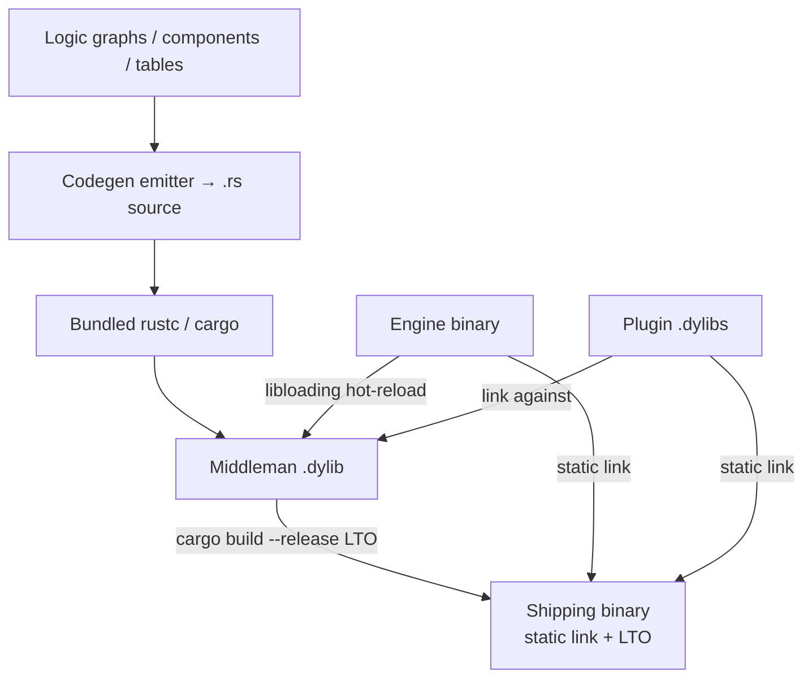
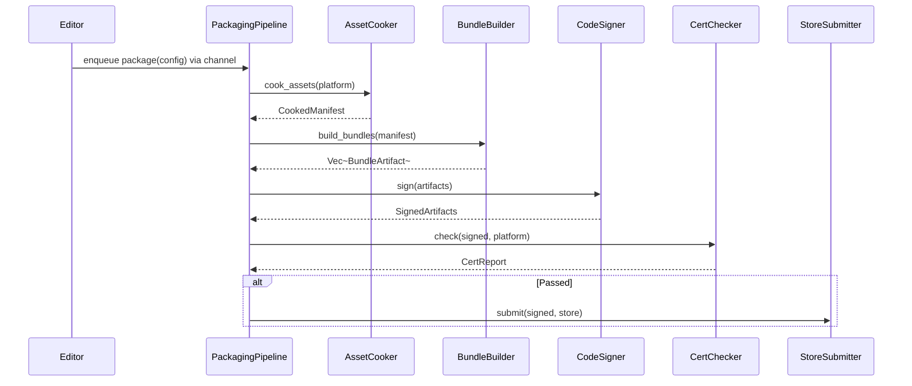
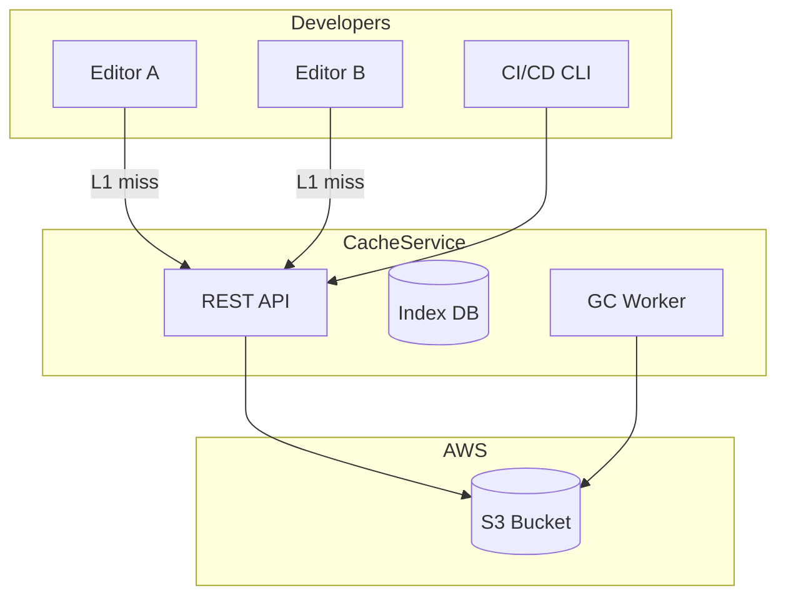
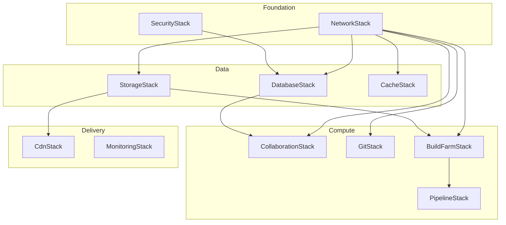

# Build and Deploy Design

## Requirements Trace

### Build and Deployment (F-15.14)

| Feature   | Requirement |
|-----------|-------------|
| F-15.14.1 | R-15.14.1   |
| F-15.14.2 | R-15.14.2   |
| F-15.14.3 | R-15.14.3   |
| F-15.14.4 | R-15.14.4   |
| F-15.14.5 | R-15.14.5   |
| F-15.14.6 | R-15.14.6   |
| F-15.14.7 | R-15.14.7   |
| F-15.14.8 | R-15.14.8   |
| F-15.14.9 | R-15.14.9   |

1. **F-15.14.1** -- Platform build packaging
2. **F-15.14.2** -- Deploy-to-device with incremental transfer
3. **F-15.14.3** -- Certification compliance checker
4. **F-15.14.4** -- Code signing pipeline
5. **F-15.14.5** -- Platform-specific installers
6. **F-15.14.6** -- Asset bundle and DLC packaging
7. **F-15.14.7** -- Delta patching via content-defined chunking
8. **F-15.14.8** -- Store distribution pipeline
9. **F-15.14.9** -- Host-target build matrix

### Server-Side Console Build (F-14.8)

| Feature  | Requirement          |
|----------|----------------------|
| F-14.8.1 | R-14.8.1, R-14.8.2  |
| F-14.8.2 | R-14.8.3, R-14.8.4  |
| F-14.8.3 | R-14.8.5, R-14.8.6  |
| F-14.8.4 | R-14.8.7, R-14.8.8  |
| F-14.8.5 | R-14.8.9, R-14.8.10 |

1. **F-14.8.1** -- Server-side console build service
2. **F-14.8.2** -- Proprietary SDK isolation
3. **F-14.8.3** -- Shared build server
4. **F-14.8.4** -- Remote console deployment
5. **F-14.8.5** -- Console build artifacts

### Mod Support (F-15.16)

| Feature   | Requirement |
|-----------|-------------|
| F-15.16.1 | R-15.16.1  |
| F-15.16.2 | R-15.16.2  |
| F-15.16.3 | R-15.16.3  |
| F-15.16.4 | R-15.16.4  |
| F-15.16.5 | R-15.16.5  |
| F-15.16.6 | R-15.16.6  |

1. **F-15.16.1** -- Mod SDK
2. **F-15.16.2** -- Developer-defined mod constraints
3. **F-15.16.3** -- Mod packaging and distribution
4. **F-15.16.4** -- Mod loading, sandboxing, budget enforcement
5. **F-15.16.5** -- Mod workshop integration
6. **F-15.16.6** -- Mod moderation and review

### Shared Asset Cache (F-15.11)

| Feature   | Requirement |
|-----------|-------------|
| F-15.11.1 | R-15.11.1  |
| F-15.11.2 | R-15.11.2  |
| F-15.11.3 | R-15.11.3  |
| F-15.11.4 | R-15.11.4  |
| F-15.11.5 | R-15.11.5  |
| F-15.11.6 | R-15.11.6  |
| F-15.11.7 | R-15.11.7  |
| F-15.11.8 | R-15.11.8  |

1. **F-15.11.1** -- Centralized compiled asset cache (CAS)
2. **F-15.11.2** -- Shader compilation cache
3. **F-15.11.3** -- Logic graph compilation cache
4. **F-15.11.4** -- New developer onboarding acceleration
5. **F-15.11.5** -- Cache invalidation and GC
6. **F-15.11.6** -- Cache transport and storage backends
7. **F-15.11.7** -- CI/CD cache population
8. **F-15.11.8** -- Cache hit metrics and monitoring

### Engine Launcher (F-15.15)

| Feature   | Requirement |
|-----------|-------------|
| F-15.15.1 | R-15.15.1  |
| F-15.15.2 | R-15.15.2  |
| F-15.15.3 | R-15.15.3  |
| F-15.15.4 | R-15.15.4  |
| F-15.15.5 | R-15.15.5  |
| F-15.15.6 | R-15.15.6  |

1. **F-15.15.1** -- Engine version management
2. **F-15.15.2** -- Auto project upgrades via migration scripts
3. **F-15.15.3** -- Project browser and creation wizard
4. **F-15.15.4** -- `.harmonius` project file format
5. **F-15.15.5** -- Cross-game preferences and accounts
6. **F-15.15.6** -- Collaboration setup wizard

### Asset Marketplace (F-15.17)

| Feature   | Requirement |
|-----------|-------------|
| F-15.17.1 | R-15.17.1  |
| F-15.17.2 | R-15.17.2  |
| F-15.17.3 | R-15.17.3  |
| F-15.17.4 | R-15.17.4  |
| F-15.17.5 | R-15.17.5  |
| F-15.17.6 | R-15.17.6  |
| F-15.17.7 | R-15.17.7  |
| F-15.17.8 | R-15.17.8  |

1. **F-15.17.1** -- Integrated asset store browser
2. **F-15.17.2** -- One-click import with dependency resolution
3. **F-15.17.3** -- Ratings, reviews, curation
4. **F-15.17.4** -- Publisher account and dashboard
5. **F-15.17.5** -- Automated compatibility testing
6. **F-15.17.6** -- Revenue sharing and payout
7. **F-15.17.7** -- Asset type support
8. **F-15.17.8** -- License management, DRM-free import

### Server Infrastructure (F-15.18)

| Feature    | Requirement |
|------------|-------------|
| F-15.18.1  | R-15.18.1  |
| F-15.18.2  | R-15.18.2  |
| F-15.18.3  | R-15.18.3  |
| F-15.18.4  | R-15.18.4  |
| F-15.18.5  | R-15.18.5  |
| F-15.18.6  | R-15.18.6  |
| F-15.18.7  | R-15.18.7  |
| F-15.18.8  | R-15.18.8  |
| F-15.18.9  | R-15.18.9  |
| F-15.18.10 | R-15.18.10 |

1. **F-15.18.1** -- AWS deployment stacks
2. **F-15.18.2** -- Collaboration server
3. **F-15.18.3** -- Git and LFS hosting
4. **F-15.18.4** -- Build farm
5. **F-15.18.5** -- Signing and distribution server
6. **F-15.18.6** -- Continuous deployment pipeline
7. **F-15.18.7** -- Test runner infrastructure
8. **F-15.18.8** -- Shared cache and database services
9. **F-15.18.9** -- Backup and disaster recovery
10. **F-15.18.10** -- Enterprise security configuration

## Overview

This design covers the entire build-to-ship pipeline: packaging, signing, certification, store
submission, delta patching, mod support, shared asset cache, the engine launcher, the asset
marketplace, and the self-hosted Kubernetes-backed infrastructure that backs it all.

BLAKE3 hashes provide content integrity. Zstd compression for all transfers. All services are
self-hosted via Kubernetes with the OSS infrastructure stack.

**Async scope.** Game-side build steps (packaging triggers, asset staging, launcher UI) are strictly
synchronous: no `async`, no `await`, no `Future`. Build requests are submitted via crossbeam-channel
and completions arrive as jobs polled at frame boundaries. `async/await` is permitted *only* inside
Kubernetes-hosted backend services (build orchestrator, marketplace, delta-patch server, telemetry
ingestion) where Rust async runtimes are an acceptable implementation detail that never crosses into
the engine or editor process.

### Codegen Ownership

The canonical owner of all codegen is `harmonius_codegen`. Scripting (`scripting.md`) and visual
editors (`visual-editors.md`) are *clients* that hand authored graphs to the codegen crate; neither
owns the `.rs` emitter or the middleman `.dylib` build rules. Build-deploy invokes
`harmonius_codegen` during build time — packaging drives the full graph → Rust → dylib →
statically-linked binary pipeline. Editor-side incremental compile loops call the same crate in dev
mode; shipping builds call it once at the top of `cargo build --release`.

## Architecture

### Compilation Pipeline

The compilation pipeline is the central build operation. It produces both the hot-reloadable
development artifact and the statically linked shipping binary.



| Stage | Development | Shipping |
|-------|-------------|---------|
| Codegen | emit .rs source | emit .rs source |
| Compile | bundled rustc → .dylib | cargo build --release |
| Link | engine loads .dylib via libloading | static link: middleman + plugins + engine |
| LTO | none (fast iteration) | `lto = "fat"` |
| Strip | debug info kept | `strip = "symbols"` |
| Panic | unwind | `panic = "abort"` |
| Codegen units | default | `codegen-units = 1` |

**Platform linkers:**

| Platform | Linker |
|----------|--------|
| Windows | MSVC `link.exe` |
| macOS / iOS | Apple `ld64` |
| Linux / Android | `lld` |
| Consoles | Platform SDK linker |

### Build Packaging Pipeline



### Shader Baking Pipeline

HLSL is the sole shader intermediate language. All shaders are compiled offline via CLI tools.

| Source | Tool | Output | Platforms |
|--------|------|--------|-----------|
| `.hlsl` | DXC | DXIL | Windows, Xbox |
| `.hlsl` | DXC | SPIR-V | Linux, Android |
| `.hlsl` | DXC → `metal-shaderconverter` | MSL IR | macOS, iOS |
| `.hlsl` | Platform SDK | Console format | Switch, PlayStation |

**Variant handling:** each material graph emits a permutation matrix from its feature flags. A
per-platform variant cache stores compiled bytecode keyed by
`BLAKE3(source + flags + dxc_version + platform)`. Parallel compilation runs via the job system
(`par_iter` over the variant list). The shared team-tools build cache distributes pre-compiled
shader variants across the team.

### Shared Cache Architecture



### Deployment Stack Dependencies



### Core Data Structures

```mermaid
classDiagram
    class BuildConfig {
        +TargetPlatform platform
        +BuildProfile profile
        +Vec~AssetId~ content
    }
    class TargetPlatform {
        <<enum>>
        Windows
        MacOs
        Linux
        Ios
        Android
        Xbox
        PlayStation
        NintendoSwitch
    }
    class BuildProfile {
        <<enum>>
        Debug
        Development
        Shipping
    }
    class AssetCooker {
        +cook(assets, platform) CookResult
    }
    class BundleBuilder {
        +build(cooked, config) BundleSet
    }
    class BundleSet {
        +Vec~AssetBundle~ bundles
        +BundleManifest manifest
    }
    class AssetBundle {
        +BundleId id
        +Vec~AssetId~ assets
        +u64 size_bytes
        +[u8; 32] blake3_hash
    }
    class CodeSigner {
        +sign(artifact, platform) SignedArtifact
    }
    class CertChecker {
        +check(artifact, platform) CertReport
    }
    class InstallerFormat {
        <<enum>>
        Dmg
        Msi
        AppImage
        Deb
        Flatpak
        Ipa
        Aab
    }
    class StoreConfig {
        <<enum>>
        Steam
        AppStore
        WindowsStore
        Xbox
    }
    class StoreSubmitter {
        +submit(artifact, config) SubmissionReceipt
    }
    class SubmissionStatus {
        <<enum>>
        Pending
        InReview
        Approved
        Rejected
    }
    class ContentChunker {
        +chunk(data) Vec~Chunk~
    }
    class DeltaGenerator {
        +generate(old, new) PatchBundle
    }
    class PatchApplier {
        +apply(patch, dir) PatchResult
    }
    class CacheKey {
        -hash [u8; 32]
        +compute(source, settings, tool) CacheKey
        +from_shader(src, platform, flags) CacheKey
        +as_hex() String
    }
    class LocalCache {
        +get(key) Option~CacheEntry~
        +put(key, data) Result
        +evict_lru() u64
    }
    class RemoteClient {
        +fetch(key) Option~CacheEntry~
        +upload(key, data) Result
    }
    class Prefetcher {
        +prefetch_all(keys) PrefetchResult
        +cancel()
    }
    class ModPolicy {
        +Vec~AssetType~ allowed_asset_types
        +u64 memory_budget_bytes
        +u32 entity_budget
    }
    class ModLoader {
        +load(mods, world) ModLoadReport
        +unload(mod_id, world) Result
    }
    class ModSandbox {
        +check_budgets(world) Option~Violation~
        +deactivate(world)
    }
    class ModRegistry {
        +list_installed() Vec~ModDescriptor~
        +install(source) ModId
    }
    class VersionManager {
        +install(version) Result
        +list_installed() Vec~InstalledVersion~
    }
    class ProjectManager {
        +open(path) Result
        +create(template) Result
    }
    class MigrationRunner {
        +migrate(from, to) MigrationReport
    }
    class AssetListing {
        +AssetId id
        +String name
        +ListingStatus status
    }
    class ListingStatus {
        <<enum>>
        Pending
        InReview
        Published
        Rejected
    }
    class DeploymentProfile {
        <<enum>>
        FreeTier
        Enterprise
    }

    BuildConfig --> TargetPlatform
    BuildConfig --> BuildProfile
    BundleBuilder --> BundleSet
    BundleSet --> AssetBundle
    DeltaGenerator --> ContentChunker
    StoreSubmitter --> SubmissionStatus
    LocalCache --> CacheKey
    RemoteClient --> CacheKey
    Prefetcher --> LocalCache
    Prefetcher --> RemoteClient
    ModLoader --> ModSandbox
    ModRegistry --> ModPolicy
    AssetListing --> ListingStatus
```



## API Design

### Build Configuration and Packaging

```rust
#[derive(Clone, Copy, Debug, PartialEq, Eq)]
pub enum TargetPlatform {
    Windows, MacOs, Linux, Ios, Android,
    SteamOs, PlayStation, Xbox, NintendoSwitch,
}

#[derive(Clone, Copy, Debug, PartialEq, Eq)]
pub enum BuildProfile {
    Debug, Development, Shipping,
}

pub struct PackageConfig {
    pub platform: TargetPlatform,
    pub profile: BuildProfile,
    pub output_dir: PathBuf,
    pub signing: Option<SigningConfig>,
    pub store: Option<StoreConfig>,
}

pub struct PackagingPipeline { /* ... */ }

impl PackagingPipeline {
    /// Enqueue a packaging job. Progress events arrive via the provided channel sender.
    /// Returns immediately; the caller polls the receiver at frame boundaries.
    pub fn enqueue_package(
        &self,
        config: PackageConfig,
        progress_tx: Sender<(PipelineStage, f32)>,
    ) -> JobHandle<Result<PackageResult, PackageError>>;
}
```

### Shared Asset Cache

```rust
#[derive(Clone, Copy, Debug, PartialEq, Eq, Hash)]
pub struct CacheKey { hash: [u8; 32] }

impl CacheKey {
    pub fn compute(
        source: &[u8],
        settings: &BuildSettings,
        tool_version: &str,
    ) -> Self;
    pub fn from_shader(
        source_hash: &[u8; 32],
        platform: TargetPlatform,
        flags: ShaderFeatureFlags,
    ) -> Self;
}

pub struct LocalCache { /* ... */ }

impl LocalCache {
    pub fn get(
        &self,
        key: &CacheKey,
    ) -> Option<CacheEntry>;
    pub fn put(
        &mut self,
        key: &CacheKey,
        data: &[u8],
    ) -> Result<(), CacheError>;
}

pub struct RemoteClient { /* ... */ }

impl RemoteClient {
    /// Enqueue a fetch from the L2 cache. Returns immediately; result arrives via job system.
    pub fn enqueue_fetch(
        &self,
        key: CacheKey,
    ) -> JobHandle<Result<Option<CacheEntry>, CacheError>>;
    /// Enqueue an upload to the L2 cache in the background. Non-blocking.
    pub fn enqueue_upload(
        &self,
        key: CacheKey,
        data: Vec<u8>,
    ) -> JobHandle<Result<(), CacheError>>;
}
```

### Engine Launcher

```rust
pub struct VersionManager { /* ... */ }

impl VersionManager {
    /// Enqueue version install; download runs via platform I/O on the main thread.
    pub fn enqueue_install(
        &mut self,
        version: SemVer,
    ) -> JobHandle<Result<InstallResult, LauncherError>>;
    pub fn list_installed(&self) -> &[InstalledVersion];
}

pub struct ProjectManager { /* ... */ }

impl ProjectManager {
    /// Open a project; reads project file synchronously, returns result.
    pub fn open(&self, path: &Path) -> Result<(), LauncherError>;
    /// Create project from template; file writes go through platform I/O channels.
    pub fn create(
        &self,
        template: &TemplateId,
        path: &Path,
    ) -> Result<(), LauncherError>;
}

pub struct MigrationRunner { /* ... */ }

impl MigrationRunner {
    pub fn migrate(
        &self,
        from: SemVer,
        to: SemVer,
        project_path: &Path,
    ) -> Result<MigrationReport, MigrationError>;
}
```

### Mod System

```rust
pub struct ModLoader { /* ... */ }

impl ModLoader {
    /// Enqueue mod load; file I/O runs via platform I/O on main thread. World mutation
    /// is deferred to the drain-then-swap point in the game loop.
    pub fn enqueue_load(
        &self,
        mods: &[ModId],
    ) -> JobHandle<Result<ModLoadReport, ModError>>;
    pub fn enqueue_unload(
        &self,
        mod_id: ModId,
    ) -> JobHandle<Result<(), ModError>>;
}

pub struct ModSandbox { /* ... */ }

impl ModSandbox {
    pub fn check_budgets(
        &self,
        world: &World,
    ) -> Option<ConstraintViolation>;
}
```

## Data Flow

### Asset Layout: Files on Disk, Code in Binary

Baked assets are shipped as separate bundle files alongside the executable. The binary contains
compiled code only (middleman + engine + plugins, statically linked). Large assets — meshes,
textures, audio — are never embedded in the binary with `include_bytes!`. The `include_bytes!` macro
is reserved for small inline data only (e.g., built-in icon bitmaps, shader constant tables).

| Artifact | Location at runtime |
|----------|---------------------|
| Engine + game logic | Single statically linked executable |
| Baked asset bundles | `assets/` directory alongside executable |
| Shader bytecode | `assets/shaders/` per-platform subdirectory |
| Locale strings | `assets/locale/` |
| Built-in icons / tables | Embedded via `include_bytes!` (< 64 KB each) |

### Asset Baking and rkyv Format

All baked asset bundles use rkyv for zero-copy mmap access. The asset cooker outputs rkyv-archived
data per asset type. Bundle files are mmap-readable at runtime without deserialization. Reference:
[rkyv documentation](https://rkyv.org/architecture.html).

```rust
/// Baked bundle file layout (mmap-readable via rkyv):
/// [ rkyv archive header ][ archived AssetBundle ][ blob data ]
pub struct BakedBundle {
    pub manifest: ArchivedAssetBundle,
    /// Raw blob data referenced by manifest entries
    pub blobs: &'static [u8],
}
```

### Cache Lookup

1. Editor computes `CacheKey` from source + settings + tool version.
2. `LocalCache::get()` checks L1 disk cache.
3. On miss, `RemoteClient::enqueue_fetch()` downloads from the team's Garage L2 bucket.
4. Entry is decompressed (Zstd) and stored in L1 as a rkyv bundle file.
5. CI builds populate L2 via `RemoteClient::enqueue_upload()`.

### Mod Loading

1. `ModRegistry::list_installed()` shows available mods.
2. `ModLoader::load()` verifies integrity (BLAKE3), checks constraints, creates ECS partition and
   sandbox.
3. During gameplay, `ModSandbox::check_budgets()` monitors resource usage. Violations deactivate the
   offending mod.

### Deployment Profile Comparison

| Resource | Free Tier | Enterprise |
|----------|-----------|------------|
| VPC | Default | Custom, 3 AZs, NAT |
| RDS | db.t3.micro | db.r6g.large Multi-AZ |
| Build Farm | t3.micro | c6i.2xlarge + g5.xlarge spot |
| CloudFront | None | Full CDN |
| Estimated cost | $0-5/mo | $300-1500/mo |

## Platform Considerations

### Platform Build Matrix

| Platform | Packaging | Shader format | Texture format | Signing |
|----------|-----------|---------------|----------------|---------|
| Windows | MSI / MSIX | DXIL | BC7 | Authenticode (`signtool`) |
| macOS | `.app` / DMG via XcodeGen + xcodebuild | MSL IR | BC7 | Apple notarization |
| Linux | AppImage / Flatpak | SPIR-V | BC7 | GPG |
| iOS | `.ipa` via XcodeGen + xcodebuild | MSL IR | ASTC | Apple code sign |
| Android | APK / AAB via Gradle | SPIR-V | ASTC / ETC2 | APK signing |
| Switch | NSP via NX SDK | Console binary | ASTC | Nintendo Lotcheck |
| Xbox | XVC via GDK | DXIL | BC7 | Xbox certification |
| PlayStation | `.pkg` via PS SDK | Console binary | BC7 | Sony TRC |

### Desktop Platform Details

| Component | Windows | macOS | Linux |
|-----------|---------|-------|-------|
| Code signing | `signtool` | `codesign` + notarize | GPG |
| Installer | `.msi` / MSIX | `.dmg` (XcodeGen + xcodebuild) | AppImage / `.deb` |
| Auto-update | WinSparkle | Sparkle | AppImage delta |
| Keychain | Credential Manager | macOS Keychain | libsecret |
| Windowing | Win32 `CreateWindowEx` | `NSWindow` via `objc2-app-kit` | X11 / Wayland |

### Mobile Platform Details

| Component | iOS | Android |
|-----------|-----|---------|
| Build tool | XcodeGen + xcodebuild | Gradle |
| Packaging | `.ipa` | APK / AAB |
| Code signing | Apple code sign profile | APK keystore signing |
| Windowing | UIKit owns main thread; game loop on separate thread | NativeActivity |
| GPU | Metal via `objc2-metal` | Vulkan via `ash` |

### Per-Platform Asset Baking

Each platform target requires a distinct bake pass. The asset cooker runs per-platform via
`par_iter` over the asset list.

| Asset type | Windows / Xbox | macOS / iOS | Linux / Android | Switch |
|------------|----------------|-------------|-----------------|--------|
| Textures | BC7 | BC7 (macOS) / ASTC (iOS) | BC7 (desktop) / ASTC (mobile) | ASTC |
| Shaders | DXIL | MSL IR | SPIR-V | Console binary |
| Audio | Opus | AAC | Opus | ADPCM |
| Meshes | Meshlet (full) | Meshlet (full) | Meshlet (full) | Meshlet (reduced) |

### Console Platform Details

Console builds require proprietary SDKs and run on licensed server-side build machines (see F-14.8).
Console targets are never built on developer machines.

| Attribute | Switch | Xbox | PlayStation |
|-----------|--------|------|-------------|
| SDK | NX SDK | GDK | PS SDK |
| Package | NSP | XVC | `.pkg` |
| Certification | Nintendo Lotcheck | Xbox cert | Sony TRC |
| Shader | Console binary (NX shader compiler) | DXIL via GDK DXC | Console binary |

## Test Plan

Test cases are in [build-deploy-test-cases.md](build-deploy-test-cases.md).

| Category | Count |
|----------|-------|
| Unit tests | 55 |
| Integration tests | 20 |
| Benchmarks | 8 |

1. **Unit** -- Asset cooking, bundle building, CDC chunking, delta generation, BLAKE3 verification,
   code signing, cert checker, installer generation, cache key computation, L1 cache LRU, mod
   constraint validation, mod sandbox budgets, version catalog, project migration, asset listing
   CRUD
2. **Integration** -- Full packaging pipeline, cache round-trip, CI/CD population, mod load/unload
   cycle, launcher version install, project migration chain, store submission flow, stack deploy
3. **Benchmarks** -- Cook time for 10k assets, delta patch size vs full, cache hit vs miss latency,
   mod load time, bundle compression ratio

## Open Questions

1. **Console SDK isolation.** Server-side builds need proprietary SDKs. How are SDK licenses
   validated without exposing code to clients?
2. **Cache eviction policy.** Should GC prioritize recency (LRU) or branch relevance (keep entries
   for active branches)?
3. **Marketplace payment processing.** Stripe integration vs. platform-specific payment rails for
   console storefronts?

## Review feedback

### RF-1: Remove all async/await and Tokio

Remove `async fn` from all APIs. Remove "All I/O is async via Tokio runtime." Replace with
synchronous request/handle pattern: enqueue work via crossbeam-channel, completions arrive as jobs.
Only K8s backend services may use Tokio.

### RF-2: Middleman .dylib and static linking pipeline

Add a "Compilation pipeline" section — this is the central build operation:

1. **Development:** codegen → `.rs` source → bundled rustc → middleman .dylib → engine hot-reloads
   via libloading
2. **Shipping:** codegen → `.rs` source → `cargo build --release` with LTO → static linking of
   middleman + all plugins into one binary
3. **Release profile:** `opt-level = 3`, `lto = "fat"`, `codegen-units = 1`, `strip = "symbols"`,
   `panic = "abort"`
4. **Dead code elimination:** LTO removes unused plugin code. Unused components, systems, and graph
   functions are stripped.
5. **Platform linkers:** MSVC link.exe (Windows), ld64 (macOS/iOS), lld (Linux/Android), platform
   SDK linker (consoles)

### RF-3: HLSL shader baking pipeline

Add a "Shader baking" subsection:

| Source | Tool | Output | Platform |
|--------|------|--------|----------|
| HLSL | DXC | DXIL | Windows, Xbox |
| HLSL | DXC | SPIR-V | Linux, Android |
| HLSL | DXC → MSC | MSL IR | macOS, iOS |
| HLSL | Platform SDK | Console format | Switch, PS |

Shader variant handling: permutation matrix from material graph feature flags. Per-platform variant
cache. Parallel shader compilation via the job system. Shader cache shared via team-tools build
cache.

### RF-4: rkyv for baked assets

All baked asset bundles use rkyv for zero-copy mmap. The asset cooker outputs rkyv-archived data per
asset type. Bundle files are mmap-readable at runtime without deserialization.

### RF-5: Assets on disk, code in binary

Explicitly state: baked assets are shipped as separate bundle files alongside the executable.
`include_bytes!` is ONLY for small inline data in tables and logic graphs. Large assets (meshes,
textures, audio) are never embedded in the binary.

### RF-6: Complete platform considerations

| Platform | Packaging | Shader | Texture | Signing |
|----------|----------|--------|---------|---------|
| Windows | MSI/MSIX | DXIL | BC7 | Authenticode |
| macOS | .app/DMG via XcodeGen+xcodebuild | MSL | BC7 | Apple notarization |
| Linux | AppImage/Flatpak | SPIR-V | BC7 | GPG |
| iOS | .ipa via XcodeGen+xcodebuild | MSL | ASTC | Apple code sign |
| Android | APK/AAB via Gradle | SPIR-V | ASTC/ETC2 | APK signing |
| Switch | NSP via NX SDK | Console | ASTC | Nintendo Lotcheck |
| Xbox | XVC via GDK | DXIL | BC7 | Xbox cert |
| PlayStation | pkg via PS SDK | Console | BC7 | Sony TRC |

### RF-7: XcodeGen + xcodebuild

macOS and iOS builds: XcodeGen generates Xcode project from a spec → xcodebuild produces .app bundle
→ .app packaged into .dmg (macOS) or .ipa (iOS). Code signing and notarization via xcodebuild.

### RF-8: Per-platform asset baking

| Asset | Windows/Xbox | macOS/iOS | Linux/Android | Switch |
|-------|-------------|-----------|---------------|--------|
| Textures | BC7 | BC7 (macOS) / ASTC (iOS) | BC7 (desktop) / ASTC (mobile) | ASTC |
| Shaders | DXIL | MSL IR | SPIR-V | Console |
| Audio | Opus | AAC | Opus | ADPCM |
| Meshes | Meshlet (full) | Meshlet (full) | Meshlet (full) | Meshlet (reduced) |

### RF-9: Replace AWS with OSS stack

S3 → Garage (S3-compatible). RDS → TiKV. CloudFront → Pingora. Infrastructure runs on K8s
(self-hosted or cloud VMs). Services are OSS with Helm + custom Rust operator.

### RF-10: Custom job system for parallel cooking

Asset cooking, shader compilation, and bundle compression use the engine's job system
(crossbeam-deque work-stealing). `par_iter` over the asset list. Configurable worker count for build
machines.

### RF-11: Benchmark numeric targets

| Benchmark | Target |
|-----------|--------|
| Cook 10K assets (8-core) | < 120 s |
| Shader compilation (1000 variants) | < 60 s |
| Delta patch size vs full | < 15% |
| L1 cache hit (local) | < 1 ms |
| L2 cache hit (LAN) | < 100 ms |
| Mod load (100 MB) | < 500 ms |
| Bundle compression ratio | > 2:1 |
| Full build (medium project) | < 5 min |

### RF-12: Game loop phase for editor builds

Build requests submitted via channel from editor UI. Progress events polled at frame boundary and
displayed in build progress panel. Hot-reload of middleman .dylib synchronizes with game loop at the
drain-then-swap point (scripting.md RF-27 item 6).

### RF-13: Cross-subsystem integration table

| Subsystem | Direction | Data | Mechanism |
|-----------|-----------|------|-----------|
| Asset pipeline | consumes | source assets | AssetDatabase API |
| Codegen pipeline | consumes | .rs source from graphs | Codegen emitter |
| Shader pipeline | produces | compiled shaders | DXC + MSC CLI |
| Team tools | bidirectional | CI/CD, shared cache | GitHub Actions |
| Editor | bidirectional | build triggers, progress | Channel + UI |
| Platform I/O | consumes | file writes | Platform-native I/O |
| Profiler | produces | build timing metrics | BuildTracker |

### RF-14: Algorithm reference URLs

Add URLs for: FastCDC (content-defined chunking), BLAKE3 spec, Zstd (RFC 8878), LRU cache eviction.

### RF-15: CI/CD integration depth

Cross-reference team-tools.md RF-19 (per-platform runners). The CLI interface:
`harmonius build --platform <target> --profile <shipping|dev>` `harmonius test`,
`harmonius validate`, `harmonius package`. Artifacts uploaded via GitHub Actions upload-artifact
action.

### RF-16: Three build modes

1. **Editor GUI** — triggered from Build menu, shows progress panel, interruptible
2. **CLI** — `harmonius build` for CI and scripting, stdout progress, exit code for success/failure
3. **Headless server** — long-running build server accepting requests via API (K8s backend, Tokio
   permitted here)

### RF-17: Cross-compilation matrix

| Host | Targets |
|------|---------|
| macOS | macOS, iOS, Android |
| Windows | Windows, Android |
| Linux | Linux, Android |
| Consoles | Self-hosted runners with SDK |

### RF-18: Build size optimization

LTO for dead code elimination. `strip = "symbols"` for release. Unused asset detection (assets not
referenced by any scene or table). Per-platform asset stripping (don't ship desktop textures in
mobile). Size budget per platform (configurable warning threshold).

### RF-19: Incremental builds

Change detection via content hash comparison (BLAKE3). Asset dependency graph: if texture A changes,
re-bake material B that references it. Cache key = hash(source + settings + tool version). Skip if
cached. Shared cache (team-tools build cache) avoids redundant work across team members.

### RF-20: Customer game build pipeline (full)

The complete pipeline from editor project to shippable game:

1. **Editor "Build" button** — user selects target platform(s) and build profile (Development,
   Shipping). Triggers the full pipeline.
2. **Pipeline stages:**
   - **Codegen** — all logic graphs, table schemas, custom components emit `.rs` source
   - **Compile** — bundled rustc compiles middleman; for shipping, `cargo build --release` with LTO
     static-links everything
   - **Shader bake** — HLSL → DXC/MSC per platform (RF-3)
   - **Asset bake** — textures compressed, meshes optimized, audio transcoded per platform (RF-8)
   - **Bundle** — assets packaged into rkyv bundle files (RF-4)
   - **Package** — platform-native installer (RF-6)
   - **Sign** — code signing per platform (RF-6)
   - **Validate** — run project validation rules, platform compliance checks (console TRC/Lotcheck)
3. **GitHub Actions for customers** — the engine ships workflow templates that customers add to
   their game repo:
   - `harmonius-build.yml` — matrix build across platforms (per team-tools.md RF-19)
   - `harmonius-test.yml` — run all game tests + validation
   - `harmonius-deploy.yml` — upload to distribution platform (Steam, Epic, App Store, Play Store,
     itch.io)
   - Customers customize: which platforms, which tests, which stores
4. **Asset-only rebuild** — if only assets changed (no logic graph or component changes), skip the
   Rust compilation step. Only re-bake affected assets and re-bundle. Much faster iteration.
5. **Build cache** — shared across team via team-tools build cache. CI populates the cache; local
   builds consume it. Avoids rebuilding assets that another team member already baked.

### RF-21: Editor build/test/deliver pipeline

The pipeline for building and shipping the Harmonius editor itself:

1. **Source repository** — the engine source is a Rust workspace in a Git repo. CI builds the editor
   for all desktop platforms.
2. **CI pipeline stages:**
   - `cargo test` — all unit + integration tests
   - `cargo clippy` — lint pass
   - `cargo build --release` — build editor binary
   - `harmonius validate` — run engine self-tests
   - Asset bake for built-in assets (default project template, tutorial assets, built-in node
     library)
   - Package (MSI/MSIX, .app/DMG, AppImage)
   - Sign (Authenticode, Apple notarization, GPG)
   - Upload to release server (Garage S3-compatible bucket)
3. **Test matrix:**

| Test category | Runner | Frequency |
|--------------|--------|-----------|
| Unit tests | All platforms | Every commit |
| Integration tests | All platforms | Every commit |
| Benchmark suite | All platforms | Every commit |
| GPU rendering tests | GPU runners | Nightly |
| Platform-specific tests | Per-platform | Nightly |
| Full project build test | All platforms | Weekly |

### RF-22: Editor versioning

1. **Semantic versioning** — `MAJOR.MINOR.PATCH`:
   - **MAJOR** — breaking changes to the project format, middleman ABI, or save format that require
     migration. Users must explicitly upgrade projects. Example: `1.x → 2.0` changes the scene file
     format. Major upgrades are rare (yearly or less).
   - **MINOR** — new features, new node types, new components, new editor panels.
     Backward-compatible: projects from `1.2` open in `1.3` without migration. Minor upgrades are
     regular (monthly or quarterly).
   - **PATCH** — bug fixes, performance improvements, security patches. No new features.
     Backward-compatible. Patch releases as needed (weekly or biweekly).
2. **Support policy:**
   - Current MAJOR version: full support (new features + bug fixes)
   - Previous MAJOR version: maintenance (critical bug fixes only for 12 months after next MAJOR
     release)
   - Older versions: no support, but available for download
3. **Project compatibility** — the project file stores the engine version it was last saved with.
   Opening a project with a newer MINOR version works silently. Opening with a newer MAJOR version
   triggers a migration wizard (save-system.md RF-24). Opening with an OLDER engine version shows a
   warning.

### RF-23: Release channels

Users select their release channel in editor preferences (editor-core.md RF-43):

| Channel | Cadence | Stability | Audience |
|---------|---------|-----------|----------|
| Stable | Monthly/quarterly | Production-ready | All users |
| Preview | Biweekly | Feature-complete, testing | Early adopters |
| Nightly | Daily (automated) | May break | Engine contributors, testers |

1. **Stable** — release branch, fully tested, all benchmarks pass, no known regressions. Recommended
   for production.
2. **Preview** — main branch at a tagged point. New features available for testing. May have rough
   edges. Feedback channel for bug reports.
3. **Nightly** — automated build from main branch HEAD every night. No manual QA. May break.
   Includes latest commits. For developers who want the absolute latest.
4. **Channel switching** — the editor's update system (editor-core.md RF-43) checks the selected
   channel for updates. Switching from Stable to Nightly downloads the latest nightly. Switching
   from Nightly to Stable downgrades to the latest stable release.
5. **Side-by-side** — multiple channels can be installed simultaneously (per editor-core.md RF-44
   version archive). A Stable and a Nightly install coexist. Projects specify which channel they
   target.

### RF-24: Plugin marketplace and distribution

Plugins (logic graph packages, components, assets, editor tools) are distributed via public or
private repositories:

#### Public plugin repository

1. **Marketplace** — a public repository (like VS Code marketplace per
   feedback_asset_marketplace_model.md) where plugin authors publish packages. Users browse,
   install, and update plugins from within the editor.
2. **Plugin package format** — a plugin is a zip archive containing:
   - `plugin.toml` — metadata (name, version, author, license, engine version compatibility,
     dependencies)
   - Logic graph assets (`.logicgraph`)
   - Component definitions (`.component`)
   - Data table schemas (`.schema`)
   - Asset templates (meshes, textures, materials)
   - Documentation (Markdown)
   - Thumbnail and screenshots
3. **Publishing** — `harmonius plugin publish` CLI command uploads the package to the marketplace.
   Requires an account. Automated validation: engine version compatibility check, no unsafe code in
   codegen output, license compliance scan.
4. **Discovery** — in-editor marketplace browser panel. Search by name, tag, category. Sort by
   downloads, rating, date. Filter by engine version compatibility.
5. **Installation** — click "Install" in the marketplace browser. The editor downloads the package,
   extracts to the project's `plugins/` directory, triggers middleman recompilation, and
   hot-reloads. No restart required.
6. **Updates** — the editor checks for plugin updates on launch. Shows update badges in the plugin
   panel. "Update All" button.
7. **Ratings and reviews** — users rate and review plugins. Authors respond to reviews.

#### Private plugin repository

8. **Private repos** — teams host their own plugin repository (Garage S3-compatible bucket +
   metadata API via Pingora). The editor supports multiple repository URLs configured in project
   settings.
9. **Authentication** — private repos require credentials (API token or OAuth). Credentials stored
   in the OS keychain (macOS Keychain, Windows Credential Manager, Linux Secret Service).
10. **Enterprise use** — companies publish internal plugins (proprietary game mechanics,
    studio-specific tools) to a private repo. Only team members with access can install them.
11. **Dependency resolution** — plugins declare dependencies on other plugins. The installer
    resolves the dependency graph and installs transitive dependencies. Version constraints use
    semver ranges (e.g., `">=1.2, <2.0"`).
12. **Plugin isolation** — plugins run within the engine's safety guarantees (scripting.md RF-27).
    No `unsafe`, no FFI, no raw pointers. The codegen pipeline enforces this. Malicious plugins
    cannot escape the sandbox.

### RF-25: Shared build cache for teams

When multiple team members open the same project, each editor performs asset builds (texture
compression, shader compilation, middleman compilation, logic graph codegen). Most of these
artifacts are identical for the same project state — there is no reason for every developer to
rebuild the same assets independently.

#### Cache architecture

1. **Cache key** — every build artifact is keyed by:
   `BLAKE3(source_content + build_settings + tool_version + platform)` If the key matches a cached
   artifact, the build is skipped and the cached result is used. This is content-addressed:
   identical inputs always produce the same key regardless of which machine built it.
2. **Cache layers:**
   - **L1 — Local disk** — per-machine cache in a user-global directory outside the project repo:
     `~/.harmonius/cache/<project_hash>/`. NEVER inside the Git working tree. `.gitignore` includes
     `.harmonius/` as a safety net. Fastest (< 1 ms hit). Populated by every local build. Survives
     editor restarts and branch switches.
   - **L2 — Cloud** — shared cache on the team's cloud bucket (Garage S3-compatible). This is the
     canonical shared cache. All team members and CI read/write to the same L2. Moderate latency (<
     100 ms LAN, < 500 ms WAN). Content-addressed so artifacts are shared across ALL branches — if
     main and feature-branch both need the same baked texture, it's stored once.
   - **L3 — CI** — the CI pipeline (team-tools.md RF-19) populates L2 as part of every build. When
     CI builds the project, all baked assets, compiled shaders, and the middleman .dylib are
     uploaded to L2. Subsequent developer builds hit L2 immediately.
3. **No cache in the repo** — zero cached data is stored in the Git repository. The `.harmonius/`
   directory is gitignored. L1 is outside the project directory (user-global). L2 is in the cloud.
   The repo contains only source assets and project configuration. This keeps the repo small and
   ensures cache is shared between machines and branches, not per-branch in Git.
4. **Cache lookup flow:**
   - Editor needs artifact X for platform P
   - Compute cache key K = BLAKE3(source + settings + tool + platform)
   - Check L1: if hit, use it (< 1 ms)
   - Check L2: if hit, download to L1, use it (< 500 ms)
   - Miss: build locally, store in L1, upload to L2 in background

#### What gets cached

| Artifact | Cache key inputs | Typical size |
|----------|-----------------|-------------|
| Middleman .dylib | All .rs source + rustc version + platform | 10-100 MB |
| Compiled shaders (per variant) | HLSL source + DXC version + platform | 1-50 KB each |
| Baked texture (per platform) | Source image + compression settings + platform | 100 KB - 10 MB |
| Baked mesh (per platform) | Source mesh + LOD settings + meshlet config | 100 KB - 50 MB |
| Baked audio | Source audio + codec + quality settings | 100 KB - 10 MB |
| Baked data table | Table source + schema version | 1 KB - 1 MB |
| Logic graph codegen | Graph asset + node versions | 1 KB - 100 KB |
| Thumbnail | Asset content hash | 10-50 KB |

#### Middleman .dylib sharing

4. **Middleman cache** — the middleman .dylib is the most expensive artifact to build (invokes
   rustc). Caching it saves minutes per developer. The cache key includes: hash of ALL codegen'd
   `.rs` files, rustc version, target platform, and optimization level. If any logic graph,
   component definition, or table schema changes, the cache key changes and a rebuild is needed.
5. **Incremental middleman** — when only one logic graph changed, the codegen pipeline only re-emits
   the affected `.rs` files. `cargo` incremental compilation rebuilds only the changed crate. The
   cache stores the full build but the local rebuild is fast due to incremental compilation.
6. **Platform-specific middleman** — the middleman is platform-specific (compiled for
   x86_64-pc-windows-msvc, aarch64-apple-darwin, etc.). Cache keys include the target triple. A
   macOS developer cannot use a Windows developer's cached middleman, but two macOS developers on
   the same project share the same cached middleman.

#### Script (logic graph) build sharing

7. **Codegen output caching** — the `.rs` source files generated by the codegen pipeline from logic
   graphs are cached by the graph asset's content hash. If developer A edits a logic graph and the
   CI builds it, developer B's editor downloads the cached `.rs` files and the compiled middleman
   instead of re-running codegen and rustc locally.
8. **Formula caching** — data table formula columns that compile to Rust functions are cached per
   formula graph hash. Shared across the team via L2.

#### Cache management

9. **Eviction** — L1 cache: LRU eviction when disk usage exceeds configurable budget (default 5 GB).
   L2 cache: LRU eviction per project with configurable budget (default 50 GB). CI artifacts pinned
   for N days (configurable, default 30).
10. **Invalidation** — when the engine version changes (rustc version, DXC version, codegen pipeline
    version), ALL cached artifacts are invalidated. The first build after an engine update rebuilds
    everything. Subsequent builds are fast (L2 populated by CI).
11. **Cache warming** — `harmonius cache warm` CLI command pre-builds all assets for all configured
    platforms and uploads to L2. Run once after an engine update or major project change to seed the
    cache for the whole team.
12. **Cache statistics** — the editor shows cache hit/miss rate in the build progress panel. The
    profiler (profiler.md RF-3 item 3) tracks cache performance. Low hit rate suggests the cache is
    undersized or the team has divergent configurations.
13. **Offline mode** — if L2 is unreachable (no network, server down), the editor falls back to L1
    only. Local builds proceed normally. When connectivity returns, newly built artifacts are
    uploaded to L2 in the background.

#### Cloud-hosted shared cache

14. **Cloud storage** — the L2 team cache is hosted on a cloud service (Garage S3-compatible bucket
    per the OSS stack constraint). Each project has its own cache namespace keyed by the project's
    Git remote URL hash. Storage costs are borne by the team (their own infrastructure per the
    self-hosted constraint).
15. **GitHub integration** — the cache integrates with GitHub:
    - **GitHub Action: `harmonius-cache-push`** — a reusable GitHub Action that uploads build
      artifacts to the team's cache bucket after a successful CI build. Runs as a post-build step in
      the CI workflow (team-tools.md RF-19).
    - **GitHub Action: `harmonius-cache-pull`** — a reusable GitHub Action that pre-populates the CI
      runner's L1 cache from the team's L2 bucket before the build starts. Avoids rebuilding
      artifacts that a previous CI run or a team member already built.
    - **Cache key in CI** — the Actions use the same BLAKE3 content-addressed keys as the editor. CI
      and editor caches are interchangeable — an artifact built by CI is usable by the editor and
      vice versa.
16. **Authentication** — cache access uses project-scoped API tokens stored as GitHub repository
    secrets (for CI) and in the OS keychain (for the editor). Only team members with repo access can
    read/write the cache.
17. **Multi-project isolation** — each project's cache is namespaced by `BLAKE3(git_remote_url)`.
    One team's cache cannot collide with or access another team's cache, even on the same Garage
    instance.
18. **Bandwidth optimization** — artifacts are compressed (Zstd) before upload. Only artifacts
    missing from the remote are uploaded (content-addressed dedup). The editor batches uploads in
    the background without blocking the user.

#### Shared search indices

19. **Semantic search index** — the semantic search embeddings (visual-editors.md RF-26 item 10) are
    expensive to generate (LLM API calls per asset). The index should be built once and shared
    across the team:
    - The index is a binary blob stored alongside the build cache in the team's Garage bucket, keyed
      by `BLAKE3(project_asset_manifest + embedding_model_version)`
    - When a team member opens the project, the editor downloads the shared index (if newer than
      local) instead of re-generating embeddings for every asset
    - Incremental updates: when assets change, only the changed assets' embeddings are recomputed
      and merged into the index
20. **Full-text search index** — the full-text index (visual-editors.md RF-26 item 6) is also
    shared:
    - Built during CI or by the first team member who opens the project after a pull
    - Uploaded to the team cache bucket
    - Downloaded by subsequent team members
    - Incremental: only re-indexes changed assets
21. **GitHub Action: `harmonius-index-build`** — a reusable Action that builds/updates both search
    indices during CI:
    - Runs after `harmonius-cache-push` (needs baked assets)
    - Generates semantic embeddings for new/changed assets (using the team's LLM API key from GitHub
      secrets)
    - Builds full-text index from asset metadata
    - Uploads both indices to the team's cache bucket
    - On PR: builds index for the PR branch and uploads as a preview (so reviewers can search the
      PR's new assets)
22. **Index versioning** — the search index is versioned alongside the project. Each Git
    commit/branch can have its own index snapshot. Switching branches downloads the matching index.
    Old indices are evicted per the cache eviction policy (RF-25 item 9).
