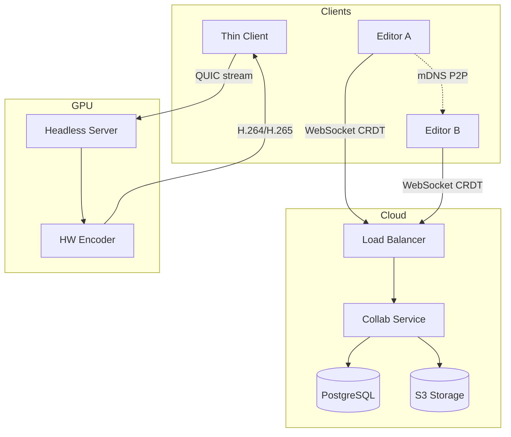
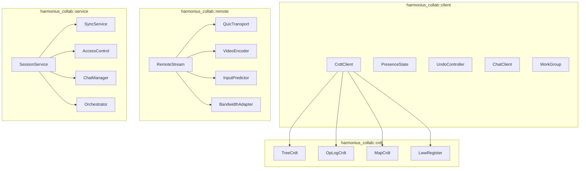
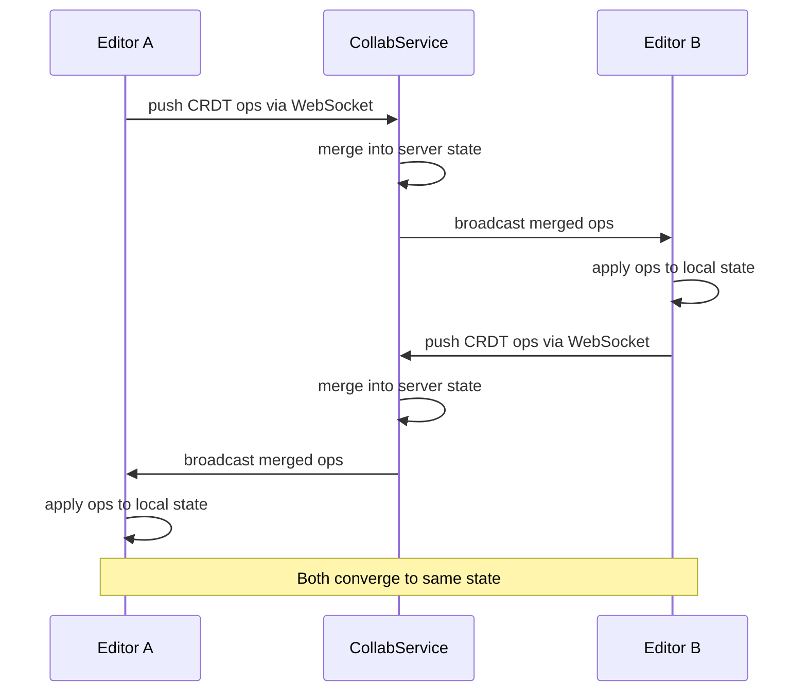
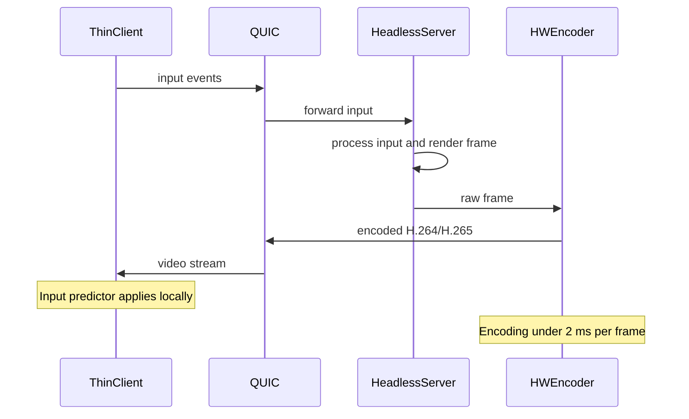
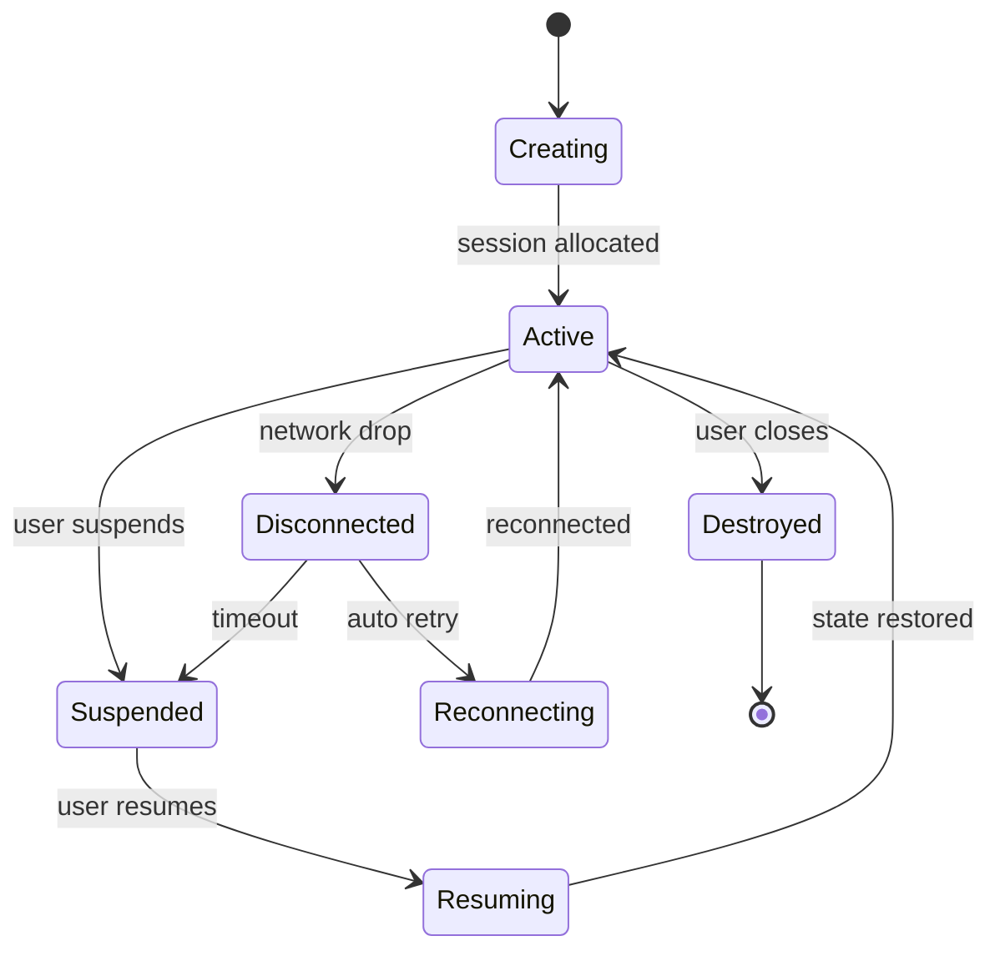

# Remote Collaboration Design

## Requirements Trace

> **Canonical sources:** Features, requirements, and user stories are defined in
> [features/tools-editor/](../../features/tools-editor/),
> [requirements/tools-editor/](../../requirements/tools-editor/), and
> [user-stories/tools-editor/](../../user-stories/tools-editor/). The table below traces design
> elements to those definitions.

| Feature | Requirement | Description |
|---------|-------------|-------------|
| F-15.12.1 | R-15.12.1 | Remote desktop rendering with H.264/H.265 streaming |
| F-15.12.2 | R-15.12.2 | Custom remote editor protocol over QUIC |
| F-15.12.3 | R-15.12.3 | CRDT-based real-time collaborative editing |
| F-15.12.4 | R-15.12.4 | Remote GPU server with multi-session support |
| F-15.12.5 | R-15.12.5 | Session handoff and persistence |
| F-15.12.6 | R-15.12.6 | Bandwidth adaptation and quality tiers |
| F-15.12.7 | R-15.12.7 | Collaboration cloud service |
| F-15.12.8 | R-15.12.8 | CRDT document model per asset type |
| F-15.12.9 | R-15.12.9 | Access control and permissions |
| F-15.12.10 | R-15.12.10 | Integrated voice and text chat |
| F-15.12.11 | R-15.12.11 | Work groups and isolated workspaces |
| F-15.12.12 | R-15.12.12 | AI agent collaboration |
| F-15.12.13 | R-15.12.13 | Asset and scene comments |
| F-15.12.14 | R-15.12.14 | Pull request review in editor |

## Overview

The collaboration subsystem enables multiple users to work on the same project simultaneously. It
has two major modes:

1. **Remote rendering** — a headless editor runs on a GPU server and streams viewport frames to thin
   clients over QUIC. Input events are forwarded with prediction to mask latency. Quality adapts to
   network bandwidth.
2. **Real-time co-editing** — multiple editor instances connect to a shared world. Edits sync via
   CRDTs so concurrent changes merge without conflicts. Each user has an independent viewport,
   selection state, and undo stack.

Both modes share infrastructure:

- A **collaboration cloud service** (Rust, IoReactor) manages CRDT sync, sessions, presence,
  permissions, and chat.
- **PostgreSQL** stores relational data (sessions, users, permissions, audit logs, chat history).
- **S3** stores CRDT document snapshots and binary deltas.
- **WebSocket** transports real-time sync. REST API handles session management and administration.
- **QUIC** transports the remote rendering stream with TCP
  - TLS 1.3 fallback when UDP is blocked.

LAN collaboration works peer-to-peer via mDNS discovery, bypassing the cloud service for local
setups.

## Architecture

### System Architecture



### Module Boundaries



### File Layout

```text
harmonius_collab/
├── client/
│   ├── crdt_client.rs   # CrdtClient — connect, push ops,
│   │                    # receive remote ops
│   ├── presence.rs      # PresenceState — cursor, selection,
│   │                    # viewport tracking
│   ├── undo.rs          # UndoController — per-user undo
│   │                    # stack during collaboration
│   ├── chat.rs          # ChatClient — send/receive text
│   │                    # and voice
│   └── workgroup.rs     # WorkGroup — join, leave, isolate
├── crdt/
│   ├── tree.rs          # TreeCrdt — scene hierarchies
│   ├── oplog.rs         # OpLogCrdt — logic graph ops
│   ├── map.rs           # MapCrdt — data table cells
│   ├── lww.rs           # LwwRegister — terrain tiles
│   ├── clock.rs         # HybridLogicalClock — causal
│   │                    # ordering
│   └── delta.rs         # DeltaEncoder — compact binary
│                        # delta serialization
├── remote/
│   ├── stream.rs        # RemoteStream — viewport frame
│   │                    # capture and encoding
│   ├── quic.rs          # QuicTransport — QUIC with TCP
│   │                    # fallback
│   ├── encoder.rs       # VideoEncoder — platform HW
│   │                    # encoding
│   ├── input.rs         # InputPredictor — client-side
│   │                    # prediction
│   └── bandwidth.rs     # BandwidthAdapter — quality tier
│                        # selection
├── service/
│   ├── session.rs       # SessionService — create, suspend,
│   │                    # resume, destroy
│   ├── sync.rs          # SyncService — CRDT merge and
│   │                    # rebroadcast
│   ├── access.rs        # AccessControl — roles,
│   │                    # permissions, locks
│   ├── chat.rs          # ChatManager — messages, threads,
│   │                    # history
│   └── orchestrator.rs  # Orchestrator — GPU assignment,
│                        # session scheduling
└── protocol/
    ├── messages.rs      # Wire format for all protocol
    │                    # messages
    └── codec.rs         # Binary serialization of CRDT
                         # operations
```

### CRDT Sync Flow



### Remote Rendering Flow



### Session Lifecycle



### Core Data Structures

```mermaid
classDiagram
    class CrdtClient {
        -session_id SessionId
        -user_id UserId
        -documents HashMap~AssetId, CrdtDoc~
        -clock HybridLogicalClock
        +connect(url, token) Future~Result~
        +push_ops(ops) Future~Result~
        +subscribe(asset) Future~Result~
        +unsubscribe(asset) Future~Result~
    }

    class CrdtDoc {
        <<trait>>
        +apply_local(op) Result
        +apply_remote(op) Result
        +snapshot() Vec~u8~
        +restore(data) Result
    }

    class TreeCrdt {
        -nodes HashMap~NodeId, TreeNode~
        -parent_map HashMap~NodeId, NodeId~
        +add_node(parent, data) NodeId
        +remove_node(id) Result
        +reparent(id, new_parent) Result
    }

    class OpLogCrdt {
        -log Vec~Op~
        -applied Set~OpId~
        +add_node(data) OpId
        +remove_node(id) OpId
        +connect(src, dst) OpId
        +disconnect(src, dst) OpId
    }

    class MapCrdt {
        -entries HashMap~Key, LwwRegister~
        +set(key, value) OpId
        +delete(key) OpId
        +get(key) Option~Value~
    }

    class LwwRegister {
        -value Vec~u8~
        -timestamp HlcTimestamp
        +write(value) OpId
        +read() Vec~u8~
    }

    class HybridLogicalClock {
        -physical u64
        -logical u32
        -node_id u16
        +now() HlcTimestamp
        +update(remote) HlcTimestamp
    }

    class RemoteStream {
        -transport QuicTransport
        -encoder VideoEncoder
        -bandwidth BandwidthAdapter
        -predictor InputPredictor
        +start(config) Future~Result~
        +stop() Future~Result~
        +set_quality(tier) Result
    }

    class SessionService {
        -sessions HashMap~SessionId, Session~
        -db PgPool
        -s3 S3Client
        +create(project, user) Future~SessionId~
        +suspend(id) Future~Result~
        +resume(id) Future~Result~
        +destroy(id) Future~Result~
    }

    CrdtClient --> CrdtDoc
    CrdtClient --> HybridLogicalClock
    TreeCrdt ..|> CrdtDoc
    OpLogCrdt ..|> CrdtDoc
    MapCrdt ..|> CrdtDoc
    LwwRegister ..|> CrdtDoc
    RemoteStream --> QuicTransport
    RemoteStream --> VideoEncoder
    RemoteStream --> BandwidthAdapter
```



## API Design

### CRDT Client

```rust
/// Unique session identifier.
#[derive(
    Clone, Copy, Debug, PartialEq, Eq, Hash,
)]
pub struct SessionId(pub u64);

/// Unique user identifier.
#[derive(
    Clone, Copy, Debug, PartialEq, Eq, Hash,
)]
pub struct UserId(pub u64);

/// Hybrid Logical Clock timestamp for causal
/// ordering of CRDT operations.
#[derive(
    Clone, Copy, Debug, PartialEq, Eq,
    PartialOrd, Ord,
)]
pub struct HlcTimestamp {
    pub physical: u64,
    pub logical: u32,
    pub node_id: u16,
}

/// A single CRDT operation.
#[derive(Clone, Debug)]
pub struct CrdtOp {
    pub id: OpId,
    pub timestamp: HlcTimestamp,
    pub author: UserId,
    pub asset_id: AssetId,
    pub payload: OpPayload,
}

/// The kind of CRDT operation.
#[derive(Clone, Debug)]
pub enum OpPayload {
    /// Scene hierarchy operation.
    Tree(TreeOp),
    /// Logic graph operation.
    OpLog(GraphOp),
    /// Data table operation.
    Map(MapOp),
    /// Terrain tile overwrite.
    Lww(LwwOp),
}

/// Client-side CRDT synchronization handle.
pub struct CrdtClient { /* ... */ }

impl CrdtClient {
    /// Connect to the collaboration service.
    pub async fn connect(
        &mut self,
        url: &str,
        token: &str,
    ) -> Result<SessionId, CollabError>;

    /// Connect peer-to-peer on LAN via mDNS.
    pub async fn connect_p2p(
        &mut self,
    ) -> Result<SessionId, CollabError>;

    /// Push locally generated CRDT operations
    /// to the server for merge and broadcast.
    pub async fn push_ops(
        &self,
        ops: &[CrdtOp],
    ) -> Result<(), CollabError>;

    /// Subscribe to CRDT updates for a specific
    /// asset. Receives remote operations via
    /// the on_remote_ops callback.
    pub async fn subscribe(
        &self,
        asset_id: AssetId,
    ) -> Result<(), CollabError>;

    /// Unsubscribe from an asset's CRDT stream.
    pub async fn unsubscribe(
        &self,
        asset_id: AssetId,
    ) -> Result<(), CollabError>;

    /// Register a callback for remote operations.
    pub fn on_remote_ops<F>(
        &mut self,
        callback: F,
    ) where
        F: Fn(&[CrdtOp]) + Send + 'static;

    /// Disconnect from the session.
    pub async fn disconnect(
        &mut self,
    ) -> Result<(), CollabError>;
}
```

### CRDT Document Types

```rust
/// CRDT for scene entity hierarchies.
/// Supports add, remove, and reparent.
pub struct TreeCrdt { /* ... */ }

/// Operation on a tree CRDT.
#[derive(Clone, Debug)]
pub enum TreeOp {
    AddNode {
        id: NodeId,
        parent: NodeId,
        data: Vec<u8>,
    },
    RemoveNode { id: NodeId },
    Reparent {
        id: NodeId,
        new_parent: NodeId,
    },
    SetProperty {
        id: NodeId,
        key: PropertyPath,
        value: PropertyValue,
    },
}

impl TreeCrdt {
    pub fn new() -> Self;
    pub fn apply_local(
        &mut self,
        op: TreeOp,
    ) -> Result<OpId, CrdtError>;
    pub fn apply_remote(
        &mut self,
        op: &CrdtOp,
    ) -> Result<(), CrdtError>;
    pub fn snapshot(&self) -> Vec<u8>;
    pub fn restore(
        data: &[u8],
    ) -> Result<Self, CrdtError>;
}

/// CRDT for logic graph editing via operation log.
pub struct OpLogCrdt { /* ... */ }

/// Operation on a logic graph.
#[derive(Clone, Debug)]
pub enum GraphOp {
    AddNode { id: NodeId, data: Vec<u8> },
    RemoveNode { id: NodeId },
    Connect { src: PinId, dst: PinId },
    Disconnect { src: PinId, dst: PinId },
    SetNodeProperty {
        id: NodeId,
        key: PropertyPath,
        value: PropertyValue,
    },
}

impl OpLogCrdt {
    pub fn new() -> Self;
    pub fn apply_local(
        &mut self,
        op: GraphOp,
    ) -> Result<OpId, CrdtError>;
    pub fn apply_remote(
        &mut self,
        op: &CrdtOp,
    ) -> Result<(), CrdtError>;
    pub fn snapshot(&self) -> Vec<u8>;
    pub fn restore(
        data: &[u8],
    ) -> Result<Self, CrdtError>;
}

/// CRDT for data tables (per-row, per-cell).
pub struct MapCrdt { /* ... */ }

/// Operation on a map CRDT.
#[derive(Clone, Debug)]
pub enum MapOp {
    Set { key: Vec<u8>, value: Vec<u8> },
    Delete { key: Vec<u8> },
}

impl MapCrdt {
    pub fn new() -> Self;
    pub fn apply_local(
        &mut self,
        op: MapOp,
    ) -> Result<OpId, CrdtError>;
    pub fn apply_remote(
        &mut self,
        op: &CrdtOp,
    ) -> Result<(), CrdtError>;
    pub fn get(
        &self,
        key: &[u8],
    ) -> Option<&[u8]>;
    pub fn snapshot(&self) -> Vec<u8>;
    pub fn restore(
        data: &[u8],
    ) -> Result<Self, CrdtError>;
}

/// Last-writer-wins register for terrain tiles.
pub struct LwwRegister { /* ... */ }

/// Operation on an LWW register.
#[derive(Clone, Debug)]
pub struct LwwOp {
    pub tile_id: TileId,
    pub data: Vec<u8>,
}

impl LwwRegister {
    pub fn new() -> Self;
    pub fn write(
        &mut self,
        data: Vec<u8>,
        timestamp: HlcTimestamp,
    ) -> OpId;
    pub fn read(&self) -> &[u8];
    pub fn apply_remote(
        &mut self,
        op: &LwwOp,
        timestamp: HlcTimestamp,
    );
}
```

### Remote Rendering

```rust
/// Quality tier for remote rendering.
#[derive(Clone, Copy, Debug, PartialEq, Eq)]
pub enum QualityTier {
    /// LAN / >100 Mbps. Near-lossless viewport,
    /// full UI refresh rate.
    High,
    /// Broadband / 10-100 Mbps. Lossy viewport
    /// at 60 fps, reduced UI refresh.
    Medium,
    /// Mobile / <10 Mbps. 30 fps viewport,
    /// aggressive compression, UI on change.
    Low,
}

/// Video codec selection.
#[derive(Clone, Copy, Debug, PartialEq, Eq)]
pub enum VideoCodec {
    H264,
    H265,
}

/// Configuration for a remote rendering stream.
pub struct StreamConfig {
    pub codec: VideoCodec,
    pub initial_tier: QualityTier,
    pub auto_adapt: bool,
    pub max_framerate: u32,
}

/// Remote rendering stream handle.
pub struct RemoteStream { /* ... */ }

impl RemoteStream {
    /// Start streaming the editor viewport.
    pub async fn start(
        &mut self,
        config: StreamConfig,
    ) -> Result<(), CollabError>;

    /// Stop the stream.
    pub async fn stop(
        &mut self,
    ) -> Result<(), CollabError>;

    /// Override automatic quality tier.
    pub fn set_quality(
        &mut self,
        tier: QualityTier,
    ) -> Result<(), CollabError>;

    /// Current measured bandwidth in bytes/sec.
    pub fn measured_bandwidth(&self) -> u64;

    /// Current quality tier (auto or pinned).
    pub fn current_tier(&self) -> QualityTier;

    /// Encoding latency of the last frame in
    /// microseconds.
    pub fn last_encode_us(&self) -> u32;
}
```

### Presence

```rust
/// Cursor and selection state of a remote user.
#[derive(Clone, Debug)]
pub struct UserCursor {
    pub user_id: UserId,
    pub display_name: String,
    pub color: [u8; 3],
    /// World-space position of the user's cursor.
    pub position: Option<[f32; 3]>,
    /// Currently selected entities.
    pub selection: Vec<EntityId>,
    /// Asset currently open for editing.
    pub active_asset: Option<AssetId>,
}

/// Presence state for the local session.
pub struct PresenceState { /* ... */ }

impl PresenceState {
    /// Update the local user's cursor position.
    pub fn set_cursor_position(
        &mut self,
        pos: [f32; 3],
    );

    /// Update the local user's selection.
    pub fn set_selection(
        &mut self,
        entities: &[EntityId],
    );

    /// Update the local user's active asset.
    pub fn set_active_asset(
        &mut self,
        asset: AssetId,
    );

    /// Get all remote users' cursors.
    pub fn remote_cursors(
        &self,
    ) -> &[UserCursor];

    /// Register a callback for presence changes.
    pub fn on_change<F>(&mut self, callback: F)
    where
        F: Fn(&UserCursor) + Send + 'static;
}
```

### Per-User Undo

```rust
/// Undo controller for collaborative editing.
/// Each user has an independent undo stack that
/// only undoes their own operations.
pub struct UndoController { /* ... */ }

impl UndoController {
    pub fn new(user_id: UserId) -> Self;

    /// Record an operation for potential undo.
    pub fn record(&mut self, op: CrdtOp);

    /// Undo the last operation by this user.
    /// Returns the inverse CRDT operation to apply.
    pub fn undo(
        &mut self,
    ) -> Option<CrdtOp>;

    /// Redo a previously undone operation.
    pub fn redo(
        &mut self,
    ) -> Option<CrdtOp>;

    /// Whether undo is available.
    pub fn can_undo(&self) -> bool;

    /// Whether redo is available.
    pub fn can_redo(&self) -> bool;
}
```

### Session Service (Server-Side)

```rust
/// Session state on the server.
#[derive(Clone, Debug)]
pub struct Session {
    pub id: SessionId,
    pub project_id: ProjectId,
    pub creator: UserId,
    pub state: SessionState,
    pub participants: Vec<UserId>,
    pub created_at: i64,
    pub gpu_assignment: Option<GpuId>,
}

#[derive(Clone, Copy, Debug, PartialEq, Eq)]
pub enum SessionState {
    Active,
    Suspended,
    Destroyed,
}

/// Role-based access control.
#[derive(Clone, Copy, Debug, PartialEq, Eq)]
pub enum Role {
    /// Can view but not edit.
    Viewer,
    /// Can view and edit.
    Editor,
    /// Full control including permissions.
    Admin,
}

/// Server-side session management.
pub struct SessionService { /* ... */ }

impl SessionService {
    pub async fn create(
        &self,
        project_id: ProjectId,
        user_id: UserId,
    ) -> Result<SessionId, CollabError>;

    pub async fn suspend(
        &self,
        id: SessionId,
    ) -> Result<(), CollabError>;

    pub async fn resume(
        &self,
        id: SessionId,
        user_id: UserId,
    ) -> Result<(), CollabError>;

    pub async fn destroy(
        &self,
        id: SessionId,
    ) -> Result<(), CollabError>;

    pub async fn assign_gpu(
        &self,
        id: SessionId,
    ) -> Result<GpuId, CollabError>;
}

/// Access control enforcement.
pub struct AccessControl { /* ... */ }

impl AccessControl {
    pub async fn check_permission(
        &self,
        user_id: UserId,
        project_id: ProjectId,
        action: Action,
    ) -> Result<bool, CollabError>;

    pub async fn set_role(
        &self,
        user_id: UserId,
        project_id: ProjectId,
        role: Role,
    ) -> Result<(), CollabError>;

    pub async fn lock_asset(
        &self,
        user_id: UserId,
        asset_id: AssetId,
    ) -> Result<(), CollabError>;

    pub async fn unlock_asset(
        &self,
        asset_id: AssetId,
    ) -> Result<(), CollabError>;
}
```

### Chat

```rust
/// A chat message.
#[derive(Clone, Debug)]
pub struct ChatMessage {
    pub id: MessageId,
    pub author: UserId,
    pub thread_id: Option<ThreadId>,
    pub content: String,
    pub asset_refs: Vec<AssetId>,
    pub mentions: Vec<UserId>,
    pub timestamp: i64,
}

/// Chat client for text and voice.
pub struct ChatClient { /* ... */ }

impl ChatClient {
    /// Send a text message.
    pub async fn send(
        &self,
        content: &str,
        thread_id: Option<ThreadId>,
    ) -> Result<MessageId, CollabError>;

    /// Search chat history.
    pub async fn search(
        &self,
        query: &str,
        limit: u32,
    ) -> Result<Vec<ChatMessage>, CollabError>;

    /// Join a voice channel.
    pub async fn join_voice(
        &self,
        channel_id: ChannelId,
    ) -> Result<(), CollabError>;

    /// Leave the current voice channel.
    pub async fn leave_voice(
        &self,
    ) -> Result<(), CollabError>;

    /// Register a callback for incoming messages.
    pub fn on_message<F>(
        &mut self,
        callback: F,
    ) where
        F: Fn(&ChatMessage) + Send + 'static;
}
```

### Error Types

```rust
pub enum CollabError {
    /// Not connected to a session.
    NotConnected,
    /// Authentication failed.
    AuthFailed { message: String },
    /// Permission denied for the requested action.
    PermissionDenied {
        user: UserId,
        action: Action,
    },
    /// Session not found.
    SessionNotFound { id: SessionId },
    /// Asset locked by another user.
    AssetLocked {
        asset: AssetId,
        owner: UserId,
    },
    /// CRDT operation conflict.
    CrdtConflict { message: String },
    /// Network transport error.
    Transport { message: String },
    /// Video encoding error.
    Encoding { message: String },
    /// No GPU available for session.
    NoGpuAvailable,
    /// Database error.
    Database { message: String },
}
```

## Data Flow

### CRDT Operation Pipeline

1. User edits an asset in their local editor.
2. The editor generates a CRDT operation (e.g., `TreeOp::AddNode` for a new entity in a scene).
3. The operation is applied to the local CRDT state immediately (optimistic local apply).
4. The operation is recorded in the per-user undo stack.
5. `CrdtClient::push_ops` sends the operation to the collaboration service via WebSocket.
6. The service merges the operation into the server-side CRDT state and rebroadcasts to all other
   participants.
7. Remote editors receive the operation and apply it to their local state via `apply_remote`.
8. All editors converge to the same state.

### Remote Rendering Pipeline

1. Thin client connects to the headless server via QUIC.
2. The `Orchestrator` assigns a GPU to the session.
3. The headless editor renders each frame to a GPU texture.
4. `VideoEncoder` encodes the texture using platform-native hardware (VideoToolbox, NVENC, VA-API).
   Target: under 2 ms per frame.
5. The encoded frame is sent to the client via QUIC.
6. The viewport stream uses high quality. UI panels use change-detection driven updates to reduce
   bandwidth.
7. `BandwidthAdapter` continuously measures throughput and switches quality tiers:
   - High (>100 Mbps): near-lossless, full framerate
   - Medium (10-100 Mbps): lossy 60 fps
   - Low (<10 Mbps): 30 fps, aggressive compression
8. Input events from the client are forwarded to the server. `InputPredictor` applies prediction
   locally on the client to mask network latency.

### Session Suspend and Resume

1. User clicks "Suspend Session" or disconnects.
2. The server serializes all session state: open panels, camera positions, selections, undo history,
   unsaved modifications. Uses the same binary format as crash recovery.
3. State is written to the server's project workspace directory and referenced in PostgreSQL.
4. On resume (possibly from a different client device), the server restores the serialized state and
   reconnects the user to the exact visual and functional state at suspension time.

### Work Group Isolation

1. Users join a named work group (e.g., "Level Design").
2. The group receives an isolated CRDT workspace layer.
3. Edits within the group are invisible to other groups until explicitly shared.
4. Sharing merges the group's CRDT state into the shared project state, resolving any conflicts via
   standard CRDT merge semantics.

## Platform Considerations

### Video Encoding

| Platform | Encoder API | Notes |
|----------|-------------|-------|
| macOS | VideoToolbox | `VTCompressionSession` for H.264/H.265 |
| Windows | NVENC / AMF / Quick Sync | Selected by GPU vendor at runtime |
| Linux | VA-API / NVENC | VA-API for AMD/Intel, NVENC for NVIDIA |

### Voice Audio Capture

| Platform | Audio API | Notes |
|----------|-----------|-------|
| macOS | CoreAudio | `AudioUnit` with echo cancellation |
| Windows | WASAPI | Loopback capture + AEC DSP |
| Linux | PipeWire | Low-latency capture with DSP |

### Transport

| Transport | Primary Use | Fallback |
|-----------|-------------|----------|
| QUIC | Remote rendering stream | TCP + TLS 1.3 |
| WebSocket | CRDT sync, presence, chat | Long-polling REST |

### Headless GPU Context

| Platform | API | Notes |
|----------|-----|-------|
| macOS | Headless Metal | `MTLCreateSystemDefaultDevice` without display |
| Windows | WDDM headless mode | DXGI adapter enumeration |
| Linux | EGL | `EGL_PLATFORM_SURFACELESS_MESA` |

### Cloud Service Stack

| Component | Technology | Notes |
|-----------|------------|-------|
| Runtime | Rust (IoReactor) | Async, multi-threaded |
| HTTP framework | Custom (IoReactor) | REST API + WebSocket upgrade |
| Database | PostgreSQL | Sessions, users, permissions, chat |
| Object storage | S3 | CRDT snapshots, binary deltas |
| Deployment | Docker / Kubernetes | Horizontal scaling |
| Auth | OAuth2 / OIDC | Enterprise SSO integration |

### Proposed Dependencies

| Crate | Purpose | Justification |
|-------|---------|---------------|
| `quinn` | QUIC transport | Pure-Rust; `AsyncUdpSocket` on IoReactor |
| `tungstenite` | WebSocket protocol | Non-async; manual I/O via IoReactor |
| `postgres` | PostgreSQL driver | Sync client on dedicated I/O threads |
| `aws-sdk-s3` | S3 client | Official AWS SDK for Rust |
| `opus` | Voice codec | Low-latency audio codec |
| `serde` | Serialization | Protocol message encoding |
| `blake3` | Content hashing | CRDT snapshot integrity |

> **Runtime policy:** The collaboration server uses the same custom `IoReactor` as the engine. HTTP
> serving uses a custom HTTP/1.1 server on the IoReactor. WebSocket uses `tungstenite` with manual
> I/O via IoReactor. The QUIC client (`quinn`) integrates with `IoReactor` via its `AsyncUdpSocket`
> trait. Database access uses the synchronous `postgres` crate on dedicated I/O threads.

## Test Plan

### Unit Tests

| Test | Req | Description |
|------|-----|-------------|
| `test_tree_crdt_add_remove` | R-15.12.8 | Add and remove nodes, verify tree integrity |
| `test_tree_crdt_concurrent_reparent` | R-15.12.8 | Two users reparent same node, converge correctly |
| `test_oplog_concurrent_connect` | R-15.12.8 | Two users connect different pins, both applied |
| `test_map_crdt_concurrent_set` | R-15.12.8 | Two users set same cell, LWW resolves |
| `test_lww_register_ordering` | R-15.12.8 | Higher HLC timestamp wins |
| `test_hlc_monotonic` | R-15.12.3 | Clock is strictly monotonic across calls |
| `test_per_user_undo` | R-15.12.3 | User A undo does not affect user B ops |
| `test_presence_cursor_update` | R-15.12.3 | Cursor position broadcasts to all participants |
| `test_role_viewer_no_edit` | R-15.12.9 | Viewer role cannot push edit operations |
| `test_role_admin_set_role` | R-15.12.9 | Admin can change other users' roles |
| `test_bandwidth_tier_selection` | R-15.12.6 | 150 Mbps selects High, 50 selects Medium, 5 selects Low |
| `test_workgroup_isolation` | R-15.12.11 | Edits in group A invisible to group B |

### Integration Tests

| Test | Req | Description |
|------|-----|-------------|
| `test_three_user_convergence` | R-15.12.3 | Three concurrent editors converge to same state |
| `test_session_suspend_resume` | R-15.12.5 | Suspend session, resume on different client, state matches |
| `test_p2p_lan_discovery` | R-15.12.3 | Two editors discover via mDNS and sync CRDTs |
| `test_quic_to_tcp_fallback` | R-15.12.2 | Block UDP, verify fallback to TCP+TLS 1.3 |
| `test_100_concurrent_sessions` | R-15.12.7 | Service handles 100 sessions without data loss |
| `test_oauth2_authentication` | R-15.12.9 | OAuth2 flow completes and grants correct role |
| `test_chat_message_delivery` | R-15.12.10 | Message sent by A received by B with correct content |
| `test_chat_search` | R-15.12.10 | Search finds message by keyword |
| `test_encoding_overhead` | R-15.12.1 | HW encoding completes in under 2 ms per frame |
| `test_pr_review_structural_diff` | R-15.12.14 | PR changed assets show structural diffs in editor |

### Benchmarks

| Benchmark | Target | Source |
|-----------|--------|--------|
| CRDT op broadcast latency | < 50 ms (LAN) | US-15.12.3.4 |
| Remote rendering round-trip | < 16 ms (LAN) | US-15.12.4.2 |
| HW encoding overhead | < 2 ms/frame | US-15.12.1.4 |
| Bandwidth vs VNC | >= 60% reduction | US-15.12.2.4 |
| Session resume time | < 5 s | US-15.12.5.1 |
| CRDT convergence (3 users) | < 200 ms | US-15.12.3.7 |
| Chat message delivery | < 100 ms | US-15.12.10.6 |

## Design Q & A

**Q1. What is the biggest constraint limiting this design?**

The no-third-party-runtime constraint forces the collaboration server to use the custom `IoReactor`
for all async I/O, including WebSocket handling and database access. Lifting this would allow using
battle-tested async runtimes with built-in WebSocket servers, connection pooling, and graceful
shutdown. The best solution without this constraint would be `tokio` with `axum` for the collab
server, reducing implementation effort by months. The impact of removing it is losing control over
I/O scheduling and introducing a dependency that conflicts with the engine's game-loop-driven
reactor model.

**Q2. How can this design be improved?**

The CRDT document types (F-15.12.8) use four separate implementations (TreeCrdt, OpLogCrdt, MapCrdt,
LwwRegister) with no shared compaction or garbage collection strategy. Over long sessions, CRDT
state will grow unboundedly. The remote rendering pipeline (F-15.12.1) assumes hardware encoders are
always available, but some cloud GPU instances lack encoder hardware. Adding CRDT compaction at
snapshot points and a software encoding fallback would improve robustness.

**Q3. Is there a better approach?**

An operational transform (OT) system instead of CRDTs would provide stronger consistency guarantees
and simpler conflict resolution for structured assets. We are not taking OT because it requires a
central server for transformation, making LAN peer-to-peer mode (F-15.12.3) impossible. CRDTs enable
both cloud and P2P topologies with the same merge semantics, which is critical for the LAN
collaboration requirement.

**Q4. Does this design solve all customer problems?**

The design lacks offline editing with later sync -- if a user loses connectivity mid-session, their
local edits cannot be reconciled after reconnection beyond basic CRDT merge. There is no user story
for asynchronous review of CRDT change history (like a "timeline scrub" of collaborative edits).
Adding offline buffering with conflict resolution UI and a session replay feature would support
distributed teams across time zones.

**Q5. Is this design cohesive with the overall engine?**

The collaboration module uses `quinn` for QUIC and `tungstenite` for WebSocket, both integrated via
`IoReactor`, which is consistent with the engine's async policy. However, the per-user
`UndoController` in collaboration (F-15.12.3) is separate from the editor framework's `UndoStack`
(F-15.1.3). Unifying them so the editor's command pattern feeds into the collaboration CRDT would
eliminate the dual-undo-system and make collaborative editing seamless with single-user editing.

## Open Questions

1. **CRDT library vs custom** — Build CRDTs from scratch or adopt an existing library (e.g., `yrs`
   for Yjs-compatible CRDTs)? Custom gives full control over serialization and memory layout. Yrs
   provides a battle-tested foundation.
2. **Snapshot frequency** — How often should the server snapshot CRDT state to S3? Frequent
   snapshots reduce recovery time but increase storage cost. Consider periodic snapshots (every 5
   minutes) plus on session suspend.
3. **Voice codec integration** — Opus encoding runs on the client CPU. Need to determine buffer
   sizes and jitter buffer strategy for acceptable voice latency (target <150 ms mouth-to-ear).
4. **AI agent CRDT identity** — AI agents participate as virtual users (F-15.12.12). How to
   distinguish AI ops in the CRDT log for provenance tracking? Options: a reserved `node_id` range
   for AI agents, or a provenance flag in the operation header.
5. **Conflict resolution UX for work groups** — When a group shares its isolated workspace,
   conflicts with the main state need resolution. Should this be automatic (CRDT merge) or require
   user confirmation?
6. **Multi-GPU assignment policy** — Round-robin, least-loaded, or user-specified GPU assignment?
   Consider exposing a configurable policy with sensible defaults.
