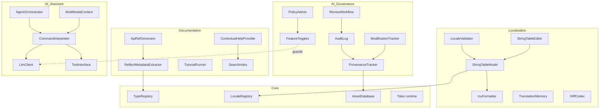
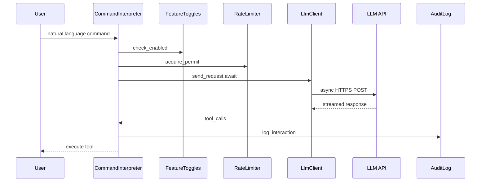
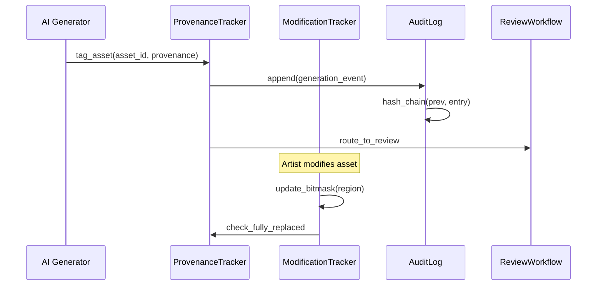
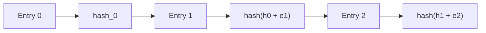

# Content Services Design

## Requirements Trace

### Localization Editor (F-15.13)

| Feature   | Requirement | User Story          |
|-----------|-------------|---------------------|
| F-15.13.1 | R-15.13.1  | US-15.13.1.1--1.10  |
| F-15.13.2 | R-15.13.2  | US-15.13.2.1--2.9   |
| F-15.13.3 | R-15.13.3  | US-15.13.3.1--3.7   |

1. **F-15.13.1** -- Visual string table editor with ICU, TM, CSV
2. **F-15.13.2** -- Locale preview, validation, pseudo-loc, RTL
3. **F-15.13.3** -- XLIFF workflow, TMS integration, string locks

### Documentation and Learning (F-15.19)

| Feature   | Requirement | User Story          |
|-----------|-------------|---------------------|
| F-15.19.1 | R-15.19.1  | US-15.19.1.1--1.5   |
| F-15.19.2 | R-15.19.2  | US-15.19.2.1--2.6   |
| F-15.19.3 | R-15.19.3  | US-15.19.3.1--3.7   |
| F-15.19.4 | R-15.19.4  | US-15.19.4.1--4.5   |
| F-15.19.5 | R-15.19.5  | US-15.19.5.1--5.5   |
| F-15.19.6 | R-15.19.6  | US-15.19.6.1--6.6   |
| F-15.19.7 | R-15.19.7  | US-15.19.7.1--7.5   |

1. **F-15.19.1** -- Auto-generated API reference from Reflect
2. **F-15.19.2** -- Logic graph node documentation
3. **F-15.19.3** -- Interactive in-editor tutorials
4. **F-15.19.4** -- Embedded video player with chapters
5. **F-15.19.5** -- Contextual help tooltips
6. **F-15.19.6** -- Sample projects and templates
7. **F-15.19.7** -- Inline code examples as doc-tests

### AI Governance (F-15.7)

| Feature  | Requirement | User Stories                |
|----------|-------------|-----------------------------|
| F-15.7.1 | R-15.7.1   | US-15.7.1.1--US-15.7.1.5    |
| F-15.7.2 | R-15.7.2   | US-15.7.2.1--US-15.7.2.4    |
| F-15.7.3 | R-15.7.3   | US-15.7.3.1--US-15.7.3.4    |
| F-15.7.4 | R-15.7.4   | US-15.7.4.1--US-15.7.4.4    |
| F-15.7.5 | R-15.7.5   | US-15.7.5.1--US-15.7.5.5    |
| F-15.7.6 | R-15.7.6   | US-15.7.6.1--US-15.7.6.4    |
| F-15.7.7 | R-15.7.7   | US-15.7.7.1--US-15.7.7.6    |
| F-15.7.8 | R-15.7.8   | US-15.7.8.1--US-15.7.8.4    |

1. **F-15.7.1** -- AI content provenance tagging
2. **F-15.7.2** -- Human modification tracking
3. **F-15.7.3** -- Generative AI feature toggle
4. **F-15.7.4** -- AI assistance toggle
5. **F-15.7.5** -- Enterprise remote administration
6. **F-15.7.6** -- AI content audit trail
7. **F-15.7.7** -- AI content review workflow
8. **F-15.7.8** -- Provenance metadata in packaged builds

### AI Assistant (F-15.9)

| Feature   | Requirement | User Stories                  |
|-----------|-------------|-------------------------------|
| F-15.9.1a | R-15.9.1a  | US-15.9.1a.1--US-15.9.1a.4   |
| F-15.9.1b | R-15.9.1b  | US-15.9.1b.1--US-15.9.1b.4   |
| F-15.9.1c | R-15.9.1c  | US-15.9.1c.1--US-15.9.1c.4   |
| F-15.9.2  | R-15.9.2   | US-15.9.2.1--US-15.9.2.6     |
| F-15.9.3  | R-15.9.3   | US-15.9.3.1--US-15.9.3.6     |
| F-15.9.4  | R-15.9.4   | US-15.9.4.1--US-15.9.4.4     |
| F-15.9.5  | R-15.9.5   | US-15.9.5.1--US-15.9.5.4     |
| F-15.9.6a | R-15.9.6a  | US-15.9.6a.1--US-15.9.6a.4   |
| F-15.9.6b | R-15.9.6b  | US-15.9.6b.1--US-15.9.6b.4   |
| F-15.9.6c | R-15.9.6c  | US-15.9.6c.1--US-15.9.6c.4   |
| F-15.9.7  | R-15.9.7   | US-15.9.7.1--US-15.9.7.5     |
| F-15.9.8  | R-15.9.8   | US-15.9.8.1--US-15.9.8.5     |
| F-15.9.9  | R-15.9.9   | US-15.9.9.1--US-15.9.9.4     |
| F-15.9.10 | R-15.9.10  | US-15.9.10.1--US-15.9.10.6   |

1. **F-15.9.1a** -- Speech-to-text pipeline
2. **F-15.9.1b** -- Voice command interpretation
3. **F-15.9.1c** -- Voice activation modes
4. **F-15.9.2** -- AI assistant tool interface
5. **F-15.9.3** -- Visual and graphical tool access
6. **F-15.9.4** -- Keyboard shortcut recommendations
7. **F-15.9.5** -- Contextual action reminders
8. **F-15.9.6a** -- Headless editor API layer
9. **F-15.9.6b** -- Agent orchestration
10. **F-15.9.6c** -- CI/CD agent integration
11. **F-15.9.7** -- Screenshot and screen recording
12. **F-15.9.8** -- UI accessibility tree analysis
13. **F-15.9.9** -- Multi-modal understanding
14. **F-15.9.10** -- AI assistance administration

## Overview

Content services cover four editor subsystems that share infrastructure but serve distinct purposes:

1. **Localization** -- string table management, ICU MessageFormat, RTL, font fallback, translation
   memory, XLIFF, pseudo-loc.
2. **Documentation** -- auto-generated API reference from Reflect metadata, interactive tutorials,
   contextual help, search.
3. **AI Governance** -- provenance tagging, modification tracking, feature toggles, tamper-evident
   audit trails, review workflows, enterprise policy administration.
4. **AI Assistant** -- natural language editor commands (voice + text), multi-modal context, LLM
   tool calling, agent orchestration, rate limiting, quotas, provider configuration.

All LLM inference runs on self-hosted AWS infrastructure accessed via async HTTPS. No model weights
ship with the engine. The governance layer is always available; the assistant is gated behind
toggles (F-15.7.4) and enterprise policy (F-15.7.5).

## Architecture

### Module Boundaries



### AI Request Flow



### Provenance and Audit Data Flow



### Audit Log Hash Chain



### Core Data Structures

```mermaid
classDiagram
    class LocaleId {
        +SmallString~8~ value
    }
    class StringKey {
        +SmallString~64~ value
    }
    class TextDirection {
        <<enum>>
        LeftToRight
        RightToLeft
    }
    class ReviewStatus {
        <<enum>>
        Draft
        NeedsRevision
        Approved
        Rejected
    }
    class PluralCategory {
        <<enum>>
        Zero
        One
        Two
        Few
        Many
        Other
    }
    class TransUnitState {
        <<enum>>
        Initial
        Translated
        Reviewed
        Final
    }
    class ValidationCategory {
        <<enum>>
        MissingTranslation
        TextOverflow
        BrokenInterpolation
        IncorrectPluralForm
        RtlLayoutIssue
    }
    class TutorialState {
        <<enum>>
        Idle
        Running
        Paused
        Complete
    }
    class LocaleRegistry {
        -Vec~LocaleDescriptor~ locales
        -LocaleId active
        +active() LocaleId
        +set_active(locale) Result
        +source_locale() LocaleId
    }
    class StringTableModel {
        -Vec~StringEntry~ entries
        +get(key) Option~StringEntry~
        +set_translation(key, locale, text) Result
        +missing_count(locale) u32
    }
    class IcuFormatter {
        +validate_pattern(pattern) Result
        +format(pattern, args) Result
    }
    class TranslationMemory {
        +index(source, translation, locale)
        +suggest(source, locale, max) Vec
    }
    class XliffCodec {
        +encode(model, source, target) Vec~u8~
        +decode(data) Result
    }
    class LocaleValidator {
        +validate(model, locale, layout) Report
    }
    class ApiRefGenerator {
        +generate(entries, output) Future
    }
    class SearchIndex {
        +build(entries, locale) Self
        +query(text, max) Vec~DocRef~
    }
    class ContextualHelpProvider {
        +lookup(widget_type_id, locale) Option~HelpEntry~
    }
    class TutorialRunner {
        -TutorialState state
        +start(tutorial)
        +try_advance() bool
    }
    class ProvenanceTag {
        +AssetId asset_id
        +AiSystemId ai_system
        +String model_version
        +u64 timestamp
        +Blake3Hash prompt_hash
        +bool fully_replaced
    }
    class AiSystem {
        <<enum>>
        TextureGenerator
        MeshGenerator
        AnimationGenerator
        AudioGenerator
        LogicGraphGenerator
        Custom(String)
    }
    class ModificationBitmask {
        +AssetId asset_id
        +TrackingGranularity granularity
        +Vec~u64~ bitmask
        +modification_pct() f32
        +is_fully_replaced() bool
    }
    class TrackingGranularity {
        <<enum>>
        VertexGroup
        Tile
        Row
        Node
    }
    class AuditEntry {
        +u64 timestamp
        +UserId user_id
        +AuditAction action
        +AssetId asset_id
        +[u8; 32] prev_hash
    }
    class AuditAction {
        <<enum>>
        AiGeneration
        HumanModification
        ProvenanceRemoval
        ReviewApproval
        ReviewRejection
        PolicyChange
        ToolInvocation
    }
    class FeatureToggleState {
        +bool generative_ai_enabled
        +bool assistance_enabled
        +u64 policy_version
    }
    class PolicyDocument {
        +u64 version
        +FeatureToggleState toggles
        +Vec~QuotaConfig~ quotas
        +[u8; 64] signature
    }
    class ToolDefinition {
        +ToolId id
        +String name
        +String description
        +Vec~ToolParameter~ parameters
        +bool supports_undo
    }
    class ToolInterface {
        +register_tool(definition)
        +execute(call, access) Future~ToolResult~
    }
    class CommandInterpreter {
        +process_command(ctx, user) Future~Result~
    }
    class MultiModalContext {
        +Option~String~ text
        +Option~Vec~u8~~ screenshot
        +AccessibilitySnapshot accessibility
        +build_prompt(tools) LlmRequest
    }
    class AgentOrchestrator {
        +create_agent() AgentId
        +run_command(id, ctx) Future~Result~
        +terminate_agent(id) Result
    }
    class RateLimiter {
        +acquire_permit(user) Result
    }

    LocaleRegistry --> TextDirection
    StringTableModel --> ReviewStatus
    IcuFormatter --> PluralCategory
    LocaleValidator --> ValidationCategory
    XliffCodec --> TransUnitState
    TutorialRunner --> TutorialState
    ProvenanceTag --> AiSystem
    ModificationBitmask --> TrackingGranularity
    AuditEntry --> AuditAction
    PolicyDocument --> FeatureToggleState
    ToolInterface --> ToolDefinition
    CommandInterpreter --> ToolInterface
    AgentOrchestrator --> CommandInterpreter
```



## API Design

### Localization

```rust
#[derive(Clone, Debug, PartialEq, Eq, Hash, Reflect)]
pub struct LocaleId(pub SmallString<8>);

#[derive(Clone, Debug, PartialEq, Eq, Hash, Reflect)]
pub struct StringKey(pub SmallString<64>);

pub struct StringTableModel {
    entries: Vec<StringEntry>,
    index: HashMap<StringKey, usize>,
}

impl StringTableModel {
    pub fn get(
        &self,
        key: &StringKey,
    ) -> Option<&StringEntry>;
    pub fn set_translation(
        &mut self,
        key: &StringKey,
        locale: &LocaleId,
        text: String,
    ) -> Result<(), LocaleError>;
    pub fn missing_count(
        &self,
        locale: &LocaleId,
    ) -> u32;
}

pub struct IcuFormatter {
    locale: LocaleId,
    plural_rules: PluralRules,
}

impl IcuFormatter {
    pub fn validate_pattern(
        &self,
        pattern: &str,
    ) -> Result<(), IcuPatternError>;
    pub fn format(
        &self,
        pattern: &str,
        args: &HashMap<String, FormatArg>,
    ) -> Result<String, IcuFormatError>;
}

pub struct TranslationMemory { /* ... */ }

impl TranslationMemory {
    pub fn index(
        &mut self,
        source: &str,
        translation: &str,
        locale: &LocaleId,
    );
    pub fn suggest(
        &self,
        source: &str,
        locale: &LocaleId,
        max_results: u32,
    ) -> Vec<TmSuggestion>;
}
```

### AI Governance: Provenance

```rust
#[derive(Clone, Debug, Reflect)]
pub struct ProvenanceTag {
    pub asset_id: AssetId,
    pub ai_system: AiSystemId,
    pub model_version: String,
    pub timestamp_utc: u64,
    pub prompt_hash: Blake3Hash,
    pub triggered_by: UserId,
    pub fully_replaced: bool,
}

pub struct ProvenanceTracker { /* ... */ }

impl ProvenanceTracker {
    pub async fn tag_asset(
        &mut self,
        asset_id: AssetId,
        ai_system: AiSystemId,
        model_version: &str,
        prompt_hash: Blake3Hash,
        user: UserId,
        audit_log: &mut AuditLog,
    ) -> Result<(), GovernanceError>;
    pub fn has_provenance(
        &self,
        asset_id: AssetId,
    ) -> bool;
    pub fn query_assets(
        &self,
        filter: &ProvenanceFilter,
    ) -> Vec<AssetId>;
}
```

### AI Governance: Modification Tracking

```rust
#[derive(Clone, Debug, Reflect)]
pub struct ModificationBitmask {
    pub asset_id: AssetId,
    pub granularity: TrackingGranularity,
    pub bitmask: Vec<u64>,
    pub region_count: u32,
}

impl ModificationBitmask {
    pub fn mark_modified(&mut self, region: u32);
    pub fn modification_pct(&self) -> f32;
    pub fn is_fully_replaced(&self) -> bool;
}

pub struct ModificationTracker { /* ... */ }

impl ModificationTracker {
    pub fn start_tracking(
        &mut self,
        asset_id: AssetId,
        granularity: TrackingGranularity,
        region_count: u32,
    );
    pub async fn record_modification(
        &mut self,
        asset_id: AssetId,
        region: u32,
        audit_log: &mut AuditLog,
    ) -> Result<(), GovernanceError>;
}
```

### AI Governance: Feature Toggles

```rust
#[derive(Clone, Debug, Reflect)]
pub struct FeatureToggleState {
    pub generative_ai_enabled: bool,
    pub assistance_enabled: bool,
    pub policy_version: u64,
    pub policy_signature: Option<Ed25519Signature>,
}

pub struct FeatureToggles { /* ... */ }

impl FeatureToggles {
    pub fn is_generative_enabled(&self) -> bool;
    pub fn is_assistance_enabled(&self) -> bool;
    pub async fn apply_policy(
        &mut self,
        policy: &PolicyDocument,
        reactor: &Tokio runtime,
    ) -> Result<(), GovernanceError>;
}
```

### AI Assistant

```rust
pub struct CommandInterpreter { /* ... */ }

impl CommandInterpreter {
    pub async fn process_command(
        &self,
        context: MultiModalContext,
        user: UserId,
        acl: &ToolAccessControl,
    ) -> Result<CommandResult, AssistantError>;
}

pub struct ToolInterface { /* ... */ }

impl ToolInterface {
    pub fn register_tool(
        &mut self,
        definition: ToolDefinition,
    );
    pub async fn execute(
        &self,
        call: ToolInvocation,
        acl: &ToolAccessControl,
    ) -> Result<ToolResult, ToolError>;
}

pub struct AgentOrchestrator { /* ... */ }

impl AgentOrchestrator {
    pub fn create_agent(&mut self) -> AgentId;
    pub async fn run_command(
        &self,
        agent: AgentId,
        context: MultiModalContext,
        user: UserId,
        acl: &ToolAccessControl,
    ) -> Result<CommandResult, AssistantError>;
    pub fn terminate_agent(
        &mut self,
        agent: AgentId,
    ) -> Result<(), AssistantError>;
}
```

## Data Flow

### Localization Workflow

1. Designer edits string via `StringTableEditor`.
2. `IcuFormatter::validate_pattern()` checks syntax.
3. `TranslationMemory::index()` indexes the pair.
4. `LocaleValidator::validate()` checks missing, overflow, RTL.
5. `XliffCodec::encode()` exports for external TMS.
6. After translation, `XliffCodec::decode()` imports results.

### AI Content Pipeline

1. AI generator creates content and calls `ProvenanceTracker::tag_asset()`.
2. Tag is persisted in asset metadata. Audit log entry appended with hash chain.
3. `ReviewWorkflow` routes AI-generated assets to reviewers.
4. Artist modifications update `ModificationBitmask`.
5. When 100% replaced, provenance tag auto-removes.
6. `PackagedProvenance` embeds minimal flags in shipped builds.

### Documentation Generation

1. `ReflectMetadataExtractor` iterates `TypeRegistry`.
2. `ApiRefGenerator` renders HTML with cross-references.
3. `SearchIndex` builds trigram index for instant search.
4. `VersionedDocStore` stores docs keyed by engine version.

## Platform Considerations

| Component | Windows | macOS | Linux |
|-----------|---------|-------|-------|
| Font shaping | DirectWrite | CoreText | HarfBuzz |
| RTL layout | Uniscribe | CoreText | ICU BiDi |
| Video decode | Media Foundation | AVFoundation | GStreamer |
| Speech-to-text | SAPI | Speech Framework | Whisper.cpp |
| Screen capture | DXGI Desktop Dup | ScreenCaptureKit | PipeWire |

## Test Plan

Test cases are in [content-services-test-cases.md](content-services-test-cases.md).

| Category | Count |
|----------|-------|
| Unit tests | 50 |
| Integration tests | 15 |
| Benchmarks | 6 |

1. **Unit** -- ICU pattern validation, plural category selection, translation memory fuzzy match,
   XLIFF round-trip, pseudo-loc transform, locale validation categories, provenance tag CRUD,
   modification bitmask ops, audit hash chain, feature toggle persistence, tool registration, rate
   limiter token bucket, contextual help lookup, search index query
2. **Integration** -- Full localization pipeline, XLIFF export/import, API reference generation,
   provenance-to-review workflow, policy distribution, LLM tool execution round-trip, multi-modal
   context assembly
3. **Benchmarks** -- Translation memory lookup (100k entries), search index query latency, audit log
   append throughput, LLM request round-trip, provenance query over 50k assets

## Open Questions

1. **Translation memory scope.** Should TM be per-project, per-team, or global across all studio
   projects?
2. **Audit log immutability.** Current hash-chain design prevents tampering. Should we add external
   attestation (e.g., blockchain anchor) for legal compliance?
3. **Voice command latency.** On-device speech-to-text vs. cloud STT for responsiveness vs. accuracy
   tradeoff?
4. **AI provider fallback chain.** When the primary LLM provider is unavailable, should the
   assistant fall back to a local model or fail gracefully?
