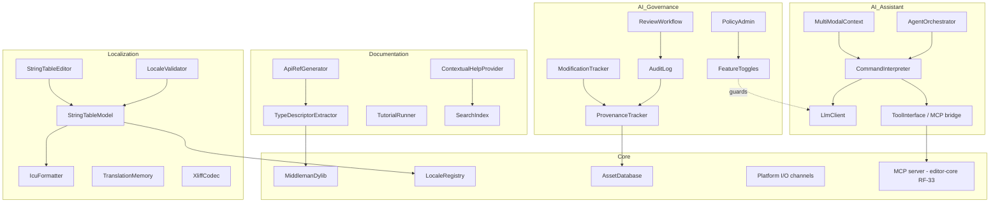
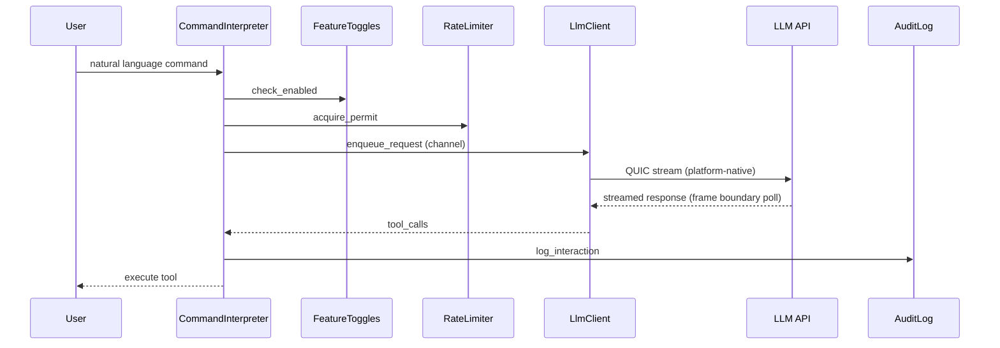
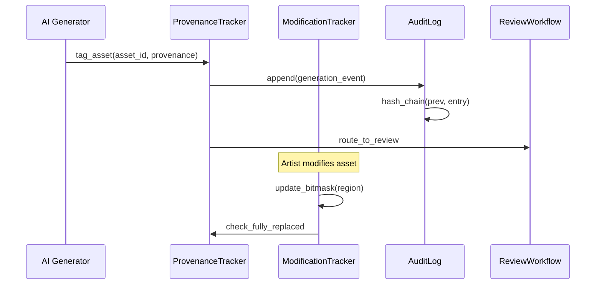
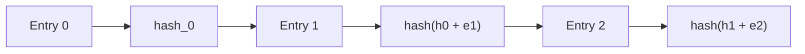

# Content Services Design

## Requirements trace

### Localization editor (F-15.13)

| Feature   | Requirement | User Story          |
|-----------|-------------|---------------------|
| F-15.13.1 | R-15.13.1  | US-15.13.1.1--1.10  |
| F-15.13.2 | R-15.13.2  | US-15.13.2.1--2.9   |
| F-15.13.3 | R-15.13.3  | US-15.13.3.1--3.7   |

1. **F-15.13.1** -- Visual string table editor with ICU, TM, CSV
2. **F-15.13.2** -- Locale preview, validation, pseudo-loc, RTL
3. **F-15.13.3** -- XLIFF workflow, TMS integration, string locks

### Documentation and learning (F-15.19)

| Feature   | Requirement | User Story          |
|-----------|-------------|---------------------|
| F-15.19.1 | R-15.19.1  | US-15.19.1.1--1.5   |
| F-15.19.2 | R-15.19.2  | US-15.19.2.1--2.6   |
| F-15.19.3 | R-15.19.3  | US-15.19.3.1--3.7   |
| F-15.19.4 | R-15.19.4  | US-15.19.4.1--4.5   |
| F-15.19.5 | R-15.19.5  | US-15.19.5.1--5.5   |
| F-15.19.6 | R-15.19.6  | US-15.19.6.1--6.6   |
| F-15.19.7 | R-15.19.7  | US-15.19.7.1--7.5   |

1. **F-15.19.1** -- Auto-generated API reference from codegen type descriptors
2. **F-15.19.2** -- Logic graph node documentation
3. **F-15.19.3** -- Interactive in-editor tutorials
4. **F-15.19.4** -- Embedded video player with chapters
5. **F-15.19.5** -- Contextual help tooltips
6. **F-15.19.6** -- Sample projects and templates
7. **F-15.19.7** -- Inline code examples as doc-tests

### AI governance (F-15.7)

| Feature  | Requirement | User Stories                |
|----------|-------------|-----------------------------|
| F-15.7.1 | R-15.7.1   | US-15.7.1.1--US-15.7.1.5    |
| F-15.7.2 | R-15.7.2   | US-15.7.2.1--US-15.7.2.4    |
| F-15.7.3 | R-15.7.3   | US-15.7.3.1--US-15.7.3.4    |
| F-15.7.4 | R-15.7.4   | US-15.7.4.1--US-15.7.4.4    |
| F-15.7.5 | R-15.7.5   | US-15.7.5.1--US-15.7.5.5    |
| F-15.7.6 | R-15.7.6   | US-15.7.6.1--US-15.7.6.4    |
| F-15.7.7 | R-15.7.7   | US-15.7.7.1--US-15.7.7.6    |
| F-15.7.8 | R-15.7.8   | US-15.7.8.1--US-15.7.8.4    |

1. **F-15.7.1** -- AI content provenance tagging
2. **F-15.7.2** -- Human modification tracking
3. **F-15.7.3** -- Generative AI feature toggle
4. **F-15.7.4** -- AI assistance toggle
5. **F-15.7.5** -- Enterprise remote administration
6. **F-15.7.6** -- AI content audit trail
7. **F-15.7.7** -- AI content review workflow
8. **F-15.7.8** -- Provenance metadata in packaged builds

### AI assistant (F-15.9)

| Feature   | Requirement | User Stories                  |
|-----------|-------------|-------------------------------|
| F-15.9.1a | R-15.9.1a  | US-15.9.1a.1--US-15.9.1a.4   |
| F-15.9.1b | R-15.9.1b  | US-15.9.1b.1--US-15.9.1b.4   |
| F-15.9.1c | R-15.9.1c  | US-15.9.1c.1--US-15.9.1c.4   |
| F-15.9.2  | R-15.9.2   | US-15.9.2.1--US-15.9.2.6     |
| F-15.9.3  | R-15.9.3   | US-15.9.3.1--US-15.9.3.6     |
| F-15.9.4  | R-15.9.4   | US-15.9.4.1--US-15.9.4.4     |
| F-15.9.5  | R-15.9.5   | US-15.9.5.1--US-15.9.5.4     |
| F-15.9.6a | R-15.9.6a  | US-15.9.6a.1--US-15.9.6a.4   |
| F-15.9.6b | R-15.9.6b  | US-15.9.6b.1--US-15.9.6b.4   |
| F-15.9.6c | R-15.9.6c  | US-15.9.6c.1--US-15.9.6c.4   |
| F-15.9.7  | R-15.9.7   | US-15.9.7.1--US-15.9.7.5     |
| F-15.9.8  | R-15.9.8   | US-15.9.8.1--US-15.9.8.5     |
| F-15.9.9  | R-15.9.9   | US-15.9.9.1--US-15.9.9.4     |
| F-15.9.10 | R-15.9.10  | US-15.9.10.1--US-15.9.10.6   |

1. **F-15.9.1a** -- Speech-to-text pipeline
2. **F-15.9.1b** -- Voice command interpretation
3. **F-15.9.1c** -- Voice activation modes
4. **F-15.9.2** -- AI assistant tool interface
5. **F-15.9.3** -- Visual and graphical tool access
6. **F-15.9.4** -- Keyboard shortcut recommendations
7. **F-15.9.5** -- Contextual action reminders
8. **F-15.9.6a** -- Headless editor API layer
9. **F-15.9.6b** -- Agent orchestration
10. **F-15.9.6c** -- CI/CD agent integration
11. **F-15.9.7** -- Screenshot and screen recording
12. **F-15.9.8** -- UI accessibility tree analysis
13. **F-15.9.9** -- Multi-modal understanding
14. **F-15.9.10** -- AI assistance administration

## Overview

Content services cover four editor subsystems that share infrastructure but serve distinct purposes:

1. **Localization** -- string table management, ICU MessageFormat, RTL, font fallback, translation
   memory, XLIFF, pseudo-loc.
2. **Documentation** -- auto-generated API reference from codegen type descriptors (middleman
   .dylib), interactive tutorials, contextual help, search.
3. **AI Governance** -- provenance tagging, modification tracking, feature toggles, tamper-evident
   audit trails, review workflows, enterprise policy administration.
4. **AI Assistant** -- natural language editor commands (voice + text), multi-modal context, LLM
   tool calling, agent orchestration, rate limiting, quotas, provider configuration.

All LLM inference runs on customer-owned infrastructure (see RF-6). No model weights ship with the
engine. The governance layer is always available; the assistant is gated behind toggles (F-15.7.4)
and enterprise policy (F-15.7.5). Backend state services (audit logs, translation memory, provenance
index) use the K8s-native OSS stack: TiKV, Garage, Pingora. No server-side proprietary services —
LLM routing, audit attestation, and analytics are all OSS components deployable by anyone.

`ToolInterface::execute` uses `dyn` dispatch (one dispatch per tool call). This is acceptable: tool
execution is an editor cold path — it never runs on the game loop thread or render thread.

## Architecture

### Module boundaries



### AI request flow



### Provenance and audit data flow



### Audit log hash chain

Hash entries use BLAKE3 (spec:
<https://github.com/BLAKE3-team/BLAKE3-specs/blob/master/blake3.pdf>). Each entry hashes
`prev_hash ++ entry_bytes` for tamper evidence.



### Core data structures


### Cross-subsystem integration

| Subsystem | Direction | Data | Mechanism |
|-----------|-----------|------|-----------|
| Asset pipeline | bidirectional | provenance metadata per asset | Asset metadata API |
| UI framework | consumes | localized strings | `Res<LocaleRegistry>` |
| Scene serialization | bidirectional | string table storage | rkyv companion file |
| Build system | consumes | packaged provenance + string tables | Build pipeline stage |
| Editor core | bidirectional | MCP tool surface for AI | MCP server (editor-core RF-33) |
| Input system | consumes | voice commands (STT) | Platform speech API |
| Data tables | bidirectional | string keys in table cells | `LocalizedStringId` |
| Save system | consumes | locale in save metadata | Save metadata field |
| Team tools | consumes | audit log for compliance | Audit log API |
| Profiler | produces | AI request latency metrics | Profiler tracker |

### ECS integration

Content services is editor-side but integrates with the ECS for frame-phase scheduling and shared
state access.

**Resources:**

| Resource | Type | Owner | Purpose |
|----------|------|-------|---------|
| `Res<LocaleRegistry>` | `LocaleRegistry` | content-services | Active locale + descriptor list |
| `Res<FeatureToggleState>` | `FeatureToggleState` | content-services | AI feature gate flags |
| `Res<ProvenanceIndex>` | `ProvenanceIndex` | content-services | Indexed provenance tags |

**Systems:**

| System | Phase | Reads | Writes |
|--------|-------|-------|--------|
| `localization_resolve_system` | PreUpdate | `Res<LocaleRegistry>` | UI string components |
| `ai_response_poll_system` | frame boundary | QUIC completion channel | `CommandResult` events |
| `provenance_cleanup_system` | asset post-process | `Res<ProvenanceIndex>` | `ModificationBitmask` |

## API design

> **Codegen note.** `ProvenanceTag`, `ModificationBitmask`, `FeatureToggleState`, `ToolDefinition`,
> `LocaleId`, and `StringKey` are codegen'd into the middleman .dylib. Documentation generation
> reads type descriptors from the same .dylib. Hot-reload recompiles the middleman when definitions
> change (sub-3 s target).

### Localization

Algorithm references:

- **ICU MessageFormat** -- pattern syntax and plural rules:
  <https://unicode-org.github.io/icu/userguide/format_parse/messages/>
- **ICU BiDi algorithm** -- Unicode Bidirectional Algorithm (UBA) for RTL:
  <https://unicode.org/reports/tr9/>
- **Translation memory fuzzy match** -- Levenshtein edit distance:
  <https://en.wikipedia.org/wiki/Levenshtein_distance>
- **Trigram search index** -- used by `SearchIndex::build`:
  <https://www.postgresql.org/docs/current/pgtrgm.html>

```rust
#[derive(Clone, Debug, PartialEq, Eq, Hash)]
pub struct LocaleId(pub SmallString<8>);

#[derive(Clone, Debug, PartialEq, Eq, Hash)]
pub struct StringKey(pub SmallString<64>);

pub struct StringTableModel {
    entries: Vec<StringEntry>,
    index: HashMap<StringKey, usize>,
}

impl StringTableModel {
    pub fn get(
        &self,
        key: &StringKey,
    ) -> Option<&StringEntry>;
    pub fn set_translation(
        &mut self,
        key: &StringKey,
        locale: &LocaleId,
        text: String,
    ) -> Result<(), LocaleError>;
    pub fn missing_count(
        &self,
        locale: &LocaleId,
    ) -> u32;
}

pub struct IcuFormatter {
    locale: LocaleId,
    plural_rules: PluralRules,
}

impl IcuFormatter {
    pub fn validate_pattern(
        &self,
        pattern: &str,
    ) -> Result<(), IcuPatternError>;
    pub fn format(
        &self,
        pattern: &str,
        args: &HashMap<String, FormatArg>,
    ) -> Result<String, IcuFormatError>;
}

pub struct TranslationMemory { /* ... */ }

impl TranslationMemory {
    pub fn index(
        &mut self,
        source: &str,
        translation: &str,
        locale: &LocaleId,
    );
    pub fn suggest(
        &self,
        source: &str,
        locale: &LocaleId,
        max_results: u32,
    ) -> Vec<TmSuggestion>;
}
```

### AI governance: Provenance

```rust
// rkyv: zero-copy mmap access for provenance index on disk.
#[derive(Clone, Debug, rkyv::Archive, rkyv::Serialize, rkyv::Deserialize)]
pub struct ProvenanceTag {
    pub asset_id: AssetId,
    pub ai_system: AiSystemId,
    pub model_version: String,
    pub timestamp_utc: u64,
    pub prompt_hash: Blake3Hash,
    pub triggered_by: UserId,
    pub fully_replaced: bool,
}

pub struct ProvenanceTracker { /* ... */ }

impl ProvenanceTracker {
    /// Queues tag write via crossbeam-channel; audit log entry appended at frame boundary.
    pub fn tag_asset(
        &mut self,
        asset_id: AssetId,
        ai_system: AiSystemId,
        model_version: &str,
        prompt_hash: Blake3Hash,
        user: UserId,
        audit_log: &mut AuditLog,
    ) -> Result<(), GovernanceError>;
    pub fn has_provenance(
        &self,
        asset_id: AssetId,
    ) -> bool;
    pub fn query_assets(
        &self,
        filter: &ProvenanceFilter,
    ) -> Vec<AssetId>;
}
```

### AI governance: Modification tracking

```rust
#[derive(Clone, Debug, rkyv::Archive, rkyv::Serialize, rkyv::Deserialize)]
pub struct ModificationBitmask {
    pub asset_id: AssetId,
    pub granularity: TrackingGranularity,
    pub bitmask: Vec<u64>,
    pub region_count: u32,
}

impl ModificationBitmask {
    pub fn mark_modified(&mut self, region: u32);
    pub fn modification_pct(&self) -> f32;
    pub fn is_fully_replaced(&self) -> bool;
}

pub struct ModificationTracker { /* ... */ }

impl ModificationTracker {
    pub fn start_tracking(
        &mut self,
        asset_id: AssetId,
        granularity: TrackingGranularity,
        region_count: u32,
    );
    /// Queues audit entry via crossbeam-channel; flushed at frame end.
    pub fn record_modification(
        &mut self,
        asset_id: AssetId,
        region: u32,
        audit_log: &mut AuditLog,
    ) -> Result<(), GovernanceError>;
}
```

### AI governance: Feature toggles

```rust
#[derive(Clone, Debug, rkyv::Archive, rkyv::Serialize, rkyv::Deserialize)]
pub struct FeatureToggleState {
    pub generative_ai_enabled: bool,
    pub assistance_enabled: bool,
    pub policy_version: u64,
    pub policy_signature: Option<Ed25519Signature>,
}

pub struct FeatureToggles { /* ... */ }

impl FeatureToggles {
    pub fn is_generative_enabled(&self) -> bool;
    pub fn is_assistance_enabled(&self) -> bool;
    /// Validates signature, updates state. Runs at editor startup or on policy change.
    pub fn apply_policy(
        &mut self,
        policy: &PolicyDocument,
    ) -> Result<(), GovernanceError>;
}
```

### AI assistant provider configuration

```rust
/// Stored in OS keychain; never sent to Harmonius servers.
pub struct LlmProviderConfig {
    pub endpoint: String,
    pub model: String,
    pub rate_limit_rpm: u32,
    pub cost_budget_usd: Option<f32>,
    // API key read from OS keychain at request time — not stored in memory
}

pub struct LlmKeychain { /* ... */ }

impl LlmKeychain {
    /// Reads from OS keychain: macOS Keychain, Windows Credential Manager, Linux Secret Service.
    pub fn read_api_key(&self, provider: &str) -> Result<String, KeychainError>;
    pub fn store_api_key(&self, provider: &str, key: &str) -> Result<(), KeychainError>;
    pub fn delete_api_key(&self, provider: &str) -> Result<(), KeychainError>;
}
```

### AI assistant

```rust
pub struct CommandInterpreter { /* ... */ }

impl CommandInterpreter {
    /// Enqueues QUIC request; result polled via `ai_response_poll_system` at frame boundary.
    pub fn process_command(
        &self,
        context: MultiModalContext,
        user: UserId,
        acl: &ToolAccessControl,
    ) -> Result<CommandHandle, AssistantError>;
    /// Called by `ai_response_poll_system` when QUIC completion arrives.
    pub fn poll_result(
        &self,
        handle: CommandHandle,
    ) -> Option<Result<CommandResult, AssistantError>>;
}

/// Bridges to the MCP server from editor-core RF-33.
/// External agents (Claude Code, Cursor, Copilot) and the built-in assistant share
/// the same tool surface — no separate registry.
pub struct ToolInterface { /* ... */ }

impl ToolInterface {
    /// Registers a tool both locally and as an MCP tool on the shared server.
    pub fn register_tool(
        &mut self,
        definition: ToolDefinition,
    );
    /// Synchronous; `dyn` dispatch acceptable — editor cold path (see RF-16).
    pub fn execute(
        &self,
        call: ToolInvocation,
        acl: &ToolAccessControl,
    ) -> Result<ToolResult, ToolError>;
}

pub struct AgentOrchestrator { /* ... */ }

impl AgentOrchestrator {
    pub fn create_agent(&mut self) -> AgentId;
    /// Enqueues agent command; result polled via `ai_response_poll_system`.
    pub fn run_command(
        &self,
        agent: AgentId,
        context: MultiModalContext,
        user: UserId,
        acl: &ToolAccessControl,
    ) -> Result<CommandHandle, AssistantError>;
    pub fn terminate_agent(
        &mut self,
        agent: AgentId,
    ) -> Result<(), AssistantError>;
}
```

## Data flow

### Localization workflow

1. Designer edits string via `StringTableEditor`.
2. `IcuFormatter::validate_pattern()` checks syntax.
3. `TranslationMemory::index()` indexes the pair.
4. `LocaleValidator::validate()` checks missing, overflow, RTL.
5. `XliffCodec::encode()` exports for external TMS.
6. After translation, `XliffCodec::decode()` imports results.

### AI content pipeline

1. AI generator creates content and calls `ProvenanceTracker::tag_asset()`.
2. Tag is persisted in asset metadata. Audit log entry appended with hash chain.
3. `ReviewWorkflow` routes AI-generated assets to reviewers.
4. Artist modifications update `ModificationBitmask`.
5. When 100% replaced, provenance tag auto-removes.
6. `PackagedProvenance` embeds minimal flags in shipped builds.

### LLM provider request (thin client)

1. User issues command; `CommandInterpreter::process_command()` is called.
2. `LlmKeychain::read_api_key()` retrieves key from OS keychain at request time.
3. `LlmClient` opens a QUIC stream directly to the customer's provider endpoint.
4. No Harmonius server is involved — traffic goes editor → provider.
5. `ai_response_poll_system` polls QUIC completions at frame boundary.
6. `AuditLog` records the interaction locally (provider, model, timestamp, prompt hash).

### Documentation generation

1. `TypeDescriptorExtractor` reads codegen'd type descriptors from the middleman .dylib.
2. `ApiRefGenerator` renders HTML with cross-references.
3. `SearchIndex` builds trigram index for instant search.
4. `VersionedDocStore` stores docs keyed by engine version.

### Game loop phase assignments

| System | Phase | Mechanism |
|--------|-------|-----------|
| `localization_resolve_system` | PreUpdate (UI layout) | Reads `Res<LocaleRegistry>` |
| `ai_response_poll_system` | frame boundary (main thread) | Polls QUIC completions |
| `provenance_cleanup_system` | asset post-process phase | Checks bitmask → removes tag |
| feature toggle apply | editor startup + on change | `FeatureToggles::apply_policy` |
| audit log flush | frame end (fire-and-forget) | crossbeam-channel → main thread |

## Platform considerations

### Editor platform matrix

| Component | Windows | macOS | Linux | iOS | Android | Consoles |
|-----------|---------|-------|-------|-----|---------|----------|
| Font shaping | DirectWrite | CoreText | HarfBuzz | CoreText | FreeType | N/A |
| RTL layout | Uniscribe | CoreText | ICU BiDi | CoreText | ICU BiDi | N/A |
| Video decode | Media Foundation | AVFoundation | GStreamer | AVFoundation | MediaCodec | N/A |
| Speech-to-text | SAPI | Speech.framework | Vosk / PipeWire | Speech.framework | SpeechRecognizer | N/A |
| Screen capture | DXGI Desktop Dup | ScreenCaptureKit | PipeWire | ReplayKit | MediaProjection | N/A |
| API keychain | Credential Manager | Keychain | Secret Service | Keychain | Keystore | N/A |

Notes:

1. **iOS / Android** -- editor support is conditional (tablet form factor). Consoles have no editor.
2. **Linux speech** -- Vosk (offline, Apache 2.0) preferred over cloud STT for privacy.
3. **Secret Service** -- accessed via `libsecret` on Linux; falls back to file-based keyring.

## Test plan

Test cases are in [content-services-test-cases.md](content-services-test-cases.md).

| Category | Count |
|----------|-------|
| Unit tests | 50 |
| Integration tests | 15 |
| Benchmarks | 6 |

1. **Unit** -- ICU pattern validation, plural category selection, translation memory fuzzy match,
   XLIFF round-trip, pseudo-loc transform, locale validation categories, provenance tag CRUD,
   modification bitmask ops, audit hash chain, feature toggle persistence, tool registration, rate
   limiter token bucket, contextual help lookup, search index query
2. **Integration** -- Full localization pipeline, XLIFF export/import, API reference generation,
   provenance-to-review workflow, policy distribution, LLM tool execution round-trip, multi-modal
   context assembly
3. **Benchmarks** -- Targets from R-X.Y.Za (see companion test cases):

| Benchmark | Target |
|-----------|--------|
| TM lookup (100K entries) | < 5 ms |
| Search query (full-text) | < 10 ms p99 |
| Audit log append | > 100K entries/s |
| LLM round-trip (editor to provider) | < 2 s p50 |
| Provenance query (50K assets) | < 50 ms |
| String table load (10K keys) | < 5 ms |
| Feature toggle apply | < 1 ms |

## Marketplace

The marketplace is open infrastructure — hostable by anyone, not a proprietary Harmonius service. No
server-side proprietary tech. The backend is an OSS Rust service on K8s (Helm + custom operator)
using TiKV, Garage, and Pingora. Anyone can run their own instance.

### Public marketplace

| Item | Detail |
|------|--------|
| Backend | OSS Rust service; same code anyone can deploy |
| Default URL | Official Harmonius instance; default in editor |
| Royalty | Harmonius % cut on official instance; free assets exempt |
| Payouts | Stripe Connect or equivalent |
| Listing upload | `harmonius marketplace publish` CLI or editor panel |
| Review | Automated: unsafe-code check, version compat, license; community ratings |

Asset types sold: 3D meshes, textures, materials, animations, 2D sprites, tilesets, sprite sheets,
VFX templates, audio (SFX / music / ambience), logic graph templates, editor plugins, prefabs, scene
templates, data table templates, fonts, UI themes, widget packs.

### Private marketplace

| Item | Detail |
|------|--------|
| Hosting | Self-hosted via same OSS code; URL set in project settings |
| Access | Team members only; OAuth or API token auth |
| Keychain | Credentials in OS keychain (Keychain / Credential Manager / Secret Service) |
| Royalties | None — company owns the infrastructure |

### Editor integration

1. **Browser panel** -- browse, search, filter, preview from all configured marketplaces (official
   - private). Multiple sources appear as tabs or unified search with source badges.
2. **One-click install** -- downloads package to `plugins/` or `assets/`. Triggers middleman
   recompile if package contains logic graphs or components. Hot-reload — no restart.
3. **Update management** -- editor checks installed packages for updates. "Update All" button.
4. **Dependency resolution** -- packages declare semver dependencies; installer resolves the full
   graph including transitive deps. See also build-deploy.md RF-24 item 11.
5. **License report** -- tracks licenses of all installed packages. Warns on incompatible combos
   (e.g., GPL asset in a proprietary game).

### Marketplace protocol

All communication (browse, search, download, upload, auth) uses platform-native QUIC (quinn-proto /
Networking.framework / MsQuic). No HTTP/HTTPS. All payloads use rkyv.

```rust
// Versioned binary API over QUIC streams; all payloads rkyv-serialized.
fn search(query: &str, filters: SearchFilters) -> Vec<ListingPreview>;
fn get_listing(id: ListingId) -> ListingDetail;
fn download(id: ListingId, version: SemVer) -> PackageStream;
fn upload(package: PackageData) -> Result<ListingId, MarketplaceError>;
fn rate(id: ListingId, rating: u8, review: &str) -> Result<(), MarketplaceError>;
fn list_updates(installed: &[InstalledPackage]) -> Vec<UpdateAvailable>;
```

## Open questions

1. **Translation memory scope.** Should TM be per-project, per-team, or global across all studio
   projects?
2. **Audit log immutability.** Current hash-chain design prevents tampering. Should we add external
   attestation (e.g., blockchain anchor) for legal compliance?
3. **Voice command latency.** On-device speech-to-text vs. cloud STT for responsiveness vs. accuracy
   tradeoff?
4. **AI provider fallback chain.** When the primary LLM provider is unavailable, should the
   assistant fall back to a local model or fail gracefully?

## Review feedback

### RF-1: Remove all Reflect derives and TypeRegistry

Remove `Reflect` from all types. Remove `TypeRegistry` and `ReflectMetadataExtractor` from the
architecture. Documentation generation consumes codegen'd type descriptors from the middleman
.dylib, not runtime reflection.

### RF-2: Remove async/await from editor-side code

Convert all 6 editor-side `async fn` to synchronous. LLM requests queued via crossbeam-channel,
results arrive as jobs at frame boundaries. Backend K8s services may use Tokio — the editor may not.

### RF-3: Remove Tokio from editor architecture

Remove `IO[Tokio runtime]` from the architecture diagram. Editor uses platform-native I/O
(io_uring/IOCP/GCD) + crossbeam-channel.

### RF-4: K8s-native OSS stack

Replace "self-hosted AWS infrastructure" with Kubernetes:

- TiKV for state (audit logs, translation memory, provenance)
- Garage for model/asset storage (S3-compatible)
- Pingora as reverse proxy / CDN
- Helm + custom Rust K8s operator for deployment
- No AWS CDK, no proprietary cloud services

### RF-5: QUIC transport

Replace HTTPS with QUIC. Editor communicates with backend services via platform-native QUIC
(quinn-proto / Networking.framework / MsQuic). Sequence diagram shows QUIC streams, not HTTP POST.

### RF-6: Customer API key model

Document the thin client model explicitly:

1. Customers bring their own LLM API keys (Claude, OpenAI, etc.)
2. Keys stored locally in the OS keychain (macOS Keychain, Windows Credential Manager, Linux Secret
   Service) — never sent to Harmonius servers
3. Requests go directly from the editor to the customer's chosen provider endpoint — no Harmonius
   proxy
4. Provider configuration in editor preferences: endpoint URL, API key, model selection, rate limit,
   cost budget
5. The engine never proxies, logs, or bills for LLM usage — the customer pays their provider
   directly
6. For self-hosted LLM inference, the customer deploys their own model server; the editor connects
   to it like any other provider

### RF-7: Codegen/middleman .dylib integration

Provenance tags, modification bitmasks, feature toggle states, tool definitions, and localization
structs are codegen'd into the middleman .dylib. Documentation generation consumes codegen'd type
descriptors. Hot-reload recompiles the middleman when definitions change.

### RF-8: MCP integration

The AI Assistant's `ToolInterface` must build on the MCP server from editor-core.md RF-33. Agent
orchestration routes through the MCP so external AI tools (Claude Code, Cursor, Copilot) and the
built-in assistant share the same tool surface. Tools exposed via MCP are the SAME tools the
assistant uses — no separate tool registry.

### RF-9: rkyv serialization

All persistent data: provenance tags, audit log entries, string tables, translation memory,
modification bitmasks, policy documents use rkyv for zero-copy serialization.

### RF-10: Benchmark numeric targets

| Benchmark | Target |
|-----------|--------|
| TM lookup (100K entries) | < 5 ms |
| Search query (full-text) | < 10 ms p99 |
| Audit log append | > 100K entries/s |
| LLM round-trip (editor → provider) | < 2 s p50 |
| Provenance query (50K assets) | < 50 ms |
| String table load (10K keys) | < 5 ms |
| Feature toggle apply | < 1 ms |

### RF-11: Game loop phase and frame-boundary handoff

- Localization string resolution: runs in UI layout phase (PreUpdate)
- AI request polling: runs at frame boundary (main thread polls QUIC completions)
- Provenance tagging: runs in asset post-process phase
- Feature toggle application: runs at editor startup + on change
- Audit log flush: fire-and-forget at frame end

### RF-12: Cross-subsystem integration table

| Subsystem | Direction | Data | Mechanism |
|-----------|-----------|------|-----------|
| Asset pipeline | bidirectional | provenance metadata per asset | Asset metadata API |
| UI framework | consumes | localized strings | LocalizationManager resource |
| Scene serialization | bidirectional | string table storage | rkyv companion file |
| Build system | consumes | packaged provenance + string tables | Build pipeline stage |
| Editor core | bidirectional | MCP tool surface for AI | MCP server (RF-33) |
| Input system | consumes | voice commands (STT) | Platform speech API |
| Data tables | bidirectional | string keys in table cells | LocalizedStringId |
| Save system | consumes | locale in save metadata | Save metadata field |
| Team tools | consumes | audit log for compliance | Audit log API |
| Profiler | produces | AI request latency metrics | Profiler tracker |

### RF-13: Algorithm reference URLs

Add URLs for: BLAKE3 hash chain (BLAKE3 spec), ICU MessageFormat (Unicode docs), trigram indexing,
fuzzy string matching (edit distance or BM25).

### RF-14: Complete test cases file

Remove "until migration is complete" stub. Add Input and Expected Output columns to every test case
row.

### RF-15: ECS integration

Define ECS resources: `Res<LocaleRegistry>`, `Res<FeatureToggleState>`, `Res<ProvenanceIndex>`.
Define systems: `localization_resolve_system`, `provenance_cleanup_system`,
`ai_response_poll_system`. Content services is editor-side but ECS integration should be explicit.

### RF-16: Clarify dispatch and server-side model

`ToolInterface::execute` uses dynamic dispatch — acceptable for editor cold path. Document
justification. No server-side proprietary tech — everything is open source. LLM inference routing,
audit attestation, and analytics backend are all OSS components deployable by anyone.

### RF-17: Expand platform considerations

| Platform | Speech API | Keychain | Notes |
|----------|-----------|----------|-------|
| Windows | Windows Speech | Credential Manager | Full editor |
| macOS | Speech.framework | Keychain | Full editor |
| Linux | Vosk / PipeWire | Secret Service | Full editor |
| iOS | Speech.framework | Keychain | If editor on iPad |
| Android | SpeechRecognizer | Keystore | If editor on tablet |
| Consoles | N/A | N/A | No editor |

### RF-18: Fix heading case

Convert all title-case headings to sentence case.

### RF-19: Asset and plugin marketplace

The marketplace is open infrastructure — hostable by anyone, not a proprietary Harmonius service. No
server-side proprietary tech.

#### Official public marketplace

1. **Open source marketplace server** — the marketplace backend is an OSS Rust service deployable on
   K8s (Helm + custom operator). Uses the OSS stack: TiKV for metadata, Garage for asset storage,
   Pingora as CDN/reverse proxy. Anyone can host their own marketplace.
2. **Official instance** — Harmonius hosts the official public marketplace at a well-known URL. This
   is the default marketplace configured in the editor. It uses the same OSS code that anyone else
   can deploy.
3. **Royalty model** — Harmonius collects a royalty percentage on sales made through the official
   public marketplace. Sellers set their price; Harmonius takes a cut (percentage configurable,
   e.g., 30%). Sellers receive payouts via Stripe Connect or equivalent. Free assets have no
   royalty.
4. **Asset types sold:**
   - 3D meshes, textures, materials, animations
   - 2D sprites, tilesets, sprite sheets
   - VFX effects, particle templates
   - Audio (SFX, music, ambience)
   - Logic graph templates (gameplay systems, AI behaviors)
   - Editor plugins (custom tools, panels, importers)
   - Prefabs and complete scene templates
   - Data table templates (item databases, ability tables)
   - Fonts, UI themes, widget packs
5. **Listing** — sellers upload packages via the CLI (`harmonius marketplace publish`) or the
   editor's marketplace panel. Each listing has: name, description, screenshots, tags, price,
   license, engine version compatibility, dependency list.
6. **Review** — optional review process for the official marketplace (automated validation: no
   unsafe code, engine version compat, license compliance). Community ratings and reviews.

#### Private marketplace (company-hosted)

7. **Self-hosted** — companies deploy their own marketplace server using the same OSS code.
   Configured in the editor via a custom marketplace URL in project settings.
8. **Company-specific assets** — proprietary assets, internal tools, studio-specific prefabs. Only
   team members with access can browse and install.
9. **No royalties on private** — self-hosted marketplaces have no royalty to Harmonius. The company
   owns and operates the infrastructure.
10. **Authentication** — private marketplace uses OAuth or API tokens. Credentials stored in the OS
    keychain.

#### Editor integration

11. **Marketplace browser panel** — browse, search, filter, and preview assets from any configured
    marketplace (official + private). Multiple marketplaces appear as tabs or a unified search with
    source badges.
12. **One-click install** — click "Install" to download the package to the project's `plugins/` or
    `assets/` directory. Triggers middleman recompilation if the package contains logic graphs or
    components. Hot-reload — no restart.
13. **Update management** — the editor checks all installed marketplace packages for updates.
    "Update All" button. Per-package update control.
14. **Dependency resolution** — packages declare dependencies on other packages. The installer
    resolves the dependency graph and installs transitive dependencies. Version constraints via
    semver ranges. Cross-reference build-deploy.md RF-24 item 11.
15. **License compliance** — the editor tracks licenses of all installed packages. A "License
    Report" view lists all packages with their licenses. Warning if incompatible licenses are
    combined (e.g., GPL asset in a proprietary game).

#### Protocol

16. **QUIC transport** — all marketplace communication (browse, search, download, upload, auth) uses
    QUIC via the platform-native stack (quinn-proto / Networking.framework / MsQuic). No HTTP/HTTPS.
    The marketplace server exposes a QUIC API.
17. **API** — the marketplace protocol is a versioned binary API over QUIC streams:
    - `search(query, filters) -> Vec<ListingPreview>`
    - `get_listing(id) -> ListingDetail`
    - `download(id, version) -> PackageStream`
    - `upload(package) -> Result<ListingId>`
    - `rate(id, rating, review) -> Result<()>`
    - `list_updates(installed) -> Vec<UpdateAvailable>`
    All payloads use rkyv for zero-copy serialization.
