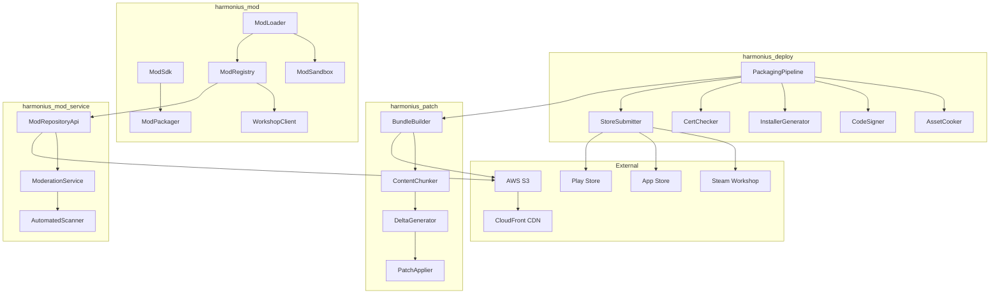
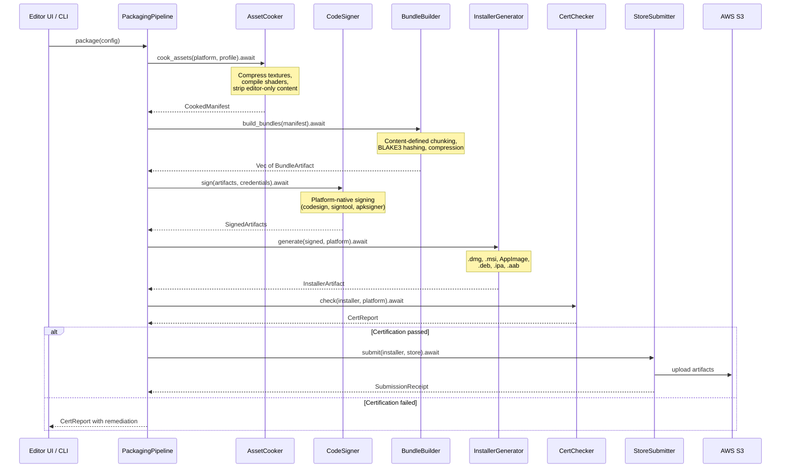
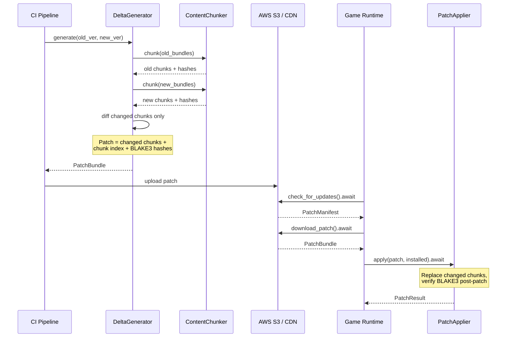
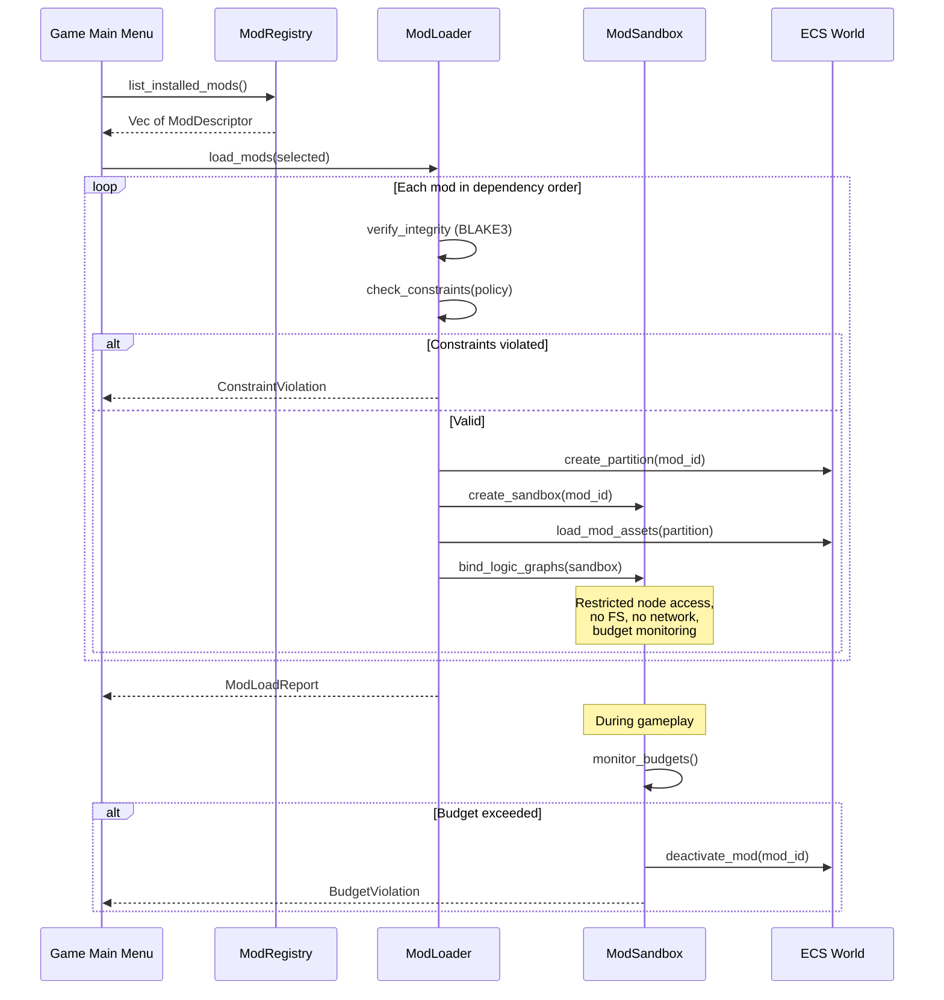
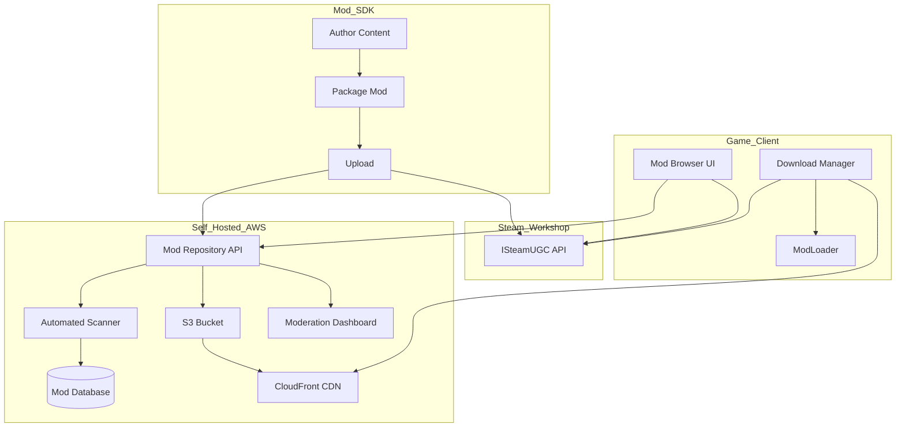

# Deployment and Mod Support Design

## Requirements Trace

> **Canonical sources:** Features, requirements, and user stories are defined in
> [features/tools-editor/](../../features/tools-editor/),
> [requirements/tools-editor/](../../requirements/tools-editor/), and
> [user-stories/tools-editor/](../../user-stories/tools-editor/). The table below traces design
> elements to those definitions.

### Build and Deployment (F-15.14)

| Feature | Requirement | Description |
|---------|-------------|-------------|
| F-15.14.1 | R-15.14.1 | Platform build packaging (macOS, Windows, Linux, iOS, Android, console) |
| F-15.14.2 | R-15.14.2 | Deploy-to-device workflow with incremental transfer |
| F-15.14.3 | R-15.14.3 | Certification compliance checker per platform |
| F-15.14.4 | R-15.14.4 | Code signing pipeline (codesign, signtool, apksigner, notarization) |
| F-15.14.5 | R-15.14.5 | Platform-specific installers (.dmg, .msi, AppImage, .deb, Flatpak) |
| F-15.14.6 | R-15.14.6 | Asset bundle and DLC packaging with entitlement gating |
| F-15.14.7 | R-15.14.7 | Delta patching via content-defined chunking |
| F-15.14.8 | R-15.14.8 | Store distribution pipeline (Steam, App Store, Windows Store, Xbox) |

### Mod Support (F-15.16)

| Feature | Requirement | Description |
|---------|-------------|-------------|
| F-15.16.1 | R-15.16.1 | Mod SDK — standalone authoring toolkit |
| F-15.16.2 | R-15.16.2 | Developer-defined mod constraints (asset, node, budget, region) |
| F-15.16.3 | R-15.16.3 | Mod packaging and distribution format |
| F-15.16.4 | R-15.16.4 | Mod loading, sandboxing, and budget enforcement |
| F-15.16.5 | R-15.16.5 | Mod workshop integration (Steam Workshop + self-hosted) |
| F-15.16.6 | R-15.16.6 | Mod moderation and review dashboard |

## Overview

This document covers two tightly coupled domains:

1. **Build and deployment** — packaging game projects into platform-native distributables, signing
   them, generating installers, running certification checks, producing delta patches, and
   submitting to stores.
2. **Mod support** — a mod SDK for content authoring, a sandboxed mod runtime, a packaging format,
   and distribution through Steam Workshop or a self-hosted AWS mod repository.

Both domains share the asset bundle format, BLAKE3 integrity verification, and the self-hosted AWS
infrastructure. The mod packaging pipeline reuses the same `BundleBuilder` and `ContentChunker` as
the deployment pipeline.

All I/O is async. All network requests go through the engine's `IoReactor`. No stdlib file I/O.
Static dispatch throughout. Rust stable only.

## Architecture

### Module Boundaries



### Crate Layout

```text
harmonius_deploy/
├── pipeline.rs       # PackagingPipeline orchestrator
├── cooker.rs         # AssetCooker — platform cooking
├── signer.rs         # CodeSigner — per-platform
│                     # signing dispatch
├── installer.rs      # InstallerGenerator — .dmg,
│                     # .msi, AppImage, .deb, Flatpak
├── cert.rs           # CertChecker — certification
│                     # rule runner
├── store.rs          # StoreSubmitter — SteamCMD,
│                     # Transporter, Partner Center
└── config.rs         # PackageConfig, BuildProfile

harmonius_patch/
├── bundle.rs         # BundleBuilder — pak file
│                     # assembly, BLAKE3 manifests
├── chunker.rs        # ContentChunker — CDC
├── delta.rs          # DeltaGenerator — binary diff
├── applier.rs        # PatchApplier — runtime apply
└── manifest.rs       # BundleManifest, PatchManifest

harmonius_mod/
├── sdk.rs            # ModSdk — editor subset
│                     # with mod-mode restrictions
├── packager.rs       # ModPackager — mod bundle
│                     # creation
├── loader.rs         # ModLoader — integrity check,
│                     # constraint validation, load
├── sandbox.rs        # ModSandbox — isolated ECS
│                     # partition, node restrictions
├── registry.rs       # ModRegistry — installed mod
│                     # database, update checking
├── workshop.rs       # WorkshopClient — Steam UGC
│                     # API wrapper
└── policy.rs         # ModPolicy — constraint defs

harmonius_mod_service/
├── api.rs            # REST API — mod repository
├── moderation.rs     # ModerationService — approve,
│                     # reject, revoke
├── scanner.rs        # AutomatedScanner — budget,
│                     # restricted nodes, malware
└── storage.rs        # S3 upload/download helpers
```

### Build Packaging Pipeline



### Delta Patching Data Flow



### Mod Loading and Sandboxing



### Mod Workshop and Repository



### Core Data Structures

```mermaid
classDiagram
    class BuildConfig {
        +TargetPlatform platform
        +BuildProfile profile
        +Vec~AssetId~ content
        +ShippingMode shipping_mode
    }

    class TargetPlatform {
        <<enum>>
        Windows
        MacOs
        Linux
        Ios
        Android
        Xbox
        PlayStation
        NintendoSwitch
        SteamOs
    }

    class BuildProfile {
        <<enum>>
        Development
        Staging
        Shipping
    }

    class ShippingMode {
        <<enum>>
        Standalone
        Storefront(StoreConfig)
    }

    class AssetCooker {
        -reactor IoReactor
        -pool ThreadPool
        +cook(assets, platform) Future~CookResult~
    }

    class BundleBuilder {
        -chunker ContentChunker
        +build(cooked, config) Future~BundleSet~
    }

    class BundleSet {
        +Vec~AssetBundle~ bundles
        +BundleManifest manifest
    }

    class AssetBundle {
        +BundleId id
        +Vec~AssetId~ assets
        +u64 size_bytes
        +[u8; 32] blake3_hash
        +Option~EntitlementId~ entitlement
    }

    class CodeSigner {
        +sign(artifact, platform) Future~SignedArtifact~
    }

    class SignedArtifact {
        +ArtifactPath path
        +[u8; 32] hash
        +bool notarized
    }

    class CertChecker {
        +check(artifact, platform) Future~CertReport~
    }

    class CertReport {
        +bool passed
        +Vec~CertResult~ results
    }

    class CertResult {
        +String rule_id
        +bool passed
        +String description
        +Option~String~ remediation
    }

    class InstallerFormat {
        <<enum>>
        Dmg
        Msi
        AppImage
        Deb
        Flatpak
        Ipa
        Aab
        SteamOs
    }

    class InstallerGenerator {
        +generate(signed, format, meta) Future~InstallerArtifact~
    }

    class StoreConfig {
        <<enum>>
        Steam
        AppStore
        WindowsStore
        Xbox
    }

    class StoreSubmitter {
        +submit(artifact, config) Future~SubmissionReceipt~
        +poll_status(receipt) Future~SubmissionStatus~
    }

    class SubmissionStatus {
        <<enum>>
        Pending
        InReview
        Approved
        Rejected
    }

    class ContentChunker {
        +chunk(data) Vec~Chunk~
    }

    class DeltaGenerator {
        +generate(old, new) Future~PatchBundle~
    }

    class PatchApplier {
        +apply(patch, dir) Future~PatchResult~
    }

    class DeviceManager {
        +list_devices() Future~Vec~DeviceInfo~~
        +deploy(device, build, args) Future~DeployResult~
    }

    class ModPolicy {
        +Vec~AssetType~ allowed_asset_types
        +Vec~NodeCategory~ allowed_node_categories
        +Vec~NodeCategory~ blocked_node_categories
        +u64 memory_budget_bytes
        +u32 entity_budget
    }

    class ModManifest {
        +ModId mod_id
        +String name
        +SemVer version
        +SemVerRange engine_compat
        +Vec~ModDependency~ dependencies
        +[u8; 32] content_hash
        +Option~[u8; 64]~ signature
    }

    class ModLoader {
        +load(mods, world) Future~ModLoadReport~
        +unload(mod_id, world) Future~Result~
    }

    class ModSandbox {
        +bind_logic_graphs(graphs) Result
        +check_budgets(world) Option~ConstraintViolation~
        +deactivate(world)
    }

    class ConstraintViolation {
        <<enum>>
        ExceedsMemoryBudget
        ExceedsEntityBudget
        RestrictedAssetType
        RestrictedNodeCategory
        OutsideModdableRegion
    }

    class ModRegistry {
        +list_installed() Vec~ModDescriptor~
        +check_updates() Future~Vec~
        +install(source) Future~ModId~
        +uninstall(mod_id) Future~Result~
    }

    class ModDistribution {
        <<enum>>
        SteamWorkshop
        SelfHosted
        Local
    }

    class ModerationService {
        +scan(bundle, policy) Future~ScanReport~
        +approve(mod_id, moderator) Future~Result~
        +reject(mod_id, reason, moderator) Future~Result~
        +revoke(mod_id, reason, moderator) Future~Result~
    }

    BuildConfig --> TargetPlatform
    BuildConfig --> BuildProfile
    BuildConfig --> ShippingMode
    ShippingMode --> StoreConfig
    AssetCooker --> BuildConfig : input
    BundleBuilder --> BundleSet
    BundleSet --> AssetBundle
    CodeSigner --> SignedArtifact
    CertChecker --> CertReport
    CertReport --> CertResult
    InstallerGenerator --> InstallerFormat
    StoreSubmitter --> SubmissionStatus
    DeltaGenerator --> ContentChunker
    ModLoader --> ModSandbox
    ModSandbox --> ConstraintViolation
    ModManifest --> ModPolicy : constrained by
    ModRegistry --> ModDistribution
    ModRegistry --> ModDescriptor
    ModerationService --> ModPolicy
```



## API Design

### Build Configuration

```rust
/// Build profile controlling optimization and
/// content inclusion.
#[derive(Clone, Copy, Debug, PartialEq, Eq)]
pub enum BuildProfile {
    /// Full debug symbols, no optimization,
    /// editor content included.
    Debug,
    /// Partial optimization, profiling enabled,
    /// editor content included.
    Development,
    /// Full optimization, symbols stripped,
    /// editor content excluded.
    Shipping,
}

/// Target platform for packaging.
#[derive(Clone, Copy, Debug, PartialEq, Eq)]
pub enum TargetPlatform {
    Windows,
    MacOs,
    Linux,
    Ios,
    Android,
    SteamOs,
    PlayStation,
    Xbox,
    NintendoSwitch,
}

/// Full packaging configuration.
pub struct PackageConfig {
    pub platform: TargetPlatform,
    pub profile: BuildProfile,
    /// Output directory for packaged artifacts.
    pub output_dir: PathBuf,
    /// Signing credentials resolved from
    /// platform keychain.
    pub signing: Option<SigningConfig>,
    /// Store submission target, if any.
    pub store: Option<StoreConfig>,
    /// Asset bundles to include. Empty = all.
    pub bundle_filter: Vec<BundleId>,
}
```

### Packaging Pipeline

```rust
/// Orchestrates the full packaging pipeline.
pub struct PackagingPipeline {
    cooker: AssetCooker,
    bundler: BundleBuilder,
    signer: CodeSigner,
    installer: InstallerGenerator,
    cert_checker: CertChecker,
    store_submitter: StoreSubmitter,
}

impl PackagingPipeline {
    pub fn new(
        reactor: &IoReactor,
        pool: &ThreadPool,
    ) -> Self;

    /// Run the full packaging pipeline. Each stage
    /// is async and reports progress via the
    /// callback.
    pub async fn package(
        &self,
        config: &PackageConfig,
        progress: impl Fn(PipelineStage, f32)
            + Send,
    ) -> Result<PackageResult, PackageError>;

    /// Run only asset cooking (for iteration).
    pub async fn cook_only(
        &self,
        config: &PackageConfig,
    ) -> Result<CookedManifest, CookError>;
}

#[derive(Clone, Copy, Debug, PartialEq, Eq)]
pub enum PipelineStage {
    Cooking,
    Bundling,
    Signing,
    InstallerGeneration,
    CertificationCheck,
    StoreSubmission,
}

pub struct PackageResult {
    pub artifacts: Vec<ArtifactPath>,
    pub cert_report: CertReport,
    pub submission: Option<SubmissionReceipt>,
}
```

### Asset Cooker

```rust
/// Cooks project assets for a target platform.
pub struct AssetCooker { /* ... */ }

impl AssetCooker {
    pub fn new(
        reactor: &IoReactor,
        pool: &ThreadPool,
    ) -> Self;

    /// Cook all assets for the target platform.
    /// Compresses textures, compiles shaders,
    /// strips editor-only content per profile.
    pub async fn cook(
        &self,
        platform: TargetPlatform,
        profile: BuildProfile,
        asset_db: &AssetDatabase,
    ) -> Result<CookedManifest, CookError>;
}

/// Manifest of all cooked assets with content
/// hashes.
pub struct CookedManifest {
    pub platform: TargetPlatform,
    pub profile: BuildProfile,
    pub assets: Vec<CookedAssetEntry>,
}

pub struct CookedAssetEntry {
    pub asset_id: AssetId,
    pub path: PathBuf,
    pub size_bytes: u64,
    pub blake3_hash: [u8; 32],
    pub asset_type: AssetType,
}
```

### Code Signing

```rust
/// Platform-native code signing credentials.
pub enum SigningConfig {
    /// macOS: Developer ID + notarization.
    MacOs {
        identity: String,
        team_id: String,
        notarize: bool,
    },
    /// Windows: Authenticode via signtool.
    Windows {
        certificate_thumbprint: String,
        timestamp_url: String,
    },
    /// iOS: provisioning profile + certificate.
    Ios {
        profile_path: PathBuf,
        signing_identity: String,
        distribution: IosDistribution,
    },
    /// Android: keystore signing.
    Android {
        keystore_path: PathBuf,
        key_alias: String,
    },
}

#[derive(Clone, Copy, Debug, PartialEq, Eq)]
pub enum IosDistribution {
    AdHoc,
    AppStore,
}

/// Signs build artifacts using platform tools.
pub struct CodeSigner { /* ... */ }

impl CodeSigner {
    pub fn new(reactor: &IoReactor) -> Self;

    /// Sign artifacts. Dispatches to the correct
    /// platform tool based on SigningConfig.
    pub async fn sign(
        &self,
        artifacts: &[ArtifactPath],
        config: &SigningConfig,
    ) -> Result<Vec<SignedArtifact>, SignError>;

    /// macOS notarization: submit, poll, staple.
    pub async fn notarize(
        &self,
        app_path: &Path,
        config: &SigningConfig,
    ) -> Result<(), NotarizeError>;
}
```

### Certification Checker

```rust
/// A single certification rule.
pub struct CertRule {
    pub id: String,
    pub platform: TargetPlatform,
    pub category: CertCategory,
    pub description: String,
    pub check: CertCheckFn,
}

#[derive(Clone, Copy, Debug, PartialEq, Eq)]
pub enum CertCategory {
    UiElements,
    ButtonGlyphs,
    SaveData,
    Accessibility,
    ContentRating,
    NetworkHandling,
    Performance,
}

pub struct CertReport {
    pub results: Vec<CertRuleResult>,
}

pub struct CertRuleResult {
    pub rule_id: String,
    pub passed: bool,
    pub remediation: Option<String>,
}

impl CertReport {
    pub fn all_passed(&self) -> bool;
    pub fn failures(&self) -> Vec<&CertRuleResult>;
}

/// Checks certification compliance.
pub struct CertChecker { /* ... */ }

impl CertChecker {
    pub fn new() -> Self;

    /// Load platform-specific certification rules
    /// from a data asset. Rules are updatable
    /// independently of the engine.
    pub async fn load_rules(
        &mut self,
        reactor: &IoReactor,
        rules_path: &Path,
    ) -> Result<(), CertError>;

    /// Run all rules for the target platform.
    pub async fn check(
        &self,
        artifact: &ArtifactPath,
        platform: TargetPlatform,
    ) -> Result<CertReport, CertError>;
}
```

### Bundle Builder and Delta Patching

```rust
/// Unique identifier for an asset bundle.
#[derive(
    Clone, Copy, Debug, PartialEq, Eq, Hash,
)]
pub struct BundleId(pub u64);

/// Metadata for an asset bundle.
pub struct BundleManifest {
    pub id: BundleId,
    pub name: String,
    pub version: SemVer,
    pub platform: TargetPlatform,
    pub dependencies: Vec<BundleId>,
    pub assets: Vec<BundleAssetEntry>,
    /// BLAKE3 hash of the entire bundle.
    pub content_hash: [u8; 32],
}

pub struct BundleAssetEntry {
    pub asset_id: AssetId,
    pub offset: u64,
    pub size: u64,
    pub hash: [u8; 32],
}

/// Builds asset bundles from cooked assets.
pub struct BundleBuilder { /* ... */ }

impl BundleBuilder {
    pub fn new(
        reactor: &IoReactor,
        pool: &ThreadPool,
    ) -> Self;

    /// Build bundles from a cooked manifest.
    /// Applies content-defined chunking,
    /// compression, and BLAKE3 hashing.
    pub async fn build(
        &self,
        manifest: &CookedManifest,
        bundle_defs: &[BundleDefinition],
    ) -> Result<Vec<BundleArtifact>, BundleError>;

    /// Build DLC bundles with entitlement
    /// metadata.
    pub async fn build_dlc(
        &self,
        manifest: &CookedManifest,
        dlc_def: &DlcDefinition,
    ) -> Result<BundleArtifact, BundleError>;
}

/// Content-defined chunking for shift-resilient
/// diffs. Uses Rabin fingerprinting with target
/// chunk size of 64 KiB.
pub struct ContentChunker { /* ... */ }

impl ContentChunker {
    pub fn new(
        target_chunk_size: u32,
    ) -> Self;

    /// Chunk a bundle into content-defined
    /// segments.
    pub async fn chunk(
        &self,
        reactor: &IoReactor,
        bundle_path: &Path,
    ) -> Result<Vec<Chunk>, ChunkError>;
}

pub struct Chunk {
    pub offset: u64,
    pub length: u32,
    pub hash: [u8; 32],
}

/// Generates binary delta patches between
/// bundle versions.
pub struct DeltaGenerator { /* ... */ }

impl DeltaGenerator {
    pub fn new(
        chunker: ContentChunker,
    ) -> Self;

    /// Generate a delta patch. Only changed chunks
    /// are included. Patch size is typically 5-20%
    /// of full update.
    pub async fn generate(
        &self,
        reactor: &IoReactor,
        old_bundle: &Path,
        new_bundle: &Path,
    ) -> Result<PatchBundle, PatchError>;
}

pub struct PatchBundle {
    pub from_version: SemVer,
    pub to_version: SemVer,
    pub chunks: Vec<PatchChunk>,
    /// BLAKE3 hash of the expected post-patch
    /// result.
    pub expected_hash: [u8; 32],
}

pub struct PatchChunk {
    pub offset: u64,
    pub data: Vec<u8>,
    pub hash: [u8; 32],
}

/// Applies delta patches at runtime.
pub struct PatchApplier { /* ... */ }

impl PatchApplier {
    pub fn new(reactor: &IoReactor) -> Self;

    /// Apply a patch to installed bundles.
    /// Verifies post-patch integrity via BLAKE3.
    pub async fn apply(
        &self,
        patch: &PatchBundle,
        install_dir: &Path,
    ) -> Result<PatchResult, PatchError>;
}

pub struct PatchResult {
    pub patched_files: u32,
    pub bytes_written: u64,
    pub integrity_verified: bool,
}
```

### Store Submission

```rust
/// Store submission target.
pub enum StoreConfig {
    Steam {
        app_id: u32,
        depot_id: u32,
        branch: String,
        credentials_env: String,
    },
    AppStore {
        bundle_id: String,
        team_id: String,
    },
    WindowsStore {
        package_identity: String,
        publisher_id: String,
    },
    Xbox {
        product_id: String,
        sandbox_id: String,
    },
}

/// Submits builds to digital storefronts.
pub struct StoreSubmitter { /* ... */ }

impl StoreSubmitter {
    pub fn new(reactor: &IoReactor) -> Self;

    /// Submit to the configured store. Runs
    /// pre-submission validation, uploads, and
    /// returns a receipt for status polling.
    pub async fn submit(
        &self,
        artifact: &ArtifactPath,
        config: &StoreConfig,
    ) -> Result<SubmissionReceipt, StoreError>;

    /// Poll submission status. Returns current
    /// review state.
    pub async fn poll_status(
        &self,
        receipt: &SubmissionReceipt,
    ) -> Result<SubmissionStatus, StoreError>;
}

pub struct SubmissionReceipt {
    pub store: StoreName,
    pub submission_id: String,
    pub submitted_at: u64,
}

#[derive(Clone, Copy, Debug, PartialEq, Eq)]
pub enum SubmissionStatus {
    Pending,
    InReview,
    Approved,
    Rejected { reason: &'static str },
}
```

### Installer Generator

```rust
/// Platform-specific installer format.
#[derive(Clone, Copy, Debug, PartialEq, Eq)]
pub enum InstallerFormat {
    /// macOS .dmg with drag-to-install layout.
    Dmg,
    /// Windows .msi via WiX.
    Msi,
    /// Linux portable AppImage.
    AppImage,
    /// Debian .deb package.
    Deb,
    /// Flatpak manifest.
    Flatpak,
    /// iOS .ipa archive.
    Ipa,
    /// Android .aab bundle.
    Aab,
    /// SteamOS verified package.
    SteamOs,
}

/// Generates platform-native installers.
pub struct InstallerGenerator { /* ... */ }

impl InstallerGenerator {
    pub fn new(reactor: &IoReactor) -> Self;

    /// Generate an installer for the platform.
    pub async fn generate(
        &self,
        signed: &SignedArtifact,
        format: InstallerFormat,
        metadata: &InstallerMetadata,
    ) -> Result<InstallerArtifact, InstallerError>;
}

pub struct InstallerMetadata {
    pub app_name: String,
    pub version: SemVer,
    pub publisher: String,
    /// Windows: file associations (.harmonius).
    pub file_associations: Vec<FileAssociation>,
    /// Windows: start menu shortcut.
    pub create_shortcut: bool,
    /// macOS: .dmg background image.
    pub dmg_background: Option<AssetId>,
}
```

### Deploy-to-Device

```rust
/// A connected development device.
pub struct DeviceInfo {
    pub id: DeviceId,
    pub name: String,
    pub platform: TargetPlatform,
    pub os_version: String,
    pub storage_free_bytes: u64,
    pub connection: DeviceConnection,
}

#[derive(Clone, Copy, Debug, PartialEq, Eq)]
pub enum DeviceConnection {
    Usb,
    Wifi,
    Network,
}

/// Manages connected devices and deployment.
pub struct DeviceManager { /* ... */ }

impl DeviceManager {
    pub fn new(reactor: &IoReactor) -> Self;

    /// List all connected development devices.
    pub async fn list_devices(
        &self,
    ) -> Vec<DeviceInfo>;

    /// Deploy to a device. Transfers only changed
    /// assets via content-hash comparison.
    pub async fn deploy(
        &self,
        device: DeviceId,
        build: &ArtifactPath,
        args: &[String],
    ) -> Result<DeployResult, DeployError>;

    /// Stream console output from a remote device
    /// back to the editor.
    pub async fn stream_console(
        &self,
        device: DeviceId,
    ) -> Result<ConsoleStream, DeployError>;
}

pub struct DeployResult {
    pub transferred_bytes: u64,
    pub skipped_bytes: u64,
    pub duration_ms: u64,
}
```

### Mod Policy and Constraints

```rust
/// Developer-defined constraints for mods.
pub struct ModPolicy {
    /// Allowed asset types (e.g., materials yes,
    /// shaders no).
    pub allowed_asset_types: Vec<AssetType>,
    /// Allowed logic graph node categories.
    pub allowed_node_categories: Vec<NodeCategory>,
    /// Blocked node categories (FS I/O, network).
    pub blocked_node_categories: Vec<NodeCategory>,
    /// ECS components mods may read.
    pub readable_components: Vec<ComponentId>,
    /// ECS components mods may write.
    pub writable_components: Vec<ComponentId>,
    /// Maximum memory budget per mod in bytes.
    pub memory_budget_bytes: u64,
    /// Maximum entity count per mod.
    pub entity_budget: u32,
    /// Moddable world regions (AABB zones).
    pub moddable_regions: Vec<AabbRegion>,
}

/// A moddable zone in the game world.
pub struct AabbRegion {
    pub min: [f32; 3],
    pub max: [f32; 3],
}
```

### Mod SDK

```rust
/// The mod authoring toolkit. Runs the editor
/// in mod-mode with restricted features.
pub struct ModSdk { /* ... */ }

impl ModSdk {
    /// Launch the mod SDK with the given policy.
    /// Loads base game assets as read-only.
    pub fn launch(
        policy: &ModPolicy,
        base_game_path: &Path,
    ) -> Result<Self, ModSdkError>;

    /// Check if a feature is available under the
    /// current mod policy.
    pub fn is_feature_available(
        &self,
        feature: EditorFeature,
    ) -> bool;
}

#[derive(Clone, Copy, Debug, PartialEq, Eq)]
pub enum EditorFeature {
    LevelEditor,
    MaterialEditor,
    LogicGraphEditor,
    VfxEditor,
    UiWidgetEditor,
    AssetImport,
    ShaderEditor,
    EngineSettings,
}
```

### Mod Packaging

```rust
/// Metadata embedded in a mod package.
pub struct ModManifest {
    pub mod_id: ModId,
    pub name: String,
    pub author: String,
    pub description: String,
    pub version: SemVer,
    /// Engine version compatibility range.
    pub engine_compat: SemVerRange,
    /// Dependencies on other mods.
    pub dependencies: Vec<ModDependency>,
    pub preview_images: Vec<AssetId>,
    pub changelog: String,
    /// BLAKE3 hash of all mod content.
    pub content_hash: [u8; 32],
    /// Ed25519 signature over content_hash.
    pub signature: Option<[u8; 64]>,
}

pub struct ModDependency {
    pub mod_id: ModId,
    pub version_range: SemVerRange,
}

/// Packages a mod into a distributable bundle.
pub struct ModPackager { /* ... */ }

impl ModPackager {
    pub fn new(
        bundler: &BundleBuilder,
    ) -> Self;

    /// Package the mod project into a signed
    /// bundle. Uses the same format as DLC packs.
    pub async fn package(
        &self,
        project_path: &Path,
        manifest: &ModManifest,
        signing_key: Option<&Ed25519Key>,
    ) -> Result<ModBundle, ModPackageError>;
}
```

### Mod Loader and Sandbox

```rust
/// Identifies a loaded mod.
#[derive(
    Clone, Copy, Debug, PartialEq, Eq, Hash,
)]
pub struct ModId(pub u64);

/// ECS component tagging entities to their
/// source mod.
pub struct ModSource {
    pub mod_id: ModId,
}

/// Loads and manages mods at runtime.
pub struct ModLoader { /* ... */ }

impl ModLoader {
    pub fn new(
        reactor: &IoReactor,
        policy: &ModPolicy,
    ) -> Self;

    /// Load mods in dependency order. Verifies
    /// integrity, checks constraints, creates
    /// ECS partitions.
    pub async fn load(
        &self,
        mods: &[ModBundle],
        world: &mut EcsWorld,
    ) -> Result<ModLoadReport, ModLoadError>;

    /// Unload a mod and clean up its ECS
    /// partition.
    pub async fn unload(
        &self,
        mod_id: ModId,
        world: &mut EcsWorld,
    ) -> Result<(), ModLoadError>;
}

pub struct ModLoadReport {
    pub loaded: Vec<ModId>,
    pub failed: Vec<(ModId, ModLoadError)>,
    pub conflicts: Vec<ModConflict>,
}

pub struct ModConflict {
    pub asset_id: AssetId,
    pub mod_a: ModId,
    pub mod_b: ModId,
}

#[derive(Debug)]
pub enum ModLoadError {
    IntegrityFailed { mod_id: ModId },
    ConstraintViolation {
        mod_id: ModId,
        violation: ConstraintViolation,
    },
    DependencyMissing {
        mod_id: ModId,
        missing: ModId,
    },
    UnsignedModRejected { mod_id: ModId },
}

#[derive(Debug)]
pub enum ConstraintViolation {
    ExceedsMemoryBudget { used: u64, max: u64 },
    ExceedsEntityBudget { count: u32, max: u32 },
    RestrictedAssetType { asset_type: AssetType },
    RestrictedNodeCategory {
        category: NodeCategory,
    },
    OutsideModdableRegion,
}

/// Sandboxed execution environment for mod
/// logic graphs.
pub struct ModSandbox { /* ... */ }

impl ModSandbox {
    pub fn new(
        mod_id: ModId,
        policy: &ModPolicy,
    ) -> Self;

    /// Bind mod logic graphs into the sandbox.
    /// Restricted nodes are blocked at bind time.
    pub fn bind_logic_graphs(
        &mut self,
        graphs: &[LogicGraph],
    ) -> Result<(), SandboxError>;

    /// Monitor runtime budgets. Returns a
    /// violation if any budget is exceeded.
    pub fn check_budgets(
        &self,
        world: &EcsWorld,
    ) -> Option<ConstraintViolation>;

    /// Deactivate the mod, removing all its
    /// entities and disabling its logic graphs.
    pub fn deactivate(
        &mut self,
        world: &mut EcsWorld,
    );
}
```

### Mod Registry and Workshop

```rust
/// Descriptor for an installed or available mod.
pub struct ModDescriptor {
    pub manifest: ModManifest,
    pub source: ModDistribution,
    pub installed: bool,
    pub update_available: bool,
    pub verified: bool,
    pub rating: Option<f32>,
    pub download_count: u64,
}

#[derive(Clone, Debug, PartialEq, Eq)]
pub enum ModDistribution {
    SteamWorkshop { item_id: u64 },
    SelfHosted { repository_url: String },
    Local { path: PathBuf },
}

/// Manages installed mods and update checking.
pub struct ModRegistry { /* ... */ }

impl ModRegistry {
    pub fn new(
        reactor: &IoReactor,
        install_dir: &Path,
    ) -> Self;

    /// List all installed mods.
    pub fn list_installed(&self) -> Vec<ModDescriptor>;

    /// Check for updates to installed mods.
    pub async fn check_updates(
        &self,
    ) -> Vec<(ModId, SemVer)>;

    /// Download and install a mod from a
    /// distribution source.
    pub async fn install(
        &self,
        source: &ModDistribution,
    ) -> Result<ModId, ModInstallError>;

    /// Uninstall a mod.
    pub async fn uninstall(
        &self,
        mod_id: ModId,
    ) -> Result<(), ModInstallError>;
}

/// Steam Workshop integration via ISteamUGC.
pub struct WorkshopClient { /* ... */ }

impl WorkshopClient {
    pub fn new(app_id: u32) -> Self;

    /// Upload a mod to Steam Workshop.
    pub async fn upload(
        &self,
        bundle: &ModBundle,
    ) -> Result<u64, WorkshopError>;

    /// Query available mods with filters.
    pub async fn query(
        &self,
        filter: &WorkshopFilter,
    ) -> Result<Vec<ModDescriptor>, WorkshopError>;

    /// Subscribe to a mod (triggers download).
    pub async fn subscribe(
        &self,
        item_id: u64,
    ) -> Result<(), WorkshopError>;
}

/// REST client for the self-hosted mod
/// repository.
pub struct ModRepositoryClient { /* ... */ }

impl ModRepositoryClient {
    pub fn new(
        reactor: &IoReactor,
        base_url: &str,
    ) -> Self;

    /// Upload a mod to the self-hosted repository.
    pub async fn upload(
        &self,
        bundle: &ModBundle,
    ) -> Result<ModId, RepositoryError>;

    /// Query available mods.
    pub async fn query(
        &self,
        filter: &RepositoryFilter,
    ) -> Result<Vec<ModDescriptor>, RepositoryError>;

    /// Download a mod bundle.
    pub async fn download(
        &self,
        mod_id: ModId,
        version: &SemVer,
    ) -> Result<ModBundle, RepositoryError>;
}
```

### Mod Repository Service (AWS)

```rust
/// Self-hosted mod repository REST API.
/// Deployed on AWS (Lambda + API Gateway + S3).
pub struct ModRepositoryApi { /* ... */ }

/// Moderation service for reviewing submitted
/// mods.
pub struct ModerationService { /* ... */ }

impl ModerationService {
    /// Run automated scans on a submitted mod.
    pub async fn scan(
        &self,
        bundle: &ModBundle,
        policy: &ModPolicy,
    ) -> ScanReport;

    /// Approve a mod. Flags it as verified in
    /// the repository.
    pub async fn approve(
        &self,
        mod_id: ModId,
        moderator: &str,
    ) -> Result<(), ModerationError>;

    /// Reject a mod with a reason.
    pub async fn reject(
        &self,
        mod_id: ModId,
        reason: &str,
        moderator: &str,
    ) -> Result<(), ModerationError>;

    /// Revoke a previously approved mod.
    /// Triggers force-uninstall from all
    /// subscribers.
    pub async fn revoke(
        &self,
        mod_id: ModId,
        reason: &str,
        moderator: &str,
    ) -> Result<(), ModerationError>;
}

pub struct ScanReport {
    pub budget_compliant: bool,
    pub restricted_nodes_found: Vec<String>,
    pub content_policy_flags: Vec<String>,
    pub malware_detected: bool,
}

/// All moderation actions are logged for audit.
pub struct ModerationLogEntry {
    pub timestamp: u64,
    pub moderator: String,
    pub action: ModerationAction,
    pub mod_id: ModId,
    pub reason: Option<String>,
}

#[derive(Clone, Debug, PartialEq, Eq)]
pub enum ModerationAction {
    Approved,
    Rejected,
    Revoked,
    ForceUninstalled,
}
```

### Error Types

```rust
#[derive(Debug)]
pub enum PackageError {
    CookFailed(CookError),
    BundleFailed(BundleError),
    SignFailed(SignError),
    InstallerFailed(InstallerError),
    CertFailed(CertError),
    StoreFailed(StoreError),
    Io(IoError),
}

#[derive(Debug)]
pub enum CookError {
    AssetNotFound { id: AssetId },
    ShaderCompileFailed { path: PathBuf },
    TextureCompressionFailed { path: PathBuf },
    Io(IoError),
}

#[derive(Debug)]
pub enum PatchError {
    ChunkingFailed,
    IntegrityMismatch {
        expected: [u8; 32],
        actual: [u8; 32],
    },
    VersionMismatch {
        installed: SemVer,
        patch_from: SemVer,
    },
    Io(IoError),
}

#[derive(Debug)]
pub enum SandboxError {
    RestrictedNode {
        node_name: String,
        category: NodeCategory,
    },
    GraphBindFailed,
}
```

## Data Flow

### CI/CD Build Pipeline

The packaging pipeline integrates into a CI/CD workflow. Each stage is a discrete async step:

1. **Cook** -- `AssetCooker` processes all assets for the target platform. Textures are compressed
   (BC7, ASTC), shaders are compiled (HLSL via DXC), and editor-only content is stripped for
   shipping profiles.
2. **Bundle** -- `BundleBuilder` assembles cooked assets into pak files using content-defined
   chunking. Each bundle gets a BLAKE3 manifest.
3. **Sign** -- `CodeSigner` dispatches to the platform-native signing tool. Credentials come from
   environment variables or AWS Secrets Manager.
4. **Install** -- `InstallerGenerator` wraps signed artifacts into platform installers.
5. **Certify** -- `CertChecker` runs platform rules. Failures abort the pipeline with remediation.
6. **Submit** -- `StoreSubmitter` uploads to the target store and returns a receipt for status
   polling.

### Delta Patch Generation

1. CI receives old version bundles and new version bundles as inputs.
2. `ContentChunker` splits both into content-defined chunks using Rabin fingerprinting (64 KiB
   target).
3. `DeltaGenerator` compares chunk hashes. Only chunks with different hashes are included in the
   patch.
4. The patch bundle includes the new chunk data, a chunk index, and the BLAKE3 hash of the expected
   post-patch result.
5. `PatchApplier` replaces chunks in-place and verifies the final hash matches.

### Mod Lifecycle

1. **Author** -- Modder creates content in the Mod SDK (editor in mod-mode). Base game assets are
   read-only references.
2. **Package** -- `ModPackager` creates a signed bundle with manifest, dependencies, and preview
   images.
3. **Distribute** -- Upload to Steam Workshop via `WorkshopClient` or self-hosted repository via
   `ModRepositoryClient`.
4. **Moderate** -- `AutomatedScanner` runs budget, node, and malware checks. Moderator
   approves/rejects via the dashboard.
5. **Install** -- `ModRegistry` downloads, verifies integrity (BLAKE3), and stores locally.
6. **Load** -- `ModLoader` validates constraints, creates an ECS world partition, and binds logic
   graphs into a `ModSandbox`.
7. **Run** -- Sandbox monitors memory and entity budgets. Violations trigger deactivation.
8. **Update** -- `ModRegistry` checks for updates on game launch and applies them automatically.

## Platform Considerations

### Code Signing

| Platform | Tool | Mechanism |
|----------|------|-----------|
| macOS | `codesign` + `notarytool` | Developer ID signing, notarization, ticket stapling |
| Windows | `signtool` | Authenticode with EV certificate, timestamp server |
| iOS | `codesign` | Provisioning profile (Ad Hoc or App Store distribution) |
| Android | `apksigner` | APK Signature Scheme v2/v3 with release keystore |
| Console | Platform SDK tools | Platform-specific; requires NDAs |

### Installer Formats

| Platform | Format | Tool | Notes |
|----------|--------|------|-------|
| macOS | .dmg | `hdiutil` + layout | Background art, Applications symlink |
| Windows | .msi | WiX Toolset | Silent install, shortcuts, file associations |
| Linux | AppImage | `appimagetool` | Portable, no install required |
| Linux | .deb | `dpkg-deb` | apt repository metadata for PPA |
| Linux | Flatpak | `flatpak-builder` | Sandboxed distribution |
| SteamOS | Steam package | SteamCMD | Controller config, Deck Verified testing |

### Store Submission

| Store | CLI Tool | Auth | Notes |
|-------|----------|------|-------|
| Steam | SteamCMD | Steam Guard + env var | Depot config, branch management |
| App Store | Transporter / altool | App Store Connect API key | Privacy declarations, screenshots |
| Windows Store | Partner Center CLI | Azure AD | MSIX packaging required |
| Xbox | Partner Center | Xbox Dev account | Pre-check with F-15.14.3 |

### Credential Storage

| Platform | Keychain API | Notes |
|----------|-------------|-------|
| macOS | Security.framework Keychain | Accessed via Swift wrappers through cxx.rs |
| Windows | Credential Manager | `CredRead`/`CredWrite` via `windows-sys` |
| Linux | libsecret / Secret Service API | D-Bus interface via C FFI |
| CI | Environment variables | AWS Secrets Manager for production |

### Mod Platform Support

| Platform | Mod Authoring | Mod Loading | Notes |
|----------|--------------|-------------|-------|
| Windows | Yes | Yes | Full mod support |
| macOS | Yes | Yes | Full mod support |
| Linux | Yes | Yes | Full mod support |
| iOS | No | No | App Store prohibits runtime code loading |
| Android | No | Limited | Asset-only mods, no logic graphs |
| Console | No | Requires cert | Platform holder approval per title |

## Test Plan

### Unit Tests

| Test | Req | Description |
|------|-----|-------------|
| `test_cook_strips_editor_content` | R-15.14.1 | Shipping build excludes editor-only assets. |
| `test_cook_platform_texture_format` | R-15.14.1 | Textures compressed to platform format (BC7/ASTC). |
| `test_bundle_blake3_manifest` | R-15.14.6 | Bundle manifest contains correct BLAKE3 hashes for all assets. |
| `test_bundle_integrity_verify` | R-15.14.6 | Corrupted bundle detected via hash mismatch. |
| `test_cdc_shift_resilience` | R-15.14.7 | Inserting 1 byte shifts only 1-2 chunks, not all. |
| `test_delta_patch_size` | R-15.14.7 | Patch for 5% content change is under 25% of full size. |
| `test_patch_apply_verify` | R-15.14.7 | Patched result matches expected BLAKE3 hash. |
| `test_cert_rule_pass` | R-15.14.3 | Compliant build passes all certification rules. |
| `test_cert_rule_fail_remediation` | R-15.14.3 | Non-compliant build produces failure with remediation text. |
| `test_mod_policy_constraint` | R-15.16.2 | Mod exceeding entity budget is rejected at load. |
| `test_mod_sandbox_blocks_fs` | R-15.16.4 | Mod logic graph with filesystem node is blocked at bind. |
| `test_mod_sandbox_blocks_network` | R-15.16.4 | Mod logic graph with network node is blocked at bind. |
| `test_mod_integrity_blake3` | R-15.16.3 | Tampered mod bundle fails integrity check. |
| `test_mod_unsigned_warning` | R-15.16.3 | Unsigned mod returns `UnsignedModRejected`. |
| `test_mod_dependency_order` | R-15.16.4 | Mods loaded in topological dependency order. |
| `test_mod_conflict_detection` | R-15.16.4 | Two mods modifying same asset produce `ModConflict`. |
| `test_mod_source_tagging` | R-15.16.4 | Mod-spawned entities have `ModSource` component. |
| `test_moderation_scan_restricted` | R-15.16.6 | Scanner detects restricted node categories. |
| `test_moderation_audit_log` | R-15.16.6 | All approve/reject/revoke actions are logged. |

### Integration Tests

| Test | Req | Description |
|------|-----|-------------|
| `test_full_pipeline_macos` | R-15.14.1 | Package, sign, create .dmg on macOS. |
| `test_full_pipeline_windows` | R-15.14.1 | Package, sign, create .msi on Windows. |
| `test_full_pipeline_linux` | R-15.14.1 | Package, create AppImage on Linux. |
| `test_deploy_to_device` | R-15.14.2 | Deploy to connected device, verify incremental transfer. |
| `test_device_console_stream` | R-15.14.2 | Console output from device streams to editor. |
| `test_signing_macos_notarize` | R-15.14.4 | macOS notarization + ticket stapling end-to-end. |
| `test_signing_windows_authenticode` | R-15.14.4 | Windows Authenticode signing + verification. |
| `test_dlc_entitlement_gate` | R-15.14.6 | DLC bundle loads only with valid entitlement. |
| `test_store_submit_steam_staging` | R-15.14.8 | Submit to Steam staging depot via SteamCMD. |
| `test_store_status_poll` | R-15.14.8 | Poll submission status returns correct state. |
| `test_mod_sdk_to_runtime` | R-15.16.1 | Mod created in SDK loads in game runtime. |
| `test_mod_workshop_upload` | R-15.16.5 | Upload mod to Steam Workshop, verify listing. |
| `test_mod_repository_upload` | R-15.16.5 | Upload mod to self-hosted repo, download + verify. |
| `test_mod_auto_update` | R-15.16.5 | Updated mod detected and applied on game launch. |
| `test_mod_revoke_force_uninstall` | R-15.16.6 | Revoked mod is force-uninstalled from subscribers. |

### Benchmarks

| Benchmark | Target | Source |
|-----------|--------|--------|
| Asset cooking throughput | >= 500 MB/s cooked output | US-15.14.1.5 |
| Bundle building throughput | >= 1 GB/s I/O | US-15.14.6.1 |
| CDC chunking throughput | >= 800 MB/s | US-15.14.7.2 |
| Delta patch generation | >= 500 MB/s input scan | US-15.14.7.1 |
| Patch application speed | >= 200 MB/s write | US-15.14.7.1 |
| Mod load time (10 MB mod) | < 500 ms | US-15.16.4.1 |
| Mod integrity check | < 50 ms per mod | US-15.16.3.5 |
| Budget monitoring overhead | < 0.1 ms per frame | US-15.16.4.3 |

## Open Questions

1. **Content-defined chunk target size** -- 64 KiB is the initial target. Smaller chunks improve
   patch granularity but increase manifest size and hashing overhead. Need benchmarks to find the
   optimal size for game assets.
2. **Mod signing key distribution** -- Ed25519 keys for mod signing. Should the engine generate a
   keypair per game, or should modders register keys with the mod repository? Centralized key
   management simplifies revocation but adds infrastructure.
3. **Console mod certification** -- Each console platform holder has unique requirements for
   user-generated content. Need per-platform research to determine which mod capabilities (if any)
   are allowed on each console.
4. **Mod sandbox memory tracking** -- Precise per-mod memory tracking requires either a custom
   allocator per mod partition or OS-level memory accounting (e.g., `mmap` regions). Custom
   allocators add complexity; OS accounting may lack precision.
5. **Delta patch rollback** -- If patch application fails mid-way (power loss, disk error), the
   installed game may be corrupted. Options: atomic swap (double disk space), journaled patching
   (write-ahead log), or full re-download on corruption.
6. **Mod load-order conflict UI** -- When two mods modify the same asset, the resolution prompt
   needs a clear UI. Should this be a simple priority list or a per-asset override selector?
7. **CI/CD runner platform** -- Store submission tools (SteamCMD, Transporter, signtool) require
   specific OS environments. Determine whether to use platform-specific CI runners or cross-compile
   submission artifacts.
