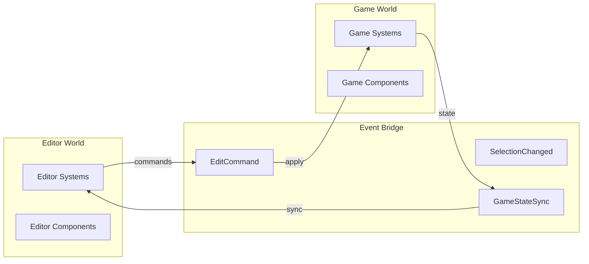
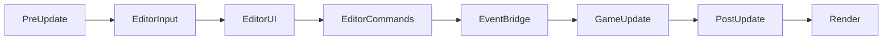
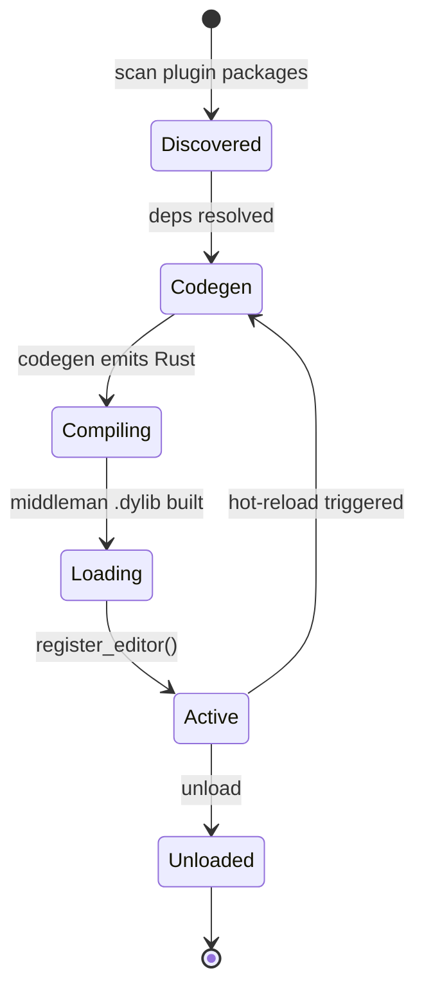
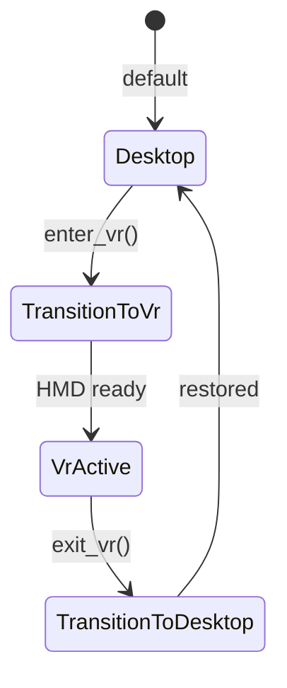

# Editor Core Design

## Requirements trace

### Editor framework (F-15.1)

| Feature  | Requirement | User Stories               |
|----------|-------------|----------------------------|
| F-15.1.1 | R-15.1.1   | US-15.1.1.1--US-15.1.1.13  |
| F-15.1.2 | R-15.1.2   | US-15.1.2.1--US-15.1.2.8   |
| F-15.1.3 | R-15.1.3   | US-15.1.3.1--US-15.1.3.9   |
| F-15.1.4 | R-15.1.4   | US-15.1.4.1--US-15.1.4.10  |
| F-15.1.5 | R-15.1.5   | US-15.1.5.1--US-15.1.5.8   |
| F-15.1.6 | R-15.1.6   | US-15.1.6.1--US-15.1.6.6   |
| F-15.1.7 | R-15.1.7   | US-15.1.7.1--US-15.1.7.8   |
| F-15.1.8 | R-15.1.8   | US-15.1.8.1--US-15.1.8.9   |
| F-15.1.9 | R-15.1.9   | US-15.1.9.1--US-15.1.9.8   |

1. **F-15.1.1** -- Dockable panel layout with split, tab, float
2. **F-15.1.2** -- Multiple 2D and 3D viewports with independent cameras
3. **F-15.1.3** -- Undo/redo via command pattern with transactions
4. **F-15.1.4** -- Unified selection (click, marquee, lasso, sub-object)
5. **F-15.1.5** -- Transform gizmos with snap and reference frames
6. **F-15.1.6** -- Measurement gizmos (bounds, distance, angle)
7. **F-15.1.7** -- Centralized preferences with versioned JSON
8. **F-15.1.8** -- Editor extension/plugin API with hot reload
9. **F-15.1.9** -- VR editor mode with motion controller gizmos

### Plugin architecture (F-1.6, F-15.1.8)

| Feature  | Requirement | User Stories              |
|----------|-------------|---------------------------|
| F-1.6.1  | R-1.6.1    | US-1.6.1.1--US-1.6.1.6    |
| F-1.6.2  | R-1.6.2    | US-1.6.2.1--US-1.6.2.5    |
| F-1.6.3  | R-1.6.3    | US-1.6.3.1--US-1.6.3.4    |
| F-1.6.4  | R-1.6.4    | US-1.6.4.1--US-1.6.4.3    |
| F-1.6.5  | R-1.6.5    | US-1.6.5.1--US-1.6.5.4    |
| F-1.6.6  | R-1.6.6    | US-1.6.6.1--US-1.6.6.3    |
| F-1.6.7  | R-1.6.7    | US-1.6.7.1--US-1.6.7.3    |

1. **F-1.6.1** -- Plugin data-package discovery and codegen pipeline
2. **F-1.6.2** -- Plugin lifecycle management via middleman .dylib
3. **F-1.6.3** -- Plugin hot-reload by recompiling the middleman .dylib
4. **F-1.6.4** -- Plugin dependency resolution and ABI versioning
5. **F-1.6.5** -- Custom component editors via plugin registration
6. **F-1.6.6** -- Plugin ABI versioning across middleman versions
7. **F-1.6.7** -- Codegen'd plugin variants for enums, panels, and gizmos

### VR editor mode (F-15.16)

| Feature   | Requirement | User Stories                |
|-----------|-------------|-----------------------------|
| F-15.16.1 | R-15.16.1  | US-15.16.1.1--US-15.16.1.4  |
| F-15.16.2 | R-15.16.2  | US-15.16.2.1--US-15.16.2.5  |
| F-15.16.3 | R-15.16.3  | US-15.16.3.1--US-15.16.3.3  |
| F-15.16.4 | R-15.16.4  | US-15.16.4.1--US-15.16.4.4  |
| F-15.16.5 | R-15.16.5  | US-15.16.5.1--US-15.16.5.3  |

1. **F-15.16.1** -- Hand tracking input for VR editor
2. **F-15.16.2** -- Floating panel UI in VR
3. **F-15.16.3** -- VR collaboration with avatars
4. **F-15.16.4** -- Follow mode for user/AI tracking
5. **F-15.16.5** -- VR performance budget at 90 fps

### Cross-cutting dependencies

| Dependency | Source | Consumed API |
|------------|--------|--------------|
| Widget framework | F-13.1 | All editor UI panels |
| Render graph | F-2.3.8 | Viewport + stereo rendering |
| Windowing | F-14.1.1 | Floating panels, HMD |
| Type descriptors | F-1.3.1--F-1.3.10 | Property inspector (codegen'd) |
| Events | F-1.5.1, F-1.5.7 | Event bridge, dispatch |
| Scene/transforms | F-1.2.1, F-1.2.4 | Gizmo manipulation |
| Spatial index | F-1.9.1 | Selection picking |
| Serialization | F-1.4.1--F-1.4.3 | Layout, prefs, undo |
| Threading | F-14.3.1 | Async long-running tasks |
| ECS | F-1.1 | Editor world, game world |
| Collaboration | F-15.12.3 | Presence, avatars |
| Input system | F-14.2 | Motion controllers |

### Non-functional requirements

| Requirement | Target | Source |
|-------------|--------|--------|
| UI input ack | < 16 ms | US-15.1.NF1.1 |
| Panel layout ops | < 100 ms | US-15.1.NF1.2 |
| UI thread max block | < 50 ms | US-15.1.NF1.3 |
| Undo/redo per cmd | < 50 ms | US-15.1.3.6 |
| VR frame rate | >= 90 fps | US-15.16.5.1 |
| Motion-to-photon | < 20 ms | US-15.16.5.2 |

## Overview

The editor core is the top-level shell hosting all visual editing tools. It provides the dock/panel
system, viewports, undo/redo, selection, gizmos, property inspection, plugin extensibility, VR mode,
and preferences.

The editor runs as a **separate ECS world** alongside the game world. An `EventBridge` synchronizes
mutations between worlds. All editor UI uses the engine's own widget framework (F-13.1).

### Design principles

- **Two-world isolation.** Editor state never leaks into the game world.
- **Command-driven mutation.** Every game-world change flows through the undo stack. Direct writes
  are forbidden outside play mode.
- **Codegen-powered inspection.** Auto-generated UI driven by codegen'd type descriptors from the
  middleman .dylib. No runtime reflection.
- **Plugin-first.** Every built-in panel uses the same plugin API available to third parties.
- **VR is a mode, not a separate app.** VR reuses the editor world, undo, selection, and plugins.
  Only rendering and input differ.

## Architecture

### Dual-world architecture



### Game loop phase diagram

Each phase runs sequentially. `EditorCommands` and `EventBridge` are the frame-boundary handoffs
between the editor world and the game world.



| Phase | Thread | Blocks | Notes |
|-------|--------|--------|-------|
| PreUpdate | Main | yes | OS event loop poll, I/O completions |
| EditorInput | Worker | yes | Input action dispatch |
| EditorUI | Worker | yes | Widget dirty rebuild, layout |
| EditorCommands | Worker | yes | Flush undo stack to ECS |
| EventBridge | Worker | yes | Sync editor mutations to game world |
| GameUpdate | Worker | no (parallel) | ECS systems run via job graph |
| PostUpdate | Worker | yes | State sync back to editor world |
| Render | Render thread | overlaps | GPU command submission |

### Plugin lifecycle

Plugins are data packages compiled into the middleman .dylib. Hot-reload recompiles the middleman.



### Logic graph editor extensibility

Logic graphs can extend the editor itself. The pipeline is:
`logic graph asset → codegen → middleman .dylib → editor loads descriptor`.

Six extension points:

1. **Custom editor panels** -- logic graphs producing widget trees; registered as panel descriptors.
2. **Custom gizmos** -- logic graphs drawing 3D overlays; registered as gizmo descriptors.
3. **Custom inspectors** -- logic graphs defining property panels per component type.
4. **Custom importers** -- logic graphs processing asset files on import.
5. **Validation rules** -- logic graphs checking project constraints; run by `run_validation()`.
6. **Automation** -- batch operations, migration scripts, project wizards invoked from the menu bar.

### VR mode state



### Class diagram

```mermaid
classDiagram
    class DockNode {
        <<enum>>
        Split(direction, ratio, children)
        TabGroup(panels, active_tab)
    }
    class SplitDirection {
        <<enum>>
        Horizontal
        Vertical
    }
    class DockZone {
        <<enum>>
        Left
        Right
        Bottom
        Center
        Floating
    }
    class DockTree {
        -root DockNode
        -floating Vec~FloatingPanel~
        +split(target, dir, panel, ratio) Result
        +add_tab(target, panel) Result
        +float(panel, pos, size) Result
        +dock(panel, target, zone) Result
        +close(panel) Result
    }
    class PanelId {
        +u64 inner
    }
    class PanelDescriptor {
        +PanelId id
        +str name
        +bool allow_multiple
        +DockZone default_zone
        +fn create_fn
    }
    class PanelWidget {
        <<trait>>
        +build(ctx) WidgetNode
        +update(ctx) bool
        +on_close()
    }
    class LayoutProfile {
        +String name
        +DockNode tree
        +Vec~ViewportConfig~ viewport_configs
    }
    class ViewportId {
        +u32 inner
    }
    class ViewportConfig {
        +String name
        +CameraMode camera_mode
        +RenderOverrides render_overrides
        +Vec~DebugOverlay~ overlays
    }
    class CameraMode {
        <<enum>>
        FreeFly
        PlayerPreview
        OrthoTop
        OrthoFront
        OrthoRight
        Orbit
        Camera2D
    }
    class DebugOverlay {
        <<enum>>
        Wireframe
        Normals
        UVs
        LightComplexity
        Overdraw
        CollisionBounds
        NavMesh
        %% Plugin-contributed variants codegen'd into middleman .dylib
    }
    class ViewportManager {
        +create(config, window) Result~ViewportId~
        +destroy(id) Result
        +screen_to_ray(id, pos) Option~Ray~
        +build_render_graphs(builder, world)
    }
    class EditorCommand {
        <<trait>>
        +description() str
        +execute(world) Result
        +undo(world) Result
        +size_bytes() usize
    }
    class Transaction {
        -String description
        -SmallVec~EditorCommandRef~ commands
    }
    class UndoStack {
        +execute(cmd, world) Result
        +undo(world) Result~bool~
        +redo(world) Result~bool~
        +save_history(path) Future~Result~
        +load_and_replay(path, world) Future~Result~
    }
    class Selectable {
        <<enum>>
        Entity(Entity)
        Asset(AssetId)
        SubObject(entity, element)
    }
    class SubObjectElement {
        <<enum>>
        Vertex(u32)
        Edge(u32)
        Face(u32)
        Bone(u32)
        %% Plugin-contributed variants codegen'd into middleman .dylib
    }
    class SelectionModifier {
        <<enum>>
        Replace
        Add
        Subtract
        Toggle
    }
    class SelectionState {
        -Vec~Selectable~ items
        -Vec~SelectionSet~ saved_sets
        +select(items, modifier)
        +clear()
        +entities() Vec~Entity~
    }
    class GizmoTool {
        <<enum>>
        Translate
        Rotate
        Scale
        Universal
        %% Plugin-contributed variants codegen'd into middleman .dylib
        Custom(GizmoTypeId)
    }
    class GizmoFrame {
        <<enum>>
        World
        Local
        Custom(Entity)
    }
    class GizmoConstraint {
        <<enum>>
        Free
        AxisX
        AxisY
        AxisZ
        PlaneXY
        PlaneXZ
        PlaneYZ
    }
    class GizmoManager {
        +set_tool(tool)
        +set_frame(frame)
        +begin_manipulation(constraint, ray, sel)
        +update_manipulation(ray) Option~GizmoDelta~
        +end_manipulation(world) Option~TransformCommand~
        +hit_test(ray, sel, world) Option~GizmoConstraint~
    }
    class HotKeyMap {
        +bind(hotkey, action)
        +unbind(hotkey)
        +lookup(hotkey) Option~HotKeyAction~
    }
    class PreferenceStore {
        +load(team, user, io) JobHandle~Result~Self~~
        +get~T~(key) Option~T~
        +set~T~(key, value)
        +migrate(target) Result
    }
    class EditorPlugin {
        <<trait>>
        +metadata() PluginMetadata
        +register_editor(api)
        +on_unload(api)
        +serialize_state() Vec~u8~
        +deserialize_state(data)
    }
    class PluginMetadata {
        +str name
        +SemanticVersion version
        +SemanticVersion min_host_version
        +Vec~PluginDependency~ dependencies
    }
    class PluginHandle {
        +u64 id
        +String name
        +PluginState state
    }
    class PluginState {
        <<enum>>
        Loading
        Active
        Faulted(String)
        Unloading
    }
    class PluginHost {
        -Vec~PluginHandle~ loaded
        -DependencyResolver resolver
        +discover(paths) Vec~PluginMetadata~
        +load(path, api) Result~PluginHandle~
        +unload(handle, api) Result
        +hot_reload(handle, api) Result~PluginHandle~
    }
    class DependencyResolver {
        +resolve(plugins) Result~Vec~LoadOrder~~
        +check_host_compat(meta) Result
    }
    class IsolationScope {
        +allocator PluginAllocator
        +catch_panic(f) Result
    }
    class EditorPluginApi {
        +register_panel(descriptor)
        +register_gizmo(descriptor)
        +register_editor_widget(type_id, factory)
        +add_menu_action(path, action)
        +add_toolbar_button(toolbar, button)
        +register_hotkey(hotkey, action)
        +type_descriptors() TypeDescriptorTable
    }
    class EditorWidgetFactory {
        +create(component_ref) WidgetNode
        +update(component_ref, widget) bool
        +on_edit(path, old, new) EditorCommand
    }
    class EditorWidgetRegistry {
        %% HashMap is acceptable here: cold registration path, not per-frame hot path
        -HashMap~TypeId, EditorWidgetFactory~ widgets
        +register(type_id, factory)
        +lookup(type_id) Option~EditorWidgetFactory~
    }
    class VrModeManager {
        +VrModeState state
        +enter_vr() Result
        +exit_vr() Result
        +is_vr_active() bool
        +frame_update(delta_time)
    }
    class VrModeState {
        <<enum>>
        Desktop
        TransitionToVr
        VrActive
        TransitionToDesktop
    }
    class VrInputAdapter {
        +VrInputMode mode
        +process_input(raw) SmallVec~EditorAction~
    }
    class VrInputMode {
        <<enum>>
        MotionControllers
        HandTracking
    }
    class HandGesture {
        <<enum>>
        None
        Pinch
        Grab
        Point
        OpenPalm
        Fist
    }
    class VrPanelSystem {
        +Vec~VrPanel~ panels
        +spawn_panel(descriptor, anchor) PanelId
        +dismiss_panel(id)
    }
    class VrPanelAnchor {
        <<enum>>
        WorldFixed(Vec3, Quat)
        HandAttached(Hand, Vec3)
        HeadLocked(Vec3)
        Floating
    }
    class VrAvatarSystem {
        +Vec~VrAvatar~ avatars
        +update_avatars(presence)
    }
    class VrFollowMode {
        +FollowTarget target
        +FollowState state
        +follow(target) Result
        +break_follow()
    }
    class FollowTarget {
        <<enum>>
        None
        User(UserId)
        AiAgent(AgentId)
    }
    class VrPerfBudget {
        +f32 frame_budget_ms
        +u32 target_fps
        +adjust_quality(frame_time)
    }

    DockTree --> DockNode
    DockNode --> SplitDirection
    PanelDescriptor --> PanelId
    PanelDescriptor --> DockZone
    PanelDescriptor ..> PanelWidget : creates
    LayoutProfile --> DockNode
    ViewportManager --> ViewportConfig
    ViewportConfig --> CameraMode
    ViewportConfig --> DebugOverlay
    UndoStack --> EditorCommand
    UndoStack --> Transaction
    SelectionState --> Selectable
    Selectable --> SubObjectElement
    GizmoManager --> GizmoTool
    GizmoManager --> GizmoFrame
    GizmoManager --> GizmoConstraint
    PluginHost --> PluginHandle
    PluginHost --> DependencyResolver
    PluginHost --> IsolationScope
    EditorPlugin --> PluginMetadata
    EditorPluginApi --> EditorWidgetRegistry
    EditorWidgetRegistry --> EditorWidgetFactory
    VrModeManager --> VrModeState
    VrModeManager --> VrInputAdapter
    VrModeManager --> VrPanelSystem
    VrModeManager --> VrAvatarSystem
    VrModeManager --> VrFollowMode
    VrModeManager --> VrPerfBudget
    VrInputAdapter --> VrInputMode
    VrPanelSystem --> VrPanelAnchor
    VrFollowMode --> FollowTarget
```



## API design

### Serialization

| Data | Format | Notes |
|------|--------|-------|
| Undo history | rkyv | Large, performance-sensitive binary stream |
| Layout profiles | rkyv | Stored as project assets in `.harmonius/` |
| Preferences | Engine custom text format | Per-user, stored in OS user data directory |
| Project settings | Engine custom text format | Per-project, version-controlled |

No `serde`, no RON, no JSON for runtime data structures.

### Dock tree and panels

```rust
/// Unique panel identifier.
#[derive(Clone, Copy, Debug, PartialEq, Eq, Hash)]
pub struct PanelId(pub u64);

/// Descriptor registered once per panel type.
pub struct PanelDescriptor {
    pub id: PanelId,
    pub name: &'static str,
    pub icon: Option<AssetHandle>,
    pub allow_multiple: bool,
    pub default_zone: DockZone,
    pub create_fn: fn(
        &mut PanelContext,
    ) -> Box<dyn PanelWidget>,
}

/// Trait implemented by all editor panels.
pub trait PanelWidget: Send {
    fn build(
        &mut self,
        ctx: &mut PanelContext,
    ) -> WidgetNode;
    fn update(
        &mut self,
        ctx: &mut PanelContext,
    ) -> bool;
    fn on_close(&mut self) {}
}

/// The dock layout tree.
#[derive(Debug)]
pub enum DockNode {
    Split {
        direction: SplitDirection,
        ratio: f32,
        children: [Box<DockNode>; 2],
    },
    TabGroup {
        panels: Vec<PanelId>,
        active_tab: usize,
    },
}

pub struct DockTree {
    root: DockNode,
    floating: Vec<FloatingPanel>,
}

// `Box<dyn PanelWidget>` — justified: heterogeneous panel set, cold editor path only.

impl DockTree {
    pub fn split(
        &mut self,
        target: PanelId,
        direction: SplitDirection,
        new_panel: PanelId,
        ratio: f32,
    ) -> Result<(), DockError>;
    pub fn add_tab(
        &mut self,
        target: PanelId,
        new_panel: PanelId,
    ) -> Result<(), DockError>;
    pub fn float(
        &mut self,
        panel: PanelId,
        position: [i32; 2],
        size: [u32; 2],
    ) -> Result<WindowHandle, DockError>;
    pub fn close(
        &mut self,
        panel: PanelId,
    ) -> Result<(), DockError>;
}
```

### Undo/redo

```rust
/// Reversible editor command.
pub trait EditorCommand: Send {
    fn description(&self) -> &str;
    fn execute(
        &mut self,
        world: &mut World,
    ) -> Result<(), CommandError>;
    fn undo(
        &mut self,
        world: &mut World,
    ) -> Result<(), CommandError>;
    fn size_bytes(&self) -> usize;
}

pub struct UndoStack { /* ... */ }

// `Box<dyn EditorCommand>` — justified: heterogeneous undo stack, cold path. Commands generated
// from logic graphs may use codegen'd enum dispatch for higher throughput hot paths.
impl UndoStack {
    pub fn execute(
        &mut self,
        command: Box<dyn EditorCommand>,
        world: &mut World,
    ) -> Result<(), CommandError>;
    pub fn undo(
        &mut self,
        world: &mut World,
    ) -> Result<bool, CommandError>;
    pub fn redo(
        &mut self,
        world: &mut World,
    ) -> Result<bool, CommandError>;
    /// Enqueues history serialization to the main thread's I/O channel.
    /// Returns a `JobHandle` that resolves when the write completes.
    pub fn save_history(
        &self,
        path: &AssetPath,
        io: &MainThreadIo,
    ) -> JobHandle<Result<(), IoError>>;
    /// Loads and replays history synchronously. Call from a worker thread job.
    pub fn load_and_replay(
        path: &AssetPath,
        world: &mut World,
        io: &MainThreadIo,
    ) -> Result<Self, CommandError>;
}
```

### Selection

```rust
#[derive(Clone, Debug, PartialEq, Eq, Hash)]
pub enum Selectable {
    Entity(Entity),
    Asset(AssetId),
    SubObject { entity: Entity, element: SubObjectElement },
}

#[derive(Debug)]
pub struct SelectionState {
    /// SmallVec avoids heap allocation for the common single-selection case.
    items: SmallVec<[Selectable; 8]>,
    saved_sets: Vec<SelectionSet>,
}

impl SelectionState {
    pub fn select(
        &mut self,
        items: &[Selectable],
        modifier: SelectionModifier,
    );
    pub fn clear(&mut self);
    pub fn entities(&self) -> Vec<Entity>;
    pub fn save_set(&mut self, name: String);
    pub fn restore_set(
        &mut self,
        name: &str,
    ) -> Result<(), SelectionError>;
}
```

### Plugin API (middleman-based)

```rust
/// Trait for editor plugins exposed via C ABI.
pub trait EditorPlugin: Send {
    fn metadata(&self) -> PluginMetadata;
    fn register_editor(
        &self,
        api: &mut EditorPluginApi,
    );
    fn on_unload(&self, api: &mut EditorPluginApi);
    fn serialize_state(&self) -> Vec<u8>;
    fn deserialize_state(&mut self, data: &[u8]);
}

/// API surface exposed to plugins.
pub struct EditorPluginApi<'a> {
    panel_registry: &'a mut PanelRegistry,
    widget_registry: &'a mut EditorWidgetRegistry,
    hotkey_map: &'a mut HotKeyMap,
    type_descriptors: &'a TypeDescriptorTable,
    editor_world: &'a World,
    game_world: &'a World,
}

impl<'a> EditorPluginApi<'a> {
    pub fn register_panel(
        &mut self,
        descriptor: PanelDescriptor,
    );
    pub fn register_gizmo(
        &mut self,
        descriptor: CustomGizmoDescriptor,
    );
    pub fn register_editor_widget(
        &mut self,
        type_id: TypeId,
        factory: EditorWidgetFactory,
    );
    pub fn add_menu_action(
        &mut self,
        menu_path: &str,
        action: MenuAction,
    );
    pub fn register_hotkey(
        &mut self,
        hotkey: HotKey,
        action: HotKeyAction,
    );
}
```

### VR mode

```rust
pub struct VrModeManager { /* ... */ }

#[derive(Clone, Copy, Debug, PartialEq, Eq)]
pub enum VrModeState {
    Desktop,
    TransitionToVr,
    VrActive,
    TransitionToDesktop,
}

impl VrModeManager {
    pub fn enter_vr(&mut self) -> Result<(), VrError>;
    pub fn exit_vr(&mut self) -> Result<(), VrError>;
    pub fn is_vr_active(&self) -> bool;
    pub fn frame_update(
        &mut self,
        delta_time: f32,
        editor_ctx: &mut EditorContext,
    );
}

pub struct VrInputAdapter { /* ... */ }

impl VrInputAdapter {
    pub fn process_input(
        &mut self,
        left: &ControllerState,
        right: &ControllerState,
    ) -> SmallVec<[EditorAction; 4]>;
    pub fn process_hands(
        &mut self,
        left: &HandState,
        right: &HandState,
    ) -> SmallVec<[EditorAction; 4]>;
    pub fn pointing_ray(&self) -> Ray;
}
```

## Data flow

### Per-thread arenas

Scratch allocations that do not escape the frame use thread-local arenas, reset at frame boundaries:

- **Gizmo hit-test** -- candidate lists, ray-cast scratch buffers allocated per frame.
- **VR input processing** -- intermediate action lists before dispatch.
- **Editor system temporaries** -- layout scratch, dirty region lists, event queues.

### Editor frame loop

1. Main thread OS event loop polls I/O completions (Win32 message pump / CFRunLoop / epoll).
2. Editor world runs editor systems (input, UI, gizmos, selection).
3. `EventBridge` flushes editor commands to game world.
4. In edit mode, game world is paused (commands only). In play mode, game systems run and state
   syncs back.
5. Viewport render graphs are built and executed.

### Plugin loading

Plugins are data packages (logic graph assets and component definitions). There are no independent
plugin .dylib files. The codegen pipeline compiles all plugins into the middleman .dylib.

1. `PluginHost::discover()` scans the project for plugin data packages.
2. `DependencyResolver` topologically sorts plugin packages by declared dependencies.
3. Codegen pipeline compiles all plugin types and logic graphs into the middleman .dylib.
4. The engine reloads the middleman .dylib via `libloading`.
5. Each plugin registers its panels, gizmos, widgets, and menu items via `EditorPluginApi`.

Hot-reload recompiles the middleman .dylib (not individual plugin .dylibs). The engine binary
remains stable across hot-reload cycles.

### Component editor dispatch

1. User selects an entity in the viewport.
2. `PropertyInspector` enumerates components via the codegen'd `TypeDescriptorTable` from the
   middleman .dylib.
3. For each component type, the descriptor provides: field names, field types, default values,
   validation ranges, and a widget factory function.
4. `EditorWidgetRegistry::lookup(type_id)` checks for a custom plugin-provided widget; falls back to
   the codegen'd descriptor's widget factory.
5. Edits produce `EditorCommand` through the undo stack.

### Selection picking via spatial index

1. User clicks or drags a marquee in the viewport.
2. `ViewportManager::screen_to_ray()` produces a world-space ray from the cursor position.
3. The shared BVH (F-1.9.1) is queried with the ray or a frustum (marquee/lasso).
4. Hits are sorted by depth; closest entity is returned for click, all overlapping for marquee.
5. `SelectionState::select()` is called with the hit list and the active `SelectionModifier`.

### Gizmo manipulation producing TransformCommands

1. `GizmoManager::hit_test()` checks if the cursor is over a gizmo handle (ray vs. handle geometry).
2. On mouse-down: `begin_manipulation()` records the constraint axis/plane and initial world ray.
3. Each mouse-move: `update_manipulation()` projects the ray onto the constraint and computes delta.
4. On mouse-up: `end_manipulation()` wraps the accumulated delta as a `TransformCommand` and pushes
   it onto the undo stack via `UndoStack::execute()`.

### VR input to command pipeline

1. `VrInputAdapter::process_input()` converts raw controller state to `SmallVec<[EditorAction; 4]>`.
2. Editor actions are dispatched to the same command handlers as keyboard/mouse actions.
3. Commands enter the undo stack identically to desktop input.

### EventBridge bidirectional sync

1. **Editor → Game**: `EditCommand` events queued by editor systems are applied to the game world at
   the `EventBridge` phase. Applied via `EditorCommand::execute()` on the game world.
2. **Game → Editor**: After `GameUpdate`, changed component values are read by the `GameStateSync`
   event and written into editor-side mirror components. Editor UI reads mirrors, not live game
   state.
3. In play mode both directions are live. In edit mode only editor → game flows (game is paused).

## Platform considerations

The editor targets **desktop only**: Windows, macOS, and Linux. VR mode uses OpenXR on all three
platforms, plus visionOS via OpenXR. The editor does not target mobile or console.

| Component | Windows | macOS | Linux |
|-----------|---------|-------|-------|
| Dynamic lib | `.dll` / `LoadLibraryW` | `.dylib` / `dlopen` | `.so` / `dlopen` |
| File watch | `ReadDirectoryChangesW` | `FSEvents` | `inotify` |
| Plugin ABI | MSVC ABI (`windows-rs`) | Clang ABI (`objc2`) | GCC/Clang ABI |
| File dialogs | `IFileOpenDialog` (`windows-rs`) | `NSOpenPanel` (`objc2`) | GTK portal |
| Menu bar | `HMENU` (`windows-rs`) | `NSMenu` (`objc2`) | Widget framework |
| Cursor lock | `ClipCursor` + `ShowCursor` | `CGAssociateMouseAndMouseCursorPosition` | `XGrabPointer` |
| VR runtime | OpenXR | OpenXR + visionOS | OpenXR |

### Multi-monitor support

- Enumerate displays: `EnumDisplayMonitors` (Windows), `CGGetActiveDisplayList` (macOS), `wl_output`
  (Wayland), `RRGetScreenResources` (X11).
- DPI-aware positioning: per-monitor DPI scaling applied to all panel geometry.
- Per-monitor layout state: each monitor tracks its own dock tree independently when floating panels
  span monitors.
- Floating panels snap to monitor edges with configurable snap distance.

## Cross-subsystem integration

| Subsystem | Direction | Data | Mechanism |
|-----------|-----------|------|-----------|
| Asset pipeline | bidirectional | import/export | AssetDatabase API |
| Version control | bidirectional | Git LFS status | VCS adapter |
| Content services | consumes | AI suggestions | Agent API |
| UI framework | produces | editor widget tree | ECS widget entities |
| Rendering | produces | viewport RenderView | Render graph nodes |
| Physics | consumes | gizmo raycast | Physics raycast API |
| Spatial index | consumes | selection picking | Shared BVH query |
| Scripting | bidirectional | logic graph editing | Graph asset CRUD |
| Save system | bidirectional | project state | Save/load API |
| Input | consumes | keyboard/mouse/VR | Input action system |
| Networking | bidirectional | collaborative editing | Event bridge |

## Algorithm references

| Algorithm | Usage | Reference |
|-----------|-------|-----------|
| Dock tree layout | Split/tab/float layout engine | <https://www.drdobbs.com/ui/user-interface-layout-algorithms/184402929> |
| Ray-plane intersection | Gizmo constraint projection | <https://www.scratchapixel.com/lessons/3d-basic-rendering/minimal-ray-tracer-rendering-simple-shapes/ray-plane-and-ray-disk-intersection> |
| Marquee frustum selection | Viewport selection geometry | <https://www.iquilezles.org/www/articles/frustum/frustum.htm> |
| Topological sort (Kahn) | Plugin dependency ordering | <https://en.wikipedia.org/wiki/Topological_sorting#Kahn's_algorithm> |
| Undo tree | Non-linear undo history | <https://vim.fandom.com/wiki/Using_undo_branches> |

## Widget inventory

The editor is built entirely with the engine's own widget framework (ui-framework.md). No separate
toolkit is used. Every widget below must be designed as a reusable type in the UI framework.

| # | Widget | UI framework ref | Editor usage |
|---|--------|-----------------|-------------|
| 1 | Panel | F-10.1.1 | Every editor panel (scene, inspector, etc.) |
| 2 | DockContainer | F-10.1.1 | Split/tab/float dock layout |
| 3 | TabBar | F-10.2.8 | Panel tabs within dock nodes |
| 4 | TreeView | F-10.2.8 | Scene hierarchy, asset browser tree |
| 5 | PropertyGrid | F-10.2.8 | Inspector property rows |
| 6 | TextInput | F-10.2.2 | Search bars, rename, property values |
| 7 | Button | F-10.2.3 | Toolbar buttons, dialog actions |
| 8 | Toggle | F-10.2.3 | Boolean property toggles |
| 9 | Slider | F-10.2.3 | Numeric property sliders |
| 10 | SpinBox | F-10.2.3 | Integer/float property inputs |
| 11 | Dropdown | F-10.2.4 | Enum selectors, component picker |
| 12 | ComboBox | F-10.2.4 | Asset selector with search |
| 13 | ScrollView | F-10.2.5 | All scrollable panels |
| 14 | VirtualList | F-10.2.5 | Asset browser, log panels |
| 15 | Tooltip | F-10.2.6 | Property help, asset preview |
| 16 | ContextMenu | F-10.2.6 | Right-click menus everywhere |
| 17 | Modal | F-10.2.6 | Confirm dialogs, project settings |
| 18 | DragDrop | F-10.2.7 | Asset drag to viewport, reparent |
| 19 | ProgressBar | F-10.2.8 | Import progress, build progress |
| 20 | ColorPicker | F-10.2.8 | Material/light color editing |
| 21 | CurveEditor | F-10.2.8 | Animation curves, easing |
| 22 | GraphCanvas | F-10.2.8 | Logic graph, material graph nodes |
| 23 | Viewport | F-10.1.1 | 2D/3D scene rendering surface |
| 24 | Toolbar | F-10.1.1 | Tool selection bar |
| 25 | Breadcrumb | F-10.2.8 | Asset path navigation |
| 26 | SplitHandle | F-10.1.1 | Dock split resize handles |
| 27 | StatusBar | F-10.1.1 | Bottom bar (fps, selection count) |

## Window management

### Multi-window workflow

1. **Dock system** -- panels dock into split containers (horizontal/vertical) or tab containers. Any
   panel can be dragged out into a floating window via the custom windowing system. Floating windows
   can dock back into the main window or other floating windows.
2. **Multi-monitor** -- floating panels snap to monitor edges. DPI-aware per monitor. See
   platform-level multi-monitor support in the Platform considerations section.
3. **Panel resize** -- split handles between docked panels. Drag to resize. Double-click to reset to
   equal split. Minimum panel size enforced.
4. **Tab reorder** -- drag tabs within a tab container to reorder. Drag a tab out to create a new
   split or floating window.
5. **Panel close/reopen** -- any panel can be closed. Reopened from the View menu or command
   palette. Closed panels remember their last position.

### Window state

1. **Window title** -- shows `<project> — <scene>` with an asterisk (`*`) when unsaved changes
   exist.
2. **Window close** -- prompts to save unsaved changes before closing.
3. **Fullscreen** -- toggle fullscreen on the active viewport. Other panels are hidden.
4. **Focus follows viewport** -- keyboard shortcuts apply to the focused viewport.
5. **Window state persistence** -- position, size, and maximized state saved in user preferences and
   restored on next launch.

### Workflow layouts

Users select from predefined or custom layouts:

1. **Default** -- scene viewport center, hierarchy left, inspector right, asset browser bottom,
   console bottom-right.
2. **Animation** -- timeline bottom, viewport top-left, curve editor top-right, inspector right.
3. **Level design** -- large viewport center, hierarchy left, terrain tools right, minimap
   bottom-right.
4. **VFX** -- particle preview center, effect graph right, inspector left, timeline bottom.
5. **Logic graph** -- graph canvas center, variables left, inspector right, console bottom.
6. **2D** -- 2D viewport center, tilemap palette left, sprite editor right, layers bottom.
7. **Debug** -- viewport center, profiler bottom, console bottom-right, watch panel right.
8. **Review** -- dual viewport (split), diff panel bottom.

Custom layouts: user arranges panels and saves as a named `LayoutProfile` (rkyv asset). Layout
switching uses a hotkey or menu. Per-project layouts can override the default set and are
version-controlled.

## Rendering integration

### Dirty-based UI rendering

The UI does not re-render every frame -- only when invalidated:

1. **Dirty tracking** -- each widget has a dirty flag (ui-framework.md `DirtyFlags`). The UI
   framework only re-layouts and re-paints dirty subtrees.
2. **Frame skipping** -- if no widget is dirty and no input occurred, the editor skips the UI render
   pass. The 3D viewport still renders independently.
3. **Partial redraw** -- only dirty regions are repainted. The GPU only draws quads that changed
   since last frame.
4. **Idle mode** -- when unfocused or idle for N seconds, the editor drops to ~10 fps or
   event-driven rendering to save power.

### Viewport occlusion by opaque UI

When opaque UI panels fully cover viewport pixels, those pixels are not rendered by the 3D scene:

1. **UI occlusion mask** -- the UI framework generates a screen-space mask of fully opaque UI
   regions. This mask is passed to the render graph.
2. **Early-out** -- GPU tile-based renderers skip tiles fully covered by the occlusion mask. For
   non-tiled renderers, the stencil buffer marks occluded regions.
3. **Transparency exclusion** -- semi-transparent or blurred panels do not contribute to the
   occlusion mask.
4. **Game runtime** -- this optimization applies to games with opaque HUD elements too, not just the
   editor.

### Transparent elements with blur

Editor and game UI support frosted-glass / acrylic-style transparent panels:

1. **Background blur** -- when a panel has `background_opacity < 1.0`, the scene color behind it is
   sampled and blurred (Gaussian or Kawase). The blurred result is composited with the panel's
   background color.
2. **Render graph integration** -- the blur is a post-process pass in the render graph reading the
   scene color texture and writing to a blur texture sampled by the UI quad shader.
3. **Performance** -- blur runs at half or quarter resolution. Only triggered when a panel has blur
   enabled. Dead pass elimination skips the pass entirely when no panels use blur.
4. **Blur parameters** -- per-panel: blur radius, blur intensity, tint color, saturation.
   Configurable in the theme.

## Undo/redo system

### Undo tree (non-linear)

The undo system is a **tree**, not a linear stack. All branches are preserved -- no history is lost
when the user undoes and then makes a new edit. Reference:
<https://vim.fandom.com/wiki/Using_undo_branches>

Each node stores:

- `command: EditorCommand` -- the forward action
- `inverse: EditorCommand` -- the reverse action
- `parent: Option<UndoNodeId>` -- parent in the tree
- `children: SmallVec<[UndoNodeId; 2]>` -- branches
- `timestamp: u64`
- `label: Option<String>`

Navigation computes the LCA path from the current node to the target node and applies the minimal
set of undo + redo commands.

### Undo tree API

```rust
/// Non-linear undo tree. Replaces the linear UndoStack.
pub struct UndoTree { /* ... */ }

pub struct UndoNodeId(pub u64);

impl UndoTree {
    /// Execute a command, creating a new child node of the current node.
    pub fn execute(
        &mut self,
        command: Box<dyn EditorCommand>,
        world: &mut World,
    ) -> Result<UndoNodeId, CommandError>;
    /// Undo: move to parent node.
    pub fn undo(&mut self, world: &mut World) -> Result<bool, CommandError>;
    /// Redo: move to most recently visited child node.
    pub fn redo(&mut self, world: &mut World) -> Result<bool, CommandError>;
    /// Jump to any node in any branch.
    pub fn jump_to(
        &mut self,
        target: UndoNodeId,
        world: &mut World,
    ) -> Result<(), CommandError>;
    /// Name a branch for easy recall.
    pub fn label_node(&mut self, id: UndoNodeId, label: String);
    /// Group commands into a single undo step.
    pub fn begin_transaction(&mut self, description: &str);
    pub fn end_transaction(&mut self);
    /// Persist tree to disk (enqueued to main-thread I/O).
    pub fn save(&self, path: &AssetPath, io: &MainThreadIo)
        -> JobHandle<Result<(), IoError>>;
}
```

### Undo depth and memory budget

1. **Transaction grouping** -- `begin_transaction` / `end_transaction` wrap multiple commands into a
   single undo step (e.g., multi-object transform).
2. **Undo across sessions** -- undo tree persists to disk (rkyv) on autosave and editor close.
   Restored on next session open.
3. **Memory budget** -- configurable max memory. When exceeded, oldest leaf branches are pruned
   first. The current branch and ancestors are never pruned.
4. **Branch visualization** -- the undo history panel shows the tree as a timeline with branches.
   Click any node to jump to that state. Branches can be named.
5. **Branch comparison** -- select two nodes in different branches to see a structural scene diff.

## Input and interaction

### Keyboard shortcuts

1. **Default keybindings** -- sensible defaults matching common conventions. Platform-aware: Cmd
   instead of Ctrl on macOS.
2. **Full rebinding** -- every editor action has a `CommandId`. Users rebind any combination
   (including chords like Ctrl+K Ctrl+C) in the Preferences dialog.
3. **Keybinding profiles** -- Default, Unreal-like, Unity-like, Blender-like, Maya-like. Users can
   create custom profiles.
4. **Conflict detection** -- the rebinding UI warns when a key combo is already assigned.
5. **Storage** -- stored in user preferences using the engine's custom text format.
6. **Command palette** -- Cmd+P / Ctrl+P opens a type-to-search palette listing all editor commands
   with keybindings. Same keyboard-first workflow as the logic graph editor.
7. **Plugin shortcuts** -- plugins register new commands with default keybindings via
   `EditorPluginApi`.

### Cursor locking

During first-person viewport navigation, the cursor is locked and hidden using platform APIs:

- macOS: `CGAssociateMouseAndMouseCursorPosition` via `objc2`
- Windows: `ClipCursor` + `ShowCursor` via `windows-rs`
- Linux: `XGrabPointer` (X11) / relative motion protocol (Wayland)

On release, the cursor returns to its original position. Not applicable on touch devices.

### Copy/paste

1. **Entity copy/paste** -- copy serializes selected entities and all components to the OS clipboard
   as rkyv binary (internal) and plain text (external). Paste creates new entities with new IDs.
   Cross-scene and cross-project paste supported.
2. **Component copy/paste** -- copy a single component's values; paste onto another entity.
3. **Property copy/paste** -- copy a single property value; paste into a field of the same type.
4. **Asset copy/paste** -- copy asset references (not asset data); paste into asset fields.
5. **Logic graph copy/paste** -- copy selected nodes + edges; paste into the same or different
   graph. Connections to outside nodes become dangling inputs.
6. **OS clipboard** -- via `NSPasteboard` (macOS/objc2), `SetClipboardData` (Windows/windows-rs),
   `wl_data_source` (Wayland). Multiple formats simultaneously (rkyv binary + plain text).

## Menu bar

The editor has a native-style menu bar:

1. **File** -- New Project, Open Project, Recent Projects, Save Scene, Save Scene As, Save All,
   Import, Export, Project Settings, Quit.
2. **Edit** -- Undo, Redo, Cut, Copy, Paste, Duplicate, Delete, Select All, Deselect All, Find,
   Preferences.
3. **View** -- Panels (toggle each), Layouts, Fullscreen Viewport, Show Grid, Show Gizmos, Debug
   Overlays.
4. **Scene** -- Play, Pause, Stop, Step Frame, Add Entity, Add Component.
5. **Assets** -- Import, Reimport All, Open Asset Browser, Validate All, Build.
6. **Tools** -- Profiler, Logic Graph Editor, Material Editor, Animation Editor, VFX Editor, Data
   Table Editor, Localization Editor.
7. **Window** -- Minimize, Maximize, Float Panel, Close Panel, Restore Default Layout.
8. **Help** -- Documentation, Tutorials, Report Bug, About.

Platform rendering:

- **macOS** -- native `NSMenu` via `objc2` (system menu bar, outside the window).
- **Windows** -- native `HMENU` via `windows-rs` (inside the window frame).
- **Linux** -- in-window menu bar rendered by the UI widget framework.

Dynamic menus: plugins add menu items via codegen. Menu items are codegen'd data in the middleman
.dylib.

## File operations

### File drag and drop

1. **Asset import** -- drag files from the OS file explorer. The editor detects file types, runs the
   import pipeline, and adds assets to the project.
2. **Drag to viewport** -- drag an asset from the asset browser onto the 2D/3D viewport to place it.
   Shows a placement preview; drop creates the entity.
3. **Drag to inspector** -- drag an asset onto an asset field to assign it.
4. **Drag between panels** -- drag entities in hierarchy, items between containers, nodes between
   graphs.
5. **Platform APIs** -- `NSPasteboard` (macOS/objc2), `IDropTarget` (Windows/windows-rs), X11 XDND /
   Wayland data-device (Linux).

### Native OS dialogs

1. **File open** -- `NSOpenPanel` (macOS), `IFileOpenDialog` (Windows), GTK/portal (Linux).
2. **File save** -- `NSSavePanel` (macOS), `IFileSaveDialog` (Windows), GTK/portal (Linux).
3. **Folder picker** -- same APIs in folder mode.
4. **Platform abstraction** -- all calls go through a `PlatformDialogs` API. No C/C++ code.

## OS integration

1. **Recent files** -- register opened projects with the OS recent files list
   (`NSDocumentController` on macOS, Windows jump list).
2. **File associations** -- `.harmonius` project files registered to open in the editor.
3. **System tray** -- optional tray icon for background builds, asset processing, AI agent status.
4. **Notifications** -- OS notifications for completed long-running operations when the editor is
   not focused. `NSUserNotification` / Windows toast / D-Bus notify.
5. **Dark/light mode** -- detect OS appearance and match editor theme automatically (ui-framework.md
   RF-28).

## AI integration

### MCP server

The editor runs a local Model Context Protocol (MCP) server for AI agents (Claude, Cursor, Copilot).

**Tools exposed:**

| Tool | Description |
|------|-------------|
| `list_entities(filter)` | Query scene entities |
| `get_component(entity, type)` | Read component values |
| `set_component(entity, type, values)` | Modify components |
| `spawn_entity(components)` | Create entities |
| `delete_entity(entity)` | Remove entities |
| `import_asset(path)` | Trigger asset import |
| `build_project(platform)` | Start a build |
| `run_validation()` | Run project validation rules |
| `get_screenshot()` | Capture viewport screenshot |
| `execute_logic_graph(graph, inputs)` | Run a logic graph |
| `query_data_table(table, filter)` | Read data tables |
| `get_project_structure()` | List all assets, scenes, settings |

**Resources exposed:** project file tree, scene hierarchy, asset database, build status, validation
results.

**Safety:** all MCP tool calls go through the undo/command system. AI actions are undoable. Rate
limiting prevents runaway agents. The user can pause/resume AI access.

## Rich text editor

Built-in rich text editor for authored in-engine content:

- **Use cases** -- dialogue nodes, quest descriptions, item flavor text, tutorial text, lore pages,
  UI text with inline formatting (F-10.2.1), designer annotations.
- **Capabilities** -- bold, italic, underline, strikethrough; font size, family, color; inline
  icons; hyperlinks to assets/entities/docs; bulleted and numbered lists; headings; inline images;
  localization-aware (`LocalizedStringId` + per-locale formatting metadata).
- **Data model** -- a sequence of `RichTextSpan` (text + formatting attributes). Stored as
  lightweight markup in the string table, not HTML.
- **Implementation** -- built on the engine's text input widget (F-10.2.2) with a formatting
  toolbar. WYSIWYG editing with game-font preview.

## Help and documentation

### In-editor tutorials

1. **Interactive tutorials** -- step-by-step guides that run inside the editor. Each step highlights
   a UI element, shows an instruction tooltip, and waits for the user to complete the action.
   Tutorials are authored as timeline assets with cue points that trigger UI highlights.
2. **Tutorial library** -- Getting Started, Scene Basics, Materials, Logic Graphs, 2D Game, VFX, UI,
   Data Tables, Audio, Building.
3. **Tutorial authoring** -- tutorials are data assets authored as logic graphs. Plugin authors and
   community members can create custom tutorials.
4. **Progress tracking** -- completed tutorials tracked in user preferences. Dashboard suggests next
   tutorials.
5. **Contextual tips** -- brief tooltip on first panel open. Dismissable and re-viewable from Help
   menu.

### User manual

1. **Built-in documentation browser** -- a panel displaying the user manual. Markdown content
   rendered with the engine's rich text renderer. Searchable. Navigable via table of contents.
2. **Content** -- Getting Started, Editor Reference, Logic Graph Reference, Component Reference,
   Data Systems, Rendering, 2D, VFX, Audio, Networking, Build & Deploy, API Reference.
3. **API reference** -- auto-generated from codegen'd type metadata in the middleman .dylib. Always
   in sync with the project's current state.
4. **Versioned** -- each engine version ships its matching documentation.
5. **Offline** -- bundled with the editor, no internet required.

### Contextual help

1. **Tooltip help** -- every control has a hover tooltip. Complex controls include a link to full
   documentation.
2. **F1 / ? help** -- F1 or the? icon on any panel opens the documentation browser at that panel's
   reference page.
3. **Property tooltips** -- generated from codegen'd type metadata: field name, type, default, valid
   range, description string authored in the data table schema.
4. **Node tooltips** -- logic graph nodes show: description, input/output types, and a docs link.
5. **Error help** -- validation and compiler errors include a "Learn More" link.
6. **Search** -- full-text search across all documentation, node names, component names, and
   property names.

## Data safety

### Autosave

1. **Scene autosave** -- configurable interval (default 5 min). Rotating autosave slot (3 slots).
   Does not overwrite the user's manual save.
2. **Crash recovery** -- on next launch after a crash, prompt to recover from the most recent
   autosave.
3. **Autosave indicator** -- brief status bar notification ("Autosaved at 14:32").
4. **Disabled during play mode** -- autosave pauses while the game is running in-editor.

### Continuous backup

Every `EditorCommand` is appended to a write-ahead journal file before the undo tree is updated.
This enables full replay recovery after a crash:

1. **Journaling** -- append-only rkyv stream written per command. Replay reconstructs unsaved state.
2. **Periodic snapshots** -- every 2 min (configurable), a full scene snapshot is written to
   `<project>/.harmonius/backups/`. Keep the last 20 (configurable). Independent from autosave.
3. **Crash recovery dialog** -- on abnormal exit (lock file not cleanly released), show: last save,
   last autosave, last backup, journal replay. Recovered state opens as a new "recovered" scene.
4. **Pre-destructive backup** -- before delete, clear scene, import overwrite, or schema migration,
   snapshot affected data. Restores instantly (in addition to undo tree).
5. **Quit without saving** -- if the user dismisses the save prompt, the unsaved state is still
   written to a backup. Offered for recovery on next launch.
6. **Storage budget** -- total backup size capped at 500 MB per project (configurable). Oldest
   backups pruned when exceeded.
7. **Integrity** -- each backup includes a CRC-32 checksum. Corrupted backups are skipped during
   recovery.

### Project settings and user preferences

1. **Project settings** -- target platforms, quality tiers, input mapping defaults, physics
   settings, rendering defaults, localization settings. Stored in the project directory,
   version-controlled via Git. Custom text format.
2. **User preferences** -- keybindings, editor theme, layout profiles, autosave interval, viewport
   speed, grid snap, recent projects. Stored in the OS user data directory. Custom text format. NOT
   version-controlled.
3. **Preference UI** -- modal settings dialog with tabs: General, Input, Appearance, Viewport,
   Build. Changes apply immediately with undo support.

## Editor updates

### Update system

1. **Update check** -- on launch and periodically in the background, queries the update server.
   Non-intrusive status bar notification: "Update available: v1.2.3 → v1.3.0".
2. **Update channel** -- Stable, Preview, or Nightly. Configurable in preferences.
3. **Automatic download** -- downloaded in the background via platform-native I/O. No Tokio. Does
   not interrupt editing.
4. **Apply on restart** -- update is staged while editing. Applied on next restart.
5. **Incremental updates** -- delta patches (binary diff) not full downloads.
6. **Platform mechanisms** -- macOS: Sparkle-style or Mac App Store. Windows: MSI/MSIX patch. Linux:
   AppImage self-update or package manager repo.
7. **Verification** -- update packages signed with Ed25519. Tampered packages are rejected.
8. **Opt-out** -- users can disable update checks entirely (air-gapped or enterprise lockdown).

### Version rollback

1. **Version archive** -- previous N versions (default 3) installed side-by-side in
   `~/.harmonius/versions/`. Older versions pruned when storage budget exceeded.
2. **Rollback UI** -- in Preferences > Updates, a list of installed versions. Select one and click
   "Switch to this version." The editor restarts.
3. **Project compatibility** -- opening a project saved with a newer editor version: warns the user,
   opens in read-only/compatibility mode, does NOT silently downgrade the project format.
4. **Save format versioning** -- save format version is independent from editor version. Newer
   editors always read older formats. Older editors refuse newer format versions.
5. **Plugin compatibility** -- rolling back detects middleman .dylib ABI mismatch. Offers to
   recompile the middleman against the older engine. Reports incompatible plugins.
6. **Emergency rollback** -- `--rollback` CLI flag launches the previous version without normal
   startup flow.

## Scene diffing

The editor core provides the diff infrastructure consumed by the viewport scene diff overlay
(level-world.md RF-34) and the team tools integration (team-tools.md):

1. **Entity-level diff** -- compare two scene states: produces added, modified, and deleted entity
   sets.
2. **Component-level diff** -- per-entity: which components were added, removed, or modified.
3. **Field-level diff** -- per-modified component: per-field delta values using codegen'd type
   descriptors.
4. **Git integration** -- the Git adapter in team-tools.md drives branch-based diffs. The editor
   core supplies the comparison engine; team tools supplies the branch selector UI.
5. **Diff result type:**

```rust
pub struct SceneDiff {
    pub added: Vec<Entity>,
    pub deleted: Vec<Entity>,
    pub modified: Vec<EntityDiff>,
}

pub struct EntityDiff {
    pub entity: Entity,
    pub added_components: Vec<ComponentId>,
    pub removed_components: Vec<ComponentId>,
    pub changed_components: Vec<ComponentDiff>,
}

pub struct ComponentDiff {
    pub component: ComponentId,
    pub field_deltas: SmallVec<[FieldDelta; 4]>,
}

pub struct FieldDelta {
    pub field_name: &'static str,
    pub old_value: rkyv::AlignedVec,
    pub new_value: rkyv::AlignedVec,
}
```

## Test plan

Test cases are in [editor-core-test-cases.md](editor-core-test-cases.md).

| Category | Count |
|----------|-------|
| Unit tests | 45 |
| Integration tests | 15 |
| Benchmarks | 8 |

1. **Unit** -- Dock tree ops, undo/redo tree, selection, gizmo math, middleman plugin loading,
   dependency resolution, hot-reload, widget registry, VR input mapping, VR panel anchoring
2. **Integration** -- End-to-end middleman plugin lifecycle, codegen'd component editor dispatch,
   dual-world event bridge, VR mode transition, multi-viewport rendering
3. **Benchmarks** -- Undo/redo latency (< 50 ms per R-15.1.3), selection with 10k entities (< 100
   ms), middleman hot-reload (< 3 s), VR frame budget compliance (>= 90 fps)

## Open questions

1. **Plugin sandboxing depth.** Current design uses `catch_unwind`. Separate-process plugins would
   add IPC overhead but stronger isolation.
2. **VR foveated rendering.** Should the VR viewport integrate eye-tracked foveated rendering to
   meet the 90 fps budget with complex scenes?
3. **Cross-plugin widget composition.** Can a plugin's custom widget embed another plugin's widget?
   Requires transitive dependency resolution in the widget registry.

## Review feedback

All 46 items applied to the main body sections above.

| RF    | Summary                                     | Status    |
| ----- | ------------------------------------------- | --------- |
| RF-1  | Remove all Reflect derives and TypeRegistry | [APPLIED] |
| RF-2  | Codegen'd property inspector                | [APPLIED] |
| RF-3  | Remove async/await and Tokio                | [APPLIED] |
| RF-4  | Middleman-based plugin system               | [APPLIED] |
| RF-5  | Logic graph editor extensibility            | [APPLIED] |
| RF-6  | Codegen for extensible enums                | [APPLIED] |
| RF-7  | Game loop phase diagram                     | [APPLIED] |
| RF-8  | Justify dyn usage                           | [APPLIED] |
| RF-9  | Replace HashMap on VR hot path              | [APPLIED] |
| RF-10 | SmallVec for small collections              | [APPLIED] |
| RF-11 | Per-thread arenas                           | [APPLIED] |
| RF-12 | Serialization format                        | [APPLIED] |
| RF-13 | Complete test cases                         | [APPLIED] |
| RF-14 | Missing data flows                          | [APPLIED] |
| RF-15 | Cross-subsystem integration table           | [APPLIED] |
| RF-16 | Algorithm reference URLs                    | [APPLIED] |
| RF-17 | Platform considerations                     | [APPLIED] |
| RF-18 | 2D viewport mode                            | [APPLIED] |
| RF-19 | Fix heading case                            | [APPLIED] |
| RF-20 | Editor widget inventory (27 widgets)        | [APPLIED] |
| RF-21 | Multi-window workflow                       | [APPLIED] |
| RF-22 | Workflow layouts (8 predefined)             | [APPLIED] |
| RF-23 | Dirty-based UI rendering                    | [APPLIED] |
| RF-24 | Viewport occlusion                          | [APPLIED] |
| RF-25 | Transparent elements with blur              | [APPLIED] |
| RF-26 | Undo/redo depth                             | [APPLIED] |
| RF-27 | Window management                           | [APPLIED] |
| RF-28 | Autosave                                    | [APPLIED] |
| RF-29 | Project settings and user preferences       | [APPLIED] |
| RF-30 | File drag and drop                          | [APPLIED] |
| RF-31 | Native OS dialogs                           | [APPLIED] |
| RF-32 | OS integration                              | [APPLIED] |
| RF-33 | MCP for AI-driven workflows                 | [APPLIED] |
| RF-34 | Editor menu bar                             | [APPLIED] |
| RF-35 | Fully customizable keyboard shortcuts       | [APPLIED] |
| RF-36 | Copy/paste                                  | [APPLIED] |
| RF-37 | Undo/redo tree                              | [APPLIED] |
| RF-38 | Rich text editor                            | [APPLIED] |
| RF-39 | In-editor tutorials                         | [APPLIED] |
| RF-40 | User manual and documentation               | [APPLIED] |
| RF-41 | Contextual help                             | [APPLIED] |
| RF-42 | Continuous data backup                      | [APPLIED] |
| RF-43 | Editor update system                        | [APPLIED] |
| RF-44 | Editor version rollback                     | [APPLIED] |
| RF-45 | Cursor locking                              | [APPLIED] |
| RF-46 | Scene diffing integration                   | [APPLIED] |
