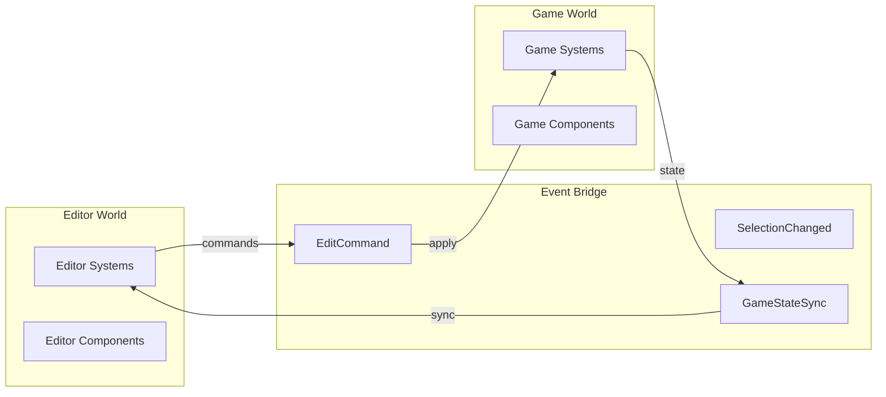
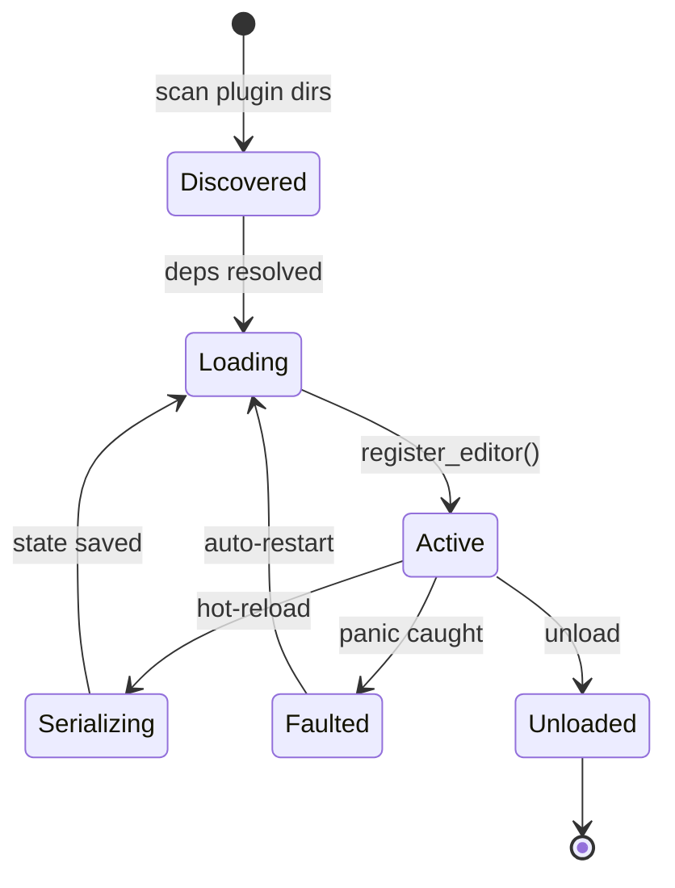
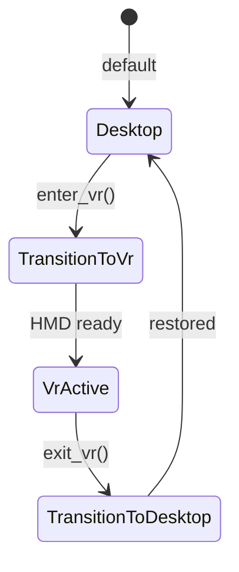

# Editor Core Design

## Requirements Trace

### Editor Framework (F-15.1)

| Feature  | Requirement | User Stories               |
|----------|-------------|----------------------------|
| F-15.1.1 | R-15.1.1   | US-15.1.1.1--US-15.1.1.13  |
| F-15.1.2 | R-15.1.2   | US-15.1.2.1--US-15.1.2.8   |
| F-15.1.3 | R-15.1.3   | US-15.1.3.1--US-15.1.3.9   |
| F-15.1.4 | R-15.1.4   | US-15.1.4.1--US-15.1.4.10  |
| F-15.1.5 | R-15.1.5   | US-15.1.5.1--US-15.1.5.8   |
| F-15.1.6 | R-15.1.6   | US-15.1.6.1--US-15.1.6.6   |
| F-15.1.7 | R-15.1.7   | US-15.1.7.1--US-15.1.7.8   |
| F-15.1.8 | R-15.1.8   | US-15.1.8.1--US-15.1.8.9   |
| F-15.1.9 | R-15.1.9   | US-15.1.9.1--US-15.1.9.8   |

1. **F-15.1.1** -- Dockable panel layout with split, tab, float
2. **F-15.1.2** -- Multiple 3D viewports with independent cameras
3. **F-15.1.3** -- Undo/redo via command pattern with transactions
4. **F-15.1.4** -- Unified selection (click, marquee, lasso, sub-object)
5. **F-15.1.5** -- Transform gizmos with snap and reference frames
6. **F-15.1.6** -- Measurement gizmos (bounds, distance, angle)
7. **F-15.1.7** -- Centralized preferences with versioned JSON
8. **F-15.1.8** -- Editor extension/plugin API with hot reload
9. **F-15.1.9** -- VR editor mode with motion controller gizmos

### Plugin Architecture (F-1.6, F-15.1.8)

| Feature  | Requirement | User Stories              |
|----------|-------------|---------------------------|
| F-1.6.1  | R-1.6.1    | US-1.6.1.1--US-1.6.1.6    |
| F-1.6.2  | R-1.6.2    | US-1.6.2.1--US-1.6.2.5    |
| F-1.6.3  | R-1.6.3    | US-1.6.3.1--US-1.6.3.4    |
| F-1.6.4  | R-1.6.4    | US-1.6.4.1--US-1.6.4.3    |
| F-1.6.5  | R-1.6.5    | US-1.6.5.1--US-1.6.5.4    |
| F-1.6.6  | R-1.6.6    | US-1.6.6.1--US-1.6.6.3    |
| F-1.6.7  | R-1.6.7    | US-1.6.7.1--US-1.6.7.3    |

1. **F-1.6.1** -- Plugin discovery and loading
2. **F-1.6.2** -- Plugin lifecycle management
3. **F-1.6.3** -- Plugin hot-reload with state preservation
4. **F-1.6.4** -- Plugin isolation and crash recovery
5. **F-1.6.5** -- Plugin dependency resolution
6. **F-1.6.6** -- Plugin ABI versioning
7. **F-1.6.7** -- Custom component editors via plugin registration

### VR Editor Mode (F-15.16)

| Feature   | Requirement | User Stories                |
|-----------|-------------|-----------------------------|
| F-15.16.1 | R-15.16.1  | US-15.16.1.1--US-15.16.1.4  |
| F-15.16.2 | R-15.16.2  | US-15.16.2.1--US-15.16.2.5  |
| F-15.16.3 | R-15.16.3  | US-15.16.3.1--US-15.16.3.3  |
| F-15.16.4 | R-15.16.4  | US-15.16.4.1--US-15.16.4.4  |
| F-15.16.5 | R-15.16.5  | US-15.16.5.1--US-15.16.5.3  |

1. **F-15.16.1** -- Hand tracking input for VR editor
2. **F-15.16.2** -- Floating panel UI in VR
3. **F-15.16.3** -- VR collaboration with avatars
4. **F-15.16.4** -- Follow mode for user/AI tracking
5. **F-15.16.5** -- VR performance budget at 90 fps

### Cross-Cutting Dependencies

| Dependency | Source | Consumed API |
|------------|--------|--------------|
| Widget framework | F-13.1 | All editor UI panels |
| Render graph | F-2.3.8 | Viewport + stereo rendering |
| Windowing | F-14.1.1 | Floating panels, HMD |
| Reflection | F-1.3.1--F-1.3.10 | Property inspector |
| Events | F-1.5.1, F-1.5.7 | Event bridge, dispatch |
| Scene/transforms | F-1.2.1, F-1.2.4 | Gizmo manipulation |
| Spatial index | F-1.9.1 | Selection picking |
| Serialization | F-1.4.1--F-1.4.3 | Layout, prefs, undo |
| Threading | F-14.3.1 | Async long-running tasks |
| ECS | F-1.1 | Editor world, game world |
| Collaboration | F-15.12.3 | Presence, avatars |
| Input system | F-14.2 | Motion controllers |

### Non-Functional Requirements

| Requirement | Target | Source |
|-------------|--------|--------|
| UI input ack | < 16 ms | US-15.1.NF1.1 |
| Panel layout ops | < 100 ms | US-15.1.NF1.2 |
| UI thread max block | < 50 ms | US-15.1.NF1.3 |
| Undo/redo per cmd | < 50 ms | US-15.1.3.6 |
| VR frame rate | >= 90 fps | US-15.16.5.1 |
| Motion-to-photon | < 20 ms | US-15.16.5.2 |

## Overview

The editor core is the top-level shell hosting all visual editing tools. It provides the dock/panel
system, viewports, undo/redo, selection, gizmos, property inspection, plugin extensibility, VR mode,
and preferences.

The editor runs as a **separate ECS world** alongside the game world. An `EventBridge` synchronizes
mutations between worlds. All editor UI uses the engine's own widget framework (F-13.1).

### Design Principles

- **Two-world isolation.** Editor state never leaks into the game world.
- **Command-driven mutation.** Every game-world change flows through the undo stack. Direct writes
  are forbidden outside play mode.
- **Reflect-powered inspection.** Auto-generated UI for any component implementing `Reflect`.
- **Plugin-first.** Every built-in panel uses the same plugin API available to third parties.
- **VR is a mode, not a separate app.** VR reuses the editor world, undo, selection, and plugins.
  Only rendering and input differ.

## Architecture

### Dual-World Architecture



### Plugin Lifecycle



### VR Mode State



### Class Diagram

```mermaid
classDiagram
    class DockNode {
        <<enum>>
        Split(direction, ratio, children)
        TabGroup(panels, active_tab)
    }
    class SplitDirection {
        <<enum>>
        Horizontal
        Vertical
    }
    class DockZone {
        <<enum>>
        Left
        Right
        Bottom
        Center
        Floating
    }
    class DockTree {
        -root DockNode
        -floating Vec~FloatingPanel~
        +split(target, dir, panel, ratio) Result
        +add_tab(target, panel) Result
        +float(panel, pos, size) Result
        +dock(panel, target, zone) Result
        +close(panel) Result
    }
    class PanelId {
        +u64 inner
    }
    class PanelDescriptor {
        +PanelId id
        +str name
        +bool allow_multiple
        +DockZone default_zone
        +fn create_fn
    }
    class PanelWidget {
        <<trait>>
        +build(ctx) WidgetNode
        +update(ctx) bool
        +on_close()
    }
    class LayoutProfile {
        +String name
        +DockNode tree
        +Vec~ViewportConfig~ viewport_configs
    }
    class ViewportId {
        +u32 inner
    }
    class ViewportConfig {
        +String name
        +CameraMode camera_mode
        +RenderOverrides render_overrides
        +Vec~DebugOverlay~ overlays
    }
    class CameraMode {
        <<enum>>
        FreeFly
        PlayerPreview
        OrthoTop
        OrthoFront
        OrthoRight
        Orbit
    }
    class DebugOverlay {
        <<enum>>
        Wireframe
        Normals
        UVs
        LightComplexity
        Overdraw
        CollisionBounds
        NavMesh
    }
    class ViewportManager {
        +create(config, window) Result~ViewportId~
        +destroy(id) Result
        +screen_to_ray(id, pos) Option~Ray~
        +build_render_graphs(builder, world)
    }
    class EditorCommand {
        <<trait>>
        +description() str
        +execute(world) Result
        +undo(world) Result
        +size_bytes() usize
    }
    class Transaction {
        -String description
        -Vec commands
    }
    class UndoStack {
        +execute(cmd, world) Result
        +undo(world) Result~bool~
        +redo(world) Result~bool~
        +save_history(path) Future~Result~
        +load_and_replay(path, world) Future~Result~
    }
    class Selectable {
        <<enum>>
        Entity(Entity)
        Asset(AssetId)
        SubObject(entity, element)
    }
    class SubObjectElement {
        <<enum>>
        Vertex(u32)
        Edge(u32)
        Face(u32)
        Bone(u32)
    }
    class SelectionModifier {
        <<enum>>
        Replace
        Add
        Subtract
        Toggle
    }
    class SelectionState {
        -Vec~Selectable~ items
        -Vec~SelectionSet~ saved_sets
        +select(items, modifier)
        +clear()
        +entities() Vec~Entity~
    }
    class GizmoTool {
        <<enum>>
        Translate
        Rotate
        Scale
        Universal
        Custom(GizmoTypeId)
    }
    class GizmoFrame {
        <<enum>>
        World
        Local
        Custom(Entity)
    }
    class GizmoConstraint {
        <<enum>>
        Free
        AxisX
        AxisY
        AxisZ
        PlaneXY
        PlaneXZ
        PlaneYZ
    }
    class GizmoManager {
        +set_tool(tool)
        +set_frame(frame)
        +begin_manipulation(constraint, ray, sel)
        +update_manipulation(ray) Option~GizmoDelta~
        +end_manipulation(world) Option~TransformCommand~
        +hit_test(ray, sel, world) Option~GizmoConstraint~
    }
    class HotKeyMap {
        +bind(hotkey, action)
        +unbind(hotkey)
        +lookup(hotkey) Option~HotKeyAction~
    }
    class PreferenceStore {
        +load(team, user) Future~Result~Self~~
        +get~T~(key) Option~T~
        +set~T~(key, value)
        +migrate(target) Result
    }
    class EditorPlugin {
        <<trait>>
        +metadata() PluginMetadata
        +register_editor(api)
        +on_unload(api)
        +serialize_state() Vec~u8~
        +deserialize_state(data)
    }
    class PluginMetadata {
        +str name
        +SemanticVersion version
        +SemanticVersion min_host_version
        +Vec~PluginDependency~ dependencies
    }
    class PluginHandle {
        +u64 id
        +String name
        +PluginState state
    }
    class PluginState {
        <<enum>>
        Loading
        Active
        Faulted(String)
        Unloading
    }
    class PluginHost {
        -Vec~PluginHandle~ loaded
        -DependencyResolver resolver
        +discover(paths) Vec~PluginMetadata~
        +load(path, api) Result~PluginHandle~
        +unload(handle, api) Result
        +hot_reload(handle, api) Result~PluginHandle~
    }
    class DependencyResolver {
        +resolve(plugins) Result~Vec~LoadOrder~~
        +check_host_compat(meta) Result
    }
    class IsolationScope {
        +allocator PluginAllocator
        +catch_panic(f) Result
    }
    class EditorPluginApi {
        +register_panel(descriptor)
        +register_gizmo(descriptor)
        +register_editor_widget(type_id, factory)
        +add_menu_action(path, action)
        +add_toolbar_button(toolbar, button)
        +register_hotkey(hotkey, action)
        +type_registry() TypeRegistry
    }
    class EditorWidgetFactory {
        +create(component_ref) WidgetNode
        +update(component_ref, widget) bool
        +on_edit(path, old, new) EditorCommand
    }
    class EditorWidgetRegistry {
        -HashMap~TypeId, EditorWidgetFactory~ widgets
        +register(type_id, factory)
        +lookup(type_id) Option~EditorWidgetFactory~
    }
    class VrModeManager {
        +VrModeState state
        +enter_vr() Result
        +exit_vr() Result
        +is_vr_active() bool
        +frame_update(delta_time)
    }
    class VrModeState {
        <<enum>>
        Desktop
        TransitionToVr
        VrActive
        TransitionToDesktop
    }
    class VrInputAdapter {
        +VrInputMode mode
        +process_input(raw) Vec~EditorAction~
    }
    class VrInputMode {
        <<enum>>
        MotionControllers
        HandTracking
    }
    class HandGesture {
        <<enum>>
        None
        Pinch
        Grab
        Point
        OpenPalm
        Fist
    }
    class VrPanelSystem {
        +Vec~VrPanel~ panels
        +spawn_panel(descriptor, anchor) PanelId
        +dismiss_panel(id)
    }
    class VrPanelAnchor {
        <<enum>>
        WorldFixed(Vec3, Quat)
        HandAttached(Hand, Vec3)
        HeadLocked(Vec3)
        Floating
    }
    class VrAvatarSystem {
        +HashMap~UserId, VrAvatar~ avatars
        +update_avatars(presence)
    }
    class VrFollowMode {
        +FollowTarget target
        +FollowState state
        +follow(target) Result
        +break_follow()
    }
    class FollowTarget {
        <<enum>>
        None
        User(UserId)
        AiAgent(AgentId)
    }
    class VrPerfBudget {
        +f32 frame_budget_ms
        +u32 target_fps
        +adjust_quality(frame_time)
    }

    DockTree --> DockNode
    DockNode --> SplitDirection
    PanelDescriptor --> PanelId
    PanelDescriptor --> DockZone
    PanelDescriptor ..> PanelWidget : creates
    LayoutProfile --> DockNode
    ViewportManager --> ViewportConfig
    ViewportConfig --> CameraMode
    ViewportConfig --> DebugOverlay
    UndoStack --> EditorCommand
    UndoStack --> Transaction
    SelectionState --> Selectable
    Selectable --> SubObjectElement
    GizmoManager --> GizmoTool
    GizmoManager --> GizmoFrame
    GizmoManager --> GizmoConstraint
    PluginHost --> PluginHandle
    PluginHost --> DependencyResolver
    PluginHost --> IsolationScope
    EditorPlugin --> PluginMetadata
    EditorPluginApi --> EditorWidgetRegistry
    EditorWidgetRegistry --> EditorWidgetFactory
    VrModeManager --> VrModeState
    VrModeManager --> VrInputAdapter
    VrModeManager --> VrPanelSystem
    VrModeManager --> VrAvatarSystem
    VrModeManager --> VrFollowMode
    VrModeManager --> VrPerfBudget
    VrInputAdapter --> VrInputMode
    VrPanelSystem --> VrPanelAnchor
    VrFollowMode --> FollowTarget
```



## API Design

### Dock Tree and Panels

```rust
/// Unique panel identifier.
#[derive(
    Clone, Copy, Debug, PartialEq, Eq, Hash,
    Reflect,
)]
pub struct PanelId(pub u64);

/// Descriptor registered once per panel type.
pub struct PanelDescriptor {
    pub id: PanelId,
    pub name: &'static str,
    pub icon: Option<AssetHandle>,
    pub allow_multiple: bool,
    pub default_zone: DockZone,
    pub create_fn: fn(
        &mut PanelContext,
    ) -> Box<dyn PanelWidget>,
}

/// Trait implemented by all editor panels.
pub trait PanelWidget: Send {
    fn build(
        &mut self,
        ctx: &mut PanelContext,
    ) -> WidgetNode;
    fn update(
        &mut self,
        ctx: &mut PanelContext,
    ) -> bool;
    fn on_close(&mut self) {}
}

/// The dock layout tree.
#[derive(Debug, Reflect)]
pub enum DockNode {
    Split {
        direction: SplitDirection,
        ratio: f32,
        children: [Box<DockNode>; 2],
    },
    TabGroup {
        panels: Vec<PanelId>,
        active_tab: usize,
    },
}

pub struct DockTree {
    root: DockNode,
    floating: Vec<FloatingPanel>,
}

impl DockTree {
    pub fn split(
        &mut self,
        target: PanelId,
        direction: SplitDirection,
        new_panel: PanelId,
        ratio: f32,
    ) -> Result<(), DockError>;
    pub fn add_tab(
        &mut self,
        target: PanelId,
        new_panel: PanelId,
    ) -> Result<(), DockError>;
    pub fn float(
        &mut self,
        panel: PanelId,
        position: [i32; 2],
        size: [u32; 2],
    ) -> Result<WindowHandle, DockError>;
    pub fn close(
        &mut self,
        panel: PanelId,
    ) -> Result<(), DockError>;
}
```

### Undo/Redo

```rust
/// Reversible editor command.
pub trait EditorCommand: Reflect + Send {
    fn description(&self) -> &str;
    fn execute(
        &mut self,
        world: &mut World,
    ) -> Result<(), CommandError>;
    fn undo(
        &mut self,
        world: &mut World,
    ) -> Result<(), CommandError>;
    fn size_bytes(&self) -> usize;
}

pub struct UndoStack { /* ... */ }

impl UndoStack {
    pub fn execute(
        &mut self,
        command: Box<dyn EditorCommand>,
        world: &mut World,
    ) -> Result<(), CommandError>;
    pub fn undo(
        &mut self,
        world: &mut World,
    ) -> Result<bool, CommandError>;
    pub fn redo(
        &mut self,
        world: &mut World,
    ) -> Result<bool, CommandError>;
    pub async fn save_history(
        &self,
        path: &AssetPath,
    ) -> Result<(), IoError>;
    pub async fn load_and_replay(
        path: &AssetPath,
        world: &mut World,
    ) -> Result<Self, CommandError>;
}
```

### Selection

```rust
#[derive(Clone, Debug, PartialEq, Eq, Hash, Reflect)]
pub enum Selectable {
    Entity(Entity),
    Asset(AssetId),
    SubObject { entity: Entity, element: SubObjectElement },
}

#[derive(Debug, Reflect)]
pub struct SelectionState {
    items: Vec<Selectable>,
    saved_sets: Vec<SelectionSet>,
}

impl SelectionState {
    pub fn select(
        &mut self,
        items: &[Selectable],
        modifier: SelectionModifier,
    );
    pub fn clear(&mut self);
    pub fn entities(&self) -> Vec<Entity>;
    pub fn save_set(&mut self, name: String);
    pub fn restore_set(
        &mut self,
        name: &str,
    ) -> Result<(), SelectionError>;
}
```

### Plugin API

```rust
/// Trait for editor plugins exposed via C ABI.
pub trait EditorPlugin: Send {
    fn metadata(&self) -> PluginMetadata;
    fn register_editor(
        &self,
        api: &mut EditorPluginApi,
    );
    fn on_unload(&self, api: &mut EditorPluginApi);
    fn serialize_state(&self) -> Vec<u8>;
    fn deserialize_state(&mut self, data: &[u8]);
}

/// API surface exposed to plugins.
pub struct EditorPluginApi<'a> {
    panel_registry: &'a mut PanelRegistry,
    widget_registry: &'a mut EditorWidgetRegistry,
    hotkey_map: &'a mut HotKeyMap,
    type_registry: &'a TypeRegistry,
    editor_world: &'a World,
    game_world: &'a World,
}

impl<'a> EditorPluginApi<'a> {
    pub fn register_panel(
        &mut self,
        descriptor: PanelDescriptor,
    );
    pub fn register_gizmo(
        &mut self,
        descriptor: CustomGizmoDescriptor,
    );
    pub fn register_editor_widget(
        &mut self,
        type_id: TypeId,
        factory: EditorWidgetFactory,
    );
    pub fn add_menu_action(
        &mut self,
        menu_path: &str,
        action: MenuAction,
    );
    pub fn register_hotkey(
        &mut self,
        hotkey: HotKey,
        action: HotKeyAction,
    );
}
```

### VR Mode

```rust
pub struct VrModeManager { /* ... */ }

#[derive(Clone, Copy, Debug, PartialEq, Eq)]
pub enum VrModeState {
    Desktop,
    TransitionToVr,
    VrActive,
    TransitionToDesktop,
}

impl VrModeManager {
    pub fn enter_vr(&mut self) -> Result<(), VrError>;
    pub fn exit_vr(&mut self) -> Result<(), VrError>;
    pub fn is_vr_active(&self) -> bool;
    pub fn frame_update(
        &mut self,
        delta_time: f32,
        editor_ctx: &mut EditorContext,
    );
}

pub struct VrInputAdapter { /* ... */ }

impl VrInputAdapter {
    pub fn process_input(
        &mut self,
        left: &ControllerState,
        right: &ControllerState,
    ) -> Vec<EditorAction>;
    pub fn process_hands(
        &mut self,
        left: &HandState,
        right: &HandState,
    ) -> Vec<EditorAction>;
    pub fn pointing_ray(&self) -> Ray;
}
```

## Data Flow

### Editor Frame Loop

1. `Tokio runtime::poll()` processes pending platform events.
2. Editor world runs editor systems (input, UI, gizmos, selection).
3. `EventBridge` flushes editor commands to game world.
4. In edit mode, game world is paused (commands only). In play mode, game systems run and state
   syncs back.
5. Viewport render graphs are built and executed.

### Plugin Loading

1. `PluginHost::discover()` scans for `.dylib`/`.dll`/`.so` files.
2. `harmonius_plugin_metadata()` reads metadata via C ABI.
3. `DependencyResolver` topologically sorts by dependencies.
4. Each plugin loads in order within an `IsolationScope`.
5. `register_editor()` called within `catch_panic()`.

### Component Editor Dispatch

1. User selects an entity in the viewport.
2. `PropertyInspector` enumerates components via `TypeRegistry`.
3. `EditorWidgetRegistry::lookup(type_id)` checks for custom widget.
4. Custom factory or default reflection-based auto-generator builds the inspector panel.
5. Edits produce `EditorCommand` through the undo stack.

## Platform Considerations

| Component | Windows | macOS | Linux |
|-----------|---------|-------|-------|
| Dynamic lib | `.dll` / `LoadLibraryW` | `.dylib` / `dlopen` | `.so` / `dlopen` |
| File watch | `ReadDirectoryChangesW` | `FSEvents` | `inotify` |
| C ABI | MSVC ABI | Clang ABI | GCC/Clang ABI |
| Isolation | SEH catch | `setjmp`/`longjmp` | `setjmp`/`longjmp` |
| VR runtime | OpenXR | OpenXR | OpenXR |

## Test Plan

Test cases are in [editor-core-test-cases.md](editor-core-test-cases.md).

| Category | Count |
|----------|-------|
| Unit tests | 45 |
| Integration tests | 15 |
| Benchmarks | 8 |

1. **Unit** -- Dock tree ops, undo/redo, selection, gizmo math, plugin loading, dependency
   resolution, isolation, hot-reload, widget registry, VR input mapping, VR panel anchoring
2. **Integration** -- End-to-end plugin lifecycle, component editor dispatch, dual-world event
   bridge, VR mode transition, multi-viewport rendering
3. **Benchmarks** -- Undo/redo latency, selection with 10k entities, plugin load time, VR frame
   budget compliance

## Open Questions

1. **Plugin sandboxing depth.** Current design uses `catch_unwind`. Separate-process plugins would
   add IPC overhead but stronger isolation.
2. **VR foveated rendering.** Should the VR viewport integrate eye-tracked foveated rendering to
   meet the 90 fps budget with complex scenes?
3. **Cross-plugin widget composition.** Can a plugin's custom widget embed another plugin's widget?
   Requires transitive dependency resolution in the widget registry.
