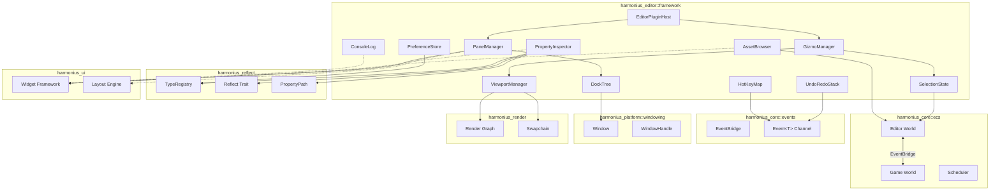
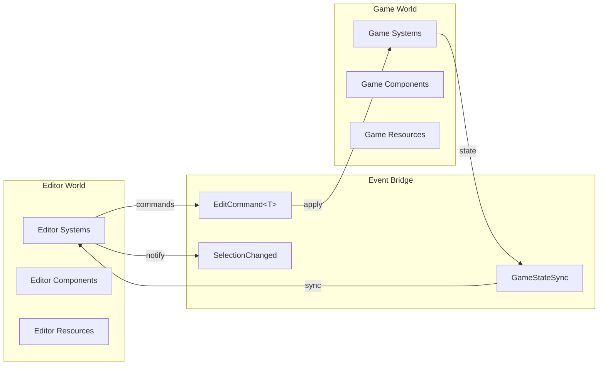
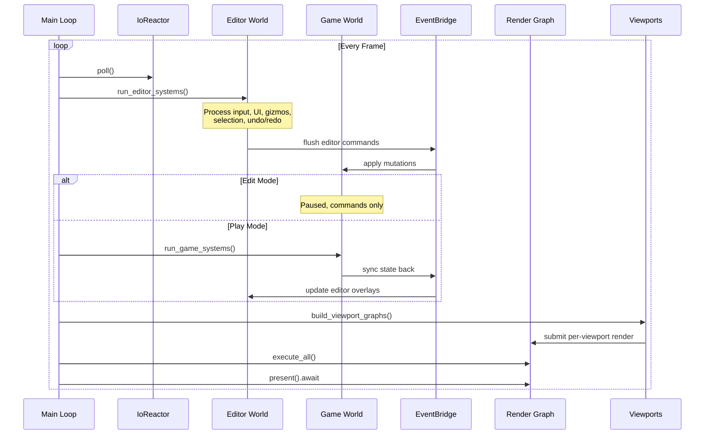
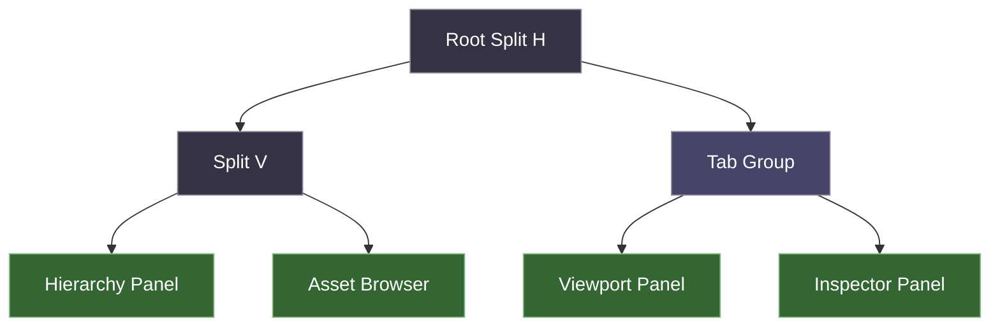
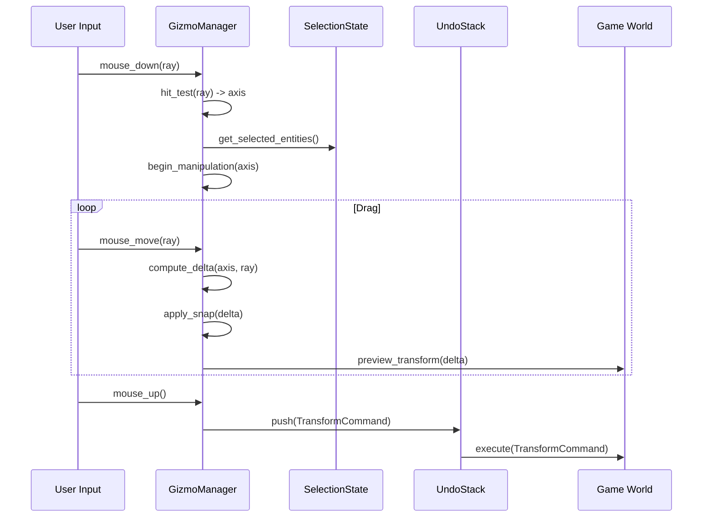
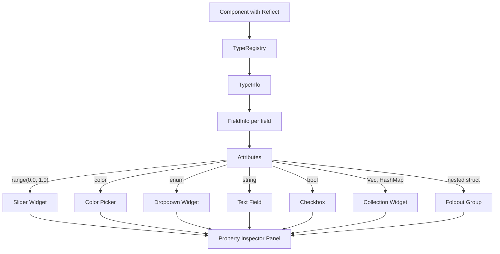
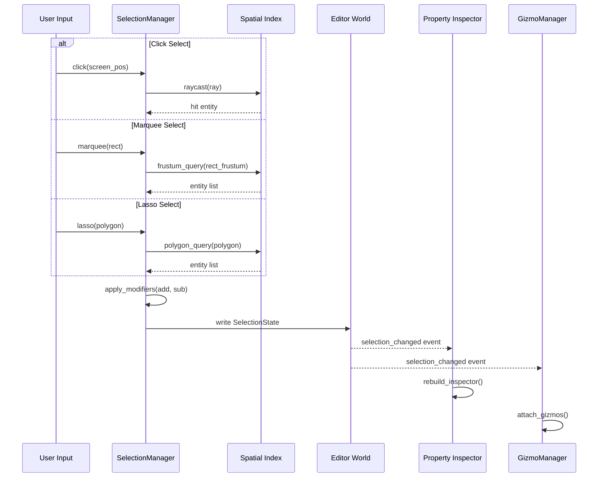

# Editor Framework Design

## Requirements Trace

> **Canonical sources:** Features, requirements, and user stories are defined in
> [features/tools-editor/](../../features/tools-editor/),
> [requirements/tools-editor/](../../requirements/tools-editor/), and
> [user-stories/tools-editor/](../../user-stories/tools-editor/). The table below traces design
> elements to those definitions.

| Feature | Requirement | User Stories | Description |
|---------|-------------|--------------|-------------|
| F-15.1.1 | R-15.1.1 | US-15.1.1.1--US-15.1.1.13 | Dockable panel layout with drag, drop, split, tab, float, and persistent profiles |
| F-15.1.2 | R-15.1.2 | US-15.1.2.1--US-15.1.2.8 | Multiple simultaneous 3D viewports with independent cameras and render settings |
| F-15.1.3 | R-15.1.3 | US-15.1.3.1--US-15.1.3.9 | Undo/redo via command pattern with transaction grouping and crash recovery |
| F-15.1.4 | R-15.1.4 | US-15.1.4.1--US-15.1.4.10 | Unified selection model with click, marquee, lasso, sub-object, and named sets |
| F-15.1.5 | R-15.1.5 | US-15.1.5.1--US-15.1.5.8 | Transform gizmos with axis/plane constraints, snap, and reference frames |
| F-15.1.6 | R-15.1.6 | US-15.1.6.1--US-15.1.6.6 | Bounds, distance, angle, and area measurement gizmos |
| F-15.1.7 | R-15.1.7 | US-15.1.7.1--US-15.1.7.8 | Centralized preferences with versioned JSON and per-user overrides |
| F-15.1.8 | R-15.1.8 | US-15.1.8.1--US-15.1.8.9 | Editor extension/plugin API with hot reload |
| F-15.1.9 | R-15.1.9 | US-15.1.9.1--US-15.1.9.8 | VR editor mode with motion controller gizmos |

### Cross-Cutting Dependencies

| Dependency | Source | Consumed API |
|------------|--------|--------------|
| Widget framework | F-13.1 | All editor UI panels, toolbars, menus |
| Render graph | F-2.3.8 | Viewport rendering pipeline |
| Windowing | F-14.1.1 | Floating panels, multi-window |
| Reflection | F-1.3.1--F-1.3.10 | Property inspector, command serialization |
| Plugin system | F-1.6.1--F-1.6.7 | Editor extension registration, hot reload |
| Events | F-1.5.1, F-1.5.7 | Editor-game event bridge, command dispatch |
| Scene/transforms | F-1.2.1, F-1.2.4 | Gizmo transform manipulation |
| Spatial index | F-1.9.1 | Selection picking, marquee queries |
| Serialization | F-1.4.1--F-1.4.3 | Layout profiles, preferences, undo history |
| Threading | F-14.3.1 | Async long-running tasks with progress |
| ECS | F-1.1 | Editor world, game world, system scheduling |

### Non-Functional Requirements

| Requirement | Target | Source |
|-------------|--------|--------|
| UI input acknowledgement | < 16 ms | US-15.1.NF1.1 |
| Panel layout operations | < 100 ms | US-15.1.NF1.2 |
| UI thread max block | < 50 ms | US-15.1.NF1.3 |
| Undo/redo per command | < 50 ms | US-15.1.3.6 |
| Transaction undo (1000 cmds) | < 200 ms | US-15.1.3.7 |
| Crash recovery replay (10k cmds) | < 10 s | US-15.1.3.8 |
| 99p UI response (10k entities) | Measured | US-15.1.NF1.4 |

## Overview

The editor framework is the top-level shell that hosts all visual editing tools in the Harmonius
engine. It provides the panel/dock system, viewport rendering, undo/redo, selection, gizmos,
property inspection, asset browsing, console/log, hotkeys, preferences, and plugin extensibility.

The editor runs as a **separate ECS world** alongside the game world. Editor-only entities (gizmo
handles, selection highlights, dock tree nodes) live in the editor world and never pollute the game
world. A cross-world `EventBridge` synchronizes state changes between the two worlds so that editor
actions (move entity, change property) are applied to the game world and game world changes (runtime
simulation) are reflected in the editor.

All editor UI is built with the engine's own widget framework (F-13.1). No external GUI libraries.
This guarantees visual consistency between editor and game UI, and allows the editor to dogfood the
widget system.

### Design Principles

- **Two-world isolation.** Editor state never leaks into the game world. The game world can run in
  play mode without editor overhead.
- **Command-driven mutation.** Every game world mutation flows through the undo/redo command stack.
  Direct writes bypass undo and are forbidden outside play mode.
- **Reflect-powered inspection.** The property inspector auto-generates UI for any component
  implementing `Reflect`. No manual editor code per type.
- **Plugin-first extensibility.** Every built-in panel, gizmo, and importer uses the same plugin API
  available to third parties.
- **Static dispatch.** No trait objects on hot paths. Generic `EditorCommand<T>` and `Gizmo<T>` are
  monomorphized.

### Crate Structure

```text
harmonius_editor/
├── framework/
│   ├── dock.rs          # DockTree, DockNode,
│   │                    # DockZone, split/tab/float
│   ├── panel.rs         # PanelId, PanelDescriptor,
│   │                    # PanelRegistry
│   ├── layout.rs        # LayoutProfile, save/load
│   ├── viewport.rs      # ViewportState, camera,
│   │                    # render settings, overlays
│   ├── viewport_mgr.rs  # ViewportManager,
│   │                    # swapchain lifecycle
│   ├── undo.rs          # UndoStack, EditorCommand,
│   │                    # Transaction
│   ├── selection.rs     # SelectionState, SelectionSet,
│   │                    # SelectionMode
│   ├── gizmo.rs         # GizmoManager, GizmoType,
│   │                    # GizmoFrame
│   ├── gizmo_render.rs  # Gizmo mesh generation
│   │                    # and overlay rendering
│   ├── inspector.rs     # PropertyInspector,
│   │                    # ReflectWidget
│   ├── asset_browser.rs # AssetBrowser panel
│   ├── console.rs       # ConsoleLog panel
│   ├── hotkey.rs        # HotKeyMap, HotKeyAction,
│   │                    # conflict detection
│   ├── prefs.rs         # PreferenceStore,
│   │                    # schema migration
│   └── plugin_host.rs   # EditorPluginHost,
│                        # EditorPluginApi
└── builtin/
    ├── panels/          # Hierarchy, inspector,
    │                    # asset browser panels
    ├── gizmos/          # Translate, rotate, scale,
    │                    # bounds, measurement gizmos
    └── importers/       # Default asset importers
```

## Architecture

### Module Boundaries



### Dual-World Architecture

The editor and game run as two separate ECS worlds. The editor world contains UI state, selection,
gizmo handles, and dock layout entities. The game world contains the actual scene being edited. An
`EventBridge` routes typed events between worlds.



In **edit mode**, the game world is paused. Editor commands modify the game world through the event
bridge. In **play mode**, the game world runs its full system schedule. The editor world snapshots
the game world before play so it can restore on stop.

### Editor Frame Loop



### Dock Tree Structure

The dock layout is a binary tree where each leaf is a panel slot and each internal node is a split
(horizontal or vertical). Tab groups are leaves that contain multiple panels sharing one slot.



### Gizmo Interaction Flow



### Property Inspector Generation



### Selection Pipeline



## API Design

### Dock Tree and Panel System

```rust
/// Unique panel identifier.
#[derive(
    Clone, Copy, Debug, PartialEq, Eq, Hash,
    Reflect,
)]
pub struct PanelId(pub u64);

/// Descriptor registered once per panel type.
pub struct PanelDescriptor {
    /// Unique identifier for this panel type.
    pub id: PanelId,
    /// Display name shown in tabs and menus.
    pub name: &'static str,
    /// Icon asset handle for tab display.
    pub icon: Option<AssetHandle>,
    /// Whether multiple instances are allowed.
    pub allow_multiple: bool,
    /// Default dock zone preference.
    pub default_zone: DockZone,
    /// Factory that creates the panel's widget
    /// tree. Called when the panel is opened.
    pub create_fn: fn(
        &mut PanelContext,
    ) -> Box<dyn PanelWidget>,
}

/// Context provided to panel creation and update.
pub struct PanelContext<'a> {
    pub editor_world: &'a World,
    pub game_world: &'a World,
    pub type_registry: &'a TypeRegistry,
    pub selection: &'a SelectionState,
    pub undo_stack: &'a UndoStack,
    pub preferences: &'a PreferenceStore,
    pub event_writer: EventWriter<'a, EditorEvent>,
}

/// Trait implemented by all editor panels.
pub trait PanelWidget: Send {
    /// Build the panel's widget subtree.
    /// Called on open and on layout rebuild.
    fn build(
        &mut self,
        ctx: &mut PanelContext,
    ) -> WidgetNode;

    /// Update the panel's state each frame.
    /// Return true if the widget tree changed
    /// and needs rebuild.
    fn update(
        &mut self,
        ctx: &mut PanelContext,
    ) -> bool;

    /// Called when the panel is closed.
    fn on_close(&mut self) {}
}

/// Preferred dock zone for initial placement.
#[derive(
    Clone, Copy, Debug, PartialEq, Eq, Reflect,
)]
pub enum DockZone {
    Left,
    Right,
    Bottom,
    Center,
    Floating,
}

/// The dock layout tree. Internal nodes are splits;
/// leaves are tab groups containing one or more
/// panels.
#[derive(Debug, Reflect)]
pub enum DockNode {
    Split {
        direction: SplitDirection,
        /// Fraction [0.0, 1.0] for the first
        /// child.
        ratio: f32,
        children: [Box<DockNode>; 2],
    },
    TabGroup {
        panels: Vec<PanelId>,
        active_tab: usize,
    },
}

#[derive(
    Clone, Copy, Debug, PartialEq, Eq, Reflect,
)]
pub enum SplitDirection {
    Horizontal,
    Vertical,
}

/// Manages the dock tree and panel lifecycle.
pub struct DockTree {
    root: DockNode,
    floating: Vec<FloatingPanel>,
}

/// A panel floating in its own native window.
pub struct FloatingPanel {
    pub panel_id: PanelId,
    pub window_handle: WindowHandle,
    pub position: [i32; 2],
    pub size: [u32; 2],
}

impl DockTree {
    pub fn new(root: DockNode) -> Self;

    /// Split a panel's slot in the given direction.
    /// The new panel occupies the second half.
    pub fn split(
        &mut self,
        target: PanelId,
        direction: SplitDirection,
        new_panel: PanelId,
        ratio: f32,
    ) -> Result<(), DockError>;

    /// Add a panel as a new tab in an existing
    /// tab group.
    pub fn add_tab(
        &mut self,
        target: PanelId,
        new_panel: PanelId,
    ) -> Result<(), DockError>;

    /// Float a panel into its own native window.
    pub fn float(
        &mut self,
        panel: PanelId,
        position: [i32; 2],
        size: [u32; 2],
    ) -> Result<WindowHandle, DockError>;

    /// Dock a floating panel back into the tree.
    pub fn dock(
        &mut self,
        panel: PanelId,
        target: PanelId,
        zone: DockZone,
    ) -> Result<(), DockError>;

    /// Close a panel. Removes from tab group;
    /// collapses empty splits.
    pub fn close(
        &mut self,
        panel: PanelId,
    ) -> Result<(), DockError>;

    /// Set the split ratio for a split node
    /// containing the target panel.
    pub fn set_split_ratio(
        &mut self,
        target: PanelId,
        ratio: f32,
    ) -> Result<(), DockError>;
}

/// A saved, named layout profile.
#[derive(Debug, Reflect)]
pub struct LayoutProfile {
    pub name: String,
    pub tree: DockNode,
    pub floating: Vec<FloatingPanelLayout>,
    pub viewport_configs: Vec<ViewportConfig>,
}

/// Persisted floating panel position/size.
#[derive(Debug, Reflect)]
pub struct FloatingPanelLayout {
    pub panel_id: PanelId,
    pub position: [i32; 2],
    pub size: [u32; 2],
}

impl LayoutProfile {
    /// Serialize to versioned JSON for VCS.
    pub async fn save(
        &self,
        path: &AssetPath,
    ) -> Result<(), IoError>;

    /// Deserialize from JSON with schema
    /// migration.
    pub async fn load(
        path: &AssetPath,
    ) -> Result<Self, LayoutError>;
}
```

### Viewport System

```rust
/// Configuration for a single viewport.
#[derive(Debug, Clone, Reflect)]
pub struct ViewportConfig {
    /// Display name for the viewport tab.
    pub name: String,
    /// Camera mode (free-fly, player preview,
    /// orthographic top/front/side).
    pub camera_mode: CameraMode,
    /// Per-viewport render settings overrides.
    pub render_overrides: RenderOverrides,
    /// Active debug overlays.
    pub overlays: Vec<DebugOverlay>,
    /// Grid visibility and spacing.
    pub grid: GridConfig,
}

/// Camera modes available in editor viewports.
#[derive(
    Clone, Copy, Debug, PartialEq, Eq, Reflect,
)]
pub enum CameraMode {
    /// Free-fly with WASD + mouse look.
    FreeFly,
    /// Mirrors the game's active player camera.
    PlayerPreview,
    /// Orthographic projections.
    OrthoTop,
    OrthoFront,
    OrthoRight,
    /// Orbit around selection center.
    Orbit,
}

/// Debug overlays rendered per viewport.
#[derive(
    Clone, Copy, Debug, PartialEq, Eq, Reflect,
)]
pub enum DebugOverlay {
    Wireframe,
    Normals,
    UVs,
    LightComplexity,
    Overdraw,
    CollisionBounds,
    NavMesh,
}

/// Per-viewport render setting overrides.
#[derive(Debug, Clone, Reflect)]
pub struct RenderOverrides {
    pub lighting: Option<LightingMode>,
    pub shadows: Option<bool>,
    pub post_processing: Option<bool>,
    pub resolution_scale: Option<f32>,
}

#[derive(
    Clone, Copy, Debug, PartialEq, Eq, Reflect,
)]
pub enum LightingMode {
    FullyLit,
    Unlit,
    DiffuseOnly,
    SpecularOnly,
}

/// Grid rendering configuration.
#[derive(Debug, Clone, Reflect)]
pub struct GridConfig {
    pub visible: bool,
    pub spacing: f32,
    pub major_line_interval: u32,
    pub color: [f32; 4],
    pub major_color: [f32; 4],
}

/// Manages all active viewports.
pub struct ViewportManager { /* ... */ }

/// Opaque handle to a viewport instance.
#[derive(
    Clone, Copy, Debug, PartialEq, Eq, Hash,
)]
pub struct ViewportId(pub u32);

impl ViewportManager {
    pub fn new() -> Self;

    /// Create a new viewport with its own
    /// swapchain. Returns a handle for reference.
    pub fn create(
        &mut self,
        config: ViewportConfig,
        window: &Window,
    ) -> Result<ViewportId, ViewportError>;

    /// Destroy a viewport and release its
    /// swapchain.
    pub fn destroy(
        &mut self,
        id: ViewportId,
    ) -> Result<(), ViewportError>;

    /// Get the camera transform for a viewport.
    pub fn camera_transform(
        &self,
        id: ViewportId,
    ) -> Option<&Transform>;

    /// Set the camera transform for a viewport.
    pub fn set_camera_transform(
        &mut self,
        id: ViewportId,
        transform: Transform,
    );

    /// Build render graph nodes for all active
    /// viewports. Each viewport injects its own
    /// camera, render overrides, and overlays
    /// into a render graph subgraph.
    pub fn build_render_graphs(
        &self,
        graph_builder: &mut RenderGraphBuilder,
        game_world: &World,
    );

    /// Convert screen coordinates to a world-space
    /// ray for the given viewport.
    pub fn screen_to_ray(
        &self,
        id: ViewportId,
        screen_pos: [f32; 2],
    ) -> Option<Ray>;

    /// Number of active viewports.
    pub fn count(&self) -> u32;
}
```

### Undo/Redo System

```rust
/// Trait for all editor commands. Each command
/// must be reversible and serializable for crash
/// recovery.
pub trait EditorCommand: Reflect + Send {
    /// Human-readable description for the undo
    /// history panel.
    fn description(&self) -> &str;

    /// Apply the command to the game world.
    fn execute(
        &mut self,
        world: &mut World,
    ) -> Result<(), CommandError>;

    /// Reverse the command, restoring previous
    /// state.
    fn undo(
        &mut self,
        world: &mut World,
    ) -> Result<(), CommandError>;

    /// Size in bytes for memory budget tracking.
    fn size_bytes(&self) -> usize;
}

/// A group of commands that undo/redo as one step.
pub struct Transaction {
    description: String,
    commands: Vec<Box<dyn EditorCommand>>,
}

impl Transaction {
    pub fn new(description: String) -> Self;

    /// Append a command to the transaction.
    pub fn push(
        &mut self,
        command: Box<dyn EditorCommand>,
    );

    pub fn len(&self) -> usize;
    pub fn is_empty(&self) -> bool;
}

/// The undo/redo stack.
pub struct UndoStack { /* ... */ }

impl UndoStack {
    pub fn new() -> Self;

    /// Execute a single command and push it
    /// onto the undo stack. Clears the redo
    /// stack.
    pub fn execute(
        &mut self,
        command: Box<dyn EditorCommand>,
        world: &mut World,
    ) -> Result<(), CommandError>;

    /// Execute a transaction (group of commands)
    /// as a single undo step.
    pub fn execute_transaction(
        &mut self,
        transaction: Transaction,
        world: &mut World,
    ) -> Result<(), CommandError>;

    /// Begin a transaction. All subsequent
    /// `execute` calls are grouped until
    /// `commit_transaction` is called.
    pub fn begin_transaction(
        &mut self,
        description: String,
    );

    /// Commit the active transaction as a single
    /// undo entry.
    pub fn commit_transaction(
        &mut self,
        world: &mut World,
    ) -> Result<(), CommandError>;

    /// Undo the most recent command or
    /// transaction.
    pub fn undo(
        &mut self,
        world: &mut World,
    ) -> Result<bool, CommandError>;

    /// Redo the most recently undone command or
    /// transaction.
    pub fn redo(
        &mut self,
        world: &mut World,
    ) -> Result<bool, CommandError>;

    /// Whether undo is available.
    pub fn can_undo(&self) -> bool;

    /// Whether redo is available.
    pub fn can_redo(&self) -> bool;

    /// Description of the next undo action.
    pub fn undo_description(
        &self,
    ) -> Option<&str>;

    /// Description of the next redo action.
    pub fn redo_description(
        &self,
    ) -> Option<&str>;

    /// Number of entries in the undo stack.
    pub fn undo_count(&self) -> usize;

    /// Number of entries in the redo stack.
    pub fn redo_count(&self) -> usize;

    /// Total memory used by all commands.
    pub fn memory_bytes(&self) -> usize;

    /// Serialize the undo history for crash
    /// recovery.
    pub async fn save_history(
        &self,
        path: &AssetPath,
    ) -> Result<(), IoError>;

    /// Replay saved history for crash recovery.
    pub async fn load_and_replay(
        path: &AssetPath,
        world: &mut World,
    ) -> Result<Self, CommandError>;

    /// Clear all undo/redo history.
    pub fn clear(&mut self);
}
```

### Built-In Command Types

```rust
/// Transform one or more entities.
#[derive(Debug, Reflect)]
pub struct TransformCommand {
    pub entities: Vec<Entity>,
    pub old_transforms: Vec<Transform>,
    pub new_transforms: Vec<Transform>,
}

/// Set a reflected property by path.
#[derive(Debug, Reflect)]
pub struct SetPropertyCommand {
    pub entity: Entity,
    pub path: PropertyPath,
    pub old_value: DynamicValue,
    pub new_value: DynamicValue,
}

/// Add a component to an entity.
#[derive(Debug, Reflect)]
pub struct AddComponentCommand {
    pub entity: Entity,
    pub component_type: TypeId,
    pub value: DynamicValue,
}

/// Remove a component from an entity.
#[derive(Debug, Reflect)]
pub struct RemoveComponentCommand {
    pub entity: Entity,
    pub component_type: TypeId,
    pub saved_value: DynamicValue,
}

/// Spawn a new entity with components.
#[derive(Debug, Reflect)]
pub struct SpawnEntityCommand {
    pub spawned_entity: Option<Entity>,
    pub components: Vec<DynamicValue>,
    pub parent: Option<Entity>,
}

/// Despawn an entity, saving its state for undo.
#[derive(Debug, Reflect)]
pub struct DespawnEntityCommand {
    pub entity: Entity,
    pub saved_components: Vec<DynamicValue>,
    pub saved_children: Vec<Entity>,
    pub parent: Option<Entity>,
}

/// Reparent an entity in the hierarchy.
#[derive(Debug, Reflect)]
pub struct ReparentCommand {
    pub entity: Entity,
    pub old_parent: Option<Entity>,
    pub new_parent: Option<Entity>,
    pub old_sibling_index: usize,
    pub new_sibling_index: usize,
}
```

### Selection System

```rust
/// What kind of object is selected.
#[derive(
    Clone, Debug, PartialEq, Eq, Hash, Reflect,
)]
pub enum Selectable {
    /// A scene entity.
    Entity(Entity),
    /// An asset in the asset database.
    Asset(AssetId),
    /// A sub-object element (vertex, face, bone).
    SubObject {
        entity: Entity,
        element: SubObjectElement,
    },
}

/// Sub-object element identifiers.
#[derive(
    Clone, Debug, PartialEq, Eq, Hash, Reflect,
)]
pub enum SubObjectElement {
    Vertex(u32),
    Edge(u32),
    Face(u32),
    Bone(u32),
}

/// Selection modifier keys.
#[derive(
    Clone, Copy, Debug, PartialEq, Eq, Reflect,
)]
pub enum SelectionModifier {
    /// Replace current selection.
    Replace,
    /// Add to current selection (Shift).
    Add,
    /// Remove from current selection (Ctrl).
    Subtract,
    /// Toggle membership (Ctrl+Shift).
    Toggle,
}

/// Selection mode determining pick behavior.
#[derive(
    Clone, Copy, Debug, PartialEq, Eq, Reflect,
)]
pub enum SelectionMode {
    /// Single click raycast.
    Click,
    /// Rectangular box selection.
    Marquee,
    /// Freeform polygon selection.
    Lasso,
}

/// A named, saveable group of selected objects.
#[derive(Debug, Clone, Reflect)]
pub struct SelectionSet {
    pub name: String,
    pub items: Vec<Selectable>,
}

/// The current selection state. Stored as an
/// ECS resource in the editor world.
#[derive(Debug, Reflect)]
pub struct SelectionState {
    /// Currently selected items (ordered).
    items: Vec<Selectable>,
    /// Named selection sets for recall.
    saved_sets: Vec<SelectionSet>,
}

impl SelectionState {
    pub fn new() -> Self;

    /// Select items with the given modifier.
    pub fn select(
        &mut self,
        items: &[Selectable],
        modifier: SelectionModifier,
    );

    /// Clear the entire selection.
    pub fn clear(&mut self);

    /// Get all currently selected items.
    pub fn items(&self) -> &[Selectable];

    /// Get only entity selections.
    pub fn entities(&self) -> Vec<Entity>;

    /// Check if a specific item is selected.
    pub fn contains(
        &self,
        item: &Selectable,
    ) -> bool;

    /// Number of selected items.
    pub fn count(&self) -> usize;

    /// Save the current selection as a named set.
    pub fn save_set(
        &mut self,
        name: String,
    );

    /// Restore a named selection set.
    pub fn restore_set(
        &mut self,
        name: &str,
    ) -> Result<(), SelectionError>;

    /// Delete a named selection set.
    pub fn delete_set(
        &mut self,
        name: &str,
    ) -> Result<(), SelectionError>;

    /// List all saved selection sets.
    pub fn saved_sets(&self) -> &[SelectionSet];

    /// Select items matching a predicate.
    pub fn select_by<F>(
        &mut self,
        world: &World,
        predicate: F,
        modifier: SelectionModifier,
    ) where
        F: Fn(Entity, &World) -> bool;
}
```

### Gizmo System

```rust
/// Active gizmo tool type.
#[derive(
    Clone, Copy, Debug, PartialEq, Eq, Reflect,
)]
pub enum GizmoTool {
    Translate,
    Rotate,
    Scale,
    /// Combined translate + rotate + scale.
    Universal,
    /// Custom gizmo registered by plugin.
    Custom(GizmoTypeId),
}

/// Reference frame for gizmo orientation.
#[derive(
    Clone, Copy, Debug, PartialEq, Eq, Reflect,
)]
pub enum GizmoFrame {
    /// Aligned to world axes.
    World,
    /// Aligned to the selected entity's local
    /// axes.
    Local,
    /// Aligned to a user-defined reference frame.
    Custom(Entity),
}

/// Axis or plane constraint during manipulation.
#[derive(
    Clone, Copy, Debug, PartialEq, Eq, Reflect,
)]
pub enum GizmoConstraint {
    /// No constraint — free movement.
    Free,
    /// Single axis constraint.
    AxisX,
    AxisY,
    AxisZ,
    /// Plane constraints (move on plane).
    PlaneXY,
    PlaneXZ,
    PlaneYZ,
}

/// Snap configuration for gizmo operations.
#[derive(Debug, Clone, Reflect)]
pub struct SnapConfig {
    pub enabled: bool,
    /// Translation snap in world units.
    pub translate_increment: f32,
    /// Rotation snap in degrees.
    pub rotate_increment: f32,
    /// Scale snap as a multiplier.
    pub scale_increment: f32,
}

/// Unique identifier for custom gizmo types
/// registered by plugins.
#[derive(
    Clone, Copy, Debug, PartialEq, Eq, Hash,
    Reflect,
)]
pub struct GizmoTypeId(pub u64);

/// Registration info for a custom gizmo.
pub struct CustomGizmoDescriptor {
    pub id: GizmoTypeId,
    pub name: &'static str,
    pub icon: Option<AssetHandle>,
    /// Factory for creating the gizmo's visual
    /// representation.
    pub create_fn: fn() -> Box<dyn CustomGizmo>,
}

/// Trait for plugin-defined custom gizmos.
pub trait CustomGizmo: Send {
    /// Generate the gizmo mesh for rendering as
    /// a viewport overlay.
    fn build_mesh(
        &self,
        selection: &SelectionState,
        world: &World,
    ) -> GizmoMesh;

    /// Hit-test the gizmo against a ray.
    /// Returns the constraint axis/plane if hit.
    fn hit_test(
        &self,
        ray: &Ray,
        selection: &SelectionState,
        world: &World,
    ) -> Option<GizmoConstraint>;

    /// Compute the manipulation delta during
    /// drag.
    fn compute_delta(
        &self,
        constraint: GizmoConstraint,
        drag_ray: &Ray,
        start_ray: &Ray,
    ) -> GizmoDelta;
}

/// Manipulation delta produced by a gizmo drag.
#[derive(Debug, Clone, Reflect)]
pub struct GizmoDelta {
    pub translation: [f32; 3],
    pub rotation_degrees: [f32; 3],
    pub scale: [f32; 3],
}

/// Manages the active gizmo and its interaction
/// state.
pub struct GizmoManager { /* ... */ }

impl GizmoManager {
    pub fn new() -> Self;

    /// Set the active gizmo tool.
    pub fn set_tool(&mut self, tool: GizmoTool);

    /// Get the active gizmo tool.
    pub fn tool(&self) -> GizmoTool;

    /// Set the reference frame.
    pub fn set_frame(
        &mut self,
        frame: GizmoFrame,
    );

    /// Get the reference frame.
    pub fn frame(&self) -> GizmoFrame;

    /// Set the snap configuration.
    pub fn set_snap(
        &mut self,
        config: SnapConfig,
    );

    /// Get the snap configuration.
    pub fn snap(&self) -> &SnapConfig;

    /// Begin a gizmo manipulation. Called on
    /// mouse down after successful hit test.
    pub fn begin_manipulation(
        &mut self,
        constraint: GizmoConstraint,
        start_ray: Ray,
        selection: &SelectionState,
        world: &World,
    );

    /// Update the manipulation with a new ray.
    /// Returns the accumulated delta for preview.
    pub fn update_manipulation(
        &mut self,
        current_ray: Ray,
    ) -> Option<GizmoDelta>;

    /// End the manipulation. Returns the final
    /// command for the undo stack.
    pub fn end_manipulation(
        &mut self,
        world: &World,
    ) -> Option<TransformCommand>;

    /// Cancel an in-progress manipulation,
    /// reverting to the start state.
    pub fn cancel_manipulation(&mut self);

    /// Whether a manipulation is in progress.
    pub fn is_manipulating(&self) -> bool;

    /// Register a custom gizmo type from a
    /// plugin.
    pub fn register_custom(
        &mut self,
        descriptor: CustomGizmoDescriptor,
    );

    /// Build gizmo overlay meshes for the
    /// current selection and tool.
    pub fn build_overlay(
        &self,
        selection: &SelectionState,
        viewport: &ViewportState,
        world: &World,
    ) -> Vec<GizmoMesh>;

    /// Hit-test the active gizmo against a ray.
    pub fn hit_test(
        &self,
        ray: &Ray,
        selection: &SelectionState,
        world: &World,
    ) -> Option<GizmoConstraint>;
}
```

### Measurement Gizmos

```rust
/// Types of measurement gizmo.
#[derive(
    Clone, Copy, Debug, PartialEq, Eq, Reflect,
)]
pub enum MeasurementType {
    Distance,
    Angle,
    Area,
    BoundsAABB,
    BoundsOBB,
}

/// A measurement placed in the viewport.
#[derive(Debug, Clone, Reflect)]
pub struct Measurement {
    pub measurement_type: MeasurementType,
    pub points: Vec<[f32; 3]>,
    pub result: MeasurementResult,
}

/// Result of a measurement computation.
#[derive(Debug, Clone, Reflect)]
pub enum MeasurementResult {
    Distance { meters: f64 },
    Angle { degrees: f64 },
    Area { square_meters: f64 },
    Bounds { min: [f32; 3], max: [f32; 3] },
}
```

### Property Inspector

```rust
/// Generates editor UI widgets from reflected
/// component types. Reads TypeInfo and field
/// attributes to select appropriate widgets.
pub struct PropertyInspector { /* ... */ }

impl PropertyInspector {
    pub fn new() -> Self;

    /// Build a widget tree for inspecting the
    /// selected entities' shared components.
    /// Components present on all selected entities
    /// are shown; differing values display
    /// "Mixed".
    pub fn build_widgets(
        &self,
        selection: &SelectionState,
        game_world: &World,
        type_registry: &TypeRegistry,
    ) -> WidgetNode;

    /// Register a custom widget factory for a
    /// specific type. Overrides the default
    /// auto-generated widget.
    pub fn register_widget<T: Reflect>(
        &mut self,
        factory: fn(
            &dyn Reflect,
            &PropertyPath,
        ) -> WidgetNode,
    );
}

/// Attribute-driven widget selection rules.
///
/// | Attribute | Widget | Example |
/// |-----------|--------|---------|
/// | `#[reflect(range(min, max))]` | Slider | `f32` in `[0.0, 1.0]` |
/// | `#[reflect(color)]` | Color picker | `[f32; 4]` RGBA |
/// | `#[reflect(asset)]` | Asset reference picker | `AssetHandle` |
/// | `#[reflect(multiline)]` | Text area | Long `String` |
/// | `#[reflect(hidden)]` | (omitted) | Internal fields |
/// | `#[reflect(readonly)]` | Disabled display | Computed values |
/// | enum | Dropdown | Enum variants |
/// | `bool` | Checkbox | Toggle |
/// | `Vec<T>` | Expandable list | Collections |
/// | `HashMap<K, V>` | Key-value table | Maps |
/// | nested struct | Foldout group | Grouped fields |
```

### Hotkey System

```rust
/// A physical key with optional modifiers.
#[derive(
    Clone, Debug, PartialEq, Eq, Hash, Reflect,
)]
pub struct HotKey {
    pub key: KeyCode,
    pub ctrl: bool,
    pub shift: bool,
    pub alt: bool,
    /// macOS Cmd key. Ignored on other platforms.
    pub meta: bool,
}

/// Identifier for a bindable editor action.
#[derive(
    Clone, Debug, PartialEq, Eq, Hash, Reflect,
)]
pub struct HotKeyAction(pub String);

/// The hotkey binding map. Stored as a resource
/// in the editor world.
pub struct HotKeyMap { /* ... */ }

impl HotKeyMap {
    pub fn new() -> Self;

    /// Bind a hotkey to an action. Returns the
    /// previous binding if one existed.
    pub fn bind(
        &mut self,
        hotkey: HotKey,
        action: HotKeyAction,
    ) -> Option<HotKeyAction>;

    /// Unbind a hotkey.
    pub fn unbind(
        &mut self,
        hotkey: &HotKey,
    ) -> Option<HotKeyAction>;

    /// Look up the action for a hotkey.
    pub fn lookup(
        &self,
        hotkey: &HotKey,
    ) -> Option<&HotKeyAction>;

    /// Look up all hotkeys bound to an action.
    pub fn bindings_for(
        &self,
        action: &HotKeyAction,
    ) -> Vec<&HotKey>;

    /// Detect conflicting bindings (same hotkey
    /// bound to multiple actions).
    pub fn conflicts(
        &self,
    ) -> Vec<(&HotKey, Vec<&HotKeyAction>)>;

    /// Reset all bindings to defaults.
    pub fn reset_to_defaults(&mut self);

    /// Load user bindings from preferences,
    /// layered on top of defaults.
    pub fn load_from_prefs(
        &mut self,
        prefs: &PreferenceStore,
    );
}

/// Default hotkey bindings.
///
/// | Action | Hotkey |
/// |--------|--------|
/// | Undo | Ctrl+Z |
/// | Redo | Ctrl+Shift+Z |
/// | Delete | Delete |
/// | Duplicate | Ctrl+D |
/// | Select All | Ctrl+A |
/// | Deselect | Escape |
/// | Translate | W |
/// | Rotate | E |
/// | Scale | R |
/// | Focus Selection | F |
/// | Toggle Grid Snap | G |
/// | Save | Ctrl+S |
/// | Play | Ctrl+P |
/// | Pause | Ctrl+Shift+P |
```

### Preference Store

```rust
/// Layered preference store: team defaults
/// overlaid by per-user overrides.
pub struct PreferenceStore { /* ... */ }

/// Schema version for preference migration.
#[derive(
    Clone, Copy, Debug, PartialEq, Eq,
    PartialOrd, Ord, Reflect,
)]
pub struct PreferenceVersion(pub u32);

impl PreferenceStore {
    pub fn new() -> Self;

    /// Load team defaults and per-user overrides.
    pub async fn load(
        team_path: &AssetPath,
        user_path: &AssetPath,
    ) -> Result<Self, PreferenceError>;

    /// Save per-user overrides only.
    pub async fn save_user(
        &self,
        path: &AssetPath,
    ) -> Result<(), IoError>;

    /// Get a preference value by key. Checks
    /// user overrides first, then team defaults.
    pub fn get<T: FromReflect>(
        &self,
        key: &str,
    ) -> Option<T>;

    /// Set a per-user override.
    pub fn set<T: Reflect>(
        &mut self,
        key: &str,
        value: T,
    );

    /// Remove a per-user override, restoring
    /// the team default.
    pub fn remove_override(
        &mut self,
        key: &str,
    ) -> bool;

    /// Check whether a key has a user override.
    pub fn has_override(
        &self,
        key: &str,
    ) -> bool;

    /// Get the schema version for migration.
    pub fn version(&self) -> PreferenceVersion;

    /// Run schema migrations to bring old
    /// preference files up to date.
    pub fn migrate(
        &mut self,
        target: PreferenceVersion,
    ) -> Result<(), PreferenceError>;
}
```

### Editor Plugin Host

```rust
/// Trait for editor plugins. Uses the same plugin
/// infrastructure as engine plugins (F-1.6) but
/// adds editor-specific registration points.
pub trait EditorPlugin: Plugin {
    /// Register panels, gizmos, menu items, and
    /// toolbar buttons with the editor.
    fn register_editor(
        &self,
        api: &mut EditorPluginApi,
    );

    /// Called when the plugin is about to be
    /// unloaded. Remove all UI elements.
    fn on_unload(&self, api: &mut EditorPluginApi);
}

/// API surface exposed to editor plugins for
/// registering UI extensions.
pub struct EditorPluginApi<'a> {
    panel_registry: &'a mut PanelRegistry,
    gizmo_manager: &'a mut GizmoManager,
    hotkey_map: &'a mut HotKeyMap,
    menu_registry: &'a mut MenuRegistry,
    toolbar_registry: &'a mut ToolbarRegistry,
}

impl<'a> EditorPluginApi<'a> {
    /// Register a new panel type.
    pub fn register_panel(
        &mut self,
        descriptor: PanelDescriptor,
    );

    /// Unregister a panel type and close all
    /// instances.
    pub fn unregister_panel(
        &mut self,
        id: PanelId,
    );

    /// Register a custom gizmo.
    pub fn register_gizmo(
        &mut self,
        descriptor: CustomGizmoDescriptor,
    );

    /// Add a context menu action.
    pub fn add_menu_action(
        &mut self,
        menu_path: &str,
        action: MenuAction,
    );

    /// Add a toolbar button.
    pub fn add_toolbar_button(
        &mut self,
        toolbar: &str,
        button: ToolbarButton,
    );

    /// Register a hotkey binding.
    pub fn register_hotkey(
        &mut self,
        hotkey: HotKey,
        action: HotKeyAction,
    );
}

/// Manages loading, unloading, and hot-reloading
/// of editor plugins.
pub struct EditorPluginHost { /* ... */ }

impl EditorPluginHost {
    pub fn new() -> Self;

    /// Load a plugin by path. Calls
    /// `register_editor`.
    pub fn load(
        &mut self,
        path: &AssetPath,
        api: &mut EditorPluginApi,
    ) -> Result<PluginHandle, PluginError>;

    /// Unload a plugin. Calls `on_unload` to
    /// clean up UI elements, then closes the
    /// dynamic library.
    pub fn unload(
        &mut self,
        handle: PluginHandle,
        api: &mut EditorPluginApi,
    ) -> Result<(), PluginError>;

    /// Hot-reload a plugin: unload old version,
    /// load new version, preserve state where
    /// possible.
    pub fn hot_reload(
        &mut self,
        handle: PluginHandle,
        api: &mut EditorPluginApi,
    ) -> Result<PluginHandle, PluginError>;

    /// List all loaded plugins.
    pub fn loaded(
        &self,
    ) -> &[PluginHandle];
}
```

### Console / Log Panel

```rust
/// Log severity level.
#[derive(
    Clone, Copy, Debug, PartialEq, Eq,
    PartialOrd, Ord, Reflect,
)]
pub enum LogLevel {
    Trace,
    Debug,
    Info,
    Warn,
    Error,
}

/// A log entry displayed in the console panel.
#[derive(Debug, Clone, Reflect)]
pub struct LogEntry {
    pub level: LogLevel,
    pub timestamp_ms: u64,
    pub source: String,
    pub message: String,
}

/// Console panel state. Stored as a resource in
/// the editor world.
pub struct ConsoleState { /* ... */ }

impl ConsoleState {
    pub fn new(capacity: usize) -> Self;

    /// Append a log entry. Oldest entries are
    /// evicted when capacity is reached.
    pub fn push(&mut self, entry: LogEntry);

    /// Get entries matching the current filter.
    pub fn filtered(
        &self,
        min_level: LogLevel,
        source_filter: Option<&str>,
        text_filter: Option<&str>,
    ) -> Vec<&LogEntry>;

    /// Clear all entries.
    pub fn clear(&mut self);

    /// Total entry count.
    pub fn count(&self) -> usize;

    /// Count by severity level.
    pub fn count_by_level(
        &self,
        level: LogLevel,
    ) -> usize;
}
```

### Error Types

```rust
#[derive(Debug)]
pub enum DockError {
    PanelNotFound(PanelId),
    CannotSplitFloating,
    InvalidRatio(f32),
    WindowCreationFailed,
}

#[derive(Debug)]
pub enum ViewportError {
    NotFound(ViewportId),
    SwapchainCreationFailed,
    MaxViewportsReached,
}

#[derive(Debug)]
pub enum CommandError {
    ExecutionFailed { description: String },
    UndoFailed { description: String },
    NoActiveTransaction,
    HistoryCorrupted,
}

#[derive(Debug)]
pub enum SelectionError {
    SetNotFound(String),
    EmptySelection,
}

#[derive(Debug)]
pub enum LayoutError {
    IoError(IoError),
    ParseError(String),
    SchemaMismatch {
        found: PreferenceVersion,
        expected: PreferenceVersion,
    },
}

#[derive(Debug)]
pub enum PreferenceError {
    IoError(IoError),
    ParseError(String),
    MigrationFailed {
        from: PreferenceVersion,
        to: PreferenceVersion,
    },
    KeyNotFound(String),
}
```

## Data Flow

### Edit Mode: Property Change

A user modifies a component property through the property inspector. The change flows through the
undo system and event bridge to the game world.

```rust
// 1. Inspector detects value change via widget
//    callback
let old = world.get_reflect(entity, &path);
let new = widget.value();

// 2. Create a SetPropertyCommand
let cmd = SetPropertyCommand {
    entity,
    path: path.clone(),
    old_value: old.clone_dynamic(),
    new_value: new.clone_dynamic(),
};

// 3. Execute through undo stack
undo_stack.execute(Box::new(cmd), game_world)?;

// 4. UndoStack calls cmd.execute(game_world),
//    which applies:
//    game_world.set_reflect(entity, &path, &new);

// 5. EventBridge propagates PropertyChanged event
//    to editor world for UI refresh
```

### Edit Mode: Multi-Entity Transform

A user drags a gizmo affecting multiple entities.

```rust
// 1. GizmoManager.begin_manipulation()
//    saves initial transforms

// 2. Each frame during drag:
//    GizmoManager.update_manipulation(ray)
//    returns GizmoDelta, applied as preview

// 3. On mouse up:
//    GizmoManager.end_manipulation() produces
//    TransformCommand with old and new transforms

// 4. UndoStack.execute(TransformCommand) applies
//    new transforms to game world

// 5. Undo reverses all entities to old transforms
//    in a single step
```

### Play Mode Lifecycle

```rust
// 1. User presses Play
let snapshot = game_world.snapshot();

// 2. Game world runs systems each frame
game_world.run_schedule();

// 3. EventBridge syncs state to editor overlays
//    (selection highlights, gizmo positions)

// 4. User presses Stop
game_world.restore(snapshot);
// Editor world unchanged — undo stack intact
```

### Layout Persistence

```rust
// Save: DockTree -> LayoutProfile -> JSON
let profile = LayoutProfile {
    name: "Level Design".into(),
    tree: dock_tree.root.clone(),
    floating: dock_tree.floating_layouts(),
    viewport_configs: viewport_mgr.configs(),
};
profile.save(&team_layouts_dir).await?;

// Load: JSON -> LayoutProfile -> DockTree
let profile = LayoutProfile::load(&path).await?;
dock_tree.restore(&profile.tree);
for fp in &profile.floating {
    dock_tree.float(
        fp.panel_id, fp.position, fp.size,
    )?;
}
```

### Crash Recovery

```rust
// Auto-save runs on a timer (configurable
// interval, default 60s).
// Serializes UndoStack to a recovery file.

// On startup, check for recovery file:
if recovery_file_exists(&recovery_path) {
    let stack = UndoStack::load_and_replay(
        &recovery_path,
        &mut game_world,
    ).await?;
    // User sees their last state restored.
    // Recovery file deleted after successful
    // manual save.
}
```

## Platform Considerations

### Windows

| Component | API | Notes |
|-----------|-----|-------|
| Floating panels | `CreateWindowEx` | Via `windows-sys`. Child window with `WS_POPUP` style for borderless float. |
| Virtual desktops | `IVirtualDesktopManager` | Track floating panels across virtual desktops (US-15.1.1.12). |
| DPI | `WM_DPICHANGED` | Floating panels respond to per-monitor DPI changes independently. |
| Clipboard | `OpenClipboard` / `SetClipboardData` | Copy/paste for property values and entities. |
| File dialogs | `IFileOpenDialog` | Native open/save dialogs for asset import and layout export. |

### macOS

| Component | API | Notes |
|-----------|-----|-------|
| Floating panels | `NSWindow` via Swift/cxx | `NSPanel` subclass with `NSWindowStyleMaskUtilityWindow` for Expose integration (US-15.1.1.11). |
| Spaces | `NSWindow.collectionBehavior` | `.moveToActiveSpace` ensures panels follow the user. |
| DPI | `NSScreen.backingScaleFactor` | Retina scaling applied per floating window. |
| Clipboard | `NSPasteboard` | Via Swift wrappers through cxx. |
| File dialogs | `NSOpenPanel` / `NSSavePanel` | Native file chooser sheets. |
| Cmd key | `NSEvent.modifierFlags` | Hotkey system maps Cmd to `meta` field. |

### Linux

| Component | API | Notes |
|-----------|-----|-------|
| Floating panels (X11) | `xcb_create_window` | `override_redirect` for floating panels without WM decoration. |
| Floating panels (Wayland) | `xdg_popup` / `layer_shell` | Protocol-compliant popups. |
| DPI | `Xft.dpi` / `wl_output.scale` | Per-monitor scale factor applied. |
| Clipboard | `XCB_ATOM` selection / `wl_data_device` | X11 and Wayland clipboard protocols. |
| File dialogs | Portal via D-Bus (`xdg-desktop-portal`) | Sandbox-compatible file chooser. |

### Multi-Monitor Layout Persistence

Layout profiles store display-relative positions for floating panels. On load, if a display is no
longer connected, floating panels are repositioned to the nearest available display.

```rust
pub struct FloatingPanelLayout {
    pub panel_id: PanelId,
    /// Position relative to the display origin.
    pub position: [i32; 2],
    pub size: [u32; 2],
    /// Display identifier for multi-monitor
    /// persistence. Falls back to primary display
    /// if the display is disconnected.
    pub display_id: Option<DisplayId>,
}
```

## Test Plan

### Unit Tests

| Test | Req | Description |
|------|-----|-------------|
| `test_dock_split_horizontal` | R-15.1.1 | Split a panel horizontally, verify two children with correct ratio. |
| `test_dock_split_vertical` | R-15.1.1 | Split a panel vertically, verify layout. |
| `test_dock_add_tab` | R-15.1.1 | Add a tab to a tab group, verify panel list. |
| `test_dock_float_and_redock` | R-15.1.1 | Float a panel, verify window handle created. Redock, verify window destroyed. |
| `test_dock_close_collapses_split` | R-15.1.1 | Close the only panel in a split child; verify the split node collapses. |
| `test_layout_save_load` | R-15.1.1 | Save a layout profile to JSON, reload, verify tree equality. |
| `test_layout_schema_migration` | R-15.1.1 | Load an older-version layout JSON, verify migration produces valid tree. |
| `test_viewport_create_destroy` | R-15.1.2 | Create 3 viewports, verify independent swapchains, destroy one, verify cleanup. |
| `test_viewport_screen_to_ray` | R-15.1.2 | Screen center maps to forward ray; screen corner maps to frustum edge ray. |
| `test_viewport_camera_modes` | R-15.1.2 | Each CameraMode produces correct projection (perspective vs ortho). |
| `test_undo_single_command` | R-15.1.3 | Execute, undo, verify state reverted. Redo, verify state restored. |
| `test_undo_transaction` | R-15.1.3 | Execute transaction of 5 commands, undo once, all 5 reverted. |
| `test_undo_clears_redo` | R-15.1.3 | Undo, then execute new command, verify redo stack cleared. |
| `test_undo_crash_recovery` | R-15.1.3 | Save history, reload, replay all commands, verify final state matches. |
| `test_selection_click` | R-15.1.4 | Click-select entity, verify single selection. |
| `test_selection_marquee` | R-15.1.4 | Marquee over 10 entities, verify all 10 selected. |
| `test_selection_additive` | R-15.1.4 | Select A, Shift-select B, verify both selected. |
| `test_selection_subtractive` | R-15.1.4 | Select A and B, Ctrl-select B, verify only A remains. |
| `test_selection_saved_sets` | R-15.1.4 | Save a selection set, clear, restore, verify same items. |
| `test_selection_sub_object` | R-15.1.4 | Select vertex 42 on entity, verify sub-object selection. |
| `test_gizmo_translate_axis_x` | R-15.1.5 | Drag translate gizmo along X, verify delta Y and Z are zero. |
| `test_gizmo_rotate_snap` | R-15.1.5 | Rotate with 15-degree snap, verify angle quantized to 15-degree increments. |
| `test_gizmo_scale_uniform` | R-15.1.5 | Uniform scale gizmo, verify all axes scale equally. |
| `test_gizmo_reference_frames` | R-15.1.5 | World vs local frame produces different axis orientations. |
| `test_measurement_distance` | R-15.1.6 | Two points 10 units apart, verify distance = 10.0. |
| `test_measurement_angle` | R-15.1.6 | Three points forming 90-degree angle, verify result. |
| `test_measurement_bounds_aabb` | R-15.1.6 | Entity bounds match mesh extents. |
| `test_hotkey_bind_lookup` | R-15.1.7 | Bind Ctrl+Z to undo, look up Ctrl+Z, verify undo returned. |
| `test_hotkey_conflict_detection` | R-15.1.7 | Bind same key to two actions, verify conflict reported. |
| `test_prefs_user_override` | R-15.1.7 | Set team default, set user override, verify user value returned. Remove override, verify team default. |
| `test_prefs_schema_migration` | R-15.1.7 | Load v1 prefs, migrate to v2, verify new keys populated. |
| `test_inspector_generates_slider` | R-15.1.7 | Struct with `#[reflect(range)]` f32 field produces slider widget. |
| `test_inspector_multi_select` | R-15.1.7 | Two entities with differing health values show "Mixed". |
| `test_plugin_register_panel` | R-15.1.8 | Load plugin, verify panel appears in panel registry. |
| `test_plugin_unload_cleanup` | R-15.1.8 | Unload plugin, verify panel, gizmo, and menu entries removed. |
| `test_plugin_hot_reload` | R-15.1.8 | Modify plugin, hot-reload, verify updated behavior. |
| `test_console_filter_by_level` | -- | Push 100 entries, filter by Error, verify only errors returned. |
| `test_console_capacity_eviction` | -- | Push entries beyond capacity, verify oldest evicted. |

### Integration Tests

| Test | Req | Description |
|------|-----|-------------|
| `test_full_edit_cycle` | R-15.1.3, R-15.1.4, R-15.1.5 | Select entity, translate via gizmo, undo, redo, verify transforms. |
| `test_play_mode_snapshot_restore` | R-15.1.3 | Enter play mode, modify entities, stop, verify original state restored. |
| `test_layout_profile_switch` | R-15.1.1 | Save two profiles, switch between them, verify panel arrangement changes. |
| `test_multi_viewport_independent` | R-15.1.2 | Three viewports with different cameras, verify each renders correct perspective. |
| `test_property_change_undo` | R-15.1.3 | Change property via inspector, undo, verify old value. |
| `test_float_panel_cross_monitor` | R-15.1.1 | Float panel, move to second display, save layout, restore on single display, verify fallback. |
| `test_event_bridge_sync` | R-15.1.3 | Editor command modifies game world entity, verify change visible in game world query. |
| `test_plugin_isolation` | R-15.1.8 | Load a panicking plugin, verify editor continues running. |
| `test_selection_to_inspector` | R-15.1.4 | Select entity, verify inspector shows its components. Change selection, verify inspector updates. |
| `test_platform_floating_panel` | R-15.1.1 | Float a panel, verify native window created per platform (NSWindow / CreateWindowEx / xcb). |

### Performance Benchmarks

| Benchmark | Target | Source |
|-----------|--------|--------|
| UI event acknowledgement | < 16 ms p99 | US-15.1.NF1.1 |
| Panel split/tab operation | < 100 ms | US-15.1.NF1.2 |
| Undo single command | < 50 ms | US-15.1.3.6 |
| Undo 1000-command transaction | < 200 ms | US-15.1.3.7 |
| Crash recovery 10k commands | < 10 s | US-15.1.3.8 |
| Selection update 10k entities | < 16 ms | US-15.1.NF1.1 |
| Gizmo hit test | < 1 ms | -- |
| Inspector rebuild (50 components) | < 16 ms | US-15.1.NF1.1 |
| Layout save/load (JSON) | < 100 ms | US-15.1.NF1.2 |
| p99 UI response (10k entities) | Measured | US-15.1.NF1.4 |

### Stress Tests

| Test | Description |
|------|-------------|
| `stress_undo_100k_commands` | Push 100,000 commands, verify undo/redo traversal without memory leaks. |
| `stress_selection_50k_entities` | Select 50,000 entities via marquee, verify response under 100 ms. |
| `stress_inspector_deep_nesting` | Component with 10 levels of nested structs, verify inspector generates correctly. |
| `stress_8_viewports` | Open 8 viewports simultaneously, verify frame rate remains above 30 FPS. |
| `stress_plugin_load_unload_cycle` | Load and unload a plugin 100 times, verify no resource leaks. |

## Open Questions

1. **Undo memory budget.** Unlimited history could consume unbounded memory for large scenes. Should
   we cap history by byte count (e.g. 512 MB) and evict oldest entries, or keep unlimited history
   with on-disk paging?

2. **Floating panel window type.** On Linux Wayland, true floating windows are constrained by the
   compositor. Should floating panels use `xdg_popup` (limited positioning) or `layer_shell`
   (requires compositor support)?

3. **Command serialization format.** Crash recovery requires serializing the undo stack. Should
   commands use the binary codec (fast, compact) or the text codec (debuggable) for the recovery
   file?

4. **Gizmo constant screen size.** Gizmos should maintain a constant pixel size regardless of camera
   distance. The scaling factor must be computed per-frame from the viewport's projection matrix.
   Need to determine the target pixel size (e.g. 120 px) and whether it should be configurable.

5. **Inspector widget latency.** Auto-generating widgets from reflection is convenient but may be
   slow for components with many fields. Should there be a widget cache per component archetype to
   avoid rebuilding every frame?

6. **Plugin ABI stability.** Hot-reloading dynamic libraries requires a stable ABI across versions.
   Should the plugin API use a C ABI boundary or a versioned trait vtable? The engine plugin system
   (F-1.6.6) defines semantic versioning metadata that could be leveraged.

7. **VR editor mode integration.** The VR editor mode (F-15.1.9) requires mapping motion controller
   input to gizmo operations. Should VR gizmos use the same `GizmoManager` with a different input
   adapter, or a separate VR-specific gizmo system?

8. **Multi-user collaborative editing.** Future requirement. If multiple users edit the same scene
   simultaneously, the undo stack and selection state become per-user. The command pattern is
   well-suited to this (operational transform / CRDT over commands), but the current design assumes
   a single user. Flagging for future consideration.
