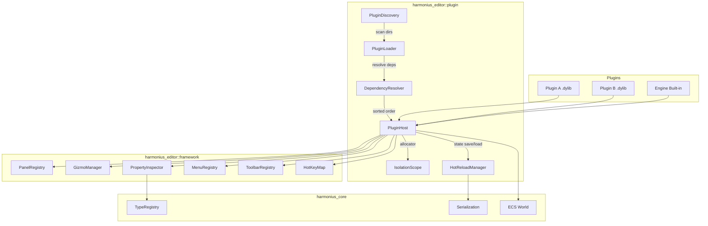
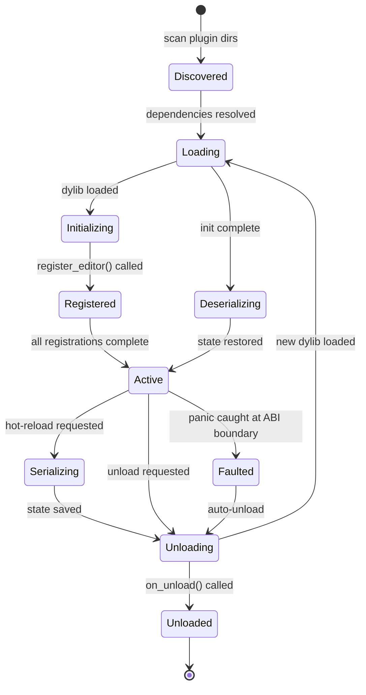
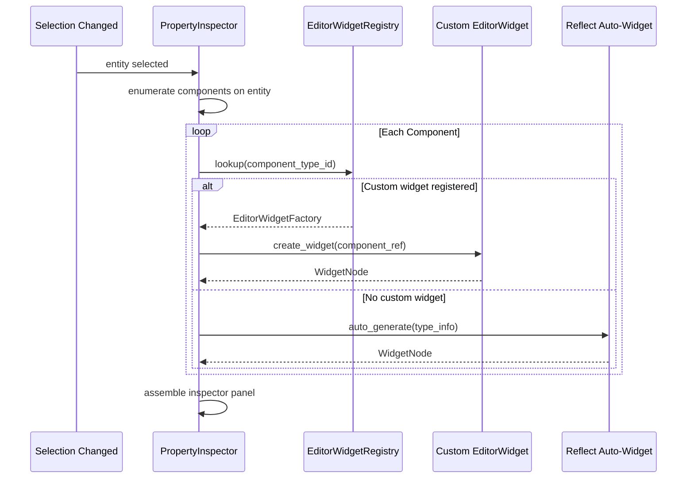
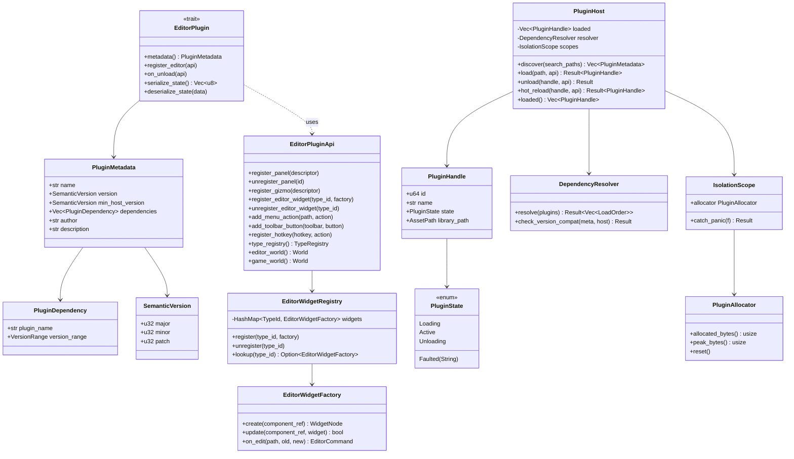

# Editor Plugin Architecture Design

## Requirements Trace

> **Canonical sources:** Features, requirements, and user stories are defined in
> [features/tools-editor/](../../features/tools-editor/),
> [requirements/tools-editor/](../../requirements/tools-editor/), and
> [user-stories/tools-editor/](../../user-stories/tools-editor/). The table below traces design
> elements to those definitions.

| Feature  | Requirement | User Stories             |
|----------|-------------|--------------------------|
| F-15.1.8 | R-15.1.8    | US-15.1.8.1--US-15.1.8.9 |
| F-1.6.1  | R-1.6.1     | US-1.6.1.1--US-1.6.1.6   |
| F-1.6.2  | R-1.6.2     | US-1.6.2.1--US-1.6.2.5   |
| F-1.6.3  | R-1.6.3     | US-1.6.3.1--US-1.6.3.4   |
| F-1.6.4  | R-1.6.4     | US-1.6.4.1--US-1.6.4.3   |
| F-1.6.5  | R-1.6.5     | US-1.6.5.1--US-1.6.5.4   |
| F-1.6.6  | R-1.6.6     | US-1.6.6.1--US-1.6.6.3   |
| F-1.6.7  | R-1.6.7     | US-1.6.7.1--US-1.6.7.3   |

1. **F-15.1.8** — Editor extension/plugin API with hot reload
2. **F-1.6.1** — Plugin discovery and loading
3. **F-1.6.2** — Plugin lifecycle management
4. **F-1.6.3** — Plugin hot-reload with state preservation
5. **F-1.6.4** — Plugin isolation and crash recovery
6. **F-1.6.5** — Plugin dependency resolution
7. **F-1.6.6** — Plugin ABI versioning
8. **F-1.6.7** — Custom component editors via plugin registration

### Cross-Cutting Dependencies

| Dependency | Source | Consumed API |
|------------|--------|--------------|
| Editor framework | F-15.1.1--F-15.1.7 | Panel registry, gizmo manager, undo stack |
| Widget framework | F-13.1 | EditorWidget rendering and layout |
| Reflection | F-1.3.1--F-1.3.10 | TypeRegistry for component editor dispatch |
| Serialization | F-1.4.1--F-1.4.3 | Plugin state serialize/deserialize for hot-reload |
| ECS | F-1.1 | Editor world resources and component queries |

## Overview

The editor plugin architecture enables extensibility through a stable C ABI boundary exposed via
C ABI. Plugins register custom component editors, panels, gizmos, menu actions, and toolbar
buttons. The system supports hot-reload with state preservation and isolates plugins so a crash in
one does not bring down the editor.

Key principles:

- **Stable C ABI.** Plugin functions are exported as `extern "C"` symbols through C ABI bridges. No
  Rust ABI dependency between plugin and host.
- **Plugin-first.** Every built-in editor panel and component editor uses the same registration API
  available to third-party plugins.
- **Hot-reload.** Plugin state is serialized before unload and deserialized after reload. The editor
  UI rebuilds seamlessly.
- **Isolation.** Each plugin runs in its own allocator scope. A panicking plugin is caught at the
  ABI boundary and logged without crashing the editor.
- **Dependency-aware.** Plugins declare dependencies and the host loads them in topological order.

## Architecture

### Plugin System Overview



### Plugin Lifecycle



### Component Editor Dispatch

When the property inspector encounters a component type, it checks the `EditorWidgetRegistry` for a
registered custom widget. If found, the custom widget renders; otherwise the default
reflection-based widget is used.



### Plugin API Class Diagram



### File Layout

```text
harmonius_editor/
├── plugin/
│   ├── host.rs             # PluginHost — load, unload,
│   │                       # hot-reload lifecycle
│   ├── discovery.rs        # PluginDiscovery — scan dirs,
│   │                       # read metadata from dylibs
│   ├── loader.rs           # PluginLoader — dlopen,
│   │                       # symbol resolution
│   ├── resolver.rs         # DependencyResolver —
│   │                       # topological sort, version
│   │                       # compatibility
│   ├── isolation.rs        # IsolationScope — per-plugin
│   │                       # allocator, panic catching
│   ├── hot_reload.rs       # HotReloadManager — state
│   │                       # serialize, file watch,
│   │                       # reload trigger
│   ├── api.rs              # EditorPluginApi — registration
│   │                       # surface for plugins
│   ├── widget_registry.rs  # EditorWidgetRegistry —
│   │                       # custom component editors
│   └── ffi.rs              # C ABI bridge via C ABI
└── builtin/
    └── builtin_plugin.rs   # Engine built-in registrations
                            # using the same plugin API
```

## API Design

### Plugin Trait and Metadata

```rust
/// Semantic version for ABI compatibility checks.
#[derive(
    Clone, Copy, Debug, PartialEq, Eq,
    PartialOrd, Ord,
)]
pub struct SemanticVersion {
    pub major: u32,
    pub minor: u32,
    pub patch: u32,
}

/// A declared dependency on another plugin.
#[derive(Clone, Debug)]
pub struct PluginDependency {
    pub plugin_name: String,
    pub min_version: SemanticVersion,
    pub max_version: Option<SemanticVersion>,
}

/// Metadata exported by every plugin at the C ABI
/// boundary.
#[derive(Clone, Debug)]
pub struct PluginMetadata {
    /// Unique plugin name.
    pub name: &'static str,
    /// Plugin version.
    pub version: SemanticVersion,
    /// Minimum host version this plugin supports.
    pub min_host_version: SemanticVersion,
    /// Declared dependencies on other plugins.
    pub dependencies: Vec<PluginDependency>,
    /// Author name.
    pub author: &'static str,
    /// Short description.
    pub description: &'static str,
}

/// Trait for editor plugins. Exported through the
/// C ABI via C ABI wrapper functions.
pub trait EditorPlugin: Send {
    /// Return plugin metadata for discovery and
    /// dependency resolution.
    fn metadata(&self) -> PluginMetadata;

    /// Register panels, gizmos, component editors,
    /// menu actions, toolbar buttons, and hotkeys.
    fn register_editor(
        &self,
        api: &mut EditorPluginApi,
    );

    /// Called before unload. Remove all registered
    /// UI elements.
    fn on_unload(
        &self,
        api: &mut EditorPluginApi,
    );

    /// Serialize plugin state for hot-reload.
    /// Returns opaque bytes the plugin knows how
    /// to deserialize.
    fn serialize_state(&self) -> Vec<u8>;

    /// Restore plugin state after hot-reload.
    fn deserialize_state(&mut self, data: &[u8]);
}
```

### C ABI Bridge

```rust
/// The C ABI entry point exported by every plugin
/// dynamic library. Called by the host after
/// dlopen to obtain the plugin instance.
///
/// Signature: `extern "C" fn() -> *mut c_void`
///
/// The host wraps the returned pointer in an
/// IsolationScope and calls EditorPlugin methods
/// through C ABI bridge functions.

// C ABI plugin entry points (extern "C")
extern "C" {
    /// Create the plugin instance. The host
    /// calls this once after dlopen.
    fn harmonius_plugin_create()
        -> *mut c_void;

    /// Destroy the plugin instance. Called
    /// during unload after on_unload.
    fn harmonius_plugin_destroy(
        ptr: *mut c_void,
    );

    /// Get plugin metadata without full init.
    /// Returns 0 on success, fills out_name
    /// and version fields.
    fn harmonius_plugin_metadata(
        ptr: *const c_void,
        out_name: *mut u8,
        out_name_cap: usize,
        out_name_len: *mut usize,
        out_version_major: *mut u32,
        out_version_minor: *mut u32,
        out_version_patch: *mut u32,
    ) -> i32;
}
```

### Editor Plugin API

```rust
/// API surface exposed to plugins for registering
/// editor extensions. All methods are safe and
/// operate through the C ABI boundary.
pub struct EditorPluginApi<'a> {
    panel_registry: &'a mut PanelRegistry,
    gizmo_manager: &'a mut GizmoManager,
    widget_registry: &'a mut EditorWidgetRegistry,
    hotkey_map: &'a mut HotKeyMap,
    menu_registry: &'a mut MenuRegistry,
    toolbar_registry: &'a mut ToolbarRegistry,
    type_registry: &'a TypeRegistry,
    editor_world: &'a World,
    game_world: &'a World,
}

impl<'a> EditorPluginApi<'a> {
    /// Register a new panel type.
    pub fn register_panel(
        &mut self,
        descriptor: PanelDescriptor,
    );

    /// Unregister a panel type and close open
    /// instances.
    pub fn unregister_panel(
        &mut self,
        id: PanelId,
    );

    /// Register a custom gizmo type.
    pub fn register_gizmo(
        &mut self,
        descriptor: CustomGizmoDescriptor,
    );

    /// Register a custom editor widget for a
    /// component type. Overrides the default
    /// reflection-based inspector for that type.
    pub fn register_editor_widget(
        &mut self,
        type_id: TypeId,
        factory: EditorWidgetFactory,
    );

    /// Unregister a custom editor widget.
    pub fn unregister_editor_widget(
        &mut self,
        type_id: TypeId,
    );

    /// Add a menu action at the given path
    /// (e.g. "Tools/My Plugin/Action").
    pub fn add_menu_action(
        &mut self,
        menu_path: &str,
        action: MenuAction,
    );

    /// Add a toolbar button.
    pub fn add_toolbar_button(
        &mut self,
        toolbar: &str,
        button: ToolbarButton,
    );

    /// Register a hotkey binding.
    pub fn register_hotkey(
        &mut self,
        hotkey: HotKey,
        action: HotKeyAction,
    );

    /// Access the type registry for reflection
    /// queries.
    pub fn type_registry(&self) -> &TypeRegistry;

    /// Read-only access to the editor world.
    pub fn editor_world(&self) -> &World;

    /// Read-only access to the game world.
    pub fn game_world(&self) -> &World;
}
```

### Custom Component Editor Widget

```rust
/// Factory for creating custom inspector widgets
/// for a specific component type.
pub struct EditorWidgetFactory {
    /// Create the widget tree for inspecting a
    /// component instance.
    pub create_fn: fn(
        component: &dyn Reflect,
    ) -> WidgetNode,

    /// Update the widget with new component data.
    /// Returns true if the widget tree changed.
    pub update_fn: fn(
        component: &dyn Reflect,
        widget: &mut WidgetNode,
    ) -> bool,

    /// Produce an EditorCommand when the user
    /// edits a value through the custom widget.
    pub on_edit_fn: fn(
        path: &PropertyPath,
        old_value: &dyn Reflect,
        new_value: &dyn Reflect,
    ) -> Box<dyn EditorCommand>,
}

/// Registry mapping component TypeIds to custom
/// editor widget factories.
pub struct EditorWidgetRegistry {
    widgets: HashMap<TypeId, EditorWidgetFactory>,
}

impl EditorWidgetRegistry {
    pub fn new() -> Self;

    /// Register a custom widget factory for a
    /// component type.
    pub fn register(
        &mut self,
        type_id: TypeId,
        factory: EditorWidgetFactory,
    );

    /// Unregister a custom widget.
    pub fn unregister(
        &mut self,
        type_id: TypeId,
    );

    /// Look up the custom widget for a type.
    pub fn lookup(
        &self,
        type_id: TypeId,
    ) -> Option<&EditorWidgetFactory>;

    /// Check if a type has a registered custom
    /// widget.
    pub fn has_widget(
        &self,
        type_id: TypeId,
    ) -> bool;
}
```

### Plugin Host

```rust
/// Manages the full plugin lifecycle: discovery,
/// loading, dependency resolution, isolation, and
/// hot-reload.
pub struct PluginHost {
    loaded: Vec<PluginHandle>,
    resolver: DependencyResolver,
    scopes: HashMap<u64, IsolationScope>,
    search_paths: Vec<AssetPath>,
}

/// Opaque handle to a loaded plugin.
#[derive(Clone, Debug)]
pub struct PluginHandle {
    pub id: u64,
    pub name: String,
    pub state: PluginState,
    pub library_path: AssetPath,
    pub metadata: PluginMetadata,
}

/// Current state of a loaded plugin.
#[derive(Clone, Debug, PartialEq, Eq)]
pub enum PluginState {
    Loading,
    Active,
    Faulted(String),
    Unloading,
}

impl PluginHost {
    pub fn new(
        search_paths: Vec<AssetPath>,
    ) -> Self;

    /// Scan search paths for plugin libraries.
    /// Reads metadata without full initialization.
    pub fn discover(
        &self,
    ) -> Vec<PluginMetadata>;

    /// Load a plugin. Resolves dependencies,
    /// creates isolation scope, calls
    /// register_editor.
    pub fn load(
        &mut self,
        path: &AssetPath,
        api: &mut EditorPluginApi,
    ) -> Result<PluginHandle, PluginError>;

    /// Unload a plugin. Calls on_unload, removes
    /// all registrations, frees isolation scope.
    pub fn unload(
        &mut self,
        handle: PluginHandle,
        api: &mut EditorPluginApi,
    ) -> Result<(), PluginError>;

    /// Hot-reload a plugin: serialize state,
    /// unload, reload library, deserialize state.
    pub fn hot_reload(
        &mut self,
        handle: PluginHandle,
        api: &mut EditorPluginApi,
    ) -> Result<PluginHandle, PluginError>;

    /// List all loaded plugins.
    pub fn loaded(&self) -> &[PluginHandle];

    /// Get a plugin handle by name.
    pub fn get_by_name(
        &self,
        name: &str,
    ) -> Option<&PluginHandle>;
}
```

### Dependency Resolution

```rust
/// Resolves plugin load order via topological sort
/// and checks version compatibility.
pub struct DependencyResolver { /* ... */ }

/// The computed load order for a set of plugins.
pub struct LoadOrder {
    pub ordered: Vec<AssetPath>,
}

impl DependencyResolver {
    pub fn new() -> Self;

    /// Compute load order from a set of plugin
    /// metadata. Returns an error if there are
    /// circular dependencies or unresolvable
    /// version constraints.
    pub fn resolve(
        &self,
        plugins: &[PluginMetadata],
    ) -> Result<LoadOrder, DependencyError>;

    /// Check that a plugin's min_host_version is
    /// compatible with the current host.
    pub fn check_host_compat(
        &self,
        meta: &PluginMetadata,
    ) -> Result<(), DependencyError>;
}

/// Dependency resolution errors.
#[derive(Debug)]
pub enum DependencyError {
    CircularDependency {
        cycle: Vec<String>,
    },
    MissingDependency {
        plugin: String,
        missing: String,
    },
    VersionIncompatible {
        plugin: String,
        required: SemanticVersion,
        found: SemanticVersion,
    },
    HostVersionIncompatible {
        plugin: String,
        required: SemanticVersion,
        host: SemanticVersion,
    },
}
```

### Plugin Isolation

```rust
/// Per-plugin isolation scope. Provides a
/// dedicated allocator and panic boundary.
pub struct IsolationScope {
    allocator: PluginAllocator,
    plugin_name: String,
}

/// Per-plugin allocator tracking memory usage.
pub struct PluginAllocator {
    allocated_bytes: usize,
    peak_bytes: usize,
}

impl IsolationScope {
    pub fn new(name: String) -> Self;

    /// Execute a closure within the isolation
    /// scope. Panics are caught and converted to
    /// PluginError::Panicked.
    pub fn catch_panic<F, R>(
        &self,
        f: F,
    ) -> Result<R, PluginError>
    where
        F: FnOnce() -> R + std::panic::UnwindSafe;

    /// Get the plugin's allocator stats.
    pub fn allocator(&self) -> &PluginAllocator;
}

impl PluginAllocator {
    /// Current allocated bytes.
    pub fn allocated_bytes(&self) -> usize;

    /// Peak allocated bytes since last reset.
    pub fn peak_bytes(&self) -> usize;

    /// Reset peak tracking.
    pub fn reset_peak(&mut self);
}
```

### Hot-Reload Manager

```rust
/// Manages file-watching and state preservation
/// for plugin hot-reload.
pub struct HotReloadManager { /* ... */ }

impl HotReloadManager {
    pub fn new() -> Self;

    /// Watch a plugin library for changes.
    pub fn watch(
        &mut self,
        path: &AssetPath,
        handle: &PluginHandle,
    );

    /// Stop watching a plugin library.
    pub fn unwatch(
        &mut self,
        handle: &PluginHandle,
    );

    /// Poll for changed libraries. Returns handles
    /// that need hot-reload.
    pub fn poll_changes(
        &self,
    ) -> Vec<PluginHandle>;

    /// Serialize plugin state before unload.
    pub fn save_state(
        &self,
        plugin: &dyn EditorPlugin,
    ) -> Vec<u8>;

    /// Deserialize plugin state after reload.
    pub fn restore_state(
        &self,
        plugin: &mut dyn EditorPlugin,
        data: &[u8],
    );
}
```

### Error Types

```rust
#[derive(Debug)]
pub enum PluginError {
    /// Dynamic library could not be opened.
    LoadFailed {
        path: AssetPath,
        reason: String,
    },
    /// Required C ABI entry point not found.
    MissingEntryPoint {
        path: AssetPath,
        symbol: String,
    },
    /// Plugin panicked during a host call.
    Panicked {
        plugin: String,
        message: String,
    },
    /// Dependency resolution failed.
    DependencyError(DependencyError),
    /// Plugin is not in the expected state.
    InvalidState {
        plugin: String,
        expected: PluginState,
        actual: PluginState,
    },
    /// State deserialization failed during
    /// hot-reload.
    DeserializeFailed {
        plugin: String,
        reason: String,
    },
    /// Plugin not found by handle or name.
    NotFound(String),
}
```

## Data Flow

### Plugin Loading Pipeline

1. `PluginHost::discover()` scans search paths for `.dylib` / `.dll` / `.so` files.
2. For each library, `dlopen` loads it and calls `harmonius_plugin_metadata()` to read
   `PluginMetadata` without full initialization.
3. `DependencyResolver::resolve()` performs topological sort on declared dependencies. Circular
   dependencies produce `DependencyError::CircularDependency`.
4. Plugins load in dependency order. For each plugin:
   - `harmonius_plugin_create()` allocates the plugin instance.
   - An `IsolationScope` is created with a fresh `PluginAllocator`.
   - `register_editor()` is called within `catch_panic()`.
   - The plugin registers panels, gizmos, component editors, menus, and hotkeys.
5. The `PluginHandle` transitions to `Active`.

### Hot-Reload Pipeline

1. `HotReloadManager` detects a changed `.dylib` via file-system watching.
2. `serialize_state()` is called on the old plugin to capture opaque state bytes.
3. `on_unload()` is called to remove all UI registrations.
4. The old dynamic library is closed via `dlclose`.
5. The new library is loaded via `dlopen` and `harmonius_plugin_create()`.
6. `register_editor()` re-registers all UI elements.
7. `deserialize_state()` restores the saved state.
8. A new `PluginHandle` is returned.

### Component Editor Dispatch

1. User selects an entity in the viewport.
2. `PropertyInspector` enumerates all components on the entity via the `TypeRegistry`.
3. For each component, `EditorWidgetRegistry::lookup(type_id)` checks for a custom widget.
4. If a custom `EditorWidgetFactory` exists, `create_fn()` builds the widget tree.
5. If no custom widget exists, the default reflection-based auto-generator builds widgets from
   `TypeInfo` and field attributes.
6. When the user edits a value, `on_edit_fn()` produces an `EditorCommand` that flows through the
   undo stack.

### In-Engine Feature Editors

Engine subsystems (animation, material, physics) register their own editor widgets at startup using
the same `EditorPluginApi`. They call `register_editor_widget()` for their component types so the
inspector dispatches to specialized editors. This follows the identical code path as third-party
plugins.

## Platform Considerations

| Component | Windows | macOS | Linux |
|-----------|---------|-------|-------|
| Dynamic library | `.dll` via `LoadLibraryW` | `.dylib` via `dlopen` | `.so` via `dlopen` |
| Symbol lookup | `GetProcAddress` | `dlsym` | `dlsym` |
| File watching | `ReadDirectoryChangesW` | `FSEvents` via Swift C ABI | `inotify` |
| C ABI bridge | C ABI MSVC ABI | C ABI Clang ABI | C ABI GCC/Clang ABI |
| Isolation | SEH for panic catch | `setjmp`/`longjmp` | `setjmp`/`longjmp` |

All platforms use `extern "C"` linkage for plugin entry points. The C ABI ensures a stable binary
interface regardless of Rust compiler version changes.

## Test Plan

Test cases are in the companion file [editor-plugins-test-cases.md](editor-plugins-test-cases.md).

### Summary

| Category          | Count |
|-------------------|-------|
| Unit tests        | 22    |
| Integration tests | 8     |
| Benchmarks        | 4     |

1. **Unit tests** — Plugin loading, dependency resolution, isolation, hot-reload, widget registry,
   ABI
2. **Integration tests** — End-to-end plugin lifecycle, component editor dispatch, multi-plugin
   interaction
3. **Benchmarks** — Load time, hot-reload time, widget dispatch latency, memory overhead

## Open Questions

1. **Plugin sandboxing depth.** The current design uses `catch_unwind` for panic isolation. Should
   plugins also run in a separate process for stronger fault isolation, at the cost of IPC overhead?

2. **ABI versioning granularity.** When a new method is added to `EditorPluginApi`, should older
   plugins still load (method absent = no-op), or should they fail with a version mismatch?

3. **Plugin marketplace format.** What packaging format should plugins use for distribution?
   Options: a `.hplugin` archive containing the dylib, metadata JSON, and assets; or a bare dylib
   with embedded metadata.

4. **Widget hot-reload visual continuity.** During hot-reload, the inspector panel rebuilds. Should
   the scroll position and expanded/collapsed state of foldout groups be preserved across rebuilds?

5. **Cross-plugin widget composition.** Can a plugin's custom widget embed another plugin's widget?
   If so, the widget registry needs a composition API that resolves transitive widget dependencies.
