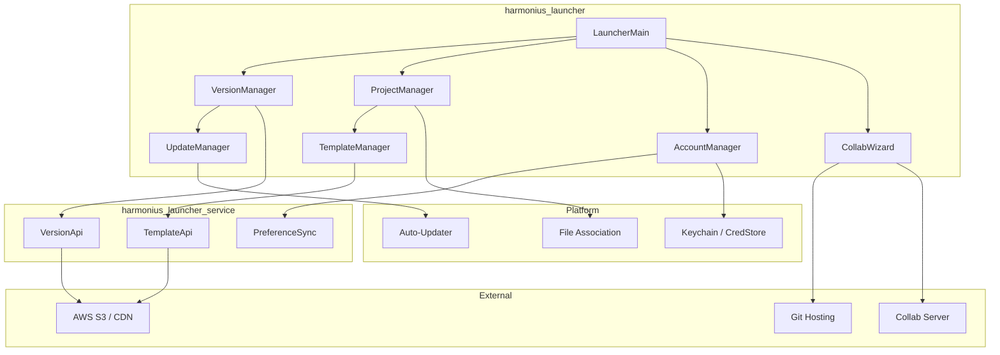
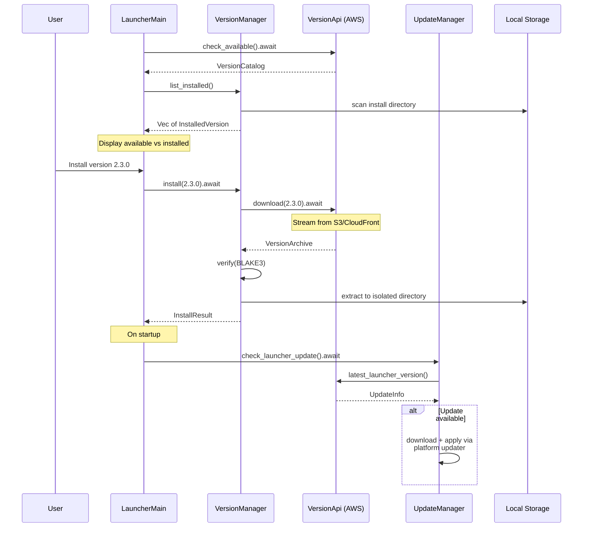
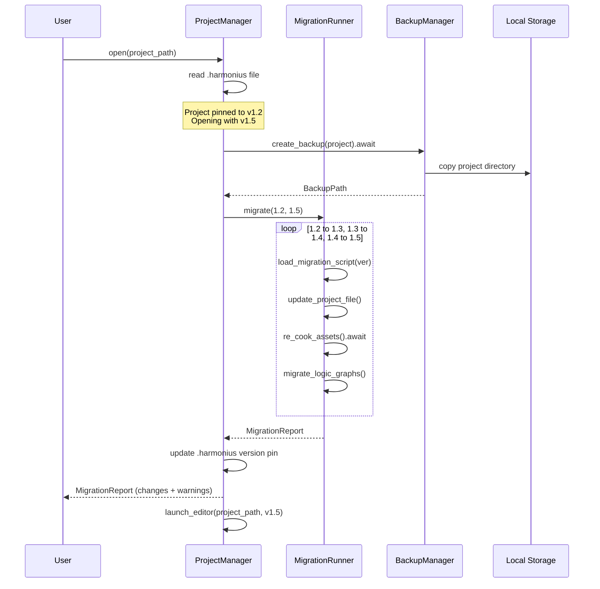
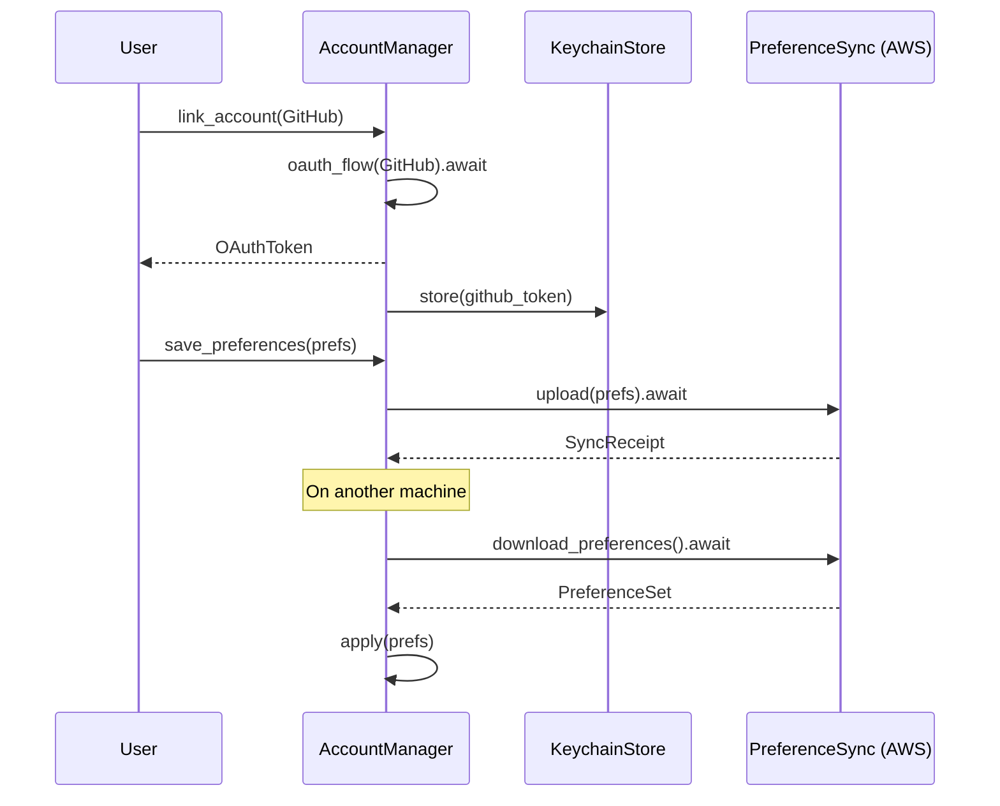
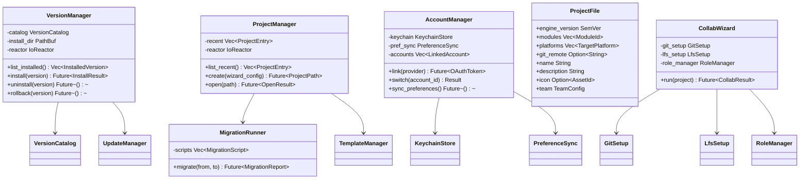

# Engine Launcher Design

## Requirements Trace

> **Canonical sources:** Features, requirements, and user stories are defined in
> [features/tools-editor/](../../features/tools-editor/),
> [requirements/tools-editor/](../../requirements/tools-editor/), and
> [user-stories/tools-editor/](../../user-stories/tools-editor/). The table below traces design
> elements to those definitions.

| Feature   | Requirement |
|-----------|-------------|
| F-15.15.1 | R-15.15.1   |
| F-15.15.2 | R-15.15.2   |
| F-15.15.3 | R-15.15.3   |
| F-15.15.4 | R-15.15.4   |
| F-15.15.5 | R-15.15.5   |
| F-15.15.6 | R-15.15.6   |

1. **F-15.15.1** — Engine version management (install, update, rollback, side-by-side)
2. **F-15.15.2** — Automatic project upgrades via versioned migration scripts
3. **F-15.15.3** — Project browser and creation wizard with genre templates
4. **F-15.15.4** — `.harmonius` project file format and file association
5. **F-15.15.5** — Cross-game preferences and account management
6. **F-15.15.6** — Collaboration setup wizard (Git, LFS, collab server, roles)

## Overview

The Harmonius Launcher is a standalone application that manages engine installations, projects, user
accounts, and team collaboration setup. It is the entry point for all engine interactions.

Key responsibilities:

- **Version management** -- install, update, and rollback multiple engine versions side-by-side.
  Each version is fully isolated.
- **Project management** -- browse recent projects, create new projects from genre templates, and
  open projects in the correct engine version.
- **Auto-upgrade** -- when a project is opened with a newer engine, run versioned migration scripts
  incrementally.
- **Account management** -- link Git hosting accounts, store credentials in platform keychains, sync
  preferences across machines.
- **Collaboration setup** -- guided wizard for Git hosting, LFS, collaboration server, team roles,
  and shared build cache.

The launcher is a native application built with the engine's own UI framework. All I/O is async
through the `IoReactor`. All network calls (version checks, template downloads, preference sync) use
async HTTP over the reactor. No stdlib file I/O. Static dispatch throughout. Rust stable only.

## Architecture

### Module Boundaries



### Crate Layout

```text
harmonius_launcher/
├── main.rs            # LauncherMain entry point
├── version/
│   ├── manager.rs     # VersionManager — install,
│   │                  # update, rollback, uninstall
│   ├── updater.rs     # UpdateManager — platform-
│   │                  # native auto-update
│   ├── installer.rs   # VersionInstaller — download
│   │                  # + extract + verify
│   └── catalog.rs     # VersionCatalog — available
│                      # and installed versions
├── project/
│   ├── manager.rs     # ProjectManager — browse,
│   │                  # create, open, recent list
│   ├── file.rs        # ProjectFile — .harmonius
│   │                  # TOML read/write
│   ├── wizard.rs      # CreationWizard — genre
│   │                  # templates, platform select
│   ├── migration.rs   # MigrationRunner — versioned
│   │                  # incremental upgrades
│   └── template.rs    # TemplateManager — download
│                      # and cache templates
├── account/
│   ├── manager.rs     # AccountManager — link, switch
│   ├── keychain.rs    # KeychainStore — platform
│   │                  # credential storage
│   ├── preferences.rs # PreferenceManager — global
│   │                  # settings, cloud sync
│   └── oauth.rs       # OAuthFlow — GitHub, GitLab,
│                      # Bitbucket auth
├── collab/
│   ├── wizard.rs      # CollabWizard — guided setup
│   ├── git.rs         # GitSetup — provider config
│   ├── lfs.rs         # LfsSetup — storage config
│   └── roles.rs       # RoleManager — team invites,
│                      # role assignment
└── platform/
    ├── association.rs # FileAssociation — .harmonius
    │                  # registration
    ├── windows.rs     # WinSparkle, registry, Cred
    │                  # Manager
    ├── macos.rs       # Sparkle, Launch Services,
    │                  # Keychain
    └── linux.rs       # AppImage delta, XDG MIME,
                       # libsecret
```

### Version Management Lifecycle



### Project Migration Flow



### Account and Preference Sync



### Core Data Structures



## API Design

### Version Management

```rust
/// Semantic version.
#[derive(
    Clone, Debug, PartialEq, Eq, PartialOrd, Ord,
)]
pub struct SemVer {
    pub major: u32,
    pub minor: u32,
    pub patch: u32,
    pub prerelease: Option<String>,
}

/// An engine version available for download.
pub struct AvailableVersion {
    pub version: SemVer,
    pub channel: ReleaseChannel,
    pub release_notes: String,
    pub download_size_bytes: u64,
    pub install_size_bytes: u64,
    pub blake3_hash: [u8; 32],
    pub published_at: u64,
}

#[derive(Clone, Copy, Debug, PartialEq, Eq)]
pub enum ReleaseChannel {
    Stable,
    Preview,
    Nightly,
}

/// An engine version installed locally.
pub struct InstalledVersion {
    pub version: SemVer,
    pub channel: ReleaseChannel,
    pub install_path: PathBuf,
    pub disk_size_bytes: u64,
    pub installed_at: u64,
}

/// Catalog of available and installed versions.
pub struct VersionCatalog {
    pub available: Vec<AvailableVersion>,
    pub installed: Vec<InstalledVersion>,
}

/// Manages engine version installations.
pub struct VersionManager { /* ... */ }

impl VersionManager {
    pub fn new(
        reactor: &IoReactor,
        install_dir: &Path,
    ) -> Self;

    /// Fetch the catalog of available versions
    /// from the update server.
    pub async fn fetch_catalog(
        &self,
    ) -> Result<VersionCatalog, VersionError>;

    /// List locally installed versions.
    pub fn list_installed(
        &self,
    ) -> Vec<InstalledVersion>;

    /// Install a specific version. Downloads from
    /// S3/CloudFront, verifies BLAKE3, extracts
    /// to an isolated directory.
    pub async fn install(
        &self,
        version: &SemVer,
        progress: impl Fn(f32) + Send,
    ) -> Result<InstalledVersion, VersionError>;

    /// Uninstall a version. Removes the isolated
    /// directory and frees disk space.
    pub async fn uninstall(
        &self,
        version: &SemVer,
    ) -> Result<u64, VersionError>;

    /// Rollback to a previously installed version
    /// by updating the active version pointer.
    pub fn rollback(
        &self,
        version: &SemVer,
    ) -> Result<(), VersionError>;

    /// Get disk usage for each installed version.
    pub fn disk_usage(
        &self,
    ) -> Vec<(SemVer, u64)>;
}
```

### Auto-Update Manager

```rust
/// Platform-native auto-update for the launcher
/// itself.
pub struct UpdateManager { /* ... */ }

impl UpdateManager {
    pub fn new(reactor: &IoReactor) -> Self;

    /// Check if a launcher update is available.
    pub async fn check(
        &self,
    ) -> Result<Option<UpdateInfo>, UpdateError>;

    /// Download and apply the update using the
    /// platform-native updater. The launcher
    /// restarts after update.
    pub async fn apply(
        &self,
        update: &UpdateInfo,
        progress: impl Fn(f32) + Send,
    ) -> Result<(), UpdateError>;
}

pub struct UpdateInfo {
    pub version: SemVer,
    pub download_url: String,
    pub release_notes: String,
    pub size_bytes: u64,
    pub blake3_hash: [u8; 32],
}
```

### Project File Format

```rust
/// The `.harmonius` project file. TOML format,
/// human-readable, version-controlled.
pub struct ProjectFile {
    /// Pinned engine version.
    pub engine_version: SemVer,
    /// Enabled engine modules.
    pub modules: Vec<ModuleId>,
    /// Target deployment platforms.
    pub platforms: Vec<TargetPlatform>,
    /// Git remote URL.
    pub git_remote: Option<String>,
    /// Project metadata.
    pub name: String,
    pub description: String,
    pub icon: Option<String>,
    /// Team configuration (shared via VCS).
    pub team: Option<TeamConfig>,
}

pub struct TeamConfig {
    pub collab_server_url: Option<String>,
    pub shared_cache_url: Option<String>,
    pub members: Vec<TeamMember>,
}

pub struct TeamMember {
    pub name: String,
    pub email: String,
    pub role: TeamRole,
}

#[derive(Clone, Copy, Debug, PartialEq, Eq)]
pub enum TeamRole {
    Admin,
    Developer,
    Artist,
    Designer,
}

impl ProjectFile {
    /// Read a `.harmonius` file from disk.
    pub async fn read(
        reactor: &IoReactor,
        path: &Path,
    ) -> Result<Self, ProjectFileError>;

    /// Write the project file to disk.
    pub async fn write(
        &self,
        reactor: &IoReactor,
        path: &Path,
    ) -> Result<(), ProjectFileError>;

    /// Check if the project needs migration to
    /// the given engine version.
    pub fn needs_migration(
        &self,
        target: &SemVer,
    ) -> bool;
}
```

### Project Manager

```rust
/// A project entry for the recent projects list.
pub struct ProjectEntry {
    pub name: String,
    pub path: PathBuf,
    pub engine_version: SemVer,
    pub last_modified: u64,
    pub thumbnail: Option<Vec<u8>>,
    pub team_members: Vec<String>,
}

/// Manages projects: browse, create, open.
pub struct ProjectManager { /* ... */ }

impl ProjectManager {
    pub fn new(
        reactor: &IoReactor,
        version_mgr: &VersionManager,
    ) -> Self;

    /// List recent projects sorted by last
    /// modified date.
    pub fn list_recent(
        &self,
    ) -> Vec<ProjectEntry>;

    /// Create a new project from a wizard config.
    /// Initializes directory structure, project
    /// file, and optionally a Git repository.
    pub async fn create(
        &self,
        config: &ProjectWizardConfig,
    ) -> Result<PathBuf, ProjectError>;

    /// Open a project. If the project needs
    /// migration, runs the upgrade pipeline first.
    pub async fn open(
        &self,
        path: &Path,
    ) -> Result<OpenResult, ProjectError>;

    /// Register the `.harmonius` file association
    /// with the OS.
    pub fn register_file_association(
        &self,
    ) -> Result<(), PlatformError>;
}

pub struct ProjectWizardConfig {
    pub name: String,
    pub directory: PathBuf,
    pub template: GenreTemplate,
    pub platforms: Vec<TargetPlatform>,
    pub engine_version: SemVer,
    pub init_git: bool,
}

#[derive(Clone, Copy, Debug, PartialEq, Eq)]
pub enum GenreTemplate {
    Rpg,
    Fps,
    Rts,
    Platformer2d,
    VrExperience,
    Empty,
}

pub enum OpenResult {
    /// Project opened directly (version matches).
    Ready { editor_path: PathBuf },
    /// Project was migrated before opening.
    Migrated {
        editor_path: PathBuf,
        report: MigrationReport,
    },
}
```

### Migration Runner

```rust
/// A single version-to-version migration step.
pub struct MigrationScript {
    pub from_version: SemVer,
    pub to_version: SemVer,
    /// Project file format changes.
    pub file_changes: Vec<ProjectFileChange>,
    /// Logic graph API migrations.
    pub graph_migrations: Vec<GraphMigration>,
    /// Deprecated features to warn about.
    pub deprecations: Vec<Deprecation>,
}

pub struct GraphMigration {
    pub old_node: String,
    pub new_node: String,
    pub parameter_mapping: Vec<(String, String)>,
}

pub struct Deprecation {
    pub feature: String,
    pub replacement: Option<String>,
    pub removed_in: Option<SemVer>,
}

/// Runs versioned migration scripts.
pub struct MigrationRunner { /* ... */ }

impl MigrationRunner {
    pub fn new(
        reactor: &IoReactor,
        pool: &ThreadPool,
    ) -> Self;

    /// Run incremental migration from one version
    /// to another. Creates a backup first.
    /// Runs 1.2->1.3, 1.3->1.4, 1.4->1.5 in
    /// sequence for a 1.2->1.5 migration.
    pub async fn migrate(
        &self,
        project_path: &Path,
        from: &SemVer,
        to: &SemVer,
    ) -> Result<MigrationReport, MigrationError>;

    /// Restore from a pre-migration backup.
    pub async fn restore_backup(
        &self,
        backup_path: &Path,
        project_path: &Path,
    ) -> Result<(), MigrationError>;
}

pub struct MigrationReport {
    pub from_version: SemVer,
    pub to_version: SemVer,
    pub steps_completed: u32,
    pub changes: Vec<MigrationChange>,
    pub warnings: Vec<String>,
    pub deprecations: Vec<Deprecation>,
    pub backup_path: PathBuf,
}

pub struct MigrationChange {
    pub description: String,
    pub affected_files: Vec<PathBuf>,
}
```

### Template Manager

```rust
/// A downloadable project template.
pub struct ProjectTemplate {
    pub id: String,
    pub name: String,
    pub genre: GenreTemplate,
    pub description: String,
    pub preview_image: Option<Vec<u8>>,
    pub engine_version: SemVer,
    pub download_size_bytes: u64,
    pub modules: Vec<ModuleId>,
    pub input_mappings: Vec<InputMapping>,
}

/// Manages genre templates and starter content.
pub struct TemplateManager { /* ... */ }

impl TemplateManager {
    pub fn new(
        reactor: &IoReactor,
        cache_dir: &Path,
    ) -> Self;

    /// Fetch available templates from the server.
    pub async fn fetch_available(
        &self,
    ) -> Result<Vec<ProjectTemplate>, TemplateError>;

    /// Download and cache a template locally.
    pub async fn download(
        &self,
        template_id: &str,
        progress: impl Fn(f32) + Send,
    ) -> Result<PathBuf, TemplateError>;

    /// Instantiate a cached template into a new
    /// project directory.
    pub async fn instantiate(
        &self,
        template_id: &str,
        project_dir: &Path,
        project_name: &str,
    ) -> Result<(), TemplateError>;
}
```

### Account Manager

```rust
/// A linked external account.
pub struct LinkedAccount {
    pub id: AccountId,
    pub provider: AccountProvider,
    pub display_name: String,
    pub email: String,
    pub is_active: bool,
}

#[derive(Clone, Copy, Debug, PartialEq, Eq)]
pub enum AccountProvider {
    GitHub,
    GitLab,
    Bitbucket,
    Harmonius,
}

/// Manages user accounts and credentials.
pub struct AccountManager { /* ... */ }

impl AccountManager {
    pub fn new(
        reactor: &IoReactor,
        keychain: KeychainStore,
    ) -> Self;

    /// Link a new account via OAuth flow.
    pub async fn link(
        &self,
        provider: AccountProvider,
    ) -> Result<LinkedAccount, AccountError>;

    /// Unlink an account.
    pub async fn unlink(
        &self,
        id: AccountId,
    ) -> Result<(), AccountError>;

    /// Switch the active account (for multi-
    /// account support).
    pub fn switch(
        &self,
        id: AccountId,
    ) -> Result<(), AccountError>;

    /// List all linked accounts.
    pub fn list_accounts(
        &self,
    ) -> Vec<LinkedAccount>;
}

/// Global user preferences.
pub struct UserPreferences {
    pub theme: EditorTheme,
    pub keybindings: KeybindingSet,
    pub viewport_defaults: ViewportConfig,
    pub telemetry_opt_in: bool,
    pub recent_projects: Vec<PathBuf>,
}

/// Syncs preferences across machines via the
/// cloud collaboration service.
pub struct PreferenceSync { /* ... */ }

impl PreferenceSync {
    pub fn new(
        reactor: &IoReactor,
        service_url: &str,
    ) -> Self;

    /// Upload current preferences to the cloud.
    pub async fn upload(
        &self,
        prefs: &UserPreferences,
    ) -> Result<(), SyncError>;

    /// Download preferences from the cloud.
    pub async fn download(
        &self,
    ) -> Result<UserPreferences, SyncError>;
}
```

### Keychain Store

```rust
/// Platform-native credential storage.
pub struct KeychainStore { /* ... */ }

impl KeychainStore {
    /// Create a keychain store. Dispatches to the
    /// platform backend via cfg attributes.
    pub fn new() -> Result<Self, KeychainError>;

    /// Store a credential.
    pub fn store(
        &self,
        service: &str,
        account: &str,
        secret: &[u8],
    ) -> Result<(), KeychainError>;

    /// Retrieve a credential.
    pub fn retrieve(
        &self,
        service: &str,
        account: &str,
    ) -> Result<Vec<u8>, KeychainError>;

    /// Delete a credential.
    pub fn delete(
        &self,
        service: &str,
        account: &str,
    ) -> Result<(), KeychainError>;
}
```

### Collaboration Wizard

```rust
/// Configuration produced by the collaboration
/// setup wizard.
pub struct CollabConfig {
    pub git_provider: AccountProvider,
    pub git_remote_url: String,
    pub lfs_endpoint: Option<String>,
    pub collab_server_url: Option<String>,
    pub shared_cache_url: Option<String>,
    pub team_members: Vec<TeamMember>,
}

/// Guided collaboration setup wizard.
pub struct CollabWizard { /* ... */ }

impl CollabWizard {
    pub fn new(
        reactor: &IoReactor,
        accounts: &AccountManager,
    ) -> Self;

    /// Run the full wizard flow. Validates
    /// connectivity and auth at each step.
    pub async fn run(
        &self,
        project_path: &Path,
    ) -> Result<CollabConfig, CollabError>;

    /// Validate network connectivity to the
    /// collaboration server.
    pub async fn validate_connectivity(
        &self,
        server_url: &str,
    ) -> Result<(), CollabError>;

    /// Validate authentication tokens for the
    /// Git hosting provider.
    pub async fn validate_auth(
        &self,
        provider: AccountProvider,
    ) -> Result<(), CollabError>;

    /// Invite a team member by email.
    pub async fn invite_member(
        &self,
        email: &str,
        role: TeamRole,
    ) -> Result<(), CollabError>;
}
```

### File Association

```rust
/// Registers `.harmonius` file association with
/// the operating system.
pub struct FileAssociation { /* ... */ }

impl FileAssociation {
    /// Register the file type association.
    /// - macOS: Launch Services via
    ///   LSRegisterURL
    /// - Windows: Registry under HKCU\Software\
    ///   Classes
    /// - Linux: XDG MIME type + .desktop file
    pub fn register(
        launcher_path: &Path,
    ) -> Result<(), PlatformError>;

    /// Unregister the file type association.
    pub fn unregister(
    ) -> Result<(), PlatformError>;

    /// Check if the association is currently
    /// registered.
    pub fn is_registered() -> bool;
}
```

### Error Types

```rust
#[derive(Debug)]
pub enum VersionError {
    NetworkFailed(IoError),
    IntegrityMismatch {
        expected: [u8; 32],
        actual: [u8; 32],
    },
    VersionNotFound { version: SemVer },
    AlreadyInstalled { version: SemVer },
    InsufficientDiskSpace {
        required: u64,
        available: u64,
    },
    Io(IoError),
}

#[derive(Debug)]
pub enum ProjectError {
    FileNotFound { path: PathBuf },
    InvalidProjectFile { reason: String },
    VersionNotInstalled { version: SemVer },
    MigrationFailed(MigrationError),
    TemplateError(TemplateError),
    Io(IoError),
}

#[derive(Debug)]
pub enum MigrationError {
    ScriptNotFound {
        from: SemVer,
        to: SemVer,
    },
    BackupFailed(IoError),
    AssetCookFailed { asset: String },
    GraphMigrationFailed {
        graph: String,
        reason: String,
    },
    Io(IoError),
}

#[derive(Debug)]
pub enum AccountError {
    OAuthFailed { provider: AccountProvider },
    KeychainFailed(KeychainError),
    AccountNotFound { id: AccountId },
    NetworkFailed(IoError),
}

#[derive(Debug)]
pub enum CollabError {
    ConnectivityFailed { url: String },
    AuthFailed { provider: AccountProvider },
    InviteFailed { email: String },
    ServerIncompatible {
        required: SemVer,
        actual: SemVer,
    },
}

#[derive(Debug)]
pub enum KeychainError {
    NotFound,
    AccessDenied,
    PlatformError { code: i32 },
}
```

## Data Flow

### Launcher Startup Sequence

1. **Load preferences** -- read `UserPreferences` from local config file.
2. **Check launcher update** -- `UpdateManager` queries the version API for a newer launcher. If
   available, download and apply via the platform-native updater (Sparkle/WinSparkle/AppImage
   delta).
3. **Fetch version catalog** -- `VersionManager` queries S3/CloudFront for the latest available
   engine versions. Compare with installed versions.
4. **Scan projects** -- `ProjectManager` scans the recent projects list, reads each `.harmonius`
   file for display metadata.
5. **Display home screen** -- show recent projects with thumbnails, available updates, and version
   notifications.

### Project Open Flow

1. User selects a project or double-clicks a `.harmonius` file.
2. `ProjectFile::read()` parses the TOML file.
3. Compare `engine_version` pin to the requested engine version.
4. If versions differ: a. `MigrationRunner::migrate()` creates a backup. b. Runs incremental
   migration scripts in sequence. c. Re-cooks assets for the new engine version. d. Migrates
   deprecated logic graph APIs. e. Updates the `.harmonius` version pin. f. Produces a
   `MigrationReport`.
5. Launch the editor binary for the pinned engine version with the project path as an argument.

### Preference Sync Flow

1. User changes preferences (theme, keybindings).
2. `PreferenceSync::upload()` sends the preferences to the cloud collaboration service.
3. On another machine, `PreferenceSync::download()` retrieves the latest preferences on launcher
   startup.
4. Conflict resolution: latest-write-wins with a timestamp. No merge -- full preference set is
   atomic.

### Collaboration Setup Flow

1. `CollabWizard` prompts for Git provider selection.
2. `validate_auth()` checks the OAuth token stored in `KeychainStore`.
3. User selects LFS storage provider and endpoint.
4. User enters the collaboration server URL.
5. `validate_connectivity()` tests network access.
6. User invites team members with role assignments.
7. `CollabConfig` is written to the `.harmonius` project file under `[team]`.
8. New team members cloning the repo inherit the configuration automatically.

## Platform Considerations

### Auto-Update Mechanism

| Platform | Library | Mechanism |
|----------|---------|-----------|
| macOS | Sparkle | Appcast XML feed, DMG download, in-place update |
| Windows | WinSparkle | Appcast XML feed, MSI/EXE download, restart |
| Linux | AppImage | AppImageUpdate, zsync delta download, binary replace |

All update feeds are served from S3/CloudFront. Appcast XML is signed with an Ed25519 key to prevent
tampering.

### File Association

| Platform | API                                |
|----------|------------------------------------|
| macOS    | Launch Services (`LSRegisterURL`)  |
| Windows  | Registry (`HKCU\Software\Classes`) |
| Linux    | XDG MIME                           |

1. **macOS** — Set `CFBundleDocumentTypes` in Info.plist, register with `LSRegisterURL` via
   Swift/cxx.rs
2. **Windows** — Create `.harmonius` key, `shell\open\command` pointing to launcher, via
   `windows-sys`
3. **Linux** — Create `application/x-harmonius.xml` MIME type, install `.desktop` file, run
   `update-mime-database`

### Credential Storage

| Platform | API                            |
|----------|--------------------------------|
| macOS    | Security.framework Keychain    |
| Windows  | Credential Manager             |
| Linux    | libsecret (Secret Service API) |

1. **macOS** — `SecItemAdd`/`SecItemCopyMatching` via Swift wrappers through cxx.rs
2. **Windows** — `CredRead`/`CredWrite` via `windows-sys` crate
3. **Linux** — D-Bus org.freedesktop.secrets via C FFI / bindgen

### Version Install Directories

| Platform | Default Path |
|----------|-------------|
| macOS | `~/Library/Application Support/Harmonius/Versions/` |
| Windows | `%LOCALAPPDATA%\Harmonius\Versions\` |
| Linux | `~/.local/share/harmonius/versions/` |

Each version is installed in a subdirectory named by its semantic version (e.g., `2.3.0/`). Versions
are fully isolated -- no shared state between versions.

### Proposed Dependencies

| Crate | Purpose | Justification |
|-------|---------|---------------|
| `toml` | TOML parsing for `.harmonius` files | Standard TOML library, widely used |
| `blake3` | Content hash verification | Fast, parallelizable hash for integrity |
| `windows-sys` | Win32 registry, Credential Manager | Zero-cost FFI to Windows APIs |
| `cxx` | C++ interop for macOS Keychain, Launch Services | Safe bridge to Swift/C++ wrappers |
| `serde` | Serialization for configs and API responses | Standard Rust serialization |

**HTTP client:** Uses platform-native HTTP clients (NSURLSession on macOS, WinHTTP on Windows,
libcurl on Linux) wrapped via the `IoReactor`, consistent with [shared-cache.md](shared-cache.md).

## Test Plan

### Unit Tests

| Test                                 | Req       |
|--------------------------------------|-----------|
| `test_version_catalog_parse`         | R-15.15.1 |
| `test_version_install_isolated`      | R-15.15.1 |
| `test_version_uninstall_frees_space` | R-15.15.1 |
| `test_version_rollback`              | R-15.15.1 |
| `test_version_integrity_blake3`      | R-15.15.1 |
| `test_project_file_roundtrip`        | R-15.15.4 |
| `test_project_file_version_pin`      | R-15.15.4 |
| `test_migration_incremental`         | R-15.15.2 |
| `test_migration_backup_created`      | R-15.15.2 |
| `test_migration_restore`             | R-15.15.2 |
| `test_migration_report`              | R-15.15.2 |
| `test_migration_graph_api`           | R-15.15.2 |
| `test_template_instantiate`          | R-15.15.3 |
| `test_template_each_genre`           | R-15.15.3 |
| `test_keychain_store_retrieve`       | R-15.15.5 |
| `test_keychain_delete`               | R-15.15.5 |
| `test_account_link_oauth`            | R-15.15.5 |
| `test_account_switch`                | R-15.15.5 |
| `test_preference_roundtrip`          | R-15.15.5 |
| `test_collab_wizard_validates`       | R-15.15.6 |
| `test_collab_team_config_saved`      | R-15.15.6 |

1. **`test_version_catalog_parse`** — Parse version catalog JSON from the API.
2. **`test_version_install_isolated`** — Two installed versions share no files.
3. **`test_version_uninstall_frees_space`** — Uninstall removes directory and frees disk.
4. **`test_version_rollback`** — Rollback sets active version pointer without re-download.
5. **`test_version_integrity_blake3`** — Corrupted download detected via BLAKE3 mismatch.
6. **`test_project_file_roundtrip`** — Write and read `.harmonius` TOML produces identical data.
7. **`test_project_file_version_pin`** — Engine version pin is correctly stored and read.
8. **`test_migration_incremental`** — 1.2 to 1.5 runs three migration scripts in order.
9. **`test_migration_backup_created`** — Backup directory created before migration starts.
10. **`test_migration_restore`** — Restore from backup produces original project state.
11. **`test_migration_report`** — Report lists all changes, warnings, and deprecations.
12. **`test_migration_graph_api`** — Deprecated logic graph nodes replaced with new equivalents.
13. **`test_template_instantiate`** — Template produces valid project with correct modules.
14. **`test_template_each_genre`** — Every genre template (RPG, FPS, RTS, 2D, VR, empty) creates a
    valid project.
15. **`test_keychain_store_retrieve`** — Store and retrieve credential from platform keychain.
16. **`test_keychain_delete`** — Delete credential from platform keychain.
17. **`test_account_link_oauth`** — OAuth flow produces valid token for each provider.
18. **`test_account_switch`** — Switch active account changes which credentials are used.
19. **`test_preference_roundtrip`** — Serialize and deserialize preferences without data loss.
20. **`test_collab_wizard_validates`** — Wizard rejects invalid server URL with clear error.
21. **`test_collab_team_config_saved`** — Team config written to `.harmonius` and readable.

### Integration Tests

| Test                                | Req       |
|-------------------------------------|-----------|
| `test_install_and_launch`           | R-15.15.1 |
| `test_side_by_side_versions`        | R-15.15.1 |
| `test_auto_update_macos`            | R-15.15.1 |
| `test_auto_update_windows`          | R-15.15.1 |
| `test_auto_update_linux`            | R-15.15.1 |
| `test_file_association_macos`       | R-15.15.4 |
| `test_file_association_windows`     | R-15.15.4 |
| `test_file_association_linux`       | R-15.15.4 |
| `test_migration_full_pipeline`      | R-15.15.2 |
| `test_preference_sync_two_machines` | R-15.15.5 |
| `test_keychain_per_platform`        | R-15.15.5 |
| `test_collab_wizard_full_flow`      | R-15.15.6 |
| `test_collab_config_inherited`      | R-15.15.6 |

1. **`test_install_and_launch`** — Install a version, launch editor, verify it starts.
2. **`test_side_by_side_versions`** — Install two versions, verify both are independently
   functional.
3. **`test_auto_update_macos`** — Sparkle update flow on macOS end-to-end.
4. **`test_auto_update_windows`** — WinSparkle update flow on Windows end-to-end.
5. **`test_auto_update_linux`** — AppImage delta update on Linux end-to-end.
6. **`test_file_association_macos`** — Register, double-click `.harmonius` file, verify launcher
   opens.
7. **`test_file_association_windows`** — Register, double-click `.harmonius` file, verify launcher
   opens.
8. **`test_file_association_linux`** — Register with XDG MIME, verify `xdg-open` launches correctly.
9. **`test_migration_full_pipeline`** — Migrate a real project across 3 versions, verify assets
   cook.
10. **`test_preference_sync_two_machines`** — Upload prefs from machine A, download on machine B,
    verify match.
11. **`test_keychain_per_platform`** — Keychain works on macOS (Keychain), Windows (CredMgr), Linux
    (libsecret).
12. **`test_collab_wizard_full_flow`** — Run wizard, verify Git, LFS, collab server all configured.
13. **`test_collab_config_inherited`** — Clone repo, verify team config inherited from `.harmonius`
    file.

### Benchmarks

| Benchmark | Target | Source |
|-----------|--------|--------|
| Version download (1 GB archive) | >= 100 MB/s on fast connection | US-15.15.1.1 |
| Version install (extract + verify) | < 30 s for 2 GB install | US-15.15.1.1 |
| Project open (no migration) | < 500 ms | US-15.15.3.1 |
| Migration (single step) | < 60 s for 10 GB project | US-15.15.2.1 |
| Preference sync upload | < 1 s | US-15.15.5.4 |
| Template instantiation | < 5 s | US-15.15.3.2 |
| Launcher startup to home screen | < 2 s | -- |

## Design Q & A

**Q1. What is the biggest constraint limiting this design?**

The requirement to use platform-native auto-update mechanisms (Sparkle on macOS, WinSparkle on
Windows, AppImage delta on Linux) fragments the update path across three codebases. Lifting this
would enable a single cross-platform update mechanism. The best solution would be a custom
delta-update system using the engine's own `ContentChunker` (F-15.14.7) and BLAKE3 verification.
Removing the platform-native constraint simplifies maintenance but loses OS-native UX conventions
like macOS Sparkle's familiar update dialog.

**Q2. How can this design be improved?**

The `MigrationRunner` (F-15.15.2) executes migrations sequentially (1.2->1.3->1.4->1.5), which
compounds failure risk -- a bug in the 1.3->1.4 migration blocks all later upgrades. The
`.harmonius` project file (F-15.15.4) stores team configuration including member lists, which
creates merge conflicts when team members are added concurrently. The template system (F-15.15.3)
lacks preview images in the creation wizard. Adding skip-level migrations, splitting team config
into a separate file, and rendering template previews would improve reliability and usability.

**Q3. Is there a better approach?**

Instead of a standalone launcher application, the engine could use a web-based launcher (Electron or
browser) for project management. We are not taking this because the launcher must use the engine's
own UI framework to dogfood it, and a web-based approach would introduce a JavaScript dependency
that violates the "no frameworks" constraint. The native launcher also enables deep OS integration
(file associations, keychain, auto-update).

**Q4. Does this design solve all customer problems?**

There is no support for project templates from the asset marketplace (F-15.17). The `GenreTemplate`
enum is fixed at compile time with six options. Adding the ability to discover and install
community-created templates from the marketplace would enable a much wider range of starting points.
The launcher also lacks a project health dashboard showing disk usage, cache status, and unresolved
migrations across all projects.

**Q5. Is this design cohesive with the overall engine?**

The launcher uses the same `IoReactor`, platform-native HTTP clients, and `KeychainStore` as the
editor, which is excellent cohesion. The `ProjectFile` format uses TOML, matching the engine's
configuration convention. The `CollabWizard` (F-15.15.6) directly configures the version control
(F-15.10) and collaboration (F-15.12) subsystems. One inconsistency is that the launcher's `SemVer`
struct is duplicated from the asset store's `SemVer` -- these should share a single crate-level
definition.

## Open Questions

1. **HTTP client strategy** -- Resolved. Use platform-native HTTP clients (NSURLSession on macOS,
   WinHTTP on Windows, libcurl on Linux) wrapped via the `IoReactor`. This is consistent with the
   project-wide async runtime policy.
2. **Auto-update restart UX** -- When the launcher updates itself, it must restart. On macOS Sparkle
   handles this natively. On Windows WinSparkle handles it. On Linux AppImage replacement requires
   the user to relaunch manually. Should we auto-relaunch on Linux?
3. **Migration script format** -- Should migration scripts be Rust code compiled into the launcher,
   or a data-driven format (e.g., JSON transform rules)? Compiled scripts are faster and more
   expressive but require a launcher update for each new migration. Data-driven scripts can be
   downloaded from S3.
4. **Offline mode** -- The launcher fetches version catalogs, templates, and preference sync from
   AWS. Need to define graceful degradation when offline: cached catalog, local-only preferences,
   and clear error messages for unavailable features.
5. **Project thumbnail generation** -- The recent projects list shows thumbnails. Who generates
   them? Options: the editor saves a screenshot on project close, or the launcher renders a scene
   thumbnail using a headless editor mode.
6. **Multi-user project files** -- The `.harmonius` file is version-controlled. If two team members
   change different sections simultaneously, TOML merge conflicts are possible. Need a merge
   strategy or structured diff tool.
7. **Template versioning** -- Templates are tied to engine versions. When a template is updated,
   should the launcher re-download it for existing engine versions, or only for new versions?
