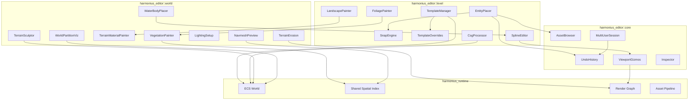
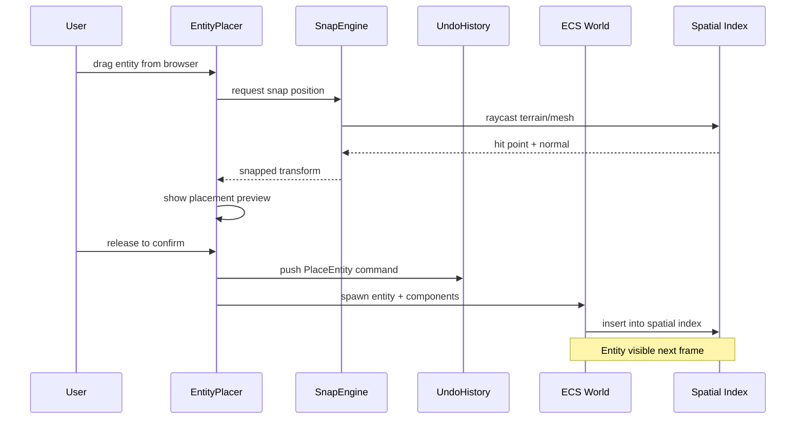
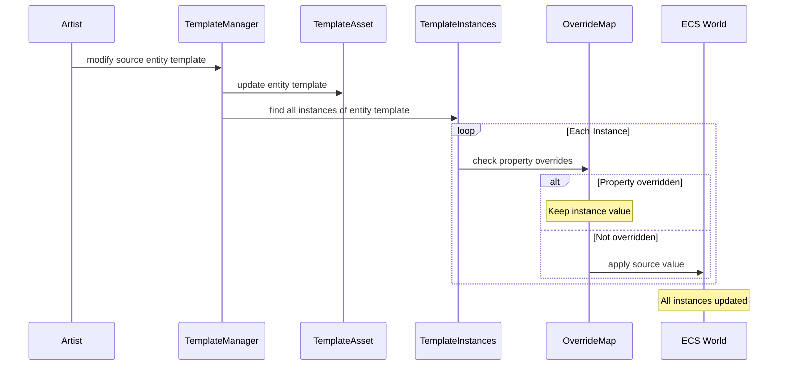
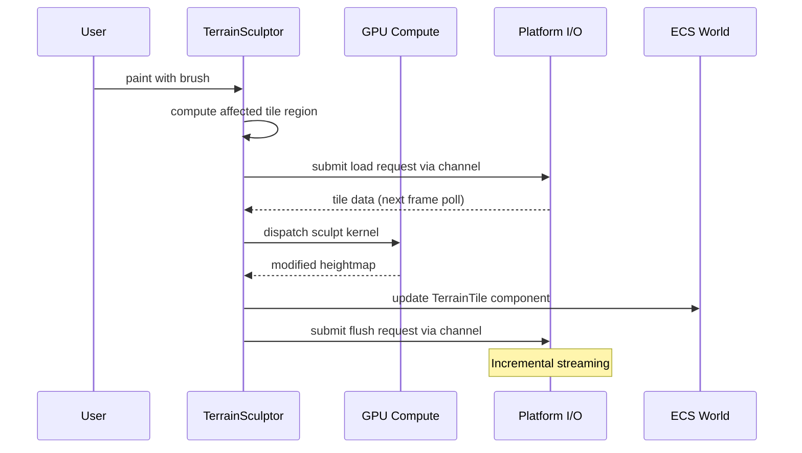
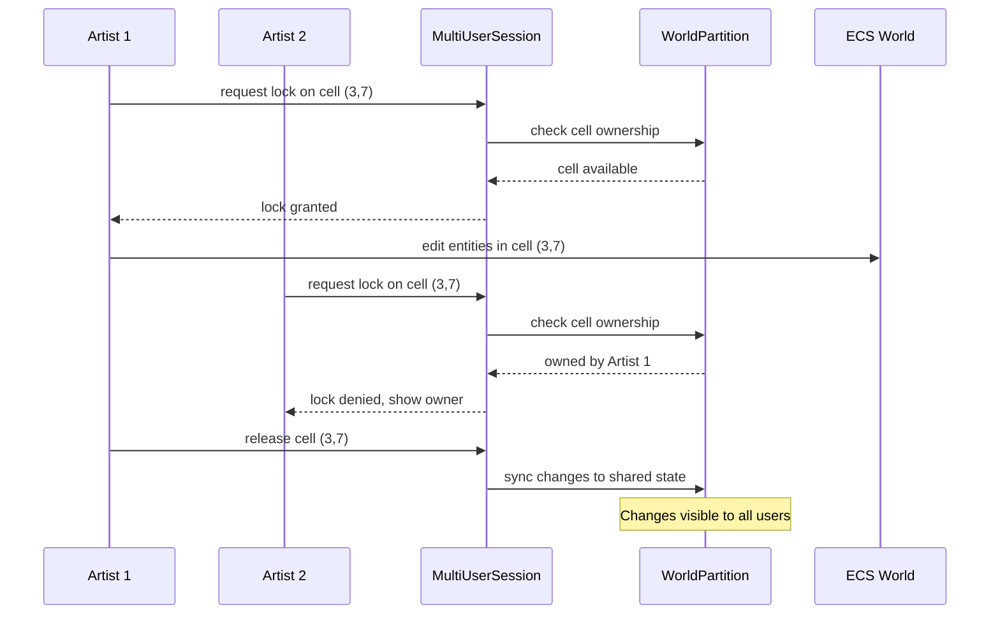
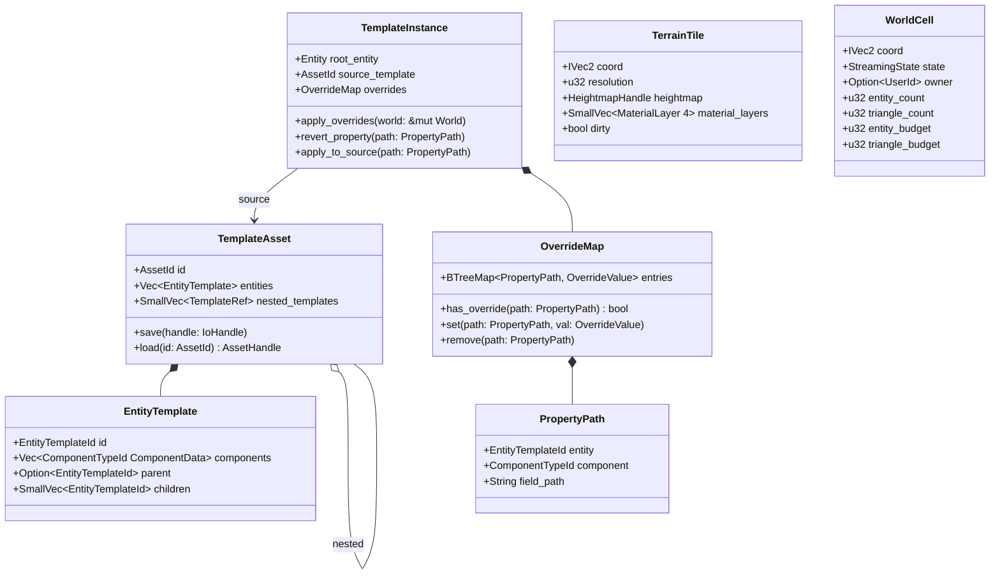
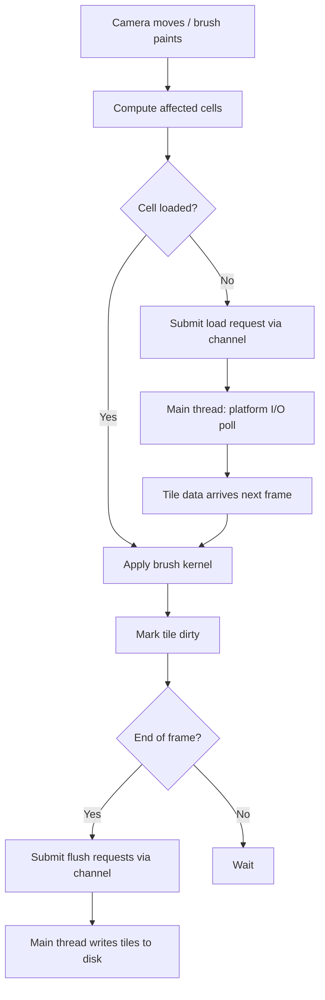

# Level Editor and World Building Design

## Requirements Trace

> **Canonical sources:** Features, requirements, and user stories are defined in
> [features/tools/](../../features/), [requirements/tools/](../../requirements/), and
> [user-stories/tools/](../../user-stories/). The table below traces design elements to those
> definitions.

### Level Editor (15.2)

| Feature  | Requirement |
|----------|-------------|
| F-15.2.1 | R-15.2.1    |
| F-15.2.2 | R-15.2.2    |
| F-15.2.3 | R-15.2.3    |
| F-15.2.4 | R-15.2.4    |
| F-15.2.5 | R-15.2.5    |
| F-15.2.6 | R-15.2.6    |
| F-15.2.7 | R-15.2.7    |

1. **F-15.2.1** — Entity placement with grid, surface, and vertex snapping
2. **F-15.2.2** — Entity template system with nested entity template hierarchies
3. **F-15.2.3** — Per-instance entity template property overrides
4. **F-15.2.4** — CSG brush tools for blockout and boolean operations
5. **F-15.2.5** — Spline editing with Bezier/Catmull-Rom curves
6. **F-15.2.6** — Landscape material painting with auto-paint rules
7. **F-15.2.7** — Foliage painting with density and placement rules

### World Building (15.6)

| Feature  | Requirement |
|----------|-------------|
| F-15.6.1 | R-15.6.1    |
| F-15.6.2 | R-15.6.2    |
| F-15.6.3 | R-15.6.3    |
| F-15.6.4 | R-15.6.4    |
| F-15.6.5 | R-15.6.5    |
| F-15.6.6 | R-15.6.6    |
| F-15.6.7 | R-15.6.7    |
| F-15.6.8 | R-15.6.8    |

1. **F-15.6.1** — Terrain sculpting brushes with streaming disk I/O
2. **F-15.6.2** — Hydraulic and thermal erosion simulation on GPU
3. **F-15.6.3** — Terrain material painting with weight maps
4. **F-15.6.4** — Water body placement via boundary splines
5. **F-15.6.5** — Vegetation painting with biome rule system
6. **F-15.6.6** — Light probe and reflection probe placement
7. **F-15.6.7** — Navmesh preview with real-time regeneration
8. **F-15.6.8** — World partition visualization and budget tracking

## Overview

The level editor and world building subsystems provide all visual authoring tools for populating,
sculpting, painting, and partitioning game worlds. All tools operate on the live ECS world --
entities are components, brushes write to component data, and the shared spatial index drives both
raycasting and streaming.

Key principles:

- **ECS-primary (~90%)-based.** Every placed entity, terrain tile, foliage instance, and probe is an
  ECS entity with components. No parallel data stores.
- **No-code authoring.** All operations are visual interactions in the viewport. No scripting
  required.
- **Shared spatial index.** Placement raycasts, foliage queries, navmesh generation, and partition
  budgets all query the same BVH/octree.
- **Platform-native I/O.** Terrain sculpting, heightmap I/O, and foliage storage use platform-native
  non-blocking I/O submitted via channels. Completions poll at frame boundaries on the main thread.
- **Multi-user editing.** Cell-based locking enables concurrent editing of disjoint world regions by
  multiple artists.

## Architecture

### Module Boundaries



```text
harmonius_editor/
├── level/
│   ├── placer.rs          # EntityPlacer, drag-drop
│   │                      # placement
│   ├── snap.rs            # SnapEngine: grid, surface,
│   │                      # vertex snapping
│   ├── template.rs          # TemplateManager, nested
│   │                      # entity template loading
│   ├── template_override.rs # OverrideMap, per-property
│   │                      # override tracking
│   ├── csg.rs             # CsgProcessor, boolean ops,
│   │                      # mesh conversion
│   ├── spline.rs          # SplineEditor, Bezier,
│   │                      # Catmull-Rom
│   ├── landscape.rs       # LandscapePainter, auto-
│   │                      # paint rules
│   └── foliage.rs         # FoliagePainter, density
│                          # brushes, LOD preview
├── world/
│   ├── terrain_sculpt.rs  # TerrainSculptor, brush
│   │                      # suite, streaming I/O
│   ├── terrain_erosion.rs # TerrainErosion, GPU
│   │                      # compute simulation
│   ├── terrain_paint.rs   # TerrainMaterialPainter,
│   │                      # weight maps
│   ├── water.rs           # WaterBodyPlacer, river
│   │                      # splines, lake fill
│   ├── vegetation.rs      # VegetationPainter, biome
│   │                      # rules, auto-populate
│   ├── lighting.rs        # LightingSetup, probes,
│   │                      # grids, baking
│   ├── navmesh.rs         # NavmeshPreview, overlay,
│   │                      # pathfinding test
│   └── partition.rs       # WorldPartitionViz, minimap,
│                          # budget tracking
└── core/
    ├── undo.rs            # UndoHistory, command stack
    ├── gizmo.rs           # ViewportGizmos, translate/
    │                      # rotate/scale handles
    ├── browser.rs         # AssetBrowser, drag source
    ├── inspector.rs       # Inspector, property grid
    └── multiuser.rs       # MultiUserSession, cell
                           # locking
```

### Entity Placement Data Flow



### Entity Template Propagation Flow



### Terrain Sculpting Pipeline



### World Grid and Multi-User Flow



### Core Data Structures



## API Design

### Snap Engine

```rust
/// Snapping mode for entity placement.
#[derive(Clone, Copy, Debug, PartialEq, Eq)]
pub enum SnapMode {
    /// Align to a uniform grid with the given cell
    /// size in world units.
    Grid { cell_size: f32 },
    /// Project onto the nearest surface below the
    /// cursor using a spatial index raycast.
    Surface,
    /// Snap to the nearest vertex of the closest
    /// mesh geometry.
    Vertex,
    /// No snapping; use raw cursor position.
    None,
}

/// Resolves cursor positions to snapped world
/// transforms.
pub struct SnapEngine { /* ... */ }

impl SnapEngine {
    pub fn new() -> Self;

    /// Compute a snapped transform from a viewport
    /// ray. Returns the snapped position and surface
    /// normal (if surface or vertex snap hit).
    pub fn snap(
        &self,
        ray: Ray3,
        mode: SnapMode,
        spatial_index: &SpatialIndex,
    ) -> Option<SnapResult>;
}

pub struct SnapResult {
    pub position: Vec3,
    pub normal: Vec3,
    pub rotation: Quat,
}
```

### Entity Placer

```rust
/// Handles drag-and-drop entity placement from the
/// asset browser into the viewport.
pub struct EntityPlacer { /* ... */ }

impl EntityPlacer {
    pub fn new(
        snap: SnapEngine,
        undo: UndoHistory,
    ) -> Self;

    /// Begin a placement drag. Shows a preview ghost
    /// of the entity at the cursor position.
    pub fn begin_drag(
        &mut self,
        asset_id: AssetId,
        viewport: &Viewport,
    );

    /// Update the placement preview as the cursor
    /// moves. Applies the active snap mode.
    pub fn update_drag(
        &mut self,
        cursor_ray: Ray3,
        spatial_index: &SpatialIndex,
    );

    /// Confirm placement. Spawns the entity in the
    /// ECS world and pushes an undo command.
    pub fn confirm_placement(
        &mut self,
        world: &mut World,
    ) -> Entity;

    /// Cancel the active placement drag.
    pub fn cancel_drag(&mut self);

    /// Duplicate selected entities with their
    /// transforms and push an undo command.
    pub fn duplicate_selection(
        &mut self,
        selection: &[Entity],
        world: &mut World,
    ) -> Vec<Entity>;

    /// Set the active snap mode.
    pub fn set_snap_mode(&mut self, mode: SnapMode);
}
```

### Entity Template System

```rust
/// Unique identifier for an entity within an entity
/// template.
#[derive(
    Clone, Copy, Debug, PartialEq, Eq, Hash,
)]
pub struct EntityTemplateId(pub u32);

/// A reusable entity hierarchy stored as an asset.
/// Serialized with rkyv for zero-copy mmap access.
pub struct TemplateAsset {
    pub id: AssetId,
    pub entities: Vec<EntityTemplate>,
    pub nested_templates: SmallVec<[TemplateRef; 4]>,
}

/// A single entity definition within a template.
/// Components stored as sorted Vec for deterministic
/// lookup via binary search (no TypeId, no HashMap).
/// ComponentTypeId is codegen'd by the middleman .dylib.
pub struct EntityTemplate {
    pub id: EntityTemplateId,
    /// Sorted by ComponentTypeId for binary search.
    pub components: Vec<(ComponentTypeId, ComponentData)>,
    pub parent: Option<EntityTemplateId>,
    pub children: SmallVec<[EntityTemplateId; 4]>,
}

/// Reference to a nested entity template with a local
/// transform offset.
pub struct TemplateRef {
    pub template_id: AssetId,
    pub local_transform: Transform,
}

/// Manages entity template loading, instantiation, and
/// propagation.
pub struct TemplateManager { /* ... */ }

impl TemplateManager {
    pub fn new() -> Self;

    /// Submit an entity template load request.
    /// Returns a handle; call `poll_load` to check
    /// completion. I/O runs on the main thread via
    /// platform-native non-blocking backends
    /// (dispatch_io/IOCP/io_uring).
    pub fn request_load(
        &self,
        id: AssetId,
    ) -> AssetHandle<TemplateAsset>;

    /// Check whether a load is complete.
    pub fn poll_load(
        &self,
        handle: &AssetHandle<TemplateAsset>,
    ) -> Option<&TemplateAsset>;

    /// Instantiate an entity template into the ECS world.
    /// Returns the root entity.
    pub fn instantiate(
        &self,
        template: &TemplateAsset,
        transform: Transform,
        world: &mut World,
    ) -> Entity;

    /// Create an entity template from a selection of entities.
    pub fn create_from_selection(
        &self,
        entities: &[Entity],
        world: &World,
    ) -> TemplateAsset;

    /// Propagate source entity template changes to all
    /// instances, respecting per-instance overrides.
    pub fn propagate_changes(
        &self,
        template_id: AssetId,
        world: &mut World,
    );
}
```

### Entity Template Instance Overrides

```rust
/// Path to a specific property within an entity
/// template instance, used for override tracking.
#[derive(Clone, Debug, PartialEq, Eq, Hash)]
pub struct PropertyPath {
    pub entity: EntityTemplateId,
    pub component: ComponentTypeId,
    pub field_path: String,
}

/// Per-instance override map. Tracks which
/// properties differ from the source entity template.
/// BTreeMap ensures deterministic iteration order for
/// template propagation across 1000+ instances.
pub struct OverrideMap {
    entries: BTreeMap<PropertyPath, OverrideValue>,
}

impl OverrideMap {
    pub fn new() -> Self;
    pub fn has_override(
        &self,
        path: &PropertyPath,
    ) -> bool;
    pub fn set(
        &mut self,
        path: PropertyPath,
        value: OverrideValue,
    );
    pub fn remove(&mut self, path: &PropertyPath);
    pub fn iter(
        &self,
    ) -> impl Iterator<
        Item = (&PropertyPath, &OverrideValue),
    >;
}

/// Component attached to entity template instance root
/// entities to track their source and overrides.
pub struct TemplateInstanceComponent {
    pub source_template: AssetId,
    pub overrides: OverrideMap,
}

impl TemplateInstanceComponent {
    /// Revert a single property to the source
    /// entity template value.
    pub fn revert_property(
        &mut self,
        path: &PropertyPath,
        world: &mut World,
        entity: Entity,
    );

    /// Apply an override back to the source template,
    /// making it the new default.
    pub fn apply_to_source(
        &self,
        path: &PropertyPath,
        template: &mut TemplateAsset,
    );
}
```

### CSG Brush Tools

```rust
/// CSG primitive types for blockout geometry.
#[derive(Clone, Debug)]
pub enum CsgPrimitive {
    Box { extents: Vec3 },
    Cylinder { radius: f32, height: f32 },
    Sphere { radius: f32 },
    Stairs { width: f32, height: f32, steps: u32 },
    Arch { radius: f32, angle: f32, width: f32 },
}

/// CSG boolean operation type.
#[derive(Clone, Copy, Debug, PartialEq, Eq)]
pub enum CsgOperation {
    Additive,
    Subtractive,
}

/// Processes CSG boolean operations on brush
/// geometry.
pub struct CsgProcessor { /* ... */ }

impl CsgProcessor {
    pub fn new() -> Self;

    /// Create a brush entity from a primitive.
    pub fn create_brush(
        &self,
        primitive: CsgPrimitive,
        operation: CsgOperation,
        transform: Transform,
        world: &mut World,
    ) -> Entity;

    /// Apply boolean operations between two brushes
    /// to produce a result mesh.
    pub fn boolean_op(
        &self,
        a: Entity,
        b: Entity,
        world: &World,
    ) -> Result<MeshData, CsgError>;

    /// Convert finalized brush geometry to a static
    /// mesh asset.
    pub fn convert_to_static_mesh(
        &self,
        brush: Entity,
        world: &mut World,
    ) -> AssetId;
}
```

### Spline Editor

```rust
/// Spline interpolation mode.
#[derive(Clone, Copy, Debug, PartialEq, Eq)]
pub enum SplineType {
    Bezier,
    CatmullRom,
}

/// A single control point on a spline.
#[derive(Clone, Debug)]
pub struct SplineControlPoint {
    pub position: Vec3,
    pub tangent_in: Vec3,
    pub tangent_out: Vec3,
    pub width: f32,
    pub roll: f32,
}

/// Spline data stored as a component on spline
/// entities.
pub struct SplineComponent {
    pub spline_type: SplineType,
    pub points: Vec<SplineControlPoint>,
    pub closed: bool,
}

/// Editor for viewport spline manipulation.
pub struct SplineEditor { /* ... */ }

impl SplineEditor {
    pub fn new() -> Self;

    /// Add a control point at the given position.
    pub fn add_point(
        &mut self,
        position: Vec3,
        entity: Entity,
        world: &mut World,
    );

    /// Move a control point and update tangents.
    pub fn move_point(
        &mut self,
        index: usize,
        new_position: Vec3,
        entity: Entity,
        world: &mut World,
    );

    /// Delete a control point.
    pub fn delete_point(
        &mut self,
        index: usize,
        entity: Entity,
        world: &mut World,
    );

    /// Evaluate the spline position at parameter t.
    pub fn evaluate(
        &self,
        spline: &SplineComponent,
        t: f32,
    ) -> Vec3;

    /// Distribute entities along a spline with
    /// configurable spacing and randomization.
    pub fn distribute_along(
        &self,
        spline: &SplineComponent,
        config: &DistributeConfig,
        world: &mut World,
    ) -> Vec<Entity>;
}

/// Configuration for distributing entities along
/// a spline.
pub struct DistributeConfig {
    pub asset_id: AssetId,
    pub spacing: f32,
    pub random_offset: Vec3,
    pub random_rotation: f32,
    pub random_scale_range: (f32, f32),
    pub align_to_spline: bool,
}
```

### Terrain Sculpting

```rust
/// Terrain sculpt brush type.
#[derive(Clone, Copy, Debug, PartialEq, Eq)]
pub enum SculptBrushType {
    Raise,
    Lower,
    Smooth,
    Flatten,
    Erode,
    Noise,
}

/// Brush configuration shared by sculpt, paint,
/// and foliage brushes. Also referenced by the
/// terrain system (see
/// [terrain.md](../geometry/terrain.md)).
#[derive(Clone, Debug)]
pub struct BrushConfig {
    pub radius: f32,
    pub strength: f32,
    pub falloff: FalloffCurve,
    pub shape_mask: Option<AssetId>,
}

/// Falloff curve for brush strength attenuation.
#[derive(Clone, Debug)]
pub enum FalloffCurve {
    Linear,
    Smooth,
    Constant,
    Custom(Vec<Vec2>),
}

/// Sculpts terrain heightmaps with streaming disk
/// I/O for large worlds. Uses platform-native
/// non-blocking I/O (dispatch_io / IOCP / io_uring).
/// All methods are synchronous; I/O completions are
/// polled at frame boundaries by the main thread.
pub struct TerrainSculptor { /* ... */ }

impl TerrainSculptor {
    pub fn new() -> Self;

    /// Apply a sculpt stroke at the given world
    /// position. Submits tile load requests for
    /// affected tiles. If tiles are already loaded,
    /// applies the brush immediately. Marks dirty
    /// tiles for deferred flush.
    pub fn apply_stroke(
        &mut self,
        position: Vec3,
        brush_type: SculptBrushType,
        config: &BrushConfig,
        world: &mut World,
    );

    /// Submit flush requests for all dirty tiles.
    /// Actual I/O runs on the main thread; called at
    /// end of frame.
    pub fn flush_dirty_tiles(&mut self);

    /// Set the active brush type.
    pub fn set_brush(
        &mut self,
        brush_type: SculptBrushType,
    );
}
```

### Terrain Erosion

```rust
/// Parameters for terrain erosion simulation.
#[derive(Clone, Debug)]
pub struct ErosionParams {
    pub rain_amount: f32,
    pub sediment_capacity: f32,
    pub thermal_angle: f32,
    pub iterations: u32,
}

/// Erosion type.
#[derive(Clone, Copy, Debug, PartialEq, Eq)]
pub enum ErosionType {
    Hydraulic,
    Thermal,
}

/// GPU-accelerated terrain erosion simulation.
pub struct TerrainErosion { /* ... */ }

impl TerrainErosion {
    pub fn new() -> Self;

    /// Submit erosion simulation on the selected
    /// terrain region. Uses GPU compute for
    /// real-time preview. Returns a job handle;
    /// the caller polls for completion each frame.
    pub fn submit_simulate(
        &self,
        region: Rect,
        erosion_type: ErosionType,
        params: &ErosionParams,
        world: &mut World,
    ) -> JobHandle;

    /// Submit erosion preview without committing.
    /// Poll the job handle for completion.
    pub fn submit_preview(
        &self,
        region: Rect,
        erosion_type: ErosionType,
        params: &ErosionParams,
    ) -> JobHandle<HeightmapData>;

    /// Commit the previewed erosion to the terrain.
    pub fn commit(
        &self,
        preview: HeightmapData,
        world: &mut World,
    );
}
```

### Landscape and Foliage Painting

```rust
/// Auto-painting rule for terrain materials.
#[derive(Clone, Debug)]
pub struct AutoPaintRule {
    pub material_layer: u32,
    pub min_slope: f32,
    pub max_slope: f32,
    pub min_altitude: f32,
    pub max_altitude: f32,
    pub strength: f32,
}

/// Paints material layers onto terrain tiles.
pub struct LandscapePainter { /* ... */ }

impl LandscapePainter {
    pub fn new() -> Self;

    /// Paint a material layer at the given position.
    pub fn paint_stroke(
        &mut self,
        position: Vec3,
        layer: u32,
        config: &BrushConfig,
        world: &mut World,
    );

    /// Apply auto-painting rules to a terrain
    /// region.
    pub fn auto_paint(
        &self,
        region: Rect,
        rules: &[AutoPaintRule],
        world: &mut World,
    );
}

/// Per-foliage-type placement rules.
#[derive(Clone, Debug)]
pub struct FoliagePlacementRule {
    pub asset_id: AssetId,
    pub min_slope: f32,
    pub max_slope: f32,
    pub min_altitude: f32,
    pub max_altitude: f32,
    pub exclusion_radius: f32,
    pub scale_range: (f32, f32),
    pub rotation_range: (f32, f32),
    pub density: f32,
}

/// Paints foliage instances onto surfaces with
/// density brushes and placement rules.
/// Foliage painting interacts with the VFX wind
/// system via shared wind field ECS resources.
pub struct FoliagePainter { /* ... */ }

impl FoliagePainter {
    pub fn new() -> Self;

    /// Paint foliage at the given position.
    pub fn paint_stroke(
        &mut self,
        position: Vec3,
        rule: &FoliagePlacementRule,
        config: &BrushConfig,
        world: &mut World,
    );

    /// Erase foliage within the brush radius.
    pub fn erase_stroke(
        &mut self,
        position: Vec3,
        config: &BrushConfig,
        world: &mut World,
    );

    /// Add an exclusion zone where foliage cannot
    /// be placed.
    pub fn add_exclusion_zone(
        &mut self,
        bounds: Aabb,
        world: &mut World,
    );
}
```

### Vegetation and Biome System

```rust
/// Declarative biome rule for auto-populating
/// vegetation across large regions.
#[derive(Clone, Debug)]
pub struct BiomeRule {
    pub name: String,
    pub species: Vec<FoliagePlacementRule>,
    pub clustering: ClusterConfig,
    pub seed: u64,
}

/// Clustering configuration for grouped vegetation.
#[derive(Clone, Debug)]
pub struct ClusterConfig {
    pub cluster_radius: f32,
    pub cluster_density: f32,
    pub inter_cluster_spacing: f32,
}

/// Auto-populates vegetation using biome rules.
pub struct VegetationPainter { /* ... */ }

impl VegetationPainter {
    pub fn new() -> Self;

    /// Auto-populate a region with vegetation using
    /// the given biome rules. Deterministic given
    /// the same seed.
    pub fn auto_populate(
        &self,
        region: Rect,
        rules: &[BiomeRule],
        world: &mut World,
    ) -> u32;

    /// Validate that all placed instances satisfy
    /// their placement rules. Returns violations.
    pub fn validate_placements(
        &self,
        region: Rect,
        rules: &[BiomeRule],
        world: &World,
    ) -> Vec<PlacementViolation>;
}
```

### Water Body Placement

```rust
/// Water body type.
#[derive(Clone, Copy, Debug, PartialEq, Eq)]
pub enum WaterBodyType {
    River,
    Lake,
    Ocean,
}

/// Configuration for a river segment.
#[derive(Clone, Debug)]
pub struct RiverConfig {
    pub width: f32,
    pub depth: f32,
    pub flow_speed: f32,
}

/// Configuration for a lake volume.
#[derive(Clone, Debug)]
pub struct LakeConfig {
    pub surface_altitude: f32,
    pub shoreline_blend: f32,
}

/// Places water volumes using boundary splines.
pub struct WaterBodyPlacer { /* ... */ }

impl WaterBodyPlacer {
    pub fn new() -> Self;

    /// Create a river following a spline path.
    pub fn create_river(
        &self,
        spline: Entity,
        config: &RiverConfig,
        world: &mut World,
    ) -> Entity;

    /// Create a lake filling to a specified
    /// altitude.
    pub fn create_lake(
        &self,
        boundary: Entity,
        config: &LakeConfig,
        world: &mut World,
    ) -> Entity;
}
```

### Lighting Setup

```rust
/// Light probe placement mode.
#[derive(Clone, Copy, Debug, PartialEq, Eq)]
pub enum ProbePlacementMode {
    TetrahedralGrid { spacing: f32 },
    Manual,
}

/// Reflection probe configuration.
#[derive(Clone, Debug)]
pub struct ReflectionProbeConfig {
    pub capture_extents: Vec3,
    pub blend_distance: f32,
    pub update_mode: ProbeUpdateMode,
}

/// Probe update strategy.
#[derive(Clone, Copy, Debug, PartialEq, Eq)]
pub enum ProbeUpdateMode {
    Baked,
    RealTime,
}

/// Placement and configuration tools for light
/// and reflection probes.
pub struct LightingSetup { /* ... */ }

impl LightingSetup {
    pub fn new() -> Self;

    /// Place light probes on a tetrahedral grid.
    pub fn place_light_probe_grid(
        &self,
        bounds: Aabb,
        mode: ProbePlacementMode,
        world: &mut World,
    ) -> Vec<Entity>;

    /// Place a single reflection probe.
    pub fn place_reflection_probe(
        &self,
        position: Vec3,
        config: &ReflectionProbeConfig,
        world: &mut World,
    ) -> Entity;

    /// Toggle visualization overlay for probe
    /// influence regions.
    pub fn set_overlay_visible(
        &mut self,
        visible: bool,
    );
}
```

### Navmesh Preview

```rust
/// Navmesh overlay display configuration.
#[derive(Clone, Debug)]
pub struct NavmeshOverlayConfig {
    pub show_walkable: bool,
    pub show_slope_limits: bool,
    pub show_agent_radius: bool,
    pub overlay_opacity: f32,
}

/// Renders navmesh overlays and pathfinding tests
/// in the viewport.
pub struct NavmeshPreview { /* ... */ }

impl NavmeshPreview {
    pub fn new() -> Self;

    /// Submit navmesh regeneration for a region.
    /// Executes via the job system (crossbeam-deque).
    /// Poll the returned handle for completion.
    pub fn submit_regenerate_region(
        &self,
        bounds: Aabb,
        world: &World,
    ) -> JobHandle;

    /// Run a pathfinding test between two markers.
    pub fn test_pathfind(
        &self,
        start: Vec3,
        goal: Vec3,
        world: &World,
    ) -> Option<Vec<Vec3>>;

    /// Toggle the navmesh overlay.
    pub fn set_overlay_config(
        &mut self,
        config: NavmeshOverlayConfig,
    );
}
```

### World Grid Visualization

```rust
/// Streaming state of a world cell.
#[derive(
    Clone, Copy, Debug, PartialEq, Eq,
)]
pub enum StreamingState {
    Loaded,
    Pending,
    Unloaded,
}

/// Budget status for a world cell.
#[derive(Clone, Debug)]
pub struct CellBudgetStatus {
    pub entity_count: u32,
    pub entity_budget: u32,
    pub triangle_count: u32,
    pub triangle_budget: u32,
    pub over_budget: bool,
}

/// World partition cell data stored as an ECS
/// component on cell entities.
pub struct WorldCellComponent {
    pub coord: IVec2,
    pub state: StreamingState,
    pub owner: Option<UserId>,
    pub budget: CellBudgetStatus,
}

/// Displays world partition grid, streaming
/// states, and budget overlays.
pub struct WorldPartitionViz { /* ... */ }

impl WorldPartitionViz {
    pub fn new() -> Self;

    /// Toggle the 2D minimap display.
    pub fn set_minimap_visible(
        &mut self,
        visible: bool,
    );

    /// Toggle the 3D viewport overlay.
    pub fn set_overlay_visible(
        &mut self,
        visible: bool,
    );

    /// Toggle cell ownership display for
    /// multi-user editing.
    pub fn set_ownership_visible(
        &mut self,
        visible: bool,
    );

    /// Get all cells that exceed their budgets.
    pub fn get_over_budget_cells(
        &self,
        world: &World,
    ) -> Vec<IVec2>;
}
```

### Multi-User Session

```rust
/// Multi-user editing session with cell-based
/// locking.
pub struct MultiUserSession { /* ... */ }

/// Multi-user transport uses QUIC:
/// - Linux: quinn-proto
/// - Apple: Networking.framework via objc2
/// - Windows: MsQuic via windows-rs
/// All methods are synchronous. Sends are
/// fire-and-forget via channel. Responses arrive as
/// events polled at frame boundaries.
impl MultiUserSession {
    /// Submit a connection request to the shared
    /// editing server. Result arrives as an event
    /// in the next frame poll.
    pub fn connect(&mut self, server_addr: &str);

    /// Submit a cell lock request. Result event:
    /// `LockGranted(CellLock)` or `LockDenied(LockError)`.
    pub fn request_lock(&self, cell: IVec2);

    /// Release a previously acquired cell lock.
    pub fn release_lock(&self, lock: CellLock);

    /// Push the undo history delta to shared state.
    pub fn sync_changes(
        &self,
        undo_history: &UndoHistory,
    );
}

pub enum LockError {
    CellOwnedBy(UserId),
    ConnectionLost,
    Timeout,
}
```

### Undo History

```rust
/// A reversible editor command.
pub trait EditorCommand: Send + Sync {
    fn execute(&self, world: &mut World);
    fn undo(&self, world: &mut World);
    fn description(&self) -> &str;
}

/// Undo/redo stack for all editor operations.
///
/// `Box<dyn EditorCommand>` is justified here:
/// the undo stack is an editor-only cold path
/// (per-command allocation, not per-frame) holding
/// a heterogeneous mix of command types. This is one
/// of the explicitly permitted `dyn` uses
/// (editor/tool paths, not game runtime).
pub struct UndoHistory { /* ... */ }

impl UndoHistory {
    pub fn new() -> Self;

    /// Push a command, execute it, and clear the
    /// redo stack.
    pub fn execute(
        &mut self,
        cmd: Box<dyn EditorCommand>,
        world: &mut World,
    );

    /// Undo the most recent command.
    pub fn undo(&mut self, world: &mut World);

    /// Redo the most recently undone command.
    pub fn redo(&mut self, world: &mut World);

    pub fn can_undo(&self) -> bool;
    pub fn can_redo(&self) -> bool;
}
```

## Data Flow

### Entity Lifecycle

1. User drags an asset from the browser into the viewport.
2. `EntityPlacer` calls `SnapEngine::snap()` to compute a snapped transform using the shared spatial
   index raycast.
3. A preview ghost renders at the snapped position.
4. On release, `EntityPlacer` pushes a `PlaceEntity` command to `UndoHistory` and spawns the entity
   in the ECS world.
5. The ECS inserts the entity into the shared spatial index. It becomes visible next frame.

### Entity Template Propagation

1. An artist modifies a source entity template asset.
2. `TemplateManager::propagate_changes()` queries all entities with a matching
   `TemplateInstanceComponent`.
3. For each instance, properties without overrides receive the updated source value.
4. Overridden properties are left unchanged.
5. The inspector shows overrides with bold labels via `OverrideMap::has_override()`.

### Terrain Sculpting Streaming

1. User paints with a sculpt brush.
2. `TerrainSculptor` computes the set of affected tile coordinates.
3. Unloaded tiles are requested via channel to the main thread's platform I/O
   (dispatch_io/IOCP/io_uring). Completions arrive at frame boundary.
4. The brush kernel runs on loaded tile data (GPU compute for erosion, CPU for simple brushes).
5. Modified tiles are marked dirty.
6. On brush release, dirty tile flush requests are submitted via channel to the main thread.
7. Peak memory is bounded by loading only the affected tile window.

### World Grid Multi-User

1. An artist requests a cell lock via `MultiUserSession::request_lock()`.
2. The server checks ownership. If available, the lock is granted.
3. The artist edits entities within the locked cell.
4. On release, `sync_changes()` pushes the undo history delta to the shared state.
5. Other artists see the updated cell. The partition overlay shows ownership changes.

## Platform Considerations

| Feature | Windows | macOS | Linux | iOS | Android |
|---------|---------|-------|-------|-----|---------|
| Heightmap I/O | IOCP via windows-rs | GCD dispatch_io via dispatch2 | io_uring via rustix | GCD dispatch_io | io_uring via rustix |
| GPU erosion | D3D12 compute | Metal compute | Vulkan compute | Metal compute | Vulkan compute |
| Stack capture | `CaptureStackBackTrace` | `backtrace` | `backtrace` | `backtrace` | `backtrace` |
| Multi-user transport | MsQuic via windows-rs | Networking.framework via objc2 | quinn-proto | Networking.framework | quinn-proto |
| Spatial index | Shared BVH | Shared BVH | Shared BVH | Shared BVH | Shared BVH |

All platform I/O is non-blocking. The main thread polls completions at the frame boundary. No Tokio,
no stdlib blocking file I/O, no `async fn` anywhere in the editor or engine.

## Codegen Integration

Entity templates, custom component types, biome rules, and placement rules are not interpreted at
runtime. They compile to Rust via the codegen pipeline into the middleman `.dylib`. The engine loads
the `.dylib` via `libloading`. Hot-reload recompiles the `.dylib` when templates change (sub-3s
target).

| Authoring artifact | Codegen output | Where it lives |
|--------------------|----------------|----------------|
| Entity template definition | `TemplateAsset` impl + accessors | middleman .dylib |
| Custom component type | `ComponentTypeId` + property panel | middleman .dylib |
| Biome rule | `BiomeRule` struct + `evaluate()` fn | middleman .dylib |
| Placement rule | `FoliagePlacementRule` struct | middleman .dylib |
| ViewportTool | `ViewportTool` impl | middleman .dylib |

`ComponentTypeId` is the codegen'd stable identifier for a component type. It replaces `TypeId`
everywhere. All `HashMap<TypeId, _>` in this design are replaced with sorted
`Vec<(ComponentTypeId, _)>` for deterministic lookup via binary search.

## Game Loop Integration

Editor tool systems run in a dedicated **editor phase** inserted between `InputProcessing` and
`GameUpdate` in the game loop. They must not conflict with game systems. The ECS scheduler tracks
editor system access sets separately from game system access sets.

```text
Frame N:
  InputProcessing
  EditorPhase          ← tool systems run here
    EntityPlacer
    TerrainSculptor
    FoliagePainter
    TemplateManager::propagate_changes
  GameUpdate           ← game systems (play-in-editor)
  RenderSubmit
  MainThread I/O poll  ← terrain tile completions arrive
                         dirty tile flushes submitted
```

Frame-boundary handoff:

- Terrain tile load completions become available when the main thread polls I/O at end of frame.
  Loaded tiles are inserted into the `TerrainSculptor` ready-map. The sculpt brush reads them next
  frame.
- Dirty tile flush requests are submitted at end of frame via channel to the main thread.
- Template propagation commits component mutations atomically via command buffer at the editor phase
  sync point.

## Cross-Subsystem Integration

| Subsystem | Direction | Data | Mechanism |
|-----------|-----------|------|-----------|
| Spatial index | bidirectional | BVH queries, entity registration | Shared BVH API |
| Asset pipeline | bidirectional | load/save terrain, templates | AssetDatabase API |
| Render graph | produces | GPU compute passes (erosion, foliage) | Render graph nodes |
| Input system | consumes | brush input, placement tools | Input actions |
| ECS world | bidirectional | entity spawn/despawn, components | World API |
| Physics | consumes | CSG collision, terrain collider | Physics API |
| Navmesh | produces | navigation data from terrain | AI navigation API |
| VFX | produces | wind for foliage, weather | Wind field texture |
| Grids/volumes | bidirectional | heightmap, voxel terrain | Grid API |
| Networking | bidirectional | multi-user cell locks | QUIC transport |
| UI framework | consumes | tool panels, brush UI | Widget API |
| Save system | produces | world state persistence | Save API |
| Streaming | produces | cell load/unload requests | Asset pipeline |

## Algorithm References

| Algorithm | Used in | Reference |
|-----------|---------|-----------|
| BSP boolean CSG | `CsgProcessor` | <https://gdbooks.gitbooks.io/3dcollisions/content/Chapter4/> |
| Hydraulic erosion (GPU particle) | `TerrainErosion` | <https://nickmcd.me/2020/04/10/hydraulic-erosion/> |
| Thermal erosion | `TerrainErosion` | <https://www.firespark.de/resources/downloads/implementation%20of%20a%20methode%20for%20hydraulic%20erosion.pdf> |
| Catmull-Rom spline evaluation | `SplineEditor` | <https://en.wikipedia.org/wiki/Centripetal_Catmull%E2%80%93Rom_spline> |
| Bezier spline (de Casteljau) | `SplineEditor` | <https://pomax.github.io/bezierinfo/> |
| Recast navmesh generation | `NavmeshPreview` | <https://recastnav.com/> |
| Tetrahedral probe placement | `LightingSetup` | <https://gdcvault.com/play/1015312> |
| Poisson-disk foliage distribution | `FoliagePainter`, `VegetationPainter` | <https://www.cs.ubc.ca/~rbridson/docs/bridson-siggraph07-poissondisk.pdf> |
| Quadtree world partitioning | `WorldPartitionViz` | <https://en.wikipedia.org/wiki/Quadtree> |

## 2D and 2.5D Support

All level and world editor tools work in 2D, 2.5D, and 3D modes. No separate code paths.

1. **2D entity placement** — entities with `Transform2D` (Vec2 position, f32 rotation, Vec2 scale).
   Z-order replaces depth. Placement tools operate on the XY plane.
2. **Tilemap editing** — terrain equivalent for 2D. Tile palette, paint tool, auto-tiling rules
   (Wang tiles). Cross-reference `rendering/2d.md`.
3. **2D world partitioning** — grid-based streaming for large 2D worlds (RTS maps, open-world 2D).
   Same streaming system with 2D cells.
4. **Isometric** — isometric grid placement with snap. Support for isometric and hex grids
   (`rendering/2d.md` `GridType`).
5. **Parallax layer placement** — for 2D platformers, place background/foreground layers at
   different parallax rates.
6. **2D foliage** — scatter 2D sprites (grass, flowers) on a surface with density brushes. Same
   `FoliagePainter` adapted for 2D.

## Job System Usage

Parallelized operations use the custom job system (crossbeam-deque work-stealing):

| Operation | Parallelism | API |
|-----------|-------------|-----|
| `propagate_changes` (1000+ instances) | Data-parallel over instances | `par_iter` |
| `auto_populate` over large regions | Region tiles in parallel | `scope()` |
| Navmesh regeneration | Tile-parallel tile processing | `scope()` |
| Foliage paint (10k instances) | Parallel scatter per chunk | `par_iter` |
| CSG boolean evaluation | Single-threaded (BSP is serial) | — |
| Biome rule evaluation | Data-parallel over terrain cells | `par_iter` |

## Memory: Per-Thread Arenas

Hot-path allocations use per-thread arenas. Reset at frame boundaries.

| Allocation type | Arena scope |
|-----------------|-------------|
| Brush stroke temporaries | Per-frame worker arena |
| Foliage placement buffers | Per-frame worker arena |
| Raycast result lists | Per-frame worker arena |
| Template propagation scratch | Per-frame worker arena |
| CSG intermediate geometry | Per-operation stack arena |

Terrain tile heightmap data is loaded into a bounded tile cache (not an arena). The cache evicts LRU
tiles when the memory budget is exceeded.

## Terrain Sculpting: Streaming Data Flow



Cell load order: closest to brush first. Adjacent tiles prefetched when brush is within 1-tile
margin of a cell boundary to eliminate cross-boundary latency spikes.

## LOD System

| Entity type | LOD 0 | LOD 1 | LOD 2+ |
|-------------|-------|-------|--------|
| Terrain | Full heightmap mesh | Decimated (4x reduction) | Flat quad |
| Foliage | Full mesh | Billboard sprite | Hidden |
| Placed entity | Full mesh (authored) | Reduced mesh (authored) | Impostor / hidden |

LOD distances are configurable per quality tier (Low / Medium / High / Ultra). Authored per-asset
LOD chains. The editor previews LOD transitions at configurable distance thresholds.

## Scene Hierarchy Management

The level editor manages ECS `ChildOf` hierarchies:

1. **Reparent entity** — drag entity onto new parent in the outliner. Writes `ChildOf` component.
   Converts `LocalTransform` so `GlobalTransform` is preserved.
2. **Group** — select entities → Group. Creates an empty `Transform` parent entity. All selected
   entities become children.
3. **Ungroup** — select group entity → Flatten. Children are reparented to the group's parent. Group
   entity is despawned.
4. **Outliner sync** — the scene outliner mirrors the `ChildOf` hierarchy. Drag-and-drop in the
   outliner changes `ChildOf`. Hierarchy depth visualized by indentation.

## Multi-Scene Editing

1. **Sub-scenes** — scenes load as entity references. A world scene may reference sub-scenes
   (interiors, streaming cells). Sub-scene entities are namespaced by scene ID.
2. **Sub-scene edits** — edits to a sub-scene asset propagate to all worlds that reference it. The
   outliner shows nested scenes collapsible under their reference entity.
3. **Cross-scene entity references** — resolved at load time by matching stable entity IDs in the
   text scene format.
4. **Scene outliner** — nested scenes show a scene icon. Expand to see sub-scene entities. Filter to
   single scene by clicking the scene icon.

## VR Editing

1. **VR preview mode** — enter VR preview in the editor to validate scale and spatial feel. Viewport
   renders to headset. Normal editing tools remain active.
2. **Hand-tracked placement** — entity placement driven by tracked hand position. Trigger = confirm
   placement. Grip = grab / move entity. Thumbstick = snap rotation.
3. **VR grid and measurement** — grid snapping works in VR. Measurement tool shows distances between
   entities as floating labels in 3D space.
4. **VR brush painting** — terrain sculpt and paint brushes driven by hand position and trigger
   pressure (pen-pressure equivalent).

## Deep ECS Integration

Every level/world editor operation is an ECS mutation routed through command buffers.

### Entity lifecycle

- **Place** → `spawn_entity` via command buffer with component set matching the template archetype.
- **Delete** → `despawn` via command buffer. Spatial index entry removed at next sync point.
- **Duplicate** → clone all components from source entity to new entity via command buffer.

All mutations are deferred to the editor phase sync point for undo support.

### Component editing

| Tool | Component written |
|------|------------------|
| Transform gizmo | `Transform` / `Transform2D` |
| Terrain brush | `TerrainChunk` (heightmap buffer) |
| Foliage painter | `FoliageInstance` (instance buffer) |
| Material swap | `MaterialOverride` |
| CSG tool | `CsgBrush` |

### Query-driven tools

```rust
// Selection picking
Query<(Entity, &Transform, &Selectable)>
// Terrain painting
Query<(Entity, &TerrainChunk, &Transform)>
// Foliage scatter
Query<(Entity, &FoliageRegion)>
```

### Live preview in play-in-editor

Editor command buffers merge with game command buffers at the same sync point. Level edits apply to
the live game world in real time.

### Archetype awareness

Entity templates define a fixed component set. All instances share the same archetype for cache
efficiency. Adding or removing components on an instance changes its archetype; the override map
records the delta.

### Change detection

`Changed<T>` filters detect entities modified by gameplay during play-in-editor. The editor
highlights them and offers apply-or-revert when exiting play mode.

## Scene and Transform Integration

1. **Transform hierarchy** — `ChildOf` relationships. The outliner displays the hierarchy. Drag-drop
   changes `ChildOf`. The transform system propagates `LocalTransform` → `GlobalTransform`.
2. **Local vs global editing** — the transform gizmo operates in local, global, or parent space.
   Writes to `LocalTransform`; `GlobalTransform` updated by the transform system.
3. **Transform snapping** — grid snap writes quantized values to `LocalTransform`. Surface snap
   raycasts, then writes to `LocalTransform` converted from global to local space.
4. **Transform propagation** — moving a parent moves all children. Undo stores only the parent's
   change; children update automatically via the transform system.
5. **2D transforms** — `Transform2D` entities: gizmo switches to XY-plane-only mode. Inspector shows
   2D fields. Outliner shows z-order instead of depth.
6. **Mixed 2D/3D** — a 2.5D game may have both `Transform` and `Transform2D` entities in the same
   scene. Gizmo adapts per selected entity.
7. **Transform precision** — the editor warns when placing entities beyond a configurable distance
   threshold (default 10 km). Origin-rebasing workflow available: shift origin to camera, edit,
   shift back.

## Pen Tablet Support

All brush tools respond to pressure-sensitive pen input.

### Platform input APIs

| Platform | API |
|----------|-----|
| macOS | `NSEvent` pressure/tilt via objc2 |
| Windows | Windows Ink `WM_POINTER*` via windows-rs |
| Linux | libinput tablet events via evdev |
| iPad (Sidecar) | Same as macOS |

### Brush dynamics

| Dynamic | Description |
|---------|-------------|
| Pressure → strength | 0.0 at light touch, 1.0 at full pressure. Mapping curve configurable. |
| Tilt → angle/shape | Terrain sculpt: tilt controls ridge direction. Paint: tilt elongates footprint. |
| Barrel button | Configurable action (default: eyedropper). Second button: undo last stroke. |
| Eraser end | Flip pen to erase mode automatically. |
| Size | Pen pressure, keyboard +/-, or scroll wheel. |
| Falloff | Linear, smooth, sharp, or custom curve. |
| Spacing | Distance between samples as % of brush size. |
| Jitter | Random offset per sample for organic feel. |
| Flow vs opacity | Flow = additive per stroke. Opacity = maximum per stroke. |

### Stroke smoothing

Catmull-Rom or Bezier smoothing applied to input path to reduce hand tremor. Strength configurable
(0 = raw input, 1 = heavy smoothing).

Each complete brush stroke (pen down → pen up) is one undo step.

## Terrain Painting Depth

1. **Height painting** — raise, lower, smooth, flatten, noise, ramp, stamp. All respond to pen
   pressure.
2. **Texture splatmap painting** — up to 8 layers per tile (mobile: 4). Blend by weight per texel.
   Auto-paint rules: slope > threshold → rock, altitude > threshold → snow.
3. **Foliage painting** — density brush + per-type mesh, scale range, random rotation, surface
   alignment, collision avoidance.
4. **Hole painting** — paint holes for caves, tunnels, foundations. Per-triangle visibility flag.
5. **Water painting** — water volume regions. Water level per region. Flow direction painting.
6. **Road/path painting** — spline-based roads: auto-flatten terrain, apply road material.
   Cross-reference `SplineEditor`.

## Entity Placement Depth

### Placement modes

| Mode | Description |
|------|-------------|
| Click | Raycast to surface, place at cursor |
| Drag | Place and orient simultaneously |
| Paint | Continuous placement along cursor path |
| Scatter | Random placement within brush radius |
| Line | Place along a line between two points |
| Grid | Place at regular grid intervals |
| Spline | Place along a spline path |

### Additional placement capabilities

1. **Randomization** — position jitter, rotation (full, align-to-surface, constrained axis), scale
   (uniform or per-axis within range).
2. **Replace** — swap asset reference while preserving transform, hierarchy, and overrides.
3. **Align to surface** — up vector aligns to surface normal. Modes: full, Y-up only, custom blend.
4. **Physics drop** — simulate N frames to let the entity settle naturally. "Simulate then freeze."
5. **Selection tools** — click, box, lasso, paint, volume, by type, by component, by data query.

## Debug Visualizations

All overlays toggle per category. Filtered by render layer bitmask (debug cameras only).

### Physics

| Overlay | Description |
|---------|-------------|
| Collider wireframes | Color by type: static=blue, dynamic=green, kinematic=yellow, trigger=magenta |
| Contact points | Red dots with normals as arrows; penetration depth as line length |
| Joint connections | Lines between constrained bodies; limits as arcs/cones |
| Raycast debug | Hit point and normal lines |
| Broadphase BVH | Physics-private BVH bounding boxes; color by depth level |
| CCD sweep | Extruded shapes between frame positions where tunneling prevention activates |

### Navigation

| Overlay | Description |
|---------|-------------|
| Navmesh | Triangles with walkability coloring; polygon IDs; area classification; cost multiplier |
| Agent paths | Lines from current position to destination |
| Off-mesh links | Arcs showing jump/ladder connections |
| Navigation obstacles | Red wireframes; navmesh cut regions |
| A* debug | Open/closed sets during pathfinding; animated search expansion |
| Crowd | Agent avoidance volumes; desired velocity vectors; density heat map |

### Spatial index

| Overlay | Description |
|---------|-------------|
| Shared BVH | Bounding boxes per depth level |
| Grid cells | Networking relevancy grid boundaries |
| Streaming cells | World partition cells colored by state: loaded=green, loading=yellow, unloaded=gray |

### AI

| Overlay | Description |
|---------|-------------|
| Sense volumes | Vision cones, hearing spheres |
| Awareness | State icons above NPCs |
| Behavior tree | Current node highlighted |
| Influence map | Heat overlay; per-faction toggle |
| Flow field | Direction arrows; color = turbulence |

### Audio

| Overlay | Description |
|---------|-------------|
| Sound sources | Spheres at max-distance radius |
| Attenuation | Falloff rings |
| Listener | Position and orientation |
| Occlusion | Obstruction ray lines; absorption coefficient at hit points |

### Lighting

| Overlay | Description |
|---------|-------------|
| Light wireframes | Point=sphere, spot=cone, directional=arrow |
| Shadow cascades | Frustum outlines per cascade |
| Light probes | Position markers |
| Reflection probes | Capture volume boxes |

### Performance

| Overlay | Description |
|---------|-------------|
| Overdraw | Pixel shader complexity heat map |
| Draw calls | Count per region |
| Triangle density | Heat map |
| LOD level | Color: green=LOD0, yellow=LOD1, red=LOD2+ |

### Ray tracing

| Overlay | Description |
|---------|-------------|
| BVH traversal | Nodes traversed per pixel as heat map |
| Ray count | Rays per pixel for reflections/GI/shadows |
| Denoiser compare | Toggle noisy vs denoised |
| BLAS/TLAS | Bounding boxes colored by BLAS instance count |

### Custom gizmos via logic graphs

Plugins define custom gizmos as logic graphs outputting draw commands (lines, spheres, boxes, text).
Example: a "spawn zone" component draws its radius as a dashed circle.

## Voxel Editing Tools

For voxel-based games (destructible terrain, SDF modeling).

1. **Block placement** — place/remove voxels. Cursor snaps to voxel grid. Face selection determines
   attachment face.
2. **Block painting** — paint block types onto surface faces.
3. **Region fill** — select 3D box, fill with block type. Hollow option fills shell only.
4. **Copy/paste volumes** — copy 3D region, paste with rotation and mirror.
5. **SDF sculpting** — add material (sphere stamp), remove (sphere carve), smooth, sharpen. Pen
   pressure controls strength.
6. **Voxel palette** — block type selector with search and category filter.
7. **Chunk visualization** — wireframe overlay colored by: dirty state, LOD level, streaming state.
8. **Cross-reference** — voxel data lives in `grids-volumes.md` `VoxelChunk<T>`. Editor writes to
   voxel components; render system displays them.

## CSG Modeling Tools

Constructive solid geometry for rapid level blockout. Algorithm: BSP-based boolean on half-edge
mesh. Reference: <https://gdbooks.gitbooks.io/3dcollisions/content/Chapter4/>

1. **Primitives** — box, sphere, cylinder, cone, wedge, arch, stairs. Each is a `CsgBrush` entity
   with a `CsgShape` component.
2. **Boolean operations** — additive (add geometry), subtractive (remove geometry), intersection
   (keep overlap).
3. **Brush manipulation** — select faces/edges/vertices. Extrude and scale faces.
4. **Texture mapping** — per-face material. UV auto-projection (planar, box, cylindrical). UV
   offset/scale/rotation per face.
5. **CSG evaluation** — boolean ops evaluated on edit. Result is a triangle mesh for rendering and
   collision. Source brushes remain editable.
6. **Convert to mesh** — "Finalize CSG" converts to static mesh asset. Source brushes kept or
   discarded.
7. **Performance** — evaluation must complete in < 100 ms for < 50 brushes.

## Custom Viewport Tools via Logic Graphs

Users and plugins define custom viewport tools as logic graphs:

1. **Registration** — a logic graph implementing the codegen'd `ViewportTool` trait:
   `on_activate()`, `on_deactivate()`, `on_input(event)`, `on_draw_gizmos()`, `on_apply()`. Appears
   in the viewport toolbar.
2. **Input handling** — receives viewport input events (mouse move, click, drag, scroll, keyboard).
   Produces transform commands or custom actions.
3. **Gizmo drawing** — `on_draw_gizmos()` draws custom overlays: lines, shapes, text, handles.
   Handles are interactive draggable points.
4. **Examples** — road spline tool, river tool, fence/wall tool, scatter tool, measurement tool.
5. **Settings panel** — widget tree produced by the tool's logic graph. Persisted in user
   preferences.

## Viewport Statistics Overlay

Toggleable real-time metrics overlay.

### Categories

1. **Frame timing** — FPS (current/average/1% low), frame time ms, GPU frame time, CPU breakdown.
2. **Geometry** — triangles, meshlets, vertices, draw calls, compute dispatches.
3. **Culling** — entities submitted vs culled; meshlet culling ratio; LOD distribution per level.
4. **Memory** — GPU VRAM used/total; texture atlas budget; buffer memory; CPU arena watermarks.
5. **Scene** — total entities; entities in view; light counts; shadow cascades; particle emitters;
   audio sources.
6. **Streaming** — cells loaded/total; in-flight I/O; bandwidth MB/s; cache hit rate.
7. **Render passes** — per-pass timing from render graph profiler; pass count; barrier count.
8. **Display modes** — Compact (one line), Detailed (multi-line), Graph (rolling 300-frame plot),
   Off.
9. **Integration** — stats from render graph profiler, GPU timestamp queries, ECS world statistics,
   streaming system. Overlay is a UI widget with dirty-based rendering.

## Non-Destructive Procedural Level Generation

Every procedural step is non-destructive: tweaking any parameter regenerates downstream without
losing manual edits.

### Generator stack

Each scene has an ordered stack of generator nodes evaluated top-to-bottom. Changing any node
re-evaluates downstream nodes.

| Node type | Description |
|-----------|-------------|
| Terrain generator | Noise-based heightmap (Perlin, Simplex, Worley, FBM). Configurable octaves, scale, seed. |
| Erosion pass | Hydraulic/thermal erosion on the heightmap. Non-destructive: adjusting params regenerates from pre-erosion state. |
| Biome painter | Altitude + slope + noise → biome ID. Rules are logic graph expressions (compiles to Rust per codegen pipeline). |
| Foliage scatter | Poisson-disk distribution of vegetation per biome. Density and species mix per biome. |
| Structure placer | Prefab instances at rule-determined locations. Placement rules are logic graphs. |
| Road network | Connect structures with spline roads. Roads auto-flatten terrain and paint road material. |
| River generator | Trace water flow high-to-low. Carve terrain, place water volumes, add bridge prefabs. |
| Wall/fence generator | Auto-place walls along painted region boundaries. |

### Spline-based generation

3. **Spline input** — user draws splines in viewport as input to generators: road, river, fence,
   scatter.
4. **Per-control-point data** — width, material blend, foliage density, height offset. Interpolated
   along spline.
5. **Non-destructive edit** — moving a control point regenerates only the affected region.

### Painted area generation

6. **Paint masks** — binary or gradient masks drive generators: "scatter trees only in painted
   area", "flatten in painted area".
7. **Mask layers** — forestation, urbanization, danger zones. Each drives different generators.
   Persistent editable assets.

### Override layer

8. **Override layer** — manual edits after procedural generation are stored as an override layer
   separate from procedural output. Regeneration re-applies overrides on top.
9. **Override resolution** — generator/override conflicts highlighted. Options: keep override,
   discard, or adjust to fit.
10. **Lock regions** — lock a region to prevent regeneration from affecting it.

### Workflow guarantees

11. **Parameter history** — every parameter change is in the undo tree.
12. **Seed control** — each generator has an undoable, saveable random seed.
13. **Preview before commit** — wireframe/transparent preview before commit. Adjust while
    previewing.
14. **Incremental regeneration** — only affected spatial chunks re-evaluate. Unchanged regions
    cached.
15. **Export to static** — "Bake Procedural" converts to static entities and terrain. Generator
    stack preserved in scene file.

## Scene Diffing

Show what changed in a scene since last save or commit.

1. **Diff model** — compare two scene states at the ECS entity/component level: added, removed,
   modified (per-field delta).
2. **Viewport overlay** — green outline = added, yellow = modified, red = deleted (phantom ghost
   shown for reference).
3. **Outliner badges** — green +, yellow ~, red - badges per entity. Filter to changed only.
4. **Component diff** — per-field diff in inspector: old value (dimmed) next to new. Revert button
   per field.
5. **Diff source** — configurable: last save, Git HEAD, named branch, specific commit hash.
6. **Merge** — three-way merge for scene files. Per-entity conflict resolution: accept ours, accept
   theirs, manual merge. Non-conflicting changes auto-merge.

## Scene Outliner

Tree panel showing the entity hierarchy.

1. **Tree structure** — mirrors `ChildOf` hierarchy. Root entities at top level. Expand/collapse per
   node.
2. **Entity row** — expand arrow, visibility toggle, lock toggle, entity icon (by primary
   component), name, component badge count.
3. **Selection sync** — clicking in outliner selects in viewport and vice versa. Ctrl+click and
   Shift+click multi-select. Drag to reparent.
4. **Search and filter** — filter by name, by type, by component.
5. **Drag and drop** — reparent, add as child, reorder siblings, drag from asset browser.
6. **Context menu** — Rename, Duplicate, Delete, Group, Ungroup, Create Prefab, Focus in Viewport,
   Add Component, Copy/Paste.
7. **Diff badges** — diff status per entity when scene diffing is active.
8. **Prefab indicators** — prefab icon on instances. Bold indicator for overridden properties.

## Focus and Frame Selected

1. **Focus selected** — F key. Frames selected entity(ies) in viewport. Camera orbits at distance
   showing full bounding box.
2. **Focus hierarchy** — Shift+F. Frames selection plus all children.
3. **Double-click focus** — double-click entity in outliner to focus in viewport.
4. **Zoom extents** — Home key frames the entire scene.
5. **Orbit after focus** — camera enters orbit mode around focused entity. First-person right-click
   exits orbit.
6. **2D focus** — centers and zooms to 2D entity bounds in 2D viewport mode.

## Viewport Navigation

### Orbit/pivot mode (default)

1. **Orbit** — middle mouse drag (or Alt+left drag) around pivot point.
2. **Pan** — middle mouse + Shift (or Alt+middle drag).
3. **Zoom** — scroll wheel toward/away from pivot.
4. **Maya-style controls** — Alt+Left=orbit, Alt+Middle=pan, Alt+Right=dolly. Optional preference.

### First-person mode

5. **Activate** — hold right mouse button. WASD moves, mouse look rotates.
6. **Speed** — scroll wheel adjusts movement speed. Shift=fast, Ctrl=slow.
7. **Fly mode** — Q=down, E=up (world-relative). Space=up, C=down (alternative).

### Cursor locking

8. **Right-click lock** — cursor locked to viewport center during first-person navigation. Returns
   to original position on release.
9. **Orbit lock** — optional cursor lock during orbit (configurable).
10. **Platform implementation:**

| Platform | Cursor lock API |
|----------|----------------|
| macOS | `CGAssociateMouseAndMouseCursorPosition(false)` + `CGDisplayHideCursor` via objc2 |
| Windows | `SetCursorPos` + `ShowCursor(false)` + `ClipCursor` via windows-rs |
| Linux | `XGrabPointer` / `wl_pointer.set_cursor(null)` + relative motion events |

### Touch device navigation (Android/iPad)

11. **One-finger drag** — pan.
12. **Two-finger pinch** — zoom.
13. **Two-finger rotate** — orbit.
14. **Three-finger drag** — first-person fly mode.
15. **Double-tap entity** — select entity.
16. **Long press** — context menu.
17. **Touch toolbar** — floating large-button toolbar (select, move, rotate, scale, play, undo).
18. **No cursor locking** — gesture-only, no edge-of-screen issues.

## Non-Destructive Editing (Engine-Wide)

Non-destructive editing is the default workflow. Users can change any parameter without losing
downstream work.

### Coverage table

| System | Non-destructive? | Mechanism |
|--------|-----------------|-----------|
| Terrain sculpt | Yes | Override layers on procedural base |
| Terrain painting | Yes | Splatmap layers with masks |
| Foliage scatter | Yes | Density map + override layer |
| Procedural placement | Yes | Generator stack + overrides |
| Prefab instances | Yes | Sparse overrides on prefab base |
| Material parameters | Yes | Instance overrides on material asset |
| Animation | Yes | Non-linear layers |
| CSG brushes | Yes | Source brushes preserved until bake |
| Voxel edits | Partial | Delta from procedural base |
| Logic graphs | No | Direct editing (undo tree for safety) |
| Data tables | No | Direct editing (undo tree for safety) |

### Non-destructive animation workflow

1. **Animation layers** — stack clips with blend weight, blend mode (additive/override), and bone
   mask. Layers compose independently.
2. **Non-linear editing** — `CompositeAnimation` entity stacks: base pose → mocap clip → correction
   layer → procedural IK → runtime blend.
3. **Timeline scrubber** — viewport shows entities at the scrubber time. Scrub a cutscene, day/night
   cycle, NPC schedule, or property animation and see results immediately.
4. **Scrubber-aware editing** — moving an entity while scrubbed at time T creates a keyframe at T.
5. **Override on animated** — manual position overrides timeline at current time. "Bake to keyframe"
   makes it permanent.

### Non-destructive stack per entity

6. **Layer stack** — Base (prefab/template) → Procedural (generator) → Manual override (user edits)
   → Animation (timeline at current time) → Runtime (play mode only). Each layer independently
   inspectable and revertable.
7. **Override indicators** — bold = manual override, italic = procedural, normal = base, pulsing =
   animated.
8. **Revert per layer** — right-click → "Revert to Base", "Revert to Procedural", "Remove Animation
   Override."

## Scene Merging and Git Conflict Resolution

When Git merges two branches that edited the same scene, the editor resolves at the entity/component
level.

1. **Scene file format** — entity-per-block text format. Non-overlapping entity edits merge
   automatically. Binary assets use Git LFS pointer merge.
2. **Automatic merge** — different entities → automatic success. Editor validates merged scene on
   open.
3. **Entity-level conflict** — same entity edited on both branches → per-entity resolution dialog:
   accept ours, accept theirs, or manual merge. Per-component and per-field resolution available.
4. **Structural conflicts** — entity deleted on branch A but modified on branch B → dialog shows
   options to keep or delete.
5. **Prefab merge** — prefab definition merges operate on the source. Instance overrides merge
   automatically; conflicting overrides use per-field resolution.
6. **Merge preview** — viewport diff coloring (green = added from theirs, yellow = conflicting, red
   = deleted from ours) before committing.
7. **Tool integration** — editor registers as external merge tool for scene file types. Git invokes
   the editor for conflict resolution.

## Git LFS Locking and Read-Only Assets

Binary assets managed by Git LFS support file locking.

1. **Lock on edit** — opening a binary asset for editing auto-acquires a Git LFS lock.
2. **Lock indicator** — lock badge in content browser: green = your lock, red = other's lock.
3. **Read-only mode** — assets locked by another user open read-only. All fields disabled. Gizmos
   disabled. Banner: "Locked by [user] — read only."
4. **Lock request** — "Request Lock" sends notification to the lock holder.
5. **Auto-unlock on save** — configurable: release lock on save+commit or keep until manually
   released.
6. **Force unlock** — admin-only force-release.
7. **Lock scope:**

| Asset type | Lock granularity |
|------------|-----------------|
| Scene files | Per-scene or per-cell (multi-user cell locking) |
| Binary assets | Per-file (Git LFS) |
| Data tables | Per-table or per-row (configurable) |

8. **Offline support** — warns "Cannot acquire lock — working offline." Conflict flagged on
   reconnect if lock was taken.

## Test Plan

### Unit Tests

| Test                            | Req      |
|---------------------------------|----------|
| `test_grid_snap_alignment`      | R-15.2.1 |
| `test_surface_snap_terrain`     | R-15.2.1 |
| `test_vertex_snap_precision`    | R-15.2.1 |
| `test_template_instantiate`       | R-15.2.2 |
| `test_template_propagation`       | R-15.2.2 |
| `test_override_set_revert`      | R-15.2.3 |
| `test_override_apply_to_source` | R-15.2.3 |
| `test_csg_boolean_additive`     | R-15.2.4 |
| `test_csg_boolean_subtractive`  | R-15.2.4 |
| `test_csg_to_static_mesh`       | R-15.2.4 |
| `test_spline_bezier_c1`         | R-15.2.5 |
| `test_spline_distribute`        | R-15.2.5 |
| `test_landscape_auto_paint`     | R-15.2.6 |
| `test_landscape_weight_sum`     | R-15.2.6 |
| `test_foliage_slope_limit`      | R-15.2.7 |
| `test_foliage_exclusion_zone`   | R-15.2.7 |
| `test_sculpt_raise_lower`       | R-15.6.1 |
| `test_sculpt_streaming`         | R-15.6.1 |
| `test_erosion_deterministic`    | R-15.6.2 |
| `test_water_river_spline`       | R-15.6.4 |
| `test_water_lake_altitude`      | R-15.6.4 |
| `test_biome_deterministic`      | R-15.6.5 |
| `test_biome_rule_validation`    | R-15.6.5 |
| `test_probe_grid_placement`     | R-15.6.6 |
| `test_navmesh_slope_limit`      | R-15.6.7 |
| `test_partition_budget`                    | R-15.6.8 |
| `test_multiuser_lock`                      | R-15.6.8 |
| `test_template_component_sorted_vec`       | R-15.2.2 |
| `test_override_map_btreemap_determinism`   | R-15.2.3 |
| `test_propagate_par_iter_1000`             | R-15.2.2 |
| `test_sculpt_no_worker_io`                 | R-15.6.1 |
| `test_csg_under_100ms`                     | R-15.2.4 |
| `test_foliage_smallvec_no_heap`            | R-15.2.7 |
| `test_arena_reset_per_frame`               | R-15.6.1 |
| `test_2d_placement_xy_plane`               | R-15.2.1 |
| `test_scene_diff_added_entity`             | R-15.2.2 |
| `test_scene_diff_modified_component`       | R-15.2.3 |
| `test_undo_dyn_command_editor_path`        | R-15.2.1 |
| `test_voxel_block_place_remove`            | R-15.2.4 |
| `test_procedural_generator_stack_order`    | R-15.6.5 |
| `test_procedural_override_layer_preserved` | R-15.6.5 |
| `test_pen_pressure_brush_strength`         | R-15.6.1 |
| `test_lod_foliage_billboard_distance`      | R-15.6.5 |

1. **`test_grid_snap_alignment`** — Place at (1.3, 0, 2.7) with grid 1.0, verify snaps to (1, 0, 3).
2. **`test_surface_snap_terrain`** — Raycast onto sloped terrain, verify entity aligns to surface
   normal.
3. **`test_vertex_snap_precision`** — Snap to a known vertex, verify position matches within
   epsilon.
4. **`test_template_instantiate`** — Instantiate a 3-level nested entity template, verify all
   entities spawned.
5. **`test_template_propagation`** — Modify source entity template, verify all non-overridden
   instances update.
6. **`test_override_set_revert`** — Set override, verify value differs. Revert, verify matches
   source.
7. **`test_override_apply_to_source`** — Apply override to source, verify all instances receive new
   value.
8. **`test_csg_boolean_additive`** — Combine two boxes, verify result is watertight mesh.
9. **`test_csg_boolean_subtractive`** — Subtract cylinder from box, verify hole geometry.
10. **`test_csg_to_static_mesh`** — Convert brush to static mesh, verify asset created.
11. **`test_spline_bezier_c1`** — Create Bezier spline, verify C1 continuity at control points.
12. **`test_spline_distribute`** — Distribute 10 entities along spline, verify spacing.
13. **`test_landscape_auto_paint`** — Apply slope rule to test terrain, verify correct layer
    assignment.
14. **`test_landscape_weight_sum`** — Paint multiple layers, verify weights sum to 1.0 per texel.
15. **`test_foliage_slope_limit`** — Paint foliage with 30-degree limit, verify none on steeper
    slopes.
16. **`test_foliage_exclusion_zone`** — Add exclusion zone, verify no foliage placed inside.
17. **`test_sculpt_raise_lower`** — Apply raise brush, verify heightmap increased. Apply lower,
    verify decreased.
18. **`test_sculpt_streaming`** — Sculpt 16k heightmap, verify peak memory under 512 MB.
19. **`test_erosion_deterministic`** — Run erosion twice with same params, verify identical output.
20. **`test_water_river_spline`** — Create river from spline, verify entity with water components.
21. **`test_water_lake_altitude`** — Create lake at altitude 100, verify surface at 100.
22. **`test_biome_deterministic`** — Auto-populate with seed, verify same result on repeated runs.
23. **`test_biome_rule_validation`** — Auto-populate, verify zero placement violations.
24. **`test_probe_grid_placement`** — Place tetrahedral grid, verify probe count and spacing.
25. **`test_navmesh_slope_limit`** — Generate navmesh, verify steep slopes marked non-walkable.
26. **`test_partition_budget`** — Add entities exceeding budget, verify over_budget flag set.
27. **`test_multiuser_lock`** — Two users request same cell, verify second denied.
28. **`test_template_component_sorted_vec`** — Insert components in arbitrary order, verify binary
    search finds each by `ComponentTypeId` in O(log n).
29. **`test_override_map_btreemap_determinism`** — Insert 100 overrides, iterate twice, verify
    identical order both times.
30. **`test_propagate_par_iter_1000`** — Propagate changes to 1000 template instances via
    `par_iter`, verify all updated and total time < 16 ms.
31. **`test_sculpt_no_worker_io`** — Apply sculpt stroke; verify no file I/O system calls originate
    from worker threads (all I/O on main thread).
32. **`test_csg_under_100ms`** — Boolean op on 50 primitives completes in < 100 ms.
33. **`test_foliage_smallvec_no_heap`** — Create `EntityTemplate` with 3 children; verify `SmallVec`
    inline storage used (no heap allocation).
34. **`test_arena_reset_per_frame`** — Run 3 sculpt strokes; verify arena watermark resets between
    frames.
35. **`test_2d_placement_xy_plane`** — Place entity with `Transform2D`; verify Z is ignored and
    placement is confined to XY plane.
36. **`test_scene_diff_added_entity`** — Spawn entity in scene B; diff against scene A; verify green
    added badge appears.
37. **`test_scene_diff_modified_component`** — Modify `Transform` on entity; diff; verify yellow
    modified badge and per-field delta.
38. **`test_undo_dyn_command_editor_path`** — Verify `Box<dyn EditorCommand>` executes and undoes
    correctly; confirm no allocation on game-runtime paths.
39. **`test_voxel_block_place_remove`** — Place voxel block; verify component data updated. Remove;
    verify cleared.
40. **`test_procedural_generator_stack_order`** — Stack terrain → erosion → foliage generators;
    verify evaluation order top-to-bottom.
41. **`test_procedural_override_layer_preserved`** — Manually move a procedurally placed tree;
    regenerate; verify tree remains at manual position.
42. **`test_pen_pressure_brush_strength`** — Inject pressure=0.5; verify brush strength equals 0.5 ×
    max strength.
43. **`test_lod_foliage_billboard_distance`** — Place foliage at LOD1 distance; verify billboard
    sprite rendered instead of mesh.
44. **`test_lfs_lock_acquired_on_edit`** — Open binary asset for editing; verify LFS lock request
    sent.
45. **`test_lfs_read_only_when_locked`** — Asset locked by another user; verify all inspector fields
    disabled.

### Integration Tests

| Test                                          | Req      |
|-----------------------------------------------|----------|
| `test_place_undo_redo`                        | R-15.2.1 |
| `test_template_save_load_round_trip`          | R-15.2.2 |
| `test_csg_render_collision`                   | R-15.2.4 |
| `test_terrain_sculpt_platform_io`             | R-15.6.1 |
| `test_erosion_gpu_15fps`                      | R-15.6.2 |
| `test_multiuser_concurrent`                   | R-15.6.8 |
| `test_partition_streaming`                    | R-15.6.8 |
| `test_template_codegen_hot_reload`            | R-15.2.2 |
| `test_multiuser_quic_transport`               | R-15.6.8 |
| `test_procedural_bake_to_static`              | R-15.6.5 |
| `test_scene_merge_auto_noconflict`            | R-15.6.8 |
| `test_scene_merge_conflict_per_field`         | R-15.6.8 |
| `test_2d_tilemap_streaming`                   | R-15.6.8 |
| `test_navmesh_job_system_parallel`            | R-15.6.7 |

1. **`test_place_undo_redo`** — Place entity, undo, verify removed. Redo, verify restored.
2. **`test_template_save_load_round_trip`** — Create nested entity template, save as rkyv, load,
   verify identical structure.
3. **`test_csg_render_collision`** — CSG output renders correctly and collision mesh matches.
4. **`test_terrain_sculpt_platform_io`** — Sculpt with platform-native I/O, verify no worker threads
   block and all I/O routes through the main thread.
5. **`test_erosion_gpu_15fps`** — Run erosion on 2048x2048, verify preview stays above 15 FPS.
6. **`test_multiuser_concurrent`** — Two users edit disjoint cells, verify both changes persist.
7. **`test_partition_streaming`** — Load/unload cells, verify streaming states correct in overlay.
8. **`test_template_codegen_hot_reload`** — Modify a component type; verify middleman .dylib
   recompiles and all template instances reflect the new type descriptor.
9. **`test_multiuser_quic_transport`** — Two-user session over QUIC; verify cell lock grant/deny
   round-trips without Tokio.
10. **`test_procedural_bake_to_static`** — Run generator stack; bake; verify static entities match
    generator preview and generator stack is preserved.
11. **`test_scene_merge_auto_noconflict`** — Two branches edit different entities; merge; verify
    zero conflicts and both changes present.
12. **`test_scene_merge_conflict_per_field`** — Two branches modify same entity's `Transform`;
    verify per-field resolution dialog surfaces both values.
13. **`test_2d_tilemap_streaming`** — Large 2D world; move camera; verify cells load/unload via
    platform I/O on main thread.
14. **`test_navmesh_job_system_parallel`** — Regenerate navmesh for 64m region; verify worker
    threads used via `scope()`; result correct and time < 500 ms.

### Benchmarks

| Benchmark | Target | Source |
|-----------|--------|--------|
| Entity placement latency | < 1 ms from release to visible | US-15.2.1.1 |
| Entity template propagation (1000 instances) | < 16 ms | US-15.2.2.3 |
| CSG boolean operation | < 100 ms for 2 primitives | US-15.2.4.3 |
| Terrain sculpt 16k heightmap peak memory | < 512 MB | US-15.6.1.6 |
| Erosion preview 2048x2048 | > 15 FPS | US-15.6.2.5 |
| Foliage paint 10k instances | < 32 ms per stroke | US-15.2.7.1 |
| Navmesh regeneration (64m region) | < 500 ms | US-15.6.7.3 |

## Design Q & A

**Q1. What is the biggest constraint limiting this design?**

The ECS-primary (~90%)-based constraint means every foliage instance, terrain tile, and probe must
be a full ECS entity with components. For a dense forest with 500k foliage instances, this creates
enormous entity pressure on the archetype storage and spatial index. Lifting this would allow a
dedicated instanced foliage buffer separate from ECS. The best solution would be a hybrid where
foliage patches are single ECS entities containing instance buffers internally. The impact of
removing the constraint is reduced entity count by orders of magnitude, but foliage would no longer
participate in generic ECS queries.

**Q2. How can this design be improved?**

The `MultiUserSession` (F-15.6.8) uses cell-level locking, which is too coarse for large cells and
too fine for small ones. The `TerrainSculptor` streams tiles via platform-native I/O but does not
prefetch adjacent tiles, causing latency spikes when the brush crosses tile boundaries. The
`CsgProcessor` (F-15.2.4) lacks UV mapping on boolean results, making CSG geometry unusable without
manual UV assignment. Adaptive lock granularity, tile prefetching, and automatic UV projection would
address these weaknesses.

**Q3. Is there a better approach?**

For terrain sculpting, a virtual texturing approach with a streaming heightmap atlas could replace
the per-tile loading model, eliminating tile boundary artifacts and simplifying the I/O pattern. We
chose per-tile streaming because it integrates directly with the ECS world partition system
(F-15.6.8) and the shared spatial index, keeping terrain data consistent with every other system
that queries spatial data.

**Q4. Does this design solve all customer problems?**

The design lacks procedural placement tools beyond biome rules (F-15.6.5). There is no support for
road networks, power grids, or settlement layout tools that many game genres require (RTS base
building, city builders). Adding a network-based placement system built on the spline editor
(F-15.2.5) would enable road creation with automatic terrain deformation and foliage clearing. This
would directly benefit RTS, RPG, and open-world genres.

**Q5. Is this design cohesive with the overall engine?**

The level editor is deeply cohesive with the engine -- placement uses the shared spatial index,
terrain I/O uses platform-native non-blocking I/O, entity templates use codegen'd type descriptors,
and all tools operate on the live ECS world. The `OverrideMap` for entity template instances
(F-15.2.3) mirrors the material instance override pattern (F-15.3.5), creating a consistent
authoring mental model. The multi-user gaps exist.

## Open Questions

1. **CSG precision** -- Floating-point CSG boolean operations may produce degenerate triangles at
   edge intersections. Evaluate exact arithmetic libraries vs epsilon-based cleanup.
2. **Heightmap tile size** -- Larger tiles (512x512) reduce tile count but increase per-tile I/O.
   Smaller tiles (128x128) improve streaming granularity but increase overhead.
3. **Multi-user conflict resolution** -- Cell-level locking is coarse. Sub-cell locking (per-entity)
   would allow finer concurrency but adds complexity. Determine optimal granularity.
4. **Foliage storage format** -- Spatial grid cell size affects streaming efficiency. Need profiling
   data to determine optimal cell dimensions for typical foliage densities.
5. **Erosion GPU backend** -- GPU compute erosion requires a render graph compute pass. Determine
   whether to run erosion as a standalone compute dispatch or integrate into the frame render graph.
6. **Entity template serialization format** -- Resolved: rkyv for zero-copy binary. No RON.

## Review feedback

### RF-1: Remove all async/await [APPLIED]

Replace all 10+ `async fn` with synchronous APIs using the request/handle pattern. Submit I/O via
crossbeam-channel to main thread, platform-native I/O (IOCP/GCD/io_uring). Return handles, react on
completion at frame boundaries.

### RF-2: Replace Tokio with platform-native I/O [APPLIED]

Remove all 12 Tokio references. Linux: io_uring via rustix. macOS: GCD dispatch_io via dispatch2.
Windows: IOCP via windows-rs. Multi-user transport: QUIC (quinn-proto / Networking.framework /
MsQuic), not "Tokio TCP".

### RF-3: Replace TypeId with codegen'd ComponentTypeId [APPLIED]

`HashMap<TypeId, ComponentData>` in EntityTemplate uses TypeId-based dispatch. Replace with
codegen'd `ComponentTypeId` from the middleman .dylib. Use sorted
`Vec<(ComponentTypeId, ComponentData)>` for deterministic lookup.

### RF-4: Codegen pipeline for templates and user types [APPLIED]

Add a "Codegen integration" section: entity templates, custom component types, biome rules, and
placement rules compile to Rust via the codegen pipeline into the middleman .dylib. Hot-reload
recompiles when templates change.

### RF-5: Replace HashMap on hot paths [APPLIED]

`HashMap<TypeId, ComponentData>` to sorted Vec with binary search.
`HashMap<PropertyPath, OverrideValue>` to BTreeMap or sorted Vec. Template propagation to 1000
instances must be deterministic.

### RF-6: rkyv serialization [APPLIED]

Resolve open question #6: rkyv for zero-copy binary. No RON. Entity templates, terrain tiles,
foliage data all use rkyv.

### RF-7: Game loop phase [APPLIED]

Identify when editor tool systems execute: after input processing, before rendering. Specify
frame-boundary handoff for streaming I/O completions, terrain tile loads, and template propagation.

### RF-8: Cross-subsystem integration table [APPLIED]

| Subsystem | Direction | Data | Mechanism |
|-----------|-----------|------|-----------|
| Spatial index | bidirectional | BVH queries, entity registration | Shared BVH API |
| Asset pipeline | bidirectional | load/save terrain, templates | AssetDatabase API |
| Render graph | produces | GPU compute passes (erosion, foliage) | Render graph nodes |
| Input system | consumes | brush input, placement tools | Input actions |
| ECS world | bidirectional | entity spawn/despawn, components | World API |
| Physics | consumes | CSG collision, terrain collider | Physics API |
| Navmesh | produces | navigation data from terrain | AI navigation API |
| VFX | produces | wind for foliage, weather | Wind field texture |
| Grids/volumes | bidirectional | heightmap, voxel terrain | Grid API |
| Networking | bidirectional | multi-user cell locks | QUIC transport |
| UI framework | consumes | tool panels, brush UI | Widget API |
| Save system | produces | world state persistence | Save API |
| Streaming | produces | cell load/unload requests | Asset pipeline |

### RF-9: Algorithm reference URLs [APPLIED]

Add URLs for: CSG booleans (Bernstein and Fussell or BSP approach), hydraulic erosion (Musgrave or
GPU particle method), Catmull-Rom/Bezier spline evaluation, navmesh generation (Recast), tetrahedral
probe placement, Poisson-disk foliage distribution, world partitioning (quadtree/octree).

### RF-10: Complete platform considerations [APPLIED]

| Platform | I/O | Compute | Transport |
|----------|-----|---------|-----------|
| Windows | IOCP | D3D12 compute | MsQuic |
| macOS | GCD dispatch_io | Metal compute | Networking.framework |
| Linux | io_uring | Vulkan compute | quinn-proto |
| iOS | GCD dispatch_io | Metal compute | Networking.framework |
| Android | io_uring | Vulkan compute | quinn-proto |
| Consoles | Platform SDK | Platform SDK | Platform SDK |

### RF-11: 2D/2.5D support [APPLIED]

1. **2D entity placement** — entities use `Transform2D` (Vec2 position, f32 rotation, Vec2 scale).
   Z-order replaces depth. Placement tools operate on the XY plane.
2. **Tilemap editing** — terrain equivalent for 2D. Tile palette, paint tool, auto-tiling rules
   (Wang tiles). Cross-reference rendering/2d.md.
3. **2D world partitioning** — grid-based streaming for large 2D worlds (RTS maps, open-world 2D).
   Same streaming system with 2D cells.
4. **Isometric** — isometric grid placement with snap. Support for isometric and hex grids
   (rendering/2d.md GridType).
5. **Parallax layer placement** — for 2D platformers, place background/ foreground layers at
   different parallax rates.
6. **2D foliage** — scatter 2D sprites (grass, flowers) on a surface with density brushes. Same
   foliage system adapted for 2D.

### RF-12: Custom job system [APPLIED]

Identify parallelized operations: `propagate_changes` over 1000+ instances via `par_iter`,
`auto_populate` over large regions via `scope()`, navmesh regeneration via job system. Reference
crossbeam-deque.

### RF-13: Justify dyn EditorCommand [APPLIED]

`Box<dyn EditorCommand>` is editor-only cold path for heterogeneous undo stack. Acceptable per
constraints. Document justification.

### RF-14: SmallVec [APPLIED]

`EntityTemplate::children` to `SmallVec<[TemplateId; 4]>`. `nested_templates` to
`SmallVec<[TemplateRef; 4]>`. `material_layers` to `SmallVec<[MaterialLayer; 4]>`.

### RF-15: Per-thread arenas [APPLIED]

Brush stroke temporaries, foliage placement buffers, raycast results, and template propagation
scratch use per-thread arenas. Reset at frame boundaries.

### RF-16: Frame-boundary handoff [APPLIED]

Main thread polls I/O completions at frame boundary. Terrain tile loads become available next frame.
Dirty tile flushes submitted at end of frame. Template propagation committed atomically.

### RF-17: World streaming data flow [APPLIED]

Camera distance triggers cell load. Asset pipeline request submitted via channel. Platform I/O reads
cell. Spatial index updated on load. Entities spawned. Unload: entities despawned, spatial index
entries removed, memory budget enforced.

### RF-18: LOD system [APPLIED]

Terrain LOD: mesh decimation by distance. Foliage LOD: full mesh to billboard to hidden by distance.
Entity LOD: mesh LOD chain authored per asset. LOD distances configurable per quality tier.

### RF-19: Scene hierarchy management [APPLIED]

Add APIs: reparent entity, create group entity (empty transform parent), flatten hierarchy, scene
outliner drag-and-drop. Clarify how outliner hierarchy maps to ECS ChildOf relationships.

### RF-20: Multi-scene editing [APPLIED]

Sub-scenes loaded as entity references. Edits to sub-scene propagate to all worlds. Scene outliner
shows nested scenes collapsible. Cross-scene entity references resolved at load time.

### RF-21: VR editing considerations [APPLIED]

VR preview mode for scale validation. Hand-tracked placement interactions. VR-specific grid and
measurement tools.

### RF-22: "Everything compiles to Rust" [APPLIED]

Biome rules, placement rules, and template definitions authored visually compile to Rust via the
codegen pipeline into the middleman .dylib.

### RF-23: Deep ECS integration [APPLIED]

The level/world editor operates directly on the ECS world. Every edit is an ECS mutation:

1. **Entity lifecycle** — every placed object is an entity. "Place" = `spawn_entity` via command
   buffer. "Delete" = `despawn` via command buffer. "Duplicate" = clone all components to a new
   entity. All mutations go through command buffers for deferred execution and undo.
2. **Component editing** — the inspector reads and writes components via codegen'd accessors. Level
   editor tools write to specific components:
   - Transform gizmo writes `Transform` / `Transform2D`
   - Terrain brush writes `TerrainChunk` heightmap
   - Foliage painter writes `FoliageInstance` buffer
   - Material swap writes `MaterialOverride`
   - CSG tool writes `CsgBrush`
3. **Query-driven tools** — editor tools query the ECS world:
   - Selection picking: `Query<(Entity, &Transform, &Selectable)>`
   - Terrain painting: `Query<(Entity, &TerrainChunk, &Transform)>`
   - Foliage scatter: `Query<(Entity, &FoliageRegion)>`
   - Spatial search: shared BVH query returns entity results
4. **System scheduling** — editor tool systems run in a dedicated editor phase of the game loop
   (between input and game update). They must not conflict with game systems. The ECS scheduler
   tracks editor system access sets separately.
5. **Live preview** — in play-in-editor mode, level edits apply to the game world in real time. The
   editor's command buffer merges with the game's command buffer at the same sync point.
6. **Archetype awareness** — the entity template system must understand ECS archetypes. When a
   template defines a set of components, all instances share the same archetype for cache
   efficiency.
7. **Batch operations** — bulk entity operations use the job system's `par_iter` over query results.
   The command buffer collects all mutations and applies them atomically.
8. **Change detection** — the editor uses `Changed<T>` filters to detect which entities were
   modified during play-in-editor, so it can highlight them and offer to apply or revert changes on
   exit.

### RF-24: Scene and transform system integration [APPLIED]

1. **Transform hierarchy** — entities form parent-child hierarchy via `ChildOf` relationships. Scene
   outliner displays this. Drag-drop changes `ChildOf`. Transform system propagates `LocalTransform`
   to `GlobalTransform` automatically.
2. **Local vs global editing** — gizmo operates in: Local space, Global space, Parent space, Custom
   pivot. Gizmo writes to `LocalTransform`; transform system updates `GlobalTransform`. Inspector
   shows both.
3. **Transform snapping** — grid snap writes quantized values to `LocalTransform`. Surface snap
   raycasts, then converts hit position from global to local space relative to parent.
4. **Transform propagation** — moving a parent moves all children. Undo command only stores parent's
   transform change.
5. **2D transforms** — entities with `Transform2D` use Vec2 position and f32 rotation. Gizmo
   switches to 2D mode (XY only). Inspector shows 2D fields. Outliner shows z-order instead of
   depth.
6. **Mixed 2D/3D** — a 2.5D game may have both `Transform` and `Transform2D`. The viewport handles
   both. Gizmo adapts per entity.
7. **Transform precision** — for large open worlds, warn when placing beyond configurable distance
   threshold (e.g., 10 km). Consider origin-rebasing workflow.

### RF-25: Pen tablet support [APPLIED]

1. **Pressure sensitivity** — terrain sculpt, foliage paint, texture paint, vertex paint all respond
   to pen pressure. Pressure maps to brush strength (0.0 at light touch, 1.0 at full pressure).
   Configurable mapping curve (linear, ease-in, ease-out, custom).
2. **Tilt** — maps to brush angle or shape elongation. Terrain sculpt: tilt controls ridge
   direction. Texture paint: tilt controls footprint shape.
3. **Barrel button** — configurable (default: eyedropper/sample material). Second button: undo last
   stroke.
4. **Eraser end** — flip pen to eraser mode (lower terrain, erase foliage, erase paint). Automatic
   mode switching.
5. **Platform input APIs:**
   - macOS: `NSEvent` pressure/tilt via objc2
   - Windows: Windows Ink (`WM_POINTER*`) via windows-rs
   - Linux: libinput tablet events via evdev
6. **Brush dynamics** — all brushes support: size, strength, falloff (linear/smooth/sharp/custom
   curve), spacing (% of brush size), jitter, flow vs opacity (like Photoshop).
7. **Stroke smoothing** — Catmull-Rom or Bezier smoothing on input path. Configurable strength (0 =
   raw, 1 = heavy).
8. **Undo per stroke** — each complete stroke (pen down to pen up) is one undo step.

### RF-26: Terrain painting depth [APPLIED]

1. **Height painting** — raise, lower, smooth, flatten, noise, ramp (linear gradient between two
   points), stamp (apply heightmap image as brush shape). All respond to pen pressure.
2. **Texture splatmap painting** — paint material layers onto terrain. Up to 8 layers per tile
   (mobile: 4). Auto-painting rules: slope > threshold = rock, altitude > threshold = snow.
3. **Foliage painting** — paint/erase vegetation instances. Density brush. Per-foliage-type: mesh,
   scale range, random rotation, alignment to surface normal, collision avoidance distance.
4. **Hole painting** — paint holes in terrain for caves, tunnels, building foundations. Per-triangle
   visibility flag.
5. **Water painting** — paint water volume regions. Water level per region. Flow direction painting
   for rivers.
6. **Road/path painting** — spline-based roads that cut into terrain (auto-flatten) and apply road
   material.

### RF-27: Entity placement and manipulation depth [APPLIED]

1. **Placement modes:**
   - Click to place at cursor (raycast to surface)
   - Drag to place and orient simultaneously
   - Paint mode (continuous placement along cursor path)
   - Scatter mode (random placement within brush radius)
   - Line mode (place along a line between two points)
   - Grid mode (place at regular grid intervals)
   - Spline mode (place along a spline path)
2. **Randomization** — per-placement random: position jitter, rotation (full random, align to
   surface, constrained axis), scale (uniform or per-axis within range).
3. **Replace** — select entity, "Replace With" another asset. Preserves transform, hierarchy,
   overrides.
4. **Align to surface** — up vector aligns to surface normal. Configurable: full, Y-up only, or
   custom blend.
5. **Physics drop** — place above surface, simulate physics for N frames to settle. "Simulate then
   freeze" workflow.
6. **Selection tools:**
   - Click select (single)
   - Box select (marquee drag)
   - Lasso select (freeform polygon)
   - Paint select (brush paints selection mask)
   - Volume select (3D box or sphere)
   - By type (select all instances of a prefab)
   - By component (select all with a specific component)
   - By data table query (select all whose health > 100)

### RF-28: Debug visualizations and gizmos [APPLIED]

All overlays toggleable per category and filtered by render layer bitmask:

1. **Physics debug:** collider wireframes (color by type), contact points and normals, joint
   connections, raycast debug lines, physics BVH visualization (bounding boxes per level)
2. **Navigation debug:** navmesh overlay (triangles with walkability coloring), agent paths,
   off-mesh links (arcs), navigation obstacles
3. **Spatial index debug:** shared BVH bounding boxes, grid cell boundaries, streaming cell
   boundaries with load state colors
4. **AI debug:** sense volumes (vision cones, hearing spheres), awareness state icons, behavior tree
   current node, influence map heat overlay, flow field direction arrows
5. **Audio debug:** sound source spheres, attenuation falloff rings, listener position,
   occlusion/obstruction ray lines
6. **Lighting debug:** light source wireframes, shadow cascade frustums, light probe positions,
   reflection probe volumes
7. **Performance debug:** overdraw heat map, draw call count per region, triangle density heat map,
   LOD level coloring
8. **Custom gizmos via logic graphs** — plugins define custom gizmos as logic graphs (scripting.md
   RF-20 section 9). The graph outputs draw commands rendered in the debug overlay.

### RF-29: Voxel editing tools [APPLIED]

1. **Block placement** — place/remove individual voxel blocks. Cursor snaps to voxel grid. Face
   selection determines attachment face.
2. **Block painting** — paint block types (materials) onto existing voxels.
3. **Region fill** — select 3D region (box), fill with block type. Hollow option (shell only).
4. **Copy/paste volumes** — select 3D region, copy voxel data, paste at another location. Rotation
   and mirroring.
5. **SDF sculpting** — for smooth voxel terrain (marching cubes / dual contouring): add material
   (sphere stamp), remove (sphere carve), smooth (blur SDF), sharpen. Pen pressure controls
   strength.
6. **Voxel palette** — block type selector from data table. Search and filter by category.
7. **Chunk visualization** — chunk boundaries as wireframe. Color by dirty state, LOD level,
   streaming state.
8. **Cross-reference** — voxel data in grids-volumes.md VoxelChunk.

### RF-30: CSG modeling tools [APPLIED]

1. **Primitives** — box, sphere, cylinder, cone, wedge, arch, stairs. Each is a `CsgBrush` entity
   with `CsgShape` component.
2. **Boolean operations:** additive (walls, pillars), subtractive (rooms, doorways), intersection
   (overlap only).
3. **Brush manipulation** — select faces, edges, vertices and move. Extrude faces. Scale faces.
4. **Texture mapping** — per-face material. UV auto-projection (planar, box, cylindrical). UV
   offset/scale/rotation per face.
5. **CSG evaluation** — boolean ops evaluated on edit. Result is triangle mesh for rendering and
   collision. Source brushes remain editable.
6. **Convert to mesh** — "Finalize CSG" converts to static mesh asset.
7. **Performance** — < 100 ms for 50 brushes.
8. **Algorithm** — BSP-based or half-edge mesh boolean. Reference URL.

### RF-31: Custom viewport tools via logic graphs [APPLIED]

1. **Custom tool registration** — logic graph implements `ViewportTool` trait (codegen'd):
   `on_activate()`, `on_deactivate()`, `on_input(event)`, `on_draw_gizmos()`, `on_apply()`. Appears
   in viewport toolbar.
2. **Input handling** — tool receives viewport input events (mouse, click, drag, scroll, keyboard).
3. **Gizmo drawing** — `on_draw_gizmos()` draws lines, shapes, text, interactive handles.
4. **Examples:** road spline tool, river tool, fence/wall tool, scatter tool, measurement tool.
5. **Tool settings panel** — widget tree produced by the tool's logic graph. Persisted in user
   preferences.

### RF-32: Viewport statistics overlay [APPLIED]

Toggleable stats overlay in the viewport corner:

1. **Frame timing:** FPS (current + average + 1% low), frame time (ms), GPU frame time, CPU
   breakdown (simulation, render, UI)
2. **Geometry:** triangles, meshlets, vertices, draw calls, dispatches
3. **Culling:** entities submitted vs culled, meshlet ratio, LOD distribution
4. **Memory:** GPU VRAM used/total, texture memory, buffer memory, CPU arena usage
5. **Scene:** total entities, entities in view, lights, particles, audio
6. **Streaming:** cells loaded/total, cells loading, bandwidth, cache hit rate
7. **Rendering passes:** per-pass timing, pass count, barriers, transitions
8. **Display modes:** compact (one line), detailed (multi-line), graph (rolling frame time), off
9. **Integration** — stats from render graph profiler, GPU timestamps, ECS world stats, streaming
   system. UI widget respecting dirty-based rendering.

### RF-33: Non-destructive procedural level generation [APPLIED]

#### Procedural generation pipeline

1. **Generator stack** — ordered stack of generator nodes evaluated top-to-bottom. Changing any node
   re-evaluates downstream.
2. **Generator node types:**
   - **Terrain generator** — noise-based heightmap (Perlin, Simplex, Worley, FBM) with octaves,
     scale, seed
   - **Erosion pass** — hydraulic/thermal erosion. Non-destructive: adjusting params regenerates
     from pre-erosion heightmap
   - **Biome painter** — rule-based biome assignment (altitude + slope
     - noise to biome ID). Rules are logic graph expressions
   - **Foliage scatter** — Poisson-disk distribution per biome
   - **Structure placer** — place prefabs at rule-determined locations
   - **Road network** — connect structures with spline roads
   - **River generator** — trace water flow from high to low elevation
   - **Wall/fence generator** — auto-place along region boundaries

#### Spline-based generation

3. **Spline input** — user draws splines in viewport. Road follows spline, river follows spline,
   entities scatter along spline.
4. **Spline parameters** — per-control-point: width, material blend, foliage density, height offset.
   Interpolated along spline.
5. **Non-destructive spline editing** — moving a control point regenerates only the affected region.

#### Painted area generation

6. **Paint masks** — user paints areas. Areas serve as generator input: scatter trees in painted
   area, flatten terrain, apply material.
7. **Mask layers** — multiple (forestation, urbanization, danger zones).

#### Modified procedural assets

8. **Override layer** — after generation, manual edits stored as override layer separate from
   procedural output. Generator re-evaluates, override re-applied on top.
9. **Override resolution** — conflict between regenerated result and override: editor highlights
   conflict, offers keep/discard/adjust.
10. **Lock regions** — prevent regeneration from affecting locked areas.

#### Non-destructive workflow guarantees

11. **Parameter history** — in undo tree (editor-core.md RF-37).
12. **Seed control** — per-generator random seed. Undoable, saveable.
13. **Preview before commit** — wireframe/transparent overlay while adjusting parameters.
14. **Incremental regeneration** — only affected region. Spatial partitioning determines which
    chunks need re-evaluation.
15. **Export to static** — "Bake Procedural" converts to static entities and terrain. Generator
    stack preserved for future re-evaluation.

### RF-34: Scene diffing [APPLIED]

1. **Diff model** — compare two scene states (current vs saved, current vs last commit, branch A vs
   B). Entity/component level: added, removed, modified (per-field delta).
2. **Diff visualization in viewport** — green outline = added, yellow = modified, red = deleted,
   ghosted/transparent = deleted reference.
3. **Diff visualization in outliner** — badges: green +, yellow ~, red -. Filter to show only
   changed entities.
4. **Component diff** — inspector shows per-field diff: old value (dimmed) next to new value. Revert
   button per field.
5. **Diff source** — configurable: last save, Git HEAD, named branch, specific commit. Integrates
   with VCS adapter (team-tools.md).
6. **Merge** — three-way merge for scene files. Per-entity conflicts. Accept ours/theirs/manual
   merge. Non-conflicting auto-merge.

### RF-35: Scene outliner tree [APPLIED]

1. **Tree structure** — mirrors ECS `ChildOf` hierarchy. Root entities at top. Children indented.
   Expand/collapse per node.
2. **Entity display** — expand arrow, visibility toggle (eye), lock toggle (lock), entity icon (by
   component type), entity name, component badge count.
3. **Selection sync** — click in outliner selects in viewport and vice versa. Multi-select with
   Ctrl+click, Shift+click. Drag to reparent.
4. **Search and filter** — search by name. Filter by type, component.
5. **Drag and drop:** reparent, reorder siblings, drag from asset browser to add as child.
6. **Context menu** — rename, duplicate, delete, group, ungroup, create prefab, focus in viewport,
   show in content browser, add component, copy/paste.
7. **Diff badges** — when scene diffing active (RF-34), show diff status per entity.
8. **Prefab indicators** — prefab instances show icon. Overridden properties bold. Click to open
   prefab edit mode.

### RF-36: Focus and frame selected [APPLIED]

1. **Focus selected** — F key snaps viewport camera to frame selection bounding box. Camera orbits
   around selection center.
2. **Focus hierarchy** — Shift+F frames entity plus all children.
3. **Double-click focus** — double-click in outliner to focus.
4. **Zoom extents** — Home key frames entire scene.
5. **Focus maintains orbit** — after focusing, camera orbits around focused entity. First-person
   navigation exits orbit.
6. **2D focus** — centers and zooms camera to frame 2D bounds.

### RF-37: Viewport navigation modes [APPLIED]

#### Orbit/pivot mode (default)

1. **Orbit** — middle mouse drag (or Alt+left) orbits around pivot.
2. **Pan** — Shift+middle mouse (or Alt+middle) pans perpendicular.
3. **Zoom** — scroll wheel toward/away from pivot. Smooth, configurable.
4. **Maya-style** — Alt+Left=orbit, Alt+Middle=pan, Alt+Right=dolly.

#### First-person mode

5. **Activate** — hold right mouse button. WASD moves. Mouse rotates.
6. **Speed** — scroll while in first-person adjusts speed. Shift=fast, Ctrl=slow. Persists across
   sessions.
7. **Fly mode** — Q down, E up (world-relative).

#### Cursor locking

8. **Lock on right-click** — cursor locked to viewport center, hidden. Mouse deltas drive rotation.
   On release, cursor returns. Prevents hitting monitor edges during look-around.
9. **Lock on middle-click orbit** — optional (configurable).
10. **Platform implementation:**
    - macOS: `CGAssociateMouseAndMouseCursorPosition(false)` + `CGDisplayHideCursor` via objc2
    - Windows: `SetCursorPos` + `ShowCursor(false)` + `ClipCursor` via windows-rs
    - Linux: `XGrabPointer` / `wl_pointer.set_cursor(null)` + relative motion events

#### Touch device navigation (Android/iPad)

11. **One-finger drag** — pan (same as middle mouse).
12. **Two-finger pinch** — zoom (same as scroll).
13. **Two-finger rotate** — orbit (angle between fingers).
14. **Three-finger drag** — first-person fly mode.
15. **Double-tap entity** — select. Double-tap empty = deselect.
16. **Long press** — context menu.
17. **Touch toolbar** — floating toolbar with large buttons: select, move, rotate, scale, play,
    undo. Touch devices only.
18. **No cursor locking on touch** — gesture-based, no edge issues.

### RF-38: Engine-wide non-destructive editing [APPLIED]

#### Where non-destructive applies

| System | Non-destructive? | Mechanism |
|--------|-----------------|-----------|
| Terrain sculpt | Yes | Override layers on procedural base |
| Terrain painting | Yes | Splatmap layers with masks |
| Foliage scatter | Yes | Density map + override layer |
| Procedural placement | Yes | Generator stack + overrides (RF-33) |
| Prefab instances | Yes | Sparse overrides on prefab base |
| Material parameters | Yes | Instance overrides on material asset |
| Animation | Yes | Non-linear layers (see below) |
| CSG brushes | Yes | Source brushes preserved until bake |
| Voxel edits | Partial | Delta from procedural base |
| Logic graphs | No | Direct editing (undo tree for safety) |
| Data tables | No | Direct editing (undo tree for safety) |

#### Non-destructive animation workflow

1. **Animation layers** — multiple layers stack on entity. Each has: clip, blend weight, blend mode
   (additive/override), mask (which bones/properties). Layers compose non-destructively.
2. **Non-linear editing** — `CompositeAnimation` stacks: base pose -> mocap clip -> correction layer
   -> procedural IK -> runtime blend. Each layer independently editable.
3. **Timeline scrubber integration** — viewport shows entities at scrubber time. Moving scrubber
   moves all timeline-driven entities in real time. Enables:
   - Scrub cutscene and see actors in correct positions
   - Scrub day/night and see lighting change
   - Scrub NPC schedule and see NPCs at scheduled locations
   - Scrub property animation and see material/light changes
4. **Scrubber-aware editing** — moving entity while scrubber is at time T creates keyframe at T (if
   entity is timeline-driven).
5. **Override on animated entity** — manual position takes priority at current scrubber time.
   Timeline continues for other times. "Bake override to keyframe" makes it permanent.

#### Non-destructive stack model

6. **Layer stack per entity:**
   - Base: prefab or template definition
   - Procedural: generator output
   - Manual override: user edits
   - Animation: timeline/property animation at current time
   - Runtime: gameplay modifications (play mode only)
   Each layer inspectable, enable/disable, revertable.
7. **Override indicators** — inspector shows which layer each property comes from. Bold = manual
   override. Italic = procedural. Normal = base. Animated = pulsing.
8. **Revert per layer** — right-click -> "Revert to Base", "Revert to Procedural", "Remove Animation
   Override."

### RF-39: Scene merging and Git conflict resolution [APPLIED]

1. **Scene file format** — entity-per-block text format. Git line-based merge works for
   non-overlapping entity edits. Binary assets are Git LFS.
2. **Automatic merge** — branch A edits entity 1, branch B edits entity 2: auto-merge (different
   text blocks).
3. **Entity-level conflict** — both branches edit same entity: merge resolution dialog with
   per-entity/per-component/per-field accept ours/theirs/manual. Three-way diff.
4. **Structural conflicts** — branch A deletes entity that branch B modified: dialog shows options
   to keep or delete.
5. **Prefab merge** — prefab asset modified on both branches: operate on prefab definition. Instance
   overrides merge automatically.
6. **Merge preview** — viewport with diff coloring (RF-34) before committing merge.
7. **Merge tool integration** — editor registers as external Git merge tool for scene files.

### RF-40: Git LFS locking and read-only assets [APPLIED]

1. **Lock on edit** — auto-acquire Git LFS lock when opening binary asset for editing.
2. **Lock indicator** — lock badge in content browser with owner name. Red = someone else's lock,
   green = your lock.
3. **Read-only mode** — locked-by-other assets: inspector fields disabled, gizmos disabled, banner
   "Locked by [user] — read only."
4. **Lock request** — notification to lock holder if you need to edit.
5. **Auto-unlock on save** — configurable: release on save+commit, or keep until manual release.
6. **Force unlock** — admin privilege for stale locks.
7. **Lock scope:**
   - Scene files: per-scene or per-cell (multi-user cell locking)
   - Binary assets: per-file (Git LFS granularity)
   - Data tables: per-table or per-row (configurable)
8. **Offline support** — warn if unreachable. On reconnect, attempt lock. If another user locked
   while offline, flag conflict.

### RF-41: Expanded debug visualizations [APPLIED]

#### Physics debug (expanded)

1. **Hitbox wireframes** — every Collider/Collider2D as colored wireframe. Filter by collision
   layer, body type, sensor vs solid.
2. **Broadphase BVH** — physics-private BVH bounding boxes at configurable depth levels. Color by
   depth.
3. **Contact manifold** — contact points as red dots with normals. Penetration depth as line length.
   Filter by force magnitude.
4. **Continuous collision** — CCD sweep volumes as extruded shapes.
5. **Constraint visualization** — joints as lines/arcs. Show limits, motor direction, spring rest
   length.

#### Ray tracing debug

6. **BVH traversal heat map** — color per pixel by BVH nodes traversed. Red = expensive, green =
   cheap.
7. **Ray count per pixel** — for reflections, GI, shadows. Heat map.
8. **Denoiser input/output** — toggle noisy vs denoised.
9. **Acceleration structure** — BLAS/TLAS bounding boxes. Color by BLAS instance count.

#### Navigation debug (expanded)

10. **Navmesh detail** — polygon IDs, area classification, cost multiplier as color, edge types.
11. **Pathfinding debug** — A* open/closed sets animated during search.
12. **Crowd simulation** — avoidance volumes, desired velocity vectors, density heat map.
13. **Navigation obstacle preview** — navmesh cut regions from dynamic obstacles.

#### Additional spatial debug

14. **Streaming cell boundaries** — wireframe boxes. Color by state: loaded (green), loading
    (yellow), unloaded (gray), queued (blue).
15. **Audio occlusion rays** — green = unobstructed, red = obstructed. Material absorption
    coefficient at hit points.
16. **Networking relevancy grid** — cells colored by player count, entity count, bandwidth usage.
17. **Influence map overlay** — transparent colored overlay on terrain. Toggle per-faction.
18. **Wind field arrows** — direction arrows on grid. Length = speed. Color = turbulence.
