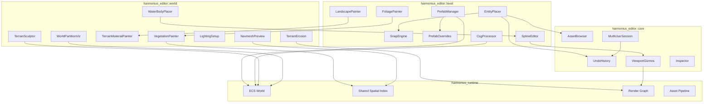
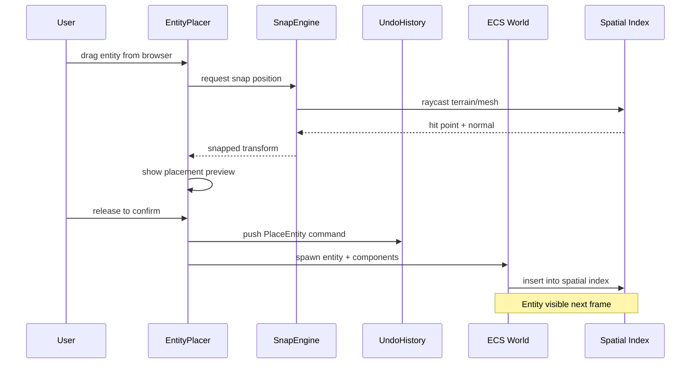
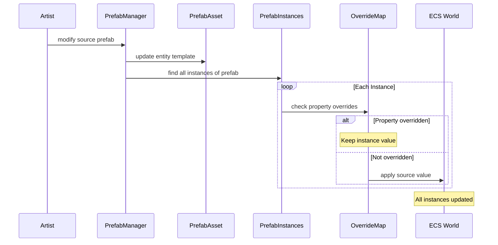
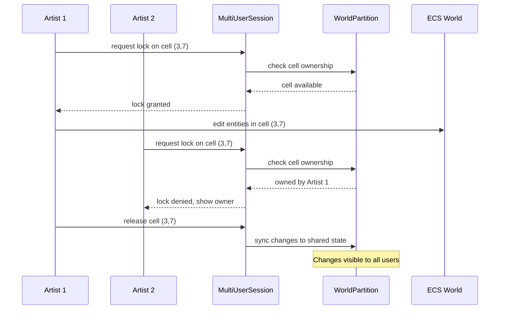
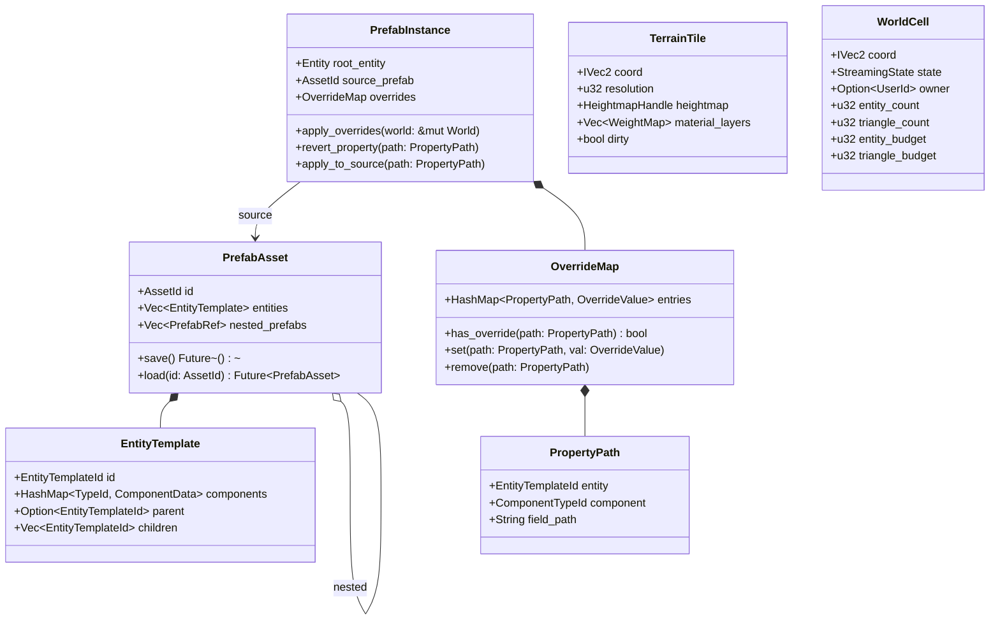

# Level Editor and World Building Design

## Requirements Trace

> **Canonical sources:** Features, requirements, and user stories are defined in
> [features/tools-editor/](../../features/tools-editor/),
> [requirements/tools-editor/](../../requirements/tools-editor/), and
> [user-stories/tools-editor/](../../user-stories/tools-editor/). The table below traces design
> elements to those definitions.

### Level Editor (15.2)

| Feature | Requirement | Description |
|---------|-------------|-------------|
| F-15.2.1 | R-15.2.1 | Entity placement with grid, surface, and vertex snapping |
| F-15.2.2 | R-15.2.2 | Prefab system with nested prefab hierarchies |
| F-15.2.3 | R-15.2.3 | Per-instance prefab property overrides |
| F-15.2.4 | R-15.2.4 | CSG brush tools for blockout and boolean operations |
| F-15.2.5 | R-15.2.5 | Spline editing with Bezier/Catmull-Rom curves |
| F-15.2.6 | R-15.2.6 | Landscape material painting with auto-paint rules |
| F-15.2.7 | R-15.2.7 | Foliage painting with density and placement rules |

### World Building (15.6)

| Feature | Requirement | Description |
|---------|-------------|-------------|
| F-15.6.1 | R-15.6.1 | Terrain sculpting brushes with streaming disk I/O |
| F-15.6.2 | R-15.6.2 | Hydraulic and thermal erosion simulation on GPU |
| F-15.6.3 | R-15.6.3 | Terrain material painting with weight maps |
| F-15.6.4 | R-15.6.4 | Water body placement via boundary splines |
| F-15.6.5 | R-15.6.5 | Vegetation painting with biome rule system |
| F-15.6.6 | R-15.6.6 | Light probe and reflection probe placement |
| F-15.6.7 | R-15.6.7 | Navmesh preview with real-time regeneration |
| F-15.6.8 | R-15.6.8 | World partition visualization and budget tracking |

## Overview

The level editor and world building subsystems provide all visual authoring tools for populating,
sculpting, painting, and partitioning game worlds. All tools operate on the live ECS world --
entities are components, brushes write to component data, and the shared spatial index drives both
raycasting and streaming.

Key principles:

- **100% ECS-based.** Every placed entity, terrain tile, foliage instance, and probe is an ECS
  entity with components. No parallel data stores.
- **No-code authoring.** All operations are visual interactions in the viewport. No scripting
  required.
- **Shared spatial index.** Placement raycasts, foliage queries, navmesh generation, and partition
  budgets all query the same BVH/octree.
- **Async streaming.** Terrain sculpting, heightmap I/O, and foliage storage use platform-native
  async I/O via the `IoReactor`.
- **Multi-user editing.** Cell-based locking enables concurrent editing of disjoint world regions by
  multiple artists.

## Architecture

### Module Boundaries



```text
harmonius_editor/
├── level/
│   ├── placer.rs          # EntityPlacer, drag-drop
│   │                      # placement
│   ├── snap.rs            # SnapEngine: grid, surface,
│   │                      # vertex snapping
│   ├── prefab.rs          # PrefabManager, nested
│   │                      # prefab loading
│   ├── prefab_override.rs # OverrideMap, per-property
│   │                      # override tracking
│   ├── csg.rs             # CsgProcessor, boolean ops,
│   │                      # mesh conversion
│   ├── spline.rs          # SplineEditor, Bezier,
│   │                      # Catmull-Rom
│   ├── landscape.rs       # LandscapePainter, auto-
│   │                      # paint rules
│   └── foliage.rs         # FoliagePainter, density
│                          # brushes, LOD preview
├── world/
│   ├── terrain_sculpt.rs  # TerrainSculptor, brush
│   │                      # suite, streaming I/O
│   ├── terrain_erosion.rs # TerrainErosion, GPU
│   │                      # compute simulation
│   ├── terrain_paint.rs   # TerrainMaterialPainter,
│   │                      # weight maps
│   ├── water.rs           # WaterBodyPlacer, river
│   │                      # splines, lake fill
│   ├── vegetation.rs      # VegetationPainter, biome
│   │                      # rules, auto-populate
│   ├── lighting.rs        # LightingSetup, probes,
│   │                      # grids, baking
│   ├── navmesh.rs         # NavmeshPreview, overlay,
│   │                      # pathfinding test
│   └── partition.rs       # WorldPartitionViz, minimap,
│                          # budget tracking
└── core/
    ├── undo.rs            # UndoHistory, command stack
    ├── gizmo.rs           # ViewportGizmos, translate/
    │                      # rotate/scale handles
    ├── browser.rs         # AssetBrowser, drag source
    ├── inspector.rs       # Inspector, property grid
    └── multiuser.rs       # MultiUserSession, cell
                           # locking
```

### Entity Placement Data Flow



### Prefab Propagation Flow



### Terrain Sculpting Pipeline


### World Partition and Multi-User Flow



### Core Data Structures



## API Design

### Snap Engine

```rust
/// Snapping mode for entity placement.
#[derive(Clone, Copy, Debug, PartialEq, Eq)]
pub enum SnapMode {
    /// Align to a uniform grid with the given cell
    /// size in world units.
    Grid { cell_size: f32 },
    /// Project onto the nearest surface below the
    /// cursor using a spatial index raycast.
    Surface,
    /// Snap to the nearest vertex of the closest
    /// mesh geometry.
    Vertex,
    /// No snapping; use raw cursor position.
    None,
}

/// Resolves cursor positions to snapped world
/// transforms.
pub struct SnapEngine { /* ... */ }

impl SnapEngine {
    pub fn new() -> Self;

    /// Compute a snapped transform from a viewport
    /// ray. Returns the snapped position and surface
    /// normal (if surface or vertex snap hit).
    pub fn snap(
        &self,
        ray: Ray3,
        mode: SnapMode,
        spatial_index: &SpatialIndex,
    ) -> Option<SnapResult>;
}

pub struct SnapResult {
    pub position: Vec3,
    pub normal: Vec3,
    pub rotation: Quat,
}
```

### Entity Placer

```rust
/// Handles drag-and-drop entity placement from the
/// asset browser into the viewport.
pub struct EntityPlacer { /* ... */ }

impl EntityPlacer {
    pub fn new(
        snap: SnapEngine,
        undo: UndoHistory,
    ) -> Self;

    /// Begin a placement drag. Shows a preview ghost
    /// of the entity at the cursor position.
    pub fn begin_drag(
        &mut self,
        asset_id: AssetId,
        viewport: &Viewport,
    );

    /// Update the placement preview as the cursor
    /// moves. Applies the active snap mode.
    pub fn update_drag(
        &mut self,
        cursor_ray: Ray3,
        spatial_index: &SpatialIndex,
    );

    /// Confirm placement. Spawns the entity in the
    /// ECS world and pushes an undo command.
    pub fn confirm_placement(
        &mut self,
        world: &mut World,
    ) -> Entity;

    /// Cancel the active placement drag.
    pub fn cancel_drag(&mut self);

    /// Duplicate selected entities with their
    /// transforms and push an undo command.
    pub fn duplicate_selection(
        &mut self,
        selection: &[Entity],
        world: &mut World,
    ) -> Vec<Entity>;

    /// Set the active snap mode.
    pub fn set_snap_mode(&mut self, mode: SnapMode);
}
```

### Prefab System

```rust
/// Unique identifier for an entity within a prefab
/// template.
#[derive(
    Clone, Copy, Debug, PartialEq, Eq, Hash,
)]
pub struct EntityTemplateId(pub u32);

/// A reusable entity hierarchy stored as an asset.
pub struct PrefabAsset {
    pub id: AssetId,
    pub entities: Vec<EntityTemplate>,
    pub nested_prefabs: Vec<PrefabRef>,
}

/// A single entity template within a prefab.
pub struct EntityTemplate {
    pub id: EntityTemplateId,
    pub components: HashMap<
        ComponentTypeId,
        ComponentData,
    >,
    pub parent: Option<EntityTemplateId>,
    pub children: Vec<EntityTemplateId>,
}

/// Reference to a nested prefab with a local
/// transform offset.
pub struct PrefabRef {
    pub prefab_id: AssetId,
    pub local_transform: Transform,
}

/// Manages prefab loading, instantiation, and
/// propagation.
pub struct PrefabManager { /* ... */ }

impl PrefabManager {
    pub fn new() -> Self;

    /// Load a prefab asset from disk.
    pub async fn load(
        &self,
        id: AssetId,
        reactor: &IoReactor,
    ) -> Result<PrefabAsset, AssetError>;

    /// Instantiate a prefab into the ECS world.
    /// Returns the root entity.
    pub fn instantiate(
        &self,
        prefab: &PrefabAsset,
        transform: Transform,
        world: &mut World,
    ) -> Entity;

    /// Create a prefab from a selection of entities.
    pub fn create_from_selection(
        &self,
        entities: &[Entity],
        world: &World,
    ) -> PrefabAsset;

    /// Propagate source prefab changes to all
    /// instances, respecting per-instance overrides.
    pub fn propagate_changes(
        &self,
        prefab_id: AssetId,
        world: &mut World,
    );
}
```

### Prefab Instance Overrides

```rust
/// Path to a specific property within a prefab
/// instance, used for override tracking.
#[derive(Clone, Debug, PartialEq, Eq, Hash)]
pub struct PropertyPath {
    pub entity: EntityTemplateId,
    pub component: ComponentTypeId,
    pub field_path: String,
}

/// Per-instance override map. Tracks which
/// properties differ from the source prefab.
pub struct OverrideMap {
    entries: HashMap<PropertyPath, OverrideValue>,
}

impl OverrideMap {
    pub fn new() -> Self;
    pub fn has_override(
        &self,
        path: &PropertyPath,
    ) -> bool;
    pub fn set(
        &mut self,
        path: PropertyPath,
        value: OverrideValue,
    );
    pub fn remove(&mut self, path: &PropertyPath);
    pub fn iter(
        &self,
    ) -> impl Iterator<
        Item = (&PropertyPath, &OverrideValue),
    >;
}

/// Component attached to prefab instance root
/// entities to track their source and overrides.
pub struct PrefabInstanceComponent {
    pub source_prefab: AssetId,
    pub overrides: OverrideMap,
}

impl PrefabInstanceComponent {
    /// Revert a single property to the source
    /// prefab value.
    pub fn revert_property(
        &mut self,
        path: &PropertyPath,
        world: &mut World,
        entity: Entity,
    );

    /// Apply an override back to the source prefab,
    /// making it the new default.
    pub fn apply_to_source(
        &self,
        path: &PropertyPath,
        prefab: &mut PrefabAsset,
    );
}
```

### CSG Brush Tools

```rust
/// CSG primitive types for blockout geometry.
#[derive(Clone, Debug)]
pub enum CsgPrimitive {
    Box { extents: Vec3 },
    Cylinder { radius: f32, height: f32 },
    Sphere { radius: f32 },
    Stairs { width: f32, height: f32, steps: u32 },
    Arch { radius: f32, angle: f32, width: f32 },
}

/// CSG boolean operation type.
#[derive(Clone, Copy, Debug, PartialEq, Eq)]
pub enum CsgOperation {
    Additive,
    Subtractive,
}

/// Processes CSG boolean operations on brush
/// geometry.
pub struct CsgProcessor { /* ... */ }

impl CsgProcessor {
    pub fn new() -> Self;

    /// Create a brush entity from a primitive.
    pub fn create_brush(
        &self,
        primitive: CsgPrimitive,
        operation: CsgOperation,
        transform: Transform,
        world: &mut World,
    ) -> Entity;

    /// Apply boolean operations between two brushes
    /// to produce a result mesh.
    pub fn boolean_op(
        &self,
        a: Entity,
        b: Entity,
        world: &World,
    ) -> Result<MeshData, CsgError>;

    /// Convert finalized brush geometry to a static
    /// mesh asset.
    pub fn convert_to_static_mesh(
        &self,
        brush: Entity,
        world: &mut World,
    ) -> AssetId;
}
```

### Spline Editor

```rust
/// Spline interpolation mode.
#[derive(Clone, Copy, Debug, PartialEq, Eq)]
pub enum SplineType {
    Bezier,
    CatmullRom,
}

/// A single control point on a spline.
#[derive(Clone, Debug)]
pub struct SplineControlPoint {
    pub position: Vec3,
    pub tangent_in: Vec3,
    pub tangent_out: Vec3,
    pub width: f32,
    pub roll: f32,
}

/// Spline data stored as a component on spline
/// entities.
pub struct SplineComponent {
    pub spline_type: SplineType,
    pub points: Vec<SplineControlPoint>,
    pub closed: bool,
}

/// Editor for viewport spline manipulation.
pub struct SplineEditor { /* ... */ }

impl SplineEditor {
    pub fn new() -> Self;

    /// Add a control point at the given position.
    pub fn add_point(
        &mut self,
        position: Vec3,
        entity: Entity,
        world: &mut World,
    );

    /// Move a control point and update tangents.
    pub fn move_point(
        &mut self,
        index: usize,
        new_position: Vec3,
        entity: Entity,
        world: &mut World,
    );

    /// Delete a control point.
    pub fn delete_point(
        &mut self,
        index: usize,
        entity: Entity,
        world: &mut World,
    );

    /// Evaluate the spline position at parameter t.
    pub fn evaluate(
        &self,
        spline: &SplineComponent,
        t: f32,
    ) -> Vec3;

    /// Distribute entities along a spline with
    /// configurable spacing and randomization.
    pub fn distribute_along(
        &self,
        spline: &SplineComponent,
        config: &DistributeConfig,
        world: &mut World,
    ) -> Vec<Entity>;
}

/// Configuration for distributing entities along
/// a spline.
pub struct DistributeConfig {
    pub asset_id: AssetId,
    pub spacing: f32,
    pub random_offset: Vec3,
    pub random_rotation: f32,
    pub random_scale_range: (f32, f32),
    pub align_to_spline: bool,
}
```

### Terrain Sculpting

```rust
/// Terrain sculpt brush type.
#[derive(Clone, Copy, Debug, PartialEq, Eq)]
pub enum SculptBrushType {
    Raise,
    Lower,
    Smooth,
    Flatten,
    Erode,
    Noise,
}

/// Brush configuration shared by sculpt, paint,
/// and foliage brushes. Also referenced by the
/// terrain system (see
/// [terrain.md](../geometry/terrain.md)).
#[derive(Clone, Debug)]
pub struct BrushConfig {
    pub radius: f32,
    pub strength: f32,
    pub falloff: FalloffCurve,
    pub shape_mask: Option<AssetId>,
}

/// Falloff curve for brush strength attenuation.
#[derive(Clone, Debug)]
pub enum FalloffCurve {
    Linear,
    Smooth,
    Constant,
    Custom(Vec<Vec2>),
}

/// Sculpts terrain heightmaps with streaming disk
/// I/O for large worlds.
pub struct TerrainSculptor { /* ... */ }

impl TerrainSculptor {
    pub fn new(reactor: IoReactor) -> Self;

    /// Apply a sculpt stroke at the given world
    /// position. Loads affected tiles via async I/O,
    /// applies the brush, and queues dirty tiles for
    /// async flush.
    pub async fn apply_stroke(
        &mut self,
        position: Vec3,
        brush_type: SculptBrushType,
        config: &BrushConfig,
        world: &mut World,
    );

    /// Flush all dirty tiles to disk.
    pub async fn flush_dirty_tiles(&self);

    /// Set the active brush type.
    pub fn set_brush(
        &mut self,
        brush_type: SculptBrushType,
    );
}
```

### Terrain Erosion

```rust
/// Parameters for terrain erosion simulation.
#[derive(Clone, Debug)]
pub struct ErosionParams {
    pub rain_amount: f32,
    pub sediment_capacity: f32,
    pub thermal_angle: f32,
    pub iterations: u32,
}

/// Erosion type.
#[derive(Clone, Copy, Debug, PartialEq, Eq)]
pub enum ErosionType {
    Hydraulic,
    Thermal,
}

/// GPU-accelerated terrain erosion simulation.
pub struct TerrainErosion { /* ... */ }

impl TerrainErosion {
    pub fn new() -> Self;

    /// Run erosion simulation on the selected
    /// terrain region. Uses GPU compute for
    /// real-time preview.
    pub async fn simulate(
        &self,
        region: Rect,
        erosion_type: ErosionType,
        params: &ErosionParams,
        world: &mut World,
    );

    /// Preview erosion results without committing.
    pub async fn preview(
        &self,
        region: Rect,
        erosion_type: ErosionType,
        params: &ErosionParams,
    ) -> HeightmapData;

    /// Commit the previewed erosion to the terrain.
    pub fn commit(
        &self,
        preview: HeightmapData,
        world: &mut World,
    );
}
```

### Landscape and Foliage Painting

```rust
/// Auto-painting rule for terrain materials.
#[derive(Clone, Debug)]
pub struct AutoPaintRule {
    pub material_layer: u32,
    pub min_slope: f32,
    pub max_slope: f32,
    pub min_altitude: f32,
    pub max_altitude: f32,
    pub strength: f32,
}

/// Paints material layers onto terrain tiles.
pub struct LandscapePainter { /* ... */ }

impl LandscapePainter {
    pub fn new() -> Self;

    /// Paint a material layer at the given position.
    pub fn paint_stroke(
        &mut self,
        position: Vec3,
        layer: u32,
        config: &BrushConfig,
        world: &mut World,
    );

    /// Apply auto-painting rules to a terrain
    /// region.
    pub fn auto_paint(
        &self,
        region: Rect,
        rules: &[AutoPaintRule],
        world: &mut World,
    );
}

/// Per-foliage-type placement rules.
#[derive(Clone, Debug)]
pub struct FoliagePlacementRule {
    pub asset_id: AssetId,
    pub min_slope: f32,
    pub max_slope: f32,
    pub min_altitude: f32,
    pub max_altitude: f32,
    pub exclusion_radius: f32,
    pub scale_range: (f32, f32),
    pub rotation_range: (f32, f32),
    pub density: f32,
}

/// Paints foliage instances onto surfaces with
/// density brushes and placement rules.
/// Foliage painting interacts with the VFX wind
/// system via shared wind field ECS resources.
pub struct FoliagePainter { /* ... */ }

impl FoliagePainter {
    pub fn new() -> Self;

    /// Paint foliage at the given position.
    pub fn paint_stroke(
        &mut self,
        position: Vec3,
        rule: &FoliagePlacementRule,
        config: &BrushConfig,
        world: &mut World,
    );

    /// Erase foliage within the brush radius.
    pub fn erase_stroke(
        &mut self,
        position: Vec3,
        config: &BrushConfig,
        world: &mut World,
    );

    /// Add an exclusion zone where foliage cannot
    /// be placed.
    pub fn add_exclusion_zone(
        &mut self,
        bounds: Aabb,
        world: &mut World,
    );
}
```

### Vegetation and Biome System

```rust
/// Declarative biome rule for auto-populating
/// vegetation across large regions.
#[derive(Clone, Debug)]
pub struct BiomeRule {
    pub name: String,
    pub species: Vec<FoliagePlacementRule>,
    pub clustering: ClusterConfig,
    pub seed: u64,
}

/// Clustering configuration for grouped vegetation.
#[derive(Clone, Debug)]
pub struct ClusterConfig {
    pub cluster_radius: f32,
    pub cluster_density: f32,
    pub inter_cluster_spacing: f32,
}

/// Auto-populates vegetation using biome rules.
pub struct VegetationPainter { /* ... */ }

impl VegetationPainter {
    pub fn new() -> Self;

    /// Auto-populate a region with vegetation using
    /// the given biome rules. Deterministic given
    /// the same seed.
    pub fn auto_populate(
        &self,
        region: Rect,
        rules: &[BiomeRule],
        world: &mut World,
    ) -> u32;

    /// Validate that all placed instances satisfy
    /// their placement rules. Returns violations.
    pub fn validate_placements(
        &self,
        region: Rect,
        rules: &[BiomeRule],
        world: &World,
    ) -> Vec<PlacementViolation>;
}
```

### Water Body Placement

```rust
/// Water body type.
#[derive(Clone, Copy, Debug, PartialEq, Eq)]
pub enum WaterBodyType {
    River,
    Lake,
    Ocean,
}

/// Configuration for a river segment.
#[derive(Clone, Debug)]
pub struct RiverConfig {
    pub width: f32,
    pub depth: f32,
    pub flow_speed: f32,
}

/// Configuration for a lake volume.
#[derive(Clone, Debug)]
pub struct LakeConfig {
    pub surface_altitude: f32,
    pub shoreline_blend: f32,
}

/// Places water volumes using boundary splines.
pub struct WaterBodyPlacer { /* ... */ }

impl WaterBodyPlacer {
    pub fn new() -> Self;

    /// Create a river following a spline path.
    pub fn create_river(
        &self,
        spline: Entity,
        config: &RiverConfig,
        world: &mut World,
    ) -> Entity;

    /// Create a lake filling to a specified
    /// altitude.
    pub fn create_lake(
        &self,
        boundary: Entity,
        config: &LakeConfig,
        world: &mut World,
    ) -> Entity;
}
```

### Lighting Setup

```rust
/// Light probe placement mode.
#[derive(Clone, Copy, Debug, PartialEq, Eq)]
pub enum ProbePlacementMode {
    TetrahedralGrid { spacing: f32 },
    Manual,
}

/// Reflection probe configuration.
#[derive(Clone, Debug)]
pub struct ReflectionProbeConfig {
    pub capture_extents: Vec3,
    pub blend_distance: f32,
    pub update_mode: ProbeUpdateMode,
}

/// Probe update strategy.
#[derive(Clone, Copy, Debug, PartialEq, Eq)]
pub enum ProbeUpdateMode {
    Baked,
    RealTime,
}

/// Placement and configuration tools for light
/// and reflection probes.
pub struct LightingSetup { /* ... */ }

impl LightingSetup {
    pub fn new() -> Self;

    /// Place light probes on a tetrahedral grid.
    pub fn place_light_probe_grid(
        &self,
        bounds: Aabb,
        mode: ProbePlacementMode,
        world: &mut World,
    ) -> Vec<Entity>;

    /// Place a single reflection probe.
    pub fn place_reflection_probe(
        &self,
        position: Vec3,
        config: &ReflectionProbeConfig,
        world: &mut World,
    ) -> Entity;

    /// Toggle visualization overlay for probe
    /// influence regions.
    pub fn set_overlay_visible(
        &mut self,
        visible: bool,
    );
}
```

### Navmesh Preview

```rust
/// Navmesh overlay display configuration.
#[derive(Clone, Debug)]
pub struct NavmeshOverlayConfig {
    pub show_walkable: bool,
    pub show_slope_limits: bool,
    pub show_agent_radius: bool,
    pub overlay_opacity: f32,
}

/// Renders navmesh overlays and pathfinding tests
/// in the viewport.
pub struct NavmeshPreview { /* ... */ }

impl NavmeshPreview {
    pub fn new() -> Self;

    /// Regenerate navmesh for a selected region.
    pub async fn regenerate_region(
        &self,
        bounds: Aabb,
        world: &World,
    );

    /// Run a pathfinding test between two markers.
    pub fn test_pathfind(
        &self,
        start: Vec3,
        goal: Vec3,
        world: &World,
    ) -> Option<Vec<Vec3>>;

    /// Toggle the navmesh overlay.
    pub fn set_overlay_config(
        &mut self,
        config: NavmeshOverlayConfig,
    );
}
```

### World Partition Visualization

```rust
/// Streaming state of a world cell.
#[derive(
    Clone, Copy, Debug, PartialEq, Eq,
)]
pub enum StreamingState {
    Loaded,
    Pending,
    Unloaded,
}

/// Budget status for a world cell.
#[derive(Clone, Debug)]
pub struct CellBudgetStatus {
    pub entity_count: u32,
    pub entity_budget: u32,
    pub triangle_count: u32,
    pub triangle_budget: u32,
    pub over_budget: bool,
}

/// World partition cell data stored as an ECS
/// component on cell entities.
pub struct WorldCellComponent {
    pub coord: IVec2,
    pub state: StreamingState,
    pub owner: Option<UserId>,
    pub budget: CellBudgetStatus,
}

/// Displays world partition grid, streaming
/// states, and budget overlays.
pub struct WorldPartitionViz { /* ... */ }

impl WorldPartitionViz {
    pub fn new() -> Self;

    /// Toggle the 2D minimap display.
    pub fn set_minimap_visible(
        &mut self,
        visible: bool,
    );

    /// Toggle the 3D viewport overlay.
    pub fn set_overlay_visible(
        &mut self,
        visible: bool,
    );

    /// Toggle cell ownership display for
    /// multi-user editing.
    pub fn set_ownership_visible(
        &mut self,
        visible: bool,
    );

    /// Get all cells that exceed their budgets.
    pub fn get_over_budget_cells(
        &self,
        world: &World,
    ) -> Vec<IVec2>;
}
```

### Multi-User Session

```rust
/// Multi-user editing session with cell-based
/// locking.
pub struct MultiUserSession { /* ... */ }

impl MultiUserSession {
    /// Connect to a shared editing server.
    pub async fn connect(
        &mut self,
        server_addr: &str,
    ) -> Result<(), SessionError>;

    /// Request exclusive edit lock on a world cell.
    pub async fn request_lock(
        &self,
        cell: IVec2,
    ) -> Result<CellLock, LockError>;

    /// Release a previously acquired cell lock.
    pub async fn release_lock(
        &self,
        lock: CellLock,
    );

    /// Sync local changes to the shared state.
    pub async fn sync_changes(
        &self,
        undo_history: &UndoHistory,
    );
}

pub enum LockError {
    CellOwnedBy(UserId),
    ConnectionLost,
    Timeout,
}
```

### Undo History

```rust
/// A reversible editor command.
pub trait EditorCommand: Send + Sync {
    fn execute(&self, world: &mut World);
    fn undo(&self, world: &mut World);
    fn description(&self) -> &str;
}

/// Undo/redo stack for all editor operations.
pub struct UndoHistory { /* ... */ }

impl UndoHistory {
    pub fn new() -> Self;

    /// Push a command, execute it, and clear the
    /// redo stack.
    pub fn execute(
        &mut self,
        cmd: Box<dyn EditorCommand>,
        world: &mut World,
    );

    /// Undo the most recent command.
    pub fn undo(&mut self, world: &mut World);

    /// Redo the most recently undone command.
    pub fn redo(&mut self, world: &mut World);

    pub fn can_undo(&self) -> bool;
    pub fn can_redo(&self) -> bool;
}
```

## Data Flow

### Entity Lifecycle

1. User drags an asset from the browser into the viewport.
2. `EntityPlacer` calls `SnapEngine::snap()` to compute a snapped transform using the shared spatial
   index raycast.
3. A preview ghost renders at the snapped position.
4. On release, `EntityPlacer` pushes a `PlaceEntity` command to `UndoHistory` and spawns the entity
   in the ECS world.
5. The ECS inserts the entity into the shared spatial index. It becomes visible next frame.

### Prefab Propagation

1. An artist modifies a source prefab asset.
2. `PrefabManager::propagate_changes()` queries all entities with a matching
   `PrefabInstanceComponent`.
3. For each instance, properties without overrides receive the updated source value.
4. Overridden properties are left unchanged.
5. The inspector shows overrides with bold labels via `OverrideMap::has_override()`.

### Terrain Sculpting Streaming

1. User paints with a sculpt brush.
2. `TerrainSculptor` computes the set of affected tile coordinates.
3. Unloaded tiles are fetched via `IoReactor::read()` (async, non-blocking).
4. The brush kernel runs on loaded tile data (GPU compute for erosion, CPU for simple brushes).
5. Modified tiles are marked dirty.
6. On brush release, dirty tiles are flushed to disk via `IoReactor::write()`.
7. Peak memory is bounded by loading only the affected tile window.

### World Partition Multi-User

1. An artist requests a cell lock via `MultiUserSession::request_lock()`.
2. The server checks ownership. If available, the lock is granted.
3. The artist edits entities within the locked cell.
4. On release, `sync_changes()` pushes the undo history delta to the shared state.
5. Other artists see the updated cell. The partition overlay shows ownership changes.

## Platform Considerations

| Feature | Windows | macOS | Linux |
|---------|---------|-------|-------|
| Heightmap I/O | IOCP async read/write | GCD Dispatch IO | io_uring |
| GPU erosion | D3D12 compute dispatch | Metal compute | Vulkan compute |
| Stack capture (undo debug) | `CaptureStackBackTrace` | `backtrace` | `backtrace` |
| Multi-user transport | TCP via IOCP | TCP via GCD | TCP via io_uring |
| Spatial index raycast | Shared BVH (all platforms) | Shared BVH | Shared BVH |

All platform I/O uses the `IoReactor` controlled drain at the frame poll point. No stdlib file I/O.

## Test Plan

### Unit Tests

| Test | Req | Description |
|------|-----|-------------|
| `test_grid_snap_alignment` | R-15.2.1 | Place at (1.3, 0, 2.7) with grid 1.0, verify snaps to (1, 0, 3). |
| `test_surface_snap_terrain` | R-15.2.1 | Raycast onto sloped terrain, verify entity aligns to surface normal. |
| `test_vertex_snap_precision` | R-15.2.1 | Snap to a known vertex, verify position matches within epsilon. |
| `test_prefab_instantiate` | R-15.2.2 | Instantiate a 3-level nested prefab, verify all entities spawned. |
| `test_prefab_propagation` | R-15.2.2 | Modify source prefab, verify all non-overridden instances update. |
| `test_override_set_revert` | R-15.2.3 | Set override, verify value differs. Revert, verify matches source. |
| `test_override_apply_to_source` | R-15.2.3 | Apply override to source, verify all instances receive new value. |
| `test_csg_boolean_additive` | R-15.2.4 | Combine two boxes, verify result is watertight mesh. |
| `test_csg_boolean_subtractive` | R-15.2.4 | Subtract cylinder from box, verify hole geometry. |
| `test_csg_to_static_mesh` | R-15.2.4 | Convert brush to static mesh, verify asset created. |
| `test_spline_bezier_c1` | R-15.2.5 | Create Bezier spline, verify C1 continuity at control points. |
| `test_spline_distribute` | R-15.2.5 | Distribute 10 entities along spline, verify spacing. |
| `test_landscape_auto_paint` | R-15.2.6 | Apply slope rule to test terrain, verify correct layer assignment. |
| `test_landscape_weight_sum` | R-15.2.6 | Paint multiple layers, verify weights sum to 1.0 per texel. |
| `test_foliage_slope_limit` | R-15.2.7 | Paint foliage with 30-degree limit, verify none on steeper slopes. |
| `test_foliage_exclusion_zone` | R-15.2.7 | Add exclusion zone, verify no foliage placed inside. |
| `test_sculpt_raise_lower` | R-15.6.1 | Apply raise brush, verify heightmap increased. Apply lower, verify decreased. |
| `test_sculpt_streaming` | R-15.6.1 | Sculpt 16k heightmap, verify peak memory under 512 MB. |
| `test_erosion_deterministic` | R-15.6.2 | Run erosion twice with same params, verify identical output. |
| `test_water_river_spline` | R-15.6.4 | Create river from spline, verify entity with water components. |
| `test_water_lake_altitude` | R-15.6.4 | Create lake at altitude 100, verify surface at 100. |
| `test_biome_deterministic` | R-15.6.5 | Auto-populate with seed, verify same result on repeated runs. |
| `test_biome_rule_validation` | R-15.6.5 | Auto-populate, verify zero placement violations. |
| `test_probe_grid_placement` | R-15.6.6 | Place tetrahedral grid, verify probe count and spacing. |
| `test_navmesh_slope_limit` | R-15.6.7 | Generate navmesh, verify steep slopes marked non-walkable. |
| `test_partition_budget` | R-15.6.8 | Add entities exceeding budget, verify over_budget flag set. |
| `test_multiuser_lock` | R-15.6.8 | Two users request same cell, verify second denied. |

### Integration Tests

| Test | Req | Description |
|------|-----|-------------|
| `test_place_undo_redo` | R-15.2.1 | Place entity, undo, verify removed. Redo, verify restored. |
| `test_prefab_save_load_round_trip` | R-15.2.2 | Create nested prefab, save, load, verify identical structure. |
| `test_csg_render_collision` | R-15.2.4 | CSG output renders correctly and collision mesh matches. |
| `test_terrain_sculpt_async_io` | R-15.6.1 | Sculpt with async I/O, verify no worker threads block. |
| `test_erosion_gpu_15fps` | R-15.6.2 | Run erosion on 2048x2048, verify preview stays above 15 FPS. |
| `test_multiuser_concurrent` | R-15.6.8 | Two users edit disjoint cells, verify both changes persist. |
| `test_partition_streaming` | R-15.6.8 | Load/unload cells, verify streaming states correct in overlay. |

### Benchmarks

| Benchmark | Target | Source |
|-----------|--------|--------|
| Entity placement latency | < 1 ms from release to visible | US-15.2.1.1 |
| Prefab propagation (1000 instances) | < 16 ms | US-15.2.2.3 |
| CSG boolean operation | < 100 ms for 2 primitives | US-15.2.4.3 |
| Terrain sculpt 16k heightmap peak memory | < 512 MB | US-15.6.1.6 |
| Erosion preview 2048x2048 | > 15 FPS | US-15.6.2.5 |
| Foliage paint 10k instances | < 32 ms per stroke | US-15.2.7.1 |
| Navmesh regeneration (64m region) | < 500 ms | US-15.6.7.3 |

## Open Questions

1. **CSG precision** -- Floating-point CSG boolean operations may produce degenerate triangles at
   edge intersections. Evaluate exact arithmetic libraries vs epsilon-based cleanup.
2. **Heightmap tile size** -- Larger tiles (512x512) reduce tile count but increase per-tile I/O.
   Smaller tiles (128x128) improve streaming granularity but increase overhead.
3. **Multi-user conflict resolution** -- Cell-level locking is coarse. Sub-cell locking (per-entity)
   would allow finer concurrency but adds complexity. Determine optimal granularity.
4. **Foliage storage format** -- Spatial grid cell size affects streaming efficiency. Need profiling
   data to determine optimal cell dimensions for typical foliage densities.
5. **Erosion GPU backend** -- GPU compute erosion requires a render graph compute pass. Determine
   whether to run erosion as a standalone compute dispatch or integrate into the frame render graph.
6. **Prefab serialization format** -- RON with binary companion files (per constraints) or a
   dedicated prefab binary format for faster loading. Evaluate load-time impact.
