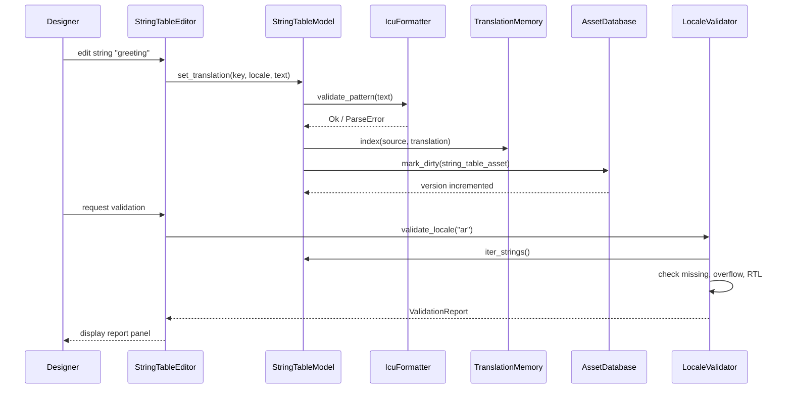
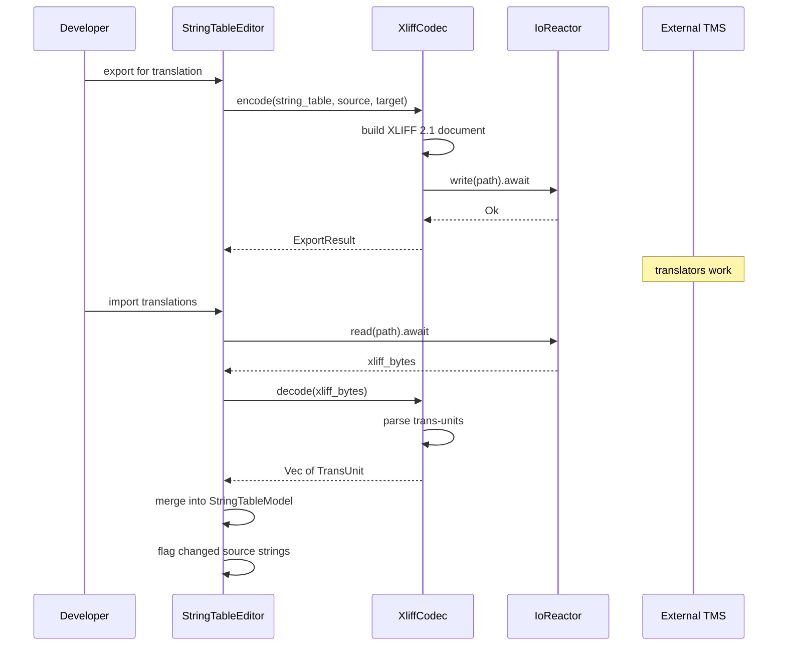
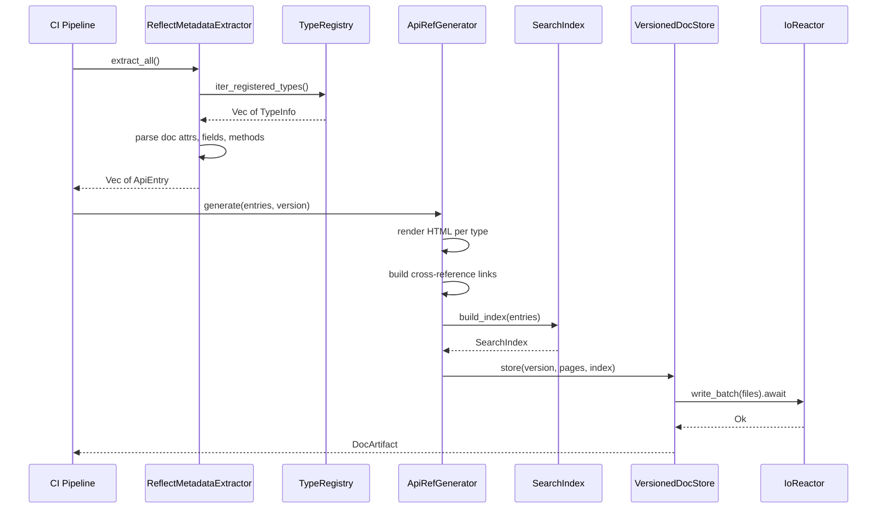
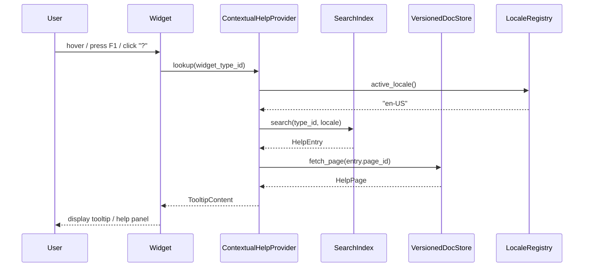

# Localization and Documentation Design

## Requirements Trace

> **Canonical sources:** Features, requirements, and user stories are defined in
> [features/tools-editor/](../../features/tools-editor/),
> [requirements/tools-editor/](../../requirements/tools-editor/), and
> [user-stories/tools-editor/](../../user-stories/tools-editor/). The table below traces design
> elements to those definitions.

### Localization Editor

| Feature | Requirement | User Story | Description |
|---------|-------------|------------|-------------|
| F-15.13.1 | R-15.13.1 | US-15.13.1.1--1.10 | Visual string table editor with ICU patterns, TM, CSV |
| F-15.13.2 | R-15.13.2 | US-15.13.2.1--2.9 | Locale preview, validation, pseudo-localization, RTL |
| F-15.13.3 | R-15.13.3 | US-15.13.3.1--3.7 | XLIFF workflow, TMS integration, review, string locks |

### Documentation and Learning

| Feature | Requirement | User Story | Description |
|---------|-------------|------------|-------------|
| F-15.19.1 | R-15.19.1 | US-15.19.1.1--1.5 | Auto-generated API reference from Reflect metadata |
| F-15.19.2 | R-15.19.2 | US-15.19.2.1--2.6 | Logic graph node documentation with port docs |
| F-15.19.3 | R-15.19.3 | US-15.19.3.1--3.7 | Interactive in-editor tutorials with spotlight |
| F-15.19.4 | R-15.19.4 | US-15.19.4.1--4.5 | Embedded video player with chapter links |
| F-15.19.5 | R-15.19.5 | US-15.19.5.1--5.5 | Contextual help tooltips and "What's This?" mode |
| F-15.19.6 | R-15.19.6 | US-15.19.6.1--6.6 | Sample projects and template library per genre |
| F-15.19.7 | R-15.19.7 | US-15.19.7.1--7.5 | Inline code examples compiled as CI doc-tests |

## Overview

This document covers two closely related editor subsystems:

1. **Localization** -- string table management, ICU MessageFormat plural/gender forms, RTL layout,
   font fallback chains, translation memory, XLIFF 2.1 export/import, pseudo-localization testing,
   and a visual localization editor.
2. **Documentation** -- auto-generated API reference from `Reflect` metadata and doc attributes,
   interactive tutorials, contextual help tooltips, a searchable documentation browser, and
   versioned docs per engine release.

Both subsystems are editor-only (desktop). They share the `LocaleRegistry` for language selection
and the `AssetDatabase` for versioning. All I/O is async via the `IoReactor`. No dynamic dispatch --
all platform paths are `cfg`-gated.

## Architecture

### Module Boundaries

```mermaid
graph TD
    subgraph "harmonius_editor::localization"
        STE[StringTableEditor]
        STM[StringTableModel]
        ICU[IcuFormatter]
        TM[TranslationMemory]
        VAL[LocaleValidator]
        PSL[PseudoLocalizer]
        XLF[XliffCodec]
        CSV[CsvCodec]
        FFC[FontFallbackChain]
        RTL[RtlLayoutEngine]
    end

    subgraph "harmonius_editor::documentation"
        ARG[ApiRefGenerator]
        RME[ReflectMetadataExtractor]
        NDG[NodeDocGenerator]
        TUT[TutorialRunner]
        CTX[ContextualHelpProvider]
        SIX[SearchIndex]
        VER[VersionedDocStore]
        VID[VideoPlayer]
    end

    subgraph "harmonius_core"
        TR[TypeRegistry / Reflect]
        LOC[LocaleRegistry]
        AST[AssetDatabase]
        EV[EventDispatcher]
    end

    subgraph "harmonius_ui"
        WF[WidgetFramework]
        LAY[LayoutEngine]
        TXT[TextRenderer]
    end

    STE --> STM
    STE --> TM
    STE --> XLF
    STE --> CSV
    STM --> ICU
    STM --> LOC
    STM --> AST
    VAL --> STM
    VAL --> PSL
    VAL --> RTL
    FFC --> TXT

    ARG --> RME
    RME --> TR
    NDG --> TR
    CTX --> SIX
    CTX --> VER
    TUT --> WF
    VID --> AST

    STE -.-> EV
    ARG -.-> AST
    CTX -.-> LOC
```



```text
harmonius_editor/
├── localization/
│   ├── model.rs           # StringTableModel, StringEntry
│   ├── editor.rs          # StringTableEditor UI panel
│   ├── icu.rs             # IcuFormatter, PluralCategory
│   ├── translation_mem.rs # TranslationMemory, fuzzy match
│   ├── validator.rs       # LocaleValidator, ValidationReport
│   ├── pseudo.rs          # PseudoLocalizer transforms
│   ├── xliff.rs           # XliffCodec, XLIFF 2.1
│   ├── csv_codec.rs       # CsvCodec, round-trip fidelity
│   ├── font_fallback.rs   # FontFallbackChain per locale
│   └── rtl.rs             # RtlLayoutEngine, bidi
├── documentation/
│   ├── api_ref.rs         # ApiRefGenerator, HTML output
│   ├── reflect_extract.rs # ReflectMetadataExtractor
│   ├── node_doc.rs        # NodeDocGenerator for graphs
│   ├── tutorial.rs        # TutorialRunner, TutorialStep
│   ├── contextual_help.rs # ContextualHelpProvider
│   ├── search_index.rs    # SearchIndex, trigram
│   ├── versioned_store.rs # VersionedDocStore
│   └── video_player.rs    # VideoPlayer, chapter links
│                          # Video playback shares decode
│                          # infrastructure with the
│                          # collaboration system's remote
│                          # rendering codec. A shared
│                          # platform video decode service
│                          # wraps AVFoundation (macOS/iOS),
│                          # Media Foundation (Windows),
│                          # and GStreamer (Linux).
```

### Localization Data Flow



### XLIFF Export / Import Flow



### Documentation Generation Pipeline



### Contextual Help Lookup



### Core Data Structures

```mermaid
classDiagram
    class LocaleId {
        +SmallString~8~ value
    }
    class StringKey {
        +SmallString~64~ value
    }
    class TextDirection {
        <<enumeration>>
        LeftToRight
        RightToLeft
    }
    class ReviewStatus {
        <<enumeration>>
        Draft
        NeedsRevision
        Approved
        Rejected
    }
    class PluralCategory {
        <<enumeration>>
        Zero
        One
        Two
        Few
        Many
        Other
    }
    class FormatArg {
        <<enumeration>>
        Number
        String
        Date
    }
    class TransUnitState {
        <<enumeration>>
        Initial
        Translated
        Reviewed
        Final
    }
    class Severity {
        <<enumeration>>
        Error
        Warning
        Info
    }
    class ValidationCategory {
        <<enumeration>>
        MissingTranslation
        TextOverflow
        BrokenInterpolation
        IncorrectPluralForm
        RtlLayoutIssue
        HardcodedText
    }
    class TutorialState {
        <<enumeration>>
        Idle
        Running
        Paused
        Complete
    }
    class CompletionCondition {
        <<enumeration>>
        ClickWidget
        EventFired
        KeyPressed
        Manual
    }
    class LocaleDescriptor {
        +LocaleId id
        +String display_name
        +TextDirection direction
        +FontFallbackChain font_fallback
        +PluralRules plural_rules
    }
    class LocaleRegistry {
        -Vec~LocaleDescriptor~ locales
        -LocaleId active
        +active() LocaleId
        +set_active(locale) Result
        +source_locale() LocaleId
    }
    class StringEntry {
        +StringKey key
        +String source
        +HashMap translations
        +HashMap review
        +bool source_dirty
        +bool locked
    }
    class StringTableModel {
        -Vec~StringEntry~ entries
        -HashMap index
        +get(key) Option~StringEntry~
        +set_translation(key, locale, text) Result
        +lock(key) Result
        +missing_count(locale) u32
    }
    class PluralRules {
        -LocaleId locale
        +select(count) PluralCategory
    }
    class IcuFormatter {
        -PluralRules plural_rules
        +validate_pattern(pattern) Result
        +format(pattern, args) Result
    }
    class TranslationMemory {
        +index(source, translation, locale)
        +suggest(source, locale, max) Vec
    }
    class XliffCodec {
        +encode(model, source, target) Vec~u8~
        +decode(data) Result
    }
    class CsvCodec {
        +encode(model) Vec~u8~
        +decode(data, locale) Result
    }
    class PseudoLocalizer {
        +transform(text, config) String
    }
    class LocaleValidator {
        +validate(model, locale, layout) ValidationReport
    }
    class FontFallbackChain {
        +resolve(codepoint) Option~AssetId~
        +shape_runs(text) Vec~FontRun~
    }
    class RtlLayoutEngine {
        +resolve_bidi(text) Vec~BidiRun~
        +is_rtl(locale) bool
    }
    class ApiEntry {
        +String type_name
        +Vec~FieldDoc~ fields
        +Vec~MethodDoc~ methods
    }
    class ReflectMetadataExtractor {
        +extract_all(registry) Vec~ApiEntry~
    }
    class EngineVersion {
        +u32 major
        +u32 minor
        +u32 patch
    }
    class ApiRefGenerator {
        -EngineVersion version
        +generate(entries, output, reactor) Future
    }
    class SearchIndex {
        +build(entries, locale) Self
        +query(text, max) Vec~DocRef~
    }
    class VersionedDocStore {
        +store(version, pages, index) Future
        +fetch_page(version, page_id) Option~HelpPage~
    }
    class ContextualHelpProvider {
        -SearchIndex index
        -VersionedDocStore store
        +lookup(widget_type_id, locale) Option~HelpEntry~
    }
    class TutorialRunner {
        -TutorialState state
        +start(tutorial)
        +try_advance() bool
    }

    LocaleRegistry *-- LocaleDescriptor
    LocaleDescriptor --> TextDirection
    LocaleDescriptor --> FontFallbackChain
    LocaleDescriptor --> PluralRules
    StringTableModel *-- StringEntry
    StringEntry --> ReviewStatus
    IcuFormatter --> PluralRules
    PluralRules --> PluralCategory
    LocaleValidator --> ValidationCategory
    LocaleValidator --> Severity
    XliffCodec --> TransUnitState
    ContextualHelpProvider --> SearchIndex
    ContextualHelpProvider --> VersionedDocStore
    ApiRefGenerator --> EngineVersion
    ReflectMetadataExtractor --> ApiEntry
    TutorialRunner --> TutorialState
    TutorialRunner --> CompletionCondition
```



## API Design

### Locale and String Key Types

```rust
/// BCP 47 locale identifier (e.g., "en-US",
/// "ar-SA", "ja-JP").
#[derive(
    Clone, Debug, PartialEq, Eq, Hash, Reflect,
)]
pub struct LocaleId(pub SmallString<8>);

/// Opaque key referencing a localizable string.
#[derive(
    Clone, Debug, PartialEq, Eq, Hash, Reflect,
)]
pub struct StringKey(pub SmallString<64>);

/// Text direction for a locale.
#[derive(
    Clone, Copy, Debug, PartialEq, Eq, Reflect,
)]
pub enum TextDirection {
    LeftToRight,
    RightToLeft,
}

/// Registry of all configured locales.
pub struct LocaleRegistry {
    locales: Vec<LocaleDescriptor>,
    active: LocaleId,
}

pub struct LocaleDescriptor {
    pub id: LocaleId,
    pub display_name: String,
    pub direction: TextDirection,
    pub font_fallback: FontFallbackChain,
    pub plural_rules: PluralRules,
}

impl LocaleRegistry {
    pub fn new(
        source: LocaleId,
        targets: Vec<LocaleDescriptor>,
    ) -> Self;

    pub fn active(&self) -> &LocaleId;

    pub fn set_active(
        &mut self,
        locale: &LocaleId,
    ) -> Result<(), LocaleError>;

    pub fn source_locale(&self) -> &LocaleId;

    pub fn iter(
        &self,
    ) -> impl Iterator<Item = &LocaleDescriptor>;

    pub fn direction(
        &self,
        locale: &LocaleId,
    ) -> TextDirection;
}
```

### String Table Model

```rust
/// Translation review status.
#[derive(
    Clone, Copy, Debug, PartialEq, Eq, Reflect,
)]
pub enum ReviewStatus {
    Draft,
    NeedsRevision,
    Approved,
    Rejected,
}

/// A single localizable string entry.
#[derive(Clone, Debug, Reflect)]
pub struct StringEntry {
    pub key: StringKey,
    /// Source language text (ICU MessageFormat).
    pub source: String,
    /// Per-locale translations keyed by LocaleId.
    pub translations: HashMap<LocaleId, String>,
    /// Per-locale review status.
    pub review: HashMap<LocaleId, ReviewStatus>,
    /// Context annotation for translators.
    pub context: Option<StringContext>,
    /// True if source changed since last export.
    pub source_dirty: bool,
    /// True if approved and locked from edits.
    pub locked: bool,
    /// Content hash of source at last export.
    pub last_export_hash: Option<u64>,
}

/// Translator context: screenshot + notes.
#[derive(Clone, Debug, Reflect)]
pub struct StringContext {
    pub screenshot: Option<AssetId>,
    pub notes: String,
}

/// The in-memory string table for one project.
pub struct StringTableModel {
    entries: Vec<StringEntry>,
    index: HashMap<StringKey, usize>,
    source_locale: LocaleId,
    target_locales: Vec<LocaleId>,
    dirty: bool,
}

impl StringTableModel {
    pub fn new(
        source: LocaleId,
        targets: Vec<LocaleId>,
    ) -> Self;

    /// Get a string entry by key.
    pub fn get(
        &self,
        key: &StringKey,
    ) -> Option<&StringEntry>;

    /// Set or update a translation. Returns Err
    /// if the entry is locked.
    pub fn set_translation(
        &mut self,
        key: &StringKey,
        locale: &LocaleId,
        text: String,
    ) -> Result<(), LocaleError>;

    /// Add a new string key with source text.
    pub fn insert(
        &mut self,
        key: StringKey,
        source: String,
    );

    /// Remove a string key and all translations.
    pub fn remove(
        &mut self,
        key: &StringKey,
    ) -> Option<StringEntry>;

    /// Iterate all entries.
    pub fn iter(
        &self,
    ) -> impl Iterator<Item = &StringEntry>;

    /// Count of entries missing translation for
    /// a given locale.
    pub fn missing_count(
        &self,
        locale: &LocaleId,
    ) -> u32;

    /// Lock an approved entry from further edits.
    pub fn lock(
        &mut self,
        key: &StringKey,
    ) -> Result<(), LocaleError>;

    /// Unlock an entry for editing.
    pub fn unlock(
        &mut self,
        key: &StringKey,
    ) -> Result<(), LocaleError>;

    /// Mark entries whose source changed since
    /// last export as dirty for re-translation.
    pub fn detect_source_changes(&mut self) -> u32;
}
```

### ICU Message Formatting

```rust
/// ICU MessageFormat plural categories.
#[derive(
    Clone, Copy, Debug, PartialEq, Eq, Reflect,
)]
pub enum PluralCategory {
    Zero,
    One,
    Two,
    Few,
    Many,
    Other,
}

/// CLDR plural rules for a locale.
pub struct PluralRules {
    locale: LocaleId,
}

impl PluralRules {
    pub fn new(locale: &LocaleId) -> Self;

    /// Select the plural category for a count.
    pub fn select(&self, count: f64) -> PluralCategory;
}

/// ICU MessageFormat parser and formatter.
pub struct IcuFormatter {
    locale: LocaleId,
    plural_rules: PluralRules,
}

impl IcuFormatter {
    pub fn new(locale: &LocaleId) -> Self;

    /// Validate an ICU pattern string. Returns
    /// error details if the pattern is malformed.
    pub fn validate_pattern(
        &self,
        pattern: &str,
    ) -> Result<(), IcuPatternError>;

    /// Format a pattern with the given arguments.
    pub fn format(
        &self,
        pattern: &str,
        args: &HashMap<String, FormatArg>,
    ) -> Result<String, IcuFormatError>;

    /// Extract variable names from a pattern.
    pub fn extract_variables(
        pattern: &str,
    ) -> Vec<String>;
}

/// Argument types for ICU formatting.
#[derive(Clone, Debug)]
pub enum FormatArg {
    Number(f64),
    String(String),
    Date(i64),
}
```

### Translation Memory

```rust
/// Translation memory for fuzzy matching of
/// previously translated strings.
pub struct TranslationMemory {
    entries: Vec<TmEntry>,
    trigram_index: HashMap<String, Vec<usize>>,
}

pub struct TmEntry {
    pub source: String,
    pub translation: String,
    pub locale: LocaleId,
    pub score: f32,
}

/// A suggested translation from memory.
pub struct TmSuggestion {
    pub translation: String,
    pub similarity: f32,
    pub source_entry: StringKey,
}

impl TranslationMemory {
    pub fn new() -> Self;

    /// Index a source-translation pair.
    pub fn index(
        &mut self,
        source: &str,
        translation: &str,
        locale: &LocaleId,
    );

    /// Find the best matches for a source string.
    /// Returns suggestions sorted by similarity
    /// (highest first). Minimum threshold: 0.6.
    pub fn suggest(
        &self,
        source: &str,
        locale: &LocaleId,
        max_results: u32,
    ) -> Vec<TmSuggestion>;

    pub fn entry_count(&self) -> u32;
}
```

### XLIFF Codec

```rust
/// XLIFF 2.1 export/import codec.
pub struct XliffCodec;

/// A single translation unit from XLIFF.
pub struct TransUnit {
    pub id: StringKey,
    pub source: String,
    pub target: Option<String>,
    pub state: TransUnitState,
    pub notes: Vec<String>,
}

#[derive(
    Clone, Copy, Debug, PartialEq, Eq,
)]
pub enum TransUnitState {
    Initial,
    Translated,
    Reviewed,
    Final,
}

/// Export result with file path and statistics.
pub struct ExportResult {
    pub path: PathBuf,
    pub unit_count: u32,
    pub source_locale: LocaleId,
    pub target_locale: LocaleId,
}

impl XliffCodec {
    /// Encode a string table as XLIFF 2.1.
    pub fn encode(
        model: &StringTableModel,
        source: &LocaleId,
        target: &LocaleId,
    ) -> Vec<u8>;

    /// Decode XLIFF 2.1 bytes into translation
    /// units.
    pub fn decode(
        data: &[u8],
    ) -> Result<Vec<TransUnit>, XliffError>;
}
```

### CSV Codec

```rust
/// CSV export/import for spreadsheet workflows.
pub struct CsvCodec;

pub struct CsvRow {
    pub key: StringKey,
    pub source: String,
    pub translations: HashMap<LocaleId, String>,
    pub context_notes: Option<String>,
}

impl CsvCodec {
    /// Export to CSV. Columns: key, source,
    /// then one column per target locale.
    pub fn encode(
        model: &StringTableModel,
    ) -> Vec<u8>;

    /// Import from CSV. Round-trip preserves all
    /// data including empty translations.
    pub fn decode(
        data: &[u8],
        source_locale: &LocaleId,
    ) -> Result<Vec<CsvRow>, CsvError>;
}
```

### Pseudo-Localization

```rust
/// Pseudo-localization transforms for testing.
pub struct PseudoLocalizer;

/// Configuration for pseudo-localization behavior.
pub struct PseudoConfig {
    /// Replace ASCII with accented equivalents.
    pub accented: bool,
    /// Pad strings with extra characters to
    /// simulate longer translations (1.3x).
    pub padded: bool,
    /// Wrap strings in brackets to detect
    /// concatenation and truncation.
    pub bracketed: bool,
    /// Simulate RTL with Unicode bidi overrides.
    pub force_rtl: bool,
}

impl PseudoLocalizer {
    /// Transform a source string using the config.
    pub fn transform(
        text: &str,
        config: &PseudoConfig,
    ) -> String;

    /// Generate a full pseudo-locale from the
    /// source strings in the model.
    pub fn generate_pseudo_locale(
        model: &StringTableModel,
        config: &PseudoConfig,
    ) -> HashMap<StringKey, String>;
}
```

### Locale Validator

```rust
/// Severity of a validation finding.
#[derive(
    Clone, Copy, Debug, PartialEq, Eq, Reflect,
)]
pub enum Severity {
    Error,
    Warning,
    Info,
}

/// Categories of validation findings.
#[derive(
    Clone, Copy, Debug, PartialEq, Eq, Reflect,
)]
pub enum ValidationCategory {
    MissingTranslation,
    TextOverflow,
    BrokenInterpolation,
    IncorrectPluralForm,
    RtlLayoutIssue,
    HardcodedText,
}

/// A single validation finding.
#[derive(Clone, Debug, Reflect)]
pub struct ValidationFinding {
    pub key: StringKey,
    pub locale: LocaleId,
    pub category: ValidationCategory,
    pub severity: Severity,
    pub message: String,
    /// Widget ID for one-click navigation.
    pub widget_id: Option<WidgetId>,
}

/// Aggregated validation report.
pub struct ValidationReport {
    pub findings: Vec<ValidationFinding>,
    pub error_count: u32,
    pub warning_count: u32,
    pub info_count: u32,
    pub locale: LocaleId,
}

/// Validates a locale for completeness and
/// correctness.
pub struct LocaleValidator;

impl LocaleValidator {
    /// Run all validation checks for a locale.
    pub fn validate(
        model: &StringTableModel,
        locale: &LocaleId,
        layout: &LayoutEngine,
    ) -> ValidationReport;

    /// Check only missing translations.
    pub fn check_missing(
        model: &StringTableModel,
        locale: &LocaleId,
    ) -> Vec<ValidationFinding>;

    /// Check text overflow against widget bounds.
    pub fn check_overflow(
        model: &StringTableModel,
        locale: &LocaleId,
        layout: &LayoutEngine,
    ) -> Vec<ValidationFinding>;

    /// Check RTL layout correctness.
    pub fn check_rtl(
        model: &StringTableModel,
        locale: &LocaleId,
        layout: &LayoutEngine,
    ) -> Vec<ValidationFinding>;

    /// Check interpolation variable consistency
    /// between source and translation.
    pub fn check_interpolation(
        model: &StringTableModel,
        locale: &LocaleId,
    ) -> Vec<ValidationFinding>;
}
```

### Font Fallback Chain

```rust
/// A prioritized list of fonts for a locale.
/// When a glyph is missing from the primary font,
/// the renderer tries each fallback in order.
pub struct FontFallbackChain {
    fonts: Vec<FontFallbackEntry>,
}

pub struct FontFallbackEntry {
    pub font_asset: AssetId,
    /// Unicode ranges this font covers.
    pub ranges: Vec<UnicodeRange>,
    /// Priority (lower = higher priority).
    pub priority: u32,
}

pub struct UnicodeRange {
    pub start: u32,
    pub end: u32,
}

impl FontFallbackChain {
    pub fn new() -> Self;

    pub fn add(
        &mut self,
        font: AssetId,
        ranges: Vec<UnicodeRange>,
        priority: u32,
    );

    /// Resolve which font to use for a given
    /// codepoint. Returns None if no font covers
    /// the codepoint.
    pub fn resolve(
        &self,
        codepoint: u32,
    ) -> Option<AssetId>;

    /// Resolve fonts for an entire string,
    /// returning runs of text with their font.
    pub fn shape_runs(
        &self,
        text: &str,
    ) -> Vec<FontRun>;
}

pub struct FontRun {
    pub font: AssetId,
    pub start: usize,
    pub end: usize,
}
```

### RTL Layout Engine

```rust
/// Bidirectional text and RTL layout support.
pub struct RtlLayoutEngine;

impl RtlLayoutEngine {
    /// Apply the Unicode Bidirectional Algorithm
    /// (UBA) to resolve character order.
    pub fn resolve_bidi(
        text: &str,
    ) -> Vec<BidiRun>;

    /// Mirror a widget layout for RTL locales.
    /// Swaps left/right padding, margins, and
    /// alignment.
    pub fn mirror_layout(
        layout: &mut WidgetLayout,
    );

    /// Check whether a locale requires RTL layout.
    pub fn is_rtl(locale: &LocaleId) -> bool;
}

pub struct BidiRun {
    pub start: usize,
    pub end: usize,
    pub direction: TextDirection,
    pub level: u8,
}
```

### API Reference Generator

```rust
/// Metadata extracted from a Reflect-registered
/// type for API documentation.
#[derive(Clone, Debug)]
pub struct ApiEntry {
    pub type_name: String,
    pub module_path: String,
    pub doc_comment: Option<String>,
    pub fields: Vec<FieldDoc>,
    pub methods: Vec<MethodDoc>,
    pub traits: Vec<String>,
    pub see_also: Vec<String>,
}

#[derive(Clone, Debug)]
pub struct FieldDoc {
    pub name: String,
    pub type_name: String,
    pub doc_comment: Option<String>,
    pub default_value: Option<String>,
}

#[derive(Clone, Debug)]
pub struct MethodDoc {
    pub name: String,
    pub signature: String,
    pub doc_comment: Option<String>,
    pub params: Vec<ParamDoc>,
    pub return_type: Option<String>,
}

#[derive(Clone, Debug)]
pub struct ParamDoc {
    pub name: String,
    pub type_name: String,
    pub doc_comment: Option<String>,
}

/// Extracts documentation metadata from the
/// TypeRegistry for all Reflect-registered types.
pub struct ReflectMetadataExtractor;

impl ReflectMetadataExtractor {
    /// Extract ApiEntry for every registered type.
    pub fn extract_all(
        registry: &TypeRegistry,
    ) -> Vec<ApiEntry>;

    /// Extract ApiEntry for a single type by name.
    pub fn extract(
        registry: &TypeRegistry,
        type_name: &str,
    ) -> Option<ApiEntry>;
}

/// Generates static HTML API reference pages.
pub struct ApiRefGenerator {
    version: EngineVersion,
}

/// Engine version identifier for doc versioning.
#[derive(
    Clone, Debug, PartialEq, Eq, Hash,
)]
pub struct EngineVersion {
    pub major: u32,
    pub minor: u32,
    pub patch: u32,
}

impl ApiRefGenerator {
    pub fn new(version: EngineVersion) -> Self;

    /// Generate all API reference pages and the
    /// search index. Writes output via async I/O.
    pub async fn generate(
        &self,
        entries: &[ApiEntry],
        output_dir: &Path,
        reactor: &IoReactor,
    ) -> Result<DocArtifact, DocError>;
}

pub struct DocArtifact {
    pub page_count: u32,
    pub index_size_bytes: u64,
    pub version: EngineVersion,
}
```

### Node Documentation

```rust
/// Documentation for a logic graph node type.
#[derive(Clone, Debug, Reflect)]
pub struct NodeDoc {
    pub node_type: String,
    pub description: String,
    pub inputs: Vec<PortDoc>,
    pub outputs: Vec<PortDoc>,
    pub examples: Vec<NodeExample>,
    pub performance_notes: Option<String>,
    pub see_also: Vec<String>,
}

#[derive(Clone, Debug, Reflect)]
pub struct PortDoc {
    pub name: String,
    pub type_name: String,
    pub description: String,
    pub valid_range: Option<String>,
    pub default_value: Option<String>,
}

#[derive(Clone, Debug, Reflect)]
pub struct NodeExample {
    pub title: String,
    pub description: String,
    /// Serialized mini-graph demonstrating usage.
    pub graph_asset: AssetId,
}

/// Generates documentation for all registered
/// logic graph node types.
pub struct NodeDocGenerator;

impl NodeDocGenerator {
    /// Extract NodeDoc for all registered nodes.
    pub fn extract_all(
        registry: &TypeRegistry,
    ) -> Vec<NodeDoc>;

    /// Validate that all built-in nodes have
    /// complete documentation (description, ports,
    /// at least one example).
    pub fn validate_completeness(
        docs: &[NodeDoc],
    ) -> Vec<NodeDocFinding>;
}
```

### Interactive Tutorials

```rust
/// A step in an interactive tutorial.
#[derive(Clone, Debug, Reflect)]
pub struct TutorialStep {
    /// Instruction text (localized string key).
    pub instruction: StringKey,
    /// Widget to highlight with spotlight overlay.
    pub spotlight_target: Option<WidgetId>,
    /// Condition that must be met to advance.
    pub completion: CompletionCondition,
    /// Optional hint shown after timeout.
    pub hint: Option<StringKey>,
}

/// How a tutorial step is considered complete.
#[derive(Clone, Debug, Reflect)]
pub enum CompletionCondition {
    /// User clicks the spotlighted widget.
    ClickWidget(WidgetId),
    /// A specific event fires.
    EventFired(String),
    /// User presses a key combo.
    KeyPressed(String),
    /// Manual advance (user clicks "Next").
    Manual,
}

/// A complete tutorial definition.
#[derive(Clone, Debug, Reflect)]
pub struct TutorialDef {
    pub id: String,
    pub title: StringKey,
    pub category: TutorialCategory,
    pub steps: Vec<TutorialStep>,
    pub estimated_minutes: u32,
}

#[derive(
    Clone, Copy, Debug, PartialEq, Eq, Reflect,
)]
pub enum TutorialCategory {
    GettingStarted,
    Gameplay,
    Art,
    Audio,
    Networking,
    Advanced,
}

/// Runs an interactive tutorial in the editor.
pub struct TutorialRunner {
    current: Option<TutorialDef>,
    step_index: usize,
    state: TutorialState,
}

#[derive(
    Clone, Copy, Debug, PartialEq, Eq,
)]
pub enum TutorialState {
    Idle,
    Running,
    Paused,
    Complete,
}

impl TutorialRunner {
    pub fn new() -> Self;

    pub fn start(
        &mut self,
        tutorial: TutorialDef,
    );

    pub fn pause(&mut self);
    pub fn resume(&mut self);
    pub fn restart(&mut self);

    /// Advance to the next step if the current
    /// step's completion condition is met.
    pub fn try_advance(&mut self) -> bool;

    pub fn current_step(
        &self,
    ) -> Option<&TutorialStep>;

    pub fn state(&self) -> TutorialState;
    pub fn progress(&self) -> (usize, usize);
}
```

### Contextual Help

```rust
/// A help entry for a single UI element.
#[derive(Clone, Debug)]
pub struct HelpEntry {
    pub short_desc: StringKey,
    pub long_desc: Option<StringKey>,
    pub value_type: Option<String>,
    pub valid_range: Option<String>,
    pub default_value: Option<String>,
    pub keyboard_shortcut: Option<String>,
    pub doc_page_id: Option<PageId>,
    pub tutorial_id: Option<String>,
}

/// Unique page identifier in the doc store.
#[derive(
    Clone, Debug, PartialEq, Eq, Hash,
)]
pub struct PageId(pub String);

/// Full help page content.
pub struct HelpPage {
    pub id: PageId,
    pub title: String,
    pub html_content: String,
    pub version: EngineVersion,
}

/// Provides contextual help for any editor widget.
pub struct ContextualHelpProvider {
    index: SearchIndex,
    store: VersionedDocStore,
}

impl ContextualHelpProvider {
    pub fn new(
        index: SearchIndex,
        store: VersionedDocStore,
    ) -> Self;

    /// Look up help for a widget by its type ID
    /// in the current locale.
    pub fn lookup(
        &self,
        widget_type_id: &str,
        locale: &LocaleId,
    ) -> Option<HelpEntry>;

    /// Full-text search across all help content.
    pub fn search(
        &self,
        query: &str,
        locale: &LocaleId,
        max_results: u32,
    ) -> Vec<SearchResult>;
}

pub struct SearchResult {
    pub entry: HelpEntry,
    pub relevance: f32,
    pub snippet: String,
}
```

### Search Index

```rust
/// Trigram-based full-text search index for
/// documentation content.
pub struct SearchIndex {
    trigrams: HashMap<String, Vec<DocRef>>,
    entries: Vec<IndexedDoc>,
}

pub struct DocRef {
    pub doc_index: u32,
    pub field: IndexField,
}

#[derive(Clone, Copy, Debug, PartialEq, Eq)]
pub enum IndexField {
    Title,
    Body,
    TypeName,
}

pub struct IndexedDoc {
    pub page_id: PageId,
    pub title: String,
    pub locale: LocaleId,
}

impl SearchIndex {
    pub fn new() -> Self;

    /// Build the index from a set of API entries.
    pub fn build(
        entries: &[ApiEntry],
        locale: &LocaleId,
    ) -> Self;

    /// Query the index. Returns DocRef sorted by
    /// relevance (highest first).
    pub fn query(
        &self,
        text: &str,
        max_results: u32,
    ) -> Vec<DocRef>;
}
```

### Versioned Doc Store

```rust
/// Stores documentation pages per engine version.
/// Each version is an independent snapshot.
pub struct VersionedDocStore {
    versions: HashMap<EngineVersion, DocSnapshot>,
}

pub struct DocSnapshot {
    pub pages: HashMap<PageId, HelpPage>,
    pub index: SearchIndex,
    pub generated_at: u64,
}

impl VersionedDocStore {
    pub fn new() -> Self;

    /// Store a documentation snapshot for a
    /// specific engine version.
    pub async fn store(
        &mut self,
        version: EngineVersion,
        pages: Vec<HelpPage>,
        index: SearchIndex,
        reactor: &IoReactor,
    ) -> Result<(), DocError>;

    /// Fetch a page from a specific version.
    pub fn fetch_page(
        &self,
        version: &EngineVersion,
        page_id: &PageId,
    ) -> Option<&HelpPage>;

    /// List all stored versions.
    pub fn versions(
        &self,
    ) -> impl Iterator<Item = &EngineVersion>;
}
```

### Error Types

```rust
pub enum LocaleError {
    UnknownLocale { id: LocaleId },
    EntryLocked { key: StringKey },
    KeyNotFound { key: StringKey },
    DuplicateKey { key: StringKey },
}

pub enum IcuPatternError {
    UnmatchedBrace { position: usize },
    InvalidPluralKeyword { keyword: String },
    MissingOtherCategory,
    InvalidArgType { arg: String },
}

pub enum IcuFormatError {
    MissingArgument { name: String },
    TypeMismatch { name: String },
    PatternError(IcuPatternError),
}

pub enum XliffError {
    MalformedXml { line: u32, message: String },
    UnsupportedVersion { version: String },
    MissingSourceLang,
    DuplicateUnitId { id: String },
}

pub enum CsvError {
    MalformedRow { line: u32 },
    MissingHeader { column: String },
    EncodingError,
}

pub enum DocError {
    IoError(IoError),
    VersionNotFound { version: EngineVersion },
    PageNotFound { page_id: PageId },
    IndexBuildFailed { reason: String },
}
```

## Data Flow

### String Edit Lifecycle

1. Designer edits a string in the `StringTableEditor` spreadsheet view.
2. `StringTableModel::set_translation()` validates the ICU pattern via
   `IcuFormatter::validate_pattern()`.
3. On success, `TranslationMemory::index()` records the source-translation pair for future
   suggestions.
4. The model marks the asset dirty in `AssetDatabase`.
5. On save, the model serializes to a `.strings.ron` asset via async I/O through the `IoReactor`.

### Validation Pipeline

1. Designer requests validation for a target locale.
2. `LocaleValidator` runs all checks in parallel:
   - Missing translations: compare entry count.
   - Text overflow: measure each string against its widget bounds via `LayoutEngine`.
   - Broken interpolation: compare variable names between source and translation.
   - RTL issues: verify bidi algorithm results against widget layout expectations.
   - Plural correctness: verify all required `PluralCategory` forms are present.
3. Findings are aggregated into a `ValidationReport`.
4. The editor displays findings in a report panel.
5. One-click navigation jumps to the offending widget.

### Documentation Build

1. CI triggers `ReflectMetadataExtractor::extract_all()` against the full `TypeRegistry`.
2. `ApiRefGenerator::generate()` renders HTML pages with cross-reference hyperlinks.
3. `SearchIndex::build()` produces a trigram index.
4. `VersionedDocStore::store()` writes the snapshot via async I/O, tagged with the engine version.
5. The static site is deployed to the documentation server (self-hosted AWS).

### Help Tooltip Lifecycle

1. User hovers over a widget or presses F1.
2. The widget emits a help lookup request with its registered `widget_type_id`.
3. `ContextualHelpProvider::lookup()` queries the `SearchIndex` for the active locale.
4. The matching `HelpEntry` is resolved from the `VersionedDocStore` for the current engine version.
5. The tooltip displays: short description, type, range, default, keyboard shortcut, and links to
   the full doc page and relevant tutorial.

## Platform Considerations

### Localization

| Aspect | Detail |
|--------|--------|
| ICU data | Ship CLDR data as an engine asset. Plural rules for all CLDR locales. |
| RTL locales | Arabic, Hebrew, Urdu, Persian. Mirror all widget layouts. |
| CJK support | Font fallback chains required for Chinese, Japanese, Korean. Large glyph atlases. |
| Text shaping | Delegate to platform text shaping: DirectWrite (Windows), CoreText (macOS), HarfBuzz (Linux). |
| XLIFF 2.1 | Industry standard for translation interchange. All major TMS tools support it. |
| Pseudo-localization | No platform dependencies. Pure string transform. |

### Documentation

| Aspect | Detail |
|--------|--------|
| API reference | Generated by CI. Deployed to self-hosted AWS S3 + CloudFront. |
| In-editor help | Bundled with engine distribution. Updated independently via asset download. |
| Search index | Trigram index fits in memory (< 50 MB for full engine API). |
| Video streaming | Streamed from AWS S3. Cached locally in player cache (F-14.5.9). |
| Versioning | Each engine release produces an independent doc snapshot. Old versions remain accessible. |

### Text Shaping Backends

| Platform | API | Access Method |
|----------|-----|---------------|
| Windows | DirectWrite | `windows-sys` crate |
| macOS | CoreText | Swift wrappers via `cxx.rs` |
| Linux | HarfBuzz | C FFI via `bindgen` |

### Proposed Dependencies

| Crate | Purpose | Justification |
|-------|---------|---------------|
| `icu4x` | ICU MessageFormat, plural rules, bidi | Official Unicode ICU impl in Rust, no C++ deps |
| `quick-xml` | XLIFF 2.1 parsing/writing | Lightweight, zero-alloc XML parser |
| `csv` | CSV import/export | Standard Rust CSV library |
| `smallstr` | Inline string for LocaleId, StringKey | Avoids heap alloc for short strings |

## Test Plan

### Unit Tests

| Test | Req | Description |
|------|-----|-------------|
| `test_icu_plural_en` | R-15.13.1 | English: 1=one, else=other. Verify select(). |
| `test_icu_plural_ar` | R-15.13.1 | Arabic: 6 plural forms (zero,one,two,few,many,other). |
| `test_icu_validate_ok` | R-15.13.1 | Valid pattern "{count, plural, one {# item} other {# items}}" parses. |
| `test_icu_validate_err` | R-15.13.1 | Missing "other" category returns MissingOtherCategory. |
| `test_icu_format` | R-15.13.1 | Format pattern with args, verify output. |
| `test_icu_extract_vars` | R-15.13.1 | Extract variable names from pattern. |
| `test_set_locked_entry` | R-15.13.3 | Editing a locked entry returns EntryLocked. |
| `test_unlock_edit` | R-15.13.3 | Unlock, edit, re-lock succeeds. |
| `test_source_change_detection` | R-15.13.3 | Change source text, verify source_dirty set. |
| `test_tm_fuzzy_match` | R-15.13.1 | Index 100 pairs, query similar string, verify similarity > 0.6. |
| `test_tm_exact_match` | R-15.13.1 | Exact match returns similarity 1.0. |
| `test_xliff_roundtrip` | R-15.13.3 | Encode then decode, verify identical data. |
| `test_xliff_malformed` | R-15.13.3 | Malformed XML returns MalformedXml error. |
| `test_csv_roundtrip` | R-15.13.1 | Encode then decode, verify all data preserved. |
| `test_csv_empty_translations` | R-15.13.1 | Empty cells round-trip correctly. |
| `test_pseudo_accented` | R-15.13.2 | All ASCII replaced with accented equivalents. |
| `test_pseudo_padded` | R-15.13.2 | Output is ~1.3x length of input. |
| `test_pseudo_bracketed` | R-15.13.2 | Output wrapped in brackets. |
| `test_validate_missing` | R-15.13.2 | 5 of 10 strings missing -> 5 findings. |
| `test_validate_overflow` | R-15.13.2 | Long German string exceeds widget -> finding. |
| `test_validate_rtl` | R-15.13.2 | Arabic text with LTR widget -> RTL finding. |
| `test_validate_interpolation` | R-15.13.2 | Mismatched variables -> finding. |
| `test_bidi_resolve` | R-15.13.2 | Mixed LTR/RTL text, verify run order. |
| `test_font_fallback` | R-15.13.1 | CJK codepoint falls through to CJK font. |
| `test_font_runs` | R-15.13.1 | Mixed Latin/CJK string, verify 2 runs. |
| `test_reflect_extract_type` | R-15.19.1 | Register type, extract ApiEntry, verify fields. |
| `test_reflect_extract_methods` | R-15.19.1 | Extract methods with doc comments. |
| `test_search_index_query` | R-15.19.1 | Index 100 types, query substring, verify hits. |
| `test_versioned_store` | R-15.19.1 | Store two versions, fetch page from each. |
| `test_node_doc_completeness` | R-15.19.2 | Node missing description -> finding. |
| `test_tutorial_advance` | R-15.19.3 | Trigger completion event, verify step advances. |
| `test_tutorial_pause_resume` | R-15.19.3 | Pause and resume preserves step index. |
| `test_help_lookup` | R-15.19.5 | Lookup by widget_type_id returns correct entry. |
| `test_help_localized` | R-15.19.5 | Lookup in "ja-JP" returns Japanese help. |

### Integration Tests

| Test | Req | Description |
|------|-----|-------------|
| `test_full_locale_switch` | R-15.13.2 | Switch locale, verify all widgets re-layout. |
| `test_pseudo_all_visible` | R-15.13.2 | Enable pseudo, verify no plain ASCII in rendered UI. |
| `test_xliff_crowdin_compat` | R-15.13.3 | Export XLIFF, import into Crowdin, re-export, import back. |
| `test_api_ref_generation` | R-15.19.1 | Generate full API ref, verify all types present. |
| `test_help_panel_500ms` | R-15.19.1 | Open help panel, verify < 500 ms latency. |
| `test_tooltip_200ms` | R-15.19.5 | Hover tooltip, verify < 200 ms latency. |
| `test_tutorial_end_to_end` | R-15.19.3 | Run Getting Started tutorial, verify completion. |
| `test_doc_test_compile` | R-15.19.7 | All code examples compile against current engine. |

### Benchmarks

| Benchmark | Target | Source |
|-----------|--------|--------|
| ICU format (simple pattern) | < 5 us | US-15.13.1.6 |
| TM fuzzy search (10k entries) | < 10 ms | US-15.13.1.8 |
| XLIFF export (5000 strings) | < 500 ms | US-15.13.3.2 |
| Validation pass (5000 strings) | < 2 s | US-15.13.2.3 |
| Search index query | < 5 ms | US-15.19.1.2 |
| Help tooltip lookup | < 200 ms | US-15.19.5.5 |
| Help panel open | < 500 ms | US-15.19.1.5 |
| API ref generation (full engine) | < 60 s | US-15.19.1.1 |

## Design Q & A

**Q1. What is the biggest constraint limiting this design?**

The no-code constraint means all tutorial authoring must use logic graphs (F-15.8.4) rather than
scripting. This makes tutorials verbose to author -- a simple "click here, then there" sequence
requires multiple graph nodes. Lifting this would allow a declarative tutorial DSL (YAML or TOML)
that maps steps to editor actions. The best solution would be a lightweight tutorial schema compiled
to logic graph bytecode. The impact is simpler authoring for content teams, but adding a DSL
introduces a new language surface that must be maintained.

**Q2. How can this design be improved?**

The translation memory (F-15.13.1) uses fuzzy string matching but does not leverage the engine's AI
assistant (F-15.9) for translation suggestions. The API reference generator (F-15.19.1) extracts
from `Reflect` metadata but does not cross-reference logic graph node documentation (F-15.19.2),
creating two disconnected documentation systems. The XLIFF workflow (F-15.13.3) supports
export/import but lacks incremental diff export -- every export includes all strings, making
translator workflows inefficient for large projects.

**Q3. Is there a better approach?**

For localization, an alternative is to use GNU gettext instead of ICU MessageFormat. Gettext has
broader tooling support and simpler syntax. We chose ICU because it handles complex plural rules,
gender agreement, and number formatting across all locales natively, while gettext requires custom
plural rule definitions. ICU's pattern syntax (F-15.13.1) also integrates with the visual string
table editor without requiring a separate compilation step.

**Q4. Does this design solve all customer problems?**

There is no support for localized audio (voiceover) management alongside text strings. Studios
producing narrative-heavy games need to track voice recording status per locale per string. The
documentation system lacks community contribution workflows -- users cannot submit corrections or
examples. Adding a voiceover tracking column to the string table and a documentation feedback
mechanism would serve RPG and narrative game developers.

**Q5. Is this design cohesive with the overall engine?**

The localization system integrates with the UI widget framework (F-13.1) for string binding and
layout reflow, and with the asset pipeline for locale-specific asset variants. The documentation
system uses the same `Reflect` metadata as the inspector (F-15.1) and serialization (F-1.4). One
cohesion gap is that help tooltips (F-15.19.5) use a separate `HelpRegistry` rather than the
engine's existing `TypeRegistry` -- merging them would reduce duplication and ensure help stays
synchronized with type definitions.

## Open Questions

1. **ICU data size** -- Full CLDR data is ~30 MB. Ship all locales or only configured ones? Shipping
   only configured locales reduces distribution size but requires re-cooking when adding a locale.
2. **Translation memory persistence** -- Store TM as a project-level asset (versioned in asset
   database) or as a user-level file (roams with developer prefs)? Project-level is shared across
   team; user-level is personal.
3. **TMS API authentication** -- Crowdin/Lokalise/Phrase each have different OAuth flows. Should the
   editor store API tokens in the project settings (shared) or in user preferences (per-developer)?
4. **Font atlas strategy for CJK** -- CJK locales may need 10,000+ glyphs. Pre-bake a full atlas
   (large memory) or use dynamic atlas with LRU eviction (potential stalls)?
5. **Doc versioning granularity** -- One snapshot per major.minor or per patch release? Patch-level
   is more accurate but multiplies storage.
6. **Video hosting** -- Self-hosted AWS S3 or a dedicated video CDN? S3 is simpler but lacks
   adaptive bitrate streaming without additional infrastructure.
7. **Tutorial authoring format** -- Tutorials are defined as data assets using logic graphs
   (F-15.8.4). Should the tutorial schema be a dedicated asset type or reuse the generic logic graph
   format with tutorial nodes?
