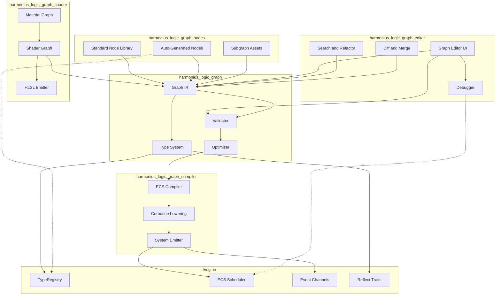
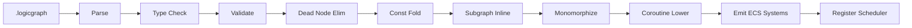
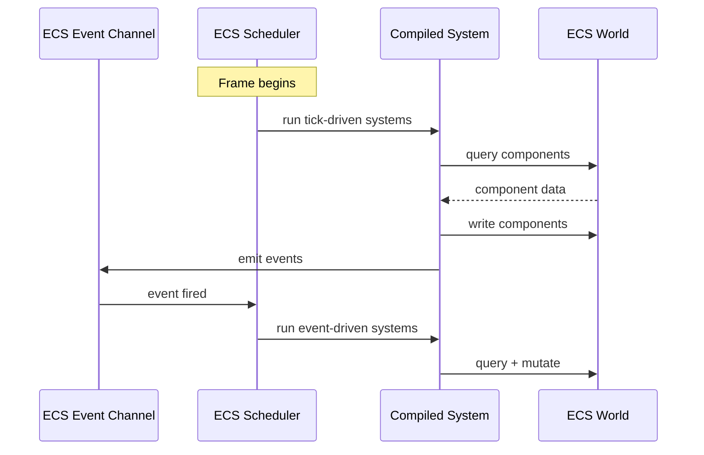
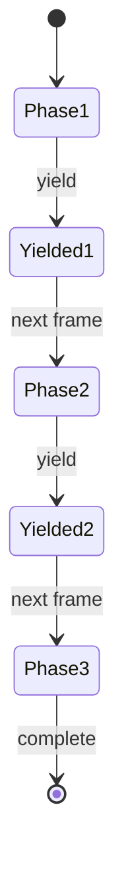
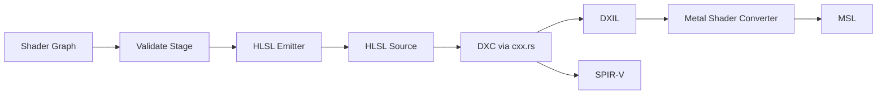
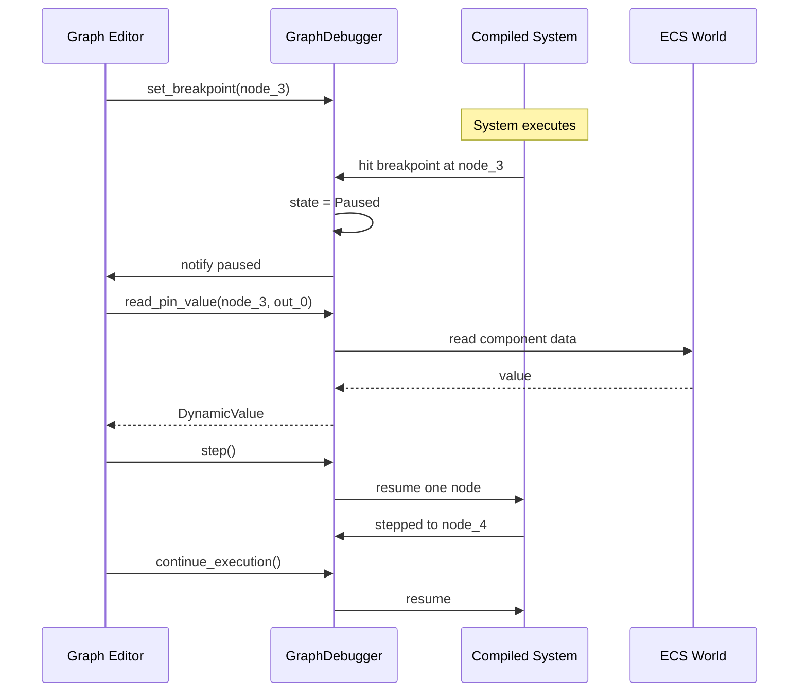
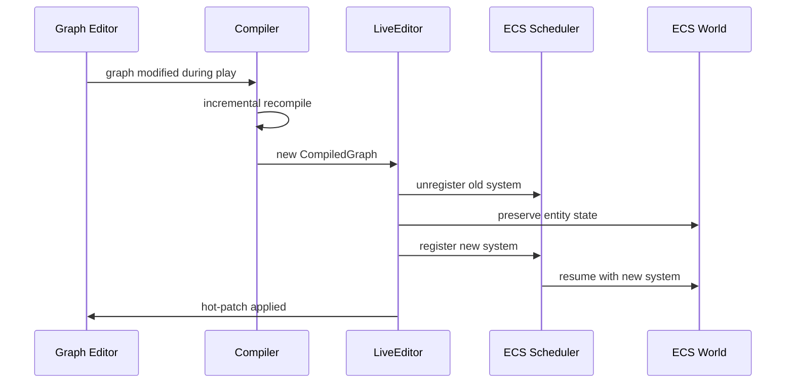

# Visual Logic Graph Design

## Requirements Trace

> **Canonical sources:** Features, requirements, and user stories are defined in
> [features/tools-editor/](../../features/tools-editor/),
> [requirements/tools-editor/](../../requirements/tools-editor/), and
> [user-stories/tools-editor/](../../user-stories/tools-editor/). The table below traces design
> elements to those definitions.

### Graph Runtime (F-15.8.1, R-15.8.1)

| Feature | Requirement | Description |
|---------|-------------|-------------|
| F-15.8.1 | R-15.8.1 | Universal logic graph runtime — sole authoring mechanism for all engine logic |
| F-15.8.2 | R-15.8.2 | Static type system with bidirectional inference, no implicit coercion |
| F-15.8.3 | R-15.8.3 | Strict validation before save, compile, or reference |
| F-15.8.4 | R-15.8.4 | Gameplay logic graphs with coroutine-style multi-frame execution |

### Shader and Material (F-15.8.5, R-15.8.5)

| Feature | Requirement | Description |
|---------|-------------|-------------|
| F-15.8.5a | R-15.8.5a | Shader graph core — visual vertex, fragment, compute authoring |
| F-15.8.5b | R-15.8.5b | Shader graph to HLSL compilation via DXC and Metal Shader Converter |
| F-15.8.5c | R-15.8.5c | Material graph variant with PBR inputs and live viewport preview |
| F-15.8.6 | R-15.8.6 | Render graph configuration — visual render pipeline authoring |

### Animation and Audio (F-15.8.7, R-15.8.7)

| Feature | Requirement | Description |
|---------|-------------|-------------|
| F-15.8.7 | R-15.8.7 | Animation logic graphs — state machines, blend trees, IK |
| F-15.8.8 | R-15.8.8 | Audio logic graphs — adaptive audio, RTPC, music layers |

### Tooling (F-15.8.9 -- F-15.8.14, R-15.8.9 -- R-15.8.14)

| Feature | Requirement | Description |
|---------|-------------|-------------|
| F-15.8.9 | R-15.8.9 | Custom tool graphs — editor extension via visual authoring |
| F-15.8.10 | R-15.8.10 | Graph node library — standard + auto-generated + user subgraphs |
| F-15.8.11 | R-15.8.11 | Graph debugging — breakpoints, step, watch, execution trace |
| F-15.8.12 | R-15.8.12 | Graph compilation — dead node elim, const fold, inline, monomorphize |
| F-15.8.13 | R-15.8.13 | Graph diffing and three-way merge with Git integration |
| F-15.8.14 | R-15.8.14 | Graph search and refactoring — find usages, rename, pattern replace |

## Overview

The Visual Logic Graph is the sole authoring surface for all engine logic in Harmonius. Users never
write textual code. Every gameplay behavior, shader, material, animation state machine, audio mix,
render pipeline, and editor tool is expressed as a typed, functional node graph.

### Core Principles

1. **No-code.** The graph editor is the only way to author logic. No scripting language, no code
   editor.
2. **Compile, never interpret.** Gameplay graphs compile to native ECS systems at edit time. No
   runtime bytecode interpreter exists in shipping builds.
3. **100% ECS.** Compiled graphs become systems that query and mutate components. All simulation
   data lives as ECS components.
4. **Static dispatch.** The compiler monomorphizes all generic nodes. No vtables, no dynamic
   dispatch on the hot path.
5. **Edit-time safety.** The type system catches errors at graph-edit time. Invalid graphs cannot be
   saved.

### Domain Coverage

The logic graph system serves seven domains through a shared IR and type system, with
domain-specific compilers.

| Domain | Compiles To | Runtime |
|--------|-------------|---------|
| Gameplay | ECS systems | ECS scheduler |
| Shader | HLSL source | DXC / Metal Shader Converter |
| Material | HLSL source (PBR template) | DXC / Metal Shader Converter |
| Animation | Animation controller data | Animation system |
| Audio | Audio graph description | Audio engine |
| Render pipeline | Frame graph description | Render graph executor |
| Tool | Editor command sequences | Editor runtime (desktop only) |

### Crate Structure

```text
harmonius_logic_graph/        # Graph IR, type system,
                              # validator, optimizer
harmonius_logic_graph_nodes/  # Standard node library,
                              # auto-gen from TypeRegistry
harmonius_logic_graph_compiler/ # ECS system emitter,
                              # coroutine lowering
harmonius_logic_graph_shader/ # Shader/material graph,
                              # HLSL emitter
harmonius_logic_graph_editor/ # Graph editor UI, debugger,
                              # diff/merge, search/refactor
```

## Architecture

### Module Boundaries



### Crate File Layout

```text
harmonius_logic_graph/
├── ir/
│   ├── graph.rs       # LogicGraph, GraphId,
│   │                  # GraphMetadata
│   ├── node.rs        # Node, NodeId, NodeKind
│   ├── pin.rs         # Pin, PinId, PinDirection,
│   │                  # PinType
│   ├── edge.rs        # Edge, connection rules
│   ├── variable.rs    # Variable, VariableScope
│   └── subgraph.rs    # SubgraphRef, SubgraphDef
├── types/
│   ├── type_id.rs     # GraphTypeId, resolved types
│   ├── inference.rs   # Bidirectional type inference
│   ├── coercion.rs    # Explicit conversion catalog
│   └── generics.rs    # Generic params, constraints
├── validate/
│   ├── checker.rs     # Full validation pipeline
│   ├── type_check.rs  # Per-edge type correctness
│   ├── cycle.rs       # Cycle detection in dataflow
│   ├── completeness.rs # Dangling pins, missing inputs
│   └── diagnostic.rs  # Error, Warning, Suggestion
├── optimize/
│   ├── dead_node.rs   # Dead node elimination
│   ├── const_fold.rs  # Constant folding
│   ├── inline.rs      # Subgraph inlining
│   └── monomorph.rs   # Generic specialization
└── serde/
    ├── format.rs      # .logicgraph RON format
    └── migration.rs   # Schema versioning

harmonius_logic_graph_nodes/
├── standard/
│   ├── math.rs        # Add, Sub, Mul, Div, Lerp,
│   │                  # Clamp, Sin, Cos, etc.
│   ├── logic.rs       # And, Or, Not, Compare, Select
│   ├── flow.rs        # Branch, ForEach, Sequence,
│   │                  # Gate, Delay, DoOnce
│   ├── string.rs      # Format, Concat, Split, Find
│   ├── collection.rs  # Array ops, Map ops, Filter
│   └── conversion.rs  # Explicit type conversions
├── ecs/
│   ├── query.rs       # ECS query builder nodes
│   ├── component.rs   # Get, Set, Add, Remove
│   ├── entity.rs      # Spawn, Despawn, Has
│   ├── resource.rs    # Read, Write resource
│   ├── event.rs       # Send, Receive event
│   └── command.rs     # Deferred command buffer
├── domain/
│   ├── physics.rs     # Raycast, overlap, force
│   ├── audio.rs       # Play, stop, RTPC, volume
│   ├── input.rs       # Action state, axis values
│   ├── animation.rs   # Set param, trigger
│   ├── ui.rs          # Widget manipulation
│   └── networking.rs  # RPC send, state read
├── generator.rs       # Auto-gen nodes from
│                      # TypeRegistry
└── registry.rs        # NodeRegistry, categories

harmonius_logic_graph_compiler/
├── lower.rs           # Graph IR to compiler IR
├── coroutine.rs       # Coroutine state machine gen
├── system_emit.rs     # Emit Rust ECS system fns
├── scheduler.rs       # Register with ECS scheduler
├── debug_info.rs      # Source map: system -> node
└── cache.rs           # Incremental compilation cache

harmonius_logic_graph_shader/
├── shader_ir.rs       # Shader-specific IR
├── hlsl_emit.rs       # HLSL code generation
├── material.rs        # PBR template, live preview
├── render_graph.rs    # Frame graph description
└── stage_validate.rs  # Per-stage constraint checks

harmonius_logic_graph_editor/
├── canvas.rs          # Graph canvas widget
├── node_palette.rs    # Searchable node browser
├── inspector.rs       # Pin value inspector
├── debugger/
│   ├── breakpoint.rs  # Breakpoint management
│   ├── stepper.rs     # Step-through execution
│   ├── watch.rs       # Pin watch expressions
│   └── trace.rs       # Visual execution trace
├── diff/
│   ├── differ.rs      # Two-way and three-way diff
│   ├── merge.rs       # Merge engine
│   └── git_driver.rs  # Custom Git diff/merge driver
├── search/
│   ├── finder.rs      # Find usages across project
│   ├── rename.rs      # Rename with propagation
│   └── pattern.rs     # Structural find-and-replace
└── live_edit.rs       # Hot patch during play mode
```

### Compilation Pipeline

The compilation pipeline transforms a visual graph into registered ECS systems. This happens at edit
time in the editor, not at game runtime.



### Execution Model

Compiled graphs become ECS systems. Two execution triggers exist.

1. **Event-driven.** An Event node in the graph subscribes to a typed ECS event channel. When the
   event fires, the compiled system runs.
2. **Tick-driven.** A Tick node runs every frame during a specified schedule phase (PreUpdate,
   Update, PostUpdate, FixedUpdate).

Both produce identical ECS systems. The only difference is how the ECS scheduler triggers them.



### Coroutine Lowering

Multi-frame sequences (boss encounters, quest phases, timed abilities) use coroutine-style Yield
nodes. The compiler lowers these into state machines stored as ECS components.



Each yield point becomes a state variant in an enum. The compiled system checks the current state,
resumes from that point, and writes the next state back to the component. No heap allocation, no
runtime stack.

```rust
/// Compiler-generated coroutine state.
/// Stored as an ECS component on the entity.
#[derive(Reflect)]
enum BossEncounterState {
    Phase1 { hp_threshold: f32 },
    Phase2 { timer: f32, wave_count: u32 },
    Phase3 { enrage_timer: f32 },
    Complete,
}
```

## API Design

### Graph IR

```rust
/// Unique identifier for a graph asset.
#[derive(
    Clone, Copy, Debug, PartialEq, Eq, Hash,
)]
pub struct GraphId(pub Uuid);

/// Unique identifier for a node within a graph.
#[derive(
    Clone, Copy, Debug, PartialEq, Eq, Hash,
)]
pub struct NodeId(pub(crate) u32);

/// **Note:** `NodeId` is canonically defined in
/// [shared-primitives.md](../core-runtime/shared-primitives.md)
/// as `NodeId(pub u32)`. All graph systems should
/// use this canonical definition.

/// Unique identifier for a pin within a node.
#[derive(
    Clone, Copy, Debug, PartialEq, Eq, Hash,
)]
pub struct PinId(pub(crate) u32);

/// Unique identifier for a variable.
#[derive(
    Clone, Copy, Debug, PartialEq, Eq, Hash,
)]
pub struct VariableId(pub(crate) u32);

/// Unique identifier for a generic type param.
#[derive(
    Clone, Copy, Debug, PartialEq, Eq, Hash,
)]
pub struct GenericParamId(pub(crate) u32);

/// The domain a graph targets. Determines which
/// compiler backend processes the graph.
#[derive(
    Clone, Copy, Debug, PartialEq, Eq, Hash,
    Reflect,
)]
pub enum GraphDomain {
    Gameplay,
    Shader,
    Material,
    Animation,
    Audio,
    RenderPipeline,
    Tool,
}

/// Top-level graph asset. Serialized as
/// `.logicgraph` in RON format.
#[derive(Debug, Reflect)]
pub struct LogicGraph {
    pub graph_id: GraphId,
    pub domain: GraphDomain,
    pub name: String,
    pub nodes: Vec<Node>,
    pub edges: Vec<Edge>,
    pub variables: Vec<Variable>,
    pub subgraph_refs: Vec<SubgraphRef>,
    pub generic_params: Vec<GenericParam>,
    pub metadata: GraphMetadata,
}

/// Metadata for display and version control.
#[derive(Debug, Reflect)]
pub struct GraphMetadata {
    pub schema_version: u32,
    pub editor_camera_pos: Vec2,
    pub editor_zoom: f32,
    pub description: String,
}
```

### Node Types

```rust
/// A node in the graph.
#[derive(Debug, Reflect)]
pub struct Node {
    pub node_id: NodeId,
    pub kind: NodeKind,
    pub pins: Vec<Pin>,
    pub position: Vec2,
    pub display_name: String,
    pub comment: Option<String>,
}

/// The behavior category of a node.
#[derive(Debug, Reflect)]
pub enum NodeKind {
    /// Entry point: subscribes to an ECS event.
    Event(EventNodeData),
    /// Entry point: runs every tick in a schedule.
    Tick(TickNodeData),
    /// Flow control: branch, loop, sequence, gate.
    FlowControl(FlowControlKind),
    /// Pure function: math, logic, string, convert.
    /// No side effects — eligible for const folding.
    Pure(PureNodeData),
    /// ECS query: iterates matching archetypes.
    EcsQuery(QueryNodeData),
    /// Component access: get, set, add, remove.
    ComponentAccess(ComponentAccessData),
    /// Resource access: read or write a resource.
    ResourceAccess(ResourceAccessData),
    /// Event send: emit a typed event.
    EventSend(EventSendData),
    /// Calls a subgraph as a function.
    SubgraphCall(GraphId),
    /// Coroutine yield: suspend until next frame.
    Yield(YieldData),
    /// Variable get or set.
    VariableAccess(VariableAccessData),
    /// Domain-specific: physics, audio, input, etc.
    DomainSpecific(DomainNodeData),
}

/// Schedule phase for tick-driven graphs.
#[derive(
    Clone, Copy, Debug, PartialEq, Eq, Reflect,
)]
pub enum TickPhase {
    PreUpdate,
    Update,
    PostUpdate,
    FixedUpdate,
}

/// Data for event entry-point nodes.
#[derive(Debug, Reflect)]
pub struct EventNodeData {
    pub event_type_id: TypeId,
}

/// Data for tick entry-point nodes.
#[derive(Debug, Reflect)]
pub struct TickNodeData {
    pub phase: TickPhase,
}

/// Flow control variants.
#[derive(Debug, Reflect)]
pub enum FlowControlKind {
    Branch,
    ForEach,
    WhileLoop,
    Sequence,
    Gate { initially_open: bool },
    DoOnce,
    Delay { seconds: f32 },
    Select,
}

/// Data for pure function nodes.
#[derive(Debug, Reflect)]
pub struct PureNodeData {
    pub function_id: NodeFunctionId,
}

/// Unique identifier for a registered node
/// function.
#[derive(
    Clone, Copy, Debug, PartialEq, Eq, Hash,
)]
pub struct NodeFunctionId(pub(crate) u64);

/// Data for ECS query nodes.
#[derive(Debug, Reflect)]
pub struct QueryNodeData {
    pub component_types: Vec<TypeId>,
    pub filter: QueryFilter,
}

/// Query filter predicates.
#[derive(Debug, Reflect)]
pub enum QueryFilter {
    None,
    With(TypeId),
    Without(TypeId),
    Changed(TypeId),
    Added(TypeId),
    And(Box<QueryFilter>, Box<QueryFilter>),
    Or(Box<QueryFilter>, Box<QueryFilter>),
}

/// Data for component access nodes.
#[derive(Debug, Reflect)]
pub struct ComponentAccessData {
    pub component_type_id: TypeId,
    pub access: ComponentAccessKind,
}

#[derive(
    Clone, Copy, Debug, PartialEq, Eq, Reflect,
)]
pub enum ComponentAccessKind {
    Get,
    Set,
    Add,
    Remove,
    Has,
}

/// Data for resource access nodes.
#[derive(Debug, Reflect)]
pub struct ResourceAccessData {
    pub resource_type_id: TypeId,
    pub mutable: bool,
}

/// Data for event send nodes.
#[derive(Debug, Reflect)]
pub struct EventSendData {
    pub event_type_id: TypeId,
}

/// Variable get/set data.
#[derive(Debug, Reflect)]
pub struct VariableAccessData {
    pub variable_id: VariableId,
    pub write: bool,
}

/// Yield data for coroutine suspension.
#[derive(Debug, Reflect)]
pub struct YieldData {
    pub kind: YieldKind,
}

#[derive(
    Clone, Copy, Debug, PartialEq, Eq, Reflect,
)]
pub enum YieldKind {
    /// Resume next frame.
    NextFrame,
    /// Resume after duration (seconds).
    Delay(u32),
    /// Resume when a condition becomes true.
    UntilCondition,
}

/// Domain-specific node data.
#[derive(Debug, Reflect)]
pub struct DomainNodeData {
    pub domain: GraphDomain,
    pub function_id: NodeFunctionId,
}
```

### Pin and Type System

```rust
/// A typed connection point on a node.
#[derive(Debug, Reflect)]
pub struct Pin {
    pub pin_id: PinId,
    pub direction: PinDirection,
    pub pin_type: PinType,
    pub name: String,
    pub default_value: Option<DynamicValue>,
}

#[derive(
    Clone, Copy, Debug, PartialEq, Eq, Reflect,
)]
pub enum PinDirection {
    Input,
    Output,
}

/// The type carried by a pin.
#[derive(Debug, Clone, PartialEq, Eq, Reflect)]
pub enum PinType {
    /// Execution flow — no data, just ordering.
    Execution,
    /// Concrete data type resolved from
    /// TypeRegistry.
    Data(TypeId),
    /// Unresolved generic parameter. Resolved
    /// during type inference.
    Generic(GenericParamId),
    /// Accepts any type. Used by utility nodes
    /// like Print, ToString. Resolved at
    /// connection time.
    Wildcard,
}

/// A connection between two pins.
#[derive(
    Debug, Clone, PartialEq, Eq, Reflect,
)]
pub struct Edge {
    pub source_node: NodeId,
    pub source_pin: PinId,
    pub target_node: NodeId,
    pub target_pin: PinId,
}

/// Generic type parameter declaration.
#[derive(Debug, Reflect)]
pub struct GenericParam {
    pub param_id: GenericParamId,
    pub name: String,
    pub bounds: Vec<TraitBound>,
}

/// Trait bound on a generic parameter.
#[derive(Debug, Clone, Reflect)]
pub struct TraitBound {
    pub trait_type_id: TypeId,
}
```

### Pin Type Compatibility Matrix

Connections are only valid between compatible pin types. No implicit coercion is permitted. Users
must insert explicit conversion nodes.

| Source | Target | Valid? | Notes |
|--------|--------|--------|-------|
| Execution | Execution | Yes | Flow ordering |
| Data(T) | Data(T) | Yes | Same type |
| Data(T) | Data(U) | No | Requires conversion node |
| Data(T) | Generic(G) | Yes | Binds G := T |
| Generic(G) | Data(T) | Yes | Binds G := T |
| Generic(G) | Generic(H) | Yes | Unifies G = H |
| Wildcard | Data(T) | Yes | Resolves to T |
| Execution | Data(T) | No | Incompatible categories |
| Data(T) | Execution | No | Incompatible categories |

### Variables

```rust
/// A named variable in a graph.
#[derive(Debug, Reflect)]
pub struct Variable {
    pub var_id: VariableId,
    pub name: String,
    pub type_id: TypeId,
    pub scope: VariableScope,
    pub default: Option<DynamicValue>,
}

/// Variable lifetime scope.
#[derive(
    Clone, Copy, Debug, PartialEq, Eq, Reflect,
)]
pub enum VariableScope {
    /// Exists only during a single execution of
    /// the graph. Compiler allocates as a local in
    /// the generated system function.
    Local,
    /// Persists across executions of the graph.
    /// Compiled to an ECS component on the entity
    /// that owns this graph instance.
    Graph,
    /// Reads/writes a component field on the
    /// owning entity. Aliases a real ECS component.
    Entity,
}
```

### Subgraphs and Macros

Subgraphs are reusable graph fragments saved as separate assets. They act as user-defined function
nodes.

```rust
/// Reference to a subgraph used as a node.
#[derive(Debug, Reflect)]
pub struct SubgraphRef {
    pub graph_id: GraphId,
    pub input_mappings: Vec<PinMapping>,
    pub output_mappings: Vec<PinMapping>,
}

/// Maps a parent graph pin to a subgraph
/// boundary pin.
#[derive(Debug, Reflect)]
pub struct PinMapping {
    pub outer_pin: PinId,
    pub inner_pin: PinId,
}

/// A subgraph definition with typed interface.
#[derive(Debug, Reflect)]
pub struct SubgraphDef {
    pub graph_id: GraphId,
    pub name: String,
    pub inputs: Vec<SubgraphPort>,
    pub outputs: Vec<SubgraphPort>,
    pub generic_params: Vec<GenericParam>,
    pub body: LogicGraph,
}

/// A typed port on a subgraph boundary.
#[derive(Debug, Reflect)]
pub struct SubgraphPort {
    pub name: String,
    pub pin_type: PinType,
}
```

### Type Inference Engine

```rust
/// Bidirectional type inference engine.
/// Runs incrementally on each edge edit.
pub struct TypeInferenceEngine {
    /// Resolved type bindings for generic params.
    bindings: HashMap<GenericParamId, TypeId>,
    /// Unification constraints from edges.
    constraints: Vec<TypeConstraint>,
}

/// A constraint between two pin types.
pub struct TypeConstraint {
    pub source: PinType,
    pub target: PinType,
    pub edge: Edge,
}

impl TypeInferenceEngine {
    pub fn new() -> Self;

    /// Run inference on the full graph. Returns
    /// resolved types for all generic parameters,
    /// or diagnostics for unresolvable constraints.
    pub fn infer(
        &mut self,
        graph: &LogicGraph,
        registry: &TypeRegistry,
    ) -> Result<
        InferenceResult,
        Vec<TypeDiagnostic>,
    >;

    /// Incremental update after a single edge is
    /// added or removed.
    pub fn update_edge(
        &mut self,
        graph: &LogicGraph,
        edge: &Edge,
        added: bool,
        registry: &TypeRegistry,
    ) -> Result<
        InferenceResult,
        Vec<TypeDiagnostic>,
    >;
}

/// Result of type inference.
pub struct InferenceResult {
    pub bindings: HashMap<GenericParamId, TypeId>,
    /// Fully resolved type for every pin.
    pub pin_types: HashMap<PinId, TypeId>,
}

/// Type error diagnostic.
pub struct TypeDiagnostic {
    pub kind: TypeDiagnosticKind,
    pub node_id: NodeId,
    pub pin_id: PinId,
    pub message: String,
    pub suggestion: Option<String>,
}

pub enum TypeDiagnosticKind {
    Mismatch {
        expected: TypeId,
        found: TypeId,
    },
    UnresolvedGeneric {
        param: GenericParamId,
    },
    IncompatibleCategory {
        source: PinType,
        target: PinType,
    },
}
```

### Validator

```rust
/// Comprehensive graph validator. All checks must
/// pass before a graph can be saved, compiled, or
/// referenced by other assets.
pub struct GraphValidator;

impl GraphValidator {
    /// Run all validation passes on a graph.
    pub fn validate(
        graph: &LogicGraph,
        registry: &TypeRegistry,
        node_registry: &NodeRegistry,
    ) -> ValidationResult;
}

/// Validation outcome.
pub struct ValidationResult {
    pub errors: Vec<Diagnostic>,
    pub warnings: Vec<Diagnostic>,
}

impl ValidationResult {
    pub fn is_valid(&self) -> bool;
}

/// A validation diagnostic with source location.
pub struct Diagnostic {
    pub severity: Severity,
    pub kind: DiagnosticKind,
    pub node_id: Option<NodeId>,
    pub pin_id: Option<PinId>,
    pub message: String,
    pub suggestion: Option<String>,
}

#[derive(Clone, Copy, Debug, PartialEq, Eq)]
pub enum Severity {
    Error,
    Warning,
}

pub enum DiagnosticKind {
    TypeError(TypeDiagnostic),
    CycleDetected { cycle: Vec<NodeId> },
    DanglingPin { pin: PinId },
    DisconnectedNode { node: NodeId },
    MissingRequiredInput { pin: PinId },
    UnusedOutput { pin: PinId },
    InvalidSubgraphRef { graph_id: GraphId },
    DuplicateVariableName { name: String },
    UnreachableNode { node: NodeId },
}
```

### Node Registry and Auto-Generation

```rust
/// Registry of all available node types.
pub struct NodeRegistry {
    /// Nodes organized by category for the palette.
    categories: Vec<NodeCategory>,
    /// Lookup by function ID.
    functions: HashMap<
        NodeFunctionId,
        NodeDefinition,
    >,
}

/// A category in the node palette.
pub struct NodeCategory {
    pub name: String,
    pub subcategories: Vec<NodeCategory>,
    pub nodes: Vec<NodeDefinition>,
}

/// Definition of a node type available in the
/// palette.
pub struct NodeDefinition {
    pub function_id: NodeFunctionId,
    pub display_name: String,
    pub category_path: Vec<String>,
    pub description: String,
    pub input_pins: Vec<PinDefinition>,
    pub output_pins: Vec<PinDefinition>,
    pub generic_params: Vec<GenericParam>,
    pub is_pure: bool,
    pub search_keywords: Vec<String>,
}

/// Definition of a pin on a node template.
pub struct PinDefinition {
    pub name: String,
    pub pin_type: PinType,
    pub default_value: Option<DynamicValue>,
    pub tooltip: String,
}

impl NodeRegistry {
    pub fn new() -> Self;

    /// Search nodes by name or keyword. Returns
    /// matches ranked by relevance.
    pub fn search(
        &self,
        query: &str,
    ) -> Vec<&NodeDefinition>;

    /// Auto-generate nodes from all types in the
    /// TypeRegistry that implement Reflect.
    /// Creates Get/Set/Add/Remove nodes for each
    /// component, Read/Write for each resource,
    /// Send/Receive for each event.
    pub fn generate_from_type_registry(
        &mut self,
        type_registry: &TypeRegistry,
    );

    /// Register a subgraph asset as a callable
    /// node.
    pub fn register_subgraph(
        &mut self,
        def: &SubgraphDef,
    );
}
```

### ECS Compiler

```rust
/// Compiles a validated, optimized gameplay graph
/// into ECS systems and registers them with the
/// scheduler.
pub struct EcsCompiler;

impl EcsCompiler {
    /// Compile a graph to ECS systems.
    /// Returns compiled artifacts with debug info.
    pub fn compile(
        graph: &LogicGraph,
        registry: &TypeRegistry,
        node_registry: &NodeRegistry,
    ) -> Result<CompiledGraph, CompileError>;
}

/// Compiled graph ready for ECS registration.
pub struct CompiledGraph {
    pub graph_id: GraphId,
    pub systems: Vec<CompiledSystem>,
    pub coroutine_states: Vec<CoroutineStateDesc>,
    pub debug_info: DebugInfo,
}

/// A single compiled ECS system.
pub struct CompiledSystem {
    pub name: String,
    pub trigger: SystemTrigger,
    /// Queries this system performs.
    pub queries: Vec<QueryDesc>,
    /// Components this system reads.
    pub reads: Vec<TypeId>,
    /// Components this system writes.
    pub writes: Vec<TypeId>,
    /// Events this system sends.
    pub events_sent: Vec<TypeId>,
    /// The compiled system function pointer.
    pub system_fn: CompiledSystemFn,
}

/// How the ECS scheduler triggers a system.
#[derive(Debug, Clone, Reflect)]
pub enum SystemTrigger {
    /// Runs every frame in a schedule phase.
    Tick(TickPhase),
    /// Runs when a specific event fires.
    Event(TypeId),
    /// Runs when a component is added.
    OnAdd(TypeId),
    /// Runs when a component is removed.
    OnRemove(TypeId),
    /// Runs when a component changes.
    OnChange(TypeId),
}

/// A compiled ECS system function.
/// This is a function pointer with the signature
/// expected by the ECS scheduler.
pub struct CompiledSystemFn {
    /// Opaque function pointer to the compiled
    /// system.
    ptr: *const (),
    /// Type-erased system parameter descriptors
    /// for the scheduler.
    params: Vec<SystemParamDesc>,
}

/// Describes a coroutine state component the
/// compiler generated.
pub struct CoroutineStateDesc {
    pub component_type_id: TypeId,
    pub state_enum_variants: Vec<String>,
}

/// Maps compiled system locations back to graph
/// nodes for debugging and error reporting.
pub struct DebugInfo {
    /// Map from instruction offset to source node.
    pub source_map: Vec<SourceMapping>,
}

pub struct SourceMapping {
    pub system_index: u32,
    pub instruction_offset: u32,
    pub node_id: NodeId,
    pub pin_id: Option<PinId>,
}

/// Compilation errors with graph-level source
/// locations.
pub enum CompileError {
    TypeResolutionFailed {
        node_id: NodeId,
        type_id: TypeId,
    },
    UnsupportedNodeKind {
        node_id: NodeId,
        kind: String,
    },
    CoroutineLoweringFailed {
        node_id: NodeId,
        reason: String,
    },
    QueryConstructionFailed {
        node_id: NodeId,
        reason: String,
    },
}
```

### Graph Debugger

```rust
/// Runtime debugger for compiled graphs.
/// Communicates with the editor UI to display
/// execution state.
pub struct GraphDebugger {
    breakpoints: HashMap<NodeId, Breakpoint>,
    watches: Vec<WatchExpression>,
    state: DebugState,
}

pub struct Breakpoint {
    pub node_id: NodeId,
    pub enabled: bool,
    pub condition: Option<String>,
    pub hit_count: u64,
}

pub struct WatchExpression {
    pub pin_id: PinId,
    pub node_id: NodeId,
    pub label: String,
}

#[derive(Clone, Copy, Debug, PartialEq, Eq)]
pub enum DebugState {
    Running,
    Paused { at_node: NodeId },
    Stepping,
    Detached,
}

impl GraphDebugger {
    pub fn new() -> Self;

    /// Set a breakpoint on a node.
    pub fn set_breakpoint(
        &mut self,
        node_id: NodeId,
        condition: Option<String>,
    );

    /// Remove a breakpoint.
    pub fn remove_breakpoint(
        &mut self,
        node_id: NodeId,
    );

    /// Add a watch on a pin value.
    pub fn add_watch(
        &mut self,
        node_id: NodeId,
        pin_id: PinId,
        label: &str,
    );

    /// Step to the next node.
    pub fn step(&mut self);

    /// Continue execution until next breakpoint.
    pub fn continue_execution(&mut self);

    /// Read the current value of a watched pin.
    pub fn read_pin_value(
        &self,
        node_id: NodeId,
        pin_id: PinId,
    ) -> Option<DynamicValue>;

    /// Get the current execution trace for visual
    /// highlighting in the editor.
    pub fn execution_trace(
        &self,
    ) -> &[ExecutionTraceEntry];

    /// Get per-node profiling data.
    pub fn node_profile(
        &self,
        node_id: NodeId,
    ) -> Option<NodeProfile>;
}

/// One entry in the execution trace.
pub struct ExecutionTraceEntry {
    pub node_id: NodeId,
    pub timestamp_us: u64,
    pub duration_us: u32,
}

/// Per-node profiling data.
pub struct NodeProfile {
    pub node_id: NodeId,
    pub total_time_us: u64,
    pub invocation_count: u64,
    pub avg_time_us: f64,
}
```

### Live Editing

```rust
/// Hot-patches a running game with graph changes
/// without restarting play mode.
pub struct LiveEditor;

impl LiveEditor {
    /// Apply a graph edit to the running game.
    /// Recompiles only the affected subgraph,
    /// swaps the compiled system, and preserves
    /// entity state.
    pub fn apply_hot_patch(
        graph: &LogicGraph,
        old_compiled: &CompiledGraph,
        world: &mut World,
        scheduler: &mut Scheduler,
    ) -> Result<CompiledGraph, CompileError>;
}
```

### Diff and Merge

```rust
/// Structural diff between two graph versions.
pub struct GraphDiff {
    pub added_nodes: Vec<NodeId>,
    pub removed_nodes: Vec<NodeId>,
    pub modified_nodes: Vec<NodeModification>,
    pub added_edges: Vec<Edge>,
    pub removed_edges: Vec<Edge>,
    pub added_variables: Vec<VariableId>,
    pub removed_variables: Vec<VariableId>,
}

pub struct NodeModification {
    pub node_id: NodeId,
    pub changed_pins: Vec<PinId>,
    pub position_changed: bool,
    pub kind_changed: bool,
}

/// Three-way merge result.
pub enum MergeResult {
    /// Merge succeeded with no conflicts.
    Clean(LogicGraph),
    /// Merge has conflicts requiring resolution.
    Conflicted {
        merged: LogicGraph,
        conflicts: Vec<MergeConflict>,
    },
}

pub struct MergeConflict {
    pub node_id: NodeId,
    pub ours: Option<Node>,
    pub theirs: Option<Node>,
    pub description: String,
}

/// Graph differ.
pub struct GraphDiffer;

impl GraphDiffer {
    /// Compute the diff between two graphs.
    pub fn diff(
        base: &LogicGraph,
        head: &LogicGraph,
    ) -> GraphDiff;

    /// Three-way merge.
    pub fn merge_three_way(
        base: &LogicGraph,
        ours: &LogicGraph,
        theirs: &LogicGraph,
    ) -> MergeResult;
}
```

### Search and Refactoring

```rust
/// Project-wide graph search engine.
pub struct GraphSearchEngine;

impl GraphSearchEngine {
    /// Find all uses of a node function across
    /// all graphs in the project.
    pub fn find_usages(
        function_id: NodeFunctionId,
        graphs: &[LogicGraph],
    ) -> Vec<UsageLocation>;

    /// Find all uses of a variable.
    pub fn find_variable_usages(
        var_id: VariableId,
        graph: &LogicGraph,
    ) -> Vec<UsageLocation>;

    /// Find all graphs that reference a subgraph.
    pub fn find_subgraph_refs(
        graph_id: GraphId,
        all_graphs: &[LogicGraph],
    ) -> Vec<UsageLocation>;

    /// Structural pattern match: find all nodes
    /// matching a pattern.
    pub fn find_pattern(
        pattern: &NodePattern,
        graphs: &[LogicGraph],
    ) -> Vec<UsageLocation>;
}

/// Location of a usage in a graph.
pub struct UsageLocation {
    pub graph_id: GraphId,
    pub node_id: NodeId,
    pub pin_id: Option<PinId>,
}

/// Pattern for structural search.
pub struct NodePattern {
    pub kind: Option<NodeKind>,
    pub pin_types: Vec<PinType>,
    pub function_id: Option<NodeFunctionId>,
}

/// Refactoring operations.
pub struct GraphRefactor;

impl GraphRefactor {
    /// Rename a node function across all graphs.
    /// Returns the number of graphs modified.
    pub fn rename_function(
        old_id: NodeFunctionId,
        new_id: NodeFunctionId,
        new_name: &str,
        graphs: &mut [LogicGraph],
    ) -> u32;

    /// Replace all instances of one node type with
    /// another. Pin mappings define how to rewire.
    pub fn replace_node_type(
        old_id: NodeFunctionId,
        new_id: NodeFunctionId,
        pin_mappings: &[(PinId, PinId)],
        graphs: &mut [LogicGraph],
    ) -> u32;

    /// Rename a variable across a single graph.
    pub fn rename_variable(
        var_id: VariableId,
        new_name: &str,
        graph: &mut LogicGraph,
    );
}
```

### Shader Graph HLSL Emitter

```rust
/// Compiles shader domain graphs to HLSL source.
pub struct HlslEmitter;

impl HlslEmitter {
    /// Emit HLSL source from a validated shader
    /// graph. Returns HLSL text and a source map
    /// from HLSL lines to graph nodes.
    pub fn emit(
        graph: &LogicGraph,
        stage: ShaderStage,
        registry: &TypeRegistry,
    ) -> Result<HlslOutput, ShaderCompileError>;
}

pub struct HlslOutput {
    pub hlsl_source: String,
    pub source_map: Vec<HlslSourceMapping>,
}

pub struct HlslSourceMapping {
    pub hlsl_line: u32,
    pub node_id: NodeId,
}

#[derive(Clone, Copy, Debug, PartialEq, Eq)]
pub enum ShaderStage {
    Vertex,
    Fragment,
    Compute,
}

pub enum ShaderCompileError {
    MissingStageOutput {
        stage: ShaderStage,
        required: String,
    },
    UnsupportedNodeInShader {
        node_id: NodeId,
    },
    TypeNotMappableToHlsl {
        node_id: NodeId,
        type_id: TypeId,
    },
}
```

## Data Flow

### Edit-Time Compilation Flow

The full lifecycle from user edit to running ECS system.

1. User edits a graph in the editor canvas.
2. On each edit, the type inference engine runs incrementally, updating resolved types.
3. The validator runs continuously, showing inline errors and warnings.
4. On save, the validator runs a full pass. If errors exist, save is rejected.
5. On successful save, the graph asset is written to disk in RON format.
6. The compiler picks up the changed asset: a. Dead node elimination b. Constant folding c. Subgraph
   inlining d. Monomorphization e. Coroutine lowering (if Yield nodes present) f. ECS system
   emission
7. The compiled system is registered with the ECS scheduler under the appropriate trigger.
8. If play mode is active, the live editor hot-swaps the old system with the new one.

### Runtime Execution Flow

```rust
// Compiled from an event-driven graph:
// "On DamageTaken, reduce HP, check death"
fn compiled_damage_system(
    trigger: EventReader<DamageTaken>,
    mut query: Query<(
        &mut Health,
        &DamageResistance,
        Entity,
    )>,
    mut death_events: EventWriter<EntityDied>,
) {
    for event in trigger.read() {
        if let Ok((mut hp, resist, entity)) =
            query.get_mut(event.target)
        {
            let damage =
                event.amount * (1.0 - resist.factor);
            hp.current -= damage;
            if hp.current <= 0.0 {
                death_events.send(EntityDied {
                    entity,
                });
            }
        }
    }
}
```

The above is what the compiler emits from a graph containing: Event(DamageTaken) ->
GetComponent(Health) -> GetComponent(DamageResistance) -> Multiply -> Subtract -> Branch(hp <= 0) ->
SendEvent(EntityDied).

### Coroutine Execution Flow

```rust
// Compiled from a coroutine graph:
// Phase 1 -> Yield -> Phase 2 -> Yield -> Phase 3
fn compiled_boss_encounter(
    mut query: Query<(
        &mut BossEncounterState,
        &mut BossAI,
        Entity,
    )>,
    time: Res<Time>,
    mut spawn_events: EventWriter<SpawnWave>,
) {
    for (mut state, mut ai, entity) in
        query.iter_mut()
    {
        match state.as_ref() {
            BossEncounterState::Phase1 {
                hp_threshold,
            } => {
                if ai.hp_percent() <= *hp_threshold {
                    *state =
                        BossEncounterState::Phase2 {
                            timer: 0.0,
                            wave_count: 0,
                        };
                }
            }
            BossEncounterState::Phase2 {
                timer,
                wave_count,
            } => {
                let t = timer + time.delta_secs();
                if t >= 5.0 && *wave_count < 3 {
                    spawn_events.send(SpawnWave {
                        origin: entity,
                    });
                    *state =
                        BossEncounterState::Phase2 {
                            timer: 0.0,
                            wave_count: wave_count
                                + 1,
                        };
                } else if *wave_count >= 3 {
                    *state =
                        BossEncounterState::Phase3 {
                            enrage_timer: 30.0,
                        };
                } else {
                    *state =
                        BossEncounterState::Phase2 {
                            timer: t,
                            wave_count: *wave_count,
                        };
                }
            }
            BossEncounterState::Phase3 {
                enrage_timer,
            } => {
                let t =
                    enrage_timer - time.delta_secs();
                if t <= 0.0 {
                    ai.set_enraged(true);
                    *state =
                        BossEncounterState::Complete;
                } else {
                    *state =
                        BossEncounterState::Phase3 {
                            enrage_timer: t,
                        };
                }
            }
            BossEncounterState::Complete => {}
        }
    }
}
```

### Shader Graph Data Flow



### Debug Data Flow



### Live Edit Hot-Patch Flow



## Platform Considerations

### Compilation Targets

The ECS compiler emits platform-independent Rust code. The shader compiler emits HLSL, which is then
compiled per platform.

| Platform | Gameplay Graphs | Shader Graphs |
|----------|-----------------|---------------|
| Windows | ECS systems (x86-64) | HLSL -> DXC -> DXIL |
| macOS | ECS systems (ARM64 / x86-64) | HLSL -> DXC -> SPIR-V -> Metal Shader Converter -> MSL |
| Linux | ECS systems (x86-64) | HLSL -> DXC -> SPIR-V |
| iOS | ECS systems (ARM64) | HLSL -> DXC -> SPIR-V -> Metal Shader Converter -> MSL |
| Android | ECS systems (ARM64) | HLSL -> DXC -> SPIR-V |

### Editor-Only Features

The following features are desktop-only and not included in shipping game builds.

| Feature | Reason |
|---------|--------|
| Graph editor UI | Authoring tool |
| Debugger | Development tool |
| Diff / merge | Version control tool |
| Search / refactor | Authoring tool |
| Live editing | Development workflow |
| Custom tool graphs | Editor extension |
| Node palette | Authoring tool |

### Async Integration

Graph compilation uses the engine's async I/O for reading graph assets from disk. The compilation
itself runs on the thread pool as a scoped task.

- **Asset loading:** `IoReactor` reads `.logicgraph` files via platform-native async I/O (IOCP, GCD,
  io_uring).
- **Parallel compilation:** Independent graphs compile in parallel on the `ThreadPool` via scoped
  tasks.
- **Incremental compilation:** Only changed graphs are recompiled. The cache stores compiled
  artifacts keyed by graph content hash.

### Memory Layout

Compiled systems are ordinary ECS systems. They follow the same memory access patterns as
hand-written systems. Coroutine state components are stored in ECS archetypes alongside other
components, benefiting from the same cache-friendly iteration.

| Data | Storage | Lifetime |
|------|---------|----------|
| Graph IR | Heap (editor only) | Editor session |
| Compiled system fn | Static dispatch | App lifetime |
| Coroutine state | ECS component | Entity lifetime |
| Debug info | Heap (editor only) | Editor session |
| Node registry | Heap | App lifetime |
| Subgraph assets | Asset database | Project lifetime |

### Proposed Dependencies

| Crate | Purpose | Justification |
|-------|---------|---------------|
| `uuid` | GraphId generation | Standard UUID v4 for asset identity |
| `petgraph` | Graph algorithms (topo sort, cycle detect) | Well-maintained, zero-cost graph library |
| `smallvec` | Inline pin/edge storage | Avoids heap for nodes with few pins |
| `cxx` | DXC and Metal Shader Converter FFI | Required for shader compilation pipeline |

## Test Plan

### Unit Tests

| Test | Req | Description |
|------|-----|-------------|
| `test_type_inference_simple` | R-15.8.2 | Connect Int output to Int input. Verify resolved types match. |
| `test_type_inference_generic` | R-15.8.2 | Connect Int output to Generic(G) input. Verify G resolves to Int. |
| `test_type_inference_bidirectional` | R-15.8.2 | Generic output connected to typed input. Verify backwards propagation resolves the generic. |
| `test_type_mismatch_rejected` | R-15.8.2 | Connect Float output to Bool input. Verify type error diagnostic with correct node and pin. |
| `test_no_implicit_coercion` | R-15.8.2 | Connect Int output to Float input without conversion node. Verify rejection. |
| `test_validate_missing_input` | R-15.8.3 | Leave a required input pin unconnected. Verify MissingRequiredInput diagnostic. |
| `test_validate_cycle_detection` | R-15.8.3 | Create a cycle in a pure dataflow subgraph. Verify CycleDetected diagnostic with cycle path. |
| `test_validate_dangling_pin` | R-15.8.3 | Create an output pin connected to nothing. Verify UnusedOutput warning. |
| `test_validate_blocks_save` | R-15.8.3 | Attempt to save an invalid graph. Verify save is rejected. |
| `test_dead_node_elimination` | R-15.8.12 | Graph with unreachable nodes. Verify they are removed after optimization. |
| `test_constant_folding` | R-15.8.12 | Graph with `Add(3, 4)` pure nodes. Verify folded to literal 7. |
| `test_subgraph_inlining` | R-15.8.12 | Small subgraph call. Verify inlined after optimization (no call overhead). |
| `test_monomorphization` | R-15.8.12 | Generic `Add<T>` node used with Float. Verify specialized to `Add_f32`. |
| `test_coroutine_lowering` | R-15.8.4 | Graph with 3 yield points. Verify generated state enum has 4 variants (3 phases + Complete). |
| `test_event_system_trigger` | R-15.8.4 | Event node graph. Verify compiled system has EventReader parameter. |
| `test_tick_system_trigger` | R-15.8.4 | Tick(Update) node graph. Verify compiled system registered in Update phase. |
| `test_variable_scope_local` | R-15.8.1 | Local variable. Verify compiled as local binding in system function. |
| `test_variable_scope_graph` | R-15.8.1 | Graph variable. Verify compiled as ECS component field. |
| `test_variable_scope_entity` | R-15.8.1 | Entity variable. Verify compiled as component query access. |
| `test_diff_added_nodes` | R-15.8.13 | Add 2 nodes to a graph. Verify diff reports 2 added nodes. |
| `test_diff_removed_edges` | R-15.8.13 | Remove an edge. Verify diff reports 1 removed edge. |
| `test_merge_no_conflict` | R-15.8.13 | Two non-overlapping edits. Verify clean merge. |
| `test_merge_conflict` | R-15.8.13 | Both sides modify same node. Verify conflict reported. |
| `test_search_find_usages` | R-15.8.14 | Node function used in 3 graphs. Verify find_usages returns 3 locations. |
| `test_rename_propagation` | R-15.8.14 | Rename a function. Verify all 3 graphs updated. |
| `test_node_auto_generation` | R-15.8.10 | Register a new component type. Verify Get, Set, Add, Remove nodes created. |

### Integration Tests

| Test | Req | Description |
|------|-----|-------------|
| `test_compile_and_run_damage_graph` | R-15.8.4 | Compile a damage graph, run in ECS world, verify HP reduced correctly. |
| `test_compile_and_run_coroutine` | R-15.8.4 | Compile a 3-phase coroutine graph, run for 3 frames, verify state transitions. |
| `test_event_driven_chain` | R-15.8.4 | Graph A emits event, Graph B reacts. Verify chain executes in one frame. |
| `test_shader_graph_to_hlsl` | R-15.8.5b | Compile a simple fragment shader graph to HLSL. Verify valid HLSL output. |
| `test_shader_graph_stage_validation` | R-15.8.5a | Vertex shader graph missing position output. Verify stage constraint error. |
| `test_material_graph_pbr` | R-15.8.5c | Material graph with all PBR inputs. Verify HLSL output contains correct PBR structure. |
| `test_live_edit_hot_swap` | R-15.8.11 | Modify a graph during play mode. Verify system is hot-swapped and entity state preserved. |
| `test_breakpoint_pause` | R-15.8.11 | Set breakpoint, run graph, verify execution pauses at correct node with inspectable values. |
| `test_step_through` | R-15.8.11 | Set breakpoint, step 3 times, verify each step advances to correct node. |
| `test_execution_trace` | R-15.8.11 | Run a graph, verify execution trace records correct node order and timing. |
| `test_git_merge_driver` | R-15.8.13 | Invoke custom merge driver on two graph files. Verify correct merged output. |
| `test_pattern_replace` | R-15.8.14 | Replace deprecated node type across 5 graphs. Verify all instances replaced and graphs remain valid. |
| `test_subgraph_call` | R-15.8.10 | Graph calls a subgraph. Verify compiled output includes inlined subgraph logic. |
| `test_incremental_recompile` | R-15.8.12 | Change one node in a 100-node graph. Verify only affected subgraph recompiles. |

### Benchmarks

| Benchmark | Target | Source |
|-----------|--------|--------|
| Compiled graph vs hand-written system | Within 5% throughput | US-15.8.1.6 |
| Type inference on 500-node graph | < 10 ms | US-15.8.2.2 |
| Full validation on 500-node graph | < 50 ms | US-15.8.3.1 |
| Incremental type inference (1 edge) | < 1 ms | US-15.8.2.2 |
| Full compilation of 100-node graph | < 200 ms | US-15.8.12.1 |
| Live hot-patch latency | < 100 ms | US-15.8.11.1 |
| Node auto-gen for 1000 types | < 500 ms | US-15.8.10.2 |
| Shader graph to HLSL (50 nodes) | < 50 ms | US-15.8.5b.1 |
| Search across 1000 graphs | < 500 ms | US-15.8.14.1 |
| Three-way merge (200 nodes each) | < 100 ms | US-15.8.13.2 |

## Open Questions

1. **Compilation strategy.** The compiler currently targets ECS system function pointers. An
   alternative is to emit Rust source code that is compiled by `rustc`. Function pointers give
   faster iteration (no `rustc` invocation) but limit optimizations. Source emission enables `rustc`
   optimizations but adds compilation latency. Hybrid approach: function pointers for editor
   iteration, `rustc` for shipping builds.

2. **Debug instrumentation overhead.** Breakpoints and execution tracing require instrumentation in
   compiled systems. This instrumentation must be zero-cost when debugging is disabled. Compile two
   variants (debug and release) or use a single variant with runtime-checked debug flag?

3. **Subgraph inlining depth limit.** Deeply nested subgraph calls could cause code bloat if inlined
   aggressively. Need a heuristic for inlining threshold (node count, call depth) versus keeping as
   a function call.

4. **Coroutine state size limit.** Each yield point adds a variant to the state enum. Graphs with
   many yield points could produce large state components. Need to define a maximum yield count or
   provide guidance to designers.

5. **Shader graph type mapping.** Not all Rust types map cleanly to HLSL types. Need a definitive
   mapping table and clear error messages when users attempt to use unmappable types in shader
   graphs.

6. **Graph asset format stability.** The `.logicgraph` RON format needs schema versioning and
   migration support. How many schema versions back should the migration pipeline support?

7. **Deterministic compilation output.** For reproducible builds, the compiler must produce
   identical output for identical inputs regardless of compilation order, thread scheduling, or
   HashMap iteration order. Need to audit all non-deterministic operations.

8. **Custom tool graph sandboxing.** Tool graphs run in the editor and can manipulate assets. Need
   to define a permission model that prevents tool graphs from corrupting project state or accessing
   the filesystem outside the project directory.

9. **Remote debugging protocol.** For server-side graph inspection (US-15.8.11.4), need to define a
   network protocol for breakpoint control, value inspection, and execution trace streaming between
   the editor and a remote game instance.
