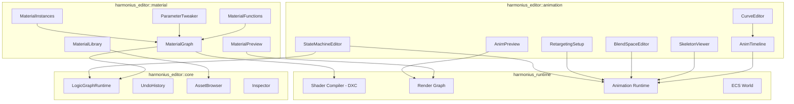
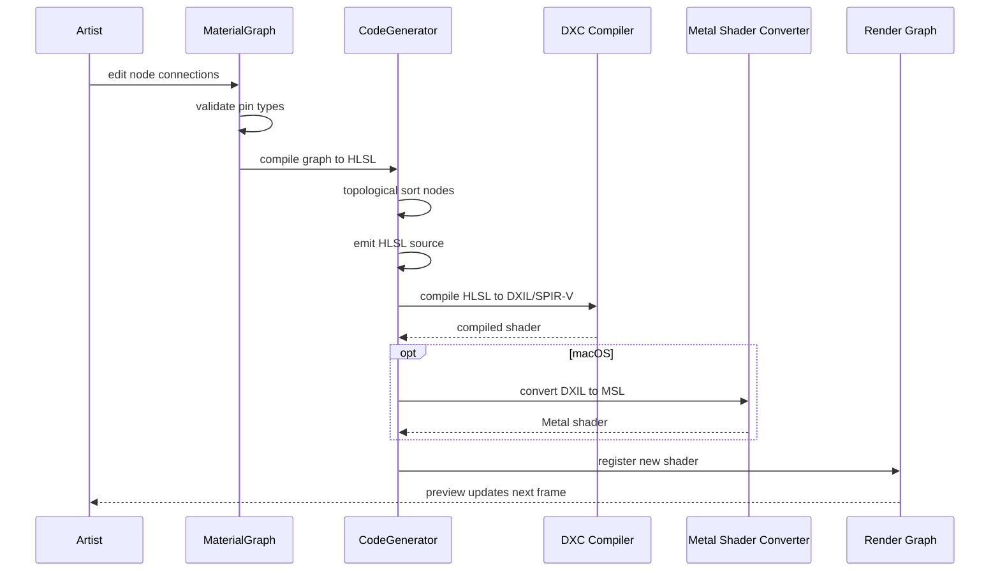
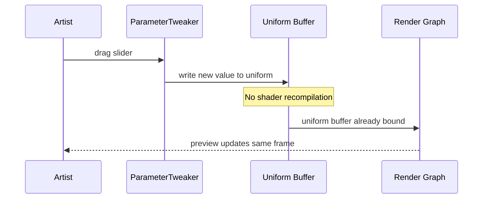
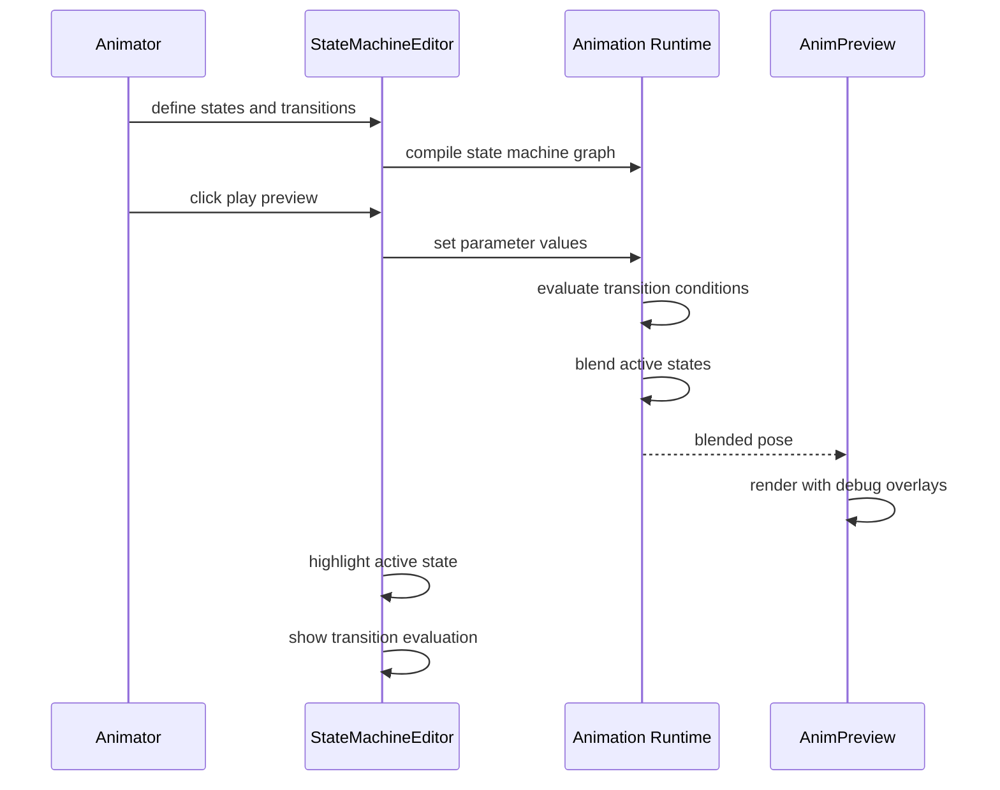
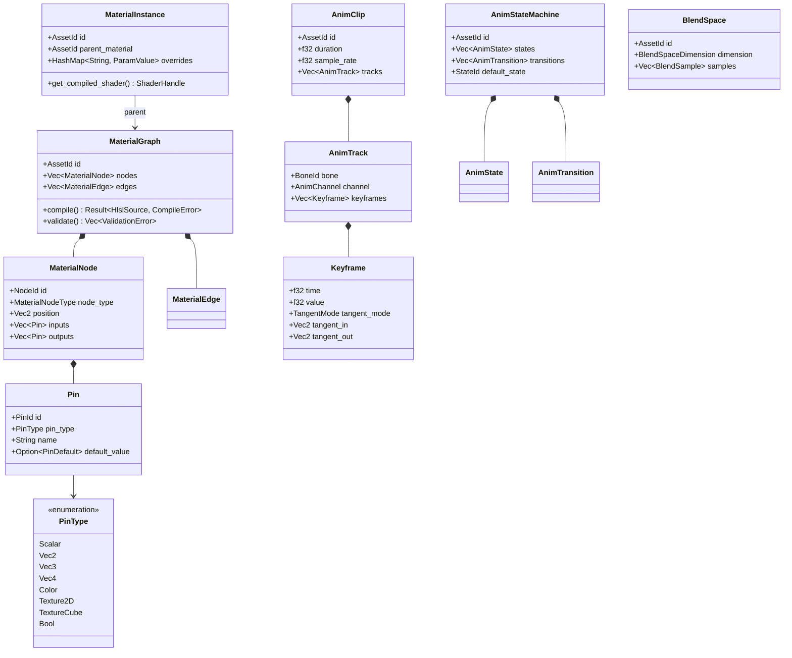

# Material and Animation Editors Design

## Requirements Trace

### Material Editor (15.3)

| Feature | Requirement | Description |
|---------|-------------|-------------|
| F-15.3.1 | R-15.3.1 | Node-based material graph with type-safe pins |
| F-15.3.2 | R-15.3.2 | Material functions and reusable subgraphs |
| F-15.3.3 | R-15.3.3 | Live 3D material preview with split-view |
| F-15.3.4 | R-15.3.4 | Shader parameter tweaking without recompilation |
| F-15.3.5 | R-15.3.5 | Material instances sharing compiled shaders |
| F-15.3.6 | R-15.3.6 | Material library with search, tags, thumbnails |

### Animation Editor (15.4)

| Feature | Requirement | Description |
|---------|-------------|-------------|
| F-15.4.1 | R-15.4.1 | Multi-track animation timeline with keyframes |
| F-15.4.2 | R-15.4.2 | Curve editor with Bezier/Hermite tangent modes |
| F-15.4.3 | R-15.4.3 | Skeleton viewer with bone selection and display modes |
| F-15.4.4 | R-15.4.4 | Animation preview with debug overlays |
| F-15.4.5 | R-15.4.5 | 1D/2D blend space editor with real-time preview |
| F-15.4.6 | R-15.4.6 | State machine editor with transition debugging |
| F-15.4.7 | R-15.4.7 | Retargeting setup with side-by-side preview |

## Overview

The material editor and animation editor are the two
primary visual authoring tools for shaders and motion.
Both are no-code, graph-based editors built on the
universal logic graph runtime. Artists author all
materials and animation logic visually.

Key principles:

- **No-code authoring.** Materials are node graphs that
  compile to HLSL. Animation state machines are visual
  graphs. No shader or script code is written.
- **100% ECS-based.** Material assets, animation clips,
  and state machines are ECS components on asset
  entities. Preview viewports render via the standard
  render graph.
- **HLSL generation.** The material graph compiles to
  HLSL, which DXC compiles to DXIL/SPIR-V. Metal
  Shader Converter produces MSL from DXIL.
- **Static dispatch.** Graph node evaluation uses
  monomorphized trait impls. No vtable dispatch in the
  hot compilation path.
- **Instant feedback.** Parameter-only changes update
  uniform buffers without shader recompilation.
  Graph topology changes trigger incremental HLSL
  regeneration.

## Architecture

### Module Boundaries



```
harmonius_editor/
├── material/
│   ├── graph.rs          # MaterialGraph, node types,
│   │                     # pin types, compilation
│   ├── functions.rs      # MaterialFunction, subgraph
│   │                     # asset management
│   ├── preview.rs        # MaterialPreview, mesh
│   │                     # selection, lighting
│   ├── tweaker.rs        # ParameterTweaker, sliders,
│   │                     # color pickers, curves
│   ├── instances.rs      # MaterialInstance, override
│   │                     # tracking, shader sharing
│   ├── library.rs        # MaterialLibrary, search,
│   │                     # tags, thumbnails
│   └── compiler.rs       # HLSL code generation from
│                         # material graph
├── animation/
│   ├── timeline.rs       # AnimTimeline, multi-track
│   │                     # keyframe display
│   ├── curve.rs          # CurveEditor, tangent modes,
│   │                     # presets, batch edit
│   ├── skeleton.rs       # SkeletonViewer, bone display
│   │                     # modes, selection
│   ├── preview.rs        # AnimPreview, debug overlays,
│   │                     # root motion trails
│   ├── blend_space.rs    # BlendSpaceEditor, 1D/2D
│   │                     # parameter spaces
│   ├── state_machine.rs  # StateMachineEditor, state/
│   │                     # transition graph
│   └── retarget.rs       # RetargetingSetup, bone
│                         # mapping, ratio adjustment
└── core/
    └── logic_graph.rs    # Universal logic graph
                          # runtime (shared)
```

### Material Graph Compilation Pipeline



### Parameter-Only Update Path



### Animation State Machine Evaluation



### Core Data Structures



## API Design

### Material Graph

```rust
/// Unique identifier for a node within a material
/// graph.
#[derive(
    Clone, Copy, Debug, PartialEq, Eq, Hash,
)]
pub struct NodeId(pub u32);

/// Unique identifier for a pin on a node.
#[derive(
    Clone, Copy, Debug, PartialEq, Eq, Hash,
)]
pub struct PinId(pub u32);

/// Pin data type for type-safe connections.
#[derive(Clone, Copy, Debug, PartialEq, Eq)]
pub enum PinType {
    Scalar,
    Vec2,
    Vec3,
    Vec4,
    Color,
    Texture2D,
    TextureCube,
    Bool,
}

/// Built-in material node types.
#[derive(Clone, Debug)]
pub enum MaterialNodeType {
    // Math
    Add,
    Subtract,
    Multiply,
    Divide,
    Lerp,
    Clamp,
    Dot,
    Cross,
    Normalize,
    Power,
    Abs,
    // Texture
    SampleTexture2D,
    SampleTextureCube,
    TextureCoordinate,
    // Parameters
    ScalarParameter { name: String, default: f32 },
    VectorParameter { name: String, default: Vec4 },
    ColorParameter { name: String, default: Vec4 },
    TextureParameter { name: String },
    BoolParameter { name: String, default: bool },
    // Output
    SurfaceOutput,
    // Subgraph
    FunctionCall { function_id: AssetId },
    // Constants
    Constant { value: f32 },
    ConstantVec { value: Vec4 },
}

/// A connection between two pins.
#[derive(Clone, Debug)]
pub struct MaterialEdge {
    pub from_node: NodeId,
    pub from_pin: PinId,
    pub to_node: NodeId,
    pub to_pin: PinId,
}

/// A node in the material graph.
#[derive(Clone, Debug)]
pub struct MaterialNode {
    pub id: NodeId,
    pub node_type: MaterialNodeType,
    pub position: Vec2,
    pub inputs: Vec<Pin>,
    pub outputs: Vec<Pin>,
}

/// Pin definition on a node.
#[derive(Clone, Debug)]
pub struct Pin {
    pub id: PinId,
    pub name: String,
    pub pin_type: PinType,
    pub default_value: Option<PinDefault>,
}

/// The material graph asset. Compiles to HLSL.
pub struct MaterialGraph {
    pub id: AssetId,
    pub nodes: Vec<MaterialNode>,
    pub edges: Vec<MaterialEdge>,
}

impl MaterialGraph {
    pub fn new() -> Self;

    /// Add a node and return its ID.
    pub fn add_node(
        &mut self,
        node_type: MaterialNodeType,
        position: Vec2,
    ) -> NodeId;

    /// Remove a node and all its edges.
    pub fn remove_node(&mut self, id: NodeId);

    /// Connect two pins. Returns an error if the
    /// pin types are incompatible.
    pub fn connect(
        &mut self,
        from_node: NodeId,
        from_pin: PinId,
        to_node: NodeId,
        to_pin: PinId,
    ) -> Result<(), PinTypeError>;

    /// Disconnect an edge.
    pub fn disconnect(
        &mut self,
        edge: &MaterialEdge,
    );

    /// Validate all connections and graph
    /// structure.
    pub fn validate(
        &self,
    ) -> Vec<ValidationError>;

    /// Compile the graph to HLSL source code.
    pub fn compile(
        &self,
    ) -> Result<HlslSource, CompileError>;
}
```

### HLSL Code Generator

```rust
/// HLSL source output from material graph
/// compilation.
pub struct HlslSource {
    pub vertex_shader: String,
    pub pixel_shader: String,
    pub parameters: Vec<ShaderParameter>,
}

/// A shader parameter exposed to the runtime.
#[derive(Clone, Debug)]
pub struct ShaderParameter {
    pub name: String,
    pub param_type: PinType,
    pub default_value: ParamValue,
    pub offset_in_buffer: u32,
}

/// Compiles material graphs to HLSL.
pub struct MaterialCompiler { /* ... */ }

impl MaterialCompiler {
    pub fn new() -> Self;

    /// Compile a material graph to HLSL source.
    /// Performs topological sort, dead code
    /// elimination, and constant folding.
    pub fn compile(
        &self,
        graph: &MaterialGraph,
    ) -> Result<HlslSource, CompileError>;

    /// Compile HLSL to platform shader bytecode
    /// via DXC. On macOS, also converts DXIL to
    /// MSL via Metal Shader Converter.
    pub async fn compile_to_bytecode(
        &self,
        hlsl: &HlslSource,
    ) -> Result<CompiledShader, CompileError>;
}

pub struct CompiledShader {
    /// DXIL bytecode (Windows, Xbox).
    pub dxil: Option<Vec<u8>>,
    /// SPIR-V bytecode (Vulkan, Linux).
    pub spirv: Option<Vec<u8>>,
    /// MSL source (macOS, iOS).
    pub msl: Option<String>,
}
```

### Material Functions (Subgraphs)

```rust
/// A reusable subgraph encapsulating a common
/// material pattern (e.g., triplanar mapping).
pub struct MaterialFunction {
    pub id: AssetId,
    pub name: String,
    pub graph: MaterialGraph,
    pub input_pins: Vec<FunctionPin>,
    pub output_pins: Vec<FunctionPin>,
}

/// Input or output pin exposed on a function
/// boundary.
#[derive(Clone, Debug)]
pub struct FunctionPin {
    pub name: String,
    pub pin_type: PinType,
    pub default_value: Option<PinDefault>,
}

impl MaterialFunction {
    /// Create from an existing graph by marking
    /// boundary pins.
    pub fn create(
        name: String,
        graph: MaterialGraph,
        inputs: Vec<FunctionPin>,
        outputs: Vec<FunctionPin>,
    ) -> Self;

    /// Inline this function into a parent graph
    /// at the given call site node.
    pub fn inline_into(
        &self,
        parent: &mut MaterialGraph,
        call_node: NodeId,
    );
}
```

### Live Material Preview

```rust
/// Mesh type for material preview.
#[derive(Clone, Copy, Debug, PartialEq, Eq)]
pub enum PreviewMesh {
    Sphere,
    Cube,
    Plane,
    Cylinder,
    Custom(AssetId),
}

/// Live 3D preview of a material.
pub struct MaterialPreview { /* ... */ }

impl MaterialPreview {
    pub fn new() -> Self;

    /// Set the preview mesh shape.
    pub fn set_mesh(&mut self, mesh: PreviewMesh);

    /// Set the preview lighting environment.
    pub fn set_lighting(
        &mut self,
        environment: PreviewLighting,
    );

    /// Enable split-view comparison with a second
    /// material.
    pub fn set_comparison(
        &mut self,
        other: Option<AssetId>,
    );

    /// Force a preview refresh after a graph change.
    pub fn refresh(&mut self, graph: &MaterialGraph);

    /// Update uniform values for parameter-only
    /// changes (no recompile needed).
    pub fn update_uniforms(
        &mut self,
        params: &[(String, ParamValue)],
    );
}

/// Preview lighting configuration.
#[derive(Clone, Debug)]
pub struct PreviewLighting {
    pub direction: Vec3,
    pub color: Vec3,
    pub intensity: f32,
    pub ambient: Vec3,
}
```

### Shader Parameter Tweaking

```rust
/// Runtime parameter value for uniform buffer
/// updates.
#[derive(Clone, Debug)]
pub enum ParamValue {
    Scalar(f32),
    Vec2(Vec2),
    Vec3(Vec3),
    Vec4(Vec4),
    Color(Vec4),
    Bool(bool),
    Texture(AssetId),
}

/// Inspector panel for tweaking material parameters
/// without editing the node graph.
pub struct ParameterTweaker { /* ... */ }

impl ParameterTweaker {
    pub fn new() -> Self;

    /// Bind to a material graph to reflect its
    /// parameters.
    pub fn bind(
        &mut self,
        graph: &MaterialGraph,
    );

    /// Get the current value of a parameter.
    pub fn get_value(
        &self,
        name: &str,
    ) -> Option<&ParamValue>;

    /// Set a parameter value. Updates the uniform
    /// buffer without shader recompilation.
    pub fn set_value(
        &mut self,
        name: &str,
        value: ParamValue,
    );

    /// Get all parameters with their current values.
    pub fn all_parameters(
        &self,
    ) -> &[(String, ParamValue)];
}
```

### Material Instances

```rust
/// A lightweight material variation that overrides
/// parameters of a parent material without
/// duplicating the shader.
pub struct MaterialInstance {
    pub id: AssetId,
    pub parent_material: AssetId,
    overrides: HashMap<String, ParamValue>,
}

impl MaterialInstance {
    pub fn new(parent: AssetId) -> Self;

    /// Override a parameter value.
    pub fn set_override(
        &mut self,
        name: String,
        value: ParamValue,
    );

    /// Remove an override, reverting to the parent
    /// value.
    pub fn remove_override(&mut self, name: &str);

    /// Check if a parameter is overridden.
    pub fn has_override(&self, name: &str) -> bool;

    /// Get the effective value (override or parent
    /// default).
    pub fn effective_value(
        &self,
        name: &str,
        parent: &MaterialGraph,
    ) -> Option<ParamValue>;

    /// All instances share the parent's compiled
    /// shader. Only uniform buffer differs.
    pub fn get_shader_handle(
        &self,
        parent: &CompiledShader,
    ) -> ShaderHandle;
}
```

### Material Library

```rust
/// Tag for categorizing materials.
#[derive(Clone, Debug, PartialEq, Eq, Hash)]
pub struct MaterialTag(pub String);

/// Search filter for the material library.
#[derive(Clone, Debug, Default)]
pub struct MaterialFilter {
    pub search_text: Option<String>,
    pub tags: Vec<MaterialTag>,
    pub favorites_only: bool,
}

/// Searchable, filterable library of all project
/// materials and instances.
pub struct MaterialLibrary { /* ... */ }

impl MaterialLibrary {
    pub fn new() -> Self;

    /// Search materials matching a filter.
    pub fn search(
        &self,
        filter: &MaterialFilter,
    ) -> Vec<MaterialEntry>;

    /// Get thumbnail preview for a material.
    pub fn get_thumbnail(
        &self,
        id: AssetId,
    ) -> Option<TextureHandle>;

    /// Get all assets referencing a material.
    pub fn get_usage(
        &self,
        id: AssetId,
    ) -> Vec<AssetId>;

    /// Toggle favorite status.
    pub fn set_favorite(
        &mut self,
        id: AssetId,
        favorite: bool,
    );

    /// Add a tag to a material.
    pub fn add_tag(
        &mut self,
        id: AssetId,
        tag: MaterialTag,
    );

    /// Get instance count for a parent material.
    pub fn instance_count(
        &self,
        parent_id: AssetId,
    ) -> u32;
}

/// Entry in a library search result.
#[derive(Clone, Debug)]
pub struct MaterialEntry {
    pub id: AssetId,
    pub name: String,
    pub tags: Vec<MaterialTag>,
    pub is_instance: bool,
    pub parent: Option<AssetId>,
    pub is_favorite: bool,
}
```

### Animation Timeline

```rust
/// Animation channel type.
#[derive(Clone, Copy, Debug, PartialEq, Eq)]
pub enum AnimChannel {
    TranslationX,
    TranslationY,
    TranslationZ,
    RotationX,
    RotationY,
    RotationZ,
    RotationW,
    ScaleX,
    ScaleY,
    ScaleZ,
    Custom(u32),
}

/// A single keyframe on an animation track.
#[derive(Clone, Debug)]
pub struct Keyframe {
    pub time: f32,
    pub value: f32,
    pub tangent_mode: TangentMode,
    pub tangent_in: Vec2,
    pub tangent_out: Vec2,
}

/// Tangent interpolation mode.
#[derive(Clone, Copy, Debug, PartialEq, Eq)]
pub enum TangentMode {
    Bezier,
    Hermite,
    Linear,
    Stepped,
    Auto,
}

/// An animation track for a single bone/channel.
#[derive(Clone, Debug)]
pub struct AnimTrack {
    pub bone: BoneId,
    pub channel: AnimChannel,
    pub keyframes: Vec<Keyframe>,
}

/// An animation clip stored as an asset.
pub struct AnimClip {
    pub id: AssetId,
    pub name: String,
    pub duration: f32,
    pub sample_rate: f32,
    pub tracks: Vec<AnimTrack>,
}

/// Multi-track animation timeline editor.
pub struct AnimTimeline { /* ... */ }

impl AnimTimeline {
    pub fn new() -> Self;

    /// Load an animation clip for editing.
    pub fn load_clip(&mut self, clip: &AnimClip);

    /// Set the playback cursor position.
    pub fn set_time(&mut self, time: f32);

    /// Get the current playback time.
    pub fn current_time(&self) -> f32;

    /// Set playback speed multiplier.
    pub fn set_speed(&mut self, speed: f32);

    /// Toggle playback looping.
    pub fn set_looping(&mut self, looping: bool);

    /// Start playback.
    pub fn play(&mut self);

    /// Pause playback.
    pub fn pause(&mut self);

    /// Step forward one frame.
    pub fn step_forward(&mut self);

    /// Step backward one frame.
    pub fn step_backward(&mut self);

    /// Add a keyframe at the current time.
    pub fn add_keyframe(
        &mut self,
        track: usize,
        value: f32,
    );

    /// Move a keyframe to a new time, snapping to
    /// frame boundaries.
    pub fn move_keyframe(
        &mut self,
        track: usize,
        key_index: usize,
        new_time: f32,
    );

    /// Copy selected keyframes.
    pub fn copy_keyframes(
        &mut self,
        selection: &KeyframeSelection,
    );

    /// Paste copied keyframes at the current time.
    pub fn paste_keyframes(&mut self);
}
```

### Curve Editor

```rust
/// Curve preset for quick tangent setup.
#[derive(Clone, Copy, Debug, PartialEq, Eq)]
pub enum CurvePreset {
    EaseIn,
    EaseOut,
    EaseInOut,
    Linear,
    Stepped,
}

/// Editor for animation curves with tangent
/// manipulation.
pub struct CurveEditor { /* ... */ }

impl CurveEditor {
    pub fn new() -> Self;

    /// Set which channels are visible.
    pub fn set_channel_visibility(
        &mut self,
        channel: AnimChannel,
        visible: bool,
    );

    /// Apply a curve preset to selected keyframes.
    pub fn apply_preset(
        &mut self,
        selection: &KeyframeSelection,
        preset: CurvePreset,
    );

    /// Set tangent handles on a keyframe.
    pub fn set_tangents(
        &mut self,
        track: usize,
        key_index: usize,
        tangent_in: Vec2,
        tangent_out: Vec2,
    );

    /// Auto-compute tangents for smooth curves.
    pub fn auto_tangent(
        &mut self,
        track: usize,
        key_index: usize,
    );

    /// Box-select keyframes for batch editing.
    pub fn box_select(
        &mut self,
        rect: Rect,
    ) -> KeyframeSelection;

    /// Evaluate the curve at a given time.
    pub fn evaluate(
        &self,
        track: usize,
        time: f32,
    ) -> f32;
}
```

### Skeleton Viewer

```rust
/// Bone display mode in the skeleton viewer.
#[derive(Clone, Copy, Debug, PartialEq, Eq)]
pub enum BoneDisplayMode {
    Octahedral,
    Stick,
    Axes,
}

/// 3D skeleton visualization overlaid on mesh.
pub struct SkeletonViewer { /* ... */ }

impl SkeletonViewer {
    pub fn new() -> Self;

    /// Set the display mode for bone rendering.
    pub fn set_display_mode(
        &mut self,
        mode: BoneDisplayMode,
    );

    /// Select a bone. Highlights children,
    /// constraints, and IK chains.
    pub fn select_bone(&mut self, bone: BoneId);

    /// Get the selected bone and its child chain.
    pub fn selected_chain(
        &self,
    ) -> Option<Vec<BoneId>>;

    /// Overlay a second skeleton for comparison.
    pub fn set_comparison_skeleton(
        &mut self,
        skeleton: Option<AssetId>,
    );

    /// Toggle constraint visualization.
    pub fn set_constraints_visible(
        &mut self,
        visible: bool,
    );
}
```

### Animation Preview

```rust
/// Debug overlay options for animation preview.
#[derive(Clone, Debug)]
pub struct AnimDebugOverlays {
    pub velocity_vectors: bool,
    pub contact_points: bool,
    pub bone_trails: bool,
    pub root_motion_trajectory: bool,
}

/// Dedicated animation preview viewport.
pub struct AnimPreview { /* ... */ }

impl AnimPreview {
    pub fn new() -> Self;

    /// Set the character mesh for preview.
    pub fn set_character(&mut self, mesh: AssetId);

    /// Set the ground plane visibility and height.
    pub fn set_ground_plane(
        &mut self,
        visible: bool,
        height: f32,
    );

    /// Configure preview lighting.
    pub fn set_lighting(
        &mut self,
        lighting: PreviewLighting,
    );

    /// Set camera orbit parameters.
    pub fn set_camera_orbit(
        &mut self,
        yaw: f32,
        pitch: f32,
        distance: f32,
    );

    /// Toggle debug overlays.
    pub fn set_overlays(
        &mut self,
        overlays: AnimDebugOverlays,
    );

    /// Preview a blend result of multiple clips.
    pub fn preview_blend(
        &mut self,
        clips: &[(AssetId, f32)],
    );

    /// Toggle between game quality and debug
    /// rendering.
    pub fn set_game_quality(&mut self, enabled: bool);
}
```

### Blend Space Editor

```rust
/// Blend space dimensionality.
#[derive(Clone, Copy, Debug, PartialEq, Eq)]
pub enum BlendSpaceDimension {
    OneD,
    TwoD,
}

/// A sample point in the blend space.
#[derive(Clone, Debug)]
pub struct BlendSample {
    pub clip: AssetId,
    pub position: Vec2,
}

/// Blend space stored as an asset.
pub struct BlendSpace {
    pub id: AssetId,
    pub dimension: BlendSpaceDimension,
    pub samples: Vec<BlendSample>,
    pub axis_x_name: String,
    pub axis_y_name: String,
    pub axis_x_range: (f32, f32),
    pub axis_y_range: (f32, f32),
}

/// Visual editor for 1D/2D blend spaces.
pub struct BlendSpaceEditor { /* ... */ }

impl BlendSpaceEditor {
    pub fn new() -> Self;

    /// Load a blend space for editing.
    pub fn load(&mut self, space: &BlendSpace);

    /// Add a sample at a parameter-space position.
    pub fn add_sample(
        &mut self,
        clip: AssetId,
        position: Vec2,
    );

    /// Move a sample to a new position.
    pub fn move_sample(
        &mut self,
        index: usize,
        new_position: Vec2,
    );

    /// Remove a sample.
    pub fn remove_sample(&mut self, index: usize);

    /// Set the crosshair position for real-time
    /// blend preview.
    pub fn set_crosshair(&mut self, position: Vec2);

    /// Get the interpolation weights at the
    /// crosshair position.
    pub fn get_blend_weights(
        &self,
    ) -> Vec<(usize, f32)>;

    /// Evaluate the blended pose at the current
    /// crosshair position.
    pub fn evaluate_blend(
        &self,
    ) -> Vec<BoneTransform>;
}
```

### State Machine Editor

```rust
/// Unique identifier for a state in the machine.
#[derive(
    Clone, Copy, Debug, PartialEq, Eq, Hash,
)]
pub struct StateId(pub u32);

/// A state in the animation state machine.
#[derive(Clone, Debug)]
pub struct AnimState {
    pub id: StateId,
    pub name: String,
    pub source: AnimStateSource,
    pub position: Vec2,
}

/// Source animation for a state.
#[derive(Clone, Debug)]
pub enum AnimStateSource {
    Clip(AssetId),
    BlendSpace(AssetId),
}

/// A transition between two states.
#[derive(Clone, Debug)]
pub struct AnimTransition {
    pub from_state: StateId,
    pub to_state: StateId,
    pub blend_duration: f32,
    pub conditions: Vec<TransitionCondition>,
    pub can_interrupt: bool,
}

/// Condition for a transition to fire.
#[derive(Clone, Debug)]
pub struct TransitionCondition {
    pub parameter: String,
    pub comparison: Comparison,
    pub threshold: f32,
}

/// Comparison operator for transition conditions.
#[derive(Clone, Copy, Debug, PartialEq, Eq)]
pub enum Comparison {
    GreaterThan,
    LessThan,
    Equal,
    NotEqual,
}

/// Visual node-graph editor for animation state
/// machines.
pub struct StateMachineEditor { /* ... */ }

impl StateMachineEditor {
    pub fn new() -> Self;

    /// Add a state to the machine.
    pub fn add_state(
        &mut self,
        name: String,
        source: AnimStateSource,
        position: Vec2,
    ) -> StateId;

    /// Remove a state and all its transitions.
    pub fn remove_state(&mut self, id: StateId);

    /// Add a transition between two states.
    pub fn add_transition(
        &mut self,
        from: StateId,
        to: StateId,
        blend_duration: f32,
        conditions: Vec<TransitionCondition>,
    );

    /// Set the default entry state.
    pub fn set_default_state(
        &mut self,
        id: StateId,
    );

    /// Validate the state machine: all states
    /// reachable, no infinite loops.
    pub fn validate(
        &self,
    ) -> Vec<StateMachineError>;

    /// Get the currently active state during
    /// preview (for highlighting).
    pub fn active_state(&self) -> Option<StateId>;

    /// Get the transition currently being
    /// evaluated (for debugging display).
    pub fn evaluating_transition(
        &self,
    ) -> Option<(StateId, StateId)>;
}
```

### Retargeting Setup

```rust
/// Mapping between bones of source and target
/// skeletons.
#[derive(Clone, Debug)]
pub struct BoneMapping {
    pub source_bone: BoneId,
    pub target_bone: BoneId,
    pub length_ratio: f32,
}

/// Retargeting configuration between two
/// skeleton assets.
pub struct RetargetConfig {
    pub source_skeleton: AssetId,
    pub target_skeleton: AssetId,
    pub bone_mappings: Vec<BoneMapping>,
}

/// Editor for configuring skeleton retargeting.
pub struct RetargetingSetup { /* ... */ }

impl RetargetingSetup {
    pub fn new() -> Self;

    /// Set source and target skeletons for
    /// side-by-side display.
    pub fn set_skeletons(
        &mut self,
        source: AssetId,
        target: AssetId,
    );

    /// Map a source bone to a target bone.
    pub fn map_bone(
        &mut self,
        source: BoneId,
        target: BoneId,
    );

    /// Auto-detect bone mappings by name matching.
    pub fn auto_map(&mut self);

    /// Adjust limb length ratio for a mapping.
    pub fn set_length_ratio(
        &mut self,
        mapping_index: usize,
        ratio: f32,
    );

    /// Preview a retargeted animation in real time.
    pub fn preview_retarget(
        &self,
        clip: AssetId,
    ) -> Vec<BoneTransform>;

    /// Save the retarget configuration as an asset.
    pub async fn save(
        &self,
        reactor: &IoReactor,
    ) -> Result<AssetId, AssetError>;
}
```

### Error Types

```rust
pub enum PinTypeError {
    Incompatible {
        from: PinType,
        to: PinType,
    },
    AlreadyConnected {
        pin: PinId,
    },
}

pub enum CompileError {
    DisconnectedOutputs {
        nodes: Vec<NodeId>,
    },
    CycleDetected {
        cycle: Vec<NodeId>,
    },
    InvalidNodeConfig {
        node: NodeId,
        reason: String,
    },
    DxcError {
        message: String,
    },
    MetalShaderConverterError {
        message: String,
    },
}

pub enum ValidationError {
    DisconnectedInput {
        node: NodeId,
        pin: PinId,
    },
    UnusedNode {
        node: NodeId,
    },
    TypeMismatch {
        edge: MaterialEdge,
    },
}

pub enum StateMachineError {
    UnreachableState {
        state: StateId,
    },
    NoDefaultState,
    InfiniteLoop {
        states: Vec<StateId>,
    },
    MissingConditions {
        from: StateId,
        to: StateId,
    },
}
```

## Data Flow

### Material Authoring Pipeline

1. Artist adds nodes to the material graph via the
   visual editor.
2. On each connection change, `MaterialGraph::validate()`
   checks type safety. Invalid connections are rejected
   at edit time (US-15.3.1.10).
3. On save or preview refresh,
   `MaterialCompiler::compile()` performs topological
   sort, dead code elimination, and constant folding,
   then emits HLSL.
4. DXC compiles HLSL to DXIL (Windows) and SPIR-V
   (Vulkan). On macOS, Metal Shader Converter produces
   MSL from DXIL.
5. The compiled shader is registered with the render
   graph. The preview updates next frame.
6. Parameter-only changes (slider drags) write directly
   to the uniform buffer -- no recompilation.

### Material Instance Flow

1. Artist creates a `MaterialInstance` from a parent
   material.
2. The instance stores only overridden parameter values.
3. At render time, the instance uses the parent's
   compiled shader handle. Only the uniform buffer
   differs.
4. 100 instances share one compiled shader program
   (US-15.3.5.5).

### Animation Authoring Pipeline

1. Animator opens a clip in the timeline editor.
2. Keyframes are edited with tangent handles in the
   curve editor.
3. Blend spaces position clips in parameter space.
4. State machines wire states (clips or blend spaces)
   with conditional transitions.
5. The animation preview renders the character with
   the current state machine evaluation, highlighting
   the active state and transition.

### Retargeting Pipeline

1. Tech artist sets source and target skeletons in
   the side-by-side viewer.
2. `auto_map()` matches bones by name convention.
3. Manual adjustments correct mismatches and set limb
   length ratios.
4. Real-time preview shows the retargeted animation
   on the target rig.
5. The saved `RetargetConfig` enables sharing
   animation libraries across the character roster
   (US-15.4.7.5).

## Platform Considerations

| Feature | Windows | macOS | Linux |
|---------|---------|-------|-------|
| HLSL compilation | DXC via cxx.rs | DXC via cxx.rs | DXC via cxx.rs |
| DXIL output | Native | Via MSC to MSL | SPIR-V only |
| MSL output | N/A | Metal Shader Converter | N/A |
| SPIR-V output | DXC SPIR-V target | DXC SPIR-V target | DXC SPIR-V target |
| Shader hot-reload | Vulkan/D3D12 pipeline swap | Metal pipeline swap | Vulkan pipeline swap |
| Preview viewport | Render graph compute | Render graph compute | Render graph compute |
| Asset I/O | IOCP via IoReactor | GCD Dispatch IO | io_uring |

All shader compilation uses DXC accessed through cxx.rs
C++ interop. The material compiler is platform-agnostic;
only the final bytecode format varies by target.

## Test Plan

### Unit Tests

| Test | Req | Description |
|------|-----|-------------|
| `test_pin_type_validation` | R-15.3.1 | Connect color to scalar, verify PinTypeError returned. |
| `test_graph_cycle_detection` | R-15.3.1 | Create cycle in graph, verify compile returns CycleDetected. |
| `test_graph_compile_simple` | R-15.3.1 | Compile texture sample to output, verify valid HLSL. |
| `test_dead_code_elimination` | R-15.3.1 | Add unused nodes, verify not present in HLSL output. |
| `test_function_inline` | R-15.3.2 | Inline triplanar function, verify output matches manual graph. |
| `test_function_propagation` | R-15.3.2 | Update function, verify all referencing materials recompile. |
| `test_preview_update_one_frame` | R-15.3.3 | Change parameter, verify preview updates within 16 ms. |
| `test_param_no_recompile` | R-15.3.4 | Change scalar param, verify no DXC invocation. |
| `test_instance_shader_sharing` | R-15.3.5 | Create 100 instances, verify all share one ShaderHandle. |
| `test_instance_override` | R-15.3.5 | Override color on instance, verify parent unchanged. |
| `test_library_search_by_tag` | R-15.3.6 | Add tag, search by tag, verify only matching results. |
| `test_library_usage_tracking` | R-15.3.6 | Assign material, verify usage list includes referencing asset. |
| `test_timeline_keyframe_snap` | R-15.4.1 | Move keyframe, verify snaps to frame boundary. |
| `test_timeline_scrub_300bones` | R-15.4.1 | Scrub 300-bone clip, verify above 30 FPS. |
| `test_curve_bezier_continuity` | R-15.4.2 | Create Bezier curve, verify C1 continuity at tangent joins. |
| `test_curve_preset_accuracy` | R-15.4.2 | Apply ease-in preset, verify matches reference curve. |
| `test_skeleton_child_chain` | R-15.4.3 | Select bone, verify correct children highlighted. |
| `test_preview_root_motion` | R-15.4.4 | Play root motion clip, verify trajectory distance. |
| `test_blend_space_center` | R-15.4.5 | Crosshair at center of 2D space, verify equal corner weights. |
| `test_blend_space_1d` | R-15.4.5 | 1D blend at 0.5, verify 50/50 blend of neighbors. |
| `test_state_machine_reachability` | R-15.4.6 | Add unreachable state, verify validation error. |
| `test_state_machine_transition` | R-15.4.6 | Set parameter above threshold, verify transition fires. |
| `test_retarget_bone_mapping` | R-15.4.7 | Map source to target bones, verify pose preserved. |
| `test_retarget_foot_contact` | R-15.4.7 | Retarget walk, verify foot contacts within tolerance. |

### Integration Tests

| Test | Req | Description |
|------|-----|-------------|
| `test_material_compile_d3d12` | R-15.3.1 | Full pipeline: graph to HLSL to DXIL, render on D3D12. |
| `test_material_compile_vulkan` | R-15.3.1 | Full pipeline: graph to HLSL to SPIR-V, render on Vulkan. |
| `test_material_compile_metal` | R-15.3.1 | Full pipeline: graph to HLSL to DXIL to MSL, render on Metal. |
| `test_material_hot_reload` | R-15.3.3 | Change graph, verify viewport updates without restart. |
| `test_anim_state_machine_play` | R-15.4.6 | Play state machine, verify correct state transitions. |
| `test_retarget_cross_rig` | R-15.4.7 | Retarget humanoid anim to creature rig, verify no self-intersect. |

### Benchmarks

| Benchmark | Target | Source |
|-----------|--------|--------|
| Material graph compile (50 nodes) | < 100 ms | US-15.3.1.7 |
| DXC HLSL to DXIL | < 500 ms | US-15.3.1.7 |
| Parameter update latency | < 1 ms (uniform write only) | US-15.3.4.4 |
| Preview refresh | < 16 ms | US-15.3.3.5 |
| Instance memory per variation | < 256 bytes (uniform buffer only) | US-15.3.5.2 |
| Timeline scrub at 300 bones | > 30 FPS | US-15.4.1.8 |
| Blend space evaluation | < 0.5 ms | US-15.4.5.4 |
| State machine step | < 0.1 ms per evaluation | US-15.4.6.7 |

## Open Questions

1. **HLSL optimization level** -- DXC supports multiple
   optimization levels (-O0 to -O3). Higher levels
   produce faster shaders but slower compile times.
   Determine the default for preview vs. shipping
   builds.
2. **Material graph serialization** -- RON format for
   human readability and version control, or binary for
   fast loading. The constraints specify mixed
   textual+binary; determine which parts are textual.
3. **Blend space triangulation** -- Delaunay
   triangulation vs. Voronoi for 2D blend space
   interpolation regions. Delaunay is simpler but may
   produce thin triangles at edge samples.
4. **State machine interruption priority** -- How to
   handle multiple competing interruptions in the same
   frame. Priority ordering vs. first-match vs. highest
   blend weight.
5. **Retarget hip correction** -- Retargeting between
   rigs with different hip heights requires ground
   contact correction. Evaluate IK-based foot planting
   vs. pelvis offset.
6. **Material function versioning** -- When a shared
   function changes signature (add/remove pins), how to
   handle materials with stale references. Automated
   migration vs. manual fixup.
